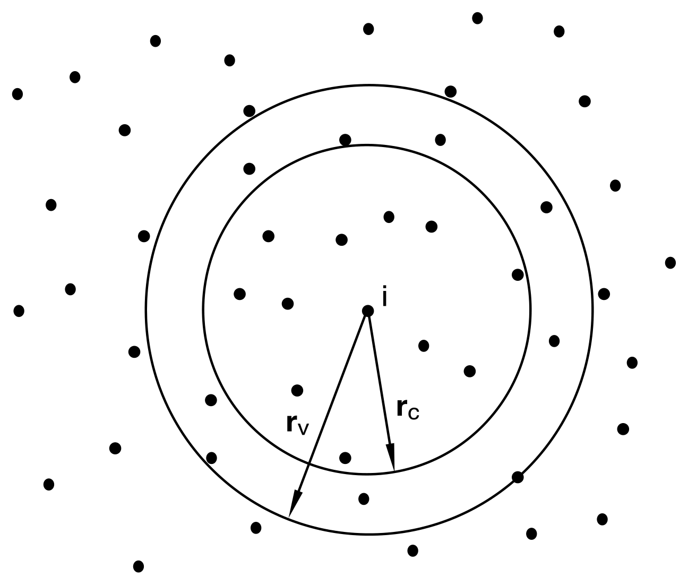
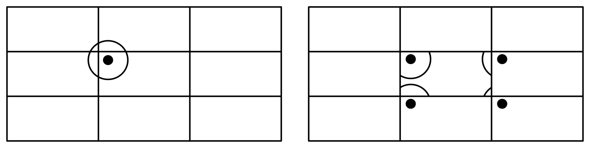
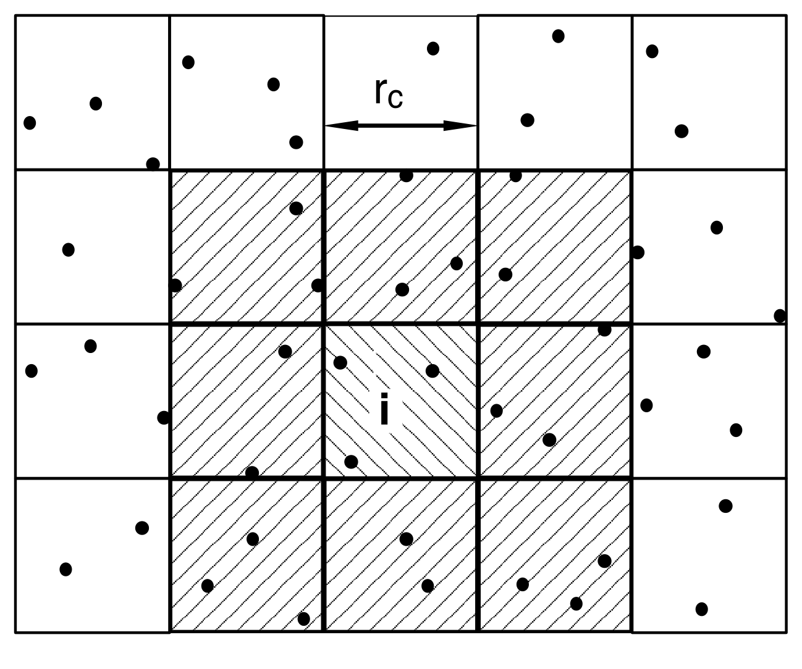
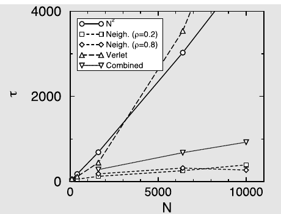

# 节省 CPU 时间

能量或力的计算是几乎所有分子动力学和 Monte Carlo 模拟中最耗时的部分。如果我们考虑一个具有对可加相互作用的模型系统（许多分子模拟都是如此），我们必须考虑所有相邻粒子对粒子$i$力的贡献。如果我们不截断相互作用，这意味着对于一个$N$个粒子的系统，我们必须计算$N(N-1)/2$个对相互作用。即使我们确实截断了势，我们仍然需要计算所有$N(N-1)/2$个对距离来确定哪些粒子对可以相互作用。这意味着，如果我们不使用任何技巧，评估能量所需的时间按$N^2$标度。存在一些有效技术可以加速短程和长程相互作用的评估，使得计算时间按$N^{3/2}$而非$N^2$标度。长程相互作用的技术已在第 11 章中讨论；这里我们讨论一些用于短程相互作用的技术。这些技术是：

1. Verlet 列表
1. 格子（或链表）列表
1. Verlet 列表和格子列表的组合

## Verlet 列表

如果我们模拟一个大系统并使用小于模拟盒子的截断半径，许多粒子对粒子$i$的能量没有贡献。因此，将不参与相互作用的粒子排除在耗时的能量计算之外是有利的。Verlet [[14]](references.md#ref-14)开发了一种簿记技术，通常被称为 Verlet 列表或邻居列表，如图 I.1 所示。在这种方法中，引入第二个截断半径$r_v > r_c$，在我们计算相互作用之前，制作一个列表（Verlet 列表），列出粒子$i$在半径$r_v$内的所有粒子。在后续的相互作用计算中，只需考虑该列表中的粒子。到目前为止，我们还没有节省任何 CPU 时间。当我们在下一次计算相互作用时节省时间；如果粒子的最大位移小于$r_v - r_c$，那么我们只需考虑粒子$i$的 Verlet 列表中的粒子。这是一个$N$阶的计算。一旦某个粒子的位移超过$r_v - r_c$，我们就必须更新 Verlet 列表。后者的操作是$N^2$阶的，虽然这一步不是每次计算相互作用时都执行，但对于非常大的粒子数它将占主导。



*图 I.1　Verlet 列表：粒子 $i$ 与截断半径 $r_c$ 内的粒子相互作用；Verlet 列表包含半径 $r_v > r_c$ 的球体内的所有粒子。*

Verlet 列表可以同时用于分子动力学和 Monte Carlo 模拟。然而，在实现上有一些小差异。例如，在分子动力学模拟中，所有粒子的力是同时计算的。因此，只要相互作用$i$-$j$在粒子$i$或粒子$j$的列表中被考虑，每个粒子只需有半数粒子的 Verlet 列表就足够了。在 Monte Carlo 模拟中，每个粒子是单独考虑的。因此，为每个粒子提供完整的列表更为方便。算法 29 展示了在 Monte Carlo 模拟中使用 Verlet 列表的方法。

Bekker 等人[[725]](references.md#ref-725) 为具有周期性边界条件的系统开发了一种优雅的 Verlet 列表扩展。要计算粒子$i$的力或势能，必须定位粒子$j$的 Verlet 列表中粒子的最近镜像（见算法 30）。Bekker 等人证明，在 MD 或 MC 模拟的内循环中可以避免这种最近镜像计算。

在周期性系统中，粒子$i$上的总力可以写为

$$
F_i = \sum_{j=1}^{N} \sum_{k=-13}^{13} F_i^{(j,k)}
$$

其中撇号表示求和是在中心盒子（$k=0$）或其 26 个周期镜像中粒子$j$的最近镜像上进行的。这里$(j.k)$表示粒子$j$在盒子$k$中的周期镜像。盒子$k$由整数$n_x, n_y, n_z$定义：

$$
k = 9n_x + 3n_y + n_z
$$

以及

$$
t_k = n_x L_x + n_y L_y + n_z L_z
$$

其中$t_k$是从中心盒子到其周期镜像$k$的平移向量。中心盒子中的粒子表示为$(i.0) = i$。使用这种记法，对于粒子$i$和$j$之间的相互作用，我们可以写出

$$
F_i^{(j,k)} = F_{(i.-k)j} = -F_{(j.k)i} = -F_j^{(i.-k)}
$$

我们可以写为

$$
F_i = \sum_{j=1}^{N} \sum_{k=-13}^{13} F_{(i.k)j}
$$

这个看似平凡的结果的重要性在于，求和是对中心盒子中所有粒子$j$与粒子$i$的最近镜像进行的。两种方法之间的区别如图 I.2 所示。



*图 I.2　Verlet 列表：（左）常规做法，每个粒子拥有一个 Verlet 列表；（右）Bekker 等人的做法，粒子的每个周期镜像各自拥有一个 Verlet 列表，其中只包含中心盒中的粒子。*

这种方法通过对粒子$i$的每个周期镜像使用不同的 Verlet 列表来实现。这些列表只包含与粒子$i$相互作用且在中心盒子中的粒子。如果使用这些列表，在计算力或能量时不需要使用最近镜像操作。文献[[725]](references.md#ref-725) 表明，使用这些列表可以将 MD 模拟加速 1.5 倍。此外，Bekker 等人还证明，类似的技巧可以用于将维里（压力）的计算移出内循环。

**算法 29　在 MC 试探移动中使用 Verlet 列表**

```
function mcmove_verlet
o=int(R*npart)+1         % 随机选择一个粒子
if |x(o)-xv(o)| > (rv-rc)/2 then
    new_vlist             % 检查是否需要更新列表
endif
eno = en_vlist(o,x(o))   % 旧构型能量
xn=x(o)+(R-0.5)*delx     % 随机位移
if |xn-xv(o)| > (rv-rc)/2 then
    new_vlist             % 检查是否需要更新列表
endif
enn = en_vlist(o,xn)     % 新构型能量
arg=exp(-beta*(enn-eno))
if R < arg then
    x(o)=xn               % 接受：用xn替换x(o)
endif
end function
```

**具体说明**（一般说明见第 1 章「算法」）：

1. 这里的 MC 算法基于算法 2。
1. 函数 `new_vlist` 制作 Verlet 列表（见算法 30），函数 `en_vlist` 用 Verlet 列表计算粒子在给定位置的能量（见算法 31）。

**算法 30　制作 Verlet 列表**

```
function new_vlist            % 制作一个新的 Verlet 列表
for 1 <= i <= npart do        % 初始化列表
    nlist(i)=0
    xv(i)=x(i)                % 存储粒子位置
enddo
for 1 <= i <= npart-1 do
    for i+1 <= j <= npart do
        xr=x(i)-x(j)
        xr=xr-box*round(xr/box)   % 最近映像
        if |xr| < rv then         % 检验粒子 j 是否在
            nlist(i)=nlist(i)+1   % Verlet 列表半径 rv 之内
            nlist(j)=nlist(j)+1   % 若是，则加入两个列表
            list(i,nlist(i))=j
            list(j,nlist(j))=i
        endif
    enddo
enddo
end function
```

**具体说明**（一般说明见第 1 章「算法」）：

1. 若 `j` 位于距 `i` 的 `rv`（$>$ `rc`）之内，则二维数组元素 `list(i,icount)=j`。距 `i` 在 `rv` 之内的粒子总数由 `nlist(i)` 给出。数组 `xv(i)` 保存制作列表时粒子 $i$ 的位置。
1. 上面这个例子是用于 MC 的 Verlet 列表：它把 `j` 记为 `i` 的近邻，同时把 `i` 记为 `j` 的近邻。对于 MD，每个粒子对只需出现一次。
1. 一旦有任何粒子相对于上次制作列表时的位置移动超过 `(rv-rc)/2`，就必须更新 Verlet 列表。
1. 显然这里存在权衡：`rv` 越小，制作列表越便宜，但需要更新的次数也越多。

**算法 31　使用 Verlet 列表计算能量**

```
function en_vlist(i,xi)       % 用 Verlet 列表计算粒子 i 的

en=0
for 1 <= jj <= nlist(i) do    % 遍历列表中的粒子
    j=list(i,jj)              % 列表中的下一个粒子
    xij=xi-x(j)
    xij=|(xij-box*round(xij/box))|   % 最近映像距离
    en=en+enij(xij)           % enij 为粒子对 ij 的对势
enddo
end function
```

**具体说明**（一般说明见第 1 章「算法」）：

1. 数组 `list(i,itel)` 与 `nlist` 由算法 30 生成，而 `enij`（此处未给出）返回位于 `xi` 与 `x(j)` 处的粒子 `i` 与 `j` 的对势能。

## 格子列表

按$N$标度的算法是格子列表或链表方法[[28]](references.md#ref-28)。格子列表的思想如图 I.3 所示。模拟盒子被划分为大小等于或略大于截断半径$r_c$的格子；给定格子中的每个粒子只与同一格子或相邻格子中的粒子相互作用。由于将粒子分配到格子是一个按$N$标度的操作，而需要考虑的相互作用计算的总格子数与系统大小无关，格子列表方法按$N$标度。算法 33 展示了如何在 Monte Carlo 模拟中使用格子列表。



*图 I.3　格子列表：模拟盒被划分为大小为 $r_c \times r_c$ 的格子；粒子 $i$ 只与同一格子或相邻格子中的粒子相互作用（二维中共 9 个格子，三维中共 27 个格子）。*

**算法 32　制作格子列表**

```
function new_nlist(rc)
rn=box/int(box/rc)       % 确定格子直径：rn >= rc
for 0 <= icel <= ncel-1 do
    hoc(icel)=0           % 将每个格子的链头设为0
enddo
for 1 <= i <= npart do
    icel=int(x(i)%rn)     % 确定格子编号
    ll(i)=hoc(icel)       % 将链头链接到当前粒子
    hoc(icel)=i           % 将粒子i设为新的链头
enddo
end function
```

**具体说明**（一般说明见第 1 章「算法」）：

1. 本算法建立一个一维链表。所有粒子都被归入“各自的”格子。最后加入某个格子的粒子（设为 `i`）称为该格子的链头，存放在数组 `hoc(icel)` 中。粒子 `i` 取代原先的链头，但通过链表数组 `ll(i)` 与之相连。每个粒子（至多）指向另一个粒子。若 `ll(i)=0`，则该格子中除 `i` 之外再无其他粒子。
1. 理想（最优）的格子尺寸为 `rc`，而 `rn`（$>$ `rc`）是能把盒子整分的最接近的尺寸。

**算法 33　使用格子列表计算能量**

```
function ennlist(i,xi,en)
en=0
icel=int(xi%rn)           % 确定粒子i的格子编号
for -1 <= jn <= 1 do
    jcel=(icel+jn)%ncel   % 循环遍历相邻格子
    j=hoc(jcel)           % 相邻格子的链头
    while j != 0 do
        if i != j then
            xij=xi-x(j)
            rij=|(xij-box*round(xij/box)| % 最近镜像距离
            en=en+enij(rij)   % enij是粒子对的势能
        endif
        j=ll(j)           % 列表中的下一个粒子
    enddo
enddo
end function
```

**具体说明**（一般说明见第 1 章「算法」）：

1. 数组 `ll(i)` 与 `hoc(icel)` 由算法 32 构造；`enij` 是一个函数，返回相距 `rij` 的粒子 `i` 与 `j` 的对能量。
1. `jn = -1,0,+1` 分别表示 `icel` 左边的格子、`icel` 本身以及右边的格子。

## Verlet 列表和格子列表的组合

更详细地比较 Verlet 列表和格子列表的效率是有启发意义的。在三维中，Verlet 列表中需要计算距离的粒子数为

$$
n_v = \frac{4}{3}\pi\rho r_v^3
$$

对于格子列表，相应的数目为

$$
n_l = 27\rho r_c^3
$$

如果我们对这些方程中的参数使用典型值（Lennard-Jones 势，$r_c = 2.5\sigma$，$r_v = 2.7\sigma$），我们发现$n_l$是$n_v$的 5 倍。因此，在 Verlet 方案中，需要计算的对距离数目比格子列表少 16 倍。

Verlet 方案在评估相互作用方面更高效的观察，促使 Auerbach 等人[[726]](references.md#ref-726) 使用两种列表的组合：使用格子列表来构建 Verlet 列表。格子列表的使用消除了 Verlet 列表对大量粒子的主要缺点——按$N^2$标度——但保留了高效能量计算的优点。算法 34 展示了在 Monte Carlo 模拟中这种方法的实现。

**算法 34　Verlet 列表和格子列表的组合**

```
function mcmove_clist
o=int(R*npart)+1         % 随机选择一个粒子
if (x(o)-xv(o)) > rv-rc then
    new_clist             % 需要制作新列表？
endif
eno = en_vlist(o,x(o))   % 旧构型能量
xn=x(o)+(R-0.5)*delx     % 随机位移
if (xn)-xv(o) > rv-rc then
    new_clist             % 需要制作新列表？
endif
enn = en_vlist(o,xn)     % 新构型能量
arg=exp(-beta*(enn-eno))
if R < arg then
    x(o)=xn               % 接受：用xn替换x(o)
endif
end function
```

**具体说明**（一般说明见第 1 章「算法」）：

1. 本算法基于算法 29。
1. 函数 `new_clist` 借助格子列表创建 Verlet 列表（见算法 35），函数 `en_vlist` 用 Verlet 列表计算粒子在给定位置的能量（见算法 31）。

**算法 35　使用格子列表制作 Verlet 列表**

```
function new_clist
new_nlist(rv)             % 首先制作格子列表
for 1 <= i <= npart do
    nlist(i)=0            % 初始化Verlet列表
    xv(i)=x(i)            % 存储粒子位置
enddo
for 1 <= i <= npart do
    icel=int(x(i)%rn)     % 确定格子编号
    for -1 <= jn <= 1 do
        jcel=(icel+jn)%ncel % 循环遍历相邻格子
        j=hoc(jcel)       % 相邻格子的链头
        while j!=0 do
            if i!=j then
                xr=x(i)-x(j)
                xr=xr-box*round(xr/box) % 最近镜像距离
                if |xr| < rv then
                    nlist(i)=nlist(i)+1  % 添加到Verlet列表
                    nlist(j)=nlist(j)+1
                    list(i,nlist(i))=j
                    list(j,nlist(j))=i
                endif
            endif
            j=ll(j)       % 格子列表中的下一个粒子
        enddo
    enddo
enddo
end function
```

**具体说明**（一般说明见第 1 章「算法」）：

1. 数组 `list(i,itel)` 是粒子 `i` 的 Verlet 列表，其中的粒子数由 `nlist(i)` 给出。数组 `xv(i)` 保存制作列表时各粒子的位置，用于算法 29 中判断是否需要制作新列表。
1. 函数 `new_nlist` 制作格子列表（算法 32）。格子尺寸 `rn` 不应小于 Verlet 列表的作用范围 `rv`，而后者又不应小于相互作用截断范围 `rc`。

## 效率

首先出现的问题是什么时候使用哪种方法。这非常强烈地取决于系统的细节。在任何情况下，我们总是从尽可能简单的方案开始，即不使用任何技巧。虽然算法按$N^2$标度，但它实现简单，因此编程错误的概率相对较小。此外，我们应该考虑程序将使用的频率。

如果列表中的粒子数明显少于总粒子数，使用 Verlet 列表就变得有利；在三维中，这意味着

$$
n_v = \frac{4}{3}\pi r_v^3 \rho \ll N
$$

如果我们代入 Lennard-Jones 势的一些典型值（$r_v = 2.7\sigma$，$\rho = 0.8\sigma^{-3}$），我们发现$n_v \approx 66$，这意味着只有当盒子中的粒子数超过 100 时，使用 Verlet 列表才有意义。

要确定何时使用其他技术，我们必须更详细地分析算法。如果不使用任何技巧，计算总能量所需的 CPU 时间为

$$
\tau = cN(N-1)/2
$$

常数$c$给出计算一对粒子之间能量所需的 CPU 时间。如果使用 Verlet 列表，CPU 时间为

$$
\tau_v = c n_v N + \frac{c_v}{n_u} N^2
$$

其中第一项来自相互作用的计算，第二项来自 Verlet 列表的更新，后者每$n_u$个循环执行一次。

格子列表按$N$标度，CPU 时间可以分为两个贡献：一个用于计算能量，另一个用于制作列表，

$$
\tau_l = c n_l N + c_l N
$$

如果使用两种列表的组合，总 CPU 时间变为

$$
\tau_c = c n_v N + \frac{c_l}{n_u} N
$$

进行的方法是执行一些测试模拟来估计各种常数，然后从方程中可以清楚地看出哪种技术更受青睐。

???+ example "例 29（Lennard-Jones 流体的方案比较）"

    对 Lennard-Jones 流体的各种节省 CPU 时间的方案进行详细比较是有启发意义的。我们比较以下方案：

    1. Verlet 列表
    1. 格子列表
    1. Verlet 列表和格子列表的组合
    1. 简单的$N^2$算法

    我们以案例研究 1 的程序作为起点。值得注意的是，我们没有尝试为各种方法优化参数（如 Verlet 半径）；我们只是采用了一些合理的值。

    对于 Verlet 列表（以及 Verlet 列表和格子列表的组合），重要的是最大位移小于 Verlet 半径与截断半径之差的两倍。对于截断半径，我们使用$r_c = 2.5\sigma$，Verlet 半径为$r_v = 3.0\sigma$。这将最大位移限制为$\Delta x = 0.25\sigma$，对于 Lennard-Jones 流体，如果我们想使用 50\%的最优接受率，我们只能在密度$\rho > 0.6\sigma^{-3}$时使用 Verlet 方法。对于更低的密度，最优位移大于 0.25。请注意，这种密度依赖性在分子动力学模拟中不存在。在分子动力学模拟中，最大位移由积分方案决定，因此与密度无关。这使得 Verlet 方法在分子动力学模拟中比在 Monte Carlo 模拟中更适用。只有在高密度下使用 Verlet 列表才有意义。

    格子列表方法仅当至少在一个方向上格子数大于 3 时才有优势。对于 Lennard-Jones 流体，这意味着如果粒子数为 400，密度应低于$\rho < 0.5\sigma^{-3}$。

    格子列表相对于 Verlet 列表的一个重要优势是，该列表也可以用于粒子被赋予随机位置的移动。

    从这些论点可以清楚地看出，如果粒子数小于 200–500，简单的$N^2$算法是最好的选择。如果粒子数明显更大且密度较低，格子列表方法可能更高效。在高密度下，所有方法都可以高效，我们需要进行详细比较。

    

    *图 I.4　各种能量计算方案的比较：$\tau$ 以任意单位表示，$N$ 为粒子数。以 Lennard-Jones 流体作为测试案例，温度 $T^* = 2$，每个循环中各体系尝试位移粒子的次数均设为 100。连线仅用于引导视线。*

    为了测试关于各种方法 CPU 时间的$N$依赖性的这些结论，我们使用固定的 Monte Carlo 循环数进行了若干模拟。对于简单的$N^2$算法，每次尝试的 CPU 时间为

    $$
    \tau_{N^2} = cN
    $$

    其中$c$是计算一个相互作用所需的 CPU 时间。这意味着总 CPU 时间与密度无关。对于总能量的计算，我们必须执行此计算$N$次，这给出了$N^2$的标度。图 I.4 表明，对于 Lennard-Jones 流体，$\tau_{N^2}$确实随粒子数线性增加。

如果我们使用格子列表，CPU 时间将为

$$
\tau_l = c V_l \rho + c_l p_l N
$$

其中$V_l$是对相互作用有贡献的格子的总体积（在三维中，$V_l = 27 r_c^3$），$c_l$是制作格子列表所需的 CPU 时间，$p_l$是必须制作新列表的概率。图 I.4 显示，使用格子列表将 10,000 个粒子的 CPU 时间减少了 18 倍。有趣的是，CPU 时间并不随密度增加而增加。我们预期会增加，因为对粒子$i$的相互作用有贡献的粒子数随密度增加。然而，$\tau_{Neigh}$的第二个贡献（$p_l$）是必须制作新列表的概率，它取决于最大位移，后者随密度增加而减小。因此，在较高密度下，最后一项的贡献会减少。

对于 Verlet 方案，CPU 时间为

$$
\tau_v = c V_v \rho + c_v p_v N^2
$$

其中$V_v$是 Verlet 球的体积（在三维中，$V_v = 4\pi r_v^3/3$），$c_v$是制作 Verlet 列表所需的 CPU 时间，$p_v$是必须更新 Verlet 列表的概率。