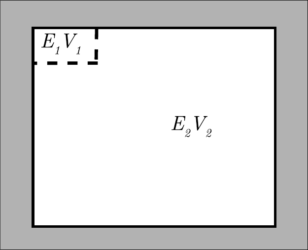
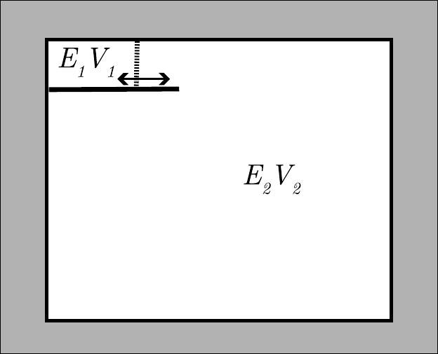
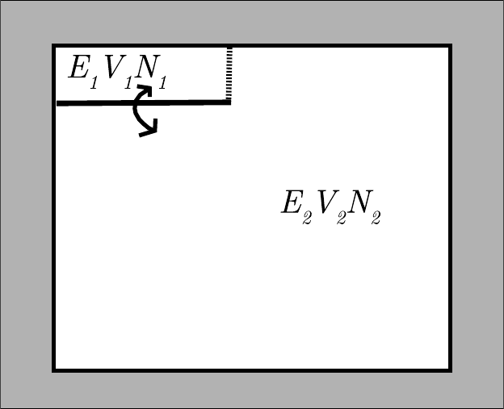

# 热力学与统计力学

分子模拟可以用来预测经典多体系统的结构、动力学和热力学性质。
一旦我们知道了一个$N$粒子系统的自然时间演化，能够计算的性质数量实际上是无限的，但并非所有可以在模拟中计算的量都对应于实验上可观测的性质。
举一个具体的例子：在液态水的分子动力学（Molecular Dynamics）模拟中，我们可以计算液体中所有分子位置和速度的时间演化。
然而，这样的信息无法与实验进行比较，因为没有任何已知的实验技术能够提供如此详细的信息。
相反，典型的实验采样的是对大量粒子进行平均、通常也对测量时间进行平均后的性质。
实验的这一特征并非偶然：测量所产生的结果应该能够通过多次重复实验或长时间运行来再现。
如果我们希望将计算机模拟作为实验的数值对应[^1]，我们必须知道什么样的计算测量能产生可再现的结果。

与实验一样，模型系统的可再现性质取决于少量表征系统所处宏观状态的宏观控制变量：例如其能量、体积和粒子数。
热力学的理论框架为我们提供了将宏观可观测量与体积或施加外场等“热力学”控制参数的变化联系起来的规则。
不同的热力学参数组合对应不同的实验，例如，我们可以考虑固定密度的系统，也可以考虑固定压力的系统。
因此，在开始讨论模拟方法之前，我们需要引入热力学的语言。
我们还需要统计力学的语言，它提供了系统微观状态与其宏观性质之间的联系。

由于本书并非关于这两个学科中任何一个的专著，我们对热力学和统计力学的介绍将过于简化，应被视为一种复习，或是一种进一步学习的激励——读者可从众多优秀教材中深入学习。

在下文中，我们对经典热力学进行简要概述，并对统计力学的基本表达式进行快速（略嫌粗糙的）推导。
这些推导的目的仅在于说明相空间（phase space）、温度、熵以及本书其余部分中反复出现的许多其他统计力学概念并不神秘。

如果您熟悉热力学，可以跳过下一节。但请记住归功于 Sommerfeld 的那段名言：

> ``热力学是一个有趣的学科。第一次学的时候，你完全不懂。第二次学的时候，你觉得你懂了，除了一两个问题。第三次学的时候，你知道你不懂，但到那时你已经对这个学科太熟悉了，不再困扰你了。''

## 经典热力学

热力学之所以困难，是因为它看起来如此抽象。
然而，我们应始终牢记热力学建立在实验观测的基础之上。
例如，热力学第一定律表达了能量守恒这一经验观测结果，尽管能量可以转化为各种形式。
系统的内能可以通过对系统做功$w$或传递热量$q$来改变。
讨论系统中热量的总量或功的总量是没有意义的。
这并不神秘：就像讨论火车站中乘车旅客和步行旅客的人数一样没有意义——人们以步行者身份进入车站，以乘车旅客身份离开（或反之）。
但是，如果我们把乘车旅客和步行者人数的变化之和加起来，就能得到车站中人数的变化。这个量是定义明确的。
类似地，$q$和$w$之和等于系统内能$E$的变化：

$$
\mathrm{d}E = q + w.
\tag{2.1.1}
$$

这就是热力学第一定律。

第二定律看起来更抽象，但事实并非如此。
第二定律基于这样的实验观测：不可能制造一台通过将单个热浴（即一个处于平衡的大储库）的热量转化为功来运行的发动机。
这一观测等价于另一个同样基于经验的观测，即热量永远不会自发地（即不对外做功）从冷储库流向较热的储库。
这一说法比看起来更微妙，因为在定义温度之前，我们只能通过热流的方向来区分较热和较冷。
第二定律说的是，永远不可能维持一个沿“错误”方向的自发热流（例如，如果热量可以从系统 A 自发流向系统 B，也可以从系统 B 自发流向系统 C，那么热量就不可能自发地从 C 流向 A）。

我们如何从这样一个看似平凡的陈述得到像熵这样抽象的概念呢？
最简单的方法是引入可逆热机的概念，即一个完全没有内部耗散能量损失的热机。

可逆发动机，顾名思义，是可以反向运转的发动机。
在一个循环（当发动机返回其原始状态时完成的一系列步骤）中，该发动机从热储库吸收热量$q_1$，将其中一部分转化为功$w$，并将剩余热量$q_2$传递给冷储库。
逆过程是：通过做功$w$，我们可以从冷储库取出热量$q_2$并将热量$q_1$传递给热储库。
可逆发动机是一种理想化，因为在任何实际发动机中，都会有额外的摩擦损失。
然而，如果在每个阶段，实际发动机都足够接近平衡，那么理想的发动机可以被实际发动机任意接近地近似。

由于发动机在一个循环结束时返回其原始状态，其内能$E$没有改变。
因此，第一定律告诉我们：

$$
\Delta E = q_1 - (w + q_2) = 0,
\tag{2.1.2}
$$

即

$$
q_1 = w + q_2.
\tag{2.1.3}
$$

现在考虑发动机的“效率”$\eta$，定义为$\eta \equiv w/q_1$——即每吸收单位热量所做的功。
起初，人们可能认为$\eta$取决于可逆发动机的精确设计。
然而，事实并非如此。
$\eta$对于在相同的两个储库之间运行的所有可逆发动机都是相同的。
为了证明这一点，我们说明如果不同的发动机可以有不同的$\eta$值，那么我们就会与第二定律“热量永远不能自发地从冷储库流向热储库”的形式相矛盾。
假设我们有另一台可逆发动机，它从热储库吸收热量$q'_1$，输出相同量的功$w$，然后将热量$q'_2$传递给冷储库。
设该发动机的效率为$\eta'$。现在，我们用效率较高的发动机（设为$\eta$）产生的功来驱动第二台发动机反向运转。
第二台发动机传递给热储库的热量为：

$$
q'_1 = w/\eta' = q_1(\eta/\eta'),
\tag{2.1.4}
$$

其中我们使用了$w = q_1 \eta$。根据假设，$\eta' < \eta$，因此$q'_1 > q_1$。
这样就会有一个从冷储库到热储库的净热流。
但这与热力学第二定律相矛盾。
因此我们必须得出结论：在相同的储库之间运行的所有可逆热机的效率是相同的。
效率仅取决于储库的温度$t_1$和$t_2$（温度$t$可以用任何温标测量，例如华氏或列氏温标，只要它是单值的）。

由于$\eta(t_1, t_2)$仅取决于储库中的温度，比值$q_2/q_1 = 1 - \eta$也是如此。
令这个比值为$R(t_2, t_1)$。现在假设我们有一个由两个阶段组成的可逆发动机：一个在储库 1 和 2 之间工作，另一个在储库 2 和 3 之间工作。
此外，我们还有另一台直接在储库 1 和 3 之间工作的可逆发动机。
由于两台发动机必须具有相同的效率，因此：

$$
R(t_3, t_1) = R(t_3, t_2)R(t_2, t_1).
\tag{2.1.5}
$$

这在一般情况下成立，仅当$R(t_1, t_2)$具有以下形式：

$$
R(t_2, t_1) = \frac{f(t_2)}{f(t_1)},
\tag{2.1.6}
$$

其中$f(t)$是我们测量温度的一个（目前未知的）函数。
现在我们引入“绝对”温度或热力学温度$T$，定义为：

$$
T \equiv f(t).
\tag{2.1.7}
$$

那么，立即可得：

$$
\frac{q_2}{q_1} = R(t_2, t_1) = \frac{T_2}{T_1}.
\tag{2.1.8}
$$

注意，热力学温度也可以定义为$c \times f(t)$。
在实践中，$c$已被固定为使得在室温附近，绝对（开尔文）温标的 1 度等于 1 摄氏度。
但这个选择当然是纯历史的——而且后来会发现，这个选择有些不太幸运。

为什么我们需要这一切？我们需要它来引入熵——所有热力学量中最神秘的一个。
为此，注意式 (2.1.8) 可以写为：

$$
\frac{q_1}{T_1} = \frac{q_2}{T_2},
\tag{2.1.9}
$$

其中$q_1$是在高温$T_1$下可逆地流入的热量，$q_2$是在低温$T_2$下可逆地流出的热量。
因此我们看到，在一个完整循环中，$q_1/T_1$与$q_2/T_2$之差为零。
回顾一下，在一个循环结束时，系统的内能没有改变。
现在式 (2.1.9) 告诉我们，还有另一个量，记为$S$，当我们使系统恢复到其原始状态时它不变。
遵循克劳修斯的做法，我们用“熵”（entropy）来命名$S$。

在热力学中，像$S$这样当我们使系统返回原始状态时不变的量，称为状态函数（state function）。
我们不知道$S$是什么，但我们确实知道如何计算它的变化。
在上面的例子中，$S$的变化由$\Delta S = (q_1/T_1) - (q_2/T_2) = 0$给出。
一般而言，由于从温度为$T$的储库可逆地添加微小热量$\delta q_{\text{rev}}$引起的系统熵变为：

$$
\mathrm{d}S = \frac{\delta q_{\text{rev}}}{T}.
\tag{2.1.10}
$$

我们还注意到$S$是广延量（extensive quantity）。
这意味着两个非相互作用系统的总熵等于各子系统熵之和。
考虑一个粒子数$N$固定、体积$V$固定的系统。
如果我们向该系统传递微量热量$\delta q$，则系统内能的变化$\mathrm{d}E$等于$\delta q$。
因此：

$$
\left(\frac{\partial S{\partial E}\right)_{V,N} = \frac{1}{T}.}
\tag{2.1.11}
$$

热力学第二定律最著名（虽然不是最直观）的表述是：封闭系统（即与环境既不交换能量也不交换粒子的系统）中的自发变化永远不会导致熵的减少。
因此，在平衡时，封闭系统的熵达到最大值。
这一论断背后的论证很简单：考虑一个具有能量$E$、体积$V$和粒子数$N$的处于平衡的系统。
我们用$S_0(E, V, N)$表示该系统的熵。
在平衡态中，所有可能发生的自发变化都已经发生了。
现在假设我们想要改变这个系统中的某些东西——例如，我们增加系统一半的密度并降低另一半的密度。
由于系统本来处于平衡态，这种变化不会自发发生。
因此，为了实现这种变化，我们必须做一定量的功$w$（例如，通过在系统中放置一个活塞并移动它）。
我们假设该功以可逆的方式执行，使得$E$（系统的总能量）保持恒定（$V$和$N$也保持恒定）。
第一定律告诉我们，只有当在做功的同时允许热量$q$从系统流出，使得$q = w$时，我们才能保持$E$恒定。
式 (2.1.10) 告诉我们，当热量$q$可逆地从系统流出时，系统的熵$S$必须减少。
设这一受约束状态的熵为$S_1(E, V, N) < S_0(E, V, N)$。
完成系统中的变化后，我们将系统与外界热绝缘，并移除使系统保持在特殊状态的约束（以活塞为例：我们在活塞上开一个孔）。
现在系统自发地（且不可逆地）回到平衡态。
然而，没有做功，也没有传递热量。
因此，最终能量$E$等于原始能量（$V$和$N$也是恒定的）。
这意味着系统现在回到了原来的平衡状态，其熵再次等于$S_0(E, V, N)$。
在这个自发变化期间熵的变化等于$\Delta S = S_0 - S_1$。
但由于$S_1 < S_0$，所以$\Delta S > 0$。
由于这个论证具有普遍性，我们确实证明了封闭系统中的任何自发变化都会导致熵的增加。
因此，在平衡时，封闭系统的熵达到最大值。

[^2]

现在我们可以结合第一定律和第二定律来得到热力学系统能量变化的表达式。
我们考虑由于传热和做功引起的系统中的微小可逆变化。
第一定律指出：

$$
\mathrm{d}E = q + w.
$$

对于可逆变化，我们可以写$q = T\mathrm{d}S$。
对于$w$，有许多方式可以对系统做功，例如压缩、电极化、磁化、弹性变形等。
这里我们只关注其中一种形式的功，即由于体积变化反抗外部压力$P$所做的功。
在这种情况下，微小体积变化$\mathrm{d}V$期间对系统所做的功为$w = -P\mathrm{d}V$，第一定律可以写为：

$$
\mathrm{d}E = T\mathrm{d}S - P\mathrm{d}V.
$$

然而，还有另一种重要的方式可以改变系统的能量，即通过将物质移入或移出系统。
为方便起见，我们考虑仅含一种组分的系统。
如前所述，该组分的分子数用$N$表示。
当我们（可逆地）在恒定$V$和$S$下改变系统中的分子数时，系统的能量变化为：$\mathrm{d}E = \mu \mathrm{d}N$。
此表达式定义了比例常数$\mu$，即“化学势”（chemical potential）：

$$
\mu \equiv \left(\frac{\partial E}{\partial N}\right)_{S,V}.
\tag{2.1.12}
$$

我们注意到，为了与本书其余部分一致，我们用分子数定义了化学势。
在经典热力学中，化学势定义为：

$$
\mu_{\text{thermo}} \equiv \left(\frac{\partial E}{\partial n}\right)_{S,V},
\tag{2.1.13}
$$

其中$n$表示摩尔数。
热力学化学势$\mu_{\text{thermo}}$与分子化学势$\mu$之间的关系很简单：

$$
\mu_{\text{thermo}} = N_A \mu,
$$

其中$N_A$表示阿伏伽德罗常数。
将式 (2.1.12) 推广到多组分系统是直接的，稍后将会遇到。
现在我们可以写出最常用的热力学第一定律形式：

$$
\mathrm{d}E = T\mathrm{d}S - P\mathrm{d}V + \mu \mathrm{d}N.
\tag{2.1.14}
$$

通常我们以下列形式使用上式：

$$
\mathrm{d}S = \frac{1}{T}\mathrm{d}E + \frac{P}{T}\mathrm{d}V - \frac{\mu}{T}\mathrm{d}N,
\tag{2.1.15}
$$

这意味着：

$$
\left(\frac{\partial S}{\partial V}\right)_{E,N} = \frac{P}{T}
\quad \text{和} \quad
\left(\frac{\partial S}{\partial N}\right)_{E,V} = -\frac{\mu}{T}.
$$

我们已经知道：

$$
\left(\frac{\partial S}{\partial E}\right)_{V,N} = \frac{1}{T}.
$$

区分广延量（extensive）和强度量（intensive）热力学性质是很重要的。
强度量不取决于所考虑系统的大小。
例如温度、压力和化学势。
如果我们将两个处于相同热力学状态的相同系统合并，则所得系统的温度、压力和化学势与原始子系统相同。
相比之下，能量、熵、体积和粒子数是广延量。
这意味着它们随系统大小成比例缩放。
现在假设我们通过组合大量无穷小的子系统来构造一个热力学系统。
那么$E$、$S$、$V$和$N$的广延性意味着，对于所得系统，我们有：

$$
E = TS - PV + \mu N.
\tag{2.1.16}
$$

现在考虑$E$的一个微小变化：

$$
\mathrm{d}E = \mathrm{d}TS - \mathrm{d}PV + \mathrm{d}\mu N = T\mathrm{d}S + S\mathrm{d}T - P\mathrm{d}V - V\mathrm{d}P + \mu \mathrm{d}N + Nd\mu.
$$

如果我们将其与热力学第一定律结合，可得：

$$
0 = S\mathrm{d}T - V\mathrm{d}P + Nd\mu.
\tag{2.1.17}
$$

这是一个重要的关系式，因为它表明$T$、$P$和$\mu$是因变量。
其中两个就足以指定系统的热力学状态。
然而，此外，我们总是需要（至少）一个广延热力学变量来指定系统的大小：$T$、$P$和$\mu$是强度量，因此它们不包含这一信息。

从这里开始，我们可以推导所有的热力学，除了一个定律：所谓的热力学第三定律。
第三定律可以用多种方式表述。
最简短的版本指出，纯物质在$T = 0$时平衡态的熵等于零。
然而，$T = 0$时熵值必须为零这一事实来自热力学之外的考量。
第三定律不像第一和第二定律那样“基本”，而且我们很快就会对其含义获得更直接的解释。

### 辅助函数

公式$\mathrm{d}E = T\mathrm{d}S - P\mathrm{d}V + \mu \mathrm{d}N$将热力学第一定律表示为$E$随$S$、$V$和$N$变化的关系。
有时，使用其他独立变量更为方便，例如用温度代替熵，用压力代替体积，或用化学势代替粒子数。
“方便”的变量是那些可以在给定实验中控制的变量。
有一个简单的步骤可以将第一定律用这些其他变量重新表述。

#### 焓（Enthalpy）
例如，如果我们使用$S$、$P$和$N$作为独立变量，我们可以进行所谓的勒让德变换（Legendre transform），这使我们能够用一个新的状态函数来代替能量，该函数是$S$、$P$和$N$的函数。
这个函数称为焓（Enthalpy，$H$），定义为$H \equiv E + PV$。显然：

$$
\mathrm{d}H = \mathrm{d}E + \mathrm{d}PV = T\mathrm{d}S - P\mathrm{d}V + \mu \mathrm{d}N + P\mathrm{d}V + V\mathrm{d}P = T\mathrm{d}S + V\mathrm{d}P + \mu \mathrm{d}N.
\tag{2.1.18}
$$

表明控制焓的独立变量是$S$、$P$和$N$。

#### 亥姆霍兹自由能（Helmholtz Free Energy）
类似地，我们可以引入一个函数$F$，称为亥姆霍兹自由能（Helmholtz free energy），定义为$F \equiv E - TS$。
与焓的情况一样，容易证明：

$$
\mathrm{d}F = -S\mathrm{d}T - P\mathrm{d}V + \mu \mathrm{d}N.
\tag{2.1.19}
$$

#### 吉布斯自由能（Gibbs Free Energy）
吉布斯自由能$G$定义为$F + PV$，满足：

$$
\mathrm{d}G = -S\mathrm{d}T + V\mathrm{d}P + \mu \mathrm{d}N.
\tag{2.1.20}
$$

*图 2.1　一个孤立系统，由两个固定体积的盒子 1 和 2 组成，两个子系统可以交换热量，但子系统 2 比系统 1 大得多，因此充当热浴。*

#### 巨热力学势（Grand Potential）
最后，我们可以引入巨热力学势（Grand Potential）$\Omega$，定义为$\Omega \equiv F - \mu N$，满足：

$$
\mathrm{d}\Omega = -S\mathrm{d}T - P\mathrm{d}V - Nd\mu.
\tag{2.1.21}
$$

然而，对于均匀系统，我们很少使用$\Omega$这个符号来表示巨热力学势，因为如果系统的压力是明确定义的，$F - \mu N = -PV$，我们可以用$-PV$来代替$\Omega$。
[^3]

#### 辅助函数与第二定律

对于给定内能$E$和体积$V$的封闭$N$粒子系统，当熵$S$达到最大值时达到平衡。
为了描述在非恒定$N$、$V$、$E$条件下的实验，我们必须重新表述热力学第二定律，因为一般情况下，如果我们保持$P$或$T$恒定，$S$在平衡时并不处于最大值。
幸运的是，我们可以使用原始的热力学第二定律来推导在非恒定$E$、$V$和$N$条件下热力学平衡的条件。

考虑如图 2.1 所示的系统。
总系统是孤立的，体积固定。
在系统中，我们有一个子系统 1，它比子系统 2 小得多（我们将较大的系统称为“热浴”）。
如果我们允许子系统 1 和 2 交换能量，组合系统的总能量仍然守恒。
因此，我们可以将第二定律应用于组合系统，即组合系统的总熵在平衡时必须达到最大值。
只要系统 1 和 2 之间存在净能量通量，总系统就尚未达到平衡，我们必须有：

$$
\Delta S_{\text{tot}} = \Delta S_1 + \Delta S_2 \geq 0.
\tag{2.1.22}
$$

由于热浴（子系统 2）比子系统 1 大得多，当与子系统 1 交换少量能量时，其温度$T$不会改变。
利用$\mathrm{d}S = \delta q_{\text{rev}}/T$，我们可以写出：

$$
\Delta S_2 = \frac{\Delta E_2}{T}.
\tag{2.1.23}
$$

由于总能量守恒（即$\Delta E_2 = -\Delta E_1$），我们可以写出：

$$
\Delta S_1 + \Delta S_2 = \frac{1}{T}(T\Delta S_1 - \Delta E_1) \geq 0.
\tag{2.1.24}
$$

这个方程用子系统 1 的性质表达了平衡条件。
热浴的唯一作用是施加温度$T$。
注意，式 (2.1.24) 中变化的量正是亥姆霍兹自由能（见式 (2.1.19)）：

$$
F_1(N, V, T) \equiv E_1 - TS_1.
$$

那么，取式 (2.1.24) 的形式，第二定律意味着，对于与热浴接触的系统：

$$
-\frac{1}{T}\Delta F_1 \geq 0.
\tag{2.1.25}
$$

换言之：当体积$V$中的$N$粒子系统与温度$T$（正值）的热浴接触时，自发变化永远不会增加其亥姆霍兹自由能：

$$
\mathrm{d}F \leq 0.
\tag{2.1.26}
$$

类似地，我们可以定义两个不仅能交换能量，还能以总体积保持恒定的方式改变各自体积的系统（见图 2.2）。
如前所述，组合系统是孤立的，其总体积固定。
然后我们可以再次将第二定律应用于组合系统。
由于系统 2 再次被假设为比系统 1 大得多，当系统 1 的能量和体积改变时，其温度和压力不变。
因此系统 2 的熵变为：

$$
\Delta S_2 = \frac{\Delta E_2}{T} + \frac{P\Delta V_2}{T}.
\tag{2.1.27}
$$

由于总能量守恒（$\Delta E_2 = -\Delta E_1$）且总体积保持恒定（$\Delta V_2 = -\Delta V_1$），我们可以写出总熵变：

$$
\Delta S_1 + \Delta S_2 = \frac{1{T}(T\Delta S_1 - \Delta E_1 - P\Delta V_1) \geq 0,}
\tag{2.1.28}
$$

*图 2.2　一个孤立系统，由两个可以交换热量并以总体积和能量保持恒定的方式改变体积的盒子 1 和 2 组成。系统 2 比系统 1 大得多，因此可以充当对系统 1 施加恒定压力的热浴。*

 或$\mathrm{d}G/T \leq 0$，其中$\mathrm{d}G$是吉布斯自由能（式 (2.1.20)）的变化。
在这个方程中，我们再次仅用系统 1 的性质表示了不等式。
等温等压下系统的自发变化永远不会增加其吉布斯自由能。

### 化学势与平衡

到目前为止，我们考虑了与等温等压储库接触的系统。
现在让我们考虑将系统与“粒子储库”（即恒定化学势的系统）接触时会发生什么。
显然，由于$T$、$P$和$\mu$是线性相关的，我们不能考虑与恒定$T$、$P$、$\mu$储库接触的系统，因为这些变量不足以固定系统的大小。
因此，当考虑与粒子储库接触的系统时，我们应至少固定一个广延变量。
最方便的选择是固定体积$V$。
因此，我们将考虑体积$V$的系统（1）与恒温$T$和恒定$\mu$的储库（系统 2）接触。
如前所述，我们可以将应用于组合系统的第二定律，推导出系统 1 在该系统可以与储库（系统 2）交换热量和粒子条件下的平衡条件：

$$
\Delta S_{\text{tot}} = \Delta S_1 + \Delta S_2 = \Delta S_1 - \frac{\Delta E_1}{T} + \frac{\mu \Delta N_1}{T} \geq 0,
\tag{2.1.29}
$$

或

$$
\Delta S_{\text{tot}} = \frac{\Delta(TS_1 - E_1 + \mu N_1)}{T} \geq 0,
\tag{2.1.30}
$$

或$\Delta \Omega \leq 0$。因此，在恒定$T$、$V$和$\mu$条件下，$\Omega$在平衡时达到最小值。

现在我们已经得到了一些最重要的实际条件下平衡条件：

$$
\begin{align}
&\text{恒定} N, V, E \text{的平衡}: && S \text{最大} \nonumber \\
&\text{恒定} N, V, T \text{的平衡}: && F \text{最小} \nonumber \\
&\text{恒定} N, P, T \text{的平衡}: && G \text{最小} \nonumber \\
&\text{恒定} \mu, V, T \text{的平衡}: && \Omega \text{最小}
\tag{2.1.31}
\end{align}
$$

利用$F$、$G$和$\Omega$的定义，我们可以写出每个量微小变化的表达式。
例如：

$$
\mathrm{d}F = \mathrm{d}E - \mathrm{d}TS.
$$

利用第一定律，我们可以将其重写为：

$$
\mathrm{dF = T\mathrm{d}S - P\mathrm{d}V + \mu \mathrm{d}N - T\mathrm{d}S - S\mathrm{d}T = -S\mathrm{d}T - P\mathrm{d}V + \mu \mathrm{d}N.}
$$

类似地，我们可以写出：

$$
\begin{align}
\mathrm{d}S &= \frac{1}{T}\mathrm{d}E + \frac{P}{T}\mathrm{d}V - \frac{\mu}{T}\mathrm{d}N \nonumber \\
\mathrm{d}F &= -S\mathrm{d}T - P\mathrm{d}V + \mu \mathrm{d}N \nonumber \\
\mathrm{d}G &= -S\mathrm{d}T + V\mathrm{d}P + \mu \mathrm{d}N \nonumber \\
\mathrm{d}\Omega &= -S\mathrm{d}T - P\mathrm{d}V - Nd\mu.
\tag{2.1.32}
\end{align}
$$

在下文中，除非另有明确说明，我们将用$-PV$代替$\Omega$。
式 (2.1.32) 与平衡条件 (2.1.31) 结合起来非常重要，因为它们指定了系统处于热力学（化学或相）平衡的条件。
稍后，我们将广泛使用相平衡条件。

接下来，考虑一个包含两个子系统的封闭系统。
系统的总体积$V = V_1 + V_2$固定。
类似地，$N_1 + N_2$和$E_1 + E_2$固定。
这些条件意味着$\mathrm{d}V_1 = -\mathrm{d}V_2$、$\mathrm{d}N_1 = -\mathrm{d}N_2$和$\mathrm{d}E_1 = -\mathrm{d}E_2$。
第二定律告诉我们，在平衡时，系统的总熵$S_{\text{tot}} = S_1 + S_2$必须是极值（注意$S_{\text{tot}}$不是固定的）。
因此，$S_{\text{tot}}$对$E_1$、$N_1$和$V_1$的导数必须为零，即：

$$
\begin{align}
\frac{\partial(S_1 + S_2)}{\partial E_1} &= \frac{\partial S_1}{\partial E_1} - \frac{\partial S_2}{\partial E_2} = 0 \nonumber \\
\frac{\partial(S_1 + S_2)}{\partial V_1} &= \frac{\partial S_1}{\partial V_1} - \frac{\partial S_2}{\partial V_2} = 0 \nonumber \\
\frac{\partial(S_1 + S_2)}{\partial N_1} &= \frac{\partial S_1}{\partial N_1} - \frac{\partial S_2}{\partial N_2} = 0.
\tag{2.1.33}
\end{align}
$$

如果我们将式 (2.1.33) 与$\mathrm{d}S$的表达式（式 (2.1.32)）结合，我们得到：

$$
\begin{align}
\frac{1}{T_1} &= \frac{1}{T_2} \nonumber \\
\frac{P_1}{T_1} &= \frac{P_2}{T_2} \nonumber \\
\frac{\mu_1}{T_1} &= \frac{\mu_2}{T_2}.
\tag{2.1.34}
\end{align}
$$

第一个条件意味着两个系统之间的热平衡，即$T_1 = T_2 \equiv T$。
那么第二个条件简单地意味着$P_1 = P_2$，第三个条件是$\mu_1 = \mu_2$。
[^4]
式 (2.1.34) 是所有基于自由能的计算的出发点，用于定位两个系统（两个相）处于平衡时的点（见第 8 章）。

### 能量、压力和化学势

分子模拟的目标之一是基于我们对组成分子之间相互作用的了解来计算系统的热力学性质。
在后续章节中，我们将讨论如何从统计力学推导相关表达式。
这里我们关注一个一般特征：在所有情况下，我们都从要计算的量的热力学定义出发。
例如，计算压力$P$的出发点是如下类型的热力学关系：

$$
P = -\left(\frac{\partial F}{\partial V}\right)_{N,T}.
\tag{2.1.35}
$$

这是我们考虑固定$N$、$V$和$T$的系统时使用的表达式。
然而，如果我们考虑恒定$N$、$V$和$E$的系统，我们将使用：

$$
\frac{P}{T} = \left(\frac{\partial S}{\partial V}\right)_{N,E}.
$$

对于其他热力学变量和其他条件，可以写出类似的表达式。
例如，对于恒定$N$、$V$和$T$的系统，能量由以下热力学关系给出：

$$
\displaystyle
E = F + TS = F - T\left(\frac{\partial F{\partial T}\right)_{V,N} = \left(\frac{\partial F/T}{\partial 1/T}\right)_{V,N}.
}
\tag{2.1.36}
$$

我们也可以利用$F$来获得化学势$\mu$：

$$
\mu = \left(\frac{\partial F}{\partial N}\right)_{T,V}.
\tag{2.1.37}
$$

由于大多数 Monte Carlo 模拟是在恒定$N$、$V$和$T$下进行的，我们将广泛使用这些关系。

#### 偏摩尔导数之间的关系

多组分系统的所有广延热力学变量$X$可以写为：

$$
X = \sum_i N_i x_i,
$$

其中$x_i$是$X$对$N_i$（物种$i$的粒子数）在恒定$P$、$T$和$N_j$下的偏导数：

$$
x_i \equiv \left(\frac{\partial X}{\partial N_i}\right)_{P,T,\{N_j\}}.
$$

例如，当$X = S$时：

$$
S = \sum_i N_i s_i,
$$

其中，组分$i$的摩尔熵$s_i$为：

$$
s_i \equiv \left(\frac{\partial S}{\partial N_i}\right)_{P,T,\{N_j\}}.
$$

重要的是要注意，保持恒定的热力学变量不同会有差异。
显然：

$$
s_i \neq \left(\frac{\partial S}{\partial N_i}\right)_{E,V,\{N_j\}} = \mu_i/T.
$$

但这并不矛盾：当我们在恒定$P$和$T$下添加一个物种$i$的粒子时，内能变化$e_i$，体积变化$v_i$。
要将系统恢复到恒定能量和体积，我们应计算：

$$
\begin{aligned}
\left(\frac{\partial S}{\partial N_i}\right)_{E,V,\{N_j\}}
&= \left(\frac{\partial S}{\partial N_i}\right)_{P,T,\{N_j\}}
- \left(\frac{\partial S}{\partial V}\right)_{E,\{N\}} v_i
- \left(\frac{\partial S}{\partial E}\right)_{V,\{N\}} e_i \\
&= s_i - \frac{Pv_i}{T} - \frac{e_i}{T} \\
&= \frac{Ts_i - Pv_i - e_i}{T} \\
&= -\frac{\mu_i}{T} = -\frac{1}{T}\left(\frac{\partial G}{\partial N_i}\right)_{P,T,\{N_j\}}.
\end{aligned}
$$

## 统计热力学

在上一节中，我们介绍了热力学的框架。
热力学是一种唯象理论：它提供了实验可观测量之间的关系。
然而，它并不基于微观模型来预测这些量。
统计力学提供了原子或分子相互作用系统的微观描述与热力学可观测量（如压力或化学势）预测之间的联系。
对于除最简单系统以外的所有系统，热力学可观测量的统计力学表达式太复杂，无法解析计算。
然而，在许多情况下，数值模拟将允许我们获得感兴趣量的准确估计。

### 基本假设

我们讨论的大多数计算机模拟都基于这样的假设：经典力学可以用来描述原子和分子的运动。
这一假设在几乎所有计算中带来了极大的简化，因此在许多实际感兴趣的情况下它是合理的，这非常幸运。
令人惊讶的是，使用量子力学的语言来推导统计力学的基本定律反而更容易。
我们将遵循这条阻力最小的路径。
事实上，对于我们的推导，我们只需要很少的量子力学知识。
具体来说，我们需要知道量子力学系统可以处于不同的状态。
目前，我们仅限于作为系统哈密顿量 $\mathcal{H}$的本征向量的量子态（即能量本征态）。
对于任何这样的态$|i\rangle$，我们有$\mathcal{H}|i\rangle = E_i|i\rangle$，其中$E_i$是态$|i\rangle$的能量。
量子力学教材中讨论的大多数例子只涉及自由度很少的系统（例如一维谐振子或盒子中的粒子）。
对于这些系统，能级的简并度很小。
然而，对于统计力学感兴趣的系统（即具有$O(10^{23})$个粒子的系统），能级的简并度超天文数字般巨大。
在下文中，我们用$\Omega$表示体积$V$中$N$个粒子系统的能量为$E$的本征态数目，$\Omega = \Omega(E, V, N)$。
现在我们将统计力学的基本假设表述如下：固定$N$、$V$和$E$的系统等概率地处于其$\Omega(E)$个本征态中的任何一个。
统计力学的很大一部分内容都源自这个简单（但非平庸）的假设。

为了理解这一点，让我们再次考虑一个由两个弱相互作用子系统组成的总能量为$E$的系统。
在这个语境中，弱相互作用意味着子系统可以交换能量，但我们可以将系统的总能量写为两个子系统能量$E_1$和$E_2$之和。
有很多方式可以将总能量分配给两个子系统，使得$E_1 + E_2 = E$。
对于给定的$E_1$选择，系统的简并态总数为$\Omega_1(E_1) \times \Omega_2(E_2)$。
注意，总态数是各单独系统态数的乘积。
在下文中，使用一种可加的子系统简并度度量是方便的。
一个合乎逻辑的选择是取简并度的（自然）对数。
因此：

$$
\ln\Omega(E_1, E - E_1) = \ln\Omega_1(E_1) + \ln\Omega_2(E - E_1).
\tag{2.2.1}
$$

我们假设子系统 1 和 2 可以交换能量。
最可能的能量分布是什么？
我们知道总系统的每个能量态都是等概率的。
但对应于给定能量在子系统上分配的本征态数目强烈依赖于$E_1$的值。
我们想知道$E_1$的最可能值，即最大化$\ln\Omega(E_1, E - E_1)$的值。
这个最大值的条件是：

$$
\left(\frac{\partial \ln\Omega(E_1, E - E_1)}{\partial E_1}\right)_{N,V,E} = 0,
\tag{2.2.2}
$$

换言之：

$$
\left(\frac{\partial \ln\Omega_1(E_1)}{\partial E_1}\right)_{N_1,V_1}
= \left(\frac{\partial \ln\Omega_2(E_2)}{\partial E_2}\right)_{N_2,V_2}.
\tag{2.2.3}
$$

我们引入简写记号：

$$
\beta(E, V, N) \equiv \left(\frac{\partial \ln\Omega(E, V, N)}{\partial E}\right)_{N,V}.
\tag{2.2.4}
$$

利用这个定义，我们可以把式 (2.2.3) 写为：

$$
\beta(E_1, V_1, N_1) = \beta(E_2, V_2, N_2).
\tag{2.2.5}
$$

显然，如果我们最初将所有能量放入系统 1（例如），那么就会有从系统 1 到系统 2 的能量转移，直到式 (2.2.3) 被满足。
从那一刻起，子系统之间没有净能量流，我们说两个子系统处于（热）平衡。
当达到这个平衡时，总系统的$\ln\Omega$达到最大值。
这表明$\ln\Omega$在某种程度上与系统的热力学熵$S$有关。
正如我们在上一节中所看到的，热力学第二定律指出，当系统达到热平衡时，固定$N$、$V$和$E$的系统的熵达到最大值。

为了建立$\ln\Omega$和熵之间的关系，我们可以简单地假设熵等于$\ln\Omega$，然后检验基于此假设的预测是否与实验一致。
如果我们这样做，我们会发现答案“不完全是”：由于（不幸的）历史原因（在统计力学创立之前，熵已经有了单位），熵并不简单地等于$\ln\Omega$；而是：

$$
S(N, V, E) \equiv k_B \ln\Omega(N, V, E),
\tag{2.2.6}
$$

其中$k_B$是玻尔兹曼常数，在 SI 单位制中的值为$1.380649 \times 10^{-23}$ J/K。
通过这一对应关系，我们看到量子系统的所有简并本征态等概率的假设立即意味着，在热平衡时，复合系统的熵达到最大值。
将这一表述称为热力学第二定律有些为时过早，因为我们尚未证明当前定义的熵确实等价于热力学定义。
我们暂且先接受这一结果。

下一个要注意的是子系统 1 和 2 之间的热平衡意味着$\beta_1 = \beta_2$。
在日常生活中，我们有另一种方式来表达同样的事情：我们说被置于热接触的两个物体在温度相同时处于平衡。
这表明$\beta$必须与绝对温度有关。
温度的热力学定义由下式给出：

$$
1/T = \left(\frac{\partial S}{\partial E}\right)_{V,N}.
\tag{2.2.7}
$$

如果我们在这里使用相同的定义，我们得到：

$$
\beta = 1/(k_B T).
\tag{2.2.8}
$$

### 恒温系统

现在我们有了温度的统计力学定义，我们可以考虑：像第 2.1.1 节那样，当一个小系统（记为系统 1）与一个大的热浴（系统 2）处于热平衡时会发生什么（见图 2.1）。
总系统是封闭的；即总能量$E = E_1 + E_2$固定。
假设系统 1 被制备在一个具有能量$E_i$的特定量子态$i$中。
热浴的能量为$E_1 = E - E_i$，热浴的简并度为$\Omega_2(E - E_i)$。
显然，热浴的简并度决定了系统 1 处于态$i$的概率$P_i$：

$$
P_i = \frac{\Omega_2(E - E_i)}{\sum_j \Omega_2(E - E_j)}.
\tag{2.2.9}
$$

为了计算$\Omega_2(E - E_i)$，我们假设热浴（系统 2）比系统 1 大得多，这使我们可以将$\ln\Omega_2(E - E_i)$在$E_i = 0$附近展开：

$$
\displaystyle
\ln\Omega_2(E - E_i) = \ln\Omega_2(E) - E_i \frac{\partial \ln\Omega_2(E){\partial E} + \mathcal{O}(1/E),
}
\tag{2.2.10}
$$

并利用前述关系，得到：

$$
\ln\Omega_2(E - E_i) = \ln\Omega_2(E) - E_i/k_B T + \mathcal{O(1/E).}
\tag{2.2.11}
$$

如果我们将此结果代入式 (2.2.9)，并取$E \to \infty$的极限，得到：

$$
P_i = \frac{\exp(-E_i/k_B T)}{\sum_j \exp(-E_j/k_B T)}.
\tag{2.2.12}
$$

这就是温度$T$下系统的著名玻尔兹曼分布。
知道了能量分布，我们可以计算给定温度$T$下系统的平均能量$\langle E \rangle$：

$$
\langle E \rangle = \sum_i E_i P_i
= \frac{\sum_i E_i \exp(-E_i/k_B T)}{\sum_j \exp(-E_j/k_B T)}
= -\frac{\partial \ln \sum_i \exp(-E_i/k_B T)}{\partial 1/k_B T}
= -\frac{\partial \ln Q}{\partial 1/k_B T},
\tag{2.2.13}
$$

其中，在最后一行中，我们定义了配分函数（partition function）$Q \equiv Q(N, V, T)$。

如果我们将式 (2.2.13) 与热力学关系式 (2.1.36)（$E = \partial (F/T)/\partial (1/T)$，其中$F$是亥姆霍兹自由能）进行比较，我们看到$F$与配分函数$Q$相关：

$$
F = -k_B T \ln Q = -k_B T \ln \left[\sum_i \exp(-E_i/k_B T)\right].
\tag{2.2.14}
$$

严格来说，$F$仅确定到一个常数。
或者等价地说，能量的参考点可以任意选择。
在下文中，我们可以不失一般性地使用上式。
亥姆霍兹自由能与配分函数之间的关系通常比$\ln\Omega$与熵之间的关系更方便使用。
因此，式 (2.2.14) 是平衡统计力学的主力公式。

### 走向经典统计力学

到目前为止，我们已经用纯量子力学的术语表述了统计力学。
熵与具有能量$E$、体积$V$和粒子数$N$的系统的态密度有关。
类似地，亥姆霍兹自由能与配分函数$Q$有关，后者是对所有量子态$i$的玻尔兹曼因子$\exp(-E_i/k_B T)$的求和。
具体来说，让我们考虑某个可观测量$A$的平均值。
我们知道温度$T$下系统处于能量为$E_i$的能量本征态的概率，因此我们可以计算$A$的热平均：

$$
\langle A \rangle = \frac{\sum_i \exp(-E_i/k_B T) \langle i|A|i\rangle}{\sum_j \exp(-E_j/k_B T)},
\tag{2.2.15}
$$

其中$\langle i|A|i\rangle$表示算符$A$在量子态$i$中的期望值。
这个方程提示了我们应该如何计算热平均：首先我们求解感兴趣的多体系统的薛定谔方程，然后我们计算所有具有不可忽略统计权重的量子态的算符$A$的期望值。
不幸的是，这种方法对于除最简单系统以外的所有系统都是行不通的。
首先，我们无法期望对任意的多体系统求解薛定谔方程。
其次，即使我们能做到，对式 (2.2.15) 中的平均有贡献的量子态数量如此巨大（$O(10^{10^{25}})$），对所有期望值进行数值计算是不可想象的。

幸运的是，式 (2.2.15) 可以在经典极限下简化为更实用的表达式。
为此，我们首先将式 (2.2.15) 重写为与具体基组无关的形式。
注意到$\exp(-E_i/k_B T) = \langle i|\exp(-\mathcal{H}/k_B T)|i\rangle$，其中$\mathcal{H}$是系统的哈密顿量。
利用这一关系，我们可以写出：

$$
\langle A \rangle
= \frac{\sum_i \langle i|\exp(-\mathcal{H}/k_B T) A|i\rangle}{\sum_j \langle j|\exp(-\mathcal{H}/k_B T)|j\rangle}
= \frac{\text{Tr} \exp(-\mathcal{H}/k_B T) A}{\text{Tr} \exp(-\mathcal{H}/k_B T)},
\tag{2.2.16}
$$

其中$\text{Tr}$表示算符的迹。
由于算符迹的值不依赖于基组的选择，我们可以使用任何我们喜欢的基组来计算热平均。
最好使用简单的基组，例如位置或动量算符的本征函数集。

接下来，我们利用哈密顿量 $\mathcal{H}$是动能部分$K$和势能部分$U$之和这一事实。
动能算符是所有粒子动量的二次函数。
因此，动量本征态也是动能算符的本征函数。
类似地，势能算符是粒子坐标的函数。
因此，$U$的矩阵元在位置本征函数基组中最方便计算。
然而，$\mathcal{H} = K + U$本身在两个基组中都不对角，$\exp[-\beta(K + U)]$也不对角。
然而，如果我们能用$\exp(-\beta K)\exp(-\beta U)$代替$\exp(-\beta \mathcal{H})$，那么我们可以大大简化式 (2.2.16)。
一般而言，我们不能做这种替换，因为：

$$
\exp(-\beta K)\exp(-\beta U) = \exp\{-\beta[K + U + O([K, U])]\},
$$

其中$[K, U]$是动能和势能算符的对易子：
$O([K, U])$代表包含$K$和$U$的对易子和高阶对易子的所有项。
容易验证对易子$[K, U]$的量级为$\hbar$（$\hbar \equiv h/(2\pi)$，其中$h$是普朗克常数）。
因此，在$\hbar \to 0$的极限下，我们可以忽略$O([K, U])$量级的项。
在这种情况下，我们可以写出：

$$
\text{Tr}\exp(-\beta \mathcal{H}) \approx \text{Tr}\exp(-\beta \mathcal{U})\exp(-\beta \mathcal{K}).
\tag{2.2.17}
$$

如果我们用$|\mathbf{r}\rangle$表示位置算符的本征向量，用$|\mathbf{k}\rangle$表示动量算符的本征向量，我们可以将上式表示为：

$$
\text{Tr}\exp(-\beta \mathcal{H}) = \sum_{\mathbf{r}, \mathbf{k}} \langle \mathbf{r}|e^{-\beta \mathcal{U}}|\mathbf{r}\rangle \langle \mathbf{r}|\mathbf{k}\rangle \langle \mathbf{k}|e^{-\beta \mathcal{K}}|\mathbf{k}\rangle \langle \mathbf{k}|\mathbf{r}\rangle.
\tag{2.2.18}
$$

所有矩阵元可以直接计算：

$$
\langle \mathbf{r|\exp(-\beta U)|\mathbf{r}\rangle = \exp\left[-\beta U(\mathbf{r}^N)\right],}
$$

其中右边的$U(\mathbf{r}^N)$不再是算符，而是所有$N$个粒子坐标的函数。
这里及下文中，我们用$\mathbf{r}^N$表示这组坐标。
类似地：

$$
\langle \mathbf{k}|\exp(-\beta K)|\mathbf{k}\rangle = \exp\left[-\beta \sum_{i=1}^{N} p_i^2/(2m_i)\right],
$$

其中$p_i = \hbar k_i$，以及：

$$
\langle \mathbf{r}|\mathbf{k}\rangle \langle \mathbf{k}|\mathbf{r}\rangle = 1/V^N,
$$

其中$V$是系统的体积，$N$是粒子数。
最后，我们可以用对所有坐标和动量的积分来替代对态的求和。
最终结果为：

$$
\text{Tr}\exp(-\beta \mathcal{H})
\approx \frac{1}{h^{dN} N!} \int \mathrm{d}\mathbf{p}^N \mathrm{d}\mathbf{r}^N \exp\left[-\beta\left(\sum_i p_i^2/(2m_i) + \mathcal{U}(\mathbf{r}^N)\right)\right]
\equiv Q_{\text{classical}},
\tag{2.2.19}
$$

其中$d$是系统的维度，最后一行定义了经典配分函数。
因子$1/N!$是对不可分辨粒子的任意排列对应相同宏观状态这一事实的修正。
[^5]

类似地，我们可以推导$\text{Tr}\exp(-\beta \mathcal{H})A$的经典极限，最终我们可以写出可观测量$A$的热平均的经典表达式：

$$
\langle A \rangle
= \frac{\int \mathrm{d}\mathbf{p}^N \mathrm{d}\mathbf{r}^N \exp\left[-\beta\left(\sum_i p_i^2/(2m_i) + \mathcal{U}(\mathbf{r}^N)\right)\right] A(\mathbf{p}^N, \mathbf{r}^N)}
{\int \mathrm{d}\mathbf{p}^N \mathrm{d}\mathbf{r}^N \exp\left[-\beta\left(\sum_j p_j^2/(2m_j) + \mathcal{U}(\mathbf{r}^N)\right)\right]}.
\tag{2.2.20}
$$

式 (2.2.19) 与 (2.2.20) 构成了经典多体系统各种模拟的出发点。
式 (2.2.19) 和 (2.2.20) 表示为对所有$N$个粒子的$dN$个动量和$dN$个坐标的高维积分，其中$d$表示系统的维度。
由所有动量和坐标张成的$2dN$维空间称为相空间（phase space）。

## 系综

在统计力学中，与热力学一样，系统的状态由多个控制参数确定，其中一些是广延量（如粒子数$N$），另一些是强度量（如压力$P$或温度$T$）。
由于历史原因，我们将与一组控制参数兼容的所有系统实现的集合称为“系综”（ensemble）。
不同组的控制参数对应不同的系综。
这些系综的历史名称（“微正则”、“正则”、“巨正则”等）并不特别具有启发性。
下面，我们将在描述最常用的系综时列出这些名称。
然而，在下文中，我们将经常用保持恒定的控制变量来表示系综，例如“恒定 NVE 系综”或“恒定$\mu$VT 系综”。
在以下各节中，为方便起见，我们假设系统由没有内部自由度的粒子组成（即没有转动、振动或电子激发）。
这一假设简化了符号表示，但对于分子系统，我们当然必须考虑内部自由度。

### 微正则（恒定 NVE）系综

在微正则系综中，能量、体积和每个组分的粒子数保持恒定。
[^6]
在经典系统中，总能量由哈密顿量 $\mathcal{H}$给出，它是动能和势能之和。

$$
\mathcal{H} = \sum_{i=1}^{N} \frac{p_i^2}{2m} + U(\mathbf{r}^N),
\tag{2.3.1}
$$

其中我们假设势能不依赖于动量$\mathbf{p}$。微正则系综中的经典配分函数是在哈密顿量值等于给定能量$E$的超曲面上的相空间积分。系统必须处于超曲面$\mathcal{H}(\mathbf{p}^N, \mathbf{r}^N) = E$上的约束可以通过$\delta$函数来施加，因此对于三维系统（$d = 3$）：

$$
\Omega(E, V, N) \equiv \frac{1}{h^{3N} N!}
\int \mathrm{d}\mathbf{p}^N \mathrm{d}\mathbf{r}^N \,
\delta\left[\mathcal{H}(\mathbf{p}^N, \mathbf{r}^N) - E\right].
\tag{2.3.2}
$$

### 正则（恒定 NVT）系综

恒定$N$、$V$和$T$的态的系综称为“正则系综”（canonical ensemble）。如前一节所述，恒定$N$、$V$和$T$的原子系统的经典配分函数$Q$由下式给出：

$$
Q(N, V, T) \equiv \frac{1}{h^{3N} N!}
\int \mathrm{d}\mathbf{p}^N \mathrm{d}\mathbf{r}^N
\exp\left[-\beta\mathcal{H}(\mathbf{p}^N, \mathbf{r}^N)\right].
\tag{2.3.3}
$$

由于势能不依赖于系统的动量，动量的积分可以解析完成[^7]：

$$
\int \mathrm{d}\mathbf{p}^N \exp\left(-\beta \sum_{i=1}^{N} \frac{p_i^2}{2m}\right)
= \left(\frac{2\pi m}{\beta}\right)^{3N/2}.
\tag{2.3.4}
$$

如果我们将热德布罗意波长（thermal de Broglie wavelength）定义为

$$
\Lambda \equiv \left(\frac{h^2}{2\pi m k_B T}\right)^{1/2},
\tag{2.3.5}
$$

我们可以将正则配分函数写为：

$$
Q(N, V, T) = \frac{1}{\Lambda^{3N} N!}
\int \mathrm{d}\mathbf{r}^N \exp\left[-\beta U(\mathbf{r}^N)\right]
\equiv \frac{1}{\Lambda^{3N} N!} Z(N, V, T),
\tag{2.3.6}
$$

这定义了构型积分（configurational integral）$Z \equiv Z(N, V, T)$：

$$
Z(N, V, T) = \int \mathrm{d}\mathbf{r}^N \exp\left[-\beta U(\mathbf{r}^N)\right].
\tag{2.3.7}
$$

与动量积分不同，构型积分几乎永远无法解析计算。正则配分函数$Q(N, V, T)$通过下式与亥姆霍兹自由能$F$相关：

$$
\beta F = -\ln Q(N, V, T).
\tag{2.3.8}
$$

在定义了构型积分$Z(N, V, T)$之后，我们可以写出仅依赖于坐标的量$A(\mathbf{r}^N)$的系综平均：

$$
\langle A \rangle =
\frac{1}{Z(N, V, T)}
\int \mathrm{d}\mathbf{r}^N \, A(\mathbf{r}^N) \exp\left[-\beta U(\mathbf{r}^N)\right].
\tag{2.3.9}
$$

发现系统处于某一特定构型$\mathbf{r}^N$的概率$\mathcal{N}(\mathbf{r}^N)$为

$$
\mathcal{N}(\mathbf{r}^N) =
\frac{1}{Z(N, V, T)}
\int \mathrm{d}\mathbf{r}'{}^N \, \delta(\mathbf{r}^N - \mathbf{r}'{}^N) \exp\left[-\beta U(\mathbf{r}'{}^N)\right]
\propto \exp\left[-\beta U(\mathbf{r}^N)\right].
\tag{2.3.10}
$$

### 等温等压（恒定 NPT）系综

正则系综描述的是恒定温度和体积下的系统。在实验中，固定压力$P$比固定体积$V$更为常见。与恒定 NVT 系综一样，我们可以通过考虑一个由我们所关注的系统（系统 1）与一个储库（系统 2）组成的封闭系统来推导恒定 NPT 系综的概率分布函数，其中储库同时充当恒温器和恒压器（见图 2.2）。两个子系统可以交换能量并改变各自的体积，使得总体积保持恒定。

为简单起见，我们从系统总熵的量子表达式（公式 (2.2.6)）出发：

$$
S = S_1 + S_2 = k_B \ln \Omega_1(E_1, V_1, N_1) + k_B \ln \Omega_2(E_2, V_2, N_2).
\tag{2.3.11}
$$

由于系统 2 比系统 1 大得多，我们可以将$\ln\Omega$在$V$和$E$附近展开：

$$
\displaystyle
\ln\Omega(E_2, V_2, N_2) = \ln\Omega(E, V, N_2) +
\left(\frac{\partial \ln\Omega(E, V, N_2){\partial E}\right)_{N,V}(E - E_1)
+
\left(\frac{\partial \ln\Omega(E, V, N_2)}{\partial V}\right)_{N,E}(V - V_1) + \cdots
}
\tag{2.3.12}
$$

$$
\displaystyle
= \ln\Omega(E, V, N_2) +
\frac{E - E_1{k_B T} + \frac{P(V - V_1)}{k_B T} + \cdots,
}
$$

其中我们使用了公式 (2.1.15)，该公式将熵对能量和体积的导数分别与$1/T$和$P/T$联系起来。于是我们可以写出发现系统 1 具有能量$E_1$和体积$V_1$的概率为：

$$
\mathcal{P}(E_1, V_1, N_1) =
\frac{\Omega(E - E_1, V - V_1, N_2)}
{\sum_j \int \mathrm{d}V \, \Omega(E - E_j, V - V, N_2)}
\propto \exp\left(-\frac{E_1}{k_B T} - \frac{P V_1}{k_B T}\right).
\tag{2.3.13}
$$

取经典极限，我们得到 NPT 配分函数$Q \equiv Q(N, P, T)$的表达式，它是粒子坐标和体积$V$的积分：

$$
Q(N, P, T) \equiv \int \mathrm{d}V \exp(-\beta P V)
\frac{1}{N!} \int \mathrm{d}\mathbf{r}^N \exp\left[-\beta U(\mathbf{r}^N)\right],
\tag{2.3.14}
$$

其中包含因子$\beta P$以使$Q(N, P, T)$无量纲。从公式 (2.3.14) 我们得到系统处于某一特定构型$\mathbf{r}^N$和体积$V$的概率：

$$
\mathcal{N}(\mathbf{r}^N) \propto \exp\left[-\beta P V - \beta U(\mathbf{r}^N)\right].
\tag{2.3.15}
$$

$Q(N, P, T)$通过下式与吉布斯自由能$G$相关：

$$
\beta G = -\ln Q(N, P, T).
\tag{2.3.16}
$$

上述关系源于这样一个事实：在热力学极限下，公式 (2.3.14) 中的积分完全由被积函数的最大值$\sim \exp\{-\beta[P V^* + F(N, V^*, T)]\}$主导，其中$V^*$是被积函数取得最大值时的体积。这种最大项方法被用于建立热力学变量与统计力学配分函数之间的关系，适用于其他系综。[^8]

### 巨正则（恒定$\mu$VT）系综

到目前为止，我们讨论的都是粒子总数保持恒定的系综。考虑开放系统通常也很方便，在这种系统中粒子数可以变化。我们再次考虑一个包含两个子系统的系统（图 2.3）。系统 1 的体积固定，但允许与储库 2 交换能量和粒子。与之前一样，整个系统是封闭的，系统的总熵由公式 (2.3.11) 给出。由于系统 2 比系统 1 大得多，我们可以在$E$和$N$附近展开$\ln\Omega$：

$$
\displaystyle
\ln\Omega_2(E_2, V_2, N_2) = \ln\Omega(E, V_2, N) +
\left(\frac{\partial \ln\Omega(E, V_2, N){\partial E}\right)_{N,V}(E - E_1)
+
\left(\frac{\partial \ln\Omega(E, V_2, N)}{\partial N}\right)_{E,V}(N - N_1) + \cdots
}
\tag{2.3.17}
$$

$$
\displaystyle
= \ln\Omega(E, V_2, N) +
\frac{E - E_1{k_B T} - \frac{\mu(N - N_1)}{k_B T} + \cdots,
}
$$

其中我们使用了公式 (2.1.15) 将熵对粒子数的导数与化学势联系起来。由此可得系统 1 具有能量$E_1$和粒子数$N_1$的概率为：

$$
\mathcal{P}(E - E_1, V_2, N - N_1) =
\frac{\Omega(E - E_1, V_2, N - N_1)}
{\sum_M \sum_j \Omega(E - E_j, V_2, N - M)}
\propto \exp\left(-\frac{E_1}{k_B T} + \frac{\mu N_1}{k_B T}\right).
\tag{2.3.18}
$$

*图 2.3　一个由两个盒子 1 和 2 组成的孤立系统，二者可以交换热量并交换粒子，使得总能量与总粒子数保持恒定。系统 2 比系统 1 大得多，因此可以充当系统 1 的热浴与粒子源。*

经典配分函数现在涉及对系统 1 中所有粒子的求和。由于储库比系统 1 大得多，我们可以将求和上限替换为$\infty$：

$$
\Xi(\mu, V, T) \equiv \sum_{N=0}^{\infty} \exp(\beta\mu N)
\frac{1}{\Lambda^{3N} N!} \int \mathrm{d}\mathbf{r}^N \exp\left[-\beta U(\mathbf{r}^N)\right]
= \sum_{N=0}^{\infty} \exp(\beta\mu N) e^{-\beta F(N, V, T)},
\tag{2.3.19}
$$

其中我们定义了巨正则配分函数$\Xi \equiv \Xi(\mu, V, T)$。从公式 (2.3.19) 我们得到系统 1 中有$N$个粒子处于构型$\mathbf{r}^N$的概率：

$$
\mathcal{N}(\mathbf{r}^N) \propto \exp\left[\beta\mu N - \beta U(\mathbf{r}^N)\right].
\tag{2.3.20}
$$

由公式 (2.3.19) 和 (2.3.8)，利用最大项方法，可得：

$$
-k_B T \ln \Xi = F - N\mu = \Omega,
\tag{2.3.21}
$$

其中$\Omega$是第 2.1.2 节中定义的巨势（grand potential）。对于均匀系统，我们可以用$-PV$代替$\Omega$。

## 遍历性

到目前为止，我们纯粹从静态角度讨论了多体系统的平均行为：我们只引入了一个假设，即具有能量$E$的多体系统的每个量子态被占据的概率相等。这种对系统所有可能量子态的平均称为系综平均（ensemble average）。然而，这并不是我们通常考虑系统平均行为的方式。在大多数实验中，我们在一定时间间隔内进行一系列测量，然后确定这些测量的平均值。事实上，分子动力学模拟的思想正是：我们可以简单地通过数值计算多粒子系统的自然时间演化，然后在足够长的时间内对感兴趣的量取平均，来研究多粒子系统的平均行为。举一个具体的例子，让我们考虑由原子组成的流体。假设我们希望计算流体中距离某一给定原子$i$为$r$处的平均密度$\rho_i(r)$。显然，瞬时密度取决于系统中所有粒子$j$的坐标$\mathbf{r}_j$。随着时间的推移，原子坐标会发生变化（遵循牛顿运动方程），因此原子$i$周围的密度也会变化。只要我们指定了所有原子的初始坐标和动量（$\mathbf{r}^N(0), \mathbf{p}^N(0)$），我们至少在原则上知道$\rho_i(\mathbf{r}; \mathbf{r}^N(0), \mathbf{p}^N(0), t)$的时间演化。

在标准的分子动力学模拟中，我们测量的是在恒定总能量$E$下、体积$V$中$N$个原子系统的密度时间平均值$\bar{\rho}_i(\mathbf{r})$：

$$
\bar{\rho}_i(\mathbf{r}) = \lim_{t\to\infty} \frac{1}{t} \int_0^t \mathrm{d}t' \, \rho_i(\mathbf{r}; t').
\tag{2.4.1}
$$

注意，在写出这个公式时，我们隐含地假设了当$t$足够长时，时间平均值不依赖于初始条件。事实上，这是一个微妙的假设，一般情况下并不成立（例如参见[[53]](references.md#ref-53)）。然而，我们将忽略这些微妙之处，简单地假设一旦指定了$N$、$V$和$E$，时间平均值就不依赖于初始坐标和动量。如果是这样，那么如果我们对许多不同的初始条件取平均，我们不会改变$\bar{\rho}_i(\mathbf{r})$的结果；也就是说，我们考虑这样一种假设情况：在相同的$N$、$V$和$E$值下运行大量分子动力学模拟，但使用不同的初始坐标和动量，

$$
\bar{\rho}_i(\mathbf{r}) =
\lim_{t\to\infty} \frac{1}{t}
\frac{\sum_{\text{初始条件}} \int_0^t \mathrm{d}t' \, \rho_i(\mathbf{r}; \mathbf{r}^N(0), \mathbf{p}^N(0), t')}
{\text{初始条件数}}.
\tag{2.4.2}
$$

我们现在考虑对所有与给定的$N$、$V$和$E$值相容的初始条件取平均的极限情况。在这种情况下，我们可以用积分代替对初始条件的求和：

$$
\frac{\sum_{\text{初始条件}} f(\mathbf{r}^N(0), \mathbf{p}^N(0))}
{\text{初始条件数}}
\to
\frac{\int_E \mathrm{d}\mathbf{r}^N \mathrm{d}\mathbf{p}^N \, f(\mathbf{r}^N(0), \mathbf{p}^N(0))}
{\Omega(N, V, E)},
\tag{2.4.3}
$$

其中$f$表示初始条件$\mathbf{r}^N(0), \mathbf{p}^N(0)$的任意函数，而$\Omega(N, V, E) = \int_E \mathrm{d}\mathbf{r}^N \mathrm{d}\mathbf{p}^N$（我们忽略了一个常数因子）。注意，公式 (2.4.3) 中的第二行实际上就是$f$的微正则（恒定 NVE）平均。在以下内容中，我们用$\langle \cdots \rangle$表示系综平均，以区别于用横线表示的时间平均。如果我们交换时间平均和对初始条件取平均的顺序，得到

$$
\bar{\rho}_i(\mathbf{r}) = \lim_{t\to\infty} \frac{1}{t} \int_0^t \mathrm{d}t'
\langle \rho_i(\mathbf{r}; \mathbf{r}^N(0), \mathbf{p}^N(0), t') \rangle_{NVE}.
\tag{2.4.4}
$$

然而，这个公式中的系综平均不依赖于时间$t'$。这是因为系统的初始相空间坐标与稍后时间$t'$指定系统状态的坐标之间存在一一对应关系（例如参见[[53,54]](references.md#ref-53)）。因此，对所有初始相空间坐标取平均等价于对时间演化后的相空间坐标取平均。由于这个原因，我们可以省略公式 (2.4.4) 中的时间平均，得到

$$
\bar{\rho}_i(\mathbf{r}) = \langle \rho_i(\mathbf{r}) \rangle_{NVE}.
\tag{2.4.5}
$$

这个公式说明，如果我们希望计算多粒子系统坐标和动量的某个函数的平均值，我们可以通过时间平均（“MD”方法）或系综平均（“MC”方法）来计算。应该强调的是，前述段落的目的是使公式 (2.4.5) 显得合理，而不是对其进行证明。事实上，严格证明是不可能的，因为公式 (2.4.5) 一般来说并不成立。然而，在下文中，我们将简单地假设被称为“遍历假设”（ergodic hypothesis）的公式 (2.4.5) 适用于我们在计算机模拟中研究的系统。读者应该注意，在实践中存在许多非遍历系统的例子，例如玻璃体和亚稳相，甚至在原则上也是如此，例如近似简谐的固体。

## 线性响应理论

到目前为止，我们关注的系综平均（公式 (2.2.20)）或时间平均（公式 (2.4.1)）都是对不随时间变化的量（在涨落被平均掉之后）进行的。分子动力学方法的一大优点是它还允许我们预测系统对外部扰动的随时间变化的响应。这种响应的例子包括由温度梯度引起的热流，或由电场引起的电流（我们将在第 5 章看到更多例子）。

计算这样的电流似乎需要非平衡模拟，在其中我们施加感兴趣的外部扰动。这确实是可能的，但缺点是对于每一种不同的扰动，我们都必须进行单独的模拟。幸运的是，对于仅受到微弱扰动的系统（使得响应对施加的扰动是线性的），我们可以通过研究平衡时相应电流中涨落的衰减来预测系统对施加扰动的响应。

Onsager [[55,56]](references.md#ref-55)首先提出，由外部微弱扰动在系统中引起的响应（例如电流），以与该电流在平衡时的自发涨落相同的方式衰减。昂萨格用非平衡热力学的语言表述了他的“回归”假设；事实上，Onsager 1931 年的论文[[55,56]](references.md#ref-55)虽然部分受到早期工作的启发，但开创了这个领域（见[[57]](references.md#ref-57)）。非平衡热力学理论提供了施加扰动与由此产生的通量/电流之间关系的唯象描述。特别是，它定义了将微小扰动与由此产生的通量联系起来的线性输运系数。然而，非平衡热力学不是原子尺度的理论，因此在宏观力和通量与相同量的原子尺度描述之间建立联系并不总是直截了当的。此外，对于模拟而言，我们需要可以用分子坐标和动量计算的输运系数表达式。这样的表达式由线性响应理论提供。

下面我们对经典线性响应理论进行简单的介绍，以说明昂萨格回归假设的力学基础。更详细的讨论请参阅高等统计力学教材，如[[53]](references.md#ref-53)。Chandler 的书[[58]](references.md#ref-58)中给出了类似的简单介绍（类似于这里所介绍的），而[[59]](references.md#ref-59)则在液体理论的背景下对线性响应理论进行了广泛的讨论。

### 静态响应

在讨论输运之前，我们考虑系统对外加弱场的静态响应。例如，该场可以是电场，响应可以是电流，或者对于非导电材料，是电极化。假设我们感兴趣的是可以用动力学变量$A$的系综平均来表示的响应。在外部扰动存在时，$A$的平均值从其平衡值$\langle A \rangle_0$变为$\langle A \rangle_0 + \delta\langle A \rangle$。接下来，我们必须指定扰动。我们假设扰动也可以写成系统中粒子坐标（可能还有动量）的显式函数。扰动的作用是将系统的哈密顿量$\mathcal{H}_0$变为$\mathcal{H}_0 - \lambda B(\mathbf{p}^N, \mathbf{r}^N)$。例如，在沿$x$方向的电场情况下，$\mathcal{H}$的变化将是$\delta\mathcal{H} = -E_x M_x(\mathbf{r}^N)$，其中$M_x$是系统总偶极矩的$x$分量。电场$E_x$对应于参数$\lambda$。我们可以立即写出$\delta\langle A \rangle$的一般表达式：

$$
\langle A \rangle_0 + \delta\langle A \rangle =
\frac{\int \mathrm{d}\boldsymbol{\epsilon} \, A \exp[-\beta(\mathcal{H}_0 - \lambda B)]}
{\int \mathrm{d}\boldsymbol{\epsilon} \, \exp[-\beta(\mathcal{H}_0 - \lambda B)]},
\tag{2.5.1}
$$

其中我们用$\boldsymbol{\epsilon}$表示$\mathbf{p}^N, \mathbf{r}^N$，即系统的相空间坐标。现在我们来计算$\delta\langle A \rangle$中与$\lambda$线性相关的部分。为此，我们计算

$$
\left.\frac{\partial \delta\langle A \rangle}{\partial \lambda}\right|_{\lambda=0}.
\tag{2.5.2}
$$

直接求导可得：

$$
\left.\frac{\partial \delta\langle A \rangle}{\partial \lambda}\right|_{\lambda=0}
= \beta \left\{ \langle A B \rangle_0 - \langle A \rangle_0 \langle B \rangle_0 \right\}.
\tag{2.5.3}
$$

再以电极化为例，我们可以计算由于施加电场$E_x$引起的系统偶极矩的变化：

$$
\delta\langle M_x \rangle = E_x \left.\frac{\partial \langle M_x \rangle}{\partial E_x}\right|_{E_x=0}
= \beta E_x \left\langle M_x^2 \right\rangle - \langle M_x \rangle^2.
\tag{2.5.4}
$$

假设我们希望计算由具有偶极矩$\mu$的不可极化偶极分子组成的理想气体的电极化率。在这种情况下，

$$
\left\langle M_x^2 \right\rangle - \langle M_x \rangle^2
= \sum_{i,j=1}^{N} \langle \mu_{ix} \mu_{jx} \rangle
= N (\mu_{ix})^2
= \frac{N \mu^2}{3},
$$

因此，

$$
P_x \equiv \frac{\langle M_x \rangle}{V} = \frac{\mu^2 \rho}{3 k_B T} E_x.
\tag{2.5.5}
$$

当然，这个例子是特殊的，因为它可以精确计算。但一般来说，我们只能数值计算极化率的表达式 (2.5.3)。还应注意，实际上，介电极化率的计算比前述例子所暗示的要微妙得多。这些微妙之处在 Allen 和 Tildesley 的书[[21]](references.md#ref-21)以及 McDonald 在[[44]](references.md#ref-44)中的贡献中进行了讨论。

#### 哈密顿量热力学积分

上述关于静态线性响应的讨论只是系统的哈密顿量变化对其自由能影响的一个特例（见第 8.4.2 节）——这种方法由 Kirkwood [[60]](references.md#ref-60)开创，部分与 Monroe-Boggs [[61]](references.md#ref-61)合作。[^9]

哈密顿量积分的精髓可以用几行来表达。考虑一个哈密顿量$\mathcal{H}(\lambda)$，使得$\mathcal{H}(\lambda = 0) = \mathcal{H}_0$且$\mathcal{H}(\lambda = 1) = \mathcal{H}_1$。通常，$\mathcal{H}_0$对应于一个我们知道其自由能的参考态。我们不需要假设$\mathcal{H}(\lambda)$是$\lambda$的线性函数。在下文中，我们使用如下记号：

$$
\mathcal{H}'(\lambda) \equiv \frac{\partial \mathcal{H}(\lambda)}{\partial \lambda}.
$$

对于上述讨论的情况，$\mathcal{H}(\lambda) = \mathcal{H}_0 - \lambda B$，因此$\mathcal{H}'(\lambda) = -B$。一般情况下，我们有

$$
\frac{\partial F(\lambda)}{\partial \lambda} = \langle \mathcal{H}'(\lambda) \rangle,
$$

因此

$$
F(\lambda = 1) - F(\lambda = 0) = \int_0^1 \mathrm{d}\lambda \, \langle \mathcal{H}'(\lambda) \rangle_\lambda.
\tag{2.5.6}
$$

在公式 (2.5.6) 中，$\langle \cdots \rangle_\lambda$中的下标表示玻尔兹曼平均是使用与哈密顿量$\mathcal{H}(\lambda)$对应的玻尔兹曼权重计算的。公式 (2.5.6) 是模拟中大多数“哈密顿量”积分方案的出发点，这些方案将在第 8.4.2 节中讨论。这些方案旨在利用模拟过程中计算的$\mathcal{H}'(\lambda)$的平均值，从参考态（$\lambda = 0$）的自由能出发计算系统在$\lambda = 1$时的未知自由能。

### 动态响应

接下来，我们考虑一个简单的时间相关扰动。首先，我们在非常微弱的恒定扰动（$\lambda B$）存在的情况下准备系统。$A$对这个扰动的静态响应由公式 (2.5.3) 给出。在$t = 0$时，我们关闭外部扰动。响应$\delta A$现在将衰减到$0$。我们可以写出在时间$t$时$\delta A$的平均值的表达式：

$$
\delta\langle A(t) \rangle =
\frac{\int \mathrm{d}\boldsymbol{\epsilon} \exp[-\beta(\mathcal{H}_0 - \lambda B)] \, A(t)}
{\int \mathrm{d}\boldsymbol{\epsilon} \exp[-\beta(\mathcal{H}_0 - \lambda B)]},
\tag{2.5.7}
$$

其中$A(t)$是如果系统从相空间中的$\boldsymbol{\epsilon}$点出发，然后按照未扰动系统的自然时间演化到达时间$t$时$A$的值。为方便起见，我们假设$A$在未扰动系统中的平均值为零。在$\lambda \to 0$的极限下，我们可以写出：

$$
\delta\langle A(t) \rangle =
\beta \lambda \frac{\int \mathrm{d}\boldsymbol{\epsilon} \exp[-\beta\mathcal{H}_0] \, B A(t)}
{\int \mathrm{d}\boldsymbol{\epsilon} \exp[-\beta\mathcal{H}_0]}
= \beta \lambda \langle B(0)A(t) \rangle.
\tag{2.5.8}
$$

量$\langle B(0)A(t) \rangle$称为时间关联函数（time correlation function）（如果$B = A$，则称为自关联函数，autocorrelation function）。时间关联函数$\langle B(0)A(t) \rangle$是$A$在时间$\tau$的值与$B$在时间$t + \tau$的值之乘积的时间平均：

$$
\langle B(0)A(t) \rangle \equiv \lim_{t_0\to\infty} \frac{1}{t_0} \int_0^{t_0} \mathrm{d}\tau
\, A(\mathbf{r}^N(\tau), \mathbf{p}^N(\tau)) \, B(\mathbf{r}^N(t + \tau), \mathbf{p}^N(t + \tau)),
\tag{2.5.9}
$$

其中$\{\mathbf{r}^N(x), \mathbf{p}^N(x)\}$表示时间$x$时的相空间坐标。注意$\{\mathbf{r}^N(x), \mathbf{p}^N(x)\}$的时间演化由未扰动的哈密顿量$\mathcal{H}_0$决定。

举一个具体的例子，考虑处于弱电场$E_x$中的偶极分子气体。扰动等于$-E_x M_x$。在$t = 0$时，我们关闭电场。当电场仍然存在时，系统具有净偶极矩。当电场关闭时，这个偶极矩衰减：

$$
\delta\langle M_x(t) \rangle = E_x \beta \langle M_x(0)M_x(t) \rangle.
\tag{2.5.10}
$$

换言之，系统宏观偶极矩的衰减由偶极自关联函数决定，后者描述了偶极矩在平衡时自发涨落的衰减。外部扰动响应的衰减与平衡时涨落的衰减之间的这种关系是昂萨格回归假设的一个例子。

看起来上述突然关闭恒定扰动的例子几乎没有什么实际用途，因为我们感兴趣的是任意时间相关扰动的效应。幸运的是，在我们考虑的线性区域中，公式 (2.5.8) 给出的关系足以推导出一般响应。

为了理解这一点，让我们考虑一个与力学性质$B$耦合的时间相关外场$f(t)$；即：

$$
\mathcal{H}(t) = \mathcal{H}_0 - f(t) B.
\tag{2.5.11}
$$

对$f(t)$的线性阶，力学性质$A$对这个扰动响应的最一般形式为

$$
\delta\langle A(t) \rangle = \int_{-\infty}^{\infty} \mathrm{d}t' \, \chi_{AB}(t, t') f(t'),
\tag{2.5.12}
$$

其中$\chi_{AB}$是“后效函数”（after-effect function），描述了线性响应。关于系统的响应，我们知道几个可以使公式 (2.5.12) 简化的性质。首先，响应必须是因果的；也就是说，在施加扰动之前不可能有响应。因此，

$$
\chi_{AB}(t, t') = 0 \quad \text{当} \quad t < t'.
\tag{2.5.13}
$$

其次，时间$t$对时间$t'$扰动的响应仅依赖于时间差$t - t'$。因此，

$$
\delta\langle A(t) \rangle = \int_{-\infty}^{t} \mathrm{d}t' \, \chi_{AB}(t - t') f(t').
\tag{2.5.14}
$$

一旦我们知道$\chi$，我们就可以计算系统对任意时间相关扰动场$f(t)$的线性响应。为了找到$\chi_{AB}$的表达式，让我们考虑公式 (2.5.8) 中描述的情况，即外部扰动在$t = 0$之前具有恒定值$\lambda$，之后为$0$。从公式 (2.5.14)，对这种扰动的响应为

$$
\delta\langle A(t) \rangle = \lambda \int_{-\infty}^{0} \mathrm{d}t' \, \chi_{AB}(t - t')
= \lambda \int_{0}^{\infty} \mathrm{d}\tau \, \chi_{AB}(\tau).
\tag{2.5.15}
$$

如果我们将这个表达式与公式 (2.5.8) 的结果进行比较，我们立即看到：

$$
\lambda \int_{0}^{t} \mathrm{d}\tau \, \chi_{AB}(\tau) = \beta \lambda \langle B(0)A(t) \rangle,
\tag{2.5.16}
$$

或者

$$
\chi_{AB}(t) =
\begin{cases}
-\beta \langle B(0)\dot{A}(t) \rangle & \text{当} \quad t > 0, \\
0 & \text{当} \quad t \leq 0.
\end{cases}
\tag{2.5.17}
$$

举一个具体的例子，考虑分子在外场$F_x$中的迁移率（mobility）。该场存在时的哈密顿量为

$$
\mathcal{H} = \mathcal{H}_0 - F_x x.
\tag{2.5.18}
$$

分子在外场中稳态速度的唯象表达式为

$$
\langle v_x(t) \rangle = \mathfrak{m} F_x,
\tag{2.5.19}
$$

其中$\mathfrak{m}$是所考虑分子的迁移率。我们现在可以用时间关联函数来推导迁移率的微观表达式。由公式 (2.5.14) 至 (2.5.17)，我们有

$$
\displaystyle
\langle v_x(t) \rangle = F_x \int_{-\infty^{t} \mathrm{d}t' \, \chi_{v_x x}(t - t')
= F_x \int_{0}^{\infty} \mathrm{d}\tau \, \chi_{v_x x}(\tau)
= -\beta F_x \int_{0}^{\infty} \mathrm{d}\tau \, \langle x(0)\dot{v}_x(\tau) \rangle
= +\beta F_x \int_{0}^{\infty} \mathrm{d}\tau \, \langle v_x(0) v_x(\tau) \rangle.
}
\tag{2.5.20}
$$

在公式 (2.5.20) 的最后一行中，我们使用了时间关联函数的平稳性（stationarity）性质：

$$
\frac{d}{\mathrm{d}t} \langle A(t)B(t + t') \rangle = 0.
\tag{2.5.21}
$$

进行微分运算，我们得到：

$$
\langle \dot{A}(t)B(t + t') \rangle = -\langle A(t)\dot{B}(t + t') \rangle.
\tag{2.5.22}
$$

结合公式 (2.5.19) 和 (2.5.20)，我们得到：

$$
\mathfrak{m} = \beta \int_{0}^{\infty} \mathrm{d}t \, \langle v_x(0) v_x(t) \rangle.
\tag{2.5.23}
$$

将输运系数与时间关联函数的积分联系起来的公式 (2.5.23) 是一个所谓的 Green-Kubo 关系的例子[[62]](references.md#ref-62)。在第 5 章中我们将看到，迁移率$\mathfrak{m}$通过爱因斯坦关系$\mathfrak{m} = \beta D$与自扩散系数$D$相关。在附录 F.1 节中，我们讨论了如何从某些时间关联函数的知识出发，计算由施加周期性扰动引起的耗散率。这样的信息在建模辐射吸收等方面非常有用，尽管附录中推导的表达式仅适用于$\hbar\omega \ll k_B T$的经典情况。

#### 功率谱

时间关联函数通常通过使用维纳-辛钦（WK）定理从频率域进行傅里叶变换来计算（并在光谱实验中测量）（例如参见[[53]](references.md#ref-53)）。

为了推导 WK 定理，我们首先定义感兴趣的可观测量在时间间隔$T$上的傅里叶变换：

$$
\hat{a}(\omega) \equiv \int_0^T \mathrm{d}t \, A(t) e^{i\omega t}.
\tag{2.5.24}
$$

注意，我们在有限时间间隔$\{0 - T\}$上定义傅里叶变换，因为模拟的长度是有限的。现在我们定义$A$的功率谱（power spectrum）$G_A(\omega)$为

$$
G_A(\omega) \equiv \lim_{T\to\infty} \frac{1}{2\pi T} |\hat{a}(\omega)|^2
= \lim_{T\to\infty} \frac{1}{2\pi T} \int_0^T \mathrm{d}t \int_0^T \mathrm{d}t' \, A(t)A(t') e^{i\omega t} e^{-i\omega t'}
\tag{2.5.25}
$$

$$
= \lim_{T\to\infty} \frac{1}{2\pi T} \int_0^T \mathrm{d}t' \int_{-t'}^T \mathrm{d}t'' \, A(0)A(t'' - t') e^{i\omega(t'' - t')},
$$

其中我们利用了平衡时间关联函数仅依赖于时间差$t - t'$这一事实。当$T$远大于关联函数衰减所需的时间时，我们现在可以写出（在$T \to \infty$的极限下）：

$$
G_A(\omega) = \frac{1}{2\pi} \int_{-\infty}^{\infty} \mathrm{d}\tau \, \langle A(0)A(\tau) \rangle e^{i\omega \tau},
\tag{2.5.26}
$$

其中我们定义了$\tau \equiv t - t'$。公式 (2.5.26) 表明$G_A(\omega)$是$\langle A(0)A(\tau) \rangle$的傅里叶变换，反过来：

$$
\langle A(0)A(\tau) \rangle = \int_{-\infty}^{\infty} \mathrm{d}\omega \, G_A(\omega) e^{-i\omega \tau}.
\tag{2.5.27}
$$

公式 (2.5.27) 通常用于从光谱数据获取关联函数（例如见 F.1 节）。对于关联函数的计算，需要注意的是，关联$n$个点需要$n(n-1)/2$次乘法运算，而（快速）傅里叶变换[[38]](references.md#ref-38)只需要$n \ln n$次运算。

功率谱通常可以通过测量受周期性扰动系统的耗散来确定（见附录 F.1）。

## 问题与练习

**问题 1（构型数）。**

1. 考虑一个由子系统$A_1$和$A_2$组成的系统$A$，其中$\Omega_1 = 10^{20}$且$\Omega_2 = 10^{22}$。组合系统可用的构型数是多少？同时计算熵$S$、$S_1$和$S_2$。
1. 当$10\,\text{m}^3$的空气在$1.0\,\text{atm}$和$300\,\text{K}$下恒温膨胀$0.001\%$时，可用构型数增加多少倍？此处及下文中，我们假设空气的行为类似于理想气体。
1. 当在恒定体积和$T = 300\,\text{K}$下向含有$2.0\,\text{mol}$粒子的系统添加$150\,\text{kJ}$能量时，可用构型数增加多少倍？
1. 一个由五个分子组成的样品总能量为$5\epsilon$。每个分子可以占据能量为$\epsilon_j$（$j = 0, 1, 2, \cdots, \infty$）的态。绘制一个表格，以态的能量为列，在其下方写出所有与总能量一致的构型。识别最可能的构型类型。

**问题 2（正则系综中的热力学变量）。**从亥姆霍兹自由能$F$作为$N$、$V$、$T$的函数的表达式出发：

$$
F = -\frac{1}{\beta} \ln[Q(N, V, T)],
$$

可以推导所有热力学性质。请通过推导$U$、$p$和$S$的表达式来证明这一点。

**问题 3（理想气体（第一部分））。**由单原子粒子组成的理想气体的正则配分函数等于：

$$
Q(N, V, T) = \frac{1}{h^{3N} N!} \int \mathrm{d}\boldsymbol{\epsilon} \exp[-\beta\mathcal{H}]
= \frac{V^N}{\Lambda^{3N} N!},
$$

其中$\Lambda = h/\sqrt{2\pi m/\beta}$，$\mathrm{d}\boldsymbol{\epsilon} = \mathrm{d}q_1 \cdots \mathrm{d}q_N \, \mathrm{d}p_1 \cdots \mathrm{d}p_N$。推导以下热力学性质的表达式：

- $F(N, V, T)$（提示：$\ln(N!) \approx N \ln(N) - N$）
- $p(N, V, T)$（由此导出理想气体定律）
- $\mu(N, V, T)$（由此导出$\mu = \mu^0 + RT \ln \rho$）
- $U(N, V, T)$和$S(N, V, T)$
- $C_V$（恒容热容）
- $C_P$（恒压热容）

**问题 4（范德华状态方程）。**范德华状态方程描述了非理想气体的行为：

$$
P = \frac{RT}{v - b} - \frac{a}{v^2},
$$

其中$R$是气体常数。证明常数$a$和$b$可以与临界点相关联：

$$
a = \frac{27 R^2 T_c^2}{64 P_c}, \qquad b = \frac{R T_c}{8 P_c}.
\tag{2.6.1}
$$

在本书中，我们将非常频繁地使用 Lennard-Jones 流体。Lennard-Jones 流体的临界点为$T_c = 1.32$，$\rho_c = 0.32$（每单位体积的分子数），$P_c = 0.131$ [[63]](references.md#ref-63)。这些常数以约化单位表示（见第 3.3.2.5 节）。绘制$T = 2.00$和$T = 1.00$时的状态方程（压力作为摩尔体积的函数）。

**问题 5（逸度）。**在大多数化工教材中，化学势被逸度$f$取代：

$$
\beta\mu - \beta\mu^0 = \ln\frac{f}{f^0},
$$

其中$f^0$是参考态的逸度。

- 计算理想气体的逸度
- 对于真实气体，你会如何选择参考态$f^0$

引入逸度系数$\phi$来量化偏离理想气体行为的程度：

$$
\phi = \frac{f}{P},
$$

其中$P$是压力。[^10]
计算范德华状态方程在$T = 2.0$和$T = 1.0$时逸度系数$\phi$作为摩尔体积的函数（见问题 4）。

**问题 6（可逆功）。**热力学第一定律表达了系统能量$E$的守恒：

$$
\mathrm{d}E = q + w,
$$

其中$q$和$w$分别表示由于热流和做功引起的系统（无穷小）能量变化。对于可逆变化，我们可以同时使用第一和第二定律来表示不同状态函数（$E$、$S$、$F$、$G$、$\cdots$）在可逆变换中的变化。最著名的表达式是：

$$
\mathrm{d}E = T \mathrm{d}S - P \mathrm{d}V + \mu \mathrm{d}N,
$$

或者用亥姆霍兹自由能$F$表示：

$$
\mathrm{d}F = -S \mathrm{d}T - p \mathrm{d}V + \mu \mathrm{d}N.
$$

这个$\mathrm{d}F$的表达式适用于可逆功是由于反抗外部压力$P$的体积变化而产生的情况。然而，我们也可以考虑其他形式的功，例如由于在恒定外加电场下改变系统的极化，或在恒定表面张力$\gamma$下改变表面积$A$。这里我们考虑后一种情况：

$$
\mathrm{d}F = -S \mathrm{d}T + \gamma \mathrm{d}A - P \mathrm{d}V + \mu \mathrm{d}N.
$$

1. 我们假设$V$和$A$都与$N$成线性关系。利用系统的自由能是广延量这一事实，证明：
   $$
   F = \mu N - P V + \gamma A.
   $$
   我们可以将这个表达式解释为表面自由能$F_s \equiv \gamma A$的定义。
1. 推导$(\partial F_s / \partial A)_{N,V,T}$的表达式。这个表达式看起来可能有些奇怪，因为我们在恒定$N$下改变$A$。
1. 在什么条件下$(\partial F_s / \partial A)_{N,V,T} = \gamma$？这个条件对于以下情况是否满足：

**问题 7（Ising 模型）。**考虑一个$N$个自旋排列在简单晶格上的系统（1 维：线性链，2 维：正方晶格，3 维：简单立方晶格等）。在磁场$\mathcal{H}$存在时，系统的能量为

$$
U = -\mathcal{H} \sum_{i=1}^{N} s_i - J \sum_{i > j} s_i s_j,
$$

其中$J$称为耦合常数（$J > 0$），$s_i = \pm 1$。第二个求和是对所有对（对于周期性系统为$d \times N$，$d$是系统的维度）的求和。这个系统称为 Ising 模型。

1. 证明对于$J > 0$且$\mathcal{H} = 0$，Ising 模型的最低能量等于
   $$
   U_0 = -d N J.
   $$
1. 证明零场下一维 Ising 模型每个自旋的自由能等于
   $$
   \frac{F(\beta, N)}{N} = -\frac{1}{\beta} \ln\left(2 \cosh(\beta J)\right),
   $$
   当$N \to \infty$时。函数$\cosh(x)$定义为
   $$
   \cosh(x) = \frac{\exp[-x] + \exp[x]}{2}.
   $$
1. 推导该系统的能量和热容的表达式。

**问题 8（光子气体）。**热平衡中的电磁场可以描述为光子气体。从电磁场的量子理论可以发现，系统的总能量$U$可以写为光子能量之和：

$$
U = \sum_{j=1}^{N} n_j \hbar \omega_j = \sum_{j=1}^{N} n_j \epsilon_j,
$$

其中$\epsilon_j$是频率为$\omega_j$的光子的特征能量，$n_j = 0, 1, 2, \cdots, \infty$是模式$j$的所谓占据数，$N$是场模式的数目（这里取$N$为有限值）。

1. 证明系统的正则配分函数可以写为
   $$
   Q = \prod_{j=1}^{N} \frac{1}{1 - \exp(-\beta \epsilon_j)}.
   \tag{2.6.2}
   $$
   提示：你需要使用以下$|x| < 1$时的恒等式：
   $$
   \sum_{i=0}^{\infty} x^i = \frac{1}{1 - x}.
   \tag{2.6.3}
   $$
   对于两个独立系统$A$和$B$的配分函数之积，我们可以写为$Q_A \times Q_B = Q_{AB}$，当$A \cap B = \emptyset$且$A \cup B = AB$时。
1. 证明态$j$的平均占据数$\langle n_j \rangle$等于
   $$
   \langle n_j \rangle = \frac{\partial \ln Q}{\partial (-\beta \epsilon_j)} = \frac{1}{\exp(\beta \epsilon_j) - 1}.
   \tag{2.6.4}
   $$
1. 描述当$T \to \infty$和$T \to 0$时$\langle n_j \rangle$的行为。

**问题 9（理想气体（第二部分））。**将理想气体置于恒定引力场中。$N$个气体分子在高度$z$处的势能为$Mgz$，其中$M = mN$是$N$个分子的总质量，$g$是重力加速度。系统中的温度是均匀的，且系统无限大。我们假设系统局部处于平衡，因此我们可以使用局域配分函数。

1. 证明高度$z$处体积$V$中系统的巨正则配分函数等于
   $$
   Q(\mu, V, T, z) = \sum_{N=0}^{\infty} \exp[\beta\mu N]
   \frac{1}{h^{3N} N!} \int \mathrm{d}\boldsymbol{\epsilon} \exp[-\beta(\mathcal{H}_0 + Mgz)],
   \tag{2.6.5}
   $$
   其中$\mathcal{H}_0$是$z = 0$时系统的哈密顿量。
1. 解释$z$的变化等价于化学势$\mu$的变化。利用这一点证明气体在高度$z$处的压力等于
   $$
   p(z) = p(z = 0) \times \exp[-\beta m g z].
   \tag{2.6.6}
   $$
   （提示：你需要理想气体化学势的公式。）

**练习 1（粒子分布）。**考虑体积$V$中恒定能量$E$下的$N$个理想气体粒子。将体积分为$p$个相同的间隔。每个间隔包含$n_i$个分子，使得

$$
N = \sum_{i=1}^{p} n_i.
\tag{2.6.7}
$$

一个有趣的量是分子在$p$个间隔上的分布。由于能量是恒定的，系统的每一个可能的量子态被占据的概率相等。这意味着原则上可能存在某个间隔是空的情况。

1. 在本书的网站上可以找到一个计算分子在$p$个间隔上分布的程序。对不同数量的间隔（$p$）和气体分子总数（$N$）运行该程序。程序的输出是某个特定间隔中含有$x$个粒子的概率随$x$变化的函数。
1. 某一个间隔为空的概率是多少？
1. 考虑$p = 2$且$N$为偶数的情况。间隔 1 中含有$N/2 + n_1$个分子而间隔 2 中含有$N/2 - n_1$个分子的概率为
   $$
   P(n_1) = \frac{N!}{(N/2 - n_1)!(N/2 + n_1)! \, 2^N}.
   \tag{2.6.8}
   $$
   将你的数值结果与不同$N$值的解析表达式进行比较。证明对于小的$n_1/N$，这个分布是高斯分布。提示：对于$x > 10$，使用斯特林近似可能有用：
   $$
   x! \approx (2\pi)^{1/2} x^{x + 1/2} \exp[-x].
   \tag{2.6.9}
   $$

**练习 2（玻尔兹曼分布）。**考虑一个具有$N$个能级的系统，能量分别为$0, \epsilon, 2\epsilon, \cdots, (N-1)\epsilon$且$\epsilon > 0$。

1. 使用给定程序，计算不同温度下每个能级的占据数。高温时会发生什么？
1. 修改程序，使得能级$i$的简并度等于$i + 1$。你观察到了什么？
1. 修改程序，使得对于具有转动惯量$I$的异核线性转子计算能级占据数和配分函数 $q$。将你的结果与以下近似结果进行比较
   $$
   q = \frac{2I}{\beta \hbar^2},
   \tag{2.6.10}
   $$
   对于不同温度。注意线性转子的能级为
   $$
   U = J(J + 1) \frac{\hbar^2}{2I},
   \tag{2.6.11}
   $$
   其中$J = 0, 1, 2, \cdots, \infty$。能级$J$的简并度等于$2J + 1$。

**练习 3（耦合谐振子）。**考虑一个具有总能量$U$的$N$个谐振子系统。单个谐振子的能级为$0, \epsilon, 2\epsilon, \cdots, \infty$（$\epsilon > 0$）。系统中所有谐振子可以交换能量。

1. 设计一个在恒定总能量$U$下更新系统的计算方案。将你的方案与本书网站上提供的计算机代码中的方案进行比较。
1. 在恒定$U/N$值下，绘制第一个振子的能量分布随振子数变化的图。当$N$变大时恢复的是哪种分布？其余$N - 1$个谐振子的功能是什么？请解释。
1. 将这个分布与相同平均能量下单个振子的正则分布进行比较（使用 NVT 选项）。
1. 这个练习与温度为$T$的系统玻尔兹曼分布的推导有什么关系？

**练习 4（一维晶格上的随机行走）。**考虑单粒子在直线上的随机行走。粒子进行固定长度的跳跃。假设向前和向后跳跃的概率相等，粒子经过$N$次跳跃后的均方位移等于$N$。经过$N$次跳跃后粒子净距离等于$n$的概率为

$$
\ln[P(n, N)] \approx \ln\frac{1}{\sqrt{2\pi N}} - \frac{n^2}{2N}.
\tag{2.6.12}
$$

1. 使用斯特林近似推导$\ln x!$的上述公式。
1. 将你的均方位移数值结果与理论预测（计算所得的函数$P(n, N)$）进行比较。这个系统的扩散率是多少？
1. 修改程序使得向前跳跃的概率为$0.8$。会发生什么？

**练习 5（二维晶格上的随机行走）。**考虑$N$个粒子在$M \times M$晶格上的随机行走。两个粒子不能占据同一晶格位置。在该晶格上使用周期性边界条件。这意味着当粒子离开晶格时，它从晶格的对侧返回；即坐标以$M$为模给出。

1. 晶格的占据位比例$\theta$作为$M$和$N$的函数是什么？
1. 对于$M = 32$，绘制扩散率$D$作为$\theta$的函数的图。在低$\theta$值时，扩散率可以近似为
   $$
   D \approx D_0 (1 - \theta).
   $$
   为什么这个方程在低密度下是合理的？为什么它在较高密度下会失效？
1. 修改程序使得向一个方向跳跃的概率大于向另一个方向跳跃的概率。解释结果。
1. 修改程序使得在一个方向使用周期性边界条件，而在另一个方向使用反射边界条件。会发生什么？

---

[^1]: 模拟也可用于检验理论预测，但这些预测通常也集中于可再现性质，即使它们不一定总是对应于实验可测量的量。
[^2]: 热力学不对原子或分子做任何假设。在热力学中，我们用系统中给定物种的总质量（一个宏观量）而不是粒子数来指定物质的量。但在讨论统计力学或模拟技术时，我们总是用分子数来指定系统中的物质的量。在讨论热力学时也这样做，可以在全文中保持一致的符号表示。
[^3]: 对于受限或多孔系统，压力不是一个方便的变量来描述系统的状态。对于这类系统，最好使用$\Omega \equiv F - \mu N$。
[^4]: 对于多组分混合物，混合物中每个组分$\alpha$的化学势$\mu_\alpha$在两个子系统中必须相等：$\mu_{\alpha,1} = \mu_{\alpha,2}$。
[^5]: 因子$1/N!$通常用量子力学中全同粒子的不可分辨性来论证。然而，即使在非全同但相似到无法分离的粒子系统中，同样的因子也是必要的，以确保亥姆霍兹自由能的广延性[[50–52]](references.md#ref-50)。
[^6]: 在模拟中，我们可以固定不同的热力学参数$X, Y, Z, \cdots$：$N$、$V$、$E$只是其中一例。为了简洁，我们将经常用保持$X$、$Y$、$Z$恒定的系综称为 XYZ 系综。我们将相应的模拟称为 XYZ-MC 或 XYZ-MD。
[^7]: 对于分子系统，特别是键长由完整约束固定的柔性分子系统（见第 14.1 节），对动量的积分可能会产生依赖于分子中原子核坐标的雅可比行列式。
[^8]: 最大项或鞍点近似基于以下观察：我们可以通过将$x^*$附近的$R(x)$替换为$R(x^*) - (c/2)(x - x^*)^2$来近似$e^{R(x)}$的（一维）积分$I$，其中$c$等于$R(x)$在$x^*$处（取负的）二阶导数。所得的高斯积分$\int \mathrm{d}x \, e^{R(x^*) - (c/2)(x - x^*)^2}$给出$I \approx e^{R(x^*)}\sqrt{2\pi/c}$。在统计力学中，$\ln I$与适当的热力学势相关，而在热力学极限下$\ln\sqrt{2\pi/c}$的贡献可以忽略。
[^9]: 正是这位 Elisabeth Monroe 与 Kirkwood 一起奠定了熵冻结理论的基础。
[^10]: 注意对于理想气体，$P = \rho k_B T$。因此我们也可以写成$\phi = f/(\rho k_B T)$。在本书的其余部分，我们用这个关系通过$\phi = f'/\rho^{\text{id}}$来定义逸度。注意$f' = f/(k_B T)$。在下文中我们去掉撇号。