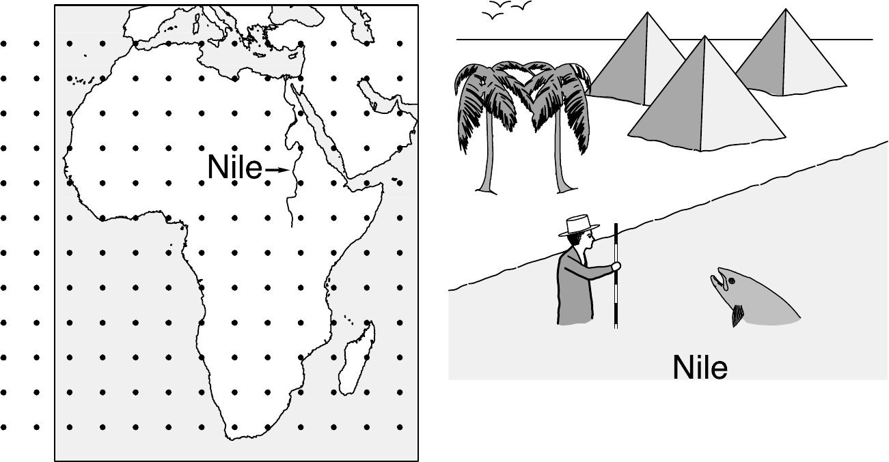
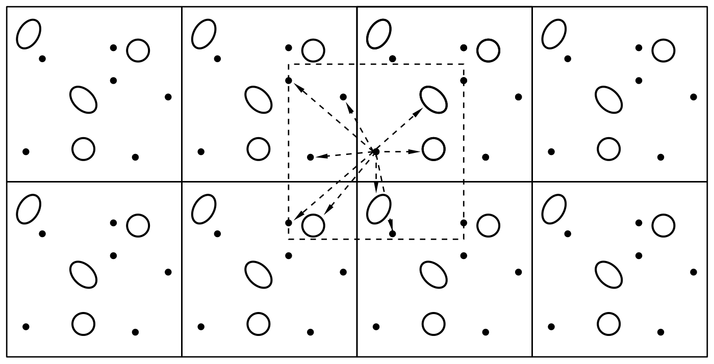
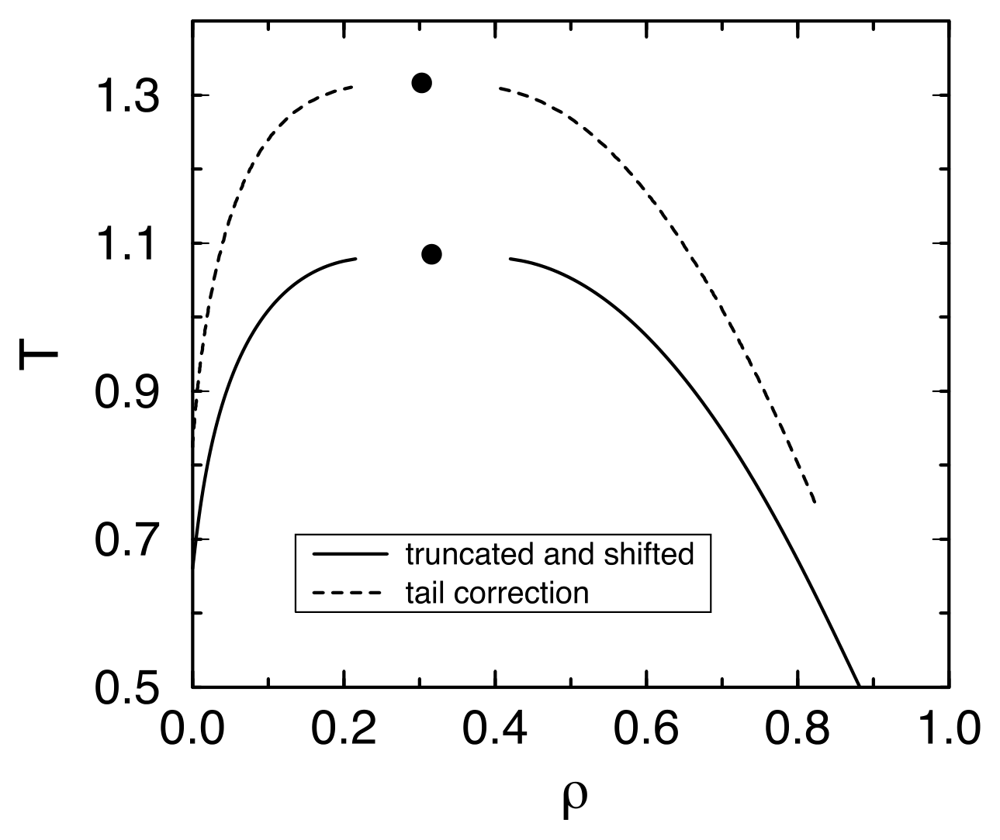
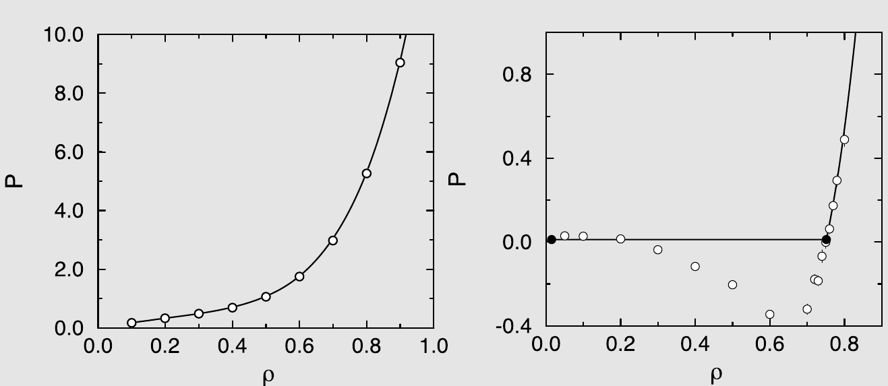
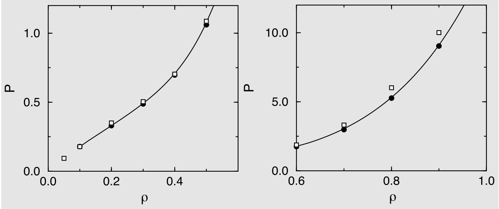
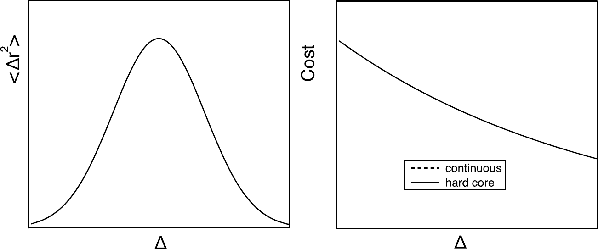
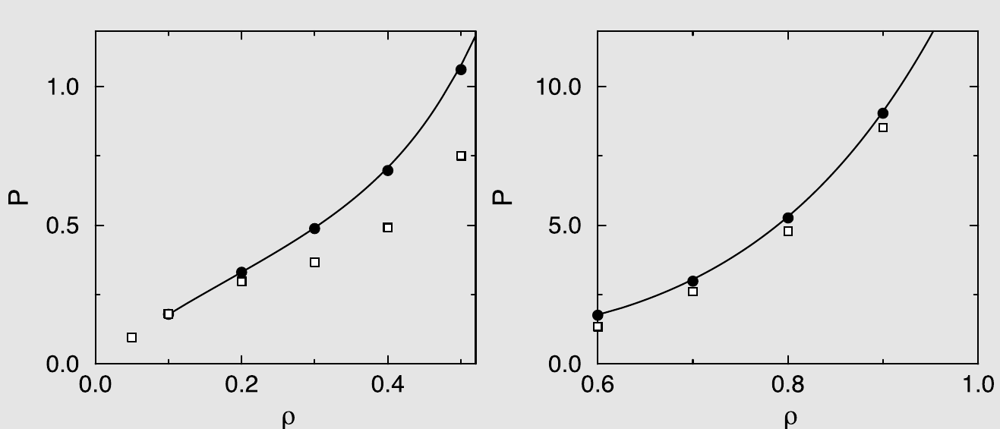
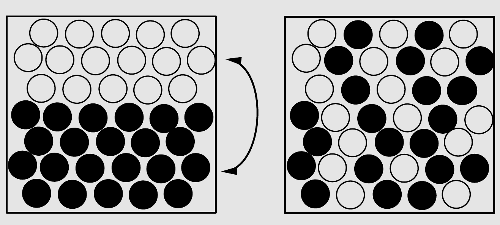

# Monte Carlo 模拟

## 引言：分子模拟

在上一章中，我们介绍了（经典）统计力学的基础知识。我们发现许多可观测量可以表示为时间平均，也可以表示为系综平均。在本书的后续部分，我们将讨论如何计算这些可观测量。需要强调的是，一旦我们开始使用数值技术，我们就放弃了精确结果。这是因为，首先，模拟会受到统计噪声的影响。这个问题可以通过更长时间的采样来缓解，但无法完全消除。其次，模拟包含系统误差，这与我们模拟的系统远非宏观有关：有限尺寸效应（finite-size effects）可能非常显著。同样，这个问题可以通过系统的有限尺寸标度分析来缓解，但该问题应当被认识到。第三，我们对牛顿运动方程进行了离散化。由此得到的轨迹并非系统的真实轨迹。这个问题在时间步长较短时变得不那么严重，但无法完全消除。最后，如果我们旨在模拟真实材料，就必须使用势能函数 $U(\mathbf{r}^N)$ 的近似描述。这种近似可能是好的——但永远不会是完美的。因此，在模拟中，我们总是预测模型系统的性质。在本书后续部分中，当我们提及真实材料的模拟时，读者应始终牢记这些近似，更不用说我们将使用经典描述而非量子描述这一事实。量子模拟技术超出了本书的范围。但关于成本与严格性之间权衡的一般性评论仍然适用，甚至比经典模拟更为适用。

计算经典多体系统可观测性质有两种不同的数值方法：一种称为分子动力学（Molecular Dynamics, MD）。顾名思义，分子动力学模拟生成牛顿运动方程的近似解，得到系统在相空间中的轨迹 $\mathbf{r}^N(t), \mathbf{p}^N(t)$[^1]。使用 MD 方法，我们可以计算可观测性质的时间平均，包括静态性质（如热力学可观测量）和动态性质（如输运系数）。虽然 MD 的实际实现并不总是简单的，但其背后的思想却是一目了然的。

相比之下，Monte Carlo（MC）方法（或者更准确地说，马尔可夫链 Monte Carlo（Markov-Chain Monte Carlo, MCMC）方法）背后的思想则是高度非平凡的。事实上，MCMC 方法的发展可以说是 20 世纪计算科学中最伟大的发现之一[^2]。本章讨论 MCMC 方法在经典多体系统中的应用基础。

MCMC 方法并不局限于计算多体系统的性质：每当我们有一个可以处于（非常）大量状态的系统，并且我们知道如何计算这些状态被占据的相对概率（例如玻尔兹曼权重），MCMC 方法就可以被使用。与 MD 不同，MCMC 不提供关于多体系统时间演化的信息。因此，MCMC 不能用于计算输运性质。

这可能暗示，在所有条件相同的情况下，MD 总是优于 MC。然而，条件并不总是相同的。特别是，正如我们将在后续章节中看到的，MD 模拟的优势恰恰也是其弱点：它必须遵循系统的自然动力学。如果自然动力学很慢，这就限制了 MD 模拟探索系统所有可达状态的能力。MC 在这方面受到的限制要小得多：正如我们将看到的，存在着巧妙的 Monte Carlo 方案，即使自然动力学很慢也能高效采样。此外，还有许多有趣的模型系统，例如没有自然动力学的格子模型。这些模型只能使用 Monte Carlo 模拟来研究。

## Monte Carlo 方法

下面，我们描述马尔可夫链 Monte Carlo 方法的基本原理，除非特别说明，此后我们通常将其简称为 Monte Carlo（MC）方法。首先，我们关注基本的 MC 方法，该方法可用于模拟在给定体积 ($V$) 和给定温度 ($T$) 下具有固定粒子数 ($N$) 的系统。为了保持符号简洁，我们最初关注没有内部自由度的粒子。为了引入 Monte Carlo 方法，我们从配分函数 $Q$ 的经典表达式出发（公式 (2.2.19)）：

$$
Q = c \int \mathrm{d}\mathbf{p}^N \mathrm{d}\mathbf{r}^N \exp[-\mathcal{H}(\mathbf{r}^N, \mathbf{p}^N)/k_BT],
\tag{3.2.1}
$$

其中 哈密顿量 $H \equiv H(\mathbf{r}^N, \mathbf{p}^N)$ 的定义与公式 (2.3.1) 相同。系统的 哈密顿量将总能量表示为组成粒子坐标和动量的函数：$H = K + U$，其中 $K$ 是动能，$U$ 是势能。恒定 $NVT$ 下经典系统的可观测量 $A \equiv A(\mathbf{p}^N, \mathbf{r}^N)$ 的平衡平均由公式 (2.2.20) 给出：

$$
\langle A \rangle = \frac{\int \mathrm{d}\mathbf{p}^N \mathrm{d}\mathbf{r}^N A(\mathbf{p}^N, \mathbf{r}^N) \exp[-\beta \mathcal{H}(\mathbf{p}^N, \mathbf{r}^N)]}{\int \mathrm{d}\mathbf{p}^N \mathrm{d}\mathbf{r}^N \exp[-\beta \mathcal{H}(\mathbf{p}^N, \mathbf{r}^N)]},
\tag{3.2.2}
$$

$K$ 是动量的二次函数，正如我们在公式 (2.3.3) 以下所论证的，对动量的积分可以解析完成，前提是 $A$ 是动量的简单函数，我们可以对其进行高斯积分。因此，仅依赖于动量的函数的平均通常容易计算[^3]。问题的困难部分在于计算依赖于坐标的函数 $A(\mathbf{r}^N)$ 的平均值。只有在少数例外情况下，粒子坐标的多维积分才能解析计算；在所有其他情况下，必须使用数值技术。

换言之，我们需要一种数值技术，使我们能够计算依赖于大量坐标（通常为 $O(10^3 \text{--} 10^6)$）的函数的平均。似乎最直接的方法是通过数值求积来计算式 (3.2.2) 中 $\langle A \rangle$ 的值，例如使用高维版本的 Simpson 法则。然而，容易看出这种方法是完全无用的，即使独立坐标数 $dN$（$d$ 是系统的维数）还相当小。例如，考虑对 $N = 100$ 个粒子的系统用求积计算式 (3.2.2) 那一类积分所需的计算量。这样的计算将涉及在 $dN$ 维构型空间的点网格上评估被积函数来进行求积。假设我们沿每个坐标轴取 $m$ 个等距点。需要评估被积函数的总点数等于 $m^{dN}$。对于除最小系统以外的所有系统，即使 $m$ 的值很小，这个数字也变得天文数字般庞大。例如，如果我们取三维中的 100 个粒子，$m = 5$，那么我们将需要在 $10^{210}$ 个点上评估被积函数！这种量级的计算在已知宇宙的寿命内无法完成。而这其实是幸运的，因为所得到的答案将受到很大统计误差的影响。毕竟，数值求积在被积函数在网格间距距离上光滑时效果最好。但对于大多数分子间势，式 (3.2.2) 中的玻尔兹曼因子是粒子坐标的一个快速变化函数。因此，精确地求积需要小的网格间距（即 $m$ 的大值）。此外，在对稠密液体评估被积函数时，我们会发现在绝大多数点上，玻尔兹曼因子趋于零。例如，对于凝固点处 100 个硬球的流体，玻尔兹曼因子在每 $10^{260}$ 个构型中只有一个是非零的！这个问题与求积点在网格上选择的事实无关：将积分估计为 $10^{260}$ 个随机选择的构型的平均同样无效。

显然，需要其他数值技术来计算热力学平均。其中一种技术是 Monte Carlo 方法，或者更准确地说，是 1953 年由 Metropolis 等人[[6]](references.md#ref-6) 引入的 Monte Carlo 重要性采样（importance sampling）算法。将该方法应用于原子和分子系统的数值模拟是本章的主题。

### Metropolis 方法

如上所述，通常来说，通过求积评估形如 $\int \mathrm{d}\mathbf{r}^N \exp[-\beta U(\mathbf{r}^N)]$ 的积分是不可行的。然而，在许多情况下，我们对配分函数的构型部分本身并不感兴趣，而是对以下类型的平均值感兴趣（参见公式 (2.3.9)）：

$$
\langle A \rangle = \frac{\int \mathrm{d}\mathbf{r}^N \exp[-\beta \mathcal{U}(\mathbf{r}^N)] A(\mathbf{r}^N)}{\int \mathrm{d}\mathbf{r}^N \exp[-\beta \mathcal{U}(\mathbf{r}^N)]}.
\tag{3.2.3}
$$

因此，我们希望知道两个积分的比值。Metropolis 等人[[6]](references.md#ref-6) 证明了可以设计一种高效的 Monte Carlo 方案来采样这样的比值。

注意，式 (3.2.3) 中 $\exp(-\beta U)/Z$ 的比值是在构型 $\mathbf{r}^N$ 附近找到系统的概率密度 $\mathcal{N}(\mathbf{r}^N)$（参见公式 (2.3.10) 和 (2.3.7)）：

$$
\mathcal{N}(\mathbf{r}^N) \equiv \frac{\exp[-\beta U(\mathbf{r}^N)]}{Z}.
$$

对于接下来的讨论，重要的是 $\mathcal{N}(\mathbf{r}^N)$ 是非负的。

假设我们能够以某种方式在构型空间中生成 $L$ 个点，这些点按照概率分布 $\mathcal{N}(\mathbf{r}^N)$ 分布。平均而言，在点 $\mathbf{r}^N$ 周围的小构型空间（超）体积[^4] $\delta d^N$ 内生成的点数 $n_j$ 将等于 $L\mathcal{N}(\mathbf{r}^N)\delta d^N$。假设有 $M$ 个子体积 $\delta d^N$，它们完全铺满构型空间 $V^N$。则

$$
M = \frac{V^N}{\delta d^N}.
$$

在 $L$ 和 $M$ 很大（$\delta d^N$ 很小）的极限下，

$$
\langle A \rangle \approx \frac{1}{L} \sum_{j=1}^{M} n_j A(\mathbf{r}^N_i).
\tag{3.2.4}
$$

与其将其写成对 $M$ 个单元的求和，不如将其写成对已采样的 $L$ 个点的求和：

$$
\langle A \rangle \approx \frac{1}{L} \sum_{i=1}^{L} A(\mathbf{r}^N_j).
\tag{3.2.5}
$$

需要注意的关键点是，为了评估此式，我们只需要知道 $n_j$ 与玻尔兹曼因子 $\exp[-\beta U(\mathbf{r}^N)]$ 成正比：未知的归一化因子 ($Z$) 不需要，因为 $n_j$ 被 $L = \sum_j n_j$ 归一化。因此，如果我们有一种方案，允许我们以与其玻尔兹曼权重成正比的频率生成点，那么我们就可以估计式 (3.2.3) 那一类平均值。现在，我们必须弄清楚如何以与其玻尔兹曼权重成正比的频率生成点。这种过程称为重要性采样（importance sampling），Metropolis Monte Carlo 方法[[6]](references.md#ref-6) 提供了一个简单的方案来实现这种重要性采样。

上述关于重要性采样概念的介绍可能听起来相当抽象：因此，让我们借助一个简单的例子来阐明求积和重要性采样之间的区别（参见图 3.1）。在该图中，我们比较了测量尼罗河深度的两种方法，即传统的求积方法（左）和 Metropolis 采样方法，即构建一个重要性加权的随机游走（右）。在传统的求积方案中，被积函数的值在预定的点集上测量。由于这些点的选择不依赖于被积函数的值，许多点可能位于被积函数为零的区域（在尼罗河的例子中：一个人无法在尼罗河之外测量尼罗河的深度——然而我们的大多数求积点都远离河流）。相比之下，在 Metropolis 方案中，在被积函数不可忽略的空间区域（即尼罗河本身）中构建一个随机游走。在这个随机游走中，如果一个试探移动把你带出了水面，它就被拒绝，否则就被接受。在每次试探移动（无论是否被接受）之后，测量水深。所有这些测量的（未加权）平均给出了尼罗河平均深度的估计。这就是 Metropolis 方法的本质。原则上，传统的求积方案会给出相同的答案，但它需要非常细的网格，而且大多数采样点都是无关的。求积的优势（如果可行的话）在于它还允许我们计算尼罗河的总面积。在重要性采样方案中，关于总面积的信息无法直接获得，因为这个量类似于构型积分 $Z$。在后续章节中，我们将讨论计算 $Z$ 的数值方案。



*图 3.1　测量尼罗河深度：传统求积方法（左）与 Metropolis 方案（右）的比较。*

到目前为止，我们已经解释了通过重要性采样计算平均值所需的内容：我们必须能够以与其玻尔兹曼权重成正比的频率在构型空间中生成点。问题是：如何做到？

理想情况下，我们将使用一种方案，在构型空间中生成大量具有所需玻尔兹曼权重的独立点。这种方法称为静态 Monte Carlo 采样（static Monte Carlo sampling）。静态 MC 的优点是每个构型都与前一个构型统计独立。传统上，这种方法仅在非常简单的情况下使用，例如生成正态分布的点，在这种情况下我们可以解析地将 0 到 1 之间均匀分布的随机数映射到高斯分布[[66]](references.md#ref-66)。然而，对于任何非平凡的多体系统，这种严格的解析方法是不可行的。

这就是为什么绝大多数 MC 模拟都是动态的原因：模拟生成一条构型的（马尔可夫）链，其中新构型以容易计算的从前一个构型生成的概率产生。Metropolis Monte Carlo 方法是这种动态方案的主要例子。使用动态 MC，可以以正确的玻尔兹曼权重生成构型。然而，该方案的缺点是连续的构型往往是相关的。因此，统计独立的构型数量少于构型的总数。

在继续描述（动态）MC 方法之前，我们注意到静态（或混合静态/动态）MC 方法正在经历复兴，这是由于机器学习获得的变换的应用（参见第 13.4.1 节）。然而，在本章以及随后的大部分章节中，我们专注于动态 Monte Carlo 方案。

为了推导 Metropolis 算法，让我们首先考虑所期望的算法必须以与其玻尔兹曼权重成正比的频率采样点这一事实的推论。这意味着，如果我们有 $L$ 个已经按玻尔兹曼分布的点，那么在每个点上应用我们算法的一步不应该破坏这个玻尔兹曼分布。注意这是一个“系综”论证：我们考虑同一模型系统的非常大量的 ($L$) 副本。考虑 $L \gg M$ 的极限是有用的，其中 $M$ 表示构型空间中的点数。当然，实际上，构型空间中的点数是不可数的——但在数值表示中，它是可数的，因为浮点数的位数有限。我们现在假设处于给定状态（比如 $i$）的系统副本数与该状态的玻尔兹曼因子成正比。接下来，我们对所有 $L$ 个系统执行一步 MC 算法。作为这一步的结果，个别系统可能最终处于另一个状态，但平均而言，每个状态中的系统数不应改变，因为这些数目由玻尔兹曼分布给出。

让我们考虑一个这样的状态，我们用 $o$（表示“旧”（old））来标记。状态 $o$ 具有未归一化的玻尔兹曼权重 $\exp[-\beta U(o)]$。我们可以计算这个玻尔兹曼权重，因为我们可以计算势能。Monte Carlo 算法不是确定性的：单步可以以不同概率产生不同结果（因此得名“Monte Carlo”）。让我们考虑在一个 MC 步中从状态 $o$ 移动到具有玻尔兹曼权重 $\exp[-\beta U(n)]$ 的新状态 $n$ 的概率。我们将此转移概率记为 $\pi(o \to n)$。让我们将最初处于状态 $o$ 的系统副本数记为 $m(o)$。由于我们从玻尔兹曼分布开始，$m(o)$ 与 $\exp[-\beta U(o)]$ 成正比。为了维持玻尔兹曼分布，状态 $n$ 中的副本数 $m(n)$ 应与 $\exp[-\beta U(n)]$ 成正比。转移概率 $\pi(o \to n)$ 应当构造为不破坏玻尔兹曼分布。这意味着在平衡态下，导致系统离开状态 $o$ 的接受试探移动的平均数必须精确地等于从所有其他状态 $n$ 到状态 $o$ 的接受试探移动数。我们注意到 $\langle m(o) \rangle$（状态 $o$ 中系统的平均数）与 $\mathcal{N}(o)$ 成正比（$n$ 也类似）。转移概率 $\pi(o \to n)$ 应满足以下平衡方程（balance equation）：

$$
\mathcal{N}(o) \sum_n \pi(o \to n) = \sum_n \mathcal{N}(n) \pi(n \to o).
\tag{3.2.6}
$$

此方程表达了流入和流出状态 $o$ 之间的平衡。注意 $\pi(o \to n)$ 可以被解释为一个矩阵（“转移矩阵”），它将系统的原始状态映射到新状态。在这个矩阵解释中，我们要求玻尔兹曼分布是转移矩阵的具有特征值 1 的特征向量。我们还注意到从给定状态 $o$ 到新状态 $n$ 的转移概率仅取决于系统的当前状态。因此，由矩阵 $\pi(o \to n)$ 描述的过程是一个马尔可夫过程。

原始的 Metropolis 算法基于比上式更强的条件，即在平衡态下，从 $o$ 到任何给定状态 $n$ 的接受移动的平均数被反向移动数精确平衡。这个条件被称为细致平衡（detailed balance）[^5]：

$$
\mathcal{N}(o)\pi(o \to n) = \mathcal{N}(n)\pi(n \to o).
\tag{3.2.7}
$$

转移矩阵 $\pi(o \to n)$ 的许多可能形式都满足上式。为了向 Metropolis 算法推进，我们利用可以将一个 Monte Carlo 移动分解为两个阶段的事实。首先，我们执行从状态 $o$ 到状态 $n$ 的试探移动。我们将确定从 $o$ 到 $n$ 执行试探移动概率的转移矩阵记为 $\alpha(o \to n)$，其中 $\alpha$ 通常被称为马尔可夫链的基础矩阵（underlying matrix）[[67]](references.md#ref-67)。

下一个阶段涉及接受或拒绝此试探移动的决定。让我们将从 $o$ 到 $n$ 接受试探移动的概率记为 $\text{acc}(o \to n)$。显然，

$$
\pi(o \to n) = \alpha(o \to n) \times \text{acc}(o \to n).
\tag{3.2.8}
$$

在原始的 Metropolis 方案中，$\alpha$ 被选为对称矩阵（$\alpha(o \to n) = \alpha(n \to o)$）。然而，在后续章节中，我们将看到 $\alpha$ 被选为非对称的几个例子。如果 $\alpha$ 是对称的，我们可以将平衡条件式 (3.2.6) 重写为 $\text{acc}(o \to n)$ 的形式：

$$
\mathcal{N}(o) \times \text{acc}(o \to n) = \mathcal{N}(n) \times \text{acc}(n \to o).
\tag{3.2.9}
$$

由式 (3.2.9) 可得[^6]：

$$
\frac{\text{acc}(o \to n)}{\text{acc}(n \to o)} = \frac{\mathcal{N}(n)}{\mathcal{N}(o)} = \exp\{-\beta[\mathcal{U}(n) - \mathcal{U}(o)]\}.
\tag{3.2.10}
$$

$\text{acc}(o \to n)$ 的许多选择都满足这个条件，当然，前提是概率 $\text{acc}(o \to n)$ 不能超过一。Metropolis 等人的选择是

$$
\text{acc}(o \to n) = \mathcal{N}(n)/\mathcal{N}(o) \quad \text{如果} \; \mathcal{N}(n) < \mathcal{N}(o)
\tag{3.2.11}
$$

$$
= 1 \quad \text{如果} \; \mathcal{N}(n) \geq \mathcal{N}(o).
$$

$\text{acc}(o \to n)$ 的其他选择也是可能的（有关讨论，参见例如[[21]](references.md#ref-21)），但在大多数条件下，Metropolis 等人的原始选择似乎比其他已提出的策略能更高效地采样构型空间。

总结：在 Metropolis 方案中，从状态 $o$ 到状态 $n$ 的转移概率为

$$
\begin{align}
\pi(o \to n) &= \alpha(o \to n) &\mathcal{N}(n) \geq \mathcal{N}(o) \nonumber \\
&= \alpha(o \to n)[\mathcal{N}(n)/\mathcal{N}(o)] &\mathcal{N}(n) < \mathcal{N}(o) \nonumber \\
\pi(o \to o) &= 1 - \sum_{n \neq o} \pi(o \to n). \nonumber
\tag{3.2.12}
\end{align}
$$

注意我们尚未指定矩阵 $\alpha$，只知道它必须是对称的。实际上，我们在选择对称矩阵 $\alpha$ 方面有相当大的自由度。这种自由度将在后续章节中得到利用。

我们尚未解释的一件事是如何决定试探移动是接受还是拒绝。通常的过程如下。假设我们已经生成了从状态 $o$ 到状态 $n$ 的试探移动，其中 $U(n) > U(o)$。根据式 (3.2.10)，这个试探移动应以概率

$$
\text{acc}(o \to n) = \exp\{-\beta[U(n) - U(o)]\} < 1
$$

被接受。为了决定是否接受试探移动，我们从区间 $[0,1]$ 上的均匀分布中生成一个（准）随机数，此处记为 $R$。显然，$R$ 小于 $\text{acc}(o \to n)$ 的概率等于 $\text{acc}(o \to n)$。现在，如果 $R < \text{acc}(o \to n)$ 我们接受试探移动，否则拒绝。这个规则保证了接受从 $o$ 到 $n$ 的试探移动的概率确实等于 $\text{acc}(o \to n)$。显然，重要的是我们的准随机数生成器确实在区间 $[0,1]$ 中均匀地生成数字。否则，Monte Carlo 采样将产生偏差。随机数生成器的质量绝不能被认为是理所当然的。关于随机数生成器的良好讨论可以在《Numerical Recipes》[[38]](references.md#ref-38) 和 Kalos 与 Whitlock 的《Monte Carlo Methods》[[37]](references.md#ref-37) 中找到。

到目前为止，我们还没有提到矩阵 $\pi(o \to n)$ 应满足的另一个条件，即它必须是不可约的（irreducible）（即构型空间中的每个可达点都可以在有限数量的 Monte Carlo 步中从任何其他点到达）。不可约性在 MC 中扮演着与 MD 中的遍历性（ergodicity）相同的角色，为了便于比较，我们将互换使用这些术语。虽然一些简单的 MC 方案被保证是不可约的，但这些通常不是最高效的方案。相反，许多高效的 Monte Carlo 方案要么尚未被证明是不可约的，要么更糟，已被证明违反不可约性。解决方案通常是将高效的、非遍历性的方案与偶尔的、效率较低但遍历性的方案的试探移动混合使用。整个方法将是遍历性的（至少原则上如此）。

MC 移动不需要满足的唯一标准是生成物理上合理的轨迹。在这方面，MC 与 MD 根本不同，听起来像是一个劣势的地方往往是优势。正如我们稍后将看到的，“非物理”的 MC 移动可以大大加速构型空间的探索并确保不可约性。然而，在许多应用中，MC 算法被设计为生成物理上合理的轨迹，特别是当模拟经历扩散布朗运动的粒子时。我们将在后面提及几个例子（参见第 13.3.2 节）。在这个阶段，我们只指出所有这些方案也必须是有效的 MC 方案。因此，目前的讨论是适用的。

### 节俭 Metropolis 算法

在标准 Metropolis MC 方法中，我们首先计算试探移动引起的能量变化，然后抽取随机数来决定其接受与否。在所谓的节俭 Metropolis 算法（Parsimonious Metropolis Algorithm, PMA）[[68]](references.md#ref-68) 中，第一步是抽取一个在 0 和 1 之间均匀分布的随机数 $R$。显然，Metropolis 规则意味着 $\beta\Delta E < -\ln R$ 的试探移动将被接受，因此看起来先计算 $R$ 并没有什么好处。然而，PMA 利用了这样一个事实：通常可以对 $\Delta E$ 设置边界 $\Delta E_{\max}$ 和 $\Delta E_{\min}$。显然，$\beta\Delta E_{\max} < -\ln R$ 的试探移动将被接受，而 $\beta\Delta E_{\min} > -\ln R$ 的试探移动将被拒绝。PMA 背后的思想是使用可以廉价地（预先）计算的边界。如何实现这一点取决于具体的实现方式：更多细节参见文献[[68]](references.md#ref-68)。我们将在第 13.4.4 节（公式 (13.4.30)）中看到先计算 $R$ 的相关例子，并以略微不同的形式出现在第 13.3.2 节描述的动力学 Monte Carlo 算法中（参见公式 (13.3.5)）。

## 基本 Monte Carlo 算法

以抽象的方式讨论 Monte Carlo 或分子动力学算法并没有很大帮助。解释它们如何工作的最佳方式是将它们写出来。本节将这样做。

大多数 Monte Carlo 或分子动力学程序的核心是简单的：通常只有几百行长。这些 MC 或 MD 算法可以嵌入标准程序包或为特定应用定制的程序中。所有这些程序和程序包往往是不同的，因此不存在所谓标准的 Monte Carlo 或分子动力学程序。然而，大多数 MD/MC 程序的核心如果不是完全相同的，至少是非常相似的——如果你理解了一个，你就理解了所有的。

下面，我们将构建一个 MC 程序的“核心”。它将是基本的，效率已为清晰性而牺牲。但它应该演示 Monte Carlo 方法的工作原理。在下一章中，我们将对分子动力学程序做同样的事情。

### 算法

如前一节所解释的，Metropolis（马尔可夫链）Monte Carlo 方法的构造使得访问构型空间中特定点 $\mathbf{r}^N$ 的概率与玻尔兹曼因子 $\exp[-\beta U(\mathbf{r}^N)]$ 成正比。在 Metropolis 等人[[6]](references.md#ref-6) 引入的方法的标准实现中，我们使用以下方案：

1. 随机选择一个粒子[^7]，并计算其对系统能量的贡献 $U(\mathbf{r}^N)$[^8]。
1. 给粒子一个随机位移 $\mathbf{r}' = \mathbf{r} + \Delta$，并计算其新的势能 $U(\mathbf{r}'^N)$。
1. 以如下概率接受从 $\mathbf{r}^N$ 到 $\mathbf{r}'^N$ 的移动：
   $$
   \text{acc}(o \to n) = \min\{1, \exp\{-\beta[\mathcal{U}(\mathbf{r}'^N) - \mathcal{U}(\mathbf{r}^N)]\}\}.
   \tag{3.3.1}
   $$

这种基本 Metropolis 方案的实现如算法 1 和算法 2 所示。

**算法 1　Metropolis MC 代码的核心**

```
program MC
// basic Metropolis algorithm
for $1 \leq \text{itrial \leq \text{ntrial}$}
// perform ntrial MC trial moves
 mcmove
// trial move procedure
if (itrial \% nsamp) == 0
// \% denotes the Modulo operation
 sample
// sample procedure
end if
end for
end program
```

**具体说明**（一般说明见第 1 章「算法」）：

1. 函数 mcmove 尝试位移一个随机选择的粒子（参见算法 2）。
1. 函数 sample 每 nsample 次试探移动采样一次可观测量。

**算法 2　Monte Carlo 试探位移**

```
\function{mcmove}
// Metropolis MC trial move
 i = int(R*npart) + 1
// select random particle with $1 \leq i \leq$ npart
 eno = ener(x(i), i)
// eno: energy particle i at ``old'' position x(i)
 xn = x(i) + (R - 0.5)*delx
// trial position xn for particle i
 enn = ener(xn, i)
// enn: energy of i at xn
if R < exp[-$\beta$*(enn - eno)]
// Metropolis criterion
 x(i) = xn
// if accepted, x(i) becomes xn
end if
end function
```

**具体说明**（一般说明见第 1 章「算法」）：

1. npart：粒子数。x(npart) 位置数组。$T = 1/\beta$，最大步长 $= 0.5 \times \text{delx}$。
1. 函数 ener(x)：使用算法 5 中所示的方法计算位置 $x$ 处粒子的相互作用能。
1. $R$ 生成一个在 0 和 1 之间均匀分布的随机数。
1. int(z) 返回 $z$ 的整数部分。
1. 注意，如果构型被拒绝，旧构型被保留。

### 技术细节

计算 Monte Carlo 模拟中的平均值可以使用一些技巧来加速。理想情况下，节省计算时间的方案不应以系统的方式影响模拟结果，但这通常并不完全正确。主要原因是宏观系统的模拟是不可行的：因此，我们在微观（数百到数百万粒子）系统上进行模拟。这种有限系统的性质通常与宏观系统的性质略有不同，但有时差异很大。类似地，即使对于中等大小的系统，通常也是有利的做法是避免显式计算相距很远的粒子之间的非常弱的分子间相互作用。在这两种情况下，这些近似的影响可以通过我们下面讨论的方法来缓解。但无论情况如何，关键是我们应该意识到节省时间的技巧可能引入的系统误差，并尽可能纠正它们。

我们下面讨论的许多节省时间的手段对 MC 和 MD 模拟是类似的。与其在 MD 章节中重复本节，我们不如在下面的讨论中在相关时同时提及两种类型的模拟。然而，我们还不会假设读者熟悉 MD 模拟的技术细节。在这个阶段，与我们讨论相关的 MD 的唯一特征是，在 MD 模拟中，我们必须计算作用于所有粒子的力。



*图 3.2　周期性边界条件的示意图。*

#### 边界条件

原子或分子系统的 Monte Carlo 和分子动力学模拟旨在提供宏观样品性质的信息。然而，分子模拟中通常研究的自由度数量从数百到数百万不等[^9]。显然，这样的粒子数仍然远未达到热力学极限。特别是对于小系统，不能安全地假设边界条件（例如自由、硬壁或周期性）的选择对系统性质的影响可以忽略不计。事实上，在具有自由边界的三维 $N$ 粒子系统中，位于表面的所有分子的比例与 $N^{-1/3}$ 成正比。例如，在 1000 个原子的简单立方晶体中，约 49\% 的原子位于表面，对于 $10^6$ 个原子，这个比例仅下降到 6\%。因此，我们应该预期这种小系统的性质将受到表面效应的强烈影响。

为了模拟体相（bulk phases），必须选择能够模拟无限体相环绕我们 $N$ 粒子模型系统存在的边界条件。这通常通过使用周期性边界条件（periodic boundary conditions）来实现。包含 $N$ 个粒子的体积被视为由相同单元组成的无限周期晶格的原胞（primitive cell）（参见图 3.2）。给定粒子（比如 $i$）现在与这个无限周期系统中的所有其他粒子相互作用，即同一周期单元中的所有其他粒子和所有其他单元中的所有粒子（包括其自身的周期像）。例如，如果我们假设所有分子间相互作用都是对可加的，则任何一个周期箱中 $N$ 个粒子的总势能为

$$
U_{\text{tot}} = \frac{1}{2} \sum_{i, j, \mathbf{n}}' u(|\mathbf{r}_{ij} + \mathbf{n}L|),
$$

其中 $L$ 是周期箱的直径（为方便起见假设为立方体），$\mathbf{n}$ 是三个整数的任意向量，求和号上的撇号表示当 $\mathbf{n} = 0$ 时排除 $i = j$ 的项。在这种一般形式下，周期性边界条件并不特别有用，因为为了模拟体相行为，我们不得不将势能写成无限求和而非有限求和[^10]。如下一节所讨论的，我们在实践中经常处理短程相互作用。在这种情况下，通常可以截断超过某个截断距离 $r_c$ 的所有分子间相互作用，并对所有更长程的相互作用进行近似处理。

虽然周期性边界条件的使用是模拟均匀体相系统的一种出人意料有效的方法，但人们应该始终意识到这样的边界条件仍然会引起宏观体相系统中不存在的虚假关联。特别是，模型系统周期性的一个后果是只允许与边界条件周期性兼容的波长的涨落：仍然能放入周期箱中的最长波长是 $\lambda = L$。在预期长波长涨落重要的情况下（例如在临界点附近），应该预期使用周期性边界条件会有问题。周期性边界条件也破坏了系统的旋转对称性。一个后果是在各向同性流体中粒子周围的平均密度分布不是球对称的，而是反映了周期性边界条件的立方（或更低）对称性[[70]](references.md#ref-70)。这些效应随着系统尺寸增大而变得不那么重要。

**周期性边界：一个误称？**

“周期性边界条件”（Periodic Boundary Conditions）这个术语有时会造成混淆，因为“边界”一词的使用。周期性原胞晶格的原点可以在所研究的模型系统中的任何位置选择，而这种选择不会影响任何可观测性质。因此，“边界”没有物理意义（但参见第 11.2.2 节）。相比之下，周期性单元的形状及其取向并不总是可以随意选择的。特别是对于晶体或其他具有位置有序的系统，模拟箱的形状和取向必须与物理系统的内禀周期性兼容。

#### 相互作用的截断

让我们考虑具有短程、对可加相互作用的系统模拟的具体情况。在这种语境下，短程意味着给定粒子 $i$ 的总势能主要由与截断距离 $r_c$ 以内的邻近粒子的相互作用所主导。忽略与更远距离粒子的相互作用所产生的误差可以通过选择足够大的 $r_c$ 而变得任意小。当使用周期性边界条件时，$r_c$ 小于 $L/2$（周期箱直径的一半）的情况特别值得关注，因为在这种情况下，我们只需要考虑给定粒子 $i$ 与任何其他粒子 $j$ 的最近周期像（有时称为最小像，Minimum Image）的相互作用（参见图 3.2 中的虚线框）。严格来说，也可以选择将粒子相互作用的计算限制在最近像，而不施加球形截断。然而，在这种情况下，大于 $L/2$ 距离的对相互作用将取决于连接粒子中心的直线的方向。显然，这种虚假的角度依赖性可能导致人为效应，通常应避免（但不总是：参见第 11 章）。

如果分子间势在 $r \geq r_c$ 时并非严格为零，在 $r_c$ 处截断分子间相互作用将导致 $U_{\text{tot}}$ 中的系统误差。正如我们下面讨论的，通常可以近似地校正对势的截断。

理想情况下，计算出的可观测性质的值应该对对势截断距离的精确选择不敏感，前提是我们校正了截断程序的影响。然而，对于截断距离的最常见选择，不同的截断程序可能给出不同的答案，其后果是严重的。例如，文献中充满了具有 Lennard-Jones 类对势的模型研究。然而，不同作者通常使用不同的截断程序，结果是很难比较声称研究同一模型的不同模拟。

有几个因素使得势的截断成为一项棘手的工作。首先，应该认识到虽然势能函数的绝对值随粒子间距 $r$ 减小（对于足够大的 $r$），但邻居的数量是 $r$ 的快速递增函数：与给定原子距离 $r$ 处的粒子数渐近地以 $r^{d-1}$ 增长，其中 $d$ 是系统的维数。作为一个例子，让我们计算简单模型系统截断对势的效应。在均匀相中，给定原子 $i$ 的平均势能（三维情况下）为

$$
u_i = (1/2) \int_0^{\infty} \mathrm{d}r \, 4\pi r^2 \rho(r) u(r),
$$

其中 $\rho(r)$ 表示距原子 $i$ 距离 $r$ 处的平均数密度。因子 $(1/2)$ 已被包括以校正分子间相互作用的重复计算。如果我们在距离 $r_c$ 处截断势，我们就忽略了尾部贡献 $u_{\text{tail}}$：

$$
u_{\text{tail}} \equiv (1/2) \int_{r_c}^{\infty} \mathrm{d}r \, 4\pi r^2 \rho(r) u(r),
\tag{3.3.2}
$$

其中我们省略了下标 $i$，因为在体相流体中，系统中的所有原子都经历等价的环境。为了简化 $u_{\text{tail}}$ 的计算，通常假设对于 $r \geq r_c$，密度 $\rho(r)$ 等于流体体相中的平均数密度 $\rho$。

如果分子间相互作用衰减得足够快，可以通过向 $U_{\text{tot}}$ 添加尾部贡献来校正由于在 $r_c$ 处截断势而产生的系统误差：

$$
\mathcal{U}_{\text{tot}} = \sum_{i < j} u_{\text{trunc}}(r_{ij}) + \frac{N\rho}{2} \int_{r_c}^{\infty} \mathrm{d}r \, u(r) 4\pi r^2,
\tag{3.3.3}
$$

对于三维原子系统。将此式推广到其他维度是直接的。式中 $u_{\text{trunc}}(r)$ 表示在距离大于截断距离 $r_c$ 处已被截断的对势能函数，$\rho$ 是流体体相中的平均数密度。

由于假设 $\rho(r)$ 在 $r > r_c$ 时等于体相密度 $\rho$ 所产生的近似在 $r_c$ 的选择越小时越差。从上式可以看出，除非势能函数 $u(r)$ 比 $r^{-3}$ 衰减得更快（三维情况下），否则势能的尾部校正将发散。如果分子间的长程相互作用以色散力（dispersion forces）为主导，则满足此条件。然而，对于库仑或偶极相互作用的重要情况，尾部校正发散，因此最近像约定不能用于这种系统。在这种情况下，应显式考虑与所有周期像的相互作用。第 11 章讨论了如何解决这个问题。

为了给出文献中使用的截断程序的具体例子，让我们考虑在分子模拟中非常流行的 Lennard-Jones（LJ）[[71,72]](references.md#ref-71) 势[^11]。Lennard-Jones $12-6$ 势具有以下形式：

$$
u_{\text{LJ}}(r) = 4\epsilon \left[\left(\frac{\sigma}{r}\right)^{12} - \left(\frac{\sigma}{r}\right)^{6}\right].
\tag{3.3.4}
$$

在下文中，我们将此势称为 Lennard-Jones 势。对于截断距离 $r_c$，三维情况下 LJ 对势的尾部校正 $u_{\text{tail}}$ 为

$$
\displaystyle
u_{\text{tail} = \frac{1}{2} 4\pi\rho \int_{r_c}^{\infty} \mathrm{d}r \, r^2 u(r) = \frac{1}{2} 16\pi\rho\epsilon \int_{r_c}^{\infty} \mathrm{d}r \, r^2 \left[\left(\frac{\sigma}{r}\right)^{12} - \left(\frac{\sigma}{r}\right)^{6}\right] = \frac{8}{3}\pi\rho\epsilon\sigma^3 \left[\frac{1}{3}\left(\frac{\sigma}{r_c}\right)^{9} - \left(\frac{\sigma}{r_c}\right)^{3}\right].
}
\tag{3.3.5}
$$

对于截断距离 $r_c = 2.5\sigma$，势已衰减到约为阱深 $1/60$ 的值。这似乎是一个很小的值，但实际上尾部校正通常不可忽略。例如，在典型液体密度 $\rho\sigma^3 = 1$ 下，我们发现 $u_{\text{tail}} = -0.535\epsilon$。这个数值相对于每原子的总势能当然不可忽略（在典型液体密度下几乎为 10\%）；因此，虽然我们可以在 $2.5\sigma$ 处截断势，但我们不能忽略这种截断的影响。注意，上述尾部校正假设我们考虑的是均匀系统。在界面附近，尾部校正的简单表达式失去有效性，实际上，计算得到的表面张力对所使用的截断程序敏感得令人沮丧[[74]](references.md#ref-74)。对于固体中的吸附，Jablonka 等人[[75]](references.md#ref-75) 证明了添加尾部校正有助于获得更一致的结果。

在模拟中有几种截断相互作用的方法——一些截断势，一些截断力，还有一些使力在 $r_c$ 处连续消失。虽然所有这些方法都旨在产生相似的结果，但应该认识到它们产生的结果可能差异显著，特别是在临界点附近[[76–78]](references.md#ref-76)（参见图 3.3）。



*图 3.3　具有不同截断方式的三维 Lennard-Jones 模型的气液共存曲线。该图显示了势的截断对估计临界点位置（大黑点）的影响。上方曲线给出了在 $r_c = 2.5\sigma$ 处截断并添加尾部校正以考虑 $r_c$ 以外距离相互作用的 Lennard-Jones 势的相包络线。下方曲线显示了用于分子动力学模拟的势（即截断并偏移的势，同样 $r_c = 2.5\sigma$）的估计气液共存曲线[[78]](references.md#ref-78)。*

截断势的常用方法有：

1. 简单截断（Simple truncation）
1. 截断并偏移（Truncation and shift）
1. 截断并力偏移（Truncation and force-shift）（即 $u(r)$ 和力都在 $r_c$ 处变为零）

**简单截断**

截断势的最简单方法是忽略 $r_c$ 以外的所有相互作用。在这种情况下，我们将模拟具有以下形式势的模型：

$$
u_{\text{trunc}}(r) = \begin{cases} u_{\text{LJ}}(r) & r \leq r_c \\ 0 & r > r_c \end{cases}.
\tag{3.3.6}
$$

如上所述，这种截断可能导致我们对真实 Lennard-Jones 模型势能的估计产生相当大的误差。此外，由于截断的对势在 $r_c$ 处不连续变化，这种势不适用于标准分子动力学模拟。

截断势可以用于 Monte Carlo 模拟中，有时确实如此（例如在具有方阱或方肩势的简单模型系统的模拟中）。然而，在这种情况下，应该意识到由于势在 $r_c$ 处的不连续变化，压力存在一个“脉冲式”贡献。对于其他情况下的连续势，不建议使用纯粹的简单截断（虽然如有必要，可以计算压力的脉冲贡献）。

补偿对势截断的常用（近似）方法是向我们计算的结构性质添加尾部校正。势能的尾部校正已在上面讨论过，见式 (3.3.5)。我们将在第 5 章讨论压力的计算。为了完整起见，这里我们给出三维情况下压力的尾部校正表达式：

$$
\Delta P_{\text{tail}} = \frac{4\pi\rho^2}{6} \int_{r_c}^{\infty} \mathrm{d}r \, r^2 \, \mathbf{r} \cdot \mathbf{f}(r) = \frac{16}{3} \pi\rho^2\epsilon\sigma^3 \left[\frac{2}{3}\left(\frac{\sigma}{r_c}\right)^{9} - \left(\frac{\sigma}{r_c}\right)^{3}\right],
\tag{3.3.7}
$$

其中第二行考虑了 Lennard-Jones 势的具体例子。通常，压力的尾部校正甚至大于势能的尾部校正。对于 $r_c = 2.5$ 的 LJ 模型在 $\rho = 1$ 时，$\Delta P_{\text{tail}} \approx -1.03$，这显然是非常大的。

**截断并偏移**

在分子动力学模拟中，重要的是力不是奇异的，并且理想情况下应使对势的更高阶导数也是连续的。

最简单的程序是将对势偏移，使其在 $r_c$ 处连续为零。此时力不是奇异的，但其一阶导数是。截断并偏移的势为

$$
u_{\text{tr-sh}}(r) = \begin{cases} u(r) - u(r_c) & r \leq r_c \\ 0 & r > r_c \end{cases}.
\tag{3.3.8}
$$

当然，具有截断并偏移势的系统的势能和压力与使用未截断对势获得的值不同。与之前一样，我们可以近似地校正分子间势修改对势能和压力的影响。对于压力，尾部校正与式 (3.3.7) 相同。对于势能，除了长程校正外，我们还必须添加一个贡献，等于在给定粒子距离 $r_c$ 以内的平均粒子数，乘以（未截断）对势在 $r_c$ 处值的一半。因子 $1/2$ 用于校正分子间相互作用的重复计算。

在具有各向异性相互作用的模型中应用截断并偏移势时应小心。在这种情况下，截断不应在分子质心之间距离的固定值处进行，而应在 对势具有固定值的点处进行，否则势无法在截断面上的所有点处偏移到零。对于 Monte Carlo 模拟，这不会产生严重问题，但对于分子动力学模拟，这将是相当糟糕的，因为系统将不再守恒能量，除非截断和偏移引起的脉冲力被显式考虑。

**截断并力偏移**

为了使力也在 $r_c$ 处连续消失，可以使用截断、偏移并力偏移的势。具有此性质的势有很多选择。最简单的是：

$$
u_{\text{tr-sh}}(r) = \begin{cases} u(r) - u(r_c) + f(r_c)(r - r_c) & r \leq r_c \\ 0 & r > r_c \end{cases}.
\tag{3.3.9}
$$

同样，相应的尾部校正可以被推导出来。这种截断并力偏移的 Lennard-Jones 势的一个例子是由 Kincaid 和 Hafskjold 提出的[[79,80]](references.md#ref-79)。

#### 尽可能使用不需要截断的势

从上述讨论中应该清楚，对势使用不同的截断程序会产生许多问题。当然，如果我们需要使用截断和尾部校正不可避免的模型，我们别无选择。

Lennard-Jones 势通常仅被用作一种“典型的”短程原子间势，其中较大距离处的精确行为是无关紧要的。在这些条件下，使用一种在 $r_c$ 处二次方趋于零的廉价势会好得多。其中一种势是[[81]](references.md#ref-81)：

$$
u(r)_{\text{WF}} \equiv \begin{cases} \epsilon \left[\left(\frac{\sigma}{r}\right)^{2} - 1\right]\left[\left(\frac{r_c}{r}\right)^{2} - 1\right]^2 & \text{for } r \leq r_c \\ 0 & \text{for } r > r_c \end{cases}.
\tag{3.3.10}
$$

Wang-Ramirez-Dobnikar-Frenkel（WF）势在 $r_c = 2$ 时类似于 Lennard-Jones 势，而在 $r_c = 1.2$ 时，它可以描述胶体之间的典型短程相互作用（参见[[81]](references.md#ref-81)）。在本书中，我们在许多练习中使用这种势，因为它消除了尾部校正的需要。

如前几段所示，计算对可加相互作用的成本可以通过仅显式考虑截断距离 $r_c$ 以内粒子之间的相互作用来降低。然而，即使我们使用截断程序，我们仍然必须决定给定粒子对是否在距离 $r_c$ 以内。由于在 $N$ 粒子系统中有 $N(N-1)/2$ 个（最近像）距离，似乎我们需要计算 $O(N^2)$ 个距离，然后才能计算相关相互作用。在最朴素的模拟中（事实上这对于直径小于约 3–4 个 $r_c$ 的系统来说是完全足够的），这正是我们要做的。然而，对于更大的系统（比如 $10^6$ 个粒子），$N(N-1)/2$ 对应约 $10^{12}$ 个距离，这使模拟变得不必要地昂贵。幸运的是，存在更先进的方案，允许我们预先对粒子进行排序，使得评估所有截断相互作用只需要 $O(N)$ 次操作。其中一些技巧在附录 I 中讨论。然而，为了理解基本的 MC 或 MD 算法，这些节省时间的手段不是必需的。因此，在第 4.2.2 节讨论的示例中，我们将描述一个使用简单 $O(N^2)$ 算法计算所有相互作用的分子动力学程序（参见算法 5）。

#### 初始化

为了开始模拟，我们应该为系统中的所有粒子分配初始位置。由于系统的平衡性质不（或至少不应该）依赖于初始条件的选择，所有合理的初始条件原则上都是可接受的。如果我们希望模拟特定模型系统的固态，合乎逻辑的做法是将系统制备为我们感兴趣的晶体结构。相反，如果我们对流相感兴趣，有几种选择：一种对于具有连续相互作用的系统越来越受欢迎的方法是将系统制备在一个随机构型中（这通常具有非常高的能量），然后通过能量最小化将系统弛豫到一个不太病态的构型。这种方法不太适合具有硬核相互作用的稠密系统，因为最小化不适用于这种系统。对于这种系统，但实际上也适用于所有其他系统，可以简单地在所需的目标密度和温度下以任何方便的晶体结构制备系统。如果我们幸运的话，这种晶体将在模拟的早期阶段（即在平衡运行期间）自发熔化，因为在典型液态点的温度和密度下，固态可能不是力学稳定的。然而，这里应该小心，因为即使晶体结构在热力学上不稳定，它也可能是亚稳的。因此，将晶体结构用作接近凝固曲线的液体的模拟起始构型是不明智的。在这种情况下，最好从更高温度或更低密度的系统（在该条件下固体甚至连亚稳态都不是）的最终（液体）构型开始模拟。无论如何，为了加速平衡，通常建议使用先前在附近状态点进行的模拟的最终（已充分平衡的）构型（如果有这种构型可用）作为新运行的起始构型，并将温度和密度调整到所需值。

系统的平衡性质不应依赖于初始条件。如果在模拟中仍然观察到这种依赖性，有两种可能性。第一种是我们的结果反映了我们模拟的系统确实具有非遍历行为。例如，在玻璃态材料或低温替代型无序合金中就是这种情况。第二种更常见的解释是我们模拟的系统是遍历的，但我们对构型空间的采样不充分；换言之，我们还没有达到平衡。

#### 约化单位

在模拟中节省时间的一种方法是避免重复，即避免对同一状态点进行两次相同的模拟。乍一看，人们可能认为这种重复只会因错误而发生，但这并不完全正确。假设一个小组已经研究了氩的 Lennard-Jones 模型在 60 K 和密度 840 kg/m$^3$ 下的热力学性质。另一个小组希望研究氙的 Lennard-Jones 模型在 112 K 和密度 1617 kg/m$^3$ 下的性质。人们可能期望这些模拟会产生完全不同的结果。然而，如果我们不使用 SI 单位，而是使用模型的自然单位（即 LJ 直径 $\sigma$、LJ 阱深 $\epsilon$ 和分子质量 $m$）作为我们的单位，那么在这些“约化”单位下，这两个状态点是相同的。氩的结果可以简单地重新标度以获得氙的结果。

对于上述 Ar 与 Xe 的例子，两个模拟都由同一个约化密度 $(N\sigma^3/V) \equiv \rho^* = 0.5$ 和同一个约化温度 $k_B T/\epsilon \equiv T^* = 0.5$ 来刻画。用约化单位、即用无量纲数来刻画系统状态，这在科学与工程中非常常见。例如，雷诺数 $(vL/\eta)$ 或佩克莱数 $(vL/D)$ 这类无量纲群在流体力学中被广泛用来比较那些乍看之下可能相当不同的系统的性质：想想在风洞中测试飞机模型，以预测真实飞机在相同（或至少相似）条件下的行为。

约化单位受模拟工作者的欢迎，但不太受实验工作者的欢迎，后者喜欢看到用 SI 单位表示的量（不过，从 kcal 和 Å 这类非 SI 单位的流行程度来看，这一点其实也不完全成立）。要在模拟中构造约化单位，我们需要为模型选定长度的自然单位，以及能量和质量的单位。这些选择并不唯一，但对形如 $u(r) = f(r/\sigma)$ 的对势（见公式 (3.3.4)），取 $\sigma$ 作为长度单位、$\epsilon$ 作为能量单位是合乎逻辑的。

众所周知的 Lennard-Jones 势具有 $u(r) = f(r/\sigma)$ 的形式（见公式 (3.3.4)），因此对基本单位的一个自然（尽管并不唯一）的选择如下：

- 长度单位：$\sigma$
- 能量单位：$\epsilon$
- 质量单位：$m$（系统中原子的质量）

由这些基本单位可导出所有其他单位。例如，时间单位为

$$
\sigma\sqrt{m/\epsilon},
$$

温度单位为

$$
\epsilon/k_B .
$$

用这些约化单位（以上标 $*$ 表示）来表示时，约化对势 $u^* \equiv u/\epsilon$ 是约化距离 $r^* \equiv r/\sigma$ 的无量纲函数。例如，Lennard-Jones 势的约化形式为

$$
u^*_{\text{LJ}}(r^*) = 4\left[\left(\frac{1}{r^*}\right)^{12} - \left(\frac{1}{r^*}\right)^{6}\right].
\tag{3.3.11}
$$

按照这些约定，我们可以定义如下约化单位：势能 $U^* = U\epsilon^{-1}$、压力 $P^* = P\sigma^3\epsilon^{-1}$、密度 $\rho^* = \rho\sigma^3$、温度 $T^* = k_B T \epsilon^{-1}$。对于公式 (3.3.10) 给出的简单势[[81]](references.md#ref-81)，其约化形式为

$$
u^*_{\text{WF}}(r^*) = \left[\left(\frac{1}{r^*}\right)^{2} - 1\right]\left[\left(\frac{2}{r^*}\right)^{2} - 1\right]^{2}.
$$

**Lennard-Jones 氩的约化单位到实际单位的换算（$\epsilon/k_B = 119.8$ K，$\sigma = 3.405\times10^{-10**

| 物理量 | 约化单位 |  | 实际单位 |
| --- | --- | --- | --- |
| 温度 | $T^* = 1$ | $\leftrightarrow$ | $T = 119.8$ K |
| 密度 | $\rho^* = 1.0$ | $\leftrightarrow$ | $\rho = 1680$ kg/m$^3$ |
| 时间 | $t^* = 0.005$ | $\leftrightarrow$ | $t = 1.09\times10^{-14}$ s |
| 压力 | $P^* = 1$ | $\leftrightarrow$ | $P = 41.9$ MPa |

注意单位的选择并不唯一：对 LJ 势，我们同样可以选取势阱最小值的位置 $r_m = \sigma\times2^{1/6}$ 作为长度单位。在这种情况下，约化的 LJ 势具有如下形式：

$$
u^{**}_{\text{LJ}}(r^{**}) = \left(\frac{1}{r^{**}}\right)^{12} - 2\left(\frac{1}{r^{**}}\right)^{6},
$$

其中我们用下标 $**$ 表示该标度势是按 $r_m$（而非 $\sigma$）标度得到的。当然，对模拟结果而言，长度标度的选择是无关紧要的。

使用约化单位的另一个实际理由如下：当我们使用真实（SI）单位时，会发现所计算的量（例如一个粒子的平均能量或它的加速度）的绝对数值要么远小于 1，要么远大于 1。如果我们用标准浮点乘法把若干这样的量相乘，就有可能在某个阶段得到一个造成上溢或下溢的结果。反之，在约化单位下，几乎所有我们关心的量都是 1 的量级（比如说，在 $10^{-3}$ 与 $10^{3}$ 之间）。因此，如果我们在模拟中突然发现一个非常大（或非常小）的数（比如 $10^{42}$），那么很有可能我们要么发现了某种有趣的东西，要么在某处犯了错误（通常是后者）。换句话说，约化单位使错误更容易被发现。

用约化单位得到的模拟结果总是可以换算回实际单位。例如，若我们希望把 Lennard-Jones 模型在 $T^* = 1$、$P^* = 1$ 下的模拟结果与氩的实验数据（$\epsilon/k_B = 119.8$ K，$\sigma = 3.405\times10^{-10}$ m，$M = 0.03994$ kg/mol）作比较，就可以用表 3.1 给出的换算关系把模拟参数转换为 SI 单位[^12]。

???+ example "例 1（Lennard-Jones 流体的状态方程-I）"

    分子模拟的一个重要应用是计算给定模型体系的相图。在后面若干章中，我们将讨论为研究相变而发展起来的一些技术，其中包括直接共存模拟。然而，直接共存模拟可能受滞后效应的困扰，这使它们不太适合用于精确定位相变。在本例中，我们将说明：当用标准 Monte Carlo 模拟来确定相图时，会出现哪些问题。作为例子，我们关注 Lennard-Jones 流体的气-液曲线。当然，正如第 3.3.2.2 节中已经提到的，相行为对所使用的分子间势的具体形式相当敏感。在本例中，我们用如下方式近似完整的 Lennard-Jones 势：

    $$
    u(r) = \begin{cases} u_{\text{LJ}}(r) & r \leq r_c \\ 0 & r > r_c, \end{cases}
    $$

    其中截断半径 $r_c$ 取为盒长的一半。该截断半径以外粒子的贡献用通常的尾部校正来估计；即对能量

    $$
    u_{\text{tail}} = \frac{8}{3}\pi\rho\left[\frac{1}{3}\left(\frac{1}{r_c}\right)^{9} - \left(\frac{1}{r_c}\right)^{3}\right],
    $$

    对压力

    $$
    P_{\text{tail}} = \frac{16}{3}\pi\rho^2\left[\frac{2}{3}\left(\frac{1}{r_c}\right)^{9} - \left(\frac{1}{r_c}\right)^{3}\right].
    $$

    Lennard-Jones 流体的状态方程已被许多研究组用分子动力学或 Monte Carlo 模拟研究过，最早可追溯到 Wood 与 Parker 的工作[[69]](references.md#ref-69)。对 Lennard-Jones 流体状态方程的第一次系统性研究由 Verlet 报道[[14]](references.md#ref-14)。此后又有大量研究陆续发表。1979 年，Nicolas 等人[[82]](references.md#ref-82) 把当时可得的数据整理成一个精确的状态方程。Johnson 等人[[83]](references.md#ref-83) 又用当时最好的数据对该方程重新做了拟合。自 Johnson 等人的工作以来，关于 Lennard-Jones 流体状态方程的研究还出现了许多，使状态方程得到进一步改进。如今 Lennard-Jones 流体的状态方程数目之多，以至于关于“针对哪种性质该选用哪一个方程”的讨论，我们只能请读者参阅 Stephan 等人的综述[[84]](references.md#ref-84)。在本例中，我们把数值结果与 Johnson 等人的状态方程作比较，后者对此目的而言已足够精确。

    我们使用算法 1 和算法 2 进行了若干次模拟。在模拟过程中，我们测定了每个粒子的能量和压力。压力用位力（virial）$W$ 计算：

    $$
    P = \frac{\rho}{\beta} + \frac{W}{V},
    \tag{3.3.12}
    $$

    其中位力定义为

    $$
    W = \frac{1}{3}\sum_i \sum_{j>i} \mathbf{f}(r_{ij}) \cdot \mathbf{r}_{ij},
    \tag{3.3.13}
    $$

    $\mathbf{f}(r_{ij})$ 为分子间力。图 3.4（左）比较了在临界温度以上的模拟所得压力与 Johnson 等人[[83]](references.md#ref-83) 的状态方程。二者符合得非常好（这也在意料之中）。

    

    *图 3.4　Lennard-Jones 流体的状态方程。（左）$T = 2.0$ 处的等温线。（右）临界温度以下（$T = 0.9$）的等温线；水平线为饱和蒸气压，实心圆表示共存的气相与液相的密度。实线为 Johnson 等人[[83]](references.md#ref-83) 的状态方程，圆圈为模拟结果（$N = 500$）。右图中的水平线对应于对 Johnson 状态方程施加麦克斯韦构造所得的共存压力。麦克斯韦构造利用了共存两相化学势相等这一事实，它意味着 $P_{\mathrm{coex}} = \int_{V_{\mathrm{liq}}}^{V_{\mathrm{vap}}} \mathrm{d}V\, P(V)/(V_{\mathrm{vap}} - V_{\mathrm{liq}})$。数值数据的统计误差小于符号尺寸。*

    图 3.4（右）给出了低于临界温度的一条典型等温线。如果把体系冷却到临界温度以下，我们应当预期观察到气-液共存。然而，对小的模型体系做标准 Monte Carlo 或分子动力学模拟，并不适合研究两相之间的共存。利用 Johnson 状态方程，我们可以预测宏观 Lennard-Jones 体系在两相区内压力应有的行为（见图 3.4）。对于共存区内的密度，压力应当是常数，并等于饱和蒸气压。然而，如果我们现在对一个有限体系（500 个 LJ 粒子）做 Monte Carlo 模拟，就会发现算出的压力在共存区内根本不是常数（见图 3.4）。事实上我们观察到，在很宽的密度范围内，被模拟的体系是亚稳的，甚至可能出现负压。原因在于：在有限体系中，产生一个气-液界面要付出相对可观的自由能代价；代价之大，以至于对足够小的体系，体系干脆完全不发生相分离反而更有利[[85]](references.md#ref-85)。显然，对于小体系、以及界面自由能较大的情形，这些问题最为严重。因此，不推荐用标准 $NVT$ 模拟来确定气-液共存曲线；就此而言，也不推荐用它来确定小体系中的任何强一级相变。

    为确定气-液共存曲线，我们应当在共存区之外的大量状态点上测定状态方程，然后把这些数据拟合到一个解析的状态方程上。有了这个状态方程，我们就可以确定气-液曲线（这正是 Nicolas 等人[[82]](references.md#ref-82) 和 Johnson 等人[[83]](references.md#ref-83) 所采用的做法）。

    当然，如果我们模拟的体系包含足够多的粒子，模拟液相与其蒸气共存是可能的。然而这类模拟很耗时，因为使两相体系达到平衡需要很长时间。

    图 3.4 中的状态方程对应于完整的 Lennard-Jones 势（用尾部校正近似）。然而，截断方式的差异会导致 Lennard-Jones 流体具有不同的状态方程。例如，Thon 等人为截断并偏移的 Lennard-Jones 流体建立了一个状态方程[[86]](references.md#ref-86)，而后者正是分子动力学模拟中通常使用的势。

    更多细节参见 SI（案例研究 1）。

### 细致平衡与平衡

有效的马尔可夫链 Monte Carlo 算法在数量上没有明显的上界，而本书中我们只会遇到已被提出的全部算法中很小的（但希望是重要的）一部分。显然，能够证明所提出的算法将导致对体系平衡性质的正确采样，是十分重要的。有两个主要因素可能导致采样不正确：第一是算法不具遍历性，即它没有连通所有具有非零玻尔兹曼权重的平衡构型[^13]。可以说，非遍历性对 MD 而言比对 MC 而言是更大的问题：为一个 MD 算法证明类似遍历性的性质，当然要比为一个设计良好的 MC 算法证明困难得多。导致采样不正确的第二个因素是：所访问的状态没有以正确的权重被采样。对于正确模拟牛顿运动方程的 MD 算法而言，这不成问题（我们将在第 4 章更清楚地阐述这一点）。而对于 Monte Carlo 算法，证明它们生成所采样状态的正确玻尔兹曼分布则是关键的。

确保 MC 算法实现玻尔兹曼采样的最常见做法，是施加细致平衡条件（见式 (3.2.7)）。然而，如前所述，细致平衡条件是充分的，但不是必要的。Manousiouthakis 与 Deem [[87]](references.md#ref-87) 证明了：较弱的“平衡条件”是保证对可达状态进行玻尔兹曼采样的充分必要条件。放弃细致平衡约束，使我们能够自由使用范围广得多的 Monte Carlo 策略。但这种自由是有代价的：证明不满足细致平衡的 MC 算法的正确性并不总是容易的。这就是为什么过去人们常常回避非细致平衡的 MC 算法。不过近年来，Krauth 及其合作者发展了一类强大的非细致平衡 MC 算法[[88,89]](references.md#ref-88)。我们将在第 13 章讨论其中的一些算法。

这里我们只给出一个简单的例子：一个有效但不满足细致平衡的 MC 算法。在算法 2 所示的简单 Monte Carlo 方案中，我们随机选取一个粒子并给它一个随机的试探位移。在下一次试探移动中选中同一粒子并试图把它移回原位的先验概率，与执行正向移动的概率是相同的。把这种生成试探移动的做法与 Metropolis 接受规则结合起来，所得算法满足细致平衡。

另一种可能的方案是顺序地尝试移动所有粒子，即先尝试移动粒子 1，接着尝试移动粒子 2，依此类推。在这种顺序方案中，一次单粒子移动之后紧接着其逆移动的概率为零。因此，该方案显然违反细致平衡。然而 Manousiouthakis 与 Deem 证明了（在相当弱的条件下——见文献[[87]](references.md#ref-87)），这样的顺序更新方案确实满足平衡条件，因而确实给出正确的 MC 采样。

如果尚未证明违反细致平衡的算法满足平衡条件，我们完全有理由对它们保持不信任。对于组合了不同试探移动的“复合”算法，尤其如此。

因此，细致平衡条件是发展新型 Monte Carlo 方案时的一条重要指导原则：在编写新程序时，明智的做法是先写一个施加细致平衡的版本，并用它获得一些参考数据。如果随后发现使用“仅满足平衡”的算法能显著改进一个可用程序的性能，那么实现它是值得的——但此时证明平衡条件得到满足就成了关键。

???+ example "例 2（细致平衡的重要性）"

    Monte Carlo 模拟的目标是按照玻尔兹曼权重对构型空间中的点进行采样。如果体系是遍历的，施加细致平衡对于保证玻尔兹曼采样是充分的，但不是必要的。换句话说：某些违反细致平衡的采样方案仍然可能给出正确的玻尔兹曼采样（见第 13.4.4 节）。然而，除非能够证明某个非细致平衡方案满足更一般的平衡条件，否则应当避免使用它。在本例中，我们将说明：使用不满足平衡条件的方案会导致系统误差。

    考虑一次普通的 $N,V,T$ 移动；新的试探位置通过给随机选中的粒子（比如粒子 $i$）一个随机位移来生成：

    $$
    x_n(i) = x_o(i) + \Delta x\,(R - 0.5),
    $$

    其中 $\Delta x$ 是最大位移的两倍。现在我们对算法做一个看似很小的改动，用下式生成新位置：

    $$
    x_n(i) = x_o(i) + \Delta x\,(R - 0.0) \qquad \text{（错误！）}
    $$

    也就是说，我们只给粒子正向的位移。这样的移动违反了细致平衡，因为逆向移动——把粒子放回 $x_o$——是不可能发生的。

    

    *图 3.5　Lennard-Jones 流体的状态方程（$T = 2.0$）；满足细致平衡的位移方案（圆圈）与不满足细致平衡的方案（方块）的比较。两组模拟均使用 500 个粒子。实线为 Johnson 等人[[83]](references.md#ref-83) 的状态方程。左图对应低压区，右图对应高压区。*

    对于 Lennard-Jones 流体，我们可以用案例研究 1 的程序来比较这两种采样方案。模拟结果示于图 3.5。乍看之下，错误方案的结果似乎是合理的；事实上在低密度下，两种方案的结果并没有显著差异。但在高密度下，错误的方案高估了压力。这种对压力的高估是一种系统误差：它不会因为我们做更长时间的模拟而消失。

    上面这个例子说明了一件重要的事：不能仅凭结果看起来合理就断定一个算法是正确的。模拟结果必须始终在我们已知正确答案的情形下加以检验：或者是已知的（且可信的）数值结果，但更好的是在某些极限情形（稀薄蒸气、致密固体等）下已知的精确结果。

    通常我们无法先验地知道 Monte Carlo 模拟中最优最大位移的大小。通过做一些简短的试算，我们可以探索在给定的模拟时长下，哪一个最大位移能给出最好的采样。然而，在正式产出运行期间不应改变最大步长，否则就会违反细致平衡[[90]](references.md#ref-90)：如果从一次移动到下一次移动，最大位移被减小了，那么粒子返回其先前位置的先验概率可能为零，这违反了微观可逆性。

    更多细节参见 SI（案例研究 2）。

    skip
    { 注 1：在事件链 MC（第 13.4.4 节）中，我们将看到一些只允许正向移动、却被设计成满足平衡条件的算法的例子。}

## 试探移动

在讨论并明确了 Metropolis MC 算法的一般结构之后，我们现在来考虑它的实现。为了进行模拟，我们需要一个所研究体系的模型，以及一个对其性质进行采样的算法。在现阶段，我们假设已经有了一个模型（即，给定粒子坐标后计算所有分子间相互作用的一套规则），并且已经把模型体系制备在一个合适的（不太病态的）初始构型上。现在我们必须决定如何生成试探移动。也就是说：我们必须明确式 (3.2.8) 中引入的矩阵 $\alpha$。我们必须区分两类试探移动：只涉及分子质心的移动，以及改变分子取向乃至构象的移动。稍后我们会看到，Monte Carlo 方法的一大优点在于，我们可以执行在体系的自然动力学中根本不存在对应物的“非物理”试探移动。这类非物理的试探移动往往能极大地提高 MC 算法的采样效率。在本章中，我们只简略地提及这类非物理移动（见例 4）。但在后面的章节中，我们将遇到大量展示非物理 MC 移动威力的实例。

### 平动移动

我们首先考虑分子质心的试探移动。生成试探位移的一种完全可以接受的方法，是给分子质心的 $x$、$y$、$z$ 坐标各加上一个介于 $-\Delta/2$ 与 $+\Delta/2$ 之间的随机位移：

$$
\begin{align}
x_i' &\to x_i + \Delta(R - 0.5) \nonumber\\
y_i' &\to y_i + \Delta(R - 0.5) \nonumber \\
z_i' &\to z_i + \Delta(\mathcal{R} - 0.5), \nonumber
\tag{3.4.1}
\end{align}
$$

其中 $\Delta/2$ 是位移的最大幅度，且如前所述，$R$ 表示均匀分布于 0 与 1 之间的随机数。显然，逆向的试探移动具有同样的概率（因此 $\alpha$ 是对称的）[^14]。现在我们面临两个问题：$\Delta$ 应取多大？以及，我们应当尝试同时移动所有粒子，还是一次移动一个？在后一种情形下，我们应当随机地挑选待移动的分子，以保证底层的马尔可夫链保持对称。在其他条件相同的情况下，我们应当选择最高效的采样程序。但为此，我们必须先定义“高效采样”的含义。用比较含糊的话说，如果采样让你花的钱物有所值，它就是高效的。在模拟中，“物有所值”对应于高的统计精度，而“钱”就是字面意义上的钱：买你的机时、甚至买你自己时间的钱。为便于论证，我们假定普通的科研程序员薪水微薄。那么我们只需担心计算预算和模拟的碳足迹[^15]。于是我们可以采用如下关于最优采样方案的定义：如果一个 Monte Carlo 采样方案能在给定的计算预算下，使待计算量的统计误差最小，则可认为它是最优的。通常，计算预算被折算成 CPU 时间。

从这个定义可以清楚地看出：原则上，一个采样方案可能对某个量是最优的，而对另一个量则不然。实际上，前面这个定义在实践中几乎毫无用处（多数定义都是如此）。例如，为若干种不同的 Monte Carlo 采样方案做一系列等长的运行，再去测量压力的误差估计，实在不值得。然而，可以合理地假定：可观测量的均方误差与在给定 CPU 时间内访问到的不相关构型数目成反比。而所访问的独立构型数目，又是构型空间中所走过距离的一种度量。这提示我们采用一个更易操作、尽管相当特设的判据来估计 Monte Carlo 采样方案的效率：所有被接受的试探位移的平方和除以计算时间。这个量应当与单位计算时间的均方位移相区别，因为后者在没有扩散时（例如在固体或玻璃中）趋于零，而前者不会。

利用这一近似的效率度量，我们可以对如下现象给出一个初步解释：在凝聚相的模拟中，通常一次随机位移一个粒子会更好（稍后我们会看到，对于相关位移，情况有所不同）。为理解为什么随机的单粒子移动更受青睐，考虑一个由 $N$ 个球形粒子组成的体系，其相互作用由势能函数 $U(\mathbf{r}^N)$ 描述。通常我们预期：如果体系的势能变化远大于 $k_BT$，试探移动就会被拒绝。但我们又希望在不使接受率过低的前提下，把 Monte Carlo 的试探步长取得尽可能大。一个平均而言使势能升高 $k_BT$ 的位移，仍会有合理的接受率。对于单粒子试探移动，我们有

$$
\begin{align}
\langle \Delta U \rangle &= \left\langle \frac{\partial U}{\partial r_i^{\alpha}} \right\rangle \overline{\Delta r_i^{\alpha}} + \frac{1}{2}\left\langle \frac{\partial^2 U}{\partial r_i^{\alpha} \partial r_i^{\beta}} \right\rangle \overline{\Delta r_i^{\alpha} \Delta r_i^{\beta}} + \cdots \nonumber\\
&= 0 + f(\mathcal{U})\,\overline{\Delta r_i^2} + \mathcal{O}(\Delta^4),
\tag{3.4.2}
\end{align}
$$

其中尖括号表示对系综求平均，上横线表示对随机试探移动求平均。$U$ 的二阶导数已被吸收进函数 $f(U)$ 中，其确切形式在此无关紧要。如果我们现在令上式左端的 $\langle \Delta U \rangle$ 等于 $k_BT$，就得到 $\overline{\Delta r_i^2}$ 的如下表达式：

$$
\overline{\Delta r_i^2} \approx k_BT/f(\mathcal{U}).
\tag{3.4.3}
$$

如果我们尝试逐个移动 $N$ 个粒子，其中大部分计算量花在计算势能变化上。假定我们使用了近邻表或类似的省时手段（见附录 I），用于计算势能变化的总时间正比于 $nN$，其中 $n$ 是每个分子的平均相互作用伙伴数。均方位移之和将正比于 $N\overline{\Delta r^2} \sim Nk_BT/f(U)$。因此，单位 CPU 时间的均方位移将正比于 $k_BT/(nf(U))$。现在假设我们试图一次移动所有粒子。CPU 时间的代价仍正比于 $nN$。但用与式 (3.4.2) 和 (3.4.3) 相同的推理可以估计出，均方位移之和要小一个 $1/N$ 因子。因此总效率也要低这同一个因子。这个简单的论证解释了为什么大多数模拟者使用单粒子试探移动而非集体试探移动。需要注意的是，我们这里假定了一次集体 MC 试探移动由 $N$ 个粒子各自独立的试探位移组成。正如第 13.3.1 节将要讨论的，如果各个粒子的试探位移不是独立选取的，是可以构造出高效的集体 MC 移动的。

#### 试探移动的最优接受率

接下来考虑决定试探移动大小的参数 $\Delta$ 的选取。$\Delta$ 该取多大？如果它非常大，所得构型很可能具有很高的能量，试探移动多半会被拒绝。如果它非常小，势能的变化多半也很小，于是大多数移动都会被接受。文献中常常能看到一种神秘的说法，称大约 50\% 的接受率应当是最优的。这种说法没有任何依据。最优的接受比是那个能带来构型空间最高效采样的接受比。事实上，Roberts 等人[[92,93]](references.md#ref-92) 针对 $n$ 维分布的一种特殊形式（并非玻尔兹曼形式）分析了高维空间中的 Metropolis 采样，发现当接受率为 23.4\% 时采样最高效。文献[[93]](references.md#ref-93) 中论证说，这一发现大概可以推广到更复杂的“非病态”分布。因此 Roberts 等人给出了如下经验法则：调节建议分布的方差，使平均接受率大致为 $1/4$。用我们的语言来说，“建议分布的方差”由试探步长的大小决定。所以，在其他条件相同的情况下，把目标接受率定在 25\% 而非 50\%，大概更可取。



*图 3.6　（左）粒子均方位移对试探移动平均步长 $\Delta$ 的典型依赖关系。（右）单次试探移动的计算开销对步长 $\Delta$ 的典型依赖关系。对于连续势，开销为常数；而对于硬核势，开销随试探移动步长的增大而迅速下降。*

但在多体体系的某些 MC 模拟中，最优接受率甚至可能更低。当被拒绝移动的计算开销小于被接受移动的开销时，就会出现这种情况。为了理解为何如此，让我们考虑 MC 随机游走在（高维）构型空间中的“扩散系数”（即单位 CPU 时间的均方位移）。我们将用这个扩散系数来比较不同 MC 算法的采样效率。不难看出，不同的 Monte Carlo 程序会有不同的最优接受比。原因在于：检验一次试探移动是否被接受所需的计算量，是否依赖于该移动的幅度，会造成关键性的差别（见图 3.6）。在常规的 Metropolis 方案中，所有连续相互作用都必须先算完，才能决定接受还是拒绝一次移动。因此对于连续势，计算量不依赖于试探移动的大小。相反，对于具有硬排斥核的粒子的模拟，一旦检测到与任一近邻发生重叠，移动就可以立即被拒绝。此时被拒绝的移动比被接受的移动更便宜，因而每次试探移动的平均计算时间会随着步长的增大而下降。结果，硬核体系的最优接受比明显低于具有连续相互作用的体系。究竟低多少，取决于程序的性质、近邻表信息的存储方式，甚至取决于随机数与指数运算的计算“成本”。目前的共识似乎是：对于硬核体系，最优接受比在 20\% 左右，甚至更低。不过，这同样只是又一条应当加以检验的经验法则[^16]。

前面讨论的效率判据有一个明显的缺点：它无法让我们察觉构型空间的采样是否具有遍历性。举一个具体的例子：假设我们的体系由若干被困在不同势能极小值中的粒子组成。显然，我们可以把这些极小值附近的区域采样得相当好，却仍然对整个构型空间的采样完全不充分。Mountain 与 Thirumalai [[94]](references.md#ref-94) 提出了一个能够察觉这种非遍历性的判据。这两位作者考察单粒子（势）能时间平均的方差之差。让我们用 $e_j(t)$ 表示粒子 $j$ 在时间区间 $t$ 内能量的时间平均：

$$
e_j(t) = \frac{1}{t}\int_0^t \mathrm{d}t'\, e_j(t').
$$

该时间区间内所有单粒子能量的平均为

$$
\overline{e}(t) \equiv \frac{1}{N}\sum_{j=1}^{N} e_j(t).
$$

我们感兴趣的方差是

$$
\sigma_E^2(t) \equiv \frac{1}{N}\sum_{j=1}^{N}\left[e_j(t) - \overline{e}(t)\right]^2 .
$$

如果所有粒子都采样了整个构型空间，则当 $t \to \infty$ 时 $\sigma_E^2(t)$ 将趋于零：

$$
\sigma_E^2(t)/\sigma_E^2(0) \to \tau_E/t,
$$

其中 $\tau_E$ 是获得不相关样本所需特征时间的一种度量。然而，如果体系是非遍历的（例如在自旋玻璃中），$\sigma_E$ 就不会衰减到 0。Mountain 与 Thirumalai 的工作提示：优化 Monte Carlo 方案效率的一个好办法，是使 $\tau_E$ 与每次试探移动所需机时之乘积最小化。利用这一方案，Mountain 与 Thirumalai 当时就已得出结论：即使对于 Lennard-Jones 体系，50\% 的试探移动接受率也远非最优。他们发现 20\% 的接受概率效率要高一倍，这与本节前面所述的观察结果一致。

当然，基于单个粒子能量涨落的方案，无法用于监测硬核体系模拟的收敛速度；就此而言，也无法用于任何我们无法定义给定粒子势能的体系（例如无法用对势描述的体系）。但该方法的精髓并不在于必须探测单粒子能量：任何对粒子局部环境敏感的量都可以胜任。例如，一个稳健的判据可以考察粒子的时间平均 Voronoi 签名的收敛情况。不同的环境给出不同的签名。只有当每个粒子都采样了所有环境时，所有粒子的平均 Voronoi 签名才会衰减到同一均值。

当然，在某些情形下，基于遍历性的效率判据并不适用。按其构造方式，它无法用于优化玻璃的模拟。而且在研究界面（例如固-液或液-气界面）时，遍历性判据会要求每个粒子都有充裕的时间去探索两个共存相。这显然是不必要的：冰可以与水处于平衡，尽管平衡所需的时间远不足以让两相中的分子完全交换。

???+ example "例 3（为什么要把旧构型再数一次？）"

    Metropolis 采样方案有一个多少有些反直觉的特点：如果一次试探移动被拒绝，我们应当把旧构型的贡献再一次计入正在计算的平均值中（见接受规则 (3.2.12)）。本例的目的是说明这种重复计数确实是必不可少的。在 Metropolis 方案中，从 $o$ 到 $n$ 的移动的接受规则为

    $$
    \begin{aligned}
    \text{acc}(o \to n) &= \exp\{-\beta[U(n) - U(o)]\} \qquad U(n) \geq U(o) \\
    &= 1 \qquad\qquad\qquad\qquad\qquad\quad  U(n) < U(o).
    \end{aligned}
    $$

    这些接受规则导致如下转移概率：

    $$
    \begin{aligned}
    \pi(o \to n) &= \exp\{-\beta[U(n) - U(o)]\} \qquad U(n) \geq U(o) \\
    &= 1 \qquad\qquad\qquad\qquad\qquad\quad  U(n) < U(o).
    \end{aligned}
    $$

    注意，这个转移概率必须是归一化的：

    $$
    \sum_n \pi(o \to n) = 1 .
    $$

    由这一归一化条件可知，我们再次接受旧构型的概率按定义为

    $$
    \pi(o \to o) = 1 - \sum_{n \neq o} \pi(o \to n).
    $$

    最后这个式子意味着，我们应当把旧构型的贡献再数一次。

    

    *图 3.7　Lennard-Jones 流体的状态方程（$T = 2.0$）；将持续位移粒子直至移动被接受的方案（方块）与常规方案（圆圈）进行比较。两组模拟均使用 108 个粒子。实线为 Johnson 等人[[83]](references.md#ref-83) 的状态方程。左图为低压，右图为高压。*

    用案例研究 1 中的 Lennard-Jones 程序，从数值上考察“只把被接受的构型计入平均”所造成的误差，是很有启发性的。实质上，这意味着在算法 2 中我们持续尝试位移所选中的粒子，直到有一次试探移动被接受为止。在图 3.7 中，我们把正确方案的结果与“持续位移粒子直到移动被接受”所得的结果作了比较。结果看起来同样合理，但图中显示存在很大的系统误差。

    更多细节参见 SI（案例研究 3）。

    skip
    { 注 1：不难看出，如果我们试图计算一个具有能级 $E_0$ 和 $E_1$ 的二能级体系的平均能量，这种做法会给出错误的答案。如果只把被接受的试探移动计入平均，我们将得到 $\langle E \rangle = (E_0 + E_1)/2$，与温度无关。}

### 取向移动

当我们模拟的是分子而非原子时[^17]，必须使用一套既能改变分子位置、又能改变其取向的试探移动。转动移动比平动移动更为微妙：要生成一个分布不满足底层马尔可夫链对称性要求的平动试探移动，几乎需要刻意为之。而对于转动移动，情况正相反：使用非对称的取向采样方案，太容易在分子的取向分布函数中引入系统性偏倚了。文献[[21]](references.md#ref-21) 讨论了几种不同的生成转动位移的策略。这里我们仅举一种做法为例。

#### 刚性线型分子

考虑一个由 $N$ 个线型分子组成的体系。我们用单位矢量 $\hat{u}_i$ 表示第 $i$ 个分子的取向。将 $\hat{u}_i$ 改变一个小的随机量的一种可行做法如下。首先，我们生成一个取向随机的单位矢量 $\hat{v}$。这很容易实现（见算法 38）。接着，我们把这个随机单位矢量 $\hat{v}$ 乘上一个标度因子 $\gamma$，$\gamma$ 的大小决定了试探转动的幅度。然后我们把 $\gamma\hat{v}$ 加到 $\hat{u}_i$ 上，把所得的和矢量记为 $\mathbf{t}$：$\mathbf{t} = \gamma\hat{v} + \hat{u}_i$。注意 $\mathbf{t}$ 不是单位矢量。最后我们把 $\mathbf{t}$ 归一化，所得结果就是我们的试探取向矢量 $\hat{u}_i'$。我们还必须确定 $\gamma$，它决定了取向试探移动的接受概率。$\gamma$ 的最优值基本上由与平动移动相同的判据决定。我们尚未说明平动与取向试探移动是否应当同时执行。两种做法都是可以接受的。不过，如果转动与平动对应于各自独立的移动，那么若要满足细致平衡，移动类型的选择就应当是概率性的，而不是确定性的。

#### 刚性非线型分子

非线型刚性分子的情形比线型分子稍微复杂一些。在分子物理学中，习惯上用欧拉角 $(\phi,\theta,\psi)$ 来描述非线型分子的取向。然而对多数模拟而言，使用这些角度并不方便，因为这样一来所有转动操作都必须用三角函数来表达，而三角函数的计算代价高昂。对分子动力学模拟来说，情况更糟：用欧拉角表示的运动方程在 $\theta = 0$ 处有奇点。通常更好的做法是用四元数（quaternion）参数来表示刚性非线型分子的取向（关于计算机模拟中四元数的讨论，见文献[[21]](references.md#ref-21)）。刚体的转动可以用一个单位模的四元数 $Q$ 来表示。这样的四元数可以被看作四维空间中的一个单位矢量：

$$
Q \equiv (q_0,q_1,q_2,q_3), \qquad q_0^2 + q_1^2 + q_2^2 + q_3^2 = 1 .
\tag{3.4.4}
$$

四元数分量 $q_\alpha$ 与欧拉角之间存在一一对应关系：

$$
\begin{align}
q_0 &= \cos\frac{\theta}{2}\cos\left(\frac{\phi + \psi}{2}\right), &
q_1 &= \sin\frac{\theta}{2}\cos\left(\frac{\phi - \psi}{2}\right), \nonumber\\
q_2 &= \sin\frac{\theta}{2}\sin\left(\frac{\phi - \psi}{2}\right), &
q_3 &= \cos\frac{\theta}{2}\sin\left(\frac{\phi + \psi}{2}\right),
\tag{3.4.5}
\end{align}
$$

而描述分子固定矢量在实验室坐标系中转动的转动矩阵 $\mathsf{R}$ 为（例如见文献[[95]](references.md#ref-95)）

$$
\mathsf{R} = \begin{pmatrix}
q_0^2 + q_1^2 - q_2^2 - q_3^2 & 2(q_1q_2 - q_0q_3) & 2(q_1q_3 + q_0q_2) \\
2(q_1q_2 + q_0q_3) & q_0^2 - q_1^2 + q_2^2 - q_3^2 & 2(q_2q_3 - q_0q_1) \\
2(q_1q_3 - q_0q_2) & 2(q_2q_3 + q_0q_1) & q_0^2 - q_1^2 - q_2^2 + q_3^2
\end{pmatrix}.
\tag{3.4.6}
$$

为了生成非线型刚体的试探转动，我们必须让矢量 $(q_0,q_1,q_2,q_3)$ 在四维（4d）单位球面上转动。上面所述的三维单位矢量转动做法很容易推广到四维。Vesely [[95]](references.md#ref-95) 提出了一种在 4d 单位球面上均匀生成随机矢量的高效方法。

#### 非刚性分子

如果所考虑的分子不是刚性的，那么我们还必须考虑改变分子内部自由度的 Monte Carlo 试探移动。在本节中，我们讨论并非完全刚性、但具有单一主导构象（或少数几个主导构象）的分子。对具有大量不同构象的分子进行 Monte Carlo 模拟的方法将在第 12 章讨论。

如果一个分子不是完全刚性的，情况相对简单：我们可以对分子中各个原子的笛卡尔坐标执行普通的试探移动（此外还要有质心移动）。如果其中某些原子被强烈束缚，建议对这些粒子执行较小的试探移动（没有任何规则禁止对不同原子使用不同大小的试探移动，只要对某一特定原子类型的移动始终从同一分布中采样即可）。但这类“原子”试探移动应当与试图把整个分子作平动或转动的试探移动结合起来。

这样看来，采样分子内自由度似乎是直截了当的，特别是当我们选取合适的坐标（例如键长或简正模）来描述分子结构时。然而，如果我们使用广义坐标（例如键角），就必须记住：从笛卡尔坐标到广义坐标的变换会在配分函数中引入雅可比行列式，更确切地说，是雅可比矩阵行列式的绝对值（一个简单的例子是从 $\{x,y,z\}$ 变换到 $\{r,\theta,\phi\}$：体积元 $\mathrm{d}x\,\mathrm{d}y\,\mathrm{d}z$ 变为 $r^2\sin\theta\,\mathrm{d}r\,\mathrm{d}\theta\,\mathrm{d}\phi$。雅可比因子 $r^2\sin\theta$ 反映了这样一个事实：在 $x$、$y$、$z$ 上均匀采样并不对应于在 $r$、$\theta$、$\phi$ 上均匀采样）。正如下面将要解释的，雅可比因子出现在 Monte Carlo 权重中可能是个麻烦，但并非不可逾越。当我们考虑某些坐标被固定（例如某个键长）的情形时，问题会变得更棘手。事实证明，在这种情况下，坐标约束是通过取极硬弹簧常数的极限来施加的，还是通过在拉格朗日量层面施加相应约束、把该坐标及其共轭速度一并消去来施加的，二者是有区别的（见附录 A）。拉格朗日约束法在 MD 模拟中被广泛使用（见第 14 章及文献[[96]](references.md#ref-96)），但这类模拟的结果只有在约束以完全相同的方式施加时，才能与 MC 模拟相比较（见文献[[97]](references.md#ref-97)）。施加同一约束的不同方式可能导致可观测的差异。一个众所周知的例子是键长固定的自由连接三聚体。正如 Van Kampen 所指出的，用刚硬弹簧约束键长所取的极限，给出的内角分布与在拉格朗日量层面施加同一约束时所得的分布并不相同[[98]](references.md#ref-98)（见第 14.1.1 节）。

为了理解为什么带有若干刚硬（甚至完全刚性）键（或键角）的柔性分子的 Monte Carlo 模拟会变得复杂，让我们回到函数 $A(\mathbf{r}^N)$ 热力学平均的表达式 (2.2.20)：

$$
\langle A \rangle = \frac{\int \mathrm{d}\mathbf{p}^N \mathrm{d}\mathbf{r}^N\, A(\mathbf{r}^N)\exp[-\beta \mathcal{H}(\mathbf{p}^N,\mathbf{r}^N)]}{\int \mathrm{d}\mathbf{p}^N \mathrm{d}\mathbf{r}^N \exp[-\beta \mathcal{H}(\mathbf{p}^N,\mathbf{r}^N)]}.
$$

我们首先考虑约束只是“刚硬”的情形，之后再考虑某些坐标被严格约束时会发生什么。为了对广义坐标 $\mathbf{q}^N$ 进行 Monte Carlo 采样，我们必须把上式中的哈密顿量用这些广义坐标及其共轭动量表示出来。最方便的做法是先考虑拉格朗日量 $\mathcal{L} \equiv K - U$，其中 $K$ 是体系动能（$K = \sum_{i=1}^{N}(1/2)m_i\dot{\mathbf{r}}_i^2$），$U$ 是势能。当我们从笛卡尔坐标 $\mathbf{r}$ 变换到广义坐标 $\mathbf{q}$ 时，$\mathcal{L}$ 变为

$$
\begin{align}
\mathcal{L} &= \sum_{i=1}^{N} \frac{m_i}{2}\frac{\partial \mathbf{r}_i}{\partial q_\alpha}\cdot\frac{\partial \mathbf{r}_i}{\partial q_\beta}\dot{q}_\alpha \dot{q}_\beta - U(\mathbf{q}^N) \nonumber\\
&\equiv \frac{1}{2}\dot{\mathbf{q}} \cdot \mathsf{G} \cdot \dot{\mathbf{q}} - \mathcal{U}(\mathbf{q}^N).
\tag{3.4.7}
\end{align}
$$

在上式第二行中，我们定义了矩阵 $\mathsf{G}$。与 $\mathbf{q}^N$ 共轭的动量易由下式导出：

$$
p_\alpha \equiv \frac{\partial \mathcal{L}}{\partial \dot{q}_\alpha},
$$

它给出 $p_\alpha = \mathsf{G}_{\alpha\beta}\dot{q}_\beta$。现在我们可以用广义坐标及其共轭动量写出哈密顿量 $\mathcal{H}$：

$$
\mathcal{H}(\mathbf{p},\mathbf{q}) = \frac{1}{2}\mathbf{p}\cdot\mathsf{G}^{-1}\cdot\mathbf{p} + \mathcal{U}(\mathbf{q}^N).
\tag{3.4.8}
$$

如果我们现在把这一形式的哈密顿量代入式 (3.2.2)，并对动量做（高斯）积分，就得到

$$
\begin{align}
\langle A \rangle &= \frac{\int \mathrm{d}\mathbf{q}^N \exp[-\beta U(\mathbf{q}^N)]A(\mathbf{q}^N)\int \mathrm{d}\mathbf{p}^N \exp(-\beta \mathbf{p}\cdot\mathsf{G}^{-1}\cdot\mathbf{p}/2)}{\int \mathrm{d}\mathbf{q}^N \mathrm{d}\mathbf{p}^N \exp(-\beta\mathcal{H})} \nonumber\\
&= \frac{\int \mathrm{d}\mathbf{q}^N \exp[-\beta \mathcal{U}(\mathbf{q}^N)]A(\mathbf{q}^N)|\mathsf{G}|^{1/2}}{\int \mathrm{d}\mathbf{q}^N \mathrm{d}\mathbf{p}^N \exp(-\beta\mathcal{H})}.
\tag{3.4.9}
\end{align}
$$

上式的麻烦在于 $|\mathsf{G}|^{1/2}$ 这一项。虽然对小的柔性分子而言行列式 $|\mathsf{G}|$ 还比较容易计算，但对较大的分子，计算它就会变成一件令人不快的任务。注意，因子 $|\mathsf{G}|^{1/2}$ 可以写成 $\exp(\ln|\mathsf{G}|/2)$：因此它表现为对玻尔兹曼因子的一个修正。

接下来考虑广义坐标的某个子集 $\{\sigma\}$ 被约束为固定值的情形，这必然也意味着 $\dot{\sigma} = 0$。这类硬约束必须在拉格朗日量层面施加，并导致体系自由度数目的减少。它们也导致式 (3.4.8) 中的哈密顿量具有不同的形式，并在式 (3.4.9) 中引入另一个行列式。同样，所有这些都可以在 Monte Carlo 采样中加以考虑（见文献[[97]](references.md#ref-97)）。这类 Monte Carlo 方案的一个例子，是 Theodorou 及其合作者为模拟聚合物熔体和玻璃而发展的协同转动（concerted rotation）算法[[99]](references.md#ref-99)（见 SI L.8.2）。该算法的思想是在链中选取一组相邻的骨架键（最多七个键），对这些键施加一个集体转动，而链的其余部分保持不变。相比之下，带硬约束的柔性分子的分子动力学模拟有一个优点：这些约束直接进入运动方程（见文献[[96]](references.md#ref-96)）。在第 12 章中，我们将讨论其他特别适合柔性分子的 Monte Carlo 采样方案。不过，这些方案并不能消除引入硬约束所带来的问题。

???+ example "例 4（硬盘混合物）"

    Monte Carlo 方案的一个重要缺点是，它不能重现体系中粒子的自然动力学。然而有时候，这一方法上的局限反而可以为我们所用。下面我们将说明，如何通过使用非物理的试探移动，把 Monte Carlo 模拟的平衡化过程加快许多个数量级。

    

    *图 3.8　硬盘混合物，其中两个粒子的身份被交换。*

    例如，在二元（$A$-$B$）硬盘混合物的分子动力学模拟中（见图 3.8），构型空间的采样效率会被浓度涨落衰减极慢这一事实大大降低：弛豫时间通常为 $\tau \sim D_{AB}/\lambda^2$，其中 $D_{AB}$ 是互扩散系数，$\lambda$ 是浓度涨落的波长。因此，要保证混合物局部组成达到平衡，需要极长的运行时间。在固体中，平衡化在模拟时间尺度、甚至实验时间尺度上都可能根本无法发生。与此相反，在 Monte Carlo 模拟中，我们可以执行交换 $A$、$B$ 两种组分的两个粒子身份的试探移动。这类移动即使只有中等的接受率（百分之几就够了），也能极大地加快晶体固体[[100,101]](references.md#ref-100) 和多分散玻璃[[102]](references.md#ref-102) 中浓度涨落的采样。

## 问题与练习

**问题 10（约化单位）。**氩和氪的 Lennard-Jones 势的典型参数（在 $r_c = 2.5\sigma$ 处截断并偏移）为 $\sigma_{\text{Ar}} = 3.405$ Å、$\epsilon_{\text{Ar}}/k_B = 119.8$ K，以及 $\sigma_{\text{Kr}} = 3.63$ Å、$\epsilon_{\text{Kr}}/k_B = 163.1$ K [[103]](references.md#ref-103)。

1. 在约化温度 $T^* = 2.0$ 下，氩和氪的温度各是多少开尔文？
1. MD 的典型时间步长为 $\Delta t^* = 0.001$。对氩和氪而言，这在 SI 单位下分别是多少？
1. 如果我们用 Lennard-Jones 势模拟 $T = 278$ K、密度 $\rho = 2000$ kg\,m$^{-3}$ 的氩，那么同一批数据可以用于氪的哪些条件？若假定理想气体行为，请分别以约化单位和常规单位计算压力。
1. 列出使用约化单位的主要理由。

 WF 势[[81]](references.md#ref-81) 是一种简单的、类 Lennard-Jones 的势，它在截断半径 $r_c$ 处以二次方式趋于零。对截断距离 $r_c = 2\sigma$，其函数形式特别简单（见式 (3.3.10)）：

$$
\phi(r) = \begin{cases}
\epsilon \left[ \left( \dfrac{\sigma}{r} \right)^2 - 1 \right] \left[ \left( \dfrac{r_c}{r} \right)^2 - 1 \right]^2 & r \leq r_c, \\[2ex]
0 & r > r_c .
\end{cases}
$$

在约化单位下，临界温度 $k_B T_c/\epsilon \approx 1.04$，约化临界密度 $\rho_c \sigma^3 \approx 0.32$。

1. 已知氩的临界温度为 $T_c = 83.1$ K，请给出 SI 单位下的 $\epsilon^{(\mathrm{WF})}$。
1. 已知氩的临界密度为 536 kg\,m$^{-3}$，请估计氩的 $\sigma^{(\mathrm{WF})}$（SI 单位）。

**问题 11（一种外星势）。**在氪星上，两个 Gaia 原子之间的对势由 Lennard-Jones 10–5 势给出：

$$
U(r) = 5\epsilon \left[ \left( \frac{\sigma}{r} \right)^{10} - \left( \frac{\sigma}{r} \right)^{5} \right] .
$$

氪星人出了名的懒，所以推导能量、压力和化学势的尾部修正就落到你头上了。如果我们在 MD 模拟中以截断并偏移的形式使用这个势，力仍然存在不连续性。为什么？把这个势与 Lennard-Jones 势相比较，模拟效率上会有差别吗？（提示：有两种效应！）

**练习 6（计算 $\pi$）。**考虑一个直径为 $d$ 的圆，外接一个边长为 $l$（$l \geq d$）的正方形。在正方形内均匀地随机生成坐标，$\pi$ 的值可以由落在圆内的点所占的比例算出。

1. 如何由落在圆内的点的比例计算 $\pi$？
1. 补全那个用此方法计算 $\pi$ 的小型 Monte Carlo 程序。把你的结果与 $\pi$ 的“精确”值比较：在某些语言中 $\pi$ 是预先给定的，在另一些语言中也很容易算出，例如用 $\pi = 4.0 \times \arctan(1.0)$。
1. 结果的精度如何依赖于比值 $l/d$ 和所生成坐标的数目？推导一个公式来计算 $\pi$ 估计值的相对标准差。
1. 为什么这不是一个精确计算 $\pi$ 的高效方法？

**练习 7（光子气体）。**光子气体中态 $j$ 的平均占据数 $\langle n_j \rangle$ 可以解析地算出，见式 (2.6.5)。也可以用 Monte Carlo 方案来估计这个量。本练习中我们用以下步骤计算 $\langle n_j \rangle$：

(i) 从任意的 $n_j$ 出发。
(ii) 随机决定执行一次使 $n_j$ 增加 1 或减少 1 的试探移动。
(iii) 以下述概率接受该试探移动：
   $$
   \text{acc}(o \to n) = \min\left(1, \exp[-\beta(U(n) - U(o))]\right) .
   $$

当然，$n_j$ 不能为负！

1. 当 $n_j = 0$ 时，该方案是否满足细致平衡？
1. 如果所执行的试探移动是把 $n_j$ 改变一个取自区间 $[-5,5]$ 的随机整数，算法是否仍然正确？如果只执行把 $n_j$ 改变 $-3$ 或 $+3$ 的试探移动，又会怎样？
1. 设 $N = 1$ 且 $\epsilon_j = \epsilon$。编写一个小型 Monte Carlo 程序，计算 $\langle n_j \rangle$ 随 $\beta$ 的变化，并把结果与解析解比较。
1. 修改程序，使得试探移动被拒绝时不更新平均值。为什么这会导致错误的结果？在哪些 $\beta$ 值下这一误差会更明显？
1. 修改程序，使之同时计算 $n_j$ 的分布，并把该分布与解析表达式比较。

**练习 8（Lennard-Jones 体系的 Monte Carlo 模拟）。**本练习研究三维 Lennard-Jones 体系（另见在线案例研究 1）。第 5 章给出了模拟中各种可观测量如何计算的细节。

1. 在本书网站提供的代码中并未计算体系的压力。请修改代码使之能够计算平均压力。你只需在计算能量的函数中作一些改动。
1. 在 $T = 2.0$ 及若干不同密度下进行模拟。理想气体定律
   $$
   \beta p = \rho
   \tag{3.5.1}
   $$
   在密度多大以下是一个好的近似？
1. 程序会输出体系状态的一系列快照。试用例如 Visual Molecular Dynamics（VMD）[[104]](references.md#ref-104) 之类的程序把这些快照可视化。
1. 对定容热容，可以推出
   $$
   C_v = \frac{\langle U^2 \rangle - \langle U \rangle^2}{k_B T^2} ,
   $$
   其中 $U$ 是体系的总能量。请推导无量纲热容的公式，并修改本书网站上的程序使之计算 $C_v$。
1. 除了每次只位移一个粒子的试探移动之外，也可以做一次位移全部粒子的试探移动。在两种做法都有 50\% 的位移被接受时，比较它们的最大位移。
1. 除了均匀分布的位移之外，也可以使用高斯分布的位移。这会提高模拟效率吗？

**练习 9（作为 Monte Carlo 移动的标度变换）。**考虑一个能量只是单个变量 $x$ 的函数的体系：

$$
\exp[-\beta U(x)] = \theta(x)\,\theta(1-x) ,
$$

其中 $\theta(x)$ 是亥维赛阶跃函数：$\theta(x<0) = 0$，$\theta(x>0) = 1$。我们希望计算正则系综中 $x$ 的分布，并考虑两种可能的算法（取 $\delta > 0$）：

(i) 在 $[-\delta, \delta]$ 内生成 $x$ 的随机改变量，按新 $x$ 的能量接受或拒绝。
(ii) 在 $[1, 1+\delta]$ 内生成一个随机数 $\varphi$，以 0.5 的概率把所得的 $\varphi$ 取倒数，再把 $x$ 乘以 $\varphi$ 得到新的 $x$。

1. 为这两种方案推导正确的接受/拒绝规则。
1. 补全计算 $x$ 的概率密度的程序代码。
1. 如果在方案 (ii) 的算法中使用方案 (i) 的接受规则，会发生什么？

---

[^1]: 我们用 $\mathbf{r}^N$ 表示系统中 $N$ 个粒子的 $x, y, z$ 坐标，$\mathbf{p}^N$ 表示相应的动量。
[^2]: 关于 Metropolis 方法早期历史的有趣叙述可在文献[[1,2,64,65]](references.md#ref-1) 中找到。
[^3]: 然而，在受约束的系统中需要特别注意；参见第 10.2.1 节。
[^4]: 我们使用符号 $\delta d^N$ 来表示系统 $\mathrm{d}N$ 维构型空间中的一个小超体积。
[^5]: 在第 13 章中，我们将讨论不满足细致平衡的强大 MC 算法。然而，它们满足平衡条件，因此维持玻尔兹曼分布。
[^6]: 显然，式 (3.2.10) 只有在 $\mathcal{N}$ 非负时才有意义。
[^7]: 在 MC 中随机选择粒子是标准做法，因为其他选择产生的算法不满足细致平衡。有趣的是，原始的 Metropolis 算法[[6]](references.md#ref-6) 是顺序移动粒子的，因此违反了细致平衡。然而，它确实满足平衡条件。在第 13.4.4 节中，我们将讨论打破细致平衡如何加速 MC 模拟的收敛。涉及随机选择粒子的试探移动的明确描述可以在 1957 年 Wood 和 Parker 的论文[[69]](references.md#ref-69) 中找到。
[^8]: 对于对可加的相互作用，这是直接的。然而，对于具有多体相互作用的系统，这应该是系统中依赖于所选粒子坐标的那部分势能。在最坏的情况下，这可能就是系统的总势能。
[^9]: 包含数十亿粒子的更大系统也可以被模拟，但考虑到高计算成本，这种模拟只有在较小系统无法捕捉本质物理时才会执行。
[^10]: 事实上，在第一个三维 Lennard-Jones 粒子的 MC 模拟中，Wood 和 Parker [[69]](references.md#ref-69) 讨论了这种无限求和的使用与现在讨论的常规方法之间的关系。
[^11]: 形式为 $r^{-n}$-$r^{-m}$ 的 Lennard-Jones 型势首先由当时仍名为 J.E. Jones 的 J.E. Lennard-Jones 引入[[71]](references.md#ref-71)，但 $12-6$ 形式的选择是在几年后才做出的[[72]](references.md#ref-72)。LJ 12-6 势（通常如此称呼）在模拟中的流行最初是因为它计算成本低廉，而且对液态氩效果良好（尽管是出于错误的原因[[73]](references.md#ref-73)）。到现在，它的流行主要是因为……它被如此广泛地使用。
[^12]: 在下文中，除非另有明确说明，我们都将使用约化单位。因此，此后我们将省略表示约化单位的上标 $*$。
[^13]: 当然，MC 算法的应用并不限于分子模拟。因此，这里的“玻尔兹曼权重”泛指任何决定状态分布的非负权重函数。
[^14]: 尽管几乎所有已发表的关于原子和分子体系的 MC 模拟都是在以原质心位置为中心的立方体内生成试探位移的，但这绝不是唯一的可能。有时在球形体积内生成试探移动更方便；甚至并不要求试探移动在该体积内均匀分布，只要它具有反演对称性即可。关于另一种采样方案更为可取的例子，参见文献[[91]](references.md#ref-91)。
[^15]: 尽管如此，我们仍要强调：除非你的程序会被非常频繁地运行，且百分之几的速度提升很重要，否则花大量时间去开发一个只比现有的、更简单的方案略好一点的花哨计算方案，是不值得的。
[^16]: 在第 13.4.3 节的式 (13.4.21) 中，我们将说明：即使对于连续势，也可以在算完所有相互作用之前就拒绝试探移动。有了这样的采样方案，硬核势与连续势在采样上的区别便几乎消失了。近年来这一思想得到了更多关注：参见第 13.4.3 节。
[^17]: 此处及下文中，我们用“分子”一词泛指任何取向会影响体系势能的粒子，无论大小。同样地，我们关于“原子型”粒子的许多讨论也适用于任何球对称的粒子：在这一意义上，球形胶体可以被视为一个“原子”。