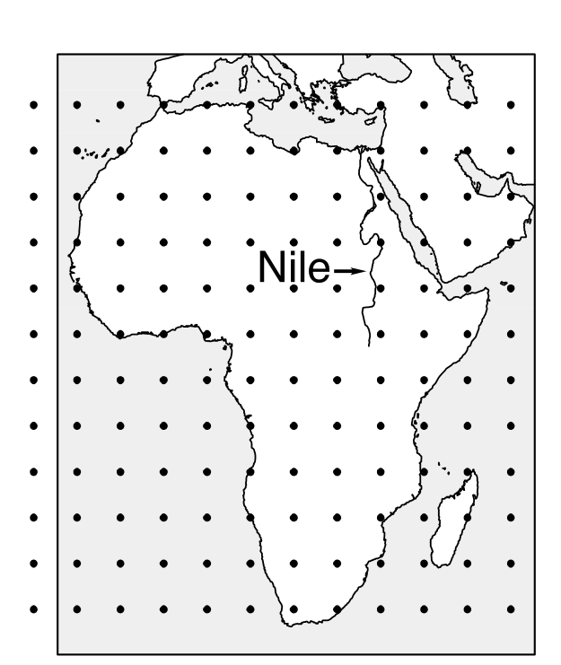
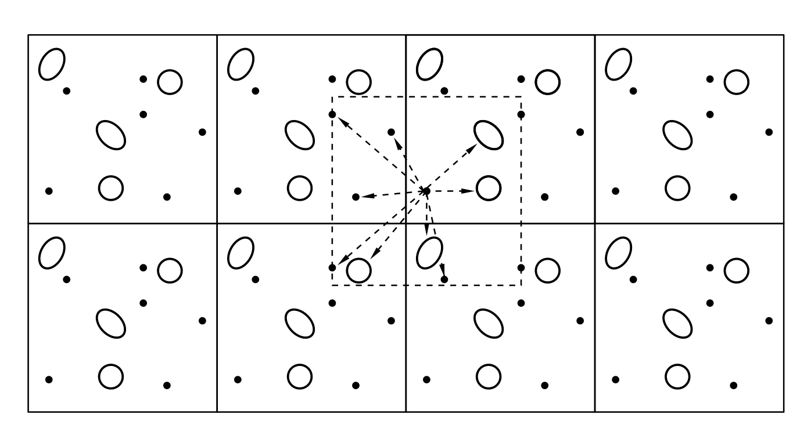

# Monte Carlo模拟

## 引言：分子模拟

在上一章中，我们介绍了（经典）统计力学的基础知识。我们发现许多可观测量可以表示为时间平均，也可以表示为系综平均。在本书的后续部分，我们将讨论如何计算这些可观测量。需要强调的是，一旦我们开始使用数值技术，我们就放弃了精确结果。这是因为，首先，模拟会受到统计噪声的影响。这个问题可以通过更长时间的采样来缓解，但无法完全消除。其次，模拟包含系统误差，这与我们模拟的系统远非宏观有关：有限尺寸效应（finite-size effects）可能非常显著。同样，这个问题可以通过系统的有限尺寸标度分析来缓解，但该问题应当被认识到。第三，我们对牛顿运动方程进行了离散化。由此得到的轨迹并非系统的真实轨迹。这个问题在时间步长较短时变得不那么严重，但无法完全消除。最后，如果我们旨在模拟真实材料，就必须使用势能函数 $U(\mathbf{r}^N)$ 的近似描述。这种近似可能是好的——但永远不会是完美的。因此，在模拟中，我们总是预测模型系统的性质。在本书后续部分中，当我们提及真实材料的模拟时，读者应始终牢记这些近似，更不用说我们将使用经典描述而非量子描述这一事实。量子模拟技术超出了本书的范围。但关于成本与严格性之间权衡的一般性评论仍然适用，甚至比经典模拟更为适用。

计算经典多体系统可观测性质有两种不同的数值方法：一种称为分子动力学（Molecular Dynamics, MD）。顾名思义，分子动力学模拟生成牛顿运动方程的近似解，得到系统在相空间中的轨迹 $\mathbf{r}^N(t), \mathbf{p}^N(t)$[^1]。使用 MD 方法，我们可以计算可观测性质的时间平均，包括静态性质（如热力学可观测量）和动态性质（如输运系数）。虽然 MD 的实际实现并不总是简单的，但其背后的思想却是一目了然的。

相比之下，Monte Carlo（MC）方法（或者更准确地说，马尔可夫链 Monte Carlo（Markov-Chain Monte Carlo, MCMC）方法）背后的思想则是高度非平凡的。事实上，MCMC 方法的发展可以说是20世纪计算科学中最伟大的发现之一[^2]。本章讨论 MCMC 方法在经典多体系统中的应用基础。

MCMC 方法并不局限于计算多体系统的性质：每当我们有一个可以处于（非常）大量状态的系统，并且我们知道如何计算这些状态被占据的相对概率（例如 Boltzmann 权重），MCMC 方法就可以被使用。与 MD 不同，MCMC 不提供关于多体系统时间演化的信息。因此，MCMC 不能用于计算输运性质。

这可能暗示，在所有条件相同的情况下，MD 总是优于 MC。然而，条件并不总是相同的。特别是，正如我们将在后续章节中看到的，MD 模拟的优势恰恰也是其弱点：它必须遵循系统的自然动力学。如果自然动力学很慢，这就限制了 MD 模拟探索系统所有可达状态的能力。MC 在这方面受到的限制要小得多：正如我们将看到的，存在着巧妙的 Monte Carlo 方案，即使自然动力学很慢也能高效采样。此外，还有许多有趣的模型系统，例如没有自然动力学的格子模型。这些模型只能使用 Monte Carlo 模拟来研究。

## Monte Carlo方法

下面，我们描述马尔可夫链 Monte Carlo 方法的基本原理，除非特别说明，此后我们通常将其简称为 Monte Carlo（MC）方法。首先，我们关注基本的 MC 方法，该方法可用于模拟在给定体积 ($V$) 和给定温度 ($T$) 下具有固定粒子数 ($N$) 的系统。为了保持符号简洁，我们最初关注没有内部自由度的粒子。为了引入 Monte Carlo 方法，我们从配分函数 $Q$ 的经典表达式出发（公式 (2.2.19)）：

$$
Q = c \int \mathrm{d}\mathbf{p}^N \mathrm{d}\mathbf{r}^N \exp[-H(\mathbf{r}^N, \mathbf{p}^N)/k_BT],
$$

其中 哈密顿量 $H \equiv H(\mathbf{r}^N, \mathbf{p}^N)$ 的定义与公式 (2.3.1) 相同。系统的 哈密顿量将总能量表示为组成粒子坐标和动量的函数：$H = K + U$，其中 $K$ 是动能，$U$ 是势能。恒定 $NVT$ 下经典系统的可观测量 $A \equiv A(\mathbf{p}^N, \mathbf{r}^N)$ 的平衡平均由公式 (2.2.20) 给出：

$$
\langle A \rangle = \frac{\int \mathrm{d}\mathbf{p}^N \mathrm{d}\mathbf{r}^N A(\mathbf{p}^N, \mathbf{r}^N) \exp[-\beta H(\mathbf{p}^N, \mathbf{r}^N)]}{\int \mathrm{d}\mathbf{p}^N \mathrm{d}\mathbf{r}^N \exp[-\beta H(\mathbf{p}^N, \mathbf{r}^N)]},
$$

$K$ 是动量的二次函数，正如我们在公式 (2.3.3) 以下所论证的，对动量的积分可以解析完成，前提是 $A$ 是动量的简单函数，我们可以对其进行高斯积分。因此，仅依赖于动量的函数的平均通常容易计算[^3]。问题的困难部分在于计算依赖于坐标的函数 $A(\mathbf{r}^N)$ 的平均值。只有在少数例外情况下，粒子坐标的多维积分才能解析计算；在所有其他情况下，必须使用数值技术。

换言之，我们需要一种数值技术，使我们能够计算依赖于大量坐标（通常为 $O(10^3 \text{--} 10^6)$）的函数的平均。似乎最直接的方法是通过数值求积来计算公式中 $\langle A \rangle$ 的值，例如使用高维版本的 Simpson 法则。然而，容易看出这种方法是完全无用的，即使独立坐标 $dN$（$d$ 是系统的维数）的数量还相当小。例如，考虑通过求积计算 $N = 100$ 个粒子系统的积分类型所需的计算量。这样的计算将涉及在 $dN$ 维构型空间的点网格上评估被积函数来进行求积。假设我们沿每个坐标轴取 $m$ 个等距点。需要评估被积函数的总点数等于 $m^{dN}$。对于除最小系统以外的所有系统，即使 $m$ 的值很小，这个数字也变得天文数字般庞大。例如，如果我们取三维中的 100 个粒子，$m = 5$，那么我们将需要在 $10^{210}$ 个点上评估被积函数！这种量级的计算在已知宇宙的寿命内无法完成。而这其实是幸运的，因为所得到的答案将受到很大统计误差的影响。毕竟，数值求积在被积函数在网格间距距离上光滑时效果最好。但对于大多数分子间势，Boltzmann 因子是粒子坐标的一个快速变化函数。因此，精确地求积需要小的网格间距（即 $m$ 的大值）。此外，在对稠密液体评估被积函数时，我们会发现在绝大多数点上，Boltzmann 因子趋于零。例如，对于凝固点处 100 个硬球的流体，Boltzmann 因子在每 $10^{260}$ 个构型中只有一个是非零的！这个问题与求积点在网格上选择的事实无关：将积分估计为 $10^{260}$ 个随机选择的构型的平均同样无效。

显然，需要其他数值技术来计算热力学平均。其中一种技术是 Monte Carlo 方法，或者更准确地说，是 1953 年由 Metropolis 等人 ^[6] 引入的 Monte Carlo 重要抽样（importance sampling）算法。将该方法应用于原子和分子系统的数值模拟是本章的主题。

### Metropolis方法

如上所述，通常来说，通过求积评估形如 $\int \mathrm{d}\mathbf{r}^N \exp[-\beta U(\mathbf{r}^N)]$ 的积分是不可行的。然而，在许多情况下，我们对配分函数的构型部分本身并不感兴趣，而是对以下类型的平均值感兴趣（参见公式 (2.3.9)）：

$$
\langle A \rangle = \frac{\int \mathrm{d}\mathbf{r}^N \exp[-\beta U(\mathbf{r}^N)] A(\mathbf{r}^N)}{\int \mathrm{d}\mathbf{r}^N \exp[-\beta U(\mathbf{r}^N)]}.
$$

因此，我们希望知道两个积分的比值。Metropolis 等人 ^[6] 证明了可以设计一种高效的 Monte Carlo 方案来抽样这样的比值。

注意，公式中 $\exp(-\beta U)/Z$ 的比值是在构型 $\mathbf{r}^N$ 附近找到系统的概率密度 $\mathcal{N}(\mathbf{r}^N)$（参见公式 (2.3.10) 和 (2.3.7)）：

$$
\mathcal{N}(\mathbf{r}^N) \equiv \frac{\exp[-\beta U(\mathbf{r}^N)]}{Z}.
$$

对于接下来的讨论，重要的是 $\mathcal{N}(\mathbf{r}^N)$ 是非负的。

假设我们能够以某种方式在构型空间中生成 $L$ 个点，这些点按照概率分布 $\mathcal{N}(\mathbf{r}^N)$ 分布。平均而言，在点 $\mathbf{r}^N$ 周围的小构型空间（超）体积[^4] $\delta d^N$ 内生成的点数 $n_j$ 将等于 $L\mathcal{N}(\mathbf{r}^N)\delta d^N$。假设有 $M$ 个子体积 $\delta d^N$，它们完全铺满构型空间 $V^N$。则

$$
M = \frac{V^N}{\delta d^N}.
$$

在 $L$ 和 $M$ 很大（$\delta d^N$ 很小）的极限下，

$$
\langle A \rangle \approx \frac{1}{L} \sum_{j=1}^{M} n_j A(\mathbf{r}^N_i).
$$

与其将其写成对 $M$ 个单元的求和，不如将其写成对已采样的 $L$ 个点的求和：

$$
\langle A \rangle \approx \frac{1}{L} \sum_{i=1}^{L} A(\mathbf{r}^N_j).
$$

需要注意的关键点是，为了评估此式，我们只需要知道 $n_j$ 与 Boltzmann 因子 $\exp[-\beta U(\mathbf{r}^N)]$ 成正比：未知的归一化因子 ($Z$) 不需要，因为 $n_j$ 被 $L = \sum_j n_j$ 归一化。因此，如果我们有一种方案，允许我们以与其 Boltzmann 权重成正比的频率生成点，那么我们就可以估计上述类型的平均值。现在，我们必须弄清楚如何以与其 Boltzmann 权重成正比的频率生成点。这种过程称为重要抽样（importance sampling），Metropolis Monte Carlo 方法 ^[6] 提供了一个简单的方案来实现这种重要抽样。

上述关于重要抽样概念的介绍可能听起来相当抽象：因此，让我们借助一个简单的例子来阐明求积和重要抽样之间的区别（参见图）。在该图中，我们比较了测量尼罗河深度的两种方法，即传统的求积方法（左）和 Metropolis 抽样方法，即构建一个重要性加权的随机游走（右）。在传统的求积方案中，被积函数的值在预定的点集上测量。由于这些点的选择不依赖于被积函数的值，许多点可能位于被积函数为零的区域（在尼罗河的例子中：一个人无法在尼罗河之外测量尼罗河的深度——然而我们的大多数求积点都远离河流）。相比之下，在 Metropolis 方案中，在被积函数不可忽略的空间区域（即尼罗河本身）中构建一个随机游走。在这个随机游走中，如果一个试探移动把你带出了水面，它就被拒绝，否则就被接受。在每次试探移动（无论是否被接受）之后，测量水深。所有这些测量的（未加权）平均给出了尼罗河平均深度的估计。这就是 Metropolis 方法的本质。原则上，传统的求积方案会给出相同的答案，但它需要非常细的网格，而且大多数采样点都是无关的。求积的优势（如果可行的话）在于它还允许我们计算尼罗河的总面积。在重要抽样方案中，关于总面积的信息无法直接获得，因为这个量类似于构型积分 $Z$。在后续章节中，我们将讨论计算 $Z$ 的数值方案。



到目前为止，我们已经解释了通过重要抽样计算平均值所需的内容：我们必须能够以与其 Boltzmann 权重成正比的频率在构型空间中生成点。问题是：如何做到？

理想情况下，我们将使用一种方案，在构型空间中生成大量具有所需 Boltzmann 权重的独立点。这种方法称为静态 Monte Carlo 抽样（static Monte Carlo sampling）。静态 MC 的优点是每个构型都与前一个构型统计独立。传统上，这种方法仅在非常简单的情况下使用，例如生成正态分布的点，在这种情况下我们可以解析地将 0 到 1 之间均匀分布的随机数映射到高斯分布 ^[66]。然而，对于任何非平凡的多体系统，这种严格的解析方法是不可行的。

这就是为什么绝大多数 MC 模拟都是动态的原因：模拟生成一条构型的（马尔可夫）链，其中新构型以容易计算的从前一个构型生成的概率产生。Metropolis Monte Carlo 方法是这种动态方案的主要例子。使用动态 MC，可以以正确的 Boltzmann 权重生成构型。然而，该方案的缺点是连续的构型往往是相关的。因此，统计独立的构型数量少于构型的总数。

在继续描述（动态）MC 方法之前，我们注意到静态（或混合静态/动态）MC 方法正在经历复兴，这是由于机器学习获得的变换的应用（参见第 13.4.1 节）。然而，在本章以及随后的大部分章节中，我们专注于动态 Monte Carlo 方案。

为了推导 Metropolis 算法，让我们首先考虑所期望的算法必须以与其 Boltzmann 权重成正比的频率抽样点这一事实的推论。这意味着，如果我们有 $L$ 个已经按 Boltzmann 分布的点，那么在每个点上应用我们算法的一步不应该破坏这个 Boltzmann 分布。注意这是一个"系综"论证：我们考虑同一模型系统的非常大量的 ($L$) 副本。考虑 $L \gg M$ 的极限是有用的，其中 $M$ 表示构型空间中的点数。当然，实际上，构型空间中的点数是不可数的——但在数值表示中，它是可数的，因为浮点数的位数有限。我们现在假设处于给定状态（比如 $i$）的系统副本数与该状态的 Boltzmann 因子成正比。接下来，我们对所有 $L$ 个系统执行一步 MC 算法。作为这一步的结果，个别系统可能最终处于另一个状态，但平均而言，每个状态中的系统数不应改变，因为这些数目由 Boltzmann 分布给出。

让我们考虑一个这样的状态，我们用 $o$（表示"旧"（old））来标记。状态 $o$ 具有未归一化的 Boltzmann 权重 $\exp[-\beta U(o)]$。我们可以计算这个 Boltzmann 权重，因为我们可以计算势能。Monte Carlo 算法不是确定性的：单步可以以不同概率产生不同结果（因此得名"Monte Carlo"）。让我们考虑在一个 MC 步中从状态 $o$ 移动到具有 Boltzmann 权重 $\exp[-\beta U(n)]$ 的新状态 $n$ 的概率。我们将此转移概率记为 $\pi(o \to n)$。让我们将最初处于状态 $o$ 的系统副本数记为 $m(o)$。由于我们从 Boltzmann 分布开始，$m(o)$ 与 $\exp[-\beta U(o)]$ 成正比。为了维持 Boltzmann 分布，状态 $n$ 中的副本数 $m(n)$ 应与 $\exp[-\beta U(n)]$ 成正比。转移概率 $\pi(o \to n)$ 应当构造为不破坏 Boltzmann 分布。这意味着在平衡态下，导致系统离开状态 $o$ 的接受试探移动的平均数必须精确地等于从所有其他状态 $n$ 到状态 $o$ 的接受试探移动数。我们注意到 $\langle m(o) \rangle$（状态 $o$ 中系统的平均数）与 $\mathcal{N}(o)$ 成正比（$n$ 也类似）。转移概率 $\pi(o \to n)$ 应满足以下平衡方程（balance equation）：

$$
\mathcal{N}(o) \sum_n \pi(o \to n) = \sum_n \mathcal{N}(n) \pi(n \to o).
$$

此方程表达了流入和流出状态 $o$ 之间的平衡。注意 $\pi(o \to n)$ 可以被解释为一个矩阵（"转移矩阵"），它将系统的原始状态映射到新状态。在这个矩阵解释中，我们要求 Boltzmann 分布是转移矩阵的具有特征值 1 的特征向量。我们还注意到从给定状态 $o$ 到新状态 $n$ 的转移概率仅取决于系统的当前状态。因此，由矩阵 $\pi(o \to n)$ 描述的过程是一个马尔可夫过程。

原始的 Metropolis 算法基于比上式更强的条件，即在平衡态下，从 $o$ 到任何给定状态 $n$ 的接受移动的平均数被反向移动数精确平衡。这个条件被称为细致平衡（detailed balance）[^5]：

$$
\mathcal{N}(o)\pi(o \to n) = \mathcal{N}(n)\pi(n \to o).
$$

转移矩阵 $\pi(o \to n)$ 的许多可能形式都满足上式。为了向 Metropolis 算法推进，我们利用可以将一个 Monte Carlo 移动分解为两个阶段的事实。首先，我们执行从状态 $o$ 到状态 $n$ 的试探移动。我们将确定从 $o$ 到 $n$ 执行试探移动概率的转移矩阵记为 $\alpha(o \to n)$，其中 $\alpha$ 通常被称为马尔可夫链的基础矩阵（underlying matrix）^[67]。

下一个阶段涉及接受或拒绝此试探移动的决定。让我们将从 $o$ 到 $n$ 接受试探移动的概率记为 $\text{acc}(o \to n)$。显然，

$$
\pi(o \to n) = \alpha(o \to n) \times \text{acc}(o \to n).
$$

在原始的 Metropolis 方案中，$\alpha$ 被选为对称矩阵（$\alpha(o \to n) = \alpha(n \to o)$）。然而，在后续章节中，我们将看到 $\alpha$ 被选为非对称的几个例子。如果 $\alpha$ 是对称的，我们可以将平衡方程重写为 $\text{acc}(o \to n)$ 的形式：

$$
\mathcal{N}(o) \times \text{acc}(o \to n) = \mathcal{N}(n) \times \text{acc}(n \to o).
$$

由此可得[^6]：

$$
\frac{\text{acc}(o \to n)}{\text{acc}(n \to o)} = \frac{\mathcal{N}(n)}{\mathcal{N}(o)} = \exp\{-\beta[U(n) - U(o)]\}.
$$

$\text{acc}(o \to n)$ 的许多选择都满足这个条件，当然，前提是概率 $\text{acc}(o \to n)$ 不能超过一。Metropolis 等人的选择是

$$
\text{acc}(o \to n) = \mathcal{N}(n)/\mathcal{N}(o) \quad \text{如果} \; \mathcal{N}(n) < \mathcal{N}(o)
$$

$$
= 1 \quad \text{如果} \; \mathcal{N}(n) \geq \mathcal{N}(o).
$$

$\text{acc}(o \to n)$ 的其他选择也是可能的（有关讨论，参见例如 ^[21]），但在大多数条件下，Metropolis 等人的原始选择似乎比其他已提出的策略能更高效地采样构型空间。

总结：在 Metropolis 方案中，从状态 $o$ 到状态 $n$ 的转移概率为

$$
\begin{aligned}
\pi(o \to n) &= \alpha(o \to n) &\mathcal{N}(n) \geq \mathcal{N}(o) \\
&= \alpha(o \to n)[\mathcal{N}(n)/\mathcal{N}(o)] &\mathcal{N}(n) < \mathcal{N}(o)  \\
\pi(o \to o) &= 1 - \sum_{n \neq o} \pi(o \to n).
\end{aligned}
$$

注意我们尚未指定矩阵 $\alpha$，只知道它必须是对称的。实际上，我们在选择对称矩阵 $\alpha$ 方面有相当大的自由度。这种自由度将在后续章节中得到利用。

我们尚未解释的一件事是如何决定试探移动是接受还是拒绝。通常的过程如下。假设我们已经生成了从状态 $o$ 到状态 $n$ 的试探移动，其中 $U(n) > U(o)$。根据上述公式，这个试探移动应以概率

$$
\text{acc}(o \to n) = \exp\{-\beta[U(n) - U(o)]\} < 1
$$

被接受。为了决定是否接受试探移动，我们从区间 $^[0,1]$ 上的均匀分布中生成一个（准）随机数，此处记为 $R$。显然，$R$ 小于 $\text{acc}(o \to n)$ 的概率等于 $\text{acc}(o \to n)$。现在，如果 $R < \text{acc}(o \to n)$ 我们接受试探移动，否则拒绝。这个规则保证了接受从 $o$ 到 $n$ 的试探移动的概率确实等于 $\text{acc}(o \to n)$。显然，重要的是我们的准随机数生成器确实在区间 $^[0,1]$ 中均匀地生成数字。否则，Monte Carlo 抽样将产生偏差。随机数生成器的质量绝不能被认为是理所当然的。关于随机数生成器的良好讨论可以在《Numerical Recipes》^[38] 和 Kalos 与 Whitlock 的《Monte Carlo Methods》^[37] 中找到。

到目前为止，我们还没有提到矩阵 $\pi(o \to n)$ 应满足的另一个条件，即它必须是不可约的（irreducible）（即构型空间中的每个可达点都可以在有限数量的 Monte Carlo 步中从任何其他点到达）。不可约性在 MC 中扮演着与 MD 中的遍历性（ergodicity）相同的角色，为了便于比较，我们将互换使用这些术语。虽然一些简单的 MC 方案被保证是不可约的，但这些通常不是最高效的方案。相反，许多高效的 Monte Carlo 方案要么尚未被证明是不可约的，要么更糟，已被证明违反不可约性。解决方案通常是将高效的、非遍历性的方案与偶尔的、效率较低但遍历性的方案的试探移动混合使用。整个方法将是遍历性的（至少原则上如此）。

MC 移动不需要满足的唯一标准是生成物理上合理的轨迹。在这方面，MC 与 MD 根本不同，听起来像是一个劣势的地方往往是优势。正如我们稍后将看到的，"非物理"的 MC 移动可以大大加速构型空间的探索并确保不可约性。然而，在许多应用中，MC 算法被设计为生成物理上合理的轨迹，特别是当模拟经历扩散 Brownian 运动的粒子时。我们将在后面提及几个例子（参见第 13.3.2 节）。在这个阶段，我们只指出所有这些方案也必须是有效的 MC 方案。因此，目前的讨论是适用的。

### 节俭Metropolis算法

在标准 Metropolis MC 方法中，我们首先计算试探移动引起的能量变化，然后抽取随机数来决定其接受与否。在所谓的节俭 Metropolis 算法（Parsimonious Metropolis Algorithm, PMA）^[68] 中，第一步是抽取一个在 0 和 1 之间均匀分布的随机数 $R$。显然，Metropolis 规则意味着 $\beta\Delta E < -\ln R$ 的试探移动将被接受，因此看起来先计算 $R$ 并没有什么好处。然而，PMA 利用了这样一个事实：通常可以对 $\Delta E$ 设置边界 $\Delta E_{\max}$ 和 $\Delta E_{\min}$。显然，$\beta\Delta E_{\max} < -\ln R$ 的试探移动将被接受，而 $\beta\Delta E_{\min} > -\ln R$ 的试探移动将被拒绝。PMA 背后的思想是使用可以廉价地（预先）计算的边界。如何实现这一点取决于具体的实现方式：更多细节参见文献 ^[68]。我们将在第 13.4.4 节（公式 (13.4.30)）中看到先计算 $R$ 的相关例子，并以略微不同的形式出现在第 13.3.2 节描述的动力学 Monte Carlo 算法中（参见公式 (13.3.5)）。

## 基本Monte Carlo算法

以抽象的方式讨论 Monte Carlo 或分子动力学算法并没有很大帮助。解释它们如何工作的最佳方式是将它们写出来。本节将这样做。

大多数 Monte Carlo 或分子动力学程序的核心是简单的：通常只有几百行长。这些 MC 或 MD 算法可以嵌入标准程序包或为特定应用定制的程序中。所有这些程序和程序包往往是不同的，因此不存在所谓标准的 Monte Carlo 或分子动力学程序。然而，大多数 MD/MC 程序的核心如果不是完全相同的，至少是非常相似的——如果你理解了一个，你就理解了所有的。

下面，我们将构建一个 MC 程序的"核心"。它将是基本的，效率已为清晰性而牺牲。但它应该演示 Monte Carlo 方法的工作原理。在下一章中，我们将对分子动力学程序做同样的事情。

### 算法

如前一节所解释的，Metropolis（马尔可夫链）Monte Carlo 方法的构造使得访问构型空间中特定点 $\mathbf{r}^N$ 的概率与 Boltzmann 因子 $\exp[-\beta U(\mathbf{r}^N)]$ 成正比。在 Metropolis 等人 ^[6] 引入的方法的标准实现中，我们使用以下方案：

1. 随机选择一个粒子[^7]，并计算其对系统能量的贡献 $U(\mathbf{r}^N)$[^8]。
1. 给粒子一个随机位移 $\mathbf{r}' = \mathbf{r} + \Delta$，并计算其新的势能 $U(\mathbf{r}'^N)$。
1. 以如下概率接受从 $\mathbf{r}^N$ 到 $\mathbf{r}'^N$ 的移动：
   $$
   \text{acc}(o \to n) = \min\{1, \exp\{-\beta[U(\mathbf{r}'^N) - U(\mathbf{r}^N)]\}\}.
   $$

这种基本 Metropolis 方案的实现如算法 1 和算法 2 所示。

**Metropolis MC 代码的核心**

```
^[1]
program MC
// basic Metropolis algorithm
for $1 \leq \text{itrial \leq \text{ntrial}$}
// perform ntrial MC trial moves
 mcmove
// trial move procedure
if (itrial \% nsamp) == 0
// \% denotes the Modulo operation
 sample
// sample procedure
end if
end for
end program
```

**具体注释**（一般注释见第 7 页）：

1. 函数 mcmove 尝试位移一个随机选择的粒子（参见算法 2）。
1. 函数 sample 每 nsample 次试探移动采样一次可观测量。

**Monte Carlo 试探位移**

```
^[1]
\function{mcmove}
// Metropolis MC trial move
 i = int(R*npart) + 1
// select random particle with $1 \leq i \leq$ npart
 eno = ener(x(i), i)
// eno: energy particle i at ``old'' position x(i)
 xn = x(i) + (R - 0.5)*delx
// trial position xn for particle i
 enn = ener(xn, i)
// enn: energy of i at xn
if R < exp[-$\beta$*(enn - eno)]
// Metropolis criterion
 x(i) = xn
// if accepted, x(i) becomes xn
end if
end function
```

**具体注释**（一般注释见第 7 页）：

1. npart：粒子数。x(npart) 位置数组。$T = 1/\beta$，最大步长 $= 0.5 \times \text{delx}$。
1. 函数 ener(x)：使用算法 5 中所示的方法计算位置 $x$ 处粒子的相互作用能。
1. $R$ 生成一个在 0 和 1 之间均匀分布的随机数。
1. int(z) 返回 $z$ 的整数部分。
1. 注意，如果构型被拒绝，旧构型被保留。

### 技术细节

计算 Monte Carlo 模拟中的平均值可以使用一些技巧来加速。理想情况下，节省计算时间的方案不应以系统的方式影响模拟结果，但这通常并不完全正确。主要原因是宏观系统的模拟是不可行的：因此，我们在微观（数百到数百万粒子）系统上进行模拟。这种有限系统的性质通常与宏观系统的性质略有不同，但有时差异很大。类似地，即使对于中等大小的系统，通常也是有利的做法是避免显式计算相距很远的粒子之间的非常弱的分子间相互作用。在这两种情况下，这些近似的影响可以通过我们下面讨论的方法来缓解。但无论情况如何，关键是我们应该意识到节省时间的技巧可能引入的系统误差，并尽可能纠正它们。

我们下面讨论的许多节省时间的手段对 MC 和 MD 模拟是类似的。与其在 MD 章节中重复本节，我们不如在下面的讨论中在相关时同时提及两种类型的模拟。然而，我们还不会假设读者熟悉 MD 模拟的技术细节。在这个阶段，与我们讨论相关的 MD 的唯一特征是，在 MD 模拟中，我们必须计算作用于所有粒子的力。



#### 边界条件

原子或分子系统的 Monte Carlo 和分子动力学模拟旨在提供宏观样品性质的信息。然而，分子模拟中通常研究的自由度数量从数百到数百万不等[^9]。显然，这样的粒子数仍然远未达到热力学极限。特别是对于小系统，不能安全地假设边界条件（例如自由、硬壁或周期性）的选择对系统性质的影响可以忽略不计。事实上，在具有自由边界的三维 $N$ 粒子系统中，位于表面的所有分子的比例与 $N^{-1/3}$ 成正比。例如，在 1000 个原子的简单立方晶体中，约 49\% 的原子位于表面，对于 $10^6$ 个原子，这个比例仅下降到 6\%。因此，我们应该预期这种小系统的性质将受到表面效应的强烈影响。

为了模拟体相（bulk phases），必须选择能够模拟无限体相环绕我们 $N$ 粒子模型系统存在的边界条件。这通常通过使用周期性边界条件（periodic boundary conditions）来实现。包含 $N$ 个粒子的体积被视为由相同单元组成的无限周期晶格的原胞（primitive cell）（参见图）。给定粒子（比如 $i$）现在与这个无限周期系统中的所有其他粒子相互作用，即同一周期单元中的所有其他粒子和所有其他单元中的所有粒子（包括其自身的周期像）。例如，如果我们假设所有分子间相互作用都是对可加的，则任何一个周期箱中 $N$ 个粒子的总势能为

$$
U_{\text{tot}} = \frac{1}{2} \sum_{i, j, \mathbf{n}}' u(|\mathbf{r}_{ij} + \mathbf{n}L|),
$$

其中 $L$ 是周期箱的直径（为方便起见假设为立方体），$\mathbf{n}$ 是三个整数的任意向量，求和号上的撇号表示当 $\mathbf{n} = 0$ 时排除 $i = j$ 的项。在这种一般形式下，周期性边界条件并不特别有用，因为为了模拟体相行为，我们不得不将势能写成无限求和而非有限求和[^10]。如下一节所讨论的，我们在实践中经常处理短程相互作用。在这种情况下，通常可以截断超过某个截断距离 $r_c$ 的所有分子间相互作用，并对所有更长程的相互作用进行近似处理。

虽然周期性边界条件的使用是模拟均匀体相系统的一种出人意料有效的方法，但人们应该始终意识到这样的边界条件仍然会引起宏观体相系统中不存在的虚假关联。特别是，模型系统周期性的一个后果是只允许与边界条件周期性兼容的波长的涨落：仍然能放入周期箱中的最长波长是 $\lambda = L$。在预期长波长涨落重要的情况下（例如在临界点附近），应该预期使用周期性边界条件会有问题。周期性边界条件也破坏了系统的旋转对称性。一个后果是在各向同性流体中粒子周围的平均密度分布不是球对称的，而是反映了周期性边界条件的立方（或更低）对称性 ^[70]。这些效应随着系统尺寸增大而变得不那么重要。

**周期性边界：一个误称？**

"周期性边界条件"（Periodic Boundary Conditions）这个术语有时会造成混淆，因为"边界"一词的使用。周期性原胞晶格的原点可以在所研究的模型系统中的任何位置选择，而这种选择不会影响任何可观测性质。因此，"边界"没有物理意义（但参见第 11.2.2 节）。相比之下，周期性单元的形状及其取向并不总是可以随意选择的。特别是对于晶体或其他具有位置有序的系统，模拟箱的形状和取向必须与物理系统的内禀周期性兼容。

#### 相互作用的截断

让我们考虑具有短程、对可加相互作用的系统模拟的具体情况。在这种语境下，短程意味着给定粒子 $i$ 的总势能主要由与截断距离 $r_c$ 以内的邻近粒子的相互作用所主导。忽略与更远距离粒子的相互作用所产生的误差可以通过选择足够大的 $r_c$ 而变得任意小。当使用周期性边界条件时，$r_c$ 小于 $L/2$（周期箱直径的一半）的情况特别值得关注，因为在这种情况下，我们只需要考虑给定粒子 $i$ 与任何其他粒子 $j$ 的最近周期像（有时称为最小像，Minimum Image）的相互作用（参见图 中的虚线框）。严格来说，也可以选择将粒子相互作用的计算限制在最近像，而不施加球形截断。然而，在这种情况下，大于 $L/2$ 距离的对相互作用将取决于连接粒子中心的直线的方向。显然，这种虚假的角度依赖性可能导致人为效应，通常应避免（但不总是：参见第 11 章）。

如果分子间势在 $r \geq r_c$ 时并非严格为零，在 $r_c$ 处截断分子间相互作用将导致 $U_{\text{tot}}$ 中的系统误差。正如我们下面讨论的，通常可以近似地校正对势的截断。

理想情况下，计算出的可观测性质的值应该对对势截断距离的精确选择不敏感，前提是我们校正了截断程序的影响。然而，对于截断距离的最常见选择，不同的截断程序可能给出不同的答案，其后果是严重的。例如，文献中充满了具有 Lennard-Jones 类对势的模型研究。然而，不同作者通常使用不同的截断程序，结果是很难比较声称研究同一模型的不同模拟。

有几个因素使得势的截断成为一项棘手的工作。首先，应该认识到虽然势能函数的绝对值随粒子间距 $r$ 减小（对于足够大的 $r$），但邻居的数量是 $r$ 的快速递增函数：与给定原子距离 $r$ 处的粒子数渐近地以 $r^{d-1}$ 增长，其中 $d$ 是系统的维数。作为一个例子，让我们计算简单模型系统截断对势的效应。在均匀相中，给定原子 $i$ 的平均势能（三维情况下）为

$$
u_i = (1/2) \int_0^{\infty} \mathrm{d}r \, 4\pi r^2 \rho(r) u(r),
$$

其中 $\rho(r)$ 表示距原子 $i$ 距离 $r$ 处的平均数密度。因子 $(1/2)$ 已被包括以校正分子间相互作用的重复计算。如果我们在距离 $r_c$ 处截断势，我们就忽略了尾部贡献 $u_{\text{tail}}$：

$$
u_{\text{tail}} \equiv (1/2) \int_{r_c}^{\infty} \mathrm{d}r \, 4\pi r^2 \rho(r) u(r),
$$

其中我们省略了下标 $i$，因为在体相流体中，系统中的所有原子都经历等价的环境。为了简化 $u_{\text{tail}}$ 的计算，通常假设对于 $r \geq r_c$，密度 $\rho(r)$ 等于流体体相中的平均数密度 $\rho$。

如果分子间相互作用衰减得足够快，可以通过向 $U_{\text{tot}}$ 添加尾部贡献来校正由于在 $r_c$ 处截断势而产生的系统误差：

$$
U_{\text{tot}} = \sum_{i < j} u_{\text{trunc}}(r_{ij}) + \frac{N\rho}{2} \int_{r_c}^{\infty} \mathrm{d}r \, u(r) 4\pi r^2,
$$

对于三维原子系统。将此式推广到其他维度是直接的。式中 $u_{\text{trunc}}(r)$ 表示在距离大于截断距离 $r_c$ 处已被截断的对势能函数，$\rho$ 是流体体相中的平均数密度。

由于假设 $\rho(r)$ 在 $r > r_c$ 时等于体相密度 $\rho$ 所产生的近似在 $r_c$ 的选择越小时越差。从上式可以看出，除非势能函数 $u(r)$ 比 $r^{-3}$ 衰减得更快（三维情况下），否则势能的尾部校正将发散。如果分子间的长程相互作用以色散力（dispersion forces）为主导，则满足此条件。然而，对于 Coulomb 或偶极相互作用的重要情况，尾部校正发散，因此最近像约定不能用于这种系统。在这种情况下，应显式考虑与所有周期像的相互作用。第 11 章讨论了如何解决这个问题。

为了给出文献中使用的截断程序的具体例子，让我们考虑在分子模拟中非常流行的 Lennard-Jones（LJ）^[71,72] 势[^11]。Lennard-Jones $12-6$ 势具有以下形式：

$$
u_{\text{LJ}}(r) = 4\epsilon \left[\left(\frac{\sigma}{r}\right)^{12} - \left(\frac{\sigma}{r}\right)^{6}\right].
$$

在下文中，我们将此势称为 Lennard-Jones 势。对于截断距离 $r_c$，三维情况下 LJ 对势的尾部校正 $u_{\text{tail}}$ 为

$$
u_{\text{tail}} = \frac{1}{2} 4\pi\rho \int_{r_c}^{\infty} \mathrm{d}r \, r^2 u(r) = \frac{1}{2} 16\pi\rho\epsilon \int_{r_c}^{\infty} \mathrm{d}r \, r^2 \left[\left(\frac{\sigma}{r}\right)^{12} - \left(\frac{\sigma}{r}\right)^{6}\right] = \frac{8}{3}\pi\rho\epsilon\sigma^3 \left[\frac{1}{3}\left(\frac{\sigma}{r_c}\right)^{9} - \left(\frac{\sigma}{r_c}\right)^{3}\right].
$$

对于截断距离 $r_c = 2.5\sigma$，势已衰减到约为阱深 $1/60$ 的值。这似乎是一个很小的值，但实际上尾部校正通常不可忽略。例如，在典型液体密度 $\rho\sigma^3 = 1$ 下，我们发现 $u_{\text{tail}} = -0.535\epsilon$。这个数值相对于每原子的总势能当然不可忽略（在典型液体密度下几乎为 10\%）；因此，虽然我们可以在 $2.5\sigma$ 处截断势，但我们不能忽略这种截断的影响。注意，上述尾部校正假设我们考虑的是均匀系统。在界面附近，尾部校正的简单表达式失去有效性，实际上，计算得到的表面张力对所使用的截断程序敏感得令人沮丧 ^[74]。对于固体中的吸附，Jablonka 等人 ^[75] 证明了添加尾部校正有助于获得更一致的结果。

在模拟中有几种截断相互作用的方法——一些截断势，一些截断力，还有一些使力在 $r_c$ 处连续消失。虽然所有这些方法都旨在产生相似的结果，但应该认识到它们产生的结果可能差异显著，特别是在临界点附近 ^[76--78]（参见图）。

![具有不同截断方式的三维 Lennard-Jones 模型的气液共存曲线。该图显示了势的截断对估计临界点位置（大黑点）的影响。上方曲线给出了在 $r_c = 2.5\sigma$ 处截断并添加尾部校正以考虑 $r_c$ 以外距离相互作用的 Lennard-Jones 势的相包络线。下方曲线显示了用于分子动力学模拟的势（即截断并偏移的势，同样 $r_c = 2.5\sigma$）的估计气液共存曲线 ^[78]。](../images/ch3_fig3_3.png "具有不同截断方式的三维 Lennard-Jones 模型的气液共存曲线。该图显示了势的截断对估计临界点位置（大黑点）的影响。上方曲线给出了在 $r_c = 2.5\sigma$ 处截断并添加尾部校正以考虑 $r_c$ 以外距离相互作用的 Lennard-Jones 势的相包络线。下方曲线显示了用于分子动力学模拟的势（即截断并偏移的势，同样 $r_c = 2.5\sigma$）的估计气液共存曲线 ^[78]。")

截断势的常用方法有：

1. 简单截断（Simple truncation）
1. 截断并偏移（Truncation and shift）
1. 截断并力偏移（Truncation and force-shift）（即 $u(r)$ 和力都在 $r_c$ 处变为零）

**简单截断**

截断势的最简单方法是忽略 $r_c$ 以外的所有相互作用。在这种情况下，我们将模拟具有以下形式势的模型：

$$
u_{\text{trunc}}(r) = \begin{cases} u_{\text{LJ}}(r) & r \leq r_c \\ 0 & r > r_c \end{cases}.
$$

如上所述，这种截断可能导致我们对真实 Lennard-Jones 模型势能的估计产生相当大的误差。此外，由于截断的对势在 $r_c$ 处不连续变化，这种势不适用于标准分子动力学模拟。

截断势可以用于 Monte Carlo 模拟中，有时确实如此（例如在具有方阱或方肩势的简单模型系统的模拟中）。然而，在这种情况下，应该意识到由于势在 $r_c$ 处的不连续变化，压力存在一个"脉冲式"贡献。对于其他情况下的连续势，不建议使用纯粹的简单截断（虽然如有必要，可以计算压力的脉冲贡献）。

补偿对势截断的常用（近似）方法是向我们计算的结构性质添加尾部校正。势能的尾部校正已在上面讨论过。我们将在第 5 章讨论压力的计算。为了完整起见，这里我们给出三维情况下压力的尾部校正表达式：

$$
\Delta P_{\text{tail}} = \frac{4\pi\rho^2}{6} \int_{r_c}^{\infty} \mathrm{d}r \, r^2 \, \mathbf{r} \cdot \mathbf{f}(r) = \frac{16}{3} \pi\rho^2\epsilon\sigma^3 \left[\frac{2}{3}\left(\frac{\sigma}{r_c}\right)^{9} - \left(\frac{\sigma}{r_c}\right)^{3}\right],
$$

其中第二行考虑了 Lennard-Jones 势的具体例子。通常，压力的尾部校正甚至大于势能的尾部校正。对于 $r_c = 2.5$ 的 LJ 模型在 $\rho = 1$ 时，$\Delta P_{\text{tail}} \approx -1.03$，这显然是非常大的。

**截断并偏移**

在分子动力学模拟中，重要的是力不是奇异的，并且理想情况下应使对势的更高阶导数也是连续的。

最简单的程序是将对势偏移，使其在 $r_c$ 处连续为零。此时力不是奇异的，但其一阶导数是。截断并偏移的势为

$$
u_{\text{tr-sh}}(r) = \begin{cases} u(r) - u(r_c) & r \leq r_c \\ 0 & r > r_c \end{cases}.
$$

当然，具有截断并偏移势的系统的势能和压力与使用未截断对势获得的值不同。与之前一样，我们可以近似地校正分子间势修改对势能和压力的影响。对于压力，尾部校正如上式相同。对于势能，除了长程校正外，我们还必须添加一个贡献，等于在给定粒子距离 $r_c$ 以内的平均粒子数，乘以（未截断）对势在 $r_c$ 处值的一半。因子 $1/2$ 用于校正分子间相互作用的重复计算。

在具有各向异性相互作用的模型中应用截断并偏移势时应小心。在这种情况下，截断不应在分子质心之间距离的固定值处进行，而应在 对势具有固定值的点处进行，否则势无法在截断面上的所有点处偏移到零。对于 Monte Carlo 模拟，这不会产生严重问题，但对于分子动力学模拟，这将是相当糟糕的，因为系统将不再守恒能量，除非截断和偏移引起的脉冲力被显式考虑。

**截断并力偏移**

为了使力也在 $r_c$ 处连续消失，可以使用截断、偏移并力偏移的势。具有此性质的势有很多选择。最简单的是：

$$
u_{\text{tr-sh}}(r) = \begin{cases} u(r) - u(r_c) + f(r_c)(r - r_c) & r \leq r_c \\ 0 & r > r_c \end{cases}.
$$

同样，相应的尾部校正可以被推导出来。这种截断并力偏移的 Lennard-Jones 势的一个例子是由 Kincaid 和 Hafskjold 提出的 ^[79,80]。

#### 尽可能使用不需要截断的势

从上述讨论中应该清楚，对势使用不同的截断程序会产生许多问题。当然，如果我们需要使用截断和尾部校正不可避免的模型，我们别无选择。

Lennard-Jones 势通常仅被用作一种"典型的"短程原子间势，其中较大距离处的精确行为是无关紧要的。在这些条件下，使用一种在 $r_c$ 处二次方趋于零的廉价势会好得多。其中一种势是 ^[81]：

$$
u(r)_{\text{WF}} \equiv \begin{cases} \epsilon \left[\left(\frac{\sigma}{r}\right)^{2} - 1\right]\left[\left(\frac{r_c}{r}\right)^{2} - 1\right]^2 & \text{for } r \leq r_c \\ 0 & \text{for } r > r_c \end{cases}.
$$

Wang-Ramirez-Dobnikar-Frenkel（WF）势在 $r_c = 2$ 时类似于 Lennard-Jones 势，而在 $r_c = 1.2$ 时，它可以描述胶体之间的典型短程相互作用（参见 ^[81]）。在本书中，我们在许多练习中使用这种势，因为它消除了尾部校正的需要。

如前几段所示，计算对可加相互作用的成本可以通过仅显式考虑截断距离 $r_c$ 以内粒子之间的相互作用来降低。然而，即使我们使用截断程序，我们仍然必须决定给定粒子对是否在距离 $r_c$ 以内。由于在 $N$ 粒子系统中有 $N(N-1)/2$ 个（最近像）距离，似乎我们需要计算 $O(N^2)$ 个距离，然后才能计算相关相互作用。在最朴素的模拟中（事实上这对于直径小于约 3--4 个 $r_c$ 的系统来说是完全足够的），这正是我们要做的。然而，对于更大的系统（比如 $10^6$ 个粒子），$N(N-1)/2$ 对应约 $10^{12}$ 个距离，这使模拟变得不必要地昂贵。幸运的是，存在更先进的方案，允许我们预先对粒子进行排序，使得评估所有截断相互作用只需要 $O(N)$ 次操作。其中一些技巧在附录 I 中讨论。然而，为了理解基本的 MC 或 MD 算法，这些节省时间的手段不是必需的。因此，在我们讨论的示例中，我们将描述一个使用简单 $O(N^2)$ 算法计算所有相互作用的分子动力学程序（参见算法 5）。

#### 初始化

为了开始模拟，我们应该为系统中的所有粒子分配初始位置。由于系统的平衡性质不（或至少不应该）依赖于初始条件的选择，所有合理的初始条件原则上都是可接受的。如果我们希望模拟特定模型系统的固态，合乎逻辑的做法是将系统制备为我们感兴趣的晶体结构。相反，如果我们对流相感兴趣，有几种选择：一种对于具有连续相互作用的系统越来越受欢迎的方法是将系统制备在一个随机构型中（这通常具有非常高的能量），然后通过能量最小化将系统弛豫到一个不太病态的构型。这种方法不太适合具有硬核相互作用的稠密系统，因为最小化不适用于这种系统。对于这种系统，但实际上也适用于所有其他系统，可以简单地在所需的目标密度和温度下以任何方便的晶体结构制备系统。如果我们幸运的话，这种晶体将在模拟的早期阶段（即在平衡运行期间）自发熔化，因为在典型液态点的温度和密度下，固态可能不是力学稳定的。然而，这里应该小心，因为即使晶体结构在热力学上不稳定，它也可能是亚稳的。因此，将晶体结构用作接近凝固曲线的液体的模拟起始构型是不明智的。在这种情况下，最好从更高温度或更低密度的系统（在该条件下固体甚至连亚稳态都不是）的最终（液体）构型开始模拟。无论如何，为了加速平衡，通常建议使用先前在附近状态点进行的模拟的最终（已充分平衡的）构型（如果有这种构型可用）作为新运行的起始构型，并将温度和密度调整到所需值。

系统的平衡性质不应依赖于初始条件。如果在模拟中仍然观察到这种依赖性，有两种可能性。第一种是我们的结果反映了我们模拟的系统确实具有非遍历行为。例如，在玻璃态材料或低温替代型无序合金中就是这种情况。第二种更常见的解释是我们模拟的系统是遍历的，但我们对构型空间的采样不充分；换言之，我们还没有达到平衡。

#### 约化单位

在模拟中节省时间的一种方法是避免重复，即避免对同一状态点进行两次相同的模拟。乍一看，人们可能认为这种重复只会因错误而发生，但这并不完全正确。假设一个小组已经研究了氩的 Lennard-Jones 模型在 60 K 和密度 840 kg/m$^3$ 下的热力学性质。另一个小组希望研究氙的 Lennard-Jones 模型在 112 K 和密度 1617 kg/m$^3$ 下的性质。人们可能期望这些模拟会产生完全不同的结果。然而，如果我们不使用 SI 单位，而是使用模型的自然单位（即 LJ 直径 $\sigma$、LJ 阱深 $\epsilon$ 和分子质量 $m$）作为我们的单位，那么在这些"约化"单位下，这两个状态点是相同的。氩的结果可以简单地重新标度以获得氙的结果。

---

[^1]: 我们用 $\mathbf{r}^N$ 表示系统中 $N$ 个粒子的 $x, y, z$ 坐标，$\mathbf{p}^N$ 表示相应的动量。
[^2]: 关于 Metropolis 方法早期历史的有趣叙述可在文献 ^[1,2,64,65] 中找到。
[^3]: 然而，在受约束的系统中需要特别注意；参见第 10.2.1 节。
[^4]: 我们使用符号 $\delta d^N$ 来表示系统 $dN$ 维构型空间中的一个小超体积。
[^5]: 在第 13 章中，我们将讨论不满足细致平衡的强大 MC 算法。然而，它们满足平衡条件，因此维持 Boltzmann 分布。
[^6]: 显然，$\mathcal{N}$ 为非负的公式才有意义。
[^7]: 在 MC 中随机选择粒子是标准做法，因为其他选择产生的算法不满足细致平衡。有趣的是，原始的 Metropolis 算法 ^[6] 是顺序移动粒子的，因此违反了细致平衡。然而，它确实满足平衡条件。在第 13.4.4 节中，我们将讨论打破细致平衡如何加速 MC 模拟的收敛。涉及随机选择粒子的试探移动的明确描述可以在 1957 年 Wood 和 Parker 的论文 ^[69] 中找到。
[^8]: 对于对可加的相互作用，这是直接的。然而，对于具有多体相互作用的系统，这应该是系统中依赖于所选粒子坐标的那部分势能。在最坏的情况下，这可能就是系统的总势能。
[^9]: 包含数十亿粒子的更大系统也可以被模拟，但考虑到高计算成本，这种模拟只有在较小系统无法捕捉本质物理时才会执行。
[^10]: 事实上，在第一个三维 Lennard-Jones 粒子的 MC 模拟中，Wood 和 Parker ^[69] 讨论了这种无限求和的使用与现在讨论的常规方法之间的关系。
[^11]: 形式为 $r^{-n}$-$r^{-m}$ 的 Lennard-Jones 型势首先由当时仍名为 J.E. Jones 的 J.E. Lennard-Jones 引入 ^[71]，但 $12-6$ 形式的选择是在几年后才做出的 ^[72]。LJ 12-6 势（通常如此称呼）在模拟中的流行最初是因为它计算成本低廉，而且对液态氩效果良好（尽管是出于错误的原因 ^[73]）。到现在，它的流行主要是因为……它被如此广泛地使用。