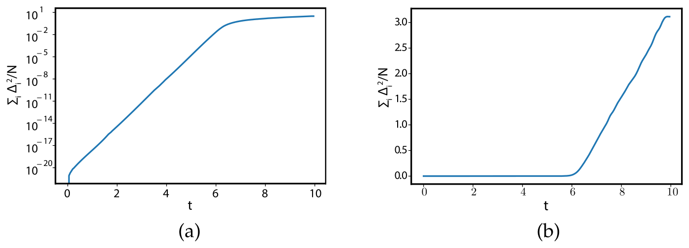
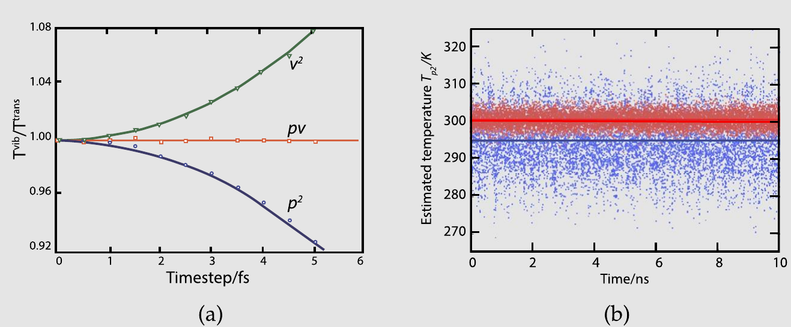

# 分子动力学模拟

分子动力学（Molecular Dynamics，简称MD）模拟是一种计算经典多体系统平衡性质和输运性质的技术。在这里，“经典”一词意味着组成粒子的核运动遵循经典力学定律，这对于范围广泛的分子的平动和转动运动来说是一个极好的近似。然而，在考虑轻原子或分子（He、H$_2$、D$_2$）的平动或转动运动，或者频率$\nu$满足$h\nu > k_BT$的振动运动时，量子效应不可忽略。

分子动力学模拟由Alder和Wainwright在20世纪50年代中期开创^[18]，此后已成为物理、生物和工程科学许多领域的标准工具。关于该方法的书已有数十本。此外，还有许多书籍描述了MD模拟在特定领域的应用，或在特定程序包中使用MD模拟的方法。

在下面的内容中，我们并不旨在涵盖MD模拟的所有方面。与本书其他部分一样，我们关注方法的基础：它是什么，它能做什么，以及重要的是，它不能做什么——并以最简单的方式让读者了解如何进行操作。我们建议对MD其他方面感兴趣的读者参阅该主题的一些优秀书籍^[21--24,26,105]。除了书籍之外，还有许多会议论文集提供了该领域发展的快照^[44--46,49]。

## 分子动力学：基本思想

分子动力学模拟在许多方面与真实实验相似。进行真实实验时，我们的步骤如下：我们制备一个想要研究的材料样品。我们将该样品连接到测量仪器（例如温度计、压力表或粘度计），并在一定时间间隔内记录感兴趣的性质。如果我们的测量受到统计噪声的影响（大多数测量都是如此），那么平均的时间越长，测量就越精确。在分子动力学模拟中，我们遵循相同的方法。首先，我们制备一个样品：选择一个由$N$个粒子组成的模型系统，并求解该系统的牛顿运动方程，直到系统的性质不再随时间变化（即，我们对系统进行平衡）。平衡之后，我们进行实际测量。事实上，在进行计算机实验时可能犯的一些最常见错误，与在真实实验中可能犯的错误类似：例如，样品制备不正确，测量持续时间过短，系统在模拟过程中发生了不可逆变化，或者我们测量的并不是我们以为测量的内容。

要在分子动力学模拟中测量一个可观测量，我们首先必须能够将该可观测量表示为系统中粒子位置和动量的函数。例如，在（经典）多体系统中，温度的一个方便定义利用了在哈密顿量中以二次形式出现的所有自由度上的能量均分。在热力学极限下，我们有

$$
\left\langle \frac{1}{2}mv_\alpha^2 \right\rangle = \frac{1}{2}k_BT.
\tag{4.1.1}
$$

然而，这一关系对于有限系统并不完全正确。特别是，对于一个总动能固定的假想原子系统，我们可以使用微正则关系定义动理温度

$$
\frac{1}{k_BT} = \frac{\partial \ln \Omega(E_\text{kin})}{\partial E_\text{kin}}.
\tag{4.1.2}
$$

然后我们发现，对于一个总动量固定的$d$维$N$原子系统，瞬时温度$k_BT$等于$2E_\text{kin}/(d(N-1)-1)$。因此，进入均分关系的自由度数为$N_f = dN - (d+1)$。在相互作用系统中，总动能是涨落的，瞬时温度也是涨落的：

$$
T(t) = \frac{\sum_{i=1}^N m_i v_i^2(t)}{k_B N_f}.
\tag{4.1.3}
$$

由于相互作用系统中总动能的方差与$\sqrt{N} \approx \sqrt{N_f}$成正比^[106]（见第5.1.8节），温度的相对涨落将为$1/\sqrt{N_f}$的量级。由于许多模拟中$N_f$在$10^3$--$10^6$的范围内，温度的统计涨落通常为$O(1\%)$--$O(0.1\%)$的量级。要获得更精确的温度估计，应该在多次涨落上进行平均。注意，对于包含非常少粒子的系统，自由度数的正确计数变得很重要^[107]。

## 分子动力学：程序

了解分子动力学模拟最好的方法是考虑一个简单的程序。我们考虑的程序尽可能简单，以说明分子动力学模拟的若干重要特征。

该程序的构建如下：

1. 我们指定设定运行条件的参数（例如初始温度、粒子数、密度、时间步长等）。
1. 我们初始化系统（即选择初始位置和速度）。
1. 我们计算所有粒子上的力。
1. 我们对牛顿运动方程进行积分。这一步和前一步构成了MD模拟的核心。这两步重复执行，直到我们计算了所需长度的时间演化。
1. 在核心循环完成后，我们计算并存储测量量的平均值，然后停止。

算法 3是一个原子系统分子动力学模拟的伪算法。下面我们更详细地讨论程序中的各个步骤。

### 初始化

要开始模拟，我们应该为系统中所有粒子赋予初始位置和速度。特别是对于晶体系统的模拟，粒子位置应与我们想要模拟的晶体结构相容。这一要求对周期性盒子中的粒子数施加了约束：例如，对于立方盒子，FCC晶体中的粒子数应为$N = 4n^3$，其中$n$为整数；对于BCC，$N = 2n^3$。无论如何，粒子不应被放置在导致原子或分子核心明显重叠的位置。在算法 4中，我们没有显式指定初始晶体结构。为了说明方便，我们假设它是一个简单立方格子，它在力学上是不稳定的。为了模拟液体，我们通常选择密度和初始温度使得简单立方格子快速熔化。首先，我们将每个粒子放在其格点上，在算法 4中，我们使用Box-Muller方法^[66]为每个粒子的每个速度分量$\alpha = \{x,y,z\}$赋予一个从高斯分布中抽取的值：$v_{i,\alpha} \sim \sqrt{-\ln R_1}\cos(2\pi R_2)$，其中$R_1$、$R_2$是在0和1之间均匀分布的随机数。然后，我们平移所有速度使总动量为零，并缩放所得速度以将平均动能调整到所需值。我们知道，在热平衡时，当$N \gg 1$时，以下关系成立：

$$
\langle v_\alpha^2 \rangle = k_BT/m,
\tag{4.2.1}
$$

其中$v_\alpha$是给定粒子速度的$\alpha$分量。我们可以利用这一关系定义时间$t$的瞬时温度$T(t)$：

$$
k_BT(t) \equiv \frac{\sum_{i=1}^N m v_{\alpha,i}^2(t)}{N_f}.
\tag{4.2.2}
$$

**算法 3　分子动力学程序核心**

```
 program MD
 基本MD代码
 [...]
 setlat
 初始化位置x的函数
 initv(temp)
 初始化速度vx的函数
 t=0
while (t < tmax)
 主MD循环
 FandE
 计算力和总能量的函数
 Integrate-V
 积分运动方程的函数
 t=t+delt
 更新时间
 sample
 采样平均值的函数
end while
 程序结束
```

**具体说明**（一般说明见第7页）：

1. 开头的[...]指的是程序中使用的变量和参数的初始化。我们假设最大运行时间tmax和时间步长delt是全局变量。初始温度temp在函数initv中显式需要，因此作为参数显示。
1. 函数setlat在给定体积中创建npart个粒子的晶体格子（见算法 20）。粒子数npart通常选择为与晶胞数$(n_x, n_y, n_z)$和每个晶胞中的粒子数$n_c$相容：$\text{npart} = n_x \times n_y \times n_z \times n_c$。
1. 为了模拟无序系统，许多模拟包会生成已经无序的初始结构。这种函数可以加速平衡，但需要额外的步骤。
1. 函数Initv（见算法 4）初始化速度vx使得初始温度为temp。从这些速度，可以计算前一个时间步的位置xm。
1. 主循环由三个步骤组成：
   (a) FandE（见算法 5）计算当前能量和力
   (b) Sample在时间$t$采样所需的观测量——不必每个时间步都采样。见算法 8和9中的一些采样算法示例。
   (c) 使用Verlet算法积分牛顿运动方程（Integrate-V——见算法 6）并更新时间$t$。

显然，我们可以通过将所有速度乘以因子$(T/T(t))^{1/2}$来调整瞬时温度$T(t)$以匹配所需温度$T$。温度的这种初始设置并不是特别关键，因为温度在平衡过程中无论如何都会变化。

**算法 4　分子动力学程序初始化**

```
 function initv(temp)
 初始化MD程序的速度
 sumv=0
 sumv2=0
for $1 \leq i \leq \text{npart$}
 x(i) = lattice\_pos(i)
 将粒子放置在晶格上
 vx(i) = $\sqrt{-\ln(R)\cos(2\pi R)}$
 生成一维正态分布
 sumv=sumv+v(i)
 质心动量 ($m = 1$)
end for
 sumv=sumv/npart
 质心速度
for $1 \leq i \leq \text{npart$}
 设置目标动能并设定
 vx(i) = vx(i) - sumv
 质心速度归零
 sumv2=sumv2+vx(i)$^{2}$
 动能
end for
 fs=$\sqrt{\text{temp}/(\text{sumv2/nf})}$
 temp = 目标初始温度
for $1 \leq i \leq \text{npart$}
 vx(i)=vx(i)*fs
 设置初始动力学温度
 xm(i)=x(i)-vx(i)*dt
 前一时间步的位置
end for
 函数结束
```

**具体说明**（一般说明见第7页）：

1. 每次调用随机数例程都会产生一个不同的随机数$R$，在0和1之间均匀分布。
1. 严格来说，我们不必为初始速度生成Maxwell-Boltzmann分布：在平衡之后，分布将变为Maxwell分布。
1. nf是自由度数。在$d$维中，能量和动量守恒意味着$nf = d \times (\text{npart}-1) - 1$。
1. 在平衡过程中，动能会发生变化。因此，平衡后系统的温度将与temp不同。

正如后面将看到的，在我们的算法中求解牛顿运动方程时，我们并不真正直接使用速度本身。相反，我们使用所有粒子在当前（x）和前一个（xm）时间步的位置，结合我们对作用在粒子上的力（f）的了解，来预测下一个时间步的位置。当我们开始模拟时，我们必须通过生成近似的先前位置来引导这一过程。不太考虑除线动量守恒之外的任何力学定律，我们近似一个粒子在某个方向上的先前位置为$\text{xm}(i) = \text{x}(i) - \text{v}(i) \times \text{dt}$。当然，我们可以对每个粒子的真实先前位置做出更好的估计。但由于我们只是在引导模拟，我们不必担心这些细节。

### 力的计算

接下来是大多数分子动力学模拟中最耗时的部分：计算作用在粒子上的力。如果我们考虑一个具有对可加相互作用的模型系统（如我们目前的情况），我们必须考虑在粒子$i$的相互作用范围内所有粒子对$i$所受力的贡献。[^1]如果我们只考虑一个粒子与另一个粒子的最近镜像之间的相互作用，这意味着对于一个$N$个粒子的系统，我们必须计算$N \times (N-1)/2$个粒子对之间的距离。如果不使用任何节省时间的技巧，计算力所需的时间将按$N^2$缩放。存在一些高效技术可以加速短程力和长程力的计算，使计算时间按$N$（对于长程力为$N \ln N$）而非$N^2$缩放。在附录I中，我们描述了一些加速粒子间力计算的常用技术。虽然该附录中的例子适用于Monte Carlo模拟，但类似的技术也可用于分子动力学模拟。然而，在目前这个简单的例子中（见算法 5），我们不会试图使程序特别高效，实际上我们会显式考虑所有可能的粒子对。

我们首先计算每对粒子$i$和$j$在$x$、$y$和$z$方向上的当前（矢量）距离。这些距离记为xr。与Monte Carlo情况一样，我们使用周期性边界条件（见第3.3.2.1节）。在本例中，我们在分子间相互作用的显式计算中使用截断距离$r_c$，其中$r_c$应选择为小于周期性盒子直径的一半，以确保给定粒子$i$仅与任何其他粒子$j$的最近周期镜像相互作用。

在本例中，周期性盒子的直径记为box。如果我们使用简单立方周期性边界条件，$i$与$j$的最近镜像在任意方向上的距离应始终小于（绝对值）box/2。计算$i$与$j$最近镜像之间距离的一种紧凑方法是使用最近整数函数。我们首先计算xr，即$i$和任意$j$的当前$x$坐标之差。注意这些坐标不必在同一个周期性盒子内。为获得$i$和$j$最近镜像之间的$x$距离，我们将xr变换为$\text{xr} = \text{xr} - \text{box} \times \text{nint}(\text{xr}/\text{box})$。一旦我们计算了$\mathbf{r}_{ij}$的所有笛卡尔分量（即$i$和$j$最近镜像之间的矢量距离），我们就计算$r_{ij}^2$（在程序中记为r2）。然后我们检验$r_{ij}^2$是否小于$r_c^2$，即截断半径的平方。如果$r_{ij}^2 > r_c^2$，$j$不与$i$相互作用，我们跳到$j$的下一个值。注意我们并不计算$|\mathbf{r}_{ij}|$本身，因为那将涉及平方根的计算，而（至少在现阶段）这是不必要的。

**算法 5　对力与能量计算**

```
 function FandE
 计算力和能量
 rc2=rc$^{2}$
 rc=2 是默认截断距离
 en=0
 能量初始化为零
for $1 \leq i \leq \text{npart$}
 fx(i)=0
 力初始化为零
end for
for $1 \leq i \leq \text{npart-1$}
for $i+1 \leq j \leq \text{npart$}
 遍历所有粒子对
 xr=x(i)-x(j)
 xr=xr-box*round(xr/box)
 最近映像距离
 r2=xr$^{2}$
if r2 $<$ rc2
 检查截断
 r2i=1/r2
 r2im1=r2i-1.0
 rc2r2im1=rc2*r2i-1.0
 en=en+r2im1*rc2r2im1$^{2}$
 对能量
 ff=6.0*r2i$^{2}$*rc2r2im1
 *(rc2r2im1-2)
 对力
 fx(i)=fx(i)+ff*xr
 fx(j)=fx(j)-ff*xr
end if
end for
end for
 end function
```

**具体说明**（一般说明见第7页）：

1. 虽然FandE与程序的其余部分共享数组和参数，但它不需要特定的输入参数。
1. 模拟盒子的直径记为box。
1. 函数round将浮点数四舍五入到最接近的整数。
1. 在本算法中，我们使用WF势^[81]，这是一个简单的类LJ势。在约化单位下，对能为：
   $$
   \text{en} = \left(\frac{1}{r^2} - 1\right)\left(\frac{r_c^2}{r^2} - 1\right)^2, \quad \text{对于} \; r < r_c.
   $$
1. WF势的对力ff在$r_c$处光滑地趋于零。因此，该势不需要在$r_c$处截断和平移（与LJ不同）。
1. 对于典型的原子系统，$r_c$的默认值为2.0（以$\sigma$为单位），即势能首次过零的最小$r$值。对于（纳米）胶体，我们可以使用更小的$r_c$值，但需要不同的前置因子（见^[81]）。

如果某一对粒子距离足够近可以相互作用，我们必须计算这些粒子之间的力。我们还计算粒子对$ij$对总势能的贡献，因为监测可能的能量漂移是有用的。然而，我们并不需要知道相互作用的势能来积分牛顿运动方程。

举一个例子：力的$x$分量为

$$
f_x(r) = -\frac{\partial u(r)}{\partial x} = -\frac{x}{r}\frac{\partial u(r)}{\partial r},
$$

对于Lennard-Jones系统，在约化单位下等于：

$$
f_x(r) = 48x\left(\frac{1}{r^2} - 0.5\right)\left(\frac{1}{r^{12}} - \frac{1}{r^6}\right).
$$

### 运动方程的积分

既然我们已经计算了所有粒子间的力，我们就可以对牛顿运动方程进行积分了。已有多种算法被设计来完成这项任务。有很好的理由偏好某些MD算法而非其他。为了解释相关的考虑因素，我们将更详细地讨论一些MD算法。

在算法 6所示的简单例子中，我们使用了所谓的Verlet算法。正如我们后面将讨论的，Verlet算法不仅是最简单的算法之一，而且通常也是最好的。

为了推导Verlet算法，我们从一个粒子坐标在时间$t$附近的Taylor展开出发：

$$
\mathbf{r}(t+\Delta t) = \mathbf{r}(t) + \mathbf{v}(t)\Delta t + \frac{\mathbf{f}(t)}{2m}\Delta t^2 + \frac{\ddot{\mathbf{r}}(t)}{3!}\Delta t^3 + \mathcal{O}(\Delta t^4),
$$

类似地，

$$
\mathbf{r}(t-\Delta t) = \mathbf{r}(t) - \mathbf{v}(t)\Delta t + \frac{\mathbf{f}(t)}{2m}\Delta t^2 - \frac{\ddot{\mathbf{r}}(t)}{3!}\Delta t^3 + \mathcal{O}(\Delta t^4).
\tag{4.2.3}
$$

将这两个方程相加，我们得到

$$
\mathbf{r}(t+\Delta t) + \mathbf{r}(t-\Delta t) = 2\mathbf{r}(t) + \frac{\mathbf{f}(t)}{m}\Delta t^2 + \mathcal{O}(\Delta t^4),
$$

即

$$
\mathbf{r}(t+\Delta t) \approx 2\mathbf{r}(t) - \mathbf{r}(t-\Delta t) + \frac{\mathbf{f}(t)}{m}\Delta t^2.
$$

**算法 6　运动方程积分**

```
 function Integrate-V
 积分运动方程
 sumv=0
 sumv2=0
for $1 \leq i \leq \text{npart$}
 MD循环
 xx=2.0*x(i)-xm(i)+delt$^{2}$*fx(i)
 Verlet算法 (4.2.3)
 vi=(xx-xm(i))/(2*delt)
 速度 (4.2.4)
 sumv=sumv+vi
 质心速度
 sumv2=sumv2+vi$^{2}$
 总动能
 xm(i)=x(i)
 更新“旧”位置
 x(i)=xx
 更新“当前”位置
end for
 temp=sumv2/(nf)
 当前温度
 etot=(en+0.5*sumv2)/npart
 以及每个粒子的总能量
 函数结束（可能在别处使用）
```

**具体说明**（一般说明见第7页）：

1. 在没有外力的情况下，牛顿运动方程守恒动量。这对于运动方程的离散形式也成立。因此，在一个时间步长内，sumv/npart（即系统质心速度）应保持守恒（通常为零），在机器精度范围内，除非系统中存在可以充当动量汇的障碍物（例如壁面）。
1. 牛顿运动方程也守恒孤立系统的总能量。然而，在离散版本中，etot的守恒只是近似的。尽管如此，好的算法通常会抑制长时间的能量漂移。因此，监测etot很重要，因为该量的漂移可能表明程序存在错误。
1. 在此函数中，我们使用Verlet算法（4.2.3）来积分运动方程。速度使用方程（4.2.4）计算。
1. 为了计算温度，sumv2除以nf（自由度数）：见算法 4。

新位置的估计包含一个$\Delta t^4$量级的误差，其中$\Delta t$是我们分子动力学方案中的时间步长。注意Verlet算法不使用速度来计算新位置。然而，可以从轨迹的知识推导速度，使用

$$
\mathbf{r}(t+\Delta t) - \mathbf{r}(t-\Delta t) = 2\mathbf{v}(t)\Delta t + \mathcal{O}(\Delta t^3),
$$

即

$$
\mathbf{v}(t) = \frac{\mathbf{r}(t+\Delta t) - \mathbf{r}(t-\Delta t)}{2\Delta t} + \mathcal{O}(\Delta t^2).
\tag{4.2.4}
$$

这个速度表达式仅精确到$\Delta t^2$量级。如下面所示（方程(4.3.7)），可以使用类Verlet算法（即产生与方程(4.2.3)给出的相同轨迹的算法）获得更精确的速度估计（从而获得更精确的动能）。在我们的程序中，我们仅使用速度来计算动能，从而计算瞬时温度。

现在我们已经计算了新位置，我们可以丢弃时间$t-\Delta t$时的位置。当前位置变为旧位置，新位置变为当前位置。

在每个时间步之后，我们计算当前温度（temp）、在力循环中计算的当前势能（en）和总能量（etot）。注意总能量应该近似守恒。

上面的例子完成了我们对分子动力学方法的介绍。我们尽可能简短地阐述，以说明MD程序的核心是非常简单的。读者现在应该能够编写一个基本的分子动力学程序，用于模拟由球形粒子组成的液体或固体。在下面的内容中，我们将更详细地讨论可用于积分运动方程的各种方法。在第5章中，我们将讨论分子动力学模拟中的测量。分子动力学方法的重要扩展将在第7章中讨论。

## 运动方程

一个好的分子动力学程序的核心是一个好的算法来积分牛顿运动方程。因此，算法的选择至关重要。然而，虽然识别一个坏算法很容易，但一个好算法应该满足什么标准并不是立刻显而易见的。下面我们列出若干可能的标准，并展示广泛使用的Verlet算法在最重要的方面表现良好。我们强调，我们下面的描述缺乏任何数学严谨性的外观。我们建议希望深入了解MD算法优缺点的读者参阅Leimkuhler和Matthews的著作^[23]。

### 轨迹精度与Lyapunov不稳定性

人们可能期望一个好的MD算法能够准确预测所有粒子在短时间和长时间内的轨迹。遗憾的是，不存在这样的算法。对于我们通过MD模拟研究的基本所有系统，我们都处于系统轨迹通过相空间的路径敏感依赖于初始条件的区域。这意味着最初非常接近的两条轨迹将随时间推移呈指数发散。表现出这种对初始条件极端敏感性的动力系统被称为混沌系统。并非所有多体系统都表现出这种对初始条件的极端敏感性，但大多数在不太低温度下的多体系统确实如此。

我们描述初始条件的微小差异可以由多种原因引起：浮点数有限的位数，或者我们使用近似算法来积分运动方程这一事实：在这种情况下，混沌行为意味着使用略微不同时间步长获得的轨迹仍将不可避免地彼此指数发散。指数增长的小误差会导致“真实”轨迹与模拟中生成的相应轨迹之间的完全退相关。

为了说明轨迹对初始条件微小差异的极端敏感性，让我们考虑一个$N$个原子的液体。给定初始原子位置和动量$(\mathbf{r}^N(0), \mathbf{p}^N(0))$，我们可以使用上一节介绍的Verlet MD代码来预测这些原子在较晚时间$t$的位置和动量：

$$
\mathbf{r}(t) = \mathbf{f}[\mathbf{r}^N(0), \mathbf{p}^N(0); t].
\tag{4.3.1}
$$

现在让我们考虑，如果我们用一个小量$\epsilon$扰动初始条件（例如某些动量），粒子在时间$t$的位置将如何变化。由于初始条件的这一变化，我们将获得$\mathbf{r}$在时间$t$的不同值：

$$
\mathbf{r}'(t) = \mathbf{f}[\mathbf{r}^N(0), \mathbf{p}^N(0)+\boldsymbol{\epsilon}; t].
$$

我们将$\mathbf{r}(t)$和$\mathbf{r}'(t)$之间的差记为$\delta\mathbf{r}(t)$。对于足够短的时间和小的$\epsilon$，$\delta\mathbf{r}(t)$与$\epsilon$呈线性关系。然而，线性依赖的系数呈指数发散；即

$$
|\delta\mathbf{r}(t)| \sim \epsilon\exp(\lambda t).
$$

轨迹的这种所谓Lyapunov不稳定性是我们无法在几乎所有模拟中准确预测轨迹的原因。应该强调的是，Lyapunov不稳定性的存在是系统的特征，而非算法的特征。因此，它不能通过选择另一种算法来积分牛顿运动方程来修复。

虽然Lyapunov不稳定性看起来是坏消息，但实际上是好消息，因为非混沌系统（例如在具有光滑硬壁的立方容器中的理想气体）即使在无限长的运行中也不会采样所有可用的相空间：它们是非遍历的（见第2.4节）。

方程(4.3.1)中的指数$\lambda$被称为Lyapunov指数，更准确地说，最大Lyapunov指数。总共有$2dN$个Lyapunov指数，但最大的一个主导了初始接近的轨迹的长时间指数发散。

为了说明实际上不可能克服Lyapunov不稳定性，让我们假设我们希望在区间$0 < t < t_\text{max}$内维持对$|\delta\mathbf{r}(t)|$的某个界限$\delta_\text{max}$；我们能承受多大的初始误差（$\epsilon$）？从方程(4.3.1)我们推导出

$$
\epsilon \sim \delta_\text{max}\exp(-\lambda t_\text{max}).
$$

因此，初始条件的可接受误差随$t_\text{max}$（运行长度）的增加呈指数递减。为了说明这种效应是真实的，我们展示了两次几乎相同的模拟结果：第二次与第一次的区别在于一个粒子的速度增加了$10^{-8}$，另一个粒子减少了相同的量。我们监测所有粒子位置差的平方和：

$$
\sum_{i=1}^N \left| r_i(t) - r'_i(t) \right|^2.
$$

如图 4.1a所示，这种距离的度量确实在短时间内随时间指数增长。然而，如同早期宇宙一样，指数增长不能无限持续，图 4.1b显示了向扩散性散发的转变，如果轨迹完全退相关，这是可以预期的。



*图 4.1　对含 500 个原子、密度 $\rho = 0.8$、温度 $T = 1.0$ 的 WF 体系的模拟中 Lyapunov 不稳定性的示例。图中给出两条初始非常接近的轨迹之间每个粒子的平方距离（以 $\sigma^2$ 为单位）随时间的变化（见正文）。以约化单位计的总运行长度为 10。这里选取了相当小的时间步长 $\Delta t = 0.0005$，此时能量守恒优于 $1/10^{6}$。(a) 表明初始阶段原始轨迹与受扰轨迹呈指数发散；然而在 $t \approx 6$ 之后，轨迹转为扩散式发散，即其均方间距随 $t$ 线性增长（见图 b）。*

经过10个时间单位后，最初非常接近的两个系统已变得几乎不相关。应该强调的是，这次运行是使用完全正常的参数（密度、温度、时间步长）进行的。唯一不切实际的是这次模拟非常短。大多数分子动力学模拟探索系统在一个时间长很多个数量级的区间内的演化。

考虑建模$N$体系统性质与预测（例如）卫星轨迹之间的区别是有启发性的：通常卫星的轨迹不是很混沌的。但我们确实需要尽可能准确地预测其轨道。这需要不同于MD的算法：不是更好的算法，而是更专注于短到中期精度的算法，通常以长期能量漂移为代价。相比之下，大多数通过MD模拟研究的系统处于系统轨迹通过相空间敏感依赖于初始条件的区域。[^2]

我们应该预期，在对运动方程进行积分时，任何初始误差，无论多小，都将导致模拟轨迹从相同初始条件出发的真实轨迹指数发散。Lyapunov不稳定性似乎对分子动力学模拟的整个理念造成了毁灭性的打击。然而，我们有充分的理由认为情况是——正如俗话所说——绝望但不严重。

我们需要解释为什么Lyapunov不稳定性不会使所有MD模拟变得毫无意义。首先，我们注意到MD模拟的目的几乎从来不是详细预测系统的位置和动量将如何随时间演化——给定初始条件。相反，我们通常对统计预测感兴趣。我们希望预测一个已经处于由某些宏观描述符（例如其总能量或其所处的相）表征的初始状态的系统的平均性质：我们不需要指定所有坐标或动量。

在这方面，MD模拟背后的理念与预测卫星在太空中轨迹的数值方案有根本不同：在后一种情况下，我们确实希望预测真实轨迹。我们无法承受发射一组卫星并对其目的地进行统计预测。然而，在MD模拟中，统计预测就足够了。尽管如此，除非数值获得的轨迹在某种意义上代表了真实轨迹，否则这并不能证明使用不精确轨迹是合理的。

另一个混沌系统的例子可能有助于说明这一点：天气的时间演化是混沌的。这就是为什么很难获得超过几天的准确天气预报。然而，通过考虑大量此类天气模拟，我们仍然可以做出关于“平均”天气（即气候）的可靠陈述。

由于MD模拟旨在测量一个足够接近真实轨迹的系统的长时间平均性质，我们希望我们的MD模拟提供一个对真实轨迹（任何真实轨迹）的良好近似，但不一定是从相同初始条件出发的那一条。因此，一个好的MD模拟是在相空间中生成一条保持接近真实轨迹（所谓的影子轨道）的数值路径，即使我们不知道那条轨迹是什么。

令人惊讶的是（也是幸运的），似乎对于初始条件的微小差异导致轨迹指数发散的系统，影子轨道表现得更好（即更好地跟踪数值轨迹），比那些没有这种发散的看似更简单的系统^[109]。

尽管有这些令人安心的证据（也见第4.3.5节和参考文献^[110]），应该强调的是，这仅仅是证据而非证明。事实上，影子轨道的存在尚未对任何对MD模拟有意义的系统类别得到证明，尽管有支持的、间接的数值证据（见例如^[109]）。简而言之：我们对分子动力学模拟作为生成多体系统真实轨迹良好近似工具的信任很大程度上基于信念，或者更善意地说：它是一个工作假设。在结束这一讨论之前，让我们说壁橱里显然有一具骷髅。我们相信这具骷髅不会来纠缠我们，我们迅速关上了壁橱门。更多细节，读者可参考文献^[31,110--112]。

在下一节中，我们将论证Verlet算法是一个好算法。

### 算法的其他理想特性

**速度。**虽然乍一看算法的速度似乎很重要，但通常它不是非常相关，因为在积分运动方程上花费的时间比例（相对于计算相互作用）是很小的，至少对于原子和简单分子系统如此。

**最大允许时间步长。**使用大时间步长时的稳定性似乎更重要，因为我们能使用的时间步长越长，每单位模拟时间所需的力评估次数就越少。这一观察表明，使用允许我们使用大时间步长的复杂算法是有利的。在实践中，这个问题通常通过仍然使用简单算法但使用多个时间步长来解决（见第14章第14.3节）。

**能量守恒。**能量守恒是一个重要的标准，但实际上，我们应该区分两种能量守恒，即短时间和长时间能量守恒。更复杂的高阶算法往往在短时间（即在少量时间步内）具有非常好的能量守恒。然而，它们通常具有总能量在长时间内漂移的不良特性。相比之下，Verlet风格的算法往往只有中等良好的短期能量守恒，但长期漂移很小。下面我们将为这些观察提供理论依据。

**时间可逆性。**由于牛顿运动方程是时间可逆的，我们的数值轨迹应该遵循同样的性质：即，如果我们反向运行MD算法，我们应该回到初始条件（除了机器精度水平上可能存在的舍入误差）。很容易证明Verlet算法满足时间可逆性。将由Verlet算法生成的坐标记为$\mathbf{r}_V$，我们注意到Verlet运动方程将$\mathbf{r}_V(t)$与$\mathbf{r}_V(t+\Delta t)$和$\mathbf{r}_V(t-\Delta t)$联系起来的表达式在$\Delta t$变号下是不变的：

$$
\mathbf{r}_V(t+\Delta t) + \mathbf{r}_V(t-\Delta t) = 2\mathbf{r}_V(t) + \frac{\mathbf{f}(t)}{m}\Delta t^2.
$$

事实上，许多算法，例如预测-校正方案（见补充材料L.1）以及一些用于处理约束的方案，都不是时间可逆的。即：未来和过去的相空间坐标在这些算法中不起对称的作用。结果是，如果人们在给定时刻反转所有粒子的动量，系统不会在相空间中回溯其轨迹，即使模拟是以无限机器精度进行的。

除了缺乏时间可逆性之外，许多看似合理的算法在另一个关键方面与Hamilton运动方程不同：真正的Hamilton动力学保持相空间中任何体积元的大小不变。[^3]

相空间中体积不守恒可能听起来像是对算法的一种深奥反对意见，但事实并非如此。在不尝试对问题进行严格表述的情况下，我们只需注意到，对应于特定能量$E$的所有轨迹都包含在相空间中的一个（超）曲面$\Omega$中。[^4]

如果我们让Hamilton运动方程作用于该体积中的所有点（即让体积随时间演化），我们最终得到完全相同的体积。然而，一个非面积守恒的算法将把体积$\Omega(E)$映射到另一个（通常更大的）体积$\Omega'$。在足够长的时间后，我们预期非面积守恒算法将大大扩展我们系统在相空间中的体积。相空间中体积的扩展与能量守恒不兼容。因此，不可逆算法将会有严重的长期能量漂移问题是合理的。可逆的、面积守恒的算法不会改变相空间中体积的大小。这个性质不能保证没有长期能量漂移，但至少与之兼容。可以通过计算从旧相空间坐标到新相空间坐标变换的Jacobian来检查一个算法是否面积守恒。

最后，应该注意的是，即使我们积分一个时间可逆的算法，我们也会发现数值实现几乎从来不是真正时间可逆的。这是因为我们在具有有限机器精度的计算机上工作，使用导致舍入误差（在机器精度量级上）的浮点运算。

在本节的其余部分中，我们将更详细地讨论其中一些要点。在此之前，让我们首先考虑Verlet算法在上述各方面的表现如何。首先，Verlet算法是快速的。但我们已经论证过这相对不太重要。其次，位置/速度中的误差按$\Delta t^4/\Delta t^2$缩放。因此它对于较大的时间步长不是特别精确，我们需要相当频繁地计算所有粒子上的力。第三，它所需的内存大约是可能的最小值。这在Verlet时代是一个关键优势（当时），尽管现在不太相关了，但在模拟非常大的系统时仍然有用。第四，其短期能量守恒只是中等（对于使用更精确速度表达式的版本略好：见方程(4.3.7)）。更重要的是，它表现出很小的长期能量漂移。这与Verlet算法是时间可逆和面积守恒的这一事实有关。事实上，虽然Verlet算法不完全守恒系统的总能量，但它确实守恒一个在无限短时间步长极限下趋近真实哈密顿量的伪哈密顿量（见第4.3.4节）。[^5] 用Verlet算法生成的轨迹的精度并不令人印象深刻。但是，使用更好的算法也无济于事，因为这样的算法只会将轨迹中不可避免的指数误差增长推迟几百个时间步（见第4.3.1节），而没有任何算法好到足以在可与典型分子动力学运行持续时间相比的时间内保持轨迹接近真实轨迹。

### Verlet算法的其他版本

让我们简要看看Verlet算法的一些替代方案，但在讨论这些之前，我们首先考虑一个朴素算法，它仅基于粒子坐标的截断Taylor展开：

$$
\mathbf{r}(t+\Delta t) = \mathbf{r}(t) + \mathbf{v}(t)\Delta t + \frac{\mathbf{f}(t)}{2m}\Delta t^2 + \cdots.
\tag{4.3.2}
$$

如果我们在$\Delta t^2$项之后截断这个展开，我们就得到了所谓的前向Euler算法。虽然这个算法看起来与Verlet算法相似，但它在几乎所有方面都差得多。特别是，它既不可逆也不面积守恒，并且遭受（灾难性的）能量漂移。因此，说不推荐使用Euler算法是一种轻描淡写。

有几种算法与Verlet方案严格等价。其中最简单的是所谓的蛙跳（Leap Frog）算法^[28]。该算法在半整数时间步计算速度，并使用这些速度来计算新位置。为了从Verlet方案推导蛙跳算法，我们首先定义半整数时间步的速度如下：

$$
\mathbf{v}(t-\Delta t/2) \equiv \frac{\mathbf{r}(t) - \mathbf{r}(t-\Delta t)}{\Delta t}
$$

和

$$
\mathbf{v}(t+\Delta t/2) \equiv \frac{\mathbf{r}(t+\Delta t) - \mathbf{r}(t)}{\Delta t}.
$$

从后一个方程，我们平凡地获得一个基于旧位置和速度的新位置表达式：

$$
\mathbf{r}(t+\Delta t) = \mathbf{r}(t) + \Delta t \mathbf{v}(t+\Delta t/2).
$$

从Verlet算法，我们得到速度更新的以下表达式：

$$
\mathbf{v}(t+\Delta t/2) = \mathbf{v}(t-\Delta t/2) + \Delta t\frac{\mathbf{f}(t)}{m}.
\tag{4.3.3}
$$

由于蛙跳算法可以从Verlet算法推导出来，它产生相同的轨迹。注意，然而，速度与位置不在同一时间定义。因此，动能和势能也不是同时定义的，所以我们不能在蛙跳方案中直接计算总能量。

然而，可以将Verlet算法写成使用在同一时间计算的位置和速度的形式。这种所谓的速度Verlet算法^[113]看起来像坐标的Taylor展开：

$$
\mathbf{r}(t+\Delta t) = \mathbf{r}(t) + \mathbf{v}(t)\Delta t + \frac{\mathbf{f}(t)}{2m}\Delta t^2.
\tag{4.3.4}
$$

然而，速度的更新与Euler方案不同：

$$
\mathbf{v}(t+\Delta t) = \mathbf{v}(t) + \frac{\mathbf{f}(t+\Delta t) + \mathbf{f}(t)}{2m}\Delta t.
\tag{4.3.5}
$$

注意，在这个算法中，我们只能在计算了新位置（并从中得到新力）之后才能计算新速度。这个方案与原始Verlet算法等价并不是立刻显而易见的。为了证明这一点，我们注意到

$$
\mathbf{r}(t+2\Delta t) = \mathbf{r}(t+\Delta t) + \mathbf{v}(t+\Delta t)\Delta t + \frac{\mathbf{f}(t+\Delta t)}{2m}\Delta t^2,
$$

而方程(4.3.4)可以写成

$$
\mathbf{r}(t) = \mathbf{r}(t+\Delta t) - \mathbf{v}(t)\Delta t - \frac{\mathbf{f}(t)}{2m}\Delta t^2.
$$

将它们相加，我们得到

$$
\mathbf{r}(t+2\Delta t) + \mathbf{r}(t) = 2\mathbf{r}(t+\Delta t) + [\mathbf{v}(t+\Delta t) - \mathbf{v}(t)]\Delta t + \frac{\mathbf{f}(t+\Delta t) - \mathbf{f}(t)}{2m}\Delta t^2.
\tag{4.3.6}
$$

代入方程(4.3.5)可得

$$
\mathbf{r}(t+2\Delta t) + \mathbf{r}(t) = 2\mathbf{r}(t+\Delta t) + \frac{\mathbf{f}(t+\Delta t)}{m}\Delta t^2,
$$

这确实是Verlet算法的坐标版本。在一个时间步内，Verlet算法在粒子位置变化中引入$O(\Delta t^4)$的误差。然而，速度更新中的误差是$\Delta t^2$量级的。

可以使用所谓的速度校正Verlet算法获得更精确的速度估计，对于该算法，位置和速度中的误差都是$O(\Delta t^4)$量级的。速度校正Verlet算法的推导如下。首先写下$\mathbf{r}(t+2\Delta t)$、$\mathbf{r}(t+\Delta t)$、$\mathbf{r}(t-\Delta t)$和$\mathbf{r}(t-2\Delta t)$的Taylor展开：

$$
\begin{align}
\mathbf{r}(t+2\Delta t) &= \mathbf{r}(t) + 2\mathbf{v}(t)\Delta t + \dot{\mathbf{v}}(t)(2\Delta t)^2/2! + \ddot{\mathbf{v}}(2\Delta t)^3/3! + \cdots \\
\mathbf{r}(t+\Delta t) &= \mathbf{r}(t) + \mathbf{v}(t)\Delta t + \dot{\mathbf{v}}(t)\Delta t^2/2! + \ddot{\mathbf{v}}\Delta t^3/3! + \cdots \\
\mathbf{r}(t-\Delta t) &= \mathbf{r}(t) - \mathbf{v}(t)\Delta t + \dot{\mathbf{v}}(t)\Delta t^2/2! - \ddot{\mathbf{v}}\Delta t^3/3! + \cdots \\
\mathbf{r}(t-2\Delta t) &= \mathbf{r}(t) - 2\mathbf{v}(t)\Delta t + \dot{\mathbf{v}}(t)(2\Delta t)^2/2! - \ddot{\mathbf{v}}(2\Delta t)^3/3! + \cdots.
\tag{4.3.7}
\end{align}
$$

然后可得

$$
8[\mathbf{r}(t+\Delta t) - \mathbf{r}(t-\Delta t)] - [\mathbf{r}(t+2\Delta t) - \mathbf{r}(t-2\Delta t)] + O(\Delta t^5) = 12\mathbf{v}(t)\Delta t,
$$

或等价地，

$$
\mathbf{v}(t) = \frac{\mathbf{r}(t+\Delta t) - \mathbf{r}(t-\Delta t)}{1.5\Delta t} - \frac{\mathbf{r}(t+2\Delta t) - \mathbf{r}(t-2\Delta t)}{12\Delta t} + O(\Delta t^4).
\tag{4.3.8}
$$

注意，这个精确到$O(\Delta t^4)$的速度估计，只有在使用Verlet算法（方程(4.2.3)）生成了时间$t \pm \Delta t$和$t \pm 2\Delta t$处的位置之后才能计算。

**速度Verlet：一个用词不当的名称？**我们应该指出，当前对速度Verlet算法的讨论是一种过度简化，因为速度Verlet方案中的“速度”并不是位置的时间导数$\dot{x}_i(t)$，而只是形式上定义为$v_i \equiv p_i/m$的量。对于$\Delta t \to 0$，$p_i/m \to \dot{x}_i(t)$。然而，正如Gans和Shalloway^[114]所指出的，对于任何有限的$\Delta t$，$v_i$不同于通过对位置光滑插值求导得到的瞬时速度。在参考文献^[114]中，论证了“速度Verlet”算法实际上应该被称为“动量Verlet”算法，因为动量而非速度被正确计算。将Verlet“速度”解释为Hamilton运动方程中的速度所导致的误差可以对许多可观测量产生可察觉的影响，最直接的是对系统温度估计的影响（见第7章）。在现阶段，我们忽略这个微妙但重要的细节，主要是为了保持讨论的简单性。更多细节，我们建议读者参阅参考文献^[114,115]。然而，我们敦促所有读者注意，将Verlet“速度”解释为真正的（一致的）速度可能导致（非）预期的问题（例如，见例1）。

**算法 7　速度Verlet时间步进**

```
 function vel\_verlet
 假设当前x、v和f已知
 来自前一时间步
 K=0
 动能累加器
for $1 \leq i \leq \text{npart$}
 v(i)=v(i)+f(i)*delt2/m
 $v_i$的半步更新（式 (4.3.5)）
 x(i)=x(i)+v(i)*delt
 使用式 (4.3.4) 更新$x_i$
end for
 f = force
 更新所有力
for $1 \leq i \leq \text{npart$}
 v(i)=v(i)+f(i)*delt2/m
 $v_i$的第二次半步更新（式 (4.3.5)）
 K=K+m*v(i)*v(i)/2
 更新动能
end for
 函数结束
```

**具体说明**（一般说明见第7页）：

1. 在此函数中，delt $= \Delta t$和delt2 $= \Delta t/2$。我们显式地写出质量$m$，尽管在其他例子中我们假设$m$是质量单位（即$m=1$）。
1. 函数force计算所有粒子上的力。

???+ example "例证 1（动量在速度 Verlet 算法中的作用）"

    原始（位置）Verlet算法的一个特点是，我们不需要知道速度来传播粒子的位置。然而，为了计算系统的温度，我们需要知道粒子的平均动能，这通常用粒子速度表示。在位置Verlet算法中，可以从粒子在一个时间步内的位移来估计速度，但这是一个相当特设的过程。相比之下，粒子的速度在另外完全等价的速度Verlet算法中显式出现。然而，速度Verlet算法仅在时间步长趋近于零的极限下才给出实际速度。对于非零时间步长，算法更新的是动量，而动量不等于$mv$。

    在Hamilton动力学中（见附录A），具有广义坐标$q_i$和共轭动量$p_i$的粒子$i$的速度由下式给出：

    $$
    v_i = \dot{q}_i = \frac{\partial H}{\partial p_i},
    $$

    其中$H$是总系统的哈密顿量。

    在典型的分子动力学模拟中，动力学遵循由以下给出的哈密顿量：

    $$
    H_0(\mathbf{p}, \mathbf{q}) = \frac{\mathbf{p}^2}{2m} + U(\mathbf{q}).
    $$

    如果我们精确求解这些运动方程，速度为：

    $$
    \mathbf{v} = \frac{\mathbf{p}}{m}.
    $$

    在模拟中，我们通过离散时间来仅近似求解这些运动方程。离散时间处的位置位于一条“影子”轨迹上，沿着这条轨迹“影子哈密顿量”守恒（见第4.3.1节）。一个结果是，在时间$t$处定义为沿这条连续影子路径的位置导数的速度，并不由速度Verlet算法中称为速度的那个量给出。为了揭示“速度”Verlet算法中动量的作用，最好使用Eastwood等人^[115]的记法并写为：

    $$
    \begin{align}
    q(t+\delta t) &= q(t) + \delta t\frac{p(t)}{m} + \frac{1}{2}\frac{F(t)}{m}(\delta t)^2 \\
    p(t+\delta t) &= p(t) + \frac{1}{2}\delta t[F(t) + F(t+\delta t)].
    \tag{4.3.9}
    \end{align}
    $$

    Gans和Shalloway^[114]证明，对于谐振子，$p(t)/m$和通过对离散轨迹插值获得的$\dot{q}$之间可能存在显著差异。这种非平凡差异的后果是，我们会根据使用动量还是速度来计算温度而获得不同的温度。$\dot{q}$和$p/m$之间的差异意味着我们在计算温度时应该小心。正如第5.1.1节中所解释的，以下关系直接从正则系综的性质得出：

    $$
    \langle p_i \dot{q}_i \rangle = k_BT.
    $$

    从上面的讨论可以清楚地看出，我们应该预期以下三种估计温度的方式对于有限时间步长（$\delta t$）是不同的：

    $$
    \begin{align}
    k_BT_{pv} &= \langle p_i v_i \rangle_{\delta t}, \\
    k_BT_{p^2} &= \langle p_i p_i/m_i \rangle_{\delta t}, \\
    k_BT_{v^2} &= \langle m_i v_i v_i \rangle_{\delta t}.
    \tag{4.3.10}
    \end{align}
    $$

    Eastwood等人^[115]计算了双原子分子流体作为$\delta t$函数的不同温度估计，并将他们的结果与简单一维谐振子的结果进行了比较，对于一维谐振子，方程(4.3.8)的表达式可以解析计算。在图 4.2a中，我们展示了作为$\delta t$函数的解析结果。只有在$\delta t \to 0$的极限下，三个温度才会收敛到相同的值。对于模拟中的典型时间步长（2 fs），我们确实看到三个温度之间存在不可忽略的差异。重要的是，方程(4.3.8)产生正确的温度，与时间步长无关。Eastwood等人^[115]验证了他们的双原子流体数值结果与一维谐振子的解析结果吻合良好（见图 4.2a）。

    然而，一维谐振子很难说是MD模拟中研究的系统的代表性例子。因此，Eastwood等人^[115]还模拟了溶液中的蛋白质，并表明使用动能的常规表达式(4.3.10)会在溶剂和蛋白质的温度之间产生明显的表观差异（见图 4.2b）。如果使用方程(4.3.8)代替方程(4.3.10)或方程(4.3.9)，这种差异就消失了。注意表观温度差异并不小。使用后者的方程，人们可能会错误地得出系统尚未平衡的结论。



*图 4.2　(a) 双原子流体在一系列积分时间步长下、按不同方式计算温度所得的能量均分结果。曲线为解析结果，符号为模拟结果。(b) 蛋白质泛素（深色点）与水溶剂（中灰色点）的温度随模拟时间的变化。图基于 Eastwood 等人 ^[115] 的数据。*

**高阶方案。**对于大多数分子动力学应用，类Verlet算法是完全足够的。然而，历史上，需要粒子坐标高阶导数信息的高阶算法经常被使用（主要是因为一些应用数学家批评Verlet算法过于粗糙）。目前，大多数高阶算法已经从MD代码中消失了（见补充材料L.1）。我们建议希望了解更多关于分子动力学模拟其他算法相对优缺点的读者参阅Berendsen和van Gunsteren的优秀早期综述^[116]。

### 时间可逆算法的Liouville表述

到目前为止，我们考虑的积分牛顿运动方程的算法都是从位置关于时间步长的Taylor展开出发的。然而，Tuckerman等人^[117]引入了一种基于物理的视角来理解Verlet风格算法，他们展示了如何从经典力学的Liouville表述系统地推导时间可逆的、面积守恒的MD算法。同样的方法由Sexton和Weingarten^[118]在混合Monte Carlo模拟的背景下独立发展（见第13.3.1节）。由于Liouville表述对什么使一个算法成为好算法提供了相当的洞见，我们简要回顾一下Liouville方法。

让我们考虑一个任意函数$f$，它依赖于经典多体系统中$N$个粒子的所有坐标和动量。我们假设$f(\mathbf{p}^N(t), \mathbf{r}^N(t))$隐含地依赖于时间$t$，即仅通过$(\mathbf{p}^N, \mathbf{r}^N)$对$t$的依赖。$f$的时间导数为$\dot{f}$：

$$
\dot{f} = \dot{\mathbf{r}}\frac{\partial f}{\partial \mathbf{r}} + \dot{\mathbf{p}}\frac{\partial f}{\partial \mathbf{p}} \equiv iLf,
\tag{4.3.11}
$$

其中我们使用了简写记法$\mathbf{r}$表示$\mathbf{r}^N$，$\mathbf{p}$表示$\mathbf{p}^N$。方程(4.3.11)的最后一行定义了Liouville算子$iL$：

$$
iL = \dot{\mathbf{r}}\frac{\partial}{\partial \mathbf{r}} + \dot{\mathbf{p}}\frac{\partial}{\partial \mathbf{p}}.
\tag{4.3.12}
$$

如果$iL$不显含时间，我们可以积分方程(4.3.11)得到

$$
f[\mathbf{p}^N(t), \mathbf{r}^N(t)] = \exp(iLt)f[\mathbf{p}^N(0), \mathbf{r}^N(0)].
\tag{4.3.13}
$$

在所有实际有意义的情况下，我们对这个形式解做不了什么，因为计算右边仍然等价于经典运动方程的精确积分。然而，在少数简单情况下，形式解是已知的。特别是，假设我们的Liouville算子仅包含方程(4.3.12)右边的第一项。我们将$iL$的这一部分记为$iL_r$：

$$
iL_r \equiv \dot{\mathbf{r}}(0)\frac{\partial}{\partial \mathbf{r}},
\tag{4.3.14}
$$

其中$\dot{\mathbf{r}}(0)$是$\dot{\mathbf{r}}$在时间$t=0$时的值。如果我们将$iL_r$代入方程(4.3.13)并使用右边指数的Taylor展开，我们得到

$$
\begin{align}
f(t) &= f(0) + iL_r t f(0) + \frac{(iL_r t)^2}{2!}f(0) + \cdots \\
&= \exp\left[\dot{\mathbf{r}}(0)t\frac{\partial}{\partial \mathbf{r}}\right]f(0) \\
&= \sum_{n=0}^{\infty}\frac{[\dot{\mathbf{r}}(0)t]^n}{n!}\frac{\partial^n}{\partial \mathbf{r}^n}f(0) \\
&= f[\mathbf{p}^N(0), (\mathbf{r}+\dot{\mathbf{r}}(0)t)^N].
\tag{4.3.15}
\end{align}
$$

因此，$\exp(iL_r t)$的效果是坐标的简单平移。类似地，$\exp(iL_p t)$的效果（其中$iL_p$定义为

$$
iL_p \equiv \dot{\mathbf{p}}(0)\frac{\partial}{\partial \mathbf{p}}
\tag{4.3.16}
$$

是动量的简单平移。总Liouville算子$iL$等于$iL_r + iL_p$。不幸的是，我们不能用$\exp(iL_r t) \times \exp(iL_p t)$代替$\exp(iLt)$，因为$iL_r$和$iL_p$是不可交换的算子。对于不可交换的算子$A$和$B$，我们有

$$
\exp(A+B) \neq \exp(A)\exp(B).
\tag{4.3.17}
$$

然而，我们可以利用Trotter恒等式：

$$
e^{(A+B)} = \lim_{P \to \infty} \left[e^{A/2P}e^{B/P}e^{A/2P}\right]^P.
\tag{4.3.18}
$$

在$P \to \infty$的极限下，这个关系形式上是正确的，但实际价值有限。然而，对于大但有限的$P$，我们有

$$
e^{(A+B)} = \left[e^{A/2P}e^{B/P}e^{A/2P}\right]^P e^{\mathcal{O}(1/P^2)}.
\tag{4.3.19}
$$

现在让我们将这个表达式应用于Liouville方程的形式解。为此，我们作以下对应：

$$
A \equiv \frac{iL_p t}{P} \equiv \Delta t \dot{\mathbf{p}}(0)\frac{\partial}{\partial \mathbf{p}}
$$

和

$$
B \equiv \frac{iL_r t}{P} \equiv \Delta t \dot{\mathbf{r}}(0)\frac{\partial}{\partial \mathbf{r}},
$$

其中$\Delta t = t/P$。现在的想法是用离散化版本(4.3.19)来替代Liouville方程的形式解。在这个方案中，一个时间步对应于一次应用算子

$$
e^{iL_p \Delta t/2}e^{iL_r \Delta t}e^{iL_p \Delta t/2}.
$$

让我们看看这个算子对粒子坐标和动量的效果是什么。首先，我们将$\exp(iL_p \Delta t/2)$应用于$f$并获得

$$
e^{iL_p \Delta t/2}f[\mathbf{p}^N(0), \mathbf{r}^N(0)] = f\left[\mathbf{p}(0)+\frac{\Delta t}{2}N\dot{\mathbf{p}}(0), \mathbf{r}^N(0)\right].
$$

接下来，我们将$\exp(iL_r \Delta t)$应用于上一步的结果：

$$
e^{iL_r \Delta t}f\left[\mathbf{p}(0)+\frac{\Delta t}{2}N\dot{\mathbf{p}}(0), \mathbf{r}^N(0)\right] = f\left[\mathbf{p}(0)+\frac{\Delta t}{2}N\dot{\mathbf{p}}(0), [\mathbf{r}(0)+\Delta t\dot{\mathbf{r}}(\Delta t/2)]^N\right],
$$

最后，我们再次应用$\exp(iL_p \Delta t/2)$，得到[^6]

$$
f\left[\mathbf{p}(0)+\frac{\Delta t}{2}N\dot{\mathbf{p}}(0)+\frac{\Delta t}{2}N\dot{\mathbf{p}}(\Delta t), [\mathbf{r}(0)+\Delta t\dot{\mathbf{r}}(\Delta t/2)]^N\right].
$$

注意前面序列中的每一步都对应于在$\mathbf{r}^N$或$\mathbf{p}^N$中的简单平移操作。特别重要的是要注意$\mathbf{r}$中的平移仅是$\mathbf{p}$的函数（因为$\dot{\mathbf{r}} = \mathbf{p}/m$），而$\mathbf{p}$中的平移仅是$\mathbf{r}$的函数（因为$\dot{\mathbf{p}} = \mathbf{F}(\mathbf{r}^N)$）。从$\{\mathbf{p}^N(0), \mathbf{r}^N(0)\}$到$\{\mathbf{p}^N(\Delta t), \mathbf{r}^N(\Delta t)\}$变换的Jacobian简单地是三个基本变换的Jacobian的乘积。但由于这些Jacobian中的每一个都等于1，总体Jacobian也等于1。

如果我们现在考虑这一系列操作对位置和动量的总体效果，我们发现：

$$
\mathbf{p}(0) \to \mathbf{p}(0) + \frac{\Delta t}{2}[\mathbf{F}(0) + \mathbf{F}(\Delta t)]
\tag{4.3.20}
$$

$$
\mathbf{r}(0) \to \mathbf{r}(0) + \Delta t\dot{\mathbf{r}}(\Delta t/2) = \mathbf{r}(0) + \Delta t\dot{\mathbf{r}}(0) + \frac{\Delta t^2}{2m}\mathbf{F}(0).
\tag{4.3.21}
$$

但这些正是Verlet算法（速度形式）的方程。由于我们已经证明与一个时间步相关的Jacobian等于1，我们已经证明了Verlet算法保持相空间中的体积守恒。事实上，它做得更多，它还守恒若干其他具有比相空间体积更不直观吸引力的量。Hamilton动力学的更一般守恒性质，以及Verlet算法的更一般守恒性质，是它们都是辛的（Symplectic）（见附录A.4.2）。

最后，我们提到Verlet算法的另一个使其不易受长期能量漂移影响的性质。当我们使用Verlet算法时，我们用$\exp(iL_r \Delta t/2)\exp(iL_p \Delta t)\exp(iL_r \Delta t/2)$代替真实的Liouville算子$\exp(iLt)$。这样做时，我们引入了一个误差。如果$L_p$和$L_r$的所有（$n$阶）交换子都存在（即如果哈密顿量是$\mathbf{p}^N$和$\mathbf{r}^N$的无限可微函数），那么，至少原则上，我们可以评估这一替换所涉及的误差：

$$
\exp(iL_r \Delta t/2)\exp(iL_p \Delta t)\exp(iL_r \Delta t/2) = \exp(iL\Delta t + \epsilon),
\tag{4.3.22}
$$

其中$\epsilon$是一个可以用$L_p$和$L_r$的交换子表示的算子：

$$
\epsilon = \sum_{n=1}^{\infty} (\Delta t)^{2n+1}c_{2n+1},
\tag{4.3.23}
$$

其中$c_m$表示$m$阶交换子的组合。例如，主导项为

$$
\frac{1}{12}(\Delta t)^3\left[-[iL_r, [iL_r, iL_p]] + \frac{1}{2}[iL_p, [iL_p, iL_r]]\right].
$$

现在值得注意的有趣之处在于，如果方程(4.3.23)中的展开收敛，那么我们可以定义一个伪Liouville算子$iL_\text{pseudo} \equiv iL + \epsilon/\Delta t$。这个伪Liouville算子对应于一个伪哈密顿量，而值得注意的结果是，这个伪哈密顿量（$H_\text{pseudo}$）被Verlet风格（或广义多时间步）算法严格守恒^[119--122]。守恒的伪哈密顿量与系统真实哈密顿量之间的差异为$(\Delta t)^{2n}$的量级（其中$n$取决于算法的阶数）。显然，通过选择$\Delta t$足够小（必要时$n$足够大），我们可以使真实哈密顿量与伪哈密顿量之间的差异任意小。由于真实哈密顿量被迫保持接近一个守恒量，我们现在可以理解为什么Verlet风格算法没有长期能量漂移。

在某些情况下，我们可以显式计算交换子（例如，对于谐和系统），并且可以验证伪哈密顿量确实守恒^[111]。而且，即使我们不能计算完整的交换子级数，主导项也将给我们一个改进的伪哈密顿量估计。Toxvaerd^[111]验证了即使对于实际的多体系统，这样的近似伪哈密顿量也非常接近运动常数。

Liouville形式允许我们将Verlet算法推导为时间演化算子Trotter展开的特例。应该认识到，将$iL$分解为$iL_r$和$iL_p$之和是任意的。其他分解也是可能的，并且可以导出有时更方便的算法。

### 再看Verlet算法$...$

在分子动力学模拟中，牛顿运动方程被近似积分。另一种方法是首先写出作用量的时间离散版本（见附录A），然后找到对应于该作用量极值的坐标集（即离散轨迹）。下面我们概述这种方法，Gillilan和Wilson^[110]的论文中有更详细的讨论。

我们从作用量的连续时间版本出发：

$$
S = \int_{t_b}^{t_e} \mathrm{d}t \left[\frac{1}{2}m\left(\frac{dx(t)}{\mathrm{d}t}\right)^2 - U(x)\right],
$$

并将其离散化如下：

$$
S_\text{discr} = \sum_{i=i_b}^{i_e-1} \Delta t \left[\frac{1}{2}m\left(\frac{x_{i+1}-x_i}{\Delta t}\right)^2 - U(x_i)\right],
$$

其中$t_b = i_b \Delta t$和$t_e = i_e \Delta t$。与连续情况一样，我们可以确定使$S_\text{discr}$取驻值的坐标$x_i$的值集。在驻值处，$S_\text{discr}$对所有$x_i$的导数为零。容易验证这意味着

$$
\frac{m}{\Delta t}(2x_i - x_{i+1} - x_{i-1}) - \Delta t\frac{\partial U(x_i)}{\partial x_i} = 0,
$$

即

$$
x_{i+1} = 2x_i - x_{i-1} - \frac{\Delta t^2}{m}\frac{\partial U(x_i)}{\partial x_i},
$$

这当然是Verlet算法。这说明Verlet算法生成的轨迹具有有趣的“影子”性质（见参考文献^[110]和第4.3节）：连接$x_{i_b}$和$x_{i_e}$两点的时间间隔$t_e - t_b$内的“Verlet轨迹”将趋向于接近连接这两点的真实轨迹。然而，这条真实轨迹并不等同于与Verlet轨迹具有相同初始速度的那条轨迹。即

$$
\left.\frac{dx(t_b)}{dt}\right|_\text{true} \neq \frac{x_{i_b}+1 - x_{i_b}-1}{2\Delta t}\bigg|_\text{Verlet}.
$$

尽管如此，如第4.3节所讨论的，Verlet算法是一个好算法，因为它遵循一个极值原理，迫使它在时间步趋近于零的极限下近似所考虑系统的真实动力学轨迹。拉格朗日表述的优点是我们可以给出这个影子轨迹的简单物理解释。

可从离散作用量导出的算法的这一吸引人特性启发了Elber及其合作者构建一类新型的MD算法，旨在以非常大的时间步产生合理的长时间动力学^[123,124]。事实上，Elber及其合作者并非基于经典作用量的离散化，而是基于所谓的Onsager-Machlup作用量^[125]。选择这种更一般作用量的原因是Onsager-Machlup作用量对真实轨迹是最小值，而拉格朗日作用量仅是极值。详细讨论基于Onsager-Machlup作用量的算法的实际实现将扯得太远。有关细节，我们请读者参阅参考文献^[123,124]。

## 问题与练习

**问题12**（积分运动方程）。

1. 以下哪些量在案例研究4的MD模拟中是守恒的：(a)势能，(b)总动量，(c)系统质心位置，(d)总角动量？
1. 推导Verlet和速度Verlet算法产生相同的轨迹。
1. 利用$\mathbf{v}(t+\frac{\Delta t}{2})$、$\mathbf{v}(t-\frac{\Delta t}{2})$、$x(t+\Delta t)$和$x(t)$的Taylor展开推导蛙跳算法。

**问题13**（Liouville算子）。在正文中我们使用Liouville算子推导了Verlet运动方程。在这个推导中，我们应用了算子$e^{iL_p \Delta t/2}e^{iL_r \Delta t}e^{iL_p \Delta t/2}$。然而，在Trotter展开中$L_r$和$L_p$可以交换。这种交换导致了一组不同的运动方程。推导这些运动方程。比较两种方案对动量和位置预测的精度。

**问题14**（Lyapunov指数）。在正文中，我们提到初始条件的轻微扰动会使两条数值轨迹指数发散。发散的速率由Lyapunov指数或更准确地说最大Lyapunov指数决定。在一个时间步内，MD算法将时间$t$处的位置/动量$\{\mathbf{r}^N(t), \mathbf{p}^N(t)\}$变换为$\{\mathbf{r}^N(t+\Delta t), \mathbf{p}^N(t+\Delta t)\}$。这个变换是线性的，这意味着我们可以将其写成矩阵方程$\boldsymbol{\delta}(t+\Delta t) = M\boldsymbol{\delta}(t)$。Lyapunov指数则是矩阵$M$的本征值。对于非常短的时间，我们可以将$\boldsymbol{\delta}(t+\Delta t)$与$\boldsymbol{\delta}(t)$关联起来，并使用Taylor展开到$\Delta t$的线性阶。

1. 利用你对Hamilton动力学的知识，证明对于孤立系统，所有Lyapunov指数之和为零。
1. 利用方程(4.3.20)，证明对于任意$\Delta t$的Verlet算法，Lyapunov指数之和也为零。
1. 给出Verlet算法这一性质的几何解释。

---

[^1]: 越来越多的MD模拟使用非对可加的相互作用。即使势能函数形式原则上已知，计算力也可能变得很困难。在这种情况下，自动微分（Automatic Differentiation，见例如^[108]）可能是一个有吸引力的选择。
[^2]: 大多数系统，但不是所有：几乎谐和的系统（例如低温固体）通常不是或几乎不是混沌的。
[^3]: 让我们用$\dot{\boldsymbol{\Gamma}}$表示系统在相空间中的速度。现在考虑相空间中一个由（超）曲面$S$包围的小体积元，并考虑其体积$\delta V$的变化率：$\dot{\delta V} = \int \dot{\boldsymbol{\Gamma}} \cdot \mathrm{d}\mathbf{S}$。利用高斯定理，我们可以将其写为$\int \nabla \cdot \dot{\boldsymbol{\Gamma}}$。利用Hamilton运动方程$\partial H/\partial q_\alpha = -\dot{p}_\alpha$和$\partial H/\partial p_\alpha = \dot{q}_\alpha$，可得$\nabla \cdot \dot{\boldsymbol{\Gamma}} = 0$，因此体积$\delta V$守恒。
[^4]: 由于$\Omega(E)$是一个超曲面，人们通常将Hamilton运动方程的体积守恒性质称为面积守恒。Hamilton运动方程保持相空间中的体积守恒，即使哈密顿量包含显式依赖于时间的项使得能量不恒定。
[^5]: 伪哈密顿量的严格守恒仅在势能函数无限可微时成立：引入截断（即使是光滑截断）也会破坏这一论证。
[^6]: 实际上，我们在这里稍微做了一点手脚：由于算子$iL_p$和$iL_r$作用于时间$t=0$处的相空间坐标，我们应该对$e^{iL_p \Delta t/2}e^{iL_r \Delta t}e^{-iL_p \Delta t/2}$对$e^{iL_p \Delta t/2}f(0)$执行一个相似变换以确保$iL_r$作用于$t=0$处的相空间坐标，然后再执行另一个相似变换来考虑最后一个因子$e^{iL_p \Delta t/2}$的效果。然而，由于净效果仍然是相同的，我们将这个微妙之处隐藏在脚注中。