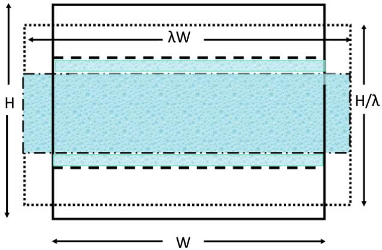

# 计算机实验

在前面的章节中，我们描述了Monte Carlo和分子动力学模拟的基础知识。利用这些技术，我们可以对经典多体系统的平衡构型进行采样，在分子动力学模拟的情况下，还可以跟踪其时间演化。但这仅仅是第一步。分子动力学最常见的目标是预测可观测量或检验理论预测。换句话说，我们利用模拟来进行测量。计算机模拟中的测量在许多方面与物理系统中的实验相似：我们需要准备样品，需要选择最佳的测量技术，需要积累足够的数据，并且应该分析结果中可能存在的系统误差和统计误差的影响。由于这些原因，我们使用"测量"一词来指代可观测性质的计算，主要是因为没有更好的替代词汇。当可能产生混淆时，我们将真实物理系统上的测量称为物理测量，以区别于数值测量。

物理测量和数值测量之间存在一个重要区别。在物理测量中，我们记录物理探测器与多体系统接触时的响应。此类探测器的例子包括压力计、温度计或光子束、中子束。相比之下，在模拟中，我们必须从系统内所有粒子的坐标和动量的知识中推导出可观测量的值。有时，相关的宏观可观测量与微观层面的知识之间的关系是显而易见的。例如，单组分系统中的平均流速就是所有粒子的平均速度。然而，在大多数情况下，宏观可观测量与原始模拟数据之间的关系更为微妙。举例来说，在实验中，压力通常是通过测量压力计在样品中分子施加的力作用下的位移来确定的。但在模拟中，我们通常希望从受周期性边界条件约束的体相系统的性质来确定压力。在模拟中引入压力计是一个糟糕的想法，因为
具有界面的体系会表现出很大的有限尺寸效应。幸运的是，统计力学使我们能够将宏观系统的可观测量性质与关于坐标和动量的微观信息联系起来，而这些微观信息正是我们在模拟过程中获得的。下面，我们将讨论这些关系中较为重要的一些。

在下面的讨论中，我们区分静态性质和动态性质。静态性质可以通过对多体系统的平衡构型进行采样来计算，这可以通过MC和MD模拟来实现。可以在模拟中采样的静态性质的典型例子包括出现在热力学关系中的各种量，如内能、温度、压力和热容，但不包括诸如熵或自由能等不能表示为系综平均的量。我们将在第8章中单独讨论与自由能相关的性质。

动态性质描述系统在外部扰动下如何随时间演化。例如剪切流动、热流或扩散。当然，当系统受到外部扰动时，它会被带离平衡态。然而，正如第2.5.2节中所讨论的，我们可以通过研究平衡态下涨落的衰减来计算系统对弱外部扰动的动态响应。这种线性响应理论使我们能够将输运系数表示为微观通量的时间关联函数，而这些通量可以明确地用系统中粒子的坐标和动量来表达——这正是我们在模拟中所需要的。

在下面的讨论中，我们首先讨论通过MC或MD计算系统静态性质的方法的统计力学基础。之后，我们讨论输运性质的数值测量。

### 经典模拟中的普朗克常数

本书所描述的模拟技术都基于经典统计力学。因此，计算得到的任何可测量都不能依赖于普朗克常数$h$的值。某些量（例如第8.5节中讨论的化学势）似乎通过热德布罗意波长$\Lambda$依赖于$h$。然而，在这种情况下，普朗克常数是人为引入的，以实现与已知量子结果的一致性。改变$h$的值会导致化学势的整体偏移，但这不会影响纯经典系统的任何可测量性质。实际上，经典世界和量子世界之间的分离并不是干净的。许多分子具有内部振动（甚至转动），其能级间距与热能相比并不小。在这种情况下，必须做出选择：如果激发能远大于$k_BT$，这些模式将主要处于基态，因此可以忽略它们。然而，在许多情况下，量子自由度与经典浴之间存在某种程度的耦合。分子内部自由度的量子性质的一个后果是其平均内能的热贡献低于相应的经典值。许多分子性质几乎不受内部自由度量化的影响，但量子效应对热容和热导率等量有很大影响。这个问题在纯经典模拟的框架内是无法解决的。

## 静态性质

模拟研究的第一步通常是表征模型系统的热力学状态。也就是说：我们希望确定"控制参数"（如温度、压力或外加电场/磁场，即所有强度量）与所产生的态函数（如能量、体积或极化，即所有广延量）之间的关系。根据模拟的性质，某些量可能是已经施加的，例如恒温$NVT$ MC模拟中的温度，或恒能$NVE$模拟中的能量。在第6章和第7章中，我们将讨论在MC的$NVT$和MD的$NVE$以外的其他系综中进行模拟的技术。例如，我们可以在恒定$NPT$下进行MD模拟。在这种情况下，模拟中需要测量的主要热力学量将是内能$E$和平均体积$V$。然而，即使我们施加了$P$和$T$，测量温度和压力仍然是有用的，以验证这些量确实等于施加的值。这种测量提供了一种强有力的诊断工具。

### 温度

正如第4章中简要讨论的，温度通常通过计算每个自由度的平均动能来测量。对于具有$f$个自由度的系统，温度$T$由下式给出：

$$
k_BT = \frac{\langle 2K \rangle}{f}.
$$

$N$粒子系统的自由度数等于$Nd - N_c$，其中$d$是空间维数，$N_c$是约束（如键长）或守恒量（如动量或能量）的数目。在具有周期性边界条件的系统中，角动量不是守恒量，但在没有外力的情况下，总动量是守恒的。重要的是要区分$N$与系统中分子的数目：如果系统由$M$个分子组成，每个分子包含$m$个原子（或被描述为原子的基团），则$N = mM$。对于没有硬约束的系统，$f$等于$Nd - (d + 1)$，这通常接近$Nd$，但不相等。

\subsubsection*{离散化误差}

上述描述对于MD模拟来说是一种过度简化，因为在MD中我们必然使用离散时间步长。主要原因是，正如文献^[\ref{114,115}]所指出的，由速度Verlet算法生成的速度与动量之间的关系并不简单地是$v_i = p_i/m_i$。相反，"真实"速度通过哈密顿运动方程定义：$\dot{r}_i^{\mathrm{true}} \equiv \partial H/\partial p_i$。对于使用有限时间步长的模拟，哈密顿量并不守恒，而是"影子"哈密顿量$H_S$守恒（见式(4.3.22)）。正是这个哈密顿量决定了相空间中的密度，并应该出现在玻尔兹曼因子中。我们可以使用

$$
\left\langle p_i \frac{\partial H_S}{\partial p_i} \right\rangle_{NVT} = \left\langle p_i \dot{r}_i^{\mathrm{true}} \right\rangle_{NVT} k_BT.
$$

但对于影子哈密顿量

$$
\dot{r}_i^{\mathrm{true}} \neq (p_i/m_i).
$$

因此，为了计算正确的温度，我们必须通过从多个连续位置的插值来估计真实速度$\dot{r}_i^{\mathrm{true}}$^[\ref{115}]。于是
$\langle p_i \dot{r}_i^{\mathrm{true}} \rangle = k_BT$。

在大多数简单的MD程序中，并没有遵循这一过程。然而，当估计具有高频内部运动的分子系统（例如溶液中的蛋白质）的温度时，使用错误的速度可能导致平动温度和振动温度之间的严重偏差^[\ref{115}]（见图例1）。

，下图使用正确的表达式(4.3.8)。使用不正确的表达式时，蛋白质和溶剂之间存在明显的表观温度差异。")

### 内能

测量系统的内能$E$通常很简单，因为它可以从我们对系统哈密顿量的了解直接得出。然而，也可能存在例外，特别是当粒子间的相互作用由一个有效的、依赖于温度的势来描述时，这实际上不是势能而是自由能（一个例子是耗尽相互作用^[\ref{128}]）。在这种情况下，能量由$E = (\partial \beta F / \partial \beta)$给出，对于耗尽力该值为零。

### 偏摩尔量

分子动力学的许多应用集中于混合物的研究。在这些情况下，我们经常需要知道系统的广延性质（如内能、焓、体积）如何随混合物的组成而变化。让我们以$m$组分混合物的焓$H$为例。组分$\alpha$的偏摩尔焓$h$定义为

$$
h_\alpha \equiv \left( \frac{\partial H}{\partial N_\alpha} \right)_{P,T,\{N_{\beta \neq \alpha}\}}.
$$

混合物的总焓可以写为

$$
H = E + PV = \sum_{\alpha=1}^{m} h_\alpha N_\alpha.
$$

直观上，人们可能认为可以通过计算组分$\alpha$每个粒子的平均能量和体积来计算该组分的偏摩尔焓。然而，这是不正确的（或者更准确地说，通常是未明确定义的）。因此，有些令人惊讶的是，即使计算总量（如$H$）很简单，也需要特殊的技术来计算偏摩尔量。最简单（但不是最经济）的方法是计算两个仅在$N_\alpha$上不同的系统的$H$。该方法有效——甚至对于固体混合物，其他技术通常失效的情况也是如此。然而，对于液体和稠密气体，有更高效的技术可用^[\ref{129}]。

### 热容

说系统的内能可以被实验测量有些误导。热力学实验只能确定内能到一个可加常数。然而，实验能够测量的是内能随温度或压力的变化。

例如，我们关注$C_V$，即恒定$N$和$V$下系统的热容：

$$
C_V \equiv \left( \frac{\partial E}{\partial T} \right)_{N,V}.
$$

显然，如果我们在模拟中测量$E$（到一个常数），那么我们可以通过在一系列温度下进行模拟并通过数值微分来估计$C_V$。然而，我们也可以通过研究内能的自发涨落，在固定温度下确定$C_V$。我们从以下表达式出发：

$$
C_V = \left( \frac{\partial E}{\partial T} \right)_{NV} = \left( \frac{\partial E}{\partial \beta} \right)_{NV} \left( \frac{d\beta}{dT} \right) = -\frac{1}{k_B T^2} \left( \frac{\partial E}{\partial \beta} \right)_{NV}.
$$

接下来，利用式(2.2.13)和(2.2.14)，我们可以写出

$$
\left( \frac{\partial E}{\partial \beta} \right)_{NV} = -\left( \frac{\partial^2 \ln Q(N,V,T)}{\partial \beta^2} \right)_{NV} = -\left( \langle E^2 \rangle - \langle E \rangle^2 \right),
$$

因此

$$
C_V = \frac{1}{k_B T^2} \left( \langle E^2 \rangle - \langle E \rangle^2 \right).
$$

我们注意到式(5.1.7)是第2.5.2节中讨论的静态涨落表达式的一个例子。

由于$C_V$与恒定温度下能量的涨落有关，似乎我们不能使用涨落表达式从恒定$N$、$V$和$E$的MD模拟中确定$C_V$。然而，Lebowitz等人^[\ref{106}]证明了我们可以通过测量动能$K$的涨落来确定恒定$N$、$V$、$E$下的$C_V$：

$$
\langle K^2 \rangle_{NVE} - \langle K \rangle_{NVE}^2 = \frac{3N k_B^2 T^2}{2} \left( 1 - \frac{3N k_B}{2C_V} \right).
$$

更详细的讨论见文献^[\ref{21}]。

式(5.1.7)表明可以类似地导出恒压热容$C_p$的表达式：

$$
C_P = \left( \frac{\partial H}{\partial T} \right)_{NP},
$$

以及等温压缩率和许多其他"响应率"（即描述广延热力学量随强度变量变化的量）。附录F.4讨论了例如如何从涨落表达式获得固体的弹性常数。

### 压力

多体系统最重要的热力学可观测量之一是其压力。在实验中，系统压力的操作定义是系统施加在容器壁单位面积上的平均力。上述定义在模拟中不太有吸引力，因为在系统中引入物理壁会导致大多数可观测量出现大的有限尺寸效应。因此，周期系统中压力$P$的表达式通常从热力学关系（第2章式(2.1.35)）出发推导：

$$
P = -\left( \frac{\partial F}{\partial V} \right)_{N,T}.
$$

由式(2.3.6)可知

$$
F = -k_B T \ln Q(N,V,T) = c(N,T) - k_B T \ln \left[ \int_V \cdots \int_V \mathrm{d}\mathbf{r}^N \exp\left(-\beta U(\mathbf{r}^N)\right) \right],
$$

其中$c(N,T)$不会对压力产生贡献，因为它与$V$无关。

对体积求导有点棘手，因为构型积分的积分限取决于系统的体积。这一复杂性可以通过定义标度坐标$\mathbf{s}$来解决：

$$
\mathbf{s}_i \equiv \frac{\mathbf{r}_i}{L}, \quad i = 1, 2, \cdots, N,
$$

其中$L$是盒子的边长。为简化记号，我们假设周期性重复的盒子为立方体，因此$V = L^3$。

对$\mathbf{s}$的积分范围为0到1，与$V$无关。于是

$$
\int_V \cdots \int_V \mathrm{d}\mathbf{r}^N \exp\left(-\beta U(\mathbf{r}^N)\right) = V^N \int_0^1 \cdots \int_0^1 \mathrm{d}\mathbf{s}^N \exp\left(-\beta U(\mathbf{s}^N; L)\right).
$$

$U(\mathbf{s}^N; L)$依赖于$L$，因为如果我们在保持所有$\mathbf{s}_i$不变的情况下改变$L$，所有真实距离都会改变。为简洁起见，我们将$\int \cdots \int$替换为单个积分号。于是我们可以写出

$$
P = k_B T \left( \frac{\partial \left[ \ln V^N + \ln \int_0^1 \mathrm{d}\mathbf{s}^N \exp\left(-\beta U(\mathbf{s}^N; L)\right) \right]}{\partial V} \right)_{N,T},
$$

其中我们利用了$c(N,T)$与$V$无关这一事实。式(5.1.14)右边的第一项给出理想气体压力$Nk_BT/V$。第二项描述了由于分子间相互作用而产生的超额压力：

$$
P_{\mathrm{exc}} = k_B T \left( \frac{\partial \left[ \ln \int_0^1 \mathrm{d}\mathbf{s}^N \exp\left(-\beta U(\mathbf{s}^N; L)\right) \right]}{\partial V} \right)_{N,T} = -\left\langle \frac{\partial U(\mathbf{s}^N; L)}{\partial V} \right\rangle_{N,T}.
$$

接下来，我们注意到势能$U$依赖于系统的体积，因为真实位置（$\mathbf{r}_i = \mathbf{s}_i L$）随$L$缩放。但在某些情况下，势能可能还有一部分依赖于$V$但不依赖于粒子坐标的贡献^[\ref{130}]。这种情况发生在例如势能包含一个依赖于密度但不依赖于周期盒内粒子坐标、而依赖于不同周期盒中心之间距离的项时。利用链式法则，我们可以写出

$$
P_{\mathrm{exc}} = -\left\langle \sum_{i=1}^{N} \frac{\partial U}{\partial \mathbf{r}_i} \frac{\partial \mathbf{r}_i}{\partial V} + \left( \frac{\partial U}{\partial V} \right)_{\mathbf{r}_i} \right\rangle_{N,T} = \frac{1}{dV} \left\langle \sum_{i=1}^{N} \mathbf{F}_i \cdot \mathbf{r}_i \right\rangle_{N,T} - \left\langle \left( \frac{\partial U}{\partial V} \right)_{\mathbf{r}_i} \right\rangle_{N,T},
$$

其中$d$是空间维数，并且我们利用了

$$
\left( \frac{\partial \mathbf{r}_i}{\partial V} \right)_{\mathbf{s}_i} = \frac{\mathbf{r}_i}{dV}.
$$

式(5.1.16)通常写为

$$
P_{\mathrm{exc}} = \frac{1}{dV} \langle W \rangle,
$$

这定义了维里$W$：

$$
W \equiv \sum_{i=1}^{N} \mathbf{F}_i \cdot \mathbf{r}_i - dV \left\langle \left( \frac{\partial U}{\partial V} \right)_{\mathbf{s}_i} \right\rangle_{N,T}.
$$

乍一看，式(5.1.16)似乎不太适合具有周期性边界条件的系统，因为它似乎取决于我们选择$\mathbf{r}_i$在哪个副本盒子中。然而，这并不是太大的问题，因为周期性重复盒子中粒子的总力为零。Thompson和Plimpton^[\ref{131}]将式(5.1.16)推广到势能可以表示为群贡献之和（不一定是两两可加的）的情况，其中群内力之和为零，就像对势中$f_{ij} + f_{ji} = 0$的情况。如果势能可以写成$n$体项之和，则可以实现更一般的分解——尽管它排除了从量子计算中即时导出力的情况。我们建议读者参阅^[\ref{131}]了解群方法的细节。在第8章中，我们将讨论如何使用自由能微扰表达式(8.6.11)来计算具有不可分解的多体相互作用系统的压力。

在模拟中，我们经常使用可以写成两两贡献之和的势能函数：

$$
U(\mathbf{r}^N) = \sum_{i=1}^{N-1} \sum_{j=i+1}^{N} u(r_{ij}).
$$

在这种情况下，我们可以写出：

$$
P_{\mathrm{exc}} = -\frac{1}{dV} \left\langle \sum_{i=1}^{N} \sum_{j \neq i} \frac{\partial u(r_{ij})}{\partial \mathbf{r}_i} \cdot \mathbf{r}_i \right\rangle_{N,T} = \frac{1}{dV} \left\langle \sum_{i=1}^{N} \sum_{j \neq i} \mathbf{f}(r_{ij}) \cdot \mathbf{r}_i \right\rangle_{N,T}.
$$

现在我们利用对于对势有$\mathbf{f}(r_{ij}) = -\mathbf{f}(r_{ji})$，以及$i$和$j$是哑标这一事实：

$$
P = \rho k_B T + \frac{1}{2dV} \left\langle \sum_{i=1}^{N} \sum_{j \neq i} \mathbf{f}(r_{ij}) \cdot \mathbf{r}_i + \sum_{j=1}^{N} \sum_{i \neq j} \mathbf{f}(r_{ji}) \cdot \mathbf{r}_j \right\rangle_{N,T}
= \rho k_B T + \frac{1}{2dV} \left\langle \sum_{i=1}^{N} \sum_{j \neq i} \mathbf{f}(r_{ij}) \cdot \mathbf{r}_{ij} \right\rangle_{N,T}
$$

$$
= \rho k_B T + \frac{\rho^2}{2d} \int \mathrm{d}r \, g(r) r f(r).
$$

将势能分解为群项可能会影响式(5.1.16)中压力的哪一部分被认为具有显式体积依赖性。为了说明这一点，考虑$T = 0$和有限压力$P$下的完美原子晶体。在$T = 0$时，系统处于势能极小值，因此所有粒子$i$上的合力$\mathbf{F}_i$为零。根据式(5.1.16)，压力完全由$U$的显式体积依赖性决定。然而，如果按照文献^[\ref{131}]的精神将合力分解为对力，我们发现$\sum_{i,j>i} \mathbf{f}_{ij} \cdot \mathbf{r}_{ij}$并不为零，式(5.1.21)给出了压力的正确描述。

对于分子系统，我们有不同的选择来计算维里：一种基于原子（或更准确地说，力中心）之间的力，另一种基于分子质心之间的力。对于维里的平均值，选择不会产生影响。然而，对于统计误差确实会产生影响，特别是当我们用刚性弹簧常数来描述分子内力时。原因是这种力的均方涨落可能非常大，即使其平均值为零。

#### 通过热力学积分计算压力

在某些情况下，式(5.1.14)不能使用，例如对于格点模型，体积不是连续变量。在这种情况下，我们可以使用热力学关系来计算流体的压力：

$$
d(PV)_{V,T} = N d\mu.
$$

在$\mu$、$V$和$T$为控制变量的条件下进行模拟的方法将在第6.5节中讨论。

#### 局部压力和平面方法

式(5.1.14)给出了压力的全局表达式。尽管式(5.1.21)表明，对于两两可加的相互作用，压力可以分解为单个粒子的贡献，但将这些贡献解释为局部压力是错误的。压力的力学定义确实具有作为作用在系统中某一平面（例如，位置$x$处）上单位面积上的力的局部含义。我们可以对$x$有不同的选择，因此它们可能给出不同的压力。然而，对于力学平衡的系统，平均压力不应依赖于$x$，否则将有一个合力作用在由$x + \delta x$和$x$处的平面所限界的体积元上。

如果我们取局部维里压力，例如在$x = 0$的硬壁附近，我们会发现这个压力的量度不是常数：因此其梯度不与力学力相关。

但我们可以直接计算力学压力。让我们考虑在$x$处的一个虚构平面。然后我们可以计算该平面上的力，即（比方说）该平面左侧的所有粒子通过该平面的平均动量转移。这个力有两个贡献：1）携带自身动量的粒子引起的动量转移，施加合力$\rho(x)k_BT$；2）由于分割平面左侧的粒子与右侧粒子相互作用而产生的力（注意：选择"左"或"右"是无关紧要的）。我们可以为任何平面（以及任何势能，甚至是多体势能）计算这个力。然而，对于两两可加的势能，表达式可以简化，因为我们可以将通过一个平面作用的力写为所有满足$x_i < x$且$x_j > x$的对力$f_x(r_{ij})$之和。这种计算压力的方法通常被称为"平面方法"^[\ref{132}]。根据构造，对于力学平衡的系统，由此获得的力学力不依赖于$x$。

#### 虚拟体积变化

对于非两两可加的相互作用，我们不能使用标准的维里路径来计算压力。对于这种系统——以及非球形硬核粒子系统，维里方法变得相当繁琐——通过使用式(2.1.35)的有限差分版本来计算压力可能是有吸引力的：

$$
P \approx -(\Delta F / \Delta V)_{NT}.
$$

为此，我们必须计算包含在体积$V$中的系统与包含在体积$V' = V + \Delta V$中的同一系统之间的自由能差，其中$\Delta V$必须选择得足够小，使得$\Delta F$与$\Delta V$呈线性关系。由于$\Delta V$很小，我们可以使用自由能的微扰表达式（见式(8.6.10)）来计算$\Delta F$：

$$
-\frac{\Delta F}{\Delta V} = \frac{kT}{\Delta V} \ln \frac{Q(N,V',T)}{Q(N,V,T)} = \frac{kT}{\Delta V} \ln \frac{V'^N \int \mathrm{d}\mathbf{s}^N \exp\left(-\beta U(\mathbf{s}^N; V')\right)}{V^N \int \mathrm{d}\mathbf{s}^N \exp\left(-\beta U(\mathbf{s}^N; V)\right)},
$$

或：

$$
P = P_{\mathrm{id}} - \lim_{\Delta V \to 0} \frac{kT}{\Delta V} \ln \left\langle \exp\left(-\beta \Delta U(\mathbf{s}^N)\right) \right\rangle,
$$

其中$\Delta U \equiv U(\mathbf{s}^N; V) - U(\mathbf{s}^N; V')$，$P_{\mathrm{id}}$是理想气体压力。对于具有连续势能函数的系统，$\Delta V$可以选为正值或负值。对于硬核系统，情况可能更加棘手，因为（对于球形粒子）膨胀时$\Delta U$总是为零。在这种情况下，应该使用$\Delta V < 0$。然而，对于足够非球形的粒子，即使是体积膨胀偶尔也可能导致重叠。在这种情况下，正$\Delta V$和负$\Delta V$的模拟结果应该结合起来，这将在第8.6.3节中解释。

实际上，虚拟体积移动方法可以通过将自由能变化分解为单个粒子的贡献来大大提高效率。这种方法在$\Delta V \to 0$的极限下是严格的，参见^[\ref{133}]。

#### 压缩率

一旦我们计算了系统的压力作为密度的函数，我们就可以从下式获得等温压缩率$\beta_T$：

$$
\beta_T \equiv -\frac{1}{V} \left( \frac{\partial V}{\partial P} \right)_{N,T} = \frac{1}{\rho} \left( \frac{\partial \rho}{\partial P} \right)_{N,T}.
$$

然而，与热容的情况一样，我们可以使用涨落表达式从恒定压力下单个状态点的模拟来估计压缩率。我们利用

$$
\langle V \rangle_{N,P,T} = -k_B T \left( \frac{\partial \ln Q(N,P,T)}{\partial P} \right).
$$

由此可得

$$
\beta_T = -\frac{1}{V} \left( \frac{\partial V}{\partial P} \right)_{N,T} = \frac{\langle V^2 \rangle - \langle V \rangle^2}{\langle V \rangle k_B T}.
$$

对于固体的弹性常数也有类似的表达式（见F.4节）。

### 表面张力

到目前为止，我们一直在讨论如何使用模拟来估计材料的体相性质，其中使用周期性边界条件是有益的，因为它们可以最小化与表面存在相关的有限尺寸效应。然而，表面的性质本身也很有意义。这里我们讨论一个关键表面性质的计算，即表面张力$\gamma$，它衡量在恒定$N$、$V$和$T$条件下，改变平坦、无结构表面或界面面积的自由能代价。我们首先关注无结构界面，因为正如我们后面将看到的，计算有结构界面（例如晶体-液体界面）的自由能需要不同的方法。

我们从单组分系统的Helmholtz自由能随$N$、$V$、$T$和表面积$A$变化的表达式出发：

$$
dF = -S \, dT - P \, dV + \mu \, dN + \gamma \, dA,
$$

因此，

$$
\gamma \equiv \left( \frac{\partial F}{\partial A} \right)_{N,V,T}.
$$

我们考虑一个包含两个平行板状相的周期性重复系统（见图5.1）。我们假设表面垂直于$z$方向，并考虑将表面在$x$方向上拉伸$\lambda$倍的效果：新表面积$A'$与原始表面积的关系为$A' = \lambda A$。但请注意，系统包含两个界面，因此总表面积$A = 2S$，其中$S$是每个界面的面积。盒子在$z$方向的高度按因子$1/\lambda$缩放，使得盒子的体积保持不变。由于这种变换，系统中所有$x$坐标按因子$\lambda$缩放，所有$z$坐标按因子$\lambda^{-1}$缩放。然后我们可以利用Helmholtz自由能的统计力学表达式来得到表面张力的表达式。类似于式(5.1.15)，我们写出

$$
\gamma = \left( \frac{\partial F}{\partial A} \right)_{N,V,T} = -k_B T \left( \frac{\partial \left[ \ln \int_0^1 \mathrm{d}\mathbf{s}^N \exp\left(-\beta U(\mathbf{s}^N; \lambda W, H/\lambda)\right) \right]}{\partial A} \right)_{N,V,T} = \frac{1}{2S} \left\langle \frac{\partial U(\mathbf{s}^N; \lambda W, H/\lambda)}{\partial \lambda} \right\rangle_{N,V,T}.
$$



现在我们关注连续的两两可加势能。对于连续势能，我们可以写出

$$
\left( \frac{\partial U(\mathbf{s}^N; \lambda W, H/\lambda)}{\partial \lambda} \right)_{\lambda=1} = \sum_{i=1}^{N} \left[ \frac{\partial U(\mathbf{r}^N)}{\partial x_i} x_i - \frac{\partial U(\mathbf{r}^N)}{\partial z_i} z_i \right] = -\sum_{i=1}^{N} \left( f_{i;x} x_i - f_{i;z} z_i \right),
$$

其中$f_{i;\alpha}$表示$\alpha$方向上作用在粒子$i$上的力。对于两两可加的势能，我们可以写出$f_{i;\alpha} = \sum_{j \neq i} f_{ij;\alpha}$，其中$f_{ij;\alpha}$是$\alpha$方向上粒子$i$和$j$之间的对力。与式(5.1.21)一样，我们现在利用$i$和$j$是可以互换的哑标这一事实。

$$
\left( \frac{\partial U(\mathbf{s}^N; \lambda W, H/\lambda)}{\partial \lambda} \right)_{\lambda=1} = \frac{1}{2} \sum_{i=1}^{N} \sum_{j \neq i} \left( f_{ij;z} z_{ij} - f_{ij;x} x_{ij} \right),
$$

因此

$$
\gamma = \frac{1}{4S} \left\langle \sum_{i=1}^{N} \sum_{j \neq i} \left( f_{ij;z} z_{ij} - f_{ij;x} x_{ij} \right) \right\rangle.
$$

似乎式(5.1.34)有问题，因为分子中的粒子数随体积$V$缩放，而分母随表面积$S$缩放。实际上，这没有问题，因为远离表面的粒子（例如$i$）的环境是各向同性的，于是

$$
\left( \sum_{j \neq i} f_{ij;z} z_{ij} \right) = \left( \sum_{j \neq i} f_{ij;x} x_{ij} \right).
$$

最终结果是，位于液体体相中的粒子对$i j$不对表面张力产生贡献。在模拟中，建议不要将这样的粒子对包含在式(5.1.34)的求和中，因为它们会贡献统计噪声，但不贡献平均值。上述推导只是计算表面张力的一种途径。其他方法参见文献^[\ref{134,135}]——也见SI L.2。然而，正如Schofield和Henderson^[\ref{136}]所证明的，最常用的表达式是等价的。

\subsubsection*{通过虚拟移动计算表面张力}

与通过执行虚拟体积变化来测量压力的直接方法（第5.1.5.3节）完全类似，我们也可以通过考虑（比方说）图5.1所示系统中的垂直液体板来计算表面张力。正如式(5.1.25)一样，我们可以计算在恒定总体积下由于表面积变化引起的自由能变化。式(5.1.31)的有限差分形式通常被称为"测试面积方法"。当估计具有任意非两两可加相互作用的系统的表面张力时，该方法仍然有效^[\ref{134,137}]。对于平坦的流体-流体界面，测试面积方法对于有限的虚拟面积变化仍然正确，因为表面张力与面积无关。在实践中，如果正向和反向测试面积移动中的能量变化不重叠（见第8.6.1节），则不建议使用大的测试面积变化。关于测试面积方法中非重叠分布所引起的问题的示例，可参见文献^[\ref{138}]。

\subsubsection*{表面自由能密度和表面应力}

在上一节中，我们考虑了平坦液体界面的表面张力，或者就此而言，液体在完美平坦固体壁上的表面张力。上面导出的$\gamma$表达式利用了这样一个事实，即我们可以在不改变体相性质的情况下将液体的表面积改变无穷小量。这种方法对于两个相中有任何一个是固体的情况不起作用，因为当我们拉伸固体的表面时，我们改变了其界面自由能。

对于固体，我们仍然可以将表面对自由能的贡献写为$F_s = \gamma A$，其中$\gamma$现在称为表面自由能密度。但现在我们不能使用式(5.1.31)来计算$\gamma$，因为

$$
\left( \frac{\partial F_s}{\partial A} \right) = \gamma + A \left( \frac{\partial \gamma}{\partial A} \right) \equiv t_s,
$$

其中我们引入了表面应力$t_s$。对于液体，$\gamma$不依赖于$A$，因此$\gamma = t_s$，但这一等式对固体不成立：需要特殊的自由能技术（如第8.4.2节中所讨论的）来计算固体界面的$\gamma$^[\ref{141}]，然而要计算将固体和液体接触时的自由能变化，可以使用Leroy和Müller-Plathe^[\ref{142}]提出的相对直接的热力学积分技术。

\subsubsection*{弯曲表面的自由能}

通常，界面的表面张力取决于其曲率。当表面的曲率半径中至少有一个不比典型分子直径大很多时，曲率效应变得重要。

与平坦界面的情况不同，弯曲表面的表面张力值取决于我们对表面位置的选择。这些以及弯曲表面的其他特征意味着计算弯曲表面的自由能是微妙且充满陷阱的。我们将不讨论这个主题，而是建议读者参阅文献^[\ref{143}]以获取更多背景信息。

### 结构性质

到目前为止，我们讨论了热力学可观测量的测量。然而，许多实验提供了关于系统微观结构的信息。虽然一些实验（如共聚焦显微镜）可以提供系统构型的瞬时快照，但大多数实验产生的是关于系统中局部结构的某种平均描述符的信息。散射实验（X射线、中子）产生关于散射密度傅里叶变换的均方值的信息，而实空间实验（如共聚焦显微镜）可用于获取围绕选定粒子的平均局部密度分布的信息。正如我们在下面讨论的，这两个量是相关的。

#### 结构因子

静态散射实验通常探测样品散射辐射强度的角度依赖性。散射强度正比于散射振幅$A(\mathbf{q})$的均方值，其中$\mathbf{q}$表示散射波矢；例如，对于波长为$\lambda_0$的单色X射线：$q = (4\pi/\lambda_0)\sin(\theta/2)$。瞬时散射振幅取决于系统的构型，通常具有以下形式

$$
A(\mathbf{q}) \sim \sum_{i=1}^{N} b_i(\mathbf{q}) e^{i\mathbf{q} \cdot \mathbf{r}_i},
$$

其中$b_i(\mathbf{q})$是粒子$i$的散射振幅。$b_i(\mathbf{q})$取决于粒子的内部结构。我们注意到，如果$b(\mathbf{q})$是$\mathbf{q}$的已知函数，模拟可以用来预测散射强度。散射实验的数据通常被分析以获得所谓结构因子$S(\mathbf{q})$的信息，它等于$\rho(\mathbf{q})$（单粒子密度的傅里叶变换）振幅的均方涨落的$1/N$倍。$\rho(\mathbf{q})$等于

$$
\rho(\mathbf{q}) = \sum_{i=1}^{N} e^{i\mathbf{q} \cdot \mathbf{r}_i} = \int_V \mathrm{d}\mathbf{r} \, \rho(\mathbf{r}) e^{i\mathbf{q} \cdot \mathbf{r}},
$$

其中实空间单粒子密度$\rho(\mathbf{r})$定义为

$$
\rho(\mathbf{r}) \equiv \sum_{i=1}^{N} \delta(\mathbf{r} - \mathbf{r}_i).
$$

有了这个定义，我们可以写出

$$
S(\mathbf{q}) = \frac{1}{N} \left[ \langle |\rho(\mathbf{q})|^2 \rangle - |\langle \rho(\mathbf{q}) \rangle|^2 \right] = \frac{1}{N} \int_V \int_V \mathrm{d}\mathbf{r} \, \mathrm{d}\mathbf{r}' \left[ \langle \rho(\mathbf{r}) \rho(\mathbf{r}') \rangle - \langle \rho \rangle^2 \right] e^{i\mathbf{q} \cdot (\mathbf{r} - \mathbf{r}')}.
$$

$\langle \rho(\mathbf{r}) \rho(\mathbf{r}') \rangle$是密度关联函数。它通常被写为

$$
\langle \rho(\mathbf{r}) \rho(\mathbf{r}') \rangle = \langle \rho(\mathbf{r}) \rangle \langle \rho(\mathbf{r}') \rangle g(\mathbf{r}, \mathbf{r}').
$$

式(5.1.41)定义了 pair 分布函数$g(\mathbf{r}, \mathbf{r}')$。在各向同性均匀液体中，$\langle \rho(\mathbf{r}) \rangle$是常数，等于平均密度$\rho$，$g(\mathbf{r}, \mathbf{r}')$只依赖于标量距离$r \equiv |\mathbf{r} - \mathbf{r}'|$。$g(r)$被称为径向分布函数：它探测经典流体中由于分子间相互作用而导致粒子周围局部密度的减小/增强。$g(r)$在液体状态理论中起着关键作用。在下一节中，我们讨论如何在模拟中测量$g(r)$。

由于$S(\mathbf{q})$与$g(r)$相关，$g(r)$可以通过$S(\mathbf{q})$的逆傅里叶变换获得。这似乎是获得$g(r)$的不必要复杂的途径。然而，$g(r)$的直接计算需要$O(N^2)$次运算，而通过快速傅里叶变换计算$S(\mathbf{q})$所需的计算量随$N \ln N$缩放。

从$g(r)$获取液体的$S(\mathbf{q})$似乎很简单，使用

$$
S(\mathbf{q}) = \rho \int_V \mathrm{d}\mathbf{r} \, [g(r) - 1] e^{i\mathbf{q} \cdot \mathbf{r}}.
$$

然而，在模拟中，这个过程是棘手的。原因是$g(r)$通常计算到球形截止距离$r_{\max} = L/2$，其中$L$是模拟盒子的边长。但通常$r^2(g(r) - 1)$在$r_{\max}$处还没有衰减到零。在这种情况下，积分的球形截断可能导致表观$S(\mathbf{q})$的非物理行为——例如，它可能表现出振荡，
甚至在小 $q$ 值处出现负值。因此，使用式 (5.1.40) 计算 $S(q)$ 更为安全。在计算上，这并不是一个大问题，因为快速傅里叶变换确实……很快 ^[\ref{38}]。

### 5.1.7.2 径向分布函数

计算径向分布函数可能是模拟领域新手最先进行的测量之一，因为这是一个非常简单的计算。对于给定的瞬时构型，我们可以轻松计算系统中粒子之间所有 $N(N-1)/2$ 个粒子对的距离。然后，我们可以对距离在 $r$ 和 $r + \Delta r$ 之间的粒子对数目制作直方图。选择箱宽 $\Delta r$ 是分辨率（倾向于较小的 $\Delta r$）和统计精度（$g(r)$ 的相对误差与 $1/\sqrt{\Delta r}$ 成正比）之间的折衷。假设区间 $\{r, r + \Delta r\}$ 中的粒子对数为 $N_p(r)$，则我们将此数目除以在理想（非相互作用）系统中相同范围内应找到的平均粒子对数。该数为 $N_p^{\mathrm{id}}(r) = \frac{1}{2} N \rho (4\pi/3)[(r + \Delta r)^3 - r^3]$（在三维情况下）。因子 $(1/2)$ 是因为我们只计算每对一次。那么我们对 $g(r)$ 的估计为

$$
g(r) = \frac{\langle N_p(r) \rangle}{N_p^{\mathrm{id}}(r)}.
$$

这个计算如此简单，以至于很难想象还能做得更好。事实上，在分子模拟的前六十年中，上述方法被广泛用于计算 $g(r)$。然而，在2013年，Borgis 等人 ^[\ref{144,145}]（另见 ^[\ref{146}]）提出了一种计算 $g(r)$ 的替代方法，该方法有两个优点：1）它产生更小的统计误差；2）它不需要分箱。在推导文献 ^[\ref{144}] 的结果时，我们采用了与该文略有不同的方法。

径向分布函数在距参考粒子距离 $r$ 处的值等于 $\rho(\mathbf{r})/\rho$ 的角平均：

$$
g(r) = \frac{1}{\rho} \int \mathrm{d}\hat{r} \, \langle \rho(\mathbf{r}) \rangle_{N-1} = \frac{1}{\rho} \int \mathrm{d}\hat{r} \left\langle \sum_{j \neq i} \delta(\mathbf{r} - \mathbf{r}_j) \right\rangle_{N-1},
$$

其中 $N$ 是系统中的总粒子数，$\rho$ 表示平均数密度（$\rho \equiv N/V$），$\mathbf{r}_j$ 是粒子 $j$ 到原点的距离，粒子 $i$ 位于原点处。$\hat{r}$ 是 $\mathbf{r}$ 方向上的单位向量。为简单起见，我们写出了给定粒子 $i$ 的 $g(r)$ 表达式，因此 $j \neq i$ 的求和中保持 $i$ 固定，但在实际计算中，该表达式对所有等价粒子 $i$ 进行平均。角括号表示热平均

$$
\langle \cdots \rangle_{N-1} \equiv \frac{\int \mathrm{d}\mathbf{r}^{N-1} e^{-\beta U(\mathbf{r}^N)} (\cdots)}{\int \mathrm{d}\mathbf{r}^{N-1} e^{-\beta U(\mathbf{r}^N)}},
$$

其中我们对 $N-1$ 个坐标进行积分，因为粒子 $i$ 被固定。

现在我们可以写出

$$
\left( \frac{\partial g(r)}{\partial r} \right) = \frac{1}{\rho} \frac{\partial}{\partial r} \int \mathrm{d}\hat{r} \left\langle \sum_{j \neq i} \delta(\mathbf{r} - \mathbf{r}_j) \right\rangle.
$$

唯一依赖于 $r$（$\mathbf{r}$ 的长度）的项是 $\delta$ 函数。因此我们可以写出

$$
\left( \frac{\partial g(r)}{\partial r} \right) = \frac{1}{\rho} \int \mathrm{d}\hat{r} \left\langle \sum_{j \neq i} \hat{r} \cdot \nabla_{\mathbf{r}} \delta(\mathbf{r} - \mathbf{r}_j) \right\rangle.
$$

由于 $\delta$ 函数的宗量是 $\mathbf{r} - \mathbf{r}_j$，我们可以将 $\hat{r} \cdot \nabla_{\mathbf{r}}$ 替换为 $-\hat{r}_j \cdot \nabla_{\mathbf{r}_j}$ 并进行分部积分：

$$
\begin{aligned}
\left( \frac{\partial g(r)}{\partial r} \right) &= -\frac{1}{\rho} \int \mathrm{d}\hat{r} \frac{\int \mathrm{d}\mathbf{r}^{N-1} e^{-\beta U(\mathbf{r}^N)} \sum_{j \neq i} \hat{r} \cdot \nabla_{\mathbf{r}} \delta(\mathbf{r} - \mathbf{r}_j)}{\int \mathrm{d}\mathbf{r}^{N-1} e^{-\beta U(\mathbf{r}^N)}}  \\
&= -\frac{\beta}{\rho} \int \mathrm{d}\hat{r} \frac{\int \mathrm{d}\mathbf{r}^{N-1} e^{-\beta U(\mathbf{r}^N)} \sum_{j \neq i} \delta(\mathbf{r} - \mathbf{r}_j) \hat{r}_j \cdot \nabla_{\mathbf{r}_j} U(\mathbf{r}^N)}{\int \mathrm{d}\mathbf{r}^{N-1} e^{-\beta U(\mathbf{r}^N)}}  \\
&= \frac{\beta}{\rho} \int \mathrm{d}\hat{r} \left\langle \sum_{j \neq i} \delta(\mathbf{r} - \mathbf{r}_j) \hat{r}_j \cdot \mathbf{F}_j(\mathbf{r}^N) \right\rangle_{N-1},
\end{aligned}
$$

其中 $\hat{r} \cdot \mathbf{F}_j \equiv F_j^{(r)}$ 表示粒子 $j$ 在径向上受到的力。现在我们可以对 $r$ 积分

$$
\begin{aligned}
g(r) &= g(r=0) + \frac{\beta}{\rho} \int_0^r \mathrm{d}r' \int \mathrm{d}\hat{r}' \left\langle \sum_{j \neq i} \delta(\mathbf{r}' - \mathbf{r}_j) F_j^{(r)}(\mathbf{r}^N) \right\rangle_{N-1}  \\
&= g(r=0) + \frac{\beta}{\rho} \left\langle \int_{r' < r} \mathrm{d}r' \sum_{j \neq i} \frac{\delta(\mathbf{r}' - \mathbf{r}_j) F_j^{(r)}(\mathbf{r}^N)}{4\pi r'^2} \right\rangle_{N-1}  \\
&= g(r=0) + \frac{\beta}{\rho} \left\langle \sum_j \frac{\theta(r - r_j) F_j^{(r)}(\mathbf{r}^N)}{4\pi r_j^2} \right\rangle_{N-1},
\end{aligned}
$$

其中 $\theta$ 表示 Heaviside 阶跃函数。为了与文献 ^[\ref{144}] 的结果建立联系，我们注意到在均匀系统中，同一物种的所有粒子 $i$ 都是等价的。因此我们可以写出

$$
g(r) = g(r=0) + \frac{\beta}{N\rho} \left\langle \sum_{i=1}^N \sum_{j \neq i} \frac{\theta(r - r_{ij}) F_j^{(r)}(\mathbf{r}^N)}{4\pi r_{ij}^2} \right\rangle_{N-1}.
$$

但 $i$ 和 $j$ 只是哑指标。因此，通过交换 $i$ 和 $j$，我们可以得到相同的 $g(r)$ 表达式，只不过若 $\hat{r} = \hat{r}_{ij}$，则 $\hat{r} = -\hat{r}_{ji}$。将 $g(r)$ 的两个等价表达式相加并除以二，得到

$$
g(r) = g(r=0) + \frac{\beta}{2N\rho} \left\langle \sum_{i=1}^N \sum_{j \neq i} \frac{\theta(r - r_{ij}) [F_j^{(r)}(\mathbf{r}^N) - F_i^{(r)}(\mathbf{r}^N)]}{4\pi r_{ij}^2} \right\rangle_{N-1}.
$$

式 (5.1.50) 与文献 ^[\ref{144}] 的结果等价。

式 (5.1.50) 的显著特点是 $g(r)$ 不仅取决于距离 $r$ 处的粒子对数目，还取决于所有小于 $r$ 的粒子对距离。我们强调，我们并没有假设系统中的相互作用是两两可加的：$\mathbf{F}_i - \mathbf{F}_j$ 不是一对力。

注意，式 (5.1.50) 和 (5.1.52) 中 $r$ 的选择是任意的，因此不需要分箱，从而式 (5.1.46) 的统计精度不依赖于箱宽的选择。在图 5.2 所示的例子中，基于式 (5.1.52) 的预测似乎比以合理箱宽直接计算 $g(r)$ 得到的结果更精确。如说明2中所解释的，通过组合 $g(r)$ 的两个独立估计，可以进一步减少统计误差。

**说明2**（力方法估计 $g(r)$）。当 $r$ 很大时，$g(r)$ 趋近于1。由式 (5.1.50) 可知，若 $g(r=0) = 0$，则

$$
1 = g(r) = \frac{\beta}{2N\rho} \left\langle \sum_{i=1}^N \sum_{j \neq i} \frac{[F_j^{(r)}(\mathbf{r}^N) - F_i^{(r)}(\mathbf{r}^N)]}{4\pi r_{ij}^2} \right\rangle_{N-1} = g(r) - h(r),
$$

其中 $h(r) \equiv g(r) - 1$。由此可得

$$
h(r) = -\frac{\beta}{2N\rho} \left\langle \sum_{i=1}^N \sum_{j \neq i} \frac{\theta(r_{ij} - r) [F_j^{(r)}(\mathbf{r}^N) - F_i^{(r)}(\mathbf{r}^N)]}{4\pi r_{ij}^2} \right\rangle_{N-1}.
$$

在上述方程中，$h(r)$ 仅依赖于距离大于 $r$ 的粒子对。有趣的是，式 (5.1.52) 中 $g(r) - 1$ 的表达式在数值上与式 (5.1.49) 不完全相同：一个表达式在 $r$ 较小时更精确，另一个在 $r$ 较大时更精确；通过组合两个结果可以减小 $g(r)$ 估计的方差 ^[\ref{147}]：见图 5.3。

文献 ^[\ref{144}] 方法的局限性在于它只适用于热平衡系统。但这一局限性也可以是优势：如果式 (5.1.49) 与 $g(r)$ 的标准表达式不一致，那就表明系统尚未达到热平衡（反之不然）。

**例题5**（Lennard-Jones 流体的静态性质）。让我们用一个例子来说明前面各节的结果。与蒙特卡罗模拟一节中一样，我们选择 Lennard-Jones 流体作为模型系统。我们使用截断并移动后的势（另见第3.3.2.2节）：

$$
u^{\mathrm{tr-sh}}(r) = \begin{cases} u^{\mathrm{lj}}(r) - u^{\mathrm{lj}}(r_c) & r \leq r_c \\ 0 & r > r_c \end{cases},
$$

其中 $u^{\mathrm{lj}}(r)$ 是 Lennard-Jones 势，在这些模拟中使用 $r_c = 2.5\sigma$。

在模拟过程中，我们必须检查系统是否已达到平衡，或至少已达到在模拟时间尺度上稳定的状态。然后我们收集可观测量数据，在模拟结束时计算平均值并估计统计误差。本例题演示了这样的模拟过程。

在模拟开始时，我们将系统制备在一个尚未平衡的状态。这里我们假设粒子最初被放置在面心立方晶体的格点上。

我们初始化粒子的速度，使初始动能对应于温度 $T = 0.728$。密度固定为 $\rho = 0.8442$，这是一个典型的液体密度，接近 Lennard-Jones 流体的三相（气-液-固）点。当我们从这个初始构型开始 MD 模拟时，势能将减小，而由于能量守恒，动能将增大——见图 5.4。

图 5.4 显示了从模拟开始的总能量、动能和势能随时间的演化。注意，总能量虽然略有波动，但没有漂移。动能和势能在平衡阶段变化很大，但之后围绕其平衡值振荡。该图表明，对于这个（非常小的）系统，平衡在不到1000个时间步内就完成了。然而，更大的系统需要更长的平衡时间，而对于玻璃态系统，MD 可能根本无法达到平衡。

接下来，我们考虑误差估计。我们使用 Flyvbjerg 和 Petersen ^[\ref{148}] 的方法来估计势能的统计误差（见图 5.5）。在该图中，阻塞操作的次数为 $M$，从平台区我们可以获得结果中标准差的估计值。

该图还显示了将模拟总长度增加4倍的效果；正如预期的那样，势能的统计误差减小了2倍。

我们获得以下结果：势能 $U = -4.4190 \pm 0.0012$，动能 $K = 2.2564 \pm 0.0012$，后者对应于平均温度 $T = 1.5043 \pm 0.0008$。压力为 $5.16 \pm 0.02$。

图 5.6 显示了径向分布函数。为了确定 $g(r)$，我们使用了算法8。该 $g(r)$ 显示了稠密液体的特征。我们可以利用径向分布函数来计算能量和压力。每个粒子的势能可以从以下公式计算

$$
U/N = \frac{1}{2}\rho \int_0^\infty \mathrm{d}r \, u(r) g(r) = 2\pi\rho \int_0^\infty \mathrm{d}r \, r^2 u(r) g(r)
$$

压力可以从以下公式计算

$$
P = \rho k_B T - \frac{1}{3} \cdot \frac{1}{2}\rho^2 \int_0^\infty \mathrm{d}r \, \frac{du(r)}{\mathrm{d}r} r g(r) = \rho k_B T - \frac{2}{3}\pi\rho^2 \int_0^\infty \mathrm{d}r \, \frac{du(r)}{\mathrm{d}r} r^3 g(r),
$$

其中 $u(r)$ 是对势。

式 (5.1.54) 和 (5.1.55) 可用于检验能量和压力计算与径向分布函数测定的一致性。在我们的例子中，从径向分布函数得到的势能 $U/N = -4.419$，压力 $P = 5.181$，与直接计算吻合良好。

更多细节见补充材料（案例研究4）。

**算法8**（径向分布函数）

```
function grsample
    delg = box/(2*nhis)       ! delg is bin size
    ngr = ngr + 1              ! calling grsample increments ngr
    for 1 <= i <= npart-1 do
        for i+1 <= j <= npart do   ! loop over all pairs
            xr = x(i) - x(j)
            xr = xr - box*round(xr/box)  ! nearest image only
            r = sqrt(xr**2 + yr**2 + yz**2)  ! In 3d: same for y and z
            if r < box/2 then      ! only consider distances < box/2
                ig = int(r/delg)
                g(ig) = g(ig) + 2   ! histogram incremented for pair ij
            endif
        enddo
    enddo
end function

function grnormalize
    gfac = (4/3)*pi*delg**3     ! gfac convert bins to 3d shells
    for 1 <= i <= nhis do
        vb = gfac*((i+1)**3 - i**3)  ! 3d volume in i-th bin
        nid = vb*rho               ! number of ideal gas particles in vb
        g(i) = g(i)/(ngr*npart*nid) ! normalize g(r)
    enddo
end function
```

**具体说明**（一般说明见第7页）

1. 函数 `grsample` 累积粒子对距离的直方图
1. 函数 `grnormalize` 在模拟结束时归一化径向分布函数
1. 数组 `g` 包含 `nhis` 个箱。它累积粒子对距离的直方图
1. `g` 中的一个箱对应于厚度为 `delg` 的径向壳层
1. 在首次调用 `grsample` 之前，我们将数组 `g(nhis)` 和 `ngr`（计算函数 `grsample` 调用次数的计数器）清零。
1. 系统的数密度记为 $\rho$
1. 出于计算效率的考虑，$g(r)$ 的采样通常与力的计算结合进行（见算法5）。

## 5.2 动力学性质

前面提到的热力学性质和结构性质都不依赖于系统的时间演化：它们是静态平衡平均值。这些平均值可以通过分子动力学和蒙特卡罗模拟同样好地获得。然而，除了静态平衡性质外，我们还可以在分子动力学模拟中测量动力学平衡性质。乍看之下，动力学平衡性质似乎是一个矛盾的概念：在平衡态下，所有性质都与时间无关，因此系统中宏观性质的任何时间依赖性似乎都与非平衡行为有关。然而，正如第2.5.2节关于线性响应理论的解释，仅受微弱扰动的系统的时间依赖行为完全由平衡态下涨落的时间关联函数描述。

在讨论时间关联函数与输运系数之间的关系之前，我们首先介绍另一种广泛使用的、利用平衡模拟研究输运性质的方法，并以自扩散系数为例进行说明。

### 5.2.1 扩散

扩散是指初始非均匀浓度分布（例如水中的一滴墨水）在没有流动（无搅拌）的情况下变得均匀的过程。扩散由流体中粒子的分子运动引起。描述扩散的宏观规律称为 Fick 定律，它指出扩散物种的通量 $j$ 与该物种浓度的负梯度成正比：

$$
\mathbf{j} = -D \nabla c,
$$

其中 $D$ 是比例常数，称为扩散系数。[^1]在下文中，我们将讨论一种特别简单的扩散形式，即扩散物种的分子与其他分子完全相同，只是有一个不影响被标记分子与其他分子相互作用的标签。例如，这个标签可以是扩散物种核自旋的特定极化方向（参见例如 ^[\ref{149}]）或改变的同位素组成。标记分子在其他相同分子中的扩散称为自扩散。[^2]

我们可以利用 Fick 定律计算标记物种浓度分布 $c(\mathbf{r}, t)$ 的时间依赖性，假设在 $t = 0$ 时刻，标记物种集中在坐标原点处。为了计算浓度分布的时间演化，我们将 Fick 定律与表示标记物质总量守恒的方程结合：

$$
\frac{\partial c(\mathbf{r}, t)}{\partial t} + \nabla \cdot \mathbf{j}(\mathbf{r}, t) = 0.
$$

将式 (5.2.2) 与式 (5.2.1) 结合，得到

$$
\frac{\partial c(\mathbf{r}, t)}{\partial t} - D \nabla^2 c(\mathbf{r}, t) = 0.
$$

我们可以利用边界条件

$$
c(\mathbf{r}, 0) = \delta(\mathbf{r})
$$

（$\delta(\mathbf{r})$ 是 $d$ 维 Dirac $\delta$ 函数）求解式 (5.2.3)，得到

$$
c(\mathbf{r}, t) = \frac{1}{(4\pi D t)^{d/2}} \exp\left(-\frac{r^2}{4Dt}\right),
$$

其中 $r$ 是到原点的标量距离。如前所述，$d$ 表示系统的维度。接下来的讨论中，我们不需要 $c(\mathbf{r}, t)$ 本身，只需要其二阶矩的时间依赖性：

$$
\langle r^2(t) \rangle \equiv \int \mathrm{d}\mathbf{r} \, c(\mathbf{r}, t) r^2,
$$

这里我们利用了已施加的条件

$$
\int \mathrm{d}\mathbf{r} \, c(\mathbf{r}, t) = 1.
$$

为了得到 $\langle r^2(t) \rangle$ 时间演化的表达式，我们将式 (5.2.3) 乘以 $r^2$ 并对整个空间积分。得到：

$$
\frac{\partial}{\partial t} \int \mathrm{d}\mathbf{r} \, r^2 c(\mathbf{r}, t) = D \int \mathrm{d}\mathbf{r} \, r^2 \nabla^2 c(\mathbf{r}, t).
$$

此方程的左边就等于

$$
\frac{\partial \langle r^2(t) \rangle}{\partial t}.
$$

对右边进行分部积分，得到

$$
\begin{aligned}
\frac{\partial \langle r^2(t) \rangle}{\partial t} &= D \int \mathrm{d}\mathbf{r} \, r^2 \nabla^2 c(\mathbf{r}, t)  \\
&= D \int \mathrm{d}\mathbf{r} \, \nabla \cdot (r^2 \nabla c(\mathbf{r}, t)) - D \int \mathrm{d}\mathbf{r} \, \nabla r^2 \cdot \nabla c(\mathbf{r}, t)  \\
&= D \int \mathrm{d}\mathbf{S} \cdot (r^2 \nabla c(\mathbf{r}, t)) - 2D \int \mathrm{d}\mathbf{r} \, \mathbf{r} \cdot \nabla c(\mathbf{r}, t)  \\
&= 0 - 2D \int \mathrm{d}\mathbf{r} \, (\nabla \cdot \mathbf{r} \, c(\mathbf{r}, t)) + 2D \int \mathrm{d}\mathbf{r} \, (\nabla \cdot \mathbf{r}) c(\mathbf{r}, t)  \\
&= 0 + 2dD \int \mathrm{d}\mathbf{r} \, c(\mathbf{r}, t)  \\
&= 2dD.
\end{aligned}
$$

式 (5.2.10) 将（自）扩散系数 $D$ 与浓度分布的宽度联系起来。式 (5.2.10) 由 Einstein 推导，因此称为 Einstein 关系。式 (5.2.10) 的重要特征是将宏观输运系数（$D$）与微观可观测量（$\langle r^2(t) \rangle$，即标记分子在时间间隔 $t$ 内移动的均方位移）联系起来。式 (5.2.10) 提示了如何在计算机模拟中测量 $D$。对于每个粒子 $i$，我们测量它在时间 $t$ 内移动的距离 $\Delta \mathbf{r}_i(t)$，并绘制这些距离的均方值随时间 $t$ 的变化：

$$
\langle \Delta r(t)^2 \rangle = \frac{1}{N} \sum_{i=1}^N \Delta \mathbf{r}_i(t)^2.
$$

这种图的一个例子如图 5.9 所示。我们需要明确在具有周期性边界条件的系统中粒子位移的含义。我们感兴趣的位移是标记粒子速度的时间积分：

$$
\Delta \mathbf{r}(t) = \int_0^t \mathrm{d}t' \, \mathbf{v}(t').
$$

式 (5.2.12) 允许我们用粒子速度表示扩散系数。我们从关系式

$$
2D = \lim_{t \to \infty} \frac{\partial \langle x^2(t) \rangle}{\partial t}
$$

出发，其中为方便起见，我们只考虑均方位移的一个笛卡尔分量。将 $x(t)$ 表示为标记粒子速度 $x$ 分量的时间积分，得到

$$
\begin{aligned}
\langle x^2(t) \rangle &= \left\langle \left(\int_0^t \mathrm{d}t' \, v_x(t') \right)^2 \right\rangle  \\
&= \int_0^t \int_0^t \mathrm{d}t' \mathrm{d}t'' \, \langle v_x(t') v_x(t'') \rangle  \\
&= 2 \int_0^t \int_0^{t'} \mathrm{d}t' \mathrm{d}t'' \, \langle v_x(t') v_x(t'') \rangle.
\end{aligned}
$$

量 $\langle v_x(t') v_x(t'') \rangle$ 是标记粒子的速度自关联函数（见第2.5.2节，式 (2.5.9)）。它度量粒子在时刻 $t'$ 和 $t''$ 的速度之间的相关性。由于平衡态的时间关联函数只依赖于 $t'$ 和 $t''$ 的差值，我们可以写出

$$
\langle v_x(t') v_x(t'') \rangle = \langle v_x(t' - t'') v_x(0) \rangle.
$$

将式 (5.2.14) 代入式 (5.2.13)，得到

$$
\begin{aligned}
2D &= \lim_{t \to \infty} 2 \int_0^t \mathrm{d}t'' \, \langle v_x(t - t'') v_x(0) \rangle  \\
D &= \int_0^\infty \mathrm{d}\tau \, \langle v_x(\tau) v_x(0) \rangle.
\end{aligned}
$$

在式 (5.2.16) 的最后一行，我们引入了坐标 $\tau \equiv t - t''$。

式 (5.2.16) 表明我们可以将扩散系数 $D$ 与速度自关联函数的积分联系起来。式 (5.2.16) 是 Green-Kubo 关系的一个例子（见第2.5.2节）。

需要注意的是：扩散系数的计算会受到大的且缓慢衰减的有限尺寸效应的影响。由于粒子与其周期像之间的流体力学相互作用，在三维情况下，扩散系数以 $1/N^{1/3}$ 的方式趋近无限系统极限 ^[\ref{150--152}]。在二维情况下，扩散系数发散。[^3]

**说明3**（扩散系数）。有多种实验方法可以测量扩散系数。一个有趣的例子是气体在多孔材料（例如沸石或金属有机框架）中吸附后的扩散系数。这些材料被用于气体分离或作为膜。对于这些应用，从分子层面理解这些气体在孔道中的扩散非常重要。

利用脉冲场梯度 NMR，可以测量自扩散系数 $D_s$ ^[\ref{153}]。然而，在这些材料的实际应用中，我们更关注输运或 Fick 扩散系数 $D_t$。该扩散系数通常从材料吸附时重量增加的速率来估计。这两个扩散系数并不相同，因此将分子模拟结果与实验数据进行比较时，了解这些差异非常重要。

输运或 Fick 扩散系数 $D_t$ 通过测量由浓度梯度引起的通量 $J$ 来获得：

$$
J(c) \equiv -D_t(c) \nabla c.
$$

然而，如附录D式 (D.1.5) 所讨论的，扩散的驱动力是化学势 $\mu$ 的梯度。采用这一定义，我们得到扩散系数的第三个定义，即集体扩散系数（或修正扩散系数，或 Maxwell-Stefan 扩散系数）$D_c$，对于恒温系统：

$$
J(c) \equiv -\frac{L(c)}{k_B T} \nabla \mu = -D_c(c) \frac{c}{k_B T} \nabla \mu,
$$

其中 $L(c)$ 是 Onsager 输运系数。由于我们测量的通量与我们如何定义扩散系数无关，这些扩散系数之间的关系为：

$$
D_t = D_c \frac{1}{k_B T c} \frac{\nabla \mu}{\nabla \ln c} = \Gamma D_c,
$$

其中 $\Gamma$ 是热力学因子：

$$
\Gamma = \frac{1}{k_B T} \frac{\partial \mu}{\partial \ln c} = \frac{\partial \ln f}{\partial \ln c},
$$

这里我们将化学势替换为逸度 $f$。对于多孔材料中的吸附，孔道中浓度与压力之间的关系由吸附等温线给出。图 5.7a 给出了一个典型的等温线。在低压下，我们可以假设理想气体行为，$f = P$。因此，吸附量由 Henry 系数给出：

$$
c = HP = Hf
$$

且

$$
\Gamma_{P \to 0} = \frac{k_B T}{c} \frac{\partial \ln f}{\partial \ln c} = 1.
$$

在饱和时，需要化学势的无限增大才能使孔道内的浓度增加一个分子。因此：

$$
\Gamma_{P \to \infty} = \infty.
$$

因此，接近饱和时 $D_t \to \infty$。这个结果可能看起来反直觉，因为人们可能预期在饱和时分子被紧密堆积而无法移动太多。然而，这里自扩散系数和输运扩散系数之间的区别变得重要。自扩散系数衡量的是流体中单个标记分子的迁移率。相比之下，输运扩散系数测量的是分子通量；因此，如果一个孔道已饱和，我们在晶体的一端添加一个分子，晶体的另一端会立即有一个分子脱出。因此，通量——即单位时间通过单位面积的分子数——是无限的。而与此同时，我们的标记分子几乎没有移动。

集体扩散系数从速度关联函数计算：

$$
D_c = \frac{1}{3} \int_0^\infty \mathrm{d}\tau \sum_{i,j} \langle v_i(0) v_j(\tau) \rangle.
$$

在 $P \to 0$ 的极限下，不期望粒子 $i$ 和 $j$ 的速度之间存在任何关联。因此对于 $i \neq j$，$\langle v_i(0) v_j(\tau) \rangle = 0$。因此在此极限下，集体扩散系数等于自扩散系数。

$$
D_c = \frac{1}{3N} \int_0^\infty \mathrm{d}\tau \sum_{i,j} \langle v_i(0) v_j(\tau) \rangle \approx \frac{1}{3N} \int_0^\infty \mathrm{d}\tau \sum_{i,j} \langle v_i(0) v_i(\tau) \rangle \delta_{ij} = D_s.
$$

现在我们已经看到了三种扩散系数，它们对孔道中负载量的依赖关系各不相同。在图 5.7b 中，报告了分子在孔道中的这些扩散系数。有趣的是，在零负载极限下，这三种扩散系数取相同的值。

Green-Kubo 关系已为许多其他输运系数推导出来，例如剪切黏度 $\eta$，

$$
\eta = \frac{1}{V k_B T} \int_0^\infty \mathrm{d}t \, \langle \sigma_{xy}(0) \sigma_{xy}(t) \rangle
$$

其中，对于两两可加的势，

$$
\sigma_{xy} = \sum_{i=1}^N \left( m_i v_x^i v_y^i + \frac{1}{2} \sum_{j \neq i} x_{ij} f_y(\mathbf{r}_{ij}) \right);
$$

热导率 $\lambda_T$，

$$
\lambda_T = \frac{1}{V k_B T^2} \int_0^\infty \mathrm{d}t \, \langle j_e^z(0) j_e^z(t) \rangle
$$

其中，在两两可加的情况下，[^4]

$$
j_e^z = \frac{d}{dt} \sum_{i=1}^N z_i \frac{1}{2} \left( m_i v_i^2 + \sum_{j \neq i} u(\mathbf{r}_{ij}) \right);
$$

以及电导率 $\sigma_e$，

$$
\sigma_e = \frac{1}{V k_B T} \int_0^\infty \mathrm{d}t \, \langle j_x^{\mathrm{el}}(0) j_x^{\mathrm{el}}(t) \rangle
$$

其中

$$
j_x^{\mathrm{el}} = \sum_{i=1}^N q_i v_x^i.
$$

电导率和黏度的 Green-Kubo (GK) 关系的简单推导分别在附录 F.2 和 F.3 中给出。更严格的推导（包括热导率的表达式）见文献 ^[\ref{59}]。

当使用 GK 表达式计算具有内部振动的分子的黏度时，我们可以使用作用于各个原子上的力来计算应力张量，或者只考虑分子质心之间作用的力。应力关联函数的积分在两种情况下是相同的。然而，原子层面的描述会在应力自关联函数中产生高频振荡，这往往会掩盖应力自关联函数 (ACF) 的整体形状 ^[\ref{159}]。但这些高频分量不影响 GK 积分，后者对应于应力 ACF 的零频分量。

在某些情况下（例如聚合物），用质心力表示应力并不实用。在这种情况下，我们可以按照与第5.2.2节所述类似的方法，对应力 ACF 进行粗粒化（或更一般地说，滤波）^[\ref{160}]。类似的论点也适用于热导率的计算。

时间关联函数可以直接在分子动力学模拟中测量。对于经典系统，$D$ 的 GK 关系和 Einstein 关系是严格等价的。在实际应用中可能有偏向其中一种方法的理由，但在经典力学中，这种区别从来不是根本性的。算法9提供了计算均方位移和速度自关联函数的简单示例。

### 5.2.2 测量相关性的 $O(n)$ 算法

从时间关联函数的积分或（广义）Einstein 关系计算输运系数，在内存使用方面效率不高（如果我们需要对长时间进行关联），在计算时间方面也是如此（在算法9所概述的朴素版本中，计算时间与我们计算相关性的最大时间间隔长度呈二次方关系）。

为了说明这个问题，考虑分子液体的速度自关联函数和扩散系数的计算。在稠密介质中，速度自关联函数在微观时间尺度（$O(10^{-13})$ 秒）上快速变化。因此我们必须以更短的时间间隔采样速度。然而，在探测速度自关联函数的长时间衰减时，不需要以相同的频率采样。算法9中所示的例子不允许调整采样频率。

下面，我们描述一种算法，允许以最小的计算成本同时测量快速和慢速衰减。该方案可用于测量关联函数本身，但在我们讨论的例子中，我们展示如何用它来计算相关的输运系数。

设 $\Delta t$ 为系统中粒子速度连续测量之间的时间间隔。我们可以如下定义给定粒子速度的块求和：

$$
\mathbf{v}^{(i)}(j) \equiv \sum_{l=(j-1)n+1}^{jn} \mathbf{v}^{(i-1)}(l)
$$

其中

$$
\mathbf{v}^{(0)}(l) \equiv \mathbf{v}(l),
$$

其中 $\mathbf{v}(l)$ 是粒子在时刻 $l$ 的速度。式 (5.2.27) 是第 $i$ 级和第 $i-1$ 级块求和之间的递推关系。变量 $n$ 决定求和中的项数。例如，$\mathbf{v}^{(3)}(j)$ 可以写成

$$
\mathbf{v}^{(3)}(j) = \sum_{l_1=(j-1)n+1}^{jn} \mathbf{v}^{(2)}(l_1)
$$

---

[^1]: 在附录D中，我们在非平衡热力学的背景下讨论扩散，其中主要驱动力是化学势梯度，而非浓度梯度。
[^2]: 式 (5.2.1) 是将粒子通量与化学势梯度关联的基本扩散方程的简化形式。完整表达式见文献 ^[\ref{57}]。但对于自扩散，式 (5.2.1) 不是近似。
[^3]: 式 (5.2.16) 中的积分可能发散这一事实并不意味着粒子以无限快的速度扩散，只是 $\langle x^2(t) \rangle$ 随 $t$ 的增长快于线性。
[^4]: 在非两两可加相互作用的一般情况下，热流的表达式不再简单（参见例如 ^[\ref{155}]）。在这些条件下，施加一个（小的）显式能流 ^[\ref{156--158}] 并测量产生的温度梯度可能更有吸引力。同样的论点也适用于测量非两两可加系统中的黏度。