# 计算机实验

在前面的章节中，我们描述了 Monte Carlo 和分子动力学模拟的基础知识。利用这些技术，我们可以对经典多体系统的平衡构型进行采样，在分子动力学模拟的情况下，还可以跟踪其时间演化。但这仅仅是第一步。分子动力学最常见的目标是预测可观测量或检验理论预测。换句话说，我们利用模拟来进行测量。计算机模拟中的测量在许多方面与物理系统中的实验相似：我们需要准备样品，需要选择最佳的测量技术，需要积累足够的数据，并且应该分析结果中可能存在的系统误差和统计误差的影响。由于这些原因，我们使用“测量”一词来指代可观测性质的计算，主要是因为没有更好的替代词汇。当可能产生混淆时，我们将真实物理系统上的测量称为物理测量，以区别于数值测量。

物理测量和数值测量之间存在一个重要区别。在物理测量中，我们记录物理探测器与多体系统接触时的响应。此类探测器的例子包括压力计、温度计或光子束、中子束。相比之下，在模拟中，我们必须从系统内所有粒子的坐标和动量的知识中推导出可观测量的值。有时，相关的宏观可观测量与微观层面的知识之间的关系是显而易见的。例如，单组分系统中的平均流速就是所有粒子的平均速度。然而，在大多数情况下，宏观可观测量与原始模拟数据之间的关系更为微妙。举例来说，在实验中，压力通常是通过测量压力计在样品中分子施加的力作用下的位移来确定的。但在模拟中，我们通常希望从受周期性边界条件约束的体相系统的性质来确定压力。在模拟中引入压力计是一个糟糕的想法，因为
具有界面的体系会表现出很大的有限尺寸效应。幸运的是，统计力学使我们能够将宏观系统的可观测量性质与关于坐标和动量的微观信息联系起来，而这些微观信息正是我们在模拟过程中获得的。下面，我们将讨论这些关系中较为重要的一些。

在下面的讨论中，我们区分静态性质和动态性质。静态性质可以通过对多体系统的平衡构型进行采样来计算，这可以通过 MC 和 MD 模拟来实现。可以在模拟中采样的静态性质的典型例子包括出现在热力学关系中的各种量，如内能、温度、压力和热容，但不包括诸如熵或自由能等不能表示为系综平均的量。我们将在第 8 章中单独讨论与自由能相关的性质。

动态性质描述系统在外部扰动下如何随时间演化。例如剪切流动、热流或扩散。当然，当系统受到外部扰动时，它会被带离平衡态。然而，正如第 2.5.2 节中所讨论的，我们可以通过研究平衡态下涨落的衰减来计算系统对弱外部扰动的动态响应。这种线性响应理论使我们能够将输运系数表示为微观通量的时间关联函数，而这些通量可以明确地用系统中粒子的坐标和动量来表达——这正是我们在模拟中所需要的。

在下面的讨论中，我们首先讨论通过 MC 或 MD 计算系统静态性质的方法的统计力学基础。之后，我们讨论输运性质的数值测量。

### 经典模拟中的普朗克常量

本书所描述的模拟技术都基于经典统计力学。因此，计算得到的任何可测量都不能依赖于普朗克常量$h$的值。某些量（例如第 8.5 节中讨论的化学势）似乎通过热德布罗意波长$\Lambda$依赖于$h$。然而，在这种情况下，普朗克常量是人为引入的，以实现与已知量子结果的一致性。改变$h$的值会导致化学势的整体偏移，但这不会影响纯经典系统的任何可测量性质。实际上，经典世界和量子世界之间的分离并不是干净的。许多分子具有内部振动（甚至转动），其能级间距与热能相比并不小。在这种情况下，必须做出选择：如果激发能远大于$k_{\mathrm{B}}T$，这些模式将主要处于基态，因此可以忽略它们。然而，在许多情况下，量子自由度与经典浴之间存在某种程度的耦合。分子内部自由度的量子性质的一个后果是其平均内能的热贡献低于相应的经典值。许多分子性质几乎不受内部自由度量化的影响，但量子效应对热容和热导率等量有很大影响。这个问题在纯经典模拟的框架内是无法解决的。

## 静态性质

模拟研究的第一步通常是表征模型系统的热力学状态。也就是说：我们希望确定“控制参数”（如温度、压力或外加电场/磁场，即所有强度量）与所产生的态函数（如能量、体积或极化，即所有广延量）之间的关系。根据模拟的性质，某些量可能是已经施加的，例如恒温$NVT$ MC 模拟中的温度，或恒能$NVE$模拟中的能量。在第 6 章和第 7 章中，我们将讨论在 MC 的$NVT$和 MD 的$NVE$以外的其他系综中进行模拟的技术。例如，我们可以在恒定$NPT$下进行 MD 模拟。在这种情况下，模拟中需要测量的主要热力学量将是内能$E$和平均体积$V$。然而，即使我们施加了$P$和$T$，测量温度和压力仍然是有用的，以验证这些量确实等于施加的值。这种测量提供了一种强有力的诊断工具。

### 温度

正如第 4 章中简要讨论的，温度通常通过计算每个自由度的平均动能来测量。对于具有$f$个自由度的系统，温度$T$由下式给出：

$$
k_{\mathrm{B}}T = \frac{\langle 2\mathcal{K} \rangle}{f}.
\tag{5.1.1}
$$

$N$粒子系统的自由度数等于$Nd - N_c$，其中$d$是空间维数，$N_c$是约束（如键长）或守恒量（如动量或能量）的数目。在具有周期性边界条件的系统中，角动量不是守恒量，但在没有外力的情况下，总动量是守恒的。重要的是要区分$N$与系统中分子的数目：如果系统由$M$个分子组成，每个分子包含$m$个原子（或被描述为原子的基团），则$N = mM$。对于没有硬约束的系统，$f$等于$Nd - (d + 1)$，这通常接近$Nd$，但不相等。

#### 离散化误差

上述描述对于 MD 模拟来说是一种过度简化，因为在 MD 中我们必然使用离散时间步长。主要原因是，正如文献[[114,115]](references.md#ref-114)所指出的，由速度 Verlet 算法生成的速度与动量之间的关系并不简单地是$v_i = p_i/m_i$。相反，“真实”速度通过哈密顿运动方程定义：$\dot{r}_i^{\mathrm{true}} \equiv \partial H/\partial p_i$。对于使用有限时间步长的模拟，哈密顿量并不守恒，而是“影子”哈密顿量$H_S$守恒（见式 (4.3.22)）[^1]。正是这个哈密顿量决定了相空间中的密度，并应该出现在玻尔兹曼因子中。于是我们可以使用

$$
\left\langle p_i \frac{\partial \mathcal{H}_S}{\partial p_i} \right\rangle_{NVT} = \left\langle p_i \dot{r}_i^{\mathrm{true}} \right\rangle_{NVT} = k_{\mathrm{B}}T.
\tag{5.1.2}
$$

但对于影子哈密顿量

$$
\dot{r}_i^{\mathrm{true}} \neq (p_i/m_i).
\tag{5.1.3}
$$

因此，为了计算正确的温度，我们必须通过从多个连续位置插值来估计真实速度$\dot{r}_i^{\mathrm{true}}$ [[115]](references.md#ref-115)。于是$\langle p_i \dot{r}_i^{\mathrm{true}} \rangle = k_{\mathrm{B}}T$。

在大多数简单的 MD 程序中，并没有遵循这一过程。然而，当估计具有高频内部运动的分子体系（例如溶液中的蛋白质）的温度时，使用错误的速度可能导致平动温度与振动温度之间出现严重偏差[[115]](references.md#ref-115)（见例证 1）。

### 内能

测量系统的内能$E$通常很简单，因为它可以从我们对系统哈密顿量的了解直接得出。然而，也可能存在例外，特别是当粒子间的相互作用由一个有效的、依赖于温度的势来描述时，这实际上不是势能而是自由能（一个例子是耗尽相互作用[[128]](references.md#ref-128)）。在这种情况下，能量由$E = (\partial \beta F / \partial \beta)$给出，对于耗尽力该值为零。

### 偏摩尔量

分子动力学的许多应用集中于混合物的研究。在这些情况下，我们经常需要知道系统的广延性质（如内能、焓、体积）如何随混合物的组成而变化。让我们以$m$组分混合物的焓$H$为例。组分$\alpha$的偏摩尔焓$h$定义为

$$
h_\alpha \equiv \left( \frac{\partial H}{\partial N_\alpha} \right)_{P,T,\{N_{\beta \neq \alpha}\}}.
$$

混合物的总焓可以写为

$$
H = E + PV = \sum_{\alpha=1}^{m} h_\alpha N_\alpha.
$$

直观上，人们可能认为可以通过计算组分$\alpha$每个粒子的平均能量和体积来计算该组分的偏摩尔焓。然而，这是不正确的（或者更准确地说，通常是未明确定义的）。因此，有些令人惊讶的是，即使计算总量（如$H$）很简单，也需要特殊的技术来计算偏摩尔量。最简单（但不是最经济）的方法是计算两个仅在$N_\alpha$上不同的系统的$H$。该方法有效——甚至对于固体混合物，其他技术通常失效的情况也是如此。然而，对于液体和稠密气体，有更高效的技术可用[[129]](references.md#ref-129)。

### 热容

说系统的内能可以被实验测量有些误导。热力学实验只能确定内能到一个可加常数。然而，实验能够测量的是内能随温度或压力的变化。

例如，我们关注$C_V$，即恒定$N$和$V$下系统的热容：

$$
C_V \equiv \left( \frac{\partial E}{\partial T} \right)_{N,V}.
\tag{5.1.4}
$$

显然，如果我们在模拟中测量$E$（到一个常数），那么我们可以通过在一系列温度下进行模拟并通过数值微分来估计$C_V$。然而，我们也可以通过研究内能的自发涨落，在固定温度下确定$C_V$。我们从以下表达式出发：

$$
C_V = \left( \frac{\partial E}{\partial T} \right)_{NV} = \left( \frac{\partial E}{\partial \beta} \right)_{NV} \left( \frac{\mathrm{d}\beta}{\mathrm{d}T} \right) = -\frac{1}{k_{\mathrm{B}} T^2} \left( \frac{\partial E}{\partial \beta} \right)_{NV}.
\tag{5.1.5}
$$

接下来，利用式 (2.2.13) 和 (2.2.14)，我们可以写出

$$
\left( \frac{\partial E}{\partial \beta} \right)_{NV} = -\left( \frac{\partial^2 \ln Q(N,V,T)}{\partial \beta^2} \right)_{NV} = -\left( \langle E^2 \rangle - \langle E \rangle^2 \right),
\tag{5.1.6}
$$

因此

$$
C_V = \frac{1}{k_{\mathrm{B}} T^2} \left( \langle E^2 \rangle - \langle E \rangle^2 \right).
\tag{5.1.7}
$$

我们注意到式 (5.1.7) 是第 2.5.2 节中讨论的静态涨落表达式的一个例子。

由于$C_V$与恒定温度下能量的涨落有关，似乎我们不能使用涨落表达式从恒定$N$、$V$和$E$的 MD 模拟中确定$C_V$。然而，Lebowitz 等人[[106]](references.md#ref-106)证明了我们可以通过测量动能$K$的涨落来确定恒定$N$、$V$、$E$下的$C_V$：

$$
\langle \mathcal{K}^2 \rangle_{NVE} - \langle \mathcal{K} \rangle_{NVE}^2 = \frac{3N k_{\mathrm{B}}^2 T^2}{2} \left( 1 - \frac{3N k_{\mathrm{B}}}{2C_V} \right).
\tag{5.1.8}
$$

更详细的讨论见文献[[21]](references.md#ref-21)。

式 (5.1.7) 表明可以类似地导出恒压热容$C_p$的表达式：

$$
C_P = \left( \frac{\partial H}{\partial T} \right)_{NP},
\tag{5.1.9}
$$

以及等温压缩率和许多其他“响应率”（即描述广延热力学量随强度变量变化的量）。附录 F.4 讨论了例如如何从涨落表达式获得固体的弹性常数。

### 压力

多体系统最重要的热力学可观测量之一是其压力。在实验中，系统压力的操作定义是系统施加在容器壁单位面积上的平均力。上述定义在模拟中不太有吸引力，因为在系统中引入物理壁会导致大多数可观测量出现大的有限尺寸效应。因此，周期系统中压力$P$的表达式通常从热力学关系（第 2 章式 (2.1.35)）出发推导：

$$
P = -\left( \frac{\partial F}{\partial V} \right)_{N,T}.
\tag{5.1.10}
$$

由式 (2.3.6) 可知

$$
F = -k_{\mathrm{B}} T \ln Q(N,V,T) = c(N,T) - k_{\mathrm{B}} T \ln \left[ \int_V \cdots \int_V \mathrm{d}\mathbf{r}^N \exp\left(-\beta U(\mathbf{r}^N)\right) \right],
\tag{5.1.11}
$$

其中$c(N,T)$不会对压力产生贡献，因为它与$V$无关。

对体积求导有点棘手，因为构型积分的积分限取决于系统的体积。这一复杂性可以通过定义标度坐标$\mathbf{s}$来解决：

$$
\mathbf{s}_i \equiv \frac{\mathbf{r}_i}{L}, \quad i = 1, 2, \cdots, N,
\tag{5.1.12}
$$

其中$L$是盒子的边长。为简化记号，我们假设周期性重复的盒子为立方体，因此$V = L^3$。

对$\mathbf{s}$的积分范围为 0 到 1，与$V$无关。于是

$$
\int_V \cdots \int_V \mathrm{d}\mathbf{r}^N \exp\left(-\beta U(\mathbf{r}^N)\right) = V^N \int_0^1 \cdots \int_0^1 \mathrm{d}\mathbf{s}^N \exp\left(-\beta U(\mathbf{s}^N; L)\right).
\tag{5.1.13}
$$

$U(\mathbf{s}^N; L)$依赖于$L$，因为如果我们在保持所有$\mathbf{s}_i$不变的情况下改变$L$，所有真实距离都会改变。为简洁起见，我们将$\int \cdots \int$替换为单个积分号。于是我们可以写出

$$
P = k_{\mathrm{B}} T \left( \frac{\partial \left[ \ln V^N + \ln \int_0^1 \mathrm{d}\mathbf{s}^N \exp\left(-\beta U(\mathbf{s}^N; L)\right) \right]}{\partial V} \right)_{N,T},
\tag{5.1.14}
$$

其中我们利用了$c(N,T)$与$V$无关这一事实。式 (5.1.14) 右边的第一项给出理想气体压力$Nk_{\mathrm{B}}T/V$。第二项描述了由于分子间相互作用而产生的超额压力：

$$
P_{\mathrm{exc}} = k_{\mathrm{B}} T \left( \frac{\partial \left[ \ln \int_0^1 \mathrm{d}\mathbf{s}^N \exp\left(-\beta U(\mathbf{s}^N; L)\right) \right]}{\partial V} \right)_{N,T} = -\left\langle \frac{\partial U(\mathbf{s}^N; L)}{\partial V} \right\rangle_{N,T}.
\tag{5.1.15}
$$

接下来，我们注意到势能$U$依赖于系统的体积，因为真实位置（$\mathbf{r}_i = \mathbf{s}_i L$）随$L$缩放。但在某些情况下，势能可能还有一部分依赖于$V$但不依赖于粒子坐标的贡献[[130]](references.md#ref-130)。这种情况发生在例如势能包含一个依赖于密度但不依赖于周期盒内粒子坐标、而依赖于不同周期盒中心之间距离的项时。利用链式法则，我们可以写出

$$
\begin{aligned}
P_{\mathrm{exc}} &= -\left\langle \sum_{i=1}^{N} \frac{\partial U}{\partial \mathbf{r}_i} \frac{\partial \mathbf{r}_i}{\partial V} + \left( \frac{\partial U}{\partial V} \right)_{\mathbf{r}_i} \right\rangle_{N,T}\\
&= \frac{1}{dV} \left\langle \sum_{i=1}^{N} \mathbf{F}_i \cdot \mathbf{r}_i \right\rangle_{N,T} - \left\langle \left( \frac{\partial U}{\partial V} \right)_{\mathbf{r}_i} \right\rangle_{N,T},
\end{aligned}
\tag{5.1.16}
$$

其中$d$是空间维数，并且我们利用了

$$
\left( \frac{\partial \mathbf{r}_i}{\partial V} \right)_{\mathbf{s}_i} = \frac{\mathbf{r}_i}{dV}.
\tag{5.1.17}
$$

式 (5.1.16) 通常写为

$$
P_{\mathrm{exc}} = \frac{1}{dV} \langle W \rangle,
\tag{5.1.18}
$$

这定义了维里$W$：

$$
W \equiv \sum_{i=1}^{N} \mathbf{F}_i \cdot \mathbf{r}_i - dV \left\langle \left( \frac{\partial U}{\partial V} \right)_{\mathbf{s}_i} \right\rangle_{N,T}.
\tag{5.1.19}
$$

乍一看，式 (5.1.16) 似乎不太适合具有周期性边界条件的系统，因为它似乎取决于我们选择$\mathbf{r}_i$在哪个副本盒子中。然而，这并不是太大的问题，因为周期性重复盒子中粒子的总力为零。Thompson 和 Plimpton [[131]](references.md#ref-131)将式 (5.1.16) 推广到势能可以表示为群贡献之和（不一定是两两可加的）的情况，其中群内力之和为零，就像对势中$f_{ij} + f_{ji} = 0$的情况。如果势能可以写成$n$体项之和，则可以实现更一般的分解——尽管它排除了从量子计算中即时导出力的情况。我们建议读者参阅[[131]](references.md#ref-131)了解群方法的细节。在第 8 章中，我们将讨论如何使用自由能微扰表达式 (8.6.11) 来计算具有不可分解的多体相互作用系统的压力。

在模拟中，我们经常使用可以写成两两贡献之和的势能函数：

$$
U(\mathbf{r}^N) = \sum_{i=1}^{N-1} \sum_{j=i+1}^{N} u(r_{ij}).
$$

在这种情况下，我们可以写出：

$$
P_{\mathrm{exc}} = -\frac{1}{dV} \left\langle \sum_{i=1}^{N} \sum_{j \neq i} \frac{\partial u(r_{ij})}{\partial \mathbf{r}_i} \cdot \mathbf{r}_i \right\rangle_{N,T} = \frac{1}{dV} \left\langle \sum_{i=1}^{N} \sum_{j \neq i} \mathbf{f}(r_{ij}) \cdot \mathbf{r}_i \right\rangle_{N,T}.
\tag{5.1.20}
$$

现在我们利用对于对势有$\mathbf{f}(r_{ij}) = -\mathbf{f}(r_{ji})$，以及$i$和$j$是哑标这一事实：

$$
\begin{aligned}
P &= \rho k_{\mathrm{B}} T + \frac{1}{2dV} \left\langle \sum_{i=1}^{N} \sum_{j \neq i} \mathbf{f}(r_{ij}) \cdot \mathbf{r}_i + \sum_{j=1}^{N} \sum_{i \neq j} \mathbf{f}(r_{ji}) \cdot \mathbf{r}_j \right\rangle_{N,T}\\
&= \rho k_{\mathrm{B}} T + \frac{1}{2dV} \left\langle \sum_{i=1}^{N} \sum_{j \neq i} \mathbf{f}(r_{ij}) \cdot \mathbf{r}_{ij} \right\rangle_{N,T}\\
&= \rho k_{\mathrm{B}} T + \frac{\rho^2}{2d} \int \mathrm{d}\mathbf{r} \, g(r) r f(r).
\end{aligned}
\tag{5.1.21}
$$

将势能分解为群项可能会影响式 (5.1.16) 中压力的哪一部分被认为具有显式体积依赖性。为了说明这一点，考虑$T = 0$和有限压力$P$下的完美原子晶体。在$T = 0$时，系统处于势能极小值，因此所有粒子$i$上的合力$\mathbf{F}_i$为零。根据式 (5.1.16)，压力完全由$U$的显式体积依赖性决定。然而，如果按照文献[[131]](references.md#ref-131)的精神将合力分解为对力，我们发现$\sum_{i,j>i} \mathbf{f}_{ij} \cdot \mathbf{r}_{ij}$并不为零，式 (5.1.21) 给出了压力的正确描述。

对于分子系统，我们有不同的选择来计算维里：一种基于原子（或更准确地说，力中心）之间的力，另一种基于分子质心之间的力。对于维里的平均值，选择不会产生影响。然而，对于统计误差确实会产生影响，特别是当我们用刚性弹簧常数来描述分子内力时。原因是这种力的均方涨落可能非常大，即使其平均值为零。[^2]

#### 通过热力学积分计算压力

在某些情况下，式 (5.1.14) 不能使用，例如对于格点模型，体积不是连续变量。在这种情况下，我们可以使用热力学关系来计算流体的压力：

$$
\mathrm{d}(PV)_{V,T} = N \mathrm{d}\mu.
\tag{5.1.22}
$$

在$\mu$、$V$和$T$为控制变量的条件下进行模拟的方法将在第 6.5 节中讨论。

#### 局部压力和平面方法

式 (5.1.14) 给出了压力的全局表达式。尽管式 (5.1.21) 表明，对于两两可加的相互作用，压力可以分解为单个粒子的贡献，但将这些贡献解释为局部压力是错误的。压力的力学定义确实具有作为作用在系统中某一平面（例如，位置$x$处）上单位面积上的力的局部含义。我们可以对$x$有不同的选择，因此它们可能给出不同的压力。然而，对于力学平衡的系统，平均压力不应依赖于$x$，否则将有一个合力作用在由$x + \delta x$和$x$处的平面所限界的体积元上。

如果我们取局部维里压力，例如在$x = 0$的硬壁附近，我们会发现这个压力的量度不是常数：因此其梯度不与力学力相关。

但我们可以直接计算力学压力。让我们考虑在$x$处的一个虚构平面。然后我们可以计算该平面上的力，即（比方说）该平面左侧的所有粒子通过该平面的平均动量转移。这个力有两个贡献：1）携带自身动量的粒子引起的动量转移，施加合力$\rho(x)k_{\mathrm{B}}T$；2）由于分割平面左侧的粒子与右侧粒子相互作用而产生的力（注意：选择“左”或“右”是无关紧要的）。我们可以为任何平面（以及任何势能，甚至是多体势能）计算这个力。然而，对于两两可加的势能，表达式可以简化，因为我们可以将通过一个平面作用的力写为所有满足$x_i < x$且$x_j > x$的对力$f_x(r_{ij})$之和。这种计算压力的方法通常被称为“平面方法”[[132]](references.md#ref-132)。根据构造，对于力学平衡的系统，由此获得的力学力不依赖于$x$。

#### 虚拟体积变化

对于非两两可加的相互作用，我们不能使用标准的维里路径来计算压力。对于这种系统——以及非球形硬核粒子系统，维里方法变得相当繁琐——通过使用式 (2.1.35) 的有限差分版本来计算压力可能是有吸引力的：

$$
P \approx -(\Delta F / \Delta V)_{NT}.
\tag{5.1.23}
$$

为此，我们必须计算包含在体积$V$中的系统与包含在体积$V' = V + \Delta V$中的同一系统之间的自由能差，其中$\Delta V$必须选择得足够小，使得$\Delta F$与$\Delta V$呈线性关系。由于$\Delta V$很小，我们可以使用自由能的微扰表达式（见式 (8.6.10)）来计算$\Delta F$：

$$
-\frac{\Delta F}{\Delta V} = \frac{kT}{\Delta V} \ln \frac{Q(N,V',T)}{Q(N,V,T)} = \frac{kT}{\Delta V} \ln \frac{V'^N \int \mathrm{d}\mathbf{s}^N \exp\left(-\beta U(\mathbf{s}^N; V')\right)}{V^N \int \mathrm{d}\mathbf{s}^N \exp\left(-\beta U(\mathbf{s}^N; V)\right)},
\tag{5.1.24}
$$

或：

$$
P = P_{\mathrm{id}} - \lim_{\Delta V \to 0} \frac{kT}{\Delta V} \ln \left\langle \exp\left(-\beta \Delta U(\mathbf{s}^N)\right) \right\rangle,
\tag{5.1.25}
$$

其中$\Delta U \equiv U(\mathbf{s}^N; V) - U(\mathbf{s}^N; V')$，$P_{\mathrm{id}}$是理想气体压力。对于具有连续势能函数的系统，$\Delta V$可以选为正值或负值。对于硬核系统，情况可能更加棘手，因为（对于球形粒子）膨胀时$\Delta U$总是为零。在这种情况下，应该使用$\Delta V < 0$。然而，对于足够非球形的粒子，即使是体积膨胀偶尔也可能导致重叠。在这种情况下，正$\Delta V$和负$\Delta V$的模拟结果应该结合起来，这将在第 8.6.3 节中解释。

实际上，虚拟体积移动方法可以通过将自由能变化分解为单个粒子的贡献来大大提高效率。这种方法在$\Delta V \to 0$的极限下是严格的，参见[[133]](references.md#ref-133)。

#### 压缩率

一旦我们计算了系统的压力作为密度的函数，我们就可以从下式获得等温压缩率$\beta_T$：

$$
\beta_T \equiv -\frac{1}{V} \left( \frac{\partial V}{\partial P} \right)_{N,T} = \frac{1}{\rho} \left( \frac{\partial \rho}{\partial P} \right)_{N,T}.
\tag{5.1.26}
$$

然而，与热容的情况一样，我们可以使用涨落表达式从恒定压力下单个状态点的模拟来估计压缩率。我们利用

$$
\langle V \rangle_{N,P,T} = -k_{\mathrm{B}} T \left( \frac{\partial \ln Q(N,P,T)}{\partial P} \right).
\tag{5.1.27}
$$

由此可得

$$
\beta_T = -\frac{1}{V} \left( \frac{\partial V}{\partial P} \right)_{N,T} = \frac{\langle V^2 \rangle - \langle V \rangle^2}{\langle V \rangle k_{\mathrm{B}} T}.
\tag{5.1.28}
$$

对于固体的弹性常数也有类似的表达式（见 F.4 节）。

### 表面张力

到目前为止，我们一直在讨论如何使用模拟来估计材料的体相性质，其中使用周期性边界条件是有益的，因为它们可以最小化与表面存在相关的有限尺寸效应。然而，表面的性质本身也很有意义。这里我们讨论一个关键表面性质的计算，即表面张力$\gamma$，它衡量在恒定$N$、$V$和$T$条件下，改变平坦、无结构表面或界面面积的自由能代价。我们首先关注无结构界面，因为正如我们后面将看到的，计算有结构界面（例如晶体-液体界面）的自由能需要不同的方法。

我们从单组分系统的亥姆霍兹自由能随$N$、$V$、$T$和表面积$A$变化的表达式出发：

$$
\mathrm{d}F = -S \, \mathrm{d}T - P \, \mathrm{d}V + \mu \, \mathrm{d}N + \gamma \, \mathrm{d}A,
\tag{5.1.29}
$$

因此，

$$
\gamma \equiv \left( \frac{\partial F}{\partial A} \right)_{N,V,T}.
\tag{5.1.30}
$$

我们考虑一个包含两个平行板状相的周期性重复系统（见图 5.1）。我们假设表面垂直于$z$方向，并考虑将表面在$x$方向上拉伸$\lambda$倍的效果：新表面积$A'$与原始表面积的关系为$A' = \lambda A$。但请注意，系统包含两个界面，因此总表面积$A = 2S$，其中$S$是每个界面的面积。盒子在$z$方向的高度按因子$1/\lambda$缩放，使得盒子的体积保持不变。由于这种变换，系统中所有$x$坐标按因子$\lambda$缩放，所有$z$坐标按因子$\lambda^{-1}$缩放。然后我们可以利用亥姆霍兹自由能的统计力学表达式来得到表面张力的表达式。类似于式 (5.1.15)，我们写出[^3]

$$
\begin{aligned}
\gamma &= \left( \frac{\partial F}{\partial A} \right)_{N,V,T}
= -k_{\mathrm{B}} T \left( \frac{\partial \left[ \ln \int_0^1 \mathrm{d}\mathbf{s}^N \exp\left(-\beta U(\mathbf{s}^N; \lambda W, H/\lambda)\right) \right]}{\partial A} \right)_{N,V,T}\\
&= \frac{1}{2S} \left\langle \frac{\partial U(\mathbf{s}^N; \lambda W, H/\lambda)}{\partial \lambda} \right\rangle_{N,V,T}.
\end{aligned}
\tag{5.1.31}
$$

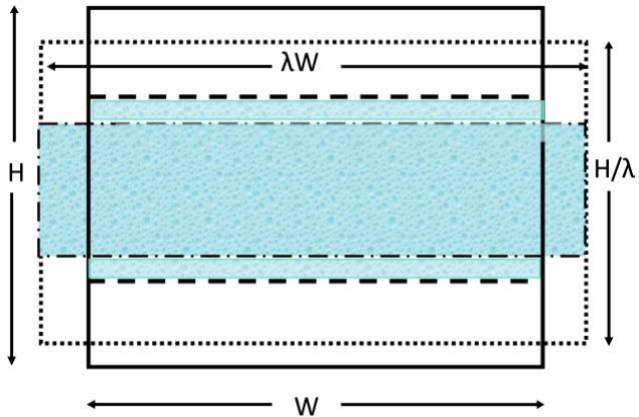

*图 5.1　实线框显示了一个高度为$H$、宽度为$W$的（周期性重复）盒子，其中包含由平坦界面（虚线）分隔的两个相。然后将原始盒子变形，使体积保持不变。这是通过将$W$缩放因子$\lambda$、将$H$缩放因子$\lambda^{-1}$来实现的。变形盒子的边界由点线表示。由于这种变换，分隔两个相的表面积从$2S$变为$2\lambda S$（有两个表面）。*

现在我们关注连续的两两可加势能。[^4] 对于连续势能，我们可以写出

$$
\begin{aligned}
\left( \frac{\partial U(\mathbf{s}^N; \lambda W, H/\lambda)}{\partial \lambda} \right)_{\lambda=1}
&= \sum_{i=1}^{N} \left[ \frac{\partial U(\mathbf{r}^N)}{\partial x_i} x_i - \frac{\partial U(\mathbf{r}^N)}{\partial z_i} z_i \right]\\
&= -\sum_{i=1}^{N} \left( f_{i;x} x_i - f_{i;z} z_i \right),
\end{aligned}
\tag{5.1.32}
$$

其中$f_{i;\alpha}$表示$\alpha$方向上作用在粒子$i$上的力。对于两两可加的势能，我们可以写出$f_{i;\alpha} = \sum_{j \neq i} f_{ij;\alpha}$，其中$f_{ij;\alpha}$是$\alpha$方向上粒子$i$和$j$之间的对力。与式 (5.1.21) 一样，我们现在利用$i$和$j$是可以互换的哑标这一事实。

$$
\left( \frac{\partial U(\mathbf{s}^N; \lambda W, H/\lambda)}{\partial \lambda} \right)_{\lambda=1} = \frac{1}{2} \sum_{i=1}^{N} \sum_{j \neq i} \left( f_{ij;z} z_{ij} - f_{ij;x} x_{ij} \right),
\tag{5.1.33}
$$

因此

$$
\gamma = \frac{1}{4S} \left\langle \sum_{i=1}^{N} \sum_{j \neq i} \left( f_{ij;z} z_{ij} - f_{ij;x} x_{ij} \right) \right\rangle.
\tag{5.1.34}
$$

似乎式 (5.1.34) 有问题，因为分子中的粒子数随体积$V$缩放，而分母随表面积$S$缩放。实际上，这没有问题，因为远离表面的粒子（例如$i$）的环境是各向同性的，于是

$$
\left( \sum_{j \neq i} f_{ij;z} z_{ij} \right) = \left( \sum_{j \neq i} f_{ij;x} x_{ij} \right).
\tag{5.1.35}
$$

最终结果是，位于液体体相中的粒子对$i j$不对表面张力产生贡献。在模拟中，建议不要将这样的粒子对包含在式 (5.1.34) 的求和中，因为它们会贡献统计噪声，但不贡献平均值。上述推导只是计算表面张力的一种途径。其他方法参见文献[[134,135]](references.md#ref-134)——也见 SI L.2。然而，正如 Schofield 和 Henderson [[136]](references.md#ref-136)所证明的，最常用的表达式是等价的。

#### 通过虚拟移动计算表面张力

与通过执行虚拟体积变化来测量压力的直接方法（第 5.1.5.3 节）完全类似，我们也可以通过考虑（比方说）图 5.1 所示系统中的垂直液体板来计算表面张力。正如式 (5.1.25) 一样，我们可以计算在恒定总体积下由于表面积变化引起的自由能变化。式 (5.1.31) 的有限差分形式通常被称为“测试面积方法”。当估计具有任意非两两可加相互作用的系统的表面张力时，该方法仍然有效[[134,137]](references.md#ref-134)。对于平坦的流体-流体界面，测试面积方法对于有限的虚拟面积变化仍然正确，因为表面张力与面积无关。在实践中，如果正向和反向测试面积移动中的能量变化不重叠（见第 8.6.1 节），则不建议使用大的测试面积变化。关于测试面积方法中非重叠分布所引起的问题的示例，可参见文献[[138]](references.md#ref-138)。

#### 表面自由能密度和表面应力

在上一节中，我们考虑了平坦液体界面的表面张力，或者就此而言，液体在完美平坦固体壁上的表面张力。上面导出的$\gamma$表达式利用了这样一个事实，即我们可以在不改变体相性质的情况下将液体的表面积改变无穷小量。这种方法对于两个相中有任何一个是固体的情况不起作用，因为当我们拉伸固体的表面时，我们改变了其界面自由能。

对于固体，我们仍然可以将表面对自由能的贡献写为$F_s = \gamma A$，其中$\gamma$现在称为表面自由能密度。但现在我们不能使用式 (5.1.31) 来计算$\gamma$，因为

$$
\left( \frac{\partial F_s}{\partial A} \right) = \gamma + A \left( \frac{\partial \gamma}{\partial A} \right) \equiv t_s,
\tag{5.1.36}
$$

其中我们引入了表面应力$t_s$[^5]。对于液体，$\gamma$不依赖于$A$，因此$\gamma = t_s$，但这一等式对固体不成立[^6]：需要特殊的自由能技术（如第 8.4.2 节中所讨论的）来计算固体界面的$\gamma$ [[141]](references.md#ref-141)，然而要计算将固体和液体接触时的自由能变化，可以使用 Leroy 和 Müller-Plathe [[142]](references.md#ref-142)提出的相对直接的热力学积分技术。

#### 弯曲表面的自由能

通常，界面的表面张力取决于其曲率。当表面的曲率半径中至少有一个不比典型分子直径大很多时，曲率效应变得重要。

与平坦界面的情况不同，弯曲表面的表面张力值取决于我们对表面位置的选择。这些以及弯曲表面的其他特征意味着计算弯曲表面的自由能是微妙且充满陷阱的。我们将不讨论这个主题，而是建议读者参阅文献[[143]](references.md#ref-143)以获取更多背景信息。

### 结构性质

到目前为止，我们讨论了热力学可观测量的测量。然而，许多实验提供了关于系统微观结构的信息。虽然一些实验（如共聚焦显微镜）可以提供系统构型的瞬时快照，但大多数实验产生的是关于系统中局部结构的某种平均描述符的信息。散射实验（X 射线、中子）产生关于散射密度傅里叶变换的均方值的信息，而实空间实验（如共聚焦显微镜）可用于获取围绕选定粒子的平均局部密度分布的信息。正如我们在下面讨论的，这两个量是相关的。

#### 结构因子

静态散射实验通常探测样品散射辐射强度的角度依赖性。散射强度正比于散射振幅$A(\mathbf{q})$的均方值，其中$\mathbf{q}$表示散射波矢；例如，对于波长为$\lambda_0$的单色 X 射线：$q = (4\pi/\lambda_0)\sin(\theta/2)$。瞬时散射振幅取决于系统的构型，通常具有以下形式

$$
A(\mathbf{q}) \sim \sum_{i=1}^{N} b_i(\mathbf{q}) e^{i\mathbf{q} \cdot \mathbf{r}_i},
\tag{5.1.37}
$$

其中$b_i(\mathbf{q})$是粒子$i$的散射振幅。$b_i(\mathbf{q})$取决于粒子的内部结构。我们注意到，如果$b(\mathbf{q})$是$\mathbf{q}$的已知函数，模拟可以用来预测散射强度。散射实验的数据通常被分析以获得所谓结构因子$S(\mathbf{q})$的信息，它等于$\rho(\mathbf{q})$（单粒子密度的傅里叶变换）振幅的均方涨落的$1/N$倍。$\rho(\mathbf{q})$等于

$$
\rho(\mathbf{q}) = \sum_{i=1}^{N} e^{i\mathbf{q} \cdot \mathbf{r}_i} = \int_V \mathrm{d}\mathbf{r} \, \rho(\mathbf{r}) e^{i\mathbf{q} \cdot \mathbf{r}},
\tag{5.1.38}
$$

其中实空间单粒子密度$\rho(\mathbf{r})$定义为

$$
\rho(\mathbf{r}) \equiv \sum_{i=1}^{N} \delta(\mathbf{r} - \mathbf{r}_i).
\tag{5.1.39}
$$

有了这个定义，我们可以写出

$$
S(\mathbf{q}) = \frac{1}{N} \left[ \langle |\rho(\mathbf{q})|^2 \rangle - |\langle \rho(\mathbf{q}) \rangle|^2 \right] = \frac{1}{N} \int_V \int_V \mathrm{d}\mathbf{r} \, \mathrm{d}\mathbf{r}' \left[ \langle \rho(\mathbf{r}) \rho(\mathbf{r}') \rangle - \langle \rho \rangle^2 \right] e^{i\mathbf{q} \cdot (\mathbf{r} - \mathbf{r}')}.
\tag{5.1.40}
$$

$\langle \rho(\mathbf{r}) \rho(\mathbf{r}') \rangle$是密度关联函数。它通常被写为

$$
\langle \rho(\mathbf{r}) \rho(\mathbf{r}') \rangle = \langle \rho(\mathbf{r}) \rangle \langle \rho(\mathbf{r}') \rangle g(\mathbf{r}, \mathbf{r}').
\tag{5.1.41}
$$

式 (5.1.41) 定义了 pair 分布函数$g(\mathbf{r}, \mathbf{r}')$。在各向同性均匀液体中，$\langle \rho(\mathbf{r}) \rangle$是常数，等于平均密度$\rho$，$g(\mathbf{r}, \mathbf{r}')$只依赖于标量距离$r \equiv |\mathbf{r} - \mathbf{r}'|$。$g(r)$被称为径向分布函数：它探测经典流体中由于分子间相互作用而导致粒子周围局部密度的减小/增强。$g(r)$在液体状态理论中起着关键作用。在下一节中，我们讨论如何在模拟中测量$g(r)$。

由于$S(\mathbf{q})$与$g(r)$相关，$g(r)$可以通过$S(\mathbf{q})$的逆傅里叶变换获得。这似乎是获得$g(r)$的不必要复杂的途径。然而，$g(r)$的直接计算需要$O(N^2)$次运算，而通过快速傅里叶变换计算$S(\mathbf{q})$所需的计算量随$N \ln N$缩放。

从$g(r)$获取液体的$S(\mathbf{q})$似乎很简单，使用

$$
S(\mathbf{q}) = \rho \int_V \mathrm{d}\mathbf{r} \, [g(r) - 1] e^{i\mathbf{q} \cdot \mathbf{r}}.
\tag{5.1.42}
$$

然而，在模拟中，这个过程是棘手的。原因是$g(r)$通常计算到球形截止距离$r_{\max} = L/2$，其中$L$是模拟盒子的边长。但通常$r^2(g(r) - 1)$在$r_{\max}$处还没有衰减到零。在这种情况下，积分的球形截断可能导致表观$S(\mathbf{q})$的非物理行为——例如，它可能表现出振荡，
甚至在小 $q$ 值处出现负值。因此，使用式 (5.1.40) 计算 $S(q)$ 更为安全。在计算上，这并不是一个大问题，因为快速傅里叶变换确实……很快[[38]](references.md#ref-38)。

#### 径向分布函数

计算径向分布函数可能是模拟领域新手最先进行的测量之一，因为这是一个非常简单的计算。对于给定的瞬时构型，我们可以轻松计算系统中粒子之间所有 $N(N-1)/2$ 个粒子对的距离。然后，我们可以对距离在 $r$ 和 $r + \Delta r$ 之间的粒子对数目制作直方图。选择箱宽 $\Delta r$ 是分辨率（倾向于较小的 $\Delta r$）和统计精度（$g(r)$ 的相对误差与 $1/\sqrt{\Delta r}$ 成正比）之间的折衷。假设区间 $\{r, r + \Delta r\}$ 中的粒子对数为 $N_p(r)$，则我们将此数目除以在理想（非相互作用）系统中相同范围内应找到的平均粒子对数。该数为 $N_p^{\mathrm{id}}(r) = \frac{1}{2} N \rho (4\pi/3)[(r + \Delta r)^3 - r^3]$（在三维情况下）。因子 $(1/2)$ 是因为我们只计算每对一次。那么我们对 $g(r)$ 的估计为

$$
g(r) = \frac{\langle N_p(r) \rangle}{N_p^{\mathrm{id}}(r)}.
\tag{5.1.43}
$$

这个计算如此简单，以至于很难想象还能做得更好。事实上，在分子模拟的前六十年中，上述方法被广泛用于计算 $g(r)$。然而，在 2013 年，Borgis 等人[[144,145]](references.md#ref-144)（另见[[146]](references.md#ref-146)）提出了一种计算 $g(r)$ 的替代方法，该方法有两个优点：1）它产生更小的统计误差；2）它不需要分箱。在推导文献[[144]](references.md#ref-144) 的结果时，我们采用了与该文略有不同的方法。

径向分布函数在距参考粒子距离 $r$ 处的值等于 $\rho(\mathbf{r})/\rho$ 的角平均：

$$
g(r) = \frac{1}{\rho} \int \mathrm{d}\hat{r} \, \langle \rho(\mathbf{r}) \rangle_{N-1} = \frac{1}{\rho} \int \mathrm{d}\hat{r} \left\langle \sum_{j \neq i} \delta(\mathbf{r} - \mathbf{r}_j) \right\rangle_{N-1},
\tag{5.1.44}
$$

其中 $N$ 是系统中的总粒子数，$\rho$ 表示平均数密度（$\rho \equiv N/V$），$\mathbf{r}_j$ 是粒子 $j$ 到原点的距离，粒子 $i$ 位于原点处。$\hat{r}$ 是 $\mathbf{r}$ 方向上的单位向量。为简单起见，我们写出了给定粒子 $i$ 的 $g(r)$ 表达式，因此 $j \neq i$ 的求和中保持 $i$ 固定，但在实际计算中，该表达式对所有等价粒子 $i$ 进行平均。角括号表示热平均

$$
\langle \cdots \rangle_{N-1} \equiv \frac{\int \mathrm{d}\mathbf{r}^{N-1} e^{-\beta U(\mathbf{r}^N)} (\cdots)}{\int \mathrm{d}\mathbf{r}^{N-1} e^{-\beta U(\mathbf{r}^N)}},
\tag{5.1.45}
$$

其中我们对 $N-1$ 个坐标进行积分，因为粒子 $i$ 被固定。

现在我们可以写出

$$
\left( \frac{\partial g(r)}{\partial r} \right) = \frac{1}{\rho} \frac{\partial}{\partial r} \int \mathrm{d}\hat{r} \left\langle \sum_{j \neq i} \delta(\mathbf{r} - \mathbf{r}_j) \right\rangle.
\tag{5.1.46}
$$

唯一依赖于 $r$（$\mathbf{r}$ 的长度）的项是 $\delta$ 函数。因此我们可以写出

$$
\left( \frac{\partial g(r)}{\partial r} \right) = \frac{1}{\rho} \int \mathrm{d}\hat{r} \left\langle \sum_{j \neq i} \hat{r} \cdot \nabla_{\mathbf{r}} \delta(\mathbf{r} - \mathbf{r}_j) \right\rangle.
\tag{5.1.47}
$$

由于 $\delta$ 函数的宗量是 $\mathbf{r} - \mathbf{r}_j$，我们可以将 $\hat{r} \cdot \nabla_{\mathbf{r}}$ 替换为 $-\hat{r}_j \cdot \nabla_{\mathbf{r}_j}$ 并进行分部积分：

$$
\begin{align}
\left( \frac{\partial g(r)}{\partial r} \right) &= -\frac{1}{\rho} \int \mathrm{d}\hat{r} \frac{\int \mathrm{d}\mathbf{r}^{N-1} e^{-\beta U(\mathbf{r}^N)} \sum_{j \neq i} \hat{r} \cdot \nabla_{\mathbf{r}} \delta(\mathbf{r} - \mathbf{r}_j)}{\int \mathrm{d}\mathbf{r}^{N-1} e^{-\beta U(\mathbf{r}^N)}} \nonumber \\
&= -\frac{\beta}{\rho} \int \mathrm{d}\hat{r} \frac{\int \mathrm{d}\mathbf{r}^{N-1} e^{-\beta U(\mathbf{r}^N)} \sum_{j \neq i} \delta(\mathbf{r} - \mathbf{r}_j) \hat{r}_j \cdot \nabla_{\mathbf{r}_j} U(\mathbf{r}^N)}{\int \mathrm{d}\mathbf{r}^{N-1} e^{-\beta U(\mathbf{r}^N)}} \nonumber \\
&= \frac{\beta}{\rho} \int \mathrm{d}\hat{r} \left\langle \sum_{j \neq i} \delta(\mathbf{r} - \mathbf{r}_j) \hat{r}_j \cdot \mathbf{F}_j(\mathbf{r}^N) \right\rangle_{N-1},
\tag{5.1.48}
\end{align}
$$

其中 $\hat{r} \cdot \mathbf{F}_j \equiv F_j^{(r)}$ 表示粒子 $j$ 在径向上受到的力。现在我们可以对 $r$ 积分

$$
\begin{aligned}
g(r) &= g(r=0) + \frac{\beta}{\rho} \int_0^r \mathrm{d}r' \int \mathrm{d}\hat{r}' \left\langle \sum_{j \neq i} \delta(\mathbf{r}' - \mathbf{r}_j) F_j^{(r)}(\mathbf{r}^N) \right\rangle_{N-1}  \\
&= g(r=0) + \frac{\beta}{\rho} \left\langle \int_{r' < r} \mathrm{d}r' \sum_{j \neq i} \frac{\delta(\mathbf{r}' - \mathbf{r}_j) F_j^{(r)}(\mathbf{r}^N)}{4\pi r'^2} \right\rangle_{N-1}  \\
&= g(r=0) + \frac{\beta}{\rho} \left\langle \sum_j \frac{\theta(r - r_j) F_j^{(r)}(\mathbf{r}^N)}{4\pi r_j^2} \right\rangle_{N-1},
\end{aligned}
$$

其中 $\theta$ 表示亥维赛阶跃函数。为了与文献[[144]](references.md#ref-144) 的结果建立联系，我们注意到在均匀系统中，同一物种的所有粒子 $i$ 都是等价的。因此我们可以写出

$$
g(r) = g(r=0) + \frac{\beta}{N\rho} \left\langle \sum_{i=1}^N \sum_{j \neq i} \frac{\theta(r - r_{ij}) F_j^{(r)}(\mathbf{r}^N)}{4\pi r_{ij}^2} \right\rangle_{N-1}.
\tag{5.1.49}
$$

但 $i$ 和 $j$ 只是哑指标。因此，通过交换 $i$ 和 $j$，我们可以得到相同的 $g(r)$ 表达式，只不过若 $\hat{r} = \hat{r}_{ij}$，则 $\hat{r} = -\hat{r}_{ji}$。将 $g(r)$ 的两个等价表达式相加并除以二，得到

$$
g(r) = g(r=0) + \frac{\beta}{2N\rho} \left\langle \sum_{i=1}^N \sum_{j \neq i} \frac{\theta(r - r_{ij}) [F_j^{(r)}(\mathbf{r}^N) - F_i^{(r)}(\mathbf{r}^N)]}{4\pi r_{ij}^2} \right\rangle_{N-1}.
\tag{5.1.50}
$$

式 (5.1.50) 与文献[[144]](references.md#ref-144) 的结果等价。

式 (5.1.50) 的显著特点是 $g(r)$ 不仅取决于距离 $r$ 处的粒子对数目，还取决于所有小于 $r$ 的粒子对距离。我们强调，我们并没有假设系统中的相互作用是两两可加的：$\mathbf{F}_i - \mathbf{F}_j$ 不是一对力。

注意，式 (5.1.50) 和 (5.1.52) 中 $r$ 的选择是任意的，因此不需要分箱，从而式 (5.1.46) 的统计精度不依赖于箱宽的选择。在图 5.2 所示的例子中，基于式 (5.1.52) 的预测似乎比以合理箱宽直接计算 $g(r)$ 得到的结果更精确。如说明 2 中所解释的，通过组合 $g(r)$ 的两个独立估计，可以进一步减少统计误差。

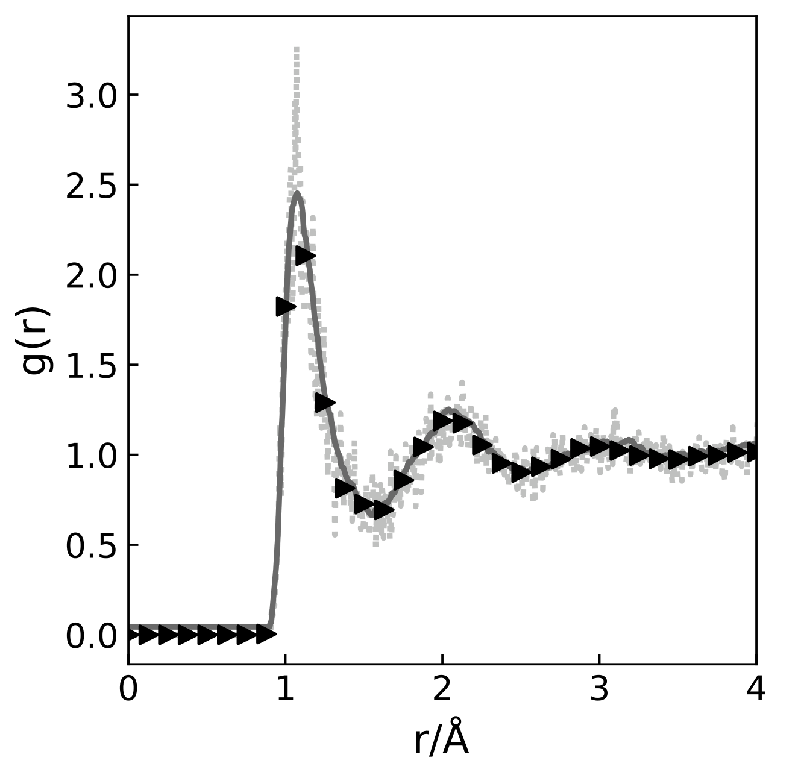

*图 5.2　图中给出对含 864 个粒子的 Lennard-Jones 流体径向分布函数的三种不同计算[[144]](references.md#ref-144)。噪声较大的曲线（点）由常规直方图方法对单个液体构型得到（直方图区间宽度为 $0.005\sigma$）。另外两条几乎无法区分的曲线分别为：对 10\,000 步模拟使用直方图方法的结果（三角）以及对单个构型使用文献[[144]](references.md#ref-144) 方法所得的结果（灰色曲线）。图片由 Samuel Coles 提供。*

???+ example "例证 2（用力方法估计 $g(r)$）"

    当 $r$ 很大时，$g(r)$ 趋近于 1。由式 (5.1.50) 可知，若 $g(r=0) = 0$，则

    $$
    1 = g(r) = \frac{\beta}{2N\rho} \left\langle \sum_{i=1}^N \sum_{j \neq i} \frac{[F_j^{(r)}(\mathbf{r}^N) - F_i^{(r)}(\mathbf{r}^N)]}{4\pi r_{ij}^2} \right\rangle_{N-1} = g(r) - h(r),
    \tag{5.1.51}
    $$

    其中 $h(r) \equiv g(r) - 1$。由此可得

    $$
    h(r) = -\frac{\beta}{2N\rho} \left\langle \sum_{i=1}^N \sum_{j \neq i} \frac{\theta(r_{ij} - r) [F_j^{(r)}(\mathbf{r}^N) - F_i^{(r)}(\mathbf{r}^N)]}{4\pi r_{ij}^2} \right\rangle_{N-1}.
    \tag{5.1.52}
    $$

    在上述方程中，$h(r)$ 仅依赖于距离大于 $r$ 的粒子对。有趣的是，式 (5.1.52) 中 $g(r) - 1$ 的表达式在数值上与式 (5.1.49) 不完全相同：一个表达式在 $r$ 较小时更精确，另一个在 $r$ 较大时更精确；通过组合两个结果可以减小 $g(r)$ 估计的方差[[147]](references.md#ref-147)：见图 5.3。

    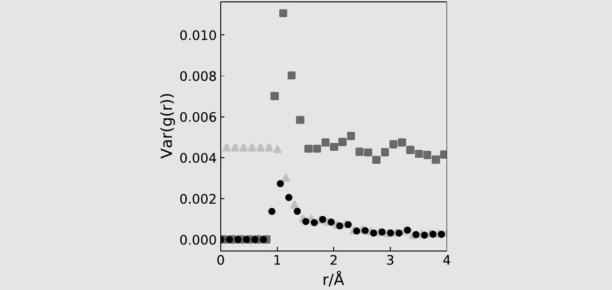

    *图 5.3　本图给出分别使用式 (5.1.50)（三角）、式 (5.1.52)（方块）以及二者的最优加权组合[[147]](references.md#ref-147)（圆圈）估计 $g(r)$ 时的方差。图中表明，将两个独立的 $g(r)$ 估计相结合可以降低总体方差。所研究体系为 Lennard-Jones 流体（$N = 864$，$T = 1.35$，$\rho = 0.8$）。图片由 Samuel Coles 提供。*

    文献[[144]](references.md#ref-144) 方法的局限性在于它只适用于热平衡系统。但这一局限性也可以是优势：如果式 (5.1.49) 与 $g(r)$ 的标准表达式不一致，那就表明系统尚未达到热平衡（反之不然）。

???+ example "例 5（Lennard-Jones 流体的静态性质）"

    让我们用一个例子来说明前面各节的结果。与 Monte Carlo 模拟一节中一样，我们选择 Lennard-Jones 流体作为模型系统。我们使用截断并移动后的势（另见第 3.3.2.2 节）：

    $$
    u^{\mathrm{tr-sh}}(r) = \begin{cases} u^{\mathrm{lj}}(r) - u^{\mathrm{lj}}(r_c) & r \leq r_c \\ 0 & r > r_c \end{cases},
    \tag{5.1.53}
    $$

    其中 $u^{\mathrm{lj}}(r)$ 是 Lennard-Jones 势，在这些模拟中使用 $r_c = 2.5\sigma$。

    在模拟过程中，我们必须检查系统是否已达到平衡，或至少已达到在模拟时间尺度上稳定的状态。然后我们收集可观测量数据，在模拟结束时计算平均值并估计统计误差。本例题演示了这样的模拟过程。

    在模拟开始时，我们将系统制备在一个尚未平衡的状态。这里我们假设粒子最初被放置在面心立方晶体的格点上。

    我们初始化粒子的速度，使初始动能对应于温度 $T = 0.728$。密度固定为 $\rho = 0.8442$，这是一个典型的液体密度，接近 Lennard-Jones 流体的三相（气-液-固）点。当我们从这个初始构型开始 MD 模拟时，势能将减小，而由于能量守恒，动能将增大——见图 5.4。

    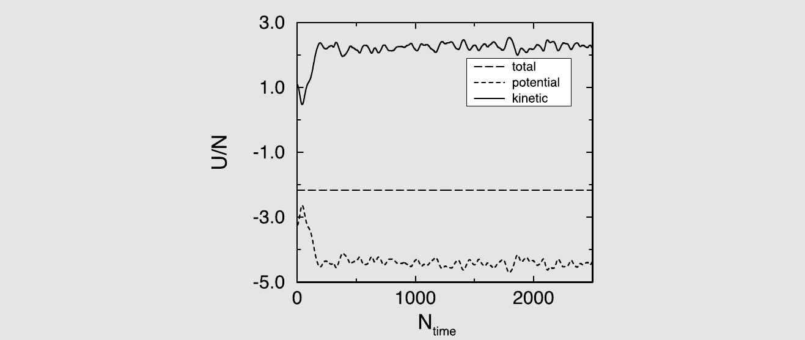

    *图 5.4　每个粒子的总能量、势能与动能 $U/N$ 随时间步数 $N_{\mathrm{time}}$ 的变化。（图内标注：total = 总能量；potential = 势能；kinetic = 动能）*

    图 5.4 显示了从模拟开始的总能量、动能和势能随时间的演化。注意，总能量虽然略有波动，但没有漂移。动能和势能在平衡阶段变化很大，但之后围绕其平衡值振荡。该图表明，对于这个（非常小的）系统，平衡在不到 1000 个时间步内就完成了。然而，更大的系统需要更长的平衡时间，而对于玻璃态系统，MD 可能根本无法达到平衡。

    接下来，我们考虑误差估计。我们使用 Flyvbjerg 和 Petersen [[148]](references.md#ref-148) 的方法来估计势能的统计误差（见图 5.5）。在该图中，阻塞操作的次数为 $M$，从平台区我们可以获得结果中标准差的估计值。

    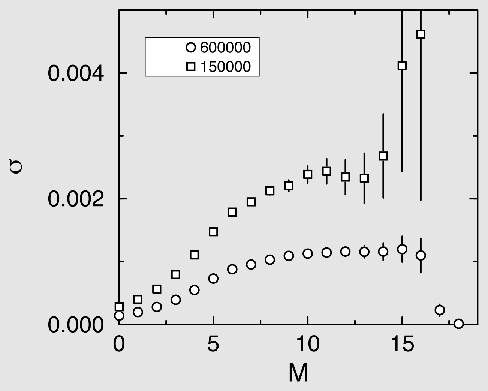

    *图 5.5　对 150\,000 步与 600\,000 步的模拟，势能的标准差 $\sigma$ 随分块操作次数 $M$ 的变化。该方差由式 (5.3.28) 计算。*

    该图还显示了将模拟总长度增加 4 倍的效果；正如预期的那样，势能的统计误差减小了 2 倍。

    我们获得以下结果：势能 $U = -4.4190 \pm 0.0012$，动能 $K = 2.2564 \pm 0.0012$，后者对应于平均温度 $T = 1.5043 \pm 0.0008$。压力为 $5.16 \pm 0.02$。

    图 5.6 显示了径向分布函数。为了确定 $g(r)$，我们使用了算法 8。该 $g(r)$ 显示了稠密液体的特征。我们可以利用径向分布函数来计算能量和压力。每个粒子的势能可以从以下公式计算

    $$
    U/N = \frac{1}{2}\rho \int_0^\infty \mathrm{d}r \, u(r) g(r) = 2\pi\rho \int_0^\infty \mathrm{d}r \, r^2 u(r) g(r)
    \tag{5.1.54}
    $$

    压力可以从以下公式计算

    $$
    P = \rho k_{\mathrm{B}} T - \frac{1}{3} \cdot \frac{1}{2}\rho^2 \int_0^\infty \mathrm{d}r \, \frac{\mathrm{d}u(r)}{\mathrm{d}r} r g(r) = \rho k_{\mathrm{B}} T - \frac{2}{3}\pi\rho^2 \int_0^\infty \mathrm{d}r \, \frac{\mathrm{d}u(r)}{\mathrm{d}r} r^3 g(r),
    \tag{5.1.55}
    $$

    其中 $u(r)$ 是对势。

    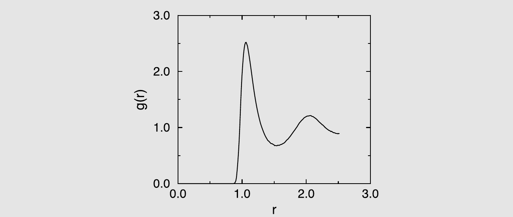

    *图 5.6　接近三相点的 Lennard-Jones 流体的径向分布函数：$T = 1.5043 \pm 0.0008$，$\rho = 0.8442$。*

    式 (5.1.54) 和 (5.1.55) 可用于检验能量和压力计算与径向分布函数测定的一致性。在我们的例子中，从径向分布函数得到的势能 $U/N = -4.419$，压力 $P = 5.181$，与直接计算吻合良好。

    更多细节见补充材料（案例研究 4）。

**算法 8　径向分布函数**

<table class="algbox" markdown="1">
<tbody markdown="1">
<tr markdown="1"><td class="algcode" markdown="span"><code>function&nbsp;grsample</code></td><td class="algcom" markdown="span"></td></tr>
<tr markdown="1"><td class="algcode" markdown="span"><code>delg&nbsp;=&nbsp;box/(2*nhis)</code></td><td class="algcom" markdown="span">delg 为箱宽</td></tr>
<tr markdown="1"><td class="algcode" markdown="span"><code>ngr&nbsp;=&nbsp;ngr&nbsp;+&nbsp;1</code></td><td class="algcom" markdown="span">每调用一次 grsample，ngr 加 1</td></tr>
<tr markdown="1"><td class="algcode" markdown="span"><code>for&nbsp;1&nbsp;&lt;=&nbsp;i&nbsp;&lt;=&nbsp;npart-1&nbsp;do</code></td><td class="algcom" markdown="span"></td></tr>
<tr markdown="1"><td class="algcode" markdown="span"><code>&nbsp;&nbsp;&nbsp;&nbsp;</code><code>for&nbsp;i+1&nbsp;&lt;=&nbsp;j&nbsp;&lt;=&nbsp;npart&nbsp;do</code></td><td class="algcom" markdown="span">遍历所有粒子对</td></tr>
<tr markdown="1"><td class="algcode" markdown="span"><code>&nbsp;&nbsp;&nbsp;&nbsp;&nbsp;&nbsp;&nbsp;&nbsp;</code><code>xr&nbsp;=&nbsp;x(i)&nbsp;-&nbsp;x(j)</code></td><td class="algcom" markdown="span"></td></tr>
<tr markdown="1"><td class="algcode" markdown="span"><code>&nbsp;&nbsp;&nbsp;&nbsp;&nbsp;&nbsp;&nbsp;&nbsp;</code><code>xr&nbsp;=&nbsp;xr&nbsp;-&nbsp;box*round(xr/box)</code></td><td class="algcom" markdown="span">只取最近映像</td></tr>
<tr markdown="1"><td class="algcode" markdown="span"><code>&nbsp;&nbsp;&nbsp;&nbsp;&nbsp;&nbsp;&nbsp;&nbsp;</code><code>r&nbsp;=&nbsp;sqrt(xr**2&nbsp;+&nbsp;yr**2&nbsp;+&nbsp;yz**2)</code></td><td class="algcom" markdown="span">三维：y、z 同理</td></tr>
<tr markdown="1"><td class="algcode" markdown="span"><code>&nbsp;&nbsp;&nbsp;&nbsp;&nbsp;&nbsp;&nbsp;&nbsp;</code><code>if&nbsp;r&nbsp;&lt;&nbsp;box/2&nbsp;then</code></td><td class="algcom" markdown="span">只考虑小于 box/2 的距离</td></tr>
<tr markdown="1"><td class="algcode" markdown="span"><code>&nbsp;&nbsp;&nbsp;&nbsp;&nbsp;&nbsp;&nbsp;&nbsp;&nbsp;&nbsp;&nbsp;&nbsp;</code><code>ig&nbsp;=&nbsp;int(r/delg)</code></td><td class="algcom" markdown="span"></td></tr>
<tr markdown="1"><td class="algcode" markdown="span"><code>&nbsp;&nbsp;&nbsp;&nbsp;&nbsp;&nbsp;&nbsp;&nbsp;&nbsp;&nbsp;&nbsp;&nbsp;</code><code>g(ig)&nbsp;=&nbsp;g(ig)&nbsp;+&nbsp;2</code></td><td class="algcom" markdown="span">对粒子对 ij 累加直方图</td></tr>
<tr markdown="1"><td class="algcode" markdown="span"><code>&nbsp;&nbsp;&nbsp;&nbsp;&nbsp;&nbsp;&nbsp;&nbsp;</code><code>endif</code></td><td class="algcom" markdown="span"></td></tr>
<tr markdown="1"><td class="algcode" markdown="span"><code>&nbsp;&nbsp;&nbsp;&nbsp;</code><code>enddo</code></td><td class="algcom" markdown="span"></td></tr>
<tr markdown="1"><td class="algcode" markdown="span"><code>enddo</code></td><td class="algcom" markdown="span"></td></tr>
<tr markdown="1"><td class="algcode" markdown="span"><code>end&nbsp;function</code></td><td class="algcom" markdown="span"></td></tr>
<tr markdown="1"><td class="algcode" markdown="span"></td><td class="algcom" markdown="span"></td></tr>
<tr markdown="1"><td class="algcode" markdown="span"><code>function&nbsp;grnormalize</code></td><td class="algcom" markdown="span"></td></tr>
<tr markdown="1"><td class="algcode" markdown="span"><code>gfac&nbsp;=&nbsp;(4/3)*pi*delg**3</code></td><td class="algcom" markdown="span">gfac 把箱换算为三维壳层</td></tr>
<tr markdown="1"><td class="algcode" markdown="span"><code>for&nbsp;1&nbsp;&lt;=&nbsp;i&nbsp;&lt;=&nbsp;nhis&nbsp;do</code></td><td class="algcom" markdown="span"></td></tr>
<tr markdown="1"><td class="algcode" markdown="span"><code>&nbsp;&nbsp;&nbsp;&nbsp;</code><code>vb&nbsp;=&nbsp;gfac*((i+1)**3&nbsp;-&nbsp;i**3)</code></td><td class="algcom" markdown="span">第 i 个箱的三维体积</td></tr>
<tr markdown="1"><td class="algcode" markdown="span"><code>&nbsp;&nbsp;&nbsp;&nbsp;</code><code>nid&nbsp;=&nbsp;vb*rho</code></td><td class="algcom" markdown="span">vb 中理想气体粒子数</td></tr>
<tr markdown="1"><td class="algcode" markdown="span"><code>&nbsp;&nbsp;&nbsp;&nbsp;</code><code>g(i)&nbsp;=&nbsp;g(i)/(ngr*npart*nid)</code></td><td class="algcom" markdown="span">归一化 $g(r)$</td></tr>
<tr markdown="1"><td class="algcode" markdown="span"><code>enddo</code></td><td class="algcom" markdown="span"></td></tr>
<tr markdown="1"><td class="algcode" markdown="span"><code>end&nbsp;function</code></td><td class="algcom" markdown="span"></td></tr>
</tbody>
</table>

**具体说明**（一般说明见第 1 章「算法」）：

1. 函数 `grsample` 累积粒子对距离的直方图。
1. 函数 `grnormalize` 在模拟结束时归一化径向分布函数。
1. 数组 `g` 包含 `nhis` 个箱。它累积粒子对距离的直方图。
1. `g` 中的一个箱对应于厚度为 `delg` 的径向壳层。
1. 在首次调用 `grsample` 之前，我们将数组 `g(nhis)` 和 `ngr`（计算函数 `grsample` 调用次数的计数器）清零。
1. 系统的数密度记为 $\rho$。
1. 出于计算效率的考虑，$g(r)$ 的采样通常与力的计算结合进行（见算法 5）。

## 动力学性质

前面提到的热力学性质和结构性质都不依赖于系统的时间演化：它们是静态平衡平均值。这些平均值可以通过分子动力学和 Monte Carlo 模拟同样好地获得。然而，除了静态平衡性质外，我们还可以在分子动力学模拟中测量动力学平衡性质。乍看之下，动力学平衡性质似乎是一个矛盾的概念：在平衡态下，所有性质都与时间无关，因此系统中宏观性质的任何时间依赖性似乎都与非平衡行为有关。然而，正如第 2.5.2 节关于线性响应理论的解释，仅受微弱扰动的系统的时间依赖行为完全由平衡态下涨落的时间关联函数描述。

在讨论时间关联函数与输运系数之间的关系之前，我们首先介绍另一种广泛使用的、利用平衡模拟研究输运性质的方法，并以自扩散系数为例进行说明。

### 扩散

扩散是指初始非均匀浓度分布（例如水中的一滴墨水）在没有流动（无搅拌）的情况下变得均匀的过程。扩散由流体中粒子的分子运动引起。描述扩散的宏观规律称为菲克定律，它指出扩散物种的通量 $j$ 与该物种浓度的负梯度成正比：

$$
\mathbf{j} = -D \nabla c,
\tag{5.2.1}
$$

其中 $D$ 是比例常数，称为扩散系数。[^7] 在下文中，我们将讨论一种特别简单的扩散形式，即扩散物种的分子与其他分子完全相同，只是有一个不影响被标记分子与其他分子相互作用的标签。例如，这个标签可以是扩散物种核自旋的特定极化方向（参见例如[[149]](references.md#ref-149)）或改变的同位素组成。标记分子在其他相同分子中的扩散称为自扩散。[^8]

我们可以利用菲克定律计算标记物种浓度分布 $c(\mathbf{r}, t)$ 的时间依赖性，假设在 $t = 0$ 时刻，标记物种集中在坐标原点处。为了计算浓度分布的时间演化，我们将菲克定律与表示标记物质总量守恒的方程结合：

$$
\frac{\partial c(\mathbf{r}, t)}{\partial t} + \nabla \cdot \mathbf{j}(\mathbf{r}, t) = 0.
\tag{5.2.2}
$$

将式 (5.2.2) 与式 (5.2.1) 结合，得到

$$
\frac{\partial c(\mathbf{r}, t)}{\partial t} - D \nabla^2 c(\mathbf{r}, t) = 0.
\tag{5.2.3}
$$

我们可以利用边界条件

$$
c(\mathbf{r}, 0) = \delta(\mathbf{r})
\tag{5.2.4}
$$

（$\delta(\mathbf{r})$ 是 $d$ 维狄拉克 $\delta$ 函数）求解式 (5.2.3)，得到

$$
c(\mathbf{r}, t) = \frac{1}{(4\pi D t)^{d/2}} \exp\left(-\frac{r^2}{4Dt}\right),
\tag{5.2.5}
$$

其中 $r$ 是到原点的标量距离。如前所述，$d$ 表示系统的维度。接下来的讨论中，我们不需要 $c(\mathbf{r}, t)$ 本身，只需要其二阶矩的时间依赖性：

$$
\langle r^2(t) \rangle \equiv \int \mathrm{d}\mathbf{r} \, c(\mathbf{r}, t) r^2,
\tag{5.2.6}
$$

这里我们利用了已施加的条件

$$
\int \mathrm{d}\mathbf{r} \, c(\mathbf{r}, t) = 1.
\tag{5.2.7}
$$

为了得到 $\langle r^2(t) \rangle$ 时间演化的表达式，我们将式 (5.2.3) 乘以 $r^2$ 并对整个空间积分。得到：

$$
\frac{\partial}{\partial t} \int \mathrm{d}\mathbf{r} \, r^2 c(\mathbf{r}, t) = D \int \mathrm{d}\mathbf{r} \, r^2 \nabla^2 c(\mathbf{r}, t).
\tag{5.2.8}
$$

此方程的左边就等于

$$
\frac{\partial \langle r^2(t) \rangle}{\partial t}.
\tag{5.2.9}
$$

对右边进行分部积分，得到

$$
\begin{align}
\frac{\partial \langle r^2(t) \rangle}{\partial t} &= D \int \mathrm{d}\mathbf{r} \, r^2 \nabla^2 c(\mathbf{r}, t) \nonumber \\
&= D \int \mathrm{d}\mathbf{r} \, \nabla \cdot (r^2 \nabla c(\mathbf{r}, t)) - D \int \mathrm{d}\mathbf{r} \, \nabla r^2 \cdot \nabla c(\mathbf{r}, t) \nonumber \\
&= D \int \mathrm{d}\mathbf{S} \cdot (r^2 \nabla c(\mathbf{r}, t)) - 2D \int \mathrm{d}\mathbf{r} \, \mathbf{r} \cdot \nabla c(\mathbf{r}, t) \nonumber \\
&= 0 - 2D \int \mathrm{d}\mathbf{r} \, (\nabla \cdot \mathbf{r} \, c(\mathbf{r}, t)) + 2D \int \mathrm{d}\mathbf{r} \, (\nabla \cdot \mathbf{r}) c(\mathbf{r}, t) \nonumber \\
&= 0 + 2dD \int \mathrm{d}\mathbf{r} \, c(\mathbf{r}, t) \nonumber \\
&= 2dD.
\tag{5.2.10}
\end{align}
$$

式 (5.2.10) 将（自）扩散系数 $D$ 与浓度分布的宽度联系起来。式 (5.2.10) 由爱因斯坦推导，因此称为爱因斯坦关系。式 (5.2.10) 的重要特征是将宏观输运系数（$D$）与微观可观测量（$\langle r^2(t) \rangle$，即标记分子在时间间隔 $t$ 内移动的均方位移）联系起来。式 (5.2.10) 提示了如何在计算机模拟中测量 $D$。对于每个粒子 $i$，我们测量它在时间 $t$ 内移动的距离 $\Delta \mathbf{r}_i(t)$，并绘制这些距离的均方值随时间 $t$ 的变化：

$$
\langle \Delta r(t)^2 \rangle = \frac{1}{N} \sum_{i=1}^N \Delta \mathbf{r}_i(t)^2.
\tag{5.2.11}
$$

这种图的一个例子如图 5.9 所示。我们需要明确在具有周期性边界条件的系统中粒子位移的含义。我们感兴趣的位移是标记粒子速度的时间积分：

$$
\Delta \mathbf{r}(t) = \int_0^t \mathrm{d}t' \, \mathbf{v}(t').
\tag{5.2.12}
$$

式 (5.2.12) 允许我们用粒子速度表示扩散系数。我们从关系式

$$
2D = \lim_{t \to \infty} \frac{\partial \langle x^2(t) \rangle}{\partial t},
\tag{5.2.13}
$$

出发，其中为方便起见，我们只考虑均方位移的一个笛卡尔分量。将 $x(t)$ 表示为标记粒子速度 $x$ 分量的时间积分，得到

$$
\begin{align}
\langle x^2(t) \rangle &= \left\langle \left(\int_0^t \mathrm{d}t' \, v_x(t') \right)^2 \right\rangle \nonumber \\
&= \int_0^t \int_0^t \mathrm{d}t' \mathrm{d}t'' \, \langle v_x(t') v_x(t'') \rangle \nonumber \\
&= 2 \int_0^t \int_0^{t'} \mathrm{d}t' \mathrm{d}t'' \, \langle v_x(t') v_x(t'') \rangle.
\tag{5.2.14}
\end{align}
$$

量 $\langle v_x(t') v_x(t'') \rangle$ 是标记粒子的速度自关联函数（见第 2.5.2 节，式 (2.5.9)）。它度量粒子在时刻 $t'$ 和 $t''$ 的速度之间的相关性。由于平衡态的时间关联函数只依赖于 $t'$ 和 $t''$ 的差值，我们可以写出

$$
\langle v_x(t') v_x(t'') \rangle = \langle v_x(t' - t'') v_x(0) \rangle.
\tag{5.2.15}
$$

将式 (5.2.14) 代入式 (5.2.13)，得到

$$
\begin{align}
2D &= \lim_{t \to \infty} 2 \int_0^t \mathrm{d}t'' \, \langle v_x(t - t'') v_x(0) \rangle \nonumber \\
D &= \int_0^\infty \mathrm{d}\tau \, \langle v_x(\tau) v_x(0) \rangle.
\tag{5.2.16}
\end{align}
$$

在式 (5.2.16) 的最后一行，我们引入了坐标 $\tau \equiv t - t''$。

式 (5.2.16) 表明我们可以将扩散系数 $D$ 与速度自关联函数的积分联系起来。式 (5.2.16) 是 Green-Kubo 关系的一个例子（见第 2.5.2 节）。

需要注意的是：扩散系数的计算会受到大的且缓慢衰减的有限尺寸效应的影响。由于粒子与其周期像之间的流体力学相互作用，在三维情况下，扩散系数以 $1/N^{1/3}$ 的方式趋近无限系统极限[[150–152]](references.md#ref-150)。在二维情况下，扩散系数发散。[^9]

???+ example "例证 3（扩散系数）"

    有多种实验方法可以测量扩散系数。一个有趣的例子是气体在多孔材料（例如沸石或金属有机框架）中吸附后的扩散系数。这些材料被用于气体分离或作为膜。对于这些应用，从分子层面理解这些气体在孔道中的扩散非常重要。

    利用脉冲场梯度 NMR，可以测量自扩散系数 $D_s$ [[153]](references.md#ref-153)。然而，在这些材料的实际应用中，我们更关注输运或菲克扩散系数 $D_t$。该扩散系数通常从材料吸附时重量增加的速率来估计。这两个扩散系数并不相同，因此将分子模拟结果与实验数据进行比较时，了解这些差异非常重要。

    输运或菲克扩散系数 $D_t$ 通过测量由浓度梯度引起的通量 $J$ 来获得：

    $$
    J(c) \equiv -D_t(c) \nabla c.
    \tag{5.2.17}
    $$

    然而，如附录 D 式 (D.1.5) 所讨论的，扩散的驱动力是化学势 $\mu$ 的梯度。采用这一定义，我们得到扩散系数的第三个定义，即集体扩散系数（或修正扩散系数，或麦克斯韦-斯特藩扩散系数）$D_c$，对于恒温系统：

    $$
    J(c) \equiv -\frac{L(c)}{k_{\mathrm{B}} T} \nabla \mu = -D_c(c) \frac{c}{k_{\mathrm{B}} T} \nabla \mu,
    \tag{5.2.18}
    $$

    其中 $L(c)$ 是昂萨格输运系数。由于我们测量的通量与我们如何定义扩散系数无关，这些扩散系数之间的关系为：

    $$
    D_t = D_c \frac{1}{k_{\mathrm{B}} T c} \frac{\nabla \mu}{\nabla \ln c} = \Gamma D_c,
    $$

    其中 $\Gamma$ 是热力学因子：

    $$
    \Gamma = \frac{1}{k_{\mathrm{B}} T} \frac{\partial \mu}{\partial \ln c} = \frac{\partial \ln f}{\partial \ln c},
    $$

    这里我们将化学势替换为逸度 $f$。对于多孔材料中的吸附，孔道中浓度与压力之间的关系由吸附等温线给出。图 5.7a 给出了一个典型的等温线。在低压下，我们可以假设理想气体行为，$f = P$。因此，吸附量由亨利系数给出：

    $$
    c = HP = Hf
    $$

    且

    $$
    \Gamma_{P \to 0} = \frac{k_{\mathrm{B}} T}{c} \frac{\partial \ln f}{\partial \ln c} = 1.
    $$

    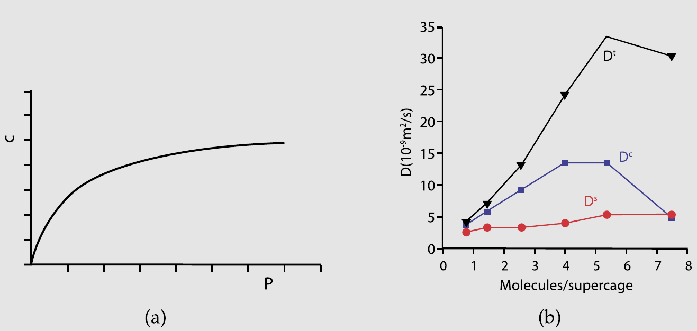

    *图 5.7　(a) 气体在多孔介质中吸附等温线的典型例子，$c$ 为负载量（单位体积内的分子数）随压力的变化。(b) 三种不同的扩散系数随负载量 $c$ 的变化：输运扩散系数 $D_t$、集体扩散系数 $D_c$ 与自扩散系数 $D_s$。本图基于文献[[154]](references.md#ref-154) 的数据。（图内标注：横轴 Molecules/supercage = 每超笼分子数；曲线 $D^t$/$D^c$/$D^s$ 依次为输运、集体、自扩散系数）*

    在饱和时，需要化学势的无限增大才能使孔道内的浓度增加一个分子。因此：

    $$
    \Gamma_{P \to \infty} = \infty.
    $$

    因此，接近饱和时 $D_t \to \infty$。这个结果可能看起来反直觉，因为人们可能预期在饱和时分子被紧密堆积而无法移动太多。然而，这里自扩散系数和输运扩散系数之间的区别变得重要。自扩散系数衡量的是流体中单个标记分子的迁移率。相比之下，输运扩散系数测量的是分子通量；因此，如果一个孔道已饱和，我们在晶体的一端添加一个分子，晶体的另一端会立即有一个分子脱出。因此，通量——即单位时间通过单位面积的分子数——是无限的。而与此同时，我们的标记分子几乎没有移动。

    集体扩散系数从速度关联函数计算：

    $$
    D_c = \frac{1}{3} \int_0^\infty \mathrm{d}\tau \sum_{i,j} \langle v_i(0) v_j(\tau) \rangle.
    \tag{5.2.19}
    $$

    在 $P \to 0$ 的极限下，不期望粒子 $i$ 和 $j$ 的速度之间存在任何关联。因此对于 $i \neq j$，$\langle v_i(0) v_j(\tau) \rangle = 0$。因此在此极限下，集体扩散系数等于自扩散系数。

    $$
    D_c = \frac{1}{3N} \int_0^\infty \mathrm{d}\tau \sum_{i,j} \langle v_i(0) v_j(\tau) \rangle \approx \frac{1}{3N} \int_0^\infty \mathrm{d}\tau \sum_{i,j} \langle v_i(0) v_i(\tau) \rangle \delta_{ij} = D_s.
    \tag{5.2.20}
    $$

    现在我们已经看到了三种扩散系数，它们对孔道中负载量的依赖关系各不相同。在图 5.7b 中，报告了分子在孔道中的这些扩散系数。有趣的是，在零负载极限下，这三种扩散系数取相同的值。

Green-Kubo 关系已为许多其他输运系数推导出来，例如剪切黏度 $\eta$，

$$
\eta = \frac{1}{V k_{\mathrm{B}} T} \int_0^\infty \mathrm{d}t \, \langle \sigma_{xy}(0) \sigma_{xy}(t) \rangle
\tag{5.2.21}
$$

其中，对于两两可加的势，

$$
\sigma_{xy} = \sum_{i=1}^N \left( m_i v_x^i v_y^i + \frac{1}{2} \sum_{j \neq i} x_{ij} f_y(\mathbf{r}_{ij}) \right);
\tag{5.2.22}
$$

热导率 $\lambda_T$，

$$
\lambda_T = \frac{1}{V k_{\mathrm{B}} T^2} \int_0^\infty \mathrm{d}t \, \langle j_e^z(0) j_e^z(t) \rangle
\tag{5.2.23}
$$

其中，在两两可加的情况下，[^10]

$$
j_e^z = \frac{d}{\mathrm{d}t} \sum_{i=1}^N z_i \frac{1}{2} \left( m_i v_i^2 + \sum_{j \neq i} u(\mathbf{r}_{ij}) \right);
\tag{5.2.24}
$$

以及电导率 $\sigma_e$，

$$
\sigma_e = \frac{1}{V k_{\mathrm{B}} T} \int_0^\infty \mathrm{d}t \, \langle j_x^{\mathrm{el}}(0) j_x^{\mathrm{el}}(t) \rangle
\tag{5.2.25}
$$

其中

$$
j_x^{\mathrm{el}} = \sum_{i=1}^N q_i v_x^i.
\tag{5.2.26}
$$

电导率和黏度的 Green-Kubo (GK) 关系的简单推导分别在附录 F.2 和 F.3 中给出。更严格的推导（包括热导率的表达式）见文献[[59]](references.md#ref-59)。

当使用 GK 表达式计算具有内部振动的分子的黏度时，我们可以使用作用于各个原子上的力来计算应力张量，或者只考虑分子质心之间作用的力。应力关联函数的积分在两种情况下是相同的。然而，原子层面的描述会在应力自关联函数中产生高频振荡，这往往会掩盖应力自关联函数（ACF）的整体形状[[159]](references.md#ref-159)。但这些高频分量不影响 GK 积分，后者对应于应力 ACF 的零频分量。

在某些情况下（例如聚合物），用质心力表示应力并不实用。在这种情况下，我们可以按照与第 5.2.2 节所述类似的方法，对应力 ACF 进行粗粒化（或更一般地说，滤波）[[160]](references.md#ref-160)。类似的论点也适用于热导率的计算。

时间关联函数可以直接在分子动力学模拟中测量。对于经典系统，$D$ 的 GK 关系和爱因斯坦关系是严格等价的。在实际应用中可能有偏向其中一种方法的理由，但在经典力学中，这种区别从来不是根本性的。算法 9 提供了计算均方位移和速度自关联函数的简单示例。

**算法 9　扩散**

<table class="algbox" markdown="1">
<tbody markdown="1">
<tr markdown="1"><td class="algcode" markdown="span"><code>function&nbsp;dif</code></td><td class="algcom" markdown="span">扩散；switch = 0 初始化，</td></tr>
<tr markdown="1"><td class="algcode" markdown="span"></td><td class="algcom" markdown="span">= 1 采样，= 2 输出结果</td></tr>
<tr markdown="1"><td class="algcode" markdown="span"><code>if&nbsp;switch&nbsp;==&nbsp;0&nbsp;then</code></td><td class="algcom" markdown="span">初始化</td></tr>
<tr markdown="1"><td class="algcode" markdown="span"><code>&nbsp;&nbsp;&nbsp;&nbsp;</code><code>ntel=0</code></td><td class="algcom" markdown="span">时间计数器</td></tr>
<tr markdown="1"><td class="algcode" markdown="span"><code>&nbsp;&nbsp;&nbsp;&nbsp;</code><code>dtime=dt*nsamp</code></td><td class="algcom" markdown="span">两次采样之间的时间</td></tr>
<tr markdown="1"><td class="algcode" markdown="span"><code>&nbsp;&nbsp;&nbsp;&nbsp;</code><code>for&nbsp;1&nbsp;&lt;=&nbsp;i&nbsp;&lt;=&nbsp;tmax&nbsp;do</code></td><td class="algcom" markdown="span">tmax 为时间步总数</td></tr>
<tr markdown="1"><td class="algcode" markdown="span"><code>&nbsp;&nbsp;&nbsp;&nbsp;&nbsp;&nbsp;&nbsp;&nbsp;</code><code>ntime(i)=0</code></td><td class="algcom" markdown="span">时刻 i 的样本数</td></tr>
<tr markdown="1"><td class="algcode" markdown="span"><code>&nbsp;&nbsp;&nbsp;&nbsp;&nbsp;&nbsp;&nbsp;&nbsp;</code><code>vacf(i)=0</code></td><td class="algcom" markdown="span"></td></tr>
<tr markdown="1"><td class="algcode" markdown="span"><code>&nbsp;&nbsp;&nbsp;&nbsp;&nbsp;&nbsp;&nbsp;&nbsp;</code><code>r2t(i)=0</code></td><td class="algcom" markdown="span"></td></tr>
<tr markdown="1"><td class="algcode" markdown="span"><code>&nbsp;&nbsp;&nbsp;&nbsp;</code><code>enddo</code></td><td class="algcom" markdown="span"></td></tr>
<tr markdown="1"><td class="algcode" markdown="span"><code>else&nbsp;if&nbsp;switch&nbsp;==&nbsp;1&nbsp;then</code></td><td class="algcom" markdown="span">采样</td></tr>
<tr markdown="1"><td class="algcode" markdown="span"><code>&nbsp;&nbsp;&nbsp;&nbsp;</code><code>ntel=ntel+1</code></td><td class="algcom" markdown="span"></td></tr>
<tr markdown="1"><td class="algcode" markdown="span"><code>&nbsp;&nbsp;&nbsp;&nbsp;</code><code>if&nbsp;mod(ntel,it0)&nbsp;==&nbsp;0&nbsp;then</code></td><td class="algcom" markdown="span">判断是否取新的 t = 0</td></tr>
<tr markdown="1"><td class="algcode" markdown="span"><code>&nbsp;&nbsp;&nbsp;&nbsp;&nbsp;&nbsp;&nbsp;&nbsp;</code><code>t0&nbsp;=&nbsp;t0&nbsp;+&nbsp;1</code></td><td class="algcom" markdown="span">更新 t = 0 的数目</td></tr>
<tr markdown="1"><td class="algcode" markdown="span"><code>&nbsp;&nbsp;&nbsp;&nbsp;&nbsp;&nbsp;&nbsp;&nbsp;</code><code>tt0=mod(t0-1,t0max)+1</code></td><td class="algcom" markdown="span">见注释 1</td></tr>
<tr markdown="1"><td class="algcode" markdown="span"><code>&nbsp;&nbsp;&nbsp;&nbsp;&nbsp;&nbsp;&nbsp;&nbsp;</code><code>time0(tt0)=ntel</code></td><td class="algcom" markdown="span">存储该 t = 0 的时刻</td></tr>
<tr markdown="1"><td class="algcode" markdown="span"><code>&nbsp;&nbsp;&nbsp;&nbsp;&nbsp;&nbsp;&nbsp;&nbsp;</code><code>for&nbsp;1&nbsp;&lt;=&nbsp;i&nbsp;&lt;=&nbsp;npart&nbsp;do</code></td><td class="algcom" markdown="span"></td></tr>
<tr markdown="1"><td class="algcode" markdown="span"><code>&nbsp;&nbsp;&nbsp;&nbsp;&nbsp;&nbsp;&nbsp;&nbsp;&nbsp;&nbsp;&nbsp;&nbsp;</code><code>x0(i,tt0)=x(i)</code></td><td class="algcom" markdown="span">存储该 t = 0 的位置</td></tr>
<tr markdown="1"><td class="algcode" markdown="span"><code>&nbsp;&nbsp;&nbsp;&nbsp;&nbsp;&nbsp;&nbsp;&nbsp;&nbsp;&nbsp;&nbsp;&nbsp;</code><code>vx0(i,tt0)=vx(i)</code></td><td class="algcom" markdown="span">存储该 t = 0 的速度</td></tr>
<tr markdown="1"><td class="algcode" markdown="span"><code>&nbsp;&nbsp;&nbsp;&nbsp;&nbsp;&nbsp;&nbsp;&nbsp;</code><code>enddo</code></td><td class="algcom" markdown="span"></td></tr>
<tr markdown="1"><td class="algcode" markdown="span"><code>&nbsp;&nbsp;&nbsp;&nbsp;</code><code>endif</code></td><td class="algcom" markdown="span"></td></tr>
<tr markdown="1"><td class="algcode" markdown="span"><code>&nbsp;&nbsp;&nbsp;&nbsp;</code><code>for&nbsp;1&nbsp;&lt;=&nbsp;t&nbsp;&lt;=&nbsp;min(t0,t0max)&nbsp;do</code></td><td class="algcom" markdown="span">对每个 t = 0 更新 vacf 与 r2</td></tr>
<tr markdown="1"><td class="algcode" markdown="span"><code>&nbsp;&nbsp;&nbsp;&nbsp;&nbsp;&nbsp;&nbsp;&nbsp;</code><code>delt=ntel-time0(t)+1</code></td><td class="algcom" markdown="span">当前时刻减去 t = 0</td></tr>
<tr markdown="1"><td class="algcode" markdown="span"><code>&nbsp;&nbsp;&nbsp;&nbsp;&nbsp;&nbsp;&nbsp;&nbsp;</code><code>if&nbsp;delt&nbsp;&lt;&nbsp;tmax&nbsp;then</code></td><td class="algcom" markdown="span"></td></tr>
<tr markdown="1"><td class="algcode" markdown="span"><code>&nbsp;&nbsp;&nbsp;&nbsp;&nbsp;&nbsp;&nbsp;&nbsp;&nbsp;&nbsp;&nbsp;&nbsp;</code><code>vacf(delt)=vacf(delt)+</code></td><td class="algcom" markdown="span">更新 $v_x(0)v_x(t)$</td></tr>
<tr markdown="1"><td class="algcode" markdown="span"><code>&nbsp;&nbsp;&nbsp;&nbsp;&nbsp;&nbsp;&nbsp;&nbsp;&nbsp;&nbsp;&nbsp;&nbsp;</code><code>vx(i)*vx0(i,t)</code></td><td class="algcom" markdown="span"></td></tr>
<tr markdown="1"><td class="algcode" markdown="span"><code>&nbsp;&nbsp;&nbsp;&nbsp;&nbsp;&nbsp;&nbsp;&nbsp;&nbsp;&nbsp;&nbsp;&nbsp;</code><code>r2t(delt)=r2t(delt)+</code></td><td class="algcom" markdown="span">更新 $(\Delta x(t))^2$</td></tr>
<tr markdown="1"><td class="algcode" markdown="span"><code>&nbsp;&nbsp;&nbsp;&nbsp;&nbsp;&nbsp;&nbsp;&nbsp;&nbsp;&nbsp;&nbsp;&nbsp;</code><code>(x(i)-x0(i,t))**2</code></td><td class="algcom" markdown="span"></td></tr>
<tr markdown="1"><td class="algcode" markdown="span"><code>&nbsp;&nbsp;&nbsp;&nbsp;&nbsp;&nbsp;&nbsp;&nbsp;</code><code>enddo</code></td><td class="algcom" markdown="span"></td></tr>
<tr markdown="1"><td class="algcode" markdown="span"><code>&nbsp;&nbsp;&nbsp;&nbsp;</code><code>endif</code></td><td class="algcom" markdown="span"></td></tr>
<tr markdown="1"><td class="algcode" markdown="span"><code>enddo</code></td><td class="algcom" markdown="span"></td></tr>
<tr markdown="1"><td class="algcode" markdown="span"><code>else&nbsp;if&nbsp;switch&nbsp;==&nbsp;2&nbsp;then</code></td><td class="algcom" markdown="span">计算结果</td></tr>
<tr markdown="1"><td class="algcode" markdown="span"><code>&nbsp;&nbsp;&nbsp;&nbsp;</code><code>for&nbsp;1&nbsp;&lt;=&nbsp;i&nbsp;&lt;=&nbsp;tmax&nbsp;do</code></td><td class="algcom" markdown="span"></td></tr>
<tr markdown="1"><td class="algcode" markdown="span"><code>&nbsp;&nbsp;&nbsp;&nbsp;&nbsp;&nbsp;&nbsp;&nbsp;</code><code>time=dtime*(i+0.5)</code></td><td class="algcom" markdown="span">时间</td></tr>
<tr markdown="1"><td class="algcode" markdown="span"><code>&nbsp;&nbsp;&nbsp;&nbsp;&nbsp;&nbsp;&nbsp;&nbsp;</code><code>vacf(i)=vacf(i)</code></td><td class="algcom" markdown="span">$\langle v_x(0)v_x(t)\rangle$</td></tr>
<tr markdown="1"><td class="algcode" markdown="span"><code>&nbsp;&nbsp;&nbsp;&nbsp;&nbsp;&nbsp;&nbsp;&nbsp;</code><code>/(npart*ntime(i))</code></td><td class="algcom" markdown="span"></td></tr>
<tr markdown="1"><td class="algcode" markdown="span"><code>&nbsp;&nbsp;&nbsp;&nbsp;&nbsp;&nbsp;&nbsp;&nbsp;</code><code>r2t(i)=r2t(i)/(npart*ntime(i))</code></td><td class="algcom" markdown="span">$\langle(\Delta x(t))^2\rangle$</td></tr>
<tr markdown="1"><td class="algcode" markdown="span"><code>&nbsp;&nbsp;&nbsp;&nbsp;</code><code>enddo</code></td><td class="algcom" markdown="span"></td></tr>
<tr markdown="1"><td class="algcode" markdown="span"><code>endif</code></td><td class="algcom" markdown="span"></td></tr>
<tr markdown="1"><td class="algcode" markdown="span"><code>end&nbsp;function</code></td><td class="algcom" markdown="span"></td></tr>
</tbody>
</table>

**具体说明**（一般说明见第 1 章「算法」）：

1. 我们每调用该函数 `it0` 次就定义一个新的时间原点。对每个时间原点，我们存储当前的位置和速度。`t0max` 是我们能够存储的时间原点的最大数目。如果采样的时间原点多于这个数目，最早的一个就会被覆盖：这种对旧数据的覆盖，把我们能够做关联的最长时间限制为 `t0max*it0`，它不应小于我们采样的时间步总数 `tmax`。在第 5.2.2 节和算法 10 中，我们将展示如何对任意长的时间做关联。
1. 因为 `nsamp` 决定了函数 **dif** 被调用的频率，两次调用之间的时间为 `nsamp*delt`，其中 `delt` 为时间步长。

### 测量关联的 order-$n$ 算法

从时间关联函数的积分或（广义）爱因斯坦关系计算输运系数，在内存使用方面效率不高（如果我们需要对长时间进行关联），在计算时间方面也是如此（在算法 9 所概述的朴素版本中，计算时间与我们计算相关性的最大时间间隔长度呈二次方关系）。

为了说明这个问题，考虑分子液体的速度自关联函数和扩散系数的计算。在稠密介质中，速度自关联函数在微观时间尺度（$O(10^{-13})$ 秒）上快速变化。因此我们必须以更短的时间间隔采样速度。然而，在探测速度自关联函数的长时间衰减时，不需要以相同的频率采样。算法 9 中所示的例子不允许调整采样频率。

下面，我们描述一种算法，允许以最小的计算成本同时测量快速和慢速衰减。该方案可用于测量关联函数本身，但在我们讨论的例子中，我们展示如何用它来计算相关的输运系数。

设 $\Delta t$ 为系统中粒子速度连续测量之间的时间间隔。我们可以如下定义给定粒子速度的块求和：

$$
\mathbf{v}^{(i)}(j) \equiv \sum_{l=(j-1)n+1}^{jn} \mathbf{v}^{(i-1)}(l)
\tag{5.2.27}
$$

其中

$$
\mathbf{v}^{(0)}(l) \equiv \mathbf{v}(l),
\tag{5.2.28}
$$

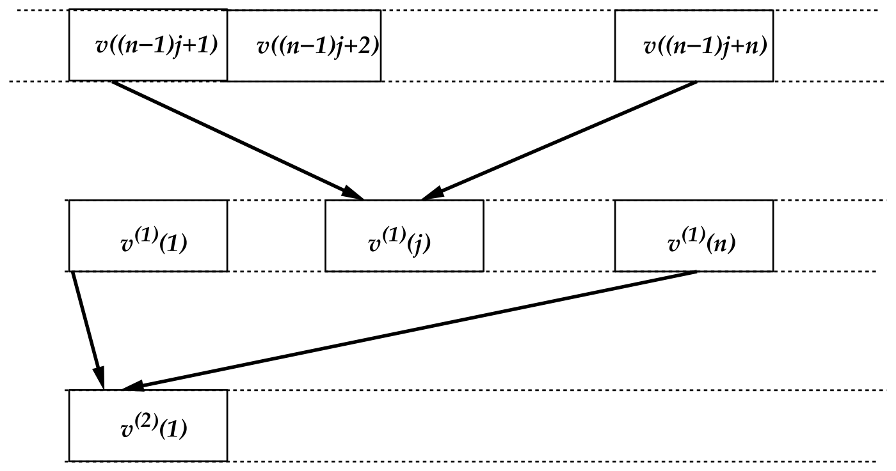

*图 5.8　速度的粗粒化。*

其中 $\mathbf{v}(l)$ 是粒子在时刻 $l$ 的速度。式 (5.2.27) 是第 $i$ 级和第 $i-1$ 级块求和之间的递推关系。变量 $n$ 决定求和中的项数。例如，$\mathbf{v}^{(3)}(j)$ 可以写成

$$
\begin{aligned}
\mathbf{v}^{(3)}(j) &= \sum_{l_1=(j-1)n+1}^{jn} \mathbf{v}^{(2)}(l_1)\\
&= \sum_{[l_1=(j-1)n+1]}^{jn}\ \sum_{[l_2=(l_1-1)n+1]}^{l_1 n}\ \sum_{[l_3=(l_2-1)n+1]}^{l_2 n} \mathbf{v}(l_3)\\
&= \sum_{l=(j-1)n^3+1}^{n^3 j} \mathbf{v}(l)\\
&\approx \frac{1}{\Delta t} \int_{l=(j-1)n^3+1}^{n^3 j} \mathrm{d}t\, \mathbf{v}(t) = \frac{\mathbf{r}(n^3 j) - \mathbf{r}\left(n^3(j-1)+1\right)}{\Delta t}.
\end{aligned}
$$

显然，速度的块求和与粒子在时间间隔 $n^i \Delta t$ 内的位移有关。图 5.8 演示了这一分块操作。由上面定义的块求和，我们可以计算速度自关联函数（VACF），其分辨率随时间增大而降低。在每一级分块上，我们需要存储 $n \times N$ 个块求和，其中 $N$ 是粒子数（实践中，存储块平均速度会更方便）。

对于长度为 $t = n^i \Delta t$ 的模拟，每个粒子所需的总存储量为 $i \times n$。可以把它与常规做法作对比：为了研究同样时间间隔内的关联，常规做法中每个粒子需要的存储量为 $n^i$。在常规的关联函数计算中，浮点运算次数按 $t^2$ 标度（若使用快速傅里叶变换技术则按 $t \ln t$ 标度）。相比之下，在当前方案中运算次数只按 $t$ 标度：每一时间步我们都必须更新 $\mathbf{v}^{(0)}(t)$ 并把它与 $\mathbf{v}^{(0)}$ 数组中全部 $n$ 个元素做关联；下一级块求和每 $n$ 个时间步才需要更新与关联一次，第三级每 $n^2$ 步一次，依此类推。于是总运算次数为

$$
\frac{t}{\Delta t} \times n\left(1 + \frac{1}{n} + \frac{1}{n^2} + \cdots + \frac{1}{n^i}\right) < \frac{t}{\Delta t}\, n\, \frac{n}{n-1}.
\tag{5.2.29}
$$

利用这种方法，我们可以快速而高效地计算种类繁多的关联函数，无论是时间关联还是空间关联。不过应当强调：每做一次分块操作都会带来更强的粗粒化。因此，这类关联函数长时间行为上的任何高频调制（例如长寿命的振荡）都会被抹平。

有意思的是，尽管 VACF 本身在长时间上只是近似的，我们仍然可以在数值精度上毫无损失地计算 VACF 的积分（即扩散系数）。下面我们讨论这种用于计算扩散系数的粗粒化技术。

我们定义

$$
\Delta\bar{\mathbf{r}}^{(i)}(j) \equiv \sum_{l=0}^{j} \mathbf{v}^{(i)}(l)\,\Delta t = \mathbf{r}(n^i) - \mathbf{r}(0).
\tag{5.2.30}
$$

粒子在时间间隔 $n^i \Delta t$ 内位移的平方可以写成

$$
(\Delta\bar{\mathbf{r}}^2)^{(i)}(j) = \left[\mathbf{r}(n^i) - \mathbf{r}(0)\right]^2 = \Delta\bar{\mathbf{r}}^{(i)}(j) \cdot \Delta\bar{\mathbf{r}}^{(i)}(j).
\tag{5.2.31}
$$

为计算扩散系数，我们应当跟踪均方位移的时间依赖关系。第一步是对所有的 $i$ 和所有的 $j$ 确定 $\Delta\bar{\mathbf{r}}^{(i)}(j)$。此外，为改善统计，我们希望把每一个采样点都用作新的时间原点。为此，我们再次建立长度为 $n$ 的数组。不过，这些数组存放的不再是前面那样的块求和，而是部分块求和（见算法 10）。具体地说：

1. 每隔一个时间间隔 $\Delta t$，按以下步骤执行最低级的分块操作：
   1. 先考虑所有最低级累加器都已至少填满过一次的情形（当 $t > n\Delta t$ 时即如此）。当前速度 $v(t)$ 的值被加到
   $$
   \mathbf{v}_{\mathrm{sum}}(1, j) = \mathbf{v}_{\mathrm{sum}}(1, j+1) + \mathbf{v}(t)
   \tag{5.2.32}
   $$
   其中 $\mathtt{j = 1,n\text{-}1}$；而
   $$
   \mathbf{v}_{\mathrm{sum}}(1, j) = \mathbf{v}(t)
   \tag{5.2.33}
   $$
   对应 $\mathtt{j = n}$。
   1. 这些操作给出
   $$
   \mathbf{v}_{\mathrm{sum}}(1, l) = \sum_{j=t-n+l}^{j=t} \mathbf{v}(j).
   \tag{5.2.34}
   $$
   此式使我们能够对 $l = 1, 2, ..., n$ 更新均方位移 (5.2.31) 的累加器：
   $$
   (\Delta\bar{\mathbf{r}}^2)^{(0)}(l) = (\Delta\bar{\mathbf{r}}^2)^{(0)}(l) + \mathbf{v}_{\mathrm{sum}}^2(1, l)\,\Delta t^2 .
   \tag{5.2.35}
   $$
1. 如果当前时间步是 $n$ 的倍数，我们就执行第一次分块操作；如果它是 $n^2$ 的倍数，就执行第二次分块，依此类推。执行第 $i$ 次分块操作包括以下步骤：
   1. 与前面一样，先考虑所有第 $i$ 级累加器都已至少填满过一次的情形（即 $t > n^i \Delta t$）。利用第 $i-1$ 级块求和 $\mathbf{v}_{\mathrm{sum}}(i-1, 1)$，我们更新
   $$
   \mathbf{v}_{\mathrm{sum}}(i, j) = \mathbf{v}_{\mathrm{sum}}(i, j+1) + \mathbf{v}_{\mathrm{sum}}(i-1, 1)
   \tag{5.2.36}
   $$
   其中 $\mathtt{j = 1,n\text{-}1}$；而
   $$
   \mathbf{v}_{\mathrm{sum}}(i, j) = \mathbf{v}_{\mathrm{sum}}(i-1, 1)
   \tag{5.2.37}
   $$
   对应 $\mathtt{j = n}$。
   1. 这些操作给出
   $$
   \mathbf{v}_{\mathrm{sum}}(i, l) = \sum_{j=n-l+1}^{j=n} \mathbf{v}_{\mathrm{sum}}(i-1, j).
   \tag{5.2.38}
   $$
   这些式子使我们能够对 $l = 1, 2, ..., n$ 更新均方位移式 (5.2.31) 的累加器：
   $$
   (\Delta\mathbf{r}^2)^{(i)}(l) = (\Delta\mathbf{r}^2)^{(i)}(l) + \mathbf{v}_{\mathrm{sum}}^2(i, l)\,\Delta t^2 .
   \tag{5.2.39}
   $$
1. 最后，我们必须考虑如何处理尚未完全填满的数组。设存放第 $i$ 级求和的数组中只有 $\mathtt{nmax}$ 个（共 $n$ 个）位置已被初始化。此时应按如下方式处理：
   1. 更新当前块长：$\mathtt{nmax = nmax+1}$（$\mathtt{nmax} < n$）。
   1. 对 $\mathtt{j = 1,nmax\text{-}1}$，
   $$
   \mathbf{v}_{\mathrm{sum}}(i, j) = \mathbf{v}_{\mathrm{sum}}(i, j) + \mathbf{v}_{\mathrm{sum}}(i-1, 1).
   \tag{5.2.40}
   $$
   1. 对 $\mathtt{j = nmax}$，
   $$
   \mathbf{v}_{\mathrm{sum}}(i, j) = \mathbf{v}_{\mathrm{sum}}(i-1, 1).
   \tag{5.2.41}
   $$
   式 (5.2.31) 的更新保持不变。

在例 6 中，我们把当前算法与计算 Lennard-Jones 流体扩散系数的常规算法作了比较。

**算法 10　扩散：order-$n$ 算法**

<table class="algbox" markdown="1">
<tbody markdown="1">
<tr markdown="1"><td class="algcode" markdown="span"><code>function&nbsp;dif</code></td><td class="algcom" markdown="span">每 nsample 个 MD 步采样一次</td></tr>
<tr markdown="1"><td class="algcode" markdown="span"></td><td class="algcom" markdown="span">switch = 0：初始化，</td></tr>
<tr markdown="1"><td class="algcode" markdown="span"></td><td class="algcom" markdown="span">= 1：采样，= 2：输出结果</td></tr>
<tr markdown="1"><td class="algcode" markdown="span"><code>if&nbsp;switch&nbsp;==&nbsp;0&nbsp;then</code></td><td class="algcom" markdown="span">0：初始化</td></tr>
<tr markdown="1"><td class="algcode" markdown="span"><code>&nbsp;&nbsp;&nbsp;&nbsp;</code><code>ntel=0</code></td><td class="algcom" markdown="span">本函数的时间计数器</td></tr>
<tr markdown="1"><td class="algcode" markdown="span"><code>&nbsp;&nbsp;&nbsp;&nbsp;</code><code>dtime=dt*nsamp</code></td><td class="algcom" markdown="span">两次采样之间的时间</td></tr>
<tr markdown="1"><td class="algcode" markdown="span"><code>&nbsp;&nbsp;&nbsp;&nbsp;</code><code>for&nbsp;1&nbsp;&lt;=&nbsp;ib&nbsp;&lt;=&nbsp;ibmax&nbsp;do</code></td><td class="algcom" markdown="span">ibmax 为最大块数</td></tr>
<tr markdown="1"><td class="algcode" markdown="span"><code>&nbsp;&nbsp;&nbsp;&nbsp;&nbsp;&nbsp;&nbsp;&nbsp;</code><code>ibl(ib)=0</code></td><td class="algcom" markdown="span">当前块的长度</td></tr>
<tr markdown="1"><td class="algcode" markdown="span"><code>&nbsp;&nbsp;&nbsp;&nbsp;&nbsp;&nbsp;&nbsp;&nbsp;</code><code>for&nbsp;1&nbsp;&lt;=&nbsp;j&nbsp;&lt;=&nbsp;n&nbsp;do</code></td><td class="algcom" markdown="span">n 为一个块中的步数</td></tr>
<tr markdown="1"><td class="algcode" markdown="span"><code>&nbsp;&nbsp;&nbsp;&nbsp;&nbsp;&nbsp;&nbsp;&nbsp;&nbsp;&nbsp;&nbsp;&nbsp;</code><code>tel(ib,j)=0</code></td><td class="algcom" markdown="span">平均次数计数器</td></tr>
<tr markdown="1"><td class="algcode" markdown="span"><code>&nbsp;&nbsp;&nbsp;&nbsp;&nbsp;&nbsp;&nbsp;&nbsp;&nbsp;&nbsp;&nbsp;&nbsp;</code><code>delr2(ib,j)=0</code></td><td class="algcom" markdown="span">均方位移的累计平均</td></tr>
<tr markdown="1"><td class="algcode" markdown="span"><code>&nbsp;&nbsp;&nbsp;&nbsp;&nbsp;&nbsp;&nbsp;&nbsp;&nbsp;&nbsp;&nbsp;&nbsp;</code><code>for&nbsp;1&nbsp;&lt;=&nbsp;i&nbsp;&lt;=&nbsp;npart&nbsp;do</code></td><td class="algcom" markdown="span"></td></tr>
<tr markdown="1"><td class="algcode" markdown="span"><code>&nbsp;&nbsp;&nbsp;&nbsp;&nbsp;&nbsp;&nbsp;&nbsp;&nbsp;&nbsp;&nbsp;&nbsp;&nbsp;&nbsp;&nbsp;&nbsp;</code><code>vxsum(ib,j,i)=0</code></td><td class="algcom" markdown="span">粒子 i 的块速度</td></tr>
<tr markdown="1"><td class="algcode" markdown="span"><code>&nbsp;&nbsp;&nbsp;&nbsp;&nbsp;&nbsp;&nbsp;&nbsp;&nbsp;&nbsp;&nbsp;&nbsp;</code><code>enddo</code></td><td class="algcom" markdown="span"></td></tr>
<tr markdown="1"><td class="algcode" markdown="span"><code>&nbsp;&nbsp;&nbsp;&nbsp;&nbsp;&nbsp;&nbsp;&nbsp;</code><code>enddo</code></td><td class="algcom" markdown="span"></td></tr>
<tr markdown="1"><td class="algcode" markdown="span"><code>&nbsp;&nbsp;&nbsp;&nbsp;</code><code>enddo</code></td><td class="algcom" markdown="span"></td></tr>
<tr markdown="1"><td class="algcode" markdown="span"><code>else&nbsp;if&nbsp;switch&nbsp;==&nbsp;2&nbsp;then</code></td><td class="algcom" markdown="span">2：输出结果</td></tr>
<tr markdown="1"><td class="algcode" markdown="span"><code>&nbsp;&nbsp;&nbsp;&nbsp;</code><code>ibm&nbsp;=&nbsp;max(ibmax,iblm)</code></td><td class="algcom" markdown="span"></td></tr>
<tr markdown="1"><td class="algcode" markdown="span"><code>&nbsp;&nbsp;&nbsp;&nbsp;</code><code>for&nbsp;1&nbsp;&lt;=&nbsp;ib&nbsp;&lt;=&nbsp;ibm&nbsp;do</code></td><td class="algcom" markdown="span"></td></tr>
<tr markdown="1"><td class="algcode" markdown="span"><code>&nbsp;&nbsp;&nbsp;&nbsp;&nbsp;&nbsp;&nbsp;&nbsp;</code><code>jbm&nbsp;=&nbsp;min(ibl(ib),n)</code></td><td class="algcom" markdown="span"></td></tr>
<tr markdown="1"><td class="algcode" markdown="span"><code>&nbsp;&nbsp;&nbsp;&nbsp;&nbsp;&nbsp;&nbsp;&nbsp;</code><code>for&nbsp;2&nbsp;&lt;=&nbsp;j&nbsp;&lt;=&nbsp;jbm&nbsp;do</code></td><td class="algcom" markdown="span"></td></tr>
<tr markdown="1"><td class="algcode" markdown="span"><code>&nbsp;&nbsp;&nbsp;&nbsp;&nbsp;&nbsp;&nbsp;&nbsp;&nbsp;&nbsp;&nbsp;&nbsp;</code><code>time=dtime*j*n**(ib-1)</code></td><td class="algcom" markdown="span">时间</td></tr>
<tr markdown="1"><td class="algcode" markdown="span"><code>&nbsp;&nbsp;&nbsp;&nbsp;&nbsp;&nbsp;&nbsp;&nbsp;&nbsp;&nbsp;&nbsp;&nbsp;</code><code>r2=delr2(ib,j)*dtime**2</code></td><td class="algcom" markdown="span">均方位移</td></tr>
<tr markdown="1"><td class="algcode" markdown="span"><code>&nbsp;&nbsp;&nbsp;&nbsp;&nbsp;&nbsp;&nbsp;&nbsp;&nbsp;&nbsp;&nbsp;&nbsp;</code><code>/tel(ib,j)</code></td><td class="algcom" markdown="span"></td></tr>
<tr markdown="1"><td class="algcode" markdown="span"><code>&nbsp;&nbsp;&nbsp;&nbsp;&nbsp;&nbsp;&nbsp;&nbsp;</code><code>enddo</code></td><td class="algcom" markdown="span"></td></tr>
<tr markdown="1"><td class="algcode" markdown="span"><code>&nbsp;&nbsp;&nbsp;&nbsp;</code><code>enddo</code></td><td class="algcom" markdown="span"></td></tr>
<tr markdown="1"><td class="algcode" markdown="span"><code>&nbsp;&nbsp;&nbsp;&nbsp;</code><code>...(续)....</code></td><td class="algcom" markdown="span"></td></tr>
</tbody>
</table>

<table class="algbox" markdown="1">
<tbody markdown="1">
<tr markdown="1"><td class="algcode" markdown="span"><code>...(接算法&nbsp;10)....</code></td><td class="algcom" markdown="span"></td></tr>
<tr markdown="1"><td class="algcode" markdown="span"><code>else&nbsp;if&nbsp;switch&nbsp;==&nbsp;1&nbsp;then</code></td><td class="algcom" markdown="span">采样</td></tr>
<tr markdown="1"><td class="algcode" markdown="span"><code>&nbsp;&nbsp;&nbsp;&nbsp;</code><code>ntel=ntel+1</code></td><td class="algcom" markdown="span"></td></tr>
<tr markdown="1"><td class="algcode" markdown="span"><code>&nbsp;&nbsp;&nbsp;&nbsp;</code><code>iblm=MaxBlock(ntel,n)</code></td><td class="algcom" markdown="span">可执行的分块操作的最大次数</td></tr>
<tr markdown="1"><td class="algcode" markdown="span"><code>&nbsp;&nbsp;&nbsp;&nbsp;</code><code>for&nbsp;1&nbsp;&lt;=&nbsp;ib&nbsp;&lt;=&nbsp;iblm&nbsp;do</code></td><td class="algcom" markdown="span"></td></tr>
<tr markdown="1"><td class="algcode" markdown="span"><code>&nbsp;&nbsp;&nbsp;&nbsp;&nbsp;&nbsp;&nbsp;&nbsp;</code><code>if&nbsp;ntel&nbsp;%&nbsp;n**(ib-1)==0&nbsp;then</code></td><td class="algcom" markdown="span">ntel 是否为 $n^{ib}$ 的倍数？</td></tr>
<tr markdown="1"><td class="algcode" markdown="span"><code>&nbsp;&nbsp;&nbsp;&nbsp;&nbsp;&nbsp;&nbsp;&nbsp;&nbsp;&nbsp;&nbsp;&nbsp;</code><code>ibl(ib)=ibl(ib)+1</code></td><td class="algcom" markdown="span">增加当前块长</td></tr>
<tr markdown="1"><td class="algcode" markdown="span"><code>&nbsp;&nbsp;&nbsp;&nbsp;&nbsp;&nbsp;&nbsp;&nbsp;&nbsp;&nbsp;&nbsp;&nbsp;</code><code>inm=max(ibl(ib),n)</code></td><td class="algcom" markdown="span">把最大块长置为 n</td></tr>
<tr markdown="1"><td class="algcode" markdown="span"><code>&nbsp;&nbsp;&nbsp;&nbsp;&nbsp;&nbsp;&nbsp;&nbsp;&nbsp;&nbsp;&nbsp;&nbsp;</code><code>for&nbsp;1&nbsp;&lt;=&nbsp;i&nbsp;&lt;=&nbsp;npart&nbsp;do</code></td><td class="algcom" markdown="span"></td></tr>
<tr markdown="1"><td class="algcode" markdown="span"><code>&nbsp;&nbsp;&nbsp;&nbsp;&nbsp;&nbsp;&nbsp;&nbsp;&nbsp;&nbsp;&nbsp;&nbsp;&nbsp;&nbsp;&nbsp;&nbsp;</code><code>if&nbsp;ib&nbsp;==&nbsp;1&nbsp;then</code></td><td class="algcom" markdown="span"></td></tr>
<tr markdown="1"><td class="algcode" markdown="span"><code>&nbsp;&nbsp;&nbsp;&nbsp;&nbsp;&nbsp;&nbsp;&nbsp;&nbsp;&nbsp;&nbsp;&nbsp;&nbsp;&nbsp;&nbsp;&nbsp;&nbsp;&nbsp;&nbsp;&nbsp;</code><code>delx=vx(i)</code></td><td class="algcom" markdown="span">第 0 级块：普通速度</td></tr>
<tr markdown="1"><td class="algcode" markdown="span"><code>&nbsp;&nbsp;&nbsp;&nbsp;&nbsp;&nbsp;&nbsp;&nbsp;&nbsp;&nbsp;&nbsp;&nbsp;&nbsp;&nbsp;&nbsp;&nbsp;</code><code>else</code></td><td class="algcom" markdown="span"></td></tr>
<tr markdown="1"><td class="algcode" markdown="span"><code>&nbsp;&nbsp;&nbsp;&nbsp;&nbsp;&nbsp;&nbsp;&nbsp;&nbsp;&nbsp;&nbsp;&nbsp;&nbsp;&nbsp;&nbsp;&nbsp;&nbsp;&nbsp;&nbsp;&nbsp;</code><code>delx=vxsum(ib-1,1,i)</code></td><td class="algcom" markdown="span">上一级块速度</td></tr>
<tr markdown="1"><td class="algcode" markdown="span"><code>&nbsp;&nbsp;&nbsp;&nbsp;&nbsp;&nbsp;&nbsp;&nbsp;&nbsp;&nbsp;&nbsp;&nbsp;&nbsp;&nbsp;&nbsp;&nbsp;</code><code>endif</code></td><td class="algcom" markdown="span"></td></tr>
<tr markdown="1"><td class="algcode" markdown="span"><code>&nbsp;&nbsp;&nbsp;&nbsp;&nbsp;&nbsp;&nbsp;&nbsp;&nbsp;&nbsp;&nbsp;&nbsp;&nbsp;&nbsp;&nbsp;&nbsp;</code><code>for&nbsp;1&nbsp;&lt;=&nbsp;in&nbsp;&lt;=&nbsp;inm&nbsp;do</code></td><td class="algcom" markdown="span"></td></tr>
<tr markdown="1"><td class="algcode" markdown="span"><code>&nbsp;&nbsp;&nbsp;&nbsp;&nbsp;&nbsp;&nbsp;&nbsp;&nbsp;&nbsp;&nbsp;&nbsp;&nbsp;&nbsp;&nbsp;&nbsp;&nbsp;&nbsp;&nbsp;&nbsp;</code><code>if&nbsp;inm&nbsp;/=&nbsp;n&nbsp;then</code></td><td class="algcom" markdown="span">检验块长是否等于 n</td></tr>
<tr markdown="1"><td class="algcode" markdown="span"><code>&nbsp;&nbsp;&nbsp;&nbsp;&nbsp;&nbsp;&nbsp;&nbsp;&nbsp;&nbsp;&nbsp;&nbsp;&nbsp;&nbsp;&nbsp;&nbsp;&nbsp;&nbsp;&nbsp;&nbsp;&nbsp;&nbsp;&nbsp;&nbsp;</code><code>inp=in</code></td><td class="algcom" markdown="span"></td></tr>
<tr markdown="1"><td class="algcode" markdown="span"><code>&nbsp;&nbsp;&nbsp;&nbsp;&nbsp;&nbsp;&nbsp;&nbsp;&nbsp;&nbsp;&nbsp;&nbsp;&nbsp;&nbsp;&nbsp;&nbsp;&nbsp;&nbsp;&nbsp;&nbsp;</code><code>else</code></td><td class="algcom" markdown="span"></td></tr>
<tr markdown="1"><td class="algcode" markdown="span"><code>&nbsp;&nbsp;&nbsp;&nbsp;&nbsp;&nbsp;&nbsp;&nbsp;&nbsp;&nbsp;&nbsp;&nbsp;&nbsp;&nbsp;&nbsp;&nbsp;&nbsp;&nbsp;&nbsp;&nbsp;&nbsp;&nbsp;&nbsp;&nbsp;</code><code>inp=in+1</code></td><td class="algcom" markdown="span"></td></tr>
<tr markdown="1"><td class="algcode" markdown="span"><code>&nbsp;&nbsp;&nbsp;&nbsp;&nbsp;&nbsp;&nbsp;&nbsp;&nbsp;&nbsp;&nbsp;&nbsp;&nbsp;&nbsp;&nbsp;&nbsp;&nbsp;&nbsp;&nbsp;&nbsp;</code><code>endif</code></td><td class="algcom" markdown="span"></td></tr>
<tr markdown="1"><td class="algcode" markdown="span"><code>&nbsp;&nbsp;&nbsp;&nbsp;&nbsp;&nbsp;&nbsp;&nbsp;&nbsp;&nbsp;&nbsp;&nbsp;&nbsp;&nbsp;&nbsp;&nbsp;&nbsp;&nbsp;&nbsp;&nbsp;</code><code>if&nbsp;in&nbsp;&lt;&nbsp;inm&nbsp;then</code></td><td class="algcom" markdown="span"></td></tr>
<tr markdown="1"><td class="algcode" markdown="span"><code>&nbsp;&nbsp;&nbsp;&nbsp;&nbsp;&nbsp;&nbsp;&nbsp;&nbsp;&nbsp;&nbsp;&nbsp;&nbsp;&nbsp;&nbsp;&nbsp;&nbsp;&nbsp;&nbsp;&nbsp;&nbsp;&nbsp;&nbsp;&nbsp;</code><code>vxsum(ib,in,i)=</code></td><td class="algcom" markdown="span"></td></tr>
<tr markdown="1"><td class="algcode" markdown="span"><code>&nbsp;&nbsp;&nbsp;&nbsp;&nbsp;&nbsp;&nbsp;&nbsp;&nbsp;&nbsp;&nbsp;&nbsp;&nbsp;&nbsp;&nbsp;&nbsp;&nbsp;&nbsp;&nbsp;&nbsp;&nbsp;&nbsp;&nbsp;&nbsp;</code><code>vxsum(ib,inp,i)+delx</code></td><td class="algcom" markdown="span">式 (5.2.36) 或 (5.2.40)</td></tr>
<tr markdown="1"><td class="algcode" markdown="span"><code>&nbsp;&nbsp;&nbsp;&nbsp;&nbsp;&nbsp;&nbsp;&nbsp;&nbsp;&nbsp;&nbsp;&nbsp;&nbsp;&nbsp;&nbsp;&nbsp;&nbsp;&nbsp;&nbsp;&nbsp;</code><code>else</code></td><td class="algcom" markdown="span"></td></tr>
<tr markdown="1"><td class="algcode" markdown="span"><code>&nbsp;&nbsp;&nbsp;&nbsp;&nbsp;&nbsp;&nbsp;&nbsp;&nbsp;&nbsp;&nbsp;&nbsp;&nbsp;&nbsp;&nbsp;&nbsp;&nbsp;&nbsp;&nbsp;&nbsp;&nbsp;&nbsp;&nbsp;&nbsp;</code><code>vxsum(ib,in,i)=delx</code></td><td class="algcom" markdown="span">式 (5.2.37) 或 (5.2.41)</td></tr>
<tr markdown="1"><td class="algcode" markdown="span"><code>&nbsp;&nbsp;&nbsp;&nbsp;&nbsp;&nbsp;&nbsp;&nbsp;&nbsp;&nbsp;&nbsp;&nbsp;&nbsp;&nbsp;&nbsp;&nbsp;&nbsp;&nbsp;&nbsp;&nbsp;</code><code>endif</code></td><td class="algcom" markdown="span"></td></tr>
<tr markdown="1"><td class="algcode" markdown="span"><code>&nbsp;&nbsp;&nbsp;&nbsp;&nbsp;&nbsp;&nbsp;&nbsp;&nbsp;&nbsp;&nbsp;&nbsp;&nbsp;&nbsp;&nbsp;&nbsp;</code><code>enddo</code></td><td class="algcom" markdown="span"></td></tr>
<tr markdown="1"><td class="algcode" markdown="span"><code>&nbsp;&nbsp;&nbsp;&nbsp;&nbsp;&nbsp;&nbsp;&nbsp;&nbsp;&nbsp;&nbsp;&nbsp;&nbsp;&nbsp;&nbsp;&nbsp;</code><code>for&nbsp;1&nbsp;&lt;=&nbsp;in&nbsp;&lt;=&nbsp;inm&nbsp;do</code></td><td class="algcom" markdown="span"></td></tr>
<tr markdown="1"><td class="algcode" markdown="span"><code>&nbsp;&nbsp;&nbsp;&nbsp;&nbsp;&nbsp;&nbsp;&nbsp;&nbsp;&nbsp;&nbsp;&nbsp;&nbsp;&nbsp;&nbsp;&nbsp;&nbsp;&nbsp;&nbsp;&nbsp;</code><code>tel(ib,in)=tel(ib,in)+1</code></td><td class="algcom" markdown="span">更新次数计数器</td></tr>
<tr markdown="1"><td class="algcode" markdown="span"><code>&nbsp;&nbsp;&nbsp;&nbsp;&nbsp;&nbsp;&nbsp;&nbsp;&nbsp;&nbsp;&nbsp;&nbsp;&nbsp;&nbsp;&nbsp;&nbsp;&nbsp;&nbsp;&nbsp;&nbsp;</code><code>delr2(ib,in)=delr2(ib,in)</code></td><td class="algcom" markdown="span">更新式 (5.2.39)</td></tr>
<tr markdown="1"><td class="algcode" markdown="span"><code>&nbsp;&nbsp;&nbsp;&nbsp;&nbsp;&nbsp;&nbsp;&nbsp;&nbsp;&nbsp;&nbsp;&nbsp;&nbsp;&nbsp;&nbsp;&nbsp;&nbsp;&nbsp;&nbsp;&nbsp;</code><code>+vxsum(ib,inm-in+1,i)**2</code></td><td class="algcom" markdown="span"></td></tr>
<tr markdown="1"><td class="algcode" markdown="span"><code>&nbsp;&nbsp;&nbsp;&nbsp;&nbsp;&nbsp;&nbsp;&nbsp;&nbsp;&nbsp;&nbsp;&nbsp;&nbsp;&nbsp;&nbsp;&nbsp;</code><code>enddo</code></td><td class="algcom" markdown="span"></td></tr>
<tr markdown="1"><td class="algcode" markdown="span"><code>&nbsp;&nbsp;&nbsp;&nbsp;&nbsp;&nbsp;&nbsp;&nbsp;&nbsp;&nbsp;&nbsp;&nbsp;</code><code>endif</code></td><td class="algcom" markdown="span"></td></tr>
<tr markdown="1"><td class="algcode" markdown="span"><code>&nbsp;&nbsp;&nbsp;&nbsp;&nbsp;&nbsp;&nbsp;&nbsp;</code><code>enddo</code></td><td class="algcom" markdown="span"></td></tr>
<tr markdown="1"><td class="algcode" markdown="span"><code>&nbsp;&nbsp;&nbsp;&nbsp;</code><code>endif</code></td><td class="algcom" markdown="span"></td></tr>
<tr markdown="1"><td class="algcode" markdown="span"><code>endif</code></td><td class="algcom" markdown="span"></td></tr>
<tr markdown="1"><td class="algcode" markdown="span"><code>end&nbsp;function</code></td><td class="algcom" markdown="span"></td></tr>
</tbody>
</table>

**具体说明**（一般说明见第 1 章「算法」）：

1. `MaxBlock(ntel,n)` 给出在当前时间步 `ntel` 上可以执行的分块操作的最大次数。

### 关于 Green-Kubo 关系的若干评注

正如第 2.5.2 节所讨论的，GK 关系自然地来自多体体系对弱哈密顿微扰之响应的统计力学描述。在某些情形下（例如热传导），哈密顿路线会遇到困难。此时，仍然可以通过考虑对拉格朗日运动方程的微扰来导出 GK 关系[[33]](references.md#ref-33)。

然而应当注意，热流——就此而言还有应力张量——并不是唯一定义的。不过，正如 Baroni 及其合作者所指出的[[155,161]](references.md#ref-155)，如果给通量加上一个与坐标和动量的某个有界守恒函数的时间演化相联系的通量，GK 积分（即可观测的输运性质）并不会改变。加上这样一个通量会改变 GK 被积函数的时间依赖性，因而会影响对通量自关联函数作傅里叶变换所得的有限频率响应的解释。但积分本身（即零频响应）不受影响。

零频响应的这种稳健性是可以预期的，因为昂萨格早先就用通量自关联函数给出了输运系数的表达式[[55,56]](references.md#ref-55)，而他的推导基于不可逆热力学而非统计力学。昂萨格用通量关联函数的积分表示输运系数，所需假设几乎只有两条：多体体系中广延量的小涨落是高斯型的；以及在最低阶上，通量对热力学回复力是线性的。“可以改变 GK 被积函数的值而不改变积分值”这一性质，可以用来提高积分的统计精度[[155,161]](references.md#ref-155)。

提高 GK 积分的精度之所以重要，是因为模拟中得到的关联函数本质上是含噪的。因此，当我们把积分上限取得越来越大时，信噪比会趋于零。一旦被积函数的取值与零已无显著差别，继续积分只会让结果更不准确。利用文献[[155,161]](references.md#ref-155) 所提出的技巧，可以缓解（但无法消除）这一不可避免的噪声问题。让我们考虑一个简单的例子，以澄清相关关联函数中的噪声在输运系数中造成的统计噪声效应。假设我们希望测量由如下 Green-Kubo 关系给出的输运系数 $L_{AA}$：

$$
L_{AA} = \lim_{t \to \infty} \int_0^t \mathrm{d}t'\, \langle A(0)A(t') \rangle .
$$

使用离散化形式更为方便：

$$
L_{AA} = \langle A^2(0) \rangle \Delta t/2 + \lim_{n_{\max} \to \infty} \sum_{n=1}^{n_{\max}} \Delta t\, \langle A(0)A(n\Delta t) \rangle .
$$

让我们考虑一种极端情形：对所有 $n \geq 1$ 都有 $\langle A(0)A(n\Delta t)\rangle = 0$。此时 $L_{AA} = \langle A(0)^2 \rangle \Delta t/2$，与 $n_{\max}$ 无关。然而 $L_{AA}$ 的方差确实依赖于 $n_{\max}$。下面我们假定 $A$ 的涨落服从一维正态分布：

$$
\begin{align}
\sigma_L^2 &= \sum_{n=1}^{n_{\max}}\left[\langle L_{AA}^2(n_{\max})\rangle - \langle L_{AA}\rangle^2\right] \nonumber\\
&= \text{常数} + 2(\Delta t)^2\langle A(0)^2 \rangle^2 (n_{\max} - 1).
\tag{5.2.42}
\end{align}
$$

上式表明，$\sigma_L^2$ 的数值估计随 $n_{\max}$ 线性增长，在连续情形下对应于随 $t_{\max}$ 线性变化。当然，真实的 $\sigma_L^2$ 会更低，因为它还要除以独立起始点的数目。因此，截断 GK 积分的一个合理做法是：把 $\sigma_L$ 对 $\sqrt{t_{\max}}$ 作图，并确定 $\sigma_L$ 的线性部分相对于 $\langle L_{AA}(t_{\max})\rangle$ 已不可忽略的那一点。另见练习 11。

关于 GK 积分还有第二点值得一提：早在 20 世纪 70 年代，Ciccotti 等人[[162]](references.md#ref-162) 就提出了一条计算体系对外部微扰之线性响应的更直接的途径。在这一方法中，人们直接计算（极）弱微扰对体系时间演化（即对其在相空间中轨迹）的影响。体系的响应通过计算所关心可观测量沿受扰与未受扰轨迹的时间演化而得到。把可观测量的未受扰值从受扰值中减去，（取平均后）便给出含时线性响应。文献[[162]](references.md#ref-162) 的方法比 GK 路线更为一般，但在较长时间上同样会遇到噪声问题。

???+ example "例 6（Lennard-Jones 流体的动力学性质）"

    作为数值确定动力学性质的一个例子，我们考虑自扩散系数的计算。如前一节所述，扩散系数既可以由均方位移确定，也可以由速度自关联函数（VACF）确定。这里我们按照算法 9 的思路来计算这两个可观测量。

    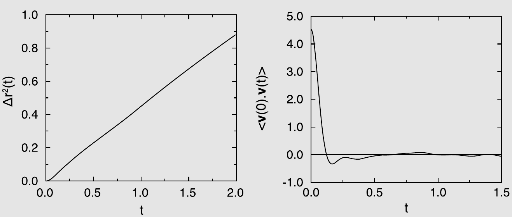

    *图 5.9　（左）均方位移 $\langle \Delta r(t)^2 \rangle$ 随模拟时间 $t$ 的变化。注意在长时间下 $\langle \Delta r(t)^2 \rangle$ 随 $t$ 线性变化，其斜率为 $2dD$，其中 $d$ 为体系的维数，$D$ 为自扩散系数。（右）速度自关联函数 $\langle \mathbf{v}(0) \cdot \mathbf{v}(t) \rangle$ 随模拟时间 $t$ 的变化。*

    图 5.9 给出了均方位移随模拟时间的变化。由均方位移，我们可以用式 (5.2.13) 确定扩散系数。然而该式只在 $t \to \infty$ 的极限下成立。在实践中这意味着，我们必须核实所计算的均方位移确实处于长时间区间，即所有暂态效应都已消退、只剩下对 $t$ 的线性依赖。

    VACF 的 Green-Kubo 积分提供了计算扩散系数的另一条途径（式 (5.2.16)）。严格说来，GK 积分的上限对应于 $t \to \infty$。在实践中我们必须在更早的时刻 $t_c$ 停止，因为一旦 VACF 衰减到噪声水平以下，继续积分只增加噪声而不增加信号。$t_c$ 的粗略估计可以通过确定积分看起来已达到平台值的时刻来获得。我们希望在 $t_c$ 之后，均方位移中的所有暂态也都已消退。然而，如果某个 ACF 具有幅度很小但积分很大的长时间尾巴，那么在 $t_c$ 处截断就会引入很大的系统误差。

    更多细节参见 SI（案例研究 5）。

???+ example "例 7（计算均方位移的算法）"

    在本例中，我们比较用于确定均方位移时间依赖性的常规方法（算法 9）与 order-$n$ 方法（算法 10）。本例考虑的是 Lennard-Jones 流体。

    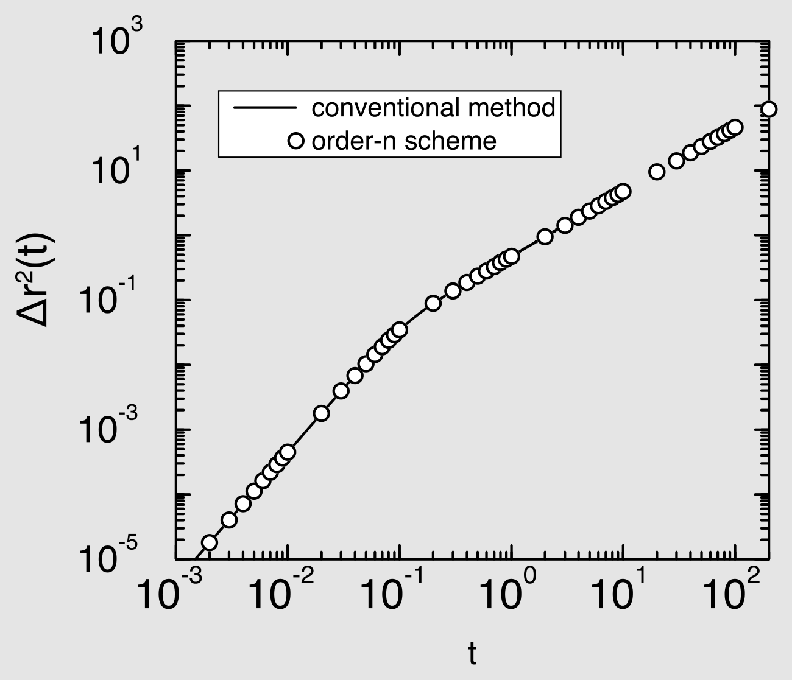

    *图 5.10　Lennard-Jones 流体（$\rho = 0.844$，$N = 108$，$T = 1.50$）的均方位移随时间的变化；常规方法与 order-$n$ 方案的比较。（图内标注：conventional method = 常规方法；order-n scheme = order-$n$ 方案）*

    在图 5.10 中，我们比较了用常规方法与 order-$n$ 方案计算所得的均方位移的时间依赖性。对于 order-$n$ 方案，内存需求随时间对数增长，而对于常规方案则是线性增长。在本次模拟的设置下，常规方案的计算无法延伸到 $t > 10$ 之外。在相同的内存分配下，order-$n$ 方案的计算可以毫无困难地延伸到长得多的时间：它只取决于模拟时长。在本例中，我们在 $t = 200$ 处停止。

    比较两种方案的精度是很有意思的。在常规方案中，当前时间步上粒子的速度被用来更新所有时间间隔的均方位移。而在 order-$n$ 方案中，当前时间步只用于更新 `vsum` 的最低阶数组（见算法 10）。第 $i$ 级的块求和每 $n^i$ 个时间步才更新一次。因此，对于总共 $M$ 个时间步的模拟，order-$n$ 方案的样本数要少得多：常规方案对所有时间都有 $M$ 个样本，而 order-$n$ 方案对第 $i$ 级块速度只有 $M/n^i$ 个样本。天真地看，人们会认为常规方案因此更精确。然而在常规方案中，相继的样本之间关联性要强得多，因而并不独立。为考察这些关联对结果精度的影响，我们采用了 Flyvbjerg 与 Petersen 的方法[[148]](references.md#ref-148)（见第 5.3.3 节及案例研究 4）。在该方法中，标准差被计算为数据块数目的函数。如果数据是相关的，标准差将随块数目的增加而增大，直到块数目足以使一个数据块内的数据不再相关为止。如果数据不相关，标准差将与块数目无关。这个极限值就是我们所关心的标准差。

    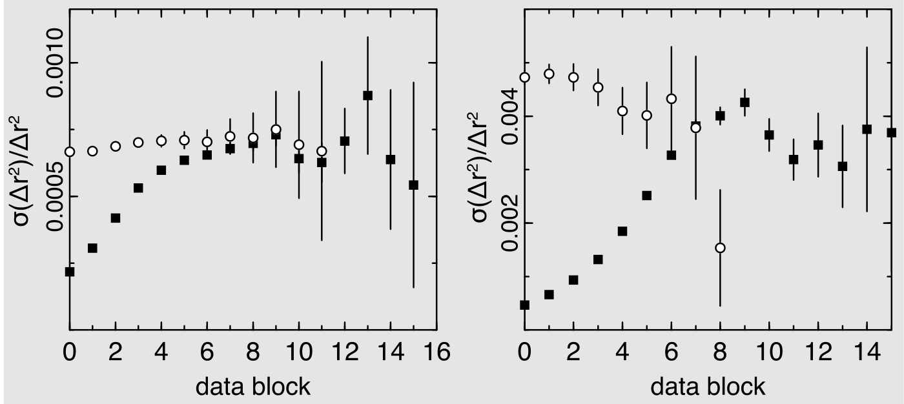

    *图 5.11　按 Flyvbjerg 与 Petersen 的定义，均方位移的相对误差随数据块数目的变化。图中比较了用于确定均方位移的常规方案（实心方块）与 order-$n$ 方法（空心圆）。右图对应 $t = 0.1$，左图对应 $t = 1.0$。（图内标注：横轴 data block = 数据块）*

    在这些模拟中，时间步长为 $\Delta t = 0.001$，块长取为 $n = 10$。两种方法的总时间步数相同。为计算均方位移，常规方案对所有时间都使用了 100\,000 个样本。对于 order-$n$ 方案，我们在 $t \in [0,0.01]$ 使用 100\,000 个样本，在 $t \in [0.01,0.1]$ 使用 10\,000 个，在 $t \in [0.1,1]$ 使用 1\,000 个，依此类推。这说明 order-$n$ 方案的样本数远少于常规方案。然而结果的精度却相同。这一点在图 5.11 中对 $t = 0.1$ 和 $t = 1.0$ 得到了展示。由于可对数据执行的分块操作总次数取决于样本总数，order-$n$ 方法的分块操作次数较少。图 5.11 显示：对 $t = 0.1$，order-$n$ 方案在三次数据分块操作之后标准差实际上已保持恒定，表明样本是独立的；而常规方法的标准差在最初六到八次分块操作中仍在上升。对 $t = 1.0$，order-$n$ 方法与数据块数目无关，常规方法则要到 10 次分块之后才如此。这意味着，必须对 $2^{10} \approx 1000$ 个相继样本作平均，才能得到两个独立的数据点。此外，图中还显示两种方法标准差的平台值基本相同，这意味着对本例而言两种方法精度相当；但正如下面所示，order-$n$ 方法的计算开销更小。

    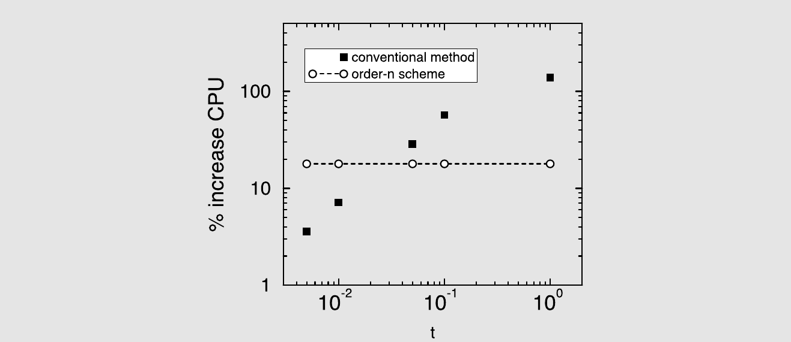

    *图 5.12　总 CPU 时间的增加百分比随确定均方位移所用总时间的变化；对与图 5.10 相同的体系，比较常规方案与 order-$n$ 方案。（图内标注：纵轴 \% increase CPU = CPU 时间增加百分比；conventional method = 常规方法；order-n scheme = order-$n$ 方案）*

    在图 5.12 中，我们比较了在总时间步数固定的模拟中两种算法的 CPU 需求。该图给出了模拟总 CPU 时间的增加量随“计算均方位移所覆盖的总时间”的变化。对于 order-$n$ 方案，CPU 时间应当（几乎）与我们确定均方位移所用的总时间无关，而这正是我们观察到的。然而对于常规方案，所需 CPU 时间在长时间下显著增加。在 $t = 1.0$ 处，order-$n$ 方案使总 CPU 时间增加 17\%，而常规方案则增加 130\%。

    本例说明，order-$n$ 方案在内存和 CPU 时间上的节省都可能相当可观，尤其是当我们关心长时间下的均方位移时。

    更多细节参见 SI（案例研究 6）。

## 统计误差

计算机“实验”中的测量与真实实验一样，会受到相同来源的误差影响——而且还多出几种。

我们不打算讨论因计算中出错而产生的系统误差，因为可能的错误数目是无穷的。有些系统误差与我们考虑的是有限体系这一事实有关：有限体系（即使带周期性边界条件）的性质与宏观体系的性质并不相同。当体系中的粒子数 $N$ 趋于 $\infty$ 时，这类误差便会消失。当然，我们无法真正达到这一极限，但有限尺寸效应往往以 $1/N$ 衰减，这意味着对于几千个粒子的体系，这类效应通常很小。

然而，正如第 5.2.1 节中式 (5.2.16) 之后所讨论的，某些有限尺寸效应的衰减比 $1/N$ 更慢。不可约有限尺寸效应最引人注目的例子出现在临界点附近。Binder [[42,163]](references.md#ref-42) 发展了所谓的有限尺寸标度方法，用以从有限体系的模拟中提取体系在临界点处或其附近的正确极限性质。关于这一方法的更多细节，我们请读者参阅该主题的大量文献，可从 Binder 本人的著作读起。

本节其余部分讨论对模拟结果中统计误差的估计。

### 静态性质：体系尺寸

让我们考虑在分子动力学模拟中测量某个动力学量 $A$ 的统计精度（下面的讨论稍加修改后同样适用于 Monte Carlo 模拟）。在一次总长为 $\tau$ 的模拟中，我们得到 $A$ 平衡平均值的如下估计：

$$
\overline{A}_\tau = \frac{1}{\tau}\int_0^\tau \mathrm{d}t\, A(t),
\tag{5.3.1}
$$

其中下标表示对时间 $\tau$ 求平均。若遍历假设成立，则当 $\tau \to \infty$ 时 $\overline{A}_\tau \to \langle A \rangle$，其中 $\langle A \rangle$ 表示 $A$ 的系综平均。我们可以估计 $\overline{A}_\tau$ 的方差 $\sigma^2(A)$：

$$
\begin{align}
\sigma^2(A) &= \left\langle \overline{A}_\tau^2 \right\rangle - \left\langle \overline{A}_\tau \right\rangle^2 \nonumber\\
&= \frac{1}{\tau^2}\int_0^\tau\!\!\int_0^\tau \mathrm{d}t\,\mathrm{d}t'\, \left\langle [A(t)-\langle A\rangle][A(t')-\langle A\rangle] \right\rangle .
\tag{5.3.2}
\end{align}
$$

注意上式中的 $\langle [A(t)-\langle A\rangle][A(t')-\langle A\rangle]\rangle$ 就是变量 $A$ 涨落的时间关联函数。把该关联函数记为 $C_A(t-t')$。如果采样时长 $\tau$ 远大于 $C_A$ 的特征衰减时间 $t_A^c$，我们就可以把上式改写为

$$
\begin{align}
\sigma^2(A) &\approx \frac{1}{\tau}\int_{-\infty}^{\infty}\mathrm{d}t\, C_A(t) \nonumber\\
&\approx \frac{2t_A^c}{\tau}C_A(0).
\tag{5.3.3}
\end{align}
$$

在最后一式中，我们用到了 $t_A^c$ 的定义：归一化关联函数 $C_A(t)/C_A(0)$ 从 0 到 $\infty$ 的积分。于是 $\overline{A}_\tau$ 的相对方差为[^11]

$$
\frac{\sigma^2(A)}{\langle A\rangle^2} \approx (2t_A^c/\tau)\frac{\langle A^2\rangle - \langle A\rangle^2}{\langle A\rangle^2}.
\tag{5.3.4}
$$

上式表明，$\overline{A}_\tau$ 的均方根误差正比于 $\sqrt{t_A^c/\tau}$。这一结果并不令人意外，它只是陈述了一个众所周知的事实：某个被测量的方差与不相关测量的次数成反比。在此处，这一次数正比于 $\tau/t_A^c$。这个近乎平凡的结果之所以重要，是因为它显示了可观测量 $A$ 中涨落的寿命与幅度如何影响统计精度。这一点在研究与流体力学模式相关的涨落、或对称性破缺相变附近的前驱涨落时尤为重要。这类模式的特征寿命通常正比于其波长的平方。为了尽量减小有限体系尺寸对这类相变的影响，最好研究盒长 $L$ 远大于体系中所有相关关联长度的体系。然而，由于长波涨落衰减缓慢，要保持相对误差不变，所需的时间步数应按 $L^2$ 标度。而固定长度的一次运行所需 CPU 时间（至多）正比于粒子数，因此保持精度不变所需的 CPU 时间随体系线度增长得相当快（例如在三维中按 $L^5$ 增长）。

上面的例子聚焦于分子动力学模拟中计算的量 $A(t)$，但如果把时间换成 Monte Carlo 循环数，该例同样适用于 Monte Carlo 模拟。上述说法并不意味着 MC 模拟中的循环等价于 MD 模拟中的时间；只是说，量 $A$ 中的涨落可能需要经过若干个 MC 循环才会衰减。

式 (5.3.4) 有一点并非一目了然：可观测量 $A$ 能否写成弱关联的单粒子性质之和，是有区别的。如果可以，那么 $(\langle A^2\rangle - \langle A\rangle^2)/\langle A\rangle^2$ 之比就与粒子数 $N$ 成反比。为看清这一点，考虑此时 $\langle A\rangle$ 与 $\langle A^2\rangle - \langle A\rangle^2$ 的表达式：

$$
\langle A \rangle = \sum_{i=1}^{N}\langle a_i \rangle = N\langle a \rangle
\tag{5.3.5}
$$

以及

$$
\langle A^2 \rangle - \langle A \rangle^2 = \sum_{i=1}^{N}\sum_{j=1}^{N}\left\langle [a_i - \langle a\rangle][a_j - \langle a\rangle] \right\rangle .
\tag{5.3.6}
$$

如果 $a_i$ 与 $a_j$ 涨落之间的关联可以忽略，我们就得到

$$
\frac{\langle A^2\rangle - \langle A\rangle^2}{\langle A\rangle^2} = \frac{1}{N}\frac{\langle a^2\rangle - \langle a\rangle^2}{\langle a\rangle^2}.
\tag{5.3.7}
$$

由式 (5.3.7) 可见，单粒子性质的统计误差与 $\sqrt{N}$ 成反比。因此，对于单粒子性质，在模拟长度固定的前提下，转向更大的体系可以提高精度。相反，在计算真正的集体性质时，并不能获得这种好处。

### 关联函数

我们可以用基本相同的论证来估计时间关联函数中的统计误差。假设我们做一次模拟来测量动力学量 $A$ 的（自）关联函数[^12]。为得到 $C_A(\tau) \equiv \langle A(0)A(\tau)\rangle$ 的估计，我们对初始时刻 $t$ 平均乘积 $A(t)A(t+\tau)$。设运行长度为 $\tau_0$，则我们对 $C_A(\tau)$ 的数值估计为

$$
\overline{C_A(\tau)} = \frac{1}{\tau_0}\int_0^{\tau_0}\mathrm{d}t\, A(t)A(t+\tau),
\tag{5.3.8}
$$

其中 $C_A$ 上的横线表示对有限时间 $\tau_0$ 求平均。接下来考虑 $\overline{C_A(\tau)}$ 的方差[[164]](references.md#ref-164)：

$$
\begin{align}
\left\langle \overline{C_A(\tau)}^2\right\rangle &- \left\langle \overline{C_A(\tau)}\right\rangle^2 \nonumber\\
&= \frac{1}{\tau_0^2}\int_0^{\tau_0}\!\!\int_0^{\tau_0}\mathrm{d}t'\mathrm{d}t''\left\langle A(t')A(t'+\tau)A(t'')A(t''+\tau)\right\rangle \nonumber\\
&\quad - \frac{1}{\tau_0^2}\int_0^{\tau_0}\!\!\int_0^{\tau_0}\mathrm{d}t'\mathrm{d}t''\left\langle A(t')A(t'+\tau)\right\rangle\left\langle A(t'')A(t''+\tau)\right\rangle .
\tag{5.3.9}
\end{align}
$$

上式右端第一项含有一个四阶关联函数。为简化问题，我们将假定 $A$ 的涨落服从高斯分布。这并不是描述例如平衡态粒子速度麦克斯韦分布的那种简单高斯分布，而是一个描述 $A$ 在不同时刻涨落之间全部关联的多维分布。这里我们只考虑离散时刻上的实涨落。此时广义高斯分布具有如下形式：

$$
P(A(t_1),A(t_2),\cdots,A(t_n)) = \text{const.}\times\exp\left[-\frac{1}{2}\sum_{i,j}A(t_i)\alpha(t_i - t_j)A(t_j)\right],
\tag{5.3.10}
$$

其中矩阵 $\alpha(t_i - t_j)$ 是（离散）时间关联函数 $C_A(t_i-t_j)$ 的“矩阵”逆，即

$$
\int \mathrm{d}\tau\, C_A(t-\tau)\alpha(\tau-t') = \delta(t-t').
$$

对于高斯变量，我们可以把所有高阶关联函数因子化。特别地，

$$
\begin{align}
\big\langle A(t')A(t'+\tau)&A(t'')A(t''+\tau)\big\rangle = \left\langle A(t')A(t'+\tau)\right\rangle\left\langle A(t'')A(t''+\tau)\right\rangle \nonumber\\
&+ \left\langle A(t')A(t'')\right\rangle\left\langle A(t'+\tau)A(t''+\tau)\right\rangle \nonumber\\
&+ \left\langle A(t')A(t''+\tau)\right\rangle\left\langle A(t'+\tau)A(t'')\right\rangle .
\tag{5.3.11}
\end{align}
$$

把式 (5.3.11) 代入式 (5.3.9)，得到

$$
\begin{align}
\left\langle \overline{C_A(\tau)}^2\right\rangle - \left\langle \overline{C_A(\tau)}\right\rangle^2
&= \frac{1}{\tau_0^2}\int_0^{\tau_0}\!\!\int_0^{\tau_0}\mathrm{d}t'\mathrm{d}t''\left\langle A(t'-t'')A(0)\right\rangle^2 \nonumber\\
&\quad + \frac{1}{\tau_0^2}\int_0^{\tau_0}\!\!\int_0^{\tau_0}\mathrm{d}t'\mathrm{d}t''\nonumber\\
&\qquad\quad \left\langle A(t'-t''-\tau)A(0)\right\rangle\left\langle A(t'-t''+\tau)A(0)\right\rangle .
\tag{5.3.12}
\end{align}
$$

由于我们考虑的是模拟长度 $\tau_0$ 远大于 $A$ 涨落特征衰减时间的情形，可以写成

$$
\begin{aligned}
\left\langle \overline{C_A(\tau)}^2\right\rangle - \left\langle \overline{C_A(\tau)}\right\rangle^2 &= \frac{1}{\tau_0}\int_{-\infty}^{\infty}\mathrm{d}x\left[\langle A(x)A(0)\rangle^2\right.\\
&\qquad\quad \left. + \langle A(x-\tau)A(0)\rangle\langle A(x+\tau)A(0)\rangle\right],
\end{aligned}
\tag{5.3.13}
$$

其中我们定义变量 $x \equiv t'-t''$。考虑两个极限情形 $\tau = 0$ 与 $\tau \to \infty$ 是很有启发的。对 $\tau = 0$，可以写成

$$
\begin{align}
\left\langle \overline{C_A(0)}^2\right\rangle - \left\langle \overline{C_A(0)}\right\rangle^2 &= \frac{2}{\tau_0}\int_{-\infty}^{\infty}\mathrm{d}x\,\langle A(x)A(0)\rangle^2 \nonumber\\
&= 4\left\langle A^2(0)\right\rangle^2 \frac{\tau^c}{\tau_0}.
\tag{5.3.14}
\end{align}
$$

该式的最后一行定义了关联时间 $\tau^c$：

$$
\tau^c \equiv \frac{\int_0^{\infty}\mathrm{d}x\,\langle A(x)A(0)\rangle^2}{\left\langle A^2(0)\right\rangle^2}.
\tag{5.3.15}
$$

对 $\tau \to \infty$，乘积

$$
\langle A(x-\tau)A(0)\rangle\,\langle A(x+\tau)A(0)\rangle
\tag{5.3.16}
$$

消失，于是

$$
\left\langle \overline{C_A(\tau)}^2\right\rangle - \left\langle \overline{C_A(\tau)}\right\rangle^2 = 2\left\langle A^2(0)\right\rangle^2\frac{\tau^c}{\tau_0}.
\tag{5.3.17}
$$

比较式 (5.3.14) 与式 (5.3.17) 可以看出，$C_A(\tau)$ 的绝对误差随 $\tau$ 变化很小。其结果是，当 $C_A(\tau)$ 衰减到 0 时，时间关联函数的相对误差迅速增大。在上述推导中，我们假定每个 $\tau$ 的样本总数相等；然而对于大的 $\tau$，我们通常样本更少，因此在长时间上，基于上式的误差估计过于乐观。

应当强调，前面的误差估计是近似的，因为它依赖于高斯近似的有效性。当然，偏离高斯近似的情况是可能出现的。不过，Jones 与 Mandadapu 给出了证据，表明在若干具有实际意义的情形下，高斯近似其实相当好[[165]](references.md#ref-165)。

### 块平均

知道可观测量 $A$ 的预期方差与其自关联函数的积分（式 (5.3.3)）相联系，是很有用的。但我们其实并不希望对测量的每一个量都去计算自关联函数，因为那比计算平均值本身还要费事。

估计静态量统计误差的标准做法，都要用到某种形式的块平均（block averaging）。一个块平均就是在有限时间区间 $t_B$ 上的时间平均（在 MC 情形下则是在 $n_B$ 个 MC 循环上的平均）：

$$
\overline{A}_B \equiv \frac{1}{t_B}\int_0^{t_B}\mathrm{d}t\, A(t).
\tag{5.3.18}
$$

一次模拟给出一串时间上等间隔的 $A$ 值。有了这些数据，我们很容易对给定块长 $t_B$ 累积块平均。$t_B$ 的选取是任意的，但通常应使总模拟时间 $\tau_0$ 包含相当数量的块（少于 10 个就有风险了——见图 5.5）。累积了这些块平均之后，我们可以把相邻的块平均再作平均，得到块长为 $\tau_B \equiv (2,3,\cdots,n)\times t_B$ 的平均值。这样的块数为 $n_B = \tau_0/\tau_B$。

现在考虑给定 $\tau_B$ 下块平均的方差：

$$
\sigma^2(\overline{A}_B) = \frac{1}{n_B}\sum_{b=1}^{n_B}\left(\overline{A}_B - \langle A\rangle\right)^2 .
\tag{5.3.19}
$$

如果 $\tau_B$ 远大于关联时间 $t_A^c$，由式 (5.3.4) 可知

$$
\sigma^2(\overline{A}_B) \approx \left[\langle A^2\rangle - \langle A\rangle^2\right]\frac{t_A^c}{\tau_B}.
\tag{5.3.20}
$$

但我们尚不知道 $t_A^c$。因此我们计算乘积

$$
P(\tau_B) \equiv \tau_B \times \frac{\sigma^2(\overline{A}_B)}{\langle A^2\rangle - \langle A\rangle^2}.
\tag{5.3.21}
$$

在 $\tau_B \gg t_A^c$ 的极限下，$P(\tau_B)$ 必定趋近 $t_A^c$。我们现在可以把 $P(\tau_B)$ 对 $\tau_B$ 作图（或者更方便地，把 $1/P(\tau_B)$ 对 $1/\tau_B$ 作图），并外推 $\tau_B \to \infty$ 时 $P(\tau_B)$ 的极限。这就给出了 $t_A^c$ 的估计，从而给出 $A$ 的误差估计。上述块平均分析提供了一个有力的工具，用以判断模拟是否足够长、能否给出某个量的足够精确的估计：如果我们发现在 $t_B = \tau$ 的极限下 $P(\tau_B)$ 仍强烈依赖于 $\tau_B$，那就说明模拟总长 $\tau_0$ 太短了。

Flyvbjerg 与 Petersen [[148]](references.md#ref-148) 提出了一种被广泛使用的块平均实现方案，用于估计模拟所得平均值的统计误差。设 $A_1, A_2, ..., A_L$ 为某涨落量 $A$ 的 $L$ 个相继样本。我们希望估计 $A$ 的平衡平均 $\langle A\rangle$，并估计其统计误差。$A$ 的平衡平均由全部 $L$ 个采样数据点的平均给出：

$$
\langle A\rangle \approx \bar{A} \equiv \frac{1}{L}\sum_{i=1}^{L}A_i .
\tag{5.3.22}
$$

我们还需要一个 $\sigma^2(\bar{A})$ 的估计量。由标准统计分析（例如见[[38]](references.md#ref-38)）可知，若有 $L$ 个不相关的数据点，则对平均值估计中真实方差的估计量为

$$
\sigma^2(\bar{A}) \approx \frac{1}{L(L-1)}\sum_{i=1}^{L}\left(A_i - \bar{A}\right)^2 .
\tag{5.3.23}
$$

然而，上式只有在所有不同样本互不相关时才成立（当然，一个样本总是与自身相关的）。对于原始数据，相继的点通常强烈相关，这正是我们不能直接把上式用于所测 $A$ 值序列的原因。

为解决这一问题，文献[[148]](references.md#ref-148) 反复对数据分块，直到相继的块实际上不再相关为止。

由于分块过程的每一步都是相同的（把相邻两块作平均，从而使块数减半），最好把它写成一个递归过程：我们从数据集 $A_1, A_2, ..., A_L$ 出发，施加一次分块操作生成数据集 $A_1', A_2', ..., A_{L'}'$，其规模是原集合的一半：

$$
A_i' = 0.5(A_{2i-1} + A_{2i})
\tag{5.3.24}
$$

其中

$$
L' = 0.5L .
\tag{5.3.25}
$$

注意新数据集的平均 $\bar{A}'$ 与原来的相同。然而 $A'$ 的均方误差为[^13]

$$
\sigma^2(A') = \left\langle A'^2\right\rangle - \left\langle A'\right\rangle^2 = \frac{1}{L'}\sum_{i=1}^{L'}A_i'^2 - \bar{A}'^2 .
\tag{5.3.26}
$$

只要相继的块仍有显著关联，$\sigma^2(A')/(L'-1)$ 就会随每一次分块操作而变化（增大）。但当块长到足以使各块实际上不再相关时，就有

$$
\frac{\sigma^2(A')}{L'-1} \approx \text{常数}.
\tag{5.3.27}
$$

这个极限值被用作所测平均值方差的估计量。Flyvbjerg 与 Petersen [[148]](references.md#ref-148) 还给出了误差本身的统计误差的估计：

$$
\sigma^2(\bar{A}) \approx \frac{\sigma^2(A')}{L'-1} \pm \sqrt{\frac{2\sigma^4(A')}{(L'-1)^3}}.
\tag{5.3.28}
$$

有这样一个估计是重要的，因为如果我们执行了过多次分块操作，误差的误差可能会再次增大（见图 5.5）。

在例 5 中，文献[[148]](references.md#ref-148) 的方法被用来计算分子动力学模拟中能量的标准差。图 5.5 给出了这一方差估计随块尺寸变化的典型图像。当分块操作次数 $M$ 较小时，数据是相关的，因此执行分块操作会使方差增大。然而当 $M$ 非常大时，我们只剩下少数几个样本，结果误差估计本身的统计误差会很大。介于两者之间的平台给出了我们所关心的 $\sigma^2(A)$ 的值。

## 问题与练习

**问题 15（热容）。**定容热容可以由正则系综中总能量的涨落算出：

$$
C_v = \frac{\langle E^2 \rangle - \langle E \rangle^2}{k_{\mathrm{B}} T^2} .
$$

1. 推导这个方程。
1. 在恒定 $NVT$ 的 MC 模拟中，人们计算的不是总能量 $E$ 的涨落，而是势能 $U$ 的涨落。此时还能算出热容吗？请说明。
1. 热容也可以通过把体系总能量对温度求导来计算。讨论这一途径的优点或缺点。
1. 式 (5.1.8) 把恒定 $NVE$ 下体系动能的方差与定容热容 $C_V$ 联系了起来。该表达式对 $C_V$ 的取值施加了什么约束？请用文字解释这一约束。

**问题 16（含高频模式的分子的维里压力）。**计算分子液体的压力时，既可以只考虑分子质心之间的力所贡献的维里，也可以考虑全部的力——分子间的与分子内的。两种方法算出的维里平均值应当相同，但统计噪声不同。为看清这一点，考虑由两个谐振束缚的原子组成、平均间距为 $a$ 的二聚体理想气体。为方便起见我们考虑一维体系，二聚体的内部弹簧常数为 $k_S$。

1. 二聚体中两个原子之间力的平均值是多少？
1. 在温度 $T$ 下该力的均方值是多少？
1. 当 $k_S \to \infty$ 时，维里中的统计噪声会怎样？

**问题 17（关联函数）。**

1. 速度自关联函数（VACF）在 $t = 0$ 处的值与某个可观测量有关，是哪一个？
1. 当 $t \to \infty$ 时 VACF 的极限值是多少？请说明理由。
1. VACF $< 0$ 的物理含义是什么？
1. 在 MD 模拟中我们可以计算自扩散系数和黏度。然而在相同的模拟时长下，这两个量的相对误差并不相同，请解释。
1. 除测量关联函数外，我们也可以测量功率谱。设我们研究一个涨落的可观测量 $A(t)$，则 $A$ 的数值功率谱定义为
   $$
   G_A(\omega) = \lim_{M \to \infty} \frac{\Delta t}{M} |A_M(\omega)|^2 ,
   $$
   其中
   $$
   A_M((m-1)\Delta\omega) \equiv \sum_{n=1}^{M} A(n\Delta t)\, e^{i(m-1)\Delta\omega (n-1)\Delta t} ,
   $$
   $\Delta t$ 是时间分辨率，$\Delta\omega = 2\pi/T$，$T$ 是模拟时长（$T = M\Delta t$）。若 $A$ 是高斯变量，则 $A(\omega)$ 也是。但由于平衡体系在时间原点平移下不变，$A$ 的不同傅里叶分量彼此不关联。请用推导式 (5.3.14) 时所用的论证，估计功率谱的相对误差对模拟长度的依赖关系。

**练习 10（Lennard-Jones 体系的分子动力学）。**在本书网站上可以找到一个 $NVE$ 系综下 Lennard-Jones 流体的分子动力学（MD）程序。我们在代码中植入了三处错误，因此运行过程中总能量不会守恒。

1. 找出代码中的三处错误。提示：运动方程的积分中有两处，力的计算中有一处。关于代码中若干变量的说明见文件 `system.inc`。
1. 该程序如何控制温度？“控制温度”意味着什么——毕竟在恒定 $NVE$ 的模拟中，应当保持不变的是体系的总能量，而温度是涨落的。
1. 为检验给定时间步长 $\Delta t$ 下数值积分算法经 $N$ 步后的能量漂移 $\Delta E$，通常计算[[126]](references.md#ref-126)
   $$
   \Delta E(\Delta t) = \frac{1}{N} \sum_{i=1}^{N} \left| \frac{E(0) - E(i\Delta t)}{E(0)} \right| ,
   $$
   其中 $E(x)$ 是体系在时刻 $x$ 的总能量（动能 + 势能）。修改程序（只改中央循环）使之计算 $\Delta E$，并作出 $\Delta E$ 随时间步长变化的图。对给定的能量漂移，时间步长如何随温度和密度变化？
1. 液体或气体的一个重要物理量是所谓自扩散系数 $D$。这里考虑三维体系中 $D$ 的计算，有两种方法：
   (a) 对速度自关联函数（VACF）积分：
   $$
   D = \frac{1}{3}\int_0^\infty \langle \mathbf{v}(t)\cdot\mathbf{v}(t+t') \rangle \,\mathrm{d}t'
   = \frac{\int_0^\infty \sum_{i=1}^{N} \langle \mathbf{v}(i,t)\cdot\mathbf{v}(i,t+t') \rangle \,\mathrm{d}t'}{3N} ,
   \tag{5.4.1}
   $$
   其中 $N$ 是粒子数，$\mathbf{v}(i,t)$ 是粒子 $i$ 在时刻 $t$ 的速度。为得到 VACF 的独立样本，应当这样选取 $\Delta t$，使所取的时间原点彼此独立，即 $t = i\,a\Delta t$（$i = 1,2,\cdots,\infty$）且 $\langle \mathbf{v}(t)\cdot\mathbf{v}(t+a\Delta t)\rangle \approx 0$。
   (b) 计算均方位移：
   $$
   D = \lim_{t' \to \infty} \frac{\langle |\mathbf{x}(t+t') - \mathbf{x}(t)|^2 \rangle}{6t'} .
   \tag{5.4.2}
   $$
   使用周期性边界条件时，计算均方位移必须小心。为什么？
   修改程序使之能用这两种方法计算自扩散系数（需对 SI 中提供的代码作一些改动）。把每个时间步都取作计算均方位移和 VACF 的新时间原点并不是好主意（虽然并不错误），请解释。$D$ 在 SI 单位下的量纲是什么？如何把 $D$ 化为无量纲单位？
1. 对 Lennard-Jones 液体，Naghizadeh 和 Rice [[127]](references.md#ref-127) 给出了如下自扩散系数公式（无量纲单位，$T^* < 1.0$ 且 $p^* < 3.0$）：
   $$
   {}^{10}\!\log D^* = 0.05 + 0.07 p^* - \frac{1.04 + 0.1 p^*}{T^*} .
   \tag{5.4.3}
   $$
   把这一唯象公式与你自己的模拟结果比较。如何把 $D^*$ 换算成 SI 单位下的扩散系数？
1. 对通过对势 $u(r)$ 相互作用的粒子体系，若已知径向分布函数 $g(r)$，平均势能 $\langle U \rangle$ 就可以算出。请推导 $\langle U \rangle$ 用 $u(r)$ 与 $g(r)$ 表示的表达式，并把这一计算与直接计算平均能量作比较。类似的方法也可用于计算平均压力。
1. 在现有版本的代码中，运动方程是用 Verlet 算法积分的。请对下列积分算法分别作出能量漂移 $\Delta E$ 的图：

**练习 11（Green-Kubo 积分的最优截断）。**正如正文所述，Green-Kubo 积分一旦其统计噪声被随机噪声主导就应当截断。

1. 推导式 (5.2.42)。
1. 利用 $D$ 与 VACF 积分之间的 GK 关系，计算 WF 体系的扩散系数 $D$。
1. 计算所得 $D$ 的方差随截断时间的变化，并估计积分应当在何处截断。

---

[^1]: 严格来说，这一守恒律只对无穷次可微的势成立。但当这一条件并不严格满足时，本节的讨论似乎依然适用。
[^2]: 不过，分子内力的强烈涨落对 Green-Kubo 积分的精度影响很小（见第 2.5.2 节与第 5.3.2 节）。
[^3]: 标度带来的坐标变换也会改变动量（见附录 F.4）；不过对于保持体积不变的变换，动量的重新标度不改变式 (5.1.31)。
[^4]: 对于具有不连续相互作用的粒子，其表达式可由连续情形得到：把作用在粒子上的力换成单位时间内的平均动量传递即可。
[^5]: 当然，使固体表面发生形变也可能改变其体相的弹性自由能，但那一效应可以单独计算。
[^6]: 这一区别有可观测的后果。例如，小晶体内部的拉普拉斯压力不是由$\gamma$决定，而是由$t_s$决定，而后者可以为负[[139,140]](references.md#ref-139)。
[^7]: 在附录 D 中，我们在非平衡热力学的背景下讨论扩散，其中主要驱动力是化学势梯度，而非浓度梯度。
[^8]: 式 (5.2.1) 是将粒子通量与化学势梯度关联的基本扩散方程的简化形式。完整表达式见文献[[57]](references.md#ref-57)。但对于自扩散，式 (5.2.1) 不是近似。
[^9]: 式 (5.2.16) 中的积分可能发散这一事实并不意味着粒子以无限快的速度扩散，只是 $\langle x^2(t) \rangle$ 随 $t$ 的增长快于线性。
[^10]: 在非两两可加相互作用的一般情况下，热流的表达式不再简单（参见例如[[155]](references.md#ref-155)）。在这些条件下，施加一个（小的）显式能流[[156–158]](references.md#ref-156) 并测量产生的温度梯度可能更有吸引力。同样的论点也适用于测量非两两可加系统中的黏度。
[^11]: 有些量的关联函数严格积分为零（例如作用在粒子上的力的自关联函数）。这类量通常是其他（有界）可观测量的时间导数（$\dot{B} = A$）。此时由式 (5.3.1) 可知 $\sigma^2(A)$ 按 $\sigma^2(B)/\tau^2$ 标度。
[^12]: 推广到 $\langle A(t)B(0)\rangle$ 型的互关联函数是直截了当的，留给读者作为练习。
[^13]: 必须区分数据本身（$A'$）的均方误差与其平均值（$\bar{A}'$）的方差。