# 各种系综中的 Monte Carlo 模拟

分子动力学模拟的原始形式求解的是离散化的牛顿运动方程，其总能量 $E$ 和总线动量 $\mathbf{P}$ 是运动常数。因此，分子动力学模拟测量的是恒定-$NVE$-$\mathbf{P}$ 系综中的时间平均，这与更常见的微正则恒定-$NVE$ 系综非常相似（参见文献[[166]](references.md#ref-166)）。相比之下，Metropolis 风格的 Monte Carlo 模拟探测的是恒定-$NVT$（即正则系综）下系统的性质。这些系综之间的差异导致在分子动力学和 Monte Carlo 模拟中计算的统计平均值存在可观测的差别。其中大多数差异在热力学极限下会消失，对于几百个粒子的系统来说已经相对较小。然而，在计算热力学量的涨落幅度时，系综的选择确实会产生差异。例如：在时间步长趋于零的极限下，运动方程离散化带来的数值噪声消失，MD 模拟中的总能量不发生涨落。然而，对于恒定-$NVT$ 的系统，能量必须涨落，并且实际上与系统的热容有关（参见公式 (5.1.5)）。在第 5.1.4 节中，我们讨论了关联不同系综中涨落的技术[[106]](references.md#ref-106)。

在 MC 和 MD 方法被引入之后的几年中，人们发展了在这些原始系综之外的其他系综中进行此类模拟的方法。在大多数情况下，这些技术首先是为 Monte Carlo 模拟开发的。MD 在恒定-$NVE$-$\mathbf{P}$ 之外的其他系综中的应用来得更晚：我们将在第 7 章中讨论它们。由于在 $NVT$ 之外的系综中，MC 模拟更为“自然”，我们先讨论它们。MC 方法的灵活性使得我们通常可以直截了当地创建一个 MC 算法，使其保持任何所需的强度变量（$P, T, \mu_i, \cdots$）集合恒定，只要我们固定至少一个广延变量即可。

多年来，人们已经提出了针对各种系综的 MC 算法：等温等压、等温等张力、巨正则（即恒定 $\mu VT$）、半巨正则（即恒定 $\mu_A - \mu_B, N_A + N_B, V, T$），甚至微正则[[167–172]](references.md#ref-167)。我们还将讨论所谓的“吉布斯系综”方法，尽管严格来说，该方法并不指代一个不同的系综。微正则 MC 方法[[172]](references.md#ref-172) 在 SI L.3 中有简要讨论。

正如第 3.2 节中所解释的，马尔可夫链 MC 被设计为以与其玻尔兹曼权重成正比的频率访问构型空间的不同部分。因此，对所有访问过的构型进行未加权平均会收敛到对所有构型空间的玻尔兹曼加权平均。在第 3.2 节中，我们利用细致平衡原理证明了 Metropolis 算法按照其玻尔兹曼权重访问构型空间中的点。

细致平衡条件实际上是保证玻尔兹曼采样的过强条件，正如我们将在第 13 章中看到的，存在满足平衡但不满足细致平衡的强大 MC 算法。然而，如果满足细致平衡，我们就可以保证采样方案是正确的。更重要的是：构造满足细致平衡的算法通常相对容易，而证明平衡往往更为微妙。

由于这个原因，我们将通过施加细致平衡来讨论恒定-$NVT$ 之外的其他系综中的 Monte Carlo 模拟。可以构造仅满足平衡的有效非-$NVT$ 算法，但考虑它们会使讨论复杂化而没有任何明显的好处。

## 一般方法

我们将反复使用相同的方法来考虑多种不同系综的 MC 模拟。这样做可能看起来重复，确实如此，但希望它能传达这样一个要点：只要你简单地遵循配方，为“新”系综构造有效的 MC 算法是安全的。

因此，在下面的各节中，我们使用以下程序来证明我们的 Monte Carlo 算法的有效性：

1. 确定我们想要采样的分布。这个分布，记为 $\mathcal{N}$，将取决于系综的细节。
1. 施加细致平衡条件，
   $$
   \mathcal{K}(o \to n) = \mathcal{K}(n \to o),
   \tag{6.1.1}
   $$
   其中 $\mathcal{K}(o \to n)$ 是从构型 $o$ 到 $n$ 的流量。该流量由处于构型 $o$ 的概率、生成构型 $n$ 的概率和接受此移动的概率的乘积给出，
   $$
   \mathcal{K}(o \to n) = \mathcal{N}(o) \times \alpha(o \to n) \times \text{acc}(o \to n).
   \tag{6.1.2}
   $$
1. 确定生成特定构型的概率。
1. 推导接受规则需要满足的条件。

## 正则系综

首先，让我们将上述方法应用于标准的 Metropolis 方案。在正则系综中，粒子数、温度和体积是恒定的（参见图 6.1）。对于恒定-$NVT$ 的系统，找到构型 $\mathbf{r}^N$ 的概率与玻尔兹曼权重成正比：

$$
\mathcal{N}(\mathbf{r}^N) \propto \exp[-\beta \mathcal{U}(\mathbf{r}^N)].
\tag{6.2.1}
$$

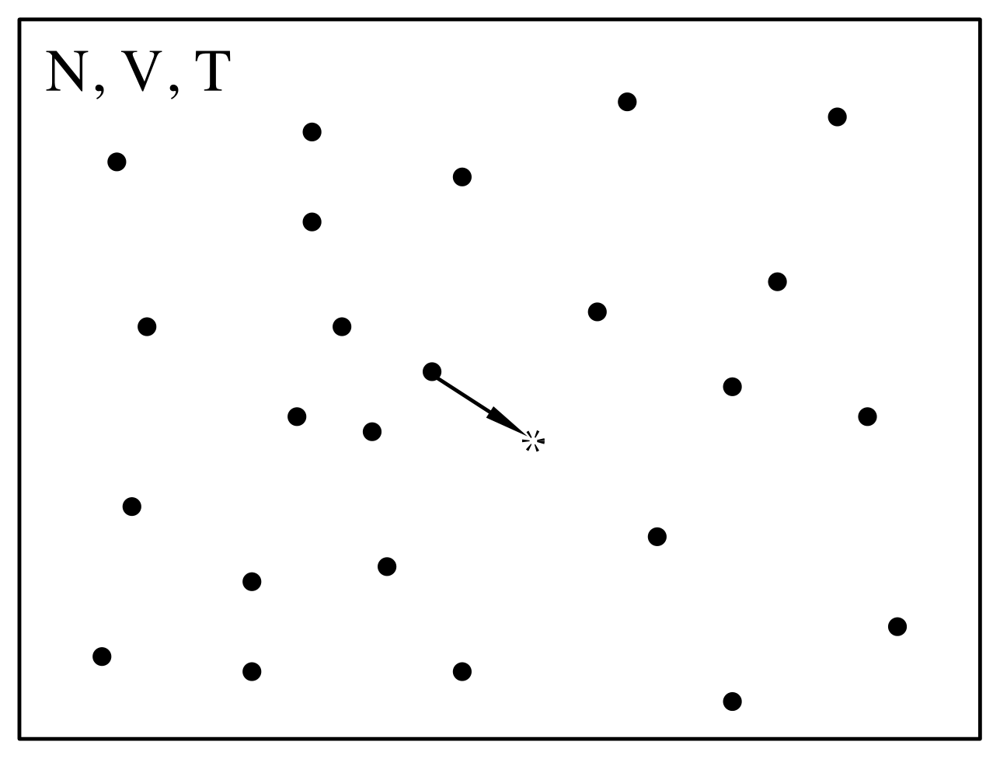

*图 6.1　正则系综。粒子数、体积和温度恒定。图中展示了一个粒子位移的 Monte Carlo 移动。*

### Monte Carlo 模拟

正则系综中的模拟应当采样公式 (6.2.1) 给出的分布。这可以通过以下方案实现：

1. 随机选择一个粒子并计算构型的能量 $\mathcal{U}(o)$。
1. 给该粒子一个随机位移（参见图 6.1），例如
   $$
   \mathbf{r}(o) \to \mathbf{r}(o) + \Delta(\mathbf{R} - 0.5),
   \tag{6.2.2}
   $$
   其中 $\Delta/2$ 是最大位移。$\Delta$ 的值应选择为使采样方案最优（参见第 3.4 节）。试探构型记为 $n$，其能量为 $\mathcal{U}(n)$。
1. 该移动以如下概率被接受（参见公式 (3.2.11)）
   $$
   \text{acc}(o \to n) = \min(1, \exp\{-\beta[\mathcal{U}(n) - \mathcal{U}(o)]\}).
   \tag{6.2.3}
   $$
   如果被拒绝，则保留旧构型。

此基本 Metropolis 方案的实现见第 3.3 节（算法 1 和 2）。

### 算法的合理性证明

根据公式 (6.2.2) 生成试探构型满足微观可逆性

$$
\alpha(o \to n) = \alpha(n \to o) = \alpha.
\tag{6.2.4}
$$

将此式代入细致平衡条件 (6.1.1)，连同公式 (6.1.2) 和期望分布 (6.2.1)，给出接受规则的条件

$$
\frac{\text{acc}(o \to n)}{\text{acc}(n \to o)} = \exp\{-\beta[\mathcal{U}(n) - \mathcal{U}(o)]\}.
\tag{6.2.5}
$$

容易验证接受规则 (6.2.3) 满足此条件。

## 等温等压系综

等温等压（恒定-$NPT$）系综在 Monte Carlo 模拟中被广泛使用。这并不令人惊讶，因为大多数真实实验是在恒定压力和温度下进行的。恒定-$NPT$ 模拟的一个优点是它们可以用来测量模型系统的状态方程，特别是当维里表达式计算压力较为繁琐时。这种情况包括具有非两体可加相互作用的系统，以及某些非球形硬核分子模型。最后，在一级相变附近使用恒定-$NPT$ Monte Carlo 模拟系统通常很方便，因为给定足够的时间，恒定压力下的系统可以自由地完全转变为具有最低（Gibbs）自由能的状态，而在恒定-$NVT$ 模拟中，系统可能被保持在某个密度处，在该密度下宏观系统将分离为两个不同密度的体相，但由于有限尺寸效应而无法做到。

恒定压力下的 Monte Carlo 模拟首先由 Wood [[167]](references.md#ref-167) 在二维硬盘的模拟研究中描述。虽然 Wood 引入的方法很优雅，但它不容易适用于具有任意连续势的系统。McDonald [[168]](references.md#ref-168) 首先将恒定-$NPT$ 模拟应用于具有连续分子间力（Lennard-Jones 混合物）的系统，McDonald 的恒定压力方法现在被广泛使用。下面我们讨论的就是 McDonald 的方法。

### 统计力学基础

我们将以一种看似不必要地复杂的方式来推导恒定压力 Monte Carlo 的基本方程。然而，这种推导方式的优点是可以使用相同的框架来引入后面将要讨论的其他非-$NVT$ Monte Carlo 方法。为方便起见，我们首先假设处理的是一个由 $N$ 个相同原子组成的系统。该系统的配分函数为

$$
Q(N, V, T) = \frac{1}{\Lambda^{3N} N!} \int_0^L \cdots \int_0^L \mathrm{d}\mathbf{r}^N \exp[-\beta \mathcal{U}(\mathbf{r}^N)].
\tag{6.3.1}
$$

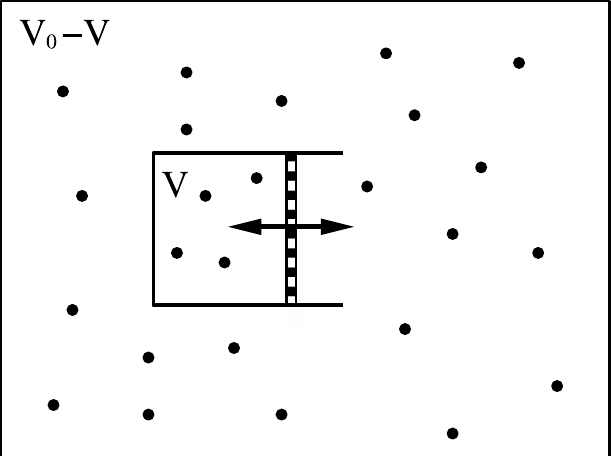

*图 6.2　理想气体（$m$ 个粒子，体积 $V_0 - V$）可以与 $N$ 粒子系统（体积 $V$）交换体积。*

以略微不同的方式重写公式 (6.3.1) 是方便的。为方便起见，我们假设系统包含在一个直径为 $L = V^{1/3}$ 的立方盒子中。我们现在通过以下方式定义标度坐标 $\mathbf{s}^N$

$$
\mathbf{s}_i \equiv \frac{\mathbf{r}_i}{L} \quad \text{for} \quad i = 1, 2, \cdots, N.
\tag{6.3.2}
$$

如果我们将这些标度坐标代入公式 (6.3.1)，我们得到

$$
Q(N, V, T) = \frac{V^N}{\Lambda^{3N} N!} \int_0^1 \cdots \int_0^1 \mathrm{d}\mathbf{s}^N \exp[-\beta \mathcal{U}(\mathbf{s}^N; L)].
\tag{6.3.3}
$$

在公式 (6.3.3) 中，我们写成 $\mathcal{U}(\mathbf{s}^N; L)$ 以表示 $\mathcal{U}$ 依赖于粒子之间的真实距离而非标度距离。系统的亥姆霍兹自由能表达式为

$$
\begin{aligned}
F(N, V, T) &= -k_B T \ln Q\\
&= -k_B T \ln \left[\frac{V^N}{\Lambda^{3N} N!}\right] - k_B T \ln \left[\int \mathrm{d}\mathbf{s}^N \exp[-\beta \mathcal{U}(\mathbf{s}^N; L)]\right]\\
&= F^{\text{id}}(N, V, T) + F^{\text{ex}}(N, V, T).
\end{aligned}
\tag{6.3.4}
$$

在上式的最后一行中，我们将亥姆霍兹自由能的两个贡献分别标识为理想气体表达式和超额部分。现在我们考虑系统由两个体积分别为 $V$ 和 $V_0 - V$ 的非相互作用子系统组成的情况，其中 $V_0 \gg V$，$V_0$ 固定。为了形象化，我们在图 6.2 中将这两个系统展示为被活塞隔开的两个有界系统，尽管实际上子系统应被视为完全独立的并受到周期性边界条件的约束。我们将体积 $V_0 - V$ 中的系统称为储库。我们用 $M$ 表示组合系统中的粒子总数。其中 $M - N$ 个在体积 $V_0 - V$ 中，$N$ 个在体积 $V$ 中。组合系统的配分函数简单地是两个（非相互作用）子系统配分函数的乘积：

$$
\begin{aligned}
Q(N, M, V, V_0, T) &= Q(M, V_0 - V, T) \frac{V^N}{\Lambda^{3M} N!} \int \mathrm{d}\mathbf{s}^N e^{-\beta \mathcal{U}(\mathbf{s}^N; L)}\\
&= e^{-\beta F_R(M, V_0 - V, T)} \frac{V^N}{\Lambda^{3M} N!} \int \mathrm{d}\mathbf{s}^N e^{-\beta \mathcal{U}(\mathbf{s}^N; L)},
\end{aligned}
\tag{6.3.5}
$$

其中 $F_R$ 表示储库的亥姆霍兹自由能。该组合系统的总自由能为 $F^{\text{tot}} = -k_B T \ln Q(N, M, V, V_0, T)$。现在假设两个子系统可以交换体积。在这种情况下，$N$ 粒子子系统的体积 $V$ 可以涨落。$V$ 的最概然值将是使组合系统自由能最小的那个值。$N$ 粒子子系统具有体积 $V$ 的概率密度 $\mathcal{N}(V)$ 为[^1]

$$
\mathcal{N}(V) = \frac{\exp[-\beta F_R(M, V_0 - V, T)] V^N \int \mathrm{d}\mathbf{s}^N \exp[-\beta \mathcal{U}(\mathbf{s}^N; L)]}{\int_0^{V_0} \mathrm{d}V' \exp[-\beta F_R(M, V_0 - V', T)] V'^N \int \mathrm{d}\mathbf{s}^N \exp[-\beta \mathcal{U}(\mathbf{s}^N; L')]}.
\tag{6.3.6}
$$

现在我们考虑储库尺寸趋于无穷的极限（$V_0 \to \infty$，$M \to \infty$，$(M - N)/V_0 \to \rho$）。在这个极限下，小系统的体积变化不改变储库的压力 $P_R$。换言之，大系统充当小系统的恒压器。在这种情况下，我们可以简化公式 (6.3.5) 和 (6.3.6)。注意在 $V/V_0 \to 0$ 的极限下，我们可以写出

$$
\begin{aligned}
F_R(M, V_0 - V, T) &= F_R(M, V_0, T) + V \left(\frac{\partial F_R(M, V_0 - V, T)}{\partial V}\right)_{V=0}\\
&= F_R(M, V_0, T) + P_R V.
\end{aligned}
\tag{6.3.7}
$$

组合配分函数 (6.3.5) 于是可以写为

$$
Q(N, P, T) \equiv \frac{\beta P}{\Lambda^{3N} N!} \int \mathrm{d}V \, V^N \exp(-\beta PV) \int \mathrm{d}\mathbf{s}^N \exp[-\beta \mathcal{U}(\mathbf{s}^N; L)],
\tag{6.3.8}
$$

其中我们包含了一个因子 $\beta P$ 以使 $Q(N, P, T)$ 无量纲（这一选择并非显然的——参见脚注 1）。这给出，对于公式 (6.3.6)，

$$
\mathcal{N}_{N,P,T}(V) = \frac{V^N \exp(-\beta PV) \int \mathrm{d}\mathbf{s}^N \exp[-\beta \mathcal{U}(\mathbf{s}^N; L)]}{\int_0^{V_0} \mathrm{d}V' \, V'^N \exp(-\beta PV') \int \mathrm{d}\mathbf{s}^N \exp[-\beta \mathcal{U}(\mathbf{s}^N; L')]}.
\tag{6.3.9}
$$

在同一极限下，组合系统的自由能与不存在 $N$ 粒子子系统时储库自由能之差即为熟知的吉布斯自由能：

$$
G(N, P, T) = -k_B T \ln Q(N, P, T).
\tag{6.3.10}
$$

公式 (6.3.9) 是恒定-$NPT$ Monte Carlo 模拟的出发点。其核心思想是，找到小系统具有体积 $V$ 且 $N$ 个原子处于特定构型（由 $\mathbf{s}^N$ 指定）的概率密度为

$$
\begin{aligned}
\mathcal{N}(V; \mathbf{s}^N) &\propto V^N \exp(-\beta PV) \exp[-\beta \mathcal{U}(\mathbf{s}^N; L)]\\
&= \exp\{-\beta[\mathcal{U}(\mathbf{s}^N, V) + PV - N\beta^{-1} \ln V]\}.
\end{aligned}
\tag{6.3.11}
$$

我们现在可以对约化坐标 $\mathbf{s}^N$ 和体积 $V$ 进行 Metropolis 采样。

在恒定-$NPT$ Monte Carlo 方法中，$V$ 被简单地视为一个额外的坐标，$V$ 中的试探移动必须满足与 $\mathbf{s}$ 中的试探移动相同的规则；特别是，我们应当保持底层马尔可夫链的微观可逆性。假设我们的试探移动由从体积 $V$ 变为 $V' = V + \Delta V$ 的尝试组成，其中 $\Delta V$ 是在区间 $[-\Delta V_{\max}, +\Delta V_{\max}]$ 上均匀分布的随机数。在 Metropolis 方案中，这样一个随机的体积变化移动将以如下概率被接受

$$
\begin{aligned}
\text{acc}(o \to n) = \min\Bigl(1, \exp\bigl\{-\beta\bigl[&\mathcal{U}(\mathbf{s}^N, V') - \mathcal{U}(\mathbf{s}^N, V)\\
&+ P(V' - V) - N\beta^{-1} \ln(V'/V)\bigr]\bigr\}\Bigr).
\end{aligned}
\tag{6.3.12}
$$

与其尝试对体积本身进行随机变化，不如构造对盒长 $L$ [[168]](references.md#ref-168) 或体积对数[[133]](references.md#ref-133) 的试探移动。这样的试探移动同样合法，只要底层马尔可夫链的微观可逆性得到保持即可。然而，这些替代方案会导致公式 (6.3.12) 的形式略有不同。配分函数 (6.3.8) 可以重写为

$$
Q(N, P, T) = \frac{\beta P}{\Lambda^{3N} N!} \int \mathrm{d}(\ln V) \, V^{N+1} \exp(-\beta PV) \int \mathrm{d}\mathbf{s}^N \exp[-\beta \mathcal{U}(\mathbf{s}^N; L)].
\tag{6.3.13}
$$

此公式表明，如果我们在 $\ln V$ 中进行随机游走，找到体积 $V$ 的概率为

$$
\mathcal{N}(V; \mathbf{s}^N) \propto V^{N+1} \exp(-\beta PV) \exp[-\beta \mathcal{U}(\mathbf{s}^N; L)].
\tag{6.3.14}
$$

此分布可以用以下接受规则进行采样：

$$
\begin{aligned}
\text{acc}(o \to n) = \min\Bigl(1, \exp\bigl\{-\beta\bigl[&\mathcal{U}(\mathbf{s}^N, V') - \mathcal{U}(\mathbf{s}^N, V) + P(V' - V)\\
&- (N+1)\beta^{-1} \ln(V'/V)\bigr]\bigr\}\Bigr).
\end{aligned}
\tag{6.3.15}
$$

### Monte Carlo 模拟

体积试探移动的尝试频率取决于体积空间被采样的效率。如果我们如前所述以

$$
\frac{\text{体积变化的接受移动的平方和}}{t_{\text{CPU}}}
\tag{6.3.16}
$$

作为效率判据，那么试探移动的频率显然取决于其代价。一般来说，一次体积试探移动需要重新计算所有分子间相互作用。因此，其代价与执行 $N$ 次分子位置试探移动相当。在这种情况下，通常的做法是每进行一轮位置试探移动就执行一次体积试探移动。注意，为了保证细致平衡而非仅仅是平衡，体积移动应以 $1/N$ 的概率被尝试。然而，每 $N$ 步尝试一次体积移动应当满足平衡条件，这也是可以接受的。

体积移动的最优接受率判据与粒子移动没有区别。

对于一类势能函数，体积试探移动非常廉价，即总相互作用能可以写成原子间距幂次之和的那些，

$$
U_n = \sum_{i<j} \epsilon(\sigma/r_{ij})^n = \sum_{i<j} \epsilon[\sigma/(L s_{ij})]^n,
\tag{6.3.17}
$$

或者是这些和的线性组合（著名的 Lennard-Jones 势属于后一类）。注意，如果体积被修改使得系统的线度从 $L$ 变为 $L'$，公式 (6.3.17) 中的 $U_n$ 以平凡的方式变化：

$$
U_n(L') = \left(\frac{L}{L'}\right)^n U_n(L).
\tag{6.3.18}
$$

显然，在这种情况下，计算体积变化试探移动的接受概率非常廉价。因此，这样的试探移动可以以高频率尝试，例如与粒子移动一样频繁。但同时使用标度性质 (6.3.18) 时需要小心，如果使用了势能的截断（比如 $r_c$）的话。使用公式 (6.3.18) 隐含假设截断半径 $r_c$ 随 $L$ 标度，即 $r_c' = r_c(L'/L)$。势能（和维里）的相应尾部修正也需要重新计算，以同时考虑不同的截断半径和系统密度。算法 2、11 和 12 展示了 $NPT$ 系综中模拟的基本结构。

**算法 11　基本 $NPT$ 系综模拟**

<table class="algbox" markdown="1">
<tbody markdown="1">
<tr markdown="1"><td class="algcode" markdown="span"><code>program&nbsp;mc_npt</code></td><td class="algcom" markdown="span">恒定 NPT 的 MC 模拟</td></tr>
<tr markdown="1"><td class="algcode" markdown="span"><code>for&nbsp;1&nbsp;&lt;=&nbsp;icycl&nbsp;&lt;=&nbsp;ncycl&nbsp;do</code></td><td class="algcom" markdown="span">执行 ncycl 个 MC 循环</td></tr>
<tr markdown="1"><td class="algcode" markdown="span"><code>&nbsp;&nbsp;&nbsp;&nbsp;</code><code>ran=R*(npart+1)+1</code></td><td class="algcom" markdown="span">R 为均匀随机数：$0 \leq R < 1$</td></tr>
<tr markdown="1"><td class="algcode" markdown="span"><code>&nbsp;&nbsp;&nbsp;&nbsp;</code><code>if&nbsp;ran&nbsp;&lt;=&nbsp;npart&nbsp;then</code></td><td class="algcom" markdown="span"></td></tr>
<tr markdown="1"><td class="algcode" markdown="span"><code>&nbsp;&nbsp;&nbsp;&nbsp;&nbsp;&nbsp;&nbsp;&nbsp;</code><code>mcmove</code></td><td class="algcom" markdown="span">执行粒子位移</td></tr>
<tr markdown="1"><td class="algcode" markdown="span"><code>&nbsp;&nbsp;&nbsp;&nbsp;</code><code>else</code></td><td class="algcom" markdown="span"></td></tr>
<tr markdown="1"><td class="algcode" markdown="span"><code>&nbsp;&nbsp;&nbsp;&nbsp;&nbsp;&nbsp;&nbsp;&nbsp;</code><code>mcvol</code></td><td class="algcom" markdown="span">执行体积变化</td></tr>
<tr markdown="1"><td class="algcode" markdown="span"><code>&nbsp;&nbsp;&nbsp;&nbsp;</code><code>endif</code></td><td class="algcom" markdown="span"></td></tr>
<tr markdown="1"><td class="algcode" markdown="span"><code>&nbsp;&nbsp;&nbsp;&nbsp;</code><code>if&nbsp;icycl%nsamp&nbsp;==&nbsp;0&nbsp;then</code></td><td class="algcom" markdown="span"></td></tr>
<tr markdown="1"><td class="algcode" markdown="span"><code>&nbsp;&nbsp;&nbsp;&nbsp;&nbsp;&nbsp;&nbsp;&nbsp;</code><code>sample</code></td><td class="algcom" markdown="span">采样可观测量</td></tr>
<tr markdown="1"><td class="algcode" markdown="span"><code>&nbsp;&nbsp;&nbsp;&nbsp;</code><code>endif</code></td><td class="algcom" markdown="span"></td></tr>
<tr markdown="1"><td class="algcode" markdown="span"><code>enddo</code></td><td class="algcom" markdown="span"></td></tr>
<tr markdown="1"><td class="algcode" markdown="span"><code>[...]</code></td><td class="algcom" markdown="span">计算可观测量的平均值</td></tr>
<tr markdown="1"><td class="algcode" markdown="span"><code>end&nbsp;program</code></td><td class="algcom" markdown="span"></td></tr>
</tbody>
</table>

**具体说明**（一般说明见第 1 章「算法」）：

1. 该算法确保在每个 MC 步中满足细致平衡，并且在每轮中我们（平均）执行 `npart` 次粒子移动尝试和一次系统体积变化尝试。
1. 函数 **mcmove** 尝试位移随机选择的粒子（算法 2），函数 **mcvol** 尝试改变体积（算法 12），函数 **sample** 每 `nsamp` 轮采样一次可观测量。

**算法 12　$\ln V$ 中的试探移动**

<table class="algbox" markdown="1">
<tbody markdown="1">
<tr markdown="1"><td class="algcode" markdown="span"><code>function&nbsp;mcvol</code></td><td class="algcom" markdown="span">尝试改变体积</td></tr>
<tr markdown="1"><td class="algcode" markdown="span"><code>vo=box**3</code></td><td class="algcom" markdown="span">vo 为当前体积</td></tr>
<tr markdown="1"><td class="algcode" markdown="span"><code>eno=toterg(vo)</code></td><td class="algcom" markdown="span">旧构型的总能量</td></tr>
<tr markdown="1"><td class="algcode" markdown="span"><code>lnvn=log(vo)+(R-0.5)*dlnv</code></td><td class="algcom" markdown="span">在 $\ln V$ 中作随机步</td></tr>
<tr markdown="1"><td class="algcode" markdown="span"><code>vn=exp(lnvn)</code></td><td class="algcom" markdown="span">vn 为试探体积</td></tr>
<tr markdown="1"><td class="algcode" markdown="span"><code>boxn=vn**(1/3)</code></td><td class="algcom" markdown="span">新的盒长</td></tr>
<tr markdown="1"><td class="algcode" markdown="span"><code>for&nbsp;1&nbsp;&lt;=&nbsp;i&nbsp;&lt;=&nbsp;npart&nbsp;do</code></td><td class="algcom" markdown="span"></td></tr>
<tr markdown="1"><td class="algcode" markdown="span"><code>&nbsp;&nbsp;&nbsp;&nbsp;</code><code>x(i)=x(i)*boxn/box</code></td><td class="algcom" markdown="span">标度质心坐标</td></tr>
<tr markdown="1"><td class="algcode" markdown="span"><code>enddo</code></td><td class="algcom" markdown="span"></td></tr>
<tr markdown="1"><td class="algcode" markdown="span"><code>enn=toterg(vn)</code></td><td class="algcom" markdown="span">试探构型的总能量</td></tr>
<tr markdown="1"><td class="algcode" markdown="span"><code>arg=-beta*((enn-eno)+p*(vn-vo)</code></td><td class="algcom" markdown="span"></td></tr>
<tr markdown="1"><td class="algcode" markdown="span"><code>-(npart+1)*log(vn/vo)/beta)</code></td><td class="algcom" markdown="span">恰当的权重函数！</td></tr>
<tr markdown="1"><td class="algcode" markdown="span"><code>if&nbsp;R&nbsp;&gt;=&nbsp;exp(arg)&nbsp;then</code></td><td class="algcom" markdown="span">接受规则 (6.2.3)</td></tr>
<tr markdown="1"><td class="algcode" markdown="span"><code>&nbsp;&nbsp;&nbsp;&nbsp;</code><code>for&nbsp;1&nbsp;&lt;=&nbsp;i&nbsp;&lt;=&nbsp;npart&nbsp;do</code></td><td class="algcom" markdown="span">被拒绝</td></tr>
<tr markdown="1"><td class="algcode" markdown="span"><code>&nbsp;&nbsp;&nbsp;&nbsp;&nbsp;&nbsp;&nbsp;&nbsp;</code><code>x(i)=x(i)*box/boxn</code></td><td class="algcom" markdown="span">恢复旧的位置</td></tr>
<tr markdown="1"><td class="algcode" markdown="span"><code>&nbsp;&nbsp;&nbsp;&nbsp;</code><code>enddo</code></td><td class="algcom" markdown="span"></td></tr>
<tr markdown="1"><td class="algcode" markdown="span"><code>endif</code></td><td class="algcom" markdown="span"></td></tr>
<tr markdown="1"><td class="algcode" markdown="span"><code>end&nbsp;function</code></td><td class="algcom" markdown="span"></td></tr>
</tbody>
</table>

**具体说明**（一般说明见第 1 章「算法」）：

1. 使用接受规则 (6.3.15) 在 $\ln V$ 中进行随机游走。
1. 函数 **toterg** 计算总能量，先是体积 `vo` 的，然后是体积 `vn` 的。此函数未显式展示：它与算法 5 类似。通常旧构型的能量已知；因此该函数只需调用一次。
1. 对于通过（和的）幂律势相互作用的球形粒子（参见公式 (6.3.18)），旧能量和新能量通过简单的标度因子关联，体积变化试探移动变得非常廉价。

在恒定压力模拟过程中，计算维里压力作为诊断工具是有用的。平均而言，维里压力应等于施加的压力，这可以证明如下：我们注意到体积 $V$ 处的 $N$ 粒子系统的维里压力 $P_v(V)$ 等于

$$
P_v(V) = -\left(\frac{\partial F}{\partial V}\right)_{N,T}.
\tag{6.3.19}
$$

在等温等压系综中，找到系统具有体积 $V$ 的概率密度 $\mathcal{N}$ 等于

$$
\mathcal{N}(V) = \frac{\exp[-\beta(F(V) + PV)]}{Q(NPT)},
\tag{6.3.20}
$$

其中

$$
Q(NPT) \equiv \beta P \int \mathrm{d}V \exp[-\beta(F(V) + PV)].
\tag{6.3.21}
$$

维里压力的平均值为

$$
\begin{aligned}
\langle P_v \rangle &= -\frac{\beta P}{Q(NPT)} \int \mathrm{d}V (\partial F(V)/\partial V) \exp[-\beta(F(V) + PV)]\\
&= \frac{\beta P}{Q(NPT)} \int \mathrm{d}V \beta^{-1} (\partial \exp[-\beta F(V)]/\partial V) \exp(-\beta PV)\\
&= \frac{P}{Q(NPT)} \int \mathrm{d}V \, P \exp[-\beta(F(V) + PV)] = P,
\end{aligned}
\tag{6.3.22}
$$

即施加的压力。此方程中的第三行由分部积分得到。

到目前为止，我们关于恒定压力 Monte Carlo 的讨论仅限于单组分原子系统。将该技术扩展到分子系统和混合物是直截了当的。然而，对于分子系统，重要的是要注意在体积移动中只应标度分子的质心坐标，而绝不应标度分子内组成原子的相对位置。这有一个实际后果，即简单的标度关系 (6.3.18) 不能用于具有位点位相互作用的分子系统。原因是，即使分子之间的质心距离随系统尺寸线性标度，位点间距并不会如此。

### 应用

???+ example "例 8（Lennard-Jones 流体的状态方程）"

    恒定压力下的模拟也可用于确定纯组分的状态方程。在这种模拟中，密度作为施加的压力和温度的函数被确定。图 6.3 表明，对于 Lennard-Jones 流体，$NPT$ 模拟的结果与案例研究 1 中获得的结果一致。

    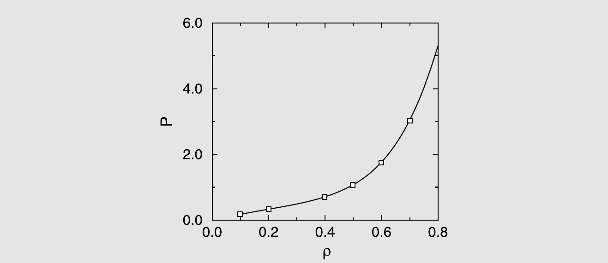

    *图 6.3　从 $NPT$ 模拟获得的 Lennard-Jones 流体的状态方程；$T = 2.0$ 的等温线。实线是 Johnson 等人[[83]](references.md#ref-83) 的状态方程，方块是模拟结果（$N = 108$）。*

    在分子液体的真实模型模拟中，重要的是验证模型流体在标准大气压下具有与真实流体相同的密度。使用 $NVT$ 模拟，需要进行多次模拟才能确定压力约为 1 atm 时的密度。在 $NPT$ 模拟中，一次模拟即可获得此结果。在约化单位中，大气压通常远小于 1。因此，$P = 0$ 的 $NPT$ 模拟可以很好地给出大气压下液体密度的初步估计。{ 注：严格来说，液体在 $P = 0$ 时只是亚稳态。然而，由于气泡形成的成核势垒通常远大于 $k_B T$，这种亚稳态的寿命通常远长于模拟时间。}

    生成此例的 Fortran 代码可在在线 SI 中找到，案例研究 7。

???+ example "例 9（从恒定压力模拟获得相平衡）"

    在例 1 和例 7 中，$NVT$ 或 $NPT$ 模拟被用于确定纯物质的状态方程。原则上，我们可以先拟合模拟数据到解析表达式，然后确定 $P$、$T$ 和 $\mu$ 相同时的液体和蒸气密度来构建液-气共存曲线。虽然这条路线定位共存曲线是非常通用的，但它需要许多模拟。更有效的确定气-液共存曲线的方法在第 6.6 节中讨论。然而，在液体蒸气压很小（在约化单位中 $\ll 1$）的情况下，我们可以通过在零压力下进行模拟来确定共存液体的密度。

    进行零压力的 $NPT$ 模拟时，最好从高于估计共存密度的液体密度开始。在模拟过程中，系统将快速达到 $P = 0$ 的（亚稳态）密度。然而，从较低密度开始是不推荐的，因为系统可能会无限制地膨胀。

    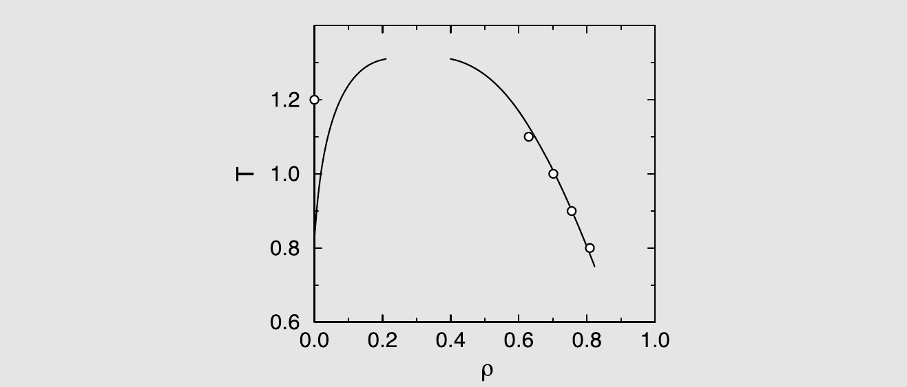

    *图 6.4　Lennard-Jones 流体的气-液共存曲线；实线使用 Johnson 状态方程[[83]](references.md#ref-83) 计算。圆圈表示从 $P = 0$ 的 $NPT$ 模拟获得的平均液体密度。从图中可以看出，零压方法在 $T > 1.2$ 时变得不太可靠。*

    图 6.4 表明，零压力模拟中获得的密度与 Lennard-Jones 流体的真实状态方程吻合良好，直到约化温度 1，但当蒸气的平衡密度变得不可忽略时则不然：对于 $T > 1$，零压力模拟预测的液体密度偏低。此外，随着临界温度 $T_c$ 的接近，表面张力趋于零，因此气泡成核变得更加可能。在这些条件下，$P = 0$ 的亚稳液体在模拟过程中蒸发变得越来越可能。简而言之：不要在接近 $T_c$ 时使用 $P = 0$ 模拟。从更积极的角度来看：在不太接近临界温度时，通过在 $P = 0$ 下进行 $NPT$ 模拟可以获得液体密度的合理估计。

    生成此例的 Fortran 代码可在在线 SI 中找到，案例研究 8。

如公式 (6.3.19) 以下所解释的，$\mathcal{N}(V)$——找到系统具有体积 $V$ 的概率密度——与 $\exp[-\beta(F(V) + PV)]$ 成正比。对于给定的温度，这个概率密度原则上可以通过从单次恒定压力模拟中构建在模拟过程中观察到某个体积 $V$ 的次数的直方图来获得。

一旦我们获得了 $\mathcal{N}(V)$，就可以通过对以下表达式进行公切线构造来获得共存体积（以及密度）：

$$
\ln \mathcal{N}(V) = \beta[F(V) + PV].
$$

这种广泛使用的构造方法背后的思想是，如果曲线 $\ln \mathcal{N}(V)$ 随 $V$ 变化的两个点具有相同的斜率，那么它们具有相同的压力。如果它们具有相同的截距，则具有相同的化学势。因此，如果两个点有公切线，那么这些点具有相同的 $\mu$、$P$ 和 $T$ 值，因此它们处于平衡状态。在实践中，除非使用特殊的采样技术（参见第 8.6.6 节），从 $\mathcal{N}(V)$ 导出 $F(V)$ 的直方图方法仅在临界点附近有效[[163,175–177]](references.md#ref-163)。然而，非常接近临界点时，由于不可约的涨落效应，公切线方法也会失效。

## 等温等张力系综

$NPT$-MC 方法对于均匀流体是稳健的。然而，对于固体和非均匀系统，模拟盒中的各向同性体积变化可能不足以确保平衡。例如，对于非立方晶体，单胞的平衡形状可能随温度变化。如果模拟盒的形状固定，温度变化时固体中会产生应力。固定盒形状在从一个晶相转变到另一个晶相的情况下问题更大。应当注意，一般来说，固-固相变可能涉及单胞中粒子数的变化或其他剧烈变化，不能在具有相同数量或排列的单胞的模拟中研究。然而，某些固-固相变，即所谓位移型相变，涉及晶胞形状的变化，而单胞中粒子仅有微小位移。即便如此，如果单胞形状固定，大多数位移型相变无法在模拟中研究。

为了研究晶胞形状的“位移型”变化，模拟盒的形状应能自由变化，使得固体可以保持无应力而不产生缺陷。

在 MD 模拟的背景下，这个问题首先由 Parrinello 和 Rahman [[178,179]](references.md#ref-178) 解决，他们发展了 Andersen [[180]](references.md#ref-180) 引入的恒定压力分子动力学技术的扩展，以模拟恒定应力下的固体。在流体中，应力 $\boldsymbol{\sigma}$ 就是负的静水压力，但在固体中 $\boldsymbol{\sigma}$ 可以有六个独立分量：三个压缩/拉伸应力和三个剪切应力。

Parrinello-Rahman 方法向 Monte Carlo 模拟的扩展由 Najafabadi 和 Yip [[169]](references.md#ref-169) 完成，这一扩展是直截了当的。事实上，文献[[169]](references.md#ref-169) 的方法比原始的 MD 方法更简单。

为了解释恒定应力方法，将传统恒定压力 MC 的坐标标度推广到非立方（平行六面体）盒子的情况是有用的。在这种情况下，$\mathbf{s}$ 和 $\mathbf{r}$ 之间的变换由矩阵 $\mathbf{h}$ 给出：

$$
r_\alpha = h_{\alpha\beta} s_\beta.
\tag{6.4.1}
$$

模拟盒的体积 $V$ 等于 $|\det \mathbf{h}|$。如果模拟盒是立方体，变换矩阵 $\mathbf{h}$ 是对角矩阵，所有对角元素等于 $L$，公式 (6.4.1) 就等同于公式 (6.3.2)。

不失一般性，我们可以选择 $\mathbf{h}$ 为具有六个独立分量的对称矩阵。[^2] 改变 $\mathbf{h}$ 矩阵的独立元素会使该平行六面体改变其大小和/或形状。[^3]

恒定应力模拟和恒定压力模拟的区别在于，玻尔兹曼因子中的 $PV$ 项被 $V_0 \text{Tr} \, \boldsymbol{\epsilon} : \boldsymbol{\sigma}$ 取代，其中 $V_0 = |\text{Det} \, \mathbf{h}_0|$ 是未变形盒子的体积[[169]](references.md#ref-169)。对于非线性效应可能重要的较大应变情况的正确描述，参见文献[[181,182]](references.md#ref-181)。

在恒定应力模拟中，我们除了标度粒子坐标外，还采样 $\mathbf{h}$ 矩阵的独立元素。由于变形没有自然的度量，采样度量张量 $\mathbf{G} = \mathbf{h}^T \mathbf{h}$ 的元素（其中 $\mathbf{h}^T$ 是 $\mathbf{h}$ 的转置）同样是合理的，但并非完全等价。

在各向同性（静水）施加压力的情况下，恒定应力 Monte Carlo 方法与恒定压力 Monte Carlo 几乎等价。[^4]

#### 弹性常数

恒定应力方法的一个明显应用是测量固体的弹性常数 $C_{\alpha\beta\gamma\delta}$，使用 $\sigma_{\alpha\beta} = C_{\alpha\beta\gamma\delta} \epsilon_{\gamma\delta}$。在实践中，恒定应力模拟测量的是弹性柔度，即张量 $C_{\alpha\beta\gamma\delta}$ 的逆。关于弹性常数的更多细节，参见附录 F.4。

## 巨正则系综

强度热力学变量 $P$、$T$ 和所有组分的 $\mu_i$ 是线性相关的（公式 (2.1.17)）。特别地，在恒定温度下，我们有

$$
N \mathrm{d}\mu = V \mathrm{d}P.
\tag{6.5.1}
$$

这意味着在恒定温度下改变 $P$ 将改变系统的密度从而改变 $\mu$，或者反过来，改变 $\mu$ 改变 $P$。因此，我们可以使用 $P$ 或 $\mu$ 作为强度控制变量。上面，我们讨论了以 $P$ 为控制变量的模拟技术，此时体积可以变化而粒子数固定。我们也可以以 $\mu$ 为控制变量，此时 $N$ 可以变化而 $V$ 固定。但是，我们能在恒定 $\mu$ 下进行模拟并不意味着我们应该这样做。事实证明，有许多情况我们无法使用恒定 $NPT$ 方法，但可以进行恒定 $\mu VT$ 的模拟。例如，

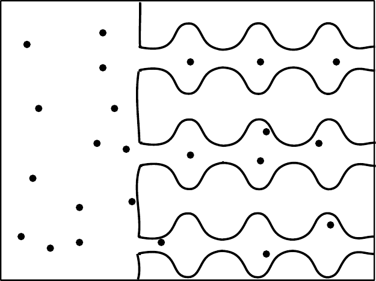

*图 6.5　吸附剂（例如沸石）与气体直接接触。*

我们不能使用标准的 $NPT$ 方法来处理管道、狭缝或多孔基质内的分子；在多孔材料中，体积变化移动会试图改变基质的体积，而基质通常是几乎不可压缩的：由于基质会承受应力，孔内的分子不会“感受到”施加的压力。当然，我们可以将多孔基质与一个流体储库接触，在储库中我们可以施加压力（参见图 6.5）。然而，在这种情况下，我们将在系统中引入界面，这通常会导致严重的有限尺寸效应。稍后我们将遇到特别关注此类界面性质的情况。

注意，一般来说，多孔基质（如沸石）内流体的压力在热力学上不是良定义的。相比之下，化学势仍然是良定义的，并且我们可以将此化学势与多孔介质外部流体的压力关联起来。在我们模拟与储库接触的多孔介质的情况下，我们应该预期平衡是缓慢的。事实上，由于多孔介质中的缓慢扩散，真实吸附实验中的平衡可能需要几分钟、几小时或更长时间，取决于气体分子的类型。同样的缓慢扩散也会减慢吸附模拟的进行。

通过在恒定 $\mu$、$V$ 和 $T$ 下进行模拟，我们可以避免上述大部分问题，因为粒子可以在多孔介质内部的任何位置被添加/移除，尽管恒定 $\mu VT$ 技术在高（液体）密度下竞争力下降。简而言之：对于研究吸附现象，恒定 $\mu VT$（“巨正则”）系综优于其他系综。

为方便起见，我们将考虑周期性重复系统的恒定 $\mu VT$ 系综（参见图 6.6）。系统中吸附质粒子的数量可以通过添加和删除来改变。系统的体积保持固定，温度和化学势被施加。重要的是，在模拟过程中粒子数被允许涨落。

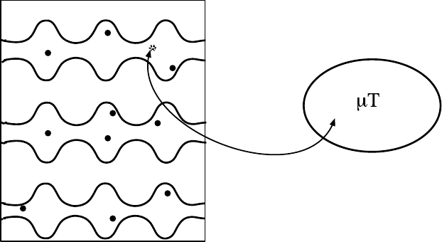

*图 6.6　吸附剂与一个通过交换粒子和能量来施加恒定化学势和温度的储库接触。*

### 统计力学基础

巨正则 Monte Carlo 方法由 Norman 和 Filinov [[170]](references.md#ref-170) 针对经典流体的情况开创，并被许多其他研究组扩展[[171,183–190]](references.md#ref-171)。为了解释巨正则 Monte Carlo 技术的统计力学基础，我们回到第 6.3 节的公式 (6.3.5)。

公式 (6.3.5) 表示体积 $V$ 中 $N$ 个相互作用粒子和储库体积 $V_0$ 中 $M - N$ 个分子的组合系统的配分函数：

$$
Q(N, M, V, V_0, T) = e^{-\beta F_R(M-N, V_0, T)} \frac{V^N e^{\beta\mu N}}{\Lambda^{3N} N!} \int_V \mathrm{d}\mathbf{s}^N e^{-\beta \mathcal{U}(\mathbf{s}^N; L)}.
\tag{6.5.2}
$$

我们将允许系统和储库交换粒子（参见图 6.7）。在 $V_0 \to \infty$、$M \to \infty$、$(M - N)/V_0 \to \rho$ 的极限下，我们可以写出

$$
\begin{aligned}
F_R(M - N, V_0, T) &= F_R(M, V_0, T) + N \left(\frac{\partial F_R(M - N, V_0, T)}{\partial N}\right)_{N=0}\\
&= F_R(M, V_0, T) - \mu N.
\end{aligned}
\tag{6.5.3}
$$

组合配分函数，通常用符号 $\Xi$ 表示，于是可以写为

$$
\Xi(\mu, V, T) \equiv \sum_{N=0}^{\infty} \frac{V^N \exp(\beta\mu N)}{\Lambda^{3N} N!} \int \mathrm{d}\mathbf{s}^N \exp[-\beta \mathcal{U}(\mathbf{s}^N; L)],
\tag{6.5.4}
$$

其中我们省略了常数因子 $\exp[-\beta F_R(M, V_0, T)]$。

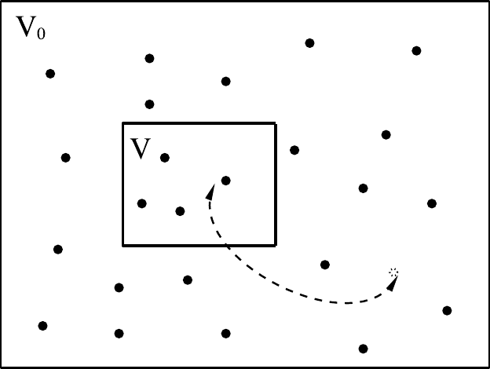

*图 6.7　体积为 $V_0$ 的储库可以与体积为 $V \ll V_0$ 的系统交换粒子。我们用 $N$ 表示系统中（涨落的）粒子数。对于该 $N$ 值，储库包含 $M - N$ 个粒子。*

公式 (6.5.4) 可以作为巨正则模拟的出发点。然而，与储库施加的压力或温度不同，化学势只精确到一个任意常数。因此，最好用储库的可观测平衡性质来表示化学势。由于储库的精确性质并不重要，我们考虑一个包含与体积 $V$ 中系统相同分子的理想气体储库。然后我们可以定义分子体系的逸度 $f$ 为储库中的数密度，其中不同分子之间不相互作用，但所有分子内相互作用保持不变。[^5] 在统计热力学教科书中，逸度通常被视为一种方便但纯理论的概念。然而，在模拟中，如果我们愿意的话，确实可以关闭储库中分子间的相互作用。

现在让我们将 $\mu$ 与 $f$ 联系起来。分子气体在密度 $\rho$ 时的化学势的完整表达式为：

$$
\mu_g = k_B T \ln \left[\frac{\Lambda^3 \rho}{q_{\text{int}}(T)}\right],
\tag{6.5.5}
$$

其中 $q_{\text{int}}(T)$ 是由于转动、振动等产生的分子配分函数的分子内部分。

下面，我们首先考虑分子间相互作用不依赖于分子内自由度的情况。之后，我们考虑分子间相互作用依赖于某些内自由度的情况。

#### 不耦合的内自由度

如果分子的内自由度不影响其分子间相互作用，我们可以利用理想气体化学势 $\mu^{\text{id gas}}$ 可以写为

$$
\mu^{\text{id gas}} = k_B T \ln \left[\frac{\Lambda^3}{q_{\text{int}}(T)}\right] + k_B T \ln \rho^{\text{id gas}} \equiv \mu^{-\circ} + k_B T \ln \rho^{\text{id gas}}.
\tag{6.5.6}
$$

类似地，相互作用系统的化学势为

$$
\mu^{\text{sys}} = \mu^{-\circ} + k_B T \ln \rho^{\text{sys}} + \mu^{\text{ex}},
\tag{6.5.7}
$$

因此，对于与相互作用系统处于平衡的密度（$=$ 逸度）为 $f$ 的理想气体，我们有：

$$
k_B T \ln \rho^{\text{sys}} + \mu^{\text{ex}} = k_B T \ln f.
\tag{6.5.8}
$$

上述表达式的优点是 $\mu^{-\circ}$ 中的无关项已经消去了。[^6]

我们现在可以将巨正则配分函数重写为

$$
\Xi(f, V, T) \equiv \sum_{N=0}^{\infty} \frac{(f V)^N}{N!} \int \mathrm{d}\mathbf{s}^N \exp[-\beta \mathcal{U}(\mathbf{s}^N; L)],
\tag{6.5.9}
$$

对应的特定 $N$ 粒子构型的概率密度为

$$
\mathcal{N}_{f,V,T}(\mathbf{s}^N; L) \propto \frac{(f V)^N}{N!} \exp[-\beta \mathcal{U}(\mathbf{s}^N; L)].
\tag{6.5.10}
$$

现在考虑一个试探移动，我们尝试将一个粒子从储库移动到体积 $V$ 中的任意位置。我们应当确保构造的底层马尔可夫链满足微观可逆性。此外，我们选择使添加和移除粒子的试探移动概率相等。将粒子移动到或从体积 $V$ 移出的试探移动的接受概率必须被选择为使得具有 $N+1$ 和 $N$ 个粒子的状态以公式 (6.5.10) 中相应概率密度的比值给出的相对概率被访问：

$$
\frac{\mathcal{N}_{f,V,T}(\mathbf{s}^{N+1}; L)}{\mathcal{N}_{f,V,T}(\mathbf{s}^N; L)} = \frac{f V}{(N + 1)} \exp\left\{-\beta\left[\mathcal{U}(\mathbf{s}^{N+1}; L) - \mathcal{U}(\mathbf{s}^N; L)\right]\right\}.
\tag{6.5.11}
$$

注意，在这个概率比值中，所有对储库的显式引用都已消失。同样重要的是，隐藏在热 de Broglie 波长 $\Lambda$ 中的普朗克常数也已消失，这正是经典模拟中应有的情况。

#### 耦合的内自由度

对于许多分子体系，分子间相互作用依赖于分子的内自由度。例如，分子间的相互作用通常取决于它们的取向，或分子构象（例如顺式或反式）。在这种情况下，我们仍然可以使用上述巨正则方案。然而，我们需要按照与分子内能相关的玻尔兹曼权重从储库中采样要插入的分子。我们在第 6.5.3 节中讨论这种情况。

### Monte Carlo 模拟

在巨正则模拟中，我们需要采样分布 (6.5.10)。可接受的试探移动包括：

1. 粒子位移。随机选择一个粒子并赋予新的构象：例如，在原子的情况下，给予随机位移。此移动以如下概率被接受
   $$
   \text{acc}(\mathbf{s} \to \mathbf{s}') = \min\left(1, \exp\{-\beta[\mathcal{U}(\mathbf{s}'^N) - \mathcal{U}(\mathbf{s}^N)]\}\right).
   \tag{6.5.12}
   $$
1. 粒子的插入和移除。在随机位置插入一个粒子或移除随机选择的粒子。由公式 (6.5.11) 可得，粒子插入的有效（Metropolis 风格）接受规则为
   $$
   \text{acc}(N \to N + 1) = \min\left(1, \frac{f V}{(N + 1)} \exp\{-\beta[\mathcal{U}(N + 1) - \mathcal{U}(N)]\}\right)
   \tag{6.5.13}
   $$
   粒子移除以如下概率被接受
   $$
   \text{acc}(N \to N - 1) = \min\left(1, \frac{N}{f V} \exp\{-\beta[\mathcal{U}(N - 1) - \mathcal{U}(N)]\}\right).
   \tag{6.5.14}
   $$

算法 13 展示了巨正则系综中模拟的基本结构。

**算法 13　基本巨正则系综模拟**

<table class="algbox" markdown="1">
<tbody markdown="1">
<tr markdown="1"><td class="algcode" markdown="span"><code>program&nbsp;mc_gc</code></td><td class="algcom" markdown="span">恒定 $fVT$ 的 MC 程序</td></tr>
<tr markdown="1"><td class="algcode" markdown="span"><code>for&nbsp;1&nbsp;&lt;=&nbsp;icycl&nbsp;&lt;=&nbsp;ncycl&nbsp;do</code></td><td class="algcom" markdown="span">执行 ncycl 个 MC 循环</td></tr>
<tr markdown="1"><td class="algcode" markdown="span"><code>&nbsp;&nbsp;&nbsp;&nbsp;</code><code>ran=int(R*(npav+nexc))+1</code></td><td class="algcom" markdown="span"></td></tr>
<tr markdown="1"><td class="algcode" markdown="span"><code>&nbsp;&nbsp;&nbsp;&nbsp;</code><code>if&nbsp;ran&nbsp;&lt;=&nbsp;npav&nbsp;then</code></td><td class="algcom" markdown="span"></td></tr>
<tr markdown="1"><td class="algcode" markdown="span"><code>&nbsp;&nbsp;&nbsp;&nbsp;&nbsp;&nbsp;&nbsp;&nbsp;</code><code>mcmove</code></td><td class="algcom" markdown="span">尝试移动一个粒子</td></tr>
<tr markdown="1"><td class="algcode" markdown="span"><code>&nbsp;&nbsp;&nbsp;&nbsp;</code><code>else</code></td><td class="algcom" markdown="span"></td></tr>
<tr markdown="1"><td class="algcode" markdown="span"><code>&nbsp;&nbsp;&nbsp;&nbsp;&nbsp;&nbsp;&nbsp;&nbsp;</code><code>mcexc</code></td><td class="algcom" markdown="span">尝试与储库交换粒子</td></tr>
<tr markdown="1"><td class="algcode" markdown="span"><code>&nbsp;&nbsp;&nbsp;&nbsp;</code><code>endif</code></td><td class="algcom" markdown="span"></td></tr>
<tr markdown="1"><td class="algcode" markdown="span"><code>&nbsp;&nbsp;&nbsp;&nbsp;</code><code>if&nbsp;icycl&nbsp;%&nbsp;nsamp&nbsp;==&nbsp;0&nbsp;then</code></td><td class="algcom" markdown="span"></td></tr>
<tr markdown="1"><td class="algcode" markdown="span"><code>&nbsp;&nbsp;&nbsp;&nbsp;&nbsp;&nbsp;&nbsp;&nbsp;</code><code>sample</code></td><td class="algcom" markdown="span">采样可观测量</td></tr>
<tr markdown="1"><td class="algcode" markdown="span"><code>&nbsp;&nbsp;&nbsp;&nbsp;</code><code>endif</code></td><td class="algcom" markdown="span"></td></tr>
<tr markdown="1"><td class="algcode" markdown="span"><code>enddo</code></td><td class="algcom" markdown="span"></td></tr>
<tr markdown="1"><td class="algcode" markdown="span"><code>[...]</code></td><td class="algcom" markdown="span">计算可观测量的平均值</td></tr>
<tr markdown="1"><td class="algcode" markdown="span"><code>end&nbsp;program</code></td><td class="algcom" markdown="span"></td></tr>
</tbody>
</table>

**具体说明**（一般说明见第 1 章「算法」）：

1. 通过随机选择粒子，算法满足微观可逆性，因为正向和反向试探移动概率相等。整个算法满足细致平衡。每轮我们（平均）执行 `npav` 次粒子移动尝试和 `nexc` 次与储库交换粒子的尝试。
1. 函数 **mcmove** 执行试探位移（算法 2），函数 **mcexc** 尝试与储库交换粒子（算法 14），函数 **sample** 每 `nsamp` 轮采样感兴趣的可观测量。
1. 在巨正则系综中，系统的状态通常由 $\mu$、$V$、$T$ 表征。然而，出于第 6.5.1 节（公式 (6.5.8)）中解释的原因，我们在 **mcexc** 中使用逸度 $f$ 而非化学势 $\mu$ 作为控制变量。

**算法 14　尝试与储库交换粒子**

<table class="algbox" markdown="1">
<tbody markdown="1">
<tr markdown="1"><td class="algcode" markdown="span"><code>function&nbsp;mcexc</code></td><td class="algcom" markdown="span">尝试与储库交换一个粒子</td></tr>
<tr markdown="1"><td class="algcode" markdown="span"><code>if&nbsp;R&nbsp;&lt;&nbsp;0.5&nbsp;then</code></td><td class="algcom" markdown="span">决定移除还是添加一个粒子</td></tr>
<tr markdown="1"><td class="algcode" markdown="span"><code>&nbsp;&nbsp;&nbsp;&nbsp;</code><code>if&nbsp;npart&nbsp;==&nbsp;0&nbsp;return</code></td><td class="algcom" markdown="span">只有 npart>0 才能移除粒子</td></tr>
<tr markdown="1"><td class="algcode" markdown="span"><code>&nbsp;&nbsp;&nbsp;&nbsp;</code><code>o=int(npart*R)+1</code></td><td class="algcom" markdown="span">选出待移除的粒子</td></tr>
<tr markdown="1"><td class="algcode" markdown="span"><code>&nbsp;&nbsp;&nbsp;&nbsp;</code><code>eno&nbsp;=&nbsp;ener(x(o),o)</code></td><td class="algcom" markdown="span">粒子 o 的能量</td></tr>
<tr markdown="1"><td class="algcode" markdown="span"><code>&nbsp;&nbsp;&nbsp;&nbsp;</code><code>arg=npart*exp(beta*eno)</code></td><td class="algcom" markdown="span"></td></tr>
<tr markdown="1"><td class="algcode" markdown="span"><code>&nbsp;&nbsp;&nbsp;&nbsp;</code><code>/(f*vol)</code></td><td class="algcom" markdown="span"></td></tr>
<tr markdown="1"><td class="algcode" markdown="span"><code>&nbsp;&nbsp;&nbsp;&nbsp;</code><code>if&nbsp;R&nbsp;&lt;&nbsp;arg&nbsp;then</code></td><td class="algcom" markdown="span">接受规则 (6.5.14)</td></tr>
<tr markdown="1"><td class="algcode" markdown="span"><code>&nbsp;&nbsp;&nbsp;&nbsp;&nbsp;&nbsp;&nbsp;&nbsp;</code><code>x(o)=x(npart)</code></td><td class="algcom" markdown="span">接受：移除粒子 o</td></tr>
<tr markdown="1"><td class="algcode" markdown="span"><code>&nbsp;&nbsp;&nbsp;&nbsp;&nbsp;&nbsp;&nbsp;&nbsp;</code><code>npart=npart-1</code></td><td class="algcom" markdown="span"></td></tr>
<tr markdown="1"><td class="algcode" markdown="span"><code>&nbsp;&nbsp;&nbsp;&nbsp;</code><code>endif</code></td><td class="algcom" markdown="span"></td></tr>
<tr markdown="1"><td class="algcode" markdown="span"><code>else</code></td><td class="algcom" markdown="span"></td></tr>
<tr markdown="1"><td class="algcode" markdown="span"><code>&nbsp;&nbsp;&nbsp;&nbsp;</code><code>xn=R*box</code></td><td class="algcom" markdown="span">在随机位置放入新粒子</td></tr>
<tr markdown="1"><td class="algcode" markdown="span"><code>&nbsp;&nbsp;&nbsp;&nbsp;</code><code>enn&nbsp;=&nbsp;ener(xn,&nbsp;npart+1)</code></td><td class="algcom" markdown="span">插入在 xn 处的粒子的能量</td></tr>
<tr markdown="1"><td class="algcode" markdown="span"><code>&nbsp;&nbsp;&nbsp;&nbsp;</code><code>arg=f*vol*exp(-beta*enn)</code></td><td class="algcom" markdown="span"></td></tr>
<tr markdown="1"><td class="algcode" markdown="span"><code>&nbsp;&nbsp;&nbsp;&nbsp;</code><code>/(npart+1)</code></td><td class="algcom" markdown="span"></td></tr>
<tr markdown="1"><td class="algcode" markdown="span"><code>&nbsp;&nbsp;&nbsp;&nbsp;</code><code>if&nbsp;R&nbsp;&lt;&nbsp;arg&nbsp;then</code></td><td class="algcom" markdown="span">接受规则 (6.5.13)</td></tr>
<tr markdown="1"><td class="algcode" markdown="span"><code>&nbsp;&nbsp;&nbsp;&nbsp;&nbsp;&nbsp;&nbsp;&nbsp;</code><code>x(npart+1)=xn</code></td><td class="algcom" markdown="span">接受：添加新粒子</td></tr>
<tr markdown="1"><td class="algcode" markdown="span"><code>&nbsp;&nbsp;&nbsp;&nbsp;&nbsp;&nbsp;&nbsp;&nbsp;</code><code>npart=npart+1</code></td><td class="algcom" markdown="span"></td></tr>
<tr markdown="1"><td class="algcode" markdown="span"><code>&nbsp;&nbsp;&nbsp;&nbsp;</code><code>endif</code></td><td class="algcom" markdown="span"></td></tr>
<tr markdown="1"><td class="algcode" markdown="span"><code>endif</code></td><td class="algcom" markdown="span"></td></tr>
<tr markdown="1"><td class="algcode" markdown="span"><code>end&nbsp;function</code></td><td class="algcom" markdown="span"></td></tr>
</tbody>
</table>

**具体说明**（一般说明见第 1 章「算法」）：

1. `f` 表示分子的逸度，可以解释为与系统处于平衡的相同分子的假设理想气体的密度，该理想气体充当储库。
1. 函数 **ener** 计算粒子在给定位置的能量。对于添加操作，我们给粒子标记 `npart+1`，这是如果移动被接受它将保持的标记。

**算法的合理性证明**

验证接受规则 (6.5.12)–(6.5.14) 确实导致对公式 (6.5.10) 给出分布的采样是有益的。考虑一个移动，我们从具有 $N$ 个粒子的构型出发，通过在系统中插入一个粒子移动到具有 $N+1$ 个粒子的构型。我们需要证明满足细致平衡：

$$
\mathcal{K}(N \to N + 1) = \mathcal{K}(N + 1 \to N),
\tag{6.5.15}
$$

其中

$$
\mathcal{K}(N \to N + 1) = \mathcal{N}(N) \times \alpha(N \to N + 1) \times \text{acc}(N \to N + 1).
\tag{6.5.16}
$$

在算法 13 中，每个 Monte Carlo 步尝试移除粒子的概率等于尝试添加粒子的概率：

$$
\alpha_{\text{gen}}(N \to N + 1) = \alpha_{\text{gen}}(N + 1 \to N),
\tag{6.5.17}
$$

其中下标“gen”表示 $\alpha$ 测量的是生成此试探移动的概率。将此式连同公式 (6.5.10) 代入细致平衡条件，得到

$$
\begin{aligned}
\frac{\text{acc}(N \to N + 1)}{\text{acc}(N + 1 \to N)} &= \frac{(f V)^{N+1} \exp[-\beta \mathcal{U}(\mathbf{s}^{N+1}; L)]}{(N + 1)!} \times \frac{N! \exp[\beta \mathcal{U}(\mathbf{s}^N; L)]}{(f V)^N}\\
&= \frac{f V}{N + 1} \exp\{-\beta[\mathcal{U}(\mathbf{s}^{N+1}; L) - \mathcal{U}(\mathbf{s}^N; L)]\}.
\end{aligned}
$$

可以直接证明接受规则 (6.5.13) 和 (6.5.14) 满足此条件。

???+ example "例证 4（沸石的吸附等温线）"

    沸石是形成三维微孔网络的无机晶体聚合物（参见图 6.8）。这些孔道可以被各种客体分子进入。巨大的内表面积、热稳定性以及数千个酸性位点使沸石成为石油化工应用中重要的一类催化材料。为了合理使用沸石，必须详细了解沸石孔道内吸附分子的行为。由于这类信息很难通过实验获得，模拟是一种有吸引力的替代方法。最早尝试研究沸石中吸附分子热力学性质的工作之一是由 Stroud 等人[[191]](references.md#ref-191) 完成的。沸石计算机模拟各种应用的综述可以在文献[[192,193]](references.md#ref-192) 中找到。

    除了沸石之外，还有许多其他多孔材料具有许多有趣的性质。文献[[194]](references.md#ref-194) 给出了这些材料中相分离的综述。

    对于甲烷或惰性气体等小吸附质，巨正则 Monte Carlo 模拟可以用于计算各种沸石中的吸附等温线[[195–201]](references.md#ref-195)。图 6.9 展示了甲烷在 silicalite 沸石中吸附等温线的一个例子。这些计算基于 Goodbody 等人[[197]](references.md#ref-197) 的模型。与实验数据的一致性非常好，这表明对于这些表征良好的系统，模拟可以给出与实验相当的数据。

    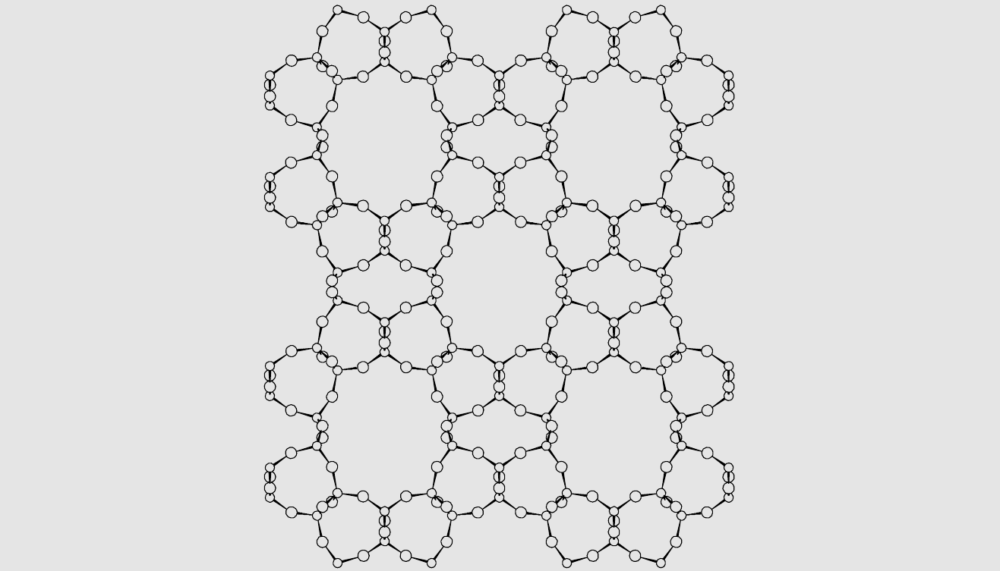

    *图 6.8　沸石结构的一个例子（Theta-1），其孔径约为 $4.4 \times 5.5$ Å$^2$。Si 原子有四个键，O 原子有两个键。*

    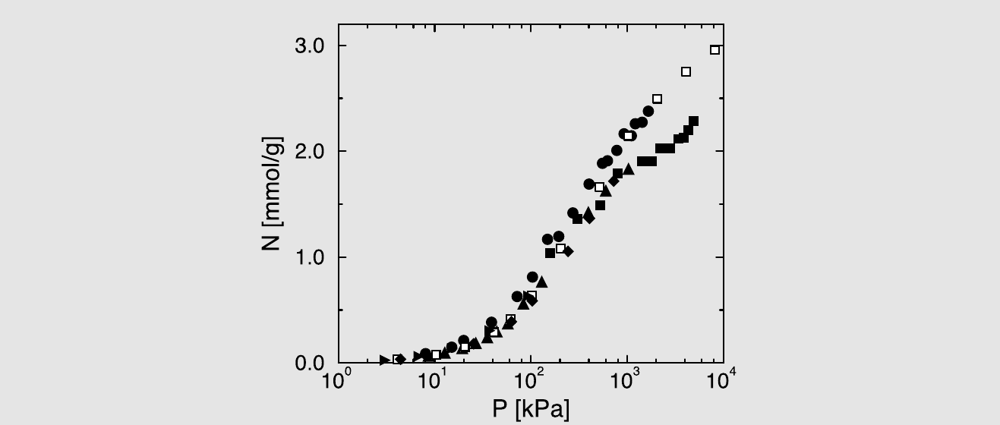

    *图 6.9　甲烷在 silicalite 中的吸附等温线，显示甲烷吸附量随外压的变化。黑色符号为实验数据（详见文献[[202]](references.md#ref-202)）。空心方块为使用文献[[197]](references.md#ref-197) 的模型进行的巨正则模拟结果。*

    对于长链烷烃（丁烷及更长），进行成功插入非常困难；在几乎所有尝试中，分子的某个原子会与沸石的某个原子重叠。因此，尝试次数必须天文数字般大才能获得合理数量的成功交换。在第 12 章中，我们将展示如何解决这个问题。

### 分子体系

为了讨论具有影响分子间相互作用的内自由度的分子体系的巨正则 MC，将处于同一内部状态 $i$ 的所有分子视为具有分子内能 $\epsilon_i$ 的独立物种是有用的。由于假设包含 $M$ 个分子的理想气体储库处于热平衡，状态 $i$ 的副本数为 $N_i^0 = M e^{-\beta\epsilon_i}/q(T)$，其中 $q(T) \equiv \sum_i e^{-\beta\epsilon_i}$ 表示分子内配分函数。我们可以将组合系统的配分函数写为

$$
\begin{aligned}
Q(M, V_0, V, T) = \frac{(V_0 q(T))^M}{\Lambda^{3M} \prod_i N_i^0!} \times{}
&\sum_{\{N_i\}=0}^{\infty} \prod_i \frac{V^{N_i} N_i^0!}{V_0^{N_i} (N_i^0 - N_i)! N_i!}\\
&\times \int \mathrm{d}\mathbf{s}^N \exp[-\beta \mathcal{U}(\mathbf{s}^N; L)].
\end{aligned}
\tag{6.5.18}
$$

在公式 (6.5.18) 中，我们省略了一个因子 $\exp[-\beta \sum_i N_i^0 \epsilon_i]$，因为它不依赖于分子是在储库中还是系统中。现在我们利用当 $M \to \infty$ 时 $N_i^0 \gg N_i$ 这一事实，因此

$$
\begin{aligned}
Q(M, V_0, V, T) = \frac{(V_0 q(T))^M}{\Lambda^{3M} \prod_i N_i^0!} \times{}
&\sum_{\{N_i\}=0}^{\infty} \prod_i \frac{V^{N_i} (N_i^0/V_0)^{N_i}}{N_i!}\\
&\times \int \mathrm{d}\mathbf{s}^N \exp[-\beta \mathcal{U}(\mathbf{s}^N; L)].
\end{aligned}
\tag{6.5.19}
$$

此外，$N_i^0 = M e^{-\beta\epsilon_i}/q(T)$，因此利用 $M/V_0 \equiv f$，并省略常数前置因子 $(V_0 q(T)/\Lambda^3)^M / \prod_i (N_i^0)!$，我们得到巨正则配分函数 $\Xi$ 为

$$
\Xi(f, V, T) = \sum_{\{N_i\}=0}^{\infty} \prod_i \frac{\left(f V e^{-\beta\epsilon_i}/q(T)\right)^{N_i}}{N_i!} \int \mathrm{d}\mathbf{s}^N \exp[-\beta \mathcal{U}(\mathbf{s}^N; L)],
\tag{6.5.20}
$$

因此概率分布 $\mathcal{N}_{f,V,T;\{N_i\}}(\mathbf{s}^N; L)$ 变为

$$
\mathcal{N}_{f,V,T;\{N_i\}}(\mathbf{s}^N; L) \propto \prod_i \frac{\left(f V e^{-\beta\epsilon_i}/q(T)\right)^{N_i}}{N_i!} \exp[-\beta \mathcal{U}(\mathbf{s}^N; L)].
\tag{6.5.21}
$$

细致平衡条件 $\mathcal{K}(N \to N + 1) = \mathcal{K}(N + 1 \to N)$ 现在意味着：

$$
\frac{\text{acc}(N_i \to N_i + 1)}{\text{acc}(N_i + 1 \to N_i)} = \frac{f V e^{-\beta\epsilon_i}}{q(T)(N_i + 1)} \times \exp\left[-\beta \Delta U_{N_i \to N_i+1}\right] \frac{\alpha(N_i \to N_i + 1)}{\alpha(N_i + 1 \to N_i)}.
\tag{6.5.22}
$$

由于我们按照玻尔兹曼权重采样理想气体储库中分子的内部状态，尝试将 $N_i$ 增加到 $N_i + 1$ 的试探移动的概率为 $\alpha(N_i \to N_i + 1) = \exp(-\beta\epsilon_i)/q(T)$。反过来，从系统中 $N + 1$ 个分子中随机选择移除 $i$ 类型分子的概率为 $\alpha(N_i + 1 \to N_i) = (N_i + 1)/(N + 1)$。

将这些尝试概率的表达式代入，我们得到一个非常简单的表达式

$$
\frac{\text{acc}(N_i \to N_i + 1)}{\text{acc}(N_i + 1 \to N_i)} = \frac{f V}{(N + 1)} \exp\left[-\beta \Delta U_{N_i \to N_i+1}\right].
\tag{6.5.23}
$$

注意，要插入/移除的分子的内能并没有出现在此表达式中。

然而，如果我们执行恒定 $N$ 的试探移动，尝试将随机选择的分子从状态 $i$ 变为状态 $j$，那么我们得到：

$$
\frac{\text{acc}(i \to j)}{\text{acc}(j \to i)} = e^{-\beta(\epsilon_j - \epsilon_i)} \exp\left[-\beta \Delta U_{N_i \to j}\right]
\tag{6.5.24}
$$

因此，在这种情况下，分子的内能必须包含在接受规则中。

#### 注释

在巨正则 Monte Carlo 模拟中，分子的逸度 $f$ 或等价的化学势 $\mu$ 是被施加的，而粒子数 $N$ 自由涨落。在模拟过程中，我们可以测量其他热力学量，如压力 $P$、平均密度 $\langle \rho \rangle$ 或内能 $\langle U \rangle$。由于我们施加了化学势，我们可以推导出所有其他热力学性质，如亥姆霍兹自由能或熵。这可能看起来令人惊讶，因为我们在第 3.2 节中论证了 Metropolis 采样不能用于采样绝对自由能及相关量。然而，用巨正则 Monte Carlo，我们似乎正在做这件事。答案是：事实上我们并没有。我们测量的不是绝对自由能而是相对自由能。在巨正则 Monte Carlo 中，我们将相互作用流体中分子的化学势等同于密度为 $\rho = f$ 的假设理想气体相中相同分子的化学势。[^7]

巨正则 Monte Carlo 方法在粒子添加或移除试探移动的接受概率变得非常小时会失效。对于原子流体，这个条件实际上将该方法可用的最大密度限制在约两倍临界密度。需要特殊技巧才能将 GCMC 方法扩展到稍高的密度[[188]](references.md#ref-188)。与恒定-$NPT$ 模拟不同，GCMC 可用于非均匀系统，例如包含界面的系统。

???+ example "例 10（Lennard-Jones 流体的状态方程 II）"

    在案例研究 1 和 7 中，我们分别使用 $NVT$ 和 $NPT$ 模拟计算了 Lennard-Jones 流体的状态方程。确定状态方程的第三种方法是进行巨正则模拟，在恒定 $V$ 下施加温度 $T$ 和化学势 $\mu$，并采样得到的密度和压力。图 6.10 展示了这种计算的一个例子。

    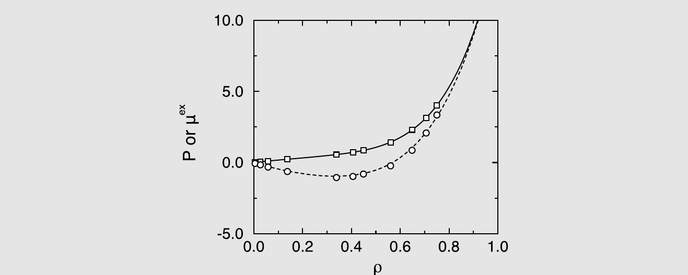

    *图 6.10　Lennard-Jones 流体的状态方程；$T = 2.0$ 的等温线。实线代表 Johnson 等人[[83]](references.md#ref-83) 的状态方程；方块是巨正则模拟的结果（体积 $V = 250.047$）。虚线是使用文献[[83]](references.md#ref-83) 的状态方程计算的超额化学势，圆圈是模拟结果。注意超额化学势通过 $\beta\mu^{\text{ex}} = \ln(f/\rho)$ 与逸度 $f$ 关联。*

    巨正则模拟对于计算均匀流体的状态方程并不是特别有用，因为压力和密度都会有统计误差。然而，对于压力本身无法良定义的系统（例如纳米多孔材料），巨正则模拟是首选方法。

    生成此例的 Fortran 代码可在在线 SI 中找到，案例研究 9。

虽然巨正则 Monte Carlo 技术可以应用于非球形分子的简单模型，但该方法对于多原子分子的中等密度流体变得低效，因为试探插入的接受概率变得非常低。在第 12.6.1 节中，我们讨论为解决此问题而设计的技术。

### 半巨正则系综

第 6.5.3 节中的讨论表明，巨正则 MC 方法可以容易地扩展到分子混合物。如果我们有一个与固定各物种逸度 $f_\alpha$ 的储库接触的物种 $\alpha = 1, 2, \cdots$ 的混合物，那么我们可以将巨正则配分函数 $\Xi$ 写为

$$
\Xi(\{f_\alpha\}, V, T) = \sum_{\{N_\alpha\}=0}^{\infty} \prod_\alpha \frac{[f_\alpha V]^{N_\alpha}}{N_\alpha!} \int \mathrm{d}\mathbf{s}^N \exp[-\beta \mathcal{U}(\mathbf{s}^N; L)].
\tag{6.5.25}
$$

然而，对于混合物，考虑另一种系综通常更有利，即所谓半巨正则系综，其中我们保持总粒子数 $N = \sum_\alpha N_\alpha$ 固定，但允许混合物的组成涨落，即我们允许 $\alpha \Leftrightarrow \beta$ 类型的试探移动。[^8]

半巨正则系综在研究混合物的（流体-流体）相平衡以及模拟化学相互转化的物种混合物方面有应用（参见例 11）。半巨正则 Monte Carlo（SGMC）模拟[[203]](references.md#ref-203) 对于模拟多分散体系也很有用，这在软物质科学中经常出现（参见例 12）。由于 SGMC 模拟涉及粒子交换而非插入或删除，它们通常可以在 GCMC 模拟因试探移动接受率低而失败的密度下进行。此外，SGMC 模拟可以在恒定压力而非恒定体积下进行，这在研究相共存时更有优势。

如第 8.5.3 节所述，与混合物中粒子身份改变相关的玻尔兹曼因子与参与交换的两种物种的超额化学势之差有关。即使测量单个物种超额化学势的粒子插入方法会失败，我们也可以获得 $\Delta\mu^{\text{ex}}$ 的良好统计，例如在置换无序晶体固体中的情况[[204]](references.md#ref-204)。标准的巨正则 Monte Carlo（GCMC）方法与粒子插入方法有大致相同的适用范围。因此，逻辑上可以推断应该可以构造一种基于粒子交换的模拟方案，这种方案在 GCMC 方案可能失败的密度下仍然有效（参见图 8.3）。

为了引入 SGMC 方法，我们从公式 (6.5.25) 出发，即 $n$ 组分混合物的巨正则配分函数 $\Xi$ 的表达式。注意在公式 (6.5.25) 中，对总粒子数 $N = \sum_{\alpha=1}^n N_\alpha$ 没有约束。

接下来，我们考虑公式 (6.5.25) 中 $N$ 值固定的一个项。一旦我们固定 $N$，$N_\alpha$ 就是线性相关的，因为它们的和是固定的。Kofke 和 Glandt [[203]](references.md#ref-203) 利用这种依赖性从公式 (6.5.25) 的求和中消去了一个 $N_\alpha$，比如 $N_1$。然而，由于通常没有明显的“优先”物种，我们采用另一种方式注意到

$$
\sum'_{N_1, \cdots, N_n} \prod_{\alpha=1}^n \frac{f_\alpha^{N_\alpha}}{N_\alpha!} = \frac{\left(\sum_{\alpha=1}^n f_\alpha\right)^N}{N!} \equiv \frac{f_{\text{tot}}^N}{N!},
\tag{6.5.26}
$$

其中 $\sum'$ 表示对满足 $\sum_{\alpha=1}^n N_\alpha = N$ 的所有 $N_\alpha$ 求和，$f_{\text{tot}}$ 是所有物种逸度之和。然后我们可以将公式 (6.5.25) 中的 $\Xi$ 表示为

$$
\Xi = \sum_{N=0}^{\infty} \frac{f_{\text{tot}}^N}{N!} \sum'_{N_1, \cdots, N_n} \prod_{\alpha=1}^n \frac{(f_\alpha V/f_{\text{tot}})^{N_\alpha}}{N_\alpha!} \int \mathrm{d}\mathbf{s}^N \exp[-\beta \mathcal{U}(\mathbf{s}^N)].
\tag{6.5.27}
$$

在下面的讨论中，我们定义逸度分数 $\xi$ 为 $\xi_\alpha = f_\alpha/f_{\text{tot}}$。$\xi_\alpha$ 可以看作是总逸度为 $f_{\text{tot}}$ 的理想气体储库中物种 $\alpha$ 的摩尔分数。

在分子体系 GCMC 的情况下，将系统视为不同物种的混合物很方便，其中每个内部状态 $i$ 对应不同的物种。现在我们做完全相反的事情：我们将所有 $n$ 个不同的物种视为同一粒子的不同表现形式，即：位于位置 $\mathbf{r}_i$ 的粒子可以具有 $n$ 种不同的身份。然后我们可以将对粒子数的求和 $\sum'$ 替换为对每个粒子可以具有的 $n$ 种身份的求和。

这听起来很奇怪，所以我们用一个类比来解释我们的意思。假设我们有 100 个人的群体，由三个组组成：食者、饮者和睡眠者。实际上，我们想考虑这些组的所有可能组合，约束是总数固定。一种组合可能是 30 个食者、30 个饮者和 40 个睡眠者。然后，我们发现：同一个人可以是食者、饮者或睡眠者，但不能同时是。现在我们对所有组合的求和变得不同了：我们有 100 个“人”，他们都可以具有三种可能身份中的任何一种。在这种情况下，我们有更多的方式来组成 30 个食者、30 个饮者和 40 个睡眠者的群体，即 $100!/(30! \, 30! \, 40!)$。如果我们希望求和中的总项数与之前相同，我们必须除以这个因子。

现在让我们将这个例子转回公式 (6.5.27) 中对粒子的求和。我们将对物种 $\alpha$ 粒子数的求和替换为对所有粒子所有可能身份的求和。但随后我们必须除以 $N!/\prod N_\alpha!$ 来修正过度计数。然后，公式 (6.5.27) 变为

$$
\begin{aligned}
\Xi(f_{\text{tot}}, \{\xi_\alpha\}, V, T) &= \sum_{N=0}^{\infty} \frac{f_{\text{tot}}^N}{N!} \sum_{\text{identities}} \prod_{\alpha=1}^n (V \xi_\alpha)^{N_\alpha} \int \mathrm{d}\mathbf{s}^N \exp[-\beta \mathcal{U}(\mathbf{s}^N)]\\
&\equiv \sum_{N=0}^{\infty} f_{\text{tot}}^N \mathcal{Y}(N, \{\xi_\alpha\}, V, T),
\end{aligned}
\tag{6.5.28}
$$

其中最后一个等式定义了一个新的配分函数 $Y$，它是 $N$、$\{\xi_\alpha\}$、$V$ 和 $T$ 的函数。在公式 (6.5.28) 中，“对身份的求和”意味着所有 $N$ 个粒子都可以具有所有 $n$ 种可能身份的求和。

注意 $Y(N, \{\xi_\alpha\}, V, T)$ 是具有恒定 $N$、$V$、$T$ 和 $\{\xi_\alpha\}$ 的系统的配分函数。利用 $k_B T \ln \Xi = PV$（公式 (2.3.21)）以及第 2.3.3 节中提到的最大项方法，可以得出 $k_B T \ln Y = PV - N k_B T \ln f_{\text{tot}}$。$Y(N, \{\xi_\alpha\}, V, T)$ 可以看作是恒定 $N$、$\{\xi_\alpha\}$、$V$ 和 $T$ 下的半巨正则配分函数。在恒定压力下考虑半巨正则配分函数通常更方便，即更便于与实验比较：

$$
\begin{aligned}
\mathcal{Y}'(N, \{\xi_\alpha\}, P, T) &\equiv \beta P \int_0^{\infty} \mathrm{d}V \exp(-\beta PV) \mathcal{Y}(N, \{\xi_\alpha\}, V, T)\\
&= \beta P \int_0^{\infty} \mathrm{d}V \exp(-\beta PV)\\
&\quad \times \sum_{\text{identities}} \prod_{\alpha=1}^n (V \xi_\alpha)^{N_\alpha} \int \mathrm{d}\mathbf{s}^N \exp[-\beta \mathcal{U}(\mathbf{s}^N)].
\end{aligned}
\tag{6.5.29}
$$

与热力学的关系由下式给出

$$
-k_B T \ln \mathcal{Y}'(N, \{\xi_\alpha\}, P, T) = N k_B T \ln f_{\text{tot}}.
\tag{6.5.30}
$$

我们意识到上述从一个系综到另一个系综看似随机的跳跃可能使读者感到困惑。让我们简要总结一下我们做了什么：我们从多组分混合物的巨正则系综出发，独立变量为 $(f_{\text{tot}}, \{\xi_\alpha\}, V, T)$。然后我们变换到固定 $N$ 的半巨正则系综，代价是牺牲了 $f_{\text{tot}}$。最后，我们从恒定 $(N, \{\xi_\alpha\}, V, T)$ 的系综变换到恒定 $(N, \{\xi_\alpha\}, P, T)$ 的系综。在此系综中的 Monte Carlo 模拟允许我们研究各组分的相对逸度已固定但总逸度 $f_{\text{tot}}$ 是取决于 $P$、$N$ 和 $T$ 的变量的混合物的性质。我们强调，我们无法从 SGMC 模拟中直接确定 $f_{\text{tot}}$：它的作用类似于正则系综中的自由能，必须单独计算。

#### 半巨正则系综中的相共存

如果两相共存，它们必须处于相同的温度、压力和逸度。在 SGMC 模拟中，我们施加控制参数 $P$、$T$ 和 $n - 1$ 个独立的 $\{\xi_\alpha\}$。为了确保具有相同 $P$、$T$ 和 $\{\xi_\alpha\}$ 值的两相（I 和 II）处于平衡，我们必须找到满足 $f_{\text{tot}}^{\text{I}} = f_{\text{tot}}^{\text{II}}$ 的控制参数集。通常，我们使用热力学积分来找到这个点。在恒定 $\{\xi_\alpha\}$ 下研究 $f_{\text{tot}}$ 随 $P$ 的变化是最简单的，但这种方法最多只对一个相有效——可能对一个相也不行。新的热力学积分需要在 $\xi$ 空间中从所研究的混合物到纯化合物的路径，同时避免相变。我们假设使用第 8 章中讨论的技术，我们可以计算混合物中某一组分（比如 1）纯相的吉布斯自由能，从而计算其逸度。在纯相中，$f_{\text{tot}} = f_1(P, T)$。现在我们应该研究当我们把逸度比从 $\xi_1 = 1, \xi_{\alpha \neq 1} = 0$ 变为目标 $\{\xi_\alpha\}$ 时 $f_{\text{tot}}$ 的变化。为此，我们在 $\xi$ 空间中定义一条参数化路径，其中每个 $\xi_\alpha(\lambda)$ 是参数 $\lambda$ 的函数，使得 $\lambda = 0$ 时 $\xi_1 = 1$，目标 $\{\xi_\alpha\}$ 对应 $\lambda = 1$。路径的选择使得对所有 $\lambda$ 值，$\sum \xi_\alpha(\lambda) = 1$。然后我们可以写出：

$$
\begin{aligned}
\frac{\mathrm{d} \ln f_{\text{tot}}(\lambda)}{\mathrm{d}\lambda} &= \sum_{\alpha=1}^n \left(\frac{\partial \ln f_{\text{tot}}(\lambda)}{\partial \xi_\alpha}\right)_{P,T,\{\xi_{\beta \neq \alpha}\}} \frac{\mathrm{d}\xi_\alpha}{\mathrm{d}\lambda}\\
&= -\sum_{\alpha=1}^n \left(\frac{\langle N_\alpha \rangle / N}{\xi_\alpha}\right) \frac{\mathrm{d}\xi_\alpha}{\mathrm{d}\lambda}\\
&= -\sum_{\alpha=1}^n \frac{\langle x_\alpha \rangle}{\xi_\alpha} \frac{\mathrm{d}\xi_\alpha}{\mathrm{d}\lambda},
\end{aligned}
\tag{6.5.31}
$$

其中 $x_\alpha \equiv \langle N_\alpha \rangle / N$ 表示在 $\lambda$、$P$、$T$ 处测量的组分 $\alpha$ 的摩尔分数。然后我们得到

$$
\ln f_{\text{tot}}(\lambda = 1) = \ln f_1(\lambda = 0) + \int_0^1 \mathrm{d}\lambda \frac{\mathrm{d}\ln f_{\text{tot}}(\lambda)}{\mathrm{d}\lambda}.
\tag{6.5.32}
$$

然后我们应该计算混合物中两相的 $f_{\text{tot}}(\lambda = 1)$ 值。一般来说，对于给定的 $\{\xi_\alpha\}$、$P$、$T$，我们会发现 $f_{\text{tot}}^{\text{I}} \neq f_{\text{tot}}^{\text{II}}$。最后一步是使用

$$
\left(\frac{\partial k_B T \ln f_{\text{tot}}}{\partial P}\right)_{T,\{\xi_\alpha\}} = \frac{\langle V \rangle}{N}
\tag{6.5.33}
$$

来找到两相共存的压力。注意我们没有指定相 I 和 II 的性质。它们可以是流体、固体或液晶。

我们对半巨正则系综的推导与文献[[203]](references.md#ref-203) 中使用的不同，但结果当然是相同的。特别地，我们可以很容易地建立与混合物通常热力学描述的联系，注意到模拟直接给出 $\langle x_\alpha \rangle$ 作为 $\xi_\alpha$ 的函数。一旦我们通过例如热力学积分计算了 $\ln f_{\text{tot}}$，我们就可以计算混合物的摩尔吉布斯自由能

$$
\frac{G(N, P, T, \{\xi_\alpha\})}{N} = k_B T \sum_{\alpha=1}^n \langle x_\alpha \rangle \ln[f_{\text{tot}} \xi_\alpha],
\tag{6.5.34}
$$

由此我们可以推导例如相图。

我们还没有具体说明我们执行什么试探移动来改变粒子的身份。有许多可能的选择。最简单的一种是以概率 $\xi_{\alpha'}$ 选择 $\alpha'$，这与我们在巨正则系综中处理分子内状态的方式类似。在这种情况下，

$$
\text{acc}(\xi_\alpha \to \xi_{\alpha'}) = \min\left(1, \exp\left[-\beta \Delta \mathcal{U}(\mathbf{s}^N)\right]\right).
\tag{6.5.35}
$$

#### 化学平衡

到目前为止，我们假设可以施加逸度分数 $\xi_\alpha$。然而，如果我们有一个处于化学平衡的化合物混合物，那么它们的逸度之间存在关系。这就是最终量子力学变得重要的地方，因为理想气相中物种 $\alpha$ 的化学势等于

$$
\mu_\alpha^{\text{id gas}} = k_B T \ln \left[\frac{\Lambda_\alpha^3}{q_{\text{int}\,\alpha}(T)}\right] + k_B T \ln f_\alpha = \mu^{-\circ} + k_B T \ln f_\alpha,
\tag{6.5.36}
$$

其中 $\Lambda$ 和 $q_{\text{int}}$ 都依赖于普朗克常数。如果存在一个化学反应，其中 $\nu_\alpha$ 个 $\alpha$ 类型分子、$\nu_\beta$ 个 $\beta$ 类型分子等——可以转化为 $\nu_{\alpha'}$ 个 $\alpha'$ 类型分子等，那么平衡意味着

$$
\sum_\alpha \nu_\alpha \mu_\alpha = \sum_{\alpha'} \nu_{\alpha'} \mu_{\alpha'}
\tag{6.5.37}
$$

因此

$$
K^{-\circ} \equiv e^{-\beta\left[\sum_{\alpha'} \nu_{\alpha'} \mu_{\alpha'}^{-\circ} - \sum_\alpha \nu_\alpha \mu_\alpha^{-\circ}\right]} = \frac{\prod_{\alpha'} f_{\alpha'}^{\nu_{\alpha'}}}{\prod_\alpha f_\alpha^{\nu_\alpha}}
\tag{6.5.38}
$$

公式 (6.5.38) 意味着每个化学反应在逸度之间施加了一个关系。当我们对处于化学平衡的化合物混合物进行 SGMC 模拟时，我们拥有的独立 $\xi_\alpha$ 更少。对于给定的 $f_{\text{tot}}$ 值，我们应首先将因变量逸度用独立逸度表示：哪些逸度被视为独立的通常是一个实际方便的问题。注意在总分子数变化的反应中，$\xi_\alpha$ 将依赖于 $f_{\text{tot}}$。此外，平衡随温度移动。关于 SGMC 方法应用于化学平衡混合物的示例，参见例 11。

#### 注释

在其最简单的形式中，半巨正则系综方法只能用于研究涉及分子总数守恒的反应的化学平衡。对于总分子数不守恒的反应，除了粒子身份变化外，还需要包括粒子插入/删除。与 GCMC 一样，粒子插入移动在高密度下变得效率较低（但参见文献[[205,206]](references.md#ref-205)）。

#### 更多系综

在巨正则和半巨正则系综之间，存在混合形式。其中最常见的是渗透系综[[207]](references.md#ref-207)，其中某些物种（溶质）的粒子数保持固定，而其他分子（溶剂）可以与储库交换，这与某些物种能透过半透膜、另一些不能的实验中所发生的情况类似。在软物质领域，研究固定数目的介观粒子（例如胶体）在化学势固定的耗尽剂作用下的溶液时，常常隐含地用到渗透系综[[208]](references.md#ref-208)。有了本章介绍的方法，对这些混合系综作 Monte Carlo 采样，对读者来说应当不会有什么意外。

???+ example "例 11（Br$_2$-Cl$_2$-BrCl 的气-液平衡）"

    三元体系 Br$_2$-Cl$_2$-BrCl 的气-液共存曲线，是一个各组分同时还处于化学平衡的相平衡问题的例子。这里关心的化学反应是 Br$_2$ + Cl$_2$ $\leftrightarrow$ 2BrCl，其平衡常数为

    $$
    K^{-\circ}(T) = \frac{f_{\text{BrCl}}}{f_{\text{Br}_2} f_{\text{Cl}_2}} ,
    \tag{6.5.39}
    $$

    该平衡常数约为 10（在 $T = 273$ K 时）。由于在此化学反应中分子总数守恒，我们可以使用标准的半巨正则系综技术来定位气-液共存曲线。

    我们先考虑一下：如果改用普通的 $N,P,T$ 模拟来确定气-液共存曲线，做法会是怎样的。那样的话，我们必须确定三个组分在两相中的逸度，然后在式 (6.5.39) 所施加的约束下，找出每个组分在两相中逸度都相同的那些点。Kofke 和 Glandt [[203]](references.md#ref-203) 表明，采用半巨正则系综可以显著简化这一步骤。在半巨正则系综的恒压版本中，独立变量为：压力、温度、总粒子数以及三个组分的逸度分数。然而这些分数之和必须为一：

    $$
    \xi_{\text{BrCl}} + \xi_{\text{Br}_2} + \xi_{\text{Cl}_2} \equiv 1 .
    \tag{6.5.40}
    $$

    将式 (6.5.39) 与式 (6.5.40) 联立，得到一个二次方程，由它可以把 $\xi_{\text{BrCl}}$ 和 $\xi_{\text{Cl}_2}$ 都表示成 $\xi_{\text{Br}_2}$ 的函数。下一步是沿着由式 (6.5.39) 和式 (6.5.40) 所定义的路径，分别对液相和气相计算 Br$_2$ 的逸度。{ 注：文献[[203]](references.md#ref-203) 此处的做法与我们在第 6.5.4.1 节中所述略有不同。}

    沿 $\xi$ 空间中由函数 $\xi_\alpha = \xi_\alpha(\lambda)$ 描述的路径，Br$_2$（以下记为组分 1）逸度的变化由下式给出：

    $$
    \ln f_1^{(b)} - \ln f_1^{(a)} = \int_{\lambda^{(a)}}^{\lambda^{(b)}} \mathrm{d}\lambda \sum_{\alpha=1}^{n} \left( \frac{\partial \ln f_1}{\partial \xi_\alpha} \right)_{N,P,T,\{\xi_{\alpha'}|\alpha' \neq \alpha\}} \frac{\mathrm{d}\xi_\alpha}{\mathrm{d}\lambda} .
    \tag{6.5.41}
    $$

    对我们的体系，积分变量取 $\lambda = \xi_{\text{Br}_2}$。由此可以确定 $f_{\text{tot}}$ 的变化，进而得到沿式 (6.5.39) 与式 (6.5.40) 所定义路径上所有化合物的逸度。

    在实践中，模拟按如下方式进行。对液相执行以下步骤：

    1. 从一个参考化合物的化学势相对容易计算的状态点开始对式 (6.5.41) 积分。最自然的起点是用第 8 章介绍的某种方法确定纯液态 Br$_2$ 的逸度。
    1. 然后把式 (6.5.41) 从 $\lambda^{(a)} = \xi_{\text{Br}_2} = 1$ 积分到 $\lambda^{(b)} = \xi_{\text{Br}_2} = 0$。式 (6.5.41) 中的被积函数是一个系综平均，在半巨正则系综模拟中很容易测量。一旦 $\xi_{\text{Br}_2}$ 给定，$\xi_{\text{Cl}_2}$ 和 $\xi_{\text{BrCl}}$ 随之确定。模拟过程中，试探移动或者是尝试位移一个粒子，或者是尝试改变它的化学身份；身份变化的接受概率由式 (6.5.35) 给出。

    原则上，同样的方案也可用于计算气相中 Br$_2$ 的化学势。不过，如果气相很稀薄，通常更方便的做法是计算混合物最低的几个维里系数，再由这些维里系数解析地算出 Br$_2$ 的化学势。

    一旦两相中总逸度 $f_{\text{tot}}$ 对逸度分数 $\xi_{\text{Br}_2}$ 的依赖关系都已知，我们就可以确定气相与液相中 $f_{\text{tot}}$（因而所有逸度）相等的那个点。

    与吉布斯系综技术（第 6.6 节）相比，半巨正则系综方法的一个缺点是必须计算体系在纯相中的自由能。但一旦这一信息已知，半巨正则方案就能够——这一点与吉布斯系综方法不同——应用于固体等稠密相。

???+ example "例 12（多分散硬球的冻结）"

    分子模拟的早期成就之一，是发现硬球流体在完全没有吸引作用的情况下也能冻结[[18,19]](references.md#ref-18)。某些胶体溶液是硬球流体极好的实验实现。然而，真实的胶体溶液从来都不是完美单分散的。胶体悬浮液的多分散性会对冻结转变的位置产生强烈影响[[209]](references.md#ref-209)。这些实验激发了人们系统研究多分散性对冻结转变位置影响的兴趣。

    乍看之下，人们也许会认为用巨正则系综来研究多分散体系是很自然的：在该系综中我们可以施加一个能够产生连续尺寸分布的化学势分布。然而对于冻结的数值研究，GCMC 方法并不合适，因为在固相中——就此而言在稠密液体中也一样——成功插入/删除一个粒子的概率极低。为了避开这一困难，Bolhuis 和 Kofke [[210]](references.md#ref-210) 使用半巨正则系综来研究多分散硬球冻结曲线对多分散度的依赖关系。为了追踪固-流共存曲线，他们把半巨正则系综（见第 6.5.4 节）与吉布斯-杜亥姆积分技术（见第 8.3.1.3 节）结合了起来。

    在实验中，悬浮液的多分散性由概率密度 $p(\sigma)$ 刻画，其中 $\sigma$ 是硬球直径。与此相对，在巨正则模拟中，人们施加的是 $f(\sigma)$，即直径为 $\sigma$ 的胶体粒子的逸度随 $\sigma$ 的函数；实际的尺寸分布 $p(\sigma)$ 则在模拟中测得。而在半巨正则系综模拟中，我们固定的是逸度分数 $\xi(\sigma)$。在低密度下，测得的 $p(\sigma)$ 与逸度分数分布 $\xi(\sigma)$ 相同；但在高密度下，$p(\sigma)$ 将不同于 $\xi(\sigma)$。

    如前所述，我们保持总粒子数 $N$ 固定。通过改变压力 $P$，我们就能改变 $f_{\text{tot}}$，尽管确定其绝对值仍需另作一次计算。在硬球体系中压力与温度成正比，因此改变 $P$ 时可以保持 $T$ 不变，反之亦然。文献[[210]](references.md#ref-210) 假定逸度分数服从正态分布：

    $$
    \xi(\sigma) = \frac{e^{-(\sigma - \sigma_0)^2 / 2\nu}}{\sqrt{2\pi\nu}} ,
    $$

    其中 $\sigma_0$ 设定了模拟中的长度标度。

    为定位共存点，我们同样应当寻找两相 $f_{\text{tot}}$ 相等的点。但现在我们面对的是无穷多个组分，式 (6.5.31) 于是变为

    $$
    \frac{\mathrm{d}\ln f_{\text{tot}}(\lambda)}{\mathrm{d}\lambda} = -\int \mathrm{d}\sigma\, p(\sigma) \frac{\mathrm{d}\ln \xi(\sigma)}{\mathrm{d}\lambda} ,
    \tag{6.5.42}
    $$

    其中 $\lambda$ 是一个尚待选定的参数，我们改变它以便热力学积分到一个性质已知的相。对硬球而言，单分散相的性质已由模拟充分知晓，因此我们取 $\lambda = \nu$，即逸度分数分布的方差。于是

    $$
    \frac{\mathrm{d}\ln f_{\text{tot}}(\nu)}{\mathrm{d}\nu} = -\left\langle \frac{(\sigma - \sigma_0)^2}{2\nu^2} \right\rangle + \frac{1}{2\sqrt{2\pi\nu^3}} .
    \tag{6.5.43}
    $$

    若从单分散硬球极限出发追踪共存曲线，我们并不需要知道 $f_{\text{tot}}$ 本身：我们知道在单分散极限下，共存处有 $f_{\text{tot}}^{\text{liquid}} = f_{\text{tot}}^{\text{solid}}$。因此，为追踪共存曲线，我们只需同时改变 $\nu$ 与压力 $P$，使固相和液相的 $f_{\text{tot}}$ 保持相等。联立式 (6.5.33) 与式 (6.5.43)，得到

    $$
    \frac{\mathrm{d}P}{\mathrm{d}\nu} = \frac{\Delta \left\langle (\sigma - \sigma_0)^2 \right\rangle}{2\beta\nu^2 \Delta(V/N)} ,
    $$

    其中 $\Delta(V/N)$ 是共存时固相与液相摩尔体积之差，$\Delta\langle(\sigma-\sigma_0)^2\rangle$ 表示 $\langle(\sigma-\sigma_0)^2\rangle$ 在固相与液相之间的差值。注意：虽然共存两相的 $\nu$ 相同（因为它们必须具有相同的逸度分数分布），但实际尺寸分布的宽度并不相同——通常固相中的尺寸分布比与之共存的液相更窄。还要注意，$\sigma$ 的平均值依赖于 $\nu$，一般不等于 $\sigma_0$，且在两个共存相中也不相同。以上对文献[[210]](references.md#ref-210) 方法的描述做了大幅简化，更多细节请读者参阅原文。

    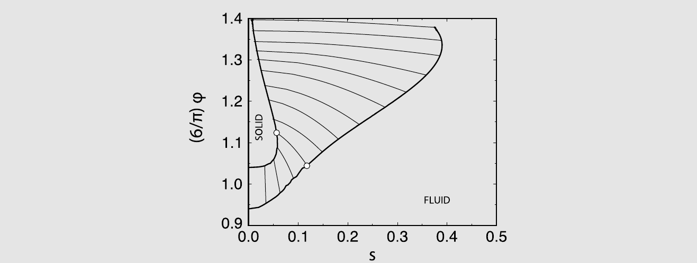

    *图 6.11　流体相与固相在体积分数-多分散度平面上的共存。（图内标注：SOLID = 固相；FLUID = 流体相）*

    图 6.11 给出了多分散硬球的固-流共存曲线，横轴为模拟测得的多分散度 $s$，其定义为

    $$
    s \equiv \sqrt{\frac{\langle \sigma^2 \rangle}{\langle \sigma \rangle^2} - 1} .
    $$

    { 注：文献[[210]](references.md#ref-210) 中 $s$ 的定义有一处笔误。}由图可见，对单分散硬球而言稳定的 fcc 相，在多分散度较大时变得不稳定：硬球 fcc 晶体结构无法承受大于平均球直径 5.7\% 的多分散度。

## 无界面的相共存

在许多方面，计算机模拟都类似于实验。然而在研究一级相变时，两者似乎存在差别。在实验中，一级相变很容易定位：在合适的密度和温度下，我们会观察到一个初始均匀的体系分离为两个不同的相，二者由一个界面隔开；随后测量共存两相的性质也相当直接。与之相反，在模拟中我们往往通过分别计算各个相的热力学性质、再寻找两个体相的温度、压力和化学势相等的那一点，来定位一级相变。

在模拟中我们常常被迫走这条更间接的路线，原因与有限尺寸效应有关。如果两相在小体系、甚至中等大小的体系中共存，那么相当大一部分粒子会处于分隔两相的界面上或其附近。为估计这一效应，考虑一个理想化的情形：一个相构成的立方区域被另一个相包围。我们假定立方体最外层的粒子属于界面，其余部分则具有体相性质。界面中粒子所占的比例取决于体系尺寸。从表 6.1 可以看出，粒子数少于 1000 的体系是界面主导的；而且即使对相当大的体系，界面中粒子的比例仍不可忽略。正如第 8.3.1.1 节所解释的，因此直接共存模拟需要相当大的体系和相当长的模拟。

**表 6.1　含 $N$ 个粒子的立方区域中处于界面的粒子百分比 $P_{\text{int}}$。这里假定只有最外层的粒子属于界面。**

| $N$ | $P_{\text{int}}$ |
| --- | --- |
| 125 | 78\% |
| 1\,000 | 49\% |
| 64\,000 | 14\% |
| 1\,000\,000 | 6\% |

20 世纪 80 年代中期，Panagiotopoulos [[211]](references.md#ref-211) 设计了一种研究（流体-流体）一级相变的计算方案，它具备直接共存模拟的许多优点，却几乎没有其缺点。在适用的场合，这一通常被称为吉布斯系综（Gibbs Ensemble, GE）的方案能显著减少相平衡计算所需的机时，尤其是因为只需一次模拟就足以定出相共存曲线上的一个点。

不过，随着计算能力的提升以及扩展系综模拟方法（第 13.1.2 节）的发展，如今已有了吉布斯系综方法的有力替代者。此外，文献[[176,212]](references.md#ref-176) 的巨正则有限尺寸标度方法对临界点给出的估计比吉布斯系综方法更可靠。正因如此，吉布斯系综方法虽然仍被广泛使用，如今却只是众多技术中的一种。话虽如此，吉布斯系综方法易于使用，并能让人洞察在流体-流体相平衡中起作用的各种因素。

### 吉布斯系综技术

两个或更多相 I、II、$\cdots$ 共存的条件是：所有共存相的压力必须相等（$P_{\mathrm{I}} = P_{\mathrm{II}} = \cdots = P$），温度必须相等（$T_{\mathrm{I}} = T_{\mathrm{II}} = \cdots = T$），各物种的化学势也必须相等（$\mu^\alpha_{\mathrm{I}} = \mu^\alpha_{\mathrm{II}} = \cdots = \mu^\alpha$）。于是人们可能会倾向于认为，研究相共存最合适的系综应当是“恒定-$\mu PT$ 系综”。这里给该“系综”的名称加上引号是有意的，因为严格说来并不存在这样的系综。原因很简单：如果我们只指定 $P$、$T$、$\mu$ 这类强度参量，那么诸如 $V$ 之类的广延变量就不受限制。换一种说法：$P$、$T$、$\mu$ 这组量是线性相关的。要得到一个像样的系综，我们至少必须固定一个广延变量。在恒压 Monte Carlo 模拟中，这个变量是粒子数 $N$；而在巨正则 Monte Carlo 中，被固定的是体系的体积 $V$。

有了这番铺垫，Panagiotopoulos 的吉布斯系综方法[[211,213]](references.md#ref-211) 竟能如此接近于实现这件“不可能的事”——在共存相的压力、温度与化学势都相等的条件下模拟相平衡——就颇令人意外了。这一方法之所以行得通，是因为它考虑的是一个复合体系：在平衡态下，两个子体系的 $\mu$、$P$、$T$ 相等，而总体系则是一个性态良好的恒定 $N,V,T$ 体系。下面我们借用在恒定-$N,P,T$ 与恒定-$\mu,V,T$ 模拟中发展起来的方法，推导吉布斯系综方法。

我们关注的是这样一种吉布斯系综：两个盒的总粒子数与总体积保持不变，也就是说，总体系处于 $N,V,T$ 条件下。我们在附录 L.4 中证明，在热力学极限下，（恒定 $V$ 的）吉布斯系综与正则系综严格等价。$N,P,T$ 版本的描述见文献[[213]](references.md#ref-213)。这种恒压方法只能用于含两个或更多组分的体系，因为在单组分体系中，两相区在 $P$-$T$ 平面上是一条线；因此对单组分体系而言，任意选定的 $P$ 与 $T$ 恰好落在相变处的概率小到可以忽略。相反，对双组分体系，两相区在 $P$-$T$ 平面上对应一块有限的区域。

注意，无论采用吉布斯方法的哪一种表述，总粒子数都是固定的。该方法可以推广到研究非均匀体系[[214]](references.md#ref-214)，也很适合研究多组分混合物中的相平衡[[213]](references.md#ref-213)。吉布斯系综技术的应用综述见文献[[215]](references.md#ref-215)。

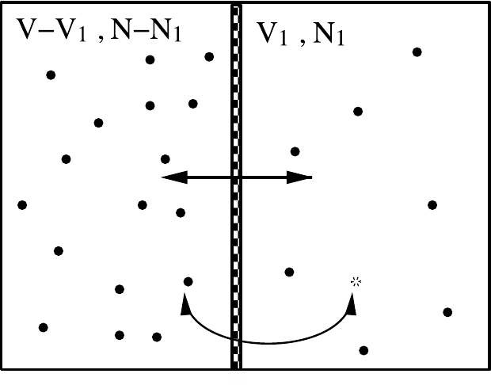

*图 6.12　“吉布斯系综”示意图：两个体系可以交换体积和粒子，但总体积 $V$ 与总粒子数 $N$ 保持不变。*

与更早的相共存研究技术相比，吉布斯方法的优点在于：在吉布斯系综方法中，体系会自发地“找到”共存相的密度与组成。因此，不必先在若干不同组成下计算相关化学势随压力的变化，再据此构造共存线。

与巨正则 MC 模拟的情形一样，吉布斯系综（GE）方法要靠数量足够的成功粒子插入，才能使共存相的化学势相等。在高密度下，粒子插入的接受率很低，此时 GE 方法效率不高。

### 配分函数

我们从 $N$ 个粒子分布在两个体积 $V_1$ 与 $V_2 = V - V_1$ 中的体系的配分函数出发，并要求 $V = V_1 + V_2$ 保持不变（参见图 6.12）。由于 $V_1$ 是可变的，总配分函数不仅要对粒子坐标积分，还要对 $V_1$ 积分[[215–217]](references.md#ref-215)：

$$
\begin{aligned}
Q_G(N, V, T) &\equiv \frac{1}{V \Lambda^{3N}} \sum_{n_1=0}^{N} \int_0^V \mathrm{d}V_1\,
\frac{V_1^{n_1}(V - V_1)^{N-n_1}}{n_1!\,(N-n_1)!} \\
&\qquad \times \int \mathrm{d}\mathbf{s}_1^{n_1} \exp\left[-\beta \mathcal{U}(\mathbf{s}_1^{n_1})\right]
\int \mathrm{d}\mathbf{s}_2^{N-n_1} \exp\left[-\beta \mathcal{U}(\mathbf{s}_2^{N-n_1})\right].
\end{aligned}
\tag{6.6.1}
$$

由此可知，在体积为 $V_1$ 的盒 1 中找到 $n_1$ 个粒子、且坐标分别为 $\mathbf{s}_1^{n_1}$ 与 $\mathbf{s}_2^{N-n_1}$ 的构型的概率为

$$
\mathcal{N}(n_1, V_1, \mathbf{s}_1^{n_1}, \mathbf{s}_2^{N-n_1}) \propto \frac{V_1^{n_1}(V - V_1)^{N-n_1}}{n_1!\,(N-n_1)!}
\exp\left\{-\beta\left[\mathcal{U}(\mathbf{s}_1^{n_1}) + \mathcal{U}(\mathbf{s}_2^{N-n_1})\right]\right\}.
\tag{6.6.2}
$$

下面我们将用式 (6.6.2) 来推导吉布斯系综模拟中各类试探移动的接受规则。

### Monte Carlo 模拟

公式 (6.6.2) 提示了如下的 Monte Carlo 方案，用以采样两个可以交换粒子与体积的体系的所有可能构型。在该方案中，我们考虑以下试探移动（参见图 6.13）：

1. 随机选取一个粒子并使其位移；
1. 改变体积，但保持总体积不变；
1. 把随机选取的一个粒子从一个盒转移到另一个盒。

吉布斯系综中这些步骤的接受规则可由细致平衡条件导出

$$
\mathcal{K}(o \to n) = \mathcal{K}(n \to o),
\tag{6.6.3}
$$

其中 $\mathcal{K}(o \to n)$ 是构型 $o$ 流向 $n$ 的流量，它等于处于构型 $o$ 的概率、生成构型 $n$ 的概率、以及接受该移动的概率三者之积：

$$
\mathcal{K}(o \to n) = \mathcal{N}(o) \times \alpha(o \to n) \times \text{acc}(o \to n).
\tag{6.6.4}
$$

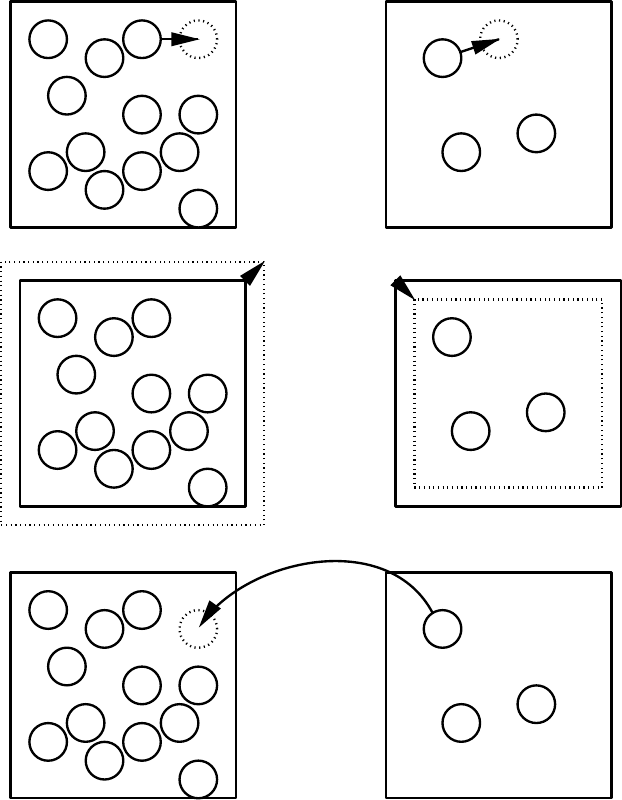

*图 6.13　吉布斯系综方法中的 Monte Carlo 步骤：粒子位移、体积变化以及粒子交换。*

#### 粒子位移

设状态 $n$ 是由状态 $o$ 经盒 1 中一个随机选取的粒子位移得到的。这两个构型的统计权重之比为

$$
\frac{\mathcal{N}(n)}{\mathcal{N}(o)} = \frac{\exp[-\beta \mathcal{U}(\mathbf{s}_n^{n_1})]}{\exp[-\beta \mathcal{U}(\mathbf{s}_o^{n_1})]}.
\tag{6.6.5}
$$

把该比值代入细致平衡条件 (6.1.1)，得到接受规则

$$
\text{acc}(o \to n) = \min\left(1, \exp\{-\beta[\mathcal{U}(\mathbf{s}_n^{n_1}) - \mathcal{U}(\mathbf{s}_o^{n_1})]\}\right).
\tag{6.6.6}
$$

这一接受规则与常规 $N, V, T$ 系综模拟中所用的规则完全相同（参见第 6.2 节）。

#### 体积变化

若盒 1 的体积改变 $\Delta V$，即 $V_1^n = V_1^o + \Delta V$，则移动前后两构型的统计权重之比为

$$
\frac{\mathcal{N}(n)}{\mathcal{N}(o)} = \frac{(V_1^n)^{n_1}(V - V_1^n)^{N-n_1}\exp[-\beta \mathcal{U}(\mathbf{s}_n^N)]}{(V_1^o)^{n_1}(V - V_1^o)^{N-n_1}\exp[-\beta \mathcal{U}(\mathbf{s}_o^N)]}.
\tag{6.6.7}
$$

施加细致平衡条件，得到这一体积变化的接受规则

$$
\displaystyle
\text{acc(o \to n) = \min\left(1, \frac{(V_1^n)^{n_1}(V - V_1^n)^{N-n_1}}{(V_1^o)^{n_1}(V - V_1^o)^{N-n_1}}\exp\{-\beta[\mathcal{U}(\mathbf{s}_n^N) - \mathcal{U}(\mathbf{s}_o^N)]\}\right).
}
\tag{6.6.8}
$$

这种改变体积的方式最初由 Panagiotopoulos 等人[[211,213]](references.md#ref-211) 提出。在体积变化步骤中，生成新构型的一种更自然的选择是：在 $\ln[V_1/(V-V_1)]$ 而非 $V_1$ 中做随机游走（$N, P, T$ 系综的相应做法参见本章前面的讨论）。其好处是：该随机游走的定义域恰好覆盖 $V_1$ 的全部可能取值；此外，平均步长对密度的敏感性也更低。若要把这一做法用于吉布斯系综，体积的接受规则必须作相应修改。

如果我们在 $\ln[V_1/(V-V_1)]$ 中做随机游走，就很自然地把公式 (6.6.1) 改写为

$$
\begin{aligned}
Q_{N,V,T} &= \frac{1}{\Lambda^{3N}N!}\sum_{n_1=0}^{N}\binom{N}{n_1}
\int_{-\infty}^{\infty} \mathrm{d}\ln\left(\frac{V_1}{V-V_1}\right)\\
&\quad \times \frac{V_1(V-V_1)}{V}\,V_1^{n_1}(V-V_1)^{N-n_1}\\
&\quad \times \int \mathrm{d}\mathbf{s}_1^{n_1}\exp[-\beta \mathcal{U}(\mathbf{s}_1^{n_1})]\int \mathrm{d}\mathbf{s}_2^{N-n_1}\exp[-\beta \mathcal{U}(\mathbf{s}_2^{N-n_1})].
\end{aligned}
$$

此时体积为 $V_1$ 的构型 $n$ 的统计权重正比于

$$
\mathcal{N}(n) \propto \frac{(V_1^n)^{n_1+1}(V - V_1^n)^{N-n_1+1}}{V\, n_1!(N-n_1)!}\exp[-\beta \mathcal{U}(\mathbf{s}_n^N)].
\tag{6.6.9}
$$

对这一移动施加细致平衡，导出接受规则

$$
\begin{aligned}
\text{acc}(o \to n) = \min\Biggl( & 1, \left(\frac{V_1^n}{V_1^o}\right)^{n_1+1}\left(\frac{V - V_1^n}{V - V_1^o}\right)^{N-n_1+1}\\
& \times \exp\{-\beta[\mathcal{U}(\mathbf{s}_n^N) - \mathcal{U}(\mathbf{s}_o^N)]\}\Biggr).
\end{aligned}
\tag{6.6.10}
$$

注意这一修改不影响粒子位移或粒子交换的接受规则。

#### 粒子交换

假设我们从构型 $o$（盒 1 中有 $n_1$ 个粒子）出发，通过从盒 1 移除一个粒子并把它插入盒 2，来生成构型 $n$。两个构型的统计权重之比为

$$
\begin{aligned}
\frac{\mathcal{N}(n)}{\mathcal{N}(o)} = {}& \frac{n_1!(N-n_1)!\,V_1^{n_1-1}(V-V_1)^{N-(n_1-1)}}{(n_1-1)!\,[N-(n_1-1)]!\,V_1^{n_1}(V-V_1)^{N-n_1}}\\
& \times \exp\{-\beta[\mathcal{U}(\mathbf{s}_n^N) - \mathcal{U}(\mathbf{s}_o^N)]\}.
\end{aligned}
$$

对这一移动施加细致平衡，导出如下接受规则：

$$
\text{acc}(o \to n) = \min\left(1, \frac{n_1(V - V_1)}{(N - n_1 + 1)V_1}\exp\{-\beta[\mathcal{U}(\mathbf{s}_n^N) - \mathcal{U}(\mathbf{s}_o^N)]\}\right).
\tag{6.6.11}
$$

通过交替执行这三类移动，两个盒中的系统最终将达到平衡，各自代表共存的两相。盒 1 中的平均密度和盒 2 中的平均密度给出共存曲线上液相和气相的密度。

#### 实现

生成试探构型的一种简便做法是按循环进行模拟。一个循环由以下部分组成：（平均）$N_{\text{part}}$ 次在（随机选定的）某个盒中位移一个（随机选定的）粒子的尝试、$N_{\text{vol}}$ 次改变子体系体积的尝试，以及 $N_{\text{swap}}$ 次在两盒之间交换粒子的尝试。重要的是要保证模拟的每一步都满足微观可逆性条件。可用的吉布斯系综算法见算法 15，以及补充材料中的算法 42 与 43。

在吉布斯系综模拟中，粒子位移和体积变化这两类试探移动的实现，与常规 $N,V,T$ 或 $N,P,T$ 模拟中相应试探移动的实现非常相似。然而，交换粒子的尝试则需要小心处理。为保证细致平衡，重要的是先随机选定从哪一个盒中移除粒子，然后在该盒中随机选出一个粒子。另一种做法是先（从全部 $N$ 个粒子中）随机选出一个粒子，再试图把它移到另一个模拟盒中；但那样一来，接受规则 (6.6.11) 就必须换成一个略有不同的规则[[218]](references.md#ref-218)。

交换粒子的尝试次数取决于体系所处的条件。例如，可以预期在接近临界温度时，被接受的交换所占比例会高于接近三相点时的情形。检验尝试次数是否足够的一种可行办法是计算化学势：由于所计算的待插入粒子的能量恰好就是试探粒子能量，化学势的计算不需要额外的开销。

**算法 15　基本吉布斯系综模拟**

<table class="algbox" markdown="1">
<tbody markdown="1">
<tr markdown="1"><td class="algcode" markdown="span"><code>program&nbsp;mc_Gibbs</code></td><td class="algcom" markdown="span">吉布斯系综模拟</td></tr>
<tr markdown="1"><td class="algcode" markdown="span"><code>for&nbsp;1&nbsp;&lt;=&nbsp;icycl&nbsp;&lt;=&nbsp;ncycle&nbsp;do</code></td><td class="algcom" markdown="span">执行 ncycl 个 MC 循环</td></tr>
<tr markdown="1"><td class="algcode" markdown="span"><code>&nbsp;&nbsp;&nbsp;&nbsp;</code><code>ran=R*(npart+nvol+nswap)</code></td><td class="algcom" markdown="span"></td></tr>
<tr markdown="1"><td class="algcode" markdown="span"><code>&nbsp;&nbsp;&nbsp;&nbsp;</code><code>if&nbsp;ran&nbsp;&lt;=&nbsp;npart&nbsp;then</code></td><td class="algcom" markdown="span"></td></tr>
<tr markdown="1"><td class="algcode" markdown="span"><code>&nbsp;&nbsp;&nbsp;&nbsp;&nbsp;&nbsp;&nbsp;&nbsp;</code><code>mcmove</code></td><td class="algcom" markdown="span">尝试位移一个粒子</td></tr>
<tr markdown="1"><td class="algcode" markdown="span"><code>&nbsp;&nbsp;&nbsp;&nbsp;</code><code>else&nbsp;if&nbsp;ran&nbsp;&lt;=&nbsp;(npart+nvol)&nbsp;then</code></td><td class="algcom" markdown="span"></td></tr>
<tr markdown="1"><td class="algcode" markdown="span"><code>&nbsp;&nbsp;&nbsp;&nbsp;&nbsp;&nbsp;&nbsp;&nbsp;</code><code>mcvol</code></td><td class="algcom" markdown="span">尝试改变体积</td></tr>
<tr markdown="1"><td class="algcode" markdown="span"><code>&nbsp;&nbsp;&nbsp;&nbsp;</code><code>else</code></td><td class="algcom" markdown="span"></td></tr>
<tr markdown="1"><td class="algcode" markdown="span"><code>&nbsp;&nbsp;&nbsp;&nbsp;&nbsp;&nbsp;&nbsp;&nbsp;</code><code>mcswap</code></td><td class="algcom" markdown="span">尝试交换一个粒子</td></tr>
<tr markdown="1"><td class="algcode" markdown="span"><code>&nbsp;&nbsp;&nbsp;&nbsp;</code><code>endif</code></td><td class="algcom" markdown="span"></td></tr>
<tr markdown="1"><td class="algcode" markdown="span"><code>&nbsp;&nbsp;&nbsp;&nbsp;</code><code>sample</code></td><td class="algcom" markdown="span">采样可观测量</td></tr>
<tr markdown="1"><td class="algcode" markdown="span"><code>enddo</code></td><td class="algcom" markdown="span"></td></tr>
<tr markdown="1"><td class="algcode" markdown="span"><code>[...]</code></td><td class="algcom" markdown="span">计算可观测量的平均值</td></tr>
<tr markdown="1"><td class="algcode" markdown="span"><code>end&nbsp;program</code></td><td class="algcom" markdown="span"></td></tr>
</tbody>
</table>

**具体说明**（一般说明见第 1 章「算法」）：

1. 该算法确保在每个 Monte Carlo 步中满足细致平衡。平均而言，每个循环执行 `npart` 次位移粒子的尝试、`nvol` 次改变体积的尝试，以及 `nswap` 次在两盒之间交换粒子的尝试。
1. 函数 **mcmove** 尝试位移一个随机选出的粒子；该算法与算法 2 非常相似（但要记住粒子分处两个不同的盒中）。函数 **mcvol** 尝试改变两盒的体积（见补充材料中的算法 42），函数 **mcswap** 尝试在两盒之间交换一个粒子（见补充材料中的算法 43），函数 **sample** 采样可观测量。

考察配分函数 (6.6.1) 可知，为了正确地计算系综平均，必须允许 $n_1 = 0$（盒 1 为空）与 $n_1 = N$（盒 2 为空）这两种情形。因此，务必保证程序能够处理其中一个盒为空的情况。由式 (6.6.11) 可以清楚看出，接受规则的构造方式确实会拒绝那些试图从已经为空的盒中移除粒子的试探移动。

在交换步骤中也可以顺便计算化学势。不过，为了正确地计算化学势（见补充材料附录 L.4），当其中一个盒已满时仍应继续加入试探粒子。

???+ example "例 13（Lennard-Jones 流体的相平衡）"

    吉布斯系综最早的应用之一，是确定 Lennard-Jones 流体的气-液共存曲线[[78,211]](references.md#ref-78)。

    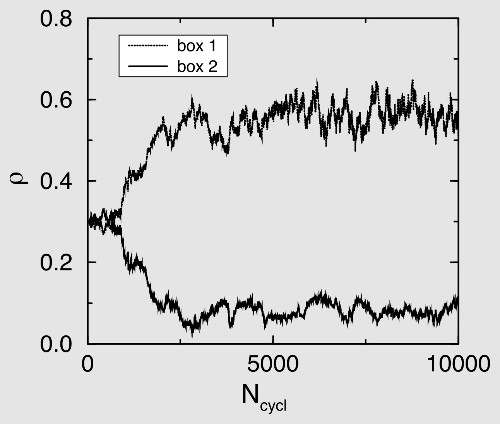

    *图 6.14　对 Lennard-Jones 粒子体系，吉布斯系综两个盒子中的粒子数密度随 Monte Carlo 循环数的变化；粒子数 $N = 256$，温度 $T = 1.2$。（图内标注：box 1 / box 2 = 盒子 1 / 盒子 2）*

    在图 6.14 中，两个盒内流体的密度被画成 Monte Carlo 循环数（按算法 15 中的定义）的函数。模拟从两盒密度相等的状态出发。在最初的 1000 个 Monte Carlo 循环中，体系尚未“决定”哪个盒将演化到液相密度、哪个将演化到气相密度。在 5000 个 Monte Carlo 循环之后，体系似乎已经达到平衡，此时便可以确定共存性质。

    在图 6.15 中，由吉布斯系综模拟得到的 Lennard-Jones 相图，与由 Johnson 等人[[83]](references.md#ref-83) 的状态方程得到的相图作了比较。需要指出的是，把 GE 相图与文献中关于临界点的数据（例如[[212]](references.md#ref-212)）作比较并不容易，因为不同作者对 Lennard-Jones 势采用了不同的截断方式（例如可参见[[80,219]](references.md#ref-80)），而这类截断对临界温度的位置有很大影响。

    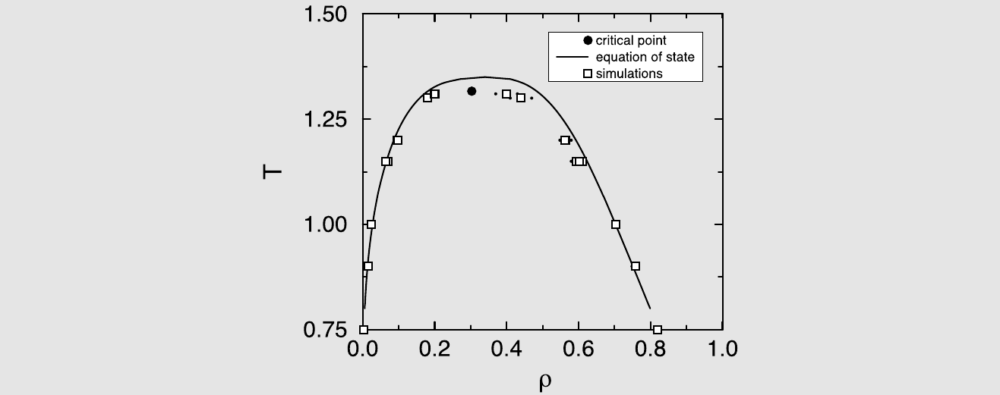

    *图 6.15　Lennard-Jones 流体的相图：在 $2.5\sigma$ 截断之外采用尾部修正以模拟完整的 Lennard-Jones 势，图中给出由吉布斯系综技术算得的结果（方块）与 Johnson 等人的状态方程（实线）。实心圆点标出所估计的临界点。（图内标注：critical point = 临界点；equation of state = 状态方程；simulations = 模拟结果）*

    生成本例的 Fortran 代码可在在线补充材料的案例研究 10 中找到。

#### 分析结果

假定我们已经有了一个可用的算法来执行吉布斯系综模拟，接下来就必须回答这样一个问题：模拟所产生的数字是否可靠？首先，平衡条件应当得到满足：

- 两个子体系中的压力必须相等；
- 化学势在两相中必须相等。

除此之外，还有一些颇有意思的补充方法，可以用来分析数据、判断一次模拟是否成功。

#### 估计临界点

在临界点附近，液-气界面的表面张力变得非常小。于是，在任一盒中形成界面所付出的代价也随之变小，而这种界面的形成在熵上又是有利的。正因如此，在略低于临界点处，吉布斯系综模拟中已无法再观察到气-液共存[[220]](references.md#ref-220)。所以，能够观察到共存的最高温度并不是体系临界温度的合理估计。为估计临界温度，可以把结果拟合到直线直径定律[[221]](references.md#ref-221)：

$$
\frac{\rho_l + \rho_g}{2} = \rho_c + A(T - T_c),
\tag{6.6.12}
$$

其中 $\rho_l$（$\rho_g$）为液（气）相密度，$\rho_c$ 为临界密度，$T_c$ 为临界温度。此外，共存两相密度差的温度依赖关系可拟合到标度律[[143]](references.md#ref-143)

$$
\rho_l - \rho_g = B(T - T_c)^{\beta},
\tag{6.6.13}
$$

其中 $\beta$ 是临界指数[^9]（三维体系 $\beta \approx 0.32$，二维体系 $\beta = 0.125$ [[143]](references.md#ref-143)）。$A$ 和 $B$ 与体系有关，由拟合确定。

这些公式必须谨慎使用。严格地说，它们不能用于有限体系的模拟。原因在于：在临界点处，度量自发密度涨落空间范围的关联长度会发散；而在有限体系中，这些涨落受到模拟盒尺寸的限制。如果我们压制了长程涨落，实际上就是在模拟一个经典体系，它具有平均场临界指数。因此我们可以预期存在一个交叉温度：在此温度以下，我们采样到了全部相关涨落，可望观察到非经典行为；在此温度以上，则可望观察到经典行为。交叉温度取决于模拟所用的系综。

对三维和二维的 Lennard-Jones 流体，Panagiotopoulos [[222]](references.md#ref-222) 分析了吉布斯系综的有限尺寸效应（见例 30）。该研究结果表明，对非格点体系，这一交叉温度非常接近临界温度。这说明：若我们的目的只是得到临界温度的估计，使用公式 (6.6.12) 与 (6.6.13) 是安全的。若仍认为有限尺寸效应可能显著，总可以用不同的体系尺寸做若干次模拟；虽然对更大体系补做模拟看似顺理成章，但通常用更小的体系做模拟就能以低得多的代价估计出有限尺寸效应的重要性。当然，如果专门关心有限尺寸效应或临界指数的精确测定，就必须更加小心，应当做正规的有限尺寸标度分析（例如可参见 Rovere 等人[[175,177,223]](references.md#ref-175) 以及 Wilding 和 Bruce [[176]](references.md#ref-176) 的工作）。对这类计算而言，吉布斯系综技术并不特别适用。

#### 吉布斯系综为何对固体失效

如果共存两相之一是晶态固体，粒子交换移动的接受率会变得非常低：在这种情形下，插入成功与否取决于能否在接收方晶体中找到一个空位。由于此类缺陷的平衡浓度通常极小，吉布斯系综方法对固体并不适用。

不过，吉布斯系综方法对晶态固体失效还有一个更深层的原因：一旦我们承认晶体中的粒子数并不由晶格位点数所固定，就必须考虑到——即便在体积和粒子数都恒定的条件下，晶格位点数 $N_c$ 仍可能变化。对单组分体系，亥姆霍兹自由能变分的表达式于是为[[224]](references.md#ref-224)

$$
\mathrm{d}F = -S\mathrm{d}T - V\mathrm{d}P + \mu\,\mathrm{d}N + \mu_c\,\mathrm{d}N_c,
\tag{6.6.14}
$$

其中 $\mu_c$ 是与晶格位点数相联系的“化学势”。在平衡态下 $\mu_c$ 必须为零，因为平衡的晶格位点数正是使自由能取极小的那个数目。因此，式 (6.6.14) 并不用来描述宏观晶体材料的热力学。

然而在模拟中，让晶格位点数独立于粒子数而改变并不容易，尽管确实有人观察到过这种情形[[225]](references.md#ref-225)。标准的吉布斯系综模拟可以改变体系的体积和粒子数，却没有改变晶格位点数的试探移动。其后果是：如果把 GE 方法用于一个含有大量空位（或间隙原子）的软固体，体系最终会达到这样一个状态——两相的压力和化学势相等，但 $\mu_c$ 非零且两相不同。因此，这类模拟采样到的并不是两个处于平衡的体系。在模拟某些液晶相、或以周期性缺陷结构为特征的相时，也可能出现类似的问题。

### 应用

吉布斯系综技术已被用来研究多种体系的相行为，这些模拟结果的综述见[[215,226,227]](references.md#ref-215)。这里我们讨论吉布斯系综的少数几个应用，它们所用的算法与第 6.6.3 节所述的算法有显著差别。

???+ example "例证 5（极性与离子流体）"

    由于偶极相互作用和库仑相互作用是长程的，偶极势和库仑势不能简单地截断。人们发展了 Ewald 求和、反应场等专门技术（见第 11 章），以便在模拟中计入势的长程本性。把长程分子间相互作用简单地截断在盒子直径的一半处，会导致对相共存曲线的错误估计。

    除了截断偶极或库仑相互作用本身就不被允许之外，若把势截断在周期性盒子直径的一半处还会带来另一个问题：模拟过程中盒子尺寸是涨落的，因而有效势也在随之改变。其后果是，处在大模拟盒中的粒子所感受到的相互作用势，与处在小盒中的粒子截然不同。于是，一个两个模拟盒尺寸不同的吉布斯系综模拟，可能会给出两个由不同势描述的体系之间的“表观相共存”。事实上，这一问题并不限于库仑或偶极相互作用：即便对相对短程的 Lennard-Jones 势，相图也对势截断的细节非常敏感（见第 3.3.2.2 节）。

    吉布斯系综技术应用于含库仑相互作用流体的一个例子，是 Panagiotopoulos [[228]](references.md#ref-228) 对离子溶液的一个简单模型——限制性原始模型——的研究。{ 注 1：限制性原始模型是带点电荷的硬核势。}由该模拟得到的临界点位置估计，与更早的、把库仑势截断在盒子直径一半处所得的估计[[229,230]](references.md#ref-229) 有明显差别。

    当使用 Ewald 求和方法处理库仑或偶极相互作用时，吉布斯系综模拟结果对体系尺寸的依赖通常相当微弱。例如，Stockmayer 流体{ 注 2：Stockmayer 势是 Lennard-Jones 势加一个点偶极。}气-液转变的吉布斯系综模拟[[231,232]](references.md#ref-231) 就发现了这种弱的尺寸依赖性。

    对于一个密切相关的体系——偶极硬球流体——吉布斯系综模拟甚至为一个老问题带来了新的认识，即气-液临界点的位置。乍看之下，偶极硬球流体的气-液转变似乎没有什么特别之处：由于两个偶极之间取向平均后的相互作用给出类范德华的 $1/r^6$ 吸引，de Gennes 和 Pincus 由此猜想其气-液共存应当与常规范德华流体相似[[233]](references.md#ref-233)。Kalikmanov [[234]](references.md#ref-234) 用这一猜想估计了临界点。更精细的液体态理论[[235]](references.md#ref-235) 给出了定性相似（但定量不同）的结果。而且，Ng 等人早期的恒 $N,V,T$ Monte Carlo 模拟[[236]](references.md#ref-236) 确实找到了这种气-液共存的证据，支持了偶极硬球流体中存在气-液共存的理论预言。

    然而，后续模拟并未发现气-液转变的证据[[237,238]](references.md#ref-237)。更确切地说，这些模拟在各种理论所预言的温度范围内没有发现气-液共存；即便在所能研究的最低温度下，也未观察到气-液共存。人们发现的反而是：在低温下偶极以首尾相接的方式排列，形成链[[238,239]](references.md#ref-238)，甚至形成闭合的环[[240]](references.md#ref-240)。这些环的出现先于（并阻止了）流体-流体相变的发生。

???+ example "例证 6（混合物）"

    吉布斯系综技术的一个重要应用，是模拟混合物的相行为（例如可参见[[213,241,242]](references.md#ref-213)）。研究液-液相共存的主要困难之一在于两相通常都相当稠密，因而难以在两相之间交换粒子；对两个组分中较大的那一个，这一问题更为严重。

    所幸的是，为了施加共存相中化学势相等这一条件，并不需要对所有物种都执行这样的交换：只要其中一个组分（记为 $i$）的化学势在两相中相等就够了。对其他组分 $j$，我们只需施加 $\mu_j - \mu_i$ 在两相中相等。当然，这意味着当 $\mu_i$ 在两相中相同时，所有 $\mu_j$ 也都相同。然而，“$\mu_j - \mu_i$ 固定”这一条件在模拟中要容易施加得多。实践中，这是通过执行改变粒子化学身份（例如从 $i$ 变为 $j$）的 Monte Carlo 试探移动来实现的，所施加的化学势差决定了这类试探移动的接受概率。

    Panagiotopoulos [[243]](references.md#ref-243) 最早把这一方法用于混合物的吉布斯系综模拟。在这些模拟中，只有较小的粒子在两个模拟盒之间交换，而对较大的粒子只尝试身份变化移动。

    研究对称混合物时情况更为简单。在这类体系中，共存两相的密度相等，而盒 I 与盒 II 中的摩尔组成由对称性相联系（$x_{\mathrm{I}} = 1 - x_{\mathrm{II}}$）。因此，对这类对称体系的吉布斯系综模拟，既不必执行体积变化[[244,245]](references.md#ref-244)，也不必在两盒之间交换粒子[[246]](references.md#ref-246)。

    把针对混合物的吉布斯系综方法与本章讨论的半巨正则系综方法结合起来往往很有利。利用半巨正则采样，我们可以在两个模拟盒中施加相同的逸度比：也就是说，允许任一盒中的粒子在留在原盒的同时改变身份；此外还允许这样的试探移动——尝试把某一个（或多个）参考物种的粒子从一个盒移到另一个盒。下面为简单起见，假定我们只尝试移动某一物种（记为物种 1）的粒子。待交换粒子的选取方式如下：先以相等概率选择盒 I 或盒 II，再在所选盒中任选一个类型 1 的分子，尝试把它插入另一个盒。这类移动的接受概率由式 (6.6.8) 给出。{ 注：我们这里建议的实现方式与文献[[203]](references.md#ref-203) 所主张的略有不同，而更接近 Stapleton 等人[[247]](references.md#ref-247) 的做法。}参考物种 1 的自然选择显然是最容易交换的那一个，即体系中最小的分子。

## 问题与练习

**问题 18**（试探移动）。

1. 在巨正则 MC 模拟中，可以提高“尝试插入/移除一个粒子”这类试探移动所占的比例。如果在巨正则系综中采用非常大比例的粒子交换试探移动，被接受的插入与删除次数确实会增加。然而，这是一种高效的做法吗？（提示：设想在这些交换移动中，已经成功地把某个粒子从体系中删除，而其余粒子的位置尚未改变。）
1. 下列试探移动中，哪一种在计算上代价最高：粒子位移、体积变化、粒子插入还是粒子删除？请说明理由。
1. 在模拟由多个相互作用位点构成的分子时，通常还会引入一种绕质心旋转分子的试探移动。为什么？这种试探移动的接受/拒绝规则是什么？
1. 在巨正则系综中加入一个粒子时，势能的尾部修正会带来一定的能量变化。当使用截断半径为 $r_c$ 的 Lennard-Jones 势时，请推导这一能量变化的表达式。

**问题 19**（多组分模拟）。考虑温度为 $T$ 的二元混合物的巨正则 Monte Carlo 模拟，两个组分的逸度分别为 $f_1$ 与 $f_2$（见式 (6.5.8)）。

1. 采用如下方案添加或移除粒子：

   请推导这些试探移动的接受规则。
1. 另一种可选的方案是：

   如果仍使用前面的接受规则，这一方案满足细致平衡吗？如果不满足，能否加以修正？提示：你或许可以参阅文献[[218]](references.md#ref-218)。

**问题 20**（吉布斯系综）。当吉布斯系综中的一个盒子无限大，且该盒中的分子之间没有相互作用时，粒子交换的接受/拒绝规则就与巨正则系综中粒子交换的接受/拒绝规则完全相同。请推导这一结果。

**问题 21**（势的标度变换）。在 $NPT$ 模拟中尝试改变体系体积时，如果能够利用势的标度性质，新构型的能量就可以高效地算出。考虑 Lennard-Jones 粒子体系，其总势能 $U$ 为

$$
U = \sum_{i<j} 4\epsilon \left[ \left( \frac{\sigma}{r_{ij}} \right)^{12} - \left( \frac{\sigma}{r_{ij}} \right)^{6} \right] .
\tag{6.7.1}
$$

设体系的盒长由 $L$ 变为 $L'$，记 $S \equiv L'/L$。

1. 推导新势能 $U'$ 与新维里 $V'$ 作为 $S$、旧势能 $U$ 和旧维里 $V$ 的函数的表达式。
1. 为什么在这种情况下改变体积的试探移动代价很低？
1. 实践中我们并不显式计算截断半径 $r_c$ 之外的 LJ 相互作用。请解释使用标度方法时为什么必须同时对截断半径作标度。
1. 尾部修正如何随 $S$ 标度？

**练习 12**（$NPT$ 系综中的 Monte Carlo）。在本书网站上，你可以找到一个用 Monte Carlo 方法在 $NPT$ 系综中模拟硬球（直径为 1）的程序。

1. 如果你试图直接计算这个体系的维里，会遇到什么问题？
1. 在现有代码中，随机游走是在 $\ln(V)$ 而不是 $V$ 中进行的。请修改代码，使随机游走在 $V$ 中进行。检验两种算法给出的平均密度是否相等。
1. 对这两种算法，画出体积位移的接受概率作为最大体积位移的函数。

**练习 13**（Ising 模型）。在本练习中，我们考虑二维 Ising 模型。在该模型中，$N$ 个自旋 $s$（取值 $\pm 1$）排布在正方格点上。每个自旋 $i$ 有 4 个最近邻（$j = 1,2,3,4$）。体系的总能量为

$$
U = -\frac{\epsilon}{2} \sum_{i=1}^{i=N} \sum_{j \in \mathrm{nn}_i} s_i s_j,
\tag{6.7.2}
$$

其中 $s_i = \pm 1$、$\epsilon > 0$。第二个求和是对自旋 $i$ 的所有最近邻（$\mathrm{nn}_i$）求和。总磁化强度 $M$ 等于所有自旋之和：

$$
M = \sum_{i=1}^{i=N} s_i .
\tag{6.7.3}
$$

二维 Ising 模型的临界点在 $\beta_c \approx 0.44$ 附近。

1. 请补全本书网站上提供的该体系的模拟代码。
1. 在正则系综中计算 $N = 32 \times 32$、$\beta = 0.5$ 时 $M$ 的分布。这个分布应当关于 $M = 0$ 对称：
   $$
   p(M) = p(-M) .
   \tag{6.7.4}
   $$
   但模拟似乎并没有重现这样一个对称的分布。问题出在哪里？
1. 除了在正则系综中做模拟之外，也可以使用如下分布函数做有偏模拟：
   $$
   \pi \propto \exp\left[-\beta U + W(M)\right] .
   \tag{6.7.5}
   $$
   正则系综中可观测量 $O$ 的平均值与“$\pi$ 平均”之间的关系为
   $$
   \langle O \rangle = \frac{\left\langle O \exp[-W(M)] \right\rangle_\pi}{\left\langle \exp[-W(M)] \right\rangle_\pi},
   \tag{6.7.6}
   $$
   其中 $\langle \cdots \rangle_\pi$ 表示在有偏体系中的系综平均。请推导这一关系。
1. 用若干给定的分布 $W(M)$（见本书网站上相应的文件）进行模拟。解释你的结果。应当如何选择函数 $W(M)$ 才能获得最优效率？
1. 当 $W(M)$ 取高斯形式
   $$
   W(M) = A \exp\left[-\frac{M^2}{2\sigma^2}\right]
   \tag{6.7.7}
   $$
   且 $A > 0$ 时会发生什么？
1. 若取 $W(M) = W(U) = \beta U$，生成的是什么样的有偏分布？

**练习 14**（气-液平衡）。在本练习中，我们使用 Widom 试探粒子方法（见第 8.5.1 节）来确定气-液平衡，并把结果与吉布斯系综模拟作比较。

1. 修改本书网站上的 $NVT$ Monte Carlo 程序，使其能够用 Widom 试探粒子方法计算化学势：
   $$
   \mu = \mu_0 - \frac{\ln\left(\rho^{-1}\left\langle \exp\left[-\beta \Delta U^{+}\right]\right\rangle\right)}{\beta},
   \tag{6.7.8}
   $$
   其中 $\rho$ 表示粒子数密度，$\Delta U^{+}$ 是插入一个试探粒子所引起的势能变化，而
   $$
   \mu_0 = \frac{-\ln\left(\Lambda^3\right)}{\beta} .
   \tag{6.7.9}
   $$
   在本练习中，我们改用逸度 $f$ 的 Widom 表达式，即式 (8.5.6)：
   $$
   f = \frac{\rho}{\left\langle \exp(-\beta \Delta U^{+}) \right\rangle}
   $$

1. 在 $T = 0.8$ 下对该体系做吉布斯系综模拟。在吉布斯系综中，盒 $i$ 中粒子的逸度为[[217]](references.md#ref-217)
   $$
   f_i = \left\langle \frac{V_i}{n_i + 1} \exp\left[-\beta \Delta U_i^{+}\right] \right\rangle^{-1},
   \tag{6.7.10}
   $$
   其中 $n_i$ 是盒 $i$ 中的粒子数，$V_i$ 是盒 $i$ 的体积。气-液共存密度和逸度与你前面的结果是否一致？

---

[^1]: 实际上，这一步很难严格证明。原因在于体积积分没有自然的“度量”。与能级简并度或系统中的粒子数不同，我们无法对体积进行计数。这个问题已被多位作者讨论[[173,174]](references.md#ref-173)。Attard [[173]](references.md#ref-173) 从信息论的角度处理该问题，得出结论认为积分变量应该是 $\ln V$ 而非 $V$。相比之下，Koper 和 Reiss [[174]](references.md#ref-174) 旨在将该问题归结为计算与给定体积兼容的量子态数。他们得到的表达式与这里讨论的几乎完全相同。
[^2]: $\mathbf{h}$ 必须是对称的，因为任何反对称分量都对应于一个不改变系统物理状态的旋转。
[^3]: 为了与弹性理论中使用的符号联系，我们可以将 $\mathbf{h}$ 写为 $\mathbf{h} \equiv \mathbf{h}_0 \cdot \mathbf{h}_0^{-1} \cdot \mathbf{h}$，其中 $\mathbf{h}_0^{-1} \cdot \mathbf{h} \equiv [\mathbf{I} + \boldsymbol{\epsilon}]$，$\mathbf{h}_0$ 描述未变形固体的形状，$\boldsymbol{\epsilon}$ 是所谓的应变张量。
[^4]: 然而，绝不应将恒定应力方法用于均匀流体，因为后者对保持体积不变的盒变形没有抵抗力，可能会产生非常奇怪（扁平、细长等）的盒形状。这种强烈变形的模拟盒往往表现出显著的有限尺寸效应。
[^5]: 通常，逸度是按照与系统处于平衡的相同粒子的假设理想气体的压力来定义的。但由于理想气体压力满足 $P^{\text{id}} = \rho k_B T$，我们同样可以使用密度。
[^6]: 然而，当我们考虑化学平衡时，$\mu^{-\circ}$ 项变得重要。
[^7]: 如前所述，我们将 $f$ 定义为假设理想气体的密度。
[^8]: 在下面的讨论中，我们偏离了 Kofke 和 Glandt [[203]](references.md#ref-203) 对半巨正则系综的原始推导，以强调半巨正则系综与分子体系巨正则系综之间的密切关系。
[^9]: 严格地说，使用带非经典临界指数的标度律与使用直线直径定律并不自洽。不过在模拟精度范围内，偏离直线直径定律的现象很难观察到。