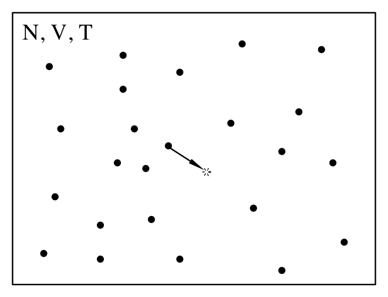
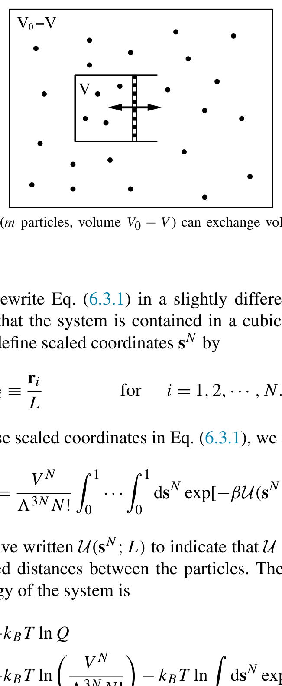
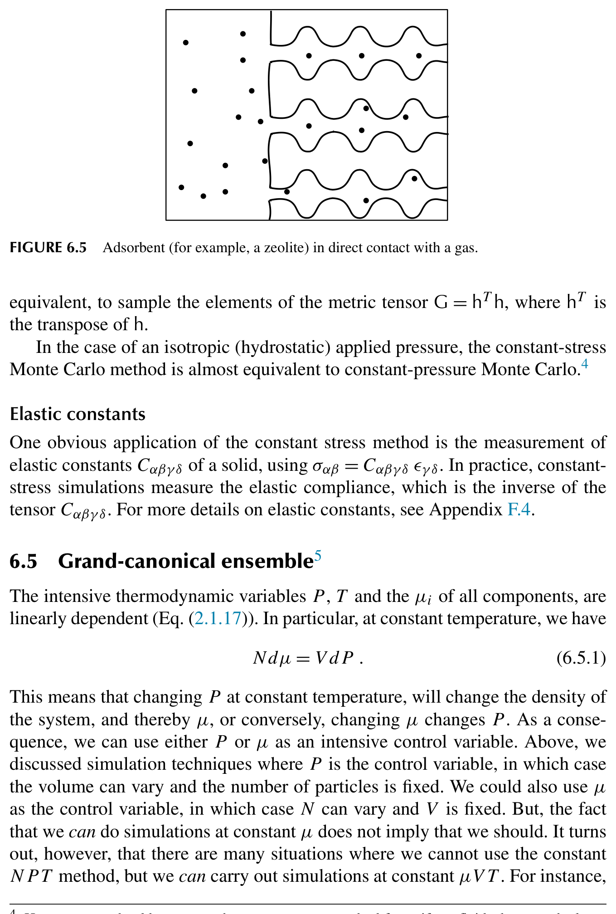
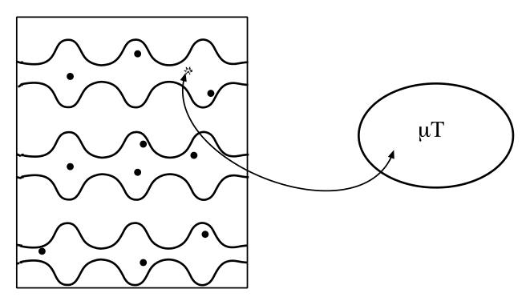
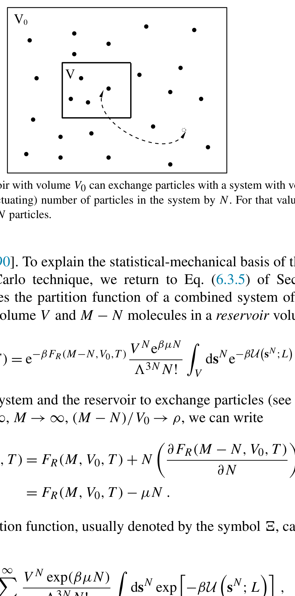
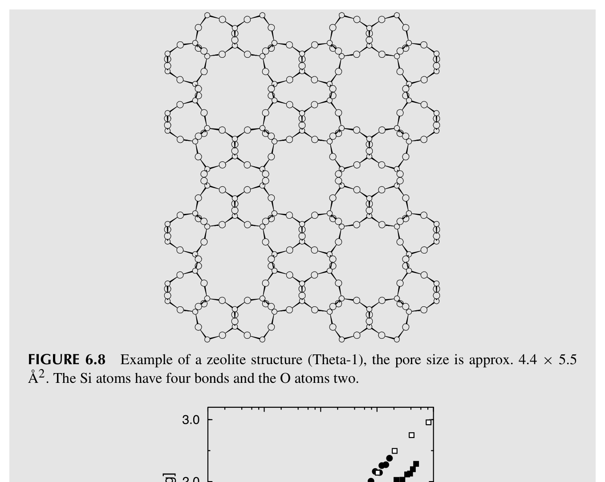
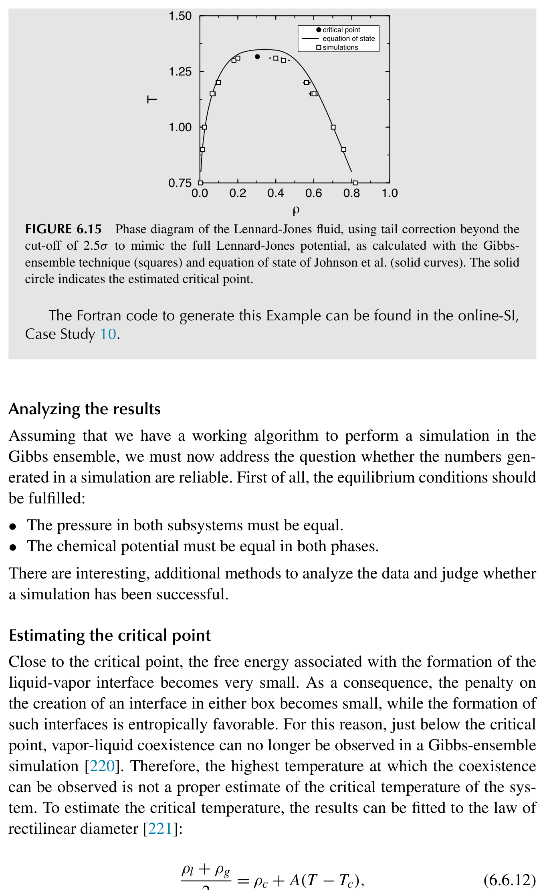

# 各种系综中的Monte Carlo模拟

分子动力学模拟的原始形式求解的是离散化的牛顿运动方程，其总能量 $E$ 和总线动量 $\mathbf{P}$ 是运动常数。因此，分子动力学模拟测量的是恒定-$NVE$-$\mathbf{P}$ 系综中的时间平均，这与更常见的微正则恒定-$NVE$ 系综非常相似（参见文献 ^[\ref{166}]）。相比之下，Metropolis 风格的 Monte Carlo 模拟探测的是恒定-$NVT$（即正则系综）下系统的性质。这些系综之间的差异导致在分子动力学和 Monte Carlo 模拟中计算的统计平均值存在可观测的差别。其中大多数差异在热力学极限下会消失，对于几百个粒子的系统来说已经相对较小。然而，在计算热力学量的涨落幅度时，系综的选择确实会产生差异。例如：在时间步长趋于零的极限下，运动方程离散化带来的数值噪声消失，MD 模拟中的总能量不发生涨落。然而，对于恒定-$NVT$ 的系统，能量必须涨落，并且实际上与系统的热容有关（参见公式 (5.1.5)）。在第 5.1.4 节中，我们讨论了关联不同系综中涨落的技术 ^[\ref{106}]。

在 MC 和 MD 方法被引入之后的几年中，人们发展了在这些原始系综之外的其他系综中进行此类模拟的方法。在大多数情况下，这些技术首先是为 Monte Carlo 模拟开发的。MD 在恒定-$NVE$-$\mathbf{P}$ 之外的其他系综中的应用来得更晚：我们将在第 7 章中讨论它们。由于在 $NVT$ 之外的系综中，MC 模拟更为"自然"，我们先讨论它们。MC 方法的灵活性使得我们通常可以直截了当地创建一个 MC 算法，使其保持任何所需的强度变量（$P, T, \mu_i, \cdots$）集合恒定，只要我们固定至少一个广延变量即可。

多年来，人们已经提出了针对各种系综的 MC 算法：等温等压、等温等张力、巨正则（即恒定 $\mu VT$）、半巨正则（即恒定 $\mu_A - \mu_B, N_A + N_B, V, T$），甚至微正则 ^[\ref{167--172}]。我们还将讨论所谓的"Gibbs 系综"方法，尽管严格来说，该方法并不指代一个不同的系综。微正则 MC 方法 ^[\ref{172}] 在 SI L.3 中有简要讨论。

正如第 3.2 节中所解释的，马尔可夫链 MC 被设计为以与其 Boltzmann 权重成正比的频率访问构型空间的不同部分。因此，对所有访问过的构型进行未加权平均会收敛到对所有构型空间的 Boltzmann 加权平均。在第 3.2 节中，我们利用细致平衡原理证明了 Metropolis 算法按照其 Boltzmann 权重访问构型空间中的点。

细致平衡条件实际上是保证 Boltzmann 抽样的过强条件，正如我们将在第 13 章中看到的，存在满足平衡但不满足细致平衡的强大 MC 算法。然而，如果满足细致平衡，我们就可以保证采样方案是正确的。更重要的是：构造满足细致平衡的算法通常相对容易，而证明平衡往往更为微妙。

由于这个原因，我们将通过施加细致平衡来讨论恒定-$NVT$ 之外的其他系综中的 Monte Carlo 模拟。可以构造仅满足平衡的有效非-$NVT$ 算法，但考虑它们会使讨论复杂化而没有任何明显的好处。

## 一般方法

我们将反复使用相同的方法来考虑多种不同系综的 MC 模拟。这样做可能看起来重复，确实如此，但希望它能传达这样一个要点：只要你简单地遵循配方，为"新"系综构造有效的 MC 算法是安全的。

因此，在下面的各节中，我们使用以下程序来证明我们的 Monte Carlo 算法的有效性：

1. 确定我们想要采样的分布。这个分布，记为 $\mathcal{N}$，将取决于系综的细节。
1. 施加细致平衡条件，
   $$
   \mathcal{K}(o \to n) = \mathcal{K}(n \to o),
   $$
   其中 $\mathcal{K}(o \to n)$ 是从构型 $o$ 到 $n$ 的流量。该流量由处于构型 $o$ 的概率、生成构型 $n$ 的概率和接受此移动的概率的乘积给出，
   $$
   \mathcal{K}(o \to n) = \mathcal{N}(o) \times \alpha(o \to n) \times \text{acc}(o \to n).
   $$
1. 确定生成特定构型的概率。
1. 推导接受规则需要满足的条件。

## 正则系综

首先，让我们将上述方法应用于标准的 Metropolis 方案。在正则系综中，粒子数、温度和体积是恒定的（参见图 6.1）。对于恒定-$NVT$ 的系统，找到构型 $\mathbf{r}^N$ 的概率与 Boltzmann 权重成正比：

$$
\mathcal{N}(\mathbf{r}^N) \propto \exp[-\beta U(\mathbf{r}^N)].
$$



### Monte Carlo 模拟

正则系综中的模拟应当采样公式 (6.2.1) 给出的分布。这可以通过以下方案实现：

1. 随机选择一个粒子并计算构型的能量 $U(o)$。
1. 给该粒子一个随机位移（参见图 6.1），例如
   $$
   \mathbf{r}(o) \to \mathbf{r}(o) + \Delta(\mathbf{R} - 0.5),
   $$
   其中 $\Delta/2$ 是最大位移。$\Delta$ 的值应选择为使采样方案最优（参见第 3.4 节）。试探构型记为 $n$，其能量为 $U(n)$。
1. 该移动以如下概率被接受（参见公式 (3.2.11)）
   $$
   \text{acc}(o \to n) = \min(1, \exp\{-\beta[U(n) - U(o)]\}).
   $$
   如果被拒绝，则保留旧构型。

此基本 Metropolis 方案的实现见第 3.3 节（算法 1 和 2）。

### 算法的合理性证明

根据公式 (6.2.2) 生成试探构型满足微观可逆性

$$
\alpha(o \to n) = \alpha(n \to o) = \alpha.
$$

将此式代入细致平衡条件 (6.1.1)，连同公式 (6.1.2) 和期望分布 (6.2.1)，给出接受规则的条件

$$
\frac{\text{acc}(o \to n)}{\text{acc}(n \to o)} = \exp\{-\beta[U(n) - U(o)]\}.
$$

容易验证接受规则 (6.2.3) 满足此条件。

## 等温等压系综

等温等压（恒定-$NPT$）系综在 Monte Carlo 模拟中被广泛使用。这并不令人惊讶，因为大多数真实实验是在恒定压力和温度下进行的。恒定-$NPT$ 模拟的一个优点是它们可以用来测量模型系统的状态方程，特别是当维里表达式计算压力较为繁琐时。这种情况包括具有非两体可加相互作用的系统，以及某些非球形硬核分子模型。最后，在一级相变附近使用恒定-$NPT$ Monte Carlo 模拟系统通常很方便，因为给定足够的时间，恒定压力下的系统可以自由地完全转变为具有最低（Gibbs）自由能的状态，而在恒定-$NVT$ 模拟中，系统可能被保持在某个密度处，在该密度下宏观系统将分离为两个不同密度的体相，但由于有限尺寸效应而无法做到。

恒定压力下的 Monte Carlo 模拟首先由 Wood ^[\ref{167}] 在二维硬盘的模拟研究中描述。虽然 Wood 引入的方法很优雅，但它不容易适用于具有任意连续势的系统。McDonald ^[\ref{168}] 首先将恒定-$NPT$ 模拟应用于具有连续分子间力（Lennard-Jones 混合物）的系统，McDonald 的恒定压力方法现在被广泛使用。下面我们讨论的就是 McDonald 的方法。

### 统计力学基础

我们将以一种看似不必要地复杂的方式来推导恒定压力 Monte Carlo 的基本方程。然而，这种推导方式的优点是可以使用相同的框架来引入后面将要讨论的其他非-$NVT$ Monte Carlo 方法。为方便起见，我们首先假设处理的是一个由 $N$ 个相同原子组成的系统。该系统的配分函数为

$$
Q(N, V, T) = \frac{1}{\Lambda^{3N} N!} \int_0^L \cdots \int_0^L \mathrm{d}\mathbf{r}^N \exp[-\beta U(\mathbf{r}^N)].
$$



以略微不同的方式重写公式 (6.3.1) 是方便的。为方便起见，我们假设系统包含在一个直径为 $L = V^{1/3}$ 的立方盒子中。我们现在通过以下方式定义标度坐标 $\mathbf{s}^N$

$$
\mathbf{s}_i \equiv \frac{\mathbf{r}_i}{L} \quad \text{for} \quad i = 1, 2, \cdots, N.
$$

如果我们将这些标度坐标代入公式 (6.3.1)，我们得到

$$
Q(N, V, T) = \frac{V^N}{\Lambda^{3N} N!} \int_0^1 \cdots \int_0^1 \mathrm{d}\mathbf{s}^N \exp[-\beta U(\mathbf{s}^N; L)].
$$

在公式 (6.3.3) 中，我们写成 $U(\mathbf{s}^N; L)$ 以表示 $U$ 依赖于粒子之间的真实距离而非标度距离。系统的 Helmholtz 自由能表达式为

$$
F(N, V, T) = -k_B T \ln Q = -k_B T \ln \left[\frac{V^N}{\Lambda^{3N} N!}\right] - k_B T \ln \left[\int \mathrm{d}\mathbf{s}^N \exp[-\beta U(\mathbf{s}^N; L)]\right] = F^{\text{id}}(N, V, T) + F^{\text{ex}}(N, V, T).
$$

在上式的最后一行中，我们将 Helmholtz 自由能的两个贡献分别标识为理想气体表达式和超额部分。现在我们考虑系统由两个体积分别为 $V$ 和 $V_0 - V$ 的非相互作用子系统组成的情况，其中 $V_0 \gg V$，$V_0$ 固定。为了形象化，我们在图 6.2 中将这两个系统展示为被活塞隔开的两个有界系统，尽管实际上子系统应被视为完全独立的并受到周期性边界条件的约束。我们将体积 $V_0 - V$ 中的系统称为储库。我们用 $M$ 表示组合系统中的粒子总数。其中 $M - N$ 个在体积 $V_0 - V$ 中，$N$ 个在体积 $V$ 中。组合系统的配分函数简单地是两个（非相互作用）子系统配分函数的乘积：

$$
Q(N, M, V, V_0, T) = Q(M, V_0 - V, T) \frac{V^N}{\Lambda^{3M} N!} \int \mathrm{d}\mathbf{s}^N e^{-\beta U(\mathbf{s}^N; L)} = e^{-\beta F_R(M, V_0 - V, T)} \frac{V^N}{\Lambda^{3M} N!} \int \mathrm{d}\mathbf{s}^N e^{-\beta U(\mathbf{s}^N; L)},
$$

其中 $F_R$ 表示储库的 Helmholtz 自由能。该组合系统的总自由能为 $F^{\text{tot}} = -k_B T \ln Q(N, M, V, V_0, T)$。现在假设两个子系统可以交换体积。在这种情况下，$N$ 粒子子系统的体积 $V$ 可以涨落。$V$ 的最概然值将是使组合系统自由能最小的那个值。$N$ 粒子子系统具有体积 $V$ 的概率密度 $\mathcal{N}(V)$ 为[^1]

$$
\mathcal{N}(V) = \frac{\exp[-\beta F_R(M, V_0 - V, T)] V^N \int \mathrm{d}\mathbf{s}^N \exp[-\beta U(\mathbf{s}^N; L)]}{\int_0^{V_0} \mathrm{d}V' \exp[-\beta F_R(M, V_0 - V', T)] V'^N \int \mathrm{d}\mathbf{s}^N \exp[-\beta U(\mathbf{s}^N; L')]}.
$$

现在我们考虑储库尺寸趋于无穷的极限（$V_0 \to \infty$，$M \to \infty$，$(M - N)/V_0 \to \rho$）。在这个极限下，小系统的体积变化不改变储库的压力 $P_R$。换言之，大系统充当小系统的恒压器。在这种情况下，我们可以简化公式 (6.3.5) 和 (6.3.6)。注意在 $V/V_0 \to 0$ 的极限下，我们可以写出

$$
F_R(M, V_0 - V, T) = F_R(M, V_0, T) + V \left(\frac{\partial F_R(M, V_0 - V, T)}{\partial V}\right)_{V=0} = F_R(M, V_0, T) + P_R V.
$$

组合配分函数 (6.3.5) 于是可以写为

$$
Q(N, P, T) \equiv \frac{\beta P}{\Lambda^{3N} N!} \int \mathrm{d}V \, V^N \exp(-\beta PV) \int \mathrm{d}\mathbf{s}^N \exp[-\beta U(\mathbf{s}^N; L)],
$$

其中我们包含了一个因子 $\beta P$ 以使 $Q(N, P, T)$ 无量纲（这一选择并非显然的——参见脚注 1）。这给出，对于公式 (6.3.6)，

$$
\mathcal{N}_{N,P,T}(V) = \frac{V^N \exp(-\beta PV) \int \mathrm{d}\mathbf{s}^N \exp[-\beta U(\mathbf{s}^N; L)]}{\int_0^{V_0} \mathrm{d}V' \, V'^N \exp(-\beta PV') \int \mathrm{d}\mathbf{s}^N \exp[-\beta U(\mathbf{s}^N; L')]}.
$$

在同一极限下，组合系统的自由能与不存在 $N$ 粒子子系统时储库自由能之差即为熟知的 Gibbs 自由能：

$$
G(N, P, T) = -k_B T \ln Q(N, P, T).
$$

公式 (6.3.9) 是恒定-$NPT$ Monte Carlo 模拟的出发点。其核心思想是，找到小系统具有体积 $V$ 且 $N$ 个原子处于特定构型（由 $\mathbf{s}^N$ 指定）的概率密度为

$$
\mathcal{N}(V; \mathbf{s}^N) \propto V^N \exp(-\beta PV) \exp[-\beta U(\mathbf{s}^N; L)] = \exp\{-\beta[U(\mathbf{s}^N, V) + PV - N\beta^{-1} \ln V]\}.
$$

我们现在可以对约化坐标 $\mathbf{s}^N$ 和体积 $V$ 进行 Metropolis 采样。

在恒定-$NPT$ Monte Carlo 方法中，$V$ 被简单地视为一个额外的坐标，$V$ 中的试探移动必须满足与 $\mathbf{s}$ 中的试探移动相同的规则；特别是，我们应当保持底层马尔可夫链的微观可逆性。假设我们的试探移动由从体积 $V$ 变为 $V' = V + \Delta V$ 的尝试组成，其中 $\Delta V$ 是在区间 $[-\Delta V_{\max}, +\Delta V_{\max}]$ 上均匀分布的随机数。在 Metropolis 方案中，这样一个随机的体积变化移动将以如下概率被接受

$$
\text{acc}(o \to n) = \min\left(1, \exp\{-\beta[U(\mathbf{s}^N, V') - U(\mathbf{s}^N, V) + P(V' - V) - N\beta^{-1} \ln(V'/V)]\}\right).
$$

与其尝试对体积本身进行随机变化，不如构造对盒长 $L$ ^[\ref{168}] 或体积对数 ^[\ref{133}] 的试探移动。这样的试探移动同样合法，只要底层马尔可夫链的微观可逆性得到保持即可。然而，这些替代方案会导致公式 (6.3.12) 的形式略有不同。配分函数 (6.3.8) 可以重写为

$$
Q(N, P, T) = \frac{\beta P}{\Lambda^{3N} N!} \int d(\ln V) \, V^{N+1} \exp(-\beta PV) \int \mathrm{d}\mathbf{s}^N \exp[-\beta U(\mathbf{s}^N; L)].
$$

此公式表明，如果我们在 $\ln V$ 中进行随机游走，找到体积 $V$ 的概率为

$$
\mathcal{N}(V; \mathbf{s}^N) \propto V^{N+1} \exp(-\beta PV) \exp[-\beta U(\mathbf{s}^N; L)].
$$

此分布可以用以下接受规则进行采样：

$$
\text{acc}(o \to n) = \min\left(1, \exp\{-\beta[U(\mathbf{s}^N, V') - U(\mathbf{s}^N, V) + P(V' - V) - (N+1)\beta^{-1} \ln(V'/V)]\}\right).
$$

### Monte Carlo 模拟

体积试探移动的尝试频率取决于体积空间被采样的效率。如果我们如前所述以

$$
\frac{\text{体积变化的接受移动的平方和}}{t_{\text{CPU}}}
$$

作为效率判据，那么试探移动的频率显然取决于其代价。一般来说，一次体积试探移动需要重新计算所有分子间相互作用。因此，其代价与执行 $N$ 次分子位置试探移动相当。在这种情况下，通常的做法是每进行一轮位置试探移动就执行一次体积试探移动。注意，为了保证细致平衡而非仅仅是平衡，体积移动应以 $1/N$ 的概率被尝试。然而，每 $N$ 步尝试一次体积移动应当满足平衡条件，这也是可以接受的。

体积移动的最优接受率判据与粒子移动没有区别。

对于一类势能函数，体积试探移动非常廉价，即总相互作用能可以写成原子间距幂次之和的那些，

$$
U_n = \sum_{i<j} \epsilon(\sigma/r_{ij})^n = \sum_{i<j} \epsilon[\sigma/(L s_{ij})]^n,
$$

或者是这些和的线性组合（著名的 Lennard-Jones 势属于后一类）。注意，如果体积被修改使得系统的线度从 $L$ 变为 $L'$，公式 (6.3.17) 中的 $U_n$ 以平凡的方式变化：

$$
U_n(L') = \left(\frac{L}{L'}\right)^n U_n(L).
$$

显然，在这种情况下，计算体积变化试探移动的接受概率非常廉价。因此，这样的试探移动可以以高频率尝试，例如与粒子移动一样频繁。但同时使用标度性质 (6.3.18) 时需要小心，如果使用了势能的截断（比如 $r_c$）的话。使用公式 (6.3.18) 隐含假设截断半径 $r_c$ 随 $L$ 标度，即 $r_c' = r_c(L'/L)$。势能（和维里）的相应尾部修正也需要重新计算，以同时考虑不同的截断半径和系统密度。算法 2、11 和 12 展示了 $NPT$ 系综中模拟的基本结构。

**算法 11**（基本 $NPT$ 系综模拟）

```
program mc_npt
    Constant-NPT MC simulation
    for 1 $\leq$ icycl $\leq$ ncycl do
        perform ncycl MC cycles
        ran = R*(npart+1)+1
            R is uniform random: 0 $\leq$ R < 1
        if ran $\leq$ npart then
            mcmove
                perform particle displacement
        else
            mcvol
                perform volume change
        endif
        if icycl%nsamp == 0 then
            sample
                sample observables
        endif
    enddo
    [...]
    Compute averages of observables
end program
```

**具体说明**（一般说明参见第 7 页）

1. 该算法确保在每个 MC 步中满足细致平衡，并且在每轮中我们（平均）执行 $n_{\text{part}}$ 次粒子移动尝试和一次系统体积变化尝试。
1. 函数 mcmove 尝试位移随机选择的粒子（算法 2），函数 mcvol 尝试改变体积（算法 12），函数 sample 每 $n_{\text{samp}}$ 轮采样一次可观测量。

**算法 12**（$\ln V$ 中的试探移动）

```
function mcvol
    attempts volume change
    vo = box**3
        vo is current volume
    eno = toterg(vo)
        total energy old conf.
    lnvn = log(vo)+(R-0.5)*dlnv
        attempt random step in lnV
    vn = exp(lnvn)
        vn is trial volume
    boxn = vn**(1/3)
        new box length
    for 1 $\leq$ i $\leq$ npart do
        x(i) = x(i)*boxn/box
            rescale center of mass
    enddo
    enn = toterg(vn)
        total energy trial conf.
    arg = -beta*((enn-eno)+p*(vn-vo)
        + -(npart+1)*log(vn/vo)/beta)
            appropriate weight function!
    if R $\geq$ exp(arg) then
        acceptance rule (6.2.3)
        for 1 $\leq$ i $\leq$ npart do
            REJECTED
            x(i) = x(i)*box/boxn
                restore the old positions
        enddo
    endif
end function
```

**具体说明**（一般说明参见第 7 页）

1. 使用接受规则 (6.3.15) 在 $\ln V$ 中进行随机游走。
1. 函数 toterg 计算总能量，先是体积 $v_o$ 的，然后是体积 $v_n$ 的。此函数未显式展示：它与算法 5 类似。通常旧构型的能量已知；因此该函数只需调用一次。
1. 对于通过（和的）幂律势相互作用的球形粒子（参见公式 (6.3.18)），旧能量和新能量通过简单的标度因子关联，体积变化试探移动变得非常廉价。

在恒定压力模拟过程中，计算维里压力作为诊断工具是有用的。平均而言，维里压力应等于施加的压力，这可以证明如下：我们注意到体积 $V$ 处的 $N$ 粒子系统的维里压力 $P_v(V)$ 等于

$$
P_v(V) = -\left(\frac{\partial F}{\partial V}\right)_{N,T}.
$$

在等温等压系综中，找到系统具有体积 $V$ 的概率密度 $\mathcal{N}$ 等于

$$
\mathcal{N}(V) = \frac{\exp[-\beta(F(V) + PV)]}{Q(NPT)},
$$

其中

$$
Q(NPT) \equiv \beta P \int \mathrm{d}V \exp[-\beta(F(V) + PV)].
$$

维里压力的平均值为

$$
\langle P_v \rangle = -\frac{\beta P}{Q(NPT)} \int \mathrm{d}V (\partial F(V)/\partial V) \exp[-\beta(F(V) + PV)] = \frac{\beta P}{Q(NPT)} \int \mathrm{d}V \beta^{-1} (\partial \exp[-\beta F(V)]/\partial V) \exp(-\beta PV) = \frac{P}{Q(NPT)} \int \mathrm{d}V \, P \exp[-\beta(F(V) + PV)] = P,
$$

即施加的压力。此方程中的第三行由分部积分得到。

到目前为止，我们关于恒定压力 Monte Carlo 的讨论仅限于单组分原子系统。将该技术扩展到分子系统和混合物是直截了当的。然而，对于分子系统，重要的是要注意在体积移动中只应标度分子的质心坐标，而绝不应标度分子内组成原子的相对位置。这有一个实际后果，即简单的标度关系 (6.3.18) 不能用于具有位点位相互作用的分子系统。原因是，即使分子之间的质心距离随系统尺寸线性标度，位点间距并不会如此。

### 应用

**例 8**（Lennard-Jones 流体的状态方程）。恒定压力下的模拟也可用于确定纯组分的状态方程。在这种模拟中，密度作为施加的压力和温度的函数被确定。图 6.3 表明，对于 Lennard-Jones 流体，$NPT$ 模拟的结果与案例研究 1 中获得的结果一致。

![从 $NPT$ 模拟获得的 Lennard-Jones 流体的状态方程；$T = 2.0$ 的等温线。实线是 Johnson 等人 ^[\ref{83}] 的状态方程，方块是模拟结果（$N = 108$）。](../images/ch06_fig6_3.png "从 $NPT$ 模拟获得的 Lennard-Jones 流体的状态方程；$T = 2.0$ 的等温线。实线是 Johnson 等人 ^[\ref{83}] 的状态方程，方块是模拟结果（$N = 108$）。")

在分子液体的真实模型模拟中，重要的是验证模型流体在标准大气压下具有与真实流体相同的密度。使用 $NVT$ 模拟，需要进行多次模拟才能确定压力约为 1 atm 时的密度。在 $NPT$ 模拟中，一次模拟即可获得此结果。在约化单位中，大气压通常远小于 1。因此，$P = 0$ 的 $NPT$ 模拟可以很好地给出大气压下液体密度的初步估计。[^2]

生成此例的 Fortran 代码可在在线 SI 中找到，案例研究 7。

**例 9**（从恒定压力模拟获得相平衡）。在例 1 和例 7 中，$NVT$ 或 $NPT$ 模拟被用于确定纯物质的状态方程。原则上，我们可以先拟合模拟数据到解析表达式，然后确定 $P$、$T$ 和 $\mu$ 相同时的液体和蒸气密度来构建液-气共存曲线。虽然这条路线定位共存曲线是非常通用的，但它需要许多模拟。更有效的确定气-液共存曲线的方法在第 6.6 节中讨论。然而，在液体蒸气压很小（在约化单位中 $\ll 1$）的情况下，我们可以通过在零压力下进行模拟来确定共存液体的密度。

进行零压力的 $NPT$ 模拟时，最好从高于估计共存密度的液体密度开始。在模拟过程中，系统将快速达到 $P = 0$ 的（亚稳态）密度。然而，从较低密度开始是不推荐的，因为系统可能会无限制地膨胀。

![Lennard-Jones 流体的气-液共存曲线；实线使用 Johnson 状态方程 ^[\ref{83}] 计算。圆圈表示从 $P = 0$ 的 $NPT$ 模拟获得的平均液体密度。从图中可以看出，零压方法在 $T > 1.2$ 时变得不太可靠。](../images/ch06_fig6_4.png "Lennard-Jones 流体的气-液共存曲线；实线使用 Johnson 状态方程 ^[\ref{83}] 计算。圆圈表示从 $P = 0$ 的 $NPT$ 模拟获得的平均液体密度。从图中可以看出，零压方法在 $T > 1.2$ 时变得不太可靠。")

图 6.4 表明，零压力模拟中获得的密度与 Lennard-Jones 流体的真实状态方程吻合良好，直到约化温度 1，但当蒸气的平衡密度变得不可忽略时则不然：对于 $T > 1$，零压力模拟预测的液体密度偏低。此外，随着临界温度 $T_c$ 的接近，表面张力趋于零，因此气泡成核变得更加可能。在这些条件下，$P = 0$ 的亚稳液体在模拟过程中蒸发变得越来越可能。简而言之：不要在接近 $T_c$ 时使用 $P = 0$ 模拟。从更积极的角度来看：在不太接近临界温度时，通过在 $P = 0$ 下进行 $NPT$ 模拟可以获得液体密度的合理估计。

生成此例的 Fortran 代码可在在线 SI 中找到，案例研究 8。

如公式 (6.3.19) 以下所解释的，$\mathcal{N}(V)$——找到系统具有体积 $V$ 的概率密度——与 $\exp[-\beta(F(V) + PV)]$ 成正比。对于给定的温度，这个概率密度原则上可以通过从单次恒定压力模拟中构建在模拟过程中观察到某个体积 $V$ 的次数的直方图来获得。

一旦我们获得了 $\mathcal{N}(V)$，就可以通过对以下表达式进行公切线构造来获得共存体积（以及密度）：

$$
\ln \mathcal{N}(V) = \beta[F(V) + PV].
$$

这种广泛使用的构造方法背后的思想是，如果曲线 $\ln \mathcal{N}(V)$ 随 $V$ 变化的两个点具有相同的斜率，那么它们具有相同的压力。如果它们具有相同的截距，则具有相同的化学势。因此，如果两个点有公切线，那么这些点具有相同的 $\mu$、$P$ 和 $T$ 值，因此它们处于平衡状态。在实践中，除非使用特殊的采样技术（参见第 8.6.6 节），从 $\mathcal{N}(V)$ 导出 $F(V)$ 的直方图方法仅在临界点附近有效 ^[\ref{163,175--177}]。然而，非常接近临界点时，由于不可约的涨落效应，公切线方法也会失效。

## 等温等张力系综

$NPT$-MC 方法对于均匀流体是稳健的。然而，对于固体和非均匀系统，模拟盒中的各向同性体积变化可能不足以确保平衡。例如，对于非立方晶体，单胞的平衡形状可能随温度变化。如果模拟盒的形状固定，温度变化时固体中会产生应力。固定盒形状在从一个晶相转变到另一个晶相的情况下问题更大。应当注意，一般来说，固-固相变可能涉及单胞中粒子数的变化或其他剧烈变化，不能在具有相同数量或排列的单胞的模拟中研究。然而，某些固-固相变，即所谓位移型相变，涉及晶胞形状的变化，而单胞中粒子仅有微小位移。即便如此，如果单胞形状固定，大多数位移型相变无法在模拟中研究。

为了研究晶胞形状的"位移型"变化，模拟盒的形状应能自由变化，使得固体可以保持无应力而不产生缺陷。

在 MD 模拟的背景下，这个问题首先由 Parrinello 和 Rahman ^[\ref{178,179}] 解决，他们发展了 Andersen ^[\ref{180}] 引入的恒定压力分子动力学技术的扩展，以模拟恒定应力下的固体。在流体中，应力 $\boldsymbol{\sigma}$ 就是负的静水压力，但在固体中 $\boldsymbol{\sigma}$ 可以有六个独立分量：三个压缩/拉伸应力和三个剪切应力。

Parrinello-Rahman 方法向 Monte Carlo 模拟的扩展由 Najafabadi 和 Yip ^[\ref{169}] 完成，这一扩展是直截了当的。事实上，文献 ^[\ref{169}] 的方法比原始的 MD 方法更简单。

为了解释恒定应力方法，将传统恒定压力 MC 的坐标标度推广到非立方（平行六面体）盒子的情况是有用的。在这种情况下，$\mathbf{s}$ 和 $\mathbf{r}$ 之间的变换由矩阵 $\mathbf{h}$ 给出：

$$
r_\alpha = h_{\alpha\beta} s_\beta.
$$

模拟盒的体积 $V$ 等于 $|\det \mathbf{h}|$。如果模拟盒是立方体，变换矩阵 $\mathbf{h}$ 是对角矩阵，所有对角元素等于 $L$，公式 (6.4.1) 就等同于公式 (6.3.2)。

不失一般性，我们可以选择 $\mathbf{h}$ 为具有六个独立分量的对称矩阵。[^3]$ 必须是对称的，因为任何反对称分量都对应于一个不改变系统物理状态的旋转。}改变 $\mathbf{h}$ 矩阵的独立元素会使该平行六面体改变其大小和/或形状。[^4]$ 写为 $\mathbf{h} \equiv \mathbf{h}_0 \cdot \mathbf{h}_0^{-1} \cdot \mathbf{h}$，其中 $\mathbf{h}_0^{-1} \cdot \mathbf{h} \equiv [\mathbf{I} + \boldsymbol{\epsilon}]$，$\mathbf{h}_0$ 描述未变形固体的形状，$\boldsymbol{\epsilon}$ 是所谓的应变张量。}

恒定应力模拟和恒定压力模拟的区别在于，Boltzmann 因子中的 $PV$ 项被 $V_0 \text{Tr} \, \boldsymbol{\epsilon} : \boldsymbol{\sigma}$ 取代，其中 $V_0 = |\text{Det} \, \mathbf{h}_0|$ 是未变形盒子的体积 ^[\ref{169}]。对于非线性效应可能重要的较大应变情况的正确描述，参见文献 ^[\ref{181,182}]。

在恒定应力模拟中，我们除了标度粒子坐标外，还采样 $\mathbf{h}$ 矩阵的独立元素。由于变形没有自然的度量，采样度量张量 $\mathbf{G} = \mathbf{h}^T \mathbf{h}$ 的元素（其中 $\mathbf{h}^T$ 是 $\mathbf{h}$ 的转置）同样是合理的，但并非完全等价。

在各向同性（静水）施加压力的情况下，恒定应力 Monte Carlo 方法与恒定压力 Monte Carlo 几乎等价。[^5]

**弹性常数**

恒定应力方法的一个明显应用是测量固体的弹性常数 $C_{\alpha\beta\gamma\delta}$，使用 $\sigma_{\alpha\beta} = C_{\alpha\beta\gamma\delta} \epsilon_{\gamma\delta}$。在实践中，恒定应力模拟测量的是弹性柔度，即张量 $C_{\alpha\beta\gamma\delta}$ 的逆。关于弹性常数的更多细节，参见附录 F.4。

## 巨正则系综

强度热力学变量 $P$、$T$ 和所有组分的 $\mu_i$ 是线性相关的（公式 (2.1.17)）。特别地，在恒定温度下，我们有

$$
N d\mu = V dP.
$$

这意味着在恒定温度下改变 $P$ 将改变系统的密度从而改变 $\mu$，或者反过来，改变 $\mu$ 改变 $P$。因此，我们可以使用 $P$ 或 $\mu$ 作为强度控制变量。上面，我们讨论了以 $P$ 为控制变量的模拟技术，此时体积可以变化而粒子数固定。我们也可以以 $\mu$ 为控制变量，此时 $N$ 可以变化而 $V$ 固定。但是，我们能在恒定 $\mu$ 下进行模拟并不意味着我们应该这样做。事实证明，有许多情况我们无法使用恒定 $NPT$ 方法，但可以进行恒定 $\mu VT$ 的模拟。例如，



我们不能使用标准的 $NPT$ 方法来处理管道、狭缝或多孔基质内的分子；在多孔材料中，体积变化移动会试图改变基质的体积，而基质通常是几乎不可压缩的：由于基质会承受应力，孔内的分子不会"感受到"施加的压力。当然，我们可以将多孔基质与一个流体储库接触，在储库中我们可以施加压力（参见图 6.5）。然而，在这种情况下，我们将在系统中引入界面，这通常会导致严重的有限尺寸效应。稍后我们将遇到特别关注此类界面性质的情况。

注意，一般来说，多孔基质（如沸石）内流体的压力在热力学上不是良定义的。相比之下，化学势仍然是良定义的，并且我们可以将此化学势与多孔介质外部流体的压力关联起来。在我们模拟与储库接触的多孔介质的情况下，我们应该预期平衡是缓慢的。事实上，由于多孔介质中的缓慢扩散，真实吸附实验中的平衡可能需要几分钟、几小时或更长时间，取决于气体分子的类型。同样的缓慢扩散也会减慢吸附模拟的进行。

通过在恒定 $\mu$、$V$ 和 $T$ 下进行模拟，我们可以避免上述大部分问题，因为粒子可以在多孔介质内部的任何位置被添加/移除，尽管恒定 $\mu VT$ 技术在高（液体）密度下竞争力下降。简而言之：对于研究吸附现象，恒定 $\mu VT$（"巨正则"）系综优于其他系综。

为方便起见，我们将考虑周期性重复系统的恒定 $\mu VT$ 系综（参见图 6.6）。系统中吸附质粒子的数量可以通过添加和删除来改变。系统的体积保持固定，温度和化学势被施加。重要的是，在模拟过程中粒子数被允许涨落。



### 统计力学基础

巨正则 Monte Carlo 方法由 Norman 和 Filinov ^[\ref{170}] 针对经典流体的情况开创，并被许多其他研究组扩展 ^[\ref{171,183--190}]。为了解释巨正则 Monte Carlo 技术的统计力学基础，我们回到第 6.3 节的公式 (6.3.5)。

公式 (6.3.5) 表示体积 $V$ 中 $N$ 个相互作用粒子和储库体积 $V_0$ 中 $M - N$ 个分子的组合系统的配分函数：

$$
Q(N, M, V, V_0, T) = e^{-\beta F_R(M-N, V_0, T)} \frac{V^N e^{\beta\mu N}}{\Lambda^{3N} N!} \int_V \mathrm{d}\mathbf{s}^N e^{-\beta U(\mathbf{s}^N; L)}.
$$

我们将允许系统和储库交换粒子（参见图 6.7）。在 $V_0 \to \infty$、$M \to \infty$、$(M - N)/V_0 \to \rho$ 的极限下，我们可以写出

$$
F_R(M - N, V_0, T) = F_R(M, V_0, T) + N \left(\frac{\partial F_R(M - N, V_0, T)}{\partial N}\right)_{N=0} = F_R(M, V_0, T) - \mu N.
$$

组合配分函数，通常用符号 $\Xi$ 表示，于是可以写为

$$
\Xi(\mu, V, T) \equiv \sum_{N=0}^{\infty} \frac{V^N \exp(\beta\mu N)}{\Lambda^{3N} N!} \int \mathrm{d}\mathbf{s}^N \exp[-\beta U(\mathbf{s}^N; L)],
$$

其中我们省略了常数因子 $\exp[-\beta F_R(M, V_0, T)]$。



公式 (6.5.4) 可以作为巨正则模拟的出发点。然而，与储库施加的压力或温度不同，化学势只精确到一个任意常数。因此，最好用储库的可观测平衡性质来表示化学势。由于储库的精确性质并不重要，我们考虑一个包含与体积 $V$ 中系统相同分子的理想气体储库。然后我们可以定义分子体系的逸度 $f$ 为储库中的数密度，其中不同分子之间不相互作用，但所有分子内相互作用保持不变。[^6]} = \rho k_B T$，我们同样可以使用密度。}在统计热力学教科书中，逸度通常被视为一种方便但纯理论的概念。然而，在模拟中，如果我们愿意的话，确实可以关闭储库中分子间的相互作用。

现在让我们将 $\mu$ 与 $f$ 联系起来。分子气体在密度 $\rho$ 时的化学势的完整表达式为：

$$
\mu_g = k_B T \ln \left[\frac{\Lambda^3 \rho}{q_{\text{int}}(T)}\right],
$$

其中 $q_{\text{int}}(T)$ 是由于转动、振动等产生的分子配分函数的分子内部分。

下面，我们首先考虑分子间相互作用不依赖于分子内自由度的情况。之后，我们考虑分子间相互作用依赖于某些内自由度的情况。

**不耦合的内自由度**

如果分子的内自由度不影响其分子间相互作用，我们可以利用理想气体化学势 $\mu^{\text{id gas}}$ 可以写为

$$
\mu^{\text{id gas}} = k_B T \ln \left[\frac{\Lambda^3}{q_{\text{int}}(T)}\right] + k_B T \ln \rho^{\text{id gas}} \equiv \mu^{-\circ} + k_B T \ln \rho^{\text{id gas}}.
$$

类似地，相互作用系统的化学势为

$$
\mu^{\text{sys}} = \mu^{-\circ} + k_B T \ln \rho^{\text{sys}} + \mu^{\text{ex}},
$$

因此，对于与相互作用系统处于平衡的密度（$=$ 逸度）为 $f$ 的理想气体，我们有：

$$
k_B T \ln \rho^{\text{sys}} + \mu^{\text{ex}} = k_B T \ln f.
$$

上述表达式的优点是 $\mu^{-\circ}$ 中的无关项已经消去了。[^7]$ 项变得重要。}

我们现在可以将巨正则配分函数重写为

$$
\Xi(f, V, T) \equiv \sum_{N=0}^{\infty} \frac{(f V)^N}{N!} \int \mathrm{d}\mathbf{s}^N \exp[-\beta U(\mathbf{s}^N); L],
$$

对应的特定 $N$ 粒子构型的概率密度为

$$
\mathcal{N}_{f,V,T}(\mathbf{s}^N; L) \propto \frac{(f V)^N}{N!} \exp[-\beta U(\mathbf{s}^N); L].
$$

现在考虑一个试探移动，我们尝试将一个粒子从储库移动到体积 $V$ 中的任意位置。我们应当确保构造的底层马尔可夫链满足微观可逆性。此外，我们选择使添加和移除粒子的试探移动概率相等。将粒子移动到或从体积 $V$ 移出的试探移动的接受概率必须被选择为使得具有 $N+1$ 和 $N$ 个粒子的状态以公式 (6.5.10) 中相应概率密度的比值给出的相对概率被访问：

$$
\frac{\mathcal{N}_{f,V,T}(\mathbf{s}^{N+1}; L)}{\mathcal{N}_{f,V,T}(\mathbf{s}^N; L)} = \frac{f V}{(N + 1)} \exp\left\{-\beta\left[U(\mathbf{s}^{N+1}; L) - U(\mathbf{s}^N; L)\right]\right\}.
$$

注意，在这个概率比值中，所有对储库的显式引用都已消失。同样重要的是，隐藏在热 de Broglie 波长 $\Lambda$ 中的 Planck 常数也已消失，这正是经典模拟中应有的情况。

**耦合的内自由度**

对于许多分子体系，分子间相互作用依赖于分子的内自由度。例如，分子间的相互作用通常取决于它们的取向，或分子构象（例如顺式或反式）。在这种情况下，我们仍然可以使用上述巨正则方案。然而，我们需要按照与分子内能相关的 Boltzmann 权重从储库中采样要插入的分子。我们在第 6.5.3 节中讨论这种情况。

### Monte Carlo 模拟

在巨正则模拟中，我们需要采样分布 (6.5.10)。可接受的试探移动包括：

1. 粒子位移。随机选择一个粒子并赋予新的构象：例如，在原子的情况下，给予随机位移。此移动以如下概率被接受
   $$
   \text{acc}(\mathbf{s} \to \mathbf{s}') = \min\left(1, \exp\{-\beta[U(\mathbf{s}'^N) - U(\mathbf{s}^N)]\}\right).
   $$
1. 粒子的插入和移除。在随机位置插入一个粒子或移除随机选择的粒子。由公式 (6.5.11) 可得，粒子插入的有效（Metropolis 风格）接受规则为
   $$
   \text{acc}(N \to N + 1) = \min\left(1, \frac{f V}{(N + 1)} \exp\{-\beta[U(N + 1) - U(N)]\}\right)
   $$
   粒子移除以如下概率被接受
   $$
   \text{acc}(N \to N - 1) = \min\left(1, \frac{N}{f V} \exp\{-\beta[U(N - 1) - U(N)]\}\right).
   $$

算法 13 展示了巨正则系综中模拟的基本结构。

**算法 13**（基本巨正则系综模拟）

```
program mc_gc
    constant-f VT MC-code
    for 1 $\leq$ icycl $\leq$ ncycl do
        perform ncycl MC cycles
        ran = int(R*(npav+nexc))+1
        if ran $\leq$ npav then
            mcmove
                attempt to move a particle
        else
            mcexc
                attempt particle exchange
        endif
            with the reservoir
        if icycl % nsamp == 0 then
            sample
                sample observables
        endif
    enddo
    [...]
    Compute averages of observables
end program
```

**具体说明**（一般说明参见第 7 页）

1. 通过随机选择粒子，算法满足微观可逆性，因为正向和反向试探移动概率相等。整个算法满足细致平衡。每轮我们（平均）执行 $n_{\text{pav}}$ 次粒子移动尝试和 $n_{\text{exc}}$ 次与储库交换粒子的尝试。
1. 函数 mcmove 执行试探位移（算法 2），函数 mcexc 尝试与储库交换粒子（算法 14），函数 sample 每 $n_{\text{samp}}$ 轮采样感兴趣的可观测量。
1. 在巨正则系综中，系统的状态通常由 $\mu$、$V$、$T$ 表征。然而，出于第 6.5.1 节（公式 (6.5.8)）中解释的原因，我们在 mcexc 中使用逸度 $f$ 而非化学势 $\mu$ 作为控制变量。

**算法 14**（尝试与储库交换粒子）

```
function mcexc
    attempt to exchange a particle
        with a reservoir
    if R < 0.5 then
        decide to remove or add a particle
        if npart == 0 return
            can only remove particles if npart>0
        o = int(npart*R)+1
            select a particle to be removed
        eno = ener(x(o),o)
            energy particle o
        arg = npart*exp(beta*eno)
            + /(f*vol)
        if R < arg then
            acceptance rule (6.5.14)
            x(o) = x(npart)
                accepted: remove particle o
            npart = npart-1
        endif
    else
        xn = R*box
            new particle at a random position
        enn = ener(xn, npart+1)
            energy of particle inserted at xn
        arg = f*vol*exp(-beta*enn)
            + /(npart+1)
        if R < arg then
            acceptance rule (6.5.13)
            x(npart+1) = xn
                accepted: add new particle
            npart = npart+1
        endif
    endif
end function
```

**具体说明**（一般说明参见第 7 页）

1. $f$ 表示分子的逸度，可以解释为与系统处于平衡的相同分子的假设理想气体的密度，该理想气体充当储库。
1. 函数 ener 计算粒子在给定位置的能量。对于添加操作，我们给粒子标记 $n_{\text{part}}+1$，这是如果移动被接受它将保持的标记。

**算法的合理性证明**

验证接受规则 (6.5.12)--(6.5.14) 确实导致对公式 (6.5.10) 给出分布的采样是有益的。考虑一个移动，我们从具有 $N$ 个粒子的构型出发，通过在系统中插入一个粒子移动到具有 $N+1$ 个粒子的构型。我们需要证明满足细致平衡：

$$
\mathcal{K}(N \to N + 1) = \mathcal{K}(N + 1 \to N),
$$

其中

$$
\mathcal{K}(N \to N + 1) = \mathcal{N}(N) \times \alpha(N \to N + 1) \times \text{acc}(N \to N + 1).
$$

在算法 13 中，每个 Monte Carlo 步尝试移除粒子的概率等于尝试添加粒子的概率：

$$
\alpha_{\text{gen}}(N \to N + 1) = \alpha_{\text{gen}}(N + 1 \to N),
$$

其中下标"gen"表示 $\alpha$ 测量的是生成此试探移动的概率。将此式连同公式 (6.5.10) 代入细致平衡条件，得到

$$
\frac{\text{acc}(N \to N + 1)}{\text{acc}(N + 1 \to N)} = \frac{(f V)^{N+1} \exp[-\beta U(\mathbf{s}^{N+1}); L]}{(N + 1)!} \times \frac{N! \exp[\beta U(\mathbf{s}^N)]}{(f V)^N} = \frac{f V}{N + 1} \exp\{-\beta[U(\mathbf{s}^{N+1}; L) - U(\mathbf{s}^N); L]\}.
$$

可以直接证明接受规则 (6.5.13) 和 (6.5.14) 满足此条件。

**示例 4**（沸石的吸附等温线）。沸石是形成三维微孔网络的无机晶体聚合物（参见图 6.8）。这些孔道可以被各种客体分子进入。巨大的内表面积、热稳定性以及数千个酸性位点使沸石成为石油化工应用中重要的一类催化材料。为了合理使用沸石，必须详细了解沸石孔道内吸附分子的行为。由于这类信息很难通过实验获得，模拟是一种有吸引力的替代方法。最早尝试研究沸石中吸附分子热力学性质的工作之一是由 Stroud 等人 ^[\ref{191}] 完成的。沸石计算机模拟各种应用的综述可以在文献 ^[\ref{192,193}] 中找到。

除了沸石之外，还有许多其他多孔材料具有许多有趣的性质。文献 ^[\ref{194}] 给出了这些材料中相分离的综述。

对于甲烷或惰性气体等小吸附质，巨正则 Monte Carlo 模拟可以用于计算各种沸石中的吸附等温线 ^[\ref{195--201}]。图 6.9 展示了甲烷在 silicalite 沸石中吸附等温线的一个例子。这些计算基于 Goodbody 等人 ^[\ref{197}] 的模型。与实验数据的一致性非常好，这表明对于这些表征良好的系统，模拟可以给出与实验相当的数据。



![甲烷在 silicalite 中的吸附等温线，显示甲烷吸附量随外压的变化。黑色符号为实验数据（详见文献 ^[\ref{202}]）。空心方块为使用文献 ^[\ref{197}] 的模型进行的巨正则模拟结果。](../images/ch06_fig6_9.png "甲烷在 silicalite 中的吸附等温线，显示甲烷吸附量随外压的变化。黑色符号为实验数据（详见文献 ^[\ref{202}]）。空心方块为使用文献 ^[\ref{197}] 的模型进行的巨正则模拟结果。")

对于长链烷烃（丁烷及更长），进行成功插入非常困难；在几乎所有尝试中，分子的某个原子会与沸石的某个原子重叠。因此，尝试次数必须天文数字般大才能获得合理数量的成功交换。在第 12 章中，我们将展示如何解决这个问题。

### 分子体系

为了讨论具有影响分子间相互作用的内自由度的分子体系的巨正则 MC，将处于同一内部状态 $i$ 的所有分子视为具有分子内能 $\epsilon_i$ 的独立物种是有用的。由于假设包含 $M$ 个分子的理想气体储库处于热平衡，状态 $i$ 的副本数为 $N_i^0 = M e^{-\beta\epsilon_i}/q(T)$，其中 $q(T) \equiv \sum_i e^{-\beta\epsilon_i}$ 表示分子内配分函数。我们可以将组合系统的配分函数写为

$$
Q(M, V_0, V, T) = \frac{(V_0 q(T))^M}{\Lambda^{3M} \prod_i N_i^0!} \times \sum_{\{N_i\}=0}^{\infty} \prod_i \frac{V^{N_i} N_i^0!}{V_0^{N_i} (N_i^0 - N_i)! N_i!} \int \mathrm{d}\mathbf{s}^N \exp[-\beta U(\mathbf{s}^N; L)].
$$

在公式 (6.5.18) 中，我们省略了一个因子 $\exp[-\beta \sum_i N_i^0 \epsilon_i]$，因为它不依赖于分子是在储库中还是系统中。现在我们利用当 $M \to \infty$ 时 $N_i^0 \gg N_i$ 这一事实，因此

$$
Q(M, V_0, V, T) = \frac{(V_0 q(T))^M}{\Lambda^{3M} \prod_i N_i^0!} \times \sum_{\{N_i\}=0}^{\infty} \prod_i \frac{V^{N_i} (N_i^0/V_0)^{N_i}}{N_i!} \int \mathrm{d}\mathbf{s}^N \exp[-\beta U(\mathbf{s}^N; L)].
$$

此外，$N_i^0 = M e^{-\beta\epsilon_i}/q(T)$，因此利用 $M/V_0 \equiv f$，并省略常数前置因子 $(V_0 q(T)/\Lambda^3)^M / \prod_i (N_i^0)!$，我们得到巨正则配分函数 $\Xi$ 为

$$
\Xi(f, V, T) = \sum_{\{N_i\}=0}^{\infty} \prod_i \frac{\left(f V e^{-\beta\epsilon_i}/q(T)\right)^{N_i}}{N_i!} \int \mathrm{d}\mathbf{s}^N \exp[-\beta U(\mathbf{s}^N; L)],
$$

因此概率分布 $\mathcal{N}_{f,V,T;\{N_i\}}(\mathbf{s}^N; L)$ 变为

$$
\mathcal{N}_{f,V,T;\{N_i\}}(\mathbf{s}^N; L) \propto \prod_i \frac{\left(f V e^{-\beta\epsilon_i}/q(T)\right)^{N_i}}{N_i!} \exp[-\beta U(\mathbf{s}^N; L)].
$$

细致平衡条件 $\mathcal{K}(N \to N + 1) = \mathcal{K}(N + 1 \to N)$ 现在意味着：

$$
\frac{\text{acc}(N_i \to N_i + 1)}{\text{acc}(N_i + 1 \to N_i)} = \frac{f V e^{-\beta\epsilon_i}}{q(T)(N_i + 1)} \times \exp\left[-\beta \Delta U_{N_i \to N_i+1}\right] \frac{\alpha(N_i \to N_i + 1)}{\alpha(N_i + 1 \to N_i)}.
$$

由于我们按照 Boltzmann 权重采样理想气体储库中分子的内部状态，尝试将 $N_i$ 增加到 $N_i + 1$ 的试探移动的概率为 $\alpha(N_i \to N_i + 1) = \exp(-\beta\epsilon_i)/q(T)$。反过来，从系统中 $N + 1$ 个分子中随机选择移除 $i$ 类型分子的概率为 $\alpha(N_i + 1 \to N_i) = (N_i + 1)/(N + 1)$。

将这些尝试概率的表达式代入，我们得到一个非常简单的表达式

$$
\frac{\text{acc}(N_i \to N_i + 1)}{\text{acc}(N_i + 1 \to N_i)} = \frac{f V}{(N + 1)} \exp\left[-\beta \Delta U_{N_i \to N_i+1}\right].
$$

注意，要插入/移除的分子的内能并没有出现在此表达式中。

然而，如果我们执行恒定 $N$ 的试探移动，尝试将随机选择的分子从状态 $i$ 变为状态 $j$，那么我们得到：

$$
\frac{\text{acc}(i \to j)}{\text{acc}(j \to i)} = e^{-\beta(\epsilon_j - \epsilon_i)} \exp\left[-\beta \Delta U_{N_i \to j}\right]
$$

因此，在这种情况下，分子的内能必须包含在接受规则中。

**注释**

在巨正则 Monte Carlo 模拟中，分子的逸度 $f$ 或等价的化学势 $\mu$ 是被施加的，而粒子数 $N$ 自由涨落。在模拟过程中，我们可以测量其他热力学量，如压力 $P$、平均密度 $\langle \rho \rangle$ 或内能 $\langle U \rangle$。由于我们施加了化学势，我们可以推导出所有其他热力学性质，如 Helmholtz 自由能或熵。这可能看起来令人惊讶，因为我们在第 3.2 节中论证了 Metropolis 采样不能用于采样绝对自由能及相关量。然而，用巨正则 Monte Carlo，我们似乎正在做这件事。答案是：事实上我们并没有。我们测量的不是绝对自由能而是相对自由能。在巨正则 Monte Carlo 中，我们将相互作用流体中分子的化学势等同于密度为 $\rho = f$ 的假设理想气体相中相同分子的化学势。[^8]

巨正则 Monte Carlo 方法在粒子添加或移除试探移动的接受概率变得非常小时会失效。对于原子流体，这个条件实际上将该方法可用的最大密度限制在约两倍临界密度。需要特殊技巧才能将 GCMC 方法扩展到稍高的密度 ^[\ref{188}]。与恒定-$NPT$ 模拟不同，GCMC 可用于非均匀系统，例如包含界面的系统。

**例 10**（Lennard-Jones 流体的状态方程 -- II）。在案例研究 1 和 7 中，我们分别使用 $NVT$ 和 $NPT$ 模拟计算了 Lennard-Jones 流体的状态方程。确定状态方程的第三种方法是进行巨正则模拟，在恒定 $V$ 下施加温度 $T$ 和化学势 $\mu$，并采样得到的密度和压力。图 6.10 展示了这种计算的一个例子。

![Lennard-Jones 流体的状态方程；$T = 2.0$ 的等温线。实线代表 Johnson 等人 ^[\ref{83}] 的状态方程；方块是巨正则模拟的结果（体积 $V = 250.047$）。虚线是使用文献 ^[\ref{83}] 的状态方程计算的超额化学势，圆圈是模拟结果。注意超额化学势通过 $\beta\mu^{\text{ex](../images/ch06_fig6_10.png "Lennard-Jones 流体的状态方程；$T = 2.0$ 的等温线。实线代表 Johnson 等人 ^[\ref{83}] 的状态方程；方块是巨正则模拟的结果（体积 $V = 250.047$）。虚线是使用文献 ^[\ref{83}] 的状态方程计算的超额化学势，圆圈是模拟结果。注意超额化学势通过 $\beta\mu^{\text{ex")

巨正则模拟对于计算均匀流体的状态方程并不是特别有用，因为压力和密度都会有统计误差。然而，对于压力本身无法良定义的系统（例如纳米多孔材料），巨正则模拟是首选方法。

生成此例的 Fortran 代码可在在线 SI 中找到，案例研究 9。

虽然巨正则 Monte Carlo 技术可以应用于非球形分子的简单模型，但该方法对于多原子分子的中等密度流体变得低效，因为试探插入的接受概率变得非常低。在第 12.6.1 节中，我们讨论为解决此问题而设计的技术。

### 半巨正则系综

第 6.5.3 节中的讨论表明，巨正则 MC 方法可以容易地扩展到分子混合物。如果我们有一个与固定各物种逸度 $f_\alpha$ 的储库接触的物种 $\alpha = 1, 2, \cdots$ 的混合物，那么我们可以将巨正则配分函数 $\Xi$ 写为

$$
\Xi(\{f_\alpha\}, V, T) = \sum_{\{N_\alpha\}=0}^{\infty} \prod_\alpha \frac{[f_\alpha V]^{N_\alpha}}{N_\alpha!} \int \mathrm{d}\mathbf{s}^N \exp[-\beta U(\mathbf{s}^N; L)].
$$

然而，对于混合物，考虑另一种系综通常更有利，即所谓半巨正则系综，其中我们保持总粒子数 $N = \sum_\alpha N_\alpha$ 固定，但允许混合物的组成涨落，即我们允许 $\alpha \Leftrightarrow \beta$ 类型的试探移动。[^9]

半巨正则系综在研究混合物的（流体-流体）相平衡以及模拟化学相互转化的物种混合物方面有应用（参见例 11）。半巨正则 Monte Carlo（SGMC）模拟 ^[\ref{203}] 对于模拟多分散体系也很有用，这在软物质科学中经常出现（参见例 12）。由于 SGMC 模拟涉及粒子交换而非插入或删除，它们通常可以在 GCMC 模拟因试探移动接受率低而失败的密度下进行。此外，SGMC 模拟可以在恒定压力而非恒定体积下进行，这在研究相共存时更有优势。

如第 8.5.3 节所述，与混合物中粒子身份改变相关的 Boltzmann 因子与参与交换的两种物种的超额化学势之差有关。即使测量单个物种超额化学势的粒子插入方法会失败，我们也可以获得 $\Delta\mu^{\text{ex}}$ 的良好统计，例如在置换无序晶体固体中的情况 ^[\ref{204}]。标准的巨正则 Monte Carlo（GCMC）方法与粒子插入方法有大致相同的适用范围。因此，逻辑上可以推断应该可以构造一种基于粒子交换的模拟方案，这种方案在 GCMC 方案可能失败的密度下仍然有效（参见图 8.3）。

为了引入 SGMC 方法，我们从公式 (6.5.25) 出发，即 $n$ 组分混合物的巨正则配分函数 $\Xi$ 的表达式。注意在公式 (6.5.25) 中，对总粒子数 $N = \sum_{\alpha=1}^n N_\alpha$ 没有约束。

接下来，我们考虑公式 (6.5.25) 中 $N$ 值固定的一个项。一旦我们固定 $N$，$N_\alpha$ 就是线性相关的，因为它们的和是固定的。Kofke 和 Glandt ^[\ref{203}] 利用这种依赖性从公式 (6.5.25) 的求和中消去了一个 $N_\alpha$，比如 $N_1$。然而，由于通常没有明显的"优先"物种，我们采用另一种方式注意到

$$
\sum'_{N_1, \cdots, N_n} \prod_{\alpha=1}^n \frac{f_\alpha^{N_\alpha}}{N_\alpha!} = \frac{\left(\sum_{\alpha=1}^n f_\alpha\right)^N}{N!} \equiv \frac{f_{\text{tot}}^N}{N!},
$$

其中 $\sum'$ 表示对满足 $\sum_{\alpha=1}^n N_\alpha = N$ 的所有 $N_\alpha$ 求和，$f_{\text{tot}}$ 是所有物种逸度之和。然后我们可以将公式 (6.5.25) 中的 $\Xi$ 表示为

$$
\Xi = \sum_{N=0}^{\infty} \frac{f_{\text{tot}}^N}{N!} \sum'_{N_1, \cdots, N_n} \prod_{\alpha=1}^n \frac{(f_\alpha V/f_{\text{tot}})^{N_\alpha}}{N_\alpha!} \int \mathrm{d}\mathbf{s}^N \exp[-\beta U(\mathbf{s}^N)].
$$

在下面的讨论中，我们定义逸度分数 $\xi$ 为 $\xi_\alpha = f_\alpha/f_{\text{tot}}$。$\xi_\alpha$ 可以看作是总逸度为 $f_{\text{tot}}$ 的理想气体储库中物种 $\alpha$ 的摩尔分数。

在分子体系 GCMC 的情况下，将系统视为不同物种的混合物很方便，其中每个内部状态 $i$ 对应不同的物种。现在我们做完全相反的事情：我们将所有 $n$ 个不同的物种视为同一粒子的不同表现形式，即：位于位置 $\mathbf{r}_i$ 的粒子可以具有 $n$ 种不同的身份。然后我们可以将对粒子数的求和 $\sum'$ 替换为对每个粒子可以具有的 $n$ 种身份的求和。

这听起来很奇怪，所以我们用一个类比来解释我们的意思。假设我们有 100 个人的群体，由三个组组成：食者、饮者和睡眠者。实际上，我们想考虑这些组的所有可能组合，约束是总数固定。一种组合可能是 30 个食者、30 个饮者和 40 个睡眠者。然后，我们发现：同一个人可以是食者、饮者或睡眠者，但不能同时是。现在我们对所有组合的求和变得不同了：我们有 100 个"人"，他们都可以具有三种可能身份中的任何一种。在这种情况下，我们有更多的方式来组成 30 个食者、30 个饮者和 40 个睡眠者的群体，即 $100!/(30! \, 30! \, 40!)$。如果我们希望求和中的总项数与之前相同，我们必须除以这个因子。

现在让我们将这个例子转回公式 (6.5.27) 中对粒子的求和。我们将对物种 $\alpha$ 粒子数的求和替换为对所有粒子所有可能身份的求和。但随后我们必须除以 $N!/\prod N_\alpha!$ 来修正过度计数。然后，公式 (6.5.27) 变为

$$
\Xi(f_{\text{tot}}, \{\xi_\alpha\}, V, T) = \sum_{N=0}^{\infty} \frac{f_{\text{tot}}^N}{N!} \sum_{\text{identities}} \prod_{\alpha=1}^n (V \xi_\alpha)^{N_\alpha} \int \mathrm{d}\mathbf{s}^N \exp[-\beta U(\mathbf{s}^N)] \equiv \sum_{N=0}^{\infty} f_{\text{tot}}^N Y(N, \{\xi_\alpha\}, V, T),
$$

其中最后一个等式定义了一个新的配分函数 $Y$，它是 $N$、$\{\xi_\alpha\}$、$V$ 和 $T$ 的函数。在公式 (6.5.28) 中，"对身份的求和"意味着所有 $N$ 个粒子都可以具有所有 $n$ 种可能身份的求和。

注意 $Y(N, \{\xi_\alpha\}, V, T)$ 是具有恒定 $N$、$V$、$T$ 和 $\{\xi_\alpha\}$ 的系统的配分函数。利用 $k_B T \ln \Xi = PV$（公式 (2.3.21)）以及第 2.3.3 节中提到的最大项方法，可以得出 $k_B T \ln Y = PV - N k_B T \ln f_{\text{tot}}$。$Y(N, \{\xi_\alpha\}, V, T)$ 可以看作是恒定 $N$、$\{\xi_\alpha\}$、$V$ 和 $T$ 下的半巨正则配分函数。在恒定压力下考虑半巨正则配分函数通常更方便，即更便于与实验比较：

$$
Y'(N, \{\xi_\alpha\}, P, T) \equiv \beta P \int_0^{\infty} \mathrm{d}V \exp(-\beta PV) Y(N, \{\xi_\alpha\}, V, T) = \beta P \int_0^{\infty} \mathrm{d}V \exp(-\beta PV) \times \sum_{\text{identities}} \prod_{\alpha=1}^n (V \xi_\alpha)^{N_\alpha} \int \mathrm{d}\mathbf{s}^N \exp[-\beta U(\mathbf{s}^N)].
$$

与热力学的关系由下式给出

$$
-k_B T \ln Y'(N, \{\xi_\alpha\}, P, T) = N k_B T \ln f_{\text{tot}}.
$$

我们意识到上述从一个系综到另一个系综看似随机的跳跃可能使读者感到困惑。让我们简要总结一下我们做了什么：我们从多组分混合物的巨正则系综出发，独立变量为 $(f_{\text{tot}}, \{\xi_\alpha\}, V, T)$。然后我们变换到固定 $N$ 的半巨正则系综，代价是牺牲了 $f_{\text{tot}}$。最后，我们从恒定 $(N, \{\xi_\alpha\}, V, T)$ 的系综变换到恒定 $(N, \{\xi_\alpha\}, P, T)$ 的系综。在此系综中的 Monte Carlo 模拟允许我们研究各组分的相对逸度已固定但总逸度 $f_{\text{tot}}$ 是取决于 $P$、$N$ 和 $T$ 的变量的混合物的性质。我们强调，我们无法从 SGMC 模拟中直接确定 $f_{\text{tot}}$：它的作用类似于正则系综中的自由能，必须单独计算。

#### 半巨正则系综中的相共存

如果两相共存，它们必须处于相同的温度、压力和逸度。在 SGMC 模拟中，我们施加控制参数 $P$、$T$ 和 $n - 1$ 个独立的 $\{\xi_\alpha\}$。为了确保具有相同 $P$、$T$ 和 $\{\xi_\alpha\}$ 值的两相（I 和 II）处于平衡，我们必须找到满足 $f_{\text{tot}}^{\text{I}} = f_{\text{tot}}^{\text{II}}$ 的控制参数集。通常，我们使用热力学积分来找到这个点。在恒定 $\{\xi_\alpha\}$ 下研究 $f_{\text{tot}}$ 随 $P$ 的变化是最简单的，但这种方法最多只对一个相有效——可能对一个相也不行。新的热力学积分需要在 $\xi$ 空间中从所研究的混合物到纯化合物的路径，同时避免相变。我们假设使用第 8 章中讨论的技术，我们可以计算混合物中某一组分（比如 1）纯相的 Gibbs 自由能，从而计算其逸度。在纯相中，$f_{\text{tot}} = f_1(P, T)$。现在我们应该研究当我们把逸度比从 $\xi_1 = 1, \xi_{\alpha \neq 1} = 0$ 变为目标 $\{\xi_\alpha\}$ 时 $f_{\text{tot}}$ 的变化。为此，我们在 $\xi$ 空间中定义一条参数化路径，其中每个 $\xi_\alpha(\lambda)$ 是参数 $\lambda$ 的函数，使得 $\lambda = 0$ 时 $\xi_1 = 1$，目标 $\{\xi_\alpha\}$ 对应 $\lambda = 1$。路径的选择使得对所有 $\lambda$ 值，$\sum \xi_\alpha(\lambda) = 1$。然后我们可以写出：

$$
\frac{d \ln f_{\text{tot}}(\lambda)}{d\lambda} = \sum_{\alpha=1}^n \left(\frac{\partial \ln f_{\text{tot}}(\lambda)}{\partial \xi_\alpha}\right)_{P,T,\{\xi_{\beta \neq \alpha}\}} \frac{d\xi_\alpha}{d\lambda} = -\sum_{\alpha=1}^n \frac{\langle N_\alpha \rangle / N}{\xi_\alpha} \frac{d\xi_\alpha}{d\lambda} = -\sum_{\alpha=1}^n \frac{\langle x_\alpha \rangle}{\xi_\alpha} \frac{d\xi_\alpha}{d\lambda},
$$

其中 $x_\alpha \equiv \langle N_\alpha \rangle / N$ 表示在 $\lambda$、$P$、$T$ 处测量的组分 $\alpha$ 的摩尔分数。然后我们得到

$$
\ln f_{\text{tot}}(\lambda = 1) = \ln f_1(\lambda = 0) + \int_0^1 \mathrm{d}\lambda \frac{d\ln f_{\text{tot}}(\lambda)}{\mathrm{d}\lambda}.
$$

然后我们应该计算混合物中两相的 $f_{\text{tot}}(\lambda = 1)$ 值。一般来说，对于给定的 $\{\xi_\alpha\}$、$P$、$T$，我们会发现 $f_{\text{tot}}^{\text{I}} \neq f_{\text{tot}}^{\text{II}}$。最后一步是使用

$$
\left(\frac{\partial k_B T \ln f_{\text{tot}}}{\partial P}\right)_{T,\{\xi_\alpha\}} = \frac{\langle V \rangle}{N}
$$

来找到两相共存的压力。注意我们没有指定相 I 和 II 的性质。它们可以是流体、固体或液晶。

我们对半巨正则系综的推导与文献 ^[\ref{203}] 中使用的不同，但结果当然是相同的。特别地，我们可以很容易地建立与混合物通常热力学描述的联系，注意到模拟直接给出 $\langle x_\alpha \rangle$ 作为 $\xi_\alpha$ 的函数。一旦我们通过例如热力学积分计算了 $\ln f_{\text{tot}}$，我们就可以计算混合物的摩尔 Gibbs 自由能

$$
\frac{G(N, P, T, \{\xi_\alpha\})}{N} = k_B T \sum_{\alpha=1}^n \langle x_\alpha \rangle \ln[f_{\text{tot}} \xi_\alpha],
$$

由此我们可以推导例如相图。

我们还没有具体说明我们执行什么试探移动来改变粒子的身份。有许多可能的选择。最简单的一种是以概率 $\xi_{\alpha'}$ 选择 $\alpha'$，这与我们在巨正则系综中处理分子内状态的方式类似。在这种情况下，

$$
\text{acc}(\xi_\alpha \to \xi_{\alpha'}) = \min\left(1, \exp\left[-\beta \Delta U(\mathbf{s}^N)\right]\right).
$$

#### 化学平衡

到目前为止，我们假设可以施加逸度分数 $\xi_\alpha$。然而，如果我们有一个处于化学平衡的化合物混合物，那么它们的逸度之间存在关系。这就是最终量子力学变得重要的地方，因为理想气相中物种 $\alpha$ 的化学势等于

$$
\mu_\alpha^{\text{id gas}} = k_B T \ln \left[\frac{\Lambda_\alpha^3}{q_{\text{int}\,\alpha}(T)}\right] + k_B T \ln f_\alpha = \mu^{-\circ} + k_B T \ln f_\alpha,
$$

其中 $\Lambda$ 和 $q_{\text{int}}$ 都依赖于 Planck 常数。如果存在一个化学反应，其中 $\nu_\alpha$ 个 $\alpha$ 类型分子、$\nu_\beta$ 个 $\beta$ 类型分子等——可以转化为 $\nu_{\alpha'}$ 个 $\alpha'$ 类型分子等，那么平衡意味着

$$
\sum_\alpha \nu_\alpha \mu_\alpha = \sum_{\alpha'} \nu_{\alpha'} \mu_{\alpha'}
$$

因此

$$
K^{-\circ} \equiv e^{-\beta\left[\sum_{\alpha'} \nu_{\alpha'} \mu_{\alpha'}^{-\circ} - \sum_\alpha \nu_\alpha \mu_\alpha^{-\circ}\right]} = \frac{\prod_{\alpha'} f_{\alpha'}^{\nu_{\alpha'}}}{\prod_\alpha f_\alpha^{\nu_\alpha}}
$$

公式 (6.5.38) 意味着每个化学反应在逸度之间施加了一个关系。当我们对处于化学平衡的化合物混合物进行 SGMC 模拟时，我们拥有的独立 $\xi_\alpha$ 更少。对于给定的 $f_{\text{tot}}$ 值，我们应首先将因变量逸度用独立逸度表示：哪些逸度被视为独立的通常是一个实际方便的问题。注意在总分子数变化的反应中，$\xi_\alpha$ 将依赖于 $f_{\text{tot}}$。此外，平衡随温度移动。关于 SGMC 方法应用于化学平衡混合物的示例，参见例 11。

**注释**

在其最简单的形式中，半巨正则系综方法只能用于研究涉及分子总数守恒的反应的化学平衡。对于总分子数不守恒的反应，除了粒子身份变化外，还需要包括粒子插入/删除。与 GCMC 一样，粒子插入移动在高密度下变得效率较低（但参见文献 ^[\ref{205,206}]）。

**更多系综**

在巨正则和半巨正则系综之间，存在混合形式。其中最常见的是渗透系综 ^[\ref{207}]，其中某些物种（溶质）的粒子数保持固定，而其他分子（溶剂）可以与储库交换，这与溶剂可以透过半透膜的实验中发生的情况类似。

## 无界面的相共存

在第 6.3.3 节中，我们讨论了一种通过在 $P = 0$ 的恒定压力下进行 MC 模拟来定位共存曲线的近似方法。在此，我们介绍一种更强大、更通用的方法，可以精确计算共存曲线。这种方法是 Panagiotopoulos ^[\ref{208,209}] 引入的所谓的 Gibbs 系综方法。

### Gibbs 系综技术

Gibbs 系综方法的基本思想非常简单。想象一个两相系统，我们将其分为两个独立的模拟盒，没有物理界面（参见图 6.11）。两个盒中的条件（$T$ 和 $P$）相同，但密度可以不同。三个条件保证两个盒中的系统处于热力学平衡：

1. 两个盒应处于相同的温度。这是理所当然的，因为两个盒中的系统都处于恒温器的温度下。
1. 两个盒中的压力应当相同。这可以通过允许两个盒交换体积来实现。每个盒中的压力不是直接测量的，而是体积变化的接受规则保证在平衡时两个盒中的压力相等。
1. 两相中每个组分的化学势应当相同。这通过在两个盒之间交换粒子来实现。同样，化学势不是直接测量的，而是粒子交换的接受规则保证在平衡时每个组分的化学势在两相中相等。

 相同温度，(2) 通过体积交换实现相同压力，(3) 通过粒子交换实现相同化学势。")

因此，Gibbs 系综方法是一种模拟技术，它允许直接计算流体相平衡，而无需计算化学势。该方法避免了在传统模拟中构建相间界面所带来的问题。

### 配分函数

Gibbs 系综方法的出发点是一个两盒系统的配分函数。考虑一个包含 $N$ 个粒子的总系统，初始总体积为 $V$，温度为 $T$。系统被分为两个子系统：盒 1 包含 $N_1$ 个粒子、体积 $V_1$，盒 2 包含 $N_2 = N - N_1$ 个粒子、体积 $V_2 = V - V_1$。两个盒都被施加周期性边界条件。Gibbs 系综的配分函数可以写为

$$
Q_G(N, V, T) = \sum_{N_1=0}^N \int_0^V \mathrm{d}V_1 \frac{1}{\Lambda^{3N} N_1! N_2!} \int \mathrm{d}\mathbf{s}_1^{N_1} \int \mathrm{d}\mathbf{s}_2^{N_2} \exp[-\beta U_1(\mathbf{s}_1^{N_1}; L_1) - \beta U_2(\mathbf{s}_2^{N_2}; L_2)],
$$

其中 $L_1$ 和 $L_2$ 分别是盒 1 和盒 2 的线度。对应的概率密度 $\mathcal{N}_G$ 为

$$
\mathcal{N}_G(V_1, N_1, \mathbf{s}_1^{N_1}, \mathbf{s}_2^{N_2}) \propto \frac{V_1^{N_1} (V - V_1)^{N_2}}{N_1! N_2!} \exp[-\beta U_1(\mathbf{s}_1^{N_1}; L_1) - \beta U_2(\mathbf{s}_2^{N_2}; L_2)].
$$

### Monte Carlo 模拟

Gibbs 系综中有三类试探移动：

1. **粒子位移**：在每个盒中独立执行粒子位移。对于盒 $k$ 中的粒子，接受规则与标准正则系综相同：
   $$
   \text{acc}(o \to n) = \min(1, \exp\{-\beta[U_k(n) - U_k(o)]\}).
   $$
1. **体积变化**：盒 1 的体积从 $V_1$ 变为 $V_1' = V_1 + \Delta V$（其中 $\Delta V$ 是均匀分布在 $[-\Delta V_{\max}, +\Delta V_{\max}]$ 上的随机数），同时盒 2 的体积相应地从 $V_2 = V - V_1$ 变为 $V_2' = V - V_1'$。接受规则为
   $$
   \text{acc}(o \to n) = \min\left(1, \exp\left\{-\beta\left[\Delta U_1 + \Delta U_2 + P_{\text{ext}} \Delta V\right] + (N_1 + 1) \ln \frac{V_1'}{V_1} + (N_2 + 1) \ln \frac{V_2'}{V_2}\right\}\right),
   $$
   其中 $\Delta U_k = U_k(n) - U_k(o)$ 是盒 $k$ 中的能量变化。注意在 Gibbs 系综方法中，体积变化不涉及外部压力，因为两个盒之间的体积重新分配是自由的。然而，如果我们在 $\ln V$ 而非 $V$ 中进行随机游走，接受规则有略微不同的形式。
1. **粒子交换**：从盒 1 中随机选择一个粒子转移到盒 2，或反之。将粒子从盒 1 转移到盒 2 的接受规则为
   $$
   \text{acc}(N_1 \to N_1 - 1, N_2 \to N_2 + 1) = \min\left(1, \frac{N_1 (V_2)}{(N_2 + 1) V_1} \exp\{-\beta[\Delta U_1 + \Delta U_2]\}\right),
   $$
   将粒子从盒 2 转移到盒 1 的接受规则为
   $$
   \text{acc}(N_2 \to N_2 - 1, N_1 \to N_1 + 1) = \min\left(1, \frac{N_2 (V_1)}{(N_1 + 1) V_2} \exp\{-\beta[\Delta U_1 + \Delta U_2]\}\right).
   $$

通过交替执行这三类移动，两个盒中的系统最终将达到平衡，各自代表共存的两相。盒 1 中的平均密度和盒 2 中的平均密度给出共存曲线上液相和气相的密度。

### 应用

**例 11**（Lennard-Jones 流体的气-液共存）。Gibbs 系综 Monte Carlo 方法被广泛用于计算流体相平衡。对于 Lennard-Jones 流体，这种方法可以精确地确定气-液共存曲线。图 6.12 展示了使用 Gibbs 系综方法获得的 Lennard-Jones 流体的共存曲线。



Gibbs 系综方法的主要优点是它避免了在模拟中构建两个体相之间的界面。由于界面会导致显著的有限尺寸效应，消除界面大大减少了所需系统的尺寸。此外，Gibbs 系综方法不需要化学势的先验知识。

然而，Gibbs 系综方法也有一些局限性。首先，在接近临界点时，两个盒之间的密度差变得很小，粒子交换变得效率很低。其次，对于高密度液体或固体，粒子交换的接受率非常低，使得该方法不切实际。对于这些情况，需要使用第 8 章和第 12 章中讨论的特殊技术。

Gibbs 系综方法已成功应用于许多系统，包括简单流体、混合物和聚合物。对于混合物的相平衡，该方法特别有用，因为它可以直接确定共存相的组成。

## 习题与练习

**问题 18**（恒定压力下的 MC 模拟）。在恒定-$NPT$ MC 模拟中，体积变化移动的接受规则由公式 (6.3.12) 或 (6.3.15) 给出。

1. 假设我们对体积进行随机游走（即在 $V$ 中进行随机变化），推导接受规则 (6.3.12)。
1. 假设我们在 $\ln V$ 中进行随机游走，推导接受规则 (6.3.15)。
1. 为什么在后一种情况下，$N$ 被 $N + 1$ 取代？
1. 如果我们对 $L$（盒长）进行随机游走，接受规则是什么？

**问题 19**（巨正则系综的接受规则）。

1. 使用第 6.1 节的方法，推导巨正则系综中粒子插入和移除的接受规则 (6.5.13) 和 (6.5.14)。
1. 证明这些规则满足细致平衡。

**问题 20**（Gibbs 系综）。

1. 推导 Gibbs 系综中体积变化移动的接受规则。
1. 推导 Gibbs 系综中粒子交换移动的接受规则。
1. 证明这些规则满足细致平衡。

**练习 12**（恒定-$NPT$ MC 模拟）。在本练习中，我们使用 $NPT$ 系综中的 MC 模拟来确定 Lennard-Jones 流体的状态方程。

1. 扩展第 3 章中讨论的恒定-$NVT$ MC 程序以执行恒定-$NPT$ 模拟。实现体积变化移动，使用算法 12 中描述的在 $\ln V$ 中的随机游走。
1. 在 $T^* = 2.0$ 下，对约化压力范围 $P^* \in [0.1, 2.0]$ 进行模拟。画出密度 $\rho^*$ 作为压力 $P^*$ 的函数，并与 Johnson 等人 ^[\ref{83}] 的状态方程进行比较。
1. 测量约化能量 $\langle U^* \rangle / N$ 作为密度 $\rho^*$ 的函数。
1. 测量体积的涨落并估计等温压缩率。

**练习 13**（巨正则 MC 模拟）。在本练习中，我们使用巨正则 MC 模拟来确定 Lennard-Jones 流体的状态方程。

1. 实现 Lennard-Jones 流体的巨正则 MC 模拟。这需要实现粒子位移、粒子插入和粒子移除移动。
1. 在 $T^* = 2.0$ 下，对逸度 $f$ 的一系列值进行模拟。对于每个 $f$ 值，测量平均密度 $\langle \rho \rangle$ 和平均能量 $\langle U \rangle$。
1. 使用关系 $\beta\mu = \ln(f \Lambda^3)$ 将逸度转换为化学势。将 $\mu$ 和 $\rho$ 的结果与 Johnson 等人 ^[\ref{83}] 的状态方程进行比较。
1. 研究粒子交换移动的接受率作为密度的函数。在高密度下会发生什么？

**练习 14**（Gibbs 系综 MC）。在本练习中，我们使用 Gibbs 系综 MC 方法来确定 Lennard-Jones 流体的气-液共存曲线。

1. 实现 Lennard-Jones 流体的 Gibbs 系综 MC 模拟。这需要实现三类移动：两个盒中的粒子位移、两个盒之间的体积变化和两个盒之间的粒子交换。
1. 对一系列温度 $T^* \in [0.8, 1.2]$ 进行模拟。对于每个温度，测量两个盒中的平均密度。这些密度代表共存曲线上的气相和液相密度。
1. 将结果与文献中的共存曲线数据进行比较。
1. 当温度接近临界温度时，模拟会发生什么？如何改进？

---

[^1]: 实际上，这一步很难严格证明。原因在于体积积分没有自然的"度量"。与能级简并度或系统中的粒子数不同，我们无法对体积进行计数。这个问题已被多位作者讨论 ^[\ref{173,174}]。Attard ^[\ref{173}] 从信息论的角度处理该问题，得出结论认为积分变量应该是 $\ln V$ 而非 $V$。相比之下，Koper 和 Reiss ^[\ref{174}] 旨在将该问题归结为计算与给定体积兼容的量子态数。他们得到的表达式与这里讨论的几乎完全相同。
[^2]: 严格来说，液体在 $P = 0$ 时只是亚稳态。然而，由于气泡形成的成核势垒通常远大于 $k_B T$，这种亚稳态的寿命通常远长于模拟时间。
[^3]: $\mathbf{h
[^4]: 为了与弹性理论中使用的符号联系，我们可以将 $\mathbf{h
[^5]: 然而，绝不应将恒定应力方法用于均匀流体，因为后者对保持体积不变的盒变形没有抵抗力，可能会产生非常奇怪（扁平、细长等）的盒形状。这种强烈变形的模拟盒往往表现出显著的有限尺寸效应。
[^6]: 通常，逸度是按照与系统处于平衡的相同粒子的假设理想气体的压力来定义的。但由于理想气体压力满足 $P^{\text{id
[^7]: 然而，当我们考虑化学平衡时，$\mu^{-\circ
[^8]: 如前所述，我们将 $f$ 定义为假设理想气体的密度。
[^9]: 在下面的讨论中，我们偏离了 Kofke 和 Glandt ^[\ref{203}] 对半巨正则系综的原始推导，以强调半巨正则系综与分子体系巨正则系综之间的密切关系。