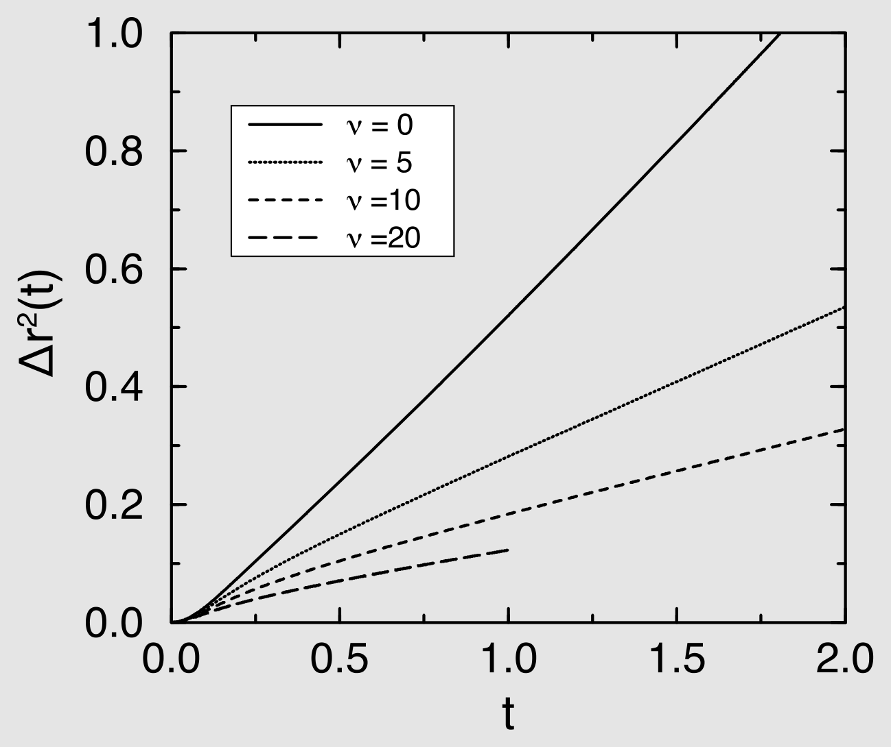
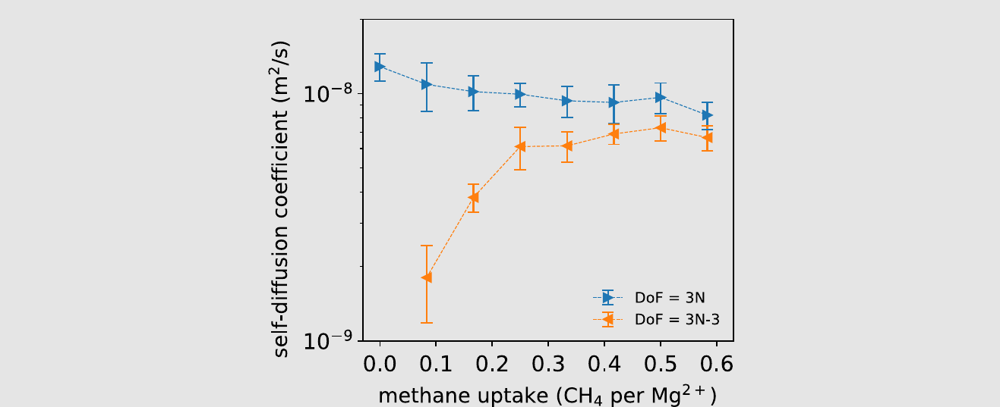
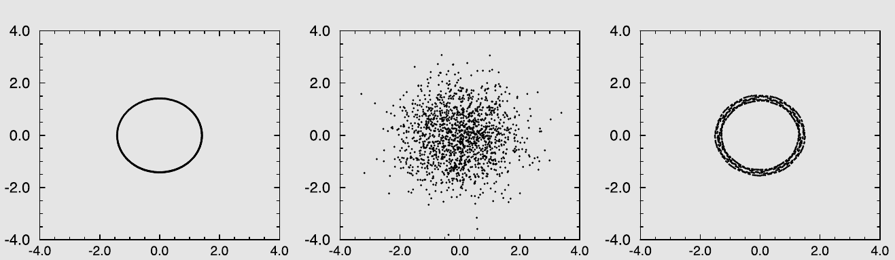
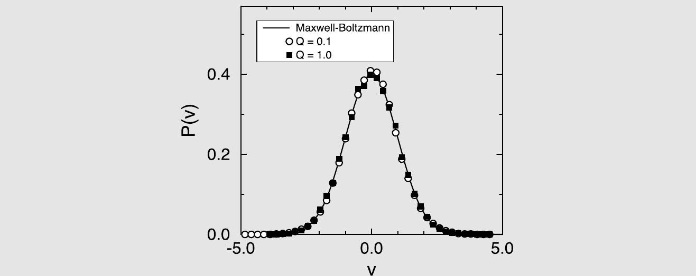
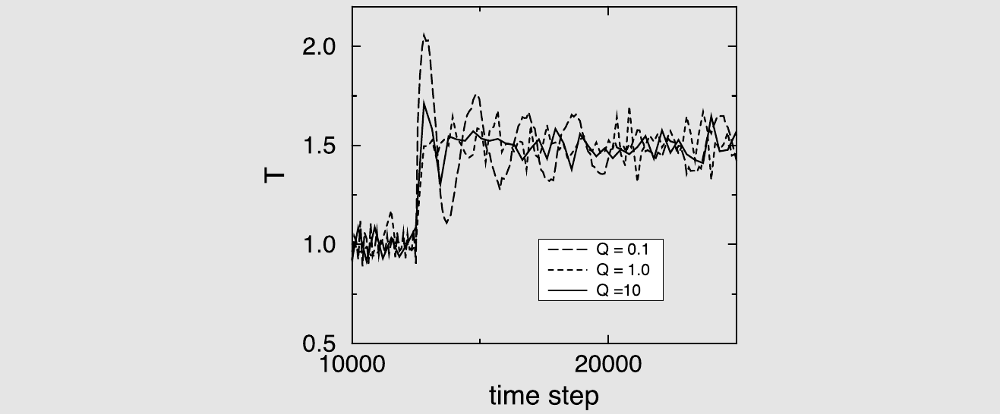
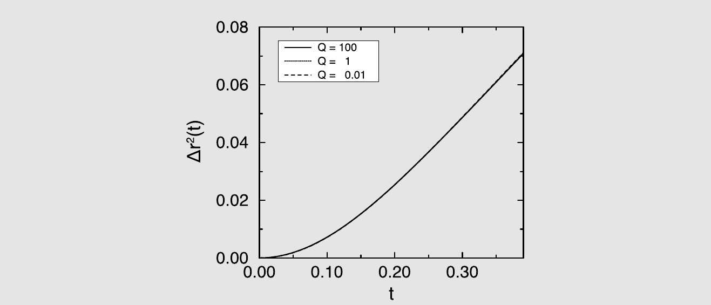

# 各种系综中的分子动力学

第4章讨论的分子动力学技术是一种求解体积$V$中$N$个粒子系统牛顿运动方程的近似方法。在没有外界扰动的情况下，按照牛顿定律演化的系统总能量$E$是一个运动常数。第4章中的MD模拟计算的是恒定$N$、$V$和$E$条件下系统的时间平均性质。如果我们模拟的系统是遍历的，那么标准MD模拟中得到的时间平均等价于微正则（恒定$NVE$）系综中的系综平均。然而，正如第6章中所讨论的，保持其他热力学参数恒定进行模拟通常更为方便，例如$N$、$V$和$T$，或者$N$、$P$和$T$。那么问题就来了：我们能否在微正则系综以外的其他系综中进行MD模拟，并获得有意义的动力学信息。这个问题的答案是：可以，但仅在一定程度内。MD模拟已经被推广到其他系综，这些模拟将给出正确的静态平均。但是，从求解牛顿运动方程的MD模拟中提取动力学信息时，应谨慎行事。下面，我们讨论一些在恒定$N$、$V$、$E$以外的系综中执行MD的更常用方法。正如将会看到的，其中一些方法随着系统尺寸的增加而越来越接近牛顿力学，而另一些则完全放弃了牛顿力学。%
[^1]

针对这一问题，已经提出了两种截然不同的解决方案。最简单的一种基于这样的思想：通过将牛顿MD与偶尔确保温度（或压力）固定的类蒙特卡罗操作相混合，可以实现其他系综的动力学模拟。由于蒙特卡罗操作涉及系统的瞬时变化，显然这种方法会破坏系统连续的时间演化。第二种方法旨在通过确保系统的总动能满足正确的正则分布来固定系统的温度。这种对动能分布的调节可以通过重新表述系统的拉格朗日运动方程来实现，也可以通过对全局动能进行随机重新标度来实现。这两种方法都产生了连续的时间演化，虽然并非真正的牛顿力学，但在某些明确定义的极限下趋近于牛顿动力学。

## 不仅仅是恒压器

我们将特别关注扩展拉格朗日方法，该方法最初由Andersen在恒压MD模拟的背景下引入[[180]](references.md#ref-180)，因为扩展拉格朗日方法已成为在MD模拟中引入额外动力学变量的最重要工具之一。扩展系综的早期例子包括Parrinello-Rahman在恒应力条件下模拟晶态固体的方案[[178,179]](references.md#ref-178)以及Nos\'{e}的等温MD版本[[248]](references.md#ref-248)。此后，扩展拉格朗日方法已被广泛应用于各种经典（和量子）模拟。因此，当我们讨论Andersen的恒压模拟方法时，读者应该记住，我们讨论的远不仅仅是一个数值恒压器。然而，在我们对非$NVE$ MD模拟的讨论中，我们选择不按照不同技术发展的历史顺序，而是按主题进行分组。

我们从恒温器开始讨论。

## 恒温分子动力学

在选择MD模拟的恒温器时，重要的是要考虑恒温器破坏了哪些物理定律，因为遗憾的是，所有恒温器至少破坏一个物理定律，许多甚至破坏两个或更多（参见例如文献[[249]](references.md#ref-249)）。三种“恒温器罪行”尤为突出：

1. **动量不守恒**  大多数（但并非全部）“随机”恒温器不守恒动量。因此，它们不能再现流体力学流动（因为流体力学等于动量守恒加质量守恒）。结果是，所有对流体力学相互作用敏感的输运性质都不能被正确再现。
1. **伽利略不变性**  一些算法重新标度系统的总动能。然而，显然，与系统整体均匀速度相关的动能与温度无关。这个问题通常可以通过考虑粒子的“特有”速度来修正，即相对于系统质心速度的速度。但对于具有非均匀驱动流动的非平衡系统，这种修正可以通过多种方式实现，取决于如何定义相关的局部参考速度。在过小的尺度上定义参考速度会产生问题——考虑每个粒子定义自己参考速度的极限情况就很清楚。反过来，在比流动不均匀性更大的尺度上定义参考速度则会导致速度重新标度改变流动剖面本身。作用于相邻粒子相对速度的恒温器不会遭受这些与缺乏伽利略不变性相关的问题[[249]](references.md#ref-249)，但可能会遇到其他问题[[250]](references.md#ref-250)。
1. **输运性质的破坏**  一些恒温器在局部作用并剧烈改变所有粒子在局部尺度上的动力学。对于这类算法，人们仍然可以计算某些输运性质，这些性质（例如扩散系数）可能仍然相当真实。然而，其他输运性质则完全失去意义。例如，讨论具有局部恒温器的系统的热导率是没有意义的：因为能量不守恒，热传导不满足傅里叶定律。此外，不满足动量守恒的系统不能服从（Navier-）Stokes方程，因此粘度系数也没有意义。

我们在前面就提到这些问题，因为它们并不总是被清楚地说明。

### 固定动能的危险

在考虑不同方案进行恒定温度的分子动力学模拟之前，我们首先应该明确恒定温度的含义。从统计力学的角度来看，不存在歧义：我们可以通过允许系统与一个大的热浴交换能量来施加系统的温度（见第2.2节）。在这些条件下，在给定能态找到系统的概率由玻尔兹曼分布给出，对于经典系统，麦克斯韦-玻尔兹曼速度分布随之而来：

$$
P(\mathbf{p}) = \left(\frac{\beta}{2\pi m}\right)^{3/2} \exp\left[-\beta p^2/(2m)\right].
\tag{7.1.1}
$$

麦克斯韦-玻尔兹曼分布建立了施加温度$T$与每个粒子的平均（平动）动能之间的简单关系：

$$
k_BT = m\langle v_\alpha^2 \rangle,
$$

其中$m$是粒子的质量，$v_\alpha$是其速度的第$\alpha$个分量。正如第4章中所讨论的，这个关系常用于在（微正则）MD模拟中测量温度。然而，恒定温度的条件并不等同于每个粒子的动能恒定的条件。为了看清这一点，考虑正则系综中每个粒子动能的相对方差。如果我们约束动能始终等于其平均值，那么方差按构造为零。现在考虑一个与热浴处于热平衡的系统。任何给定粒子动能的相对方差与麦克斯韦-玻尔兹曼分布的二阶矩和四阶矩直接相关。对于二阶矩，$p^2 = \sum_\alpha p_\alpha^2$，我们有

$$
\langle p^2 \rangle = \int \mathrm{d}\mathbf{p}\, p^2 P(\mathbf{p}) = \frac{3m}{\beta}
$$

对于四阶矩，$p^4 = \left(\sum_\alpha p_\alpha^2\right)^2$，我们可以写出

$$
\langle p^4 \rangle = \int \mathrm{d}\mathbf{p}\, p^4 P(\mathbf{p}) = 15\left(\frac{m}{\beta}\right)^2.
$$

该粒子动能的相对方差为

$$
\frac{\sigma_{p^2}^2}{\langle p^2 \rangle^2} \equiv \frac{\langle p^4 \rangle - \langle p^2 \rangle^2}{\langle p^2 \rangle^2} = \frac{15(m/\beta)^2 - (3m/\beta)^2}{(3m/\beta)^2} = \frac{2}{3}.
$$

如果我们使用每个粒子的动能作为瞬时温度的度量，那么我们会发现在正则系综中，这个温度（记为$T_k$）是涨落的。它的相对方差为

$$
\frac{\sigma_{T_k}^2}{\langle T_k \rangle_{NVT}^2} \equiv \frac{\langle T_k^2 \rangle_{NVT} - \langle T_k \rangle_{NVT}^2}{\langle T_k \rangle_{NVT}^2} = \frac{N\langle p^4 \rangle + N(N-1)\langle p^2 \rangle\langle p^2 \rangle - N^2 \langle p^2 \rangle^2}{N^2 \langle p^2 \rangle^2} = \frac{1}{N}\frac{\langle p^4 \rangle - \langle p^2 \rangle^2}{\langle p^2 \rangle^2} = \frac{2}{dN}.
$$

所以确实，在有限系统的正则系综中，瞬时动理温度$T_k$是涨落的。事实上，如果我们严格保持每个粒子的平均动能恒定（如所谓的等动能MD方案[[33]](references.md#ref-33)或更朴素的速度标度方案所做的那样），那么我们就不会模拟一个真正的恒定温度系综。显然，如果使用等动能模拟来测量对涨落敏感的平衡平均值，例如在计算热容的动能贡献时（见公式(5.1.7)），可能会出现问题。

但是，一些通过瞬时或逐渐重新标度速度来保持动能恒定的最广泛使用的算法还存在一个不太明显但很严重的问题。Harvey等人[[252]](references.md#ref-252)（另见[[253]](references.md#ref-253)）已经证明，朴素的速度重新标度会导致所谓的“飞行的冰块”效应，即来自振动、分子内自由度的动能被转移到平动动能，因此得名飞行的冰块：分子的内部自由度变冷，但平动运动变热，从而违反了细致平衡。由于飞行的冰块效应，即使这种系统的静态性质也会被不正确地采样（见[[252]](references.md#ref-252)）。飞行的冰块效应通常很小，在一些速度重新标度算法中可以观察到，但正如文献[[253]](references.md#ref-253)所解释的，有许多速度重新标度算法不会遭受这种非物理效应。在实践中，更普遍的飞行的冰块效应是由于不适当地使用速度Verlet算法中的“速度”来计算温度所致（见公式(5.1.2)和文献[[115]](references.md#ref-115)）。

非物理的温度调节通常用于在大致所需温度（即在平衡化期间）准备系统，之后可以使用更可靠的恒温器，或者在恒定$NVE$条件下运行系统。然而，使用一种算法来“平衡”系统——该算法产生一个看似恒定温度的状态，而实际上远离热平衡——可能是不明智的。由于存在高效的MD方案来产生真正的正则分布，几乎没有必要在平衡化期间使用更可疑的技术来固定温度。下面，我们将讨论限于随机恒温器，以及不会遭受上述缺陷的动能重新标度方案。

### 随机恒温器

#### Andersen恒温器

在Andersen [[180]](references.md#ref-180)提出的恒定温度方法中，系统与一个施加所需温度的热浴耦合。与热浴的耦合由偶尔作用于随机选择粒子的随机脉冲力来表示。这些与热浴的随机“碰撞”可以被视为蒙特卡罗操作，将系统从一个恒定能量面转移到另一个恒定能量面。在随机碰撞之间，系统按照正常的牛顿运动定律在恒定能量下演化。随机碰撞确保所有可及的恒定能量面按照其玻尔兹曼权重被访问。重要的是，Andersen恒温器不守恒动量。因此，当预期流体力学效应很重要时（例如系统中存在驱动流动时），或者在平衡态的流体力学模式耦合效应中，不应使用Andersen恒温器。

使用Andersen恒温器准备恒定温度模拟的第一步是选择与热浴的耦合强度。这种耦合强度由改变动量的随机碰撞频率决定。我们用$\nu$表示这个频率。在Andersen方案中，单位时间内产生碰撞的概率与先前碰撞的时间无关：换句话说，碰撞被假设为服从泊松分布。对于泊松过程，两次连续碰撞之间的时间间隔分布$P(t;\nu)$具有如下形式[[254,255]](references.md#ref-254)：

$$
P(t;\nu) = \nu \exp[-\nu t],
\tag{7.1.2}
$$

其中$P(t;\nu)dt$是在$t = 0$时发生碰撞的条件下，下一次碰撞发生在区间$[t, t+dt]$内的概率。

恒定温度模拟现在包括以下步骤：

1. 从初始的一组位置和动量$\{\mathbf{r}^N(0), \mathbf{p}^N(0)\}$出发，积分运动方程一段$\Delta t$时间。
1. 随机选择$m$个粒子与热浴发生碰撞，其中$m$由泊松分布$P(m) = \bar{m}^m e^{-\bar{m}}$给出，$\bar{m} = \nu\Delta t$。
1. 如果粒子$i$被选中发生碰撞，其新速度将从对应于所需温度$T$的麦克斯韦-玻尔兹曼分布中抽取。所有其他粒子不受此碰撞影响。

牛顿动力学与随机碰撞的混合将分子动力学模拟转变为一个随机马尔可夫过程[[67]](references.md#ref-67)。正如[[180]](references.md#ref-180)中所证明的，相空间中的正则分布在随机碰撞的重复应用下是不变的，加上马尔可夫链也是不可约的和非周期的[[180,254,255]](references.md#ref-180)，这意味着Andersen算法确实产生正则分布。在算法 16和 17中，我们展示了如何在分子动力学模拟中实现Andersen方法。

**算法 16　分子动力学：Andersen 恒温器**

```
program md_Andersen               % 恒温 MD
[初始化体系]                       % 同算法 3
[计算力与能量]                     % 同算法 5
t=0
while t < tmax do                 % MD 主循环
    switch = 1
    integrate-A(switch,temp)      % 推进半个时间步（算法 17）
    FandE                         % 算法 5
    switch = 2
    integrate-A(switch,temp)      % 推进后半个时间步
    t=t+dt
    sample                        % 采样可观测量
end while
end program
```

**具体说明**（一般说明参见第 7 页）：

1. 所需温度 `temp` 在初始化时设定。
1. 因为 Andersen 恒温器作用于速度，它使用速度-Verlet 算法（见第 4.3 节），即式 (4.3.4) 与 (4.3.5)。本算法分两步进行：第 1 步 **integrate-A**(`1,temp`) 中，我们已知时刻 `t` 的力与速度，于是更新 `x(t)` 并确定
   $$
   v' = v(t) + \frac{f(t)}{2m}\,\mathrm{d}t .
   $$
   随后在 **FandE** 中确定 `t=t+dt` 时的力；最后在第 2 步 **integrate-A**(`2,temp`) 中确定时刻 `t=t+dt` 的速度，
   $$
   v(t + \mathrm{d}t) = v' + \frac{f(t + \mathrm{d}t)}{2m}\,\mathrm{d}t .
   $$
   在 Andersen 算法中，我们额外加入一步：在位置与速度完成速度-Verlet 更新之后，我们给随机选出的一部分粒子赋予新的速度，这些速度取自温度为 `temp` 的 Maxwell-Boltzmann 分布。其结果是，速度在整数个时间步处被更新。函数 **integrate-A** 见算法 17。

**算法 17　运动方程：Andersen 恒温器**

```
function integrate-A(switch,temp) % 带 Andersen 恒温器地积分运动方程
if switch == 1 then               % 速度 Verlet 第一步
    for 1 <= i <= npart do
        x(i)=x(i)+dt*v(i)+        % 更新当前时刻的位置
             dt*dt*f(i)/2
        v(i)=v(i)+dt*f(i)/2       % 第一次更新速度
    enddo
else if switch == 2 then          % 速度 Verlet 第二步
    for 1 <= i <= npart do
        v(i)=v(i)+dt*f(i)/2       % 第二次更新速度
    enddo
    for 1 <= i <= npart do
        if R < nu*dt then         % 检验是否与热浴碰撞
            v(i)=gauss(0.,sqrt(temp))  % 从 Gauss 分布抽取
        endif                          % 新速度赋予该粒子
    enddo
endif
end function
```

**具体说明**（一般说明参见第 7 页）：

1. 出于算法 16 之后所解释的原因，**integrate-A** 使用速度-Verlet 算法[[113]](references.md#ref-113)。
1. 函数 **gauss**(`0., sigma`) 返回一个取自零均值、标准差为 `sigma` 的 Gauss 分布的值（例见算法 36）。
1. 与热浴的碰撞假定服从 Poisson 分布（第 7.1.2 节）。碰撞频率 `nu` 在模拟开始时设定。
1. 在该算法中，总能量与总动量都不守恒。
1. 因为 Andersen 恒温器不守恒动量，它不能用于描述流体力学流动。Lowe-Andersen 恒温器（第 7.1.1.2 节）没有这一缺点。

???+ example "例 14（Andersen 恒温器的使用）"

    Andersen恒温器[[180]](references.md#ref-180)可以说是最简单的已被证明能产生正则分布的MD恒温器。这意味着所考虑系统的动能和势能都是玻尔兹曼分布的。

    然而，Andersen算法既不守恒动量也不守恒能量，因为它将从麦克斯韦-玻尔兹曼分布中抽取的新速度赋予随机选择的粒子。我们将这些更新称为随机“碰撞”。随机碰撞的效果是，具有Andersen恒温器的系统的动力学性质可能与没有恒温器的系统或具有“全局”恒温器的系统存在实质差异，甚至灾难性的差异[[256,257]](references.md#ref-256)。

    在扩散的情况下，很容易直观理解Andersen恒温器会降低自扩散系数$D$：Green-Kubo关系将$D$与速度自关联函数（VACF）的积分联系起来。速度持续的时间越长，$D$就越大。反之，任何破坏速度持续性的效应都会降低$D$。而破坏$v$中的持续性正是Andersen恒温器所做的：$\nu$越高，随机碰撞频率越高，$D$越低。这种效应如图 7.1所示。

    

    *图 7.1　Lennard-Jones流体（$T = 2.0$，$N = 108$）的均方位移作为时间的函数，对应Andersen恒温器不同碰撞频率$\nu$的值。*

    在实际情况下，$\nu$通常这样选择：使得线度为$L$的系统模拟中能量涨落衰减的时间尺度$\tau_E$与无界介质中波长为$L$的热涨落的时间尺度相当：$\tau_E \approx [L^2(N/V)C_P]/\lambda$，其中$C_P$是每分子（恒压）热容，$\lambda$是热导率。对于相当大的系统，这样的$\tau_E$值只能通过相当低的每个粒子碰撞率来实现，在这种情况下，碰撞对动力学的影响可能很小[[180]](references.md#ref-180)，但同时恒温器也变得相当低效。

    在计算热导率或粘度等量时，不应使用Andersen恒温器。

    原因是这些量提供了能量或动量扩散速率的度量。但这种描述只有在能量和动量守恒时才有意义。使用Andersen恒温器时，能量或动量的局部扰动不会扩散开来，而是以指数方式被屏蔽。这种效应不能用（正常）扩散方程来描述。

    总结：在计算输运性质时不要使用Andersen方法。对于静态性质，它是可行的——而且非常容易实现。

    图 7.1显示，随机碰撞频率对均方位移的时间依赖性有强烈影响。均方位移仅在极低随机碰撞率的极限下才变得与$\nu$无关。然而，所有静态性质（如压力或势能）严格地与随机碰撞频率无关。更多细节见SI（案例研究11）。

#### 局部动量守恒随机恒温器

按照构造，Andersen恒温器既不守恒能量也不守恒动量。能量不守恒是不可避免的。然而，正如Lowe [[258]](references.md#ref-258)所证明的，可以遵循Andersen的论证来构造一个保持系统在固定温度的动量守恒随机算法。与Andersen恒温器的关键区别在于，Lowe-Andersen恒温器不是给一个粒子赋予从麦克斯韦-玻尔兹曼分布中抽取的新速度，而是考虑一对粒子的径向相对速度（即沿连接两个粒子质心连线方向的相对速度分量），并用从相对速度的麦克斯韦-玻尔兹曼分布中抽取的新相对速度来替换它。选择要重置相对速度的粒子对在某种程度上是任意的，只要不引入偏差即可。Lowe的选择是在距离$r_c$内选择两个随机粒子，其中$r_c$可以自由选择。通过使$r_c$与粒子间平均最近邻距离相当，恒温器对系统粘度的影响（该粘度现在定义良好）可以被最小化（但不能消除）。总的来说，具有Lowe-Andersen恒温器的系统的输运性质比原始Andersen恒温器更接近未受扰动的输运性质[[259]](references.md#ref-259)。

关于Lowe和Andersen恒温器，一个略显微妙的问题是，由于它们是局部恒温器，它们在粒子最多的地方作用最强。在Andersen情况下，热化速率应与局部密度成正比，而对于Lowe-Andersen恒温器，这个速率与局部密度的平方成正比（除非$r_c$与系统尺寸相当）。

#### Langevin动力学

Langevin动力学的思想比分子动力学方法的引入早了近半个世纪。1908年，Paul Langevin发表了一篇文章[[260]](references.md#ref-260)，提出了一个描述球形胶体粒子在粘性流体中布朗运动的简单方程。原始的Langevin方程为（仅考虑速度的一个分量）：

$$
m\dot{v}_x(t) = -\gamma v_x(t) + R_x(t),
\tag{7.1.3}
$$

其中$v_x$是粒子速度的$x$分量，$m$是其质量，$\gamma$是摩擦系数，用于考虑粘性阻力（对于具有无滑移流体力学边界条件的粒子，该阻力系数由Stokes表达式$\gamma = 6\pi\eta a$给出，其中$\eta$是流体的粘度，$a$是胶体粒子的半径）。

在模拟中，Langevin方程包括溶质粒子之间保守力的效应：

$$
m\dot{v}_x(t) = -\gamma v_x(t) - \frac{\partial U(\mathbf{r}^N)}{\partial x} + R_x(t),
\tag{7.1.4}
$$

其中$\mathbf{r}^N$表示$N$个溶质粒子的坐标。Langevin方程（LE）的伟大创新在于引入了所谓的随机力$R$，它代表了溶剂分子对胶体施加的快速变化的力。$R$的均值为零；它被称为随机力以区别于胶体上的流体力学阻力。阻力也是由溶剂引起的，但与随机力不同，它与胶体速度（线性）相关。在没有随机力的情况下，胶体的速度会迅速衰减到零。然而，随机力确保胶体保持运动，尽管它会失去对原始速度的记忆。

公式(7.1.3)描述了一个孤立粒子在流体中仅受随机力$R$和摩擦力$-\gamma v$作用时速度的随机时间演化。重要的是，$\gamma$和$R$是相关的：

$$
\langle R_x(0)R_x(t)\rangle = 2\gamma k_B T \delta(t).
\tag{7.1.5}
$$

在模拟中，我们将使用Langevin方程的离散化形式，并用该形式来解释公式(7.1.5)。随机力$R_x$可以在每个时间步结束时作用于粒子，导致随机的动量转移$P_x = R_x \Delta t$。如果一个系统在温度$T$下处于平衡，随机动量转移应在平均上补偿由于摩擦导致的动能损失，即

$$
(m/2)\langle p_x^2\rangle e^{-2(\gamma/m)\Delta t} - 1 \approx -\langle p_x^2\rangle \gamma \Delta t,
$$

其中（为方便起见）我们假设了$(\gamma/m)\Delta t \ll 1$。由于随机动量转移导致的能量增益为

$$
(1/2m)\langle(p_x + P_x)^2 - p_x^2\rangle = (1/2m)\langle P_x^2\rangle.
\tag{7.1.6}
$$

两者在温度$T$下应平衡：

$$
(1/2m)\langle P_x^2\rangle = mk_B T \gamma \Delta t,
\tag{7.1.7}
$$

$$
\langle P_x^2\rangle = 2k_B T \gamma \Delta t,
\tag{7.1.8}
$$

这是公式(7.1.5)的离散化形式。

在Langevin模拟中，我们必须以通常的方式更新位置和动量，但此外，我们还必须包括一个步骤来更新粒子由于摩擦力和随机力导致的速度（在离散实现中，最好从随机动量转移的角度来考虑）。有几种方法可以将Langevin方程的离散时间传播分解为这些基本子步骤，其中一些分解比其他的具有更好的行为。

在实践中，我们必须决定执行位置更新（R）、由保守力导致的速度更新（V）以及由摩擦力和随机力导致的速度更新（O）的顺序（我们使用文献[[261]](references.md#ref-261)的O、V、R记法）。哪种Langevin算法更优取决于（毫不奇怪）哪些算法特性被认为最重要[[23,261]](references.md#ref-23)。在文献中，已经形成共识认为Leimkuhler和Matthews [[23]](references.md#ref-23)的方法（VRORV）是首选的[[262]](references.md#ref-262)。还有许多其他流行的Langevin积分方案（参见例如[[261]](references.md#ref-261)），它们可以被视为文献[[261]](references.md#ref-261)的OVRVO方案的极限情况或近似版本。

Langevin方程的一个关键缺陷是它不守恒动量。另一个（密切相关但不相同的）缺陷是它没有考虑不同溶质粒子之间的流体力学相互作用。溶质粒子之间的流体力学相互作用是由于如果一个粒子运动，它会创造一个流场，该流场对其他溶质粒子施加阻力。如果我们考虑这些（极长程的）依赖于速度的阻力，我们还应该考虑不同粒子的随机力现在是相关的。虽然已经开发了一些方法来处理Langevin方程中的流体力学相互作用，但我们不讨论它们，因为通常在复杂的受限几何结构中它们变得非常繁琐，而正是在这些结构中它们最重要。[^2]相反，在第16章中我们将讨论简单的、高度粗粒化的方法（耗散粒子动力学、随机旋转动力学），它们以最便宜的方式考虑了溶剂的粒子性质。第16章描述的方法确实守恒动量，并再现流体力学相互作用，即使在复杂的几何结构中也是如此。

**布朗动力学**

Langevin动力学的一个重要极限是平动运动被强过阻尼的情况，即Langevin方程中的惯性项可以忽略不计。在这种情况下，Langevin方程简化为

$$
0 = -\gamma \dot{x}(t) - \frac{\partial U(\mathbf{r}^N)}{\partial x} + R_x(t),
\tag{7.1.9}
$$

这是布朗动力学（BD）模拟的基本方程。布朗动力学中随机力与摩擦系数的关系与Langevin情况相同。注意公式(7.1.9)仅描述了位置的时间演化。它被广泛用于模拟胶体、聚合物或蛋白质系统的扩散行为。与Langevin模拟一样，当必须包含流体力学相互作用时，BD模拟变得更加困难。

### 全局动能重新标度

MD模拟中最早的恒温器通过对所有粒子速度进行瞬时或渐进的全局重新标度来保持系统的动能恒定[[251,264]](references.md#ref-251)。然而，这些早期恒温器不对应于一个明确定义的系综，更严重的是，它们存在严重的伪影[[252,253]](references.md#ref-252)。

尽管如此，通过某种全局动能重新标度来采样正则系综的MD算法仍然非常有吸引力，而不是使用Andersen或Langevin恒温器中实现的局部方案。全局动能控制之所以有吸引力的主要原因是：a) 这种恒温器的效果总体上非常温和，因为单个粒子的速度仅被少量改变；b) 这种恒温器可以被设计为守恒动量。

最早表现良好的全局恒温器是Nos\'{e} [[248,265]](references.md#ref-248)提出的，我们将简要讨论它，因为它很好地说明了如何使用扩展拉格朗日来设计新的分子动力学形式。Nos\'{e}的方法受到了Andersen早期使用扩展拉格朗日模拟恒压系统的启发（见第7.2节）。然而，Nos\'{e}开发的恒温方法有很大不同，值得单独讨论，特别是因为其他扩展拉格朗日方法在分子模拟中被广泛使用。尽管如此，即使Nos\'{e}恒温器以Hoover [[257]](references.md#ref-257)提出的形式仍然被广泛使用，我们不会详细讨论它，因为它不如Bussi等人[[256]](references.md#ref-256)的随机动能重新标度恒温器稳健（和简单）。

#### 扩展拉格朗日方法

牛顿运动方程守恒能量。因此，要在恒定温度下执行MD，我们必须修改运动方程。构造新运动方程最稳健的方法是从力学的拉格朗日表述出发。遵循这条路线的优势在于，一旦拉格朗日被修改，修改后的哈密顿量随之而来，并且关键的是，它是一个运动常数。这一观察已经表明，对于NVT-MD，哈密顿量的值不能等于$N$体系统的能量$E$。技巧在于找到一个合适的拉格朗日形式，使其产生的动力学的时间平均等于恒定$NVT$的$N$体系统的时间平均。扩展拉格朗日方法由Andersen [[180]](references.md#ref-180)开创，用于构造恒压动力学算法。Andersen也使用了一个恒温器，但那是随机的，正如我们在第7.1.1.1节中看到的。我们在第7.2节简要讨论Andersen的恒压方法。然而，我们从Nos\'{e}的恒温MD的拉格朗日方法开始。[^3]

为了构造等温分子动力学，Nos\'{e}提出在经典$N$体系统的拉格朗日量中引入一个额外的坐标$s$：

$$
\mathcal{L}_{\mathrm{Nose}} = \sum_{i=1}^{N}\frac{m_i}{2}s^2\dot{\mathbf{r}}_i^2 - U(\mathbf{r}^N) + \frac{Q}{2}\dot{s}^2 - \frac{L}{\beta}\ln s,
\tag{7.1.10}
$$

其中$Q$是一个有效的“质量”，用于量化与$s$的运动相关的惯性。在此阶段，$L$是一个参数，稍后将被固定。

与$\mathbf{r}_i$和$s$共轭的动量直接从公式(7.1.10)得出：

$$
\mathbf{p}_i \equiv \frac{\partial \mathcal{L}}{\partial \dot{\mathbf{r}}_i} = m_i s^2 \dot{\mathbf{r}}_i,
\tag{7.1.11}
$$

$$
p_s \equiv \frac{\partial \mathcal{L}}{\partial \dot{s}} = Q\dot{s}.
\tag{7.1.12}
$$

一旦我们有了动量，就可以写出$N$个粒子加上额外坐标$s$的扩展系统的哈密顿量：

$$
\mathcal{H}_{\mathrm{Nose}} = \sum_{i=1}^{N}\frac{\mathbf{p}_i^2}{2m_i s^2} + U(\mathbf{r}^N) + \frac{p_s^2}{2Q} + \frac{L}{\beta}\ln s.
\tag{7.1.13}
$$

我们考虑一个包含$N$个原子的系统。由于$\mathcal{H}_{\mathrm{Nose}}$守恒，由该哈密顿量产生的动力学采样一个微正则系综，但处于具有$2dN + 2$个坐标和动量的扩展系统中。[^4]该系综的配分函数为：

$$
Q_{\mathrm{Nose}} = \frac{1}{N!}\int \mathrm{d}\mathbf{p}_s\, \mathrm{d}s\, \mathrm{d}\mathbf{p}^N\, \mathrm{d}\mathbf{r}^N\, \delta(E - \mathcal{H}_{\mathrm{Nose}}),
\tag{7.1.14}
$$

其中，在第二行中，我们定义了$\mathbf{p}' \equiv \mathbf{p}/s$。引入$\mathbf{p}'$的理由将在后面变得清楚。然后我们可以将哈密顿量中依赖于$\mathbf{p}'$和$\mathbf{r}$的部分写为

$$
H(\mathbf{p}',\mathbf{r}) \equiv \sum_{i=1}^{N}\frac{\mathbf{p}_i'^2}{2m_i} + U(\mathbf{r}^N).
\tag{7.1.15}
$$

当$\delta$函数的参数是函数$h(s)$时，如果$h(s)$在$s_0$处有唯一根，我们可以写出$\delta[h(s)] = \delta(s - s_0)/|h'(s_0)|$，其中$h'(s)$表示$h$对$s$的导数。如果我们将这个表达式代入公式(7.1.14)并使用公式(7.1.15)，对于配分函数我们得到：

$$
Q_{\mathrm{Nose}} = C\int \mathrm{d}\mathbf{p}'^N\, \mathrm{d}\mathbf{r}^N\, \exp\left[-\beta H(\mathbf{p}',\mathbf{r})\right],
\tag{7.1.16}
$$

因此，我们看到Nos\'{e}巧妙地选择额外变量确保动力学在$\{\mathbf{p}', \mathbf{r}\}$空间中生成一个正比于$\exp\left[-\beta[(dN + 1)/L] H(\mathbf{p}',\mathbf{r})\right]$的概率密度。因此，如果选择$L = dN + 1$，$\{\mathbf{p}', \mathbf{r}\}$空间中的概率密度等于$\exp\left[-\beta H(\mathbf{p}',\mathbf{r})\right]$！动力学变量$A$的系综平均可以写为：

$$
\langle A(\mathbf{p}/s, \mathbf{r})\rangle_{\mathrm{Nose}} = \frac{(1/N!)\int \mathrm{d}\mathbf{p}'^N\, \mathrm{d}\mathbf{r}^N\, A(\mathbf{p}',\mathbf{r})\,\exp\left[-\beta H(\mathbf{p}',\mathbf{r})\right]}{Q(NVT)} = \langle A(\mathbf{p}',\mathbf{r})\rangle_{NVT}.
\tag{7.1.17}
$$

然而，有一个问题：使哈密顿量看起来很熟悉的相空间坐标$\mathbf{p}'$、$\mathbf{r}$不满足哈密顿运动方程，只有原始的$\mathbf{p}$和$\mathbf{r}$才满足。

与正则系综平均相对应的正确时间平均为：

$$
\bar{A} = \lim_{\tau\to\infty}\frac{1}{\tau}\int_0^{\tau} \mathrm{d}t\, A(\mathbf{p}(t)/s(t), \mathbf{r}(t)) \equiv \langle A(\mathbf{p}/s, \mathbf{r})\rangle_{\mathrm{Nose}}.
\tag{7.1.18}
$$

这有些不方便，因为$\mathbf{p}$和$\mathbf{p}'$之间的比值等于$s$，而$s$依赖于时间。

考虑变量$s$的作用是有启发性的。在公式(7.1.17)的系综平均中，相空间由坐标$\mathbf{r}$和标度动量$\mathbf{p}'$张成。由于标度动量与可观测量性质最直接相关（特别是，动能等于$\mathbf{p}'^2/(2m)$），我们将$\mathbf{p}'$称为真实动量，而$\mathbf{p}$被解释为虚拟动量。我们对其他变量也做了类似的实变量和虚变量区分。实变量用撇号标记，以区别于未标记的虚变量对应物。实变量和虚变量的关系如下：

$$
\mathbf{r}' = \mathbf{r},
\tag{7.1.19}
$$

$$
\mathbf{p}' = \mathbf{p}/s,
\tag{7.1.20}
$$

$$
s' = s,
\tag{7.1.21}
$$

$$
\Delta t' = \Delta t/s.
\tag{7.1.22}
$$

从公式(7.1.22)可以得出，$s$可以被解释为时间步长的标度因子。公式(7.1.18)表明，应该通过在（虚拟）时间步长$\Delta t$的整数倍处采样可观测量来获得时间平均，这对应于非恒定的实际时间步长。然而，也可以在实际时间中按等间隔采样。在这种情况下，我们测量一个略有不同的平均值。我们定义

$$
\bar{A}' = \lim_{\tau'\to\infty}\frac{1}{\tau'}\int_0^{\tau'} \mathrm{d}t'\, A(\mathbf{p}(t')/s(t'), \mathbf{r}(t')).
\tag{7.1.23}
$$

公式(7.1.22)表明实际和虚拟测量时间$\tau'$和$\tau$通过以下方式关联：

$$
\tau' = \int_0^{\tau} \mathrm{d}t\, 1/s(t).
\tag{7.1.24}
$$

这给出，对于公式(7.1.23)：

$$
\bar{A}' = \frac{\langle A(\mathbf{p}/s, \mathbf{r})/s\rangle}{\langle 1/s\rangle}.
$$

如果我们再次考虑配分函数公式(7.1.16)，可以写出系综平均：

$$
\langle A(\mathbf{p}/s, \mathbf{r})\rangle_{NVT}.
$$

注意在这种情况下，如果我们选择$L = dN$，则恢复正则平均。因此，如果使用基于实际时间中等时间步长的采样方案，我们必须使用不同的$L$值。在示例7中，我们讨论了一个正确选择自由度数至关重要的系统。

???+ example "例证 7（受限气体的扩散系数）"

    经典$N$体系统的总平动动能等于$\sum_{i=1}^{N}\sum_{\alpha=1}^{d}p_{i,\alpha}^2/(2m_i)$。经典统计力学的能量均分定律指出，该求和中每一项相关的平均热能等于$(1/2)k_BT$。如果每个动量分量都是一个独立的自由度，这个表达式将是正确的。

    对于宏观系统，朴素的均分定律是合理的，因为动能中的自由度数近似等于$dN$。然而，如果我们在小系统上执行分子动力学模拟，我们必须更加小心。在块体系统的模拟中，我们经常使用周期性边界条件并固定系统的总动量。对总动量的这种约束固定了$L$个自由度。在三维中，动能中的实际自由度数是$3N - 3$。

    然而，自由度数会改变，如果我们模拟一个受限系统，例如吸附在孔隙中的气体。大多数孔隙被建模为刚性系统；因此，对于孔隙内的气体分子，与孔隙原子的相互作用代表一个外场。由于这种外场，$N$个原子的质心动量不是固定的，这些气体分子的自由度是$3N$。我们需要模拟中正确的自由度数来计算温度，并且在某些算法中，作为恒温模拟的输入（例如Nos\'{e}-Hoover）。如果我们模拟大于1,000个粒子的系统，$N$和$N - 3$之间的差异通常太小而不会产生任何可见影响（尽管这不是错误执行模拟的借口）。

    对于某些系统，人们希望模拟少得多的粒子。一个例子是多孔材料中扩散系数的计算。假设你有兴趣与吸附在这种多孔介质中的分子的实验扩散系数进行比较。在这种情况下，如果我们将计算的扩散系数外推到零负载极限[[193]](references.md#ref-193)，这种比较会变得更容易。因此，模拟少量气体分子具有直接相关性。对于这样小的数量，$3N$和$3N - 3$之间的差异可能很显著。在图 7.2中，Xu等人[[107]](references.md#ref-107)比较了使用正确和不正确自由度数的Nos\'{e}-Hoover模拟计算的扩散系数。在Nos\'{e}-Hoover哈密顿量中，配分函数由（见公式(7.1.16)）给出。

    

    *图 7.2　CH$_4$ 在金属有机骨架 M2(dobdc)（M：Mg、Ni 和 Zn）中的自扩散系数随负载量的变化。图中比较了使用正确与不正确的自由度所得的结果。本图基于文献[[107,266]](references.md#ref-107) 的数据。*

    其中$L$是自由度数，如果我们使用$L = 3N - 3$，而实际数是$3N$，我们实际上在比我们认为的更低的温度$T'$下进行模拟。[^5]

    图 7.2中的结果表明，如果减少粒子数，扩散系数似乎会降低。这将是一个令人惊讶的观察，因为人们会预期扩散系数增加。然而，在不正确的自由度数下，有效温度随着粒子数的减少而降低——温度越低，扩散系数越低。正确自由度数的结果确实显示了预期行为。

    从哈密顿量公式(7.1.13)，我们可以推导虚拟变量$\mathbf{p}$、$\mathbf{r}$和$t$的运动方程：

    $$
    \frac{d\mathbf{r}_i}{dt} = \frac{\partial \mathcal{H}_{\mathrm{Nose}}}{\partial \mathbf{p}_i} = \frac{\mathbf{p}_i}{m_i s^2},
    \tag{7.1.25}
    $$

    $$
    \frac{d\mathbf{p}_i}{dt} = -\frac{\partial \mathcal{H}_{\mathrm{Nose}}}{\partial \mathbf{r}_i} = -\frac{\partial U(\mathbf{r}^N)}{\partial \mathbf{r}_i},
    $$

    $$
    \frac{ds}{dt} = \frac{\partial \mathcal{H}_{\mathrm{Nose}}}{\partial p_s} = p_s/Q,
    $$

    $$
    \frac{dp_s}{dt} = -\frac{\partial \mathcal{H}_{\mathrm{Nose}}}{\partial s} = \sum_i \frac{\mathbf{p}_i^2}{m_i s^3} - \frac{L}{\beta s}.
    \tag{7.1.26}
    $$

    用实变量表示，这些运动方程可以写为：

    $$
    \frac{d\mathbf{r}_i'}{dt'} = \frac{\mathbf{p}_i'}{m_i},
    $$

    $$
    \frac{d\mathbf{p}_i'}{dt'} = -\frac{\partial U(\mathbf{r}'^N)}{\partial \mathbf{r}_i'} - (s' p_s'/Q)\mathbf{p}_i',
    \tag{7.1.27}
    $$

    $$
    \frac{ds'}{dt'} = s'^2 p_s'/Q,
    \tag{7.1.28}
    $$

    $$
    \frac{d(s' p_s'/Q)}{dt'} = \sum_i \frac{\mathbf{p}_i'^2}{m_i} - \frac{L}{\beta Q}.
    \tag{7.1.29}
    $$

    对于这些运动方程，以下量是守恒的：

    $$
    \mathcal{H}'_{\mathrm{Nose}} = \sum_{i=1}^{N}\frac{\mathbf{p}_i'^2}{2m_i} + U(\mathbf{r}'^N) + \frac{s'^2 p_s'^2}{2Q} + L\frac{\ln s'}{\beta}.
    \tag{7.1.30}
    $$

    我们再次强调，$\mathcal{H}'_{\mathrm{Nose}}$表示为$\mathbf{p}'$和$\mathbf{r}'$的函数不能被视为哈密顿量，因为$\mathbf{p}'$和$\mathbf{r}'$的时间演化不满足哈密顿运动方程。

    一个结果是，Nos\'{e}-Hoover（NH）算法在实变量意义上不是保面积的。这种（局部地）不守恒相空间体积的性质是NH算法与其他非哈密顿算法共有的。这个问题已被Tuckerman等人[[267]](references.md#ref-267)详细分析，他们描述了一个获得非哈密顿系统正确系综平均的一般方法。文献[[267]](references.md#ref-267)的方法在附录B中简要描述。在SI（第L.6.1.1节）中，我们还描述了Nos\'{e}-Hoover算法的实际实现。

**Nos\'{e**恒温器的优缺点}

Nos\'{e}开发的方法很巧妙，但并不直观。因此，该方法的某些问题过了一段时间才被认识。所有已知的问题都得到了修复，但代价是使算法更加不直观。

尽管如此，NH算法仍然被广泛使用，因为它有许多积极的特性：

1. NH算法是一个温和的恒温器，意味着它对所有粒子运动都有一些影响，但不会强烈影响任何一个。因此，NH产生的动力学随着系统尺寸的增长而趋近于牛顿动力学。
1. NH算法守恒虚拟动量，并且守恒一个类哈密顿量。这与守恒真实能量和动量并不完全相同，但a) 它允许我们检查代码中是否存在错误，b) 由于$\mathbf{p}' = \mathbf{p}/s$，显然在$\mathbf{p}' = 0$的情况下，总真实动量和虚拟动量都守恒。

正是这些有吸引力的特性使得NH恒温器如此受欢迎。然而，NH恒温器也有严重的缺点：一个已经提到，它在实坐标和动量的相空间中不是保面积的。另一个问题是NH恒温器并不总是遍历的。当恒温器耦合到（几乎）谐振自由度时，这个问题尤其严重，但对于具有多个守恒量的系统来说通常是真实的。图 7.6展示了一个极端情况来说明这个问题。



*图 7.6　谐振子的轨迹：（自左至右）微正则系综中、使用 Andersen 方法以及使用 Nosé-Hoover 方法。纵轴为速度，横轴为位置。*

Nos\'{e}-Hoover算法的这种非遍历行为首先由Hoover [[257]](references.md#ref-257)观察到，但在实际分子模型的模拟中也观察到了类似的效果[[268]](references.md#ref-268)。Tuckerman等人[[267]](references.md#ref-267)认为，NH算法可能无法恢复正则分布的原因是Nos\'{e}的推导仅假设了能量守恒，而实际上其他量也可能守恒。一个明显的候选是动量守恒。但如果系统的总动量为零，只要我们选择$L = d(N - 1)$，动量守恒就不是问题。但这仍然不能解决问题：Tuckerman等人[[267]](references.md#ref-267)提出，在某些情况下（例如一维谐振子），可能存在其他不太明显的额外守恒律。SI（第L.6.1.1节）说明了，在存在此类额外守恒律的情况下，算法不会产生所需的分布。

为了缓解Nos\'{e}-Hoover恒温器的非遍历性问题，Martyna等人[[269]](references.md#ref-269)提出了一种方案，其中Nos\'{e}-Hoover恒温器耦合到另一个恒温器，或者在必要时耦合到一整条恒温器链。如附录L.6.1.2所示，这些链考虑了额外的守恒律。Martyna等人[[269]](references.md#ref-269)表明，原始Nos\'{e}-Hoover方法的这种推广仍然产生正则分布（前提是它确实是遍历的）：见SI（第L.6.1.2节）。

但是，所有这些关于NH恒温器以及后续Nos\'{e}-Hoover链的巧妙设计，虽然对理论家来说是巨大的收获，却使一种本已不直观的方法变得更加复杂。这对NH算法的生存前景并不乐观，因为特别是在更复杂的系统中，需要一些技巧来选择使用一组Nos\'{e}-Hoover恒温器实现遍历恒温的最佳方式。此外，现在有稳健且简单的全局速度重新标度恒温器（见第7.1.3节），它们不会受到Nos\'{e}-Hoover算法的问题的影响，也不受更临时性的速度重新标度方案[[251,264]](references.md#ref-251)的影响。话虽如此：NH（或NH链）算法如果使用正确，功能强大，并且已在许多程序包中实现。

多个NH恒温器通常在不同自由度需要维持在不同温度的应用中使用（例如确保“冷”自由度绝热地跟随“热”自由度）。

#### 应用

我们通过Lennard-Jones流体的Nos\'{e}-Hoover模拟来说明上述讨论的一些要点。

???+ example "例 15（Nos\'{e）"

    -Hoover 恒温器的使用}
    **例15（Nos\'{e**-Hoover恒温器的使用）。}与例14一样，我们首先展示Nos\'{e}-Hoover方法再现了恒定$NVT$系统的行为。在图 7.3中，我们将Nos\'{e}-Hoover恒温器产生的速度分布与相同温度下正确的麦克斯韦-玻尔兹曼分布(7.1.1)进行了比较。该图说明速度分布确实与耦合常数$Q$的选择值无关。

    

    *图 7.3　Lennard-Jones 流体中的速度分布（$T = 1.0$，$\rho = 0.75$，$N = 256$）。实线为 Maxwell-Boltzmann 分布 (7.1.1)。符号为使用 Nosé-Hoover 恒温器[[256]](references.md#ref-256) 的模拟结果。*

    观察系统对施加温度突然增加的反应是有启发性的。图 7.4显示了系统动能温度的演化。在12,000个时间步后，施加的温度从$T = 1$突然增加到$T = 1.5$。该图说明了耦合常数$Q$的作用。$Q$的小值对应于热浴的低惯性，导致快速的温度涨落。$Q$的大值导致对温度跳变的缓慢振荡响应。

    

    *图 7.4　体系对所施加温度突然升高的响应。各条曲线给出对不同 Nosé-Hoover 耦合常数 $Q$ 值，体系（Lennard-Jones 流体，$\rho = 0.75$，$N = 256$）的实际温度随时间步数的变化。*

    接下来，我们考虑Nos\'{e}-Hoover耦合常数$Q$对扩散系数的影响。从图 7.5可以看出，该影响比Andersen方法小得多。然而，得出扩散系数与$Q$无关的结论是错误的。Nos\'{e}-Hoover方法只是提供了一种比Andersen方法更温和地保持温度恒定的方式，在Andersen方法中粒子突然获得新的随机速度。对于输运性质的计算，我们更倾向于简单的$NVE$模拟。

    

    *图 7.5　耦合常数 $Q$ 对 Lennard-Jones 流体（$T = 1.0$，$\rho = 0.75$，$N = 256$）均方位移的影响。*

    更多细节见SI（案例研究12）。

    在前面的例子中，我们将Andersen和Nos\'{e}-Hoover恒温器应用于Lennard-Jones流体。我们提供了证据表明，对于总动量为零的系统，Nos\'{e}-Hoover恒温器产生正则分布。

    在下一个例子中，我们考虑一个特别病态的情况，即一维谐振子，NH恒温器在其中彻底失败。

???+ example "例 16（谐振子（I））"

    由于谐振子的运动方程可以解析求解，这个模型系统经常被用来测试算法。然而，谐振子也是一个相当非典型的动力学系统，正如当我们对这一简单模型系统应用NH算法时将变得清楚的那样。

    谐振子的势能函数为$u(r) = r^2/2$。牛顿运动方程为$\dot{r} = v$，$\dot{v} = -r$。

    如果我们对一组给定的初始条件求解谐振子的运动方程，我们可以在相空间中追踪系统的轨迹。图 7.6显示了一个闭合环路，这是谐振子周期运动的典型相空间轨迹。使用Andersen恒温器在恒定温度下模拟谐振子是很直接的（见第7.1.1.1节）。图 7.6中显示了一条轨迹。在这种情况下，轨迹是没有线条连接的点。这是由于与热浴的随机碰撞。在这个例子中，我们允许振子在每一个时间步与热浴相互作用。因此，相空间密度是一组离散点。由此产生的速度分布按构造是高斯分布；对于位置，我们也发现高斯分布。

    我们也可以使用SI L.6.2中描述的算法执行Nos\'{e}-Hoover恒温模拟。图 7.6显示了Nos\'{e}-Hoover方案生成的谐振子的典型轨迹。图 7.6最显著的特征是，与Andersen方案不同，Nos\'{e}-Hoover方法不会在相空间中产生正则分布。即使在非常长的模拟中，整个轨迹也将位于图 7.6所示的相同带状区域内。此外，这条轨迹带依赖于初始构型。

    更多细节见SI（案例研究13）。

### 随机全局能量重新标度

最早的MD恒温器通过瞬时重新标度所有粒子速度来保持恒定动能[[264]](references.md#ref-264)。全局重新标度算法的一个更渐进版本由Berendsen等人[[251]](references.md#ref-251)于1984年引入。

全局速度重新标度恒温器的优点是它们几乎不扰动系统的短时间动力学。然而，如上所述（见[[253]](references.md#ref-253)），文献[[251,264]](references.md#ref-251)的恒温器可能不会在长时间内正确平衡，因为它们不产生正确的正则分布。

然而，在1983年，即在Berendsen（或Nos\'{e}）恒温器被提出之前，Heyes [[270]](references.md#ref-270)就已经提出了一种速度重新标度方案，该方案至少在原则上可以产生正确的正则分布（通过对总动能的蒙特卡罗采样）。虽然文献[[270]](references.md#ref-270)的基本思想是正确的，但论文中包含一个明显（且简单）的错误；它违反了动能采样中的细致平衡。这个错误在文献[[271]](references.md#ref-271)中得到了纠正。

2007年，Bussi等人[[256]](references.md#ref-256)提出了一种纯动力学速度重新标度恒温器，其中使用Langevin方程来模拟总动能的随机时间演化，从而产生正确的（玻尔兹曼）动能分布。在每个时间步，粒子速度被重新标度以接近涨落的动能。

Bussi等人[[256]](references.md#ref-256)的方法本质上等价于修正后的Heyes方法。[^6]文献[[270,271]](references.md#ref-270)和[[256]](references.md#ref-256)方案之间的主要区别在于它们如何执行总动能的随机更新：一个使用MC，另一个使用Langevin动力学。但由于动能重新标度无论如何是非物理的，方法的选择似乎是一个品味问题。

由于（修正后的）Heyes方法不同于Bussi等人的方法，可以用一行来解释，我们使用MC方法（略作重新表述）来解释全局速度重新标度方法。两种方法都是非确定性的，因为它们在动能重新标度中有一个温和的随机步骤。关于Bussi算法的描述，我们建议读者参考原始论文[[256]](references.md#ref-256)。

在实际实现中，全局速度算法可以基于标准的velocity-Verlet算法，通过在对所有粒子位置和速度更新的正常velocity-Verlet子步骤之间以对称的（从而时间可逆的）方式插入速度重新标度操作。新的部分是全局动能的更新。

由于文献[[256,270,271]](references.md#ref-256)的恒温器没有伽利略不变性，我们应该考虑一个具有固定质心的系统。在这种情况下，总动能$E_k$在逆温度$\beta$下的平衡分布为：

$$
P(E_k) = C E_k^{d(N-1)/2} \exp(-\beta E_k),
$$

其中$C$是一个（不重要的）归一化常数。

在速度重新标度操作期间，我们现在尝试将所有速度重新标度一个因子$z$，其中$-\ln z$在区间$\{-\Delta R, +\Delta R\}$内（保证正向和反向移动的尝试频率相等）。$\Delta R$的选择使得我们能获得合理的试探移动接受百分比。

新的动能为$E_k' = z^2 E_k$。然后我们以以下概率接受这个试探移动：

$$
\mathrm{acc}(E_k \to E_k') = \min\left(1, z^{d(N-1)} e^{-\beta E_k(z^2 - 1)}\right).
$$

仅此而已。

如前所述，Bussi恒温器现在被广泛使用，而基本上等价的Heyes恒温器很大程度上被遗忘了。与Nos\'{e}-Hoover恒温器一样，多个Bussi恒温器可以耦合到不同的自由度（可能在不同温度下）。然而，使用多个重新标度恒温器需要谨慎，因为虽然全局速度重新标度不会干扰约束（如键长），但应避免对由约束连接的坐标的速度使用不同的重新标度因子。Ceriotti等人[[272]](references.md#ref-272)开发了Bussi方法的一个推广来处理不同自由度必须维持在不同温度的情况。

### 谨慎选择恒温器

如前几节所讨论的，不同的恒温器有不同的优缺点。在此背景下，我们提到几个恒温器不守恒动量，这使得它们在模拟流体力学流动时毫无用处。此外，某些版本的NH恒温器可能遭受缺乏遍历性的问题。

但还有一个值得注意的恒温问题：通常，恒温器的作用是确保系统中粒子的动能服从玻尔兹曼分布。但并不总是我们想要的：例如，如果流体在流动，与流动相关的速度与温度无关。相反，我们应该保持的是在共动参考系中粒子的速度分布（这种速度称为特有速度）。如果一个系统以均匀速度流动，修改恒温器使其不影响流动速度通常很容易。然而，当系统中的流体力学流动不均匀时，情况变得棘手。朴素地应用全局恒温器会影响局部流动速度。这个问题可以通过局部定义特有速度来缓解，但这也有其自身的问题：如果我们在细网格的单元中计算局部流动速度，那么当一个单元仅包含$O(1)$个粒子时，显然会有问题，因为在这种情况下，难以即时区分局部流动速度和特有速度。

在非均匀流体力学流动的情况下，最好使用局部的、动量守恒的恒温器，该恒温器控制相邻粒子相对运动的动能分布。执行此操作的恒温器例如DPD恒温器（见第16章）和Lowe-Andersen恒温器（第7.1.1.2节）。

## 恒压分子动力学

在本章中，我们没有遵循算法发展的历史顺序。因此，重要的是重申，虽然在本章中最后讨论，但Andersen于1980年的论文[[180]](references.md#ref-180)是最早使用扩展拉格朗日在$NVE$以外的系综中执行分子动力学的。

为了在恒压下执行系统的MD模拟，Andersen选择将系统的体积作为一个额外的动力学变量处理，并具有相关的动量。

Andersen的拉格朗日量（在三维中）具有以下形式：[^7]

$$
\mathcal{L} = \sum_{i=1}^{N}\frac{m_i}{2}s_i^{2/d}\dot{\mathbf{s}}_i\cdot\dot{\mathbf{s}}_i - U(\mathbf{s}^N;Q) + \frac{M}{2}\dot{Q}^2 - \alpha Q,
\tag{7.2.1}
$$

其中，如前所述，$\mathbf{s}^N$表示标度的粒子坐标。[^8]

与$\mathbf{s}_i$共轭的动量为$\boldsymbol{\pi}_i \equiv \partial\mathcal{L}/\partial\dot{\mathbf{s}}_i$。求解由此产生的哈密顿运动方程生成的时间平均对应于等压等焓（$NPH$）系综的时间平均。注意，虽然Andersen使用了扩展拉格朗日量，但没有时间重新标度问题，重要的是，从标度变量到实变量的变换是正则的。因此，Andersen算法在标度和原始相空间坐标中都是保面积的。

用实坐标和系统的实际体积表示，Andersen的运动方程从拉格朗日量（公式(7.2.1)）和关系$\mathbf{r}_i = Q^{1/d}\mathbf{s}_i$，$\mathbf{p}_i = Q^{-1/d}\boldsymbol{\pi}_i$，$V = Q$和$P = \alpha$得出：

$$
\dot{\mathbf{r}}_i = \frac{\mathbf{p}_i}{m_i} + \left(\frac{1}{d}\right)\mathbf{r}_i\frac{d\ln V}{dt},
\tag{7.2.2}
$$

$$
\dot{\mathbf{p}}_i = -\sum_{j=1}^{N}\hat{\mathbf{r}}_{ij}u'(r_{ij}) - \left(\frac{1}{d}\right)\mathbf{p}_i\frac{d\ln V}{dt},
$$

$$
M\frac{d^2V}{dt^2} = -P + \left(\frac{1}{dV}\right)\left[\sum_{i=1}^{N}\frac{\mathbf{p}_i\cdot\mathbf{p}_i}{m_i} - \sum_{i<j}r_{ij}u'(r_{ij})\right],
$$

其中我们假设分子间相互作用是成对可加的。

由于恒定$NPH$系综有些不便，Andersen随后引入了他的随机速度改变恒温器（第7.1.1.1节）以生成产生正确$NPT$系综平均的算法。

随后，Andersen方法被重新表述为使用全局速度重新标度恒温器的形式，因为这些恒温器对分子动力学的扰动较小：最初，这些方法基于Nos\'{e}-Hoover方法，但更现代的版本使用Bussi的随机速度重新标度方法[[273]](references.md#ref-273)。有关细节，我们建议读者参考文献[[273]](references.md#ref-273)。

最后，我们注意到，虽然Andersen方法假设模拟盒的形状固定，但Parrinello和Rahman [[178,179]](references.md#ref-178)将Andersen方法扩展到等张力MD模拟，其中模拟盒的大小和形状都可以改变。Parrinello-Rahman技术被广泛用于研究固-固相变，因为在这些相变中，晶体单胞的形状（因此模拟盒的形状）可能会改变。我们在第6.4节讨论Parrinello-Rahman方法的蒙特卡罗等价方法。

## 问题与练习

**问题22（Andersen恒温器）。**

1. 解释为什么使用Andersen恒定$NVT$ MD计算的静态性质与速度热化率$\nu$无关？
1. 为什么扩散系数随$\nu$增加而降低？

**练习15（势垒跨越（第一部分））。**考虑单个粒子在以下函数形式的1D势能面上运动：

$$
U(x) = \begin{cases}
\epsilon Bx^2 & x < 0,\\
\epsilon(1 - \cos(2\pi x)) & 0 \le x \le 1,\\
\epsilon B(x - 1)^2 & x > 1.
\end{cases}
$$

能量、力和力的导数是位置$x$的连续函数，且$\epsilon > 0$。

1. 推导$B$的表达式。绘制势能面图。
1. 你可以在本书网站找到程序，用于计算粒子从$x(t=0)=0$出发使用几种方法的轨迹：
   a. 无恒温器（$NVE$系综）。你预期相空间轨迹是什么样的？
   b. Andersen恒温器。在这种方法中，粒子的速度与随机热浴耦合，导致正则分布。
   c. 简单的蒙特卡罗方案。
   Andersen恒温器和$NVE$积分算法尚未在SI中的程序中实现。尝试在低温$T = 0.05$下使用所有方法，此时系统表现得像谐振子。请特别注意以下几点：
   a. 为什么在低温下用MC方案生成的分布看起来与某些MD方案生成的分布如此不同？
   b. 为什么$NVE$方案的相空间分布看起来像一个圆（或椭圆）？
1. 确定粒子跨越能量势垒的概率变得不可忽略的大致温度。
1. 将程序中的势能函数修改为
   $$
   U = \epsilon[1 - \cos(2\pi x)].
   \tag{7.3.1}
   $$
   计算扩散系数作为温度的函数。在标准恒定$NVE$ MD中，系统表现为非扩散性。讨论粒子的均方位移的时间依赖性作为能量$E$的函数。

---

[^1]: 在恒定$NVE$以外条件下的模拟必然需要对牛顿运动方程进行非物理的扩展。已经提出了许多不同的选择：因为这些算法不能从基本力学定律推导出来，它们的选择仅受作者创造力的限制。在已提出的众多算法中，有些很流行，有些不太流行——有些能产生正确的系综，有些则不然。我们甚至不打算给出一个全面的综述，而只是描述最重要的几个类别的例子。
[^2]: 此外，在摩擦系数依赖于粒子坐标的条件下，使用随机微分方程会变得有问题，因为It\^{o}-Stratonovich不确定性[[263]](references.md#ref-263)。
[^3]: 为了理解Nos\'{e}的方法，需要对经典力学的拉格朗日和哈密顿表述有一定的了解。附录A对经典力学的这一表述给出了非常基础的回顾。然而，有关细节，我们建议读者参考众多优秀的教科书之一，例如[[54]](references.md#ref-54)。
[^4]: 这里，为简单起见，我们假设$\mathcal{H}_{\mathrm{Nose}}$是唯一的守恒动力学变量。然而，通常系统的总动量也是守恒的。在SI L.6.1中，我们考虑存在更多守恒量的一般情况。
[^5]: 如果用同一个不正确的表达式来设置和报告温度，发现温度的问题是很困难的。模拟是在错误的温度下进行的，但这个不正确的温度也被错误地计算了，这两个效应相互抵消。
[^6]: 事实上，文献[[256]](references.md#ref-256)提到了Heyes的工作，但主要基于美学理由将其否定，因为Heyes恒温器没有守恒的类哈密顿量，尽管显然很容易在Heyes恒温器中包含这样的诊断工具。
[^7]: 我们不遵循Andersen的记法。
[^8]: 在实践中，$Q$与体积$V$具有相同的数值。然而，在运动方程中，它并不扮演完全相同的角色：在恒定$\mathbf{s}^N$下改变$V$将移动所有粒子并因此贡献到动能中。但$Q$在拉格朗日量中以粒子的实际速度为$Q^{1/d}\dot{\mathbf{s}}_i$的方式引入。因此，粒子的动能不依赖于$\dot{Q}$。为了获得恒定$NPH$（等压等焓系综）系统的正确系综平均，变量$\alpha$必须选择等于施加的压力$P$。