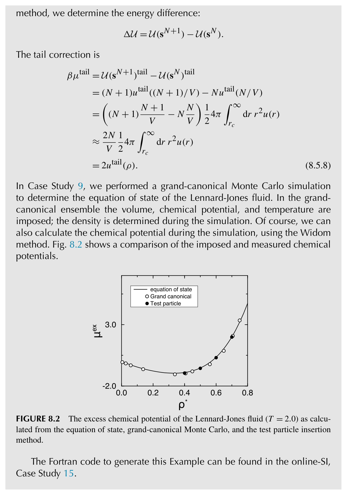
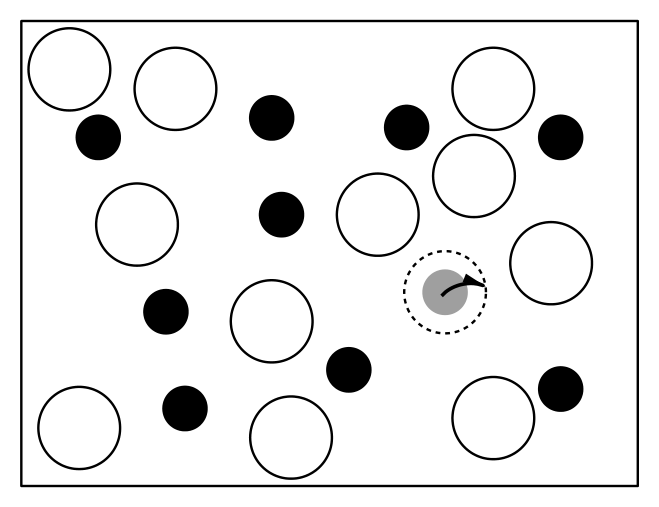
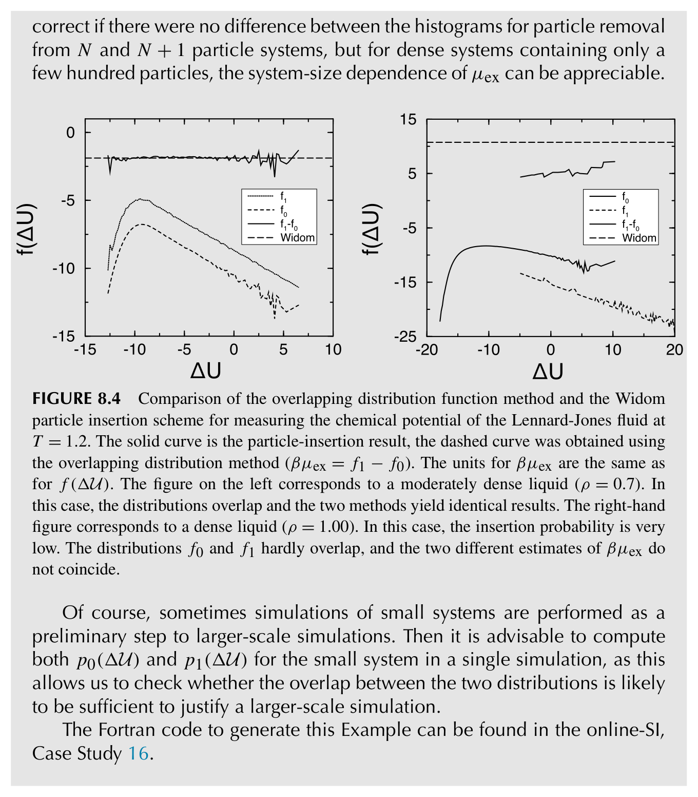

# 自由能计算

## 引言

在前几章中，我们介绍了蒙特卡罗和分子动力学模拟的基础知识。存在许多先进技术可以将MC或MD模拟适配到特定类型的模型或条件下，我们将在后续章节中讨论其中一些技术。然而，有一类模拟需要单独讨论，即自由能计算。正如下面将要解释的，这些计算在本质上不同于普通的MC或MD采样。
### 重要性采样可能会遗漏重要状态

为了理解这一点，让我们考虑一个蒙特卡罗模拟。如第3章所述，马尔可夫链蒙特卡罗模拟以与玻尔兹曼权重成正比的频率对系统状态进行采样。

对于大多数平衡性质的计算，只有具有不可忽略的玻尔兹曼权重的状态才是重要的，因此在马尔可夫链蒙特卡罗模拟中生成的采样通常被称为"重要性采样"。然而，有时"重要性"一词会产生误导，例如，当玻尔兹曼权重非常低的状态对系统的时间演化至关重要时，活化势垒顶部状态通常就是这种情况。因此，"重要性采样"并不总能采样到对系统行为真正重要的状态。普通MC或MD采样经常失败的另一个例子是一级相变的研究。如果模型系统被制备在亚稳相中，它通常不会在典型的模拟时间尺度上转变为更稳定的相。就这一点而言，这并不特殊：即使在实验中，相变中的滞后现象也很常见；例如过冷、过热，特别是（非位移型）固-固转变。为了利用模拟预测各相的相对稳定性并确定这些相之间共存曲线的位置，我们必须绕过滞后现象所带来的问题。

定位相变或计算在活化势垒顶部找到系统的概率，这两者有一个共同特征：需要计算在相空间中两个不同区域找到系统的相对概率，而在普通MC或MD模拟只会探索这两个区域之一的条件下。当相空间中的另一个区域不太可能被访问时，或者当另一个区域虽然很大（甚至可能比原始区域更大）但在合理的模拟时间内实际上不可达时，就会发生这种情况。因此，在两种情况下，暴力MC或MD采样都会失败。

### 为什么自由能是特殊的？

为了阐明这一根本问题的本质，回顾第3章中图3.1是有益的，在那里我们通过在尼罗河中进行随机行走来测量其平均深度，作为重要性采样的一个简单示例。需要注意的关键点是，这种随机行走并不是采样尼罗河表面积的好策略，而尼罗河的表面积等价于相空间中的体积。如果我们想通过比较在两条河流中分别停留的相对时间来确定两条河流面积之比，随机行走也同样无用。

访问不太可能的状态更具挑战性：如果我想知道在维多利亚湖和我的厨房水槽中找到单个水溶性示踪分子的相对概率，我将不得不等待很长时间来获取必要的统计数据——然而这个概率比值仍然不如冰核化等过程中涉及的典型概率比值那么极端。

中显示了典型的分子动力学轨迹。在(c)中显示了孔中的一个三原子分子。对于这个系统，我们希望知道分子在孔中运动时的自由能。")

图8.1(b)显示了分子在该孔中的典型MD轨迹：大部分时间分子被困在某个空腔中，在图8.1(b)所示的例子中，分子在模拟期间仅跳跃了一次到相邻空腔。对于较大的分子，在窗口区域找到分子的概率可能变得太小而无法用暴力模拟来采样。

自由能计算提供了计算在窗口中找到分子的概率的可能性，而无需等待该事件自发发生。图8.1所示的系统足够简单，我们可以解析地计算单个原子的自由能势垒。然而，如果孔中有更多原子或更复杂的分子，我们就需要数值自由能计算来计算在窗口中找到粒子的概率。

现在让我们从模拟的角度考虑自由能计算。例如，考虑一个在恒定N、V和T下的系统，该系统可以在相空间的两个不同区域中被找到：例如，区域I对应于晶态，区域II对应于液态。如果系统状态的玻尔兹曼采样是遍历的，则在区域I和II中找到系统的概率之比为：

$$
\frac{P_I}{P_{II}} = \frac{Q_I(N,V,T)}{Q_{II}(N,V,T)} = e^{-\beta[F_I(N,V,T)-F_{II}(N,V,T)]},
$$

其中$Q_I$表示区域I中所有状态的配分函数，区域II类似。由于概率比值等于各自配分函数之比，该比值可以用区域I和II之间的自由能差$F_I - F_{II}$来表示。式(8.1.1)表明，如果我们能计算两个区域之间的自由能差，就可以计算在两个宏观态中找到系统的相对概率，即使在一个宏观态中观察系统的平衡概率比另一个小得多。重要的是，当概率比值极端时，通过暴力方法计算概率比值变得极其昂贵，但计算自由能差并不受此缺点的影响。简而言之，这就是为什么自由能计算很重要，以及为什么它们通常优于暴力玻尔兹曼采样。

如果我们希望计算更多（例如n个）不同区域的相对自由能，计算$n(n-1)/2$个自由能差是不明智的（虽然不是错误的）。相反，我们应该计算所有n个宏观态相对于单一参考态的自由能差，该参考态的自由能是已知的，无论是解析的还是来自先前的模拟。这种计算通常被称为"绝对"自由能计算。然而，它们并非真正意义上的"绝对"：所有参考宏观态的一个偏移（例如，将对应于原子静止质量的能量包含在自由能中），对任何可观测量都不会产生任何影响。更重要的是，经典多体系统的可观测量不能依赖于普朗克常数，即使该常数出现在绝对自由能的表达式中。类似地，经典系统的相行为和静态平衡性质不能依赖于组成粒子的质量$m_i$。因此，任何看起来依赖于$h$或在蒙特卡罗情况下也依赖于$m_i$的经典模拟结果都是错误的。%
[^1]

### 序参量和反应坐标

为了进行自由能计算，我们需要能够判断系统是否处于给定区域。实际上，这意味着我们必须能够计算粒子坐标的函数，通常称为序参量。不同区域应该通过该序参量的值来区分。

我们甚至可以有一系列连续的序参量（此时通常称为反应坐标），例如，如果我们考虑一个衡量从一个区域（"反应物"）到另一个区域（"产物"）转变进度的坐标。如果有多个这样的坐标，我们甚至可以构建更高维的自由能图。然而，需要注意的一点是，自由能景观只有在指定了这些序参量之后才能被定义。并不存在所谓"唯一的"自由能景观。

### 何时需要自由能计算？

综上所述，有两类问题建议使用自由能计算。第一类涉及在暴力MC或MD采样失败的情况下计算宏观系统两个（或多个）相的相对稳定性。这种失败通常发生在大多数一级相变的情况下，两个相之间自发转变的速率非常低，以至于我们无法在找到系统处于这些相中的相对概率方面积累足够的统计数据。

我们强调，从计算角度来看，连续相变，特别是临界现象，其挑战性不亚于一级相变。然而，技术问题并非与自由能相关。关于连续相变数值分析的许多优秀综述可以在文献中找到（参见例如^[25,41--43,274]）。

第二类问题则不同：当我们需要计算分离系统两个（亚）稳定盆的自由能势垒时就会出现。这种计算很重要，因为了解分离两个盆的自由能势垒的高度和形状，使我们能够估计处于（准）平衡的系统从一个区域转变到另一个区域的频率，即使转变速率小到无法观测。估计此类稀有事件速率的工具将在第15章中讨论；在此，我们只关注自由能方面。

## 关于自由能的一般说明

计算自由能差需要非标准的模拟技术，此类技术的发展始于MC和MD模拟引入之后仅几年^[275--277]。然而，近年来自由能计算已经成为一个小型产业。到目前为止，已有大量不同但通常差异不大的技术来计算自由能差，试图总结所有这些不同方案会令人困惑——详细讨论则会令人疲惫。然而，由于这是一本教科书而非综述，我们选择了一条不同的路径：我们将讨论各类算法并用我们认为最便于教学的方法作为示例来解释它们。这些不一定是最好的，也不是最流行的，%
[^2]
当然也不是最快的方法。我们偶尔会引用更复杂的方法，但我们的列表同样是不完整的，而且随着时间的推移将更加如此。

## 自由能与一级相变

现在我们考虑一级相变背景下的自由能计算，但正如下面将要解释的，我们的讨论将更具普遍性。让我们首先考虑当我们说在某个温度和压力下两个相（I和II）共存时意味着什么。这个问题的答案是：在共存曲线的一侧，观察到相I的概率在热力学极限下趋近于100\%；在另一侧，观察到相II的概率趋近于100\%。以这种方式表述问题和答案的原因是为了强调一级相变是在平衡时观察到相I的概率从实际上100\%变为0\%的点。%
[^3]

现在让我们来看配分函数。假设我们有一个区分相I和相II的序参量$Q$，使得当系统处于I时$Q < 0$，否则$Q > 0$。那么我们可以将式(8.1.1)改写为

$$
\frac{p_I}{P_{II}} = \frac{\int \mathrm{d}X \exp[-\beta H(X)]\theta(-Q)}{\int \mathrm{d}X \exp[-\beta H(X)]\theta(+Q)} \equiv \frac{Q_I(NVT)}{Q_{II}(NVT)},
$$

其中我们使用$X$作为系统空间坐标$\mathbf{r}^N$的简写，并省略了分子和分母中相同的因子$(\Lambda^{3N}N!)^{-1}$。注意式(8.3.1)适用于恒定体积的系统，而共存曲线界定的是在相同温度和压力下两个相之间的转变。然而，如果我们定义

$$
Q_I(N,P,T) \equiv \frac{\beta P}{\Lambda^{3N}N!}\int \mathrm{d}V \exp(-\beta PV)\int \mathrm{d}X \exp[-\beta U(X)]\theta(-Q),
$$

对$Q_{II}(N,P,T)$类似，则

$$
\left(\frac{p_I}{P_{II}}\right)_{NPT} = \frac{Q_I(N,P,T)}{Q_{II}(N,P,T)} = e^{-\beta(G_I - G_{II})}.
$$

因此，单组分系统在恒定NPT下相共存的条件是$G_I = G_{II}$，或等价地$\mu_I = \mu_{II}$，%
[^4]
这当然是众所周知的，但现在我们用区分两个相的序参量给出了吉布斯自由能$G_{I,(II)}(N,P,T)$的统计力学表达式。

注意式(8.3.2)并不限于两相之间的转变：它允许我们描述经典多体系统相空间中任意两个区域的相对概率。我们将在第8.4.2节回到这一点。

在下文中，我们简要回顾一些更常用的自由能计算技术。我们参考关于该主题的几篇优秀综述以获取更多细节^[278--282]。

### 不需要自由能计算的情况

#### 直接共存计算
在讨论用于定位一级相变的自由能计算之前，我们应该看看明显的替代方案：简单地运行一个长模拟，尝试识别两个相处于平衡状态的点。

概念上最简单的方法是将系统制备在一个相中，然后改变条件（温度、压力），直到它自发转变为更稳定的相。这种方法在模拟的早期被探索过^[283--289]。然而，总的来说，它有一个严重的缺点：一级相变往往表现出明显的滞后。因此，向新的、更稳定相的转变（如果在模拟的时间尺度上发生的话）通常只有在远超共存点之后才会进行，而且是不可逆的。一级相变中滞后现象普遍存在的原因是，在共存点或其附近，两个相之间存在一个大的自由能势垒。该势垒的高度由分离两个共存相的界面的界面自由能决定。该界面的面积越大，自由能势垒越高。1974年，Streett等人^[290]提出通过结合两个相的状态方程的亚稳分支数据，然后使用麦克斯韦等面积构造来定位共存点，从而估计真实的共存点。没有先验理由表明这种方法应该有效，事实上该方法被证明不够准确。一个密切相关的方法在2000年代初被提出（描述可见^[291]），尽管文献^[292]提供的证据表明该方法与自由能计算相比效果不佳，但似乎仍然很受欢迎。

更好的方法是制备一个包含两个（周期性重复的）目标相的板块系统，将其置于两相区中，然后让系统达到平衡。例如，可以在恒定N、V和T下制备一个系统，密度使得两个相占据大致相同的体积。一般来说，该系统最初不会处于共存状态，因此界面将移动，直到两个相的压力和化学势相同。当这种情况发生时，两个相的体密度即为共存密度。

这听起来很简单，借助现代计算能力，它可以是一个可行的选择，特别是对于流体-流体相平衡。一个优点是单次模拟就可以得到共存相的密度和表面张力$\gamma$（见5.1.6节）。

尽管如此，有许多实际原因说明该方法应谨慎使用。首先，模拟需要足够大的系统。原因是如果任一相的板块太薄，可能无法识别出可以测量密度的体区域。当我们接近可能的临界点时，这个问题变得更加严重。其次，薄板块可能不是热力学稳定的：要创建横截面为$S$的板块，我们需要消耗表面自由能$2\gamma S$，其中$\gamma$是界面自由能密度——对于液体，这就是表面张力。对于薄板块，这种自由能代价可能大于系统保持在单一均匀相中所产生的自由能代价，即使该相在体状态下不是热力学稳定的。如果至少一个共存相是晶体固体，我们还有另一个问题：固体内部的压力应保持各向同性。这需要仔细微调板块平面内系统的尺寸。如果两个相都是晶体，通常不可能将它们容纳在同一个模拟盒中，因为通常容纳一种晶体形式的盒子无法容纳另一种。即使这个问题可以克服，晶体界面的移动也很慢。因此平衡是一个真正的问题。尽管如此，对于液-晶转变，该方法可以奏效：Hafskjold等人^[80]已经表明，通过考虑处于温度梯度中的系统，可以描绘出固-液共存曲线。

总之，上述观察意味着直接共存模拟对于流体-流体共存来说相对直接，对于流体-固体较难，%
[^5]

对于两个固体之间的一级相变则不具有吸引力。

#### 无界面的共存
除了上述在同一个模拟盒中模拟两个（或多个）相共存的方法外，还有几种无需创建界面即可研究相共存的方案。在流体中，最著名的方法是Panagiotopoulos的吉布斯系综方法^[211,213,214,220]，这在第6.6节中讨论。对于下文内容，重要的是指出吉布斯系综方法的主要局限性：其平衡依赖于两个周期性重复系统之间的体积和粒子交换。然而，如果两个相中至少有一个是致密的（例如在典型液体密度下），粒子交换的接受率变得可以忽略不计，吉布斯系综方法将失败。当共存相之一是固体时，这个问题实际上是无法克服的。%
[^6]

对于两个晶体相之间的相变，Parrinello和Rahman^[178,179]设计了一种专门用于研究固-固转变的分子动力学方案（见第6.4节和第7.2节）。该技术可应用于导致晶胞变形而晶胞内分子不发生太多重排的位移型相变。即使满足这些条件，Parrinello-Rahman方法也可能存在一些滞后。更重要的是，当两个固体具有非常不同的晶胞时，Parrinello-Rahman方法无法使用。

#### 追踪共存曲线
即使我们需要进行自由能计算来定位一级相变，通常也只需要少量这样的计算来追踪一条共存曲线。原因是一旦我们知道给定相在一个状态点的自由能，我们可以利用压力、温度和化学势之间的热力学关系来计算可以通过不跨越相变而到达的其他状态点的自由能。

一种在已知曲线上一个点后确定完整共存曲线的数值技术由Kofke提出^[293,294]。Kofke的吉布斯-杜亥姆积分方法的最简形式等价于克劳修斯-克拉珀龙方程的数值积分。让我们简要回顾克劳修斯-克拉珀龙方程的推导。当两个相$\alpha$和$\beta$在给定温度$T$和压力$P$下共存时，它们的化学势必须相等。如果我们分别将压力和温度改变无穷小量$dP$和$dT$，则两相化学势之差变为

$$
d\mu_\alpha - d\mu_\beta = -(s_\alpha - s_\beta)dT + (v_\alpha - v_\beta)dP.
$$

沿共存曲线$\mu_\alpha = \mu_\beta$，因此

$$
\frac{dP}{dT} = \frac{s_\alpha - s_\beta}{v_\alpha - v_\beta} = \frac{\Delta h}{T\Delta v},
$$

其中我们利用了在共存时$T\Delta s = \Delta h$，$h_\alpha$（$h_\beta$）表示相$\alpha$（$\beta$）的摩尔焓。由于$\Delta h$、$T$和$\Delta v$都可以直接在模拟中计算，$dP/dT$可以从式(8.3.4)计算。如果两个共存相之一是（稀薄）气相，将式(8.3.4)写成略有不同的形式更为方便：

$$
\frac{d\ln P}{d(1/T)} = -\frac{\Delta h}{P\Delta v/T}.
$$

Kofke及其合作者应用该方法定位了Lennard-Jones流体的气-液^[293,294]和固-液共存曲线^[295]。Kofke方法的其他应用可以在^[296--299]中找到。应该强调的是，吉布斯-杜亥姆积分不限于计算$P$-$T$平面中的共存曲线。一类特别重要的可以用类似方式处理的问题是研究相变位置作为分子间相互作用势中参数函数的问题。例如，Agrawal和Kofke研究了原子系统中分子间势的陡度对熔点的影响（见插图9）。使用克劳修斯-克拉珀龙方程的推广来研究系统哈密顿量的变化如何影响一级相变位置的其他计算示例可以在文献^[300--303]中找到。

虽然吉布斯-杜亥姆积分可能是追踪共存曲线的一种高效技术，但它不一定稳健，因为它缺乏内置的诊断功能。我们的意思是，式(8.3.4)积分中数值误差的传播可能导致计算得到的共存点与真实共存曲线产生大的偏差。类似地，初始共存点位置的任何误差都会导致共存曲线的错误估计。因此，检查该方案的数值稳定性很重要。这可以通过执行额外的自由能计算来确定两个相处于平衡的两个或多个点来实现（参见例如^[304]）。积分过程的稳定性可以通过在相同区间内向前和向后积分来检查。关于追踪共存曲线的各种积分方案的讨论可以在文献^[299]中找到。

在某些情况下，例如对于含长链分子的系统、渗流系统或格子模型，很难进行体积变化。Escobedo和de Pablo^[305]表明，在这些条件下，将吉布斯-杜亥姆积分与巨正则（恒定$\mu$、$V$、$T$）系综相结合可能更好。在该方案中，$\mu$和$T$是独立变量，而不是$P$和$T$。相$\alpha$和$\beta$压力差的变化由下式给出：

$$
dP_\alpha - dP_\beta = (\rho_\alpha - \rho_\beta)d\mu + \left(\frac{s_\alpha}{v_\alpha} - \frac{s_\beta}{v_\beta}\right)dT.
$$

沿共存线，我们有$P_\alpha = P_\beta$，这给出

$$
\frac{d\beta\mu}{d\beta} = \frac{\rho_\alpha h_\alpha - \rho_\beta h_\beta}{\rho_\alpha - \rho_\beta} = \frac{\rho_\alpha u_\alpha - \rho_\beta u_\beta}{\rho_\alpha - \rho_\beta}.
$$

在吉布斯-杜亥姆积分方案中实现该方程意味着恒压模拟中的体积变化被粒子交换和移除所取代。Escobedo^[306]发展了用于多组分流体混合物的吉布斯-杜亥姆积分技术的扩展。

**软球的凝固**
最早的凝固模拟是由Alder和Wainwright^[18]以及Wood和Jacobson^[19]完成的。该凝固转变的精确位置首先由Hoover和Ree^[307]确定。随后，几位作者研究了凝固转变对分子间势"柔软度"的依赖性。最方便的方法是考虑一类柔软度可变的模型系统，其中包含硬球模型作为极限情况。在这一背景下，所谓的软球模型已被广泛研究。软球模型的特征是对势的形式为

$$
u(r) = \epsilon\left(\frac{\sigma}{r}\right)^n.
$$

极限情况包括硬球模型（$n \to \infty$）和单组分等离子体（$n = 1$）。在吉布斯-杜亥姆积分方案出现之前，已进行了个别模拟研究来定位$n = 1$^[308]、$n = 4,6,9$^[309,310]、$n = 12$^[287,311--313]和$n = \infty$^[307,314]的软球的凝固点。实际上，熔化时的晶体结构从大$n$时的面心立方（FCC）（或可能是六方密堆积（HCP））变为小$n$时的体心立方（BCC）。Hoover和Ree^[307]认为从FCC到BCC的转变发生在$n \approx 6$附近。Agrawal和Kofke^[295,315]表明，吉布斯-杜亥姆积分技术可以在一次模拟中定位所有软球模型的熔点。在该吉布斯-杜亥姆积分中改变的量是柔软度参数$s$，定义为$s \equiv 1/n$。我们可以将$s$解释为一个热力学变量，与压力$P$和温度$T$处于同等地位。热力学变量$T$、$P$和$s$的微小变化导致吉布斯自由能$G$的变化：

$$
dG = -SdT + VdP + N\lambda\beta ds,
$$

其中我们定义$\lambda$为与$s$共轭的热力学"力"（因子$N/\beta$的引入是为了保持我们的符号与^[295,315]一致）。现在我们考虑恒温下的相共存。如果我们同时改变$P$和$s$，两相化学势之差将发生变化：

$$
\beta\mu_\alpha - \beta\mu_\beta = \beta(v_\alpha - v_\beta)dP + (\lambda_\alpha - \lambda_\beta)ds,
$$

其中$v_\alpha$（$v_\beta$）是相$\alpha$（$\beta$）的摩尔体积。沿共存曲线，$\mu_\alpha = \mu_\beta$，因此

$$
\left(\frac{\partial \ln P}{\partial s}\right)_{\mathrm{coex}} = -\frac{\Delta\lambda}{\beta P\Delta v}.
$$

为了在模拟中使用该方程，我们需要$\lambda$的统计力学表达式。等温等压系统的配分函数由式(6.3.8)给出：

$$
Q(N,P,T) = \frac{\beta P}{\Lambda^{3N}N!}\int \mathrm{d}V \exp(-\beta PV)\int \mathrm{d}\mathbf{r}^N \exp[-\beta U(\mathbf{r}^N;s)]
$$

$$
= \frac{\beta P}{\Lambda^{3N}N!}\int \mathrm{d}V \exp(-\beta PV)\int \mathrm{d}\mathbf{r}^N \prod_{i>j}\exp\left[-\beta\epsilon\left(\frac{\sigma}{r_{ij}}\right)^{(1/s)}\right].
$$

$\lambda$的热力学定义写为

$$
\lambda \equiv \left(\frac{\beta\partial G}{N\partial s}\right)_{T,P}.
$$

利用$G = -k_B T \ln Q(N,P,T)$，我们得到

$$
\lambda = -\frac{\beta}{NQ(N,P,T)}\left(\frac{\partial Q(N,P,T)}{\partial s}\right)_{T,P} = -\frac{\beta\epsilon}{s^2}\left\langle\left(\frac{\sigma}{r}\right)^{1/s}\ln(\sigma/r)\right\rangle = -\frac{\beta\epsilon}{s^2}\langle u(r)\ln(\sigma/r)\rangle.
$$

上述表达式用于测量共存固相和液相中的$\lambda$。
这使得计算$(P,s)$平面中的熔化曲线成为可能。
遵循这一方法，Agrawal和Kofke能够获得软球模型在$n$从1到$\infty$之间所有值的熔化压力。
他们还能够定位$s \approx 0.16$处的流体-FCC-BCC三相点。

## 自由能的计算方法

现在让我们考虑计算自由能的数值方法。
当直接共存计算无法进行时，可以使用这些方法。
但即使有选择余地，自由能计算通常也更可取，因为它们往往更加稳健。
此外，自由能可以高精度计算，使我们能够以比在典型直接共存模拟中用相同计算量所能达到的更高精度来定位相变点。

然而，不可否认的是，许多分子模拟软件包的用户对自由能计算望而却步，
因为这些方法不如直接共存计算直观。
在以下各节中，我们旨在解释自由能计算，并（希望）展示它们如何极大地增强分子模拟的能力。

正如所解释的，我们的目标不是提供所有相关自由能算法的综述。
相反，我们将考虑正在使用的方法的典型示例，从而使读者能够理解更广泛的文献。

下面，我们首先关注计算单个宏观态的自由能和化学势的技术，特别强调一级相变。
之后，我们讨论计算作为一个或多个序参量函数的自由能剖面或自由能景观的技术。

### 热力学积分

正如所解释的，自由能计算与计算可观测量的Boltzmann加权平均的模拟在本质上是不同的：
自由能不是对相空间的平均，而是衡量相空间本身的可及体积。
然而——这是关键的一点——自由能对其任何一个控制参数的导数可以表示为Boltzmann平均。
因此，计算系统自由能的问题可以归结为沿状态点与已知自由能状态之间的路径对其关于某个控制参数的导数进行积分。
典型的控制变量包括温度或系统的体积，也包括哈密顿量中出现的任何参数，例如粒子间相互作用的强度或范围。
注意，沿两个状态之间的路径积分自由能导数只能得到自由能差。
如果我们对系统的绝对自由能感兴趣，我们需要选择一个可以解析确定自由能的参考态。

在下文中，我们将以一般意义使用"自由能"这一术语：
它可以指Helmholtz自由能$F(N,V,T)$、Gibbs自由能$G(N,P,T)$，甚至熵$S(N,V,E)$。[^7]
下面，我们主要关注Helmholtz自由能的计算，并在必要时对相关的自由能计算进行说明。

对于经典原子系统，Helmholtz自由能$F$与正则配分函数$Q(N,V,T)$（公式(2.2.14)）的关系为：

$$
F = -k_BT\ln Q(N,V,T) \equiv -k_BT\ln
\left[
\frac{\int \mathrm{d}p^N \mathrm{d}r^N \exp[-\beta\mathcal{H}(p^N,r^N)]}{h^{\mathrm{d}N}N!}
\right],
$$

其中$d$是系统的维度。显然，$Q(N,V,T)$是对相空间的积分，而不是Boltzmann平均。
其他与自由能相关的量$S$和$G$也是如此。
这些量无法直接在MD或MC模拟中采样。
我们将使用"热学量"这一形容词来指代直接依赖于相空间中可及体积的量。
相比之下，我们使用"力学量"这一形容词来指代可以表示为$(p^N,r^N)$函数在相空间上Boltzmann加权平均的可观测量。

热学量无法在模拟中直接测量这一事实不仅仅是模拟的问题：真实实验也无法测量热学量。
当考虑确定自由能的数值方案时，了解这个问题在现实世界中是如何解决的是很有启发的。
实验总是探测自由能的导数，例如对体积$V$或温度$T$的导数：

$$
\left(\frac{\partial F}{\partial V}\right)_{NT} = -P
$$

和

$$
\left(\frac{\partial F/T}{\partial 1/T}\right)_{VN} = E.
$$

由于压力$P$和能量$E$是力学量，它们可以在模拟中测量。[^8]
要计算系统在给定温度和密度下的自由能，我们应该在$V$-$T$平面中找到一条可逆路径，
将所考虑的状态与已知自由能的状态连接起来。
然后可以简单地通过热力学积分，即对上述公式进行积分，来计算沿该路径$F$的变化。
只有少数热力学状态的物质自由能可以解析地已知。
一个这样的状态是理想气体相；另一个是低温谐振晶体。

在计算机模拟中，情况类似。
要计算稠密液体的自由能，可以构建一条通往极稀薄气相的可逆路径。
不需要一直到达理想气体，但应该达到一个足够稀薄的状态，以确保自由能可以被准确计算，
无论是通过化学势的直接计算（见第和节），
还是通过压缩因子$PV/(Nk_BT)$的维里展开前几项的知识，如下所述。

在低密度下

$$
\frac{P(\rho,T) - \rho k_BT}{\rho^2} \to B_2(T),
$$

其中$B_2$表示第二维里系数，可以使用以下公式以任意精度计算：

$$
B_2(T) = \frac{1}{2}\int \mathrm{d}r \left[1 - e^{-\beta u(r)}\right].
$$

一旦我们知道$B_2$，我们不从公式(8.4.1)出发，而是从过量自由能$F^{\mathrm{ex}}(\rho,T) \equiv F(\rho,T) - F^{\mathrm{id}}(\rho,T)$的密度导数表达式出发：

$$
\left(\frac{\partial F^{\mathrm{ex}}(\rho,T)}{\partial\rho}\right)_{NT} = \frac{P(\rho,T) - \rho k_BT}{\rho^2}.
$$

从公式(8.4.3)，我们知道公式(8.4.4)的极限行为：它是$B_2 + \mathcal{O}(\rho)$，
在$\rho \to 0$时行为良好。
因此，计算高密度下$F^{\mathrm{ex}}(\rho,T)$的积分也是行为良好的，
只要积分路径不穿过一级相变。

要计算晶态固体的自由能，我们不使用理想气体参考态，
因为晶态固体和流体相被一级相变隔开，至少在三维情况下如此。
计算固体自由能在第9章中详细讨论。

我们在此仅指出，一旦我们知道低温下固体的自由能（此时它表现为谐振晶体），
我们可以使用公式(8.4.2)来计算更高温度下的固体自由能，利用

$$
\left(\frac{\partial(F - F^{\mathrm{harmonic}})/T}{\partial T}\right)_{VN} = -\frac{(E - E^{\mathrm{harmonic}})}{T^2},
$$

其中$E^{\mathrm{harmonic}}$是与我们模型系统同温度的谐振固体的能量。
由于$(E - E^{\mathrm{harmonic}}) \sim T^2$在低温下成立，公式(8.4.5)在$T \to 0$时保持行为良好。
因此，从低温谐振晶体出发计算固体自由能也不会带来任何特殊问题，
只要固体相在$T = 0$之前保持力学稳定。

当使用热力学积分计算稠密液体的自由能时，即在临界点和三相点之间的$\rho,T$范围内的流体，最好绕过临界点进行积分。
这种模拟从$T > T_c$的低密度开始，将公式(8.4.1)积分到所需密度，
然后在恒定$\rho$下将公式(8.4.2)积分到更低的温度。

注意，上述"自然"自由能技术在无法构建到感兴趣状态点的自然可逆路径时将无法使用。
在这种情况下，需要其他技术，例如下面和第9章中描述的技术。

### 哈密顿量热力学积分
在模拟中，我们不局限于使用在实验中也可以遵循的物理热力学积分路径。
相反，正如第2.5.1节最后一段的讨论所清楚表明的，
我们可以将势能函数中的所有参数当作热力学变量来使用^[314]。
例如，如果我们知道Lennard-Jones流体的自由能，
我们可以通过计算在Lennard-Jones流体中开启偶极相互作用所需的可逆功
来确定Stockmayer流体的自由能^[416]。[^9]
用于计算这种自由能差的公式体系是Kirkwood耦合参数方法^[60]。

让我们考虑希望计算具有势能$U_{II}$的$N$粒子系统的自由能的情况。
现在假设存在另一个足够简单的势能函数$U_I$，使得我们可以解析地计算系统的自由能，
例如理想气体或谐振晶体。
或者，$U_I$可以是自由能已经从先前工作中准确知道的系统的势能函数，
例如硬球^[318,276,787,788,789]或Lennard-Jones粒子^[71,790,82]的流体或固体。
我们现在定义一个广义势能函数$U(\lambda)$，使得$U(\lambda = 1) = U_{II}$且$U(\lambda = 0) = U_I$。
$U(\lambda)$的一个简单选择是

$$
U(\lambda) = (1 - \lambda)U_I + \lambda U_{II} = U_I + \lambda(U_{II} - U_I).
$$

例如，系统I可能对应于Lennard-Jones流体，而系统II指的是Stockmayer流体。

具有势能函数$U(\lambda)$（$0 \leq \lambda \leq 1$）的系统的配分函数为

$$
Q(N,V,T,\lambda) = \frac{1}{\Lambda^{3N}N!}\int \mathrm{d}r^N \exp[-\beta U(\lambda)].
$$

如上所述，$Q(N,V,T,\lambda)$无法在模拟中采样，
但Helmholtz自由能$F(\lambda)$对$\lambda$的导数可以写成Boltzmann加权平均：

$$
\begin{aligned}
\left(\frac{\partial F(\lambda)}{\partial\lambda}\right)_{N,V,T}
&= -\frac{1}{\beta}\frac{\partial}{\partial\lambda}\ln Q(N,V,T,\lambda) \\
&= -\frac{1}{\beta Q(N,V,T,\lambda)}\frac{\partial Q(N,V,T,\lambda)}{\partial\lambda} \\
&= \frac{\int \mathrm{d}r^N (\partial U(\lambda)/\partial\lambda)\exp[-\beta U(\lambda)]}{\int \mathrm{d}r^N \exp[-\beta U(\lambda)]} \\
&= \left\langle\frac{\partial U(\lambda)}{\partial\lambda}\right\rangle_\lambda,
\end{aligned}
$$

其中$\langle\cdots\rangle_\lambda$表示具有势能函数$U(\lambda)$的系统的Boltzmann加权平均。

系统II和系统I之间的自由能差可以通过积分公式(8.4.7)得到：

$$
F(\lambda = 1) - F(\lambda = 0) = \int_{\lambda=0}^{\lambda=1} \mathrm{d}\lambda \left\langle\frac{\partial U(\lambda)}{\partial\lambda}\right\rangle_\lambda.
$$

与自然热力学积分(TI)的情况一样，使用公式(8.4.8)有一个重要约束：
在从$\lambda = 0$到$\lambda = 1$的路径上，系统不应经历不可逆变化，
例如由于一级相变导致新相的成核，因为那样系统将表现出滞后效应，
正向和反向积分将给出不同（但同样不正确）的结果。

原则上，我们可以使用任意（通常是非线性的）函数$U(\lambda)$进行热力学积分，
只要该函数是可微的并且满足边界条件：$U(\lambda = 0) = U_I$和$U(\lambda = 1) = U_{II}$。
然而，线性插值(8.4.6)特别方便，因为在这种情况下，
我们知道$\partial^2 F/\partial\lambda^2$的符号。
对公式(8.4.7)的直接微分表明

$$
\left(\frac{\partial^2 F}{\partial\lambda^2}\right)_{N,V,T}
= -\beta\left[\langle(U_{II} - U_I)^2\rangle_\lambda - \langle U_{II} - U_I\rangle_\lambda^2\right] \leq 0.
$$

换言之，$(\partial F/\partial\lambda)$永远不会随着$\lambda$的增加而增加。
这个Gibbs-Bogoliubov不等式可以用来检验模拟结果的有效性或准确性。

在实践中，公式(8.4.8)中的积分必须数值地进行，例如使用Gauss求积。
当然，这种数值积分只有在公式(8.4.8)中的被积函数是$\lambda$的良好行为函数时才能正常工作。
然而，有时$U(\lambda)$的线性参数化可能导致公式(8.4.8)在$\lambda \to 0$时出现弱（且相对无害的）奇异性。
这个问题在第9.2.2节中有更详细的讨论。

哈密顿量热力学积分常用于计算相似但不同分子的过量自由能之差。
这种计算在生物分子建模中具有特别重要的意义（参见例如^[791,279]）。
例如，可以计算化学取代对分子与酶结合强度的影响。
在这种计算中，热力学积分涉及将分子的一部分逐渐替换为另一个构建单元；
例如，一个H可以被转化为一个CH$_3$基团。

应该注意的是，基于公式(8.4.8)的热力学积分方法本质上是静态的；
也就是说，自由能的导数是在一系列平衡MC或MD模拟中获得的。
在中，我们将讨论即使系统的哈密顿量以有限速率变化时，
如何仍然可以计算自由能差。

## 化学势

对于恒定$N$、$P$和$T$的系统，平衡要求所有相中所有物种的化学势相等。
此外，在可以发生化学反应的系统中，平衡条件要求当无限小量的反应物转化为产物时，
(Gibbs)自由能不发生变化。
这个条件对系统中反应物种的化学势施加了一个线性关系。
因此，为了预测平衡条件，我们需要知道反应物和产物的化学势。
由于这些原因，许多自由能计算的重要目标是计算系统中各种分子的化学势。

在上一节中，我们讨论了系统总自由能的计算。
如果系统只包含一种类型的分子，计算压力和自由能就足以获得化学势，
使用$N\mu = F + PV$。
然而，对于多组分系统，相应的关系（$\sum_i N_i\mu_i = F + PV$）不足以确定各个化学势。
在本节中，我们讨论专门为计算化学势或化学势差而开发的方法。
为了保持符号简洁，我们首先考虑单组分系统。

系统的化学势可以写成（见第2.1.3节）：

$$
\mu = \left(\frac{\partial F}{\partial N}\right)_{V,T}
= \left(\frac{\partial G}{\partial N}\right)_{P,T}
= -T\left(\frac{\partial S}{\partial N}\right)_{V,E}.
$$

当然，系统中的粒子数不是连续变量，
因此在模拟中，我们应该将化学势定义为包含$N+1$和$N$个粒子的系统之间的自由能差：

$$
\mu \equiv \left(\frac{\partial F}{\partial N}\right)_{VT}
\approx \frac{F(N+1) - F(N)}{N + 1 - N} = F(N+1) - F(N).
$$

由于公式(8.5.1)中的自由能差与两个配分函数之比的对数有关，
$\mu$可以用一个可采样的量来表示。

这看起来可能令人惊讶，因为我们在前一节中论证了"热学量"，如Gibbs自由能，不能直接采样。
然而，这里并不矛盾：我们测量的不是绝对化学势，而是过量化学势，
即给定物种在稠密相中的化学势与同物种在相同密度和温度下的理想气体化学势之间的差。
这个差值可以通过哈密顿量热力学积分来计算，
事实上，对于稠密系统，这通常是计算$\mu^{\mathrm{ex}}$的唯一方法。
然而，对于不太稠密的系统，热力学积分可以在一步内完成。

### 粒子插入法

公式(8.5.1)是推导纯物质化学势表达式的出发点，
但多组分系统的表达式本质上是相同的。
下面推导的表达式由Widom于1963年作为统计力学中的一般理论工具提出。[^10]
Widom理论方法在模拟中的应用由Romano和Singer^[327]进行了探索。
Widom表达式可以从物种$a$的化学势$\mu_a$的统计力学定义在几行内推导出来。
为了保持符号简洁，我们最初假设处理的是在立方体积$V$（边长$L = V^{1/d}$）中$N$个相同原子的系统，温度恒定为$T$。

这种系统的经典配分函数为

$$
Q(N,V,T) = \frac{V^N}{\Lambda^{\mathrm{d}N}N!}\int_0^1\cdots\int_0^1 \mathrm{d}s^N \exp[-\beta U(s^N;L)].
$$

使用标度坐标$s^N = r^N/L$并非必要但很方便，
因为它将使化学势的理想部分和过量部分的分离变得容易。
在公式(8.5.2)中，我们写成$U(s^N;L)$以表示$U$依赖于粒子间的真实距离而非标度距离。
系统的Helmholtz自由能表达式为

$$
\begin{aligned}
F(N,V,T) &= -k_BT\ln Q \\
&= -k_BT\ln\left[\frac{V^N}{\Lambda^{dN}N!}\right]
- k_BT\ln\left[\int \mathrm{d}s^N \exp[-\beta U(s^N;L)]\right] \\
&= F^{\mathrm{id}}(N,V,T) + F^{\mathrm{ex}}(N,V,T).
\end{aligned}
$$

在上述等式的最后一行中，我们将前一行中Helmholtz自由能的两个贡献分别识别为理想气体表达式加上过量部分。

对于足够大的$N$，化学势由下式给出

$$
\mu = -k_BT\ln(Q_{N+1}/Q_N).
$$

如果我们使用$Q_N$的显式形式（公式(8.5.3)），我们发现

$$
\begin{aligned}
\mu &= -k_BT\ln(Q_{N+1}/Q_N) \\
&= -k_BT\ln\left[\frac{V/\Lambda^d}{N+1}\right]
- k_BT\ln\left[\frac{\int \mathrm{d}s^{N+1}\exp[-\beta U(s^{N+1})]}{\int \mathrm{d}s^N\exp[-\beta U(s^N)]}\right] \\
&\equiv \mu^{\mathrm{id}}(\rho) + \mu^{\mathrm{ex}}.
\end{aligned}
$$

在公式(8.5.4)的最后一行中，我们将化学势分离为理想气体贡献$\mu^{\mathrm{id}}$和过量部分$\mu^{\mathrm{ex}}$。
由于$\mu^{\mathrm{id}}(\rho)$可以解析计算，我们重点关注$\mu^{\mathrm{ex}}$。
现在我们将$(N+1)$粒子系统的势能分离为$N$粒子系统的势能函数$U(s^N)$和第$(N+1)$个粒子与其余粒子的相互作用能：
$\Delta U \equiv U(s^{N+1}) - U(s^N)$。
我们强调这种分离并不假设分子间相互作用的可加性：它只是$\Delta U$的定义。
利用这种分离，我们可以将$\mu^{\mathrm{ex}}$写为

$$
\mu^{\mathrm{ex}} = -k_BT\ln\int \mathrm{d}s_{N+1}\langle\exp(-\beta\Delta U)\rangle_N
= -k_BT\ln\langle\exp(-\beta\Delta U)\rangle_N,
$$

其中$\langle\cdots\rangle_N$表示在恒定$V$和$T$下对$N$粒子系统构型空间的Boltzmann平均，
$s_{N+1}$是第$N+1$个粒子的标度坐标。

重要的是要注意，公式(8.5.5)中的平均不能使用坐标$s_{N+1}$的重要性采样来计算。
相反，我们通过对第$N+1$个粒子的标度位置进行均匀积分来计算$\langle\exp(-\beta\Delta U)\rangle_N$的平均。
这种积分可以通过Metropolis和Ulam^[328]在Markov链MC方法发展之前开创的暴力随机采样来执行。
在实践中，该过程如下：我们对$N$粒子系统进行常规的恒定$NVT$ Monte Carlo模拟。
在模拟过程中以频繁的间隔，我们在单位立方体上均匀地随机生成一个坐标$s_{N+1}$。
对于这个$s_{N+1}$值，我们计算$\exp(-\beta\Delta U)$。
通过对所有生成的试探位置求后者量的平均，我们获得了公式(8.5.5)中出现的平均值。
因此，实际上我们是在计算与在$N$粒子系统中随机插入额外粒子相关的Boltzmann因子的平均值，
但我们从不接受任何这样的试探插入，因为那样我们将不再采样公式(8.5.5)中所需的平均值。
我们注意到对于均匀系统，每个试探插入点都是等价的。
因此，我们也可以在模拟盒子中的固定位置（例如，在网格上）进行试探插入，
只要插入点与剩余粒子的位置不相关。

**Widom试探粒子插入**

```
\Function{Widom}{}
// 通过试探粒子插入计算过量化学势
 $x_{\mathrm{test}} = \mathrm{box} \times R$ // 生成随机位置
 $en_{\mathrm{test}} = \mathrm{ener}(x_{\mathrm{test}}, \mathrm{npart}+1)$ // 确定能量
 $w_{\mathrm{test}} = w_{\mathrm{test}} + \exp(-\beta \times en_{\mathrm{test}})$ // 更新公式(8.5.5)中的Boltzmann因子
\EndFunction
```

**具体说明**（一般说明见第7页）：

1. 该算法展示了恒定$N$、$V$和$T$系统的Widom试探粒子方法的基本结构。
   此函数通常在Monte Carlo模拟的采样步骤中调用，例如算法1中的函数`sample`。
   通常，需要许多这样的试探粒子插入才能获得可靠的统计。
1. 因为试探粒子不属于系统中的$\mathrm{npart}$个粒子，
   我们给它一个（虚拟的）标签$\mathrm{npart}+1$。
1. 过量化学势由$\beta\mu^{\mathrm{ex}} = -\ln(w_{\mathrm{test}}/M)$给出，
   其中$M$是试探粒子插入的总次数。
   $\beta\mu^{\mathrm{ex}}$的精度可以用$\sigma_{\beta\mu^{\mathrm{ex}}} = \sigma_{w_{\mathrm{test}}}/w_{\mathrm{test}}$来估计。
1. 函数`ener`计算试探粒子的能量。注意试探粒子插入是虚拟的，从不被接受。
1. 对于可加性成对相互作用，我们可以通过评估尾部修正来近似修正分子间相互作用的截断对化学势值的影响。
   因为我们不需要修正双重计数，这个修正比正常MC或MD模拟中每粒子的势能所用的修正大一个因子2（见案例研究15）。

$N$个粒子的位置不相关。Widom方法为我们提供了一种强大的方案来计算（不太稠密的）原子和简单分子液体的化学势。
在算法18中，我们展示了如何在模拟中实现粒子插入方法。
不出所料，鉴于Coulomb势的长程性，插入离子时需要特别小心。
人们可能认为电中性要求联合插入正离子和负离子，使整体呈中性。
然而，这是不必要的，只要离子总是与其均匀中和背景一起插入^[217]。

**与逸度的关系**

一个物种的化学势的完整表达式依赖于Planck常数，通过热de Broglie波长和可能的分子内部配分函数。然而，正如我们在中所论证的，经典模拟的结果不依赖于Planck常数。

这一陈述也适用于粒子插入法。可以将该方法视为计算物种$\alpha$的逸度$f_\alpha$的技术：

$$
f_\alpha = \frac{\rho_\alpha}{\langle\exp(-\beta\Delta U_\alpha)\rangle},
$$

其中$\rho_\alpha$表示物种$\alpha$的数密度，$\Delta U_\alpha$表示随机插入类型为$\alpha$的试探粒子时系统势能的变化。
显然，$f_\alpha$不依赖于Planck常数。

**非均匀系统**

公式(8.5.5)是针对空间均匀系统推导的。Widom^[736]也考虑了空间非均匀系统的情况。
在这种情况下，$\mu^{\mathrm{ex}}$显式依赖于位置$\mathbf{r}$。
然而，在平衡状态下，化学势本身在整个系统中是常数（但参见文献^[792]中的公式4）。
换句话说，

$$
\mu = k_BT\ln\left[\frac{\rho(\mathbf{r})}{\langle\exp[-\beta\Delta U(\mathbf{r})]\rangle_N}\right]
$$

是常数。

公式(8.5.7)可以用来提高$\mu$数值估计的统计精度。
作为说明，考虑一个我们可以解析处理的简单例子：
无限长宽度为$W \ll L$的狭缝中长度为$L$的无限薄针。
针的过量化学势与以随机方向在狭缝中插入的针不与壁面重叠的概率$P_{\mathrm{n.o.}}$有关：
$\mu^{\mathrm{ex}} = -k_BT\ln P_{\mathrm{n.o.}}$。
显然，如果插入的针的方向是随机的，它将与壁面重叠的概率将接近100\%。
然而，如果我们只在狭缝中间插入针，
狭缝中与壁面平行排列的粒子，则 $P^{\parallel}_{\text{n.o.}} = 1$ 且 $\mu^{\parallel}_{\text{ex}} = 0$。在这种情况下，$\mu = \mu^{\parallel} = k_BT \ln \rho^{\parallel}$。换言之，我们不需要进行任何粒子插入操作：只需确定密度 $\rho$ 以及狭缝中央针状粒子的取向分布即可。这些信息使我们能够计算概率密度 $p^{\parallel}$，从而得到 $\mu$。

**例17（化学势：粒子插入法）。**在本例中，我们使用Widom试探粒子法来确定Lennard-Jones流体的超额化学势。所用的算法是恒定 $N$、$V$、$T$ 下进行Monte Carlo模拟的基本算法（算法1和算法2）与确定超额化学势（算法18）的组合。

需要强调的是，化学势的尾部校正与势能的尾部校正类似但不完全相同。在Widom试探粒子方法中，我们确定能量差：

$$
\Delta U = U(\mathbf{s}^{N+1}) - U(\mathbf{s}^N)
$$

尾部校正为

$$
\begin{aligned}
\beta \mu^{\text{tail}} &= U(\mathbf{s}^{N+1})^{\text{tail}} - U(\mathbf{s}^N)^{\text{tail}}  \\
&= (N+1) u^{\text{tail}}((N+1)/V) - N u^{\text{tail}}(N/V)  \\
&= \left[ (N+1) \frac{N+1}{V} - N \frac{N}{V} \right] \frac{1}{24\pi} \int_{r_c}^{\infty} \mathrm{d}r\, r^2 u(r)  \\
&\approx \frac{2N}{V} \frac{1}{24\pi} \int_{r_c}^{\infty} \mathrm{d}r\, r^2 u(r)  \\
&= 2 u^{\text{tail}}(\rho).
\end{aligned}
$$

在案例研究9中，我们进行了巨正则Monte Carlo模拟来确定Lennard-Jones流体的状态方程。在巨正则系综中，体积、化学势和温度是给定的；密度在模拟过程中确定。当然，我们也可以在模拟过程中使用Widom方法计算化学势。图8.2展示了给定化学势与测量化学势的比较。



生成此例的Fortran代码可在在线补充材料（online-SI）中的案例研究15中找到。

### 粒子插入法：其他系综
将Widom方法推广到其他系综，特别是 $NPT$ 和 $\mu, V, T$ 系综，相对直接，并且基于与式（8.5.5）相同的表达式，只要平均值计算得当即可。

$NVE$ 系综的情况略有不同 ^[331--333]，下面讨论此情况。

对于恒定 $\mu, V, T$ 的系统，化学势是给定的，因此Widom方法可用于验证给定的化学势是否等于粒子插入法测量的化学势，例如作为系统是否充分平衡的检验。下面我们证明两者应该严格相等。

在巨正则模拟中，$N$ 是涨落的，但我们可以对试探粒子插入计算 $\exp(-\beta \Delta U)$。由上一节可知

$$
\frac{V/\Lambda^d}{N+1} \langle \exp(-\beta \Delta U) \rangle_N = \frac{Q(N+1, V, T)}{Q(N, V, T)}.
$$

此结果是针对固定 $N$ 的。$V/[\Lambda^d(N+1)] \exp(-\beta \Delta U)$ 对巨正则系综所有实现（即 $N$ 涨落）的平均值为

$$
\begin{aligned}
\left\langle \frac{V/\Lambda^d}{N+1} \langle \exp(-\beta \Delta U) \rangle_N \right\rangle_\mu &= \frac{\sum_N e^{\beta \mu N} Q(N, V, T) \frac{Q(N+1, V, T)}{Q(N, V, T)}}{\sum_N e^{\beta \mu N} Q(N, V, T)}  \\
&= e^{-\beta \mu},
\end{aligned}
$$

因此，

$$
-k_BT \ln \left\langle \frac{V/\Lambda^d}{N+1} \exp(-\beta \Delta U) \right\rangle_\mu = \mu.
$$

这一结果表明，如果我们在恒定 $\mu, V, T$ 下进行模拟，粒子插入法给出的化学势值应该等于给定的化学势。此结果与系统尺寸无关，因此提供了一个出色的诊断工具。

接下来，我们考虑恒定 $N, P, T$ 下的粒子插入法（参见 [334, 335]）。我们从Gibbs自由能的表达式出发：

$$
G(N, P, T) = -k_BT \ln \left[ \int \mathrm{d}V\, V^N \exp(-\beta PV) \frac{1}{\Lambda^{\mathrm{d}N} N!} \int \mathrm{d}\mathbf{s}^N \exp\left(-\beta U(\mathbf{s}^N; V)\right) \right].
$$

则 $\mu = G(N+1, P, T) - G(N, P, T)$ 为

$$
\mu = -k_BT \ln \left\langle \frac{V/\Lambda^d}{(N+1)} \int \mathrm{d}\mathbf{s}^{N+1} \exp(-\beta \Delta U) \right\rangle_P,
$$

这与 $NVT$ 和 $N\mu T$ 情况下的表达式相同。对于恒压模拟，通常方便将化学势的理想气体贡献用压力而非密度来表示，即：我们在与所研究系统相同压力下（而非相同平均密度下）定义理想气体参考态。

$$
\begin{aligned}
\mu &= -k_BT \ln(k_BT/P\Lambda^d) - k_BT \ln \left\langle \frac{PV}{(N+1)k_BT} \int \mathrm{d}\mathbf{s}^{N+1} \exp(-\beta \Delta U) \right\rangle  \\
&= \mu^{\text{id}}(P) + \mu^{\text{ex}}(P).
\end{aligned}
$$

在式（8.5.12）中，我们取平均的涨落量不再是 $\exp(-\beta \Delta U)$，而是 $V \exp(-\beta \Delta U)$。式（8.5.11）中 $V$ 的涨落在可能出现大体积涨落的条件下变得重要，例如在临界点附近。

为了推导恒定 $NVE$ 系综中化学势的Widom型表达式（这是常规分子动力学模拟所采样的系综），我们从关系式

$$
\mu/T = -(\partial S/\partial N)_{V,E}
$$

出发。在微正则系综中，熵 $S$ 与可达状态总数 $\Omega(N, V, E)$ 的关系为 $S = k_B \ln \Omega(N, V, E)$。$\Omega(N, V, E)$ 的经典表达式为

$$
\Omega(N, V, E) = \frac{1}{h^{3N} N!} \int \mathrm{d}\mathbf{p}^N \mathrm{d}\mathbf{r}^N \delta(H(\mathbf{p}^N, \mathbf{r}^N) - E).
$$

推导过程与之前类似，但现在我们必须计算 $\Omega(N+1, V, E)/\Omega(N, V, E)$。这稍显繁琐（参见 ^[331--333]），我们只给出最终结果：

$$
\beta \mu^{\text{ex}} = -\ln \left[ \langle T \rangle^{-3/2} \left\langle T^{3/2} \exp(-\Delta U/k_BT) \right\rangle \right],
$$

其中 $T$ 是（涨落的）温度，由粒子的瞬时动能确定。当系统的热容较大时，这种涨落往往也较大（参见 ^[106]）。

粒子插入法对化学势的估计在很大程度上取决于系统尺寸，至少在恒定 $N, V, T$ 或 $N, V, E$ 系统中是如此 [171, 336]。对于恒定 $N, V, T$ 情况，已知的 $O(1/N)$ 阶主导修正为 ^[337]：

$$
\delta \mu^{\text{ex}}(N) = \frac{1}{2N} \left[ \left(\frac{\partial P}{\partial \rho}\right)^{-1} - k_BT \left(\frac{\partial \rho}{\partial P}\right)^{-1} - \frac{\rho k_BT (\partial^2 P/\partial \rho^2)}{(\partial P/\partial \rho)^2} \right].
$$

如 ^[337] 所示，式（8.5.15）给出的表达式与一维硬棒模型的精确结果一致，并且与二维硬圆盘的数值结果吻合良好。

### 化学势差

粒子插入法可以改进为测量混合物中两种物质 $\alpha$ 和 $\beta$ 之间的化学势差 [335, 338]。在这种情况下，试验移动包括尝试将一个 $\alpha$ 物质的粒子转变为 $\beta$ 物质的粒子，但从不接受此类试验移动。

混合物的相图由摩尔Gibbs自由能的组成依赖性决定

$$
G(x_A) = x_A \mu_A + x_B \mu_B,
$$

其中 $x_A$（$= 1 - x_B$）表示物质 $A$ 的摩尔分数，$\mu_A$（$\mu_B$）表示混合物中各组分的化学势。

现在假设我们已经计算了某一纯相的Gibbs自由能（例如，通过8.4.1节中描述的某一种热力学积分方法）。乍一看，似乎需要为大量的 $x_A$ 值重复这样的热力学积分才能计算 $G$ 作为 $x_A$ 的函数。幸运的是，通常并非如此。与其为多个组成重新计算 $G(x)$，我们可以研究 $G(x)$ 随 $x$ 的变化。为此，我们需要一个微观表达式来表示

$$
\left(\frac{\partial G(x)}{\partial x}\right)_{P,T,N} = \mu_A - \mu_B = (\mu_A - \mu_B)^{\text{id}} + (\mu_A - \mu_B)^{\text{ex}}.
$$

在式（8.5.17）的第一行中，我们使用了Gibbs-Duhem关系。我们假设 $A$ 和 $B$ 的理想气体化学势贡献是已知的。我们需要计算的量是 $\Delta \mu^{\text{ex}} \equiv (\mu_A - \mu_B)^{\text{ex}}$。直观地，我们可能尝试使用粒子插入法分别获得物质 $A$ 和 $B$ 的 $\mu^{\text{ex}}$，然后相减来测量这个量。虽然这种方法在原则上正确，但耗时且精度不高。幸运的是，$\Delta \mu^{\text{ex}}$ 可以通过测量与虚拟试验移动相关的Boltzmann因子更直接地获得，在虚拟试验移动中，随机选取的一个 $B$ 型粒子被转变为 $A$ 型粒子 [334, 335, 339]（见图8.3）。我们留给读者作为练习来推导 $\Delta \mu^{\text{ex}}$ 的结果表达式为

$$
\Delta \mu^{\text{ex}} = -k_BT \ln \left\langle \frac{N_B}{N_A + 1} \exp(-\beta \Delta U^{+-}) \right\rangle,
$$

其中 $\Delta U^{+-}$ 表示将一个 $B$ 型粒子变为 $A$ 型粒子时系统势能的变化；$-k_BT \ln(N_B/[N_A + 1])$ 仅是化学势的理想混合贡献。关于式（8.5.18）需要指出的是，对于理想混合物（即 $A$ 和 $B$ 具有相同的分子间相互作用），$\ln \langle \exp(-\beta \Delta U^{+-}) \rangle$ 恒等于零。换言之，



即使单独物种超额化学势的直接测量会产生较差的统计结果，我们也可以获得关于 $\Delta \mu^{\text{ex}}$ 的良好统计。

需要注意的是，粒子插入和交换技术不仅限于化学势的测量。事实上，大量偏摩尔量（如偏摩尔焓 $h_\alpha$ 或偏摩尔体积 $v_\alpha$）都可以用这种方式测量。详见 [335, 340]。

## 直方图方法
在8.5.1节中，我们将物质的化学势与尝试将一个粒子插入系统时平均Boltzmann因子联系起来。我们没有考虑粒子移除试验移动。为什么不呢？毕竟，化学势也可以写为

$$
\begin{aligned}
\mu &= +k_BT \ln(Q_N/Q_{N+1})  \\
&= \mu^{\text{id}} + k_BT \ln \langle \exp(+\beta \Delta U) \rangle_{N+1},
\end{aligned}
$$

其中 $\Delta U$ 表示粒子 $N+1$ 与其余 $N$ 个粒子的相互作用能。式（8.6.1）表明化学势也可以通过随机粒子移除采样 $\langle \exp(+\beta \Delta U) \rangle_{N+1}$ 来估计。然而，如下文所解释的，这种程序通常不奏效。原因是函数 $\exp(\beta \Delta U)$ 不一定有界。如果 $\Delta U$ 可以发散，它就可以变得任意大。$\exp(-\beta \Delta U)$ 则不然，因为可用经典统计力学描述的系统必须满足的条件之一是其势能函数必须从下方有界。式（8.6.1）的问题在于，被积函数的非常大的值与Boltzmann因子的非常小的值 $O(\exp(-\beta \Delta U))$ 相重合，而后者决定了Monte Carlo运行中某个构型被采样的频率。因此，对式（8.6.1）中平均值的有显著贡献来自构型空间中在运行期间几乎不被采样甚至从未被采样的部分。硬球体系很好地说明了这个问题的本质。由于非重叠硬球的势能函数始终为零，对致密硬球流体简单地用Monte Carlo采样式（8.6.1）将始终得到荒谬的估计 $\mu^{\text{ex}} = 0$，而实际上，在凝固点处 $\mu^{\text{ex}}/k_BT \sim 15$。通过粒子插入和粒子移除模拟获得化学势的正确方法已由Shing和Gubbins指出 [341, 342]。我们发现方便在一种更一般的测量自由能差的方法的背景下讨论Shing-Gubbins方法，该方法由Bennett引入 ^[343]，称为重叠分布法。该方法提供了一个早期示例，说明如何计算自由能景观作为序参量的函数。

### 重叠分布法
考虑两个 $N$ 粒子系统，分别标记为0和1，配分函数为 $Q_0$ 和 $Q_1$。为方便起见，我们假设两个系统具有相同的体积 $V$，但这并非必要。由式（6.3.4）可知，自由能差 $\Delta F = F_1 - F_0$ 可以写为

$$
\begin{aligned}
\Delta F &= -k_BT \ln(Q_1/Q_0)  \\
&= -k_BT \ln \frac{\int \mathrm{d}\mathbf{X} \exp[-\beta U_1(\mathbf{X})]}{\int \mathrm{d}\mathbf{X} \exp[-\beta U_0(\mathbf{X})]}.
\end{aligned}
$$

假设我们正在对系统1的构型空间进行（Metropolis）采样。在采样系统1期间访问的每个构型中，我们可以计算同一构型下系统0的势能（$U_0(\mathbf{s}^N)$），从而得到势能差 $\Delta U = U_1(\mathbf{s}^N) - U_0(\mathbf{s}^N)$。我们利用此信息构建一个直方图来测量势能差 $\Delta U$ 的概率密度。我们将此概率密度记为 $p_1(\Delta U)$。在 $N, V, T$ 系综中，$p_1(\Delta U)$ 为

$$
p_1(\Delta U) = \frac{\int \mathrm{d}\mathbf{X} \exp(-\beta U_1) \delta(U_1 - U_0 - \Delta U)}{q_1},
$$

其中我们用 $q$ 表示配分函数的标度构型部分（例如，$q_1 = \int \mathrm{d}\mathbf{X} \exp[-\beta U_1(\mathbf{X})]$）。式（8.6.3）中的 $\delta$ 函数允许我们用 $U_0 + \Delta U$ 替代Boltzmann因子中的 $U_1$；因此，

$$
\begin{aligned}
p_1(\Delta U) &= \frac{\int \mathrm{d}\mathbf{X} \exp[-\beta(U_0 + \Delta U)] \delta(U_1 - U_0 - \Delta U)}{q_1}  \\
&= \frac{q_0}{q_1} \exp(-\beta \Delta U) \frac{\int \mathrm{d}\mathbf{s}^N \exp(-\beta U_0) \delta(U_1 - U_0 - \Delta U)}{q_0}  \\
&= \frac{q_0}{q_1} \exp(-\beta \Delta U) p_0(\Delta U),
\end{aligned}
$$

其中 $p_0(\Delta U)$ 是在对系统0的可达构型进行Boltzmann采样时，发现系统1和系统0之间势能差为 $\Delta U$ 的概率密度。由于系统1和系统0之间的自由能差就是 $\Delta F = -k_BT \ln(q_1/q_0)$，由式（8.6.4）我们得到

$$
\ln p_1(\Delta U) = \beta(\Delta F - \Delta U) + \ln p_0(\Delta U).
$$

为了在实际情况下从式（8.6.5）获得 $\Delta F$，方便定义两个函数 $f_0$ 和 $f_1$：

$$
f_0(\Delta U) = \ln p_0(\Delta U) - \frac{\beta \Delta U}{2}
$$

和

$$
f_1(\Delta U) = \ln p_1(\Delta U) + \frac{\beta \Delta U}{2}
$$

使得

$$
f_1(\Delta U) = f_0(\Delta U) + \beta \Delta F.
$$

假设我们在两次独立的模拟中分别测量了 $f_0$ 和 $f_1$：一次采样系统0，另一次采样系统1。然后我们可以通过将函数 $f_0$ 和 $f_1$ 拟合为 $\Delta U$ 的两个多项式来获得 $\Delta F$，这两个多项式除了常数项外完全相同。两个多项式之间的常数偏移给出了我们对 $\Delta F$ 的估计。需要注意的是，要进行这样的拟合，并不一定需要存在 $f_0$ 和 $f_1$ 都能被测量的 $\Delta U$ 范围。然而，在缺乏这种重叠范围的情况下，该方法的统计精度通常较差。

现在考虑粒子插入-移除问题。假设系统1是一个包含 $N$ 个相互作用粒子的系统，而系统0包含 $N-1$ 个相互作用粒子和1个理想气体粒子。这两个系统之间的自由能差显然等于 $\mu^{\text{ex}}$。将式（8.6.5）应用于此特定情况，我们得到

$$
\beta \mu^{\text{ex}} = f_1(\Delta U) - f_0(\Delta U).
$$

式（8.6.8）与Shing和Gubbins所得的结果等价。使用重叠分布法，可以将带试验插入和试验移除的模拟结果结合起来，得到化学势的更精确估计。在8.6.10节中，我们将讨论Bennett方法向多个直方图的推广，并指出与该领域最新发展的关系 [42, 344]。

**例18（化学势：重叠分布法）。**在案例研究15中，我们使用Widom试探粒子法确定Lennard-Jones流体的化学势。该方法在高密度下会失效，因为在这些密度下，将粒子插入到使式（8.5.5）中 $\exp(-\beta \Delta U)$ 不可忽略的位置变得极其不可能。然而正是那些不太可能的插入主导了平均值 $\langle \exp(-\beta \Delta U) \rangle$。由于有利的插入事件极为稀少，此类事件的数量受到较大的统计涨落影响，因此我们对 $\langle \exp(-\beta \Delta U) \rangle$ 的估计噪声较大。重叠分布法并没有消除这个问题，但它提供了一种很好的诊断工具来检测此类采样问题。

为了实现重叠分布法，我们需要进行两次模拟：一次使用 $N+1$ 个粒子的系统（系统1），另一次使用 $N$ 个粒子和一个理想气体粒子的系统（系统0）。对于这两个系统，我们确定能量差的分布，即式（8.6.3）和（8.6.4）。对于系统1，能量差 $\Delta U$ 定义为：如果随机选择一个粒子并将其转化为理想气体粒子，系统总能量的变化量。现在我们对该系统中观察到的 $\Delta U$ 值建立直方图。这个计算可以很容易地附加到标准MC移动中（算法2），因为在试验移动中，我们随机选择一个粒子并计算其在试验移动前的相互作用能。而这个相互作用能正是我们想要计算的 $\Delta U$。由此我们获得 $\Delta U$ 的概率分布：$p_1(\Delta U)$。

对于系统0，我们需要确定能量差 $\Delta U$，即当理想气体粒子（可以在系统中的任何位置）变为相互作用粒子时总能量的差异。这个能量差等于Widom方法中的试探粒子能量（8.5.1节）。当我们确定 $p_0(\Delta U)$ 时，同时也可以从Widom粒子插入法获得超额化学势的估计。正如正文中所解释的，方便地做法是不使用 $p_0(\Delta U)$ 和 $p_1(\Delta U)$，而是使用密切相关的函数 $f_0(\Delta U)$ 和 $f_1(\Delta U)$，定义于式（8.6.6）和（8.6.7）。

在图8.4中，我们展示了如何从 $f_0(\Delta U)$ 和 $f_1(\Delta U)$ 关于 $\Delta U$ 的图中通过式（8.6.8）获得 $\mu^{\text{ex}}(\Delta U)$。左图的结果对应于 $\rho = 0.7$ 的Lennard-Jones流体，右图的结果对应于 $\rho = 1.0$。

为了便于比较，我们还绘制了使用Widom粒子插入法获得的结果。该图表明，在 $\rho = 0.7$ 时，两个函数存在足够大的能量差重叠范围（$-10 < \Delta U < -5$），即在该能量范围内两个函数的噪声都相对较小。因此，重叠分布函数的结果与Widom方法的结果吻合良好。然而，在 $\rho = 1.00$ 时，重叠范围仅限于直方图 $p_0$ 和 $p_1$ 的翼部，统计精度较差。因此，我们对 $\mu^{\text{ex}}(\Delta U)$ 的估计不再是常数（按理应该是常数），而似乎依赖于 $\Delta U$。此外，重叠分布法的结果与Widom粒子插入法的结果不一致。

需要注意的是，确定超额化学势的重叠分布法需要两次独立的模拟。人们可能认为粒子添加和粒子移除的直方图可以在 $N$ 粒子系统的单次模拟中测量。如果 $N$ 和 $N+1$ 粒子系统的粒子移除直方图没有差异，这种方法确实是正确的，但对于仅包含几百个粒子的致密系统，$\mu^{\text{ex}}$ 的系统尺寸依赖性可能相当显著。



当然，有时小系统的模拟是大规模模拟的预备步骤。在这种情况下，建议在单次模拟中同时计算小系统的 $p_0(\Delta U)$ 和 $p_1(\Delta U)$，因为这使我们能够检查两个分布之间的重叠是否足以支持更大规模的模拟。

生成此例的Fortran代码可在在线补充材料（online-SI）中的案例研究16中找到。

### 微扰表达式

在8.6.1节中，我们引入了分布函数 $p_0(\Delta U)$ 和 $p_1(\Delta U)$，它们测量的是在系统0（1）的平衡构型 $\mathbf{X}$ 中发现系统1和系统0的势能差为 $\Delta U$ 的概率。理论上，仅知道 $p_0$ 或 $p_1$ 就应该足以估计系统0和系统1之间的自由能差，因为式（8.6.5）给出

$$
p_1(\Delta U) = p_0(\Delta U) \exp[\beta(\Delta F - \Delta U)].
$$

如果我们对该等式两边对 $\Delta U$ 积分，得到

$$
\int_{-\infty}^{\infty} \mathrm{d}\Delta U\, p_1(\Delta U) = \exp(\beta \Delta F) \int_{-\infty}^{\infty} \mathrm{d}\Delta U\, p_0(\Delta U) \exp(-\beta \Delta U)
$$

$$
1 = \exp(\beta \Delta F) \langle \exp(-\beta \Delta U) \rangle_0,
$$

或

$$
\exp(-\beta \Delta F) = \langle \exp(-\beta \Delta U) \rangle_0.
$$

虽然式（8.6.9）对于估计两个不太不同的系统之间的自由能差是有用的，但其适用性有限。问题在于，在许多实际情况下，对平均值 $\langle \exp(-\beta \Delta U) \rangle_0$ 的最大贡献来自构型空间中 $p_0(\Delta U)$ 非常小而 $\exp(-\beta \Delta U)$ 非常大的区域。因此，$\Delta F$ 的统计误差可能很大。

式（8.6.10）的一个重要应用是它可以用于写出具有多体相互作用的系统压力的简单表达式。为此，我们利用以下事实[^11]：

$$
\begin{aligned}
P &= -\left(\frac{\partial F}{\partial V}\right)_{N,T} = -\lim_{\Delta V \to 0} \frac{F(V + \Delta V) - F(V)}{\Delta V}  \\
&= \rho k_BT + k_BT \lim_{\Delta V \to 0} \frac{\ln \langle \exp(-\beta[U(V + \Delta V) - U(V)]) \rangle}{\Delta V}.
\end{aligned}
$$

### 接受比方法

我们考虑最后一种计算系统两个状态之间自由能差的方法：所谓的接受比方法，由Bennett于1976年引入 ^[343]。事实上，该方法稍后将在我们讨论所谓的多状态Bennett接受比（MBAR）时以另一种形式再次出现。然而，对原始Bennett方法进行单独讨论是合理的，因为它可以说是最早被显式优化以最小化统计误差的Monte Carlo算法，而且从更主观的角度来看，它非常优雅。

接受比方法旨在通过两次模拟来估计两个系统（0和1）之间的自由能差：一次模拟系统0，一次模拟系统1。在化学势讨论的背景下，系统0可能是包含 $N$ 个粒子的系统，而系统1包含 $N+1$ 个粒子。我们希望通过计算两个系统（$i = 0$ 和 $i = 1$）的配分函数构型部分（$Z_i$）之比来获得自由能差的表达式：

$$
Z_i = \int \mathrm{d}\mathbf{X} \exp[-\beta U_i(\mathbf{X})].
$$

我们可以写出以下恒等式：

$$
\frac{Z_0}{Z_1} = \frac{Z_0 \int \mathrm{d}X\, w(X)\exp[-\beta(U_0(X) + U_1(X))]}{\int \mathrm{d}X\, w(X)\exp[-\beta(U_0(X) + U_1(X))]}
= \frac{\int \mathrm{d}X\, w(X)\exp[-\beta(U_0(X) + U_1(X))]}{Z_1}
\times \frac{Z_0}{\int \mathrm{d}X\, w(X)\exp[-\beta(U_0(X) + U_1(X))]}
= \frac{\langle w \exp(-\beta U_0)\rangle_1}{\langle w \exp(-\beta U_1)\rangle_0}.
$$

式（8.6.12）对任意选择的$w$均成立。问题是：什么样的$w$的选择能使$\beta\Delta F = \ln(Z_0/Z_1)$的估计具有最高的统计精度？

让我们首先用$w$表示$\Delta F$：

$$
\beta\Delta F = \ln\langle w \exp(-\beta U_0)\rangle_1 - \ln\langle w \exp(-\beta U_1)\rangle_0.
$$

$\beta\Delta F$的方差源于我们只采样了有限数量的点$n_0$（或$n_1$）。将构型空间上的积分替换为求和是方便的，这是一个合理的近似，因为浮点数归根到底是离散的。于是

$$
\langle w \exp(-\beta U_0)\rangle_1 = \lim_{n_1\to\infty}
\frac{\sum_k w_k \exp(-\beta U_0(k)) n_k^{(1)}}{\sum_k n_k^{(1)}},
$$

其中总采样数等于$n_1 \equiv \sum_k n_k^{(1)}$。

自由能差的有限$n_1$（$n_0$）估计的方差由下式给出：

$$
(\beta\Delta F)^2 - \langle\beta\Delta F\rangle^2 \approx
\sum_k \left(\frac{\partial\beta\Delta F}{\partial n_k}\right)^2
\left[\langle n_k^2\rangle - \langle n_k\rangle^2\right].
$$

由于两项（一项对应系统1，另一项对应系统0）的方差相加，我们只考虑一项，然后再加上相应的第二项。我们首先计算$F_1$对$n_k$（在状态$k$处采样的点数）的导数：

$$
\frac{\partial\ln w \exp(-\beta U_0)}{\partial n_k^{(1)}} =
\frac{w_k \exp(-\beta U_0(k))}{\sum_{k'} w_{k'} \exp(-\beta U_0(k')) n_{k'}^{(1)}}
- \frac{1}{\sum_{k'} n_{k'}^{(1)}}
$$

当将$k'$上的求和替换为其平均值时，我们可以写成

$$
\frac{1}{n_1}\left[
\frac{w_k \exp(-\beta U_0(k))}{\langle w \exp(-\beta U_0)\rangle} - 1
\right]
= \frac{1}{n_1}
\frac{w_k \exp(-\beta U_0(k)) - \langle w \exp(-\beta U_0)\rangle}{\langle w \exp(-\beta U_0)\rangle}.
$$

现在我们对
$\left(\frac{\partial\ln w \exp(-\beta U_0)}{\partial n_k^{(1)}}\right)^2$
进行平方，并乘以$n_k^{(1)}$的方差。如果我们假设所有样本都是独立的，则$n_k^{(1)}$服从泊松分布，因此

$$
\langle (n_k^{(1)})^2\rangle - \langle n_k^{(1)}\rangle^2 = \langle n_k^{(1)}\rangle.
$$

最后，我们对所有$k$求和，并对与系统0相关的项做同样的处理。然后我们得到：

$$
\sigma^2_{\beta\Delta F} =
\frac{\langle [w \exp(-\beta U_1)]^2\rangle_0 - \langle w \exp(-\beta U_1)\rangle_0^2}
{n_0 \langle w \exp(-\beta U_1)\rangle_0^2}
+
\frac{\langle [w \exp(-\beta U_0)]^2\rangle_1 - \langle w \exp(-\beta U_0)\rangle_1^2}
{n_1 \langle w \exp(-\beta U_0)\rangle_1^2}
$$

$$
=
\frac{\displaystyle\int \mathrm{d}X
\left[
\frac{Z_0}{n_0}\exp(-\beta U_1(X)) + \frac{Z_1}{n_1}\exp(-\beta U_0(X))
\right]
\times w^2 \exp[-\beta(U_0(X) + U_1(X))]}{
\left[\displaystyle\int \mathrm{d}X\, w \exp[-\beta(U_0(X) + U_1(X))]\right]^2}
- \frac{1}{n_0} - \frac{1}{n_1}.
$$

注意，如果我们将$w$乘以一个常数因子，式（8.6.14）的右边不会改变。因此，不失一般性，我们可以选择$w$的如下归一化：

$$
\int \mathrm{d}X\, w \exp[-\beta(U_0(X) + U_1(X))] = C.
$$

接下来，我们在约束（8.6.15）下对$w$最小化$\beta\Delta F$的统计误差。使用拉格朗日乘子法最为方便：

$$
0 = \left[\frac{Z_0}{n_0}\exp(-\beta U_1) + \frac{Z_1}{n_1}\exp(-\beta U_0)\right]
\exp[-\beta(U_0 + U_1)]\, w\, \delta w
- \lambda \exp[-\beta(U_0 + U_1)]\, \delta w
$$

即

$$
w = \frac{C}{\frac{Z_0}{n_0}\exp(-\beta U_1) + \frac{Z_1}{n_1}\exp(-\beta U_0)}.
$$

如果现在我们将$w$的这一表达式代入式（8.6.12），我们得到

$$
\frac{Z_0}{Z_1} =
\frac{\langle \{1 + \exp[\beta(U_0 - U_1 + C)]\}^{-1}\rangle_1}
{\langle \{1 + \exp[\beta(U_1 - U_0 - C)]\}^{-1}\rangle_0}
\exp(\beta C),
$$

其中我们定义了$\exp(\beta C) \equiv (Z_0 n_1)/(Z_1 n_0)$。我们可以用Fermi-Dirac/逻辑函数$f(x) \equiv 1/[1 + \exp(\beta x)]$来表示式（8.6.18）：

$$
\frac{Z_0}{Z_1} =
\frac{\langle f(U_0 - U_1 + C)\rangle_1}
{\langle f(U_1 - U_0 - C)\rangle_0}
\exp(\beta C).
$$

注意，式（8.6.19）对任意$C$的选择均成立。然而，选择$C = \ln[(Z_0 n_1)/(Z_1 n_0)]$是最优的。

乍看之下，这种$C$的选择似乎是有问题的，因为它预先假定了我们想要计算的量$(Z_0/Z_1)$的知识。在实践中，$C$是通过自洽要求来确定的，下面将加以描述。

假设我们已经获得了$\langle f(U_0 - U_1 + C)\rangle_1$和$\langle f(U_1 - U_0 - C)\rangle_0$在一系列$C$值下的数值估计：

$$
\langle f(U_0 - U_1 + C)\rangle_1 = \frac{1}{n_1}\sum_m f_m(U_0 - U_1 + C)
$$

$$
\langle f(U_1 - U_0 - C)\rangle_0 = \frac{1}{n_0}\sum_{m'} f_{m'}(U_1 - U_0 - C),
$$

其中$\sum_m$（$\sum_{m'}$）代表对系统1（系统0）的蒙特卡罗模拟中采样的所有构型求和。将式（8.6.20）和式（8.6.19）代入式（8.6.13），我们得到

$$
\beta\Delta F = \ln\frac{\sum_1 f(U_0 - U_1 + C)}{\sum_0 f(U_1 - U_0 - C)} - \ln(n_1/n_0) + \beta C,
$$

而$C$的最优选择可以改写为

$$
\beta\Delta F = -\ln(n_1/n_0) + \beta C.
$$

显然，式（8.6.21）和式（8.6.22）只有当以下条件满足时才是一致的：

$$
\sum_m f(U_0 - U_1 + C) = \sum_{m'} f(U_1 - U_0 - C).
$$

在实际情况下，$C$将被视为一个可调参数，通过改变它直到式（8.6.23）被满足。对于该$C$值，$\beta\Delta F$随后可由式（8.6.22）直接得到。

### 序参数与朗道自由能

中讨论的重叠分布方法首次展示了直方图如何在自由能计算中发挥作用。我们现在考虑更一般的情况：我们希望计算自由能剖面，例如在估算系统从初始状态（通常称为"反应物"态）到终态（"产物"态）所需越过的能垒时。自由能剖面依赖于坐标$Q$，它度量从初始态到终态的进展。$Q$通常被称为反应坐标或序参数，是系统微观（例如原子）坐标$X$的函数：

$$
Q = Q(X).
$$

简单的例子包括$Q$为键长或原子间距的情况，但$Q$也可以依赖于所有坐标，例如当它度量密度的某个特定傅里叶分量时。在式（8.3.1）之前，我们定义了一个序参数来区分系统的两个不同热力学相，但没有具体说明这样的序参数可能是什么样的。

我们（着重）强调，自由能函数$F(Q)$的值取决于$Q$的函数形式的选择。为了说明这一点，我们回顾式（8.1.1），它表明在两个宏观态中找到系统的概率之比与这两个态之间的自由能差有关。我们现在将这一关系推广到系统可以处于由序参数$Q$表征的不同状态的情况。在给定$Q$值下找到系统的概率密度为：

$$
P(Q) = \frac{\int \mathrm{d}X\, \delta(Q(X) - Q)\exp[-\beta U(X)]}
{\int \mathrm{d}X\, \exp[-\beta U(X)]}.
$$

我们对$P(Q)$的定义保证了它是归一化的。我们现在可以将自由能$F(Q)$定义为$Q$的函数：

$$
\beta F(Q) = C - \ln[P(Q)].
$$

表示为一个或多个序参数函数的自由能通常被称为朗道自由能^[345]。包含常数$C$是因为自由能零点的选择是任意的：只有自由能差才重要。在下文中，我们略去$C$。$P(Q)$的归一化意味着

$$
\int \mathrm{d}Q\, e^{-\beta F(Q)} = \int \mathrm{d}Q\, P(Q) = 1.
$$

现在让我们选择一个不同的序参数$Q' \equiv g(Q)$，其中$g$是$Q$的单调函数；例如：$Q' = Q^{17}$。我们现在可以定义一个自由能函数$F'(Q')$。由于概率保持不变，我们必须有

$$
e^{-\beta F(Q)} dQ = e^{-\beta F'(Q')} dQ' = e^{-\beta F'(Q')}
\left|\frac{\partial Q'}{\partial Q}\right| dQ,
$$

因此

$$
F(Q) = F'(Q') - k_BT \ln\left|\frac{\partial Q'}{\partial Q}\right|.
$$


上面的例子说明，只有在指定了序参数$Q'$之后，我们才能定义自由能。自由能剖面还存在另一个问题：两点A和B之间的自由能剖面$F(Q)$相对平坦（即没有自由能势垒）并不一定意味着A和B之间存在物理路径。为了说明这一点，考虑一个简单的例子：矩形盒子中单个粒子的二维系统。盒子被一个无限薄但无限高的能量势垒斜切（见图）。我们现在选择$x$坐标作为序参数$Q$。自由能通过在恒定$Q$下对$y$积分玻尔兹曼因子来计算。玻尔兹曼因子在恒定$Q$线上某一点为零这一事实对积分值没有影响。因此，$F(Q)$是常数。从A（左侧）到B（右侧）的路径看起来没有势垒。然而，显然从A到B不存在物理路径。上面的例子再次说明，谈论"自由能面"是没有意义的。识别好的序参数显然很重要。我们将在讨论稀有事件时回到这个问题（第章）。

从式（8.6.25）可以清楚地看到，如果我们知道自由能$F(Q)$，就可以预测处于平衡状态的系统具有序参数值$Q$的概率密度。自由能与概率之间的关系实际上是计算自由能剖面（或景观）的主要原因之一。例如，一个系统可能有一个对应于稳定态$\alpha$的自由能极小值和另一个对应于亚稳态$\beta$的（局部）极小值。然而，我们通常关心的不是恰好$Q_\alpha$或$Q_\beta$处找到系统的概率，而是在$Q_\alpha$和$Q_\beta$周围自由能盆中找到系统的相对概率。

这个相对概率不是由$e^{-\beta[F(Q_\alpha) - F(Q_\beta)]}$给出的，而是由

$$
\frac{P_\alpha}{P_\beta} =
\frac{\int_\alpha \mathrm{d}Q\, e^{-\beta F(Q)}}
{\int_\beta \mathrm{d}Q\, e^{-\beta F(Q)}},
$$

这与$e^{-\beta[F(Q_\alpha) - F(Q_\beta)]}$不同。为了说明这一点，我们假设自由能在$Q_\alpha$和$Q_\beta$附近是二次函数，但这两条抛物线的曲率不同。例如，在$Q_\alpha$附近：

$$
F(Q) = F(Q_\alpha) + \frac{1}{2}k_\alpha(Q - Q_\alpha)^2
$$

在$Q_\beta$附近有类似的表达式，但$k_\beta \neq k_\alpha$。于是

$$
\frac{P_\alpha}{P_\beta} = e^{-\beta[F(Q_\alpha) - F(Q_\beta)]} \times \sqrt{k_\beta/k_\alpha}.
$$

这个结果并不令人意外：自由能盆越宽，相应的概率越大。

### 自由能剖面的偏倚采样

到目前为止，我们假设可以通过某种方式从足够长的模拟中获得$P(Q)$，或等价地获得$F(Q)$，以采样感兴趣的$Q$范围。然而，通常情况并非如此。自由能计算常用于确定远高于热能$k_BT$的自由能势垒。在这种情况下，在平衡模拟中采样势垒区域中点的概率可以忽略不计。

幸运的是，如果我们对采样进行偏倚使其偏向感兴趣的区域，我们仍然可以在平衡模拟中采样自由能势垒。在实践中，这意味着我们进行同一系统的模拟，但现在施加一个仅依赖于序参数的势$V_\text{bias}(Q)$，迫使系统采样那些否则几乎不会被访问的$Q$区域。当然，在偏倚模拟中获得的$Q$的概率分布不是原始分布$P_0(Q)$（下标0表示无偏概率分布），而是

$$
P_B(Q) \sim \exp[-\beta V_\text{bias}(Q)] P_0(Q),
$$

其中$P_B$的下标$B$指偏倚势。然而，我们知道$V_\text{bias}(Q)$，因此我们可以将$P_B(Q)$去偏以获得$P_0(Q)$，最多差一个乘性常数。换句话说（使用式（8.6.25））：

$$
F_0(Q) = F_B(Q) - V_\text{bias}(Q) + C.
$$

现在让我们回到关于如何采样作为某序参数$Q$的函数的自由能剖面的讨论。式（8.6.29）表明，使用一个能消除自由能面中所有势垒的偏倚势$V(Q)$是方便的，使得$F_B(Q)$为常数。事实上，这样的偏倚势存在：它由下式给出

$$
V_\text{bias}(Q) = -F(Q)
$$

其中，我们再次忽略了一个不重要的可加常数。当然，通过写出式（8.6.30），我们只是将问题从采样自由能剖面转移到了寻找能给出平坦自由能剖面的偏倚势。

已经发展了许多不同的策略，从某种形式的偏倚模拟中提取自由能剖面。我们将讨论一些更广泛使用的方法背后的思想，但不试图进行全面综述。然而，有一个评论适用于所有自由能剖面的计算：这类计算的目的是计算在自由能面的不同区域中找到系统的相对概率，我们从来不关心绝对自由能，而只关心自由能差。

一类特别重要的偏倚势是那些简单地与定义系统状态的热力学广延变量成正比的偏倚势：$E$、$V$或$\{N_1, N_2, \cdots, N_n\}$。对于这种热力学偏倚势，偏倚分布有一个简单的物理解释。让我们以能量偏倚为例。更具体地说，我们将考虑一个与势能$U(X)$成正比的偏倚势，其中$X$如前所述表示所有粒子坐标的集合。在这种情况下

$$
V(Q) = a\, U(X),
$$

其中因子$a$的值决定了偏倚的强度。在这种偏倚下，发现系统具有特定势能值$U_0$的（未归一化）偏倚概率$P_B$由下式给出：

$$
P_B(U) \sim \int \mathrm{d}X\, \delta(U(X) - U)\exp[-\beta a\, U(X)]\exp[-\beta U(X)]
= \int \mathrm{d}X\, \delta(U(X) - U)\exp[-\beta(1 + a)U(X)],
$$

这只是同一系统在逆温度$\beta' \equiv \beta(1 + a)$下的势能分布。因此，在这种情况下，偏倚的效果只是在不同温度下采样系统。

类似地，在恒压模拟中施加与体积$V$成正比的偏倚等价于在不同压力下采样系统，而偏倚$N_i$等价于在巨正则模拟中改变物种$i$的化学势。我们将在扩展系综采样方案的背景下回到这些热力学偏倚方法（参见）。

如果我们考虑无偏势能分布$P_0(U)$：

$$
P_0(U) \sim \int \mathrm{d}X\, \delta(U(X) - U)\exp[-\beta U(X)]
= \exp[-\beta U] \int \mathrm{d}X\, \delta(U(X) - U) \equiv \exp[-\beta U]\, \Omega(U),
$$

其中$\Omega(U)$是系统在势能$U$处的（未归一化）态密度。注意$\Omega(U)$不依赖于温度。一旦指定了系统的哈密顿量，它就是固定的。如果我们能够计算系统的态密度，那么我们就可以在任何温度下计算该系统的自由能（构型部分），最多差一个（不重要的）可加常数：

$$
F(N, V, T) = -k_BT \ln\left[\int \mathrm{d}U\, \Omega(U)\exp(-\beta U)\right].
$$

有趣的是，式（8.6.34）在20世纪60年代就已被McDonald和Singer^[16,275,346]所探索。

一种广泛使用的获取态密度的蒙特卡罗方案由Wang和Landau引入（见）。随后，我们将讨论重建任意自由能面的更近期技术。然而，出于教学原因，我们首先讨论偏倚采样的最早系统实例，即Torrie和Valleau^[347]的所谓伞形采样方法。

### 伞形采样

这一技术名称中的"伞"与以下事实有关：两个具有不同势能函数（$U_0$和$U_1$）的系统（0和1）倾向于占据构型空间中不重叠的区域。因此，利用式（8.6.10）给出的微扰表达式对系统0和1之间的自由能差进行的数值测量将会失败，因为对于所有采样的点，$\exp[-\beta(U_1(X) - U_0(X))] \equiv \exp(-\beta\Delta U)$的平均值将趋于零。

$$
\langle\exp(-\beta\Delta U)\rangle_0 =
\frac{\int \mathrm{d}X\, \exp[-\beta(U_1(X) - U_0(X))]\exp[-\beta U_0(X)]}
{\int \mathrm{d}X\, \exp[-\beta U_0(X)]}
\approx 0.
$$

伞形采样背后的思想是构造一个人工（非玻尔兹曼）权重函数，记为$\pi(X)$。$\pi(X)$必须被选择为允许我们采样构型空间中跨越系统0和系统1所占据区域的范围。换句话说，这个修改后的权重函数充当一把"伞"，覆盖系统0和系统1的状态。

在伞形采样的情况下，$\langle\exp(-\beta\Delta U)\rangle_0$的表达式变为（见式（8.6.2））：

$$
\langle\exp(-\beta\Delta U)\rangle_0 =
\frac{\int \mathrm{d}X\, \pi(X)\exp[-\beta U_1(X)]/\pi(X)}
{\int \mathrm{d}X\, \pi(X)\exp[-\beta U_0(X)]/\pi(X)},
$$

---

[^1]: 在某些程序包中，用户可以免受此类错误的影响，因为代码将热德布罗意波长$\Lambda$设为1。当然，它并不是1——毕竟它是一个长度，而且不是常规模拟中使用的长度单位。$\Lambda$对系统中的所有物种都设为1，即使它们具有不同的质量，这显然是不可能的。设$\Lambda=1$可以保护我们免受错误的影响，但也可能使发现错误变得更加困难。
[^2]: 总体而言，MD实现比MC版本更受欢迎，这仅仅是因为有更多广泛可用的MD代码。
[^3]: 在小系统中，概率的变化更加渐进。
[^4]: 对于多组分系统，共存要求所有物种$\alpha$的化学势相等：$\mu_{\alpha I} = \mu_{\alpha II}$。
[^5]: 如果固-液界面低于粗糙化转变，则晶体面的添加/移除涉及一个核化事件，这可能是稀有的。这个问题可以通过使用螺旋边界条件来部分克服——即周期性边界条件中，在（例如）$x$方向上的相邻周期盒在垂直于原始晶面（例如$z$）的方向上偏移一个晶格间距。在$y$方向上，应施加$x$方向上一个晶格间距的偏移。使用这种螺旋边界条件应导致阶梯棱（$x$）和扭折（$y$）的形成，只要晶体结构和取向不变，这些阶梯棱和扭折就不会消失。扭折位点是晶体生长/溶解的理想位置。
[^6]: 如果固体包含大量空位，吉布斯系综方法似乎仍然可能有效。然而，在这种情况下会出现另一个问题：在含有大量空位的固体中，粒子数可能与晶格位点数有很大差异。如果忽略这种效应，模拟仍然会给出答案，但将是错误的（参见^[224]）。
[^7]: 巨势$-PV(\mu,V,T) = -k_BT\ln\Xi(\mu,V,T)$则不同：它可以直接计算，至少对于均匀系统而言，但在这种情况下，问题在于特别是在高密度下，恒定$\mu$、$V$和$T$的模拟收敛缓慢，甚至根本不收敛。
[^8]: 需要注意的是我们必须指定能量零点。同样，这对实验也是如此。
[^9]: Stockmayer流体由嵌入点偶极的Lennard-Jones粒子组成。
[^10]: 1962年，Hoover和Poirier^[326]在计算维里系数的背景下推导了一个密切相关的表达式。然而，他们并没有将其用作"粒子插入"方法。
[^11]: 在将式（8.6.11）应用于硬核系统时应谨慎，因为 $F$ 对 $\Delta V$ 的导数在 $\Delta V = 0$ 处不连续。对于硬球，当所有 $\Delta V \geq 0$ 时 $\exp(-\beta[U(V + \Delta V) - U(V)]) = 1$，但 $\Delta V < 0$ 时不成立。然而，对于非球形硬粒子，在某些几何形状下，即使 $\Delta V > 0$，$\exp(-\beta[U(V + \Delta V) - U(V)])$ 也可能小于1。在这种情况下，我们必须按照8.6.3节的精神，将正负 $\Delta V$ 的结果结合起来。