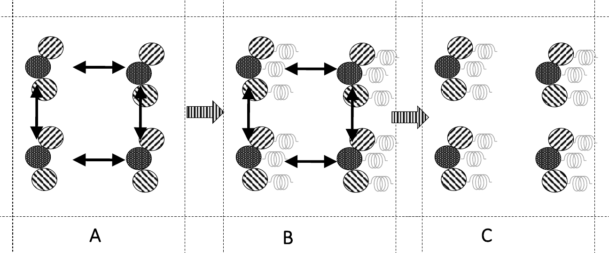
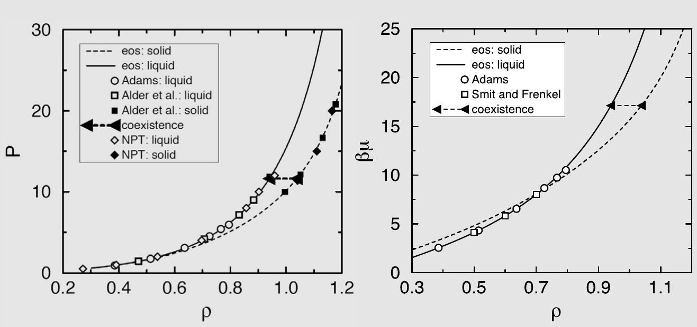
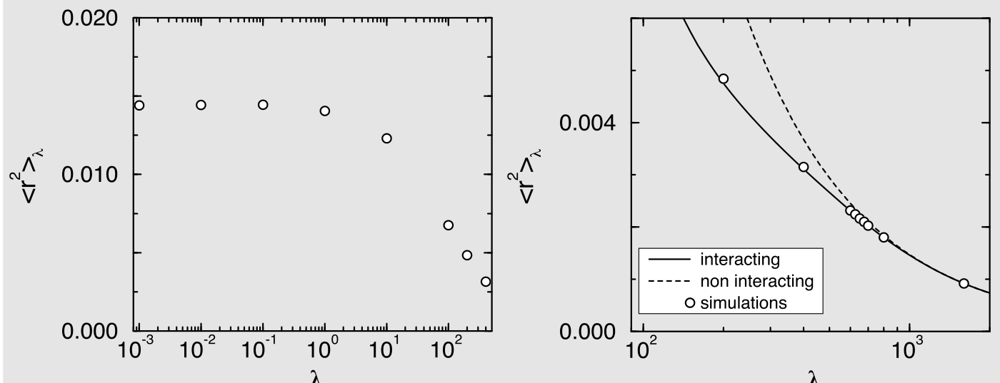
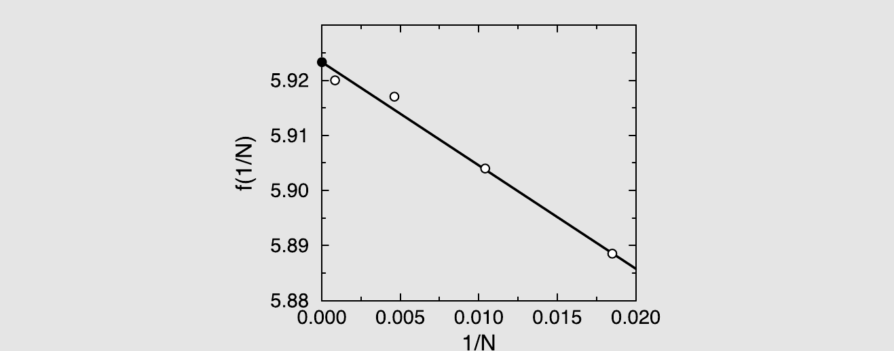

# 固体的自由能

在三维情况下，流体态与晶态之间被一级相变所隔开。与液-汽转变（在临界点终止）不同，不存在固-流临界点[[345,397,398]](references.md#ref-345)。[^1][^2] 由于一级相变通过成核与生长过程不可逆地进行，不存在连接体相流体与固体的连续、无滞后路径。对于一级固-固转变，滞后问题甚至更为严重。因此，定位涉及一个或多个固相的共存曲线的最可靠方法是计算所有相关相的化学势随温度、压力以及可能的其它变量的函数关系。

由于晶体相与稀薄气体之间不存在天然的可逆路径，我们无法直接将固体的化学势与稀薄气体参考态的化学势联系起来。正因如此，需要专门的技术来计算固体的化学势。在实践中，此类计算通常涉及计算固体的亥姆霍兹自由能 $F$，然后利用关系 $G = N\mu = F + PV$ 推导固体的化学势。注意，上述关系适用于纯物质。在下文中，我们将主要讨论纯物质，但偶尔也会提及混合物带来的额外挑战。

首先需要指出，定位涉及固体的相平衡不能基于第 6.6 节中介绍的吉布斯系综方法，因为该方法依赖于在共存相之间交换粒子的可能性。对于密堆积相，尤其是固体，这种粒子交换变得极为不可能：将一个粒子成功试探插入固相通常要求固体中存在不可忽略浓度的空位。这种缺陷确实存在于真实固体中，但其浓度极低（例如，在硬球晶体近熔点处，平均每 8000 个粒子中只有一个空位），因此需要相当大的晶体（或偏倚模拟）才能在模拟中观察到合理数量的空位。因此，吉布斯系综技术虽然在原理上仍然有效，[^3] 但对于研究固-液或固-固共存而言并不太实用。在某些情况下，晶体中的粒子数可能与晶格位点数显著不同[[224,225]](references.md#ref-224)，此时粒子的插入/移除可能较为容易，但应用吉布斯系综方法则更为成问题。原因在于，为了找到此类体系的最小自由能状态，晶格位点数应能独立于体积和粒子数自由变化[[224]](references.md#ref-224)。标准吉布斯系综方法倾向于约束晶格位点数，从而给出无意义的结果。

下面，我们简要描述晶体固体自由能计算的一些显著特点。我们的讨论并非旨在面面俱到：有关补充信息，读者可参阅 Vega 等人[[402]](references.md#ref-402) 以及 Monson 和 Kofke [[403]](references.md#ref-403) 的综述。

## 热力学积分

热力学积分是研究固-液相变最常用的方法。对于液相，该计算非常直接，已在第 8.4.1 节中讨论过：液相的亥姆霍兹自由能 $F$ 通过对状态方程进行积分来确定，从流体表现为理想气体的低密度开始：

$$
\frac{F(\rho)}{Nk_BT} = \frac{F^{\mathrm{id}}(\rho)}{Nk_BT} + \frac{1}{k_BT}\int_0^{\rho} \mathrm{d}\rho'\, \frac{P(\rho') - \rho' k_BT}{\rho'^2} ,
\tag{9.1.1}
$$

其中状态方程表示为密度 $(\rho)$ 的函数 $P(\rho)$，$F^{\mathrm{id}}(\rho)$ 是密度为 $\rho$ 的理想气体的自由能。一个重要条件是式 (9.1.1) 中的积分路径必须是可逆的。如果积分路径穿越强一级相变，则可能出现滞后现象，式 (9.1.1) 便不再适用。对于液相，可以通过分两步进行积分来避免此问题。首先在远高于临界温度的温度下开始模拟，沿等温线压缩至所需密度，确定状态方程。第二步，在恒定密度下将系统冷却至目标温度。此步骤中的自由能变化由下式给出：

$$
\frac{F(T = T_{II})}{k_BT_{II}} - \frac{F(T = T_I)}{k_BT_I} = \int_{T_I}^{T_{II}} d(1/T)\, U(T, N, V) .
\tag{9.1.2}
$$

固-液共存曲线本身不在临界点终止，因此不存在不穿越一级相变的从固体到理想气体的``天然''可逆路径。然而，通常可以构造通往其他已知自由能状态的可逆路径。构造此类路径是本章的主要主题。

到达已知自由能状态有多种途径。在 20 世纪 60 年代中期，Hoover 和 Ree 引入了所谓的单占胞方法[[276,307]](references.md#ref-276)。在单占胞方法中，固体被建模为格气；每个粒子被分配到一个格点，并且只允许在其格点周围的``胞''内运动。格点与无约束固体中原子的平均位置重合。如果密度足够高——使得胞壁对系统性质的影响可以忽略——则此格点模型的自由能与原始固体的自由能相同。单占胞模型可以均匀膨胀而不会熔化（或更准确地说，不会失去平移序）。通过这种方式，我们获得了一条（假定可逆的）积分路径，通向一个可以解析计算自由能的稀薄格气。单占胞方法最早的应用是 Hoover 和 Ree 计算硬盘[[276]](references.md#ref-276) 和硬球[[307]](references.md#ref-307) 固体的自由能。

Hoover 及其合作者还开发了单占胞方法的替代方案[[309,311]](references.md#ref-309)。在此方法中，固体被冷却到足够低的温度，使其表现为谐振晶体。谐振晶体的亥姆霍兹自由能可以使用晶格动力学进行解析计算。更高温度下固体的自由能则由式 (9.1.2) 的积分得到。[^4]

在实践中，单占胞方法和谐振固体方法都有一些局限性，使得更通用的方案成为需要。例如，有证据表明单占胞模型的等温膨胀可能并非完全没有滞后[[313]](references.md#ref-313)：在固体在缺乏人工胞壁时会变得力学不稳定的密度处，单占胞模型的状态方程似乎会出现尖点或甚至弱的一级相变。这使得式 (9.1.1) 的精确数值积分变得困难。

谐振固体方法只有当所考虑的固相可以被可逆地冷却到固体实际上变为谐振体的低温时才能使用。然而，许多分子固体在冷却过程中会经历一个或多个一级相变。更有问题的是粒子间通过不连续（例如硬核）势相互作用的模型体系。此类模型体系的晶相永远无法使其表现为谐振固体。对于复杂的分子体系，问题则具有不同的性质：即使这些材料可以被冷却成为谐振晶体，在该极限下计算亥姆霍兹自由能也可能并非易事。

在本章中，我们讨论不受上述限制且可应用于任意固体的方法[[404,405]](references.md#ref-404)。虽然该方法具有普适性，但根据我们研究的是具有不连续势的原子固体[[314]](references.md#ref-314)、具有连续势的原子固体[[406]](references.md#ref-406)、还是分子固体[[405,407]](references.md#ref-405)，进行一些小的修改是有利的。

## 固体自由能的计算

本节讨论的方法是一种用于计算原子固体亥姆霍兹自由能的哈密顿热力学积分技术（见第 2.5.1 节）。基本思想是将所研究的固体可逆地转变为爱因斯坦晶体。为此，原子通过谐弹簧耦合到各自的格点。如果耦合足够强，固体便表现为爱因斯坦晶体，其自由能可以精确计算。该方法首先由 Broughton 和 Gilmer [[408]](references.md#ref-408) 用于连续势，而 Frenkel 和 Ladd [[314]](references.md#ref-314) 使用略有不同的方法计算了硬球固体的自由能。对原子和分子体系的扩展可参见文献[[406,407]](references.md#ref-406)。

### 连续势的原子固体

让我们首先考虑一个通过连续势 $U(\mathbf{r}^N)$ 相互作用的体系。我们将使用热力学积分（式 (8.4.8)）将此体系的自由能与已知自由能的固体联系起来。对于参考固体，我们选择爱因斯坦晶体，即所有粒子通过谐弹簧耦合到各自格点的非相互作用粒子构成的固体。在热力学积分过程中，我们逐渐开启这些弹簧常数并关闭分子间相互作用。为此，我们考虑如下势能函数：

$$
U(\mathbf{r}^N; \lambda) = U(\mathbf{r}_0^N) + (1 - \lambda)\left[U(\mathbf{r}^N) - U(\mathbf{r}_0^N)\right] + \lambda \sum_{i=1}^{N} \alpha_i (\mathbf{r}_i - \mathbf{r}_{0,i})^2 ,
\tag{9.2.1}
$$

其中 $\mathbf{r}_{0,i}$ 是原子 $i$ 的格点位置，$U(\mathbf{r}_0^N)$ 是势能的静态贡献（即所有原子处于格点位置时晶体的势能），$\lambda$ 是切换参数，$\alpha_i$ 是将原子 $i$ 耦合到其格点的爱因斯坦晶体弹簧常数。注意，当 $\lambda = 0$ 时，我们恢复原始相互作用；当 $\lambda = 1$ 时，我们完全关闭了分子内相互作用（除常数静态项外），体系表现为理想（非相互作用）爱因斯坦晶体。自由能差利用式 (8.4.8) 计算：

$$
F = F_{\mathrm{Ein}} + \int_{\lambda=0}^{\lambda=1} \mathrm{d}\lambda \left\langle \frac{\partial U(\lambda)}{\partial \lambda} \right\rangle_{\lambda} \\
= F_{\mathrm{Ein}} + \int_{\lambda=0}^{\lambda=1} \mathrm{d}\lambda \left\langle \sum_{i=1}^{N} \alpha_i (\mathbf{r}_i - \mathbf{r}_{0,i})^2 - \left[\mathcal{U}(\mathbf{r}^N) - \mathcal{U}(\mathbf{r}_0^N)\right] \right\rangle_{\lambda} .
\tag{9.2.2}
$$

非相互作用爱因斯坦晶体的构型自由能为：

$$
F_{\mathrm{Ein}} = \mathcal{U}(\mathbf{r}_0^N) - \frac{d}{2\beta} \sum_{i=1}^{N} \ln(\pi / \alpha_i \beta) .
\tag{9.2.3}
$$

正如我们稍后将看到的，考虑质心固定的晶体在计算上更为方便。这将对式 (9.2.3) 稍作修改（见第 9.2.5 节）。``弹簧常数'' $\alpha_i$ 可以进行调整以优化式 (9.2.2) 数值积分的精度。合理的假设是，如果量 $\sum_{i=1}^{N} \alpha_i (\mathbf{r}_i - \mathbf{r}_{0,i})^2 - U(\mathbf{r}^N)$ 的涨落最小，则积分是最优的，这意味着纯爱因斯坦晶体中的相互作用应与原始体系中的相互作用尽可能接近。这表明 $\alpha_i$ 应选择使得 $\lambda = 1$ 和 $\lambda = 0$ 时的均方位移相等：

$$
\left\langle \sum_{i=1}^{N} (\mathbf{r}_i - \mathbf{r}_{0,i})^2 \right\rangle_{\lambda=0} \approx \left\langle \sum_{i=1}^{N} (\mathbf{r}_i - \mathbf{r}_{0,i})^2 \right\rangle_{\lambda=1} .
$$

利用爱因斯坦晶体中均方位移的表达式 (9.2.10)，我们得到以下关于 $\alpha$ 的条件：

$$
\frac{3}{2\beta\alpha_i} = \left\langle (\mathbf{r}_i - \mathbf{r}_{0,i})^2 \right\rangle_{\lambda=0} .
\tag{9.2.4}
$$

对于具有发散短程排斥相互作用的体系，例如 Lennard-Jones 势，式 (9.2.2) 中的被积函数将表现出弱的、可积的发散。这种发散是由于爱因斯坦晶体的势能函数并不完全排除两个粒子具有相同质心坐标的构型。

发散贡献的幅度可以通过增大 $\alpha$ 的值来强烈抑制。然而，为了提高计算精度，更好的做法是将热力学积分从 $\lambda = 0$ 进行到 $\lambda = 1 - \delta\lambda$，然后利用微扰表达式 $\Delta F = -k_BT \ln\langle \exp(-\beta \Delta U) \rangle$ 计算 $\lambda = 1$ 与 $\lambda = 1 - \delta\lambda$ 之间的自由能差，其中 $\Delta U \equiv U(\mathbf{r}^N; \lambda=1) - U(\mathbf{r}^N; \lambda - \delta\lambda)$。$\delta\lambda$ 的精确值并不重要，但如果取得太大，微扰表达式会变得不精确；如果取得太小，哈密顿积分中使用的数值求积会变得不够精确。我们将在第 9.2.2 节中回到这个问题。

#### 其他方法

当然，选择爱因斯坦晶体作为参考态是一种人为的选择。我们也可以使用其他自由能已解析已知的参考态。最自然的选择是（经典）谐振晶体，即势能仅展开到粒子相对于其格点位移的二次项的模型晶体[[335,409]](references.md#ref-335)。根据我们对晶体势能极小值处黑塞矩阵的了解，可以获得谐振声子模式的所有非零本征频率 $\omega_i$（$i = 1, \cdots, d(N-1)$）。（固定质心的）谐振晶体的自由能 $F_h(N, V, T)$ 由下式给出：

$$
\beta F_h(N, V, T) = \beta \mathcal{U}_0 + \sum_{i=1}^{d(N-1)} \ln(\beta\hbar\omega_i) ,
\tag{9.2.5}
$$

其中 $U_0$ 是势能极小值。[^5]

相互作用晶体的平均超额势能差等于 $U_{\mathrm{exc}}(N, V, T) = U(N, V, T) - U(N, V, T=0)$。对于谐振晶体，$U_{\mathrm{exc}}^h(N, V, T) = d(N-1)k_BT/2$。

在足够低的温度 $T_L$ 下，具有完整分子间相互作用的晶体将（通常）变得越来越谐性，因此非常接近谐振晶体。Cheng 和 Ceriotti [[409]](references.md#ref-409) 提出，当 $\Delta U = U_{\mathrm{exc}}(N, V, T_L) - U_{\mathrm{exc}}^h(N, V, T_L) = O(k_BT_L)$ 时，可以使用热力学微扰表达式 (8.6.10) 获得相互作用晶体的自由能：

$$
\beta \Delta F = -\ln\langle \exp(-\beta \Delta U) \rangle_h .
$$

注意，与爱因斯坦晶体一样，在谐振极限附近使用微扰表达式可以消除如果使用哈密顿量热力学积分（TI）时将出现的发散。但需要注意，$U$ 是广延量，因此系统越大，$T_L$就必须选得越低。出于这个原因，可能需要在较高温度下进行哈密顿量 TI——就像在爱因斯坦晶体极限中那样。

我们强调，使用 MD 方法对近谐振固体的势能进行采样，需要使用能保证遍历性的恒温器（见第七章）。因此，应避免使用简单的 Nos\'{e}-Hoover 恒温器。不过，请注意，我们永远不需要模拟谐振（或爱因斯坦）极限：由于我们知道粒子或声子位移的高斯分布，我们可以使用 Box-Muller 方法[[66]](references.md#ref-66) 在谐振/爱因斯坦极限中生成不相关的构型。

并非所有固体结构在极低温度下都是力学稳定的，这意味着与高温晶格结构对应的黑塞矩阵不一定是正定的。在这种情况下，爱因斯坦晶体方法更为稳健。

**绕过临界点的积分**

虽然从固体到液体的转变总是涉及相变，且在三维情况下总是一级相变，但可以通过施加一个人工场来稳定晶体结构从而完全避免此相变。当该场施加于液相时，它会破坏各向同性对称性。因此，在该场存在的情况下，液体与晶体之间没有对称性差异。对于弱场，类固相与类液相之间仍然存在一级相变，但对于足够强的场，相变终止于临界点，我们可以从液体连续地过渡到晶体，就像我们可以通过连续路径绕过临界点连接液体和蒸气一样[[399]](references.md#ref-399)。同样的方法也可用于构造绕过涉及液晶相的一级相变的可逆路径，例如各向同性-向列相转变和向列相-近晶相转变[[303]](references.md#ref-303)。

**替代参考态**

有多种方法可以制备已知自由能的参考固体。爱因斯坦晶体和谐振固体只是两个例子。有时使用允许多个粒子共享同一格点的参考固体较为方便：这种行为在团簇固体的研究中是相关的[[410]](references.md#ref-410)。类爱因斯坦晶体的方法甚至已被用于计算无序相的自由能[[411]](references.md#ref-411)。

**不同固相之间的自由能差**

通常我们关心的是两个晶相的相对稳定性。在这种情况下，只需计算这两个相之间的自由能差即可。此时并不总是需要计算各个相的自由能：如果可以将一个固体可逆地转变为另一个固体，则可以沿该路径进行热力学积分。

一种可以用于测量不同固相之间自由能差的完全不同的方法是 Bruce 等人[[412]](references.md#ref-412) 的晶格切换 MC 方法。该方法将在例 12 中讨论。

### 不连续势的原子固体

在前面的例子中，我们考虑的参考态中分子间相互作用被逐渐关闭，或者使用谐振微扰表达式来计算谐振晶体与完整相互作用晶体之间的自由能差。

然而，如果所研究的模型具有硬核相互作用，这种方法就不可行了：更准确地说，无限强的排斥不能通过线性耦合参数来关闭。此外，对于硬核晶体，谐振参考态并不存在。

处理具有硬核相互作用 $U_0$ 的体系的一种方法是简单地不将其关闭，而是使其变得无害。一种可能的解决方案是使用一种将爱因斯坦晶格膨胀到极低密度的方法，使得硬核重叠变得极不可能（同样的方法已被用于分子晶体[[404,407]](references.md#ref-404)）。

另一种替代方案是考虑一个可以开启弹簧常数，同时保持粒子间硬核相互作用不受影响的体系：

$$
\mathcal{U}(\lambda) = \mathcal{U}_0 + \lambda \mathcal{U} = \mathcal{U}_0 + \lambda \sum_{i=1}^{N} (\mathbf{r}_i - \mathbf{r}_{0,i})^2 ,
\tag{9.2.6}
$$

其中 $N$ 表示粒子总数，$\mathbf{r}_{0,i}$ 是粒子 $i$ 被分配到的格点位置。耦合常数为 $\lambda$ 的体系与硬球流体之间的自由能差为

$$
F_{\mathrm{HS}} = F(\lambda_{\max}) - \int_{0}^{\lambda_{\max}} \mathrm{d}\lambda \left\langle \mathcal{U}(\mathbf{r}^N,\lambda) \right\rangle_{\lambda} .
\tag{9.2.7}
$$

在 $\lambda_{\max}$ 足够大的值下，硬粒子彼此之间不再``感知''对方，自由能便简化为非相互作用爱因斯坦晶体的自由能。显然，弹簧常数 $\lambda$ 的值应当足够大，以确保谐束缚晶体确实表现为爱因斯坦晶体。同时，$\lambda$ 不应太大，否则式 (9.2.7) 的数值积分会变得不够精确。一般而言，$\lambda$ 的最优选择取决于模型的具体细节。在案例研究 17 中，我们展示了如何为特定模型体系选择 $\lambda$，并讨论了硬核相互作用特有的其他实际问题。

### 分子晶体与多组分晶体

#### 分子晶体

与原子不同，分子之间的相互作用取决于它们的相对取向。分子的形状多种多样，通常这些形状可以以许多不同方式堆积成周期性结构。但不仅仅是堆积问题：分子的能量相互作用还取决于它们的局部电荷分布，有时还取决于它们形成氢键的能力。因此，哪些分子晶体多晶型在凝固过程中形成是许多不同因素之间相互作用的结果。即使是氮这样的简单分子也至少有七种不同的固相[[413,414]](references.md#ref-413)。正是在这种背景下，分子固体的自由能计算变得重要：显然，了解在给定温度和压力下哪种多晶型具有最低的吉布斯自由能是有意义的。在本节中，我们讨论分子晶体自由能计算与原子晶体自由能计算之间的差异。

然而需要提醒的是：即使我们知道哪种多晶型最稳定，也不能保证实验中形成的晶型就是这种形式。正如 Ostwald 在 1897 年就已经指出的[[415]](references.md#ref-415)，结晶形成的多晶型通常不是热力学上最稳定的那种。

从概念上讲，分子晶体自由能的计算与原子晶体并无不同：我们需要选择一个合适的参考态，并找到一条可逆的哈密顿热力学积分路径。然而，在实践中，根据参考态的性质，需要更多的步骤。特别是，我们需要同时施加平移有序和（可能的）取向有序。

创建取向有序参考态的一种方法是将分子取向耦合到外部取向场[[416]](references.md#ref-416)。然而，也可以将分子中的多个原子通过谐弹簧耦合到其平均晶格位置[[405]](references.md#ref-405)（见图 9.1）。例 33 给出了一种计算氮晶体自由能的替代方法的示例。



*图 9.1　爱因斯坦晶体方法用于分子晶体的示意图。模拟使用一系列哈密顿热力学积分来计算分子晶体（面板 A）与``Einstein''晶体（面板 C）之间的自由能差，在后者中分子的取向和质心位置都受谐弹簧约束。面板 A 显示原始晶体；一些分子间相互作用以双箭头表示。在从面板 A 到面板 B 的变换中，爱因斯坦谐力被开启，而分子间力仍然存在。最后，在从 B 到 C 的变换中，分子间力（但不是分子内力）被关闭。计算分子爱因斯坦晶体的自由能比原子爱因斯坦晶体稍复杂，因为需要确定谐束缚晶体的简正模式频率。*

#### 多组分晶体

包含一个以上物种的有序晶体的自由能计算与单组分晶体的自由能计算在根本上是相同的[[417–419]](references.md#ref-417)。

对于具有置换无序的混合晶体（如合金），情况更为微妙。在这种情况下，我们需要对置换无序的不同实现进行采样。如果混合固体中各组分的尺寸差异不太大，我们可以使用 Monte Carlo``交换移动''来对构型进行采样[[101]](references.md#ref-101)。注意，我们不能简单地对不同组分的随机排列进行平均，因为即使在置换无序的固体中，不同组分的位置之间也存在局部关联。

计算具有置换无序的晶体自由能的最简单方法是首先计算将混合晶体转变为纯晶体所涉及的自由能变化。有几种方法可以做到这一点（例如参见文献[[101,210]](references.md#ref-101) 以及例 12），涉及将所有粒子转变为同一类型，并在此过程中计算自由能变化。一旦我们获得了一个纯晶体，就可以使用上述标准方法来计算自由能。

然而，可能不存在从置换合金到单组分晶体的可逆路径。在这种情况下，最好使用与交换移动兼容的自由能计算方法。例如，可以参照文献[[410]](references.md#ref-410) 的思想，开启一个与晶格结构兼容的周期性势，使得在足够强的场下，所有粒子都被迫接近某个格点位置——但与文献[[410]](references.md#ref-410) 不同的是，格点的双重占据通常会被排除。该场应当是``色盲的''：因此哪个物种处于哪个格点并不重要。一旦场足够强，我们就可以关闭分子间力，从而将体系简化为一个可以解析（或几乎解析）计算自由能的状态——在此极限下，交换移动将采样随机置换合金。

### 爱因斯坦晶体实现中的问题

如果所有粒子都耦合到爱因斯坦晶格，晶体作为一个整体就不会移动。然而，在 $\lambda \to 0$ 的极限下，将粒子移离其``Einstein''晶格位置没有惩罚。因此，晶体整体可能开始漂移，均方粒子位移 $\langle \mathbf{r}^2 \rangle$ 变为 $L^2$ 量级。如果发生这种情况，式 (9.2.7) 中的被积函数将在 $\lambda = 0$ 附近急剧上升。这似乎意味着式 (9.2.7) 的数值积分需要在低 $\lambda$ 值下进行大量模拟。如果我们在固体质心保持固定的约束下进行模拟，就可以避免这个问题。在这种情况下，$\langle \mathbf{r}^2 \rangle$ 趋于 $\langle \mathbf{r}^2 \rangle_0$，即正常（即相互作用的）晶体中粒子偏离其格点的均方位移。[^6]

为了在固定质心的约束下执行 Monte Carlo 模拟，我们必须确保如果粒子被赋予随机位移，则所有粒子随后向相反方向移动，使质心保持固定。在实践中，每次执行单粒子试探移动时都移动所有粒子以保持质心不动并不方便。相反，我们每次单粒子试探移动被接受时更新质心位置。我们只需要在计算连接粒子与其格点的谐弹簧势能时对质心的位移进行修正。相比之下，分子间势能的计算可以在不知道质心位置的情况下进行，因为质心的位移不改变粒子之间的距离。

将粒子的``绝对''坐标（$\mathbf{r}$，即已对质心运动进行修正的坐标）与未修正坐标（$\mathbf{r}^{(U)}$）区分开是方便的。在计算谐弹簧的势能时，我们需要知道 $\sum_{i=1}^{N}(\mathbf{r}_i - \mathbf{r}_{0,i})^2$。为了计算粒子 $i$ 到其格点的距离 $\mathbf{r}_i - \mathbf{r}_{0,i}$，我们必须跟踪质心的位移：

$$
\boldsymbol{\delta}\mathbf{r}_i \equiv \mathbf{r}_i - \mathbf{r}_{0,i} = \mathbf{r}_i^{(U)} - \mathbf{r}_{0,i}^{(U)} - \boldsymbol{\delta}\mathbf{R}_{\mathrm{CM}} ,
$$

其中 $\boldsymbol{\delta}\mathbf{R}_{\mathrm{CM}}$ 表示系统质心的累积位移。每次粒子从 $\mathbf{r}^{(U)} \to \mathbf{r}^{(U)} + \boldsymbol{\delta}\mathbf{r}$ 移动时，$\boldsymbol{\delta}\mathbf{R}_{\mathrm{CM}}$ 变为 $\boldsymbol{\delta}\mathbf{R}_{\mathrm{CM}} + \boldsymbol{\delta}\mathbf{r}/N$。

计算所有粒子与其格点之间的谐相互作用能量变化相当简单。假设我们尝试将粒子 $i$ 从其格点 $\mathbf{r}_{0,i}$ 的距离 $\boldsymbol{\delta}\mathbf{r}_i$ 处移动一段距离 $\boldsymbol{\epsilon}_i$。这会导致质心发生 $\boldsymbol{\epsilon}_i/N$ 的位移。谐势能的变化为

$$
\displaystyle
\delta \mathcal{U_{\mathrm{Harm}}(\lambda) = \lambda \sum_{j \neq i} \left[ \left(\boldsymbol{\delta}\mathbf{r}_j - \frac{\boldsymbol{\epsilon}_i}{N}\right)^2 - \boldsymbol{\delta}\mathbf{r}_j^2 \right] + \lambda \left[ \left(\boldsymbol{\delta}\mathbf{r}_i + \left(1-\frac{1}{N}\right)\boldsymbol{\epsilon}_i\right)^2 - \boldsymbol{\delta}\mathbf{r}_i^2 \right]
= \lambda \left( 2\boldsymbol{\delta}\mathbf{r}_i \cdot \boldsymbol{\epsilon}_i + \frac{N-1}{N}\boldsymbol{\epsilon}_i^2 \right) ,
}
\tag{9.2.8}
$$

其中，在最后一行中我们使用了 $\sum_{i=1}^{N} \boldsymbol{\delta}\mathbf{r}_i = 0$ 这一事实。

还有一个注意事项需要考虑：将移出原始模拟盒的粒子放回到另一侧是一种常见（尽管不建议）的做法。然而，在模拟具有固定质心的系统时，将粒子移回原始模拟盒会造成质心位置的不连续变化，从而导致爱因斯坦晶格能量的突然变化。因此，在固定质心的模拟中，移出原始模拟盒的粒子绝对不应被放回。算法 19 和 20 概述了如何在 Monte Carlo 模拟中实现爱因斯坦晶体方法。

**算法 19　固定质心 MC：晶格束缚晶体的粒子移动**

```
 **function** mcmove
  尝试在保持质心固定的条件下移动粒子
  setlat：设置参考晶格
  $o = \text{int}(R \times n_{\text{part}}) + 1$ \COMMENT{随机选择粒子}
  $\text{dis} = (R - 0.5) \times \text{delx}$ \COMMENT{给予粒子随机位移}
  $x_n = x(o) + \text{dis}$
  $\mathrm{d}x = x(o) - x_0(o) - \mathrm{d}x_{\mathrm{cm}}$ \COMMENT{计算 $\boldsymbol{\delta}\mathbf{r}_i$}
  $\text{del} = \lambda \times (2 \times \mathrm{d}x \times \text{dis} + \text{dis} \times \text{dis} \times (n_{\text{part}}-1)/n_{\text{part}})$ \COMMENT{与晶格的能量差，式 (9.2.8)}
  $\text{arg1} = -\beta \times \text{del}$
if $R < \exp(\text{arg1)$}
    $e_{\text{no}} = \text{ener}(x(o))$ \COMMENT{旧构型的能量}
    $e_{\text{nn}} = \text{ener}(x_n)$ \COMMENT{新构型的能量}
    $\text{arg2} = -\beta \times (e_{\text{nn}} - e_{\text{no}})$
  if $R < \exp(\text{arg2)$}
      $\mathrm{d}x_{\mathrm{cm}} = \mathrm{d}x_{\mathrm{cm}} + (x_n - x(o))/n_{\text{part}}$ \COMMENT{更新质心位移}
      $x(o) = x_n$ \COMMENT{接受：用 $x_n$ 替换 $x(o)$}
  end if
end if
 **end function**
```

skip

**具体说明**（一般说明见第 1 章「算法」）：

1. 函数 setlat 用于设置固定的参考晶格 $x_0$（算法 20）。在模拟开始时 $x = x_0$。ener 计算分子间相互作用能量。
1. 如果移动被接受，系统质心（CoM）的位移 $(\mathrm{d}x_{\mathrm{cm}})$ 被更新，同样的位移也被应用于参考晶格。
1. 项 $\lambda$ 是式 (9.2.6) 中定义的耦合常数，$\mathrm{d}x_{\mathrm{cm}} = \boldsymbol{\delta}\mathbf{R}_{\mathrm{CM}}$ 是质心的累积位移。
1. 对于硬核系统，首先计算与谐弹簧势能变化相关的玻尔兹曼因子并应用 Metropolis 规则来判断是否应拒绝移动，这一点很重要。只有通过此测试后，才应尝试执行更昂贵的重叠检测。

**算法 20　生成 fcc 晶体**

```
 **function** setlat$(n_x, n_y, n_z)$
  生成三维 fcc 晶体，包含 $n_x \times n_y \times n_z$ 个单胞，每个单胞含 4 个粒子
  $a_1 = (V/(n_x \times n_y \times n_z))^{1/3}$ \COMMENT{单胞直径}
  $i = 0$；$x_{\mathrm{cm0}} = 0$
for $1 \leq i_z \leq 2n_z$
  for $1 \leq i_y \leq 2n_y$
    for $1 \leq i_x \leq 2n_x$
      if $(i_x + i_y + i_z) \bmod 2 == 0$
          $i = i + 1$
          $x_0(i) = a_0 \times i_x + 0.5 \times a_0 \times (i_y + i_z) \bmod 2$ \COMMENT{粒子 $i$ 的 $x$ 坐标}
          $y_0(i) = a_0 \times i_y + 0.5 \times a_0 \times (i_x + i_z) \bmod 2$ \COMMENT{粒子 $i$ 的 $y$ 坐标}
          $z_0(i) = a_0 \times i_z + 0.5 \times a_0 \times (i_x + i_y) \bmod 2$ \COMMENT{粒子 $i$ 的 $z$ 坐标}
          $x_{\mathrm{cm0}} = x_{\mathrm{cm0}} + x_0(i)$；$y$、$z$ 类似
      end if
    end for
  end for
end for
  $x_{\mathrm{cm0}} = x_{\mathrm{cm0}} / n_{\text{part}}$ \COMMENT{$x$ 方向质心；$y$、$z$ 类似}
 **end function**
```

skip

**具体说明**（一般说明见第 1 章「算法」）：

1. 该算法生成面心立方（fcc）晶格并计算其质心位置（此处仅显示 $x$ 分量）。
1. 注意，在周期性系统中，质心的定义是不明确的：此处我们取原始模拟盒中粒子的质心。
1. 在跟踪质心位移时（见算法 19），我们计算所有粒子的平均（可能按质量加权）位移：在这种情况下，应注意不要将粒子强制放入原始模拟盒内。

???+ example "例 19（硬球的固-液平衡）"

    在本例中，我们定位硬球模型的固-液共存密度。我们通过令两相的化学势和压力相等来确定这些密度。

    对于液相，我们使用 Speedy [[421]](references.md#ref-421) 的状态方程，该方程基于对硬球的计算机模拟数据和维里系数的 Pad\'{e} 近似：

    $$
    z_{\mathrm{liquid}} = \frac{P\beta}{\rho} = \frac{1 + x + 0.076014 x^2 + 0.019480 x^3}{1 - 0.548986x + 0.075647x^2} .
    $$

    对于硬球模型的固相，Speedy 提出了以下状态方程[[320]](references.md#ref-320)：

    $$
    z_{\mathrm{solid}} = \frac{3}{1 - \zeta^* - 0.5921\zeta^{*2} - 0.7072\zeta^{*3}} - \frac{0.601\zeta^*}{1 - \zeta^* - 0.5921\zeta^{*2} - 0.7072\zeta^{*3}} ,
    \tag{9.2.9}
    $$

    其中 $\zeta^* = \sigma^3 \rho / \sqrt{2}$（译注：原书此处 $\zeta^*$ 的定义与公式中使用的符号形式不同，此处按原始公式结构翻译）。在图 9.2 中，我们将该液相和固相状态方程的预测与 Alder 和 Wainwright [[422]](references.md#ref-422) 以及 Adams [[171]](references.md#ref-171) 的计算机模拟结果进行了比较。可以看出，经验状态方程很好地再现了模拟数据。为了计算液相的化学势，我们从稀薄气体极限开始积分状态方程（参见式 (9.1.1)）。这给出了亥姆霍兹自由能作为密度的函数。化学势则由下式得出：

    $$
    \beta\mu(\rho) = \frac{\beta G}{N} = \frac{\beta F}{N} + \frac{P}{\rho k_BT} .
    $$

    

    *图 9.2　压力 $P$（左）和化学势 $\mu$（右）作为密度 $\rho$ 的函数。实线曲线表示从 Speedy 状态方程[[421]](references.md#ref-421) 获得的液相压力和化学势。虚线给出了由文献[[320]](references.md#ref-320) 的状态方程计算的固相压力。空心和实心符号分别是液相[[171,422,423]](references.md#ref-171) 和固相[[422]](references.md#ref-422) 的计算机模拟结果。共存密度以水平线标示。（图内标注：eos: solid / eos: liquid = 状态方程：固相 / 液相；coexistence = 共存；NPT: liquid / NPT: solid = $NPT$ 模拟：液相 / 固相；Adams、Alder et al.、Smit and Frenkel 为文献出处）*

    理想气体每粒子自由能由下式给出：

    $$
    \beta f^{\mathrm{id}}(\rho) = \frac{F^{\mathrm{id}}(\rho)}{Nk_BT} = \ln\rho\Lambda^3 - 1 ,
    $$

    其中 $\Lambda$ 为 de Broglie 热波长。在下文中，我们将写 $\beta f^{\mathrm{id}}(\rho) = \ln\rho - 1$。

    也就是说，我们将使用通常的约化密度，并忽略加性常数 $3\ln(\Lambda/\sigma)$，因为它在经典系统的相平衡定位中不起作用。

    图 9.2 比较了从 Hall 状态方程得出的化学势与部分可用的模拟数据（即文献[[171]](references.md#ref-171) 的巨正则系综模拟和使用 Widom 试验粒子方法直接计算化学势的结果[[423]](references.md#ref-423)（见第八章））。这些结果表明我们有液相和固相的精确状态方程。由于我们知道理想气体相的绝对自由能，我们可以计算液相的自由能，进而计算液相的化学势。对于固相，我们可以使用状态方程来计算自由能差；要计算绝对自由能，我们必须确定特定密度下的自由能。为了执行此计算，我们使用晶格耦合方法。

    我们现在必须选择耦合参数 $\lambda$ 的上限（$\lambda_{\max}$）以及进行模拟的 $\lambda$ 值。对于足够大的 $\lambda$ 值，我们可以使用下式解析计算 $\sum_{i=1}^{N}(\mathbf{r}_i - \mathbf{r}_{0,i})^2$：

    $$
    \langle \mathbf{r}^2 \rangle_{\lambda} = \frac{1}{N}\frac{\partial F(\lambda)}{\partial \lambda} .
    $$

    对于非相互作用爱因斯坦晶体，均方位移由下式给出：

    $$
    \langle \mathbf{r}^2 \rangle_{\lambda} = \frac{3}{2\beta\lambda} .
    \tag{9.2.10}
    $$

    对于具有固定质心的非相互作用爱因斯坦晶体，自由能由式 (9.2.23) 给出，由此可得：

    $$
    \langle \mathbf{r}^2 \rangle_{\mathrm{Ein},\lambda} = \frac{1}{\beta}\frac{3}{2}\frac{N-1}{N}\frac{1}{\lambda} .
    \tag{9.2.11}
    $$

    在文献[[314]](references.md#ref-314) 中，推导了相互作用爱因斯坦晶体情形的解析表达式，该式为：

    $$
    \displaystyle
    \langle \mathbf{r^2 \rangle_{\lambda} = \langle \mathbf{r}^2 \rangle_{\mathrm{Ein},\lambda} - \frac{\beta n}{2} \frac{1}{2a(2\pi\beta\lambda)^{1/2}} \left(1 - P^{\mathrm{nn}}_{\mathrm{overlap}}(\lambda)\right)
    \times \left[ (\sigma a - \sigma^2 - 1/(\beta\lambda))\exp(-\beta\lambda(a-\sigma)^2/2) + (\sigma a + \sigma^2 - 1/(\beta\lambda))\exp(-\beta\lambda(a+\sigma)^2/2) \right] ,
    }
    \tag{9.2.12}
    $$

    其中 $a$ 是两个最近邻粒子 $i$ 和 $j$ 的间距，$a = |\mathbf{r}_{0,i} - \mathbf{r}_{0,j}|$，$\sigma$ 是硬核直径，$n$ 是最近邻数（例如，对于 fcc（面心立方）和 hcp（六方密堆积）固体 $n = 12$，对于 bcc（体心立方） $n = 8$）；$P^{\mathrm{nn}}_{\mathrm{overlap}}(\lambda)$ 是两个最近邻重叠的概率。该概率由下式给出：

    $$
    \displaystyle
    P^{\mathrm{nn}_{\mathrm{overlap}}(\lambda) = \frac{\mathrm{erf}((\beta\lambda/2)^{1/2}(\sigma+a)) + \mathrm{erf}((\beta\lambda/2)^{1/2}(\sigma-a))}{2}
    - \frac{\exp[-\beta\lambda(\sigma-a)^2/2] - \exp[-\beta\lambda(\sigma+a)^2/2]}{(2\pi\beta\lambda)^{1/2}a} .
    }
    \tag{9.2.13}
    $$

    该方程也可用于修正非相互作用爱因斯坦晶体的自由能 (9.2.23)：

    $$
    \frac{\beta F_{\mathrm{Ein}}(\lambda)}{N} = \frac{\beta F_{\mathrm{Ein}}}{N} + \frac{n}{2}\ln\left(1 - P^{\mathrm{nn}}_{\mathrm{overlap}}(\lambda)\right) .
    \tag{9.2.14}
    $$

    我们选择 $\lambda_{\max}$ 使得对于大于此最大值的 $\lambda$ 值，$\langle \mathbf{r}^2 \rangle_{\lambda}$ 遵循解析表达式。通常，这意味着两个谐束缚粒子重叠的概率应远小于 1\%。这些模拟的结果展示在图 9.3 中。该图表明，如果我们仅依赖非相互作用爱因斯坦晶体的解析结果，我们必须取 $\lambda_{\max} \approx 1000$–$2000$。如果我们使用式 (9.2.12) 来计算 $\langle \mathbf{r}^2 \rangle_{\lambda}$，则 $\lambda_{\max} = 500$–$1000$ 就足够了。



*图 9.3　硬球（FCC）固体（54 个粒子，在密度 $\rho = 1.04$ 处，6 层 $3 \times 3$ 密排原子）的均方位移 $\langle \mathbf{r}^2 \rangle_{\lambda}$ 随耦合参数 $\lambda$ 的变化。左图显示低 $\lambda$ 值的模拟结果，右图为高 $\lambda$ 值的结果。实线考虑了最近邻相互作用 (9.2.12)；虚线假设非相互作用爱因斯坦晶体 (9.2.11)。空心符号为模拟结果。（图内标注：interacting = 计入近邻相互作用；non interacting = 无相互作用的爱因斯坦晶体；simulations = 模拟结果）*

我们现在需要对下式进行积分：

$$
\frac{\Delta F}{N} = \int_{0}^{\lambda_{\max}} \mathrm{d}\lambda \langle \mathbf{r}^2 \rangle_{\lambda} .
$$

在实践中，该积分通过数值求积进行。因此，我们必须指定要计算 $\langle \mathbf{r}^2 \rangle_{\lambda}$ 的 $\lambda$ 值。为了提高数值求积的精度，变换到另一个积分变量是方便的：

$$
\frac{\Delta F}{N} = \int_{0}^{\lambda_{\max}} \frac{\mathrm{d}\lambda}{g(\lambda)} g(\lambda) \langle \mathbf{r}^2 \rangle_{\lambda} = \int_{G^{-1}(0)}^{G^{-1}(\lambda_{\max})} \mathrm{d}\left(G^{-1}(\lambda)\right) g(\lambda) \langle \mathbf{r}^2 \rangle_{\lambda} ,
$$

其中 $g(\lambda)$ 是 $\lambda$ 的一个任意函数，$G^{-1}(\lambda)$ 是函数 $1/g(\lambda)$ 的原函数。如果我们能找到一个函数 $g(\lambda)$ 使得被积函数 $g(\lambda)\langle \mathbf{r}^2 \rangle_{\lambda}$ 是缓慢变化的函数，则需要更少的函数求值来获得精确估计。为此，我们需要了解 $\langle \mathbf{r}^2 \rangle_{\lambda}$ 的行为。

对于 $\lambda \to 0$，$\langle \mathbf{r}^2 \rangle_{\lambda} \to \langle \mathbf{r}^2 \rangle_0$，后者是正常硬球晶体中原子围绕其格点的均方位移。在高 $\lambda$ 值下，系统表现为爱因斯坦晶体，我们有 $\langle \mathbf{r}^2 \rangle_{\lambda} \to 3k_BT/(2\lambda)$。这引出以下关于 $g(\lambda)$ 函数形式的猜测：

$$
g(\lambda) \approx k_BT / \langle \mathbf{r}^2 \rangle_{\lambda} \approx c + \lambda ,
$$

其中 $c = k_BT / \langle \mathbf{r}^2 \rangle_0$。此处 $\langle \mathbf{r}^2 \rangle_0$ 可以从图 9.3 估算。$c$ 的值显然取决于密度（和温度）。对于 $\rho = 1.04$，外推到 $\lambda \to 0$ 给出 $\langle \mathbf{r}^2 \rangle_0 \approx 0.014$，从而 $c = 70$。如果使用此函数 $g(\lambda)$，自由能差由下式计算：

$$
\frac{\Delta F}{N} = \int_{\ln c}^{\ln(\lambda_{\max}+c)} \mathrm{d}[\ln(\lambda+c)] (\lambda+c) \langle \mathbf{r}^2 \rangle_{\lambda} .
$$

对于数值积分，我们使用 $n$ 点高斯-勒让德求积[[424]](references.md#ref-424)。由于被积函数是光滑函数，通常 10 点求积就足够了。如第 9.2.5 节所讨论的，所得自由能仍然（略微）依赖于系统尺寸。图 9.4 展示了硬球晶体超额自由能系统尺寸依赖性的一个例子[[425]](references.md#ref-425)。从该图可以估算无限系统的超额自由能为 $\beta f^{\mathrm{ex}} = 5.91889(4)$。这与 Frenkel 和 Ladd 的估计 $\beta f^{\mathrm{ex}} = 5.9222$ [[314]](references.md#ref-314) 符合得很好。

一旦我们获得固相在给定密度下的一个绝对自由能值，就可以使用 Speedy 的状态方程计算固相在任何其他密度下的化学势（见图 9.2）。共存密度由共存相的化学势和压力应当相等的条件得出。

使用文献[[425]](references.md#ref-425) 中 $\rho = 1.04086$ 处固体的值 $5.91889(4)$，我们得到凝固密度 $\rho_l = 0.9391$ 和熔化密度 $\rho_s = 1.0376$。在共存时，压力为 $P_{\mathrm{coex}} = 11.567$，化学势为 $\mu_{\mathrm{coex}} = 17.071$。事实上，正如我们将在下面论证的，平衡晶体中空位的存在会使共存压力略微降低：$P_{\mathrm{coex}} = 11.564$。这些结果与 Hoover 和 Ree [[307]](references.md#ref-307) 的原始数据出人意料地一致，后者获得的固-液共存密度估计为 $\rho_s = 1.041 \pm 0.004$ 和 $\rho_l = 0.943 \pm 0.004$，压力为 $11.70 \pm 0.18$。



*图 9.4　$\beta F^{\mathrm{ex}}/N + \ln(N)/N$ 随 $1/N$ 的变化，针对密度 $\rho\sigma^3 = 1.0409$ 的硬球 fcc 晶体。实线是对数据的线性拟合。$1/N$ 项的系数为 $-6.0(2)$，截距（即 $\beta F^{\mathrm{ex}}/N$ 的无限系统极限）等于 $5.91889(4)$。*

大尺寸硬球晶体在熔点处的 FCC 和 HCP 之间的自由能差非常接近于 0，但 FCC 结构似乎更稳定[[303,412,426,427]](references.md#ref-303)。

更多细节请参见 SI（案例研究 17）。

### 约束与有限尺寸效应

固定系统质心的约束从系统中消除了若干自由度，这对自由能产生影响。严格来说，由于任何硬约束引起的自由能变化是无限的。然而，由于我们总是考虑自由能差，无穷大项会相互抵消。剩余的自由能变化在热力学极限下可以忽略不计。然而，由于模拟必须在有限系统上执行，对有限尺寸效应的大小进行估计是重要的。下面，我们较详细地描述如何使用固定质心系统的模拟来计算无约束晶体的自由能。为了保持讨论的一般性，我们将考虑一个 $d$ 维晶体系统，包含 $N_{\mathrm{mol}}$ 个分子，由 $N$ 个原子组成。无约束固体的配分函数为

$$
Q = c_N \int \mathrm{d}\mathbf{r}^{dN} \mathrm{d}\mathbf{p}^{dN} \exp[-\beta \mathcal{H}(\mathbf{r}_i, \mathbf{p}_i)] ,
\tag{9.2.15}
$$

其中 $c_N = (h^{dN_{\mathrm{mol}}}N_1!N_2!\cdots N_m!)^{-1}$，$N_1$ 表示第 1 种不可区分粒子的数目，$N_2$ 表示第 2 种粒子的数目，等等，$N_1 + N_2 + \cdots + N_m = N_{\mathrm{mol}}$。在所有遵循经典统计力学的系统之间的相平衡计算中，普朗克常数 $h$ 从结果中消去。

因此，在下文中我们省略所有 $h$ 因子。如文献[[428]](references.md#ref-428) 所讨论的，约束系统的配分函数 $Q_{\mathrm{con}}$ 可以写为

$$
Q_{\mathrm{con}} = c_N \int \mathrm{d}\mathbf{r}^{dN} \mathrm{d}\mathbf{p}^{dN} \exp[-\beta \mathcal{H}(\mathbf{r}_i, \mathbf{p}_i)]
\times \delta[\sigma(\mathbf{r})]\delta(G^{-1} \cdot \dot{\sigma}) ,
\tag{9.2.16}
$$

其中 $\sigma(\mathbf{r})$ 和 $\dot{\sigma}$ 分别是约束和约束的时间导数，且

$$
G_{kl} = \sum_{i=1}^{N} \frac{1}{m_i} \nabla_{\mathbf{r}_i}\sigma_k \cdot \nabla_{\mathbf{r}_i}\sigma_l .
\tag{9.2.17}
$$

为了约束质心（CM），我们取 $\sigma(\mathbf{r}) = \sum_{i=1}^{N}\mu_i\mathbf{r}_i$，从而 $\dot{\sigma} = \sum_{i=1}^{N}(\mu_i/m_i)\mathbf{p}_i$，其中 $\mu_i \equiv m_i / \sum_i m_i$。为简化问题，我们假设不存在额外的分子内约束（如固定的键长或键角）。

我们首先考虑爱因斯坦晶体的情形，其势能函数为

$$
U_{\mathrm{Ein}} = \frac{1}{2}\sum_{i=1}^{N}\alpha_i (\mathbf{r}_i - \mathbf{r}_{0,i})^2 ,
$$

其中 $\mathbf{r}_{0,i}$ 是平衡晶格位置。注意，晶体中的粒子与特定格点相关联，因此表现得像是可区分的——因此 $c_N = 1$（因为我们省略了因子 $1/h^{d(N-1)}$）。容易证明

$$
Q_{\mathrm{Ein}}^{\mathrm{CM}} = Z_{\mathrm{Ein}}^{\mathrm{CM}} P_{\mathrm{Ein}}^{\mathrm{CM}} ,
\tag{9.2.18}
$$

其中

$$
Z_{\mathrm{Ein}}^{\mathrm{CM}} = \int \mathrm{d}\mathbf{r}^{dN} \prod_{i=1}^{N} \exp\left(-\frac{\beta\alpha_i}{2}\mathbf{r}_i^2\right) \delta\left(\sum_{i=1}^{N}\mu_i\mathbf{r}_i\right)
\tag{9.2.19}
$$

和

$$
\displaystyle
P_{\mathrm{Ein}^{\mathrm{CM}} = \int \mathrm{d}\mathbf{p}^{dN} \prod_{i=1}^{N} \exp\left(-\frac{\beta}{2m_i}\mathbf{p}_i^2\right) \delta\left(\sum_{i=1}^{N}\mathbf{p}_i\right)
= \left(\frac{\beta}{2\pi M}\right)^{d/2} \prod_{i=1}^{N}\left(\frac{2\pi m_i}{\beta}\right)^{d/2}
= \left(\frac{\beta}{2\pi M}\right)^{d/2} P_{\mathrm{Ein}} ,
}
\tag{9.2.20}
$$

其中 $M = \sum_i m_i$，$Z_{\mathrm{Ein}}$ 和 $P_{\mathrm{Ein}}$ 分别是无约束爱因斯坦晶体配分函数 $Q_{\mathrm{Ein}}$ 的构型和动能贡献。由此可得

$$
Q_{\mathrm{Ein}}^{\mathrm{CM}} = \left(\frac{\sum_i m_i}{\sum_i m_i^2/\alpha_i}\right)^{d/2} \left(\frac{\beta^2}{4\pi^2}\right)^{d/2} Q_{\mathrm{Ein}} .
\tag{9.2.21}
$$

事实上，如果我们做特定选择 $\alpha_i = \alpha m_i$，该表达式可以进一步简化。在这种情况下，

$$
Q_{\mathrm{Ein}}^{\mathrm{CM}} = \left(\frac{\beta^2\alpha}{4\pi^2}\right)^{d/2} Q_{\mathrm{Ein}} .
\tag{9.2.22}
$$

做出这种 $\alpha_i$ 选择有一个很好的理由：在这种情况下，谐弹簧对晶体质心施加的合力始终为零，前提是当所有粒子都在其格点位置时该合力为零。这使得在具有固定质心的爱因斯坦晶体上执行 MD 模拟更加容易。约束爱因斯坦晶体与无约束爱因斯坦晶体之间的自由能差为

$$
F_{\mathrm{Ein}}^{\mathrm{CM}} = F_{\mathrm{Ein}} - k_BT \ln\left(\frac{\beta^2\alpha}{4\pi^2}\right)^{d/2} .
\tag{9.2.23}
$$

对于在没有外力作用下的任意晶体系统，受 CM 约束的配分函数为

$$
Q^{\mathrm{CM}} = Z^{\mathrm{CM}} \left(\frac{\beta}{2\pi M}\right)^{d/2} \prod_{i=1}^{N}\left(\frac{2\pi m_i}{\beta}\right)^{d/2} ,
\tag{9.2.24}
$$

其中

$$
Z^{\mathrm{CM}} = \int \mathrm{d}\mathbf{r}^{dN} \exp[-\beta U(\mathbf{r}_i)] \delta\left(\sum_{i=1}^{N}\mu_i\mathbf{r}_i\right) ,
\tag{9.2.25}
$$

而无约束晶体的配分函数为

$$
Q = Z \prod_{i=1}^{N}\left(\frac{2\pi m_i}{\beta}\right)^{d/2} ,
\tag{9.2.26}
$$

其中

$$
Z = \int \mathrm{d}\mathbf{r}^{dN} \exp[-\beta U(\mathbf{r}_i)] .
\tag{9.2.27}
$$

注意，就配分函数的动能部分而言，固定质心约束对爱因斯坦晶体和任意``现实的''晶体具有相同的效果。

使用式 (9.2.24) 和 (9.2.26)，约束晶体和无约束晶体之间的亥姆霍兹自由能差为

$$
F^{\mathrm{CM}} = F - k_BT \ln(Z^{\mathrm{CM}}/Z) - k_BT \ln(\beta/2\pi M)^{d/2} .
\tag{9.2.28}
$$

我们注意到

$$
\frac{Z^{\mathrm{CM}}}{Z} = \frac{\int \mathrm{d}\mathbf{r}^{dN} \exp[-\beta U(\mathbf{r}_i)] \delta\left(\sum_i \mu_i\mathbf{r}_i\right)}{\int \mathrm{d}\mathbf{r}^{dN} \exp[-\beta U(\mathbf{r}_i)]}
= \left\langle \delta\left(\sum_i \mu_i\mathbf{r}_i\right) \right\rangle = \mathcal{P}(\mathbf{r}_{\mathrm{CM}} = 0) ,
\tag{9.2.29}
$$

其中 $\mathbf{r}_{\mathrm{CM}} \equiv \sum_i \mu_i\mathbf{r}_i$，$P(\mathbf{r}_{\mathrm{CM}})$ 是质心 $\mathbf{r}_{\mathrm{CM}}$ 的概率分布函数。为了计算 $P(\mathbf{r}_{\mathrm{CM}})$，我们利用晶格质心的概率分布均匀分布在等于维格纳-塞茨胞体积的空间上这一事实。[^7] 将质心坐标的积分限制在单个维格纳-塞茨胞的原因是，如果质心移动到另一个维格纳-塞茨胞，我们实际上创建了晶体的一个副本，对应于粒子的另一种排列。这样的构型不应被计为独立的。因此 $P(\mathbf{r}_{\mathrm{CM}}) = 1/V_{\mathrm{WS}} = N_{\mathrm{WS}}/V$，其中 $V_{\mathrm{WS}}$ 是一个维格纳-塞茨胞的体积，$N_{\mathrm{WS}}$ 是系统中此类胞的数目。因此 $Z^{\mathrm{CM}}/Z = P(\mathbf{r}_{\mathrm{CM}} = 0) = N_{\mathrm{WS}}/V$。在每胞一个分子的情况下，这意味着 $Z^{\mathrm{CM}}/Z = N_{\mathrm{mol}}/V$，其中 $N_{\mathrm{mol}}$ 是系统中的分子数。

在数值自由能计算中，实际模拟涉及计算爱因斯坦晶体与正常晶体之间（均具有固定质心）的自由能差。我们将此自由能差记为 $\Delta F^{\mathrm{CM}} \equiv F^{\mathrm{CM}} - F^{\mathrm{CM}}_{\mathrm{Ein}}$。无约束晶体每粒子的自由能（以 $k_BT$ 为单位）为

$$
\frac{\beta F}{N} = \frac{\beta\Delta F^{\mathrm{CM}}}{N} + \frac{\beta F_{\mathrm{Ein}}}{N} + \frac{\ln(N_{\mathrm{mol}}/V)}{N} - \frac{d}{2N}\ln(\beta\alpha M/2\pi) .
\tag{9.2.30}
$$

如果我们考虑相同原子粒子的特殊情况（$m_i = m$，$N = N_{\mathrm{mol}}$），我们得到：

$$
\frac{\beta F}{N} = \frac{\beta\Delta F^{\mathrm{CM}}}{N} + \frac{\beta F_{\mathrm{Ein}}}{N} + \frac{\ln\rho}{N} - \frac{d}{2N}\ln N - \frac{d}{2N}\ln\left(\frac{\beta\alpha m}{2\pi}\right) .
\tag{9.2.31}
$$

在实践中，我们通常计算超额自由能 $F^{\mathrm{ex}} \equiv F - F^{\mathrm{id}}$，其中 $F^{\mathrm{id}}$ 是理想气体自由能。因此，我们计算后者的有限尺寸修正：给定

$$
\beta F^{\mathrm{id}}/N = -\ln[V^N (2\pi m/\beta)^{dN/2} / N!] / N ,
$$

我们得到

$$
\begin{aligned}
\frac{\beta F^{\mathrm{ex}}}{N} ={}& \frac{\beta\Delta F^{\mathrm{CM}}}{N} + \frac{\beta F_{\mathrm{Ein}}}{N} + \frac{\ln\rho}{N} - \frac{d}{2N}\ln\left(\frac{\beta\alpha m}{2\pi}\right)\\
&- \frac{d+1}{2}\frac{\ln N}{N} - \ln\rho + 1 - \frac{\ln 2\pi}{2N} ,
\end{aligned}
\tag{9.2.32}
$$

其中我们使用了斯特林近似：$\ln N! \approx N\ln N - N + (\ln 2\pi N)/2$。

Hoover 分析了具有周期性边界的经典谐晶体的系统尺寸依赖性[[429]](references.md#ref-429)。在该研究中，确定了谐晶体每粒子自由能的主要有限尺寸修正为 $k_BT \ln N / N$。假设该结果可以推广到任意晶体，我们应预期 $\beta F^{\mathrm{ex}}/N + (d-1)\ln N/(2N)$ 将以 $N^{-1}$ 标度，加上 $O(1/N^2)$ 量级的修正项。图 9.4 展示了三维硬球的 $\beta F^{\mathrm{ex}}/N + (d-1)\ln N/(2N)$ 的 $N$ 依赖性。该图清楚地表明剩余的系统尺寸依赖性以 $1/N$ 标度。这是一个有用的结果，因为它为我们提供了一种将有限系统的自由能计算外推到 $N \to \infty$ 极限的程序。更多细节请参见文献[[425]](references.md#ref-425)。

???+ example "例证 12（FCC 还是 HCP？）"

    硬球晶体可以以不同的晶相存在。其中最著名的是面心立方（FCC）和六方密堆积（HCP）结构。确定哪种相在热力学上最稳定并不容易。原因是各种结构之间的自由能差在每粒子 $10^{-3}k_BT$ 或更小的量级。因此，早期旨在计算此自由能差的数值研究[[314]](references.md#ref-314) 并未得出结论。后续研究[[303,412]](references.md#ref-303) 最终证明 fcc 结构是最稳定的。虽然后一项模拟中的一项使用了文献[[314]](references.md#ref-314) 的爱因斯坦晶体方法，但其他方法基于不同的方法。这里我们简要讨论 Bruce 等人[[412]](references.md#ref-412) 的所谓晶格切换 Monte Carlo 方法。

    密堆积晶体由在垂直方向上堆叠的六方密堆积二维平面组成。假设我们通过堆叠平面来构造晶体。对于每一个新平面，有两种不同的方式将其堆叠在前一个平面上，使得所有原子都适合前一平面原子之间的三角孔。让我们用 B 和 C 表示新平面的这两个位置，用 A 表示原始平面的位置。用这种记法，FCC 堆叠遵循以下序列 $\cdots\mathrm{ABCABCABC}\cdots$，而 HCP 结构的特征是 $\cdots\mathrm{ABABABA}\cdots$。此外，许多混合密堆积结构也是可能的，只要我们从不将两个相同的平面堆叠在一起（即 BAAB 是被禁止的）。

    在任何给定时刻，一层中的原子并不完全在格点上。因此我们可以写出

    $$
    \mathbf{r}_i = \mathbf{R}_i(\alpha) + \mathbf{u}_i ,
    $$

    其中 $\mathbf{R}_i(\alpha)$ 是粒子 $i$ 在结构 $\alpha$ 中的理想参考晶格位置，$\alpha$ 标记晶体结构（例如 FCC 或 HCP）。我们现在可以执行 Monte Carlo 模拟，其中除了通常的粒子位移移动外，我们还尝试不影响位移矢量 $\mathbf{u}_i$ 但将参考晶格 $\mathbf{R}_i(\alpha)$ 从 FCC 切换到 HCP 的移动。原则上，这两种结构之间的自由能差将直接从在这种 Monte Carlo 模拟中找到两种结构的相对概率得出：

    $$
    F_{\mathrm{hcp}} - F_{\mathrm{fcc}} = k_BT \ln\left(\frac{P(\mathrm{fcc})}{P(\mathrm{hcp})}\right) .
    $$

    然而在实践中，这种晶格切换的接受概率非常低。解决此类问题的常用方法是将大的试探移动分解为许多小步骤，每个步骤都有合理的接受概率。Bruce 等人的晶格切换方法采用了 Berg 和 Neuhaus [[350]](references.md#ref-350) 的多正则方法。该方法是第 8.6.6 节中描述的伞形采样方案的一个版本。此过程的第一步是定义一个方便的连接两个状态的``序参量''。为此，Bruce 等人定义了一个重叠序参量 $M$：

    $$
    M(\mathbf{u}^N) = M(\mathbf{u}^N,\mathrm{fcc}) - M(\mathbf{u}^N,\mathrm{hcp}) ,
    $$

    其中 $M(\mathbf{u}^N,\alpha)$ 是如果使用 $\alpha$ 晶格作为参考，构型 $\mathbf{u}^N$ 中硬球重叠对的数目。例如，对于一组如果我们选择 HCP 参考晶格不会产生任何重叠的位移矢量 $\mathbf{u}^N$，$M(\mathbf{u}^N,\mathrm{hcp}) = 0$。特别令人感兴趣的是 $M(\mathbf{u}^N) = 0$ 的构型，因为对于这些构型，晶格切换总是被接受。让我们定义偏倚分布

    $$
    P(\mathbf{u}^N,\alpha|\{\eta\}) \propto P(\mathbf{u}^N,\alpha) \exp\left(\eta[M(\mathbf{u}^N)]\right) ,
    $$

    其中 $P(\mathbf{u}^N,\alpha)$ 是未加权分布，$\eta[M(\mathbf{u}^N)]$ 是需要设定的权重。这些权重应选择使得所有相关的 $M$ 值都能被采样到。从给定的模拟中，我们可以对这些权重进行估计，然后在下一次（更长的）模拟中加以使用和更新，直到达到所需的精度。

    Bruce 等人[[412]](references.md#ref-412) 使用该方法以 $10^{-5}k_BT$ 的统计误差计算了 HCP 和 FCC 结构之间的自由能差。Bruce 等人的计算进一步支持了 FCC 结构比 HCP 结构更稳定的观察结果。Mau 和 Huse [[430]](references.md#ref-430) 表明，FCC 和 HCP 堆叠的所有混合物都具有高于纯 FCC 结构的自由能。

## 空位与间隙原子

到目前为止，我们将晶体描述为没有缺陷的。然而，任何真实晶体都将包含点缺陷，如空位和间隙原子。此外，还可能发现扩展缺陷，如位错和晶界。在平衡状态下，点缺陷是最常见的。显然，为了对晶体进行现实的描述，重要的是获得空位和间隙原子的平衡浓度表达式，以及它们对自由能的贡献。这并不完全简单，因为点缺陷的概念与格点概念不可分割地联系在一起。而格点在无序状态下失去了意义。因此，我们应该首先回答这个问题：什么时候将具有不同格点数的态视为不同态是允许的？答案是，当然只有当这些不同态可以分配到相空间中的不同体积时才行。如果我们约束晶体中的每个粒子都限制在其维格纳-塞茨胞内，这是可能的。在三维晶体中，对所有粒子位置的这种约束对自由能影响很小（相比之下，在液体中这是完全不允许的）。下面，我们遵循 Bennett 和 Alder [[431]](references.md#ref-431) 首先给出的方法，推导晶体中空位浓度的表达式。

### 缺陷自由能

晶体中空位的平衡浓度通常很低。因此，我们将做空位不相互作用的近似。这个假设并不像看起来那么合理，因为空位通过其应力场的相互作用是相当长程的。空位为理想的假设意味着，在指定位置有 $n$ 个空位的晶体的亥姆霍兹自由能 $F(n)$ 可以写为

$$
F(n) = F(0) - nf_1 = Mf_0 - nf_1 ,
\tag{9.3.1}
$$

其中 $M$ 是晶体的格点数，$f_0$ 是无缺陷晶体中每粒子的自由能，$-f_1$ 是在特定格点处创建一个空位引起的晶体自由能变化。

现在让我们考虑空位对恒定压力和温度下 $N$ 粒子系统吉布斯自由能的影响。首先，我们定义 $g_{\mathrm{vac}}$ 为在特定晶格位置引入单个空位引起的 $M$ 粒子晶体吉布斯自由能的变化：

$$
\begin{aligned}
g_{\mathrm{vac}} &\equiv G_{M+1,1}(N,P,T) - G_{M,0}(N,P,T)\\
&= F_{M+1,1}(V_{M+1,1}) - F_{M,0}(V_{M,0}) + P(V_{M+1,1} - V_{M,0}) .
\end{aligned}
\tag{9.3.2}
$$

在上式中，第一个下标指系统中的格点数，第二个下标指空位数。显然，粒子数 $N$ 等于第一个下标与第二个下标之差。下一步是写出

$$
\begin{aligned}
&F_{M+1,1}(V_{M+1,1}) - F_{M,0}(V_{M,0}) \\
&= F_{M+1,1}(V_{M+1,1}) - F_{M+1,1}(V_{M+1,0}) \\
&\quad + F_{M+1,1}(V_{M+1,0}) - F_{M+1,0}(V_{M+1,0}) \\
&\quad + F_{M+1,0}(V_{M+1,0}) - F_{M,0}(V_{M,0}) .
\end{aligned}
\tag{9.3.3}
$$

该式右边第一行等于 $-P\delta v$，其中 $\delta v \equiv v_{\mathrm{vac}} - v_{\mathrm{part}}$ 是在恒定压力和恒定格点数下一个粒子被空位替代时晶体体积的变化。第二行简单地等于 $-f_1$，在式 (9.3.1) 中定义：

$$
-f_1 \equiv F_{M+1,1}(V_{M+1,0}) - F_{M+1,0}(V_{M+1,0}) .
$$

为了重写式 (9.3.3) 右边的第三行，我们注意到亥姆霍兹自由能是广延量。我们通过引入 $f_0$（无缺陷晶体的每粒子亥姆霍兹自由能）并写出 $F_{M,0}(V_{M,0}) = Mf_0$ 来表达这一点。显然 $F_{M+1,0}(V_{M+1,0}) - F_{M,0}(V_{M,0}) = f_0$。将这三项合并，我们得到

$$
F_{M+1,1}(V_{M+1,1}) - F_{M,0}(V_{M,0}) = -P\delta v - f_1 + f_0 .
\tag{9.3.4}
$$

体积也是广延量；因此 $V_{M,0} = \frac{M}{M+1}V_{M+1,0}$。由此可得

$$
P(V_{M+1,1} - V_{M,0}) = P(V_{M+1,1} - V_{M+1,0} + V_{M+1,0} - V_{M,0}) = P(\delta v + V/N) .
$$

因此，与在特定格点处形成空位相关的吉布斯自由能差（式 (9.3.2)）为

$$
g_{\mathrm{vac}} = P(\delta v + V/N) - f_1 + f_0 = P(V/N) - f_1 + f_0
= (P/\rho + f_0) - f_1 = \mu_0 - f_1 ,
$$

其中我们定义了 $\mu_0 \equiv (P/\rho + f_0)$。现在我们必须包括 $n$ 个空位在 $M$ 个格点上的分布引起的熵贡献。总吉布斯自由能变为

$$
\begin{aligned}
G &= G_0(N) + ng_{\mathrm{vac}} + Mk_BT \left[ \frac{n}{M}\ln\frac{n}{M} + \left(1 - \frac{n}{M}\right)\ln\left(1 - \frac{n}{M}\right) \right] \\
&\approx G_0(N) + ng_{\mathrm{vac}} + nk_BT \ln\frac{n}{M} - nk_BT .
\end{aligned}
$$

如果我们对 $n$ 最小化吉布斯自由能，我们得到

$$
\langle n \rangle \approx M \exp(-\beta g_{\mathrm{vac}}) ,
$$

其中我们忽略了 $\ln M$ 随 $n$ 变化引起的小修正。如果将该值代入总吉布斯自由能的表达式，我们发现

$$
G = G_0(N) + \langle n \rangle g_{\mathrm{vac}} - \langle n \rangle g_{\mathrm{vac}} - \langle n \rangle k_BT = G_0 - \langle n \rangle k_BT .
$$

粒子总数为 $M - \langle n \rangle$。因此每粒子吉布斯自由能为

$$
\mu = \frac{G_0 - \langle n \rangle k_BT}{N} = \mu_0 - \frac{\langle n \rangle k_BT}{N} \approx \mu_0 - x_v k_BT ,
\tag{9.3.5}
$$

其中我们定义了 $x_v \equiv n/N$。因此由于空位存在引起的固体化学势变化为

$$
\delta\mu = -x_v k_BT ,
\tag{9.3.6}
$$

由此可得，在固定化学势下固体的压力变化等于

$$
\delta P = x_v \rho_s k_BT .
\tag{9.3.7}
$$

#### 空位

在数值上，计算平衡空位浓度是直接的。需要计算的核心量是 $-f_1$，即在特定格点处创建一个空位引起的晶体自由能变化。实际上，考虑 $+f_1$（在特定格点处移除一个空位引起的自由能变化）更为方便。该量可以通过几种方式计算。例如，我们可以使用粒子插入方法。我们从包含一个空位的晶体出发，尝试在该空位周围的维格纳-塞茨胞中进行试探插入。则 $f_1$ 由下式给出：

$$
f_1 = -k_BT \ln\left(\frac{V_{\mathrm{WS}}\langle\exp(-\beta\delta U)\rangle}{\Lambda^d}\right) ,
\tag{9.3.8}
$$

其中 $V_{\mathrm{WS}}$ 是维格纳-塞茨胞的体积，$\delta U$ 是与试探粒子插入相关的势能变化。对于硬粒子

$$
f_1 = -k_BT \ln\left(\frac{V_{\mathrm{WS}}P_{\mathrm{acc}}(V_{\mathrm{WS}})}{\Lambda^d}\right) ,
$$

其中 $P_{\mathrm{acc}}(V_{\mathrm{WS}})$ 是在维格纳-塞茨胞中的试探插入被接受的概率。由于维格纳-塞茨胞的大部分不可访问，更有效的方法是在子体积（通常与固体格气模型中的胞体积同数量级）中尝试插入。但那时我们还应考虑反向移动——在无空位晶体的维格纳-塞茨胞的子体积 $v$ 中移除一个粒子。在这种情况下，我们只需计算 $P_{\mathrm{rem}}(v)$，即粒子恰好在该体积内的概率。$f_1$ 的表达式为

$$
f_1 = -k_BT \ln\left(\frac{v P_{\mathrm{acc}}(v)}{P_{\mathrm{rem}}(v)\Lambda^d}\right) .
$$

当然，在空位浓度的最终表达式中，$\Lambda^d$ 因子会消去（正如应该的那样），因为它被化学势理想部分中相同的项所抵消。空位浓度的直接计算[[431,432]](references.md#ref-431) 表明，硬球固体在共存附近的该浓度约为 $2.6 \times 10^{-4}$。假设无缺陷晶体在压力 $P$ 和化学势 $\mu$ 下与液体处于平衡，则容易验证由于空位存在引起的共存压力偏移为

$$
\delta P_{\mathrm{coex}} = \frac{-x^{(0)}k_BT}{v_l - v_s} ,
$$

其中 $v_l$（$v_s$）是液体（固体）的摩尔体积。共存化学势的相应偏移为

$$
\delta\mu_{\mathrm{coex}} = \frac{\delta P_{\mathrm{coex}}}{\rho_l} .
$$

代入数值估计 $x^{(0)} \approx 2.6 \times 10^{-4}$，由于空位引起的共存压力降低为 $\delta P_{\mathrm{coex}} \approx -2.57 \times 10^{-3}$。共存化学势的相应偏移为 $\delta\mu_{\mathrm{coex}} = -2.74 \times 10^{-3}$。注意，与晶体固体绝对自由能计算的精度相比，这些偏移是可观的。

#### 间隙原子

到目前为止，我们忽略了间隙原子。然而，将它们忽略并非显然是合理的。在计算间隙原子浓度时唯一的新要素是确定 $f_I$。这最好通过热力学积分来完成。为此，我们首先模拟包含一个间隙原子的晶体。然后我们确定间隙原子偏离其平均位置的偏移量。接下来，我们定义一个体积 $v_0$，使得间隙原子（以压倒性概率）在此体积内。随机插入维格纳-塞茨胞中的点粒子在此体积内的概率为

$$
P_{\mathrm{acc}} = \frac{v_0}{V_{\mathrm{WS}}} .
\tag{9.3.9}
$$

接下来，我们将粒子``生长''到其余球体的大小。这将需要可逆功 $w$。后一个量可以容易地计算，因为模拟给出了作用在该球体表面上的压力。在给定八面体孔中添加间隙原子所涉及的总自由能变化为

$$
f_I = -k_BT \ln\left(\frac{P_{\mathrm{acc}}}{V_{\mathrm{WS}}\Lambda^3}\right) + w
\tag{9.3.10}
$$

以及

$$
x_I = \exp\left(-\beta\left[w - k_BT \ln\left(\frac{P_{\mathrm{acc}}}{V_{\mathrm{WS}}\Lambda^3}\right) - \mu\right]\right) .
\tag{9.3.11}
$$

与之前一样，$\Lambda^3$ 项从最终结果中消去（正如应该的那样）。更多细节请参见文献[[433–437]](references.md#ref-433)。

---

[^1]: 然而，在存在足够强的对称性破缺场时，各向同性流体与（液晶）晶体之间的转变可能终止于临界点[[399]](references.md#ref-399)。该方法已在参考文献[[303]](references.md#ref-303) 的模拟中使用。
[^2]: 在第八章中，我们讨论了直接共存模拟，该方法原理上简单，但对于涉及固体的转变，实践中较为棘手。此外，通过直接共存模拟定位固-固共存是不可行的。
[^3]: 在某些特殊情况下，参考文献[[400]](references.md#ref-400) 的方法（见第 6.6 节）可能使直接的吉布斯系综模拟变得可行，类似方案已被提出用于固体混合物[[401]](references.md#ref-401)。
[^4]: 如果我们直接使用式 (9.1.2)，积分在 $T \to 0$ 极限下会发散。如果计算所研究固体与相应谐振晶体的自由能之差，则可以避免此发散。
[^5]: 表达式 (9.2.5) 中的谐振自由能包含了动量的贡献以及显含的 $\hbar$。然而，$\hbar$ 实际上是无关紧要的：对于所有不同相之间的自由能差，所有的 $\hbar$ 因子都会消去。因此，经典相平衡不依赖于 $\hbar$。
[^6]: 均方位移在低 $\lambda$ 值下的发散也可以通过固定系统中一个粒子的质心来消除。施加这种``爱因斯坦分子''约束[[420]](references.md#ref-420) 的净效果与固定整个系统质心的效果类似，尽管不完全相同。
[^7]: 维格纳-塞茨胞的构造方法如下：将给定格点到所有近邻格点用线连接，在这些线的中点处作垂直于这些线的面。最小封闭体积定义了维格纳-塞茨胞。