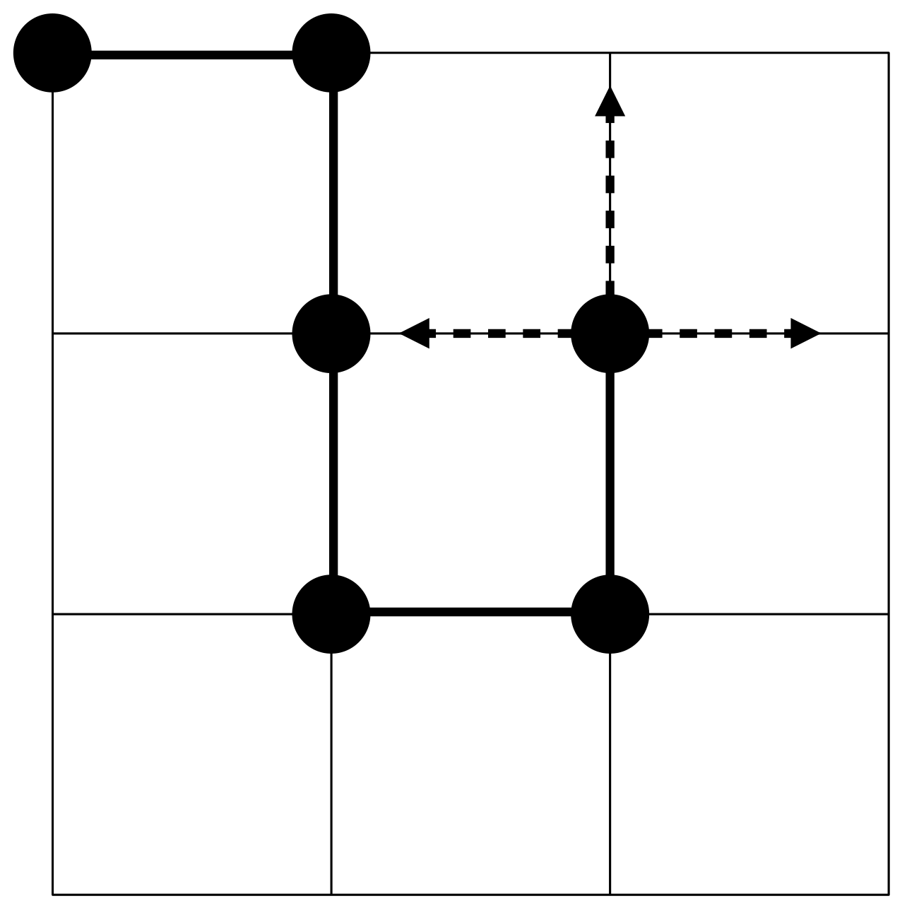
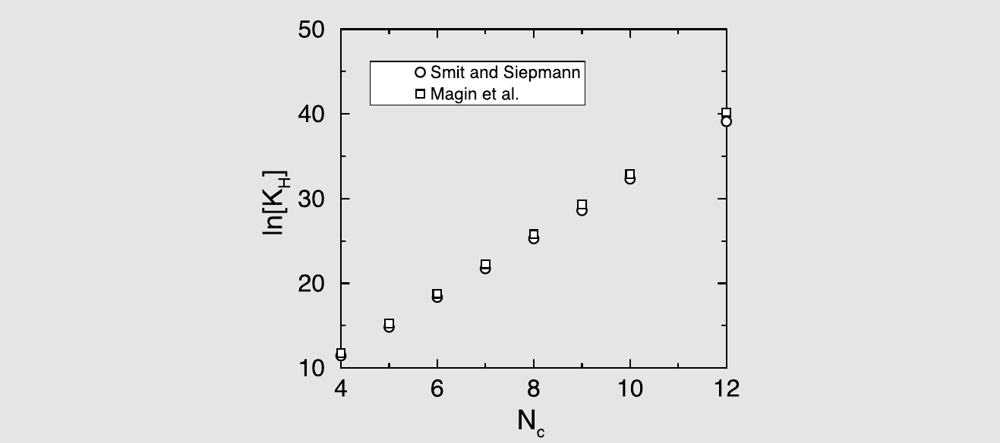
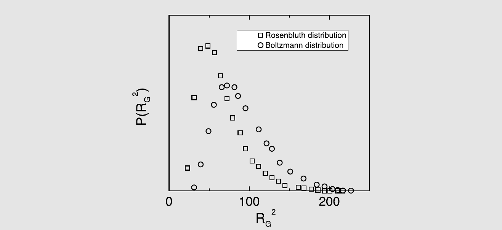

# 链分子的自由能

在第 8 章中，我们引入了试探粒子插入方案作为一种计算化学势的有力方法。然而，当与试探插入相关的玻尔兹曼因子变得非常小时，这种方法就会失效。其后果之一是，简单的粒子插入方法不适合用于计算较大分子的化学势，除非在极低密度下。原因是，作为一级近似，排除体积为 $v_{\mathrm{excl}}$ 的分子成功插入溶剂中的概率随溶剂密度 $\rho_S$ 和排除体积指数衰减：$\mathrm{acc} \sim \exp(-v_{\mathrm{excl}} \rho_S)$。

幸运的是，至少在某种程度上，可以通过执行非随机采样来克服这一问题。在此，我们讨论已提出的几种用于计算链分子化学势的技术，因为随机插入的问题对链分子尤为严重。然而，所描述的方法可以应用于任何可以分阶段插入的复合物体，前提是在每个阶段，对于将下一个单元插入何处有一定的选择余地。

人们已经提出了许多方法来改进原始的 Widom 方案的效率，其中我们描述三种具有代表性的更广泛算法类别的方法。这些技术中最直接的是热力学积分方案。接下来，我们讨论一种基于 Rosenbluth 算法（及其推广）生成聚合物构象的方法[[438]](references.md#ref-438)。最后，我们介绍一种递归算法。

## 化学势作为可逆功

（链）分子的超额化学势简单来说就是将这样一个分子加入到已经有 $N$ 个其他（可能是相同的）分子的液体中所需的可逆功。如果我们选择将分子的插入分解为多个步骤，那么很显然，插入整个分子所需的可逆功等于各子步骤贡献的总和。

在此阶段，我们仍然可以自由选择基本步骤，就像我们在进行热力学积分时可以自由选择任何可逆路径一样。一种显而易见的可能性是从一条理想（非相互作用的）链分子开始，然后缓慢地开启该分子与周围粒子之间的相互作用（如果需要的话，还可以开启非键合的分子内相互作用）。这可以按照第 8.4.1 节中描述的方式进行。事实上，这种方法已被 M\"uller 和 Paul [[439]](references.md#ref-439) 所采用，他们进行了一项模拟，其中聚合物相互作用被逐渐开启。虽然这种模拟本可以通过直接的热力学积分来进行，但他们使用了多重直方图方法（见第 8.6.10 节），但这并不改变计算的总体性质。如前所述，热力学积分（及相关技术）的优点是它具有鲁棒性。缺点是它不再可能在单次模拟中测量超额化学势。

Kumar 等人[[440,441]](references.md#ref-440) 提出了一种密切相关的测量链分子化学势的方法。在该方案中，链分子逐个单体地构建。Kumar 等人的方法类似于 Mon 和 Griffiths [[442]](references.md#ref-442) 早先提出的用于测量超额化学势的逐步插入方案。中间步骤所涉及的可逆功使用 Widom 方法测量；也就是说，长度为 $\ell$ 和 $\ell+1$ 的链的超额自由能之差通过计算 $\Delta U(\ell \to \ell+1)$（即与添加第 $(\ell+1)$ 个单体相关的势能变化）来测量。自由能变化由下式给出：

$$
\Delta F_{\mathrm{ex}}(\ell \to \ell+1) \equiv \mu_{\mathrm{ex}}^{\mathrm{incr}}(\ell \to \ell+1) = -k_{\mathrm{B}} T \ln \langle \exp[-\beta \Delta \mathcal{U}(\ell \to \ell+1)] \rangle .
\tag{10.1.1}
$$

该方程定义了增量超额化学势 $\mu_{\mathrm{ex}}^{\mathrm{incr}}(\ell \to \ell+1)$。完整链分子的超额化学势简单来说就是各个增量超额化学势之和。由于后者是使用 Widom 方法测量的，因此 Kumar 等人的方案被称为改进的 Widom 方法。该方法受到与原始 Widom 方法相同的限制（即各个单体的插入概率应该是可观的）。在这方面，它不如热力学积分通用。与 M\"uller 和 Paul [[439]](references.md#ref-439) 使用的多重直方图方法一样，超额化学势的计算可能需要许多次独立的模拟[[441,443]](references.md#ref-441)。

## Rosenbluth 采样

已有多项关于在单次模拟中测量链分子化学势的方案被提出。Harris 和 Rice [[444]](references.md#ref-444) 以及 Siepmann [[445]](references.md#ref-445) 展示了如何使用一种由 Rosenbluth 和 Rosenbluth [[438]](references.md#ref-438) 提出的生成聚合物构象的算法来计算具有离散构象的链分子的化学势。Frenkel 等人[[446,447]](references.md#ref-446) 以及 de Pablo 等人[[448]](references.md#ref-448) 提出了向连续可变形分子的推广。由于从具有离散构象的分子到连续可变形分子的采样方案的推广并非平凡的，我们将分别讨论这两种情况。这里所遵循的方法与第 12.2.1 节中描述的构型偏倚 Monte Carlo 方案密切相关。然而，我们已尝试使本节的论述自成体系。

### 具有离散构象的大分子

回顾一下我们如何使用 Widom 技术计算链分子的 $\mu_{\mathrm{ex}}$ 是有益的。为此，我们引入以下记号：链分子第一个片段的位置用 $\mathbf{q}$ 表示，分子整体的构象用 $\Gamma$ 描述。链分子体系的构型部分配分函数可以写为[^1]

$$
Q_{\mathrm{chain}}(N, V, T) = \frac{1}{N!} \int \mathrm{d}\mathbf{q}^N \sum_{\Gamma_1, ..., \Gamma_N} \exp[-\beta \mathcal{U}(\mathbf{q}^N, \Gamma^N)] .
\tag{10.2.1}
$$

链分子的超额化学势可以通过考虑以下比值获得

$$
\frac{Q(N+1, V, T)}{Q(N, V, T) Q_{\mathrm{non\text{-}interacting}}(1, V, T)} ,
$$

其中分子是 $N+1$ 个相互作用链分子体系的（构型部分的）配分函数，而分母是由 $N$ 条相互作用链和一条不与其他链相互作用的链组成的体系的配分函数。后者扮演理想气体分子的角色（见第 8.5.1 节）。但请注意，虽然该分子不与任何其他分子相互作用，但它通过键合和非键合相互作用与自身相互作用。

正如第 6.5.1 节中所解释的，如果我们用逸度来表述，我们事先不知道孤立自回避链的配分函数的构型部分这一事实并不重要。

然而，如果出于某种原因我们希望确定链分子的绝对化学势，最好使用另一种参考状态，即孤立的非自回避链（即所有非键合相互作用都已关闭的分子），因为对于这样的分子，我们可以解析地计算配分函数的分子内部分。但我们强调，如果使用得当，参考系统的选择对任何可观测性质的计算没有影响。

在这里，我们从非自回避参考状态的描述开始，仅仅因为它更容易解释。随后我们考虑分子内相互作用的情况。

让我们考虑一条由 $\ell$ 个片段组成的晶格聚合物。从片段 1 开始，我们可以在 $k_2$ 个等价方向上添加片段 2，依此类推。例如，对于简单立方晶格上的聚合物，第一个片段有六个可能的方向，如果我们选择排除键可以反向折叠的构象，则所有后续片段有五个方向。显然，非自回避构象的总数为 $\Omega^{\mathrm{id}} = \prod_{i=2}^{\ell} k_i$。为方便起见，我们假设对于给定的 $i$，所有 $k_i$ 个方向是等概率的（即我们忽略邻位-反式势能差异）。此外，为方便起见，我们假设所有 $k_i$ 都相同，这意味着我们甚至允许理想链回溯其步骤。

这些限制不是本质性的，但它们简化了记号（尽管不影响计算效率）。因此，对于我们考虑的简单模型，$\Omega^{\mathrm{id}} = k^{\ell-1}$。使用这个理想链作为我们的参考系统，超额化学势的表达式变为

$$
\begin{aligned}
\beta \mu_{\mathrm{ex}} &= -\ln \frac{Q_{\mathrm{chain}}(N+1, V, T)}{Q(N, V, T) Q^{\mathrm{ideal}}(1, V, T)}\\
&= -\ln \left\langle \exp[-\beta \Delta \mathcal{U}(\mathbf{q}^N, \Gamma^N; \mathbf{q}^{N+1}, \Gamma^{N+1})] \right\rangle ,
\end{aligned}
\tag{10.2.2}
$$

其中 $\Delta U$ 表示测试链与系统中已有的 $N$ 条链之间以及与自身的相互作用，而 $\langle \cdots \rangle$ 表示对所有起始位置和随机插入链的所有理想链构象进行平均。

Widom 方法处理式 (10.2.2) 的问题在于，几乎所有随机插入的理想链构象都会与系统中已经存在的粒子或自身发生重叠。对 $\mu_{\mathrm{ex}}$ 最重要的贡献来自极少数的情况，即试探链恰好处于正确的构象，恰好能放入流体中的可用空间。显然，如果我们能将采样限制在满足这一条件的构象上，那将是非常理想的。如果我们这样做，我们在计算插入概率时引入了偏差，我们必须以某种方式校正这种偏差。

文献[[444,445]](references.md#ref-444) 中使用的 Rosenbluth 方法由两个步骤组成：第一步以一定偏差生成链构象，确保以高概率产生“可接受的”构象。下一步通过乘以一个权重因子来校正这种偏差。一种以高概率产生可接受链构象的方案由 Rosenbluth 和 Rosenbluth 在 20 世纪 50 年代初开发[[438]](references.md#ref-438)。在 Rosenbluth 方案中，链分子的构象逐段构建。对于每个片段，我们有 $k$ 个可能方向的选择。在 Rosenbluth 方案中，这种选择不是随机的，而是倾向于具有最大玻尔兹曼因子的方向。具体来说，使用以下方案来生成一条具有 $\ell$ 个单体的聚合物的构象：

1. 第一个单体在随机位置插入，其能量记为 $u^{(1)}(n)$。我们定义该单体的 Rosenbluth 权重为 $w_1 = k \exp[-\beta u^{(1)}(n)]$。[^2]
1. 对于所有后续片段 $i = 2, 3, \cdots, \ell$，我们考虑与片段 $i-1$ 相邻的所有 $k$ 个试探位置（见图 10.1）。第 $j$ 个试探位置的能量记为 $u^{(i)}(j)$。从 $k$ 种可能中，我们以概率
   $$
   p^{(i)}(n) = \frac{\exp[-\beta u^{(i)}(n)]}{w_i} ,
   \tag{10.2.3}
   $$
   选择其中一个，比如 $n$，其中 $w_i$ 定义为
   $$
   w_i = \sum_{j=1}^{k} \exp[-\beta u^{(i)}(j)] .
   \tag{10.2.4}
   $$
   能量 $u^{(i)}(j)$ 不包括与后续片段 $i+1$ 到 $\ell$ 的相互作用。因此，链的总能量由 $U(n) = \sum_{i=1}^{\ell} u^{(i)}(n)$ 给出。
1. 重复步骤 2，直到整条链生长完成，然后我们可以计算构象 $n$ 的归一化 Rosenbluth 因子：
   $$
   \mathcal{W}(n) = \prod_{i=1}^{\ell} \frac{w_i}{k} .
   \tag{10.2.5}
   $$

*图 10.1　Rosenbluth 方案逐段插入聚合物。箭头表示下一个片段的试探位置。*

我们使用这种方案生成大量构象，这些链的系综平均性质如下计算：

$$
\langle A \rangle_\mathcal{R} = \frac{\sum_{n=1}^{M} \mathcal{W}(n) A(n)}{\sum_{n=1}^{M} \mathcal{W}(n)} ,
\tag{10.2.6}
$$

其中 $\langle \cdots \rangle_R$ 表示构象已由 Rosenbluth 方案生成。这个标记很重要，因为 Rosenbluth 算法不以正确的玻尔兹曼权重生成链。我们将 Rosenbluth 过程生成的分布称为 Rosenbluth 分布。在 Rosenbluth 分布中，生成特定构象 $n$ 的概率为

$$
P(n) = \prod_{i=1}^{\ell} \frac{\exp[-\beta u^{(i)}(n)]}{w_i} = \frac{k^{\ell} \exp[-\beta \mathcal{U}(n)]}{\mathcal{W}(n)} .
\tag{10.2.7}
$$

该概率的一个重要性质是它是归一化的，即

$$
\sum_{n} P(n) = 1 ,
$$

其中求和遍及聚合物的所有可能构象。我们可以通过给不同的链构象赋予不同的权重来从 Rosenbluth 分布中恢复正则系综平均。这正是式 (10.2.6) 中所做的：

$$
\langle A \rangle_\mathcal{R} = \frac{\sum_{n} \mathcal{W}(n) A(n) P(n)}{\sum_{n} \mathcal{W}(n) P(n)} .
\tag{10.2.8}
$$

代入式 (10.2.5) 和 (10.2.7)，得到

$$
\langle A \rangle_\mathcal{R} = \frac{\sum_{n} \mathcal{W}(n) k^{\ell} A(n) \exp[-\beta \mathcal{U}(n)] / \mathcal{W}(n)}{\sum_{n} \mathcal{W}(n) k^{\ell} \exp[-\beta \mathcal{U}(n)] / \mathcal{W}(n)}
= \frac{\sum_{n} A(n) \exp[-\beta \mathcal{U}(n)]}{\sum_{n} \exp[-\beta \mathcal{U}(n)]}
= \langle A \rangle ,
\tag{10.2.9}
$$

这表明式 (10.2.6) 确实给出了正确的系综平均。

在这里，我们引入 Rosenbluth 因子作为采样方案中偏差的校正。Rosenbluth 因子本身也很有意义，因为它可以与超额化学势相关联。为了看到这一点，假设我们使用 Rosenbluth 方案在保持系统中所有其他粒子坐标固定的情况下生成大量链构象。对于这组构象，我们计算 Rosenbluth 权重因子 $\mathcal{W}$ 的平均值 $\langle \mathcal{W} \rangle$。随后，我们还对系统中 $N$ 个粒子的所有坐标和构象进行系综平均，得到

$$
\langle \mathcal{W} \rangle = \sum_{\Gamma} P_{\Gamma}(\mathbf{q}^N, \Gamma^N) \mathcal{W}_{\Gamma}(\mathbf{q}^N, \Gamma^N) ,
\tag{10.2.10}
$$

其中尖括号表示对溶剂系统的所有构型 $\{\mathbf{q}^N, \Gamma^N\}$ 的系综平均。注意，测试聚合物不构成 $N$ 粒子系统的一部分。因此，在构型 $\mathbf{q}^N$ 中找到其余粒子的概率不依赖于聚合物的构象 $\Gamma$。

为了简化式 (10.2.10) 中平均值的表达式，我们首先考虑给定溶剂构型 $\{\mathbf{q}^N, \Gamma^N\}$ 的 Rosenbluth 因子的平均值：

$$
W(\{\mathbf{q}^N, \Gamma^N\}) = \sum_{\Gamma} P_{\Gamma}(\mathbf{q}^N, \Gamma^N) \mathcal{W}_{\Gamma}(\{\mathbf{q}^N, \Gamma^N\}) .
\tag{10.2.11}
$$

代入式 (10.2.3) 和 (10.2.5)，得到

$$
\begin{aligned}
\mathcal{W} &= \sum_{\Gamma} \prod_{i=2}^{\ell} \frac{\exp[-\beta u^{(i)}(\Gamma_i)]}{w_i} \frac{k \exp[-\beta u^{(1)}(\Gamma_1)]}{w_1} \prod_{i=1}^{\ell} w_i\\
&= \frac{1}{k} \sum_{\Gamma_1} \exp[-\beta u^{(1)}(\Gamma_1)] \prod_{i=2}^{\ell} \sum_{\Gamma_i} \frac{1}{k} \exp[-\beta u^{(i)}(\Gamma_i)]\\
&= \frac{1}{k^{\ell-1}} \sum_{\Gamma} \exp[-\beta \mathcal{U}_{\Gamma}] ,
\end{aligned}
\tag{10.2.12}
$$

其中我们已省略了对溶剂坐标 $\{\mathbf{q}^N, \Gamma^N\}$ 的所有显式引用。注意式 (10.2.12) 可以解释为对所有理想链构象的玻尔兹曼因子 $\exp[-\beta U_{\Gamma}]$ 的平均。如果现在将式 (10.2.12) 代入式 (10.2.11)，我们得到

$$
\langle \mathcal{W} \rangle = \left\langle \sum_{\Gamma} \exp[-\beta \Delta \mathcal{U}(\mathbf{q}^N, \Gamma^N; \mathbf{q}^{N+1}, \Gamma^{N+1})] \right\rangle .
\tag{10.2.13}
$$

如果我们比较式 (10.2.13) 与式 (10.2.2)，我们会发现 Rosenbluth 因子的系综平均与链分子的超额化学势直接相关：

$$
\beta \mu_{\mathrm{ex}} = -\ln \langle \mathcal{W} \rangle .
\tag{10.2.14}
$$

这就完成了我们的证明，即测量试探链的平均 Rosenbluth 因子确实可以用来估计稠密流体中聚合物的超额化学势。我们应该强调，上述测量化学势的方法绝不局限于晶格上的链分子。关键的是，每个片段相对于前一个片段的可能方向数（$k$）是有限的。

### 推广到连续可变形分子

计算具有（或不具有）依赖于弯曲角和扭转角的分子内势能项的柔性链的超额化学势，在数值计算上与具有大量固定不可变形构象的链分子的相应计算有很大不同。在这里，我们考虑具有分子内势能的柔性分子的情况。完全柔性链当然作为特例包含在内。

考虑一条由 $\ell$ 个线段组成的半柔性链。分子的势能分为两部分贡献：“内部”势能 $U_{\mathrm{bond}}$，包括键合的分子内相互作用；以及“外部”势能 $U_{\mathrm{ext}}$，包括其余的相互作用——包括非键合的分子内相互作用。在无外部相互作用情况下的链定义为理想链。

理想链的构象配分函数等于

$$
Q_{\mathrm{id}} = c \int \cdots \int \mathrm{d}\boldsymbol{\Gamma}_1 \cdots \mathrm{d}\boldsymbol{\Gamma}_{\ell} \prod_{i=1}^{\ell} \exp[-\beta u_{\mathrm{bond}}(\theta_i)] ,
\tag{10.2.15}
$$

其中 $c$ 是数值常数。我们假设 $Q_{\mathrm{id}}$ 是已知的。我们的目标是计算外部相互作用对构象配分函数的影响。因此，我们希望计算 $Q/Q_{\mathrm{id}}$，其中 $Q$ 表示相互作用链的配分函数。相互作用链的超额化学势由下式给出

$$
\mu_{\mathrm{ex}} = -k_{\mathrm{B}} T \ln(Q/Q_{\mathrm{id}}) .
$$

在考虑计算 $\mu_{\mathrm{ex}}$ 的“聪明”方法之前，让我们简要回顾两种不太聪明的方法。

计算相互作用链超额化学势最朴素的方法是生成大量完全随机构象的自由连接链。对于每个构象，我们同时计算 $\exp(-\beta U_{\mathrm{bond}})$ 和 $\exp[-\beta(U_{\mathrm{bond}} + U_{\mathrm{ext}})]$。前者的平均值正比于 $Q_{\mathrm{id}}$，而后者玻尔兹曼因子的平均值正比于 $Q$。这两个平均值的比值因此应该给出 $Q/Q_{\mathrm{id}}$。

这种方法的问题在于，绝大多数随机生成的构象对应于具有非常高内部能量（因此玻尔兹曼权重非常小）的半柔性链。因此，这种采样方案的统计精度将非常差。

第二种方案旨在缓解这个问题。我们现在不再生成自由连接链的构象，而是以某种方式采样链的内部角度，使得发现给定角度 $\theta_i$ 的概率由玻尔兹曼权重给出

$$
P(\theta_i) = \frac{\exp[-\beta u(\theta_i)]}{\int \mathrm{d}\theta_i \exp[-\beta u(\theta_i)]} .
$$

这种采样可以使用拒绝方法相当容易地完成（参见例如文献[[21]](references.md#ref-21)）。在下文中，我们使用符号 $\boldsymbol{\Gamma}_i$ 表示指定链分子第 $i$ 段方向的单位向量。对于这样生成的每个构象，我们计算玻尔兹曼因子 $\exp(-\beta U_{\mathrm{ext}})$。该玻尔兹曼权重的平均值等于

$$
\langle \exp(-\beta \mathcal{U}_{\mathrm{ext}}) \rangle = \frac{\int \mathrm{d}\Gamma \exp[-\beta(\mathcal{U}_{\mathrm{bond}} + \mathcal{U}_{\mathrm{ext}})]}{\int \mathrm{d}\Gamma \exp(-\beta \mathcal{U}_{\mathrm{bond}})} = Q/Q_{\mathrm{id}} .
\tag{10.2.16}
$$

这种方法显然优于第一种方案。然而，在许多实际情况中，它仍然会产生较差的统计结果，因为大多数理想链构象不会对应于相互作用链在能量上有利的情况。因此，对于大多数构象，玻尔兹曼权重仍然很小，统计精度也不会很好。

这两种方案的问题在于，它们都不允许我们专注于那些对 $Q$ 贡献最大的构象，即那些内部和外部势能之和不大于每自由度几个 $k_{\mathrm{B}} T$ 的构象。显然，将采样偏向于这种有利构象将是令人满意的。

事实证明，我们可以使用类似于第 10.2.1 节中计算具有许多固定构象的链分子超额化学势的过程来计算 $\mu_{\mathrm{ex}}$。为了计算 $\mu_{\mathrm{ex}}$，我们应用以下构建 $\ell$ 段链构象的方案。链构象的构建逐段进行。让我们考虑添加一个这样的片段。具体来说，假设我们已经生长了 $i$ 个片段，并且我们正试图添加片段 $i+1$。具体步骤如下：

1. 生成固定数量（比如 $k$）个试探片段，其方向按照与内部势能 $u(\theta)$ 相关的玻尔兹曼权重分布。我们用指标 $1, 2, \cdots, k$ 标记不同的试探片段。重要的是，我们最终得到的超额化学势结果对任何 $k \geq 1$ 的选择都有效，但结果的精度很大程度上取决于我们对 $k$ 的选择。
1. 对于所有 $k$ 个试探片段，我们计算外部玻尔兹曼因子 $\exp[-\beta u_{\mathrm{ext}}^{(i)}(j)]$。
1. 以概率
   $$
   p^{(i)}(n) = \frac{\exp[-\beta u_{\mathrm{ext}}^{(i)}(n)]}{w_{i}^{\mathrm{ext}}} ,
   \tag{10.2.17}
   $$
   选择其中一个试探片段，比如 $n$，其中我们定义了
   $$
   w_{i}^{\mathrm{ext}} \equiv \sum_{j=1}^{k} \exp[-\beta u_{\mathrm{ext}}^{(i)}(j)] .
   $$
1. 将该片段作为第 $i+1$ 段添加到链上，重复此过程直到整条链完成。整条链的归一化 Rosenbluth 因子 $\mathcal{W}$ 由下式给出
   $$
   \mathcal{W}^{\mathrm{ext}}(n) = \prod_{i=1}^{\ell} \frac{w_{i}^{\mathrm{ext}}}{k} ,
   $$
   其中，对于第一个片段，$w_1^{\mathrm{ext}} = k \exp[-\beta u_{\mathrm{ext}}^{(1)}(1)]$。

所期望的比值 $Q/Q_{\mathrm{id}}$ 等于部分 Rosenbluth 权重的乘积的平均值（对许多试探链）：

$$
Q/Q_{\mathrm{id}} = \langle \mathcal{W}^{\mathrm{ext}} \rangle .
\tag{10.2.18}
$$

为了证明式 (10.2.18) 是正确的，让我们考虑生成给定链构象的概率。这个概率是若干因子的乘积。让我们先考虑一个片段的这些因子，然后将结果推广到完整链。生成具有方向 $\boldsymbol{\Gamma}_1$ 到 $\boldsymbol{\Gamma}_k$ 的一组 $k$ 个试探片段的概率为

$$
P_{\mathrm{id}}(\boldsymbol{\Gamma}_1) P_{\mathrm{id}}(\boldsymbol{\Gamma}_2) \cdots P_{\mathrm{id}}(\boldsymbol{\Gamma}_k) \mathrm{d}\boldsymbol{\Gamma}_1 \cdots \mathrm{d}\boldsymbol{\Gamma}_k .
\tag{10.2.19}
$$

从这些试探片段中选择任何一个的概率由式 (10.2.17) 给出：

$$
p^{(i)}(j) = \frac{\exp[-\beta u_{\mathrm{ext}}^{(i)}(\boldsymbol{\Gamma}_j)]}{w_{i}^{\mathrm{ext}}(\boldsymbol{\Gamma}_1, \cdots, \boldsymbol{\Gamma}_k)} ,
\tag{10.2.20}
$$

其中 $j = 2, 3, \cdots, \ell$。我们希望计算所有可能的试探片段集合和所有可能的片段选择的 $w_i^{\mathrm{ext}}$ 的平均值。为此，我们必须对所有 $j$ 求和并对所有方向 $\prod_{j=1}^{k} \mathrm{d}\boldsymbol{\Gamma}_j$ 积分（即我们对片段 $i+1$ 方向的归一化概率分布进行平均）：

$$
\left\langle \frac{1}{w_i^{\mathrm{ext}}} \right\rangle = \int \prod_{j=1}^{k} \mathrm{d}\boldsymbol{\Gamma}_j P_{\mathrm{id}}(\boldsymbol{\Gamma}_j) \sum_{j=1}^{k} \frac{\exp[-\beta u_{\mathrm{ext}}^{(i)}(j')]}{w_i^{\mathrm{ext}}(\boldsymbol{\Gamma}_1, \cdots, \boldsymbol{\Gamma}_k)} \frac{w_i^{\mathrm{ext}}(\boldsymbol{\Gamma}_1, \cdots, \boldsymbol{\Gamma}_k)}{\sum_{j'=1}^{k} \exp[-\beta u_{\mathrm{ext}}^{(i)}(j')]} \frac{1}{k} .
\tag{10.2.21}
$$

但试探片段的标记是任意的。因此，该方程求和中的所有 $k$ 项给出相同的贡献，方程简化为

$$
\begin{align}
\left\langle \frac{1}{w_i^{\mathrm{ext}}} \right\rangle &= \int \mathrm{d}\boldsymbol{\Gamma} \, P_{\mathrm{id}}(\boldsymbol{\Gamma}) \exp[-\beta u_{\mathrm{ext}}(\boldsymbol{\Gamma})] \nonumber \\
&= \frac{\int \mathrm{d}\boldsymbol{\Gamma} \exp\{-\beta[u_{\mathrm{bond}}(\boldsymbol{\Gamma}) + u_{\mathrm{ext}}(\boldsymbol{\Gamma})]\}}{\int \mathrm{d}\boldsymbol{\Gamma} \exp[-\beta u_{\mathrm{bond}}(\boldsymbol{\Gamma})]} \nonumber \\
&= \frac{Q^{(i)}}{Q_{\mathrm{id}}^{(i)}} ,
\tag{10.2.22}
\end{align}
$$

这确实是期望的结果，只是式 (10.2.24) 中的表达式涉及的是片段 $i$（由上标 $(i)$ 标记）。推广到 $\ell$ 段链是直接的，尽管中间表达式变得有些繁琐。

最终结果是归一化 Rosenbluth 因子与超额化学势之间的关系：

$$
\beta \mu_{\mathrm{ex}} = -\ln \frac{\langle \mathcal{W}^{\mathrm{ext}} \rangle}{\langle \mathcal{W}^{\mathrm{ext}}_{\mathrm{ID}} \rangle} ,
$$

其中 $\mathcal{W}^{\mathrm{ext}}_{\mathrm{ID}}$ 是具有非键合分子内相互作用的孤立链的归一化 Rosenbluth 因子。这个 Rosenbluth 因子需要通过单独的模拟来确定，使用完全相同的方法：唯一的区别是我们现在必须计算具有非键合分子内相互作用的孤立分子的 $\mathcal{W}$。

原则上，Rosenbluth 采样方案的结果是精确的，因为在无限长模拟的极限下，结果与玻尔兹曼采样的结果相同。然而，在实践中存在重要的限制。与构型偏倚 Monte Carlo 方案（见第 12 章）不同，Rosenbluth 方案生成的聚合物构象的代表性样本是不正确的，因为生成给定构象的概率不与其玻尔兹曼权重成正比。只有当这些分布有足够的重叠时，才能计算出准确的值。如果重叠很小，则 Rosenbluth 分布的尾部对系综平均 (10.2.6) 做出最大贡献；在 Rosenbluth 方案中生成概率很低的构象可能具有如此大的 Rosenbluth 因子，以至于它们主导了系综平均。恰恰因为这种构象在模拟中生成的频率非常低，统计精度可能很差。如果相关的构象在模拟中从未被生成，结果甚至会系统性地偏离真实的系综平均。Rosenbluth 采样方案的这一缺点实际上是众所周知的（参见 Batoulis 和 Kremer [[449,450]](references.md#ref-449) 的文章以及示例 14）。

???+ example "例证 13（多孔介质中的亨利系数）"

    对于多孔介质的许多实际应用，我们需要知道“吸附等温线”，它描述了在给定温度下给定物种的吸附分子数对外部压力或更一般地对逸度的依赖关系。示例 4 和 18 展示了如何使用巨正则 Monte Carlo 模拟计算完整的吸附等温线。

    然而，如果外部压力足够低，可以通过亨利系数 $K_H$ 获得吸附等温线的良好估计。在这些条件下，单位体积吸附的分子数（$\rho_a$）与亨利系数和外部压力 $P$ 成正比：

    $$
    \rho_a = K_H P .
    $$

    亨利系数与吸附分子的超额化学势直接相关。为了看到这一点，考虑多孔介质中平均密度的系综平均。在巨正则系综中，该系综平均由下式给出（见第 6.5 节，式 (6.5.10)）

    $$
    \begin{aligned}
    \left\langle \frac{N}{V} \right\rangle &= \frac{1}{V} \sum_{N=0}^{\infty} \frac{(fV)^N}{N!} \int \mathrm{d}\mathbf{s}^N \exp[-\beta U(\mathbf{s}^N)] N/V\\
    &= \frac{f \sum_{N'=0}^{\infty} \frac{(fV)^{N'}}{N'!} \int \mathrm{d}\mathbf{s}^{N'} \exp[-\beta U(\mathbf{s}^{N'})] \int \mathrm{d}\mathbf{s}_t \exp[-\beta U(\mathbf{s}^{N})]}{\sum_{N'=0}^{\infty} \frac{(fV)^{N'}}{N'!} \int \mathrm{d}\mathbf{s}^{N'} \exp[-\beta U(\mathbf{s}^{N'})]}\\
    &= f \langle \exp(-\beta \Delta U_+) \rangle ,
    \end{aligned}
    $$

    其中 $N' = N-1$，$\mathbf{s}_t$ 表示我们插入试探粒子的标度位置，$\Delta U_+$ 定义为由于插入试探粒子而引起的体系势能变化。在 $P \to 0$ 的极限下，可以将储库视为理想气体，此时其逸度变为

    $$
    f \to \beta P ,
    $$

    因此

    $$
    \left\langle \frac{N}{V} \right\rangle = \beta P \langle \exp(-\beta \Delta U_+) \rangle .
    $$

    对于亨利系数，这给出

    $$
    K_H = \beta \exp(-\beta \mu_{\mathrm{ex}}) .
    $$

    Maginn 等人[[451]](references.md#ref-451) 和 Smit 及 Siepmann [[452,453]](references.md#ref-452) 使用本节描述的方法计算了在沸石 silicalite 中吸附的直链烷烃的亨利系数。描述烷烃相互作用的势能分为外部势能和内部势能。内部势能包括键弯曲和扭转：

    $$
    u_{\mathrm{int}} = u_{\mathrm{bend}} + u_{\mathrm{tors}} .
    \tag{10.2.23}
    $$

    烷烃模型使用固定的键长。外部相互作用包括分子内相互作用的其余部分以及与沸石的相互作用：

    $$
    u_{\mathrm{ext}} = u_{\mathrm{intra}} + u_{\mathrm{zeo}} .
    \tag{10.2.24}
    $$

    由于亨利系数是在无限稀释条件下计算的，因此不需要考虑分子间的烷烃-烷烃相互作用。Smit 和 Siepmann 使用内部相互作用来生成试探构象（见第 12.3 节），并仅使用外部相互作用确定归一化的 Rosenbluth 因子；该 Rosenbluth 因子根据以下关系与超额化学势相关：

    $$
    \beta \mu_{\mathrm{ex}} = -\ln \frac{\langle \mathcal{W}^{\mathrm{ext}} \rangle}{\langle \mathcal{W}^{\mathrm{ext}}_{\mathrm{IG}} \rangle} ,
    \tag{10.2.25}
    $$

    其中 $\mathcal{W}^{\mathrm{ext}}_{\mathrm{IG}}$ 是理想气相中分子（不与沸石相互作用）的 Rosenbluth 因子[[454]](references.md#ref-454)。对于任意烷烃，亨利系数的计算需要两次模拟：一次在沸石中，一次在理想气相中。然而，对于丁烷和较短的烷烃，所有孤立的（理想气体）分子都是理想链，因为不存在非键合相互作用。对于这样的链，理想气相中的 Rosenbluth 因子定义为等于 1。

    

    *图 10.2　Smit 和 Siepmann [[453]](references.md#ref-453) 以及 Maginn 等人[[451]](references.md#ref-451) 计算的沸石 silicalite 中 $n$-烷烃的亨利系数 $K_H$ 随碳原子数 $N_c$ 的变化关系。*

    图 10.2 比较了 Smit 和 Siepmann 计算的 silicalite 中 $n$-烷烃的亨利系数与 Maginn 等人的结果。如果考虑到 Maginn 等人和 Smit 及 Siepmann 考虑的模型略有不同，这两项独立研究的结果吻合得很好。

### 重叠分布 Rosenbluth 方法

虽然第 10.2 节中描述的 Rosenbluth 粒子插入方案在原则上是正确的，但当超额化学势变得很大时，它可能遇到实际问题。幸运的是，可以将 Rosenbluth 方案与重叠分布方法相结合，获得一种具有内建诊断功能的技术。该方案在补充材料（第 L.10 节）中进行了解释。与原始的重叠分布方法（见第 8.6.1 节）一样，补充材料（第 L.10 节）中描述的方案构建两个直方图，但现在作为 Rosenbluth 权重的对数（而非势能差）的函数。如果采样的分布不重叠，则应该预期链分子超额化学势的估计变得不可靠，此时不应使用 Rosenbluth 方法。正如文献[[455]](references.md#ref-455) 所示，当长链被插入到中等密度流体中时，确实存在两个分布趋于分离的趋势。然而，至少在文献[[455]](references.md#ref-455) 研究的情况中，$\mu_{\mathrm{ex}}$ 中的统计误差在由于采样不充分导致的系统误差显现之前就已经变得重要了。

???+ example "例证 14（聚合物的 Rosenbluth 采样）"

    Batoulis 和 Kremer [[450]](references.md#ref-450) 对晶格上的自回避行走的 Rosenbluth 算法进行了详细分析。Rosenbluth 方案被用于在晶格上生成行走。Batoulis 和 Kremer 发现，使用随机插入方案，生成 100 步无重叠行走的概率约为 0.022\%（FCC 晶格）。另一方面，如果我们使用 Rosenbluth 方案，这个概率变得接近 100\%。在图 10.3 中，使用校正后的系综平均 (10.2.6) 计算的聚合物回转半径分布与未校正的平均（即使用 Rosenbluth 方案生成构象并使用 $\langle A \rangle = (1/M) \sum_{n=1}^{M} A(n)$ 而非式 (10.2.6) 来计算系综平均）进行了比较。该图显示 Rosenbluth 方案生成的链更加紧凑。Batoulis 和 Kremer 表明，对于更长的链长，这种差异呈指数增长。因此，在使用这种非玻尔兹曼采样方案时应该小心。

    

    *图 10.3　回转半径 $R_G$ 的概率分布。圆圈表示玻尔兹曼分布，方块表示 Rosenbluth 分布。结果为 FCC 晶格上 120 步行走（数据取自文献[[450]](references.md#ref-450)）。（图内标注：Rosenbluth distribution = Rosenbluth 分布；Boltzmann distribution = 玻尔兹曼分布）*

### 递归采样

鉴于上述讨论，拥有无偏采样方案来测量化学势似乎是很有吸引力的。当然，热力学积分方法是无偏的，改进的 Widom 方案虽然在单个单体插入层面上是有偏的（就像原始的 Widom 方案一样），但比 Rosenbluth 方法偏差更小。然而，这些方法不能用于在单次模拟中测量 $\mu_{\mathrm{ex}}$（见第 10.1 节）。

事实证明，尽管如此，在单次模拟中进行 $\mu_{\mathrm{ex}}$ 的无偏采样是可能的。在这里，我们简要概述这种方法背后的基本思想。在我们的描述中，我们遵循 Grassberger 和 Hegger [[456,457]](references.md#ref-456) 提出的方法。他们的技术与几年前 Garel 和 Orland [[458]](references.md#ref-458) 开发的 Monte Carlo 方案非常相似。

与 Rosenbluth 和改进的 Widom 方案一样，递归采样方法基于逐段生长聚合物。但相似之处仅此而已。在递归采样中，目标是生成试探构象的群体。链分子的超额化学势直接与存活到生长过程结束的分子平均数相关。

该过程的第一步是尝试在系统中插入一个单体。假设与该试探插入相关的玻尔兹曼因子为 $b_0 \equiv \exp[-\beta u_0(\mathbf{r}^N)]$。我们现在允许单体复制自身多次，使得拷贝的平均数 $\langle n_0 \rangle$ 等于

$$
\langle n_0 \rangle = \pi_0 b_0 ,
$$

其中 $\pi_0$ 是一个待确定的常数乘法因子。确定应制作多少份拷贝的一种方便规则如下。将 $\pi_0 b_0$ 的小数部分记为 $f_0$，整数部分记为 $i_0$。我们的规则是：以概率 $1 - f_0$（$f_0$）生成 $i_0$（$i_0 + 1$）份拷贝。显然，如果 $i_0 = 0$，单体有 $1 - f_0$ 的概率会“死亡”。假设我们已经生成了至少一份单体的拷贝。从现在起，每份拷贝独立地产生后代。例如，为了生成二聚体群体，我们向每个存活的单体添加一个片段。我们将与这些试探添加相关的玻尔兹曼权重记为 $b_1(i)$，其中指标 $i$ 表示每个存活的单体将产生不同的二聚体。与单体一样，我们必须决定二聚体应有多少份拷贝存活下来。这以与单体完全相同的方式进行；即，从单体 $i$ 衍生的二聚体的平均数由下式给出

$$
\langle n_1(i) \rangle = \pi_1 b_1(i) ,
$$

其中 $\pi_1$ 与 $\pi_0$ 一样，是一个待后确定的常数。生成的二聚体数可能大于或小于原始单体数。我们现在以相同的方案继续生成下一代（三聚体），依此类推。事实上，与第 10.2.1 节中讨论的半柔性分子一样，将分子内键弯曲、键拉伸和扭转能量包含在确定新片段应以何种方向添加的概率分布中是方便的。

在第 $\ell$ 步结束时存活分子的平均数为

$$
\langle N_{\ell} \rangle = \left\langle \prod_{i=0}^{\ell} \pi_i \exp[-\beta U_{\ell}(\mathbf{r}^N)] \right\rangle ,
$$

其中 $U_{\ell}(\mathbf{r}^N)$ 是链分子与 $N$ 个溶剂分子（以及非键合分子内相互作用）的总相互作用。尖括号表示对坐标以及理想（非自回避）链的分子内玻尔兹曼因子的正则平均。换句话说，

$$
\langle N_{\ell} \rangle = \prod_{i=0}^{\ell} \pi_i \exp[-\beta \mu_{\mathrm{ex}}(\ell)] .
$$

因此，超额化学势由下式给出

$$
\mu_{\mathrm{ex}}(\ell) = -k_{\mathrm{B}} T \ln \frac{\langle N_{\ell} \rangle}{\prod_{i=0}^{\ell} \pi_i} .
\tag{10.2.26}
$$

常数 $\pi_i$ 应该这样选择，使得既不会出现群体爆炸也不会出现大量灭绝。如果我们对 $\mu_{\mathrm{ex}}(\ell)$ 有一个好的估计，我们可以用它来估计 $\pi_i$。然而，一般来说，$\pi_i$ 必须通过试错法来确定。

这种递归算法具有几个优点。首先，它在计算上非常高效（在某些情况下，比 Rosenbluth 方案快一个数量级以上，且统计精度相同）。事实上，在实际计算中，该算法是深度优先而非广度优先搜索的。也就是说，我们尝试生长一条聚合物直到完成（或死亡）。然后我们从被允许生长另一条试探构象的树的最后一个分支继续。以这种方式，我们逐步回溯到树的根节点。该方案的优点是内存需求最小。此外，如果我们利用递归函数调用，程序结构非常简单。最后但同样重要的是，递归方案生成无偏的（即玻尔兹曼）链构象群体[[459]](references.md#ref-459)。

### 剪枝-增广 Rosenbluth 方法

Grassberger [[460]](references.md#ref-460) 提出了对 Rosenbluth 方案的一个重要推广。它被称为剪枝-增广 Rosenbluth 方法（Pruned-Enriched Rosenbluth Method，PERM）。传统 Rosenbluth 方法在长链或高密度下失败的原因之一是 Rosenbluth 权重的分布变得非常宽。结果是，少数具有高 Rosenbluth 权重的构象可能完全主导平均值。如果是这种情况，我们应该预期平均值出现大的统计涨落。当然，将模拟聚焦于对平均值贡献最大的那类构象，而在具有非常低 Rosenbluth 权重的构象上花费很少的时间，将是令人满意的。

PERM 算法是上述递归采样方案的推广。它也生成具有不同构象的链群体。并且它共享一个优点：由于算法的递归性质，我们不需要在内存中保留多于一个构象（加上一组指针）。该算法的“出生”和“死亡”规则使得它为具有高 Rosenbluth 权重的构象生成许多拷贝，而低权重结构有很高的“死亡”概率。剩余构象的 Rosenbluth 权重经过调整，使得我们的出生-死亡规则不影响期望的平均值。由于 PERM 算法是递归的，它使用很少的内存。用几句话总结该算法：具有高 Rosenbluth 权重的构象被乘以因子 $k$，其权重被同一因子缩减。具有低权重的构象被“修剪”——一半的低权重构象被丢弃，而剩余部分的权重被加倍。一旦所有从共同“祖先”开始的链都已生长完成（或被丢弃），我们只需将所有存活链的（重新缩放的）Rosenbluth 权重相加。

下面我们简要概述算法的实现。让我们引入长度为 $l$ 的链的 Rosenbluth 权重的上阈值和下阈值，分别为 $W_i^{\max}$ 和 $W_i^{\min}$。如果长度为 $i$ 的特定链构象的部分 Rosenbluth 权重 $W_i$ 超过阈值，即 $W_i > W_i^{\max}$，则该单一构象被替换为 $k$ 份拷贝。每份拷贝的部分 Rosenbluth 权重被设置为 $W_i / k$。另一方面，如果特定构象的部分 Rosenbluth 权重 $W_i$ 低于下阈值，即 $W_i < W_i^{\min}$，则我们进行“剪枝”。有 50\% 的概率我们删除该构象。但如果构象存活，我们将其 Rosenbluth 权重加倍。$W_i^{\max}$、$W_i^{\min}$ 和 $k$ 的选择有很大的自由度。事实上，所有这些参数都可以“即时”选择（只要这种选择不依赖于从同一祖先生长的构象的性质）。算法的详细讨论可以在文献[[460,461]](references.md#ref-460) 中找到。

递归生长算法的局限性在于它本质上是一种静态 Monte Carlo 技术；每个新构象都是从零开始生成的。这与动态（马尔可夫链）Monte Carlo 方案不同，后者中基本试探移动是尝试修改现有构型。动态 Monte Carlo 方案比其静态对应物更适合于多粒子体系的模拟。原因很简单：修改多粒子构型以产生其他“可接受的”构型是容易的（例如，通过将一个粒子位移一小段距离）。相比之下，从零开始生成这种构型非常困难。另一方面，一旦在静态方案中成功生成新构型，它完全独立于所有先前的构型。相比之下，动态 Monte Carlo 中连续的构型是强相关的。

CBMC 在某种意义上是一种混合方案：它是一种动态（马尔可夫链）Monte Carlo 方法。但链重生长步骤更类似于静态 Monte Carlo 方案。然而，在这一步骤中，它不如上述递归算法“聪明”，因为它相当“近视”。该方案只向前看一步。可能发生的情况是，我们花费大量时间将链几乎生长完成，却发现最后几个单体根本没有空间可用。这个问题可以通过使用 Meirovitch [[462]](references.md#ref-462) 引入的扫描类型方法来缓解。这基本上是一种用于生成聚合物构象的静态、类 Rosenbluth 方法。但与 Rosenbluth 方案不同，扫描方法向前看若干步。如果将这种方法直接转移到构型偏倚 Monte Carlo 程序中，它将增强可接受试探构象的生成，但计算成本将随扫描深度急剧（指数级）上升。通过在动态 Monte Carlo 方案中纳入一种能廉价地消除注定失败的试探构象的递归扫描方法，可以避免这第二个缺点。在第 12.7 节中，我们将讨论一种基于这种方法的动态 Monte Carlo 算法（回退生长）。

---

[^1]: 我们假设分子内自由度上没有硬约束。
[^2]: 在 $w_1$ 的定义中包含因子 $k$ 只是为了保持与第 12.2.1 节中记号的一致性。