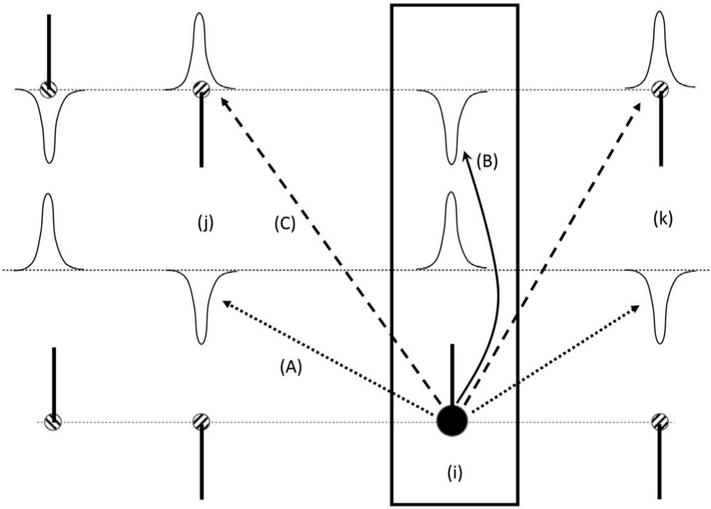
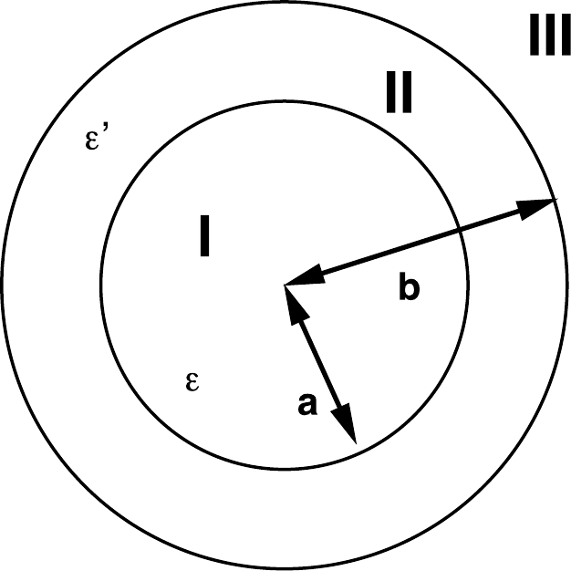
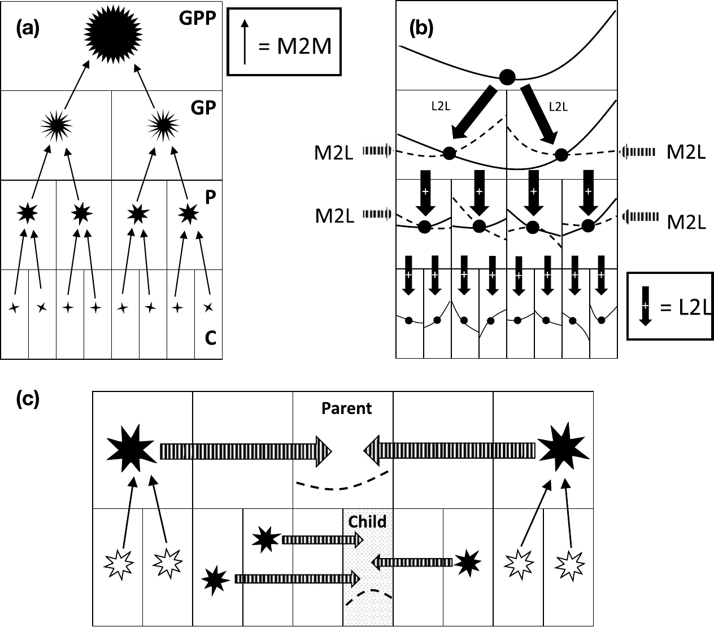
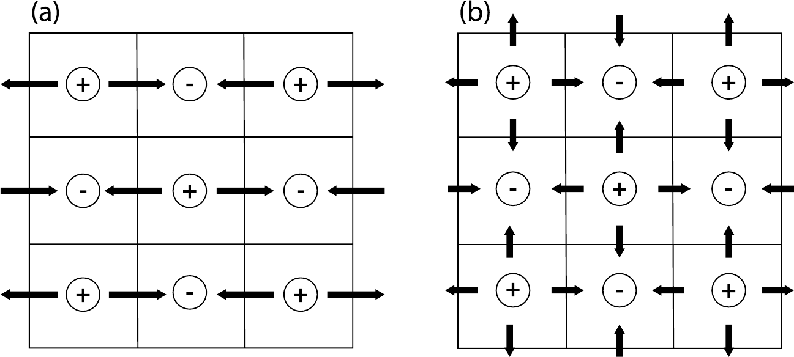
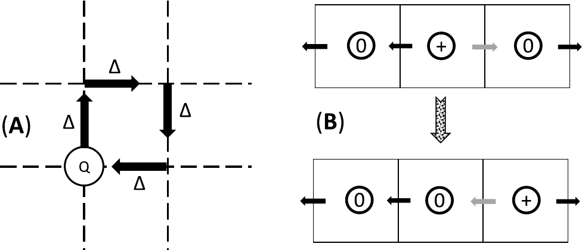
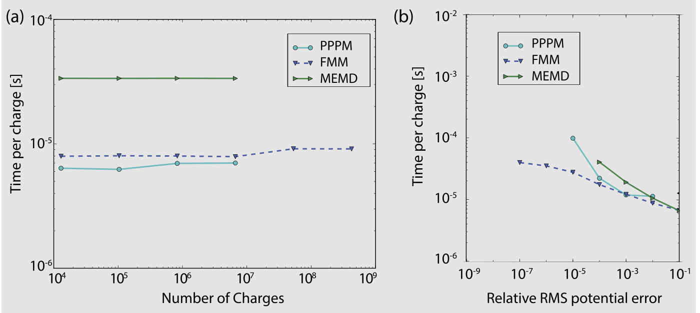

# 长程相互作用

## 引言

模拟中最耗时的步骤是计算势能（MC），或计算作用在所有粒子上的力（MD）。在两体可加相互作用的情况下，此类计算的总时间与相互作用对的数目成正比。显然，随着相互作用范围变长，相互作用对数目趋近于$N(N-1)/2$，其中$N$是系统中的粒子数。避免此问题的常用方法（见第 3.3.2.2 节）是在某个有限范围$r_c$处截断势能，并用如下形式的“尾部修正”来近似剩余的相互作用：

$$
U_{\text{tail}} \sim \frac{N\rho}{2}\int_{r_c}^{\infty} \mathrm{d}r\, r^{d-1} u(r).
$$

然而，对于以$1/r^d$或更慢速率衰减的相互作用（例如库仑相互作用或偶极相互作用），尾部修正发散。

此外，对于此类相互作用，也不允许仅限于计算最近周期镜像之间的相互作用。简单忽略势能的长程部分会带来严重后果（讨论见文献[[463]](references.md#ref-463)）。因此，这显然是一个问题。更何况分子间的库仑相互作用和偶极相互作用非常普遍。幸运的是，已经发展出能够正确处理库仑相互作用长程性质的高效方法。

在选择用于特定应用的算法时，需要考虑的关键因素是精度和速度，而不是它们是否容易解释。现代计算静电相互作用的算法通常具有非常有利的系统粒子数$N$的标度：要么为$N\ln N$，甚至为$N$。但一些最强大的算法只有在相当大的系统尺寸下才优于较简单的算法。这些都是需要牢记的考虑因素。关于计算长程相互作用的可扩展算法的系统比较可以在 Arnold 等人[[464]](references.md#ref-464)的论文中找到。该论文描述了我们所讨论算法的许多广泛使用的变体，但一些较新的算法并未包含在该综述中。

在继续之前，我们必须讨论以下事实：我们将以一种看起来像使用非 SI 单位的方式写出静电学定律，但事实并非如此。当我们在第 3.3.2.5 节引入约化单位时，我们论证了将所有可观测量以特征能量$\epsilon$、特征长度$\sigma$和特征质量$m$为单位来表达是方便的。现在我们必须引入另一个特征单位，即电荷单位。对于微观模拟，无论库仑单位还是如今已被很大程度上遗忘的 e.s.u.单位都不是方便的单位，而电子电荷的绝对值$e$则是方便的。如果我们有两个电荷为$Q_1$、$Q_2$的粒子，相距$r$，处于相对介电常数为$\epsilon_r$的介质中，我们可以用 SI 单位写出它们的库仑相互作用为

$$
\Phi(r) = \frac{Q_1 Q_2}{4\pi\epsilon_0\epsilon_r r},
$$

其中$\epsilon_0$表示真空介电常数。但在模拟中，我们希望使用无量纲量，因此我们可以写出

$$
\phi'(r) \equiv \frac{\Phi(r)}{\epsilon}
= \frac{1}{\epsilon}\frac{e^2}{4\pi\epsilon_0\epsilon_r\sigma}
\frac{(Q_1/e)(Q_2/e)}{r/\sigma}
= \frac{(\lambda_B/\sigma)}{(\epsilon/k_BT)}
\frac{q_1 q_2}{r^*},
$$

其中$r^*$是以$\sigma$为单位的距离，$q\equiv Q/e$，$\lambda_B$是 Bjerrum 长度（参见例如文献[[59]](references.md#ref-59)）。用约化 Bjerrum 长度$\lambda^*\equiv \lambda/\sigma$和约化温度$T^*\equiv k_BT/\epsilon$表示，我们得到

$$
\phi'(r) = \frac{T^*\lambda^* q_1 q_2}{r^*}.
$$

在下文中，我们去掉$r^*$上的星号。为了使本章其余部分的记号紧凑，我们进一步定义$\phi(r)\equiv \phi'(r)/(T^*\lambda^*)$，这样库仑定律变为

$$
\phi(r) = \frac{q_1 q_2}{r},

\tag{11.1.1}
$$

这看起来像高斯单位制中的库仑定律，但其实不是。这只是一种以最少数量的转换因子以无量纲形式表达静电学的方便方法。注意，一旦我们计算了$\phi(r)$，仍然必须将结果乘以$T^*\lambda^*$才能以相同单位获得所有能量。

下面我们讨论几种广泛使用的计算库仑相互作用的方法。在讨论计算库仑相互作用的算法时，很容易被形式主义所淹没。因此，遵循著名的规则“先告诉他们你要告诉他们什么”，我们简要概述我们将讨论哪些类别的算法以及为什么。简而言之：我们只在不同算法使用足够不同的方法时才分别讨论。本着这一精神，我们将讨论：

1. Ewald 求和（第 11.2 节），它是最先将完整库仑相互作用处理为短程部分和通过傅里叶变换求值的长程部分之和的方法：
   $$
   \frac{1}{r} = \frac{f(r)}{r} + \frac{1-f(r)}{r},
   \tag{11.1.2}
   $$
   其中$f(r)$是某个短程函数（在 Ewald 方法的情况下，$f(r)$是互补误差函数）。在 Ewald 求和的语境下，我们还讨论：

1. 然后我们讨论粒子-网格方法，虽然它们在精神上与 Ewald 方法类似，但速度要快得多，因为它们使用离散化电荷分布的快速傅里叶变换来计算长程相互作用（第 11.3 节）。
1. 接下来，我们考虑如何通过对短程部分的巧妙截断，完全忽略静电势的长程部分，同时获得完整表达式的非常好的近似（第 11.4 节）。
1. 所谓的快速多极方法（FMM）是一种非常不同的方法，我们主要用文字来解释。FMM 的标度为$O(N)$，这对于大系统变得很重要（第 11.5 节）。重要的是，FMM 方法最初是为二维系统设计的，而大多数其他方法在二维系统中表现不佳。
1. 最后，我们讨论两种局部算法，虽然原则上严格，但从不计算任何长程相互作用。我们还提到一种相当不同的算法，它将平直空间中的无限程相互作用替换为超球面上的有限程相互作用（第 11.7 节）。

计算库仑相互作用的方法选择取决于许多因素，例如系统尺寸和所需的精度，还包括对于给定应用哪种方法最快。当然，给定实现的速度不仅取决于软件，还取决于硬件。

## Ewald 方法

我们从讨论 Ewald 求和方法开始，该方法有着悠久的历史，可以追溯到……Ewald（1921 年）[[466]](references.md#ref-466)。Ewald 的方法最初用于估算离子晶体凝聚能的静电部分[[467]](references.md#ref-467)。该方法首次在计算机模拟中使用是由 Brush、Sahlin 和 Teller [[468]](references.md#ref-468)完成的，但当前的方法论始于 De Leeuw、Perram 和 Smith [[469–471]](references.md#ref-469)的一系列论文，我们推荐读者参阅这些论文以获取更多细节。

Ewald 求和所需的计算量不是以$N^2$标度的，但仍随粒子数的增加比线性增长更快：最多为$O(N^{3/2})$——见第 11.2.3 节。因此，Ewald 方法虽然适用于$O(10^3\text{--}10^4)$量级粒子数的系统，但对于更大的系统变得不那么有吸引力。我们后面将讨论的方法具有更有利的标度（$O(N\log N)$甚至$O(N)$）。但这些方法往往有更大的开销，使它们对于较小的系统不那么有吸引力，而同时适用于小系统的方法只是近似的。

下面我们给出 Ewald 方法[[466]](references.md#ref-466)用于计算具有周期性边界条件的系统中势能长程贡献的简化讨论。更严格的推导在上面提到的 De Leeuw 等人[[469–471]](references.md#ref-469)的文章以及 Hansen [[472]](references.md#ref-472)的论文中给出。

在下文中，我们将讨论限于三维情况。关于二维 Ewald 求和的讨论，我们推荐读者参阅文献[[21]](references.md#ref-21)。然而，关于维度性有一个方面应该提及：库仑定律（式 (11.1.1)）是一个三维定律。当然，我们可以将三维电荷嵌入（准）二维几何中，但由此类电荷产生的势并不满足二维拉普拉斯方程。相反，满足二维拉普拉斯方程的势与距离成对数关系。对于真实的带电粒子，库仑定律的真正二维等价形式是不相关的。然而，对于其他一些相互作用，二维定律是相关的：例如，二维晶体中位错之间的相互作用；在这种情况下，有时可以使用 Ewald 方法的真正二维等价形式。

让我们考虑一个由带正电和带负电的粒子（$q$）组成的系统。这些粒子被假定位处于一个直径为$L$（体积$V=L^3$）的立方盒子中。我们假设周期性边界条件。基本模拟盒子（单胞）中的粒子总数为$N$。我们假设系统整体上是电中性的；即$\sum_i q_i = 0$。此外，我们依赖于这样一个事实：非库仑短程排斥（Pauli 不相容原理）将阻止异号点电荷靠得任意近。我们希望计算这个$N$粒子系统的库仑对势能的贡献：

$$
\mathcal{U}_{\text{Coul}} = \frac{1}{2}\sum_{i=1}^{N} q_i \phi(\mathbf{r}_i),

\tag{11.2.1}
$$

其中$\phi(\mathbf{r}_i)$是离子$i$位置处的静电势：

$$
\phi(\mathbf{r}_i) = \sum'_{j,\mathbf{n}} \frac{q_j}{|\mathbf{r}_{ij}+\mathbf{n}L|},

\tag{11.2.2}
$$

其中求和上的撇号表示求和遍历所有周期镜像$\mathbf{n}$和所有粒子$j$，但当$\mathbf{n}=0$时排除$j=i$。换句话说：粒子$i$与其所有周期镜像相互作用，但不与自身相互作用。

式 (11.2.2) 不能用于在模拟中计算静电能，因为它包含一个收敛性差的级数和；事实上，该级数和仅是条件收敛的。为了改善静电势能表达式的收敛性，我们改写电荷密度的表达式。

*图 11.1　在 Ewald 方法计算静电能的方案中，我们在所有粒子位置处计算由同一组点电荷产生的静电势，将其表示为一组屏蔽电荷减去平滑变化的屏蔽背景。在图中，粒子$(i)$感受到由一组电荷云（例如高斯分布）$(A)$产生的静电势，加上由一组点电荷（每个点电荷嵌入在一个中和反电荷云中）产生的贡献$(B)$。最后，由于贡献$(B)$过度计算了粒子$i$与自身中和电荷云的相互作用，我们必须减去这一贡献$(C)$。*

在式 (11.2.2) 中，我们将电荷密度表示为点电荷之和。这些点电荷对静电势的贡献以$1/r$衰减。现在考虑如果我们假设每个带有电荷$q_i$的粒子$i$都被一个异号的弥散电荷分布所包围，且该电荷云的总电荷恰好抵消$q_i$，会发生什么。在这种情况下，这种复合粒子的静电势完全由未被屏蔽的点电荷部分产生。在大距离处，该部分趋于零。衰减的速度取决于屏蔽电荷分布的函数形式。在下文中，我们将假设屏蔽电荷云为高斯分布[^1]。

由一组屏蔽电荷在某点$\mathbf{r}_i$处对静电势的贡献可以通过直接求和容易地计算，因为屏蔽电荷产生的静电势是$r$的短程函数。然而，我们的目标是计算点电荷（而非屏蔽电荷）产生的势。因此，我们必须对在每个粒子处添加了屏蔽电荷云这一事实进行修正。电荷密度的不同贡献在图 11.1 中示意性地显示。这种补偿电荷密度在空间中平滑变化。我们希望计算离子$i$位置处的静电势。当然，我们应该排除离子与自身的静电相互作用。我们对静电势有三个贡献：首先是点电荷$q_i$的贡献。其次是电荷为$-q_i$的（高斯）屏蔽电荷云的贡献，最后是电荷为$q_i$的补偿电荷云的贡献。为了排除库仑自相互作用，我们不应该将这三个贡献中的任何一个包含在离子$i$位置处的静电势中。然而，事实证明保留补偿电荷分布的贡献并随后修正由此产生的虚假相互作用是方便的。我们之所以保留离子$i$的补偿电荷云，是因为如果我们这样做，补偿电荷分布不仅是平滑变化的函数，而且对所有粒子都相同，且是周期性的。这样的函数可以用（快速收敛的）傅里叶级数来表示，这将在数值实现中证明是至关重要的。当然，最终我们必须修正离子$i$与补偿电荷云之间包含的虚假“自”相互作用。

有一点需要强调：在 Ewald 方法中，我们通过如上所述表达电荷分布来计算静电势。然而，当我们计算静电能时，我们使用式 (11.2.1) 来计算该静电势与一组点电荷的相互作用。

接下来让我们考虑对静电能有贡献的各个项。我们假设围绕离子$i$的补偿电荷分布是宽度为$\sqrt{2/\alpha}$的高斯分布：

$$
\rho_{\text{Gauss}}(\mathbf{r}) = -q_i \left(\frac{\alpha}{\pi}\right)^{3/2} \exp\left(-\alpha r^2\right).
$$

$\alpha$的选择将在后面由计算效率的考虑来决定。我们将首先计算由于连续背景电荷对库仑能量的贡献，然后是虚假的“自”项，最后是屏蔽电荷的实空间贡献。

### 傅里叶变换

本章严重依赖于傅里叶变换的使用。这里我们总结傅里叶变换在静电学背景下的基础知识。

我们已经知道库仑定律的形式为

$$
\phi(\mathbf{r}) = \frac{z}{|\mathbf{r}|}.

\tag{11.2.3}
$$

由一组电荷在某点$\mathbf{r}$处产生的静电势为

$$
\phi(\mathbf{r}) = \sum_{i=1}^{N} \frac{q_i}{|\mathbf{r}-\mathbf{r}_i|}.
$$

然而，这个表达式在系统周期性重复的模拟中没有多大用处。在模拟中，我们的目标是从由点电荷组成的电荷分布$\rho_P(\mathbf{r})$的知识出发计算系统的静电能：

$$
\rho_P(\mathbf{r}) = \sum_{i=1}^{N} q_i \delta(\mathbf{r}-\mathbf{r}_i),

\tag{11.2.4}
$$

其中$\mathbf{r}_i$和$q_i$分别表示粒子$i$的位置和电荷。

为了将静电势与电荷密度联系起来，我们现在使用静电势的泊松方程。对于我们选择的单位制，泊松方程写为：

$$
-\nabla^2 \phi(\mathbf{r}) = 4\pi \rho_P(\mathbf{r}),

\tag{11.2.5}
$$

其中$\phi(\mathbf{r})$是点$\mathbf{r}$处的静电势。

对于后续内容，考虑泊松方程的傅里叶变换是方便的。为方便起见，我们假设系统处于直径为$L$、体积$V=L^d$的周期性重复立方盒子中。任何在所有方向上以$L$为周期的良好行为函数$f(\mathbf{r})$都可以用傅里叶级数表示：

$$
f(\mathbf{r}) = \frac{1}{V}\sum_{\mathbf{l}=-\infty}^{\infty} \tilde{f}(\mathbf{k}) e^{i\mathbf{k}\cdot\mathbf{r}},

\tag{11.2.6}
$$

其中$\mathbf{k}=(2\pi/L)\mathbf{l}$，$\mathbf{l}=(l_x,l_y,l_z)$是傅里叶空间中的格矢。傅里叶系数$\tilde{f}(\mathbf{k})$由下式计算：

$$
\tilde{f}(\mathbf{k}) = \int_V \mathrm{d}\mathbf{r}\, f(\mathbf{r}) e^{-i\mathbf{k}\cdot\mathbf{r}}.

\tag{11.2.7}
$$

在傅里叶空间中，泊松方程 (11.2.5) 简化为：

$$
\begin{align}
-\nabla^2 \phi(\mathbf{r}) &= -\nabla^2 \left[\frac{1}{V}\sum_{\mathbf{k}} \tilde{\phi}(\mathbf{k}) e^{i\mathbf{r}\cdot\mathbf{k}}\right] \nonumber\\
&= \frac{1}{V}\sum_{\mathbf{k}} k^2 \tilde{\phi}(\mathbf{k}) e^{i\mathbf{r}\cdot\mathbf{k}} \nonumber\\
&= \frac{4\pi}{V}\sum_{\mathbf{k}} \tilde{\rho}(\mathbf{k}) e^{i\mathbf{r}\cdot\mathbf{k}},

\tag{11.2.8}
\end{align}
$$

其中$\tilde{\rho}(\mathbf{k})$在最后一个等式中表示电荷密度的傅里叶变换。式 (11.2.8) 中的等式必须对每个傅里叶分量成立。因此：

$$
k^2 \tilde{\phi}(\mathbf{k}) = 4\pi \tilde{\rho}(\mathbf{k}).

\tag{11.2.9}
$$

为了找到原点处强度为$z$的点电荷的泊松方程的解，我们需要对 delta 函数进行傅里叶变换：

$$
\tilde{\rho}(\mathbf{k}) = \int_V \mathrm{d}\mathbf{r}\, z\delta(\mathbf{r}) e^{-i\mathbf{k}\cdot\mathbf{r}} = z.
$$

这给出泊松方程的解为

$$
\tilde{\phi}(\mathbf{k}) = \frac{4\pi z}{k^2}.
$$

单位电荷的解是所谓的 Green 函数：

$$
\tilde{g}(\mathbf{k}) = \frac{4\pi}{k^2}.

\tag{11.2.10}
$$

对于一组点电荷，电荷密度由式 (11.2.4) 给出，我们可以写出势的傅里叶系数为

$$
\tilde{\phi}(\mathbf{k}) = \tilde{g}(\mathbf{k})\tilde{\rho}(\mathbf{k})
$$

其中

$$
\tilde{\rho}(\mathbf{k}) = \int_V \mathrm{d}\mathbf{r}\, \sum_{i=1}^{N} q_i \delta(\mathbf{r}-\mathbf{r}_i) e^{-i\mathbf{k}\cdot\mathbf{r}}
= \sum_{i=1}^{N} q_i e^{-i\mathbf{k}\cdot\mathbf{r}_i}.

\tag{11.2.11}
$$

这些方程表明，在傅里叶空间中，泊松方程的解可以通过对所有$\mathbf{k}$矢量简单地将$\tilde{\rho}(\mathbf{k})$和$\tilde{g}(\mathbf{k})$相乘来获得。

在下文中，我们还将使用傅里叶变换的另一个性质。如果我们有一个函数$f_1(x)$，它是另外两个函数$f_2(x)$和$f_3(x)$的卷积（$\star$）：

$$
f_1(x) \equiv f_2(x) \star f_3(x) \equiv \int \mathrm{d}x'\, f_2(x') f_3(x-x'),
$$

那么这些函数的傅里叶系数通过简单的乘法关系相关联：

$$
\tilde{f}_1(\mathbf{k}) = \tilde{f}_2(\mathbf{k}) \tilde{f}_3(\mathbf{k}).
$$

例如，如果我们有一个电荷分布，它是通过用归一化的分布函数$\gamma(\mathbf{r}-\mathbf{r}_i)$替换每个以$\mathbf{r}_i$为中心的$\delta$函数，从而在$\delta$函数之和周围“涂抹”开来的，那么我们可以写出：

$$
\rho(\mathbf{r}) = \sum_i q_i \gamma(\mathbf{r}-\mathbf{r}_i) = \int \mathrm{d}\mathbf{r}'\, \gamma(\mathbf{r}') \rho_p(\mathbf{r}-\mathbf{r}'),

\tag{11.2.12}
$$

傅里叶空间中的泊松方程取以下形式

$$
\tilde{\phi}(\mathbf{k}) = \tilde{g}(\mathbf{k}) \tilde{\gamma}(\mathbf{k}) \tilde{\rho}(\mathbf{k}).
$$

这个结果很方便，因为它表明在傅里叶空间中，涂抹电荷分布的效果仅相当于简单的乘法。

### Ewald 求和的傅里叶部分

现在我们应用傅里叶形式的泊松方程的性质来计算由周期性高斯分布之和组成的电荷分布$\rho_S(\mathbf{r})$（图 11.1 中的相互作用 A）在某点$\mathbf{r}_i$处产生的静电势：

$$
\rho_S(\mathbf{r}) = \sum_{j=1}^{N} \sum_{\mathbf{n}} q_j \left(\frac{\alpha}{\pi}\right)^{3/2} \exp\left[-\alpha|\mathbf{r}-(\mathbf{r}_j+\mathbf{n}L)|^2\right],
$$

其中$\rho_S$中的下标$S$表示平滑化后的电荷分布（与真实的（点）电荷分布$\rho(\mathbf{r})$相对）。为了计算由该电荷分布产生的静电势$\phi_S(\mathbf{r})$，我们使用傅里叶形式的泊松方程：

$$
k^2 \tilde{\phi}_S(\mathbf{k}) = 4\pi \tilde{\rho}_S(\mathbf{k}).
$$

对电荷密度$\rho_S$进行傅里叶变换得到

$$
\begin{align}
\tilde{\rho}_S(\mathbf{k}) &= \int_V \mathrm{d}\mathbf{r}\, \exp(-i\mathbf{k}\cdot\mathbf{r}) \rho_S(\mathbf{r}) \nonumber\\
&= \int_V \mathrm{d}\mathbf{r}\, \exp(-i\mathbf{k}\cdot\mathbf{r}) \sum_{j=1}^{N} \sum_{\mathbf{n}} q_j \left(\frac{\alpha}{\pi}\right)^{3/2} \exp\left[-\alpha|\mathbf{r}-(\mathbf{r}_j+\mathbf{n}L)|^2\right] \nonumber\\
&= \int_{\text{全空间}} \mathrm{d}\mathbf{r}\, \exp(-i\mathbf{k}\cdot\mathbf{r}) \sum_{j=1}^{N} q_j \left(\frac{\alpha}{\pi}\right)^{3/2} \exp\left[-\alpha|\mathbf{r}-\mathbf{r}_j|^2\right] \nonumber\\
&= \sum_{j=1}^{N} q_j \exp(-i\mathbf{k}\cdot\mathbf{r}_j) \exp\left(-k^2/4\alpha\right).

\tag{11.2.13}
\end{align}
$$

如果我们将此表达式代入泊松方程，我们得到

$$
\tilde{\phi}_S(\mathbf{k}) = \frac{4\pi}{k^2} \sum_{j=1}^{N} q_j \exp(-i\mathbf{k}\cdot\mathbf{r}_j) \exp\left(-k^2/4\alpha\right).

\tag{11.2.14}
$$

对于中性系统，$\tilde{\phi}_S(\mathbf{k}=0)$项是不确定的，因为分子和分母都为零。这种行为是 Ewald 求和条件收敛性的直接结果。

在第 11.2.2 节中我们将看到，如果系统具有净极化，且该极化导致退极化场，则静电能包含$\mathbf{k}=0$的项。然而，暂时我们假设$\mathbf{k}=0$的项等于零。正如我们将在第 11.2.2 节中看到的，这个假设与周期系统嵌入到具有无限介电常数的介质中的情况一致。

现在我们使用式 (11.2.1) 来计算由$\phi_S$产生的势能贡献。为此，我们首先计算$\phi_S(\mathbf{r})$：

$$
\begin{align}
\phi_S(\mathbf{r}) &= \frac{1}{V}\sum_{\mathbf{k}\neq 0} \tilde{\phi}_S(\mathbf{k}) \exp(i\mathbf{k}\cdot\mathbf{r}) \nonumber\\
&= \sum_{\mathbf{k}\neq 0} \sum_{j=1}^{N} \frac{4\pi q_j}{Vk^2} \exp[i\mathbf{k}\cdot(\mathbf{r}-\mathbf{r}_j)] \exp\left(-k^2/4\alpha\right),
\tag{11.2.15}
\end{align}
$$

因此，

$$
\begin{align}
U_S &\equiv \frac{1}{2}\sum_i q_i \phi_S(\mathbf{r}_i) \nonumber\\
&= \frac{1}{2}\sum_{\mathbf{k}\neq 0} \sum_{i,j=1}^{N} \frac{4\pi q_i q_j}{Vk^2} \exp[i\mathbf{k}\cdot(\mathbf{r}_i-\mathbf{r}_j)] \exp\left(-k^2/4\alpha\right) \nonumber\\
&= \frac{1}{2V}\sum_{\mathbf{k}\neq 0} \frac{4\pi}{k^2} |\tilde{\rho}(\mathbf{k})|^2 \exp\left(-k^2/4\alpha\right),

\tag{11.2.16}
\end{align}
$$

其中我们使用了定义

$$
\tilde{\rho}(\mathbf{k}) \equiv \sum_{i=1}^{N} q_i \exp(i\mathbf{k}\cdot\mathbf{r}_i).

\tag{11.2.17}
$$

### 自相互作用修正

式 (11.2.16) 中给出的静电势能表达式包含一项$(1/2)q_i\phi_{\text{self}}(\mathbf{r}_i)$，这是由点电荷$q_i$与自身补偿电荷云的相互作用产生的（见图 11.1 中的 A）。由于粒子不与自身相互作用，这个相互作用是虚假的，应该被减去。我们通过计算点电荷$i$与其周围电荷云的相互作用来做到这一点（图 11.1 中的相互作用 B）。

为了计算虚假自相互作用的修正，我们必须计算高斯电荷云中心的静电势。我们多算了的电荷分布为

$$
\rho_{\text{Gauss}}(\mathbf{r}) = -q_i \left(\frac{\alpha}{\pi}\right)^{3/2} \exp\left(-\alpha r^2\right).
$$

我们可以使用泊松方程来计算由该电荷分布产生的静电势。利用高斯电荷云的球对称性，我们可以将泊松方程写为

$$
-\frac{1}{r}\frac{\partial^2 [r\phi_{\text{Gauss}}(r)]}{\partial r^2} = 4\pi \rho_{\text{Gauss}}(r)
$$

或

$$
-\frac{\partial^2 [r\phi_{\text{Gauss}}(r)]}{\partial r^2} = 4\pi r \rho_{\text{Gauss}}(r).
$$

分部积分得到

$$
\begin{align}
-\frac{\partial [r\phi_{\text{Gauss}}(r)]}{\partial r}
&= \int_r^{\infty} \mathrm{d}r\, 4\pi r \rho_{\text{Gauss}}(r) \nonumber\\
&= 2\pi q_i \left(\frac{\alpha}{\pi}\right)^{3/2} \int_r^{\infty} \mathrm{d}r\, 2r \exp\left(-\alpha r^2\right) \nonumber\\
&= 2q_i \left(\frac{\alpha}{\pi}\right)^{1/2} \exp\left(-\alpha r^2\right).

\tag{11.2.18}
\end{align}
$$

第二次分部积分给出

$$
r\phi_{\text{Gauss}}(r) = -2q_i \left(\frac{\alpha}{\pi}\right)^{1/2} \int_0^r \mathrm{d}r\, \exp\left(-\alpha r^2\right)
= -q_i \operatorname{erf}\left(\sqrt{\alpha}r\right),

\tag{11.2.19}
$$

其中最后一行使用了误差函数的定义：$\operatorname{erf}(x) \equiv (2/\sqrt{\pi})\int_0^x \exp(-u^2)\mathrm{d}u$。因此，

$$
\phi_{\text{Gauss}}(r) = -\frac{q_i}{r}\operatorname{erf}\left(\sqrt{\alpha}r\right).

\tag{11.2.20}
$$

为了计算势能的虚假自作用项，我们必须在$r=0$处计算$\phi_{\text{Gauss}}(r)$。容易验证

$$
\phi_{\text{Gauss}}(r=0) = -2q_i \left(\frac{\alpha}{\pi}\right)^{1/2}.
$$

因此，对势能虚假贡献的修正为

$$
\begin{align}
U_{\text{self}} &= -\frac{1}{2}\sum_{i=1}^{N} q_i \phi_{\text{self}}(\mathbf{r}_i) \nonumber\\
&= -\left(\frac{\alpha}{\pi}\right)^{1/2} \sum_{i=1}^{N} q_i^2.

\tag{11.2.21}
\end{align}
$$

修正项$U_{\text{self}}$应该从实空间和傅里叶对库仑能量的贡献之和中减去。注意式 (11.2.21) 不依赖于粒子位置。因此，在模拟过程中，只要系统中的粒子数固定且所有（部分）电荷的值保持不变，该项就是常数。

### 实空间求和

最后，我们必须计算各个点电荷与所有其他粒子的屏蔽点电荷之间所有对相互作用的静电能（图 11.1 中的相互作用 C）。利用第 11.2 节的结果，特别是式 (11.2.20)，我们可以立即写出由被净电荷为$-q_i$的高斯分布包围的点电荷$q_i$产生的（短程）静电势：

$$
\phi_{\text{short-range}}(r) = \frac{q_i}{r} - \frac{q_i}{r}\operatorname{erf}\left(\sqrt{\alpha}r\right)
= \frac{q_i}{r}\operatorname{erfc}\left(\sqrt{\alpha}r\right),

\tag{11.2.22}
$$

其中最后一行定义了互补误差函数$\operatorname{erfc}(x) \equiv 1 - \operatorname{erf}(x)$。屏蔽库仑相互作用对势能的总贡献由下式给出

$$
\mathcal{U}_{\text{short-range}} = \frac{1}{2}\sum_{i\neq j} q_i q_j \operatorname{erfc}\left(\sqrt{\alpha}r_{ij}\right)/r_{ij}.

\tag{11.2.23}
$$

势能的总静电贡献现在是式 (11.2.16)、 (11.2.21) 和 (11.2.23) 之和：

$$
\mathcal{U}_{\text{Coul}} = \frac{1}{2V}\sum_{\mathbf{k}\neq 0} \frac{4\pi}{k^2} |\tilde{\rho}(\mathbf{k})|^2 \exp\left(-k^2/4\alpha\right)
- \left(\frac{\alpha}{\pi}\right)^{1/2} \sum_{i=1}^{N} q_i^2
+ \frac{1}{2}\sum_{i\neq j} \frac{q_i q_j \operatorname{erfc}\left(\sqrt{\alpha}r_{ij}\right)}{r_{ij}}.

\tag{11.2.24}
$$

### 偶极粒子

一旦我们有了周期性点电荷系统的静电势能表达式，包含偶极分子系统的势能相应表达式可以通过微分得到。唯一的修改是我们在各处必须将$q_i$替换为$-\boldsymbol{\mu}_i \cdot \nabla_i$，其中$\boldsymbol{\mu}$是偶极矩。例如，偶极系统的静电能变为

$$
\displaystyle
\mathcal{U_{\text{dipolar}} = \frac{1}{2V}\sum_{\mathbf{k}\neq 0} \frac{4\pi}{k^2} \left|\tilde{M}(\mathbf{k})\right|^2 \exp\left(-k^2/4\alpha\right)
- \frac{2\pi}{3}\left(\frac{\alpha}{\pi}\right)^{3/2} \sum_{i=1}^{N} \mu_i^2
+ \frac{1}{2}\sum_{i\neq j} \left[(\boldsymbol{\mu}_i \cdot \boldsymbol{\mu}_j) B(r_{ij}) - (\boldsymbol{\mu}_i \cdot \mathbf{r}_{ij})(\boldsymbol{\mu}_j \cdot \mathbf{r}_{ij}) C(r_{ij})\right],
}

\tag{11.2.25}
$$

其中

$$
B(r) \equiv \frac{\operatorname{erfc}\left(\sqrt{\alpha}r\right)}{r^3}
+ \frac{2(\alpha/\pi)^{1/2} \exp\left(-\alpha r^2\right)}{r^2},
$$

$$
C(r) \equiv \frac{3\operatorname{erfc}\left(\sqrt{\alpha}r\right)}{r^5}
+ \frac{2(\alpha/\pi)^{1/2}(2\alpha + 3/r^2)\exp\left(-\alpha r^2\right)}{r^2},
$$

以及

$$
\tilde{M}(\mathbf{k}) \equiv \sum_{i=1}^{N} i\boldsymbol{\mu}_i \cdot \mathbf{k} \exp(i\mathbf{k}\cdot\mathbf{r}_i).
$$

同样，此表达式适用于周期系统嵌入具有无限介电常数的材料中的情况。

### 介电常数

为了推导极性流体介电常数的表达式，我们考虑图 11.2 所示的系统：一个半径为$a$、介电常数为$\epsilon$的大球形电介质（区域 I），被一个半径为$b$、介电常数为$\epsilon'$的大得多的球体（区域 II）所包围。整个系统置于真空中（区域 III），并施加外部电场$\mathbf{E}_0$。该系统中给定点的势可以通过在区域 I 和 II 之间以及 II 和 III 之间的两个边界上满足适当边界条件（位移$\mathbf{D}$的法向分量和电场$\mathbf{E}$的切向分量连续）的泊松方程的解得到。求解施加$D_\perp$和$E_\parallel$连续性的线性方程组，并取极限$a\to\infty$、$b\to\infty$、$a/b\to 0$，我们得到区域 I 中电场的以下表达式：

$$
E_I = \frac{9\epsilon'}{(\epsilon'+2)(2\epsilon'+\epsilon)}E,
\tag{11.2.26}
$$

*图 11.2　被球体包围的球形介质。*

由此可得极化强度$P$的表达式

$$
P \equiv \frac{\epsilon-1}{4\pi}E_I = \frac{9\epsilon'(\epsilon-1)}{4\pi(\epsilon'+2)(2\epsilon'+\epsilon)}E_0.
\tag{11.2.27}
$$

为了与线性响应理论建立联系，我们应该计算区域 I 中系统的极化强度作为施加在场内的函数，即在没有粒子的情况下该区域中会存在的电场。利用式 (11.2.26)，容易推导出如果区域 I 为空时其中会存在的静电场$E_I'$由下式给出（即将$\epsilon=1$代入式 (11.2.26)）：

$$
E_I' = \frac{9\epsilon'}{(\epsilon'+2)(2\epsilon'+1)}E_0.
$$

电场$E_I'$在整个区域 I 中是均匀的。如果我们假设系统是各向同性的，我们可以写出极化强度为

$$
P = \frac{1}{V}\frac{\sum_{i=1}^{N}\boldsymbol{\mu}_i \exp\left[-\beta \mathcal{H}_0 - \boldsymbol{\mu}_i\cdot E_I'\right]}{\int \mathrm{d}r\,\mathcal{Q}}
\beta\left(\frac{M^2 - M'^2}{3V}\right),
\tag{11.2.28}
$$

其中在第二行我们假设响应是线性的。

注意式 (11.2.28) 描述了极化强度$P$与作用在介质上的电场之间的关系：外场$E_0$已从该表达式中消失。这很重要，因为$P$与$E_0$之间的关系取决于电介质的形状，而$P$与$E_I'$之间的关系则与形状无关。

比较式 (11.2.28) 和 (11.2.27)，得到

$$
P = \frac{1}{3}\beta\rho g_K \mu^2 E_I',
\tag{11.2.29}
$$

其中$g_K$是 Kirkwood 因子，定义为

$$
g_K \equiv \frac{\langle M^2 \rangle - M'^2}{N\mu^2},
$$

其中$M$是总偶极矩

$$
\mathbf{M} = \sum_{i=1}^{N} \boldsymbol{\mu}_i.
$$

结合式 (11.2.27) 和 (11.2.29)，得到

$$
\frac{(\epsilon-1)(2\epsilon'+1)}{(2\epsilon'+\epsilon)} = \frac{4\pi}{3}\beta\rho g_K \mu^2.
$$

对于具有导体边界条件（$\epsilon'\to\infty$）的模拟，介电常数的表达式变为

$$
\epsilon = 1 + \frac{4\pi}{3}\rho\beta g_K \mu^2.
\tag{11.2.30}
$$

这一结果表明，偶极矩的涨落依赖于周围介质的介电常数。反过来，这意味着对于极性系统，哈密顿量本身依赖于周围介质的介电常数$\epsilon'$，但不依赖于介质本身的介电常数$\epsilon$。

### 边界条件

无限周期性离子或偶极子系统的势能形式竟然依赖于无穷远处的边界条件性质，这看起来可能令人感到奇怪。然而，对于电荷系统或偶极子系统，这是一个非常真实的效应，具有简单的物理解释。为了看清这一点，考虑图 11.2 所示的系统。单胞的涨落偶极矩$\mathbf{M}$在球的边界上产生表面电荷，而该表面电荷又产生均匀的退极化场：

$$
\mathbf{E} = -\frac{4\pi\mathbf{P}}{2\epsilon'+1},
$$

其中$\mathbf{P}\equiv\mathbf{M}/V$。现在让我们考虑为了产生净极化$\mathbf{P}$而必须对抗此退极化场所做的每单位体积的可逆功。利用

$$
\mathrm{d}w = -\mathbf{E}\cdot \mathrm{d}\mathbf{P} = \frac{4\pi}{2\epsilon'+1}\mathbf{P}\cdot \mathrm{d}\mathbf{P},
$$

我们发现极化体积为$V$的系统所需的总功等于

$$
U_{\text{pol}} = \frac{2\pi}{2\epsilon'+1}P^2 V = \frac{2\pi}{2\epsilon'+1}\frac{M^2}{V},
$$

或者，利用周期性盒子总偶极矩的显式表达式：

$$
U_{\text{pol}} = \frac{2\pi}{(2\epsilon'+1)V}\left|\sum_{i=1}^{N} q_i \mathbf{r}_i\right|^2,
$$

对于库仑情况，以及

$$
U_{\text{pol}} = \frac{2\pi}{(2\epsilon'+1)V}\left|\sum_{i=1}^{N} \boldsymbol{\mu}_i\right|^2,
$$

对于偶极情况。对势能的这一贡献对应于我们迄今为止忽略的$\mathbf{k}=0$项。如果退极化场消失，则允许忽略这一项。当我们的周期系统被嵌入到具有无限介电常数的介质（导体，$\epsilon'\to\infty$）中时就是这种情况，这也是我们一直以来的假设。Ballenegger [[465]](references.md#ref-465)对无穷远处不同形状边界的影响给出了统一的讨论。

对于离子系统的模拟，使用此类“导体”（有时称为“锡箔”）边界条件是至关重要的；对于极性系统，这仅仅是有利的。关于这些微妙问题的讨论，参见文献[[474]](references.md#ref-474)。Sprik 的论文解释了如何在恒定$\mathbf{D}$或$\mathbf{E}$条件下进行模拟[[475]](references.md#ref-475)。

### 精度与计算复杂度

在 Ewald 求和中，能量的计算分为两部分：实空间部分 (11.2.22) 和傅里叶空间部分 (11.2.16)。对于给定的实现，我们必须选择表征高斯电荷分布宽度的参数$\alpha$、实空间截断距离$r_c$，以及傅里叶空间的截断$k_c$。实际上，通常将$k_c$写为$2\pi/L \cdot n_c$，其中$n_c$为正整数。该截断值内的傅里叶分量总数等于$(4\pi/3)n_c^3$。这些参数的取值取决于所需的精度$\delta$，即精确库仑能量与 Ewald 求和结果之间的均方根差。Ewald 求和方法中的截断误差表达式已在文献[[476,477]](references.md#ref-476)中推导[^2]。对于能量，总能量的实空间截断误差的标准偏差为

$$
\delta E_R \approx Q\sqrt{\frac{1}{r_c}}\frac{\exp(-\alpha r_c^2)}{\sqrt{\alpha r_c^2}}\frac{1}{\sqrt{2L^3}},
\tag{11.2.31}
$$

而对于总能量的傅里叶部分

$$
\delta E_F \approx Q\sqrt{\frac{1}{2}}\frac{1}{\sqrt{\alpha}n_c}\frac{\exp\left(-(\pi n_c/L)^2/\alpha\right)}{L(\pi n_c/L)^2},
\tag{11.2.32}
$$

其中

$$
Q = \sqrt{\sum_i q_i^2}.
$$

注意，对于实空间部分和傅里叶部分，估计误差$\delta$对参数$\alpha$、$r_c$和$n_c$的最强依赖关系都通过一个形式为$x^{-2}\exp(-x^2)$的函数体现。现在我们令这两个函数具有相同的值$\delta$。满足$x^{-2}\exp(-x^2)=\delta$的$x$值记为$s$。因此$\delta = s^{-2}\exp(-s^2)$。由式 (11.2.31) 可得

$$
r_c = \frac{s}{\sqrt{\alpha}},
\tag{11.2.33}
$$

$$
n_c = \frac{sL\sqrt{\alpha}}{\pi},
\tag{11.2.34}
$$

由式 (11.2.32) 可得$\alpha$。

如果我们将$r_c$和$n_c$的这些表达式代回式 (11.2.31) 和 (11.2.32)，可以发现两个误差具有相同的函数形式：

$$
\delta E_R \approx Q\sqrt{\frac{\exp(-s^2)}{s^2\alpha L^3}}s^{3/2},
$$

和

$$
\delta E_F \approx Q\sqrt{\frac{\exp(-s^2)}{s^2\alpha L^3}}\frac{s}{2}.
$$

因此，改变$s$以相同的方式影响两个误差。现在我们估计计算 Ewald 求和所需的计算量。为此，我们将总计算时间写为实空间总时间和傅里叶空间总时间之和

$$
\tau = \tau_R N_R + \tau_F N_F,
\tag{11.2.35}
$$

其中$\tau_R$是计算一对粒子势能的实空间部分所需的时间，$\tau_F$是每个粒子和每个$\mathbf{k}$矢量计算势能的傅里叶部分所需的时间。$N_R$和$N_F$表示为确定总能量或粒子上的力而需要计算这些项的次数。如果我们假设粒子均匀分布，这两个数目可从$r_c$和$n_c$的估计值推导：

$$
N_R = \frac{4\pi}{3}\frac{s^3}{3\alpha^{3/2}}\frac{N^2}{L^3},
$$

$$
N_F = \frac{4\pi}{3}\frac{s^3\alpha^{3/2}L^3N}{\pi^3}.
$$

$\alpha$的值由最小化式 (11.2.35) 得到：

$$
\alpha = \left(\frac{\tau_R\pi^3 N}{\tau_F L^6}\right)^{1/3},
$$

由此得到时间

$$
\tau = \frac{8\sqrt{\tau_R\tau_F}N^{3/2}s^3}{\sqrt{3}\pi} = \mathcal{O}(N^{3/2}).
\tag{11.2.36}
$$

注意，一旦给定了上述$\alpha$的表达式并指定了所需的精度，参数$r_c$和$n_c$就可以分别从式 (11.2.33) 和 (11.2.34) 得到。为了优化 Ewald 求和，必须对$\tau_R/\tau_F$进行估计[^3]。这一比值取决于 Ewald 求和具体实现的细节，可以通过短时间的模拟获得。

我们以关于实现的几点评论结束本节。首先，当使用式 (11.2.33) 将$r_c$与$\alpha$联系起来时，应确保$r_c \leq L/2$；否则，能量的实空间部分不能仅限于$\mathbf{n}=0$盒子中的粒子。

第二个实际问题是：在大多数模拟中，粒子之间除了库仑相互作用之外，还有短程相互作用。通常，这些短程相互作用也有截断半径。显然，如果短程相互作用和 Ewald 求和的实空间部分可以使用相同的截断半径，将是很方便的。然而，如果这样做，Ewald 求和的参数就不一定处于最优值。

## 粒子-网格方法

如第 11.2.3 节所讨论的，完全优化的 Ewald 求和所需的 CPU 时间以$O(N^{3/2})$随粒子数标度。在许多应用中，我们不仅有长程相互作用，还有短程相互作用。对于此类系统，将 Ewald 求和的实空间求和与短程相互作用使用相同的截断半径可能是方便的。然而，对于固定的截断半径，Ewald 求和傅里叶部分的计算以$O(N^2)$标度，这使得 Ewald 求和对大系统效率不高。注意，只是 Ewald 求和的倒易空间部分存在这一缺陷。显然，能够更高效地处理傅里叶部分的方法将具有优势。已经提出了几种解决此问题的方案。它们都利用了这样一个事实：如果电荷分布在具有固定间距的网格上，泊松方程可以更高效地求解。使用“网格化”提高计算效率的一个原因是我们可以使用快速傅里叶变换（FFT）[[38]](references.md#ref-38)来计算电荷密度的傅里叶分量：$M$点 FFT 的计算成本以$M\ln M$标度，而由于$M$通常以$N$标度，该程序导致$N\ln N$标度。

此类基于网格的算法的效率和精度在很大程度上取决于电荷分配到网格点的方式。下面我们简要讨论粒子-网格方法的基础知识。

最早的分子模拟粒子-网格方案由 Hockney 和 Eastwood [[28]](references.md#ref-28)开发。系统中的电荷通过插值分配到网格上，从而得到离散化的泊松方程。在其最简单的实现中，粒子-网格方法速度快但精度不高。随后该技术通过将计算分为短程贡献和长程贡献而得到改进。按照 Ewald 方法的精神，短程部分直接从粒子-粒子相互作用计算，而粒子-网格技术用于长程贡献。

下面我们简要讨论粒子-网格方法及其与 Ewald 求和方法的关系。与之前一样，我们不讨论最复杂的粒子-网格方法，而是讨论一个能够解释该方法背后物理思想的版本。关于粒子-网格方法及其性能的详尽综述已经存在，例如 Deserno 和 Holm [[479]](references.md#ref-479)以及 Arnold 等人[[464]](references.md#ref-464)的综述。

描述一种“典型”的粒子-网格方法是合理的，因为粒子-网格方法的许多变体，如粒子网格 Ewald（PME）[[480]](references.md#ref-480)或光滑粒子网格 Ewald（SPME）[[481]](references.md#ref-481)在精神上是相似的，它们都受到 Hockney 和 Eastwood [[28]](references.md#ref-28)原始的粒子-粒子/粒子-网格（PPPM）技术的启发。在实践中，方法的选择取决于应用。例如，Monte Carlo 模拟需要准确的能量估计，而在分子动力学模拟中，我们需要精确计算力。某些粒子-网格方案更适合做其中之一。

与 Ewald 方法一样，PPPM 方法的思想基于将库仑势分为短程部分和长程部分（式 (11.1.2)）：

$$
\frac{1}{r} = \frac{f(r)}{r} + \frac{1-f(r)}{r}.
$$

使用切换函数的思想类似于将 Ewald 求和分为短程部分和长程部分。Pollock 和 Glosli [[482]](references.md#ref-482)发现$f(r)$的不同选择产生可比的结果，尽管方法的效率确实强烈依赖于对该函数的仔细选择。Darden 等人[[480]](references.md#ref-480)表明，如果使用与 Ewald 求和中相同的高斯屏蔽函数，PPPM 技术与 Ewald 方法变得非常相似。

回顾能量的傅里叶空间贡献是有启发的：

$$
U_S = \frac{1}{2V}\sum_{\mathbf{k}\neq 0}\frac{4\pi}{k^2}|\tilde{\rho}(\mathbf{k})|^2\exp(-k^2/4\alpha).
$$

按照 Deserno 和 Holm [[479]](references.md#ref-479)的做法，我们将傅里叶空间贡献写为

$$
\mathcal{U}_S = \frac{1}{2}\frac{1}{V}\sum_{\mathbf{k}\neq 0}\sum_{i=1}^{N} q_i\left[\tilde{g}(\mathbf{k})\tilde{\gamma}(\mathbf{k})\tilde{\rho}(\mathbf{k})e^{i\mathbf{k}\cdot\mathbf{r}_i}\right]
= \frac{1}{2}\sum_{i=1}^{N} q_i\phi_k(\mathbf{r}_i),
\tag{11.3.1}
$$

其中$\phi_k(\mathbf{r}_i)$可以解释为由式 (11.1.2) 中第二项产生的静电势：

$$
\phi_k(\mathbf{r}_i) = \frac{1}{V}\sum_{\mathbf{k}\neq 0}\tilde{g}(\mathbf{k})\tilde{\gamma}(\mathbf{k})\tilde{\rho}(\mathbf{k})\exp(i\mathbf{k}\cdot\mathbf{r}_i).
$$

由于傅里叶空间中的乘积对应于实空间中的卷积，我们看到势$\phi_k(\mathbf{r}_i)$是由原始电荷分布$\rho(\mathbf{x})$经涂抹函数$\gamma(\mathbf{r})$卷积后的结果。如果我们选择高斯涂抹函数，就恢复了 Ewald 求和，此时$f(r)$由误差函数给出。

为了使用离散快速傅里叶变换计算上述静电能傅里叶部分的表达式，我们需要执行以下步骤[[479,483]](references.md#ref-479)：

1. 电荷分配：到目前为止，系统中的电荷并不局域在格点上。我们现在需要一个将电荷分配到网格点的方案。
1. 使用 FFT 技术为我们离散电荷分布求解泊松方程（格点上的泊松方程也可以使用扩散算法高效求解[[484]](references.md#ref-484)）。
1. 力分配（在 MD 的情况下）：一旦从泊松方程的解获得了静电能，就必须计算力并将其分配回系统中的粒子。

在每个阶段都有几种选项可供选择。文献[[479]](references.md#ref-479)评估了各种选项及其组合的相对优缺点。下面我们对文献[[479]](references.md#ref-479)的主要结论进行简要总结。

为了将系统的电荷分配到网格上，引入了电荷分配函数$W(\mathbf{r})$。例如，在一维系统中，处于位置$x$的单位电荷分配到位置$x_p$的网格点的分数由$W(x_p - x)$给出。因此，如果我们有电荷分布$\rho(x) = \sum_i q_i\delta(x-x_i)$，那么网格点$x_p$处的电荷为

$$
\rho_M(x_p) = \frac{1}{h}\int_0^L \mathrm{d}x\, W(x_p - x)\rho(x),
\tag{11.3.2}
$$

其中$L$是盒子直径，$h$是网格间距。一维中的网格点数目$M$等于$L/h$。因子$1/h$确保$\rho_M$是一个密度。$W(x)$函数有许多可能的选择，但某些选择比其他选择更好[[479]](references.md#ref-479)。显然，$W(x)$应该是偶函数，并且应该归一化使得分数电荷之和等于系统的总电荷。此外，由于计算成本与单个电荷分布到的网格点数目成正比，具有小支撑集的函数可以降低计算成本。当然，人们希望尽可能减少由于离散化引起的计算误差。当粒子在系统中移动时，函数$W(x)$不应在粒子从一个网格点经过另一个网格点时产生分数电荷的突变。

Essmann 等人[[481]](references.md#ref-481)描述了一种处理电荷分配问题的好方法，他们认为离散化傅里叶变换的问题可以视为一个插值过程。考虑（离网）傅里叶求和中的一项$q_i e^{-i\mathbf{k}\cdot\mathbf{r}_i}$。这一项不能用于离散傅里叶变换，因为$\mathbf{r}$很少与网格点重合。然而，我们可以用网格点处复指数函数的值来插值$e^{-i\mathbf{k}\cdot\mathbf{r}_i}$。为方便起见，考虑一维系统。此外，假设$x$在$0$到$L$之间变化，并且在此区间有$M$个等距网格点。显然，粒子坐标$x_i$位于网格点$\lfloor Mx_i/L\rfloor$和$\lfloor Mx_i/L\rfloor + 1$之间，其中$\lfloor\cdot\cdot\cdot\rfloor$表示实数的整数部分。我们将实数$Mx_i/L$记为$u_i$。那么我们可以将指数函数的$2p$阶插值写为

$$
e^{-ik_x x_i} \approx \sum_{j=-\infty}^{\infty} W_{2p}(u_i - j)e^{-ik_x Lj/M},
$$

其中$W_{2p}$表示插值系数。严格来说，对$j$的求和仅包含$M$项。然而，为了考虑周期性边界条件，我们将其写为$-\infty < j < \infty$。对于$2p$阶插值，只有距$x_i$最近的$2p$个网格点对求和有贡献。对于所有其他点，权重$W_{2p}$为零。我们现在可以将完整电荷密度的傅里叶变换近似为

$$
\rho_k \approx \sum_{i=1}^{N} q_i \sum_{j=-\infty}^{\infty} W_{2p}(u_i - j)e^{-ik_x Lj/M}.
$$

这可以改写为

$$
\rho_k \approx \sum_{j} e^{-ik_x Lj/M}\sum_{i=1}^{N} q_i W_{2p}(u_i - j).
$$

我们可以将上述表达式解释为“网格化”电荷密度$\rho(j) = \sum_{i=1}^{N} q_i W_{2p}(u_i - j)$的离散傅里叶变换。这表明为了对$e^{-ik_x x_i}$进行良好的插值而引入的系数$W_{2p}$，最终成为将离网电荷分配到一组格点的电荷分配系数。

虽然系数$W$的作用现在已经清楚，但仍然有几种可能的选择。最直接的方法是使用传统的拉格朗日插值方法来近似指数函数（参见 Darden 等人[[480]](references.md#ref-480)和 Petersen [[477]](references.md#ref-477)）。拉格朗日插值方案对 Monte Carlo 模拟有用，但对分子动力学方法则不太适用。原因是虽然拉格朗日系数处处连续，但其导数不连续。这在需要计算带电粒子上的力时是有问题的（解决方案是必须使用单独的插值来计算力）。为了克服拉格朗日插值方案的这一缺陷，Essmann 等人提出了所谓的 SPME 方法[[481]](references.md#ref-481)。SPME 方案使用指数欧拉样条来插值复指数函数。这种方法产生的权重函数$W_{2p}$具有$2p-2$阶连续可微性。需要强调的是，我们不能在所有插值方案中自动使用连续版本的泊松方程。事实上，式 (11.2.10) 仅与拉格朗日插值方案一致。为了最小化离散化误差，其他方案（如 SPME 方法）需要 Green 函数$\tilde{g}(\mathbf{k})$的其他形式（参见文献[[479]](references.md#ref-479)）。

在第 11.2.3 节中，我们讨论了如何选择传统 Ewald 求和方法的参数$\alpha$以最小化能量（或力）中的数值误差。Petersen [[477]](references.md#ref-477)为 PME 方法推导了类似的表达式。适用于 PPPM 方法[[28]](references.md#ref-28)和 SPME 方案的表达式由 Deserno 和 Holm [[485]](references.md#ref-485)讨论。在力计算的情况下，问题更加复杂，因为在粒子-网格方案中，有几种不等价的方式来计算作用在粒子上的静电力。某些方案不守恒动量，另一些守恒——但有代价。什么是“最佳”方法的选择在很大程度上取决于应用[[479]](references.md#ref-479)。

我们对粒子-网格方案的讨论到此结束。虽然我们试图传达这些算法的精神，但我们意识到这种描述不够详细，无法在实际实现此类算法时提供帮助。我们建议考虑实现此类粒子-网格方案的读者参考 Essmann 等人[[481]](references.md#ref-481)、Deserno 和 Holm [[479]](references.md#ref-479)、Arnold 等人[[464]](references.md#ref-464)以及当然还有 Hockney 和 Eastwood [[28]](references.md#ref-28)的文章。

## 阻尼截断

库仑势是长程的，简单的截断尝试会导致非常不准确的结果。然而，正如 Wolf [[486]](references.md#ref-486)所强调的，Ewald 方法的数学操作并没有阐明这个问题的物理根源。简单截断的失败可能看起来令人困惑，因为早已有人注意到[[487]](references.md#ref-487)库仑流体中的有效相互作用是短程的——当然，除了由无穷远处边界条件引起的场之外。如文献[[486]](references.md#ref-486)所示，库仑势简单截断失败的原因是截断半径内的体积很少是电中性的。这个问题不是 Ewald 方法特有的：相同的问题出现在以式 (11.1.2) 形式表示的库仑势的任何表示中：

$$
\frac{1}{r} = \frac{f(r)}{r} + \frac{1-f(r)}{r}.
$$

Wolf [[486]](references.md#ref-486)表明，如果使截断半径内的体积达到电中性，即使忽略长程部分并在某个有限截断半径$R_c$处截断$f(r)$，也可以获得库仑系统能量的良好估计。电荷中性通过在半径为$R_c$的球面上放置补偿电荷来实现。

Wolf 对$f(r)$做了 Ewald 选择，但当然也可以做出其他选择。这里我们给出 Wolf 的在$R_c$处截断的“阻尼”库仑系统的静电能一般形式表达式：

$$
\mathcal{E}_{\text{electrostatic}}(R_c) = \sum_{i<j} q_i q_j \left[\frac{f(r_{ij})}{r_{ij}} - \lim_{r_{ij}\to R_c}\frac{f(r_{ij})}{r_{ij}}\right] - E_{\text{self}}(R_c),
\tag{11.4.1}
$$

其中自能是一个（已知的）常数项，$r_{ij}\to R_c$的项考虑了与$R_c$处补偿电荷的阻尼相互作用。必须取$r_{ij}\to R_c$的极限以确保补偿电荷产生的力被正确计算并在$R_c$处光滑地消失。关于该方法的良好综述可参见文献[[21]](references.md#ref-21)。对分子系统的扩展在文献[[488]](references.md#ref-488)中描述。

关于 Wolf 方法还有两点最终评论：首先，使用补偿电荷来中和离子周围的体积是可行的，除非系统确实存在携带净电荷的区域，从而产生长程场（例如极性流体中的电荷）。在这种情况下，Wolf 方法将无法正确计算距离子大于$R_c$处的库仑相互作用。其次，由于 Wolf 方法忽略长程相互作用，该方法对液-汽界面张力的估计相当差[[489]](references.md#ref-489)，除非使用相当大的截断半径——但这样做将消除该方法的计算优势。

## 快速多极方法

在一本关于分子模拟技术的书中，有时很难在利用问题物理学的算法和使用复杂的应用数学来加速计算但不会产生太多额外物理洞察的算法之间划清界限。快速多极方法就是一个典型的例子：它们无疑是应用数学的极其强大的工具。但就像快速傅里叶变换或线性代数中的 Cholesky 分解一样，它们本身不太可能引起那些主要关心经典多体系统物理性质的人的兴趣。因此，在分子模拟的语境下讨论快速多极方法时，很难在太少和太多之间找到合适的平衡。这里我们将描述快速多极方法背后的思想，但我们将避免技术细节。这些细节在文中提到的参考文献中有讨论。

快速多极方法（FMM）表示一类算法，它们评估库仑（或类似长程）相互作用的计算量以$O(N)$标度，乘以一个（特别是在三维中）可能相当大的前置因子，加上一个考虑开销的常数。FMM 对于大系统（$N > O(10^5)$）变得有竞争力，尽管精确的阈值取决于所需的精度。

该算法的历史可以追溯到 Appel [[490]](references.md#ref-490)和 Barnes 和 Hut [[491]](references.md#ref-491)。我们现在所知的快速多极方法由 Greengard 和 Rokhlin（GR）开发，最初用于非周期性二维情况[[492]](references.md#ref-492)，后来扩展到三维[[493]](references.md#ref-493)。Schmidt 和 Lee 将该方法扩展到具有周期性边界条件的系统[[494]](references.md#ref-494)，这增加了一些初始开销，但不会降低算法速度。Yoshii 等人[[495]](references.md#ref-495)证明了 FMM 方法也可以推广到具有板状几何（在$x$和$y$方向上周期，但在$z$方向上不周期）的三维问题。类 Ewald 方案通常在板状几何中变得笨拙（见补充材料第 L.7 节）。FMM 方法的其他有用描述可以在文献[[496,497]](references.md#ref-496)中找到。

在 FMM 中，系统（“根”）被划分为立方体单元格（“子”），然后被细分为更小的立方体单元格（“孙”），线度减半（参见图 11.3）。这种细分持续进行，直到最小单元格中有$O(1)$个电荷。这一过程创建了所谓的八叉树单元格结构。顾名思义，FMM 基于这样一个事实：体积$\mathcal{V}$内一组电荷产生的静电势可以写成该体积内电荷分布的所有多极矩贡献之和。

*图 11.3　快速多极方法（FMM）步骤的一维表示。（A）在多极到多极（M2M）步骤中，较小单元格中的多极矩被变换并相加以生成父单元格的多极矩，然后用于生成祖父单元格的多极矩等。（B）局域到局域（L2L）步骤：父单元格中的局域势被变换以生成子单元格中的局域势（黑色箭头）。此外，子单元格中的局域势还包含（C）中的多极到局域（M2L）贡献，这些贡献来自超出次近邻但尚未在父层级包含的单元格的多极矩：虚线箭头。（C）多极到局域（M2L）步骤：由于“金发姑娘”单元格周围的多极矩（不太远，不太近）产生的局域势。更远的那些多极矩已在父层级计入。太近的那些将在后续层级中包含。（图内标注：C / P / GP / GPP = 子 / 父 / 祖父 / 曾祖父层级的单元格；Parent = 父单元格；Child = 子单元格；M2M、L2L、M2L 见正文）*

关键在于，真空中的静电势满足拉普拉斯方程，该方程在球坐标$(r,\theta,\phi)$为$(r,\theta,\phi)$的点处（其中$r$是到选定原点的距离）的解具有如下形式[[498]](references.md#ref-498)[^4]：

$$
\phi(r,\theta,\phi) = \sum_{\ell=0}^{\infty}\sum_{m=-\ell}^{\ell} \frac{4\pi}{2\ell+1}\left[A_\ell^m r^\ell + B_\ell^m r^{-(\ell+1)}\right]Y_\ell^m(\theta,\phi),
$$

其中$Y_\ell^m$表示球谐函数（不幸的是，不同作者使用不同的记号约定）。系数$A_\ell^m$和$B_\ell^m$表征产生该势的电荷的空间分布。例如，对于距离大于包含所有产生势的电荷$i=1,\cdots,k$的球半径处（即$r$大于该球半径时），$B_\ell^m$是球张量记号下的多极矩：

$$
M_\ell^m = \sum_{i=1}^{k} q_i r_i^\ell Y_\ell^{m*}(\theta_i,\phi_i),
\tag{11.5.1}
$$

但存在将$A_\ell^m$与距离大于$r$处的电荷联系起来的等价表达式：

$$
A_\ell^m = \frac{M_\ell^m}{r^{-(\ell+1)}} = \sum_{i=1}^{k} q_i r_i^{-(\ell+1)}Y_\ell^{m*}(\theta_i,\phi_i).
\tag{11.5.2}
$$

在实践中，多极展开在某个有限的$\ell$值处截断：$\ell$越大，速度越慢，但精度越高。

GR 方法使用类似于式 (11.5.2) 的电荷分布内部静电势的多项式展开，但由距离大于$r$处的多极矩而非电荷产生。我们不会写出这个表达式（参见文献[[496]](references.md#ref-496)）。

这个静电势的局域多项式展开可用于计算足够远以保证展开收敛的单元格多极矩对给定单元格内部势的贡献。确保局域展开收敛的最简单方法[[496,499]](references.md#ref-496)是仅包含来自比中心单元格的次近邻更远的单元格对局域势的贡献（之所以是次近邻，是因为对局域势有贡献的电荷不能在我们为其计算局域势的单元格内部）。距离较近的单元格将在下一级细化中处理，在那里我们将每个单元格分裂为八个子单元格。

由于远离局域单元格的多极矩产生的局域场部分是缓慢变化的，应当可以用对应于$r$的低次幂的少量项很好地表示。关键在于，来自以不同周围单元格（“不太近，不太远”）为中心的多极矩对$r^\ell$系数的贡献由这些单元格多极矩的简单的[^5]、固定的线性组合给出。

我们不需要计算在上一级（即在父单元格的层级）处理的单元格对局域势的贡献，在那里对次近邻父单元格的多极矩引起的局域势执行相同的计算。但我们还没有解释如何计算单元格、其父单元格、其祖父单元格等的多极矩。

让我们首先关注最高分辨率（此时单元格中有很少，甚至没有电荷的情况）。我们使用文献[[496]](references.md#ref-496)的术语，将这些单元格称为“叶”单元格，以区别于“根”或“枝”单元格。我们简单地使用式 (11.5.1) 计算叶单元格的多极矩。从那里开始，我们使用下面描述的 GR 递推关系来计算所有其他量。关键在于，在这一层级，我们完成了多极矩的计算。接下来只是具有固定系数的线性变换。

FMM 的关键步骤如下：

1. 存在一个“简单”的线性变换，允许我们将以盒子$\mathcal{V}$中心为中心的一组多极矩移动到其“父”盒子的中心，父盒子（在三维中）包含 8 个较小的单元格。注意，新的多极矩与旧的不同：它们是线性组合（而且混合了不同的$\ell$阶）。我们对给定父盒子的所有 8 个“子”重复相同的多极到多极操作。然后我们可以简单地将这样变换和传输的多极矩相加，从而得到父盒子的多极矩。
1. 我们现在重复这一过程，将 8 个父盒子组合成一个“祖父”盒子，依此类推。注意我们永远不需要从电荷重新计算多极矩：我们只是应用一个固定的、递归的线性运算。
1. 一旦我们有了从所有不同层级直到根（周期性单胞）的所有单元格的所有多极矩，就是时候再次提高分辨率来计算多极矩对局域势的贡献了[^6]。一旦我们在层级$L$（从$L=0$开始——整个模拟盒子）有了局域势，我们就可以执行 GR 的第二组线性变换，将父盒子中心的局域势变换并移动到其 8 个子盒子中心。注意，这种局域到局域变换处理了父盒子尺度及以上的所有多极场，一直到$L=0$。
1. 然而，现在我们仍然需要添加由于比次近邻更近的父单元格周围的电荷分布引起的贡献。由于我们现在比父单元格低了一个层级，我们有了一组附近（但不太近）的子单元格，我们知道它们的多极矩。我们可以计算所有这些单元格多极矩对我们目标单元格中局域势的多极到局域贡献。我们仍然缺少所有（次）近邻的相同大小的单元格。但这没有问题，这些将在下一个细化层级中处理。
1. 最后，到达“叶”单元格的层级。在那里我们计算尚未包含在递归计算中的超出次近邻的叶单元格对局域势的贡献。现在唯一剩下的就是计算尚未包含在多极展开中的电荷对局域势的贡献。这一贡献包括同一叶单元格内所有电荷之间的静电相互作用以及与紧邻区域中所有电荷的相互作用。这些贡献使用库仑定律显式计算：
   $$
   u_{\text{close}} = \sum_{\text{close}} \frac{q_i q_j}{r_{ij}}.
   $$
   由于我们已经计算了每个“叶”单元格中局域静电势$\phi_L(\mathbf{r})$的展开系数，计算总静电势现在只需加上$\frac{1}{2}\sum_i \phi_L(\mathbf{r}_i)q_i$。

快速多极方法具有计算量以$N$标度的独特特征。然而，FMM 方法的一个潜在缺点是从直接计算紧邻电荷的库仑相互作用到对超出次近邻的单元格使用截断多极展开的转变可能导致势的不连续，这在 MD 中引起能量漂移。需要特殊的正则化技术来解决这一问题[[464,500,501]](references.md#ref-464)。

此外，FMM 带有一些开销，可能不是均匀系统分子模拟的最佳解决方案。此外，现在有许多以$N(a+b\ln N)$标度的算法，但$b$远小于$a$。

对若干具有良好（$N$或$N\ln N$）标度的算法的比较[[464]](references.md#ref-464)（见示例 15）表明，FMM 方法当然非常好，特别是对于较大的系统，但它是否最佳取决于许多其他因素（包括所用计算机的体系结构）。对于大的非周期性系统，FMM 的许多竞争者失去了优势，选择变得更加容易。

## 适用于 Monte Carlo 模拟的方法

上述大多数技术不太适合采用单粒子移动的 MC 模拟。原因是移动单个电荷后计算长程势需要计算电荷密度傅里叶分量的变化。这在 Ewald 和 PME 方法的标准实现中效率低下，在 FMM 中计算由单个电荷传播的多极矩和局域势时也是如此。近似的 Wolf 方法不受此问题的影响，因此也适用于 Monte Carlo 模拟。

下面，我们描述两种截然不同的技术，它们要么专门用于 MC（第 11.6.2 节），要么在概念上对 MC 比对 MD 简单得多（第 11.6.1 节）。

### 格子上的麦克斯韦方程

Maggs 及其合作者[[502–504]](references.md#ref-502)提出的麦克斯韦方程方法（MEM）与前面提到的方案截然不同，因为在其最简单的形式中，它根本不计算静电势，而是最小化与静电场相关的能量。与电场$\mathbf{E}$相关的能量可以写为：

$$
\mathcal{U}_{\text{el}} = \int \mathrm{d}\mathbf{r}\,\frac{\mathbf{E}^2(\mathbf{r})}{8\pi},
\tag{11.6.1}
$$

其中，如前所述，使用因子$1/(8\pi)$并不意味着我们使用高斯单位，而是我们使用约化单位，如式 (11.2.1) 下方所解释的。我们还注意到式 (11.6.1) 中的静电能包含自能，对于点粒子的情况自能发散。然而，由于 MEM 方法在格子上实现，自能保持有限。它仍然造成一些问题，但我们稍后讨论。我们首先关注 MEM 方法最简单可能的情况，即粒子具有固定电荷并被约束在格点上的情况。

我们的出发点是电荷密度$\rho(\mathbf{r})$与$\mathbf{E}$场散度之间的关系：

$$
\nabla\cdot\mathbf{E}(\mathbf{r}) = 4\pi\rho(\mathbf{r}).
\tag{11.6.2}
$$

我们可以将$\mathbf{E}$场写为两个独立项$\mathbf{E}_{\text{tr}}$和$\mathbf{E}_{\phi}$之和[^7]：第一项是横向场，是某个其他矢量场$\mathbf{Z}(\mathbf{r})$的旋度，因此由构造是无散的，另一项是势$\phi(\mathbf{r})$的梯度：

$$
\mathbf{E}(\mathbf{r}) = -\nabla\phi + \nabla\times\mathbf{Z}(\mathbf{r}).
$$

总场能量为

$$
\mathcal{U}_{\text{el}} = \frac{1}{8\pi}\int \mathrm{d}\mathbf{r}\,\left[(\nabla\phi)^2 + (\nabla\times\mathbf{Z})^2\right],
\tag{11.6.3}
$$

其中我们注意到交叉项的积分消失。此外，我们施加$\mathbf{E}$场的散度满足高斯定律的条件，即式 (11.6.2)。

电荷位于这些单元格中心的格点上，电场位于格点之间的链路上。高斯定律因此具有如下形式：

$$
\sum_{j\in\text{nn}(i)} E_{ij} = 4\pi Q_i,
$$

其中求和遍历格点$i$的最近邻。

在这个阶段，我们还不知道场的分布。程序如下：在将电荷放在某个合理的初始位置后，我们首先生成一个满足式 (11.6.2) 的初始$\mathbf{E}$场[^8]。注意，这个$\mathbf{E}$场不等于$-\nabla\phi$。事实上，这个初始场不是无旋的（见图 11.4）。

*图 11.4　两种都满足高斯定律的场分布的简单例子，对应由正负电荷构成的简单方格。图 (a) 给出一个初始场分布，其构造方式使得 $\mathbf{E}$ 的散度满足高斯定律；然而此时 $\mathbf{E}$ 场并不等于静电势的（负）梯度。图 (b) 给出同一格点的一个快照，但其 $\mathbf{E}$ 场等于静电势的（负）梯度。注意情形 (b) 可由情形 (a) 通过以棋盘方式在各元胞面（plaquette）周围叠加环流的 $\mathbf{E}$ 场得到，如图 11.5(A) 所示。两图中穿过原胞边界的 $\mathbf{E}$ 场净通量相同，但场的图样显然大不相同。这一差别源于横向场的不同。*

*图 11.5　在最简单的形式下，麦克斯韦方程方法（MEMD）的 MC 算法有两类 MC 试探移动：(A) 改变 $\mathbf{E}$ 场旋度但不改变其散度的移动。在这类移动中，沿某个元胞面（plaquette）四周的所有链接以顺时针（或逆时针）方式加上一个随机量 $\Delta$。电荷位于元胞面的顶点上，因此该移动不改变 $\nabla \cdot \mathbf{E}$。(B) 粒子移动：在（带电）粒子的试探移动中，一个带电粒子从某格点移动到相邻格点，随后改变新旧格点之间的 $\mathbf{E}$ 场（灰色箭头），使得新的电荷几何满足高斯关系。*

一旦场被初始化，我们有两种类型的 MC 试探移动：

1. 我们尝试更新$\mathbf{E}$场的横向部分（见图 11.5A）。场的这一部分“看不见”电荷，因此不依赖于粒子位置。这些 MC 移动的作用仅是采样与给定电荷分布兼容的所有场构型。与横向场涨落相关的有限热能存在，但由于该能量不依赖于电荷，它不影响带电粒子位置的 Monte Carlo 采样。由于总场是$-\nabla\phi$和$\nabla\times\mathbf{Z}(\mathbf{r})$之和，场的非涨落部分等于$\mathbf{E}_\phi \equiv -\nabla\phi$。场的这一部分确实依赖于电荷的位置，我们通过移动电荷来改变它。
1. 在粒子移动中，我们尝试将电荷从其格点移动到相邻格点，同时改变旧位置和新位置之间的链路上的场，使得高斯定律对新电荷位置成立（见图 11.5B）。

上述关于 MEM MC 算法的讨论过于简化。然而，它表明该算法是完全局域的：没有计算任何长程相互作用。此外，与单粒子 MC 移动相关的计算量为$O(1)$。然而，特别是在低温下，试探移动的接受率可能变得相当低。关于这一问题以及缓解方法的讨论，参见文献[[504]](references.md#ref-504)。原始 MEM 算法的另一个明显局限性是它处理的是位于格点上的离散电荷。显然，将该方法应用于离格子模型将是有吸引力的，在这种情况下，人们希望使用粒子-网格方法之一将粒子的电荷分布到相邻格点上。然而，现在单个电荷的电场自能产生了问题：对于在格点之间空间中移动的单个电荷，离散化的电场能量依赖于粒子的位置并倾向于格子单元格中间的位置。这个问题不是 MEM 特有的。

MEM 方法已扩展到分子动力学计算（参见文献[[464,505]](references.md#ref-464)）。这些 MD 算法模拟完整麦克斯韦方程的离散化版本，但它们有所不同，因为光速必须选择得远低于实际光速。我们不会讨论这些 MD 算法（但参见文献[[21]](references.md#ref-21)）。Maggs 方法在 MD 中的优势不如在 MC 中明显，因为已经有许多非常高效的 MD 算法来处理长程力。

### 事件驱动 Monte Carlo 方法

另一种$O(N)$算法基于第 13 章第 13.4.4 节中描述的事件链 Monte Carlo（ECMC）方法。我们在此不重复 ECMC 方法的讨论，只提及通过将每个电荷嵌入到中和背景（中和线电荷或中和体电荷）中，经受试探移动的电荷与其他电荷之间的相互作用足够短程，从而可以利用第 13.4.4 节讨论的单元-否决方法。事实上，如 Faulkner 等人[[89]](references.md#ref-89)所讨论的，在事件链 MC 的框架内有几种处理库仑相互作用的可能选择。虽然 ECMC 方法并未消除库仑力的长程性质，但昂贵的计算只需在模拟开始时执行一次。更多细节请读者参阅文献[[89]](references.md#ref-89)。

## 超球面方法

最后，我们提到一种由 Caillol 和 Levesque [[506]](references.md#ref-506)提出的处理库仑相互作用的早期方法。文献[[506]](references.md#ref-506)的方法基于将系统嵌入到高维空间中的一个（超）球面上的思想。因此，库仑相互作用的范围受到超球面直径的限制。

当然，弯曲空间确实会改变系统的性质，特别是对于晶体固体，空间的曲率与无缺陷晶体不相容。然而，如文献[[506]](references.md#ref-506)所示，该方法对液体给出了合理的结果。我们不会讨论 Caillol-Levesque 方法，而是引导读者参阅原始论文以获取更多细节。

*图 11.6　(a) 分子动力学模拟中若干高质量计算库仑相互作用算法的每个电荷的挂钟时间比较。图例中的缩写在正文中简要讨论。它们指：粒子-粒子/粒子-网格（PPPM）、快速多极方法（FMM）、MEMD 指麦克斯韦方程方法的分子动力学实现。该图最引人注目的特征是所有这些算法都有效地以$O(N)$标度，甚至包括使用标度为$O(N\ln N)$的快速傅里叶变换的那个。(b) 作为势能均方根误差函数的每个电荷的挂钟时间比较。图基于文献[[464]](references.md#ref-464)的数据。（图内标注：纵轴 Time per charge [s] = 每个电荷的耗时；横轴 Number of Charges = 电荷数、Relative RMS potential error = 静电势的相对均方根误差）*

???+ example "例证 15（计算长程相互作用的算法）"

    **示例 15**（计算长程相互作用的算法）。由于长程力计算的速度往往是大尺度模拟的瓶颈，人们在优化模拟代码的这一部分上投入了大量精力。事实上，存在大量的算法（和缩写），其中一些我们在本章中已经讨论过。显然，知道哪种方法最好是有用的，而答案是：“这取决于”。首先，由于现有算法一直在改进，新算法不断被引入，任何比较只能是一个快照。但更重要的是，不同的条件和需求可能改变算法的相对排名。例如，一些模拟关注均匀系统，另一些可能处理大的不均匀性、锐利的边界或介电常数的空间变化。此外，对 MD 最好的方法对（单粒子）MC 可能不太有用。还有诸如所需精度、处理器数量以及其他机器或编译器相关问题等因素。

    尽管如此，只要读者意识到其他比较可能会给出略有不同的排名，给出一些较知名算法性能的印象仍然是有用的。

    下面我们简要讨论 Arnold 等人[[464]](references.md#ref-464)对六种最具竞争力（或有前景）的算法的仔细比较的发现。该比较发表于 2013 年，适用于均匀系统的 MD 模拟。2016 年发表了一篇更聚焦于泊松求解器的综述[[134]](references.md#ref-134)。尽管如此，在撰写本书当前版本时，我们尚未注意到也涵盖较新算法（如第 11.6.2 节中提到的方法）的综合性综述。

    有了这些注意事项，让我们看看文献[[464]](references.md#ref-464)的一些发现。首先，我们想了解不同算法速度的比较印象。这种比较如图 11.6(a) 所示。该图中的 MD 模拟数据涉及从 12,960 到 424,673,280 个 BKS 硅粒子[[507]](references.md#ref-507)的系统。关于模拟参数和所用硬件的细节可在文献[[464]](references.md#ref-464)中找到。

    该图比较了三种算法，其中一些我们在本章中讨论过，即：PPPM——文献[[28]](references.md#ref-28)的“粒子-粒子-粒子-网格”方法的一个版本；FMM——文献[[492,493]](references.md#ref-492)的“快速多极方法”的一个版本；以及 MEM——第 11.6.1 节讨论的麦克斯韦方程方法的 MD 版本[[505]](references.md#ref-505)。

    图 11.6(a) 最引人注目的特征是所有算法都有效地与粒子大小呈线性标度。更准确地说：包含 FFT 步骤的那些最终应以$N\ln N$标度。然而，由于 FFT 部分仅占用少量时间，即使对于这些相当大的系统，对数修正也几乎不可见。

    接下来，我们看看算法的相对性能。对于图 11.6(a) 中所示的精度，MEM 方法似乎比其他两种稍慢。然而，关于相对性能的结论可能取决于所研究系统的性质：非常不均匀的系统（例如包含大面积低密度区域）往往更适合快速多极方法，而 MEM 算法适用于 MC 模拟，因为单粒子移动的效果是局域的。

    除了这些考虑之外，还有所需精度的问题。Arnold 等人对同一组算法进行了比较，但现在对于固定的系统大小（$N=102,900$），并考虑降低势能相对均方根误差的成本（见图 11.6(b)）。对于大多数模拟，$O(10^{-4})$的相对误差是可以接受的。因此，通常不太关心当相对误差为$10^{-7}$或更小时算法的表现（参见文献[[464]](references.md#ref-464)）。

---

[^1]: 选择高斯补偿电荷云是简单方便的，但其他选择也是可能的——参见文献[[473]](references.md#ref-473)。
[^2]: 精度取决于我们关注的是能量（用于 Monte Carlo）还是力（用于分子动力学）。
[^3]: 该比值的典型值为$\tau_R/\tau_F = 3.6$ [[478]](references.md#ref-478)。
[^4]: 该多极展开是针对三维库仑势的。二维拉普拉斯方程存在类似的展开。但注意$1/r$不是二维拉普拉斯方程的解。
[^5]: 只有当你从球谐函数的乘积构造旋转不变量时，这个关系才是简单的。
[^6]: 这里，周期性边界条件的情况与非周期性电荷分布不同：在非周期性情况下，只有当存在超出次近邻的单元格时，我们才能开始使用局域势的多极展开。然而，对于周期性边界条件，必须计算周期盒子的超出次近邻镜像的多极矩引起的势。这一阶段仅需在模拟开始时执行一次 Ewald 求和。无穷远处的边界条件在这一阶段引入。
[^7]: 一般来说，$\mathbf{E}$还可能包含一个由于边界条件（第 11.2.2 节）产生的常数项$\mathbf{E}_0$。对于 MEM 算法，这一项没有影响，我们在此省略。
[^8]: 初始化场的一种方法如下[[505]](references.md#ref-505)：我们首先将格点版本的高斯定律应用于平面（例如垂直于$x$的平面），然后应用于这些平面内的线，最后应用于这些线内的点。