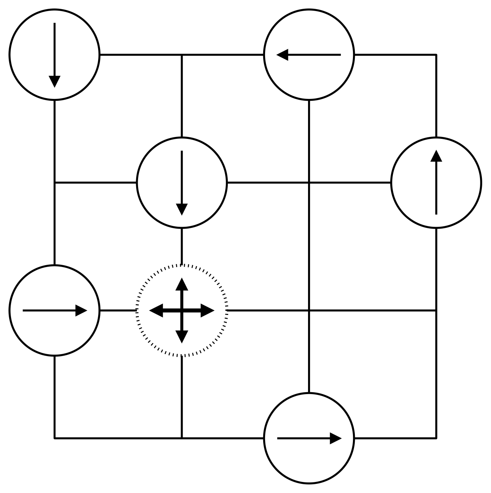
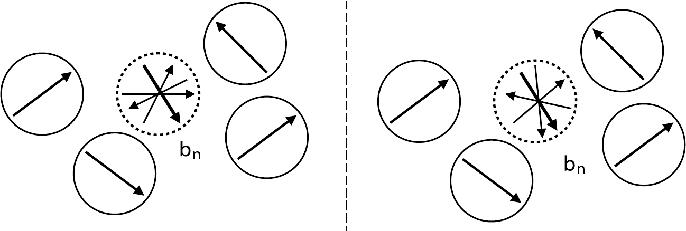
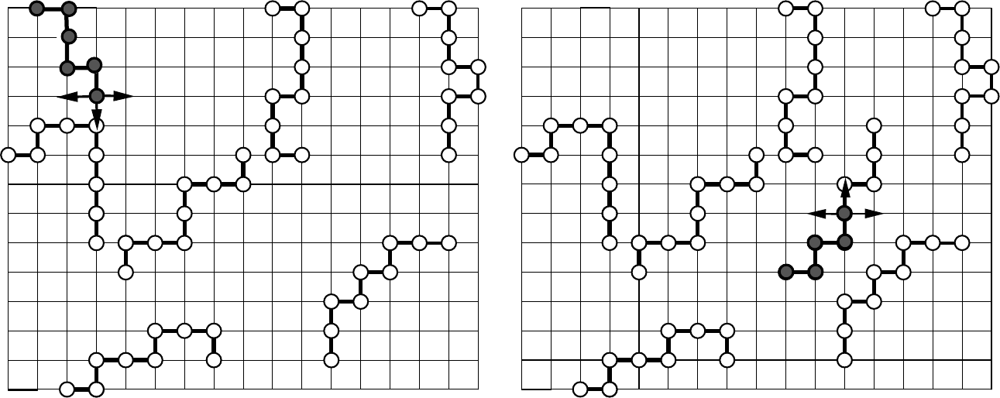
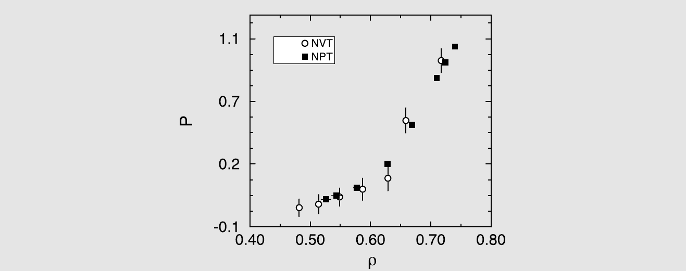
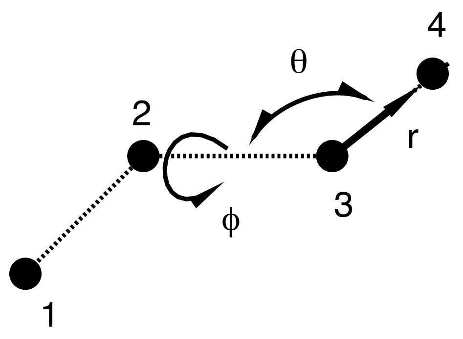
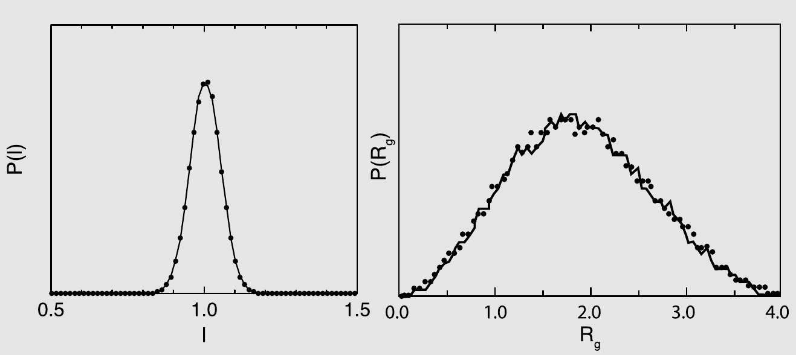
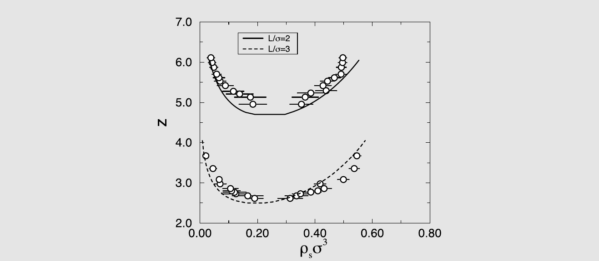
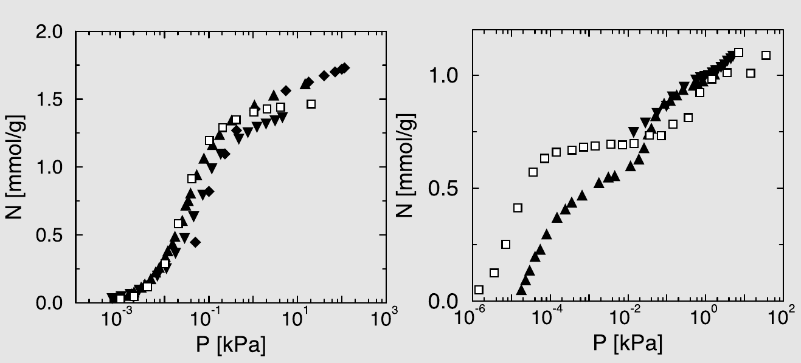
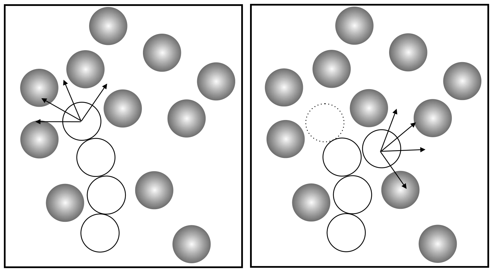
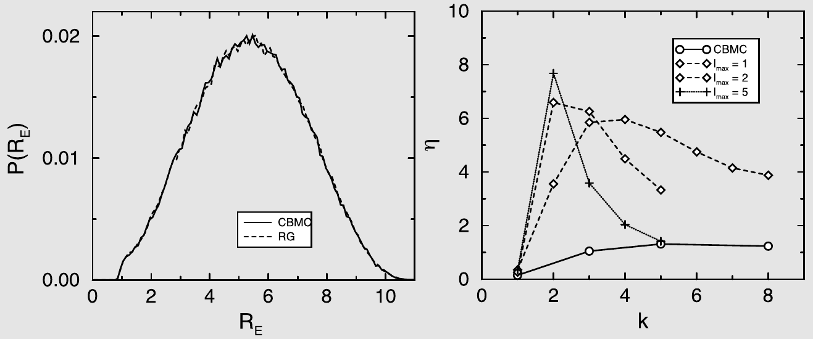

# 构型偏倚 Monte Carlo

到目前为止，我们几乎没有触及一个相当明显的问题：在模拟中使用 Monte Carlo 技术的意义何在？毕竟，分子动力学模拟可以用来研究多体系统的静态性质，而且 MD 还能提供关于系统动力学行为的信息。此外，标准的 MD 模拟在计算上并不比相应的 MC 模拟更昂贵。因此，人们似乎可以得出结论：MC 方法是一种优雅但过时的方案。

读者可能已经猜到，我们相信在某些情况下有充分的理由使用 MC 而非 MD。但我们强调“在某些情况下”这个限定词。在其他条件相同的情况下，MD 显然是首选方法。因此，如果我们使用 Monte Carlo 技术，我们应该始终准备好为自己的选择提供理由。当然，理由可能因情况而异。有时仅仅是编程方便的问题：在 MC 模拟中不需要计算力。如果我们使用对势，这一点无关紧要，但对于多体势，力的计算可能并非易事。另一个可能的原因是我们正在处理一个没有自然动力学的系统。例如，具有离散自由度（如 Ising 自旋）的模型就是这种情况。事实上，对于格点模型的模拟，MC 几乎总是首选技术。但即使在具有连续自由度的非格点模型中，有时使用 Monte Carlo 采样也更好，甚至必不可少。通常，选择 MC 技术的原因是它允许我们执行非物理的试探移动，即那些在自然界中不会发生（因此没有对应的分子动力学过程）但对系统平衡至关重要的移动。

这段引言旨在将我们对复杂流体 Monte Carlo 技术的讨论放在正确的视角中：在大多数已发表的复杂（通常是高分子）流体模拟中，使用的是分子动力学，这是合理的。我们在这里讨论的 Monte Carlo 技术是为那些要么根本无法使用 MD，要么系统的自然动力学太慢以至于无法在模拟的时间尺度上使系统达到平衡的情况而开发的。

这类模拟的例子包括吉布斯系综和巨正则 Monte Carlo 模拟。这两种技术都需要交换粒子，要么在粒子源和模拟盒之间，要么在两个盒子之间。这种粒子交换与任何真实动力学无关，因此需要使用 Monte Carlo 技术。但是，在复杂流体的情况下，特别是由链分子组成的流体，用于巨正则或吉布斯系综模拟的传统 Monte Carlo 技术也会失效。原因在于，对于大分子，在模拟盒中随机试探插入的接受概率极小，因此插入尝试的次数必须大得令人望而却步。出于这个原因，早期的巨正则和吉布斯系综模拟仅限于研究小分子的吸附和液-气相平衡。

## 偏倚采样技术

在本章中，我们讨论标准 Monte Carlo 算法的扩展，使我们能够克服其中一些限制[^1]。这些更复杂的 Monte Carlo 试探移动的主要特点是它们不再完全是随机的：移动被偏倚，使得待插入的分子“适应”现有构型的概率增大。相比之下，在生成正常的（无偏的）MC 试探移动时，不使用关于系统当前构型的信息：该信息仅用于接受或拒绝移动（见第 3 章和第 6 章）。偏倚 Monte Carlo 试探移动意味着我们不再使用对称的先验转移矩阵。为了满足细致平衡条件，我们因此也应该修改接受规则。显然，使用构型偏倚 MC 试探移动所付出的代价是程序复杂性的增加。然而，回报是，借助这些技术，我们有时可以将计算速度提高许多个数量级。为了说明这一点，我们将讨论一些仅通过使用偏倚采样才得以实现的模拟实例。

### 超越 Metropolis

偏倚采样的一般思想最好通过一个简单的例子来解释。假设我们已经开发了一种 Monte Carlo 方案，允许我们以依赖于该构型势能的概率生成试探构型：

$$
\alpha(o \to n) = f[U(n)].
$$

对于反向移动，我们有

$$
\alpha(n \to o) = f[U(o)].
$$

假设我们要采样$N, V, T$系综，这意味着我们必须生成具有玻尔兹曼分布 (6.2.1) 的构型。施加细致平衡条件（见 6.1 节）得出接受规则的条件为

$$
\frac{\mathrm{acc}(o \to n)}{\mathrm{acc}(n \to o)} = \frac{f[U(o)]}{f[U(n)]} \exp\{-\beta[U(n) - U(o)]\}.
$$

满足此条件的一个可能的接受规则为

$$
\mathrm{acc}(o \to n) = \min\left\{1, \frac{f[\mathcal{U}(o)]}{f[\mathcal{U}(n)]} \exp\{-\beta[\mathcal{U}(n) - \mathcal{U}(o)]\}\right\}.

\tag{12.1.1}
$$

这个推导表明，我们可以在采样方案中引入任意偏倚函数$f(U)$，并生成构型的玻尔兹曼分布，只要接受规则被修改为从采样方案中消除偏倚。理想情况下，通过以正确的方式偏倚生成试探构象的概率，我们可以使式 (12.1.1) 右边的项始终等于 1。在这种情况下，每次试探移动都将被接受。在 13.4.2 节中，我们将展示有时可以实现这种理想情况。然而，一般来说，试探移动的偏倚生成仅仅是提高此类移动接受率而不违反细致平衡的一种技术。

现在我们给出一些使用非 Metropolis 采样技术的例子，以展示它们如何用于提高模拟的效率。

### 取向偏倚

要对分子间势强烈依赖于分子相对取向（例如极性分子、氢键形成体、液晶形成分子）的系统进行 Monte Carlo 模拟，重要的是找到一个不仅不与其他分子重叠而且具有可接受取向的位置。如果偶然找到合适取向的概率非常低，我们可以使用偏倚试探移动来提高接受率。

#### 算法

让我们考虑一个 Monte Carlo 试探移动，其中随机选择的粒子需要被移动和重新取向。我们将旧构型记为$o$，试探构型记为$n$。我们对移动的平移部分使用标准的随机位移，但按如下方式偏倚试探取向的生成：

1. 将分子的质心移动一个（小的）随机距离，并确定所有不依赖于取向的相互作用。这些相互作用记为$u_\mathrm{pos}(n)$。在实践中，可能有多种方式将势能分离为取向依赖和取向无关的部分。
1. 生成$k$个试探取向$\{\mathbf{b}_1, \mathbf{b}_2, \cdots, \mathbf{b}_k\}$，并对每个试探取向计算能量$u_\mathrm{or}(\mathbf{b}_i)$。
1. 我们定义 Rosenbluth[^2] 因子$W$：
   $$
   W(n) = \sum_{j=1}^{k} \exp[-\beta u_\mathrm{or}(\mathbf{b}_j)].
   \tag{12.1.2}
   $$
   从这$k$个取向中，我们以概率
   $$
   p(\mathbf{b}_n) = \frac{\exp[-\beta u_\mathrm{or}(\mathbf{b}_n)]}{\sum_{j=1}^{k} \exp[-\beta u_\mathrm{or}(\mathbf{b}_j)]}
   \tag{12.1.3}
   $$
   选择一个，记为$n$。
1. 对于旧构型$o$，不依赖于分子取向的能量部分记为$u_\mathrm{pos}(o)$。分子在旧位置的取向记为$\mathbf{b}_o$，我们生成$k-1$个试探取向$\mathbf{b}_2, \cdots, \mathbf{b}_k$。使用这$k$个取向，我们确定
   $$
   W(o) = \exp[-\beta u_\mathrm{or}(\mathbf{b}_o)] + \sum_{j=2}^{k} \exp[-\beta u_\mathrm{or}(\mathbf{b}_j)].
   \tag{12.1.4}
   $$
1. 移动以概率
   $$
   \mathrm{acc}(o \to n) = \min\left\{1, \frac{W(n)}{W(o)} \exp\{-\beta[u_\mathrm{pos}(n) - u_\mathrm{pos}(o)]\}\right\}
   \tag{12.1.5}
   $$
   被接受。

显然，式 (12.1.3) 确保能量上有利的构型更可能被生成。该方案的一个实现示例如算法 21 所示。接下来，我们应该证明采样方案是正确的。

**算法 21　取向偏倚**

```
function orien_bias           % 改变分子 o 取向的构型偏倚 MC 试探移动
o = int(R*npart)+1            % 随机选出一个粒子
sumw = 0                      % k 为试探方向数，可任意取但需固定
for 1 <= j <= k do
    b(j) = ranor              % 生成随机试探方向
    eno = enero(x(o),o,b(j))  % 计算试探取向的能量
    w(j)= exp(-beta*eno)      % 计算 Rosenbluth 因子 (12.1.2)
    sumw = sumw+w(j)
enddo
n = select(w,sumw)            % 选出其中一个取向
bn = b(n)                     % n 为选中的取向
wn = sumw                     % 新取向的 Rosenbluth 因子
sumw = 0                      % 接下来考虑旧取向
for 1 <= j <= k do            % 考虑 k 个试探取向
    if j == 1 then
        b(j)=bu(o)            % 使用粒子 o 的实际取向
    else
        b(j) = ranor          % 生成一个随机取向
    endif
    eno = enero(x(o),b(j))    % 计算试探取向 j 的能量
    sumw=sumw+exp(-beta*eno)  % 计算 Rosenbluth 因子 (12.1.4)
enddo
wo = sumw                     % 旧构型的 Rosenbluth 因子
if R < wn/wo then             % 接受判据 (12.1.5)
    bu(o)= bn                 % 接受
endif
end function
```

**具体说明**（一般说明参见第 7 页）：

1. 分子原本的位置为 `x(o)`、取向为 `bu(o)`。在本例中，我们保持分子的位置不变。
1. 函数 **enero** 计算位置为 `x(o)`、取向为 `b` 的分子 `o` 的能量。
1. 函数 **ranor** 生成一个随机取向的单位矢量（算法 38）。
1. 函数 **select** 以概率 $p(n) = w(n)/\sum_j w(j)$ 选出其中一个取向（见算法 37）。

#### 算法的正确性证明

为了证明上面描述的取向偏倚 Monte Carlo 方案是正确的，即按照所需分布生成构型，分别考虑格点模型和连续模型更为方便。对于这两种情况，我们假设在正则系综中工作，其构型分布由式 (6.2.1) 给出：

$$
\mathcal{N}(\mathbf{q}^N) \propto \exp[-\beta U(\mathbf{q}^N)],
$$

其中$U(\mathbf{q}^N)$是取向和非取向部分能量之和：

$$
U = u_\mathrm{or} + u_\mathrm{pos}.
$$

**格点模型**

我们首先考虑一个格点模型。我们假设格点模型中的分子可以有$k$个离散取向（见图 12.1）。我们施加细致平衡条件 (6.1.1)：

$$
K(o \to n) = K(n \to o).
$$

构型从$o$到$n$的流量为（式 (6.1.2)）：

$$
K(o \to n) = \mathcal{N}(o) \times \alpha(o \to n) \times \mathrm{acc}(o \to n).

\tag{12.1.6}
$$

在取向偏倚方案中，选择构象$n$的概率为（见式 (12.1.3)）：

$$
\alpha(o \to n) = \frac{\exp[-\beta u_\mathrm{or}(n)]}{W(n)}.
$$

施加细致平衡条件并代入$\mathcal{N}(n)$和$\mathcal{N}(o)$的所需分布，对接受规则施加以下条件：

$$
\begin{align}
\frac{\mathrm{acc}(o \to n)}{\mathrm{acc}(n \to o)}
&= \frac{\exp[-\beta U(n)]}{\exp[-\beta U(o)]} \times \frac{\exp[-\beta u_\mathrm{or}(o)]}{W(o)} \times \frac{W(n)}{\exp[-\beta u_\mathrm{or}(n)]} \notag \\
&= \frac{W(n)}{W(o)} \exp\{-\beta[u_\mathrm{pos}(n) - u_\mathrm{pos}(o)]\}.

\tag{12.1.7}
\end{align}
$$

接受规则 (12.1.5) 满足此条件。这证明了对格点模型而言细致平衡得到满足。



*图 12.1　分子可以采取四种取向（用箭头表示，$k=4$）的格点模型。虚线圆表示我们试图移动的粒子的试探位置。*

**连续模型**

如果分子的取向由连续变量描述，那么与前面的情况有一个本质区别。在格点模型中，所有可能的取向都可以显式地考虑，相应的 Rosenbluth 因子可以精确计算。对于连续情况，我们永远无法希望对所有可能的取向进行采样。由于可能的取向是无限的，因此无法确定精确的 Rosenbluth 因子[^3]。因此，格点模型中计算所有取向的 Rosenbluth 因子的方案不能用于连续模型。一种可能的解决方案是使用大但有限数量的试探方向。令人惊讶的是，这并不是必需的。可以使用所有可能试探方向的任意子集来设计一个严格的算法。我们得到的结果不取决于我们选择的试探方向的数量，但统计精度确实受其影响。

让我们考虑使用一组$k$个试探取向的情况；这组取向记为

$$
\{\mathbf{b}\}_k = \{\mathbf{b}_1, \mathbf{b}_2, \cdots, \mathbf{b}_k\}.
$$

构象$\mathbf{b}_n$只有在属于集合$\{\mathbf{b}\}_k$时才能被选择。包含构象$n$的所有集合$\{\mathbf{b}\}_k$的集合记为

$$
\mathcal{B}_n = \{\{\mathbf{b}\}_k | \mathbf{b}_n \in \{\mathbf{b}\}_k\}.
$$

$\mathcal{B}_n$的每个元素可以写成$(\mathbf{b}_n, \mathbf{b}^*)$，其中$\mathbf{b}^*$是$k-1$个额外试探取向的集合。在构型从$o$到$n$的流量中，我们必须考虑$\mathcal{B}_n$中所有集合的求和：

$$
K(o \to n) = \mathcal{N}(o) \sum_{i \in \mathcal{B}_n} \alpha(o \to n, i) \times \mathrm{acc}(o \to n, i),

\tag{12.1.8}
$$

其中生成构型$n$的概率和接受概率取决于特定的试探取向集合$i$。

类似地，对于反向移动，我们定义集合$\mathcal{B}_o$：

$$
\mathcal{B}_o = \{\{\mathbf{b}\}_k | \mathbf{b}_o \in \{\mathbf{b}\}_k\},
$$

其每个元素可以写成$(\mathbf{b}_o, \mathbf{b}'^*)$。反向流量的表达式变为

$$
K(n \to o) = \mathcal{N}(n) \sum_{j \in \mathcal{B}_o} \alpha(n \to o, j) \times \mathrm{acc}(n \to o, j).

\tag{12.1.9}
$$

应该强调的是，包含$\mathbf{b}_n$的不同取向集合有无穷多个，包含$\mathbf{b}_o$的集合也是如此。此外，从这样的集合中选择$\mathbf{b}_n$的概率取决于集合的其余部分$\mathbf{b}^*$（见图 12.2）。因此，接受概率也必须取决于集合$\mathbf{b}^*$和$\mathbf{b}'^*$。



*图 12.2　分子可以具有任意取向（用箭头表示）的连续模型。图中显示了两个不同的四试探取向集合，两者都包含取向$\mathbf{b}_n$。*

如果我们施加一个更强的条件，即“超细致平衡”，则细致平衡肯定得到满足。超细致平衡指出，对于集合$\mathbf{b}^*$和$\mathbf{b}'^*$的每一个特定选择，细致平衡都应该被满足：

$$
\begin{align}
K(o \to n, \mathbf{b}^*, \mathbf{b}'^*) &= K(n \to o, \mathbf{b}'^*, \mathbf{b}^*), \notag \\
\mathcal{N}(o)\, \alpha(o \to n, \mathbf{b}^*, \mathbf{b}'^*)\, \mathrm{acc}(o \to n, \mathbf{b}^*, \mathbf{b}'^*) &= \mathcal{N}(n)\, \alpha(n \to o, \mathbf{b}'^*, \mathbf{b}^*)\, \mathrm{acc}(n \to o, \mathbf{b}'^*, \mathbf{b}^*),

\tag{12.1.10}
\end{align}
$$

其中$\mathbf{b}^*$和$\mathbf{b}'^*$是两组$k-1$个任意额外试探取向。集合$\mathbf{b}^*$和$\mathbf{b}'^*$出现在等式两边可能看起来很奇怪。然而，请记住，为了决定正向移动的接受，我们应该生成包含新取向的集合$\mathbf{b}^*$和围绕旧取向的集合$\mathbf{b}'^*$。因此，试探移动的构造包括两组试探取向。由于生成$\mathbf{b}^*$和$\mathbf{b}'^*$的概率出现在等式的两边，它们相互抵消。此外，在正向移动中生成随机取向$\mathbf{b}_n$的先验概率等于在反向移动中生成$\mathbf{b}_o$的先验概率。因此这些生成概率也相互抵消。这导致了接受准则的极大简化。对于正则系综，代入式 (12.1.2) 和(12.1.3) 得到：

$$
\begin{align}
\frac{\mathrm{acc}(o \to n, \mathbf{b}^*, \mathbf{b}'^*)}{\mathrm{acc}(n \to o, \mathbf{b}'^*, \mathbf{b}^*)}
&= \frac{\exp[-\beta U(n)]}{\exp[-\beta U(o)]} \frac{\exp[-\beta u_\mathrm{or}(o)]}{W(\mathbf{b}_o, \mathbf{b}'^*)} \frac{W(\mathbf{b}_n, \mathbf{b}^*)}{\exp[-\beta u_\mathrm{or}(n)]} \notag \\
&= \frac{W(\mathbf{b}_n, \mathbf{b}^*)}{W(\mathbf{b}_o, \mathbf{b}'^*)} \exp\{-\beta[u_\mathrm{pos}(n) - u_\mathrm{pos}(o)]\}.

\tag{12.1.11}
\end{align}
$$

由于接受规则 (12.1.5) 满足此条件，细致平衡确实得到满足。

请注意，在这个证明中，我们不需要假设试探取向的数量$k$必须很大。事实上，结果与试探取向的数量无关。

???+ example "例证 16（嵌入球形原子中的偶极子）"

    在具有偶极子的系统中，能量取决于分子的相互取向，取向采样的偏倚可能是有用的。对于嵌入球形粒子（例如偶极硬球流体）中的偶极子模型，如 Caillol [[237]](references.md#ref-237)所指出的，12.1.2 节的方案可以优雅地实现。在式 (12.1.2) 和(12.1.4) 中，Rosenbluth 因子$W$是通过采样$k$个试探取向来计算的。对于偶极硬球（或任何点偶极），一旦知道了插入粒子位置处的电场$\mathbf{E}$和旧构型位置处的电场，我们就可以精确计算 Rosenbluth 因子：

    $$
    W(\mathbf{r}) = \int \mathrm{d}\mathbf{b}\, \exp[-\beta \boldsymbol{\mu} \cdot \mathbf{E}(\mathbf{r})] = \frac{\sinh[\beta|\boldsymbol{\mu}||\mathbf{E}(\mathbf{r})|]}{\beta|\boldsymbol{\mu}||\mathbf{E}(\mathbf{r})|},
    $$

    其中$\boldsymbol{\mu}$是分子的偶极矩[^4]。试探取向现在可以直接从分布

    $$
    p(\mathbf{r}, \omega) = \frac{\exp[-\beta \boldsymbol{\mu} \cdot \mathbf{E}(\mathbf{r})]}{W(\mathbf{r})}
    $$

    中抽取。

## 链分子

聚合物平衡构象的采样通常非常耗时。主要原因是聚合物的自然动力学受拓扑约束（链不能交叉）的支配，因此任何基于大分子真实运动的算法都将面临同样的问题。出于这个原因，人们提出了许多“非物理的”Monte Carlo 试探移动来加速聚合物构象的采样（参见例如[[449]](references.md#ref-449)）。

一种早期的模拟聚合物的 Monte Carlo 方案是 Kron [[508]](references.md#ref-508)的“蛇行”方法。在该算法中，试探移动包括从线性链的一端移除一个单体并将其添加到另一端的 Metropolis 式试探移动。原始的蛇行方法只能用于均聚物。然而，这一限制在 Houdayer [[509]](references.md#ref-509)的“虫洞”移动方法中被克服。在 Houdayer 的方法中，链两端之间单体的蛇行式交换持续进行，直到整条链以其原始序列被重建。

在本节中，我们介绍构型偏倚 Monte Carlo（CBMC）方案[[444,447,510,511]](references.md#ref-444)。这种模拟技术可用于通过连续小步骤改变大分子构象不太实际的系统。

### 构型偏倚 Monte Carlo

构型偏倚 Monte Carlo 技术的出发点是 Rosenbluth 和 Rosenbluth 在 1955 年[[438]](references.md#ref-438)引入的方案。Rosenbluth 方案本身也是作为采样聚合物构象的方法而设计的[^5]。然而，Rosenbluth 方案的一个缺点是它生成的是所有聚合物构象的非代表性样本；即使用该方案生成特定构象的概率不与其玻尔兹曼权重成正比。Rosenbluth 和 Rosenbluth 通过引入构象依赖的权重因子$W$来校正聚合物构象采样中的这种偏倚。然而，正如 Batoulis 和 Kremer [[450]](references.md#ref-450)详细证明的那样，这种校正程序虽然在原则上是正确的，但在实践中仅对相对较短的链有效（见例 14）。

解决这个问题的方法是以这样的方式偏倚 Rosenbluth 采样，使得在 Monte Carlo 序列中恢复链构象的正确（Boltzmann）分布。在我们接下来讨论的构型偏倚方案中，Rosenbluth 权重用于偏倚由 Rosenbluth 过程生成的试探构象的接受。正如我们将展示的，这保证了所有链构象都以正确的玻尔兹曼权重生成。

### 格点模型

#### 算法

构型偏倚 Monte Carlo 算法包括以下步骤：

1. 使用 Rosenbluth 方案（见图 12.3，左图）生长整个分子或其部分来生成试探构象，并计算其 Rosenbluth 权重$W(n)$。
1. “回溯”旧构象（见图 12.3，右图）并确定其 Rosenbluth 因子。
1. 以概率
   $$
   \mathrm{acc}(o \to n) = \min[1, W(n)/W(o)]
   \tag{12.2.1}
   $$
   接受试探移动。



*图 12.3　构型偏倚 Monte Carlo 方案示意图。左图显示新构象的生成，右图显示旧构象的回溯。箭头表示三个试探位置。*

由$\ell$个单体组成的聚合物的试探构象$n$使用基于 Rosenbluth 和 Rosenbluth 方法的算法生成（见图 12.3）：

1. 第一个原子随机插入，其能量记为$u_1(n)$，且[^6]
   $$
   w_1(n) = k \exp[-\beta u_1(n)],
   $$
   其中$k$是格点的配位数，例如简单立方格点的$k=6$。
1. 对于索引为$i$的下一个片段，有$k$个可能的试探方向。试探方向$j$的能量记为$u_i(j)$。从$k$个可能的方向中，我们以概率
   $$
   p_i(n) = \frac{\exp[-\beta u_i(n)]}{w_i(n)},
   \tag{12.2.2}
   $$
   选择一个，记为$n$，其中$w_i(n)$定义为
   $$
   w_i(n) = \sum_{j=1}^{k} \exp[-\beta u_i(j)].
   \tag{12.2.3}
   $$
   相互作用能$u_i(j)$包括片段$i$与系统中其他分子以及同一分子第 1 到$i-1$个片段的所有相互作用。它不包括与第$i+1$到$\ell$个片段的相互作用。因此，链的总能量为$U(n) = \sum_{i=1}^{\ell} u_i(n)$。
1. 重复步骤 2 直到整条链生长完毕，然后我们可以确定构型$n$的 Rosenbluth 因子$W$：
   $$
   W(n) = \prod_{i=1}^{\ell} w_i(n).
   \tag{12.2.4}
   $$

类似地，为了确定旧构型$o$的 Rosenbluth 因子，我们使用以下步骤（见图 12.3）：

1. 随机选择一条链。该链记为$o$。
1. 我们测量第一个单体的能量$u_1(o)$并计算$w_1(o) = k \exp[-\beta u_1(o)]$。
1. 为了计算链其余部分的 Rosenbluth 权重，我们确定单体$i$在其实际位置的能量，以及如果它被放置在单体$i-1$的实际位置附近的其他$k-1$个位点中的任何一个时会具有的能量（见图 12.3）。这些能量用于计算：
   $$
   w_i(o) = \exp[-\beta u_i(o)] + \sum_{j=2}^{k} \exp[-\beta u_i(j)].
   $$
1. 一旦整条链被回溯完毕，我们确定其 Rosenbluth 因子：
   $$
   W(o) = \prod_{i=1}^{\ell} w_i(o).
   \tag{12.2.5}
   $$

最后，从$o$到$n$的试探移动以概率

$$
\mathrm{acc}(o \to n) = \min[1, W(n)/W(o)]

\tag{12.2.6}
$$

被接受。该方案实现的一个示意性示例由算法 22 和算法 23 给出。我们现在必须证明接受规则 (12.2.6) 正确地消除了由使用式 (12.2.2) 引入的生成链中新片段的偏倚。

**算法 22　基本构型偏倚 Monte Carlo**

```
function CBMC                 % 执行一次 CBMC 试探移动
new_conf=.false.              % 先回溯旧构型（的一部分）
wo = grow(new_conf)           % 以计算其 Rosenbluth 因子
new_conf=.true.               % 接下来考虑新构型
wn = grow(new_conf)           % 生长链（的一部分）并计算

if R < wn/wo then             % 接受判据 (12.2.6)
    accept                    % 接受并做记账
endif
end function
```

**具体说明**（一般说明参见第 7 页）：

1. 该算法给出构型偏倚 Monte Carlo 方法的基本结构。模型的细节体现在函数 **grow** 中（格点上聚合物的情形见算法 23）。
1. 函数 **accept** 负责新构型的记账工作。

**算法 23　在格点上生长一条链**

```
function grow(new_conf, w)    % 在配位数为 k 的格点上生长一条

if new_conf then              % new_conf 为逻辑变量（见说明）
    xn(1)=R*box               % 插入第一个单体
else
    o=R*npart+1               % 随机选出旧链
    xn(1)=x(o,1)
endif
en = ener(xn(1),o)            % 计算第一个单体的能量
w=k*exp(-beta*en)             % 第一个单体的 Rosenbluth 因子
for 2 <= i <= ell do
    sumw=0
    for 1 <= j <= k do        % 考虑 k 个试探方向
        xt(j)=xn(i-1)+b(j)    % 确定试探位置
        en = ener(xt(j),o)    % 确定试探位置 j 的能量
        w(j)=exp(-beta*en)
        sumw=sumw+w(j)
    enddo
    if new_conf then
        n = select(w,sumw)    % 选出其中一个试探位置
        xn(i)=xt(n)           % 选中方向 n
    else
        xn(i)=x(o,i)
    endif
    w=w*sumw                  % 更新 Rosenbluth 因子
enddo
end function
```

**具体说明**（一般说明参见第 7 页）：

1. 若 `new\_conf == .true.` 则生成一个新构型；若 `new\_conf == .false.` 则回溯一个旧构型。
1. 在格点模型中，我们考虑所有可能的试探位置，它们由固定集合 `b(j)` 给出。因此对旧构象而言，实际位置会自动被包含在内。
1. 函数 **select**（算法 37）以概率 $p(i) = w(i)/\sum_j w(j)$ 选出其中一个试探位置。函数 **ener** 计算给定位置上的单体与其他聚合物、以及与该链中已经生长出来的单体之间的能量。

#### 算法的正确性证明

证明该算法采样玻尔兹曼分布的过程类似于 12.1.2 节中格点模型的取向偏倚算法的证明。

生成特定构象$n$的概率来自式 (12.2.2) 的重复使用：

$$
\alpha(o \to n) = \prod_{i=1}^{\ell} \frac{\exp[-\beta u_i(n)]}{w_i(n)} = \frac{\exp[-\beta \mathcal{U}(n)]}{W(n)}.

\tag{12.2.7}
$$

类似地，对于反向移动：

$$
\alpha(n \to o) = \frac{\exp[-\beta \mathcal{U}(o)]}{W(o)}.

\tag{12.2.8}
$$

细致平衡的要求 (6.1.1) 对接受准则施加了以下条件：

$$
\frac{\mathrm{acc}(o \to n)}{\mathrm{acc}(n \to o)} = \frac{W(n)}{W(o)}.

\tag{12.2.9}
$$

显然，提出的接受准则 (12.2.6) 满足此条件。

应该强调的是，因子$W(o)$的值取决于旧构型被回溯的方向：如果我们从单体 1 开始，我们得到的$W(o)$的数值不同于从单体$\ell$开始的情况。因此，这种移动的概率取决于因子$W(o)$的计算方式。虽然这种依赖关系乍看之下违反直觉，但两种回溯旧构象的方式——从单体 1 开始或从单体$\ell$开始——都产生正确的状态分布，只要两种方式在模拟过程中以相等的概率发生。在线性链由相同片段组成的情况下，这是自动满足的，因为端基的标记是完全任意的。

### 非格点情况

接下来，我们考虑非格点系统的构型偏倚 Monte Carlo。正如 12.1.2 节中描述的取向移动一样，构型偏倚 Monte Carlo 连续版本中的某些方面需要特别注意。在 12.1.2 节中，我们已经展示了即使在无法精确计算 Rosenbluth 因子的情况下，也可能开发构型偏倚采样方案。对于链分子，我们基本上可以采用相同的方法。

我们必须考虑的另一个重要问题是链分子试探构象的生成方式。在格点模型中，试探构象的数量由格点决定。在非格点系统中，可以在单位球面上均匀分布地生成试探片段。然而，对于许多感兴趣的模型，这种程序效率不高，特别是当存在强的分子内相互作用（例如弯曲和扭转势）时。构型偏倚 Monte Carlo 算法的效率在很大程度上取决于生成试探取向的方法。例如，各向同性的试探方向分布完全适合完全柔性的链。相比之下，对于刚性链（例如液晶形成聚合物），这种试探位置几乎总是会因为分子内相互作用而被拒绝。

#### 算法

从前面的讨论可以看出，分子内相互作用应该在生成试探构象集合时被考虑。在这里，我们考虑一个柔性分子的情况，其内部能量贡献来自键弯曲和扭转。完全柔性的情况则可以简单地推广。考虑由$\ell$个线段组成的链，给定构象的势能$U$有两个贡献：

1. 键合势能$U_\mathrm{bond}$等于各个键的势能贡献之和。第$i$和$i+1$段之间的键（例如）具有依赖于相邻段之间角度$\theta$的势能$u_{i}^{\mathrm{bond}}$。例如，$u_{i}^{\mathrm{bond}}(\theta)$可以是$u_{i}^{\mathrm{bond}}(\theta) = k_\theta(\theta - \theta_0)^2$的形式。对于多原子分子的实际模型，$u_{i}^{\mathrm{bond}}$包括从原子$i-1$到原子$i$的键的弯曲和扭转引起的所有局域键合势能变化。
1. 外部势能$U_\mathrm{ext}$包括与其他分子的所有相互作用以及所有非键合的分子内相互作用。此外，可能存在的与任何外场的相互作用也包括在$U_\mathrm{ext}$中。

在下文中，我们将没有外部相互作用的链称为理想链。注意这纯粹是一个虚构的概念，因为真实的链总是有非键合的分子内相互作用。

为了执行构型偏倚 Monte Carlo 移动，我们应用以下“配方”来构造由$\ell$个片段组成的链的构象。链构象的构造逐段进行。让我们考虑添加一个这样的片段。具体来说，假设我们已经生长了$i-1$个片段，正在尝试添加片段$i$。这分两步完成。首先，我们生成试探构象$n$，然后考虑旧构象$o$。试探构象的生成如下：

1. 生成固定数量的，比如$k$个试探片段。试探片段的取向按照与单体$i$的键合相互作用（$u_{i}^{\mathrm{bond}}$）相关的玻尔兹曼权重分布。我们将这$k$个不同的试探片段记为
   $$
   \{\mathbf{b}\}_k = \{\mathbf{b}_1, \cdots, \mathbf{b}_k\},
   $$
   其中生成试探片段$\mathbf{b}$的概率为
   $$
   p_{i}^{\mathrm{bond}}(\mathbf{b})\, \mathrm{d}\mathbf{b} = \frac{\exp[-\beta u_{i}^{\mathrm{bond}}(\mathbf{b})]\, \mathrm{d}\mathbf{b}}{\int \mathrm{d}\mathbf{b}\, \exp[-\beta u_{i}^{\mathrm{bond}}(\mathbf{b})]} = C \exp[-\beta u_{i}^{\mathrm{bond}}(\mathbf{b})]\, \mathrm{d}\mathbf{b}.
   \tag{12.2.10}
   $$
1. 对于所有$k$个试探片段，我们计算外部玻尔兹曼因子$\exp[-\beta u_{i}^{\mathrm{ext}}(\mathbf{b}_i)]$，并从中以概率
   $$
   p_{i}^{\mathrm{ext}}(\mathbf{b}_n) = \frac{\exp[-\beta u_{i}^{\mathrm{ext}}(\mathbf{b}_n)]}{w_{i}^{\mathrm{ext}}(n)},
   \tag{12.2.11}
   $$
   选择一个，记为$n$，其中我们定义了
   $$
   w_{i}^{\mathrm{ext}}(n) = \sum_{j=1}^{k} \exp[-\beta u_{i}^{\mathrm{ext}}(\mathbf{b}_j)].
   \tag{12.2.12}
   $$
1. 被选中的片段$n$成为链的试探构象的第$i$个片段。
1. 当整条链生长完毕后，我们计算链的 Rosenbluth 因子：
   $$
   W^{\mathrm{ext}}(n) = \prod_{i=1}^{\ell} w_{i}^{\mathrm{ext}}(n),
   \tag{12.2.13}
   $$
   其中第一个单体的 Rosenbluth 因子定义为
   $$
   w_{1}^{\mathrm{ext}}(n) = k \exp[-\beta u_{1}^{\mathrm{ext}}(\mathbf{r}_1)],
   \tag{12.2.14}
   $$
   其中$\mathbf{r}_1$是第一个单体的位置。

对于旧构型，使用类似的过程来计算其 Rosenbluth 因子：

1. 随机选择一条链。该链记为$o$。
1. 计算第一个单体的外部能量。该能量仅涉及外部相互作用。第一个单体的 Rosenbluth 权重为
   $$
   w_{1}^{\mathrm{ext}}(o) = k \exp[-\beta u_{1}^{\mathrm{ext}}(o)].
   \tag{12.2.15}
   $$
1. 其余$\ell-1$个片段的 Rosenbluth 因子按如下方式计算。我们考虑片段$i$的 Rosenbluth 因子的计算。我们生成一组$k-1$个按照键合相互作用 (12.2.10) 规定的分布取向。这些取向与片段$i-1$和$i$之间的实际键一起，形成$k$个取向的集合$(\mathbf{b}_o, \mathbf{b}'^*)$。这些取向用于计算外部 Rosenbluth 因子：
   $$
   w_{i}^{\mathrm{ext}}(o) = \sum_{j=1}^{k} \exp[-\beta u_{i}^{\mathrm{ext}}(\mathbf{b}_j)].
   \tag{12.2.16}
   $$
1. 对于整条链，旧构象的 Rosenbluth 因子定义为
   $$
   W^{\mathrm{ext}}(o) = \prod_{i=1}^{\ell} w_{i}^{\mathrm{ext}}(o).
   \tag{12.2.17}
   $$

在生成了新构型并计算出旧构型的 Rosenbluth 因子之后，移动以概率

$$
\mathrm{acc}(o \to n) = \min[1, W^{\mathrm{ext}}(n)/W^{\mathrm{ext}}(o)]

\tag{12.2.18}
$$

被接受。我们仍然需要证明这个采样方案是正确的。

#### 算法的正确性证明

与格点版本相比，非格点情况有两个方面不同。首先，对于具有连续自由度的模型，我们无法精确计算 Rosenbluth 因子。这一点在 12.1.2 节的取向偏倚方案中已详细讨论。与 12.1.2 节一样，我们施加超细致平衡。其次，我们生成试探构象的方式在非格点和格点模型之间是不同的。在格点模型中，不需要将相互作用分离为键合和外部部分。我们必须证明处理键合相互作用的方式不会扰动采样。

生成长度为$\ell$的链的概率是生成试探取向的概率 (12.2.10) 和选择该取向的概率 (12.2.11) 的乘积；对于所有单体，这给出构象$n$的生成概率为

$$
\alpha(o \to n) = \prod_{i=1}^{\ell} p_i(o \to n) = \prod_{i=1}^{\ell} p_{i}^{\mathrm{bond}}(n)\, p_{i}^{\mathrm{ext}}(n).

\tag{12.2.19}
$$

在下文中，我们考虑$\ell$个片段中某一个的表达式，以保持方程简洁。包含取向$n$的一组$k$个试探取向记为$(\mathbf{b}_n, \mathbf{b}^*)$（见 12.1.2 节）。如前所述，我们强调围绕旧片段$(\mathbf{b}_o)$生成额外试探取向$(\mathbf{b}'^*)$是生成试探移动的重要组成部分。我们将生成组合集合$\mathbf{b}^*$、$\mathbf{b}'^*$的概率记为

$$
P^{\mathrm{bond}}(\mathbf{b}^*, \mathbf{b}'^*).
$$

因此，构型的流量为

$$
\begin{align}
K(o \to n, \mathbf{b}^*, \mathbf{b}'^*) &= \mathcal{N}(o) \times \alpha(o \to n, \mathbf{b}^*, \mathbf{b}'^*) \times \mathrm{acc}(o \to n, \mathbf{b}^*, \mathbf{b}'^*) \notag \\
&= \exp[-\beta u(o)] \times C \exp[-\beta u^{\mathrm{bond}}(n)] \times \frac{\exp[-\beta u^{\mathrm{ext}}(n)]}{w^{\mathrm{ext}}(\mathbf{b}_n, \mathbf{b}^*)} \notag \\
&\quad \times \mathrm{acc}(o \to n, \mathbf{b}^*, \mathbf{b}'^*)\, \mathcal{P}^{\mathrm{bond}}(\mathbf{b}^*, \mathbf{b}'^*).

\tag{12.2.20}
\end{align}
$$

对于反向移动，我们有

$$
\begin{align}
K(n \to o, \mathbf{b}'^*, \mathbf{b}^*) &= \mathcal{N}(n) \times \alpha(n \to o, \mathbf{b}'^*, \mathbf{b}^*) \times \mathrm{acc}(n \to o, \mathbf{b}'^*, \mathbf{b}^*) \notag \\
&= \exp[-\beta u(n)] \times C \exp[-\beta u^{\mathrm{bond}}(o)] \times \frac{\exp[-\beta u^{\mathrm{ext}}(o)]}{w^{\mathrm{ext}}(\mathbf{b}_o, \mathbf{b}'^*)} \notag \\
&\quad \times \mathrm{acc}(n \to o, \mathbf{b}'^*, \mathbf{b}^*)\, \mathcal{P}^{\mathrm{bond}}(\mathbf{b}^*, \mathbf{b}'^*).

\tag{12.2.21}
\end{align}
$$

回想一下单体的总能量是键合和外部贡献之和：

$$
u(n) = u^{\mathrm{bond}}(n) + u^{\mathrm{ext}}(n).
$$

现在我们施加超细致平衡 (12.1.10)。等式两边的因子$P^{\mathrm{bond}}(\mathbf{b}^*, \mathbf{b}'^*)$相互抵消，我们得到接受规则的以下简单准则：

$$
\frac{\mathrm{acc}(o \to n, \mathbf{b}^*, \mathbf{b}'^*)}{\mathrm{acc}(n \to o, \mathbf{b}'^*, \mathbf{b}^*)} = \frac{w^{\mathrm{ext}}(\mathbf{b}_n, \mathbf{b}^*)}{w^{\mathrm{ext}}(\mathbf{b}_o, \mathbf{b}'^*)}.

\tag{12.2.22}
$$

这个证明仅针对链中的单个片段。对于整条链，相应的接受准则通过类比得到。它简单的是所有片段的项的乘积[^7]：

$$
\frac{\mathrm{acc}[o \to n, (\mathbf{b}_1^*, \cdots, \mathbf{b}_\ell^*)]}{\mathrm{acc}[n \to o, (\mathbf{b}_1'^*, \cdots, \mathbf{b}_\ell'^*)]} = \frac{\prod_{i=1}^{\ell} w_{i}^{\mathrm{ext}}(\mathbf{b}_n, \mathbf{b}^*)}{\prod_{i=1}^{\ell} w_{i}^{\mathrm{ext}}(\mathbf{b}_o, \mathbf{b}'^*)} = \frac{W[n, (\mathbf{b}_1^*, \cdots, \mathbf{b}_\ell^*)]}{W[o, (\mathbf{b}_1'^*, \cdots, \mathbf{b}_\ell'^*)]}.

\tag{12.2.23}
$$

确实，我们的接受规则 (12.2.18) 满足此条件。该方程表明，由于试探取向以由键合能量规定的概率 (12.2.10) 生成，该能量不出现在接受规则中。在案例研究 19 中，对这种方法的优点进行了详细讨论。重要的是要注意，我们不需要知道式 (12.2.10) 的归一化常数$C$。

连续模型构型偏倚 Monte Carlo 算法的基本结构与格点版本（算法 22）非常相似；主要区别在于构型的生成方式。

???+ example "例 20（Lennard-Jones 链的状态方程）"

    为了说明本节描述的构型偏倚 Monte Carlo 技术，我们确定由 Lennard-Jones 粒子的八珠链组成的系统的状态方程。非键合相互作用由截断和偏移的 Lennard-Jones 势描述。势能在$R_c = 2.5\sigma$处截断。键合相互作用由谐振弹簧描述：

    $$
    u_\mathrm{vib}(l) = \begin{cases}
    0.5 k_\mathrm{vib}(l-1)^2 & 0.5 \le l \le 1.5 \\
    \infty & \text{其他}
    \end{cases},
    $$

    其中$l$是键长，平衡键长设为 1，$k_\mathrm{vib} = 400$。

    模拟以循环方式进行。在每个循环中，我们平均执行$N_\mathrm{dis}$次粒子位移尝试，$N_\mathrm{cbmc}$次链的（部分）重新生长尝试，以及$N_\mathrm{vol}$次体积变化尝试（仅在$N, P, T$模拟的情况下）。当我们重新生长一条链时，使用构型偏倚 Monte Carlo 方案。在这个移动中，我们随机选择开始重新生长的单体。如果这恰好是第一个单体，则整个分子在随机位置重新生长。对于所有模拟，我们使用了八个试探取向。试探键的长度按照键拉伸势规定的概率生成（见案例研究 19）。

    

    *图 12.4　使用构型偏倚 Monte Carlo 方案从$N, V, T$和$N, P, T$模拟获得的八珠 Lennard-Jones 链的状态方程。模拟使用 50 条链在温度$T = 1.9$下进行。*

    在图 12.4 中，从$N, V, T$模拟获得的状态方程与从$N, P, T$模拟获得的状态方程进行了比较。这条等温线远高于相应单体流体的临界温度（$T_c = 1.085$，见图 3.3），但链分子的临界温度明显更高[[512]](references.md#ref-512)。

    更多详情，参见补充材料（案例研究 18）。

## 试探取向的生成

高效生成好的试探构象是具有强分子内相互作用的连续模型构型偏倚 Monte Carlo 方案的一个重要方面。对于某些模型（例如高斯链），可以直接生成这种分布。对于任意模型，我们可以使用接受-拒绝技术[[38]](references.md#ref-38)来生成试探取向。

在这里，我们展示如何使用拒绝技术高效地生成试探位置。CBMC 方案中试探方向的数量可以自由选择。通常，最佳试探方向数量是通过经验确定的。然而，也存在更系统的技术来计算这个最优数量[[513]](references.md#ref-513)。

### 强分子内相互作用

让我们考虑一个分子模型作为例子，其中键合相互作用包括键拉伸、键弯曲和扭转。外部相互作用是非键合相互作用。烷烃的联合原子模型就是这种分子的典型例子。

我们生成试探构型$\mathbf{b}$的概率由下式给出（见式 (12.2.10)）：

$$
P(\mathbf{b})\, \mathrm{d}\mathbf{b} = C \exp[-\beta u^{\mathrm{bond}}(\mathbf{b})]\, \mathrm{d}\mathbf{b}.

\tag{12.3.1}
$$

使用键长$r$、键角$\theta$和扭转角$\varphi$来表示原子的位置是方便的（见图 12.5）。使用这些坐标，体积元$\mathrm{d}\mathbf{b}$由下式给出：

$$
\mathrm{d}\mathbf{b} = r^2\, \mathrm{d}r\, \mathrm{d}\cos\theta\, \mathrm{d}\varphi.

\tag{12.3.2}
$$

键合能量是键拉伸势、键弯曲势和扭转势之和：

$$
u^{\mathrm{bond}}(r, \theta, \varphi) = u_\mathrm{vib}(r) + u_\mathrm{bend}(\theta) + u_\mathrm{tors}(\varphi).

\tag{12.3.3}
$$

将式 (12.3.3) 和(12.3.2) 代入式 (12.3.1) 得到

$$
\begin{align}
P(\mathbf{b})\, \mathrm{d}\mathbf{b} &= P(r, \theta, \varphi)\, r^2\, \mathrm{d}r\, \mathrm{d}\cos\theta\, \mathrm{d}\varphi \notag \\
&= C \exp[-\beta u_\mathrm{vib}(r)]\, r^2\, \mathrm{d}r \times \exp[-\beta u_\mathrm{bend}(\theta)]\, \mathrm{d}\cos\theta \notag \\
&\quad \times \exp[-\beta u_\mathrm{tors}(\varphi)]\, \mathrm{d}\varphi.

\tag{12.3.4}
\end{align}
$$

许多模型使用固定的键长，在这种情况下式 (12.3.4) 中的第一项是常数。



*图 12.5　分子一部分的示意图。*

让我们考虑图 12.5 所示的分子。第一个原子被放置在随机位置，现在我们必须添加第二个原子。为方便起见，假设模型具有固定的键长。第二个原子除了键长约束外没有其他键合相互作用。试探取向的分布，即式 (12.3.4)，简化为

$$
P_2(\mathbf{b})\, \mathrm{d}\mathbf{b} \propto \mathrm{d}\cos\theta\, \mathrm{d}\varphi.

\tag{12.3.5}
$$

因此，试探取向在球面上随机分布（这种分布可以用附录 J 中的算法 38 生成）。

对于第三个原子，键合能量还包含键弯曲能量。这给出试探取向的分布为

$$
P_3(\mathbf{b})\, \mathrm{d}\mathbf{b} \propto \exp[-\beta u_\mathrm{bend}(\theta)]\, \mathrm{d}\cos\theta\, \mathrm{d}\varphi.

\tag{12.3.6}
$$

为了生成按照式 (12.3.6) 分布的$k$个试探取向，我们再次在单位球面上生成随机向量并确定角度$\theta$。该向量以概率$\exp[-\beta u_\mathrm{bend}(\theta)]$被接受。如果被拒绝，则重复此过程直到$\theta$的一个值被接受。在文献[[38]](references.md#ref-38)中，证明了这种接受-拒绝方法确实给出了所需的试探取向分布。以这种方式，生成$k$个（或对于旧构象为$k-1$个）试探取向。

另一种方案是均匀生成角度$\theta$（$\theta \in [0, \pi]$）并确定与该角度对应的键弯曲能量。该角度$\theta$以概率$\sin(\theta)\exp[-\beta u_\mathrm{bend}(\theta)]$被接受。如果被拒绝，则重复此过程直到$\theta$的一个值被接受。选定的$\theta$值与随机选择的角度$\varphi$相补充。这两个角度确定一个新的试探取向。

对于第四个及更高的原子，键合能量包括键弯曲和扭转能量。这给出式 (12.3.4) 为

$$
p_l^{\mathrm{bond}}(\mathbf{b})\, \mathrm{d}\mathbf{b} \propto \exp[-\beta u_\mathrm{bend}(\theta)]\, \exp[-\beta u_\mathrm{tors}(\varphi)]\, \mathrm{d}\cos\theta\, \mathrm{d}\varphi.

\tag{12.3.7}
$$

我们再次在球面上生成随机向量并计算键弯曲角$\theta$和扭转角$\varphi$。这些角度以概率$\exp\{-\beta[u_\mathrm{bend}(\theta) + u_\mathrm{tors}(\varphi)]\}$被接受。如果这些角度被拒绝，则生成新的向量直到有一个被接受。

另一种方案是首先通过在$[0, \pi]$上均匀生成$\theta$并计算与该角度对应的键弯曲能量来确定键弯曲角$\theta$。该角度$\theta$然后以概率$\sin(\theta)\exp[-\beta u_\mathrm{bend}(\theta)]$被接受。此过程持续进行直到我们接受一个角度。接下来我们在$[0, 2\pi]$上随机生成一个扭转角并以概率$\exp[-\beta u_\mathrm{tors}(\varphi)]$接受该角度，同样重复此过程直到一个值被接受。在这个方案中，键角和扭转角独立生成，这在相应势能尖锐峰化的情况下可能是一个优势。

接受-拒绝技术在算法 24–27 中针对不同的$n$-烷烃进行了说明。处理支链烃的方法可以在补充材料 L.8.1 节中找到。对于烃的全原子或显式氢模型，需要不同的策略，我们建议读者参阅相关文献[[514,515]](references.md#ref-514)。

**算法 24　生长一条“烷烃”**

```
function grow(new_conf,w)     % 生长或回溯一条“烷烃”并

if new_conf == .true. then    % new_conf = .true.：新构型
    ib=int(R*ell)+1           % 从位置 ib <= l 开始生长
    ibnewconf=ib              % 存储起始位置
else                          % new_conf = .false.：旧构型
    ib=ibnewconf              % 用与新构型相同的起始位置
endif                         % 重新生长
for 1 <= i <= b-1 do
    xn(i)=x(i)                % 存储不被重新生长的位置
enddo
w=1
for ib <= i <= ell do
    if ib == 1 then           % 第一个原子
        if new_conf == .true. then
            xt(1)=R*box       % 生成随机位置
        else
            xt(1)=xn(1)       % 使用旧位置
        endif
        eni = enerex(xt(1))   % 计算（外部）能量
        w=k*exp(-beta*eni)    % 以及 Rosenbluth 因子
    else                      % 第二个及更高的原子
        sumw=0
        for 1 <= j <= k do
            if new_conf == .false.
               & j == 1) then
                xt(1)=x(i)    % 以实际位置作为试探取向
            else
                xt(j) = next_ci(xn,i)  % 生成试探位置
            endif
            eni= enerex(xt(j))         % 该位置的（外部）能量
            wt(j)= exp(-beta*eni)
            sumw=sumw+wt(j)
        enddo
        w=w*sumw              % 更新 Rosenbluth 因子
        if new_conf == .true. then
            n = select(wt,sumw)   % 选出其中一个试探取向
            xn(i)=xt(n)
            xstore(i)=xt(n)       % 存储选中的构型以便记账
        else
            xn(i)=x(i)
        endif
    endif
enddo
end function
```

**具体说明**（一般说明参见第 7 页）：

1. 该算法给出含 $\ell$ 个联合原子的线性链分子（“烷烃”）的 CBMC 生长／重新生长过程。
1. 函数 **enerex** 计算给定位置上一个原子的外部能量，函数 **select** 以概率 $p(i) = w(i)/\sum_j w(j)$ 选出其中一个试探位置（算法 37）。
1. 函数 **next\_ci**（$i = 2$、3 或 $n$）按成键相互作用的规定把下一个原子加到链上。算法 25、26 和 27 分别是二聚体（联合原子“乙烷”）、三聚体（“丙烷”）以及带弯曲势和扭转势的更长链（“高级烷烃”）的例子。

**算法 25　添加一根随机取向的键**

```
function next_c2(xn,i)        % 从上一个位置 xn(i-1) 出发

l = bondl                     % 生成键长
b = ranor                     % 生成一个随机取向的单位矢量
xt(i)=xn(i-1)+l*b
end function
```

**具体说明**（一般说明参见第 7 页）：

1. 函数 **ranor** 生成一个随机取向的单位矢量（算法 38），函数 **bondl**（算法 39）生成由成键相互作用所规定的键长。

**算法 26　三聚体的试探构象**

```
function next_c3(xn,i)        % 为第 i 个原子生成试探位置

l=bondl                       % 生成键长
if i == 2 then                % 链中的第二个原子
    xt = next_c2(xn,i)        % 使用算法 25
else if i == 3 then           % 第三个原子
    b= bonda(xn,i)            % 生成具有所需键角的
    xt=xn(2)+l*b              % 新位置的取向
endif
end function
```

**具体说明**（一般说明参见第 7 页）：

1. 带键角势的三聚体的一个简单例子是丙烷的联合原子模型。
1. 函数 **ranor** 在单位球面上生成一个随机矢量（算法 38）。函数 **bondl**（算法 39）生成由成键相互作用规定的键长（对第二个原子而言只有键伸缩）。函数 **bonda** 在单位球面上生成一个矢量，其键角由键弯曲势规定（算法 40）。

**算法 27　生成带扭转势的链的构象**

```
function next_cn(xn,i)        % 为第 i 个原子生成试探位置

l = bondl                     % 生成键长
if i == 2 then                % 第二个原子
    xt = next_c2(xn,i)        % 使用算法 25
else if i == 3 then           % 第三个原子
    xt = next_c3(xn,i)        % 使用算法 26
else if i >= 4 then           % 第四个及更高的原子
    b = tors_bonda(xn,i)      % 生成具有规定键角与
    xt=xn(i-1)+l*b            % 扭转角的矢量
endif
end function
```

**具体说明**（一般说明参见第 7 页）：

1. 函数 **tors\_bonda**（算法 41）生成由相应势规定的键弯曲角和扭转角。

???+ example "例 21（理想链试探构型的生成）"

    在 12.2.3 节中，我们强调了为具有强分子内相互作用的分子高效生成试探片段的重要性。在这个例子中，我们对此进行量化。我们考虑以下珠-弹簧聚合物模型。非键合相互作用由 Lennard-Jones 势描述，键合相互作用由谐振弹簧描述：

    $$
    u_\mathrm{vib}(l) = \begin{cases}
    0.5 k_\mathrm{vib}(l-1)^2 & 0.5 \le l \le 1.5 \\
    \infty & \text{其他}
    \end{cases},
    $$

    其中$l$是键长，平衡键长设为 1，$k_\mathrm{vib} = 400$。键合相互作用仅是键拉伸。外部（非键合）相互作用是 Lennard-Jones 相互作用。我们考虑以下两种生成试探位置集合的方案：

    1. 生成一个随机取向，键长均匀分布在选定的球壳内，使得它们包含所有可接受的键长。例如，我们可以考虑对应于 50\%键拉伸或压缩的极限。在这种情况下，生成键长$l$的概率为
       $$
       p_1(l) \begin{cases}
       \propto C\, \mathrm{d}l \propto l^2\, \mathrm{d}l & 0.5 \le l \le 1.5 \\
       0 & \text{其他}
       \end{cases}.
       $$
    1. 生成随机取向和由键拉伸势规定的键长（如算法 25 所述）。使用此方案生成键长$l$的概率为
       $$
       p_2(l) \begin{cases}
       \propto C \exp[-\beta u_\mathrm{vib}(l)]\, \mathrm{d}l = C \exp[-\beta u_\mathrm{vib}(l)]\, l^2\, \mathrm{d}l & 0.5 \le l \le 1.5 \\
       0 & \text{其他}
       \end{cases}.
       $$

    让我们考虑系统由理想链组成的情况。理想链定义为（见 12.2.3 节）仅有键合相互作用的链。

    假设我们使用方法 1 生成具有键长$l_1, \cdots, l_k$的$k$个试探取向集合，那么原子$i$的 Rosenbluth 因子为

    $$
    w_i(n) = \sum_{j=1}^{k} \exp[-\beta u_\mathrm{vib}(l_j)].
    $$

    整条链的 Rosenbluth 因子为

    $$
    W(n) = \prod_{i=1}^{\ell} w_i(n).
    $$

    对于旧构象，使用类似的过程计算其 Rosenbluth 因子：

    $$
    W(o) = \prod_{i=1}^{\ell} w_i(o).
    $$

    在没有外部相互作用的情况下，第一个原子的 Rosenbluth 因子定义为$w_1 = k$。

    在第二个方案中，我们以键长分布$p_2(l)$生成$k$个试探取向的集合。如果我们使用此方案，我们只需要考虑外部相互作用。由于对于理想链，外部相互作用根据定义为零，每个原子的 Rosenbluth 因子为

    $$
    w_{i}^{\mathrm{ext}}(n) = \sum_{j=1}^{k} \exp[-\beta u^{\mathrm{ext}}(l_j)] = k,
    $$

    类似地，对于旧构象

    $$
    w_{i}^{\mathrm{ext}}(o) = k.
    $$

    因此，新构象和旧构象的 Rosenbluth 权重相同：

    $$
    W^{\mathrm{ext}}(n) = \prod_{i=1}^{\ell} w_{i}^{\mathrm{ext}}(n) = k^\ell
    $$

    和

    $$
    W^{\mathrm{ext}}(o) = \prod_{i=1}^{\ell} w_{i}^{\mathrm{ext}}(o) = k^\ell.
    $$

    第一个方案的接受规则为

    $$
    \mathrm{acc}(o \to n) = \min[1, W(n)/W(o)]
    $$

    第二个方案为

    $$
    \mathrm{acc}(o \to n) = \min[1, W^{\mathrm{ext}}(n)/W^{\mathrm{ext}}(o)] = 1.
    $$

    检查这些接受规则表明，在第二个方案中，所有生成的构型都被接受，而在第一个方案中，这个概率取决于键拉伸能量，因此将小于 1。因此，采用第二个方案显然是有益的。

    

    *图 12.6　方法 1 和方法 2 对键长$l$分布（左图）和回转半径$R_g$分布（右图）的比较。实线表示方法 1 的结果，点表示方法 2 的结果（$\ell = 5$、$k = 5$）。*

    为了证明方案 1 和方案 2 的结果确实是等价的，我们在图 12.6 中比较了链的键长分布和回转半径分布。该图表明两种方法的结果确实不可区分。然而，两种方法的效率截然不同。在表 12.1 中，给出了某些键拉伸力常数值和各种链长的接受概率差异。该表表明，如果我们使用方法 1 并生成均匀分布的键长，我们需要使用至少 10 个试探取向才能使链长超过 20 个单体的链获得合理的接受率。注意第二个方法对应的表格对所有$k$值在所有链长下都有 100\%的接受率。

    *使用均匀分布键长（方法 1）的理想链的接受概率（\%），其中$\ell$是链长，$k$是试探取向数。弹簧常数值为$k_\mathrm{vib} = 400$（见[[440]](references.md#ref-440)）。对于方法 2，所有$k$和$\ell$值的接受率均为 100\%。*

    | $k$ | $\ell=5$ | $\ell=10$ | $\ell=20$ | $\ell=40$ | $\ell=80$ | $\ell=160$ |
    | --- | --- | --- | --- | --- | --- | --- |
    | 1 | 0.6 | $\ll 0.01$ | $\ll 0.01$ | $\ll 0.01$ | $\ll 0.01$ | $\ll 0.01$ |
    | 5 | 50 | 50 | 10 | $\ll 0.01$ | $\ll 0.01$ | $\ll 0.01$ |
    | 10 | 64 | 58 | 53 | 42 | $\ll 0.01$ | $\ll 0.01$ |
    | 20 | 72 | 66 | 60 | 56 | 44 | $\ll 0.01$ |
    | 40 | 80 | 72 | 67 | 62 | 57 | 40 |
    | 80 | 83 | 78 | 72 | 68 | 62 | 60 |

    然而，大多数模拟不涉及理想链，而是涉及具有外部相互作用的链。对于具有外部相互作用的链，第一种方法的表现更差。首先，我们以与理想链情况相同的方式生成链。键合相互作用相同，我们需要至少生成相同数量的试探方向才能获得合理的接受率。此外，如果存在外部相互作用，我们必须计算所有这些试探位置的非键合相互作用。非键合相互作用的计算占用了大部分 CPU 时间；然而，在第一种方法中，大多数试探取向仅基于键合能量就注定要被拒绝。这两个原因使第二个方案比第一个方案更具吸引力。

    生成此例子的 Fortran 代码可以在在线补充材料中找到，案例研究 19。

## 固定端点

传统构型偏倚 Monte Carlo 方案的一个缺点是它从链分子的一端开始重新生长链分子，无论是部分还是完全重新生长。对于密集系统，只有相对较短的分子片段可以成功重新生长，构型偏倚 Monte Carlo 方案退化为蛇行方案。这意味着链中间片段的平衡进行得非常缓慢——对于必须使用虫洞而非蛇行移动[[509]](references.md#ref-509)的杂聚物，情况甚至更糟。同样的限制也适用于两端刚性锚定在表面的链分子。最后，传统的构型偏倚 Monte Carlo 完全无法应用于环状聚合物。

在本节中，我们讨论如何扩展构型偏倚 Monte Carlo 方案以包括对具有固定端点的链构象的采样。使用这样的方案，可以像松弛端点一样高效地松弛链的内部。环状聚合物可以被视为具有固定端点的链分子的特殊情况。可以用同样方式处理的另一个有趣的例子是路径积分的采样[[516]](references.md#ref-516)，但这超出了本书的范围。在补充材料 L.8.2 节中，我们讨论了一些替代的 Monte Carlo 技术，如协调旋转和端桥 Monte Carlo，这些技术由 Theodorou 及其合作者开发[[517]](references.md#ref-517)。

### 格点模型

让我们首先考虑简单立方格点上具有固定端点的链分子的构型偏倚 Monte Carlo。如果我们移除两个固定端点$\mathbf{r}_1$和$\mathbf{r}_2$之间分子的$n$个片段，我们不能简单地通过正常的 Rosenbluth 方案重新生长分子，因为这不能确保从$\mathbf{r}_1$开始的试探构象将在$\mathbf{r}_2$结束。显然，我们必须以这样的方式偏倚我们的重新生长方案，使得试探构象被迫终止于$\mathbf{r}_2$。为此，我们使用以下方案。假设我们从位置$\mathbf{r}_1$开始重新生长。在三维格点上，该坐标由三个整数坐标$\{k_1, l_1, m_1\}$表示。最终位置记为$\{k_2, l_2, m_2\}$。从$\mathbf{r}_1$到$\mathbf{r}_2$长度为$n$的理想（即非自避）随机游走的总数记为$\Omega(\mathbf{r}_1, \mathbf{r}_2; n)$。我们总是可以解析地计算固定端点之间理想随机游走的数量，因为它仅仅是多项式系数的有限和[[518,519]](references.md#ref-518)。

接下来让我们考虑从$\mathbf{r}_1$开始生长一个片段。在原始的构型偏倚 Monte Carlo 方案中，我们会考虑所有$k$个可能的试探方向。我们会以概率

$$
P(j) = \frac{\exp[-\beta u^{\mathrm{ext}}(j)]}{\sum_{j'=1}^{k} \exp[-\beta u^{\mathrm{ext}}(j')]}
$$

选择其中一个方向，比如方向$j$，其中$u^{\mathrm{ext}}(j)$表示试探片段$j$由于系统中已存在的所有其他粒子的势能。在目前的情况下，我们使用不同的权重因子来选择试探片段，即

$$
P(j) = \frac{\exp[-\beta u^{\mathrm{ext}}(j)]\, \Omega(\mathbf{r}_1 + \Delta\mathbf{r}(j), \mathbf{r}_2; n-1)}{\sum_{j'=1}^{k} \exp[-\beta u^{\mathrm{ext}}(j')]\, \Omega(\mathbf{r}_1 + \Delta\mathbf{r}(j'), \mathbf{r}_2; n-1)}.

\tag{12.4.1}
$$

换言之，选择给定试探方向的概率正比于从试探片段位置出发终止于$\mathbf{r}_2$的长度为$n-1$的理想随机游走的数量。这样，我们保证只生成从$\mathbf{r}_1$出发终止于$\mathbf{r}_2$的构象。然而，如前所述，我们必须校正引入的偏倚。我们通过构造修改的 Rosenbluth 权重$W$来实现这一点：$W = \prod_{i=1}^{n} w_i$，其中

$$
\begin{align}
w_i &\equiv \frac{\sum_{j'=1}^{k} \exp[-\beta u^{\mathrm{ext}}(j')]\, \Omega[\mathbf{r}_i + \Delta\mathbf{r}(j'), \mathbf{r}_2; n-i]}{\sum_{j'=1}^{k} \Omega[\mathbf{r}_i + \Delta\mathbf{r}(j'), \mathbf{r}_2; n-i]} \notag \\
&= \frac{\sum_{j'=1}^{k} \exp[-\beta u^{\mathrm{ext}}(j')]\, \Omega[\mathbf{r}_i + \Delta\mathbf{r}(j'), \mathbf{r}_2; n-i]}{\Omega[\mathbf{r}_i, \mathbf{r}_2; n-i+1]}.

\tag{12.4.2}
\end{align}
$$

如果现在将生成给定试探构象$\Gamma$的概率乘以该构象的 Rosenbluth 权重，我们得到

$$
\begin{align}
P_\mathrm{gen}(\Gamma) \times W(\Gamma) &= \prod_{i=1}^{n} \left\{ \frac{\exp[-\beta u^{\mathrm{ext}}(j)]\, \Omega[\mathbf{r}_i + \Delta\mathbf{r}(j), \mathbf{r}_2; n-i]}{\sum_{j'=1}^{k} \exp[-\beta u^{\mathrm{ext}}(j')]\, \Omega[\mathbf{r}_i + \Delta\mathbf{r}(j'), \mathbf{r}_2; n-i]} \right. \notag \\
&\quad \times \left. \frac{\sum_{j'=1}^{k} \exp[-\beta u^{\mathrm{ext}}(j')]\, \Omega[\mathbf{r}_i + \Delta\mathbf{r}(j'), \mathbf{r}_2; n-i]}{\Omega[\mathbf{r}_i, \mathbf{r}_2; n-i+1]} \right\} \notag \\
&= \prod_{i=1}^{n} \left\{ \frac{\exp[-\beta u^{\mathrm{ext}}(j)]\, \Omega[\mathbf{r}_i + \Delta\mathbf{r}(j), \mathbf{r}_2; n-i]}{\Omega[\mathbf{r}_i, \mathbf{r}_2; n-i+1]} \right\}.

\tag{12.4.3}
\end{align}
$$

修改的 Rosenbluth 权重被选择为使得涉及理想构象数量的因子除一个外全部相互抵消：

$$
P_\mathrm{gen}(\Gamma) \times W(\Gamma) = \frac{\prod_{i=1}^{n} \exp[-\beta u^{\mathrm{ext}}(i)]}{\Omega(\mathbf{r}_1, \mathbf{r}_2; n)} = \frac{\exp[-\beta \mathcal{U}^{\mathrm{ext}}(\Gamma)]}{\Omega(\mathbf{r}_1, \mathbf{r}_2; n)}.

\tag{12.4.4}
$$

剩下的那个因子$\Omega$对所有从$\mathbf{r}_1$出发、终止于$\mathbf{r}_2$、长度为$n$的构象都相同；因此，当我们计算新旧构象的相对概率时它会被约掉。与前面一样，实际的 Monte Carlo 方案是按式 (12.4.1) 所示的方式生成试探构象，并以下式给出的概率接受新构象：

$$
\mathrm{acc}(o \to n) = \min\left[1, W(n)/W(o)\right].

\tag{12.4.5}
$$

若取$\mathbf{r}_1 = \mathbf{r}_2$且$n = \ell$，即可实现长度为$\ell$的环状聚合物的整体重新生长。

### 完全柔性链

同样地，也可以把构型偏倚 Monte Carlo 推广到对固定端点之间的链构象进行采样——这里所利用的是我们对固定端点$\mathbf{r}_1$与$\mathbf{r}_2$之间$n$个片段的理想（非自避）构象数目（更确切地说，是概率密度）的精确表达式的了解。若把在距片段$i$为$r$处找到片段$i+1$的概率密度记为$p_1(r)$，则长度为$n$与$n+1$的链的端到端间距的概率密度之间有如下递推关系：

$$
P(\mathbf{r}_{12}; n+1) = \int \mathrm{d}\boldsymbol{\Delta}\, P(\mathbf{r}_{12} - \boldsymbol{\Delta}; n)\, p_1(\boldsymbol{\Delta}).

\tag{12.4.6}
$$

由式 (12.4.6) 以及$p_1(r)$已归一化这一事实，我们立即得到其逆关系：

$$
P(\mathbf{r}_{12}; n) = \int \mathrm{d}\boldsymbol{\Delta}\, P(\mathbf{r}_{12} + \boldsymbol{\Delta}; n+1).

\tag{12.4.7}
$$

在所有片段长度都固定为$a$这一特殊情形下，该概率密度的表达式为[[520]](references.md#ref-520)

$$
P(\mathbf{r}_{12}; n) = \frac{\sum_{k=0}^{k \leq (n - r_{12}/a)/2} (-1)^k \binom{n}{k} \left(n - 2k - r_{12}/a\right)^{n-2}}{2^{n+1}(n-2)!\,\pi a^2 r_{12}},

\tag{12.4.8}
$$

其中$r_{12} \equiv |\mathbf{r}_1 - \mathbf{r}_2|$。此表达式对所有$n > 1$成立。与前面一样，我们希望修改完全柔性链构象的构型偏倚 Monte Carlo 采样，使链被强制终止于$\mathbf{r}_2$。做到这一点有两种途径：一种是把偏倚放进生成试探方向的概率里；另一种是把偏倚放进接受概率里。无论采用哪一种，我们的做法都不依赖于$p_1(r)$的具体形式，而只依赖于递推关系式 (12.4.7) 的存在。

在第一种途径中，我们采用如下方案来生成待重新生长的$\ell$个片段中的第$i$个。我们生成$k$个试探片段，它们全都从当前的试探位置$\mathbf{r}$出发，使得生成某个给定试探方向（比如$\boldsymbol{\Gamma}_j$）的先验概率正比于在该试探片段与终点位置$\mathbf{r}_2$之间存在一条长度为$\ell - i$的理想链构象的概率。把这个先验概率记为$p_{\mathrm{bond}}(\boldsymbol{\Gamma}_j)$。由构造方式可知$p_{\mathrm{bond}}(\boldsymbol{\Gamma}_j)$是归一化的。利用式 (12.4.7)，我们容易导出$p_{\mathrm{bond}}$的显式表达式：

$$
\begin{align}
p_{\mathrm{bond}}(\boldsymbol{\Gamma}) &= \frac{p_1(\boldsymbol{\Gamma})\, P(\mathbf{r} + \boldsymbol{\Gamma} - \mathbf{r}_2; \ell - i)}{\int \mathrm{d}\boldsymbol{\Gamma}'\, p_1(\boldsymbol{\Gamma}')\, P(\mathbf{r} + \boldsymbol{\Gamma}' - \mathbf{r}_2; \ell - i)} \nonumber\\
&= \frac{p_1(\boldsymbol{\Gamma})\, P(\mathbf{r} + \boldsymbol{\Gamma} - \mathbf{r}_2; \ell - i)}{P(\mathbf{r} - \mathbf{r}_2; \ell - i + 1)}.

\tag{12.4.9}
\end{align}
$$

从这里开始，我们就可以像处理第 12.2.3 节所述的连续可变形链的采样那样处理这个问题。也就是说，我们以概率

$$
P_{\mathrm{sel}}(j) = \frac{\exp[-\beta u^{\mathrm{ext}}(\boldsymbol{\Gamma}_j)]}{\sum_{j'=1}^{k} \exp[-\beta u^{\mathrm{ext}}(\boldsymbol{\Gamma}_{j'})]}
$$

从$k$个试探方向中选出一个。第$i$步所生成的$k$个试探方向对总 Rosenbluth 权重的贡献为

$$
w_i \equiv \frac{\sum_{j'=1}^{k} \exp[-\beta u^{\mathrm{ext}}(\boldsymbol{\Gamma}_{j'})]}{k}.
$$

从旧构象$\boldsymbol{\Gamma}_{\mathrm{old}}$移动到新构象$\boldsymbol{\Gamma}_{\mathrm{new}}$的总概率，正比于生成新构象的概率与新旧 Rosenbluth 权重之比的乘积。（超）细致平衡条件要求：生成新构象的概率乘以该构象的 Rosenbluth 权重，应当（除去一个对新旧构象相同的因子外）等于该构象的玻尔兹曼权重乘以生成相应理想（即无相互作用）构象的、已适当归一化的概率。写出这个乘积的表达式，我们得到

$$
\begin{align}
\prod_{i=1}^{\ell} & P_{\mathrm{gen}}[\boldsymbol{\Gamma}_j(i)]\, w_i \nonumber\\
&= \prod_{i=1}^{\ell} \left(\frac{p_1(\mathbf{r}_i - \mathbf{r}_{i-1})\, P(\mathbf{r}_i - \mathbf{r}_2; \ell - i)}{P(\mathbf{r}_{i-1} - \mathbf{r}_2; \ell - i + 1)}\right) \left(\frac{\exp\{-\beta u^{\mathrm{ext}}[\boldsymbol{\Gamma}_j(i)]\}}{\sum_{j'=1}^{k} \exp\{-\beta u^{\mathrm{ext}}[\boldsymbol{\Gamma}_{j'}(i)]\}}\right) \nonumber\\
&\qquad \times \left(\frac{\sum_{j'=1}^{k} \exp\{-\beta u^{\mathrm{ext}}[\boldsymbol{\Gamma}_{j'}(i)]\}}{k}\right) \nonumber\\
&= \frac{\exp[-\beta \mathcal{U}^{\mathrm{ext}}(\boldsymbol{\Gamma}_{\mathrm{total}})] \prod_{i=1}^{\ell} p_1(\mathbf{r}_i - \mathbf{r}_{i-1})}{k^{\ell}\, P(\mathbf{r}_{12}; \ell)}.

\tag{12.4.10}
\end{align}
$$

正如该式的最后一行所示，这些构象确实是以正确的统计权重生成的。在文献[[521]](references.md#ref-521)中，这一方案已被用于模拟由多达 1000 个 Lennard-Jones 珠子构成的模型均聚物、无规杂聚物和无规共聚物。对于具有强分子内相互作用的分子，本方案不再适用，需要另外的途径。

### 强分子内相互作用

在上一节中，我们展示了如果我们知道长度为$n$的构象在这两点之间的概率密度，就可以使用构型偏倚 Monte Carlo 方案在两个固定端点$\mathbf{r}_1$和$\mathbf{r}_2$之间生长一条长度为$n$的链。对于完全柔性链的特殊情况，这个概率分布可以解析地知道。对于具有强分子内相互作用的链，这样的解析分布是未知的。Wick 和 Siepmann [[522]](references.md#ref-522)以及 Chen 和 Escobedo [[523]](references.md#ref-523)已经证明可以使用近似分布。Chen 和 Escobedo [[523]](references.md#ref-523)使用仅有成键相互作用的孤立链的模拟来估计这一分布。Wick 和 Siepmann [[522]](references.md#ref-522)提出了一个方案，在该方案中这个估计的概率分布在模拟过程中进一步被精化。

## 超越聚合物

到目前为止，构型偏倚 Monte Carlo（CBMC）方案仅被作为生成聚合物构象的方法来介绍。该方法比这更通用。它可以作为一种方案来执行任何一组标记坐标的集体重排。事实上，该方案可以用于执行 Monte Carlo 移动，将体积$\Delta V$内的$n$个小粒子与占据相同（排除）体积的一个大粒子进行交换。CBMC 方案的这一应用已被 Biben 等人[[524,525]](references.md#ref-524)利用来研究大小硬球的混合物。Bolhuis 和 Frenkel [[526]](references.md#ref-526)（参见例 17）使用 CBMC 风格的粒子交换对球形胶体和棒状聚合物的混合物进行了吉布斯系综模拟，Dijkstra 及其合作者[[518,519]](references.md#ref-518)采用密切相关的方案研究了晶格上大小硬核粒子混合物的相分离。Shelley 和 Patey [[527]](references.md#ref-527)提出了将 CBMC 应用于改善离子溶液采样的方案。

CBMC 思路的一个不同应用由 Esselink 等人[[528]](references.md#ref-528)用于开发在并行环境中执行 Monte Carlo 移动的算法。并行 Monte Carlo 在术语上似乎是一个矛盾，因为 Monte Carlo 程序本质上是一个顺序过程。必须知道当前移动是被接受还是被拒绝，然后才能继续下一个移动。引入并行性的常规方法是将能量计算分配到各个处理器，或者通过在不同处理器上执行独立模拟来分配计算。尽管后一种算法极其高效并且使用并行计算机所需的技能最少，但它不是一个真正的并行算法。例如，如果系统的平衡需要大量的 CPU 时间，那么分配计算就不是非常高效。在 Esselink 等人的算法中，多个试探位置被并行生成，从中选择具有最高接受概率的位置。这一选择步骤引入了一个偏差，通过调整接受规则来消除。每个试探移动的生成（包括能量或链分子情况下的 Rosenbluth 因子的计算）被分配到各个处理器上。Loyens 等人[[529]](references.md#ref-529)使用这种方法使用吉布斯系综技术并行执行相平衡计算。

这种并行方案的一个有趣应用是多首端珠算法。在常规的 CBMC 模拟中，必须在完全生长整条链之后才能拒绝一个从开始就注定要被拒绝的构象，因为第一颗珠子就具有不利的能量。如果链很长，将它们生长到最后才决定接受会使效率低下，使用多首端珠方案[[528]](references.md#ref-528)变得有利[^8]。不为第一颗珠子生成单个试探位置，而是生成$k$个试探位置。这些珠子的能量$u_1(j)$（$j=1,\dots,k$）被计算，使用 Rosenbluth 准则选择其中一颗珠子，假设为$j$：

$$
P_{1\mathrm{st}}(j) = \frac{\exp[-\beta u_1(j)]}{w_1}
$$

其中

$$
w_1(n) = \sum_{i=1}^{k} \exp[-\beta u_1(i)].
$$

对于旧构象也应使用类似的方案来计算$w_1(o)$。对于某些移动，用于新构象的同一组首端珠子可用于计算旧构象的 Rosenbluth 因子[[530]](references.md#ref-530)。为确保细致平衡，与多首端珠相关的 Rosenbluth 因子应在接受规则中考虑：

$$
\mathrm{acc}(o \to n) = \min\left(1, \frac{w_1(n)W(n)}{w_1(o)W(o)}\right),
$$

其中$W(n)$和$W(o)$分别是新构象和旧构象的（常规）Rosenbluth 因子，不包括第一个片段的贡献。Vlugt 等人[[531]](references.md#ref-531)已经证明，多首端珠移动可以将$n$-烷烃模拟的效率提高最多 3 倍。

CBMC 方案的另一个扩展是双截断半径的使用[[531]](references.md#ref-531)。其思想是，通常某个试探构象被接受并不是因为它在能量上非常有利，而是因为它的竞争者非常不利。这表明可以使用更便宜的电势对 CBMC 移动中可接受的试探构象进行预筛选。让我们将电势分为一个计算廉价的贡献和一个昂贵的剩余部分：

$$
U(\mathbf{r}) = U_\mathrm{cheap}(\mathbf{r}) + \Delta U(\mathbf{r}).
$$

这可以通过将电势分为长程和短程部分来实现。我们现在可以在 CBMC 方案中使用廉价部分来生成试探构象。生成给定构象的概率为

$$
P_\mathrm{cheap}(n) = \frac{\exp[-\beta U_\mathrm{cheap}(n)]}{W_\mathrm{cheap}(n)}
$$

移动被以下规则接受：

$$
\mathrm{acc}(o \to n) = \min\left(1, \frac{W_\mathrm{cheap}(n)}{W_\mathrm{cheap}(o)} \exp\{-\beta[\Delta U(n) - \Delta U(o)]\}\right).
$$

在文献[[531]](references.md#ref-531) 中证明了这个方案满足细致平衡。该算法的优点是，昂贵的能量计算部分只需执行一次，而不需要对每个试探片段执行。一个典型的应用是将 Ewald 求和的傅里叶部分包含在$\Delta U$中。这个主题有许多变体：一个例子是混合 Monte Carlo（参见第 13.3.1 节）。

???+ example "例证 17（胶体与聚合物的混合物）"

    我们将 CBMC 作为采样链分子构象的方案进行了介绍。然而，该方法比这更通用。它可以用于执行任何一组标记坐标的集体重排。例如，该方案可以用于执行 Monte Carlo 移动，将体积$\Delta V$内的$n$个小粒子与占据相同（排除）体积的一个大粒子进行交换。CBMC 方案的这一应用已被 Biben [[524]](references.md#ref-524)利用来研究大小硬球的混合物。Bolhuis 和 Frenkel [[526]](references.md#ref-526)使用 CBMC 风格的粒子交换对球形胶体和棒状聚合物的混合物进行了吉布斯系综模拟，Dijkstra 等人[[518,519]](references.md#ref-518)采用密切相关的方案研究了晶格上大小硬核粒子混合物的相分离。

    下面，我们简要讨论这样一个 CBMC 方案的例子，涉及胶体悬浮液的相行为[[526]](references.md#ref-526)。胶体溶液的例子包括牛奶、油漆和蛋黄酱。由于单个胶体粒子可能包含超过$10^9$个原子，将这样一个粒子建模为原子集合是不实际的。最好使用粗粒化模型来描述胶体溶液。例如，非极性溶剂中空间稳定化的二氧化硅球悬浮液可以用硬球电势来令人惊讶地准确地描述。与硬球流体类似，这样的胶体悬浮液具有“液-固”转变但没有“液-气”转变。更准确地说，胶体粒子从类液排列转变为晶体结构。但在任何一种情况下，溶剂仍然是液体。在下文中，“晶体”、“液体”和“气体”这些术语指的是悬浮液中胶体粒子的状态。实验上观察到，通过添加非吸附聚合物，可以在硬球胶体悬浮液中诱导液-气转变。

    聚合物的添加在胶体粒子之间产生了有效吸引。这种吸引与系统内能的任何变化无关，而是与熵的增加有关。理解这种熵吸引的来源并不困难。假设溶液中的聚合物不与彼此相互作用。这从来都不是严格成立的，但对于稀溶液中的长而细的分子，这是一个很好的第一近似。$N$个聚合物在体积$V$中的平动熵等于占据相同体积的$N$个理想气体分子的熵：$S_\mathrm{trans}^{(0)} = \mathrm{constant} + N k_B \ln V$，其中常数考虑了所有不依赖于体积$V$的贡献。在没有胶体的情况下，聚合物可访问的体积等于$V_0$，即容器的体积。现在假设我们添加一个半径为$R_c$的硬胶体粒子。由于聚合物不能穿透胶体粒子，这样的胶体将聚合物排除在一个半径为$R_\mathrm{excl} \equiv R_c + R_p$的球形体积之外，其中$R_p$是聚合物的有效半径（对于柔性聚合物，$R_p$大约是回转半径的数量级，对于刚性聚合物，$R_p$约为$O(L)$的数量级，其中$L$是聚合物的长度）。我们用$v_\mathrm{excl}^c$表示一个胶体排除的体积。显然，包含一个胶体的系统中$N$个聚合物的熵为$S_\mathrm{trans}^{(1)} = \mathrm{constant} + N k_B \ln(V_0 - v_\mathrm{excl}^c)$。现在考虑如果溶液中有两个胶体球会发生什么。天真的想法可能认为聚合物溶液的熵现在等于$S_\mathrm{trans}^{(2)} = \mathrm{constant} + N k_B \ln(V_0 - 2v_\mathrm{excl}^c)$。然而，这只有在两个胶体相距很远时才成立。如果它们接触，它们的排除区重叠，总排除体积$v_\mathrm{excl}^\mathrm{pair}$小于$2v_\mathrm{excl}^c$。这意味着当胶体接触时聚合物的熵比它们相距很远时更大。因此，我们可以通过将胶体拉近来降低聚合物溶液的自由能。这就是熵吸引的来源。吸引的强度可以通过改变聚合物浓度来调节，对于足够高的聚合物浓度，胶体悬浮液可能发生“液-气”相分离。

    在当前例子中，我们考虑胶体硬球和细硬棒混合物的相行为[[526]](references.md#ref-526)。原则上，我们可以使用吉布斯系综模拟来研究该混合物中的“气-液”共存。然而，常规的吉布斯系综模拟很可能失败，因为将一个胶体球从一个模拟盒子转移到另一个几乎肯定会导致球与某些棒状聚合物重叠。我们现在可以使用 CBMC 方案以更高的成功概率来执行这样的试探移动。在该方案中，我们执行以下步骤：

    1. 随机选择一个盒子中的一个球，并将该球插入另一个盒子中的随机位置。
    1. 移除与该球重叠的所有棒。这些棒被插入另一个盒子中。棒的位置和取向被选择为与胶体腾出的体积相交——但除此之外，它们是随机的。尽管我们确保棒位于或靠近胶体球留下的“空腔”中，它们仍然很可能与一个或多个剩余的球重叠。然而，如果尝试棒的几种取向和位置，并使用构型偏倚 Monte Carlo 方案选择可接受的构型，可以大大增强此类粒子交换的接受概率。

    

    *图 12.7　硬球和细棒混合物的共存曲线[[526]](references.md#ref-526)。水平轴测量密度，垂直轴测量逸度（$= \exp(\beta\mu)$）。$L/\sigma$是棒的长度与硬球直径的比值。*

    这些吉布斯系综模拟的结果展示在图 12.7 中。该图表明，如果增加棒的逸度（从而增加浓度），会发生向低密度球相和高密度球相的分相。棒越长，发生这种分相的浓度越低。我们再次强调，在这个系统中，粒子之间只存在硬核相互作用。因此，这种分相完全由熵驱动。

## 其他系综

### 巨正则系综

在第 6 章中，我们在与储库开放接触的系统的模拟背景下引入了巨正则系综。该系综中 Monte Carlo 模拟的一个基本要素是粒子的随机插入或移除。显然，只有当粒子插入移动有合理的接受概率时，这种模拟才会高效。特别是对于多原子分子，这通常是一个问题。让我们考虑例 4 中提到的系统，即在分子筛等微孔材料的孔隙中吸附分子的巨正则系综模拟。对于单原子，找到一个不与分子筛晶格中的任何原子重叠的任意位置的概率大约是$10^3$分之一。对于二聚体，我们必须找到两个不重叠的位置，如果假设这些位置是独立的，成功的概率将是$10^6$分之一。显然，对于长链分子，成功插入的概率如此之低，以至于为了获得合理数量的接受插入，尝试次数需要大到无法实现。在本节中，我们展示如何在巨正则系综中使用构型偏倚 Monte Carlo 技术使链分子的交换步骤更加可行。

#### 算法

与离格系统构型偏倚 Monte Carlo 技术的一般方案一样，我们将给定构象的电势能分为成键势能（$U_\mathrm{bond}$），包括局部分子内相互作用，和外部势能（$U_\mathrm{ext}$），包括分子间相互作用和非键分子内相互作用（参见第 12.2.3 节）。只有成键相互作用的链被定义为理想链。现在我们考虑粒子插入和移除的 Monte Carlo 试探移动。

#### 粒子插入

要将粒子插入系统，我们使用以下步骤：

1. 对于第一个单体，选择一个随机位置，并计算该单体的能量。该能量记为$u_\mathrm{ext,1}^{\mathrm{(n)}}$，我们定义$w_\mathrm{ext,1}^{\mathrm{(n)}} = k \exp[-\beta u_\mathrm{ext,1}^{\mathrm{(n)}}]$（与之前一样，因子$k$的引入仅为简化后续符号）。
1. 对于后续单体，生成一组$k$个试探位置。我们将这些位置记为$\{b\}_k = (b_1, b_2, \cdots, b_k)$。这组试探取向使用成键部分的电势生成，对第$i$个单体产生以下分布：
   $$
   p_i^\mathrm{bond}(b) \mathrm{d}b = C \exp[-\beta u_i^\mathrm{bond}(b)] \mathrm{d}b,
   \tag{12.6.1}
   $$
   其中
   $$
   C^{-1} \equiv \int \mathrm{d}b \exp[-\beta u_i^\mathrm{bond}(b)].
   \tag{12.6.2}
   $$
   注意，试探取向的生成方式取决于被添加的单体类型（参见第 12.3 节）。对于每个试探位置，计算外部能量$u_\mathrm{ext,i}(b_j)$，并以如下概率选择其中之一：
   $$
   p_i^\mathrm{ext}(b_n) = \frac{\exp[-\beta u_\mathrm{ext,i}(b_n)]}{w_\mathrm{ext,i}^{\mathrm{(n)}}},
   \tag{12.6.3}
   $$
   其中
   $$
   w_\mathrm{ext,i}^{\mathrm{(n)}} = \sum_{j=1}^{k} \exp[-\beta u_\mathrm{ext,i}(b_j)].
   $$
1. 重复步骤 2 直到整条长度为$\ell$的烷烃生长完成，可以计算归一化的 Rosenbluth 因子：
   $$
   W_\mathrm{ext}^{\mathrm{(n)}} \equiv \frac{\mathcal{W}_\mathrm{ext}^{\mathrm{(n)}}}{k^\ell} = \prod_{i=1}^{\ell} \frac{w_\mathrm{ext,i}^{\mathrm{(n)}}}{k}.
   \tag{12.6.4}
   $$
1. 新分子以如下概率被接受：
   $$
   \mathrm{acc}(N \to N+1) = \min\left(1, \frac{q(T)\exp(\beta\mu_B)V}{(N+1)\mathcal{W}_\mathrm{ext}^{\mathrm{(n)}}}\right),
   \tag{12.6.5}
   $$
   其中$\mu_B$是由理想链分子组成的储库的化学势，$q(T)$是分子配分函数的动力学贡献（对于原子，$q(T) = 1/\Lambda^3$）。

#### 粒子移除

要从系统中移除粒子，我们使用以下算法：

1. 随机选择一个粒子，假设为$o$，计算第一个单体的能量并记为$u_\mathrm{ext,1}^{\mathrm{(o)}}$，确定$w_\mathrm{ext,1}^{\mathrm{(o)}} = k \exp[-\beta u_\mathrm{ext,1}^{\mathrm{(o)}}]$。
1. 对于链的后续片段，计算外部能量$u_\mathrm{ext,i}^{\mathrm{(o)}}$，并生成$k-1$个试探取向，其概率由式 (12.6.1) 给出。使用这组取向和实际位置，计算单体$i$：
   $$
   w_\mathrm{ext,i}^{\mathrm{(o)}} = \exp[-\beta u_\mathrm{ext,i}^{\mathrm{(o)}}] + \sum_{j=2}^{k} \exp[-\beta u_\mathrm{ext,i}(b_j)].
   $$
1. 对所有$\ell$个单体重复步骤 2 后，我们计算整个分子：
   $$
   W_\mathrm{ext}^{\mathrm{(o)}} \equiv \frac{\mathcal{W}_\mathrm{ext}^{\mathrm{(o)}}}{k^\ell} = \prod_{i=1}^{\ell} \frac{w_\mathrm{ext,i}^{\mathrm{(o)}}}{k}.
   \tag{12.6.6}
   $$
1. 选定的分子以如下概率被移除：
   $$
   \mathrm{acc}(N \to N-1) = \min\left(1, \frac{N q(T)V \exp(\beta\mu_B)}{\mathcal{W}_\mathrm{ext}^{\mathrm{(o)}}}\right).
   \tag{12.6.7}
   $$

我们将$\mu_B$定义为由理想链组成的储库的化学势。通常很方便使用非理想链（即同时具有成键和非键分子内相互作用的链）的理想气体作为参考态。这导致化学势的一个简单的、依赖于温度的偏移：

$$
\beta\mu_B \equiv \beta\mu_\mathrm{id.chain} = \beta\mu_\mathrm{nonid.chain} + \ln\langle \mathcal{W}_\mathrm{nonbonded}\rangle,

\tag{12.6.8}
$$

其中$\langle W_\mathrm{nonbonded}\rangle$是由于非键分子内相互作用的平均 Rosenbluth 因子。这个 Rosenbluth 因子需要在单独的单链分子模拟中确定。关于参考态的更多细节，参见补充信息第 L.14 节。在同一个附录中，我们还讨论了化学势与施加压力之间的关系（后一个量在与真实实验数据比较时需要）。为了证明上述算法确实产生正确的分布，我们必须像之前一样证明细致平衡得到满足。由于证明与之前展示的非常相似，我们不在 reproduce 此处。更多细节，读者请参阅[[454]](references.md#ref-454)。

???+ example "例证 18（沸石中烷烃的吸附）"

    在例 4 中，巨正则模拟被用于确定甲烷在分子筛 silicalite 中的吸附。使用本节描述的方案，Smit 和 Maesen 计算了较长烷烃的吸附等温线[[532]](references.md#ref-532)。吸附等温线之所以有趣，是因为它们可能标志着孔内流体的相变，如毛细凝聚或润湿[[533]](references.md#ref-533)。毛细凝聚通常表现为吸附等温线中的台阶或急剧变化。它通常伴随着滞后效应，但并非总是如此；例如，在平坦基底上的实验[[534]](references.md#ref-534)发现了吸附等温线中有台阶但没有明显滞后效应的证据。

    由于大多数分子筛的孔隙是分子尺度的，吸附的烷烃分子表现得像一维流体。在真正的一维系统中，不预期发生相变。就分子筛表现为一维介质而言，因此可以预期烷烃在分子筛中的吸附等温线不会出现台阶。如果出现台阶，通常归因于由不同晶体之间的空间形成的外部次级孔系统中的毛细凝聚。对于 silicalite，已经测定了各种正构烷烃的吸附等温线，确实，对于短链烷烃（甲烷–戊烷），等温线没有台阶。癸烷也是如此。然而，对于己烷和庚烷，观察到了台阶状特征（实验细节见[[532]](references.md#ref-532)）。

    在 Smit 和 Maesen 的模拟[[532]](references.md#ref-532) 中，烷烃分子使用联合原子模型建模；即 CH$_3$和 CH$_2$基团被视为单个相互作用中心[[535]](references.md#ref-535)。分子筛被建模为刚性晶体，分子筛-烷烃相互作用假设由与氧原子的相互作用主导，并用 Lennard-Jones 电势描述。

    图 12.8 比较了各种烷烃在 silicalite 中的模拟吸附等温线与实验数据。对于丁烷，观察到平滑的等温线，实验与模拟之间的吻合良好。对于己烷和庚烷，在高压下吻合良好，但在低压下，偏差表明分子筛-烷烃模型可能需要改进。有趣的是，对于庚烷，实验和模拟都显示了在大约半负载处的台阶。由于模拟是在完美的单晶上进行的，这种行为一定是由于孔内流体的转变造成的，不能归因于次级孔系统。

    

    *图 12.8　丁烷（左）和庚烷（右）的吸附等温线；闭合符号为实验数据，空心符号为$T = 298$ K 下模拟的结果。*

    Silicalite 有两种类型的通道，直通道和锯齿通道，它们通过交叉点连接。碰巧己烷分子的长度大约是锯齿通道周期长度的数量级。模拟表明，在低化学势下，己烷分子在这些通道中自由移动，分子会有一部分时间停留在交叉点处。如果一部分交叉点被占据，其他分子就不能同时在直通道中停留。在高压下，几乎所有的己烷分子恰好适合放入锯齿通道中。它们不再自由移动，并将它们的头尾保持在交叉点之外。在这种构型中，整个直通道现在可以被己烷分子紧密填充。这可以解释吸附等温线中的平台；为了整齐地填充整个分子筛结构，位于锯齿通道中的己烷分子首先必须被“冻结”在这些通道中。己烷分子位置的这种“冻结”意味着熵的损失，因此只有在压力（或化学势）足够高以补偿这种损失时才会发生。这也清楚地解释了为什么我们对于比己烷或庚烷短或长的分子没有观察到台阶。如果分子更长，它们将总是部分处于交叉点中，通过在锯齿通道中的集体冻结不会获得任何好处。如果分子比锯齿通道的一个周期更短，单个分子将不会占据整个周期，第二个分子将进入，这将导致不同类型的堆积。有趣的方面是，在这些模拟发表之后，这一观察得到了实验的证实[[536]](references.md#ref-536)。此外，烃类混合物的吸附行为也有许多令人惊讶的效应[[537,538]](references.md#ref-537)。

    在补充信息第 L.8.3 节中讨论了 CBMC 与吉布斯系综的结合。

## 回退生长

为了找到比 CBMC 更高效的数值方案，我们首先应该理解为什么 CBMC 比使用随机试探移动的方案效果更好。假设我们有一个具有硬核相互作用的系统，成功插入单体的概率为$a$。如果我们假设插入$m$聚体等价于插入$m$个独立的单体，那么成功随机插入$n$聚体的概率为

$$
p_\mathrm{random}^m \approx a^m.
$$

对于密集系统，$a \ll 1$，因此随机插入仅对非常短的链有效。在 CBMC 方案中，我们生成$k$个试探取向，如果所有$k$个试探取向都导致重叠，我们的生长方案就会失败。因此成功生长链的概率为

$$
p_\mathrm{CBMC}^m \approx a \left[1 - (1-a)^k\right]^{m-1} = a b^{m-1}.
$$

这个粗略的估计表明，通过增加$k$（试探取向的数量），我们可以使$b$任意接近 1，从而在任何链长度和任何密度下获得合理的插入概率。在实践中，简单地增加$k$并不能解决问题。首先，有一个实际限制：增加$k$会增加计算成本。更重要的是，单体成功插入的概率对于每个试探位置是相等且独立的这一假设是不正确的。例如，如果我们已经生长到了一个“死胡同”，那里根本没有额外单体的空间（见图 12.9），那么无论我们尝试多少次，插入都不会被接受。在高密度下，这样的死胡同是 CBMC 方法变得低效的主要原因。这表明我们需要一个允许我们逃离这些死胡同的计算方案。

回退生长（RG）方案是一种专门为解决死胡同问题而开发的动态 Monte Carlo 算法[[539,540]](references.md#ref-539)。该算法与 Meirovitch [[541]](references.md#ref-541)以及 Alexandrowicz 和 Wilding [[542]](references.md#ref-542)的早期静态 MC 方案相关。该方法的基本策略是，它允许我们通过“回退”几个单体并使用另一个试探取向重新尝试生长过程来逃离陷阱。相比之下，CBMC 方案只向前看一步。一旦选择了试探取向，我们就不能“取消选择”它，即使结果证明它通向死胡同。回退生长方案向前看几个单体，看在单体被不可撤销地添加到试探构型之前是否会遇到陷阱（见图 12.9）。通过这种方式，我们可以缓解（但不能消除）死胡同问题。原则上，也可以通过每步添加$l$个单体的序列来做类似的事情。然而，由于每个单体有$k$个可能的方向，这将需要为每个组计算$k^l$个能量。尽管许多这些试探单体不会导致可接受的构象，我们仍然必须计算所有相互作用能量。



*图 12.9　构型偏倚 Monte Carlo 方案在分子被困在死胡同时失败（左）；无论试探取向的数量多少，CBMC 方案都不会生成可接受的构象。在回退生长方案中（右），算法“回退”到前一个单体并尝试从那里重新生长。*

### 算法

为了解释 RG 算法的实际实现，我们首先考虑一个完全不实际但在概念上简单的方案，它将产生相同的净效果。考虑一条由$l$个单体组成的链。我们将第一个单体放在随机位置。接下来，为第二个单体生成$k$个试探位置。从这些试探位置中的每一个，我们为第三个单体生成$k$个试探位置。在这个阶段，我们已经生成了$k^2$条“三聚体”链。我们以同样的方式继续，直到我们生长了$k^{l-1}$条长度为$l$的链。显然，这样生成的大多数构象的玻尔兹曼因子为零，因此是无关的。然而，一些可能具有合理的玻尔兹曼权重，我们希望找到这些构象。

为了简化这个搜索，我们引入一个在 RG 算法中起重要作用的概念：我们将区分“开放”的试探方向和“关闭”的试探方向。要确定单体$j$的给定试探方向$b$是否开放，我们计算其能量$u_j(b)$。试探位置$b$开放的概率由下式给出：

$$
p_j^\mathrm{open}(b) = \min(1, \exp[-\beta u_j(b)]).

\tag{12.7.1}
$$

对于硬核相互作用，试探方向是开放还是关闭的决定是明确的，因为$p_j^\mathrm{open}(b)$要么为零要么为一。对于连续相互作用，我们将$p_j^\mathrm{open}(b)$与 0 到 1 之间的随机数进行比较。如果随机数小于$p_j^\mathrm{open}(b)$，方向是开放的；否则，它是关闭的。现在我们有了一个有$k^{l-1}$个分支的树，但其中许多分支是“死的”，因为它们从“关闭”的单体出发。显然，如果一个分支不对应于“开放”方向，探索该分支的其余部分几乎没有意义。这就是 RG 算法发挥作用的地方。它不是生成大量无用的构象，而是“即时”生成它们。此外，该算法使用一个便宜的测试来检查给定分支是否在指定步数（记为$l_\mathrm{max}$）内会“死亡”。算法然后随机在可用的开放分支中选择。由于我们只向前看了$l_\mathrm{max}$的距离，仍然可能发生我们选择了一个注定要失败的分支的情况。但最终落入这种死胡同的概率远低于 CBMC 方案。

在实践中，回退生长算法由两个步骤组成。第一步是仅使用“开放”方向生长新的链构象。下一步是计算新旧构象的权重。

生成新构象涉及以下步骤：

1. 将链的第一个单体放在随机位置。计算该单体的能量（$u_1$）。该位置为“开放”的概率由式 (12.7.1) 给出。如果位置关闭，我们不能继续生长链并拒绝试探构象。如果第一个位置开放，我们继续下一步。
1. 从单体$i$出发为单体$i+1$生成试探位置$b_{i+1}$。我们计算该试探单体的能量$u_{i+1}(b)$，并使用式 (12.7.1) 确定该位置是开放还是关闭的。如果该方向关闭，我们尝试另一个试探位置，最多$k$个试探取向[^9]。一旦找到开放位置，我们继续步骤 3。
   如果找不到一个开放的试探位置，我们执行回退步骤。链回退一步到单体$i-1$（如果该单体存在），并探索步骤 2 中$i-1$的未使用方向（如果有的话）。如果$i-1$级的所有方向都已耗尽，我们尝试回退到$i-2$。链允许总共回退$l_\mathrm{max}$步，即向下回退到长度$i - l_\mathrm{max} + 1$。如果在最大回退长度处，所有试探方向都关闭，试探构象被丢弃。
1. 我们现在为单体$i+1$找到了一个“开放”的试探位置。此时，单体$i-l_\mathrm{max}$被永久地添加到新构型中；即回退步骤将不再到达该单体。
1. 重复步骤 2 和 3，直到整条链已经生长完毕。

在上面概述的算法的朴素版本中，我们可以将上述步骤视为在现有树上搜索开放分支的过程。然而，RG 过程通过生成与所选回退距离$l_\mathrm{max}$兼容的最少试探方向来实现这一点。

一旦我们成功生成了一个试探构象，就必须决定是否接受它。为此，我们需要计算新构象和旧构象的权重$W(n)$和$W(o)$。算法的这一部分更昂贵。然而，我们只有在确定成功生成了试探构象之后才执行它。相比之下，在 CBMC 中，可能会花费大量时间为以死胡同结尾的构象计算权重因子。

在 RG 方案中，以下算法用于计算新构象的权重：

1. 假设我们处于单体位置$i$（当然，最初$i=1$）。在算法的前一阶段，我们已经发现至少有一个试探方向可用（即包含在我们新构型中的那个方向）。此外，我们可能发现一定数量的方向（假设为$k_c$个）是关闭的——这些是我们尝试过但在$l_\mathrm{max}$步内失败的方向。我们仍然需要测试剩余的$k_\mathrm{rest} \equiv k - 1 - k_c$个方向。我们为单体$i+1$随机生成$k_\mathrm{rest}$个试探位置，并使用回退生长算法测试是否至少有一个长度为$l_\mathrm{max}$的“探测器”可以在该方向上生长（除非$i+l_\mathrm{max} > l$；在这种情况下，我们只继续直到到达链的末端）。注意，我们再次不探索所有可能的分支。我们只检查在每个$k_\mathrm{rest}$方向中是否存在至少一个长度为$l_\mathrm{max}$的开放分支。如果是这种情况，我们称该方向为“可用的”。我们用$m_i$表示可用方向的总数（包括在算法第一阶段中找到的方向）。在下一节中，我们将推导单体$i$对链的权重贡献一个因子$w_i(n)$，其中$w_i(n)$由下式给出：
   $$
   w_i(n) = \frac{m_i(n)}{p_i^\mathrm{open}(n)},
   $$
   其中$p_i^\mathrm{open}(n)$由式 (12.7.1) 给出。
1. 对所有$i$从 1 到$\ell-1$重复上一步。最终单体的偏权重表达式似乎有歧义，因为$m_l(n)$没有定义。一个简单（且正确）的解决方案是选择$m_l(n) = 1$。
1. 然后计算整条链的权重：
   $$
   W(n) = \prod_{i=1}^{\ell} w_i(n) = \prod_{i=1}^{\ell} \frac{m_i(n)}{p_i^\mathrm{open}(n)}.
   \tag{12.7.2}
   $$

对于旧构型权重的计算，我们使用几乎相同的程序。区别在于，对于旧构型，我们必须为每个单体$i$生成$k-1$个额外方向。权重再次与从单体$i$出发且“可用的”方向总数相关，即包含至少一个长度为$l_\mathrm{max}$的开放探测器：

$$
W(o) = \prod_{i=1}^{\ell} w_i(o) = \prod_{i=1}^{\ell} \frac{m_i(o)}{p_i^\mathrm{open}(o)}.
$$

最后，新构象以如下概率被接受：

$$
\mathrm{acc}(o \to n) = \min\left(1, \frac{\exp[-\beta U(n)] W(n)}{\exp[-\beta U(o)] W(o)}\right),

\tag{12.7.3}
$$

其中$U(n)$和$U(o)$分别是新构象和旧构象的能量。在下一节中，我们证明该方案生成构象的玻尔兹曼分布。回退生长算法的论证可以在补充信息第 L.9 节中找到。

???+ example "例 22（Lennard-Jones 链的回退生长模拟）"

    为了说明回退生长（RG）方法，我们对这种方法与构型偏倚 Monte Carlo（CBMC）进行了比较。考虑 20 条长度为 15 的 Lennard-Jones 链。单体密度$\rho = 0.3$，温度$T = 6.0$。两个成键单体具有恒定的键长 1.0，而三个连续粒子具有恒定的键角 2.0 弧度。

    在图 12.10 中，绘制了链的末端到末端矢量$R_E$的分布。在该图中，我们比较了 CBMC 和 RG 的结果。由于两种方法都生成构象的玻尔兹曼分布，结果是一致的（正如它们应该的那样）。

    

    *图 12.10　构型偏倚 Monte Carlo（CBMC）与回退生长在长度为 15 的 Lennard-Jones 链模拟中的比较。左图给出了末端到末端距离（$R_E$）的分布。右图中，效率（$\eta$）是试探方向数（$k$）对不同回退长度（$l_\mathrm{max}$）以及 CBMC 的函数。*

    对于这个特定例子，我们比较了两种方法的效率$\eta$。效率定义为单位 CPU 时间内接受的试探移动数。对于 CBMC，我们看到效率随着试探取向数$k$从 1 增加到 4 而增加。从 4 到 8，效率大致恒定，超过 8 后观察到效率下降。

    在 RG 方案中，我们有两个参数需要优化：试探取向数$k$和回退长度$l_\mathrm{max}$。如果只使用一个试探取向，回退是不可能的，因为没有其他试探取向。如果使用回退长度 1，最优试探取向数为 4，对于更大的回退长度，用更少的试探取向就能达到最优。有趣的是，全局最优是 2 个试探取向和 3–5 的回退长度。在这个区间中，与更大回退长度相关的 CPU 时间增加被更高的接受率所补偿。在本研究中，最优 RG 比最优 CBMC 效率高 8 倍。

    生成本例的 Fortran 代码可以在在线补充信息的案例研究 20 中找到。

## 问题与练习

**问题 25（有偏 CBMC）。**在构型偏倚 Monte Carlo 模拟中，试探位置以与每个试探段的玻尔兹曼因子成比例的概率选择。然而，原则上可以使用另一个概率函数[[531]](references.md#ref-531) 来选择试探段。假设选择试探段$i$的概率与以下成比例：

$$
p_i \propto \exp(-\beta^\star u_i),
$$

其中$\beta^\star \neq \beta$。

1. 推导这种情况下的正确接受/拒绝规则。
1. 推导使用该改进 CBMC 方法生成试探粒子构象时的过量化学势表达式。
1. 当$\beta^\star \to \infty$和$\beta^\star \to 0$时会发生什么？

**练习 16（单链的 CBMC）。**在本练习中，我们将研究单链分子的性质。我们将比较各种采样方案。假设我们有一条长度为$n$的链分子，其中珠子之间存在以下相互作用：

- 两个连续珠子具有固定键长$l$。我们将使用$l = 1$。
- 三个连续珠子具有键弯曲相互作用
  $$
  U = \frac{1}{2} k_t (\theta - \theta_0)^2,
  $$
  其中$\theta$是键角，$\theta_0$是平衡键角，$k_t$是一个常数。我们将使用$\theta_0 = 2.0$ rad（$\approx 114.6^\circ$）和$k_t = 2.0$。
- 每对被两个以上键隔开的珠子具有软排斥相互作用
  $$
  U(r) = \begin{cases} A (r - r_\mathrm{cut})^2 / r_\mathrm{cut}^2 & r \leq r_\mathrm{cut} \\ 0 & r > r_\mathrm{cut} \end{cases},
  $$
  其中$r_\mathrm{cut}$是截断半径（我们将使用$r_\mathrm{cut} = 1.0$且$A > 0$）。

链分子的一个有趣性质是末端到末端距离的分布，即链的第一个和最后一个片段之间的距离。有几种可能的方法来研究这个性质：

#### 动态方案
在动态方案中，生成状态的马尔可夫链。性质$B$的平均值是$B$在马尔可夫链元素上的平均值：

$$
\langle B \rangle \approx \frac{\sum_{i=1}^{N} B_i}{N}.
$$

在$N \to \infty$的极限下，这个表达式变得精确。每个新构象使用接受准则被接受或拒绝：

- 当生成无偏链时：
  $$
  \mathrm{acc}(o \to n) = \min(1, \exp\{-\beta [U(n) - U(o)]\}),
  $$
  其中$U$是链的总能量（软排斥和键弯曲）。
- 当使用构型偏倚 Monte Carlo 时：
  $$
  \mathrm{acc}(o \to n) = \min\left(1, \frac{W(n)}{W(o)}\right),
  $$
  其中
  $$
  W = \frac{\prod_{i=2}^{n}\sum_{j=1}^{k} \exp[-\beta U(i,j)]}{k^{n-1}}.
  $$
  在此方程中，$k$是试探位置数，$U(i,j)$是第$i$个链段的第$j$个试探位置的能量。$U(i,j)$不包含键弯曲势，因为该势已经用于生成试探位置。

#### 静态方案
在静态方案中，所有构象是独立生成的。要获得正则平均，每个构象以因子$R$加权：

$$
\langle B \rangle = \frac{\sum_{i=1}^{N} B_i \times R_i}{\sum_{i=1}^{N} R_i}.
$$

对于$R_i$，我们可以写出：

- 当生成随机链时：$R_i = \exp[-\beta U_i]$。这里$U_i$是链的总能量。
- 当使用 CBMC 时：
  $$
  R_i = W.
  \tag{12.8.1}
  $$

1. 在本书网站上你可以找到一个使用这四种方法计算链性质的程序。然而，需要在文件`grow.f`中进行一些额外的编程，该文件包含使用 CBMC 或随机插入生长新链的例程。
1. 比较四种方法的末端到末端距离分布。哪种方法性能最好？研究 CBMC 的效率如何依赖于试探方向数（$k$）。
1. 研究链长度对末端到末端距离分布的影响。对于哪些链长度，四种方法开始失效？
1. 对于高温（以及低$k_t$和$A$），末端到末端距离分布看起来像非自回避随机游走的分布。这意味着链段是随机取向的，允许段重叠。对于均方末端到末端距离，我们可以写出
   $$
   \frac{\langle r^2 \rangle}{l^2} = \sum_{i=1}^{n} x_i^2 + \sum_{i=1}^{n} y_i^2 + \sum_{i=1}^{n} z_i^2,
   $$
   其中$(x_i, y_i, z_i)$是每个段在$(x,y,z)$轴上的投影
   $$
   x_i = \sin(\theta_i)\cos(\phi_i), \quad y_i = \sin(\theta_i)\sin(\phi_i), \quad z_i = \cos(\theta_i).
   $$
   这组方程可以简化为
   $$
   \frac{\langle r^2 \rangle}{l^2} = n.
   \tag{12.8.2}
   $$


---

[^1]: 不熟悉 Rosenbluth 方案的读者建议先阅读 10.2 节。
[^2]: 由于这个偏倚分子取向的算法与 Rosenbluth 和 Rosenbluth 在 1955 年[[438]](references.md#ref-438)开发的采样聚合物构型的算法非常相似（见 10.2 节），我们将因子$W$称为 Rosenbluth 因子。
[^3]: 在例 16 中，我们讨论了一个可以精确计算 Rosenbluth 因子的特殊情况。
[^4]: 事实上，这个表达式有一个微妙之处。它假设偶极子方向上的局部电场分量不依赖于偶极子的取向。这看起来是显然的。但在 Ewald 求和的情况下，分子与其周期像之间的长程相互作用由傅里叶级数表示，这个条件并不完全满足。
[^5]: Rosenbluth 方案在第 10 章中关于链分子自由能计算的背景下有详细讨论。
[^6]: 第一个片段 Rosenbluth 权重定义中的因子$k$严格来说是不必要的。我们在这里引入它只是为了让后续的符号更简洁。
[^7]: 通过利用类似于 13.4.3 节中讨论的早期拒绝方案，可以提高计算效率。
[^8]: 注意，相同的问题也由第 13.4.3 节中讨论的提前拒绝法处理。
[^9]: 最大试探取向数应事先选定——并且可以依赖于指标 $i$——但在其他方面是任意的。