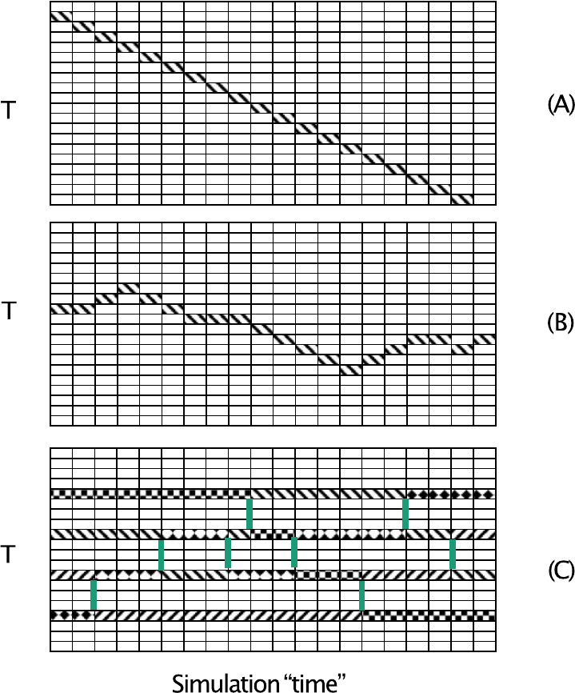
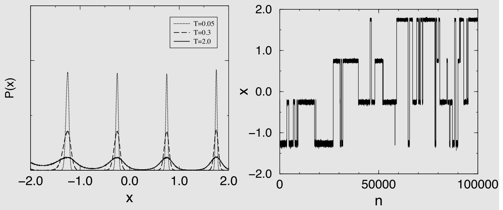
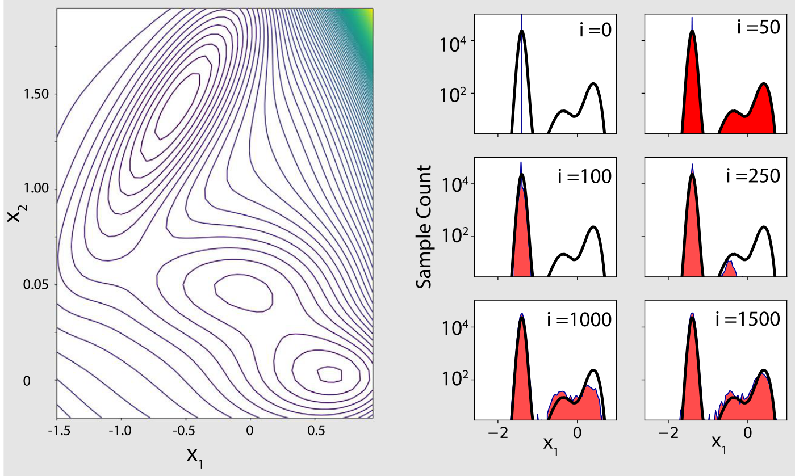
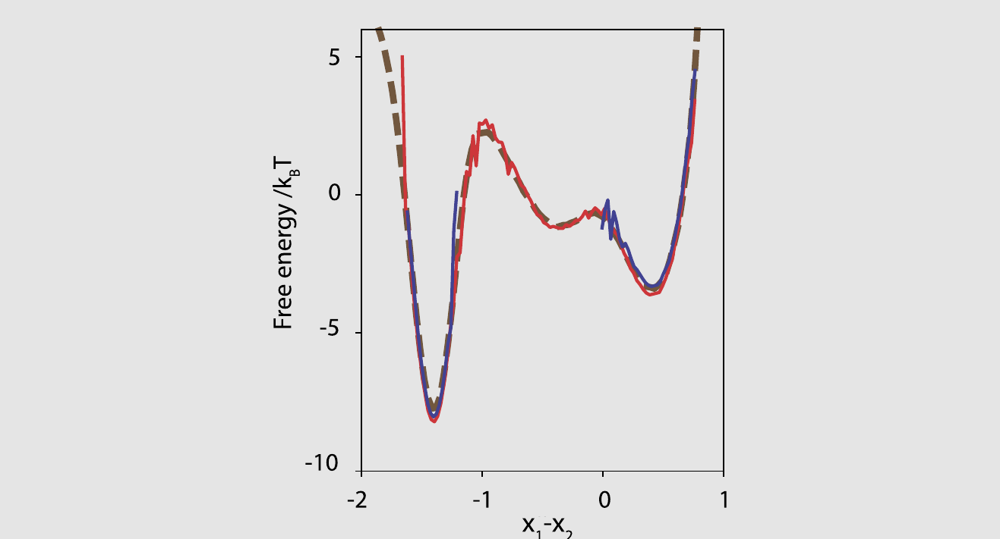

# 加速 Monte Carlo 采样

分子动力学模拟的关键优势在于它们能够生成经典多体系统的物理真实轨迹。而 Monte Carlo 模拟的关键优势恰恰在于它不能。也就是说：MC 模拟可以以与牛顿运动方程不兼容的方式，甚至与布朗动力学不兼容的方式来探索构型空间。如果不是因为这一特点，非晶格系统的 MC 模拟可能早已被淘汰了。

在本章中，我们讨论各种 Monte Carlo 算法，这些算法与简单的 Metropolis 型 MC 模拟相比，可以极大地提高构型空间的探索速度。然而，部分由于强大的模拟软件包的普及，MD 模拟比 MC 模拟的使用要广泛得多，许多最初在 MC 框架下探索的思想随后被移植到 MD 中，并在那里变得比它们的 MC 前身更为人知。对于算法背后思想的讨论，使用 MC 语言更为方便，尽管我们也会提及一些 MD 的后继发展。

## 采样强度变量

我们到目前为止所考虑的 Monte Carlo 模拟被设计用于研究恒定$NVT$、$NPT$或$\mu VT$条件下系统的行为。在这些模拟中，相关的强度热力学变量（$T$、$P$或$\mu$）被保持固定，而系统的微观构型则通过执行改变粒子坐标的 Metropolis MC 移动来探索。此外，对于$NPT$-MC，我们执行改变体积$V$的试探移动；对于$\mu VT$-MC 模拟，我们尝试改变粒子数的移动。

在本章中，我们考虑一类不同的 MC 模拟，其中我们仍然执行粒子移动，但此外我们还执行改变强度变量（如$T$、$P$或$\mu$）的试探移动（见图 13.1）。事实上，正如我们将在下面看到的，这种方法可以扩展到涵盖系统中哈密顿量的其他强度参数，例如决定粒子之间相互作用强度或范围的参数。这类一般性的模拟可以分解为两个子类：一类是我们让单一系统探索强度变量的不同值（例如温度）。

*图 13.1　此图比较了三种不同的 Monte Carlo 方案来耦合在不同控制参数值（本例中：温度$T$）下进行的模拟。面板（A）展示了在模拟退火模拟中（这并非真正的平衡 Monte Carlo 方案），温度如何逐渐降低，使系统能够找到在瞬间淬火中会被遗漏的低能状态。面板（B）展示了在扩展系综模拟中，温度的随机改变是一种有效的 Monte Carlo 试探移动。为确保均匀采样，此类模拟需要精心选择的偏倚。面板（C）展示了平行回火模拟的一个例子。这里我们制备了$n$个不同的系统（图中仅显示 4 个），处于不同的初始温度。除了常规的 Monte Carlo 移动外，我们现在还允许交换分配给不同系统（以不同图案标识）的温度的试探移动。因此，在模拟的每个阶段，我们始终有$n$个系统处于$n$个不同的温度。（图内标注：横轴 Simulation “time” = 模拟“时间”）*

这类模拟被称为扩展系综（Expanded-ensemble）模拟，有时也被称为“扩展系综模拟”[[543]](references.md#ref-543)，原因稍后会清楚。第二类允许我们采样强度变量的算法，考虑了最初制备在$n$个不同温度下的$n$个系统的平行演化。在试探移动中，我们尝试交换两个相邻系统的温度。这类算法有各种名称，其中平行回火（parallel tempering）和副本交换（replica exchange）是最常见的。在接下来的讨论中，我们主要使用“平行回火”这个术语。

在讨论这些算法之前，我们应该回答一个明显的问题：为什么？或者更准确地说：将移动集合扩展到包含强度变量的改变是否有什么优势？简短的回答是：视情况而定。对于大多数 MC 模拟，在强度变量上执行试探移动只会使程序复杂化，而不会提高模拟的质量。然而，在某些情况下，扩展系综模拟可以极大地增强模拟探索可达构型空间的能力——典型的情况是当可达构型空间的不同部分被在感兴趣的温度（或压力，或化学势）下实际上不可逾越的势垒所分隔时。

举一个明确的例子：假设我们希望对非晶固体在低温下进行采样。我们知道非晶固体中的粒子可以以许多不同的方式排列。但在非晶相力学稳定的低温下，正常的 MC 采样不允许系统逃离其原始排列的附近。显然，如果我们加热系统，然后再冷却它，从一个非晶结构移动到下一个将很容易，但通常，这种加热-冷却方案不会以正确的玻尔兹曼权重对状态进行采样。扩展系综模拟允许我们以一种方式实施加热-冷却方案，使得我们采样的系统的所有状态（包括所有中间温度下的状态）都是真正的平衡态。因此，我们采样的所有构型都可以用来计算可观测性质。相比之下，如果我们简单地加热和冷却系统，我们的大多数模拟点将不对应于系统的平衡态。

扩展系综模拟以及平行回火等相关方法存在一个命名问题：这些方法已被多次以略微不同的形式（重新）发现（参见参考文献[[543]](references.md#ref-543)）——所有这些方法都是正确的，但在精神上也非常相似。我们不会试图为许多实现正确采样强度变量的算法提供分类学，而只是区分主要的类别。

为了简单起见，我们首先描述包含系统温度采样的情况。之后，我们快速推广到允许表征系统的某个其他强度参数变化的情况。

### 平行回火

平行回火（Parallel Tempering, PT）方法用于采样强度变量，在精神上最接近原始的马尔可夫链 MC 方法。这种方法已经被以各种形式和各种名称发明和重新发明[[544–548]](references.md#ref-544)，也在分子动力学模拟中以副本交换 MD 的名称被引入[[549]](references.md#ref-549)。在这里，我们将在允许不同温度之间转换的模拟背景下介绍 PT 算法。之后，我们讨论一般情况。

理解 PT 算法最简单的方式是考虑同时进行$n$个$N$粒子系统的模拟。在现阶段，我们假设$V$和$N$都是常数，尽管有时保持$P$或$\mu$（但不能同时）固定更为方便。$n$个平行模拟在我们选择的施加温度$T_1, T_2, \cdots, T_n$的值上有所不同。在现阶段，这些温度的选择仍然是任意的。稍后我们将看到，相邻温度之间的间距应该选择为使得相邻系统中的能量涨落仍然有某种重叠。

到目前为止，我们可以将组合系统简单地视为$n$个非相互作用系统，每个系统处于其自身的温度$T_i$。发现系统 1 处于构型$(\mathbf{r}^N)_1$、系统 2 处于构型$(\mathbf{r}^N)_2$等的概率密度可以直接从式 (2.3.10) 得到：

$$
P\left(\{\mathbf{r}^N\}_1, \{\mathbf{r}^N\}_2, \cdots, \{\mathbf{r}^N\}_n\right) = \frac{\prod_{i=1}^{n} e^{-\beta_i U\left(\{\mathbf{r}^N\}_i\right)}}{\prod_{i=1}^{n} Z(N, V, T_i)}.
\tag{13.1.1}
$$

我们可以用标准的 MC 模拟来研究这个组合系统，其中只允许在相同温度下的两个构型之间进行移动，但显然，这样的模拟与$n$个独立的模拟相比没有任何优势。

现在考虑如果我们允许大规模的粒子交换会发生什么，即我们置换温度为$T_i$和$T_j$的系统的构型。通常，我们随机选择$i$，并选择与$i$相邻的$j$。为了保证微观可逆性，$j < 1$或$j > n$的尝试交换应该被拒绝。这种粒子交换，我们记为$(i, \beta_i), (j, \beta_j) \to (j, \beta_i), (i, \beta_j)$，是一个完全合法的 MC 试探移动。对于这样的试探移动，系统整体的玻尔兹曼权重会改变。将系统$i$的构型记为$\mathbf{i} = \{\mathbf{r}_i^N\}$，细致平衡条件为

$$
\begin{aligned}
&\mathcal{N}(\mathbf{i}, \beta_i) \mathcal{N}(\mathbf{j}, \beta_j) \times \alpha\left((\mathbf{i}, \beta_i), (\mathbf{j}, \beta_j) \to (\mathbf{j}, \beta_i), (\mathbf{i}, \beta_j)\right)  \\
&\qquad \times \mathrm{acc}\left((\mathbf{i}, \beta_i), (\mathbf{j}, \beta_j) \to (\mathbf{j}, \beta_i), (\mathbf{i}, \beta_j)\right)  \\
&= \mathcal{N}(\mathbf{i}, \beta_j) \mathcal{N}(\mathbf{j}, \beta_i) \times \alpha\left((\mathbf{i}, \beta_j), (\mathbf{j}, \beta_i) \to (\mathbf{i}, \beta_i), (\mathbf{j}, \beta_j)\right)  \\
&\qquad \times \mathrm{acc}\left((\mathbf{i}, \beta_j), (\mathbf{j}, \beta_i) \to (\mathbf{i}, \beta_i), (\mathbf{j}, \beta_j)\right).
\end{aligned}
$$

如果我们以这样的方式进行模拟，使得执行特定交换移动的先验概率$\alpha$在所有条件下相等，我们得到如下接受规则

$$
\begin{align}
&\frac{\mathrm{acc}[(\mathbf{i}, \beta_i), (\mathbf{j}, \beta_j) \to (\mathbf{j}, \beta_i), (\mathbf{i}, \beta_j)]}{\mathrm{acc}[(\mathbf{i}, \beta_j), (\mathbf{j}, \beta_i) \to (\mathbf{i}, \beta_i), (\mathbf{j}, \beta_j)]} \notag \\
&\quad = \frac{\exp\left[-\beta_i U(\mathbf{j}) - \beta_j U(\mathbf{i})\right]}{\exp\left[-\beta_i U(\mathbf{i}) - \beta_j U(\mathbf{j})\right]} \notag \\
&\quad = \exp\left[(\beta_i - \beta_j)(U(\mathbf{i}) - U(\mathbf{j}))\right],
\tag{13.1.2}
\end{align}
$$

其中我们定义了$U(\mathbf{i}) \equiv U\left(\{\mathbf{r}^N\}_i\right)$。

需要注意的是，由于我们本来就知道某个构型的总能量，这些交换移动非常廉价，因为它们不涉及额外的计算。

通过这种大规模交换移动，我们可以交换在不同温度下生成的构型，同时维持所有温度$T_i$下的平衡。特别是，我们可以将在较低温度下（平衡较慢）的构型与在较高温度下（正常 MC 采样能够充分采样构型空间）的构型进行交换。

当然，在现实中，我们并不是将粒子从构型$i$移动到$j$，反之亦然。相反，我们所做的是交换（逆）温度$\beta_i$和$\beta_j$。因此，可以将平行回火试探移动解释为尝试改变（置换）强度变量$T$。然而，在计算给定温度$T_i$下的平均值时，以改变恒定温度下系统构型的移动的方式来思考更为方便。对于 PT，将试探移动解释为强度变量的改变只是一个措辞问题。然而，下面我们将讨论扩展系综，那里不存在这种歧义。

???+ example "例 23（单个粒子的平行回火）"

    作为平行回火威力的说明，我们考虑单个粒子在如图 13.2 左图所示的外势中运动：

    $$
    U(x) = \begin{cases}
    \infty & x < -2 \\
    1 \times (1 + \sin(2\pi x)) & -2 \le x \le -1.25 \\
    2 \times (1 + \sin(2\pi x)) & -1.25 \le x \le -0.25 \\
    3 \times (1 + \sin(2\pi x)) & -0.25 \le x \le 0.75 \\
    4 \times (1 + \sin(2\pi x)) & 0.75 \le x \le 1.75 \\
    5 \times (1 + \sin(2\pi x)) & 1.75 \le x \le 2 \\
    \infty & x > 2
    \end{cases}
    \tag{13.1.3}
    $$

    我们最初将粒子放置在最左边的势能阱中，然后首先在三个不同温度（$T = 0.05$、$0.3$和$2.0$）下使用正常的 Metropolis MC。在最低温度（$T = 0.05$）下，粒子在整个模拟过程中实际上被困在其初始势能阱中，而对于最高温度（$T = 2.0$），它可以探索所有的阱。

    接下来我们应用平行回火，即：我们允许三个系统之间的温度交换（见图 13.2）。由于温度交换移动，系统现在在所有三个温度下都快速达到平衡。这种差异在最低温度下的概率分布中尤为明显。

    在目前的平行回火模拟中，我们考虑两种类型的试探移动：

    1. 粒子位移：我们随机选择三个温度之一，并在该温度下对随机选择的粒子执行尝试位移$\delta$，选择均匀分布在$-0.1$和$0.1$之间的随机分布的尝试位移$\delta$。此尝试位移的接受由常规的 Metropolis MC 规则确定
       $$
       \mathrm{acc}(o \to n) = \min\{1, \exp[-\beta (U(n) - U(o))]\}.
       \tag{13.1.4}
       $$
    1. 温度交换。试探移动包括尝试交换两个随机选择的相邻温度（$T_i$和$T_j$）。此试探移动以式 (13.1.2) 给出的概率被接受
       $$
       \mathrm{acc}(o \to n) = \min\left(1, \exp\left[(\beta_i - \beta_j) \times (U_j - U_i)\right]\right).
       \tag{13.1.5}
       $$

    我们可以自由选择位移移动和交换移动的相对速率。在本例中，我们使用 10\%的交换移动和 90\%的粒子位移，如参考文献[[550]](references.md#ref-550)所建议的。然而，请注意其他选择也是可能的。{ 注：甚至存在使用无限交换速率的算法[[551]](references.md#ref-551)，包括温度的所有可能排列。然而，此类算法（参见[[552]](references.md#ref-552)）随不同温度数量的增加扩展性不佳。}从图 13.2 可以看出，平行回火在最低温度下对构型空间的采样有显著的改善。

    更多细节参见 SI（案例研究 21）。

*图 13.2　（左上）势能$U(x)$作为位置$x$的函数。（右上）通过普通 Monte Carlo 模拟获得的不同温度$T$下在位置$x$处找到粒子的概率$P(x)$，以及（左下）使用平行回火的结果。在普通 MC 模拟中，较低温度的系统不能（或几乎不能）越过分隔阱的能垒。（右下）$T = 0.05$时位置$x$随 Monte Carlo 试探移动次数$n$的变化。*

一个明显的问题是：PT 运行需要多少个平行模拟，我们应该如何选择温度间距？一方面，我们希望使用尽可能少的模拟，这意味着选择尽可能大的温度间距。但如果温度间距太大，交换移动的接受率会骤降。一个好的（但可能不是最优的）经验法则是选择相邻温度的间距，使得相邻系统的平均能量间距与这些系统的能量均方根涨落相当。

这个规则允许我们快速估算温度间距。注意，两个被温度间隔$\Delta T$分隔的系统的平均能量差等于$\Delta E \approx C_V \Delta T$，其中$C_V(T)$是系统在温度$T$和体积$V$下的热容。但系统的能量方差也与热容有关（式 (5.1.7)）：

$$
k_B T^2 C_V = \left(\langle E^2 \rangle - \langle E \rangle^2\right).
$$

因此，我们估算$\Delta T$最优值的规则是

$$
\sqrt{k_B T^2 C_V} \approx C_V \Delta T
\tag{13.1.6}
$$

或

$$
\frac{\Delta T}{T} \approx \sqrt{k_B / C_V}.
\tag{13.1.7}
$$

由于热容是广延变量（它与粒子数$N$成比例），式 (13.1.7) 表明$\Delta T / T$按$1/\sqrt{N}$缩放。因此，平行回火随着$N$的增长变得效率更低。

平行回火方法不限于耦合不同温度下的模拟。我们可以将平行回火用于任何强度控制参数——或它们的任意组合。明显的例子是压力$P$或化学势$\mu$（但不能同时）——参见例如参考文献[[553]](references.md#ref-553)。但我们也可以考虑耦合具有不同势能函数的系统的 PT 模拟。为了用一个统一的记号涵盖所有这些情况，我们可以将简单的玻尔兹曼权重$w_B(\mathbf{i}; \beta_i) = \exp[-\beta_i U(\mathbf{i})]$推广为$w(\mathbf{i}; \lambda_i)$，其中$\lambda_i$代表我们打算变化的任何强度变量集合。在这种记号下，交换$\lambda_i$和$\lambda_j$的试探移动的接受概率的广义表达式为：

$$
\frac{\mathrm{acc}[(\mathbf{i}, \lambda_i), (\mathbf{j}, \lambda_j) \to (\mathbf{j}, \lambda_i), (\mathbf{i}, \lambda_j)]}{\mathrm{acc}[(\mathbf{i}, \lambda_j), (\mathbf{j}, \lambda_i) \to (\mathbf{i}, \lambda_i), (\mathbf{j}, \lambda_j)]} = \frac{w(\mathbf{i}; \lambda_j) w(\mathbf{j}; \lambda_i)}{w(\mathbf{i}; \lambda_i) w(\mathbf{j}; \lambda_j)}.
\tag{13.1.8}
$$

采样系统中哈密顿量参数的平行回火模拟的例子包括，例如，Yan 和 de Pablo [[554]](references.md#ref-554)对聚合物混合物的模拟：这些模拟中的强度变量是温度和标记聚合物链的长度（参见例证 13.1.1）。

???+ example "例证 19（平行回火与相平衡）"

    另一个说明平行回火模拟威力的例子是液-汽共存的研究。通常，如果流体被加热到临界温度以上，密度是化学势的单调递增函数。然而，在临界温度以下，宏观流体样品的密度会在化学势越过其共存值（$\mu_{\mathrm{coex}}$）时从类汽值跳变到类液值。在仅包含少量粒子的恒定$\mu VT$模拟中，共存将以不同的方式表现：对于$\mu$远低于$\mu_{\mathrm{coex}}$的情况，流体的密度将在类汽值附近涨落；对于$\mu$远高于$\mu_{\mathrm{coex}}$的情况，流体密度将在类液值附近涨落。然而，接近共存时，系统应该能够同时存在于类汽和类液状态，精确在共存点，密度分布中汽峰和液峰下的面积应该相等，前提是系统能够达到平衡。

    然而，除了在临界点附近的模拟（那里大的密度涨落带来的自由能代价较低[[176,212]](references.md#ref-176)），很少观察到类液和类汽密度之间的转换：在远低于$T_c$的温度下，分隔两个状态的自由能势垒使得平衡过程过于缓慢。

    这就是平行回火可以发挥作用的地方。Yan 和 de Pablo [[553]](references.md#ref-553)在$\mu - T$平面上使用了许多不同点（在他们的例子中是 18 个）的模拟，通过一条接近$T_c$的路径（那里可以发生大的密度涨落）将流体的低温汽支和液支连接起来。由于参考文献[[553]](references.md#ref-553)的方法对$T$和$\mu$都应用了平行回火交换，Yan 和 de Pablo 将此方法称为超平行回火。

    稍微偏离参考文献[[553]](references.md#ref-553)的原始表述，我们将使用逸度$f$来表征系统的化学势。我们回顾一下，流体的逸度可以解释为在相同温度下具有与流体相同化学势的相同分子的假想理想气体的密度：

    $$
    \beta\mu(\beta, \rho) = \ln(\rho) + \beta\mu^{\mathrm{ex}}(\rho, \beta) \equiv \ln f(\rho, \beta),
    $$

    其中我们省略了所有“不感兴趣”的常数。注意在低密度下，$f \to \rho$，正如预期的那样。

    在平行回火移动中，我们交换两个系统的逸度和温度，而不改变任一系统的构型。系统$i$的新构型由$(U_i, N_i, \beta_j, \ln f_j)$表征，而系统$j$的为$(U_j, N_j, \beta_i, \ln f_i)$。此试探移动以如下概率被接受

    $$
    \mathrm{acc}(o \to n) = \min\left(1, \exp\left[(\ln f_j - \ln f_i)(N_i - N_j) - (\beta_j - \beta_i)(U_i - U_j)\right]\right).
    $$

    由于这些平行回火模拟连接了临界点液侧和汽侧的平衡状态点，平衡不再是问题，可以得到密度分布，在接近共存处同时包含液峰和汽峰。

    当然，在此平行回火计算中研究的所有状态点都不会精确位于液-汽共存曲线上。然而，由于我们知道作为$\beta$和$f$函数的密度直方图，我们可以使用第 8.6.11 节中讨论的直方图重加权技术。直方图重加权过程允许我们估计在接近采样点的$f$-$\beta$平面上任意点的密度分布。然后我们可以定位$f$-$\beta$平面上那些在液体密度处找到系统的概率等于在汽体密度处找到它的概率的点（即，重加权直方图中两个峰下的面积相等）。

    如参考文献[[553]](references.md#ref-553)所示，组合的平行温度和直方图重加权技术在确定 Lennard-Jones 流体的共存曲线方面非常高效，前提是选择了一组合适的温度和化学势。使用 Wilding 和 Bruce [[176,212]](references.md#ref-176)的方法，Yan 和 de Pablo 还使用直方图重加权技术来估计液-汽临界点的位置。

    一个密切相关的例子是 Bunker 和 D\"{u}nweg [[555]](references.md#ref-555)的工作，他们使用聚合物链的排除体积作为要采样的强度变量：通常，聚合物构型在致密熔体中的弛豫非常缓慢，但随着聚合物的相互作用减弱，弛豫变得快得多（参见例证 13.1.1）。当然，如果该方案仅用于平衡相互作用的聚合物的熔体，运行额外的“非物理”模拟所带来的开销会使方案更加昂贵。如果可能的话，PT 应该在所有中间强度变量值的信息都有用的情况下使用，例如当 PT 用于计算自由能景观（例如成核势垒[[556]](references.md#ref-556)）的背景下，甚至在执行热力学积分（第 8.4.1 节）时——参见参考文献[[155]](references.md#ref-155)。由于此类计算本身就需要多次模拟，通过添加平行回火移动可以在不增加额外成本的情况下提高采样效率。

???+ example "例证 20（平行回火与聚合物）"

    在平行回火（PT）模拟中，还可以在具有略微不同哈密顿量的系统之间进行交换。在某些情况下，这非常有用。假设系统$i$的温度为$T$，能量为$U_i^{(i)} = \sum_{k>l}^{N} u^{(i)}(r_{kl})$，系统$j$的温度为$T$，能量为$U_j^{(j)} = \sum_{k>l}^{N} u^{(j)}(r_{kl})$，其中$u^{(i)}$和$u^{(j)}$是不同的势能函数。作为平行回火移动，我们可以交换系统$i$和$j$。我们取系统$i$中粒子的位置，并使用系统$j$的分子间势能重新计算能量；该能量记为$U_i^{(j)}$。

    类似地，我们使用系统$i$的分子间势能计算系统$j$的能量，$U_j^{(i)}$。此移动的接受规则为

    $$
    \mathrm{acc}(o \to n) = \min\left(1, \exp\left[-\beta(U_i^{(j)} - U_i^{(i)}) + (U_j^{(i)} + U_j^{(j)})\right]\right).
    $$

    这种类型的平行回火移动可以与涉及温度、压力或化学势的其他移动组合使用。

    Bunker 和 D\"{u}nweg 使用“Hamiltonian”平行回火来模拟长链聚合物。聚合物使用珠-弹簧模型建模，珠之间有纯排斥的 Lennard-Jones 相互作用：

    $$
    U_{\mathrm{pol}}(r) = \begin{cases}
    A - Br^2 & r \le r_{\mathrm{PT}} \\
    4\epsilon\left[\left(\frac{\sigma}{r}\right)^{12} - \left(\frac{\sigma}{r}\right)^{6}\right] & r_{\mathrm{PT}} < r \le 2^{1/6}\sigma \\
    0 & r > 2^{1/6}\sigma
    \end{cases}
    $$

    其中$A$和$B$被选择为使得对于给定的$r_{\mathrm{PT}}$值，势能及其一阶导数是连续的。我们感兴趣的是$r_{\mathrm{PT}} = 0$的模型系统的性质。其他系统仅仅是为了促进平衡而添加的。例如，当$r_{\mathrm{PT}} = 2^{1/6}\sigma$时，核心排斥消失，聚合物链可以相互穿过。在他们的平行回火方案中，Bunker 和 D\"{u}nweg 模拟了具有不同$r_{\mathrm{PT}}$值的多个系统。这种“哈密顿量”平行回火方案的一个缺点是，大部分模拟时间花在物理上不感兴趣的系统上。毕竟，我们只对$r_{\mathrm{PT}} = 0$的系统的热力学行为感兴趣。然而，如参考文献[[555]](references.md#ref-555)所讨论的，由于使用平行回火方案而获得的采样效率的提升仍然足以使该方案具有竞争力。

### 扩展系综

我们在上一节讨论的平行回火方法仍然可以被看作是一种正常的 Monte Carlo 方案，如果我们选择将移动解释为粒子交换，而不是强度变量的交换。现在我们考虑基本试探移动涉及改变强度变量的模拟方法；在下文中，我们以温度为例。

与平行回火类似，扩展系综模拟背后的思想是通过允许系统迁移到其他构型空间可以更高效地探索的热力学条件来加速系统的平衡，同时维持热力学平衡。扩展系综模拟及其前身有许多发明者（参见[[543]](references.md#ref-543)），但“扩展系综方法”这个术语似乎是由 Lyubartsev 等人[[546]](references.md#ref-546)创造的。

此类模拟存在一个概念性问题：对于正常的马尔可夫链 MC 移动，我们可以通过考虑新状态和旧状态的玻尔兹曼权重之比来决定试探移动的接受概率。然而，如果我们改变（比如说）系统的温度，就没有自然的方法来比较概率。我们不能说当我们改变温度时，给定构型的概率会更高还是更低。这种不确定性的根本原因是强度变量不是系统本身的属性，而是外部“储库”的属性。虽然这种情况看起来可能是个问题，但它实际上是一个优势，因为它为我们提供了更多的自由度来调整扩展系综的性质。

与之前一样，我们从系统在给定逆温度$\beta$下的概率分布表达式出发：

$$
P\left(\mathbf{r}^N\right) = \frac{e^{-\beta U\left(\mathbf{r}^N\right)}}{Z(N, V, T)}.
\tag{13.1.9}
$$

接下来，我们允许该系统取一系列温度$T_1, T_2, ..., T_n$。我们现在定义一个加权的扩展构型积分$Z(N, V, \{T\})$为

$$
Z(N, V, \{T\}) \equiv \sum_{i=1}^{n} e^{\eta_i} Z(N, V, T_i).
\tag{13.1.10}
$$

在体积$V$中发现系统处于构型$\mathbf{r}^N$和温度$T_i$的概率为

$$
P\left(\mathbf{r}^N; T_i\right) = \frac{e^{\eta_i} e^{-\beta_i U\left(\mathbf{r}^N\right)}}{\sum_{j=1}^{n} e^{\eta_j} Z(N, V, T_j)}.
\tag{13.1.11}
$$

注意，在此阶段权重因子$e^{\eta_i}$的选择还是开放的。

定义了可以在$n$个不同温度下被找到的系统的概率分布后，我们可以构建改变温度的试探移动的规则。我们遵循通常的方案，要求微观可逆性并施加细致平衡。那么将逆温度从$\beta_i$改变为$\beta_j$的试探移动的接受概率由细致平衡条件给出：

$$
\frac{\mathrm{acc}(i \to j)}{\mathrm{acc}(j \to i)} = \exp\left(\eta_j - \eta_i\right) \exp\left[-(\beta_j - \beta_i) U\left(\mathbf{r}^N\right)\right]
\tag{13.1.12}
$$

注意，如果我们为温度$T_i$的状态计算某个可观测量，我们将获得该温度的正常玻尔兹曼平均值。因此，对于每个温度，我们执行平衡采样。

当然，与平行回火的情况一样，我们可以使用另一种形式的权重函数来采样其他强度变量（参见式 (13.1.8)）。我们在这里不重复相同的步骤，因为只要清楚在下面的讨论中，“温度”代表更广泛的变量类别，这就不增加新内容。

首先要解决的问题是：权重因子$e^{\eta_i}$应该选择什么值？应该注意的是，为$\eta_i$选择的值不影响平衡平均值的值，只影响不同$T_i$状态的采样效率。

最简单的（但不一定是最好的）选择是使所有温度$T_1$到$T_n$被等概率采样。我们注意到在温度$T_i$下以任何构型找到系统的概率为

$$
P(T_i) = \frac{e^{\eta_i} Z(N, V, T_i)}{\sum_{j=1}^{n} e^{\eta_j} Z(N, V, T_j)} = \frac{e^{\eta_i - \beta_i F(N, V, T_i)}}{\sum_{j=1}^{n} e^{\eta_j - \beta_j F(N, V, T)}}.
\tag{13.1.13}
$$

因此，如果我们选择$\eta_i$使得$\eta_i = \beta_i F(N, V, T_i) + \text{常数}$，那么所有$T_i$将等概率出现。我们不必做出这样的选择，但显然，我们不希望使用会使某些温度比其他温度的概率低几个数量级的权重，因为那样这些温度就会被欠采样。

当然，我们不知道自由能$F(N, V, T_i)$的先验值。然而，我们可以利用以下事实做出一个好的初始估计（差一个不重要的常数）：

$$
\left(\frac{\partial \beta F(N, V, T)}{\partial \beta}\right)_{N, V} = E(N, V, T),
\tag{13.1.14}
$$

我们可以在正常的 MC 模拟中计算$E(N, V, T)$。而扩展系综模拟为我们提供了两个状态$i$和$j$之间自由能差的估计。如果我们采样状态$i$和$j$被占据的平衡概率$P(T_i)$和$P(T_j)$，那么我们可以从以下公式估计$F(N, V, T_i) - F(N, V, T_j)$：

$$
\frac{P(T_i)}{P(T_j)} = e^{(\eta_i - \eta_j)} e^{-\beta_i F(N, V, T_i) + \beta_j F(N, V, T_j)}.
\tag{13.1.15}
$$

然而，等概率地填充扩展系综中的所有状态可能不是最优选择。通常，我们希望最大化系统在$T_1$和$T_n$之间“扩散”的速率。更重要的是，在中间状态对应于某个其他强度变量的非物理值的情况下（例如，如果我们考虑分子在系统中的逐步插入，就会出现这种情况），我们可能只对那些具有物理意义的参数值计算准确的平均值感兴趣。在这些条件下，一个更合理的优化准则可能是选择集合$\{\eta_i\}$使其最大化不同物理上有意义的状态之间的“扩散”速率。在这种情况下，最好选择$\eta_i$使得状态$i$的占据数正比于$1/\sqrt{D_i}$，其中$D_i$是强度变量的局部“扩散系数”[[378,557,558]](references.md#ref-378)。显然，$D_i$将取决于改变强度变量的试探移动的接受率以及温度的间距——因此$D_i$可能随$i$强烈变化。

Escobedo 及其合作者比较了扩展系综中优化采样的不同策略，我们建议读者参考他们的工作以获取更多细节[[559–561]](references.md#ref-559)。

## 噪声上的噪声

到目前为止，我们一直假设一旦我们知道了系统中所有粒子的坐标，我们就可以直接评估势能的值。然而，有时计算势能本身需要一个采样过程，因此得到的$U$值会受统计噪声的影响。当然，可以通过更长时间的采样来降低噪声，但令人惊讶的是，这并不总是必要的。Ceperley 和 Dewing [[562]](references.md#ref-562)证明了在某些条件下，即使我们对势能的估计受到随机统计误差的影响，也可能执行构型空间的玻尔兹曼采样。

为方便起见，我们关注正向和反向移动具有等先验概率的情况。在没有噪声的情况下，从状态$o$到新状态$n$（改变势能$\Delta U = U(n) - U(o)$）的试探移动的接受概率如常为

$$
\mathrm{acc}(o \to n) = \min(1, \exp[-\beta \Delta U]).
\tag{13.2.1}
$$

现在假设势能差中存在统计误差，即我们必须基于我们对$\delta = \Delta U + x$的知识来决定从$o$到$n$的试探移动的接受与否，其中$x$描述了我们$\Delta U$估计中的噪声。新的随机变量$\delta$服从某个分布$P(\delta)$，使得$\langle \delta \rangle = \Delta U$。试探移动的接受概率现在取决于$\delta$：$\mathrm{acc}(\delta; o \to n)$。$o$和$n$之间试探移动的平均接受概率为

$$
\mathrm{acc}'(o \to n) = \int \mathrm{d}\delta \, P(\delta) \, \mathrm{acc}(\delta; o \to n).
\tag{13.2.2}
$$

为了获得玻尔兹曼采样，我们要求

$$
\frac{\mathrm{acc}'(o \to n)}{\mathrm{acc}'(n \to o)} = \exp[-\beta \Delta U],
\tag{13.2.3}
$$

这意味着

$$
\int \mathrm{d}\delta \, P(\delta) \, \mathrm{acc}(\delta; o \to n) = \exp[-\beta \Delta U] \int \mathrm{d}\delta \, P(\delta) \, \mathrm{acc}(-\delta; n \to o).
\tag{13.2.4}
$$

一般来说，我们不知道真实的$\Delta U$，也不知道$P(\delta)$，因此我们无法确定$\mathrm{acc}(\delta; n \to o)$。然而，Ceperley 和 Dewing 证明，如果我们假设$P(\delta)$围绕$\Delta U$呈正态分布，方差为$\sigma^2$，那么事情会大大简化。我们唯一需要的额外信息是$\sigma^2$的一个良好估计，它可以直接采样。在这些条件下，选择

$$
\mathrm{acc}(\delta; o \to n) = \min\left(1, \exp\left[-\beta\delta - (\beta\sigma)^2/2\right]\right)
\tag{13.2.5}
$$

将在所有被采样的状态上生成正确的玻尔兹曼分布（如参考文献[[562]](references.md#ref-562)所示）。当然，假设同一个正态分布描述所有对$o$和$n$之间$\delta$围绕$\Delta U$的变化几乎从来不是精确的（尽管通常是合理的）。因此，在计算$\sigma^2$时，检查分布$P(\delta)$是否为正态分布是有用的。

噪声可以以多种方式影响 Monte Carlo 采样。在上面讨论的情况中，我们考虑了能量函数$U$受到随机噪声影响的情况，使得$U$在许多样本上的平均值给出了正确的平均值。在这种情况下，$\langle w \rangle = \langle \exp(-\beta U) \rangle \ne w(\langle U \rangle) = \exp(-\beta \langle U \rangle)$。然而，在某些模拟问题中，权重函数$w$本身受到均值为零的随机噪声的影响。在这种情况下，存在其他采样方案（参见[[563]](references.md#ref-563)）。

## 无拒绝 Monte Carlo

传统的观点是，如果某件事听起来好得令人难以置信，那它可能就不是真的。然而，我们在下面讨论的无拒绝 Monte Carlo 方案既真实又强大，只是它们通常涉及一些计算开销。

### 混合 Monte Carlo

为了说明无拒绝 MC 并不奇怪，我们首先考虑混合 MC（Hybrid MC）的情况。在分子模拟的背景下，混合 MC 方法顾名思义是 MC 和 MD 的混合[[564]](references.md#ref-564)。也就是说：试探移动不是粒子的随机位移，而是通过执行长度为$t$的 MD 模拟生成的粒子的集体位移。其基本思想是一个“好的”（时间可逆的、辛的）MD 算法（例如 Verlet 算法）生成一个完全有效的 MC 试探移动，因为 1）它是可逆的，2）它在相空间中守恒体积，这意味着体积元$\mathrm{d}\Gamma \equiv \mathrm{d}\mathbf{r}^N \mathrm{d}\mathbf{p}^N$在系统的时间演化过程中不发生变化（参见第 4 章和参考文献[[117]](references.md#ref-117)）。

我们现在可以在点$\mathbf{r}^N(0)$处启动一次尝试 MD 运行。为了定义一条轨迹，我们必须根据某个（目前尚未指定的）概率分布$P(\mathbf{p}^N(0))$生成一组初始动量$\mathbf{p}^N(0)$。在指定了$\Gamma(0)$后，我们运行 MD 算法$n$步（$n$的选择可以稍后决定）。经过$n$步后，系统将处于由相空间坐标$\mathbf{r}^N(t), \mathbf{p}^N(t)$表征的状态。

如果我们希望将 MD 用作 MC 试探移动，微观可逆性是必不可少的，这意味着反向移动必须是可能的。这意味着我们必须确保$P(\mathbf{p}^N(t)) \ne 0$。此外，由于反向移动涉及在时刻$t$翻转所有动量后向后运行轨迹，我们要求$P(\mathbf{p}^N)$在所有动量反转下是不变的。在热平衡中，发现系统具有坐标$\mathbf{r}^N$的概率必须正比于$e^{-\beta U\left(\mathbf{r}^N\right)}$。将系统在初始（最终）时刻（$t = 0$）的构型记为$\{i\} \equiv \mathbf{r}^N(0)$，$\{f\} \equiv \mathbf{r}^N(t)$，细致平衡条件（式 (3.2.7)）为

$$
e^{-\beta U(\{i\})} P\left(\mathbf{p}^N(0)\right) \mathrm{acc}(i \to f) = e^{-\beta U(\{f\})} P\left(-\mathbf{p}^N(t)\right) \mathrm{acc}(f \to i).
\tag{13.3.1}
$$

由此可得

$$
\frac{\mathrm{acc}(i \to f)}{\mathrm{acc}(f \to i)} = e^{-\beta[U(\{f\}) - U(\{i\})]} \frac{P\left(\mathbf{p}^N(t)\right)}{P\left(\mathbf{p}^N(0)\right)}.
\tag{13.3.2}
$$

首先考虑 MD 试探移动完美守恒能量的情况。如果我们将总能量$U + K$记为$E$，那么细致平衡条件意味着

$$
\frac{\mathrm{acc}(i \to f)}{\mathrm{acc}(f \to i)} = \frac{e^{+\beta K(\{f\})} P\left(\mathbf{p}^N(t)\right)}{e^{+\beta K(\{i\})} P\left(\mathbf{p}^N(0)\right)}
\tag{13.3.3}
$$

显然，如果我们选择$P(\mathbf{p}^N)$为逆温度$\beta$下的麦克斯韦-玻尔兹曼分布（$P(\mathbf{p}^N) \sim e^{-\beta K(\mathbf{p}^N)}$），那么正向和反向试探移动的接受比将为 1，这意味着我们可以接受 100\%的试探移动。在现实中，MD 模拟中能量不是完美守恒的。如果$E(t) - E(0) = \delta$，那么试探移动的接受比将等于$\exp(-\beta\delta)$。因此，在实践中，我们达不到 100\%的试探移动接受率，但可以接近。

当然，我们可以为$P(\mathbf{p}^N)$选择另一种形式，但通常这样的选择只会导致混合 MC 试探移动的接受率更低。关于混合 MC 方法及相关技术的更多细节，参见参考文献[[21,565–567]](references.md#ref-21)。

### 动力学 Monte Carlo

在第 3 章中，我们将马尔可夫链 Monte Carlo 方法作为计算多体系统平衡性质的一种技术来介绍。然而，Ulam（和 Metropolis）最初的 Monte Carlo 方法首次应用是在模拟事件序列方面（例如中子与凝聚态物质的相互作用）。动力学 Monte Carlo 方法背后的哲学建立在 Ulam 最初的论文之上：一种高效的、无拒绝的工具，用于建模随机事件序列。KMC 方法被多次以不同形式发明，例如在 1960 年代半导体中电子输运的背景下（参见 Jacoboni 和 Reggiani 1983 年的综述[[568]](references.md#ref-568)），在化学动力学的背景下[[569]](references.md#ref-569)（所谓的 Gillespie 算法），以及 Bortz、Kalos 和 Lebowitz [[570]](references.md#ref-570)的公式化，作为一种对具有离散自由度的系统执行玻尔兹曼采样的方法。

与其分别讨论所有这些变体，我们给出一个简化的要点介绍。KMC 中的关键要素是我们考虑不同随机事件（以指标$\alpha$标记）以不同速率$r_\alpha$发生的情况。关键是我们应该能够在知道系统当前状态的情况下先验地评估所有$r_\alpha$。让我们将某事发生的总速率记为$R = \sum_\alpha r_\alpha$。那么系统在时间$t$内不发生任何这些事件的概率为$P_0(t) = \exp(-Rt)$。第一个事件在时刻$t$发生的概率密度为

$$
p_1(t) = R \exp(-Rt).
\tag{13.3.4}
$$

我们的目标是按照式 (13.3.4) 给出的分布生成时间$t_1$，即下一个事件的时间。这可以通过将$t_1$表示为

$$
t_1 = -(1/R) \ln x,
\tag{13.3.5}
$$

来实现，其中$x$是一个在零和 1 之间均匀分布的随机数。一旦我们生成了$t_1$，我们仍然需要决定哪个事件发生。但这同样很直接，因为观察到事件$\alpha$的概率等于$r_\alpha / R$，而且我们知道所有的$r_\alpha$。如果不同过程的数量$N_r$很大，选择特定的$\alpha_r$必须高效地进行，例如使用 Walker 的 Alias 方法[[571]](references.md#ref-571)；一个不错的非数学解释可以在[[572]](references.md#ref-572)中找到。

下一步是执行事件$\alpha$（例如自旋翻转，或散射事件），并重新计算所有可能已改变的$r_\alpha$。然后我们计算到下一个事件的时间，并重复相同的步骤。在 Boltz 曼采样的背景下，事件（例如）是具有不同邻居排列的自旋翻转。为了获得正确的平衡采样，我们应该选择$r_\alpha$与标准（例如 Metropolis）MC 试探移动的接受概率成正比。对于具有少量邻居自旋状态的自旋系统，我们可以容易地根据环境对每个自旋进行分类。

在计算平均值时，连续事件之间的时间间隔很重要。例如，如果我们将系统在间隔$i$期间的能量记为$E_i$，那么总长度$\tau = t_1 + t_2 + \cdots + t_n$的运行的能量估计为

$$
\bar{E} = \tau^{-1} \sum_i E_i t_i.
\tag{13.3.6}
$$

注意，由于此平均值取决于时间的比值，时间单位是不重要的。

由于参考文献[[570]](references.md#ref-570)的算法要求在每次事件时（重新）评估所有$r_\alpha$，计算开销很高。总体而言，该方法在研究时间演化由稀有的、不利的自旋翻转主导的系统的动力学时最为有用。在标准 MC 中，大多数高能试探移动会被拒绝。相比之下，使用参考文献[[570]](references.md#ref-570)的方法，所有移动都被接受，但系统在“高能”构型中花费的时间比在“低能”构型中要少得多（参见例如参考文献[[573]](references.md#ref-573)）。

Gillespie [[569]](references.md#ref-569)提出的 KMC 算法被广泛用于建模随机（生物）化学反应或类似过程。然而，其应用主要超出了本书的范围。

### 采样被拒绝的移动

在标准的马尔可夫链 MC 中，很大一部分试探移动被拒绝。这似乎是浪费的，因为在拒绝试探移动之前，我们已经探测了其终态。然而，如果我们拒绝移动，我们就丢弃了所获得的所有信息，即使终态有被接受的公平机会。令人惊讶的是，可以以一种方式执行 MC 采样，使得在计算热力学平均时，即使是被拒绝的尝试构型中包含的信息也被考虑在内。被拒绝移动的采样由 Ceperley 和 Kalos [[574]](references.md#ref-574)在量子 Monte Carlo 模拟的背景下引入，并在经典 MC 模拟的背景下被重新发现[[575,576]](references.md#ref-575)。

为了推导包含被拒绝状态采样的方法，我们再次考虑从状态$m$到尝试状态$n$的移动概率（参见第 3 章）。状态$m$的玻尔兹曼权重记为$\mathcal{N}(m)$。系统从状态$m$转移到状态$n$的概率为$\pi(m \to n)$，我们缩写为$\pi_{mn}$。$\pi_{mn}$的有效选择应维持平衡分布[[87]](references.md#ref-87)：

$$
\sum_m \mathcal{N}(m) \pi_{mn} = \mathcal{N}(n).
\tag{13.3.7}
$$

通常，我们的目标是计算如下形式的平均值：

$$
\langle A \rangle = \frac{\sum_n \mathcal{N}(n) a_n}{\sum_n \mathcal{N}(n)}.
\tag{13.3.8}
$$

我们现在可以使用式 (13.3.7) 将式 (13.3.8) 写为

$$
\langle A \rangle = \frac{\sum_n \sum_m \mathcal{N}(m) \pi_{mn} a_n}{\sum_n \sum_m \mathcal{N}(m) \pi_{mn}} = \frac{\sum_m \mathcal{N}(m) \sum_n \pi_{mn} a_n}{\sum_m \mathcal{N}(m)},
\tag{13.3.9}
$$

其中，在最后的等式中，我们改变了求和顺序，并使用了$\sum_n \pi_{mn} = 1$的事实。因此，$\langle A \rangle$可以重写为对所有状态$m$的量$\sum_n \pi_{mn} a_n$的玻尔兹曼平均。为了估计$\langle A \rangle$，我们可以使用正常的马尔可夫链在访问的$M$个状态上进行采样

$$
\langle A \rangle = \lim_{M \to \infty} \frac{1}{M} \sum_{n=1}^{M} \left[\sum_m \pi_{nm} a_m\right],
\tag{13.3.10}
$$

其中求和现在遍历访问过的状态$n$。我们现在利用在 Monte Carlo 算法中转移概率$\pi_{nm}$是两个因子乘积的事实：给定系统最初处于状态$n$，试探移动到$m$的先验概率$\alpha_{nm}$以及接受此试探移动的概率$\mathrm{acc}(n \to m)$。

$$
\pi_{nm} = \alpha_{nm} \times \mathrm{acc}(n \to m).
\tag{13.3.11}
$$

有了这个定义，我们对$\langle A \rangle$的估计变为

$$
\langle A \rangle = \lim_{M \to \infty} \frac{1}{M} \sum_{n=1}^{M} \left[\sum_m \alpha_{nm} \times \mathrm{acc}(n \to m) a_m\right].
\tag{13.3.12}
$$

这个表达式仍然不太有用，因为它需要我们计算从$n$出发可以在单次试探移动中到达的所有状态$m$的$a_m$值。在下文中，我们使用以下简写记号：

$$
\langle a \rangle_n \equiv \sum_m \alpha_{nm} \, \mathrm{acc}(n \to m) \, a_m.
\tag{13.3.13}
$$

在模拟中，我们不显式计算$\langle a \rangle_n$，而是利用$\alpha_{nm}$是归一化概率的事实。因此，我们可以通过以概率$\alpha_{nm}$从所有从$n$出发的移动集合中抽取试探移动来估计$\langle a \rangle_n$：

$$
\langle a \rangle_n = \langle \mathrm{acc}(n \to m) a_m \rangle_{\alpha_{nm}}.
\tag{13.3.14}
$$

我们估计$\langle A \rangle$的方案简化为以下采样

$$
\langle A \rangle = \lim_{M \to \infty} \frac{1}{M} \sum_{n=1}^{M} \left[\sum_{m'} \mathrm{acc}(n \to m') a'_{m}\right]
\tag{13.3.15}
$$

其中$m'$是以概率$\alpha_{nm}$生成的状态集合。如果我们使用一个只生成单个候选状态$m$的试探移动的 MC 算法，那么$\langle A \rangle$的表达式变为

$$
\langle A \rangle = \frac{\sum_n \left[(1 - \mathrm{acc}(n \to m')) a_n + \mathrm{acc}(n \to m') a'_{m}\right]}{\sum_n}.
\tag{13.3.16}
$$

这个平均值结合了关于试探移动的“接受”状态和被拒绝状态两者的信息。注意，用于在状态$n$之间生成随机游走的 Monte Carlo 算法不需要与$\pi_{nm}$对应的算法相同。例如，我们可以使用标准的 Metropolis 方法来生成随机游走，但使用对称规则[[577]](references.md#ref-577)

$$
\pi_{mn} = \alpha_{mn} \frac{\mathcal{N}(n)}{\mathcal{N}(n) + \mathcal{N}(m)}
\tag{13.3.17}
$$

来采样$a_m$，在这种情况下可以证明[[578,579]](references.md#ref-578)统计误差必定低于使用标准 Metropolis 采样时的值。当试探移动可以廉价地生成许多可能的终态时，采样被拒绝移动的优势变得更大[[580]](references.md#ref-580)。

## 通过映射增强采样

在第 6.3 节中，我们讨论了恒定$NPT$ MC 方法中的体积改变移动。在这些移动中，我们保持所有质心坐标的标度坐标不变，因此当体积改变时，所有粒子的实际坐标也会改变。这不是我们执行恒定压力 MC 的唯一方式。例如，我们可以有一个由硬壁终止的系统，通过执行作为活塞的壁的尝试位移来改变体积$\Delta V$。在这样的移动中，我们可以保持所有实际坐标不变，但当然，如果活塞与粒子重叠，那么试探移动将被拒绝。即使在模拟密度为$\rho$的理想气体时，也会发生这种拒绝。试探移动产生非重叠构型的概率将以$\min[1, \exp(+\rho \Delta V)]$衰减（膨胀永远不会产生与壁的重叠）。但如果没有检测到这样的重叠，那么接受概率就简单地是$\min[1, \exp(-\beta P \Delta V)]$，它考虑了储库的自由能变化。如果理想气体压力等于储库压力，那么膨胀和压缩试探移动的接受在$\Delta V$上是对称的，移动后的平均体积变化为零，正如预期的那样。相比之下，如果像第 6.3 节那样使用标度坐标，那么所有试探移动都将保证产生不与壁重叠的构型。但那样接受概率中会有一个因子$[(V + \Delta V)/V]^N$（式 (6.3.12)）。这个因子是从非标度坐标到标度坐标变换的雅可比行列式之比[^1]。它是一个纯粹的熵项。

我们展示这个例子，因为它表明 a）试探移动有时可以通过使用坐标标度来提高效率，b）如果我们使用改变从一组参考坐标$(\mathbf{s}^N)$到实际坐标的映射的试探移动，那么新旧雅可比行列式之比最终会出现在接受规则中。

Jarzynski [[581]](references.md#ref-581)探索了如何通过适当选择的坐标变换来改善采样的更一般问题，特别是在估计自由能差的背景下。为说明该方法的要点，设想我们有一个性质清楚、易于采样的 $N$ 粒子参考体系（A），其 $dN$ 个坐标记为 $q$，势能为 $U_A(q)$，玻尔兹曼分布为 $\rho_A(q)$；而我们希望采样的体系 $B$ 具有更难采样的势能函数 $U_B(q')$ 与玻尔兹曼分布 $\rho_B(q')$。最理想的情形是构造一个从 $q$ 到 $q'$ 的坐标变换 $\mathcal{T}$，使得我们对 $A$ 的采样自动给出 $B$ 中所有具有正确玻尔兹曼权重的点。通过采样 $A$ 并从 $q$ 变换到 $q'$ 所生成的概率密度为

$$
\rho(q') \sim \frac{\exp(-\beta \mathcal{U}_A)}{|J|_{\mathcal{T}}},
\tag{13.4.1}
$$

其中 $|J|_{\mathcal{T}} \equiv \left|\dfrac{\partial q'}{\partial q}\right|$ 是从 $q$ 到 $q'$ 变换的雅可比行列式。显然，如果我们能构造出满足 $|J|_{\mathcal{T}} = \rho_A(q)/\rho_B(q')$ 的变换 $\mathcal{T}$，那么对 $A$ 的采样就立刻给出了具有正确玻尔兹曼权重的 $B$ 的采样。一般而言，构造这样一个完美的变换并不可行，因此大量的努力都集中在生成足够好的变换上（但请参见下面的第 13.4.1 节）。不过为便于说明，不妨先考虑一个可以做出精确变换的简单情形。

考虑长度 $L = 1$ 的一维盒子中的单个粒子：这就是我们的体系 $A$。如果盒中的势能是平的，那么在 0 与 1 之间对 $q$ 作均匀随机采样就给出 $A$ 的玻尔兹曼分布。再考虑体系 $B$：一个可以取遍 $0 < q' < \infty$ 的粒子，受外势 $U_B(q') = \kappa q'$ 作用，相应的玻尔兹曼分布为 $\rho_B(q') \sim \exp(-\beta\kappa q')$。为通过坐标变换实现对 $B$ 的正确采样，我们需要

$$
\frac{\partial q'}{\partial q} = C \exp(\beta\kappa q'),
\tag{13.4.2}
$$

其中常数 $C$ 由条件 $\langle q'\rangle = (\beta\kappa)^{-1}$ 确定。容易验证，式 (13.4.2) 意味着[[66]](references.md#ref-66)[^2]

$$
q' = (\beta\kappa)^{-1}\ln(-q).
$$

在这种情形下，对体系 $B$ 的指数分布作 Metropolis 采样，会比对体系 A 的均匀分布作采样更慢。Jarzynski [[581]](references.md#ref-581)证明：对于 A 与 B 都可以是复杂多体体系的一般情形，A 与 B 之间的自由能差 $\Delta F$ 由下式给出

$$
\Delta F = -k_B T \ln\left\langle \mathrm{e}^{-\beta\left[U_B(q') - U_A(q) - \ln J(q)\right]}\right\rangle,
$$

因此，一个满足 $\ln J(q) \approx U_B(q') - U_A(q)$ 的变换将会加快自由能差的估计——前提是 A 容易采样（没有势垒，也没有陷阱）。

Kofke 及其合作者把这一映射方法重新表述，使之适用于范围广泛的采样问题（例如可参见文献[[582]](references.md#ref-582)）。不过，即便在 Kofke 的做法中，构造映射时仍然需要作出物理上合理的近似。

### 机器学习与静态 Monte Carlo 采样的复兴

近年来，若干研究组（见 Noé 等人[[583]](references.md#ref-583)、Wirnsberger 等人[[584]](references.md#ref-584) 以及 Gabrié 等人[[585]](references.md#ref-585)）表明：在我们的直觉可能不够好的场合，用机器学习来构造第 13.4 节所定义的 $q$ 与 $q'$ 之间“好的”可逆映射，具有相当大的前景。

正如第 3.2.1 节所解释的，理想的静态 MC 程序应当以正比于玻尔兹曼权重的概率、在构型空间中生成相互独立的点。$d$ 维空间中 $N$ 个粒子的体系有 $dN$ 个自由度；我们可以把构型的生成看作把 $dN$ 个随机数 $R^{dN} = (R_1,...,R_{dN})$ 映射到 $dN$ 个坐标 $\mathbf{r}^N = (r_1,...,r_{dN})$ 的一个复杂非线性映射。一个平凡的例子是在边长为 $L$ 的立方盒中生成理想气体构型：把单位超立方体内的 $dN$ 个随机标度坐标 $s^N$（即 $0 \leq s_i < 1$）乘以盒长 $L$，就可以生成一个典型构型。

对于有相互作用的体系，上述映射毫无用处：几乎所有构型的玻尔兹曼权重都会消失。问题在于，我们能否定义某个复杂的非线性矢量函数 $F$，使得 $\mathbf{r}^N = F(R_1,\cdots,R_{dN})$，并且所生成构型出现的频率正比于其玻尔兹曼权重。过去这个问题的答案是“不能”，但这一局面正在改变。

在继续之前我们指出，从 $R^{dN}$ 到 $\mathbf{r}^N$ 的映射应当是双射，即：每一组 $dN$ 个随机数应当且仅应当对应构型空间中的一个有效点，反之亦然。在第 13.4 节中，我们描述了利用映射思想来生成玻尔兹曼权重高于随机试探移动所生成构型的 MCMC 试探移动。这类映射通常是凭物理直觉“手工”构造的。但我们的物理直觉不足以设计出这样一种合理的映射：能在一次静态 MC 移动中，以接近其玻尔兹曼权重的概率生成构型。机器学习（ML）正是在此登场：其思想是我们可以训练一个神经网络来执行这样的双射变换。注意，大多数机器学习到的“映射”根本不是双射：通常许多输入会生成同一输出，例如同一个人的许多照片都应识别为同一个体。训练神经网络执行复杂双射变换的一类流行方法称为“归一化流”（normalizing flows）[[586]](references.md#ref-586)。

我们不打算深入该方法的 ML 层面，只对术语作一点说明：之所以用“流”一词，是因为在实践中该映射被实现为一系列变换。随机数原本的归一化概率分布（更常见的是正态分布而非均匀分布），被映射到变换后坐标空间中的一个（可归一化的）概率分布。

为解释接下来发生的事，不妨假定我们把在 $0 \leq R < 1$ 上均匀分布的随机数映射到体系的坐标。原本那个简单的分布通常被称为“潜空间”（latent space）分布。在实际情形中，潜空间分布不是均匀分布而是正态分布。把在 $\mathbf{r}^{dN}$ 中生成的概率分布记为 $P(\mathbf{r}^{dN})$，则

$$
\mathcal{P}\left(\mathcal{R}^{dN}\right)\mathrm{d}\mathcal{R}^{dN} = \mathcal{P}\left(\mathbf{r}^{dN}\right)\mathrm{d}\mathbf{r}^{dN} = \mathcal{P}\left(\mathbf{r}^{dN}\right)J\left(\mathcal{R}^{dN},\mathbf{r}^{dN}\right)\mathrm{d}\mathcal{R}^{dN},
\tag{13.4.3}
$$

其中 $P(R^{dN}) = 1$，$J(R^{dN},\mathbf{r}^{dN})$ 表示从 $R^{dN}$ 到 $\mathbf{r}^{dN}$ 变换的雅可比行列式。我们希望找到一个映射，使 $P(\mathbf{r}^{dN})$ 正比于玻尔兹曼分布 $\exp[-\beta U(\mathbf{r}^{dN})]$，即

$$
\exp\left[-\beta U\left(\mathbf{r}^{dN}\right)\right]J\left(\mathcal{R}^{dN},\mathbf{r}^{dN}\right) = \text{常数}.
\tag{13.4.4}
$$

不失一般性，我们取该常数为 1。于是

$$
\beta U\left(\mathbf{r}^{dN}\right) = \ln J\left(\mathcal{R}^{dN},\mathbf{r}^{dN}\right).
\tag{13.4.5}
$$

用文字表述：训练好的变换应当把点更稠密地映射到势能低的区域（小雅可比行列式 $\leftrightarrow$ 大玻尔兹曼因子），而在别处映射得更稀疏。ML 的任务就是训练一个神经网络，找到近似满足上式的变换；随后我们可以用因子 $\exp[-\beta U(\mathbf{r}^{dN})]/J(R^{dN},\mathbf{r}^{dN})$ 对采样点重新加权，以修正残余的偏差[^3]。如果训练成功，重加权因子应当接近 1。

为训练神经网络，我们需要能够生成若干具有合理玻尔兹曼权重的体系构型。这些构型可以事先生成[[583]](references.md#ref-583)，也可以在线生成[[585]](references.md#ref-585)。此外，训练是双向的：我们训练神经网络，使潜分布中概率大的状态映射到玻尔兹曼权重高的状态；反过来，我们也训练网络，使从实空间到潜分布的逆映射把玻尔兹曼权重高的状态映射到“可能的”参考态。在实践中，常常方便的做法是训练网络以最小化正向与反向 Kullback-Leibler 散度的平均。

有两点值得注意。第一，手工计算雅可比行列式（尤其是对一长串复杂变换）毫无乐趣可言。不过，自动微分的使用（见[[108]](references.md#ref-108)）已使这一问题不再那么令人生畏。第二，雅可比行列式是一个行列式的绝对值。一般而言，计算一个 $M\times M$ 行列式需要 $O(M^3)$ 次运算，这很快就会变得难以承受。然而在某些情形下（例如矩阵是三角矩阵时），计算行列式只是 $O(M)$ 的操作。下面这个技巧（称为“耦合层／耦合流”）可以用来构造保证具有三角雅可比矩阵的映射：在变换序列的每一步，$M$ 个坐标中的一部分（即下标 $1 \leq i \leq k$ 的那些，$k$ 可自行选择）只被映射到自身，因而与其他所有坐标无关。其结果是，雅可比矩阵的前 $k$ 行只在对角线上非零。其余坐标（$k+1 \leq i \leq M$）则按如下方式变换：每个下标为 $i$ 的新坐标是同下标旧坐标以及第一组中全部坐标（$1 \leq i \leq k$）的函数。执行该变换的函数可以是线性的也可以是非线性的，且对每个坐标应当不同；重要的是，它依赖于一组可“学习”的参数。耦合流技巧的净效果是所得矩阵为下三角，计算它只需 $O(M)$ 次运算。在变换序列的每一步，坐标划分为“变换／不变换”两组的方式应当不同。总的雅可比行列式于是就是各部分雅可比行列式之积；在实践中：总雅可比行列式的对数等于各部分雅可比行列式对数之和。

???+ example "例证 21（归一化流与静态 Monte Carlo 采样）"

    Noé 等人[[583]](references.md#ref-583) 在分子模拟的背景下展示了归一化流的潜力。这里我们关注文献[[583]](references.md#ref-583) 所突出的两个特点：1.\ 发现与训练集不同的、具有高玻尔兹曼权重的状态的能力；2.\ 在无需构造两种结构之间过渡路径的情况下，计算给定模型两种或多种不同结构之间自由能差的能力。

    为说明新结构的“发现”，文献[[583]](references.md#ref-583) 考虑了一个简单例子：具有低维 Mueller-Brown 势能面[[588]](references.md#ref-588) 的体系，该势能面包含由高能势垒隔开的两个低能盆地。

    模拟的第一阶段是先在其中一个势能盆地中采样少量状态，并训练网络，使玻尔兹曼权重大的状态对应于潜空间中接近正态分布中心的点，反过来，使潜空间中以高概率生成的点对应于真实能量面上玻尔兹曼权重高的构型。

    由于训练只用到了一个盆地，模拟起初只会在该盆地中找到更多构型。然而经过若干次迭代之后，网络开始找到另一个盆地中的状态，而后者并不在最初的训练集中。在足够多次迭代之后，模拟便重现了该能量面完整的玻尔兹曼分布（见图 13.3）。不过要注意，这是一个简单的低维例子。Gabrié 等人[[585]](references.md#ref-585) 论证说，在具有高维势能面的实际问题中，“未知”盆地的发现是行不通的。

    

    *图 13.3　在能量景观中“发现”一个未包含于映射原始训练集中的盆的例子[[583]](references.md#ref-583)。势能“景观”由 Mueller 势的一个版本给出（左图：见文献[[583]](references.md#ref-583)）。图例中 $I$ 表示迭代次数。初始时（右图：左上）只找到位于一个盆中的原始（单个）状态；在随后的 $O(100)$ 次迭代中探索该原始盆。然而在此之后，其他盆也被找到。约 1500 次迭代后，原体系的完整玻尔兹曼分布得以恢复。注意这是在无需越过沿 $x_2$ 方向两盆之间高能垒的情况下实现的。（图内标注：纵轴 Sample Count = 样本计数；$i$ 为迭代次数）*

    接下来我们考察用归一化流计算自由能差的做法。出发点是如下关系式[[581]](references.md#ref-581)，它把通过双射映射相联系的两个体系 $A$ 与 $B$ 的自由能差 $\Delta F \equiv F_B - F_A$ 表示为

    $$
    e^{-\beta\Delta F} = \frac{Z_B}{Z_A} = \left\langle e^{-\beta[\mathcal{U}_B - \mathcal{U}_A - k_BT\ln J]}\right\rangle_A,
    \tag{13.4.6}
    $$

    其中 $J$ 是从 $A$ 到 $B$ 的映射的雅可比行列式。在我们的情形中，体系 $A$ 由 $dN$ 维正态分布描述，体系 $B$ 则是我们关心的体系。如果映射足够好，我们就能得到上式中平均值的良好估计，从而得到体系的自由能。但这一结果并不局限于单个目标体系 $B$：我们可以有多个目标体系（例如同一模型的不同晶体结构[[584]](references.md#ref-584)）。此时式 (13.4.6) 使我们能够计算不同结构之间的自由能差。不过要注意，文献[[583,589]](references.md#ref-583) 中的自由能计算并未直接使用式 (13.4.6)，而是使用了基于第 8 章所述更精巧方法的变体。

    但我们也可以对映射施加偏倚，从而探索体系 $B$ 作为给定序参数之函数的（朗道）自由能。Noé 等人[[583]](references.md#ref-583) 表明，后一做法给出的自由能剖面与用常规方法（例如伞形采样）所得结果符合良好（见图 13.4）。

    

    *图 13.4　沿 Mueller 势势能景观中对角 $x_1 - x_2$ 方向的自由能剖面（见图 13.3）。图中比较了使用常规（有偏）模拟得到的参考自由能剖面、使用无偏归一化流得到的结果，以及归一化流加偏倚的结果。注意在加入偏倚后，可以恢复出在原始归一化流计算中采样很差的区间内的自由能剖面。本图基于文献[[583]](references.md#ref-583) 的数据。（图内标注：纵轴 Free energy$/k_BT$ = 自由能$/k_BT$）*

    不过要注意，把归一化流用于 Monte Carlo 采样在很大程度上仍是“进行中的工作”。对于更高维的问题（例如液体），从高斯分布出发的映射[[583]](references.md#ref-583) 往往会遇到麻烦：从与目标态更相似的参考态出发构造映射的做法效果更好[[584,585,590]](references.md#ref-584)。

### 团簇移动

达到 100\% 接受率的 Monte Carlo 方案中，最引人注目的例子是基于团簇移动的那些。在这一领域，自本书上一版以来已有重要进展。下面我们描述这些进展背后的一些关键概念，但绝不敢自称完备。

出于教学上的考虑，最好从最早的、能达到 100\% 接受率的团簇移动方案讲起，即所谓的 Swendsen-Wang 方法[[591]](references.md#ref-591)。

#### 格点上的团簇移动

Swendsen-Wang（SW）方案及其后续推广与改进背后的核心思想，是以正比于构型玻尔兹曼权重的概率来生成试探构型。其结果是，随后的试探移动可以被 100\% 接受。我们同样基于细致平衡条件，给出 SW 团簇移动的一个略作简化的推导。考虑一个“旧”构型（用上标 $o$ 标记）和一个“新”构型（用上标 $n$ 标记）。若下式成立，则细致平衡得到满足：

$$
\begin{align}
N(o)&P^o_{\text{Gen}}(\{\text{团簇}\})P^{\{cl\}}(o\to n)\,\mathrm{acc}(o\to n) \nonumber\\
&= \mathcal{N}(n)P^n_{\text{Gen}}(\{\text{团簇}\})P^{\{cl\}}(n\to o)\,\mathrm{acc}(n\to o),
\tag{13.4.7}
\end{align}
$$

其中 $N(o)$ 是旧构型的玻尔兹曼权重，$P^o_{\text{Gen}}(\{\text{团簇}\})$ 表示从体系的旧构型出发生成某个特定团簇的概率，$P^{\{cl\}}(o\to n)$ 是把所生成的团簇从旧状态变到新状态的概率，$\mathrm{acc}(o\to n)$ 则是给定试探移动的接受概率。我们可以从两方面简化上式。首先，我们要求先验概率 $P^{\{cl\}}(o\to n)$ 对正向与反向移动相同。此外，我们希望对正向与反向移动都令 $P_{\text{acc}} = 1$。这未必总能做到，但对我们接下来讨论的简单情形确实可行。于是细致平衡方程变为

$$
\mathcal{N}(o)P^o_{\text{Gen}}(\{\text{团簇}\}) = \mathcal{N}(n)P^n_{\text{Gen}}(\{\text{团簇}\}),
\tag{13.4.8}
$$

即

$$
\frac{P^o_{\text{Gen}}(\{\text{团簇}\})}{P^n_{\text{Gen}}(\{\text{团簇}\})} = \frac{\mathcal{N}(n)}{\mathcal{N}(o)} = \exp(-\beta\Delta \mathcal{U}),
\tag{13.4.9}
$$

其中 $\Delta U$ 是新旧构型的能量差。挑战在于找到一套满足上式的团簇生成规则。为说明其原理，我们考虑 Ising 模型；推广到许多其他格点模型是直截了当的。

**Ising 模型的 Swendsen-Wang 算法**
考虑自旋体系的一个给定构型（维数无关紧要），其中有 $N_p$ 对自旋平行、$N_a$ 对自旋反平行。该构型的总能量为

$$
\mathcal{U} = (N_a - N_p)J,
\tag{13.4.10}
$$

其中 $J$ 表示最近邻相互作用的强度。该构型的玻尔兹曼权重为

$$
N(o) = \exp[-\beta J(N_a - N_p)]/Z,
\tag{13.4.11}
$$

其中 $Z$ 是体系的配分函数。一般来说 $Z$ 是未知的，但这不重要，唯一要紧的是 $Z$ 为常数。接下来，我们按如下规则在自旋对之间建立键，从而构造团簇：

- 如果最近邻是反平行的，它们不相连。
- 如果最近邻是平行的，则它们以概率 $p$ 相连，以概率 $(1-p)$ 不相连。

这里假定 $J$ 为正。若 $J$ 为负（反铁磁相互作用），则平行自旋不相连，而反平行自旋以概率 $p$ 相连。

在我们考虑的情形中共有 $N_p$ 对平行自旋。其中 $n_c$ 对相连、$n_b = N_p - n_c$ 对“断开”的概率为

$$
P^o_{\text{Gen}}(\{\text{团簇}\}) = p^{n_c}(1-p)^{n_b}.
\tag{13.4.12}
$$

注意这是连接（或断开）平行自旋之间所有连接中某个指定子集的概率。一旦选定了相连的键，我们就可以定义体系中的团簇。团簇是一组至少单连通地由键相连的自旋。把这样的团簇数目记为 $M$。我们现在以 50\% 的概率翻转这 $M$ 个团簇中的每一个。团簇翻转之后，平行与反平行自旋对的数目将发生变化，例如

$$
N_p(n) = N_p(o) + \Delta
\tag{13.4.13}
$$

以及（因而）

$$
N_a(n) = N_a(o) - \Delta .
\tag{13.4.14}
$$

因此体系总能量的变化量为 $-2J\Delta$：

$$
\mathcal{U}(n) = \mathcal{U}(o) - 2J\Delta .
\tag{13.4.15}
$$

现在考虑执行反向移动的概率。为此，我们应当生成相同的团簇结构，但此时的出发点是有 $N_p + \Delta$ 对平行自旋、$N_a - \Delta$ 对反平行自旋的构型。与前面一样，反平行自旋对之间的键被认为是断开的（这与相同的团簇结构相容）。我们也知道新的相连键数 $n_c'$ 必定等于 $n_c$，因为生成相同的团簇结构需要相同数目的相连键。差别出现在新构型中平行自旋之间应有多少键被断开（$n_b'$）。由

$$
N_p(n) = n_c' + n_b' = n_c + n_b' = N_p(o) + \Delta = n_c + n_b + \Delta,
\tag{13.4.16}
$$

可知

$$
n_b' = n_b + \Delta .
\tag{13.4.17}
$$

把它代入前面的比值式，就得到

$$
\frac{P^o_{\text{Gen}}(\{\text{团簇}\})}{P^n_{\text{Gen}}(\{\text{团簇}\})} = \frac{p^{n_c}(1-p)^{n_b}}{p^{n_c}(1-p)^{n_b+\Delta}} = (1-p)^{-\Delta} = \frac{\mathcal{N}(n)}{\mathcal{N}(o)} = \exp(2\beta J\Delta).
\tag{13.4.18}
$$

要满足该式，必须有

$$
p = 1 - \exp(-2\beta J),
\tag{13.4.19}
$$

这就是 Swendsen-Wang 规则。

**Wolff 算法**
Swendsen-Wang 算法的大部分计算开销都花在把体系分解为 $M$ 个可以独立翻转的团簇上。从某种意义上说这是杀鸡用牛刀，因为算法准备好了 $M$ 个团簇、可以有 $2^M$ 种不同的翻转方式，而我们只从中选取一种作为试探移动。Wolff [[592]](references.md#ref-592) 提出了一种更高效的团簇移动方案：与其构造所有可翻转的团簇，Wolff 算法随机选取一个自旋，然后用上述定义键的规则构造与该自旋相连的单个团簇。团簇内部所有自旋之间都有键相连，而团簇中没有任何自旋与团簇外的自旋相连。随后这个单一团簇被翻转（接受概率 100\%）。Wolff 团簇可能很小，尤其是在远高于临界点时；此时该算法相对于单自旋移动并不能显著加快涨落的衰减，但这并不严重，因为构造小团簇的代价很低。当体系被冷却到临界温度附近时，Wolff 团簇通常会增大——因而生成代价更高，但翻转它们对涨落的衰减贡献显著。

#### 非格点体系的团簇移动

一个自然的问题是：能否为非格点体系构造 Swendsen-Wang／Wolff 型的无拒绝团簇移动算法？正如下面所解释的，答案是：可以，但是……

先说“可以”。Dress 与 Krauth [[593]](references.md#ref-593) 提出了一种为硬核体系执行大尺度团簇移动的无拒绝算法。这类移动是通过考察某个与周期性边界条件相容的对称操作对粒子坐标的作用来构造的。我们不描述文献[[593]](references.md#ref-593) 原本的（Swendsen-Wang 式）做法，而介绍文献[[594]](references.md#ref-594) 的 Wolff 式做法。

文献[[593]](references.md#ref-593) 的方法不依赖于维数，因此我们用一维例子来说明：长度为 $L$ 的周期性重复线段上的 $N$ 个硬粒子流体。我们考虑一个允许的对称操作：在一维中，这可以是绕随机选定点的反演，或按随机选定距离的平移。不过对于更高维中的 Wolff 团簇，我们还可以考虑其他点对称操作，例如绕某轴的转动（当团簇移动应把整个周期盒映射到自身时，就不能这么做）。无论采用哪种移动，Wolff 团簇都必须足够小，以保证移动之后它不会与原团簇的任何周期像发生相互作用。

我们先把这一对称操作（比如反演）作用于随机选定的“种子”粒子，比如粒子 $i$：结果是 $x_i \to x_i'$，其中 $x_i'$ 是粒子 $i$ 反演后所处的位置。当然，现在位于 $x_i'$ 的粒子 $i$ 有一定概率与一个或多个粒子 $j$ 重叠。若果真如此，我们就把同一对称操作作用于粒子 $j$ 的坐标。由于我们从无重叠的构型出发，若粒子 $i$ 与 $j$ 都经历了该对称操作，它们就不会重叠。然而粒子 $j$ 现在可能与粒子 $k$ 重叠，于是 $k$ 也被反演。这一系列移动可以用“打不过就加入”这句话来描述。

如果流体密度不太高，总会到达某一步不再产生新的重叠，比如在我们反演了团簇中第 $n$ 个粒子的坐标之后。此时我们就可以停止：我们移动了粒子 $i,j,k,\cdots,n$ 组成的团簇而没有产生任何重叠。因此我们可以接受这个试探移动。

该方法的局限在于：对于稠密流体，团簇会穿透周期性边界发生逾渗，从而包含大部分甚至全部粒子。此时这种移动对结构涨落的弛豫毫无贡献。不过同样的问题在 Swendsen-Wang／Wolff 算法中早已存在：在足够低的温度下，被翻转的团簇（几乎）包含全部自旋——此时确实是无拒绝的，但也确实不能加快模拟。

既然已经为硬粒子构造了无拒绝的团簇算法，自然要问：对具有连续相互作用的粒子能否也这样做？答案同样是肯定的。但为解释那个做法，先讨论一个看似无关的方法——提前拒绝法——会更方便[^4]。

### 提前拒绝法

在第 3.4.1 节中我们论证过，硬核体系中 MC 试探移动的最优接受概率应当低于具有连续相互作用的体系。原因在于，在硬核体系的模拟中，一旦检测到一次重叠，我们就可以拒绝该试探移动；而对于连续势，必须算完所有相互作用之后，标准 MC 试探移动才能被接受或拒绝。其结果是，对硬核粒子而言，执行一次以拒绝告终的试探移动，平均比以接受告终的更便宜。这就导致一种奇怪的局面：模拟一个硬核模型竟然比模拟一个具有极陡但连续排斥相互作用的对应模型更便宜。然而人们会期望，即便对于连续势，也应当有可能提前拒绝那些因近乎重叠而付出巨大势能代价、几乎注定失败的试探移动。

幸运的是，我们可以借用 Swendsen-Wang 方案背后的思想，为具有连续分子间势的粒子构造一个判据，使我们能在早期阶段就拒绝“注定失败”的试探移动[[595]](references.md#ref-595)。

为看清这一做法的原理，考虑把粒子 $i$ 试探位移到一个新位置。我们现在以概率

$$
p_{\text{bond}}(i,j) = \max\left[0,\,1-\exp(-\beta\Delta u_{i,j})\right],
\tag{13.4.20}
$$

在该粒子与近邻粒子 $j$ 之间建立“键”，其中 $\Delta u_{i,j} = u_n(i,j) - u_o(i,j)$ 是粒子 $i$ 的试探位移所引起的 $i$ 与 $j$ 相互作用能的变化。如果 $j$ 未与 $i$ 相连，就意味着 $j$ 不会阻挡 $i$ 的移动，我们继续考察下一个近邻 $k$，依此类推。但只要在 $i$ 与它的任一近邻之间形成了键，$i$ 的单粒子移动就被阻挡，我们拒绝该试探移动。只有当粒子 $i$ 与它的所有近邻都没有成键时，我们才接受该试探移动。

不难证明这一方案满足细致平衡。接受从旧位置到新位置移动的概率为

$$
\mathrm{acc}(o\to n) = \prod_{j\neq i}\left[1-p_{\text{bond}}(i,j)\right] = \exp\left[-\beta\sum_{j\neq i}{}^{+}\Delta u_{i,j}(o\to n)\right],
\tag{13.4.21}
$$

其中求和只针对 $\Delta u(i,j)$ 为正的那些粒子 $j$。对反向移动 $n\to o$，我们有

$$
\mathrm{acc}(n\to o) = \prod_{j\neq i}\left[1-p_{\text{bond}}(i,j)\right] = \exp\left[-\beta\sum_{j\neq i}{}^{+}\Delta u_{i,j}(n\to o)\right],
\tag{13.4.22}
$$

求和针对反向移动使能量增加的所有粒子 $j$。此外我们可以写出

$$
\Delta u_{i,j}(n\to o) = -\Delta u_{i,j}(o\to n),
\tag{13.4.23}
$$

于是接受反向移动 $n\to o$ 的概率为

$$
\mathrm{acc}(n\to o) = \exp\left[+\beta\sum_{j\neq i}{}^{-}\Delta u_{i,j}(o\to n)\right],
\tag{13.4.24}
$$

其中求和针对使能量 $u_{i,j}(o\to n)$ 减小的所有粒子 $j$。细致平衡于是要求

$$
\begin{align}
\frac{\mathrm{acc}(o\to n)}{\mathrm{acc}(n\to o)} &= \frac{\exp\left[-\beta\sum_{j\neq i}^{+}\Delta u_{i,j}(o\to n)\right]}{\exp\left[+\beta\sum_{j\neq i}^{-}\Delta u_{i,j}(o\to n)\right]} \nonumber\\
&= \exp\left[-\beta\sum_{j\neq i}\Delta u_{i,j}(o\to n)\right] = \frac{\mathcal{N}(n)}{\mathcal{N}(o)},
\tag{13.4.25}
\end{align}
$$

式 (13.4.25) 表明细致平衡确实得到满足。

把这一方案与原始 Metropolis 算法作比较是有意思的。在成键方案中，即使总能量下降，移动也可能被拒绝。因此，尽管该方案给出的是一个有效的 Monte Carlo 算法，它与 Metropolis 方法并不等价。式 (13.4.20) 保证了：如果一次试探位移把粒子 $i$ 置于 $\Delta u_{ij} \gg 0$ 的极不利位置，那么这两个粒子之间极有可能形成键，因而该试探移动可以被拒绝。

提前拒绝方案并不局限于单粒子移动。事实上，它在应用于复杂的多粒子移动时最为有用，例如下面讨论的团簇移动，或第 12 章讨论的构型偏倚 Monte Carlo 方案。在标准的构型偏倚方案中，必须先“生长”出整个链分子并计算其 Rosenbluth 权重，然后才能接受或拒绝一次试探移动。然而，如果在生长过程中最初的某个链段就被放在了不利位置、使新构型“注定失败”，那么提前拒绝方案就可以让我们不必完成整条聚合物新构型的生长。

#### 提前拒绝与团簇移动

我们可以用上述提前拒绝法，把文献[[593]](references.md#ref-593) 的方法改写成适用于具有连续相互作用之体系的形式（见 Liu 与 Luijten [[594]](references.md#ref-594)）。

考虑上面那种团簇移动。我们现在同样可以定义“键”。如果粒子 $i$ 从 $x_i$ 移动到 $x_i'$，它与位于 $x_j$ 的另一粒子 $j$ 的相互作用将改变 $\Delta u_{i,j} \equiv u_{i',j} - u_{i,j}$，其中 $i'$ 表示粒子 $i$ 位于 $x_i'$ 的情形。显然，若 $\beta\Delta u_{i,j} \gg 1$，该移动将是不利的，除非我们也把粒子 $j$ 纳入与 $i$ 相同的团簇。于是我们可以用式 (13.4.20) 来描述粒子 $i$ 与 $j$ 被“束缚”的概率——在此情形下，这意味着它们经历同一次团簇移动。与前面一样，我们不断把粒子 $j$、$k$ 等加入团簇，直到不再形成新的键为止。然后我们执行团簇移动。正如我们在细致平衡的推导中所示，这种团簇移动满足细致平衡且是无拒绝的。文献[[594]](references.md#ref-594) 的方法对短程相互作用的粒子效果良好。

然而，如果我们试图对具有较长程相互作用的粒子执行团簇移动，就会遇到问题，因为那时必须对大量粒子对计算 $p_{\text{bond}}(i,j)$。

对于较长程的相互作用，原则上我们可以尝试混合团簇移动：用上述做法针对在某个距离 $r_c$ 处截断的对势 $u(r)$ 构造团簇。在尝试团簇移动时，我们再计算 $\Delta U_{\text{LR}}$，即所有其他（想必较弱的）长程相互作用（$r > r_c$）引起的总势能变化。然后用 Metropolis 规则 $\mathrm{acc}(o\to n) = \min[1,\exp(-\beta\Delta U_{\text{LR}})]$ 接受或拒绝团簇移动；当然，这样一来移动就不再是无拒绝的了。

#### 虚拟移动 Monte Carlo

Whitelam 等人[[596,597]](references.md#ref-596) 的虚拟移动 Monte Carlo（Virtual-Move Monte Carlo, VMMC）方法是一种团簇移动方案，其目标是让团簇的运动类似于团簇在溶剂中的扩散运动。基本移动是团簇的平动／转动，但为使动力学更“真实”，团簇被赋予一个与其质量成反比的扩散常数——这既不是近似球形粒子的 Stokes-Einstein 结果，对大多数其他团簇形状也不是。该算法明显比文献[[594]](references.md#ref-594) 的基本团簇算法更复杂。

### 超越细致平衡

到目前为止，我们考虑的都是通过施加不可约性与细致平衡（式 (3.2.7)）而构造的 Monte Carlo 算法。然而正如第 3 章所论证的，有效的 MC 算法只需满足平衡条件（式 (3.2.6)）：细致平衡是过度的要求。

目前大多数常用的 MC 算法满足的是细致平衡而非平衡条件，因为证明一个算法满足平衡往往很微妙。不过，一类新的 MC 算法已经出现，它们不满足细致平衡，而且重要的是，它们对构型空间的探索比 Metropolis 算法高效得多。下面我们讨论所谓的事件链 Monte Carlo（Event Chain Monte Carlo, ECMC）模拟，采用 Krauth 及其合作者[[89,598–601]](references.md#ref-89) 引入的形式，以及 Peters 与 de With [[602]](references.md#ref-602) 提出的一种相关做法。

#### 事件链 Monte Carlo

为在 ECMC 方法的背景下解释平衡条件的概念，我们先考虑文献[[603]](references.md#ref-603) 讨论的一维硬核体系的例子。考虑长度为 $L$ 的线段上 $N$ 个直径为 $\sigma$ 的全同硬粒子，并施加周期性边界条件。粒子坐标记为 $x_1, x_2, \cdots x_i \cdots, x_N$。由于硬核排斥，两个粒子的距离不能小于 $\sigma$。我们还假定粒子不能相互穿越。现在考虑这样的情形：我们试图把随机选中的粒子移动一个随机距离 $\delta x$，$\delta x$ 抽自概率分布 $P(\delta x)$，且当 $\delta x < 0$ 时 $P(\delta x) = 0$。算法维持玻尔兹曼分布的必要条件是它满足平衡条件（式 (3.2.6)）：

$$
\sum_{o'}\mathcal{N}(o')\pi(o'\to n) = \mathcal{N}(n)\sum_{o}\pi(n\to o),
\tag{13.4.26}
$$

这比式 (3.2.7) 给出的细致平衡条件更弱。注意在上式中，流入某个给定状态 $n$ 的状态集合，不必与从状态 $n$ 可以到达的状态集合相同。在硬核相互作用这一特定情形下，所有允许的（无重叠）构型具有相同的玻尔兹曼权重，因此平衡条件意味着

$$
\sum_o \pi(o\to n) = 1,
\tag{13.4.27}
$$

这里我们用到了执行任一允许移动（包括被拒绝的移动）的概率之和必须为 1 这一事实。对于 $N$ 个硬粒子，我们可以例如以概率 $1/N$ 选取其中任一粒子，并试图沿正 $x$ 方向移动它（因为我们已选定 $\delta x > 0$）。这样的算法显然不满足细致平衡，因为反向移动（$\delta x < 0$）被排除了。给定的试探移动——比如把粒子 $i$ 从位置 $x_i' \equiv x_i - \delta x$ 移到（允许的）位置 $x_i$——只有当 $x_i'$ 至少在粒子 $i-1$ 右侧 $\sigma$ 处时才会被接受。但当且仅当该条件不满足时，把位于 $x_{i-1}$ 的粒子移动距离 $\delta x$ 的试探移动就会被拒绝，因为那会与位于 $x_i$ 的粒子产生重叠（粒子按模 $N$ 计数）。此时移动被拒绝，所有粒子停留在原构型。然而在 Monte Carlo 的语言中，一次被拒绝的移动也是一次移动（即从 $o$ 到 $o$）。合起来，进入构型 $x_1, x_2, \cdots x_i \cdots, x_N$ 的概率为

$$
\sum_{i}^{N}\left[\mathrm{acc}(x_i'\to x_i) + (1-\mathrm{acc}(x_{i-1}\to x_i))\right] = 1,
\tag{13.4.28}
$$

因为和式中每一项都等于 $1/N$。对试探移动 $(x_i'\to x_i)$，旧构型是 $x_1, x_2, \cdots x_i - \delta x \cdots, x_N$；而对试探移动 $(x_{i-1}\to x_i)$，旧构型就等于新构型 $x_1, x_2, \cdots x_i \cdots, x_N$。

在上面讨论的例子中，我们只考虑了一种试探移动步长 $\delta x$。然而为保证遍历性，我们需要一个步长分布 $p(\delta x)$，且 $\lim_{\delta x\to 0}p(\delta x) \neq 0$。

正如文献[[603]](references.md#ref-603) 所讨论的，在若干情形下可以证明这种不可逆 MC 算法比 Metropolis 算法更高效地采样构型空间。不过，把它与另一个称为“提升”（lifting）的技巧结合起来，还能使这种不可逆 MC 算法更加强大。为解释提升，我们将采用比文献[[603]](references.md#ref-603) 更少数学化的语言。

到目前为止，我们一直假定 MC 算法中待移动的粒子是随机选取的（见第 3.3.1 节）。然而，这对满足平衡条件并非必要。例如，我们可以给模拟中的粒子附加一个标签 $\omega$，其取值为 0 或 1。只有当 $\omega_i = 1$ 时，才会对粒子 $i$ 尝试试探移动。任一时刻只有一个粒子的 $\omega = 1$。我们现在给 MC 算法加上一条规则：如果粒子 $i$ 的试探移动因会与粒子 $j$ 重叠而被拒绝，那么我们令 $\omega_j = 1$、$\omega_i = 0$。于是下一次移动我们将尝试移动粒子 $j$。这条规则满足平衡吗？其实它可以直接由上面关于一维硬核体系不可逆 MC 算法的讨论得出。设“新”状态是位于 $x_i$ 的粒子 $i$ 可动（$\omega_i = 1$）的状态。与前面一样，我们只考虑长度为 $+\delta x$ 的试探移动以简化问题。体系怎样才可能落入 $x_i$、$\omega_i = 1$ 这一状态？现在只有两种可能：粒子 $i$ 来自位置 $x_i - \delta x$ 且当时 $\omega_i = 1$；或者带有 $\omega_{i-1} = 1$ 的粒子 $i-1$ 的试探移动被拒绝，标签 $\omega = 1$ 被传给了 $i$。而我们已经知道，第一种移动被接受的概率加上第二种移动被拒绝的概率必定为 1。因此这一简单的提升算法满足平衡条件。

现在我们可以对当前活动粒子执行下一次试探移动，依此类推。为保证算法遍历并满足全局平衡，我们应当在给定步数（比如 $M$ 步）之后随机选取一个新的活动粒子。特别重要的是 $\delta x \to 0$ 且 $M \to \infty$、而 $M\delta x \equiv \lambda$ 保持有限的情形。此时 ECMC 算法中的移动就像一场接力赛：一个粒子连续运动，直到撞上另一个粒子；它随即停下，并把“接力棒”（即标签 $\omega = 1$）交给拦住它的那个粒子。这一过程持续下去，直到相继活动粒子所走过的总距离等于 $\lambda$，之后再随机选取新的活动粒子。$\lambda$ 值分布的最优选择在文献[[604]](references.md#ref-604) 中有讨论。

从直觉上不难理解为什么这种算法可能比 Metropolis 算法带来更快的平衡化：在 Metropolis 算法中，密度不均匀性通过扩散衰减，而在高密度区域扩散很慢。相反，在 ECMC 算法中，撞入高密度区域的粒子可以引发一种类似声波的传播穿过该区域，从而使另一个粒子从这个高密度障碍的另一端脱出。显然，如果我们也允许反方向的 ECMC 移动，运动就会变得更加扩散化（尽管仍不像 Metropolis 那样糟），并导致密度涨落更慢地衰减。在更高维中，上述大部分论证保持不变，只是此时在所有空间维度上都采用单向移动是重要的。

ECMC 算法的下一步进展，是把文献[[598]](references.md#ref-598) 的方法推广到具有连续相互作用的体系（早期尝试见[[600,602]](references.md#ref-600)）。对于连续相互作用，粒子 $i$ 试探移动被拒绝这件事，无法唯一地归因于与某个特定粒子的相互作用。解决这一问题的办法在文献[[599,603]](references.md#ref-599) 中有较详细的描述；这里我们只给出一个高度浓缩的说明。

需要注意的关键之处在于：如果我们把粒子 $i$ 的移动分解为无穷小步，那么只要与另一粒子 $j$ 的相互作用在增加，每一小步被拒绝的概率就非零（若与 $j$ 的相互作用能减小，则 $j$ 无法阻止 $i$ 的运动）。当然，无穷小步引起的能量增加本身也是无穷小的，拒绝概率亦然。不过，我们现在可以用式 (13.4.21) 来计算：在粒子 $i$ 沿选定方向 $\hat{e}$ 位移 $s^*$ 之后，与粒子 $j$ 的相互作用导致移动被拒绝的概率为

$$
P_{\text{reject}}(i;j) = 1 - \exp\left[-\beta\int_0^{s_{ij}^*}\mathrm{d}s\left(\frac{\partial u(\mathbf{r}_j - \mathbf{r}_i - s\hat{e})}{\partial s}\right)^{+}\right],
\tag{13.4.29}
$$

其中 $\mathbf{r}_j - \mathbf{r}_i$ 是移动开始时 $i$ 与 $j$ 之间的矢量距离，上标“$+$”表示我们只考虑对势随 $s$ 增大而增加的那些贡献。

把式 (13.3.5) 稍作推广，我们就可以按给出正确拒绝概率的分布来生成 $s_{ij}^*$ 的取值：抽取一个随机数 $0 < R \leq 1$，并求解使

$$
\beta\int_0^{s_{ij}^*}\mathrm{d}s\left(\frac{\partial u(\mathbf{r}_j - \mathbf{r}_i - s\hat{e})}{\partial s}\right)^{+} = -\ln R.
\tag{13.4.30}
$$

成立的 $s_{ij}^*$。在求解距离 $s_{ij}^*$ 时，使用第 3.2.2 节的节俭 Metropolis 算法是有利的。

对于许多简单形式的分子间势，式 (13.4.30) 可以解析求解（或几乎可以）。当然，该方程也可能无解（即当势能减小时，或当即使 $s_{ij}^* \to \infty$ 积分仍小于 $-\ln R$ 时）。在这些情形下，粒子 $j$ 无法阻挡 $i$ 的移动。$s_{ij}^*$ 的计算必须对粒子 $i$ 的所有潜在相互作用伙伴 $j$ 执行。正如下面所解释的，在实践中通常无需显式考虑那些离 $i$ 不很近、因而不太可能阻挡 $i$ 移动的粒子 $j$。

#### 格否决法

避免显式考虑所有粒子对 $ij$ 的一个优雅办法，是文献[[601]](references.md#ref-601) 的格否决（cell-veto）法，文献[[89]](references.md#ref-89) 有更详细的解释。在这一做法中，体系被划分为足够小的格子，使每个格子通常至多包含一个粒子[^5]。设我们选定移动粒子 $i$。我们显式考虑位于 $i$ 所在格子周围各格中的所有其他粒子 $j$；但对于所有更远的格子，我们采取另一种做法：计算“拒绝率”

$$
q(\mathbf{r}_{S_i,S_j}) \equiv \left(\frac{\partial u(\mathbf{r}_{S_j} - \mathbf{r}_{S_i} - s\hat{e})}{\partial s}\right)^{+}
$$

的最大可能值，其中一个粒子位于 $i$ 所在格 $C_i$ 的表面 $S_i$ 上，与位于 $j$ 所在格 $C_j$ 表面 $S_j$ 上的另一粒子相互作用。注意粒子 $i$ 位于 $C_i$ 中任何位置时的真实拒绝率必定更低。为计算这一最大拒绝率 $q_{\max}(C_i,C_j)$，我们必须扫描格 $C_i$ 与 $C_j$ 的表面，找出使拒绝率最大的点对；但这只需在模拟开始时做一次。于是，粒子 $i$ 位移 $s$ 时的拒绝概率有如下上界：

$$
p_{\text{reject}}(s;\mathcal{C}_i,\mathcal{C}_j) = 1 - \exp[-s\,q_{\max}(\mathcal{C}_i,\mathcal{C}_j)].
\tag{13.4.31}
$$

对每个格 $C_j$，我们现在都能算出 $q_{\max}(C_i,C_j)$，即格 $C_j$ 中的粒子能阻挡粒子 $i$ 移动之速率的上限。

接下来，我们把所有这些格的最大拒绝率相加，得到

$$
Q_{\max} \equiv \sum_{C_j} q_{\max}(C_i,C_j),
$$

即粒子 $i$ 在格 $C_i$ 中任意位置时移动被拒绝之速率的上界（注意 $Q_{\max}$ 对所有格都相同：它只依赖于相互作用势的形式与格点几何）。于是位移距离 $s$ 时格拒绝概率的上界为 $1-\exp[-sQ_{\max}]$。

现在我们可以像前面那样进行：用式 (13.4.30) 对所有被显式考虑的（近邻）粒子 $j$ 计算 $s_{ij}^*$，并对“移动可能被其他任一粒子阻挡”的距离计算 $s^*(\text{Cells})$。如果最小的 $s^*$ 对应于某个被显式考虑的粒子 $j$，我们就执行该位移并令粒子 $j$ 成为活动粒子。然而，如果最小的 $s^*$ 源自 $Q_{\max}$，那么我们必须按概率

$$
P(k) = \frac{q_{\max}(C_i,C_k)}{\sum_{C_j}q_{\max}(C_i,C_j)}
$$

选取其中一个格（比如 $k$）。这一选格步骤可以用 Walker 算法[[571]](references.md#ref-571) 在 $O(1)$ 时间内完成。如果该格中有粒子（比如 $k$），我们先用式 (13.4.29) 计算该粒子真正阻挡粒子 $i$ 长度为 $s^*$ 之移动的概率。于是粒子 $i$ 被粒子 $k$ 阻挡的概率为

$$
\frac{P_{\text{reject}}(i;k)}{q_{\max}(C_i,C_k)}.
$$

如果 $i$ 的进一步运动被 $k$ 拒绝，那么 $i$ 移动距离 $s^*$，$k$ 成为活动粒子。然而，如果移动未被粒子 $k$ 阻挡，那么粒子 $i$ 移动距离 $s^*$ 但仍保持为活动粒子。一个特殊情形是 $s^*$ 会把粒子 $i$ 移出其所在格：此时 $i$ 只被移动到（或者说刚好越过）格边界，但仍保持为活动粒子。有一点必须强调：在格否决法中，粒子 $k$ 的所有周期像都应“折叠”到离 $i$ 最近的那个 $k$ 像上。细节见[[89,601]](references.md#ref-89)。

特别重要的是，格否决法可以用来模拟具有极长程（例如库仑）相互作用的体系，此时每一步只需对一个粒子对计算相互作用（见第 11.6.2 节）。更多细节请读者参阅[[89]](references.md#ref-89)。

---

[^1]: 与之前一样，我们写“Jacobi”作为“雅可比矩阵行列式绝对值”的简写。
[^2]: 译注：下式照录原书。按式 (13.4.2) 并结合边界条件 $q = 0 \leftrightarrow q' = 0$ 积分，可得 $q = (\beta\kappa C)^{-1}\left[1 - \mathrm{e}^{-\beta\kappa q'}\right]$；再由 $q$ 在 $[0,1]$ 上均匀分布定出 $C = (\beta\kappa)^{-1}$，于是正确的结果应为 $q' = -(\beta\kappa)^{-1}\ln(1 - q)$。
[^3]: 训练神经网络需要寻找极值而非等式。此时待优化的量是所生成分布与目标分布之间的（正向或反向）Kullback-Leibler 散度[[587]](references.md#ref-587)。当两个分布相等时该散度取极小。分布的归一化并不重要，因为归一化因子的对数是常数。
[^4]: 在本书早先的版本中，提前拒绝法是在另一种背景下介绍的。不过在本章所述算法的背景下，该方法已变得更加重要。
[^5]: 文献[[601]](references.md#ref-601) 说明了当某个格子仍包含多于一个粒子时该怎么办。