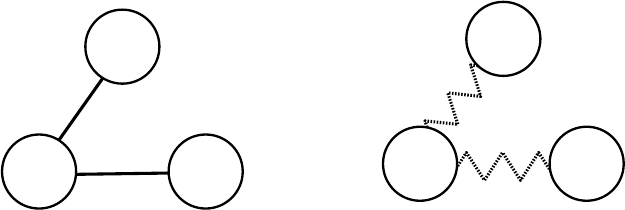
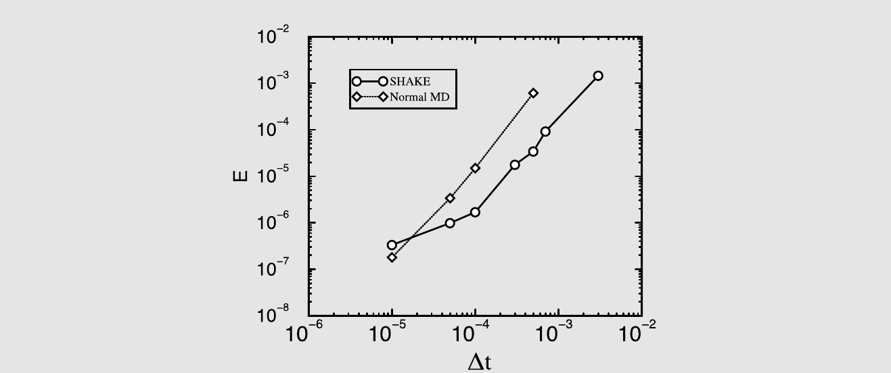
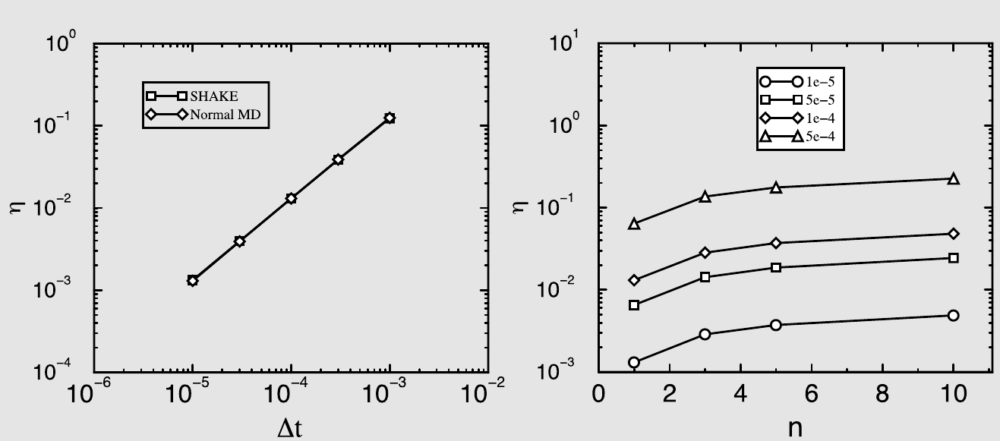

# 分子动力学中的时间尺度分离问题

分子由原子组成。因此，人们可能会认为，只要忽略分子内运动的量子性质是合理的，分子的分子动力学模拟就可以使用模拟非键合原子系统的算法来进行。然而在实践中，通常不建议使用与模拟非键合原子相同的算法来积分分子内部模式的运动方程。原因在于，与分子内运动相关的特征时间尺度通常比同一分子在液体中平移速度的典型退相关时间短10--50倍。

在分子动力学模拟中，时间步长的选择应使其明显短于模拟中最短的相关时间尺度。如果我们显式地模拟分子的分子内动力学，这意味着我们的时间步长应短于最高频分子内振动的周期。这一条件会使分子物质的模拟非常耗时。人们已经发展了多种解决这一问题的技术。在这里，我们将讨论三种方法：约束（constraints）、扩展拉格朗日量（extended Lagrangians）和多重时间步长（multiple-time-step）模拟。

多重时间步长分子动力学 ^[117] 基于这样一个观察：与高频分子内振动相关的力可以使用与积分分子间振动不同的时间步长来高效地积分。另一种方法是将分子中的键（有时也包括键角）视为刚性的。然后在刚性键和键角在模拟过程中不发生变化的约束下求解分子动力学运动方程。这一过程应消除动力学中最高频的模式：与剩余自由度相关的运动假定较慢，因此我们可以在模拟中使用较长的时间步长。下面我们简要解释这种约束在分子动力学模拟中是如何实现的。

此外，我们还将说明扩展拉格朗日量如何用于“在线”（on-the-fly）优化问题。使用扩展拉格朗日量实现此目的的最重要例子是原始的 Car-Parrinello “第一性原理”（ab initio）分子动力学方法 ^[605]。我们将不讨论该技术，因为量子模拟超出了本书的范围。相反，我们将以一个纯经典的优化问题为例，来说明 Car-Parrinello 方法中扩展拉格朗日量方法的应用。

## 约束

对经典运动方程的约束最好用拉格朗日动力学的语言来表达（参见文献 ^[54] 和附录 A）。为了对约束动力学的工作方式有一个直观的了解，让我们考虑一个简单的例子，即一个被约束在半径为 $d$ 的三维球面上运动的单个粒子。约束的形式为：$f(x,y,z) \equiv x^2 + y^2 + z^2 - d^2 = 0$。%
[^1]
无约束粒子的拉格朗日运动方程为（参见附录 A）

$$
\frac{\partial}{\partial t} \frac{\partial \mathcal{L}}{\partial \dot{q}} = \frac{\partial \mathcal{L}}{\partial q}.
\tag{14.1.1}
$$

由于拉格朗日量 $\mathcal{L}$ 等于 $K_{\mathrm{kin}} - U_{\mathrm{pot}}$，无约束粒子的运动方程为

$$
m\ddot{q} = -\frac{\partial U}{\partial q}.
$$

现在，假设我们从位于曲面 $f(x,y,z) = 0$ 上的粒子出发，且粒子初始运动方向与约束曲面相切，即：

$$
\dot{f} = \dot{q} \cdot \nabla f = 0.
$$

在没有任何约束的情况下，粒子将偏离球面，其速度将不再与约束曲面相切。为了使粒子保持在约束曲面上，我们现在施加一个虚拟力（约束力），使得新的速度再次与 $\nabla f$ 垂直。

在多体模拟中，动力学通常需要同时满足多个约束（例如，多个键长）。我们用 $\sigma_1, \sigma_2, \cdots$ 表示描述这些约束的函数。例如，$\sigma_1$ 可以是一个当原子 $i$ 和 $j$ 处于固定距离 $d_{ij}$ 时等于零的函数：

$$
\sigma_1(\mathbf{r}_i, \mathbf{r}_j) = r_{ij}^2 - d_{ij}^2.
$$

我们现在引入一个包含所有约束的新拉格朗日量 $\mathcal{L}'$：

$$
\mathcal{L}' = \mathcal{L} - \sum_{\alpha} \lambda_{\alpha} \sigma_{\alpha}(\mathbf{r}^N),
$$

其中 $\alpha$ 表示约束的集合，$\lambda_{\alpha}$ 表示一组（尚未确定的）拉格朗日乘子。对应于这个新拉格朗日量的运动方程为

$$
\frac{\partial}{\partial t} \frac{\partial \mathcal{L}'}{\partial \dot{q}} = \frac{\partial \mathcal{L}'}{\partial q}
\tag{14.1.2}
$$

或

$$
m_i \ddot{q}_i = -\frac{\partial U}{\partial q_i} - \sum_{\alpha} \lambda_{\alpha} \frac{\partial \sigma_{\alpha}}{\partial q_i} \equiv F_i + \sum_{\alpha} G_i(\alpha).
\tag{14.1.3}
$$

上式的最后一行定义了约束力 $G_{\alpha}$。为了求解拉格朗日乘子集合 $\lambda_{\alpha}$，我们要求所有 $\sigma_{\alpha}$ 的二阶导数为零（我们的初始条件已经选择为使一阶导数为零）：

$$
\frac{\partial \dot{\sigma}_{\alpha}}{\partial t} = \frac{\partial \dot{q} \nabla \sigma_{\alpha}}{\partial t} = \ddot{q} \nabla \sigma_{\alpha} + \dot{q} \dot{q} : \nabla \nabla \sigma_{\alpha} = 0.
\tag{14.1.4}
$$

利用式 (14.1.3)，我们可以将该方程重写为

$$
\begin{aligned}
\frac{\partial \dot{\sigma}_{\alpha}}{\partial t}
&= \sum_{i} \frac{1}{m_i} \left[ F_i + \sum_{\beta} G_i(\beta) \right] \nabla_i \sigma_{\alpha}
   + \sum_{i,j} \dot{q}_i \dot{q}_j \nabla_i \nabla_j \sigma_{\alpha} \\
&= \sum_{i} \frac{1}{m_i} F_i \nabla_i \sigma_{\alpha}
   - \sum_{i} \frac{1}{m_i} \sum_{\beta} \lambda_{\beta} \nabla_i \sigma_{\beta} \nabla_i \sigma_{\alpha}
   + \sum_{i,j} \dot{q}_i \dot{q}_j \nabla_i \nabla_j \sigma_{\alpha} \\
&\equiv F_{\alpha} - \sum_{\beta} M_{\alpha\beta} + T_{\alpha} = 0.
\end{aligned}
\tag{14.1.5}
$$

在式 (14.1.5) 的最后一行中，我们将上一行的方程写成了矩阵记号。该方程的形式解为

$$
\boldsymbol{\lambda} = \mathbf{M}^{-1}(\mathbf{F} + \mathbf{T}).
\tag{14.1.6}
$$

这种在约束存在下拉格朗日运动方程的形式解，不幸的是，几乎没有实际用途。原因在于，在模拟中，我们求解的不是微分方程，而是差分方程。因此，进行精确求解微分方程所需的（耗时的）矩阵求逆没有多大意义，因为这一过程并不能保证约束在差分方程的解中也能被精确满足。

在继续讨论之前，让我们再次考虑在半径为 $d$ 的球面上运动的粒子的简单例子。在这种情况下，我们可以将约束函数 $\sigma$ 写为

$$
\sigma = \frac{1}{2} \left( r^2 - d^2 \right).
$$

引入因子 $1/2$ 是为了使以下方程更简单。约束力 $G$ 等于

$$
G = -\lambda \nabla \sigma = -\lambda \mathbf{r}.
$$

为了求解 $\lambda$，我们要求 $\ddot{\sigma} = 0$：

$$
\frac{\partial}{\partial t} \dot{\sigma} = \frac{\partial}{\partial t} (\dot{\mathbf{r}} \cdot \mathbf{r}) = (\ddot{\mathbf{r}} \cdot \mathbf{r}) + \dot{r}^2 = 0.
\tag{14.1.7}
$$

拉格朗日运动方程为

$$
\ddot{\mathbf{r}} = \frac{1}{m} (F + G) = \frac{1}{m} (F - \lambda \mathbf{r}).
\tag{14.1.8}
$$

为简单起见，我们假设没有外力作用在粒子上（$F = 0$）。将式 (14.1.7) 和 (14.1.8) 结合，得到

$$
-\frac{\lambda}{m} r^2 + \dot{r}^2 = 0.
\tag{14.1.9}
$$

因此

$$
\lambda = \frac{m \dot{r}^2}{r^2},
$$

约束力 $G$ 等于

$$
G = -\lambda \mathbf{r} = -\frac{m \dot{r}^2}{r^2} \mathbf{r}.
$$

回顾一下，在球面上，速度 $\dot{\mathbf{r}}$ 就等于 $\omega \mathbf{r}$。因此我们也可以将约束力写为

$$
G = -m \omega^2 \mathbf{r},
$$

这就是众所周知的向心力表达式。

这个简单的例子有助于我们理解，如果将上述约束力的表达式代入 MD 算法（例如 Verlet 格式）中会出现什么问题。在没有外力的情况下，对于球面上的粒子，我们将得到如下算法：

$$
\mathbf{r}(t + \Delta t) = 2\mathbf{r}(t) - \mathbf{r}(t - \Delta t) - \omega^2 \Delta t^2 \mathbf{r}(t).
$$

约束 $r^2 = d^2$ 被满足的程度如何呢？为了给出一个印象，我们推导一步时间步长后 $r^2$ 的表达式。假设约束在 $t = 0$ 和 $t = -\Delta t$ 时被满足，我们发现在 $t = \Delta t$ 时，

$$
r^2(t + \Delta t) = d^2 \frac{5 + (\omega \Delta t)^4 - 4(\omega \Delta t)^2 + \cos(\omega \Delta t)[2(\omega \Delta t)^2 - 4]}{(\omega \Delta t)^4}
\approx d^2 \left[ 1 - \frac{(\omega \Delta t)^4}{6} + \mathcal{O}(\Delta t^6) \right].
$$

乍一看，这似乎是合理的，约束的破坏程度为 $(\Delta t)^4$ 的量级，这正是 Verlet 格式所预期的。然而，对于质心运动，我们不太担心这种量级的轨迹误差；但在约束的情况下，我们应该担忧。在平移运动中，我们曾论证过，初始接近但随后指数发散的两条轨迹可能仍然都能代表系统中粒子的真实轨迹。然而，如果我们发现由于运动方程积分中的小误差导致数值轨迹与约束曲面指数偏离，那我们就陷入了严重的麻烦。结论是，我们不应依赖算法本身来满足约束（尽管事实上，对于球面上的粒子，Verlet 算法表现得相当好）。我们应该构造我们的算法使得约束被严格满足。

解决这一问题最直接的方法不是通过约束的二阶导数为零的条件来确定拉格朗日乘子 $\lambda$，而是通过约束在一步时间步长后精确满足的条件来确定。对于球面上的粒子，这种方法如下。在约束力存在的情况下，$t + \Delta t$ 时刻的位置方程为

$$
\mathbf{r}(t + \Delta t) = 2\mathbf{r}(t) - \mathbf{r}(t - \Delta t) - \frac{\lambda}{m} \mathbf{r}(t)
= \mathbf{r}^u(t + \Delta t) - \frac{\lambda}{m} \mathbf{r}(t),
$$

其中 $\mathbf{r}^u(t + \Delta t)$ 表示无约束力时粒子的新位置。我们现在要求约束 $r^2 = d^2$ 在 $t + \Delta t$ 时被满足：

$$
d^2 = \left| \mathbf{r}^u(t + \Delta t) - \frac{\lambda}{m} \mathbf{r}(t) \right|^2
= {r^u}^2(t + \Delta t) - \frac{2\lambda}{m} \mathbf{r}(t) \cdot \mathbf{r}^u(t + \Delta t) + \frac{\lambda^2}{m^2} r^2(t).
$$

这个表达式是关于 $\lambda$ 的二次方程，

$$
\frac{\lambda^2}{m^2} d^2 - \frac{2\lambda}{m} \mathbf{r}(t) \cdot \mathbf{r}^u(t + \Delta t) + {r^u}^2(t + \Delta t) - d^2 = 0,
$$

其解为

$$
\lambda = \frac{\mathbf{r}(t) \cdot \mathbf{r}^u(t + \Delta t) - \sqrt{[\mathbf{r}(t) \cdot \mathbf{r}^u(t + \Delta t)]^2 - d^2 [{r^u}^2(t + \Delta t) - d^2]}}{d^2/m}.
$$

对于球面上的粒子这种简单情况，这种方法显然是可行的。然而，对于大量约束的情况，解析求解二次约束方程将变得困难甚至不可能。通过考察约束存在时 Verlet 算法的形式可以看出为什么会这样：

$$
\mathbf{r}_i^{\mathrm{constrained}}(t + \Delta t) = \mathbf{r}_i^{\mathrm{unconstrained}}(t) - \frac{\Delta t^2}{m_i} \sum_{k=1}^{\ell} \lambda_k \nabla_i \sigma_k(t).
\tag{14.1.10}
$$

如果我们在时间 $t + \Delta t$ 满足约束，则 $\sigma_k^c(t + \Delta t) = 0$。但如果系统沿无约束轨迹运动，约束在 $t + \Delta t$ 时不会被满足。我们假设可以对约束进行 Taylor 展开：

$$
\sigma_k^c(t + \Delta t) = \sigma_k^u(t + \Delta t) + \sum_{i=1}^{N} \left. \frac{\partial \sigma_k}{\partial \mathbf{r}_i} \right|_{\mathbf{r}^u(t+\Delta t)} \cdot [\mathbf{r}_i^c(t + \Delta t) - \mathbf{r}_i^u(t + \Delta t)] + \mathcal{O}(\Delta t^4).
\tag{14.1.11}
$$

将式 (14.1.10) 中的 $\mathbf{r}_i^u - \mathbf{r}_i^c$ 代入式 (14.1.11)，得到

$$
\sigma_k^u(t + \Delta t) = \sum_{i=1}^{N} \frac{\Delta t^2}{m_i} \sum_{k'=1}^{\ell} \nabla_i \sigma_k(t + \Delta t) \nabla_i \sigma_{k'}(t) \lambda_{k'}.
\tag{14.1.12}
$$

注意到式 (14.1.12) 具有矩阵方程的结构：

$$
\boldsymbol{\sigma}^u(t + \Delta t) = \Delta t^2 \mathbf{M} \boldsymbol{\lambda}.
\tag{14.1.13}
$$

通过矩阵求逆，我们可以求解向量 $\boldsymbol{\lambda}$。然而，由于我们在式 (14.1.11) 中截断了 Taylor 展开，我们应该在修正后的位置重新计算 $\sigma$，然后迭代上述方程直至收敛。

虽然这里概述的方法是可行的，但计算上并不廉价，因为每次迭代都需要进行矩阵求逆。因此，在实践中，人们通常使用更简单的迭代方案来满足约束。在这种称为 SHAKE ^[606] 的方案中，前面描述的迭代过程不是同时应用于所有约束，而是依次应用于每个约束。具体来说，我们对 $\sigma_k$ 使用式 (14.1.11) 的 Taylor 展开，但将 $\mathbf{r}_i^c - \mathbf{r}_i^u$ 近似为

$$
\mathbf{r}_i^c(t + \Delta t) - \mathbf{r}_i^u(t) \approx -\frac{\Delta t^2}{m_i} \lambda_k \nabla_i \sigma_k(t).
\tag{14.1.14}
$$

将式 (14.1.14) 代入式 (14.1.11)，得到

$$
\sigma_k^u(t + \Delta t) = \frac{\Delta t^2 \lambda_k}{\sum_{i=1}^{N} \frac{1}{m_i} \nabla_i \sigma_k(t + \Delta t) \nabla_i \sigma_k(t)},
\tag{14.1.15}
$$

因此我们对 $\lambda_k$ 的估计为

$$
\lambda_k \Delta t^2 = \frac{\sigma_k^u(t + \Delta t)}{\sum_{i=1}^{N} \frac{1}{m_i} \nabla_i \sigma_k(t + \Delta t) \nabla_i \sigma_k(t)}.
\tag{14.1.16}
$$

在模拟中，我们在一次迭代循环中依次处理所有约束，然后重复该过程直到所有约束都收敛到所需的精度以内。上述约束动力学的实现基于普通的（位置）Verlet 算法（式 (4.2.3)）。Andersen ^[607] 展示了如何在使用速度 Verlet 算法（式 (4.3.4) 和 (4.3.5)）的 MD 模拟中施加约束，而 De Leeuw 等人 ^[608] 展示了如何将约束动力学问题转化为哈密顿形式。

计算约束的导数并不总是一件愉快的工作，特别是当被约束的量是许多粒子坐标的复杂函数时，例如约束序参量的情况（参见第 15.2.1 节）。在这种情况下，使用自动微分（Automatic Differentiation）（参见例如文献 ^[108]）可能会变得有优势。

### 约束平均与无约束平均

到目前为止，我们将约束动力学作为一种建模具有刚性内部键的分子运动的方便方案来介绍。使用约束动力学的优势在于，当与刚性自由度相关的高频振动被消除后，我们可以在分子动力学算法中使用更长的时间步长。然而，有些令人惊讶的是，约束模拟的结果取决于约束是如何施加的：正如 Fixman ^[97] 所指出的，使用在拉格朗日运动方程中引入的硬约束的模拟，与约束由任意刚性但非刚性键表示的模拟，不会给出相同的平均值。下面我们复现 Van Kampen ^[98] 的论证，表明在全柔性的三聚体（参见图 14.1）的键角分布情况下，硬约束和软约束会得到不同的表达式。



*图 14.1　具有键长 $d$ 和内键角 $\psi$ 的对称三聚体。（左）键由无限刚性弹簧表示；（右）键由三聚体拉格朗日运动方程中的硬约束表示。*

我们希望固定键长 $r_{12}$ 和 $r_{23}$。这可以通过两种方式实现。一种是在三聚体的拉格朗日运动方程中施加约束 $r_{12}^2 = d^2$ 和 $r_{23}^2 = d^2$。另一种是通过谐振弹簧连接三聚体中的原子，使得

$$
U_{\mathrm{Harmonic}} = \frac{\alpha}{2} \left[ (r_{12} - d)^2 + (r_{23} - d)^2 \right].
$$

直觉上，人们可能期望 $\alpha \to \infty$ 的极限等价于硬约束动力学，但事实并非如此。实际上，如果我们考察 $P(\psi)$，即内角 $\psi$ 的分布，我们发现

$$
\begin{align}
P(\psi) &= c \sin \psi \qquad \text{（谐振力）} \tag{14.1.17} \\
P(\psi) &= c \sin \psi \sqrt{1 - (\cos \psi)^2/4} \qquad \text{（硬约束）}. \notag
\end{align}
$$

接下来，我们简要说明“硬”约束和“软”约束在行为上存在这种差异的根源。为此，我们从系统的拉格朗日量 $\mathcal{L} = K - U$ 出发。到目前为止，我们一直用原子的笛卡尔速度和坐标来表示系统的动能（$K$）和势能（$U$）。然而，当我们讨论键和键角，或者任何其他需要保持不变的坐标函数时，使用广义坐标更为方便，记为 $q$。我们选择广义坐标使得每一个需要约束的量对应于一个单独的广义坐标。我们用 $q_H$ 表示描述那些实际上或严格固定的量的广义坐标集合。剩余的软坐标记为 $q_S$。势能函数 $U$ 是 $q_H$ 和 $q_S$ 的函数：

$$
U(q) = U(q_H, q_S).
$$

如果我们严格固定硬坐标使得 $q_H = \sigma$，则势能是 $q_S$ 的函数，同时参数依赖于 $\sigma$：

$$
U_{\mathrm{hard}}(q_S) = U_{\mathrm{soft}}(\sigma, q_S).
$$

现在让我们用这些广义坐标来表示拉格朗日量：

$$
\mathcal{L} = \sum_{i=1}^{N} \frac{1}{2} m_i \dot{\mathbf{r}}_i^2 - U
= \sum_{i=1}^{N} \frac{1}{2} m_i \dot{q}_{\alpha} \frac{\partial \mathbf{r}_i}{\partial q_{\alpha}} \cdot \frac{\partial \mathbf{r}_i}{\partial q_{\beta}} \dot{q}_{\beta} - U
\equiv \frac{1}{2} \dot{\mathbf{q}} \cdot \mathbf{G} \cdot \dot{\mathbf{q}} - U,
\tag{14.1.18}
$$

其中式 (14.1.18) 的最后一行定义了质量加权度量张量 $\mathbf{G}$。现在我们可以写出广义动量的表达式：

$$
p_{\alpha} \equiv \frac{\partial \mathcal{L}}{\partial \dot{q}_{\alpha}} = G_{\alpha\beta} \dot{q}_{\beta},
\tag{14.1.19}
$$

其中对重复指标 $\beta$ 求和。接下来，我们可以将哈密顿量 $H$ 写为广义坐标和动量的函数：

$$
H = \frac{1}{2} \mathbf{p} \cdot \mathbf{G}^{-1} \cdot \mathbf{p} + U(q).
$$

一旦我们有了哈密顿量，就可以写出决定所有热力学平均的平衡相空间密度表达式。虽然可以在微正则系综（恒定 $N$、$V$、$E$）中写出所有平均的表达式，但这实际上不太方便。因此，我们将考虑正则系综平均（恒定 $N$、$V$、$T$）。用广义坐标和动量来表示正则分布函数是很直接的：

$$
\rho(\mathbf{p}, \mathbf{q}) = \frac{\exp[-\beta H(\mathbf{p}, \mathbf{q})]}{Q_{NVT}}
\tag{14.1.20}
$$

其中

$$
Q_{NVT} = \int \mathrm{d}\mathbf{p}\, \mathrm{d}\mathbf{q}\, \exp[-\beta H(\mathbf{p}, \mathbf{q})].
\tag{14.1.21}
$$

我们可以用这种简单形式写出式 (14.1.20) 的原因是，从笛卡尔坐标到广义坐标的变换的雅可比行列式为 1。

现在让我们来看仅作为 $q$ 的函数的正则概率分布函数：

$$
\rho(\mathbf{q}) = c \int \mathrm{d}\mathbf{p}\, \exp\{-\beta[\mathbf{p} \cdot \mathbf{G}^{-1} \cdot \mathbf{p}/2 + U(\mathbf{q})]\}
= c' \exp[-\beta U(\mathbf{q})] \sqrt{|\mathbf{G}|},
\tag{14.1.22}
$$

其中 $|\mathbf{G}|$ 表示 $\mathbf{G}$ 行列式的绝对值，$c$ 和 $c'$ 是归一化常数。

到目前为止，我们还没有提到约束。我们只是将正则分布函数从一组相空间坐标变换到另一组。显然，结果不会依赖于我们对这些坐标的选择。但现在我们引入约束。也就是说，在我们的拉格朗日量 (14.1.18) 中，我们去除由硬坐标动力学贡献的动能部分；即，我们设 $\dot{q}_H = 0$，并在势能函数中用参数 $\sigma$ 替换坐标 $q_H$。带约束系统的拉格朗日量为

$$
\mathcal{L}_H = \sum_{i=1}^{N} \frac{1}{2} m_i \dot{\mathbf{r}}_i^2 - U
= \sum_{i=1}^{N} \frac{1}{2} m_i \dot{q}_{\alpha}^S \frac{\partial \mathbf{r}_i}{\partial q_{\alpha}^S} \cdot \frac{\partial \mathbf{r}_i}{\partial q_{\beta}^S} \dot{q}_{\beta}^S - U(q_S, \boldsymbol{\sigma})
\equiv \frac{1}{2} \dot{\mathbf{q}}_S \cdot \mathbf{G}_S \cdot \dot{\mathbf{q}}_S - U(q_S, \boldsymbol{\sigma}).
\tag{14.1.23}
$$

注意变量数从 $3N$ 减少到 $3N - \ell$，其中 $\ell$ 是约束的数目。约束系统的哈密顿量为

$$
H_H = \frac{1}{2} \mathbf{p}_S \cdot \mathbf{G}_S^{-1} \cdot \mathbf{p}_S + U(q_S, \boldsymbol{\sigma}),
\tag{14.1.24}
$$

其中

$$
p_{\alpha}^S \equiv \frac{\partial \mathcal{L}}{\partial \dot{q}_{\alpha}^S}.
$$

和之前一样，我们可以写出相空间密度。在这种情况下，最方便的做法是直接将密度写为广义坐标和动量的函数：

$$
\rho(\mathbf{p}_S, \mathbf{q}_S) = \frac{\exp[-\beta H(\mathbf{p}_S, \mathbf{q}_S)]}{Q_{NVT}^S}.
$$

现在让我们写出坐标空间中的概率密度：

$$
\rho(\mathbf{q}_S) = a \int \mathrm{d}\mathbf{p}_S\, \exp\{-\beta[\mathbf{p}_S \cdot \mathbf{G}_S \cdot \mathbf{p}_S/2 + U(\mathbf{q}_S, \boldsymbol{\sigma})]\}
= a' \exp[-\beta U(\mathbf{q}_S, \boldsymbol{\sigma})] \sqrt{|\mathbf{G}_S|},
\tag{14.1.25}
$$

$$
\tag{14.1.26}
$$

其中 $a$ 和 $a'$ 是归一化常数。现在将此表达式与如果使用非常刚性弹簧来施加约束时将得到的结果进行比较。在这种情况下，我们需要使用式 (14.1.22)。对于 $q_H = \sigma$，式 (14.1.22) 预测

$$
\rho(\mathbf{q}_S) = c' \exp[-\beta U(\mathbf{q}_S, \boldsymbol{\sigma})] \sqrt{|\mathbf{G}|},
\tag{14.1.27}
$$

这与式 (14.1.26) 给出的结果不同。忽略常数因子，约束系统和无约束系统中概率的比值由下式给出

$$
\frac{\rho(\mathbf{q}_S)}{\rho(\mathbf{q}_S, q_H = \sigma)} = \frac{\sqrt{|\mathbf{G}_S|}}{\sqrt{|\mathbf{G}|}}.
$$

这意味着，如果我们在硬约束系统中进行模拟，并希望预测“刚性弹簧”约束系统的平均性质，那么我们必须计算带有权重因子 $\sqrt{|\mathbf{G}|}/\sqrt{|\mathbf{G}_S|}$ 的加权平均，以补偿约束系统分布函数中的偏差。

幸运的是，计算比值 $|\mathbf{G}|/|\mathbf{G}_S|$ 通常比单独计算 $|\mathbf{G}|$ 和 $|\mathbf{G}_S|$ 更容易。为了看到这一点，考虑 $\mathbf{G}$ 的逆矩阵

$$
G_{\alpha\beta}^{-1} = \sum_{i=1}^{N} m_i^{-1} \frac{\partial q_{\alpha}}{\partial \mathbf{r}_i} \cdot \frac{\partial q_{\beta}}{\partial \mathbf{r}_i}.
$$

容易验证这确实是 $\mathbf{G}$ 的逆矩阵：

$$
G_{\alpha\beta} G_{\beta\gamma}^{-1} = \sum_{i,j=1}^{N} m_i \frac{\partial \mathbf{r}_i}{\partial q_{\alpha}} \cdot \frac{\partial \mathbf{r}_i}{\partial q_{\beta}} \frac{\partial q_{\beta}}{\partial \mathbf{r}_j} \cdot \frac{\partial q_{\gamma}}{\partial \mathbf{r}_j} m_j^{-1}
= \sum_{i=1}^{N} \frac{\partial \mathbf{r}_i}{\partial q_{\alpha}} \cdot \frac{\partial q_{\gamma}}{\partial \mathbf{r}_i} = \delta_{\alpha\gamma}.
\tag{14.1.28}
$$

现在，让我们将矩阵 $\mathbf{G}$ 和 $\mathbf{G}^{-1}$ 写成分块形式

$$
\mathbf{G} = \begin{pmatrix} \mathbf{G}_S & \mathbf{A}_{SH} \\ \mathbf{A}_{HS} & \mathbf{A}_{HH} \end{pmatrix}
\tag{14.1.29}
$$

和

$$
\mathbf{G}^{-1} = \begin{pmatrix} \mathbf{B}_{SS} & \mathbf{B}_{SH} \\ \mathbf{B}_{HS} & \mathbf{H} \end{pmatrix},
\tag{14.1.30}
$$

其中下标 $S$ 和 $H$ 分别表示软坐标和硬坐标。子矩阵 $\mathbf{H}$ 就是 $\mathbf{G}^{-1}$ 中对约束导数的二次型部分：

$$
H_{\alpha\beta} = \sum_{i=1}^{N} m_i^{-1} \frac{\partial \sigma_{\alpha}}{\partial \mathbf{r}_i} \cdot \frac{\partial \sigma_{\beta}}{\partial \mathbf{r}_i}.
$$

现在我们构造如下矩阵 $\mathbf{X}$。我们取 $\mathbf{G}$ 的前 $3N - \ell$ 列，并用单位矩阵的最后 $\ell$ 列来完成它：

$$
\mathbf{X} = \begin{pmatrix} \mathbf{G}_S & \mathbf{0} \\ \mathbf{A}_{HS} & \mathbf{I} \end{pmatrix}.
\tag{14.1.31}
$$

从 $\mathbf{X}$ 的分块结构可以明显看出，$\mathbf{X}$ 的行列式等于 $\mathbf{G}_S$ 的行列式。接下来，我们将 $\mathbf{X}$ 乘以 $\mathbf{G}\mathbf{G}^{-1}$，即单位矩阵。直接的分块矩阵乘法表明

$$
\mathbf{G}^{-1}\mathbf{X} = \begin{pmatrix} \mathbf{I} & \mathbf{B}_{SH} \\ \mathbf{0} & \mathbf{H} \end{pmatrix}.
\tag{14.1.32}
$$

因此，

$$
|\mathbf{X}| = |\mathbf{G}_S| = |\mathbf{G}\mathbf{G}^{-1}\mathbf{X}| = |\mathbf{G}||\mathbf{H}|.
\tag{14.1.33}
$$

最终结果是

$$
\frac{|\mathbf{G}|}{|\mathbf{G}_S|} = |\mathbf{H}|.
\tag{14.1.34}
$$

因此我们可以写出约束系统和无约束系统坐标空间密度之间的如下关系：

$$
\rho_{\mathrm{flex}}(\mathbf{q}) = |\mathbf{H}|^{-1/2} \rho_{\mathrm{hard}}(\mathbf{q}).
\tag{14.1.35}
$$

这个表达式的优势在于，我们用一个 $\ell \times \ell$ 矩阵的行列式表示了一个 $3N \times 3N$ 矩阵和一个 $(3N - \ell) \times (3N - \ell)$ 矩阵行列式的比值。在许多情况下，这大大简化了权重因子的计算。

作为一个实际例子，让我们考虑本节开头讨论的柔性三聚体的情况。我们有两个约束：

$$
\begin{aligned}
\sigma_1 &= r_{12}^2 - d^2 = 0 \\
\sigma_2 &= r_{23}^2 - d^2 = 0.
\end{aligned}
$$

如果所有三个原子具有相同的质量 $m$，我们可以将 $|\mathbf{H}|$ 写为

$$
|\mathbf{H}| = \frac{1}{m^2}
\begin{vmatrix}
\sum_i \dfrac{\partial \sigma_1}{\partial \mathbf{r}_i} \cdot \dfrac{\partial \sigma_1}{\partial \mathbf{r}_i}
& \sum_i \dfrac{\partial \sigma_2}{\partial \mathbf{r}_i} \cdot \dfrac{\partial \sigma_1}{\partial \mathbf{r}_i} \\[1em]
\sum_i \dfrac{\partial \sigma_1}{\partial \mathbf{r}_i} \cdot \dfrac{\partial \sigma_2}{\partial \mathbf{r}_i}
& \sum_i \dfrac{\partial \sigma_2}{\partial \mathbf{r}_i} \cdot \dfrac{\partial \sigma_2}{\partial \mathbf{r}_i}
\end{vmatrix}.
$$

将 $\sigma_1$ 和 $\sigma_2$ 的表达式代入，我们发现

$$
|\mathbf{H}| = \frac{1}{m^2}
\begin{vmatrix}
2\mathbf{r}_{12}^2 & -\mathbf{r}_{12} \cdot \mathbf{r}_{23} \\
-\mathbf{r}_{12} \cdot \mathbf{r}_{23} & 2\mathbf{r}_{23}^2
\end{vmatrix}.
$$

利用 $\mathbf{r}_{12}^2 = \mathbf{r}_{23}^2 = d^2$ 这一事实，得到

$$
|\mathbf{H}| = \frac{8}{m^2} \left[ \mathbf{r}_{12}^2 \mathbf{r}_{23}^2 - (\mathbf{r}_{12} \cdot \mathbf{r}_{23})^2 \right]^{1/4}
= \frac{8d^4}{m} \left( 1 - \frac{\cos^2 \psi}{4} \right)^{1/4}.
\tag{14.1.36}
$$

最后，我们恢复了式 (14.1.17) 中约束系统和无约束系统概率密度的比值：

$$
\frac{\rho_{\mathrm{flex}}}{\rho_{\mathrm{hard}}} = |\mathbf{H}|^{1/2} = c\sqrt{1 - \frac{\cos^2 \psi}{4}}.
\tag{14.1.37}
$$

该比值在 1 到 0.866 之间变化，即最多约 15\%。值得注意的是，一般情况下，该比值取决于参与约束的粒子的质量。例如，如果三聚体的中间原子比两个端原子轻得多，则 $|\mathbf{H}|$ 变为 $\sqrt{1 - \cos^2 \psi} = |\sin \psi|$，硬约束引起的修正就不小了。然而，客观地看，我们应当补充说明，至少对于分子动力学模拟中最常用的键长约束类型，硬约束对分布函数的影响似乎相对较小。

一个明显的问题是：哪种描述是正确的？有些令人沮丧的是，对于分子内键，答案是“两者都不是”。原因是刚性键倾向于具有较高的振动频率，不能用经典力学来描述。在其他情况下（例如，对序参量的约束），答案是：两种方法都可以使用，只要它们不被混用。

### 超越键约束

上面关于约束动力学的讨论相当一般化，但主要集中在约束具有简单几何解释（即键长）的情况下。有许多约束的例子不具有简单的几何解释。一个常见的例子是在序参量或反应坐标被保持固定的条件下进行模拟。这种应用在研究分子动力学穿越自由能能垒的背景下非常重要 ^[609]（参见第 15 章）。它在计算自由能差异时也很有用：当我们改变表征系统的序参量（比如总偶极矩）从 $Q_A$ 到 $Q_B$ 时，自由能的变化等于逆着共轭约束力 $f(Q)$ 改变序参量所需的可逆功：

$$
\Delta F = w_{\mathrm{rev}} = -\int_{Q_A}^{Q_B} \mathrm{d}Q\, f(q).
$$

在上一节中，我们看到有两种不完全等价的施加约束的方法：1）在拉格朗日运动方程中包含 $\sigma = 0$ 类型的完整约束，或 2）通过在哈密顿量中用刚性（通常是谐振的）项（一种“限制”（restraint））来近似约束：

$$
H = H_{\mathrm{unconstrained}} + (1/2)\kappa \sigma^2.
$$

在第二种情况下，沿限制方向的小振荡仍然是可能的，并且它们具有相关的动能。事实上，能量均分定理将每个受限自由度的平均动能固定为 $k_B T/2$。对于谐振限制，与限制相关的平均势能也由能量均分定理确定。由于这种刚性谐振限制的热化非常缓慢，通常需要将受限自由度耦合到单独的恒温器。此外，通常将此恒温器的温度设置得较低，以最小化约束中的波动。

不具有简单几何解释的约束的一个典型例子出现在原始的 Car-Parrinello 第一性原理分子动力学方案中 ^[605]。在标准的第一性原理 MD 中，密度泛函理论（DFT）对电子能量的估计应处于最小值。在 DFT 中，电子能量参数依赖于表征 Kohn-Sham 轨道的系数（例如，平面波振幅）。显然，这些振幅没有简单的几何解释，但它们由以下条件固定：Kohn-Sham 轨道是正交归一的，能量处于最小值，且积分电子密度是常数。

在早期的 Car-Parrinello 方法中，这些约束的一部分——即保持 Kohn-Sham 轨道正交归一的部分——是通过在拉格朗日运动方程中作为完整约束来实现的。然而，将能量限制在最小值附近是通过将平面波振幅作为坐标来实现的，并赋予其（虚拟的）质量和相关的动量。因此，系统永远不会精确地处于其 DFT 基态，但非常接近。在这方面，Car 和 Parrinello 的方法类似于 Andersen ^[607] 和 Nos\'e ^[248] 使用的方法：它使用扩展拉格朗日量，而不是拉格朗日运动方程上的完整约束。然而，我们强调这只是其中一种选择：替代方案是使用完整约束 ^[610]。

下面，我们简要讨论 Car-Parrinello 风格的方法来“在线”近似复杂约束，因为这种方法被广泛用于经典应用。关于 Car-Parrinello 方法在电子结构计算中的更多细节，我们推荐读者参考 Marx 和 Hutter 的著作 ^[611] 以及关于该主题的许多早期综述文章（参见例如文献 ^[612,613,614]）。

## 在线优化

在 Car-Parrinello 方法中，电子密度围绕其最优（绝热）值波动。尽管在每一步中系统并不精确地处于其电子基态，但电子不会对原子核施加系统的拖曳力，因此较慢的核动力学仍然是正确的。

“第一性原理”分子动力学的一个密切的经典类比是 L\"owen 等人 ^[615,616] 开发的模拟聚电解质胶体悬浮液中反离子屏蔽的方法。在文献 ^[615] 的方法中，反离子由经典密度泛函理论描述，并使用扩展拉格朗日方法来保持反离子的自由能接近其最小值。

这里我们考虑将 Car-Parrinello 方法应用于经典系统的一个稍简单的例子。和之前一样，该方法的目的是用扩展动力学方案替代迭代优化过程。作为一个具体例子，我们考虑点极化分子流体。这些分子具有我们未指定的静态电荷分布（例如，我们可以处理离子、偶极子或四极子）。我们用 $\alpha$ 表示分子的极化率。该系统的总能量为

$$
U = U_0 + U_{\mathrm{pol}},
$$

其中 $U_0$ 是不涉及极化的势能部分。感应能量 $U_{\mathrm{pol}}$ 由下式给出 ^[617]

$$
U_{\mathrm{pol}} = -\sum_{i} \mathbf{E}_i \cdot \boldsymbol{\mu}_i + \frac{1}{2\alpha} \sum_{i} (\boldsymbol{\mu}_i)^2,
$$

其中 $\mathbf{E}_i$ 是作用在粒子 $i$ 上的局部电场，$\boldsymbol{\mu}_i$ 是该电场在粒子 $i$ 上感应的偶极矩。当然，局部场取决于系统中所有其他电荷的值。例如，在偶极分子的情况下，

$$
\mathbf{E}_i = \mathbf{T}_{ij} \cdot \boldsymbol{\mu}_j^{\mathrm{tot}},
$$

其中 $\mathbf{T}_{ij}$ 是偶极-偶极张量，$\boldsymbol{\mu}_j^{\mathrm{tot}}$ 是分子 $j$ 的总（即永久加感应）偶极矩。我们假设感应偶极子绝热地跟随原子核运动，并且 $U_{\mathrm{pol}}$ 总是处于其最小值。将 $U_{\mathrm{pol}}$ 对 $\boldsymbol{\mu}_i$ 求最小值得到

$$
\boldsymbol{\mu}_i = \alpha \mathbf{E}_i.
\tag{14.2.1}
$$

因此，为了正确地考虑 $N$ 粒子系统的分子极化率，我们需要在每个时间步求解一组 $3N$ 个线性方程。如果我们迭代求解这组方程，必须确保解已完全收敛，否则局部场将对感应偶极子施加系统的拖曳力，系统将无法守恒能量。

现在让我们考虑 Car-Parrinello 方法对这个优化问题的处理。将这种扩展拉格朗日方法应用于极化分子是由 Rahman 及其合作者 ^[618] 和 Sprik 与 Klein ^[619] 提出的。Wilson 和 807 ^[620] 随后倡导了一种密切相关的方法。基本思想是将感应偶极子的大小作为拉格朗日量中的额外动力学变量：

$$
\mathcal{L}(\mathbf{r}, \boldsymbol{\mu}) = \sum_{i=1}^{N} \frac{1}{2} m \dot{\mathbf{r}}_i^2 + \sum_{i=1}^{N} \frac{1}{2} M \dot{\boldsymbol{\mu}}_i^2 - U,
\tag{14.2.2}
$$

其中 $M$ 是与偶极子运动相关的质量。这个拉格朗日量给出以下偶极矩的运动方程：

$$
M \ddot{\boldsymbol{\mu}}_i \equiv \frac{\partial \mathcal{L}}{\partial \boldsymbol{\mu}_i} = -\frac{\boldsymbol{\mu}_i}{\alpha} + \mathbf{E}_i.
$$

该方程的右边可以看作是作用在偶极子上的广义力。当这个力精确为零时，就恢复了迭代方案。如果与偶极子动能相关的温度足够低，偶极子将在其最低能量构型附近波动。更重要的是，偶极子上不会有系统的拖曳力，因此系统的能量不会漂移。

为了确保感应偶极子确实接近其基态构型，我们应该保持感应偶极子自由度的温度较低。但同时，偶极子应该能够快速（绝热地）适应原子核坐标的变化，以确保在模拟过程中最小能量的条件得到维持。这意味着与感应偶极子相关的质量应该很小。总之，我们要求

$$
\frac{T_{\mu}}{M} \ll \frac{T_r}{m},
$$

其中感应偶极子的温度定义为

$$
T_{\mu} = \sum_{i=1}^{N} \frac{1}{2} M \dot{\boldsymbol{\mu}}_i^2,
$$

而平移温度以通常的方式与动能相关

$$
T_r = \sum_{i=1}^{N} \frac{1}{2} m \dot{\mathbf{r}}_i^2.
$$

感应偶极子的温度应远低于平移温度的条件似乎产生了一个问题，因为在普通模拟中，感应偶极矩与平移运动之间的耦合会导致热交换。这种热交换将持续进行，直到感应偶极子的温度等于平移温度。因此，似乎我们无法独立于平移温度来固定感应偶极子的温度。然而，这里我们可以再次利用恒温器。Sprik 和 Klein ^[619] 表明，可以使用两个独立的 Nos\'e-Hoover 恒温器：一个用于施加位置的温度，另一个用于施加极化的（低）温度 ^[621]。与感应偶极子相关的质量 $M$ 的选择应使得极化的弛豫时间与液体中最快的弛豫具有相同的量级。

如上所述，扩展拉格朗日方法只是解决复杂“非几何”约束问题的一种方式。Coretti 等人 ^[622] 和 Bonella 等人 ^[610] 提出了另一种方法。虽然后一种方法从扩展拉格朗日的图像出发，但不同之处在于它考虑了受限变量动力学的相关质量趋于零的极限。在这个极限下，限制变成约束，并使用通常的约束技术（例如 SHAKE）来维持约束。这种方法的一个明显优势是不需要对非物理坐标的动力学进行恒温：它们被物理坐标严格约束。似乎许多现在使用扩展拉格朗日的应用都可以重新表述为使用零质量限制动力学的形式。

## 多重时间步长方法

处理多原子分子高频振动模式的另一种方案基于经典运动方程的 Trotter 展开刘维尔表示（式 (4.3.18)）。这里的思想不仅是分离坐标和动量的传播，而且将高频模式的传播分解为许多更短的时间步，同时为低频模式保持较长的时间步。为了实现这种分离，我们将粒子上的力分为两部分：

$$
\mathbf{F} = \mathbf{F}_{\mathrm{short}} + \mathbf{F}_{\mathrm{long}}.
$$

这种划分是任意的，但对于我们的双原子分子，我们可以将势能分为负责键振动的短程相互作用和原子间的长程吸引力。核心思想是，在原子振动的时间尺度上，势能的长程部分几乎不发生变化，因此这种“昂贵的势能”不需要像势能的“廉价”短程部分那样频繁更新。这表明应该使用多个时间步：对振动使用短时间步，对其余相互作用使用长得多的时间步。

Martyna 等人 ^[126] 使用刘维尔形式来求解使用多个时间步的运动方程。在我们的讨论中，我们考虑 $NVE$ 系综。关于如何在其他系综中使用多个时间步的详细信息，请参阅文献 ^[126]。让我们从简单的情况开始，推导受力为 $F$ 的单个粒子的运动方程。该系统的刘维尔算符（$iL$）为式 (4.3.12)：

$$
iL = iL_r + iL_p = v \frac{\partial}{\partial r} + \frac{F}{m} \frac{\partial}{\partial v}.
$$

运动方程由应用时间步为 $\Delta t$ 的 Trotter 公式 (4.3.18) 得出：

$$
e^{iL\Delta t} \approx e^{iL_p \Delta t/2} e^{iL_r \Delta t} e^{iL_p \Delta t/2}.
$$

时刻 $t$ 的位置和速度由在初始条件 $(r(0), v(0))$ 下应用刘维尔算符得到。如第 4.3.4 节所示，$iL_r \Delta t$ 对应于坐标的移动，$iL_p \Delta t$ 对应于动量的移动。如果我们分三步执行这些操作，得到

$$
e^{iL\Delta t} f[\dot{r}(0), r(0)] = e^{iL_p \Delta t/2} e^{iL_r \Delta t} e^{iL_p \Delta t/2} f[\dot{r}(0), r(0)]
= e^{iL_p \Delta t/2} e^{iL_r \Delta t} f[\dot{r}(0) + F(0)\Delta t/2m, r(0)]
$$

$$
= e^{iL_p \Delta t/2} f[\dot{r}(0) + F(0)\Delta t/2m, r(0) + \dot{r}(\Delta t/2)\Delta t]
= f[\dot{r}(0) + F(0)\Delta t/2m + F(\Delta t)\Delta t/2m,\, r(0) + \dot{r}(\Delta t/2)\Delta t].
$$

由此得到的运动方程为

$$
\dot{r}(\Delta t) = \dot{r}(0) + \frac{\Delta t}{2m}[F(0) + F(\Delta t)]
$$

$$
r(\Delta t) = r(0) + \dot{r}(\Delta t/2)\Delta t,
$$

读者会认出这就是速度 Verlet 方程（参见第 4.3.4 节）。

???+ example "例 24（多重时间步长与约束的比较）"

    在这个示例中，我们考虑一个双原子 Lennard-Jones 分子系统。我们比较两种模型：第一种模型使用分子中两个原子之间的固定键长 $l_0$。在第二种模型中，我们使用如下键伸缩势：

    $$
    U_{\mathrm{bond}}(l) = \frac{1}{2} k_b (l - l_0)^2,
    $$

    其中 $l$ 是分子中两个原子之间的距离。在模拟中，我们使用 $k_b = 50000$ 和 $l_0 = 1$。除键伸缩势外，所有非键合原子通过 Lennard-Jones 势相互作用。双原子分子的总数为 125，盒子长度为 7.0（使用通常的约化单位）。Lennard-Jones 势在 $r_c = 3.0$ 处截断，$T = 3.0$。第一种模型使用键约束来求解运动方程，而第二种模型使用多重时间步长。所有模拟都在 $NVE$ 系综中进行。

    比较这两种方法求解运动方程所能使用的最大时间步长是很有趣的。作为运动方程求解精度的度量，我们计算初始能量的平均偏差，其由 Martyna 等人 ^[623] 定义为

    $$
    \mathcal{E} = \frac{1}{N_{\mathrm{step}}} \sum_{i=1}^{N_{\mathrm{step}}} \left| \frac{E(i\Delta t) - E(0)}{E(0)} \right|,
    $$

    其中 $E(i)$ 是时刻 $i$ 的总能量。

    对于键约束，我们使用 SHAKE 算法 ^[606]（另见第 14.1 节）。在 SHAKE 算法中，键长通过迭代方案精确固定在 $l_0$。图 14.2 显示了能量涨落随时间步长的变化。通常人们容忍 $\mathcal{E}$ 中 $\mathcal{O}(10^{-5})$ 的噪声水平，这对于第一种模型对应的时间步长为 $2 \times 10^{-4}$。这应该与使用第二种模型的单时间步长分子动力学模拟进行比较。类似能量噪声水平可以用 $9 \times 10^{-5}$ 的时间步长获得，后者小了 2 倍。

    

    *图 14.2　使用谐振键势的普通 MD 模拟与使用 SHAKE 算法的约束 MD 模拟的能量涨落随时间步长变化的比较。*

    为了应用多重时间步长算法，我们必须将分子间力分为短程部分和长程部分。在短程部分中，我们包括键伸缩势和 Lennard-Jones 势的短程部分。为了对 Lennard-Jones 势进行分割，我们使用一个简单的切换函数 $S(r)$：

    $$
    \begin{aligned}
    U_{\mathrm{LJ}}(r) &= U^{\mathrm{short}}(r) + U^{\mathrm{long}}(r) \\
    U^{\mathrm{short}}(r) &= S(r) \times U_{\mathrm{LJ}}(r) \\
    U^{\mathrm{long}}(r) &= [1 - S(r)] U_{\mathrm{LJ}}(r),
    \end{aligned}
    $$

    其中

    $$
    S(r) = \begin{cases}
    1 & 0 < r < r_c - \lambda \\
    1 + \gamma^2(2\gamma - 3) & r_c - \lambda < r < r_m \\
    0 & r_m < r < r_c
    \end{cases}
    $$

    且

    $$
    \gamma = \frac{r - r_m + \lambda}{\lambda}.
    \tag{14.3.1}
    $$

    实际上，还有其他方法来分割总势能函数 ^[624,625]。我们选择了 $\lambda = 0.3$ 和 $r_m = 1.7$。为了节省 CPU 时间，我们制作了所有彼此接近的原子的列表（详见附录 I）；因此短程力的计算可以非常高效地完成。对于 $10^{-5}$ 的噪声水平，可以使用 $\delta t = 10^{-4}$ 和 $n = 10$，得到 $\Delta t = 10^{-3}$。

    为了以一致的方式比较不同的算法，我们在图 14.3 中比较了各种技术的效率。效率 $\eta$ 定义为模拟长度（时间步长乘以积分布数）除以所使用的 CPU 时间。在图中，我们绘制了图 14.2 中所有模拟的 $\eta$。对于 $10^{-5}$ 的能量噪声水平，SHAKE 算法的效率是普通 MD（$n = 1$）的两倍。这意味着在 SHAKE 程序中几乎没有花费任何 CPU 时间。然而，MTS 算法在相同效率下仍然快两倍（$n = 10$，$\delta t = 10^{-4}$）。

    

    *图 14.3　键约束（SHAKE）与普通分子动力学（左）以及多重时间步长（右）的效率 $\eta$ 比较。左图为效率随时间步长的变化，右图为效率随小时间步数 $n$ 的变化，$\Delta t = n\delta t$，其中 $\delta t$ 的值在图例符号中给出。*

    更多细节，请参见补充材料（案例研究 22）。

现在让我们将刘维尔算符 $iL_p$ 分为两部分：

$$
iL_{\mathrm{short}} = \frac{F_{\mathrm{short}}}{m} \frac{\partial}{\partial v}, \qquad
iL_{\mathrm{long}} = \frac{F - F_{\mathrm{short}}}{m} \frac{\partial}{\partial v} = \frac{F_{\mathrm{long}}}{m} \frac{\partial}{\partial v}.
$$

我们使用具有两个时间步的 Trotter 展开：一个长时间步 $\Delta t$ 和一个短时间步 $\delta t = \Delta t/n$。总刘维尔算符为

$$
e^{iL\Delta t} = e^{i(L_{\mathrm{short}} + L_{\mathrm{long}} + L_r)\Delta t}
\approx e^{iL_{\mathrm{long}}\Delta t/2} e^{i(L_{\mathrm{short}} + L_r)\Delta t} e^{iL_{\mathrm{long}}\Delta t/2}.
$$

我们可以对 $iL_{\mathrm{long}}$ 和 $iL_r$ 再次应用 Trotter 展开：

$$
e^{iL\Delta t} = e^{iL_{\mathrm{long}}\Delta t/2}
\left[ e^{iL_{\mathrm{short}}\delta t/2n} e^{iL_r \delta t/n} e^{iL_{\mathrm{short}}\delta t/2n} \right]^n
e^{iL_{\mathrm{long}}\Delta t/2}.
$$

我们将此刘维尔算符应用于初始位置和速度。我们首先使用“昂贵的” $F_{\mathrm{long}}$ 进行一步：

$$
e^{iL_{\mathrm{long}}\Delta t/2} f[\dot{r}(0), r(0)] = f[\dot{r}(0) + F_{\mathrm{long}}(0)\Delta t/2m,\, r(0)],
$$

然后使用“廉价的” $F_{\mathrm{short}}$ 以较小的时间步 $\delta t$ 进行 $n$ 个小步：

$$
\left[ e^{iL_{\mathrm{short}}\delta t/2n} e^{iL_r \delta t/n} e^{iL_{\mathrm{short}}\delta t/2n} \right]^n
f[\dot{r}(0) + F_{\mathrm{long}}(0)\Delta t/2m,\, r(0)],
$$

最后再用“昂贵的” $F_{\mathrm{long}}$ 做一个长度为 $\Delta t/2$ 的时间步。结果对应于使用速度 Verlet 格式以力 $F_{\mathrm{short}}$ 和时间步 $\delta t$ 求解运动方程，初始条件为 $\dot{r}(0) + F_{\mathrm{long}}(0)\Delta t/2m$，$r(0)$。根据构造，该算法是时间可逆的。

在算法 28 中，我们说明了这种多重时间步长（MTS）方法如何实现。

**算法 28　多时间步分子动力学**

```
^[1]
 **input:**
 **function** multi(fl, fs)
 fl: long-range part of the force
 fs: short-range part of the force
 vx = vx + 0.5*delt*fl \hfill *velocity Verlet with time step $\Delta t/2$*
for $1 \leq \mathrm{it \leq n$}
   vx = vx + 0.5*(delt/n)*fs \hfill *velocity Verlet with short timestep $\Delta t/n$*
   x = x + (delt/n)$^2$*vx
   fs = force\_short \hfill *short-range forces*
   vx = vx + 0.5*(delt/n)*fs
end for
 fl = force\_long \hfill *all long-ranged forces*
 vx = vx + 0.5*delt*fl \hfill *velocity Verlet with time step $\Delta t/2$*
 **end function**
```

 **特别注释**（一般注释见第 7 页）：

1. 在函数调用的参数列表中，我们添加了 fl、fs 以表示在速度 Verlet 算法中，力是从上一个时间步记住的。
1. 函数 force\_short 确定短程力。由于这涉及少量粒子，这些力的计算比 force\_long 快得多，后者必须考虑所有相互作用的粒子。

该算法有两个特别重要的应用。一是使用 MTS 算法模拟具有刚性内部键的分子的动力学。在示例 24 中表明，MTS 方法的这种应用具有吸引力，因为它与约束动力学（参见第 14.1 节）具有竞争力，至少在我们考虑的情况下是如此。第二个重要的应用领域是作为模拟具有计算上“昂贵”势能函数的系统时的节省时间手段。在这里，MTS 方法提供了用“廉价”势能（例如，有效对势）执行许多时间步，然后每隔 $n$ 步执行一次昂贵校正的可能性。Procacci 和 Marchi 使用这种方法来降低库仑系统中与长程相互作用相关的计算成本 ^[624,625]，将 MTS MD 与 Ewald 求和结合使用（参见第 11 章），以减少长程相互作用计算的 CPU 时间。

---

[^1]: 可以表示为粒子坐标之间关系 $f(\mathbf{r}^N) = 0$ 形式的约束称为完整约束（holonomic constraint）。