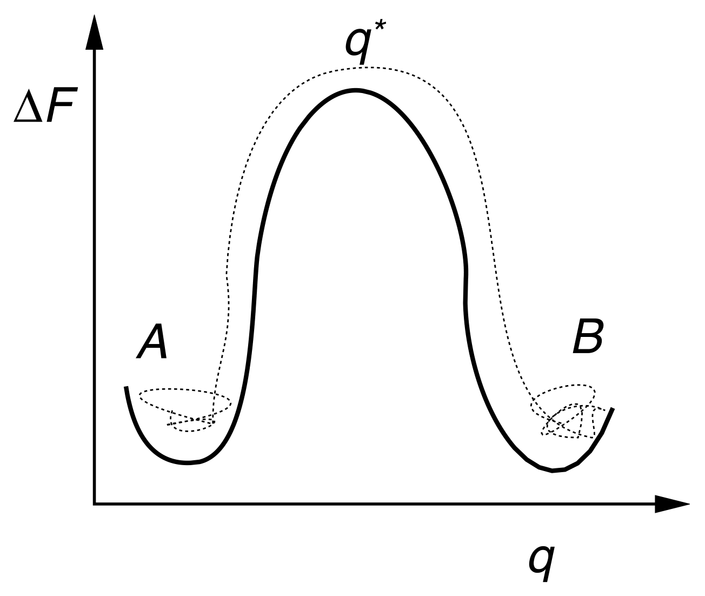
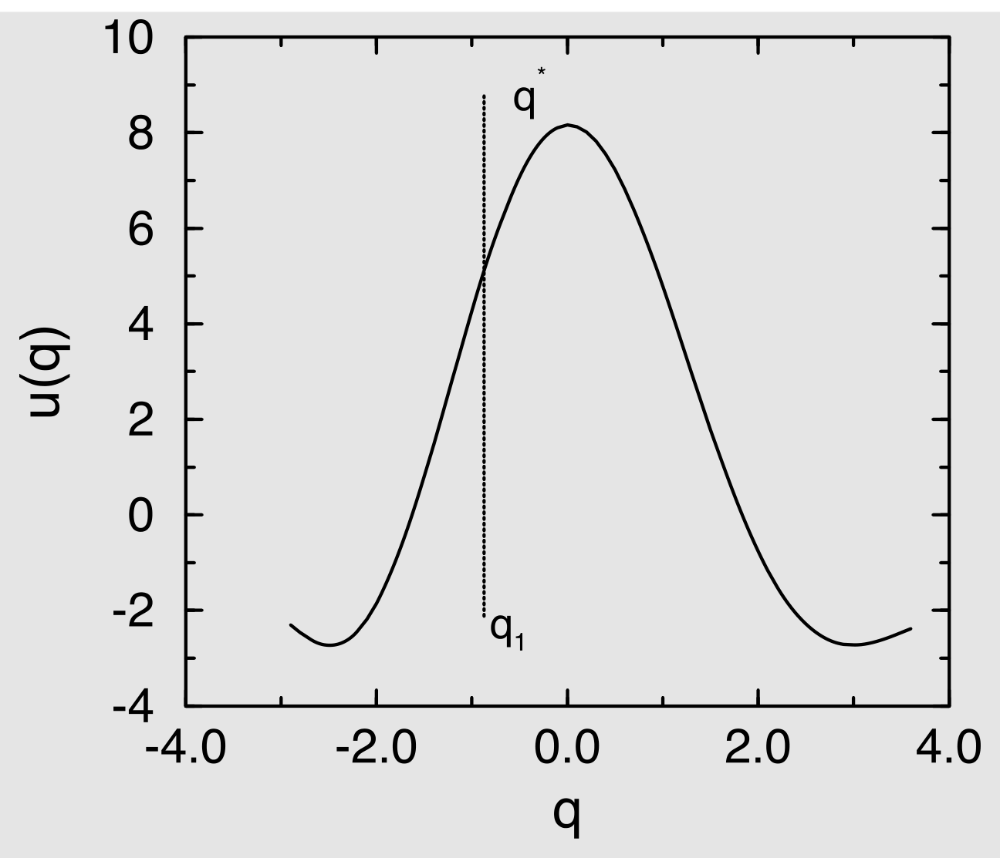
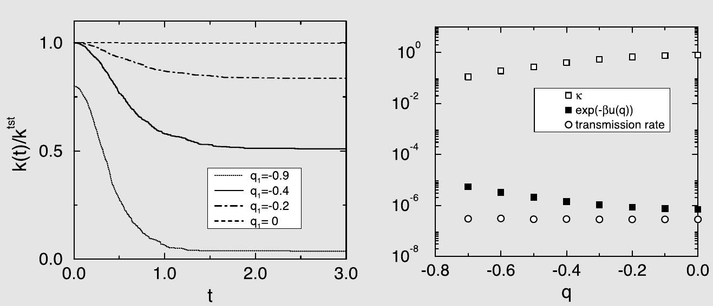
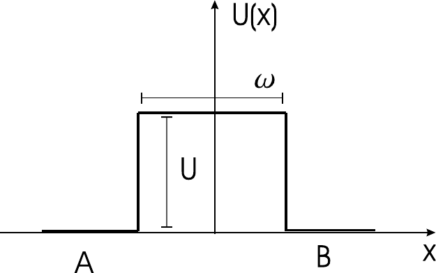
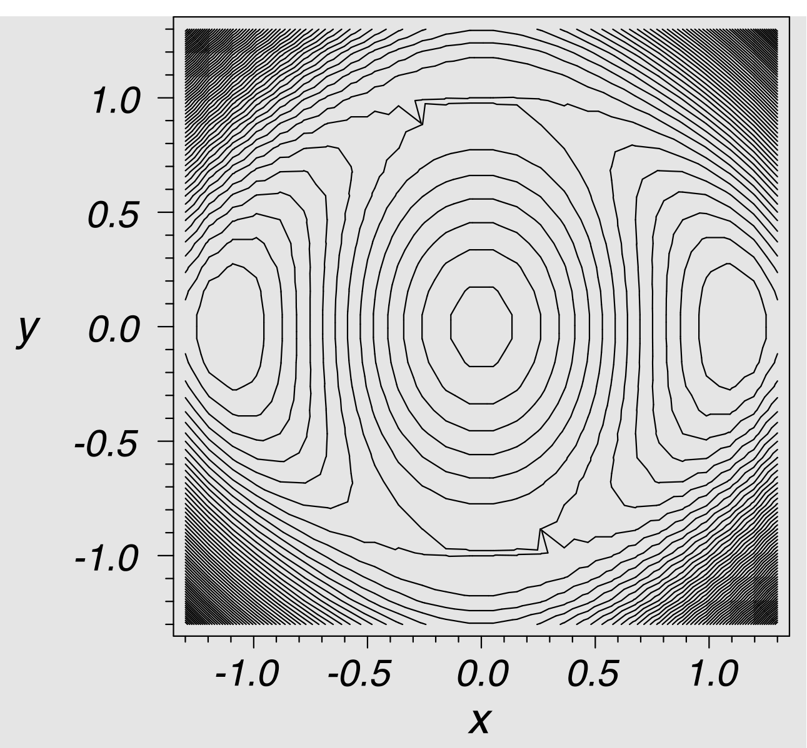
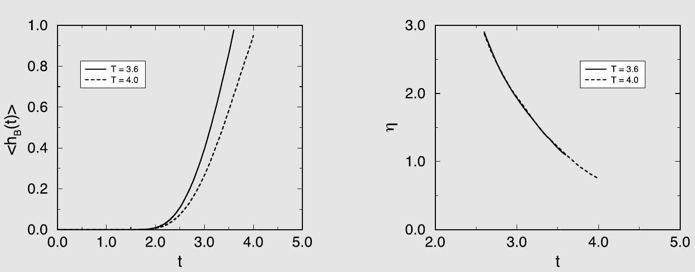
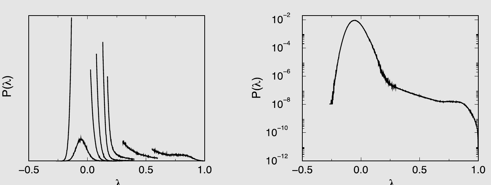
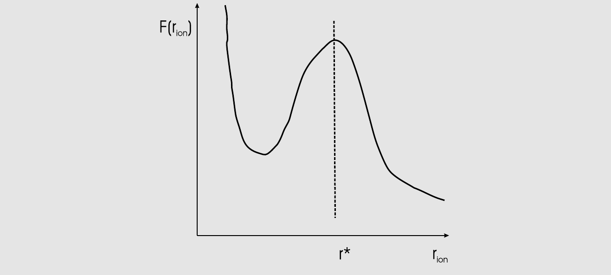
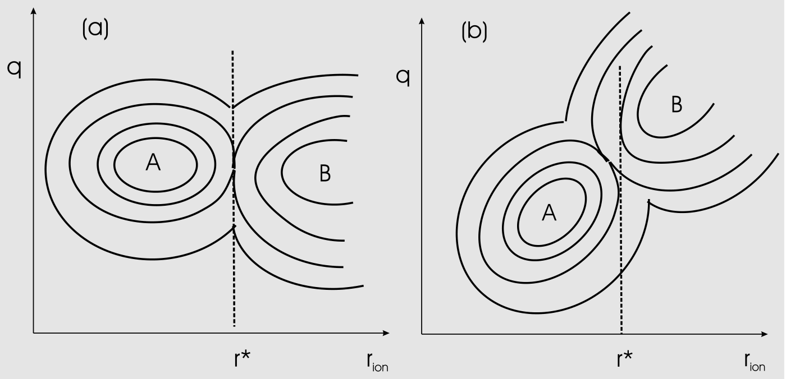
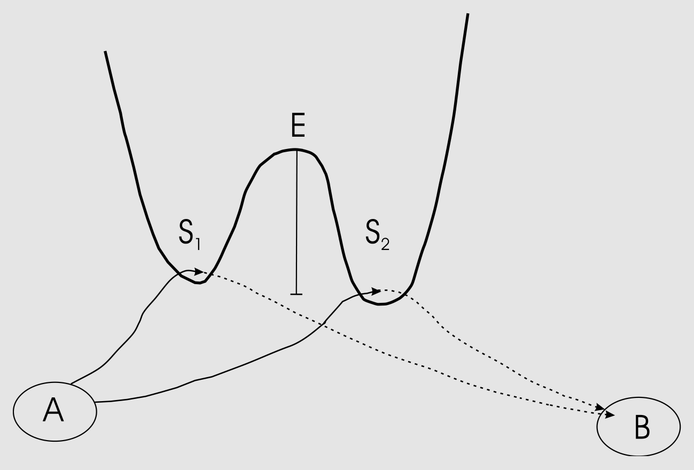

# 稀有事件

分子动力学模拟可用于探测经典多体体系的自然时间演化，典型时间尺度为$10^{-14}$至$10^{-7}$秒：上限取决于我们可用的计算能力，甚至可以再高出几个数量级，但计算代价将变得非常高昂。$10^{-14}$至$10^{-7}$秒的典型时间窗口足以研究许多结构和动力学性质，前提是相关涨落衰减的时间尺度明显短于$10^{-7}$秒。对于简单液体的大多数平衡性质而言确实如此。对于与非流体力学模式相关的动力学通常也是如此。对于流体力学模式（通常指描述满足守恒律的量——如质量、动量或能量——的扩散或传播的模式），时间尺度可能长得多。但我们仍然可以利用适当的 Green-Kubo 关系，通过 MD 模拟来计算控制流体力学行为的输运系数。如第 2.5.2 节所述，Green-Kubo 关系允许我们将流体力学输运系数表示为在微观时间尺度上涨落的动力学量的关联函数的时间积分：例如，自扩散系数等于速度自关联函数的积分。

然而，有许多动力学现象无法以这种方式研究。在本章中，我们讨论一个特别重要的例子，即活化过程。传统的 MD 模拟无法用于研究活化过程。原因不在于相关动力学过程缓慢，而在于稀有事件发生的频率很低，但当稀有事件确实发生时，通常进行得相当快，即在 MD 模拟可跟踪的时间尺度上发生。一个例子是烷烃中的反式到旁式构型转变：如果分隔两种构型的势垒远大于$k_BT$，则该过程发生频率很低。然而，一旦一个不太可能的涨落将体系驱至势垒顶部，实际的势垒穿越过程是迅速的。

事实证明，在许多情况下，MD 模拟可以用来计算这类活化过程的速率。此类计算最早由 Bennett 在固体扩散的背景下进行[[626]](references.md#ref-626)。随后，Chandler 扩展并推广了该方法以用于化学反应速率的计算[[58,627]](references.md#ref-58)。“Bennett-Chandler”风格稀有事件 MD 模拟的基本思想是，势垒穿越速率由一个静态项（即在势垒顶部找到体系的概率）与一个动态项（描述位于势垒顶部的体系移动到另一势阱的速率）的乘积决定。

自 20 世纪 90 年代中期以来，计算稀有事件速率的技术经历了爆发式发展：自 1990 年代以来，关于稀有事件模拟技术的论文数量增加了两个数量级，并且已有专门著作论述该主题[[34]](references.md#ref-34)。

本章关于稀有事件的目的是突出主要发展背后的思想，而非穷尽列举所有方法。本着这一精神，我们关注稀有事件的基本物理，并给出一些稀有事件技术的简单示例，至少是那些已成功应用于复杂问题的技术。我们加上这一限定条件是因为文献中提出的一些稀有事件技术仅在低维能量势垒穿越中被测试过。我们对一组代表性技术的关注是有代价的：与本书其余部分相比，我们更不可能做到面面俱到。

## 理论背景

所谓稀有事件，是指发生在比其底层动力学自然时间尺度长得多的时间尺度上的过程。例如，Lennard-Jones 体系中的稀有事件发生在比$t^* \equiv \sigma\sqrt{m/\epsilon}$长得多的时间尺度上。与流体力学模式的衰减不同，稀有事件并非简单地缓慢：它们只是不频繁发生，但一旦发生则进行得很快。正是这种时间尺度的分离使得稀有事件的数值模拟具有挑战性。

作为通过稀有事件进行的物理现象的典型例子，我们考虑单分子反应$A \rightleftharpoons B$，其中物种 A 转化为物种 B。如果该反应的速率决定步骤是（经典）势垒穿越，那么分子动力学模拟可以用来计算该反应的速率常数：Chandler 1978 年的论文[[627]](references.md#ref-627)解释了在什么条件下使用稀有事件技术是合理的。如果速率决定步骤是隧穿事件或从一个势能面跳到另一个势能面，则经典方法失效，我们应转向超出本书范围的量子动力学方法（参见[[48,628]](references.md#ref-48)）。

让我们首先从现象学角度考察单分子反应。我们用$c_A$和$c_B$分别表示物种 A 和 B 的数量密度。现象学速率方程为

$$
\frac{\mathrm{d}c_A(t)}{\mathrm{d}t} = -k_{A \to B} c_A(t) + k_{B \to A} c_B(t)
\tag{15.1.1}
$$

$$
\frac{\mathrm{d}c_B(t)}{\mathrm{d}t} = +k_{A \to B} c_A(t) - k_{B \to A} c_B(t).
\tag{15.1.2}
$$

显然，由于在此转化反应中分子总数守恒，总数量密度守恒：

$$
\frac{d[c_A(t) + c_B(t)]}{\mathrm{d}t} = 0.
\tag{15.1.3}
$$

在平衡态，所有浓度不随时间变化，即$\dot{c}_A = \dot{c}_B = 0$。这意味着

$$
K \equiv \frac{\langle c_A \rangle}{\langle c_B \rangle} = \frac{k_{B \to A}}{k_{A \to B}},

\tag{15.1.4}
$$

其中$K$是反应的平衡常数。现在考虑如果我们取一个处于平衡态的体系，对物种 A 的浓度施加一个小扰动$\delta c_A$（从而也影响物种 B），会发生什么。我们可以写出决定此扰动衰减的速率方程为

$$
\frac{\mathrm{d}\delta c_A(t)}{\mathrm{d}t} = -k_{A \to B} \delta c_A(t) - k_{B \to A} \delta c_A(t),
$$

其中我们使用了式 (15.1.3) 和 (15.1.4)。该方程的解为

$$
\delta c_A(t) = \delta c_A(0) \exp[-(k_{A \to B} + k_{B \to A})t] \equiv \delta c_A(0) \exp(-t/\tau_R),
\tag{15.1.5}
$$

其中我们定义了反应时间常数

$$
\tau_R = (k_{B \to A} + k_{A \to B})^{-1} = k_{A \to B}^{-1} \left(1 + \frac{\langle c_A \rangle}{\langle c_B \rangle}\right)^{-1} = \frac{c_B}{k_{A \to B}},
\tag{15.1.6}
$$

其中我们假设总浓度$c_A + c_B = 1$。在此归一化下，$c_A$就是给定分子处于状态 A 的概率。

到目前为止，我们从宏观的、现象学的角度讨论了反应。现在让我们从微观角度来考察。我们在线性响应理论的框架下进行讨论。首先，我们需要对反应的微观描述。这意味着我们需要一个方法来衡量反应已经进展到何种程度。在从一个自由能最小值扩散过势垒到另一个自由能最小值的情况下，我们可以使用已走过的距离比例作为反应坐标。一般而言，反应坐标可以是所有粒子坐标的复杂非线性函数。为方便起见，可以将反应坐标$q$简单地视为第 14 章中讨论的那种广义坐标。在图 15.1 中，我们展示了体系自由能面作为反应坐标$q$的函数的示意图。如果我们希望改变物种 A 的平衡浓度，应该施加一个有利于所有$q < q^*$的状态相对于$q > q^*$的状态的外部扰动。

*图 15.1　多体体系自由能面作为反应坐标$q$的函数的示意图。对于$q < q^*$，我们有反应物物种 A；对于$q > q^*$，我们有产物 B。如下面将讨论的，$q^*$的选择在一定程度上是任意的。但将势垒顶部对应的反应坐标值标识为$q^*$是方便的。*

类比第 2.5 节的讨论，我们考虑一个改变找到物种 A 和 B 的相对概率的外部扰动。为此，我们在哈密顿量中添加一项，降低$q < q^*$时的势能：

$$
\mathcal{H} = \mathcal{H}_0 - \epsilon g_A(q - q^*),
\tag{15.1.7}
$$

其中$\epsilon$是衡量扰动强度的参数。由于我们关注线性响应，将考虑$\epsilon \to 0$的极限。函数$g_A(q - q^*)$的选择使其在反应坐标$q$处于对应于“反应物”平衡构型的范围内时等于 1，而在典型的“产物”构型时$g_A(q - q^*)$应等于 0。$g_A$的传统选择是亥维赛 $\theta$函数：

$$
g_A(q - q^*) = 1 - \theta(q - q^*) = \theta(q^* - q),
$$

其中$x > 0$时$\theta(x) = 1$，否则$\theta(x) = 0$。在下文中，我们将考虑$g_A$在反应物和产物区域等于$\theta$函数的更一般情况。但与$\theta$不同，$g_A$在自由能势垒区域从 1 到 0 平滑变化。为简单起见，我们将状态 A 和 B 称为化学意义上的“反应物”和“产物”。然而，一般而言，A 和 B 可以指定任何可通过势垒穿越过程相互转化的初态和末态对。

让我们首先考虑这种类型的静态扰动对在状态 A 中找到体系的概率的影响。我们注意到

$$
\delta c_A = \langle c_A \rangle_\epsilon - \langle c_A \rangle_0 = \langle g_A \rangle_\epsilon - \langle g_A \rangle_0.
$$

这里我们利用了$g_A$在反应物势阱中等于 1 的事实。因此，$g_A$的平均值就等于在状态 A 中找到体系的概率。由第 2.5.1 节的式 (2.5.3)，我们立即得到

$$
\frac{\partial \delta c_A}{\partial \epsilon} = \beta \left[\langle g_A^2 \rangle_0 - \langle g_A \rangle_0^2\right].
$$

注意到在势垒区域之外，$g_A$要么为 1 要么为 0，因此$g_A^2(x) = g_A(x)$。在势垒区域，这个等式不一定成立——但这些构型对平衡平均的贡献可以忽略不计。因此，

$$
\frac{\partial \delta c_A}{\partial \epsilon} = \beta \langle c_A \rangle \left[1 - \langle c_A \rangle\right] = \beta \langle c_A \rangle \langle c_B \rangle.
\tag{15.1.8}
$$

为了后续讨论方便，定义函数$g_B = 1 - g_A$。显然，$\langle g_B \rangle_0 = \langle (1 - g_A) \rangle_0 = \langle c_B \rangle_0$。

接下来，考虑如果在时间$t = 0$突然关闭扰动会发生什么。物种 A 的浓度将弛豫到其平衡值，如式 (2.5.8) 所述，我们发现精确到$\epsilon$的一阶，

$$
\delta c_A(t) = \beta \epsilon \frac{\int \mathrm{d}\Gamma \exp(-\beta \mathcal{H}_0)(g_A(0) - \langle g_A \rangle) \exp(iL_0 t)(g_A(0) - \langle g_A \rangle)}{\int \mathrm{d}\Gamma \exp(-\beta \mathcal{H}_0)} = \beta \epsilon \langle \Delta g_A(0) \Delta g_A(t) \rangle.
\tag{15.1.9}
$$

最后，我们可以利用式 (15.1.8) 消去上式中的$\epsilon$，得到物种 A 浓度初始扰动的弛豫表达式：

$$
\delta c_A(t) = \delta c_A(0) \frac{\langle \Delta g_A(0) \Delta g_A(t) \rangle}{\langle c_A \rangle \langle c_B \rangle}.
\tag{15.1.10}
$$

将此式与现象学表达式式 (15.1.5) 比较，我们看到

$$
\exp(-t/\tau_R) = \frac{\langle \Delta g_A(0) \Delta g_A(t) \rangle}{\langle c_A \rangle \langle c_B \rangle}.
\tag{15.1.11}
$$

实际上，我们应对这一等价关系保持谨慎。在极短时间（即可与体系在势垒区域停留的平均时间相比的时间）内，不应期望浓度涨落的自关联函数呈指数衰减。只有在远长于典型势垒穿越时间的时间尺度上，才应期望式 (15.1.11) 成立。假设我们处于这一区域，则可以通过对式 (15.1.11) 求导获得$\tau_R$的表达式：

$$
-\tau_R^{-1} \exp(-t/\tau_R) = \frac{\langle g_A(0) \dot{g}_A(t) \rangle}{\langle c_A \rangle \langle c_B \rangle} = -\frac{\langle \dot{g}_A(0) g_A(t) \rangle}{\langle c_A \rangle \langle c_B \rangle},
\tag{15.1.12}
$$

其中我们去掉了$\Delta$符号，因为平衡浓度的时间导数为零。因此，对于远长于分子时间但仍远短于$\tau_R$的时间，我们可以写出

$$
\tau_R^{-1} = \frac{\langle \dot{g}_A(0) g_A(t) \rangle}{\langle c_A \rangle \langle c_B \rangle}
\tag{15.1.13}
$$

或者，如果我们回忆式 (15.1.6) 中$k_{A \to B}$与$\tau_R$的关系，我们得到

$$
k_{A \to B}(t) = \frac{\langle \dot{g}_A(0) g_A(t) \rangle}{\langle c_A \rangle}.
\tag{15.1.14}
$$

在此方程中，$k_{A \to B}(t)$的时间依赖性是明确标出的。但我们回忆，只有$k_{B \to A}(t)$的长时平台值才出现在现象学速率方程中。最后，我们可以重新表达式 (15.1.14) 中的关联函数——注意到

$$
\dot{g}_A(q - q^*) = \dot{q} \frac{\partial g_A(q - q^*)}{\partial q} = -\dot{q} \frac{\partial g_B(q - q^*)}{\partial q} = -\dot{q}(\partial_q g_B),
$$

其中我们使用记号$\partial_q \equiv \frac{\partial}{\partial q}$。则：

$$
k_{A \to B}(t) = \frac{\langle \dot{q}(\partial_q g_B)(0) g_B(t) \rangle}{\langle c_A \rangle},
\tag{15.1.15}
$$

其中我们利用了平衡平均$\langle \dot{q} \rangle$等于零的事实。式 (15.1.15) 的一种特别方便的形式，我们将在第 15.3 节中使用，即

$$
k_{A \to B}(t) = \frac{\int_0^\infty \mathrm{d}t \langle \dot{q}(0)(\partial_q) g_B(0) \dot{q}(t)(\partial_q g_B)(t) \rangle}{\langle c_A \rangle}.
\tag{15.1.16}
$$

但首先，我们建立与传统的“Bennett-Chandler”速率常数表达式的联系。

## Bennett-Chandler 方法

如果我们选择$g_A = \theta(q^* - q)$，从而$g_B = \theta(q - q^*)$，则可以将式 (15.1.15) 改写为以下形式：

$$
k_{A \to B}(t) = \frac{\langle \dot{q} \delta(q(0) - q^*) \theta(q(t) - q^*) \rangle}{\langle c_A \rangle} = \frac{\langle \dot{q} \delta(q^* - q(0)) \theta(q(t) - q^*) \rangle}{\langle \theta(q^* - q) \rangle}.
\tag{15.2.1}
$$

这样，我们已经将速率常数$k_{A \to B}$完全用可以在模拟中测量的微观量表示。接下来，我们将看到如何实现这一点。但首先，我们建立式 (15.2.1) 与从 Eyring 过渡态理论（TST）得出的速率常数表达式之间的联系。为此，考虑$t \to 0^+$极限下的$k_{A \to B}(t)$：

$$
\lim_{t \to 0^+} k_{A \to B}(t) = \frac{\langle \dot{q} \theta(q(0^+) - q^*) \delta(q^* - q(0)) \rangle}{\langle \theta(q^* - q) \rangle} = \frac{\langle \dot{q} \theta(\dot{q}) \delta(q^* - q(0)) \rangle}{\langle \theta(q^* - q) \rangle},
\tag{15.2.2}
$$

其中我们利用了$\dot{q} > 0$时$\theta(q(0^+) - q^*) = 1$，否则为 0 的事实。换言之，$\theta(q(0^+) - q^*) = \theta(\dot{q})$。式 (15.2.2) 最后一行的表达式就是经典过渡态理论对速率常数的预测，即$k_{A \to B}^{\mathrm{TST}}$。

将式 (15.2.1) 改写为以下形式是有用的：

$$
k_{A \to B} = \frac{\langle \dot{q}(0) \delta(q^* - q(0)) \theta(q(t) - q^*) \rangle}{\langle \delta(q^* - q(0)) \rangle} \times \frac{\langle \delta(q^* - q) \rangle}{\langle \theta(q^* - q) \rangle}.
\tag{15.2.3}
$$

式 (15.2.3) 右边的第一部分是一个条件平均，即在$q(0) = q^*$条件下乘积$\dot{q}(0)\theta(q(t) - q^*)$的平均。第二部分表示在势垒顶部找到体系的概率密度除以体系在势垒反应物一侧的概率。我们用$P(q^*)$表示这个密度，其中$P(q)$定义为

$$
P(q) \equiv \frac{\langle \delta(q - q(\mathcal{X})) \rangle}{\langle \theta(q^* - q(\mathcal{X})) \rangle} = \frac{\int \mathrm{d}\mathcal{X} \exp(-\beta \mathcal{U}) \delta(q - q(\mathcal{X}))}{\int \mathrm{d}\mathcal{X} \exp(-\beta \mathcal{U}) \theta(q^* - q(\mathcal{X}))}.
\tag{15.2.4}
$$

不建议使用暴力模拟来计算式 (15.2.3) 中的任何一项。原因是如果我们研究稀有事件，常规模拟几乎不会采样到势垒顶部，并且对$k_{A \to B}$的统计精度会很差。解决这个问题的方法是使用第 8 章中讨论的偏倚模拟，或者使用第 14 章中讨论的完整约束。由于这两种方法截然不同，我们分别讨论。

概念上最简单的方法是使用伞形采样首先计算势垒顶部的概率分布。在这种模拟中，我们将在整个$q < q^*$的范围内构建$P(q)$，使用多次伞形采样模拟（第 8.6.6 节）和直方图重构方法（如 MBAR，参见第 8.6.11 节）。为了在势垒顶部附近探测$P(q)$，我们可以使用一个窄的偏倚势阱。这部分模拟可以使用 MC 和 MD 进行。

为了计算式 (15.2.3) 中的第一项（一个条件平均），我们将使用在势垒顶部附近伞形采样获得的构型来启动 MD 模拟。在这种情况下，我们将根据麦克斯韦分布生成体系中粒子的速度。利用这些初始速度和位置，我们运行 MD 模拟来采样$\dot{q}(0)\theta(q(t) - q^*)$。当然，伞形采样生成的点非常接近但不完全等于$q^*$。在实践中，这通常不构成问题。

### 处理完整约束（Blue-Moon 系综）

偏倚采样的替代方法是使用完整约束$q(0) - q^* = 0$来计算$\dot{q}(0)\theta(q(t) - q^*)$的条件平均。在此约束下，我们将使用 MD 使体系达到平衡，然后利用该 MD 轨迹上的点来启动大量不受约束的演化。

然而，在$q = q^*$处使用完整约束时，我们必须谨慎，因为在第 14 章中我们论证了完整约束可以改变平衡分布：

$$
\rho_{\text{unconstrained}}(q) = |H|^{-1/2} \rho_{\text{constrained}}(q)
\tag{15.2.5}
$$

其中

$$
H_{\alpha\beta} = \sum_{i=1}^{N} m_i^{-1} \frac{\partial \sigma_\alpha}{\partial r_i} \frac{\partial \sigma_\beta}{\partial r_i}.
$$

在当前情况下，我们有一个约束。[^1] 我们的约束是

$$
\sigma \equiv q^* - q = 0.
$$

如果$q$是笛卡尔坐标的线性函数，则无需担心约束对分布函数的影响，因为$|H|$是常数。然而，一般而言，$q$是所有其他坐标的非线性函数，我们应该考虑$|H|$对$\rho(q)$的影响。

硬约束将偏倚初始分布函数：

$$
\frac{\langle \dot{q}(0) \delta(q^* - q(0)) \theta(q(t) - q^*) \rangle}{\langle \delta(q^* - q(0)) \rangle} = \frac{\langle |H|^{-1/2} \dot{q}(0) \theta(q(t) - q^*) \rangle_c}{\langle |H|^{-1/2} \rangle_c},
\tag{15.2.6}
$$

其中下标$c$表示对初始构型的约束平均。

下面，我们推导$P(q)$随$q$变化的显式表达式，使用约束 MD 重构从势阱底部到势垒顶部的完整$P(q)$，从而可以计算$P(q^*)$。事实上，与其计算$P(q)$对$q$的导数，我们不如对$\ln P(q)$求导：

$$
\frac{\partial \ln P(q)}{\partial q} = \frac{\int \mathrm{d}\mathcal{X} \exp(-\beta \mathcal{U}) \partial \delta(q - q(\mathcal{X}))/\partial q}{\int \mathrm{d}\mathcal{X} \exp(-\beta \mathcal{U}) \delta(q - q(\mathcal{X}))}.
\tag{15.2.7}
$$

我们可以通过分部积分重新表达分子中的积分。为此，我们首先从笛卡尔坐标$X$变换到一组包含反应坐标$q$的广义坐标$\{Q, q\}$。我们用$|J|$表示从$X$到$\{Q, q\}$变换的雅可比行列式。现在进行分部积分

$$
\begin{aligned}
\frac{\partial \ln P(q)}{\partial q} &= \frac{\int \mathrm{d}Q \, \mathrm{d}q \, |J| \exp(-\beta U) \partial \delta(q - q(X))/\partial q}{\int \mathrm{d}X \exp(-\beta U) \delta(q - q(X))} \\
&= \frac{\int \mathrm{d}Q \, \mathrm{d}q \, [\partial |J| \exp(-\beta U)/\partial q(X)] \delta(q - q(X))}{\int \mathrm{d}X \exp(-\beta U) \delta(q - q(X))} \\
&= \frac{\int \mathrm{d}X [\partial (\ln(|J|) - \beta U)/\partial q(X)] \exp[-\beta U] \delta(q - q(X))}{\int \mathrm{d}X \exp(-\beta U) \delta(q - q(X))} \\
&= \frac{\langle [\partial (\ln(|J|) - \beta \mathcal{U})/\partial q(\mathcal{X})] \delta(q - q(\mathcal{X})) \rangle}{\langle \delta(q - q(\mathcal{X})) \rangle},
\end{aligned}
\tag{15.2.8}
$$

其中在第三行我们变换回了原始笛卡尔坐标。应当注意，雅可比行列式$|J|$的计算可以大大简化[[629]](references.md#ref-629)。

由于分子和分母中的平均值都包含$\delta(q - q(X))$，很自然地将式 (15.2.8) 用约束平均表示，这样可以在约束分子动力学模拟中方便地计算。与式 (15.2.6) 一样，我们必须修正硬约束引入的偏倚：

$$
\frac{\partial \ln P(q)}{\partial q} = \frac{\langle |H|^{-1/2} \partial (\ln(|J|) - \beta \mathcal{U})/\partial q \rangle_c}{\langle |H|^{-1/2} \rangle_c},
\tag{15.2.9}
$$

其中下标$c$表示在$q(X)$被约束为$q$的系综中求平均。如果我们将式 (15.2.9) 从势阱底部积分到势垒顶部，得到

$$
\ln \left(\frac{P(q^*)}{P(q = q_A)}\right) = \int_{q_A}^{q^*} \mathrm{d}q \frac{\langle |H|^{-1/2} \partial (\ln(|J|) - \beta \mathcal{U})/\partial q \rangle_c}{\langle |H|^{-1/2} \rangle_c}.
\tag{15.2.10}
$$

在实践中，这个积分必须以数值方式进行。

通过组合式 (15.2.6)、 (15.2.4) 和 (15.2.10)，我们最终得到了可以数值计算的速率常数$k_{A \to B}$的表达式。

应当注意，在上述表达式中，我们假设反应坐标是模拟中唯一将被约束的量。如果存在更多约束，例如当我们在多原子流体中模拟反应时，$k_{A \to B}$的表达式将变得更加复杂（参见 Ciccotti 的文章[[609]](references.md#ref-609)及其中的参考文献）。当约束是复杂的多体函数时，Blue-Moon 技术的实现可能会很困难。在这种情况下，自动微分（参见例如[[108]](references.md#ref-108)）可能是一个有吸引力的选择。

#### Bennett-Chandler 结语

显然，带有完整约束的体系的 Bennett-Chandler 表达式并不特别简单。那么问题是：何时使用哪种技术？

从头开始编写程序时，使用完整约束将是英雄式的壮举，但该方法并不比使用伞形采样或类似技术的更简单模拟更好。然而，很少有程序是从头编写的。此外，可用的 MD 程序远多于 MC 程序。因此，在现有 MD 代码中使用 Blue-Moon 系综可能只需在输入文件中设置一个参数即可。在这种情况下，前面的讨论应该有助于用户理解 Blue-Moon 选项的作用。

无论使用哪种方法，上面推导的单分子速率常数表达式不仅限于化学反应：相同的方法可以用于研究任何活化的经典过程，如固体中的扩散、晶体成核或通过膜的输运。

???+ example "例 25（理想气体粒子越过势垒）"

    为了说明计算穿越速率的“Bennett-Chandler”方法，我们考虑在外场中运动的理想气体粒子。该粒子被约束在图 15.2 所示的一维势能面上运动。这个例子在物理上不太现实，因为运动的粒子无法耗散其能量。因此，粒子的运动是纯弹道式的。我们假设在远离势垒两侧的地方，粒子可以与热库交换能量。过渡态理论预测的穿越速率由式 (15.2.2) 给出：

    $$
    k_{A \to B}^{\mathrm{TST}} = \frac{\frac{1}{2}|\dot{q}| \exp[-\beta u(q^*)]}{\int_{-\infty}^{q^*} \mathrm{d}q \exp[-\beta u(q)]} = \frac{\sqrt{\frac{k_B T}{2\pi m}} \exp[-\beta u(q^*)]}{\int_{-\infty}^{q^*} \mathrm{d}q \exp[-\beta u(q)]}.
    \tag{15.2.11}
    $$

    

    *图 15.2　理想气体粒子的势能势垒；如果粒子位于分界面$q_1$的左侧，则粒子处于状态 A（反应物）。势垒右侧的区域被指定为产物 B。势垒顶部记为$q^*$（$q^* = 0$）。*

    如果我们选择分界面$q_1$（见图 15.2）位于势垒顶部（$q_1 = q^*$），则以正速度出发的粒子都不会返回反应物状态。因此，不存在势垒的再穿越，过渡态理论对该体系是精确的。

    注意，过渡态理论（式 (15.2.11)）预测的速率常数取决于分界面的位置。相比之下，Bennett-Chandler 穿越速率表达式与分界面位置无关（理应如此）。为理解这一点，考虑分界面选在势垒顶部左侧的情况（即$q_1 < q^*$）。按照式 (15.2.3) 计算穿越速率分为两步。首先我们计算在分界面处找到粒子的相对概率。然后我们需要计算从该分界面以初始速度$\dot{q}$出发的粒子实际上穿越势垒的概率。本例的优点是这个概率可以显式计算。根据式 (15.2.4)，在$q_1$处找到粒子的相对概率为

    $$
    \frac{\langle \delta(q - q_1) \rangle}{\langle \theta(q_1 - q) \rangle} = \frac{\exp[-\beta u(q_1)]}{\int_{-\infty}^{q_1} \mathrm{d}q \exp[-\beta u(q)]}.
    $$

    如果分界面不在势垒顶部，则在$q_1$处找到粒子的概率将高于在$q^*$处的概率，但实际穿越势垒的粒子数比例将低于过渡态理论的预测。引入含时透射系数$\kappa(t)$是方便的，定义为以下比率

    $$
    \kappa(t) \equiv \frac{k_{A \to B}(t)}{k_{A \to B}^{\mathrm{TST}}} = \frac{\langle \dot{q}(0) \delta(q(0) - q_1) \theta(q(t) - q_1) \rangle}{0.5 \langle |\dot{q}(0)| \rangle}.
    $$

    $\kappa(t)$的行为如图 15.3 所示，对应于$q_1$的几种不同选择。该图显示，当$t \to 0$时$\kappa(t) = 1$，并且对于不同的$q_1$值，我们得到不同的平台值。$\kappa(t)$从其初始值衰减的原因是，动能太小的粒子无法穿越势垒并再穿过分界面（$q_1$）。$\kappa(t)$的平台值为我们提供了必须应用于过渡态理论预测的穿越速率的修正。因此，我们看到随着$q_1$的改变，在$q_1$处找到粒子的概率增加，透射系数下降。但是，从图 15.3 可以看出，实际的穿越速率（与这两项的乘积成正比）与$q_1$无关，这是合理的。

    

    *图 15.3　势垒再穿越：左图给出了不同$q_1$值下透射系数随时间的变化。右图在单一图中展示了在$q = q_1$处找到体系的概率密度（实心方块）、透射系数$\kappa$（空心方块）和总穿越速率（空心圆），全部作为分界面位置的函数绘制。注意总穿越速率与分界面选择无关。（图内标注：$\kappa$ = 穿越系数；transmission rate = 总穿越速率）*

    现在考虑$q_1 > q^*$的情况。在这种情况下，所有以正$\dot{q}$出发的粒子都将继续到达产物一侧。但现在也有一部分以负$\dot{q}$出发的粒子将到达产物一侧。这些事件将对$\kappa$产生负贡献。最终结果是透射系数再次低于过渡态理论的预测。因此，重要的不是轨迹最终是否到达产物一侧，而是它是否从反应物一侧出发并到达产物一侧。在模拟中，因此方便地总是成对计算轨迹：对于每条从给定初始构型以速度$\dot{q}$出发的轨迹，我们也计算时间反演轨迹，即从相同构型以速度$-\dot{q}$出发的轨迹。如果两条轨迹最终都位于势垒的同一侧，则它们对透射系数的总贡献显然为零。只有当前向和时间反演轨迹最终位于势垒的两侧时，我们才对$\kappa$有贡献。在当前（弹道式）情况下，这个贡献总是正的。但一般而言，这个贡献也可能是负的（即如果势垒顶部处的初始速度方向与粒子最终到达的方向不一致）。

    我们选择这个简单的弹道式势垒穿越问题，是因为我们可以容易地显式证明穿越速率与$q_1$的位置无关。{ 注：穿越速率长时极限与分界面位置无关的一般证明由Miller给出[[630]](references.md#ref-630)。}我们从穿越分界面$q_1$的粒子的动能和势能之和为常数这一观察出发。只有那些具有足够动能的粒子才能穿越势垒。我们可以容易地计算$\langle \dot{q}(0) \theta(q(t) - q_1) \rangle$的长时极限：

    $$
    \langle \dot{q}(0) \theta(q(\infty) - q_1) \rangle = \sqrt{\frac{m\beta}{2\pi}} \int_{v_\epsilon}^{\infty} \mathrm{d}v \, v \exp(-\beta m v^2/2) = \sqrt{\frac{1}{2\pi m\beta}} \exp\left(-\frac{1}{2}\beta m v_\epsilon^2\right),
    $$

    其中$v_\epsilon$是实现成功穿越所需的最小速度。$v_\epsilon$由下式给出

    $$
    \frac{1}{2} m v_\epsilon^2 + u(q_1) = u(q^*).
    $$

    由此可得

    $$
    \langle \dot{q}(0) \theta(q(\infty) - q_1) \rangle = \sqrt{\frac{1}{2\pi m\beta}} \exp\{-\beta[u(q^*) - u(q_1)]\}.
    $$

    这一项恰好补偿了与在$q_1$处找到粒子的概率相关联的玻尔兹曼因子$\exp(-\beta u(q_1))$。因此，我们已经证明总穿越速率由式 (15.2.11) 给出，与$q_1$的选择无关。

    读者可能会问，为什么拥有一个与分界面精确位置无关的速率常数表达式很重要。原因在于，尽管在一维系统中找到势垒顶部是直接的，但在多维体系的反应路径中，鞍点的精确位置通常很难确定。使用 Bennett-Chandler 方法，不必知道鞍点的精确位置。不过，仍然值得尝试获得一个合理的估计，因为如果分界面选择在接近真实鞍点的位置，结果的统计精度最好。

    Bennett-Chandler 势垒穿越速率表达式的优点在于它允许我们在势垒再穿越重要的条件下计算速率常数，例如，如果在势垒顶部的运动更接近扩散而非弹道。这类体系的例子包括溶剂中环己烷的异构化[[631]](references.md#ref-631)和氮在氩晶体中的扩散[[632]](references.md#ref-632)。

    更多细节参见 SI（案例研究 23）。

    ## 扩散势垒穿越

    在上一节中，我们描述了活化过程速率的 Bennett-Chandler 表达式。该表达式在数值模拟中被广泛使用。然而，尽管该表达式对于任意势垒穿越都是正确的（只要势垒远大于$k_BT$），但它并不总是计算效率高的。为理解这一点，考虑透射系数$\kappa$的表达式

    $$
    \kappa(t) \equiv \frac{k_{A \to B}(t)}{k_{A \to B}^{\mathrm{TST}}} = \frac{\langle \dot{q}(0) \delta(q(0) - q^*) \theta(q(t) - q^*) \rangle}{0.5 \langle |\dot{q}(0)| \rangle}.
    \tag{15.3.1}
    $$

    

    *图 15.4　扩散势垒穿越的简单模型：高度为$U$、宽度为$\omega$的方形势垒分隔两个宏观状态 A 和 B。*

    显然，如果$\kappa \to 1$，我们可以使用过渡态理论（TST）来计算穿越速率——只要我们知道势垒高度。因此，式 (15.3.1) 唯一有价值的区间是对 TST 有明显修正的情况，即$\kappa \ll 1$。然而，恰好在这一区间，使用式 (15.3.1) 对$\kappa$进行数值计算会面临缓慢的瞬态行为和大的统计误差。

    为了说明这一点，让我们考虑一个简单的例子：一个高度为$U$、宽度为$\omega$的方形势垒，分隔两个（亚）稳态 A 和 B（见图 15.4）。为简单起见，我们假设在平衡态，两个状态具有相同的概率$P_{\mathrm{eq}} \approx 0.5$（势垒区域的粒子数可忽略不计）。此外，我们假设势垒区域中的运动是扩散性的。对于这种简单的几何形状，很容易写出扩散方程。该方程由连续性方程推导：

    $$
    \frac{\partial \rho(q,t)}{\partial t} = -\frac{\partial}{\partial q} J(q,t),
    \tag{15.3.2}
    $$

    它将点$q$和时间$t$处的局域密度$\rho(q,t)$与流密度$J(q,t)$联系起来。此外，我们有外场中扩散流的本构方程

    $$
    J(q,t) = -D \left(\beta \frac{\partial U(q)}{\partial q} \rho(q,t) + \frac{\partial \rho(q,t)}{\partial q}\right),
    \tag{15.3.3}
    $$

    其中$U(q)$是外势。将此与连续性方程结合，我们得到斯莫卢霍夫斯基方程[[633]](references.md#ref-633)，

    $$
    \frac{\partial \rho(q,t)}{\partial t} = \frac{\partial}{\partial q} D \left(\beta \frac{\partial U}{\partial q}(q) \rho(q,t) + \frac{\partial \rho(q,t)}{\partial q}\right) = \frac{\partial}{\partial q} D e^{-\beta U} \frac{\partial}{\partial q} e^{+\beta U} \rho(q,t),
    \tag{15.3.4}
    $$

    其中$D$是体系的扩散系数。在稳态中$\dot{\rho} = 0$，扩散通量$J$是常数。

    现在我们利用假设了平坦势垒这一事实，即在$-\omega/2 < q < \omega/2$区间内$\partial U/\partial q = 0$。我们还将假设$D$与$q$无关。由式 (15.3.3) 可得，势垒顶部的概率分布必须是反应坐标$q$的线性函数：

    $$
    \rho_{\mathrm{st}}(q) = aq + b \quad \text{对于 } -\omega/2 < q < \omega/2.
    \tag{15.3.5}
    $$

    常数$a$和$b$由边界条件确定。在平衡态，$a = 0$且$b = \rho_{\mathrm{eq}} \exp(-\beta U)$，其中$\rho_{\mathrm{eq}}$是状态 A 和 B 中的密度。假设我们将状态 A 中的概率密度从其平衡值增加$\rho_{\mathrm{eq}}\delta/2$，并将状态 B 的概率密度减少相同的量，则体系不再处于平衡态。如果势垒足够高，由此产生的通量将非常小，状态 A 和 B 的概率几乎不随时间变化。在这种情况下，势垒顶部的稳态概率分布为

    $$
    \rho_{\mathrm{st}}(q) = e^{-\beta U} \rho_{\mathrm{eq}} \left(1 - \frac{q}{\omega} \delta\right),
    \tag{15.3.6}
    $$

    通量为

    $$
    J_{\mathrm{st}} = D \frac{\rho_{\mathrm{eq}} \delta}{\omega} e^{-\beta U}.
    \tag{15.3.7}
    $$

    正如预期的那样，通量随势垒高度的增加呈指数衰减。势垒顶部的概率密度由式 (15.3.6) 给出，当且仅当通量已达到其稳态值。

    现在考虑速率的表达式。我们将式 (15.3.1) 改写为

    $$
    \kappa(t) \equiv \frac{\langle \theta(q^* - q(0)) \dot{q}(t) \delta(q(t) - q^*) \rangle}{0.5 \langle |\dot{q}(0)| \rangle}.
    \tag{15.3.8}
    $$

    除了一个常数因子外，$\kappa(t)$是由于$t = 0$时阶跃函数概率分布而通过过渡态$q^* (= 0)$的通量。由于这个阶跃函数与线性稳态分布不同，由此产生的通量将依赖于时间。我们感兴趣的是$\kappa(t)$在初始瞬态区间后的平台值。通常的假设是这个瞬态区间延伸到典型的“分子”时间尺度。然而，在当前情况下，很容易证明$\kappa(t)$趋近平台值的过程可能非常缓慢。对于时间$t \ll \omega^2/D$，我们可以将式 (15.3.4) 和 (15.3.2) 结合得到

    $$
    \frac{\partial J(q,t)}{\partial t} \approx D \frac{\partial^2 J(q,t)}{\partial q^2},
    \tag{15.3.9}
    $$

    其解为

    $$
    J(q,t) \approx \epsilon D e^{-\beta U} \rho_{\mathrm{eq}} \frac{1}{\sqrt{2\pi D t}} \exp\left(-\frac{(q - q^*)^2}{2Dt}\right).
    \tag{15.3.10}
    $$

    然后我们发现对于$t \ll \omega^2/D$的时间，$J(q^*,t)$以$1/\sqrt{t}$衰减。这意味着趋向稳态的过程非常缓慢。但更重要的是，在扩散势垒穿越的情况下，透射系数$\kappa$通常非常小。下面我们将给出$\kappa$的估计，但在现阶段我们只指出，使用式 (15.3.8) 无法准确确定小的$\kappa$值。为理解这一点，考虑透射系数的表达式：

    $$
    \kappa = \frac{2}{\langle |\dot{q}| \rangle_{\mathrm{eq}}} \langle \dot{q}(0) \theta(q(t) - q^*) \rangle_{q(0)=q^*}.
    \tag{15.3.11}
    $$

    在计算机模拟中，我们首先将体系置于$q^*$并让其演化。然后对于足够长的时间（使式 (15.3.8) 达到平台值）计算$\theta(q(t) - q^*)$。对$n$条独立轨迹重复此过程，然后估计$\kappa$为

    $$
    \kappa_{\mathrm{est}} = \frac{2}{n \langle |\dot{q}| \rangle} \sum_{i=1}^{n} [\dot{q}(0) \theta(q(t) - q^*)]_i.
    \tag{15.3.12}
    $$

    $\kappa_{\mathrm{est}}$的统计误差为

    $$
    \sigma_\kappa^2 = \langle (\kappa_{\mathrm{est}} - \langle \kappa \rangle)^2 \rangle.
    \tag{15.3.13}
    $$

    考虑到轨迹不相关，并假设式 (15.3.13) 中的平均可以像$\dot{q}$和$\theta(q(t) - q^*)$是高斯变量一样因式分解，我们得到

    $$
    \sigma_\kappa^2 = \frac{4}{n \langle |\dot{q}| \rangle^2} \langle \dot{q}^2 \rangle \langle \theta^2 \rangle + \frac{1}{n} \kappa^2.
    \tag{15.3.14}
    $$

    为了估计方差，我们利用$\langle \theta^2 \rangle \approx 0.5$和

    $$
    \frac{4 \langle \dot{q}^2 \rangle}{\langle |\dot{q}| \rangle^2} \sim \mathcal{O}(1).
    \tag{15.3.15}
    $$

    由于我们考虑的是透射系数远小于 1 的情况，式 (15.3.14) 中的第二项贡献可以忽略。于是我们得到

    $$
    \sigma_\kappa^2 \sim \frac{1}{n},
    \tag{15.3.16}
    $$

    相对误差为

    $$
    \frac{\sigma_\kappa}{\kappa} \sim \frac{1}{\kappa \sqrt{n}}.
    \tag{15.3.17}
    $$

    这表明，即使透射系数大到 0.1，我们也需要跟踪大约$10^4$条轨迹才能获得仅 10\%的精度。统计误差如此之大的原因是我们使用$\theta$函数来检测从 A 到 B 的转变。在扩散势垒穿越过程中，过渡态的再穿越频繁，$\theta$函数的时间演化类似于随机电报信号。

    上述分析表明，Bennett-Chandler 方法在低透射系数体系中的效率降低是因为：1) BC 方案将体系制备在一个不接近稳态的状态；2) BC 方案使用“嘈杂的”$\theta$函数来检测体系是否处于状态 B。

    一个自然的问题是：我们能否做得更好？下面我们证明这确实是可能的。首先，我们将回到式 (15.1.7)，尝试设计一个扰动，使体系立即处于接近稳态的状态。其次，我们将构造一个更连续的“检测器”函数来测量状态 B 的浓度。下面我们不讨论一般情况，而是在简单的方形势垒模型的框架下解释基本思想。更一般的讨论请读者参考文献[[629]](references.md#ref-629)。

    如上所述，势垒顶部稳态概率分布是反应坐标的线性函数。因此，如果我们建立的扰动具有这种形状（而不是阶跃函数），我们将消除缓慢的、扩散式趋近稳态穿越速率的问题。因此，让我们用函数$g(q)$替代$\theta$函数扰动，选择$g(q)$使其在势垒区域外$g(q) = \theta(q^* - q)$，而在势垒区域内部

    $$
    g(q) = 1/2 - q/\omega.
    $$

    { 注：处处为常数的扰动不改变平衡分布；因此，为计算浓度分布的变化，我们可以关注 $g(q) = 1/2 - q/\omega$。}
    由此扰动引起的平衡浓度分布变化为

    $$
    \delta \rho(q) = -e^{-\beta U} \rho_{\mathrm{eq}} \frac{q \beta \epsilon}{\omega}.
    \tag{15.3.18}
    $$

    但若取$\delta = \beta \epsilon$，这恰好是对应于稳态的（线性）浓度分布。因此，通过这种扰动，我们抑制了初始瞬态。然而，如果我们仍然使用$\theta$函数来检测体系是否处于状态 B，数值结果仍将是有噪声的。所以第二步是将状态 B 的“检测器”函数替换为$1 - g(q)$。注意在势垒区域外$g(q) = \theta(q^* - q)$。因此，用$g$替代$\theta$对我们估计 B 的浓度产生的影响可以忽略不计。

    接下来让我们考虑这种扰动$g$的选择对透射系数$\kappa$统计精度的影响。我们从穿越速率的式 (15.1.16) 出发

    $$
    k_{A \to B} = \frac{\int_0^\infty \mathrm{d}t \langle \dot{q}(0)(\partial_q g_B(0)) \dot{q}(t)(\partial_q g_B(t)) \rangle}{\langle c_A \rangle}.
    $$

    现在，在势垒内部$g_B = 1 - g_A = 1/2 + q/\omega$，其他地方为零。在势垒区域内部，我们始终有

    $$
    \partial_q g_B = \frac{1}{\omega}
    $$

    因此

    $$
    k_{A \to B} = \frac{1}{\omega^2} \frac{\int_0^\infty \mathrm{d}t \langle \dot{q}(0) \dot{q}(t) \rangle_*}{\langle c_A \rangle},
    $$

    其中星号表示$q(0)$和$q(t)$都应在势垒区域内的条件。如果速度关联衰减的时间尺度远短于扩散穿越势垒所需的时间，则我们可以写出

    $$
    \langle \dot{q}(0) \dot{q}(t) \rangle_* \approx \langle \dot{q}(0) \dot{q}(t) \rangle_\omega \exp(-\beta U) \rho_{\mathrm{eq}}.
    $$

    过渡态理论对$k_{A \to B}$的表达式为

    $$
    k_{A \to B}^{\mathrm{TST}} = \frac{0.5 \langle |\dot{q}| \rangle \exp(-\beta U) \rho_{\mathrm{eq}}}{\langle c_A \rangle}.
    $$

    然后我们得到透射系数$\kappa$的以下表达式：

    $$
    \kappa = \frac{2}{\omega \langle |\dot{q}| \rangle} \int_0^\infty \mathrm{d}t \langle \dot{q}(0) \dot{q}(t) \rangle.
    $$

    利用 Green-Kubo 关系

    $$
    D = \int_0^\infty \mathrm{d}t \langle \dot{q}(0) \dot{q}(t) \rangle,
    \tag{15.3.19}
    $$

    我们得到

    $$
    \kappa = \frac{2D}{\omega \langle |\dot{q}| \rangle}.
    $$

    由于$D$的量级为$O(\langle |\dot{q}| \rangle \lambda)$，其中$\lambda$是平均自由程，我们立即看到

    $$
    \kappa \sim \frac{\lambda}{\omega};
    $$

    即透射系数近似等于平均自由程与势垒宽度之比。

    接下来，我们考虑$\kappa$的新估计的统计精度

    $$
    \kappa_{\mathrm{est}} = \frac{2}{\omega \langle |\dot{q}| \rangle n} \sum_{i=1}^{n} \int_0^t \mathrm{d}t' [\dot{q}(0) \dot{q}(t')]_i,
    \tag{15.3.20}
    $$

    其中我们必须记住，在所考虑的所有$n$条轨迹中，体系最初都位于势垒顶部。遵循基本上与导出式 (15.3.14) 相同的推理，我们得到

    $$
    \langle (\delta \kappa_{\mathrm{est}})^2 \rangle = \frac{4}{\omega^2 \langle |\dot{q}| \rangle^2 n} \left[\int_0^t \mathrm{d}t' \int_0^t \mathrm{d}t'' \langle \dot{q}(0) \dot{q}(t') \dot{q}(0) \dot{q}(t'') \rangle - \left(\int_0^t \mathrm{d}t' \langle \dot{q}(0) \dot{q}(t') \rangle\right)^2\right].
    $$

    如果我们像以前一样假设$\dot{q}$表现为高斯变量，则

    $$
    \langle (\delta \kappa_{\mathrm{est}})^2 \rangle = \frac{4}{\omega^2 \langle |\dot{q}| \rangle^2 n} \left[\langle \dot{q}^2 \rangle t \int_0^t \mathrm{d}t' \langle \dot{q}(0) \dot{q}(t') \rangle + D^2\right].
    \tag{15.3.21}
    $$

    我们考虑$t \to \infty$的极限。在该极限下$D \ll \langle \dot{q}^2 \rangle t$，因此

    $$
    \langle (\delta \kappa_{\mathrm{est}})^2 \rangle \sim \frac{4}{\omega^2 \langle |\dot{q}| \rangle^2 n} \langle \dot{q}^2 \rangle D t.
    \tag{15.3.22}
    $$

    现在透射系数计算的相对误差为

    $$
    \frac{\langle (\delta \kappa_{\mathrm{est}})^2 \rangle^{1/2}}{\kappa} \sim \sqrt{\frac{\langle \dot{q}^2 \rangle t}{D n}}.
    $$

    由 Green-Kubo 关系式 (15.3.19) 我们看到扩散系数$D$等于$\langle \dot{q}^2 \rangle \tau_c$，其中$\tau_c$是速度涨落的衰减时间。因此，

    $$
    \frac{\langle (\delta \kappa_{\mathrm{est}})^2 \rangle^{1/2}}{\kappa} \sim \sqrt{\frac{t}{n \tau_c}}.
    $$

    通常，对于远大于$\tau_c$的时间计算关联函数$\langle \dot{q}(0) \dot{q}(t) \rangle$没有太大意义。因此，$\kappa$的相对误差简单地是$1/\sqrt{n}$。如果我们将此统计精度表达式与 Bennett-Chandler 方案中式 (15.3.17) 得到的表达式

    $$
    \left[\frac{\langle (\delta \kappa_{\mathrm{est}})^2 \rangle^{1/2}}{\kappa}\right]_{\text{Bennett-Chandler}} = \frac{1}{\kappa \sqrt{n}}
    \tag{15.3.23}
    $$

    比较，我们得出结论：通过明智地选择计算$\kappa$的方案，我们已将统计误差——对于给定数量的轨迹——降低了一个因子$\kappa$。这意味着本方案也适用于$\kappa \ll 1$的扩散区域。此外，通过抑制瞬态行为，我们大幅减少了计算单条势垒穿越轨迹的时间。

    抑制瞬态带来的额外增益的量级为

    $$
    \frac{\tau_{\mathrm{diff}}}{\tau_c} = \frac{\omega^2}{D \tau_c} = \left(\frac{\omega}{\lambda}\right)^2 \approx \frac{1}{\kappa^2}.
    \tag{15.3.24}
    $$

    因此，总体速度增益的量级为$1/\kappa^4$。当然，上述分析基于一个高度简化的例子。将本方法应用于更真实的扩散势垒穿越问题的讨论详见文献[[629]](references.md#ref-629)。

    ## 路径采样技术

    在前几节中，我们引入了反应坐标的概念：即体系坐标的函数，用于衡量体系从“反应物”状态 A 到“产物”状态 B 的进展。我们使用引号来表示状态 A 和 B 之间的转变不必是化学反应。

    尽管区分状态 A 和 B 可能很容易——例如，一个可能是液体，另一个可能是晶体——但并不存在所谓“那个”反应坐标：许多函数都可以衡量从 A 到 B 的进展，正如我们在例 25 中看到的，模拟的结果应该与序参数的这种选择无关。但从计算角度来看，一些反应坐标比其他的更好：做出一个好的选择往往决定了给定的速率计算是否可行。在不太极端的情况下，Bennett-Chandler 方法及相关技术可能仍然有效，但势垒穿越的透射系数可能变得非常小，使穿越速率的计算代价昂贵。例如，如果液体中的化学反应涉及溶剂的复杂重组，该反应的瓶颈可能与气相中相同反应的瓶颈非常不同。在这种情况下，依赖我们对反应坐标选择的直觉是危险的。

    显然，拥有不做先验假设的计算技术是有吸引力的。这就是路径采样技术的用武之地。下面我们讨论一些方法背后的思想。我们强调，我们的讨论必然是不完整的。更全面的综述可以在文献[[34,634,635]](references.md#ref-34)中找到。

    在讨论研究稀有过程路径和速率的路径采样技术之前，有必要问一个问题：我们想了解什么？不是从反应物到产物的个别路径，也不一定是过渡态的位置或其高维类似物的位置。Hummer [[636]](references.md#ref-636)，以及更详细的 Vanden-Eijnden 及其合作者（参见例如[[635,637]](references.md#ref-635)）指出，我们关注的焦点应该是反应路径的束。这些路径束共同承载着最大的反应通量，希望局域在一个或几个“管道”中——在构型空间中，或在由某些适当猜测的广义坐标所张成的空间中。识别稀有事件的主要微观路径本身就有意义，即使我们主要关注的不是速率计算。

    下面讨论的一些技术可以看作是文献[[635,637]](references.md#ref-635)中表述的过渡路径理论（TPT）的特例。然而，TPT 的表述假设动力学可以用随机微分方程描述，如朗之万方程或其过阻尼极限。因此，牛顿动力学严格来说超出了 TPT 的范围。此外，与前向通量采样（见第 15.5 节）不同，TPT 的原始实现假设体系的稳态分布（玻尔兹曼或其他）是已知的，这对于驱动体系通常不成立（但参见文献[[638]](references.md#ref-638)）。

    ### 过渡路径采样

    过渡路径采样（TPS）是由 Chandler 及其合作者[[639–643]](references.md#ref-639)引入的一种技术，其明确目的是在不做反应坐标先验假设的情况下计算稀有事件的速率。TPS 方法的发展受到了 Pratt 早期工作[[644]](references.md#ref-644)的启发，他引入了路径采样的概念。下面我们给出 TPS 的简要描述。更深入的综述可以在文献[[645,646]](references.md#ref-645)中找到。

    原始版本 TPS 的一个重要特征是它被开发用于按照确定性（例如牛顿）动力学演化的体系中计算稀有事件的速率。虽然这看起来可能是最简单的情形，但在许多方面却是最困难的。正如我们将看到的，一点随机性反而使路径采样更容易。

    为了量化 N 粒子体系中从状态 A 到状态 B 的转变进展，TPS 定义了一个时间关联函数$C(t)$，它衡量在时间$t = 0$从 A 出发的轨迹在时间$t$到达 B 的条件概率。我们称这样的轨迹为反应路径。一条路径是反应路径的概率为：

    $$
    C(t) = \frac{\langle h_A(x_0) h_B(x_t) \rangle}{\langle h_A \rangle} \approx \langle h_B \rangle \left[1 - \exp(-t/\tau_R)\right],
    \tag{15.4.1}
    $$

    其中$x_t$表示$N$个粒子在时间$t$的相空间坐标$\{p^N, r^N\}$，$h_A$和$h_B$是“预言”函数，当体系处于状态 A（B）时返回值 1，否则返回 0：

    $$
    h_{A,B}(x) = \begin{cases} 1 & \text{如果 } x \text{ 在 } A, B \text{ 中} \\ 0 & \text{其他} \end{cases}
    \tag{15.4.2}
    $$

    注意函数$h_{A,B}$不是反应坐标：它们只是允许我们指定体系是否处于转变的初态（末态）。

    如前所述，我们假设从 A 到 B 的转变是稀有事件，即$\tau_R \gg \tau_{\mathrm{micro}}$，其中$\tau_{\mathrm{micro}}$是从 A 到 B 成功穿越的典型持续时间。与式 (15.1.6) 一样，速率常数由时间导数得到

    $$
    k(t) = \dot{C}(t),
    \tag{15.4.3}
    $$

    对于$\tau_{\mathrm{micro}} \ll t \ll \tau_R$的时间，它达到平台值。式 (15.4.1) 中定义的关联函数$C(t)$与式 (15.2.1) 中引入的量略有不同，但两个表达式给出相同的$k(t)$值。

    #### 路径系综

    TPS 及相关技术中的关键步骤是引入路径系综，这是通常相空间中点系综的重要扩展。路径系综允许我们定义对轨迹的平均：正如我们可以将自由能与相空间中某个区域的配分函数相关联一样，我们将能够把“自由能”与在给定时间$t$内连接相空间两个区域的所有路径的系综相关联。在引入路径系综时，我们对动力学的性质（牛顿动力学、朗之万动力学、布朗动力学）不做任何假设，尽管 TPS 是为确定性牛顿动力学设计的。

    为了与路径采样文献中使用的符号保持一致，我们将使用符号$x(T)$表示体系在时间间隔$T$内的一条轨迹。在牛顿动力学的情况下，$x$是相空间坐标$\{p^N, r^N\}$，而对于布朗动力学，它只是构型空间坐标$\{r^N\}$。

    在模拟中，时间以时间步长$\Delta t$离散化。但在理论分析中，我们可以考虑$\Delta t \to 0$的极限。通过离散化时间，我们在$x$空间中创建了离散的时间片。一条轨迹就是连续时间片中$x$值的序列。体系的动力学决定了给定轨迹的概率。例如，如果我们在时间$t_0$从$x_0$出发，则遵循特定轨迹$\{x_0, x_{\Delta t}, x_{2\Delta t}, \cdots, x_T\}$的概率由在时间$t = 0$找到体系在$x_0$的（Boltzmann）概率$N(x_0)$乘以路径从$x_0$经过$x_{\Delta t}$、$x_{2\Delta t}$、$x_{3\Delta t}$等到达$x_T$的概率$P[x(T)]$决定：

    $$
    \mathcal{P}[x(\mathcal{T})] = \mathcal{N}(x_0) \prod_{i=0}^{(\mathcal{T}/\Delta t)-1} \pi(x_{i\Delta t} \to x_{(i+1)\Delta t}),
    \tag{15.4.4}
    $$

    其中$\pi(x_{i\Delta t} \to x_{(i+1)\Delta t})$表示处于$x_{i\Delta t}$的体系在一个时间步后到达$x_{(i+1)\Delta t}$的概率。对于确定性（牛顿）动力学，这种记法有些过于冗余，因为一旦我们指定了$x_0$，路径就被固定了。但对于随机动力学，$\pi(x \to x')$是一个（归一化的）分布。

    使用这种记法，式 (15.4.1) 中的系综平均可以写成对以平衡分布$N(x_0)$加权的初始条件的积分。我们首先注意到可以将式 (15.4.1) 写为

    $$
    C(t) = \frac{\int \mathrm{d}x_0 \mathcal{N}(x_0) h_A(x_0) h_B(x_t)}{\int \mathrm{d}x_0 \mathcal{N}(x_0) h_A(x_0)}.
    \tag{15.4.5}
    $$

    利用式 (15.4.4)，我们可以将式 (15.4.5) 写成对路径概率$P[x(t)]$的平均：

    $$
    C(t) = \frac{\int \mathcal{D}x(t) h_A(x_0) \mathcal{P}[x(t)] h_B(x_t)}{\int \mathcal{D}x(t) h_A(x_0) \mathcal{P}[x(t)]},
    \tag{15.4.6}
    $$

    其中$\int \mathcal{D}x(t)$表示路径积分，即对$x_0$和$x_t$之间所有路径的积分[[647]](references.md#ref-647)，$\mathcal{D}x(t) \equiv \prod_i \mathrm{d}x_{i\Delta t}$。

    注意式 (15.4.6) 的形式类似于两个配分函数的比率：

    $$
    C(t) = \langle h_B(t) \rangle_{A,t} = \frac{Z_{AB}(t)}{Z_A(t)},
    \tag{15.4.7}
    $$

    其中

    $$
    Z_A = \int \mathcal{D}x(t) h_A(x_0) P[x(t)]
    $$

    是所有在$t = 0$从 A 出发、长度为$t$的路径的配分函数，而

    $$
    Z_{AB} = \int \mathcal{D}x(t) h_A(x_0) P[x(t)] h_B(x_t)
    $$

    是所有在$t = 0$从 A 出发并在时间$t$到达 B 的、长度为$t$的路径的配分函数。$C(t)$可以表示为路径系综配分函数比率这一事实在 TPS 中被利用，因为它允许我们使用第 8 章中讨论的自由能技术来评估式 (15.4.6)。下面我们概述自由能计算与路径系综中配分函数评估之间的类比如何用于计算稀有事件的速率。之后我们才讨论如何使用 Monte Carlo 采样从 A 和 B 之间现有的反应路径出发生成试探反应路径。现在我们唯一需要知道的是，路径采样算法尝试生成至少在局部接近已有反应轨迹的试探轨迹。试探轨迹只有在它也是反应性的（即在时间$t$内连接 A 和 B）并且具有足够高的玻尔兹曼权重时才被接受。

    当然，模拟整条轨迹来看它是否最终到达 B 并源自 A 使得路径采样代价高昂：$t$越大，测试就越昂贵。这些初步信息有助于理解文献[[642]](references.md#ref-642)中开发的降低成本的技巧。

    #### 计算速率

    为了用 TPS 计算反应速率，我们从速率表达式出发

    $$
    k(t) = \dot{C}(t) = \frac{\langle h_A(x_0) \dot{h}_B(x_t) \rangle}{\langle h_A \rangle}.
    \tag{15.4.8}
    $$

    对于$\tau_{\mathrm{micro}} \ll t \ll \tau_R$，$k(t)$达到平台值，这定义了反应速率。因此，要计算速率，我们必须评估$\dot{C}(t)$。

    原则上，我们可以从大量“普通”MD 模拟中计算$C(t)$，从而生成从 A 出发、长度为$t$的路径系综，然后计算在时间$t$恰好处于 B 中的比例。然而，由于我们考虑的是从 A 到 B 的转变很少的情况，最终到达 B 的所有路径的比例非常小，暴力方法将极其昂贵。因此，我们需要不会将大部分时间浪费在不从 A 到 B 的轨迹上的计算方法。

    在接下来的讨论中，我们将假设我们可以构造一些（不一定具有代表性的）在时间$t$内连接 A 和 B 的反应路径。然后我们可以随后应用路径采样算法，该算法从这些初始路径出发，允许我们生成反应路径的平衡系综。具体方法将在第 15.4.2 节中讨论。

    观察式 (15.4.8)，可能会倾向于对一系列时间$t$计算$C(t)$，找到$C(t)$对$t$为线性的区间，然后通过数值微分获得$\dot{C}(t)$。后面我们将看到这个计算可以简化，但让我们首先关注$C(t)$的计算。

    作为预备步骤，我们需要一个序参数$\lambda(x)$来区分状态 A 和 B。例如，状态 B 可以对应于$\lambda$在极限$\lambda_{\min}^B$和$\lambda_{\max}^B$之间的某个范围：

    $$
    x \in B \quad \text{如果} \quad \lambda_{\min}^B < \lambda(x) < \lambda_{\max}^B,
    \tag{15.4.9}
    $$

    对 A 也类似。举个例子：我们可以考虑一个穿越一维势能势垒的粒子。在这种情况下，$\lambda$可以简单地是衡量粒子在势垒区域进展的坐标。上面的例子有些过于简单，因为粒子的坐标不仅区分了 A 和 B，而且也是一个好的反应坐标。然而一般而言，足以区分 A 和 B 的序参数可能不是有用的反应坐标。但一个好的反应坐标总是一个好的序参数。

    下一步是将$C(t)$的计算与伞形采样（第 8.6.6 节）联系起来。在伞形采样中，我们可以通过在一系列部分重叠的窗口中采样概率分布来迫使体系探索自由能很大（概率很低）的序参数范围，窗口选择得足够窄，使得概率分布可以在整个窗口中采样而无需进一步偏倚。通过匹配这些窗口内的非归一化概率分布，我们可以重构势垒两侧状态之间路径上的整体概率分布（参见第 8.6.11 节中的例 11）。

    在路径采样中，我们可以做类似的事情来计算从 A 在$t = 0$出发的路径在时间$t$到达值为$\lambda$的窗口中的概率。注意这里我们尚未假设$\lambda$在对应于 B 的范围内。

    让我们定义$P(\lambda, t)$为从 A 在$t = 0$出发、在时间$t$具有序参数$\lambda = \lambda(x_t)$的体系的概率密度：

    $$
    P(\lambda, t) \equiv \frac{\int \mathrm{d}x_0 \mathcal{N}(x_0) h_A(x_0) \delta[\lambda - \lambda(x_t)]}{\int \mathrm{d}x_0 \mathcal{N}(x_0) h_A(x_0)}.
    \tag{15.4.10}
    $$

    除非$t$非常大，长度为$t$的大多数路径都是从 A 到 A 的。然而，一部分将最终到达$\lambda$值与 A 的范围相邻但在其之外的值：我们将此窗口标记为窗口 1。通过从 A 中平衡构型出发的大量路径采样，我们可以填充窗口 1。从这个模拟中，我们可以计算所有从 A 出发并最终到达窗口 1 的路径的比例。然而，由于我们使连续窗口重叠，其中一些路径也到达下一个窗口（窗口 2）。现在我们使用第 15.4.2 节的路径采样技术，利用在时间$t$内最终到达窗口 2 的路径来生成更多最终到达该窗口的路径：这意味着我们拒绝所有最终到达窗口 2 之外的试探路径。但当然，窗口 2 与窗口 3 部分重叠。以此类推，我们逐步构建在时间$t$内从 A 一直到定义 B 的$\lambda$值范围的路径。我们注意到这个过程生成了从 A 到 B 的反应路径。然而，它们不一定具有代表性：例如，如果时间$t$不在“平台”区间内。

    原则上，我们可以使用窗口方法对多个$t$值计算关联函数$C(t)$，检查它对$t$是否为线性，并在线性区间计算$\dot{C}(t)$。然而，这个过程相当耗时。

    Dellago 等人[[642]](references.md#ref-642)提出了一种更高效的$C(t)$计算方法。为推导文献[[642]](references.md#ref-642)的方法，我们注意到$C(t)$可以改写为（见式 (15.4.7)）：

    $$
    \begin{aligned}
    C(t) &= \langle h_B(t) \rangle_{A,t} = \frac{\langle h_A(x_0) h_B(x_t) \rangle}{\langle h_A(x_0) \rangle} \\
    &= \frac{\langle h_A(x_0) h_B(x_t) \rangle}{\langle h_A(x_0) h_B(x'_t) \rangle} \times \frac{\langle h_A(x_0) h_B(x'_t) \rangle}{\langle h_A(x_0) \rangle} \\
    &= \frac{\langle h_B(t) \rangle_{A,t}}{\langle h_B(t') \rangle_{A,t'}} \times C(t').
    \end{aligned}
    \tag{15.4.11}
    $$

    换言之：$C(t)$可以表示为在时间$t'$在 B 中找到粒子的概率乘以一个修正因子的乘积，该修正因子等于在时间$t$和$t'$最终到达 B 的路径数之比。这个修正的计算看起来与$C(t)$的计算一样复杂。然而，我们可以将这一项转换为更方便的形式。为此，我们定义一个略有不同的路径系综，即在时间间隔$t \in [0;T]$内至少访问过 B 一次的路径系综。该系综中的系综平均可以写为

    $$
    \langle h_B(x_t) \rangle_{A, H_B(\mathcal{T})} = \frac{\int \mathrm{d}x_0 \mathcal{N}(x_0) h_A(x_0) H_B(x_\mathcal{T}) h_B(x_t)}{\int \mathrm{d}x_0 \mathcal{N}(x_0) h_A(x_0) H_B(x_\mathcal{T})},

    \tag{15.4.12}
    $$

    其中$H_B(T)$是一个特征函数，如果路径在$[0,T]$间隔内的某处访问了 B，则其值为 1；否则该函数为 0。与前一个系综的区别是路径不必最终到达 B。

    我们可以利用对于所有长度$t \in [0;T]$的轨迹，我们有$h_B(x_t) = h_B(x_t) H_B(x_0, x_T)$这一事实，因为如果$h_B(x_t) = 1$，则$H_B(x_0, x_T)$也必须为一，如果$h_B(x_t) = 0$，则方程两边均为零。如果我们把这个关系代入式 (15.4.11)，我们得到

    $$
    \begin{aligned}
    C(t) &= \frac{\langle h_A(x_0) h_B(x_t) H_B(x_T) \rangle}{\langle h_A(x_0) H_B(x_T) \rangle} \times \frac{\langle h_A(x_0) H_B(x_T) \rangle}{\int h_A(x_0) h_B(x'_t) H_B(x_T)} \times C(t') \\
    &= \frac{\langle h_B(x_t) \rangle_{A, H_B(\mathcal{T})}}{\langle h_B(x'_t) \rangle_{A, H_B(\mathcal{T})}} \times C(t').
    \end{aligned}

    \tag{15.4.13}
    $$

    在这个方程中，我们将修正因子改写为两个系综平均的比值。这个系综平均的优点是两个平均值都可以从长度为$T$的路径采样的单次模拟中获得。对于速率常数$k(t)$，我们有

    $$
    k(t) = \frac{\mathrm{d}C(t)}{\mathrm{d}t} = C(t') \frac{1}{\langle h_B(x'_t) \rangle_{A, H_B(\mathcal{T})}} \langle \dot{h}_B(x_t) \rangle_{A, H_B(\mathcal{T})} \equiv \eta(t, t') C(t').

    \tag{15.4.14}
    $$

    注意，在从 B 回到 A 的重交叉频繁的反应中，此方程中的$\dot{h}_B(x_t)$可以有正负贡献。使用式 (15.4.14)，速率常数的计算可以分解为两步。首先，我们使用式 (15.4.12) 定义的路径系综计算$\eta(t, t')$。第二步是使用路径系综中的伞形采样计算$C(t')$。

    使用一个近似的类比可能有助于阐明式 (15.4.13) 背后的思想：假设我们希望计算人们获得奥斯卡最佳演员奖的速率。在这种情况下，状态 A 对应于绝大多数从未尝试过或失败的普通人，B 对应于所有在世的获奖者。在这两者之间，有一系列尝试过表演但最终没有成功的人。蛮力方法是查看大量人生经历，并确定人们在五十岁（比如说）获得奥斯卡的速率——这是我们的时间$t$。当然，数字极其小，路径很长，使得伞形采样代价高昂。因此，这种方法不会是高效的。

    现在假设，作为替代，我们考虑在出生后九十年的时间段内获得奥斯卡的人的传记（这是我们的时间$T$）。其中一些人九十岁后可能仍然在世并处于状态 B，其他人可能已经离开。然后我们可以找出有多少人在三十岁（时间$t'$）获得了奥斯卡。如果我们不知道有多少人未能达到这一目标，这个数字并不能告诉我们三十岁拥有奥斯卡的概率。所以接下来，我们使用在人生经历上（路径采样）的伞形采样，来计算一个普通人在三十岁时拥有奥斯卡的概率$C(30)$，这些人生经历涉及尝试表演的人（在镜子前（=窗口 1），在生日聚会上（窗口 2），在学校（3），等等，一直演到获得奥斯卡的角色。最后，从我们收集的奥斯卡获奖者传记中，我们计算在五十岁之前获得奥斯卡的人数与在三十岁之前已经获得的人数之比$R$。然后将$R$与$C(30)$相乘得到$C(50)$。为了计算速率，我们必须对$C(t)$求导。为此，我们检查我们的传记集合，找出有多少人在 50 岁和 51 岁之间获得了奥斯卡。

    那么，为什么要走这条复杂的路线呢？主要原因是通过将研究限制在奥斯卡获奖者的传记中，我们节省了大量时间，除了那些在三十岁获得奥斯卡的人的情况：在那里我们使用伞形采样，但只使用相对较短的人生经历。三十岁时我们还没有处于稳态区间并不重要（如果奥斯卡存在这样的稳态的话）：式 (15.4.13) 对任何初始时间都成立。上述计算越渡速率的过程在例 26 中进行了说明。

???+ example "例 26（二维势阱中的单粒子）"

    为了说明路径采样方法，考虑一个包含单个粒子的系统，处于以下简单的二维势中[[641]](references.md#ref-641)：

    $$
    V(x,y) = \frac{\left[4(1-x^2-y^2)^2 + 2(x^2-2)^2 + (x+y)^2-1\right]^2 + [(x-y)^2-1]^2 - 2}{6}.

    \tag{15.4.15}
    $$

    注意$V(x,y) = V(-x,y) = V(x,-y)$。图 15.5 表明该势由两个稳定区域组成，分别围绕$(-1,0)$（我们称之为 A）和$(1,0)$（我们称之为区域 B）。更具体地说，与$(-1,0)$或$(1,0)$距离在 0.7 以内的所有点分别被定义为处于区域 A 或 B 中。在温度$T = 0.1$时，从 A 到 B 的跃迁是稀有事件。

    

    *图 15.5　由式 (15.4.15) 定义的函数$V(x,y)$的等高线图。两个极小值分别在$(-1,0)$（A）和$(0,1)$（B）。这两个极小值被势能势垒隔开。*

    为了计算从 A 到 B 的跃迁速率，我们使用了路径系综模拟。初始分布$N(x_0)$被选择为正则分布，即$N(x_0) \propto \exp[-\beta H(x_0)]$。轨迹使用标准分子动力学模拟生成（参见第 4 章）。运动方程使用时间步长为 0.002 的速度 Verlet 算法积分。

    第一步是计算系数$\eta(t,t')$。这涉及计算各种时间$t$的路径系综平均$\langle h_B(x_t) \rangle_{A, H_B(T)}$。图 15.6 展示了$T = 4.0$和$T = 3.6$时的模拟结果。一个重要问题是时间$T$是否足够长。由于我们对$k(t)$的平台感兴趣，函数$\langle h_B(x_t) \rangle_{A, H_B(T)}$在大$t$值时必须变成一条直线。如果该函数不呈现直线，$T$的值可能太短，过程不是稀有事件，或者该过程不能用单一跃迁速率来描述。模拟的一致性可以通过使用更短（或更长，但更昂贵）的$T$的比较来测试。图 15.6 表明两次模拟的结果是一致的。

    

    *图 15.6　$h_B(t)$（左）和$\eta(t)$（右）作为时间的函数，对应不同总路径长度$T$。*

    下一步是计算关联函数$C(t)$。对于$P(\lambda, t)$的计算，我们将序参数$\lambda$定义为与点 B 的距离：

    $$
    \lambda = 1 - \frac{|\mathbf{r} - \mathbf{r}_B|}{|\mathbf{r}_A - \mathbf{r}_B|},

    \tag{15.4.16}
    $$

    其中$\mathbf{r}_B = (1,0)$。这样，区域 B 由$0.65 < \lambda \leq 1$定义，整个相空间由$\langle -\infty, 1]$表示。在图 15.7（左）中，我们绘制了$P(\lambda, i, t=3.0)$作为不同切片$i$的$\lambda$的函数。重新组合切片得到图 15.7（右）。$C(t=3.0)$的值可以通过对区域 B 积分获得：

    $$
    C(t) = \int_B \mathrm{d}\lambda \, P(\lambda, t).

    \tag{15.4.17}
    $$

    组合结果给出总越渡速率

    $$
    k = \eta(t) C(t).

    \tag{15.4.18}
    $$

    使用$t = 3.0$得到$\eta(3.0) = 1.94$，$C(3.0) = 4.0 \times 10^{-6}$，以及$k = 8.0 \times 10^{-6}$。

    

    *图 15.7　（左）所有切片$i$的$P(\lambda, i, t=3.0)$。（右）当所有切片$i$组合时的$P(\lambda, t=3.0)$。y 轴的单位使得$\int_{-\infty}^1 \mathrm{d}\lambda \, P(\lambda, t) = 1$。*

    更多细节，参见补充信息（案例研究 24）。

### 路径采样 Monte Carlo

原则上，过渡路径采样（TPS）只需要反应物和产物状态的信息：反应路径是模拟的结果，而不是输入。分析反应路径的系综可能因此帮助我们确定一个合适的反应坐标。当然，该方法假设路径采样确实探测了平衡路径系综，这应该与创建第一条反应路径的方式无关。

要开始路径采样模拟，我们首先必须确定一些连接反应物和产物的路径。在路径采样中创建第一条越渡路径就像在正常模拟中创建初始构型一样，可能是有效的但高度非典型的：初始路径应在时间$t$内连接 A 和 B，但它们可能是非典型的。然后在随后的平衡阶段通过路径采样创建典型路径。

可以从非典型路径开始这一事实使得使用廉价而非现实的过程生成初始路径具有吸引力。一种方法是在不现实的高温下生成越渡路径。然而，生成初始路径没有通用的“最佳”配方。当然，也可以使用伞形采样来生成从 A 到 B 的第一批路径。这个过程是昂贵的，但更可能生成典型的反应路径。

到目前为止，我们还没有描述用于采样从 A 出发并在指定时间后最终到达 B 的反应路径的算法，或者在伞形采样的情况下，在区分 A 和 B 的序参$\lambda$的第$i$个窗口中结束的路径。

为了强调与伞形采样的关系，我们定义“窗口势”$W_i(x_t)$，它允许我们对从 A 出发并在时间$t$最终到达窗口$i$中$\lambda_\mathrm{min}[i]$和$\lambda_\mathrm{max}[i]$之间的路径获得良好的统计量：

$$
W_i(x_t) = \begin{cases} \infty & \lambda(x_t) < \lambda_\mathrm{min}[i] \\ 0 & \lambda_\mathrm{min}[i] < \lambda(x_t) < \lambda_\mathrm{max}[i] \\ \infty & \lambda(x_t) > \lambda_\mathrm{max}[i] \end{cases}.

\tag{15.4.19}
$$

相邻窗口必须重叠。为了执行路径采样，我们使用 Monte Carlo 试探移动来改变整个轨迹，而不是只改变相空间中的一个点。与之前的 MC 算法一样，我们使用细致平衡准则来构造有效的路径采样方案。

在本节中，我们专注于根据确定性的牛顿动力学随时间演化的系统。然而，过渡路径采样也可以用于时间演化更具随机性的情况，例如由布朗动力学或朗之万动力学描述的情况。不同的动力学需要不同的路径采样试探移动。关于动力学为随机情况下的路径采样移动的描述，读者请参阅文献[[635,645]](references.md#ref-635)。

让我们考虑一个路径采样试探移动。旧路径记为$o$，新路径记为$n$。我们区分两种路径系综：一个系综包括从 A 出发且长度为$t$的路径集合。该系综用于计算关联函数$C(t)$。

窗口势 (15.4.19) 施加了一个约束，即在时间$t$，序参数$\lambda(x_t)$应位于预指定的窗口内。该系综的路径概率分布为

$$
\mathcal{N}(A,W) \propto N(x_0) h_A(x_0) \exp[-W(x_t)].

\tag{15.4.20}
$$

第二个路径系综由式 (15.4.12) 定义，是长度为$T$且从 A 出发并在时间间隔$t \in [0;T]$内的某时刻访问 B 的路径集合。该系综用于采样修正因子$\eta(t,t')$。该系综的概率分布为

$$
\mathcal{N}(A,H_B) \propto N(x_0) h_A(x_0) H_B(x_\mathcal{T}).

\tag{15.4.21}
$$

正向和反向路径采样试探移动的接受概率之比由细致平衡条件得出（参见第 6.1 节）：

$$
\frac{\mathrm{acc}(o \to n)}{\mathrm{acc}(n \to o)} = \frac{\mathcal{N}(n) \alpha(n \to o)}{\mathcal{N}(o) \alpha(o \to n)},

\tag{15.4.22}
$$

其中$\alpha(o \to n)$是从路径$o$生成路径$n$的先验概率，$\mathcal{N}(n)$是期望的概率分布，即式 (15.4.20) 或式 (15.4.21)。在下面讨论的 Monte Carlo 移动中，我们考虑使从$o$生成$n$的先验概率等于从$n$生成$o$的先验概率的试探移动。当我们对正向和反向路径采样移动施加相等的先验概率时，接受规则简化为

$$
\frac{\mathrm{acc}(o \to n)}{\mathrm{acc}(n \to o)} = \frac{\mathcal{N}(n)}{\mathcal{N}(o)}.

\tag{15.4.23}
$$

现在让我们考虑最重要的路径采样移动。乍一看，似乎最简单的方法是通过对初始条件$x_0$做一个小改变然后执行长度为$T$或$t$的分子动力学模拟来生成新路径，并使用接受规则来接受或拒绝这条新路径。然而，由于 MD 轨迹对初始条件的微小变化极其敏感，这种方法几乎肯定会失败，对于除了最短路径之外的所有路径，或者更准确地说，对于最接近 A 的窗口。对访问 B 的路径的初始条件的微小改变，几乎肯定会导致非反应性路径。

#### 射击移动
生成新路径的更好策略是在轨迹中间的某个时间$t'$改变$x$，然后向前积分计算$x_t$，向后积分计算$x_0$。由于 A 和 B 都是稳定状态，这些点将“吸引”路径，因此路径中间的这种射击移动更可能产生也是反应性的路径$n$。改变$x(t')$会改变轨迹的总能量，该能量在牛顿动力学中是守恒的。因此，我们可以将路径采样移动的接受分为第一个对玻尔兹曼因子变化的“廉价”检查，只有当该步骤被接受时，才执行正向和反向积分以验证新路径仍然具有非零权重（式 (15.4.20) 或式 (15.4.21)）。通常，我们考虑路径“射击”移动，其中从$x_0$到$x_n$的改变的雅可比行列式等于一。对于雅可比行列式不等于一的情况，应将其包含在接受准则中（参见[[645]](references.md#ref-645)）。

#### 平移移动
我们已经看到，通过对初始位置或速度做微小改变不太可能生成反应性路径。然而，我们也可以通过将初始和最终时间$t_0$和$t$平移相同的量$\Delta t$来改变轨迹，其中$\Delta t$可以为正或负。对于这样的平移移动，我们不需要重新计算完整的路径，只需要计算增量：如果$\Delta t$为正，我们应该执行从$t$到$t + \Delta t$的分子动力学模拟；如果$\Delta t$为负，则从$t_0$到$t_0 + \Delta t$。然而，请注意，在实践中，平移移动不是遍历的。为了改善采样，平移移动应与射击移动结合使用。尽管如此，平移移动对于改善统计仍然有用。

正如上述关于射击和平移移动的讨论所表明的，这样的试探移动倾向于生成可以从原始路径在不穿越路径空间中高自由能势垒的情况下到达的路径。然而，通常不能保证路径空间中的一系列小的“扩散”步骤能够采样所有相关的反应轨迹，特别是当最重要的反应轨迹遵循与用于初始化路径采样的路径定性不同的路径时。

### 超越过渡路径采样

在计算稀有事件速率的技术中，TPS 占据一个特殊的位置，因为它避免了早期技术所做的一些假设。例如，与 Bennett-Chandler 方法不同，它不假设与反应坐标正交的所有坐标都能快速平衡。此外，TPS 不假设任何描述跃迁进程的反应坐标的知识；相反，TPS 依赖于路径采样的假设“遍历性”来找到最重要的反应轨迹。TPS 的另一个重要特征是它提供了主导反应路径的无偏估计：通常，知道反应如何进行比知道反应有多快更重要。

然而，在其原始形式中，TPS 计算成本高昂。高成本部分是由于路径必须被跟随足够长的时间$t$，以确保$C(t)$（系统从 A 越渡到 B 的概率）与$t$成线性关系。不可避免的是，这意味着越渡路径在 A 和 B 的谷中花费了相当大比例的时间，这并非错误但没有提供信息。

### 过渡界面采样

为了降低 TPS 的高成本，van Erp 等人引入了所谓的过渡界面采样（TIS）方法[[648]](references.md#ref-648)，与 TPS 一样，它是一种路径采样方法，但基于相当不同的哲学。首先，与 TPS 不同，TIS 引入了一个测量系统从 A 到 B 进程的序参数$Q$。对应于$Q$的恒定值的点集定义了构型空间中的一个超曲面。[^2] 提前预告一下，我们注意到已经引入了不同的术语来表示这些恒定$Q$超曲面。Faradjian 和 Elber [[649]](references.md#ref-649)以及 Haji-Akbari [[650]](references.md#ref-650)使用术语“里程碑”，而 Van Erp、Moroni 和 Bolhuis [[648]](references.md#ref-648)以及 Allen 等人[[651,652]](references.md#ref-651)使用术语“界面”。在下文中，我们将使用术语“界面”，因为它更让人联想到构型空间中的超曲面，注意到这些界面当然不是分隔两相的物理界面。

TIS 的关键创新是将跃迁速率的计算分解为两个因子：一个是轨迹到达靠近 A 的界面（一个$Q$超曲面）的速率，第二个是已经越渡第一个界面的轨迹将继续一直到达 B 而不是返回 A 的概率。在实践中，第二个概率被分解为越渡了界面$i$的轨迹将继续到达界面$i+1$而不是返回 A 的概率的乘积。注意，这种跃迁速率的分解与 TPS 中使用的方法非常不同。

计算轨迹越渡第一个过渡界面的速率是直接的：只要该界面距 A 不太远，从 A 出发的轨迹到达该界面的速率可以在正常的 MD 模拟中计算。第二步，计算已经到达界面$i$的轨迹将继续到$i+1$的概率，使用类似于 TPS 的路径采样技术来计算。TIS 的一个重要优点是它专注于正在从 A 越渡到 B 的轨迹：没有浪费时间计算轨迹在离开 A 之前或在到达 B 之后的时间演化。此外，TIS 使用了其他几个增强其效率的技巧。关于这些和其他细节，读者请参阅文献[[648]](references.md#ref-648)。TIS 与 TPS 共享的一个重要特征是，在路径采样期间，轨迹空间中试探移动的接受取决于生成路径的定态分布（例如玻尔兹曼分布）。

## 前向通量采样

本着过渡界面采样（TIS）的精神，前向通量采样（FFS）[[651–654]](references.md#ref-651)也旨在通过将越渡过程分解为由单调递增$Q$值定义的中间界面的一系列越渡来加速从 A 到 B 的跃迁速率的计算。在 FFS 中，首先在“反应物”状态 A 中运行模拟，并收集对应于沿$Q$增加方向越渡第一个界面的构型。这组构型用于启动新的模拟，这些模拟继续直到到达下一个界面，或者直到轨迹返回 A。这产生了可以在下一个界面（或返回 A）启动模拟的新构型集合，等等。

越渡速率然后被计算（如同 TIS）为轨迹首先到达最接近 A 的界面的速率与该轨迹将继续到达 B 而不首先返回 A 的概率的乘积。如同 TIS，该概率被计算为轨迹将从界面$i$进行到$i+1$而不返回 A 的概率的乘积，对于 A 和 B 之间的所有界面。如同 TIS [[648,655]](references.md#ref-648)和文献[[649]](references.md#ref-649)的“里程碑”方法，FFS 确实需要反应坐标的概念，尽管坐标$Q$不需要重现实际路径。

FFS 与之前讨论的其他路径采样技术（和 TPT）的不同之处在于它不需要先验知道相空间密度。因此，FFS 免除了需要知道生成轨迹的定态分布的要求。事实上，FFS 的最早应用考虑了驱动的生化网络中的稀有切换事件：在这样的系统中，玻尔兹曼采样甚至是不可能的。FFS 的一个优点是，与 TIS（或 TPS）不同，它不需要在时间上向后传播路径来检查它们是否确实起源于 A。上述 FFS 的优点是有代价的：只有当系统的时间演化具有随机成分时，FFS 才能工作——它不适用于纯牛顿动力学。FFS 需要随机性的原因很简单：它使得可以生成与从状态 A 到给定界面$i$的给定父轨迹相同的轨迹，但超出该点之后不同。因此，不需要在时间上向后传播轨迹来检查它们是否起源于 A：它们总是如此。这一特征使得 FFS 特别容易实现或添加到现有代码中，这本身就是一个很大的优势（参见[[34]](references.md#ref-34)，第 533 页）。

### 跳跃式前向通量采样

前向通量采样的原始方法基于一个假设：如果系统发生以序参数$Q$从$Q_A$到$Q_B$的变化为特征的跃迁，那么序参数的所有中间值在过程中也必须被访问。正是这个假设使得将跃迁分解为子步骤成为可能：首先从 A 到从 A 到 B 路上的第一个界面（以序参数值$Q_1$表征），然后到$Q_2$，依此类推，直到$Q_B$。

然而，这个假设并不总是成立的：有时，序参数可能跳过 A 和 B 之间的一个或多个界面[^3]。一个例子是通过团簇聚集的成核和生长：如果我们的反应坐标是原子核中的粒子数，那么多粒子团簇附着到生长中的原子核上将导致该原子核中粒子数的不连续跳跃。这样的事件不被原始 FFS 方案捕获。

为了解决这个问题，Haji-Akbari [[650,656]](references.md#ref-650)引入了一种“跳跃”FFS 方案，允许界面跳过。在该算法中，应该跟踪从 A 到 B 的路上所有访问界面的不同序列。如果我们选择了$M$个不同的界面，那么 A 和 B 之间有$2^M - 1$种可能的已访问界面序列，因为每个界面可以被或不被访问：然而，如果轨迹没有访问单个界面，那么它就失败了。在实践中，模拟中采样的序列数远少于$2^M - 1$。

除了这个扩展——以及改进的界面位置选择方法——文献[[650]](references.md#ref-650)的方案与 FFS 具有相同的结构。由于跳跃 FFS 包括了标准 FFS 会遗漏的轨迹，它产生了更高的（有时高得多[[657]](references.md#ref-657)）跃迁速率估计。与原始 FFS 不同，使用文献[[650]](references.md#ref-650)方法生成的轨迹可以处理越渡通过界面之间中间状态的情况。例如，如果在成核速率的模拟中，10 和 20 的团簇大小是界面，那么我们可能发现系统中从团簇大小 5 跳到 15。尽管如此，这些中间点可以用作启动新轨迹的起点，因为它们具有正确的统计权重。

### 过渡路径理论

正如在路径采样技术的介绍中提到的，确定性动力学可以说是最难处理的情况。一旦生成轨迹的动力学具有某种随机性，路径采样就变得更容易，第 15.5 节讨论的前向通量采样就是一个例证。

过渡路径理论（TPT）[[635]](references.md#ref-635)为对根据随机微分方程（如朗之万方程或其过阻尼极限（布朗动力学））随时间演化的系统中的稀有事件建模提供了一个一般框架。TPT 的关键观察是，与描述动力学的随机微分方程相关联。有一个偏微分方程（福克-普朗克或更精确地说是斯莫卢霍夫斯基方程）描述反应路径概率密度的演化。[^4] 与福克-普朗克方程相关联的是另一个方程（后向柯尔莫哥洛夫方程），其解是所谓的传递概率$C(\mathbf{x})$。$C(\mathbf{x})$的值等于从位于 A 和 B 之间跃迁区域的相空间坐标$\mathbf{x}$出发的轨迹在到达 A 之前到达 B 的概率。过渡态（或实际上是跃迁面）则是所有使系统前进到 B 和返回 A 的可能性相等的点$\mathbf{x}$的集合：换言之，在跃迁面处$C(\mathbf{x}) = 0.5$。

在稀有事件理论中，传递概率是一个关键量。事实上，如例 22 中讨论的，$P_B$（一个与$C(\mathbf{x})$密切相关的量）经常在路径采样模拟中用于测试假设的反应坐标的质量。$P_B$的计算是从具有相同反应坐标值的点出发发射许多轨迹：一些到达 A，一些到达 B。注意，构型空间中的不同点可能具有相同的反应坐标值。对于一个好的反应坐标，跃迁面上所有点的传递概率应该相同：0.5。然而，如果我们选择了一个差的反应坐标，某些点的传递概率分布可能接近一，而其他点可能接近零：这意味着这些点根本不是过渡态。一些在 A 的吸引盆内，其他在 B 的吸引盆内。因此，计算$P_B$的分布是测试我们反应坐标质量的一种方法。

当然，传递概率的上述描述立即暗示了传递概率本身就是理想的反应坐标……如果我们能轻松计算它的话。

TPT 原则上告诉了我们如何计算传递概率。然而，在实践中，我们只能在非常简单的情况下解析地计算传递概率（参见附录 G）。在 TPT 的实际实现中，计算的重点是找到从 A 到 B 的最小（自由）能路径，并利用这些信息来计算概率如何从 A 流向 B。在这个图景中，个别轨迹不再重要：TPT 的目标是构造从 A 到 B 的主导概率通量的路径（弦/管），并从对该通量的了解来计算反应速率。TPT 实际实现的完整描述超出了本章的范围，本章专注于基于轨迹的模拟。

???+ example "例证 22（离子对解离）"

    Na$^+$Cl$^-$对在水中的解离是一个活化过程的例子。理解水分子对该过程动力学的影响特别令人感兴趣。作为初步猜测，可以使用离子间距作为反应坐标：

    $$
    r_\mathrm{ion} \equiv |\mathbf{r}_{\mathrm{Na}^+} - \mathbf{r}_{\mathrm{Cl}^-}|.
    $$

    自由能随该反应坐标变化的示意图见图 15.8。

    

    *图 15.8　自由能作为离子间距$r_\mathrm{ion}$的函数。*

    一旦我们计算了自由能势垒，原则上我们可以使用 Bennett-Chandler 方法来计算反应速率（参见第 15.2 节）。然而，对于这个系统，人们会观察到非常小的透射系数，这表明所选的反应坐标不能充分描述该反应的动力学。

    图 15.9 解释了反应坐标的不当选择如何可能导致 Bennett-Chandler 速率常数表达式中的低透射系数。但即使反应坐标选择得当，我们仍然可能得到低透射系数。如果解离反应的自由能景观看起来像图 15.9(a)，反应的进程将与离子间距直接相关。然而，系统仍然可能在过渡态附近表现出扩散行为。如果是这种情况，使用第 15.3 节描述的扩散势垒越渡方法将获得更好的统计。

    

    *图 15.9　离子解离的两种可能情景；两图以等高线图显示二维自由能景观。A 是稳定的缔合状态，状态 B 是解离状态，虚线对应于由自由能剖面最大值定义的分隔面（见图 15.8），$r_\mathrm{ion}$是反应坐标，$q$代表所有其他自由度。在（a）中可以看到分隔面很好地分离了两个稳定盆，而在（b）中，$r^*$处的点“属于”A 盆或 B 盆。*

    另一种可能的情况示于图 15.9(b)。在这里，我们面临离子间距不是好的反应坐标的情况。与图 15.9(a) 的情况不同，分隔面不能区分两个稳定状态。显然，存在另一个相关的坐标（记为$q$），它是溶剂粒子位置的（目前未知的）函数。

    由于我们不知道这个额外的序参数是什么，这是使用过渡路径采样（TPS）的理想情况，因为在 TPS 中我们不必先验地选择反应坐标。

    Geissler 等人[[658]](references.md#ref-658)使用过渡路径采样生成了约$10^3$条该过程的反应路径。这些路径随后被分析以获得过渡态系综。这是反应路径上具有以下“过渡态”性质的构象系综：从属于该系综的构象出发的一半轨迹最终到达产物侧，另一半到达反应物侧。尽管所有轨迹都从同一构象出发，它们具有不同的初始速度（从适当的麦克斯韦分布中抽取）。一般而言，$P_B$（从任意构象出发的轨迹最终到达状态 B 的概率）不同于 0.5。

    Geissler 等人表明，对于大多数包含五配位钠离子的构象，$P_B \approx 0$。相反，对于具有六配位钠离子的构象，$P_B \approx 1$。对于 Cl$^-$离子，未发现这种效应。这表明，为了从缔合态到达过渡态，水分子必须进入钠离子的第一溶剂化壳层。Na$^+$离子的水配位是简单分析中缺失的序参数。这个例子说明了 TPS 如何被用来阐明未知的“反应”机制。

### 平均首次通过时间

我们对（非跳跃的）前向通量采样的讨论为另一种研究稀有事件的方法提供了自然的引入，该方法基于平均首次通过时间（MFPT）的分布，尽管随机过程理论中的 MFPT 形式体系比 FFS 早了许多年（参见例如[[67,659]](references.md#ref-67)）。

FFS 和 TIS 的第一步涉及计算最初处于“反应物”状态 A 的系统越渡最接近 A 的界面（界面“1”）的速率。假设我们从状态 A 启动了$L$条独立轨迹：对于每条轨迹$i$，我们可以测量直到它首次到达界面 1 的时间间隔$t_i^{(A \to 1)}$。轨迹到达界面 1 的速率为

$$
k_{A \to 1} = \frac{L}{\sum_{i=1}^{L} t_i^{(A \to 1)}} \equiv \frac{1}{\tau_\mathrm{MFPT}^{(A \to 1)}},

\tag{15.5.1}
$$

其中

$$
\tau_\mathrm{MFPT}^{(A \to 1)} = \frac{\sum_{i=1}^{L} t_i^{(A \to 1)}}{L}

\tag{15.5.2}
$$

是轨迹到达界面 1 所需的平均时间：这是从 A 到达 1 的轨迹的平均首次通过时间。式 (15.5.2) 中的时间$t_i$计及了到达界面 1 和下一次到达之间的总时间：系统将大部分时间花费在 A 中。

注意，式 (15.5.1) 中的$k_{A \to 1}$是一个特殊的速率。它是净前向速率：从 1 到 A 的逆向速率不包括在内。所以$k_{A \to 1}$是在 1 处设置吸收边界时获得的速率。类似地，我们可以计算$\tau_\mathrm{MFPT}^{(A \to 2)}$，即从 A 到界面 2 的平均首次通过时间，尽管这不是我们在 FFS 中计算的。要计算$\tau_\mathrm{MFPT}^{(A \to 2)}$，我们可以收集所有首先到达 1 然后在不先返回 A 的情况下继续到 2 的轨迹。但请注意，可能有许多到达 1 但随后返回 A 而不是继续到 2 的轨迹。我们必须将所有这些失败轨迹的持续时间包括在从 A 到 2 的旅行时间中。因此，对于稀有事件，从 A 到 2 的 MFPT 可能比从 A 到 1 的 MFPT 长得多，当 2 从 1“上坡”时。从 A 到 2 的前向速率为

$$
k_{A \to 2} = \frac{1}{\tau_\mathrm{MFPT}^{(A \to 2)}}.

\tag{15.5.3}
$$

显然，我们可以对每个后续界面重复此程序，直到 B。从 A 到 B 的前向速率因此为

$$
k_{A \to B} = \frac{1}{\tau_\mathrm{MFPT}^{(A \to B)}}.

\tag{15.5.4}
$$

式 (15.5.4) 表明，过程的前向速率与平均首次通过时间直接相关。当然，逆向速率可以通过计算从 B 到 A 的平均通过时间来获得。关于总反应速率与前向/逆向速率之间的关系，参见式 (15.1.6)。

在实践中，MFPT 通常用于在可以在蛮力模拟中观察到势垒越渡的情况下计算速率，但应清楚，我们也可以使用 FFS 计算 MFPT，尽管没有什么好处。MFPT 方法的额外优点是，在某些条件下，它允许我们同时计算势垒越渡的速率和自由能势垒的形状[[660]](references.md#ref-660)。这种从 MFPT 数据重构自由能势垒的方法可以在越渡是扩散性的且概率密度的时间演化由斯莫卢霍夫斯基方程或其离散化版本（如成核的 Becker-D\"oring 理论）控制时使用。

在 A 和 B 之间一维自由能势垒$F(q)$越渡情况下，MFPT 的表达式为

$$
\tau_\mathrm{MFPT}^{(A \to B)} = \int_{q_A}^{q_B} \mathrm{d}q \frac{e^{\beta F(q)}}{D(q)} \int_{-\infty}^{q} \mathrm{d}q' e^{-\beta F(q')},

\tag{15.5.5}
$$

其中$D$是扩散系数，可能依赖于$q$。对于此表达式的推导以及关于平均首次通过时间方法的清晰一般讨论，读者请参阅文献[[34]](references.md#ref-34)。更多细节可在文献[[661,662]](references.md#ref-661) 中找到。

为了理解式 (15.5.5) 背后的物理，我们给出了 MFPT 的一个简单但近似的推导表达式。我们从将前向通量与 MFPT 关联的式 (15.5.4) 开始。我们假设势垒越渡是扩散性的，并受斯莫卢霍夫斯基方程[[633]](references.md#ref-633)对概率密度$\rho(q,t)$演化的控制，写为

$$
\frac{\partial \rho(q,t)}{\partial t} = \nabla D(q) \rho_\mathrm{eq}(q) \nabla \left(\frac{\rho(q,t)}{\rho_\mathrm{eq}(q)}\right) \equiv -\nabla J,

\tag{15.5.6}
$$

其中$\rho_\mathrm{eq}(q)$是反应物状态 A 中系统的归一化“平衡”概率密度，即如果从 A 的逃逸被阻塞时将会产生的分布，$J$表示概率通量。$\rho_\mathrm{eq}$被归一化并假设在 A 外很小（但非零），这意味着

$$
\rho_\mathrm{eq}(q) \approx \frac{e^{-\beta F(q)}}{\int_\mathrm{basin\ A} \mathrm{d}q \, e^{-\beta F(q)}}.

\tag{15.5.7}
$$

我们考虑慢势垒越渡的情况，在这种情况下，我们在盆 A 被耗尽之前很久就达到了稳态。在稳态中，通量$J$是常数：

$$
J = -D(q) \rho_\mathrm{eq} \nabla \left(\frac{\rho(q,t)}{\rho_\mathrm{eq}}\right),

\tag{15.5.8}
$$

或

$$
\int_A^B \mathrm{d}q \frac{J}{D(q) \rho_\mathrm{eq}} = -\int \mathrm{d}q \nabla \left(\frac{\rho(q,t)}{\rho_\mathrm{eq}}\right) = 1,

\tag{15.5.9}
$$

其中最后一个等式来自以下事实：在 A 中，$\rho(q,t) \approx \rho_\mathrm{eq}$；在 B 中，$\rho(q,t) \approx 0$。使用式 (15.5.7)，我们可以将式 (15.5.9) 重写为

$$
\int_\mathrm{basin\ A} \mathrm{d}q \, e^{-\beta F(q)} \int_A^B \mathrm{d}q \frac{e^{\beta F(q)}}{D(q)} = J^{-1} = \tau_\mathrm{MFPT}^{(A \to B)},

\tag{15.5.10}
$$

这基本上就是 Kramers 关于扩散越渡势垒速率的结果[[663]](references.md#ref-663)[^5]。

式 (15.5.10) 表明，对于远大于$k_B T$的势垒，$\tau_\mathrm{MFPT}^{(A \to B)}$的值由势垒顶部附近$q$范围内的$D(q)$值主导。更一般的方程 (15.5.5) 可用于计算 A 和 B 之间$q$值处的界面的 MFPT，$\tau_\mathrm{MFPT}^{(A \to q)}$随$q$的变化可用于重构自由能势垒[[660]](references.md#ref-660)。

总的来说，MFPT 方法最适合研究足够频繁的势垒越渡，以便在蛮力模拟中收集良好的统计量。它不是研究非常稀有事件的好技术。

???+ example "例证 23（结合平行回火的过渡路径采样）"

    过渡路径采样（TPS）是一种允许我们在不知道反应坐标或过渡态的情况下计算势垒越渡过程速率的技术。然而，当存在许多从一种稳定状态到另一种的不同路径时，在单次模拟的时间尺度内采样所有可能的路径可能是困难的。Vlugt 和 Smit [[664]](references.md#ref-664)已经证明，回火退火（参见第 13.1.1 节）可以用于加速被高自由能势垒分隔的越渡路径的采样。

    TPS 的目标是在单次模拟中采样所有相关的越渡路径。当不同的越渡路径导致自由能面上的不同鞍点时，这变得困难。更准确地说，当两个鞍点之间的（自由）能势垒远高于$k_B T$时会出现问题（见图 15.10）。当然，如果能在高得多的温度下工作，越渡路径可以穿越分隔鞍点的势垒，采样问题就不那么严重了。

    

    *图 15.10　从状态 A 到状态 B 的两种不同越渡路径示意图。A 和 B 是由自由能势垒分隔的两个稳定状态。系统从 A 到 B 有两条动力学路径，一条通过鞍点$S_1$越渡势垒，另一条通过鞍点$S_2$越渡。如果两条路径之间的（自由）能势垒$E$远大于$k_B T$，路径 1 在单次越渡路径模拟中不太可能演化为路径 2。注意两条路径之间的能势垒（$E$）与沿路径的能势垒不同。*

    回火退火利用在高温下生成不同鞍点之间的“跃迁”的可能性，以提高低温下的采样效率。正如第 13.1.1 节中已经讨论的，回火退火可用于在各种温度的系统之间切换。作为这种结合回火退火和过渡路径采样方法的说明，我们考虑文献[[664]](references.md#ref-664) 中讨论的例子：一个包含 15 个排斥 Lennard-Jones 粒子的线性链的二维系统。非键相互作用由下式给出：

    $$
    u_\mathrm{rep}(r) = \begin{cases} 1 + 4(r^{-12} - r^{-6}) & r \leq r_\mathrm{rep} \\ 0 & r > r_\mathrm{rep} \end{cases},

    \tag{15.5.11}
    $$

    其中$r$是两个粒子之间的距离，$r_\mathrm{rep} \equiv 2^{1/6}$（我们使用 Lennard-Jones $\sigma$作为长度单位）。链中相邻粒子$i$和$j$通过双势阱相互作用：

    $$
    u_\mathrm{dw}(r_{ij}) = h \left[1 - \frac{(r_{ij} - w - r_\mathrm{rep})^2}{w^2}\right]^2,

    \tag{15.5.12}
    $$

    其中$r_{ij}$表示相邻粒子$i$和$j$之间的距离。该势有两个等价极小值，一个在$r_{ij} = r_\mathrm{rep}$，另一个在$r_{ij} = r_\mathrm{rep} + 2w$（$w > 0$）。

    链可以具有紧凑状态 A（如果所有键在第一个极小值中）或延伸状态 B（如果所有键在第二个极小值中）。我们希望将从 A 到 B 的跃迁速率表示为所有不同越渡路径贡献的速率之和。显然，有许多（在这种情况下是 $14!$ 条）从紧凑状态到完全延伸状态的不同路径（例如，先拉伸键 2–3，然后 1–2，然后 6–7 等）。如果没有回火退火（PT），在低温下获得所有越渡路径的代表性采样将需要长得不可思议的时间。在本例中，不同反应路径的数量太大，即使使用回火退火也无法完全采样。然而，对于许多问题，相关路径的数量很小，当前方法可用于计算速率常数。更多细节，读者请参阅文献[[664]](references.md#ref-664)。

## 搜索鞍点

在第 15.4.1 节中，我们描述了寻找势垒越渡速率的一般程序。原则上，即使我们对反应坐标没有任何了解，这个程序也应该有效。然而，在实践中，计算可能变得非常耗时。因此，人们提出了多种旨在识别相关反应坐标的技术。下面，我们简要描述已提出的一些方法。更多细节（和更多参考文献）可以在文献[[48]](references.md#ref-48) 中找到。我们讨论的搜索反应路径的方法是为分离“反应物”和“产物”的自由能势垒由能量主导的情况设计的。这经常是这种情况，但当然不总是如此（参见例如[[556]](references.md#ref-556)）。

一种基于能量的方案是 Jonsson 及其合作者[[665]](references.md#ref-665)提出的所谓弹性带方法（NEB）。该方法旨在找到分隔反应物盆和产物盆的鞍点的最低能量路径。NEB 方法假设反应物和产物状态都是已知的。现在准备原始系统的多个副本。这些副本最初沿从反应物到产物的“线性”路径等距排列。现在将这条初始线性路径的位置弛豫以找到反应路径。这是通过以下方式实现的：副本由倾向于保持它们等间距的弹簧连接——这就是“弹性带”。此外，所有副本都经历分子间势的梯度，该梯度倾向于将它们驱动到势能极小值。然而，这些梯度力只被允许沿局部切向的法线方向作用。反之，弹性带力只被允许沿局部切向作用。因此，分子间力使弹性带横向移动直到横向力消失（即当它是最小能量路径时），而纵向力防止所有副本坍缩到反应物或产物状态。关于更多细节和进一步改进，参见[[666–668]](references.md#ref-666)。

一种精神上类似但执行方式非常不同的 NEB 方法是 Barkema 和 Mousseau [[669]](references.md#ref-669)开发的活化弛豫技术。该方法也旨在找到到鞍点的最低能量路径。与 NEB 方法不同，该方案不利用关于产物盆的任何先验知识。为了找到鞍点，系统被迫沿着势能梯度的反方向“向上”移动。然而，如果我们简单地让系统沿作用于它的力的相反方向移动，我们将到达势能极大值，而不是鞍点。因此，在文献[[669]](references.md#ref-669) 的方法中，作用于系统的力只在构型空间中连接初始能量极小值位置（即最低能量初始状态）与系统当前位置的向量方向上被反转（而且只是部分反转）。在所有其他方向上，原始力继续作用于系统。该程序的目的是迫使系统保持在到鞍点的最低能量轨迹附近。通常有不止一个鞍点。在这种情况下，系统从反应物盆底部初始位移将决定到达哪个鞍点。注意，我们不能先验地告诉找到的鞍点是否确实是相关的那个。真正的过渡态只能通过尝试许多不同的初始位移，并计算鞍点的能量和（在准谐能量景观的情况下）熵来找到。

需要特殊技术来模拟活化过程的唯一原因简单地就是稀有事件……是稀有的。如果能够以受控的方式人为地增加稀有事件的频率，这将允许我们使用标准模拟技术来研究活化过程。Voter 及其合作者[[670,671]](references.md#ref-670)探索了这条路线。Voter 方法背后的思想是，活化过程的速率可以通过人为地降低势垒顶部与反应物盆之间的能量差（“超动力学” [[670]](references.md#ref-670)）或通过升高温度（“温度加速动力学” [[671]](references.md#ref-671)）来增加。

关键是以这样的方式应用这些修正，使得可以校正它们对越渡速率的影响。在这两种方案中，校正的本质是系统在偏倚系统中越渡点$i$的速率$k_i^B$高于无偏系统中相应的速率$k_i^U$。为了恢复无偏速率，偏倚速率应乘以一个因子$\frac{P_\mathrm{Boltzmann}^U(i)}{P_\mathrm{Boltzmann}^B(i)}$，其中$P_\mathrm{Boltzmann}^U$（$P_\mathrm{Boltzmann}^B$）是构型$i$的无偏（有偏）玻尔兹曼权重。关于更多细节，读者请参阅文献[[670,671]](references.md#ref-670)。

通过对$n$个势垒越渡计算并行执行，可以实现速率计算的额外“线性”加速[[672]](references.md#ref-672)。虽然这种方法不减少所需的 CPU 总时间，但它确实减少了模拟的挂钟时间。关于更多细节，读者请参阅文献[[670–672]](references.md#ref-670)。

## 后记

在对预测稀有事件路径和速率的技术进行了漫长但远非全面的综述之后，公平地问：这些技术中有哪一种保证能找到稀有跃迁在现实中进行的主导路径吗？答案可能让读者有些失望：“过去的业绩不能保证未来的结果”。正如自由能计算通常比较我们已经识别的结构的相对稳定性一样，稀有事件技术只能计算我们已经猜测或找到的路径的速率。然而，直觉和猜测在这一背景中正变得越来越不重要，因为机器学习（ML），特别是自编码器的使用，正在改变这个领域。ML 可以帮助识别最佳描述例如反应路径[[673]](references.md#ref-673) 或过渡态[[674]](references.md#ref-674) 的集体变量的数量和近似函数形式。毫无疑问，更多的发展即将到来。因此，我们只能指出这些发展并引导读者查阅新兴的文献。

---

[^1]: 我们暂时假设体系中没有其他约束。关于后者的讨论，参见例如文献[[609]](references.md#ref-609)。
[^2]: 一般来说，$Q$ 也可以依赖于动量，此时 $Q$ 的恒定值定义的是相空间中的一个超曲面。
[^3]: 我们注意到，文献[[649]](references.md#ref-649) 的里程碑（milestoning）方法同样考虑了轨迹从一个界面到下一个界面的传播，但它与 Bennett-Chandler 方法相似之处在于：它假定各界面处相空间点的分布等于该界面上态的稳态分布。更多细节见文献[[649]](references.md#ref-649)。
[^4]: 这里的名称有些混乱。我们采用如下约定：把含扩散与漂移的过程的 Chapman-Kolmogorov 主方程作最低阶展开所得到的方程称为福克-普朗克方程（或“前向柯尔莫哥洛夫”方程）；若再加上细致平衡的约束，得到的便是斯莫卢霍夫斯基方程。
[^5]: 斯莫卢霍夫斯基方程可以看作福克-普朗克方程的一个特例，只是附加了细致平衡的约束——例如可参见文献[[34]](references.md#ref-34)。