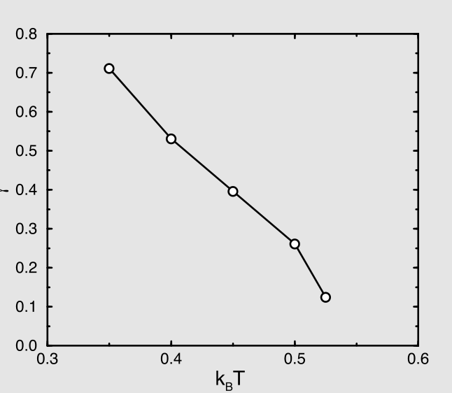

# 介观流体模型

本书描述的是经典分子模拟技术。聚焦于经典模拟意味着我们可以使用量子化学计算得到的原子和分子的性质与相互作用的结果，但我们不讨论量子计算本身。我们也不使用分子模拟来研究宏观现象，因为在这些现象中原子和分子的颗粒性质是不相关的，例如大尺度流动现象，或固体的宏观力学性质的描述。分子模拟可以用来预测这类材料的性质，例如粘度、热导率，或者在固体的情况下预测弹性常数（附录F.4）。但这也正是分子模拟的角色终点：我们不会考虑模拟瀑布或屈曲梁的计算技术。

然而，在实际中，微观世界与宏观世界之间的界限并不总是清晰的。有许多物理现象的例子需要将宏观描述与考虑物质颗粒性质的模型结合起来。例如界面附近的两相流，或固体中裂纹尖端的扩展。

微观与宏观交汇的另一个重要例子是胶体悬浮液的研究。胶体是典型的尺寸在10 nm--1 $\mu$m之间的介观粒子。这些粒子由数百万甚至数十亿个原子组成，因此这些物体最好用连续介质力学来描述。然而，胶体经历热运动，一组胶体在许多方面表现得就像一组巨原子：它们遵循统计物理的规律，其性质可以通过分子模拟来研究。然而，这类模拟不会关注胶体内部的原子，而是将胶体本身作为悬浮液的基本构建单元来处理。

当我们考虑这些胶体运动其中的溶剂时，情况变得更加复杂：显然，模拟溶剂的数百万或数十亿个分子将是极其昂贵的。然而，我们不能忽略溶剂，因为没有溶剂，胶体将做弹道运动，而实际上，溶剂的粘性阻力会迅速消除胶体的任何弹道运动。溶剂还驱动着胶体的热运动。此外，溶剂还负责胶体之间的流体动力学相互作用，即一个胶体的运动产生（瞬态）流场并影响其他胶体运动的现象。

使用连续介质（Navier-）Stokes方程来计算致密胶体悬浮液中所有的流体动力学相互作用是相当不便的，特别是在受限几何中。这就是为什么通常使用简化的、基于粒子的溶剂描述的原因：不是为了再现真实溶剂的分子性质，而是以最简单的方式同时考虑胶体的热运动及其在任意几何中的流体动力学相互作用。我们强调，上述引入溶剂粗粒化模型的考虑仅适用于胶体的动力学。对于静态性质，流体力学不起作用。因此，对于结构性质，隐式溶剂模型可以是合适的，前提是它们能充分描述溶剂对溶质粒子间有效分子间相互作用的影响。

硬球模型用于描述胶体悬浮液很好地说明了后一点。虽然硬球模型是作为原子液体的最简单模型被引入的^[18]，但在1980年代，人们发现它对硬球形胶体悬浮液的静态性质提供了相当真实的描述（参见例如^[209]）。

然而，Alder和Wainwright的硬球模型的动力学是牛顿式的，这意味着球体在碰撞之间的运动是纯弹道式的。这样的模型无法解释溶剂的流体动力学效应。然而，尽管我们不能忽略溶剂的存在，硬球形胶体的布朗运动几乎完全通过溶剂粘度依赖于溶剂的分子性质，即使对于致密悬浮液也是如此。此外，布朗扩散取决于温度，而温度是一个对分子细节完全不敏感的量。因此，如果我们对悬浮液的动力学感兴趣，任何能够再现溶剂热运动和粘度的溶剂模型都可以。上述评论凸显了构建基于粒子的溶剂模型的必要性，这些模型应尽可能简单，同时保持动量守恒并遵循Boltzmann统计。

最简单的这类模型，即理想气体，是不行的，因为理想气体粒子彼此之间从不碰撞：结果是，这种系统中的流动不会按照Navier-Stokes方程演化。然而，可以开发具有理想气体静态性质但同时经历碰撞的模型，结果是系统表现得像流体动力学流体。特别地，有两种模型属于这一类别。一种方法由Malevanets和Kapral于1999年引入^[675]。这种方法现在以随机旋转动力学（Stochastic Rotation Dynamics, SRD）的名称而广为人知，它是多粒子碰撞动力学（Multi-particle Collision Dynamics, MPC）^[677]这一更广泛类别模型的一个特例。

我们还将简要提及另一种描述具有热涨落的溶剂的方法，即格子Boltzmann方法。然而，在这个主题上我们将比较简短，因为它与本书其余部分描述的基于粒子的方法相当不同。此外，Succi已经撰写了一本专门讨论格子Boltzmann方法的优秀著作^[678]。

## 耗散粒子动力学

耗散粒子动力学（Dissipative Particle Dynamics, DPD）方法由Hoogerbrugge和Koelman^[679,680]引入，作为一种廉价的、基于粒子的溶剂模型。DPD方法的关键特征是，除了粒子间的保守力之外，它还包括粒子对之间动量守恒的摩擦力和随机力：

$$
\mathbf{F}_i = \sum_{j \neq i} \left[ \mathbf{f}^C(\mathbf{r}_{ij}) + \mathbf{f}^D(\mathbf{r}_{ij},\mathbf{v}_{ij}) + \mathbf{f}^R(\mathbf{r}_{ij}) \right].
$$

在大多数应用中，作用于给定粒子$i$的保守力可以写为成对力之和$\mathbf{f}_i^C = \sum_{j \neq i} \mathbf{f}_{ij}^C$，尽管存在多体力版本的DPD^[793]。耗散力$\mathbf{f}_{ij}^D$是纯摩擦的：它同时依赖于粒子$i$和$j$的位置及其相对速度：

$$
\mathbf{f}^D(\mathbf{r}_{ij},\mathbf{v}_{ij}) = -\gamma \omega^D(r_{ij})(\mathbf{v}_{ij} \cdot \hat{\mathbf{r}}_{ij})\hat{\mathbf{r}}_{ij},
$$

其中$\mathbf{r}_{ij} = \mathbf{r}_i - \mathbf{r}_j$，$\mathbf{v}_{ij} = \mathbf{v}_i - \mathbf{v}_j$，$\hat{\mathbf{r}}_{ij}$是$\mathbf{r}_{ij}$方向上的单位向量。$\gamma$是控制DPD粒子之间摩擦力强度的系数。$\omega^D(r_{ij})$描述摩擦系数随距离的变化。

随机力$\mathbf{f}^R(\mathbf{r}_{ij})$的形式为：

$$
\mathbf{f}^R(\mathbf{r}_{ij}) = \sigma \omega^R(r_{ij}) \xi_{ij} \hat{\mathbf{r}}_{ij}.
$$

$\sigma$决定DPD粒子之间随机成对力的大小。$\xi_{ij}$是具有高斯分布[^1]和单位方差的随机变量，且$\xi_{ij} = \xi_{ji}$，而$\omega^R(r_{ij})$描述随机力随距离的变化。

函数$\omega^R(r)$和$\omega^D(r)$不能独立选择。Español和Warren^[683]证明，为了确保系统构型和速度的Boltzmann采样，必须满足以下关系^[683]：

$$
\omega^D(r_{ij}) = \left[ \omega^R(r_{ij}) \right]^2,
$$

这表明$\omega^D(r_{ij})$不能为负值。在Langevin方程的精神下，$\gamma$和$\sigma$通过温度相关联：

$$
\sigma^2 = 2k_BT\gamma.
$$

我们在SI第L.13节中推导了这些关系。然而，摩擦与随机动量转移之间的关系的简单推导（式(7.1.6)至(7.1.8)）同样适用于当前情况，因为该关系对任何$\omega^D(r)$值都成立。然而，由于DPD模拟中的时间步长是有限的，我们应该注意在时间步中的哪个时刻计算摩擦。这个问题在中简要讨论。$\omega^R(r)$的$r$依赖性函数形式的可能选择将在例27中讨论。

乍一看，DPD方法与Langevin动力学（第7.1.1.3节）非常相似，因为两者都使用随机力和耗散力的组合。然而，在Langevin动力学中，摩擦力和随机力不守恒动量。在DPD中，摩擦力和随机力都不改变一对粒子的质心速度，因此算法保持动量守恒。动量守恒是在足够大的长度和时间尺度上恢复正确的"流体动力学"（Navier-Stokes）行为所必需的。Lowe^[258]提出了一种同时施加动量守恒和正确Boltzmann采样的替代方法（见第7.1.1.2节）。

我们仍然需要证明，在足够大的长度和时间尺度上，DPD流体遵循流体动力学的Navier-Stokes方程。目前，没有严格的证明表明这对任意DPD流体都成立[^2]。然而，所有现有的数值研究表明，在积分时间步$\delta t \to 0$的极限下，DPD流体的大尺度行为由Navier-Stokes方程描述。DPD流体输运性质的动理学理论^[685,794,683,795]支持这一结论。DPD模型的一个有趣极限是"耗散理想气体"，即没有保守力的DPD流体。这种流体的静态性质是理想气体的性质，但其输运行为是粘性流体的行为。

DPD相对于传统（原子级别）MD的优势在于它使用具有软分子间势的粗粒化模型（见SI，案例研究25）。这种模型在计算上是廉价的，因为它们允许相当大的时间步。软势在粗粒化模型中的适用性不仅限于简单流体：我们可以使用相同的方法来构建复杂液体构建单元的粗粒化模型。然而，如果我们只对复杂液体的静态性质感兴趣，我们可以使用具有相同保守力但没有耗散的模型进行标准MC或MD。DPD的真正优势体现在我们试图模拟复杂液体的动力学时。

### DPD实现

DPD模拟可以很容易地在任何可运行的分子动力学程序中实现。唯一的微妙之处在于运动方程的积分。由于粒子之间的力取决于它们的相对速度，标准的速度Verlet格式不能使用。

在最初的出版物中，Hoogerbrugge和Koelman^[679]使用Euler型算法来积分运动方程。然而，Marsh和Yeomans发现，使用这种算法，有效平衡温度取决于DPD模拟中使用的时间步^[685]。只有在时间步趋近于零的极限下，才能恢复正确的平衡温度。Groot和Warren^[682]使用修改的速度Verlet算法得到了类似的结果。然而，这些算法缺少一个重要特征。如果我们将DPD积分格式与分子动力学模拟中使用的格式进行比较，所有"好的"MD格式本质上都是时间可逆的，而上述DPD格式则不是。Pagonabarraga等人^[681]认为时间可逆性在DPD模拟中也很重要，因为只有使用时间可逆的积分格式才能满足细致平衡。在Leap-Frog格式中（见第4.3.3节），速度使用以下方式更新：

$$
\mathbf{v}(t + \Delta t/2) = \mathbf{v}(t - \Delta t/2) + \Delta t \frac{\mathbf{f}(t)}{m},
$$

位置使用以下方式更新：

$$
\mathbf{r}(t + \Delta t) = \mathbf{r}(t) + \Delta t\,\mathbf{v}(t + \Delta t/2).
$$

在DPD中，时刻$t$的力取决于时刻$t$的速度。时刻$t$的速度近似为：

$$
\mathbf{v}(t) = \frac{\mathbf{v}(t + \Delta t/2) + \mathbf{v}(t - \Delta t/2)}{2}.
$$

这意味着$\mathbf{v}(t + \Delta t/2)$出现在式(16.1.6)的两侧。

在Pagonabarraga等人的格式中，这些方程是自洽求解的；即从式(16.1.6)计算的$\mathbf{v}(t + \Delta t/2)$的值必须与用于计算时刻$t$力的$\mathbf{v}(t + \Delta t/2)$的值相同。这意味着我们必须在运动方程求解之前进行多次迭代。这种自洽格式意味着方程的求解方式保持了时间可逆性。

要理解时间可逆性与细致平衡的关系，我们将单个DPD步骤视为蒙特卡罗模拟中的一个步骤。如果我们只有保守力，DPD与标准蒙特卡罗相同。事实上，我们可以对DPD粒子使用混合蒙特卡罗格式（见第13.3.1节）。对于混合蒙特卡罗，必须使用时间可逆的算法来积分运动方程。在混合蒙特卡罗的情况下，细致平衡意味着如果我们反转速度，粒子应该返回其原始位置。如果不是这样，就不满足细致平衡。如果我们在DPD格式中使用非迭代格式来求解运动方程，我们在时刻$t$计算的速度与用于计算该时刻力的速度不一致。因此，如果我们反转速度，粒子不会返回其原始位置，细致平衡就不成立。

在例27中，DPD方法通过几个例子进行说明。在DPD方法中，单个溶剂分子的力被合并为移动流体单元之间的有效摩擦和涨落力。虽然这种方法不能提供分子运动的正确原子描述，但它的优点是能够在长长度和时间尺度上再现正确的流体动力学行为。

虽然DPD背后的思想很简单，但包含速度依赖力和位置依赖摩擦的运动方程的积分需要谨慎。位置依赖摩擦的问题在文献^[796,682]中讨论。不同的DPD算法在文献^[797]中进行了比较。

???+ example "例"
    **例27（耗散粒子动力学）。**为了说明DPD技术，我们模拟了一个包含两个组分（1和2）的系统。保守力是软排斥力，给出如下：

$$
\mathbf{f}_{ij}^C = \begin{cases}
a_{ij}\left(1 - r_{ij}\right)\hat{\mathbf{r}}_{ij} & r_{ij} < r_c \\
0 & r_{ij} \geq r_c
\end{cases},
$$

其中$r_{ij} = \|\mathbf{r}_{ij}\|$，$r_c$是势的截断半径。随机力由式(16.1.3)给出，耗散力由式(16.1.2)给出。粒子上的总力等于各个力之和：

$$
\mathbf{f}_i = \sum_{i \neq j} \left( \mathbf{f}_{ij}^C + \mathbf{f}_{ij}^S + \mathbf{f}_{ij}^R + \mathbf{f}_{ij}^D \right).
$$

为了获得正则分布，我们使用

$$
\begin{aligned}
\sigma^2 &= 2\gamma k_BT \\
\omega^D\left(r_{ij}\right) &= \left[\omega^R\left(r_{ij}\right)\right]^2.
\end{aligned}
$$

一个简单但有用的选择是^[682]：

$$
\omega^D\left(r_{ij}\right) = \begin{cases}
\left(1 - r_{ij}/r_c\right)^2 & r_{ij} < r_c \\
0 & r_{ij} \geq r_c
\end{cases}
$$

其中$r_c = 1$。模拟使用$\rho = 3.0$和$\sigma = 1.5$进行。我们选择了$a_{ii} = a_{jj} = 25$和$a_{ij,i \neq j} = 30$。该系统将分离为两相。在图16.1所示的例子中，我们选择$z$方向垂直于界面。图16.1的左半部分显示了两个组分的典型密度分布。在图16.1（右）中，我们绘制了共存相中某一组分的浓度。

 $k_BT = 0.45$时的密度分布。(右) 使用DPD和Gibbs系综模拟计算的相图。两种技术得到相同的相图，但Gibbs系综技术由于不存在表面需要更少的粒子。在DPD模拟中，我们使用了$10 \times 10 \times 20$（以$r_c^3$为单位）的盒子。积分时间步为$\Delta t = 0.03$。")

由于我们可以为DPD系统写出哈密顿量，我们也可以进行标准的蒙特卡罗模拟^[798]。例如，我们也可以使用Gibbs系综模拟（见第6.6节）来计算相图。正如预期的那样，图16.1显示两种技术给出了相同的结果。当然，由于界面的存在，在这种DPD模拟中需要更多的粒子。

热力学量仅使用保守力计算。系统的压力使用以下公式计算：

$$
p = \rho k_BT + \frac{1}{3V} \sum_{i>j} \left( \mathbf{r}_{ij} \cdot \mathbf{f}_{ij}^C \right).
$$

当DPD流体发生相分离时，形成包含不同流体相的两个平板，我们可以使用第5.1.6节中描述的技术计算相关的界面张力。图16.2显示了界面张力$\gamma$随温度的函数关系。显然，$\gamma$随温度升高而降低，并应在临界点处消失。当接近临界点时，形成表面的驱动力（表面张力）变得非常低，因此很难在小系统中形成稳定的界面。

更多细节，请参见SI（案例研究25）。

### 平滑耗散粒子动力学

耗散粒子动力学这个名称意味着在模拟过程中能量被耗散。在DPD模拟中能量不守恒这一事实对某些应用可能是一个缺点。例如，如果我们的系统中存在温度梯度，这种温度梯度在DPD模拟中只能通过人工方式维持^[799]。这个问题的一个早期解决方案是在DPD模拟中引入一个描述内能的附加变量^[693,692]，它对应于每个DPD粒子携带自己的内能"储库"。这个储库吸收或释放通常进入单个DPD粒子所代表的一组分子的内部自由度的能量。在碰撞过程中，这个储库的能量可以增加或减少。

随后，Español和Revenga^[694]提出了一种通用的"自上而下"方法来处理介观流体模型中的输运过程，基于光滑粒子流体动力学的思想^[695,696,696]。在这种语境下，自上而下意味着模型认真对待DPD粒子作为流体单元的概念，并赋予它们（恒定的）质量$m$、熵$S$和体积$V$。这些流体单元的能量通过如下形式的状态方程与基本热力学参数相关：$E_i = E(m,S_i,V_i)$，用户可以指定该方程以匹配被模拟系统的性质。$E$仅通过$m_i$、$S_i$和$V_i$的时间依赖性而依赖于时间，这意味着假设了局部热力学平衡。在光滑耗散粒子动力学（Smoothed Dissipative Particle Dynamics, SDPD）方法^[694]中，流体单元的体积是时间依赖的，因为它取决于粒子$i$周围的局部密度$\rho_i$：$V_i \equiv 1/\rho_i$

$$
\rho_i = \int \mathrm{d}\mathbf{r}\,\rho(\mathbf{r})W(\mathbf{r} - \mathbf{r}_i),
$$

其中$\rho(\mathbf{r}) \equiv \sum_j \delta(\mathbf{r} - \mathbf{r}_j)$，$W(\mathbf{r} - \mathbf{r}_i)$是归一化权重函数：

$$
\int \mathrm{d}\mathbf{r}\,W(\mathbf{r} - \mathbf{r}_i) = 1.
$$

注意粒子$i$周围的密度包括$i$本身：因此$\rho_i > 0$。$W$的一个方便选择^[694]在附录H中给出。

此外，体积单元中的熵产生由不可逆热力学^[57]给出的标准（宏观）方程描述，这些方程描述了由于（体积和剪切）粘性耗散和热流引起的熵产生。同样，决定这些项的参数可以从宏观输运方程中选择（受一些约束）。注意在这种方法中，熵流自然地表现为描述粒子熵$S_i$如何被传输的对流项。

SDPD的重要特征是它产生一个封闭的方程组，描述流动和耗散，重要的是，像DPD一样，还包括热噪声的效应——因此SDPD描述了受热涨落影响的流体动力学流体的动力学——并能够驱动溶质的热运动。SDPD的巨大优势在于它可以解释比DPD更广泛的输运现象（包括热输运），并且参数可以选择为使系统能够设计成模拟具有已知输运性质和已知状态方程的液体，至少在离散化误差变得不重要的极限下是如此。

然而，当模拟的目的是获得复杂的分子流体的合理的粗粒化描述时，SDPD方法不太适合，因为模型中的所有参数本质上都是宏观的，不反映微观分子间相互作用的任何细节。

关于一些实用细节，我们建议读者参阅附录H中的简要描述。关于更广泛的讨论，我们建议读者参阅Español和Revenga^[694]的论文以及Español和Warren^[797]的比较综述。

## 多粒子碰撞动力学

多粒子碰撞动力学（Multi-particle Collision Dynamics, MPC）一词指的是一类特别简单的介观流体模型。在MPC模型中，粒子在一个固定的时间步内进行弹道传播，然后在其邻域内与其他粒子进行动量和能量守恒的碰撞，邻域由周期性格子的单元格定义。

MPC方案的前身是所谓的直接模拟蒙特卡罗方法（Direct Simulation Monte Carlo Method, DSMC），由Bird^[698]提出。该方法是为模拟稀薄气体流动而开发的。在DSMC方法中，粒子在碰撞之间进行弹道运动。碰撞是随机进行的，即每个时间步的碰撞次数由指定密度和温度下的已知碰撞频率确定。为了选择碰撞伙伴，空间被划分为单元格。然后随机选择同一单元格内的成对粒子作为碰撞伙伴。精确的碰撞动力学取决于所使用的分子模型。然而，在所有情况下，碰撞都守恒线动量和能量。关于DSMC方法的更多细节，参见文献^[699,800]和^[701]。

Malevanets和Kapral^[675]在DSMC思想的基础上构建了复杂液体^[675]中溶剂的简单模型。文献^[675]的方法混合了DSMC风格的动力学和标准MD，因为大分子之间以及溶质和溶剂之间的力被显式考虑：

 在SRD模拟中，计算一个单元格中所有粒子相对于单元格质心速度的速度（中心单元格中的黑色箭头），然后绕任意角度$\alpha$均匀旋转。新的相对速度以灰色表示。相对速度的均匀旋转既不改变给定单元格中粒子的总动量，也不改变总动能。(b) 为了确保伽利略不变性，在每次多粒子碰撞之前，定义单元格位置的网格被随机向量（灰色箭头）移动。SRD碰撞随后在同一新单元格（虚线边框）中的粒子之间进行。")

分子动力学用于更新溶剂和溶质的位置和动量。溶剂-溶剂相互作用由弹道传播和随机碰撞表示：空间被划分为单元格，溶剂-溶剂碰撞在这些单元格内发生。然而，与DSMC不同，文献^[675]使用溶剂粒子之间的多体碰撞。在这种碰撞期间，单元格中粒子质心的运动保持不变，但对给定单元格内所有粒子的相对速度施加绕随机选择的轴的角度$\alpha$的均匀旋转（见图16.3(a)）。在不同单元格中进行的旋转是不相关的。由于旋转不改变相对速度的大小，总能量被守恒，而质心速度的守恒则保证了动量守恒。这些守恒定律无论SRD时间步的长度如何都得到满足。然而，SRD流体的输运性质确实取决于时间步和单元格中的平均粒子数——通常在3到20之间^[677]。

SRD算法不守恒角动量。通常这不是问题，但在某些情况下，例如Couette池中的两相流^[677]，它可能导致非物理的结果。如果碰撞单元格的网格保持固定，模拟将破坏伽利略不变性，特别是当平均自由程小于单元格大小时。为了恢复伽利略不变性，Ihle和Kroll^[702]建议在每次碰撞之前对碰撞单元格的网格施加随机移动（见图16.3(b)）。

SRD气体的输运性质存在解析表达式，对于高密度和低密度都相当准确（参见^[677]）。输运系数的值取决于密度、温度、时间步、单元格大小和旋转角度$\alpha$的值（参见^[677]）。由于SRD气体是理想气体，其状态方程就是理想气体定律。然而，模拟非理想气体的SRD模型的修改方案已经被提出（参见例如^[677]）。

将嵌入式物体（例如聚合物）的动力学与溶剂耦合的一种简单方法是将单体速度的更新包含在多粒子碰撞步骤中^[675]。建议选择单体质量等于单元格中溶剂粒子的平均质量。在SRD碰撞步骤之后，聚合物的内部动力学使用标准MD进行更新。

上述方法不太适用于较大的物体，例如胶体。在这种情况下，最好将大粒子描述为具有对溶剂施加无滑移边界条件的壁的硬物体。

为了模拟复杂几何中的流体流动，我们必须能够在壁处实现边界条件：通常是无滑移的。这涉及对算法的两项修改：首先，在弹道传播过程中撞击壁的SRD粒子被弹性地"反弹"回它们来的方向。但如果边界穿过网格的单元格，多粒子碰撞步骤也会改变：对于每次碰撞，在单元格位于壁内的部分放置具有零平均动量的Maxwell-Boltzmann速度分布的虚拟SRD粒子。这些虚拟粒子的数量被选择为使该单元格中的粒子总数等于平均值^[704]。关于实现细节和MPC方法的许多变体的描述，参见文献^[677]。

## 格子Boltzmann方法

格子Boltzmann（Lattice-Boltzmann, LB）方法^[705,801,707]不是基于粒子的方法，尽管它可以被视为流体格子气元胞自动机模型^[708]的预平均版本，后者是一种（离散的）基于粒子的模型。

将LB方法包含在对介观、基于粒子模拟的流体模型的简要描述中的原因是，如果将热涨落添加到流体的LB模型中，它可以同时解释流体动力学相互作用和溶解粒子的布朗运动。虽然LB模拟现在已经脱离了底层元胞自动机（Cellular Automaton, CA）图像，但参考该图像来解释LB方法的物理意义仍然是有帮助的。

在CA模型中，粒子存在于连接不同格点的链路上。每个格点通过$z$条链路与相邻格点连接，也可能连接到自身。在二维中，$z$通常等于6（三角格子），而在三维中，常用的模型有$z = 19$（具有12个最近邻、6个次近邻和一个自连接的FCC格子）。在单个时间步中，粒子沿链路从当前格点移动到相邻格点的对应链路上。"静止粒子"留在原处。

传播步骤对所有粒子同时进行。下一步是碰撞步骤。在碰撞期间，给定格点上的粒子总数和总动量（以及在某些模型中，总能量）保持不变，但除了这个约束之外，粒子可以改变其速度，速度值等于链路长度除以时间步。在选择碰撞规则方面有很大的自由度，只要它们保持格子的完全对称性。此外，链路的选择必须使得格子流体的粘度（一个四阶张量）能够被做成各向同性的。

元胞自动机模型可以模拟流体动力学行为。然而，CA是"嘈杂的"且存在许多其他实际缺点。此外，根据构造，格子模型缺乏伽利略不变性。格子Boltzmann（LB）方法被设计来克服格子气元胞自动机的部分（但不是全部）问题。

在其最简单的版本中，可以将LB模型视为格子气元胞自动机的预平均版本^[705]。在这种预平均中，给定链路上的粒子数被替换为该链路上的粒子密度。注意粒子数为零或一，但密度是实数。此外，如果碰撞算子（即描述格点碰撞后状态如何取决于碰撞前状态的函数）在粒子密度偏离其（局部）平衡值的偏差上线性化，则得到的方程大大简化。最后，没有必要将LB碰撞算子限制为可以从底层元胞自动机推导出的形式^[801,707]。然而，碰撞算子必须满足守恒定律和原始模型的对称性。

对于复杂流动的模拟，LB方法比原始元胞自动机模型效率高得多。然而，LB方法缺少一个方面，即由粒子数离散性引起的内禀涨落。这个问题由Adhikari等人^[709]解决了，他们展示了如何以一致的方式将涨落纳入LB模型，使得所有守恒定律都得到满足，涨落具有真正的热涨落的所有特征。

文献^[709]的涨落LB模型具有（宏观）分子溶液的介观模型中作为廉价溶剂模型所需的所有特征（流体动力学相互作用、热涨落）^[802]。当然，溶剂和悬浮粒子之间边界条件的正确实现需要特别小心——但对于这些方面，我们建议读者参阅Ladd^[286]的综述。关于LB方法的其他方面，该主题的标准著作是Succi^[678]的书。

---

[^1]: Groot和Warren^[682]发现具有单位方差的均匀分布给出了类似的结果。
[^2]: 在MD模拟中，许多看似显而易见的性质无法被严格证明。如果动量和质量守恒，且所有非守恒量的涨落都在微观长度和时间尺度上衰减，人们会期望Navier-Stokes图像成立。